# 第九章：与多人一起游戏

独自玩游戏很有趣。我花了很多时间探索异国世界，获得新技能，并在自己的故事中体验深刻的剧情。但与其他媒体形式相比，游戏真正闪耀的地方在于玩家能够创造自己的故事。没有什么比让他们与另一个人一起玩游戏更能让玩家创造自己的故事了。从在像《魔兽世界》或《火箭联盟》这样的游戏中合作和紧张的时刻互相帮助，到在像《使命召唤》或《Gran Turismo》这样的游戏中竞争和恐吓对方。人类行为仍然是一种比与一个完全虚构的世界互动更能引发情感的东西。

在本章中，我们将涵盖以下主要主题：

+   计算机网络速成课程

+   使用`MultiplayerSynchronizer`和`MultiplayerSpawner`

+   在多台计算机上运行游戏

在本章中，我们将实现网络化多人游戏。这意味着两个人将能够通过互联网一起玩游戏。现在，由于网络的工作方式，我们仍然想要保持安全，我们只能通过**局域网**（**LAN**）来玩游戏。这意味着连接到同一 Wi-Fi 网络的人将能够一起玩游戏。

你不想从你的个人电脑上运行一个全球可访问的服务器的原因很简单：你不想冒别人黑客攻击你的电脑的风险。尽管有安全地这样做的方法，但这超出了本书的范围。

# 技术要求

对于每一章，你都可以在 GitHub 仓库的该章节子文件夹中找到最终代码：[`github.com/PacktPublishing/Learning-GDScript-by-Developing-a-Game-with-Godot-4/tree/main/chapter11`](https://github.com/PacktPublishing/Learning-GDScript-by-Developing-a-Game-with-Godot-4/tree/main/chapter11).

# 计算机网络速成课程

在本节中，我想给你提供一个关于计算机网络的基础速成课程。因为 Godot 提供了很多开箱即用的功能，所以我们不需要成为完整的网络大师就能实现简单的多人游戏。这意味着你可以跳过这一节，直接开始实际的多玩家节点和代码实现。然而，如果你想要至少对为什么要以这种方式做事有一个高级的解释，我建议你继续阅读。

网络中的计算机通过分层模型相互通信。在最顶层，是最终的应用程序，即游戏。我们的游戏需要将信息从一个运行在某一台计算机上的游戏实例发送到另一个运行在另一台计算机上的游戏实例，也称为**另一台机器**。这一层被称为**应用层**。在这些计算机之间可能是一个庞大的互联服务器、路由器和其他网络基础设施的网络。这个网络是最低层，称为**物理层**。

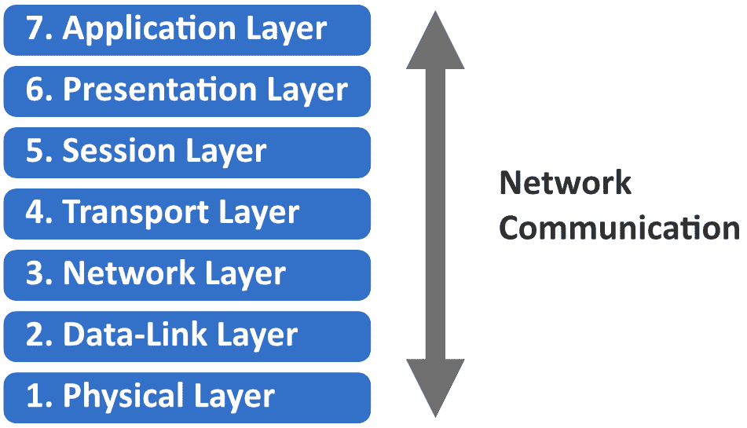

图 11.1 – 计算机网络的七层

在应用层和物理层之间，还有多个其他层。这些层确保数据能够在需要传输此数据包从计算机 A 到计算机 B 的所有链路之间发送和接收，并且每个层都服务于不同的目的。

虽然 Godot 为我们提供了大量的灵活性，但并非每一层对我们来说都同等重要。让我们更仔细地看看两个网络层：传输层和应用层。

## 传输层是什么？

我们首先将研究的是**传输层**，这是计算机网络的第四层。这个层在许多方面都负责决定如何将我们想要发送的数据切割成更小的数据包，并确保数据包从一端无损坏地接收至另一端。

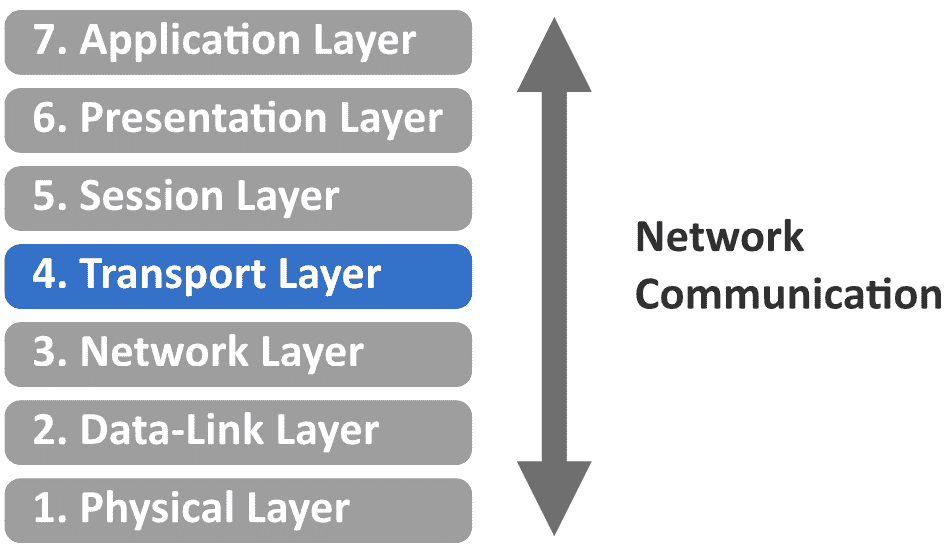

图 11.2 – 传输层是计算机网络中的第四层

为了履行这些职责，已经发明了不同的协议，它们能够以不同程度的可靠性来处理这些问题。**协议**基本上是一套规则，通过这些规则计算机可以相互通信。

例如，如果我们从计算机 A 向计算机 B 发送一组数据包，我们只需将其发送出去，并寄希望于最好的结果。然而，我们的数据包可能会在浩瀚的互联网中某个地方意外丢失。服务器忘记将数据从一条链路发送到另一条链路，电缆被拔掉，或者可能发生任何其他错误。

现在，我们如何确保我们发送的数据实际上到达了目的地呢？嗯，我们可以要求接收计算机进行确认。但是，如果确认信息丢失了呢？嗯，我们可以进行双重确认，每个通信参与者都进行一次。

所有这些规则只是解决了确保数据包被发送和接收的问题，但我们还需要克服许多其他问题。你可以看到，这些协议很快就会变得复杂。幸运的是，聪明的人已经为我们考虑到了所有这些。

在游戏领域，有两个主要的协议被使用：

+   **传输控制协议**（**TCP**）：TCP 是一种传输层协议，确保每个发送的数据包都会被接收。但要实现这一点，该协议需要花费更多的时间，来回发送确认信息。

+   **用户数据报协议**（**UDP**）：UDP 是一种传输层协议，它不关心数据包是否到达。它只是将它们发送到连接中，希望它们能够到达，其中大部分应该能够到达。这比 TCP 快得多，但可靠性较低。

Godot 引擎可以使用 TCP 或 UDP 操作，甚至可以根据保证交付的重要性在不同类型的数据之间切换。对于我们的游戏，我们将使用 UDP 和 TCP 来处理不同类型的数据。

## 什么是应用层？

应用层是网络层中的最高层。这是我们实际上在游戏中使用我们接收到的数据的时候。此外，在这里，我们有一个选择要做；尽管我们有数据，但我们如何组织我们连接的计算机呢？

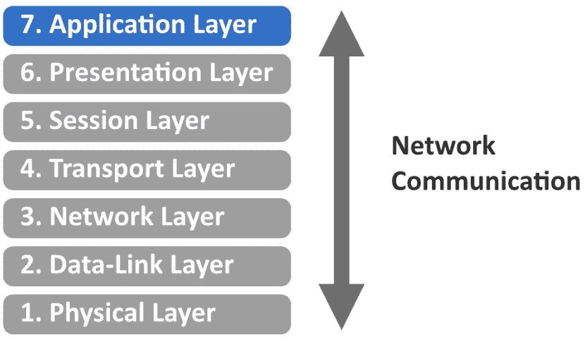

图 11.3 – 应用层是计算机网络中的第七层

对于游戏，有两种主要的网络架构：对等或客户端-服务器。

### 对等网络

在对等网络中，每台计算机都可以与其他任何计算机通信并询问它。它们都是平等的，都是对等体。例如，计算机 A 可以要求计算机 B 告诉它的玩家角色位于何处。然后计算机 B 将发送这些数据，以便计算机 A 可以向其用户显示计算机 B 的玩家角色在游戏世界中的位置。

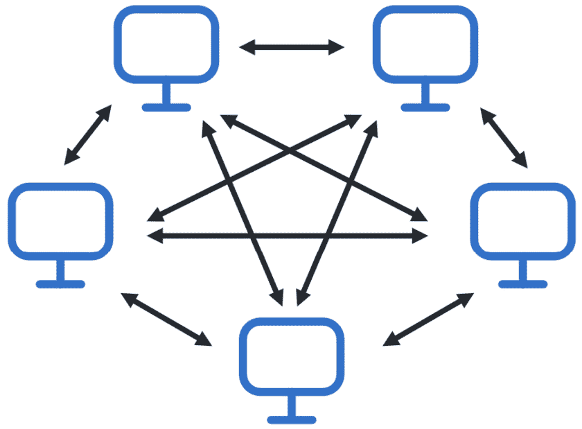

图 11.4 – 在对等网络中，每台计算机都可以与其他计算机通信

这种解决方案相当优雅，因为每台计算机都是平等的，并且拥有相同数量的权利。然而，我们还需要保持警惕，因为如果计算机 B 被黑客使用并欺骗其他计算机怎么办？计算机 B 不会根据游戏规则报告玩家的位置，而是给出无法到达的位置；也许它们会将其玩家角色传送到其他地方。这是一个相当大的问题。下一个网络架构试图解决这个问题。

### 客户端-服务器网络

而不是将每台计算机视为平等，我们可以将其中一台计算机作为所有通信的中心。每当网络中的任何计算机需要信息，例如另一台计算机的玩家角色的位置时，它们必须询问这台中央计算机。然后中央计算机将为其他计算机做出回答。

在这种情况下，我们将中央计算机称为服务器，将连接的计算机称为客户端。

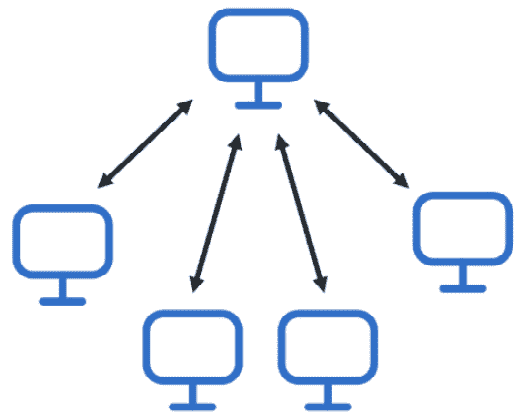

图 11.5 – 在客户端-服务器网络中，每台计算机都与服务器通信

使用这种架构，服务器可以检查所有客户端，并确保它们中没有作弊的。

## Godot 引擎中的网络

再次强调，Godot 引擎支持对等网络和客户端-服务器网络架构。为了简化操作，我们将采用客户端-服务器方法。这样，我们可以确保游戏的重要部分只在服务器上运行，而我们的客户端不必担心这些部分。例如，考虑计分——客户端可以轻易地撒谎，而现在服务器将是唯一记录分数的计算机。

好的，在这次关于计算机网络简短介绍之后，尽管还有很多东西要学习，但我们已经拥有了足够的底层结构知识，可以开始在游戏中实现多人游戏。

## 了解 IP 地址

在现实生活中，要给另一个人寄信，你需要知道他们的家庭地址。对于计算机网络来说，这几乎是相同的。要在计算机之间发送消息，我们需要知道它们的**IP 地址**。这是一个独特的地址，确保你可以找到任何连接到互联网的计算机。

目前，正在使用两种 IP 地址版本：用点分隔的`0`到`255`，如下所示：

```cpp
166.58.155.136
```

这种版本原本能够为 43 亿个设备提供唯一的地址。但结果是，人类已经如此高效，43 亿个设备可能还不够！如今，几乎任何电器设备都可以连接到互联网，甚至冰箱、烤面包机和手表。这就是为什么我们正在逐步过渡到 IPv6 地址，它支持 340 个十亿亿个设备。那就是 340 万亿个设备。

IPv6 地址看起来是这样的：

```cpp
e9fd:da7d:474d:dedb:d152:dce2:1294:2560
```

根据你的计算机如何连接到互联网，这个 IP 地址会时不时地改变，所以不要依赖它保持不变。

IP 地址就像一封可以寄出的信的邮政地址，但然后，我们仍然需要知道信是寄给家庭中的谁的。在计算机网络中，**端口**用于在计算机内部指定确切的应用程序。让我们接下来谈谈端口。

## 使用端口号

一个 IP 地址，无论是 IPv4 还是 IPv6，仅表示数据要发送到的位置。但是，计算机有众多应用程序，每个都需要自己的连接。因此，从数据接收的那一刻起，我们应该将其发送到哪个应用程序呢？嗯，每个应用程序都可以使用不同的端口，这些端口就像火车站的不同平台。尽管每列火车都到达同一个车站，但它们到达的是不同的站台。

每个应用程序都可以选择一个端口，它只是一个从`0`到`65535`的数字。然而，前 1,024 个是为标准计算机功能保留的，我们无法选择这些。

要指定发送数据到哪个端口，我们可以在 IP 地址的末尾添加端口号，后面跟着一个冒号：

```cpp
166.58.155.136:5904
e9fd:da7d:474d:dedb:d152:dce2:1294:25605904.
			Now that we know about the basic mechanisms of computer networking, such as the different layers and how IP addresses work, we are able to start implementing multiplayer into our game. So, let’s give that a shot!
			Setting up the base networking code
			In the *A crash course in computer networking* section, we saw that we wanted to set up a client-server network architecture and that we could use IP addresses and ports to find computers over the internet. In this section, we’ll start implementing this.
			We’re going to make our multiplayer game work like this: every time you start playing, it spins up a server in the background. This way, anyone can join after one person starts the match.
			Creating the client-server connection
			If we want to connect our players through a client-server model, we need to be able to set up one computer as a server and the others as clients that connect to this server. Let’s start by writing some code.

				1.  In the `menu.gd` script, add a constant at the top that indicates which port we want to use:

    ```

    const PORT: int = 7890

    ```cpp

    				2.  Now add these two functions to the bottom of the script:

    ```

    func host_game():

    var peer = ENetMultiplayerPeer.new()

    peer.create_server(PORT)

    if peer.get_connection_status() == MultiplayerPeer.CONNECTION_DISCONNECTED:

    return

    multiplayer.multiplayer_peer = peer

    func connect_to_game(ip_address: String):

    var peer = ENetMultiplayerPeer.new()

    peer.create_client(ip_address, PORT)

    if peer.get_connection_status() == MultiplayerPeer.CONNECTION_DISCONNECTED:

    return

    multiplayer.multiplayer_peer = peer

    ```cpp

    The `host_game()` function will use the `ENetMultiplayerPeer` class to create a new server using the `create_server()` function that is defined on it. To create this server, we only have to specify on which port we want to receive the data. Once this is done, we check whether the connection status is disconnected; if we are not connected, then we need to return from the function. We can check the connection status using the `get_connection_status()` function on the `peer` object.

    				3.  Lastly, we set this peer as `multiplayer_peer`, which is defined on the multiplayer global variable.

    The `connect_to_game()` function does largely the same but creates a client using the `create_client()` function on the `ENetMultiplayerPeer` `peer` object. The `create_client()` function takes an IP address and port. These will, of course, be the IP address and port of the server.

			With these two functions in place, we can add some more UI to connect to the right server.
			Adding UI
			Now, for the menu, we want to be able to start a game that will set up a server or input an IP address to join an already hosted game. We won’t have to let the player choose a port, both because it’s less of a hassle for the player and because we don’t want them to accidentally choose an invalid port number. We, the programmers, decide we are going to use port `7890`.
			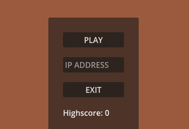

			Figure 11.6 – The main menu with an input field to specify an IP address

				1.  Open up the `menu.tscn` scene.
				2.  Add a `LineEdit` node in `VBoxContainer`, which holds the play and exit buttons, and rename it `IpAddressLineEdit`.
				3.  Place `IpAddressLineEdit` under the `PlayButton` node, but not as a child.

			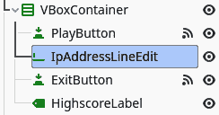

			Figure 11.7 – The main menu scene tree with the added IpAddressLineEdit

				1.  Select the `IpAddressLineEdit` node and set `IP ADDRESS`. This will show some placeholder text that will get replaced the moment the user puts anything into the line edit.

			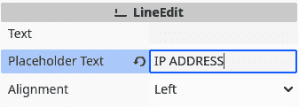

			Figure 11.8 – Setting Placeholder Text in a LineEdit node

				1.  Now, in the `menu.gd` script, cache the `IpAddressLineEdit` at the top:

    ```

    @onready var _ip_address_line_edit = $CenterContainer/MainUIContainer/PanelContainer/MarginContainer/VBoxContainer/VBoxContainer/IpAddressLineEdit

    ```cpp

    				2.  Lastly, we need to change the `_on_play_button_pressed()` function to host or connect to a game:

    ```

    func _on_play_button_pressed():

    if _ip_address_line_edit.text.is_empty():

    host_game()

    else:

    connect_to_game(_ip_address_line_edit.text)

    get_tree().change_scene_to_file("res://screens/game/main.tscn")

    ```cpp

			With all this in place, we have all that is needed to set up the client-server architecture. One computer will be the server and the others, the clients. Before we dive into the things we have to change in the code of the game itself, such as spawning playable characters for every person joining and then making sure the position of each player is synchronized between each computer, we can try out what we have already created.
			Running multiple debug instances at the same time
			To debug a multiplayer game, we need to be able to run our game multiple times in debug mode. Luckily, Godot Engine has a handy feature that allows us to run as many instances of our game as we want at the same time.

				1.  Click **Debug** in the top menu bar.
				2.  Under the **Run Multiple Instances** menu, choose **Run** **2 Instances**.

			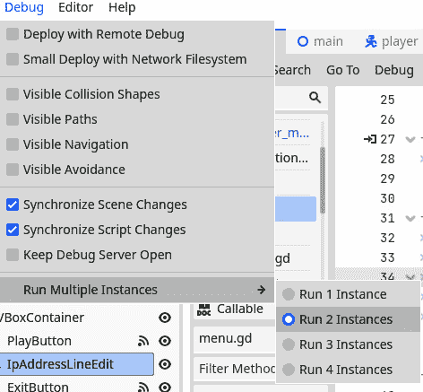

			Figure 11.9 – In the Debug dropdown menu, we set the number of instances we want to run

				1.  Run the project. This will make two instances of the game pop up at the same time.
				2.  In one instance, just press **Play**. The game should start up normally.
				3.  In the other instance, type `::1` in the IP address input field and then press **Play**.

			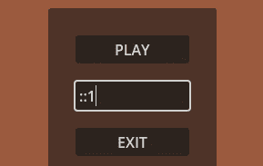

			Figure 11.10 – Specifying the ::1 IP address will loop back to the same computer
			Unfortunately, you won’t see anything special happen. We still need to account for multiple players in our game code, but normally, there should be no errors in the bottom **Debug** panel.
			Local host IP address
			There is a special IP address that does not go to another computer but rather loops back to the same computer again. In the IPv6 format, this address is `::1`, and for IPv4, it is `127.0.0.1`.
			You’ll also see that there are now multiple tabs in the **Debug** panel, one for each instance of the game. This way, we will be able to debug each separately.
			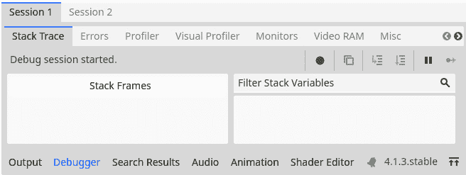

			Figure 11.11 – When running multiple instances, we’ll also have multiple Debug tabs
			Now that we are able to create a server and connect clients, let’s start by making our game multiplayer compatible and synchronizing spawned scenes between both games.
			Synchronizing different clients
			Until now, we learned about computer networking and set up a connection between multiple instances of our game. The next step is to change the scenes and code within our game to account for multiple players. We want to accomplish two things:

				*   Firstly, if the server instances a new scene, such as a new projectile, we want that scene to be instanced on every client
				*   Secondly, we want to synchronize values, such as the position of each player character, between all clients

			We’ll first look at which Godot Engine nodes can help us achieve these two goals while updating the player character to be used in multiplayer. After that, we’ll update the entity spawner, enemy, collectible, and projectile scenes, too. Most of these changes will be quite small.
			Updating the player scene for multiplayer
			Because the player is the most important entity in the game, let’s start by updating them for multiplayer. This way, we can quickly make sure everything is working correctly, too.
			Using MultiplayerSpawner to spawn player scenes
			To synchronize instanced scenes between the server and the clients, Godot Engine has a node called `MultiplayerSpawner`. It will listen to the scenes that are getting added to the scene tree and will replicate them on each of the other clients, too. Let’s add one to the main game scene:

				1.  Open the `main.tscn` scene.
				2.  Under the root `MultiplayerSpawner` node, and call it `PlayerMultiplayerSpawner`, because it will be spawning new player characters.

			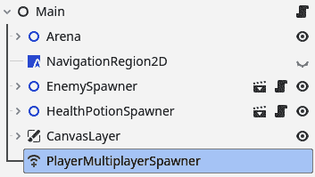

			Figure 11.12 – The main.tscn scene tree with an added PlayerMultiplayerSpawner

				1.  Now, in the inspector window for `PlayerMultiplayerSpawner`, press `player.tscn` scene into that element.

			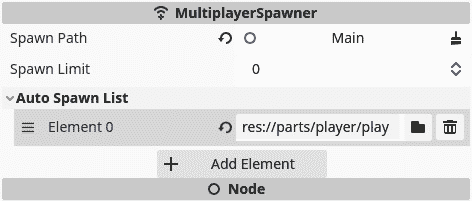

			Figure 11.13 – Add the player.tscn scene as an element in PlayerMultiplayerSpawner

				1.  Now, to specify positions at which our players can spawn, add `Node2D`, called `PlayerStartPositions`, under the `Main` node with different `Marker2D` nodes where we can spawn players. Place each marker at a good spot to start a player from.

			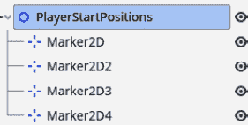

			Figure 11.14 – The PlayerStartPositions node with Marker2D to spawn players at

				1.  In the `main.gd` script, we’ll cache the player scene in an export variable. So, add the following line of code at the top and drag the `player.tscn` scene into this export variable in the inspector, too:

    ```

    @export var player_scene: PackedScene

    ```cpp

    				2.  Also, cache the `PlayerMultiplayerSpawner` node in a variable called `_player_multiplayer_spawner` and `PlayerStartPositions` in a variable called `_player_start_positions`:

    ```

    @onready var _player_multiplayer_spawner: MultiplayerSpawner = $PlayerMultiplayerSpawner

    @onready var _player_start_positions: Node2D = $PlayerStartPositions

    ```cpp

    				3.  We’ll also add a variable at the top of the script that specifies what position we will spawn the next player at. With this variable, we will select which `Marker2D` to use as to location to spawn each player at:

    ```

    main.gd 脚本：

    ```cpp
    func add_player(id: int):
       _player_multiplayer_spawner.spawn(id)
    func spawn_player(id: int):
       var player: Player = player_scene.instantiate()
       player.multiplayer_id = id
       player.died.connect(_on_player_died)
       var spawn_marker: Marker2D = _player_start_positions.get_childr(_player_spawn_index)
       player.position = spawn_marker.position
       _player_spawn_index = (_player_spawn_index + 1) % _player_start_positions.get_child_count()
       return player
    ```

    ```cpp

    				4.  To use these functions, we’ll add a `_ready()` function to the `main.gd` script:

    ```

    func _ready():

    _player_multiplayer_spawner.spawn_function = spawn_player

    if multiplayer.is_server():

    multiplayer.peer_connected.connect(add_player)

    add_player(1)

    ```cpp

    				5.  Lastly, but very importantly, delete the `Player` node that is already in the `main.tscn` scene. We do this because we’ll spawn each player character from code and so they don’t need the node to be in there already.

			In the `add_player()` function, we simply ask `_player_multiplayer_spawner` to spawn a new instance of the player scene.
			Then, in the `spawn_player()` function, which will be used by the `PlayerMultiplayerSpawner` to spawn new `Player` scenes, we instantiate a new player scene and set its `multiplayer_id` property to the  ID that we received as a parameter. This ID is used to determine which client owns that particular player node. We’ll use it in the next section. Afterward, we must return the new player instance so that the `PlayerMultiplayerSpawner` can handle the rest for us.
			We use the `_player_spawn_index` variable to select which `Marker2D` to select in `PlayerStartPositions`. After each player spawned, we increment this variable with `1` and make sure it loops back around with the `%` operator. This makes sure that we don’t spawn players on top of each other.
			In the `_ready()` function, first, we set `spawn_function` for `_player_multiplayer_spawner` to be the `spawn_player()` function that we defined. This way, the multiplayer spawner knows how to create new instances of the player scene.
			Then, you see that we check the `multiplayer` object if this code is being run on the server, using `multiplayer.is_server()`. This `is_server()` function returns `true` if the code is run on the server.
			If we are running on the server, we do the following:

```

multiplayer.peer_connected.connect(add_player)

```cpp

			`peer_connected` is a signal that is thrown by the `multiplayer` object when a new peer (a new client) connects to the server. Instead of connecting through the editor, like we used to do for detecting whether the player is close to the collectibles, we directly call the `connect()` function on this signal and pass along the function that we want to execute when a player connects to the server, which is the `add_player()` function.
			After connecting to the `peer_connected` signal, we call the `add_player()` function with `1` as `id`, which is the default ID for the server.
			We will not yet be able to run the game for now, first, we need to update the player scene.
			Updating the player code for multiplayer
			When you try running the game with multiple instances at the end of the last section, you will notice that there are some things off, mainly that, on each client separately, you control both players at the same time.
			This behavior happens because, although we spawn a player per client, all code gets run all the time on each client separately. We have to specify that the movement code for each player character should only be run on the client associated with that player character, not all at once on all clients. Afterward, we should synchronize the position to the server.
			We’ll do this by setting the **multiplayer authority** of the player character node. This authority “owns” this node and decides how it behaves.
			So, let’s alter our code so the players work properly:

				1.  Firstly, add the `multiplayer_id` variable that we used in the last section somewhere at the top of the `player.gd` script:

    ```

    var multiplayer_id: int

    ```cpp

    				2.  Add an `_enter_tree()` function; this function is a life cycle function that gets called when the node enters the tree, right before the `_ready()` function. In this function, we set the multiplayer authority to the client that has the same ID as `multiplayer_id` of this player node:

    ```

    func _enter_tree():

    set_multiplayer_authority(multiplayer_id)

    ```cpp

    				3.  Cache the `CameraPosition` node at the top of the script:

    ```

    @onready var _camera_position: Node2D = $CameraPosition

    ```cpp

    				4.  Now, update the `_ready()` function like this:

    ```

    func _ready():

    update_health_label()

    if not multiplayer.is_server():

    _shoot_timer.stop()

    if not is_multiplayer_authority():

    _camera_position.queue_free()

    set_physics_process(false))

    ```cpp

			In *step 2*, we set the multiplayer authority for a node, which means that we determine which client is the owner of this node. For most nodes in multiplayer, the server should be the owner. But the player character is so important to each client that we give the authority of each to their respective client.
			After that, we use `multiplayer.is_server()` to stop `_shoot_timer` when we are not running on the server. This way, we make sure that projectiles only get spawned on the server side and replicated to all clients from there.
			Next, we use `is_multiplayer_authority()` to check whether we are the authority of this specific player node. If we are not, we free `_camera_position`. We don’t need multiple cameras, only the one that is used to track the player we want to see, and we also disable the `_physics_process()` function. Only the client that owns this node will have to calculate this player’s position and then report back to the server where the player is.
			Disabling the _process() and _physics_process() functions
			By default, the `_process()` and `_physics_process()` functions get called on each frame and physics frames, respectively. However, we can choose to enable or disable them manually by calling `set_process()` and `set_physics_process()` along with a Boolean that says whether they should run or not.
			After all this, you can run the game with multiple instances, like we saw in the *Running multiple debug instances at the same time* section, and you should see a second player spawn! Each player is able to move properly, but their positions are unfortunately not synchronized. We’ll do that next.
			Synchronizing the players’ positions and health
			We can spawn scenes across clients and determine on which client certain pieces of code should run. The last piece of the puzzle is to synchronize certain variables, like the position and health of our players. Luckily, this is actually very easy to do using the `MultiplayerSynchronizer` node. We are going to use two of these, one for the position and one for the health. Although one synchronizer can synchronize multiple variables, we want the position to be managed by each client individually and the health to be managed by the server:

				1.  In the `player.tscn` scene, add two `MultiplayerSynchronizer` nodes under the root `Player` node. Call on `PositionMultiplayerSynchronizer` and the other `HealthMultiplayerSynchronizer`.

			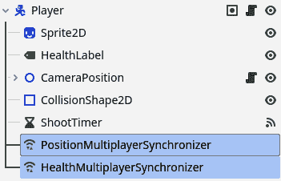

			Figure 11.15 – The player.tscn scene tree after adding two MultiplayerSynchronizer nodes

				1.  Select `PositionMultiplayerSynchronizer` and a new panel should appear at the bottom of the editor.

			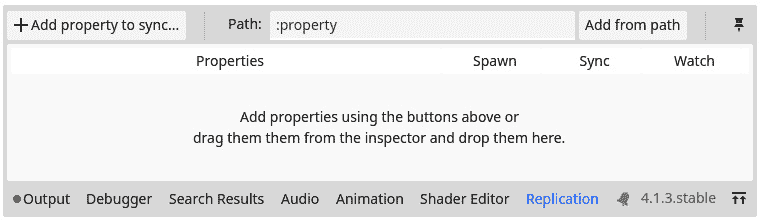

			Figure 11.16 – The Replication panel that opens up when selecting MultiplayerSynchronizer

				1.  Here, press **+ Add property** **to synchronize**.
				2.  Select the `Player` node and press **OK**.

			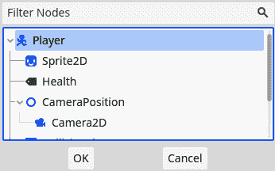

			Figure 11.17 – Select the Player node to synchronize one of its values

				1.  Now, search for the `position` property and press **Open**.

			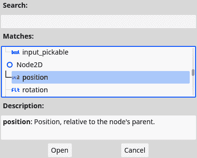

			Figure 11.18 – Select the position property to synchronize its value

				1.  Do *steps 2* to *5* again but add the `health` property to `HealthMultiplayerSynchronizer` this time.

			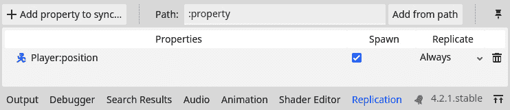

			Figure 11.19 – The Replication panel tracking the position value of the Player node

				1.  Now, update the `_enter_tree()` function of the player so that we give the multiplayer authority of `HealthMultiplayerSpawner` to the server:

    ```

    func _enter_tree() -> void:

    set_multiplayer_authority(multiplayer_id)

    1. 因此，为了将权限赋予服务器，我们将 HealthMultiplayerSynchronizer 的多玩家权限设置为 1。

    ```cpp

			That is all we need to do to synchronize values between different clients. `MultiplayerSynchronizer` simply tracks them for us.
			Running two instances of the game and connecting them finally shows that if we move one player character in one client, it also moves that player character in the other client.
			Now that we updated the hardest scene to multiplayer, the player scene, we have all the knowledge to do the same for the remaining scenes. Let’s dive in so that we have a complete multiplayer game at the end!
			Synchronizing EntitySpawner
			To make sure the enemy and health potion scenes are spawned on each client when the entity spawner wants to, we’ll have to make a few little adjustments to the `EnitySpawner` scene:

				1.  In the `entity_spawner.tscn` scene, add a `MultiplayerSpawner` node.

			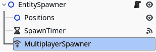

			Figure 11.20 – The EntitySpawner scene tree after adding MultiplayerSpawner

				1.  In the `entity_spawner.gd` script, cache the `MultiplayerSpawner` node:

    ```

    @onready var _multiplayer_spawner = $MultiplayerSpawner

    ```cpp

    				2.  Then, in the `_ready()` function, let’s add the scene this spawner uses to this `MultiplayerSpawner` node and only start the timer if we are running on the server. This ensures that not every client is spawning new entities, only the server:

    ```

    func _ready():

    _multiplayer_spawner.add_spawnable_scene(entity_scene.resource_path)

    if multiplayer.is_server():

    start_timer()

    ```cpp

    				3.  One last thing we need to do is change the exact way we add the `new_entity` to the scene. So, change the line with `add_child(new_entity)` to the following:

    ```

    add_child(new_entity, true)

    ```cpp

			In *step 3*, we add a spawnable scene to the `MultiplayerSpawner` node. This is very convenient as now we can add any scene on the fly.
			In *step 4*, we supply the Boolean `true` as a second parameter to the `add_child()` function, next to the node that we want to add to the scene tree. This indicates that we want to use human-readable names for each node, names that are easy for humans to read. When we don’t set this Boolean to `true`, the engine will pick a name for the node. These names look like `@Node2D@2`. These are reserved names that cannot be synchronized using a `MultiplayerSpawner` node. When we do set this Boolean to `true`, each new instance gets nicely named, for example, `Enemy2`, `Enemy3`, and so on. In a multiplayer scenario, this is important for the server to properly synchronize scenes and values between them.
			Now that we can synchronize the spawned entities of enemies and collectibles between clients, let’s synchronize their behavior, too.
			Synchronizing the enemy and collectibles
			For both the enemy and all collectibles, making them work with multiplayer is quite easy and straightforward:

				1.  Add `MultiplayerSynchronizer` to the `enemy.tscn` and `collectible.tscn`.

			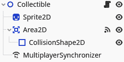

			Figure 11.21 – The scene tree of the Collectible after adding MultiplayerSynchronizer

				1.  Now, add the `position` property of the root node in the **Replication** menu at the bottom.

			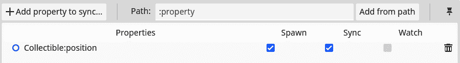

			Figure 11.22 – The Replication panel tracking the position of the Collectible node
			That is about it for `Collectible`, while for `Enemy`, we need to do some last things in the code:

				1.  Cache `PlayerDetectionArea` at the top of the `enemy.gd` script:

    ```

    @onready var _player_detection_area: Area2D = $PlayerDetectionArea

    ```cpp

    				2.  Now, update the `_ready()` function like this:

    ```

    func _ready():

    if not multiplayer.is_server():

    set_physics_process(false)

    _player_detection_area.monitoring = false

    return

    var player_nodes: Array = get_tree().get_nodes_in_group("player")

    if not player_nodes.is_empty():

    target = player_nodes.pick_random()

    ```cpp

			The first thing we do in the `_ready()` function of the enemy is disable the `_physics_process()` function and `_player_detection_area` if we are not running them from the server. This makes sure that enemies are fully controlled by the server.
			The `Area2D` nodes have a property, `monitoring`, that stops looking for collisions with other areas or bodies when set to `false`. This is what we are using here to disable `_player_detection_area` on other clients than the server.
			Lastly, we want to be able to target any of the players in the game, so we change how to target a player. The `pick_random()` function on an array will pick any element within that array at random and return it. This is ideal for picking a random player within the scene!
			Let’s now look at how we can synchronize the projectiles.
			Synchronizing the projectile
			The last scene we need to synchronize between the multiple clients is the one of the projectiles. So, let’s do that with the following steps:

				1.  In the `projectile.tscn` scene, add `MultiplayerSynchronizer`.

			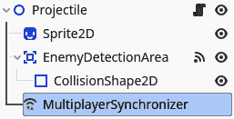

			Figure 11.23 – The scene tree of Projectile after adding MultiplayerSynchronizer

				1.  This time, synchronize both the `position` and `rotation` properties.

			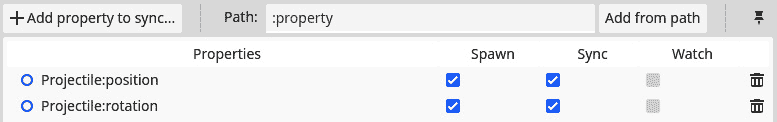

			Figure 11.24 – The Replication panel tracking the position and rotation of the Projectile node
			Cache `EnemyDetectionArea` at the top of the `projectile.gd` script:

```

@onready var _enemy_detection_area: Area2D = $EnemyDetectionArea

```cpp

				1.  Now, add a `_ready()` function as follows:

    ```

    func _ready():

    if not multiplayer.is_server():

    set_physics_process(false)

    _enemy_detection_area.monitoring = false

    ```cpp

    				2.  We need to change the way the projectile is added to the scene within the `player.gd` script from `get_parent().add_child(new_projectile)` to the following:

    ```

    get_parent().add_child(new_projectile, true)

    ```cpp

			Important note
			Remember that the last parameter of the `add_child()` function is a Boolean that determines that the name of the new node should be human readable.

				1.  Lastly, we need to make sure that the `projectile.tscn` scene is replicated in the main scene, just like we did for the `player.tscn` scene. Add a `MultiplayerSpawner` node in the `main.tscn`, call it `ProjectileMultiplayerSpawner`, and add `projectile.tscn` in **Auto** **Spawn List**.

			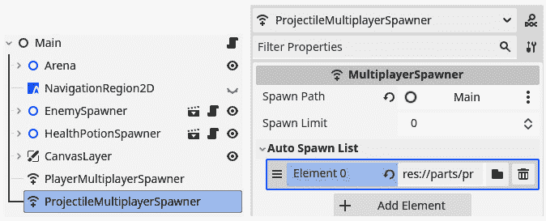

			Figure 11.25 – Main scene with ProjectilMultiplayerSpawner with the projectile.tscn scene
			That is it for the `Projectile` scene and thereby all the scenes important to playing the game itself! You can now run multiple instances of the game and everything within the game should be synchronized. The last thing we’ll need to look at is synchronizing the timers within the game and the game-over menu for both players.
			Fixing the timer and end game
			The last thing we need to adjust for multiplayer is the timer that times our run and the end of the game, stopping the entity spawners and showing the game-over menu. So, let’s get started on this last effort.
			Synchronizing the timer
			To synchronize the score timer, we simply have to do the following three things:

				1.  Add `MultiplayerSynchronizer` to the `main.tscn` scene.

			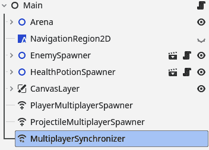

			Figure 11.26 – The Main scene tree after adding MultiplayerSynchronizer

				1.  Synchronize the `_time` property of the `Main` node.

			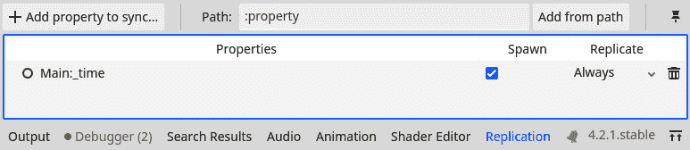

			Figure 11.27 – The Replication panel tracking the _time property of the Main node

				1.  Now, disable the `_process()` function from within `_ready()` if we are not running on the server:

    ```

    func _ready():

    # 其他代码

    if not multiplayer.is_server():

    set_process(false)

    ```cpp

			That is all we need to do synchronize the timer across all clients.
			Synchronizing the end of the game
			To make sure that when the game ends, it ends for all clients, let’s do the following:

				1.  In the `main.gd` script, let’s connect to each player character’s `died` signal in the `add_player()` function:

    ```

    func add_player(id: int):

    var player: Player = player_scene.instantiate()

    player.name = str(id)

    add_child(player)

    _on_player_died() 函数和添加一个新函数 end_game():

    ```cpp
    func _on_player_died() -> void:
       end_game.rpc()
    @rpc("authority", "reliable", "call_local")
    func end_game():
       _game_over_menu.show()
       _enemy_spawner.stop_timer()
       _health_potion_spawner.stop_timer()
       set_process(false)
       Highscore.set_new_highscore(_time)
    ```

    ```cpp

    				2.  Then, in the `menu.gd` script, change the `_ready()` function to the following:

    ```

    func _ready():

    _highscore_label.text = "Highscore: " + str(Highscore.highscore)

    if multiplayer.has_multiplayer_peer():

    multiplayer.multiplayer_peer.close()

    ```cpp

			In the first step, we simply connect to each player’s `died` signal through code.
			Important note
			Note that only the server connects to the `died` signal because it is the server that manages the game loop.
			In the second step, we do something very interesting. We call the `end_game()` function through **RPC**, which means that we call it on every client at the same time!
			Important note
			**Remote procedure call** (**RPC**) is a protocol that makes functions directly callable over different clients. This makes it easy to execute the same code on all connected instances of the game at the same time.
			You can see that we use the `@rpc` annotation right before the `end_game()` function. This is to indicate how we would like this function to be handled when calling on every client at once. The strings we pass it along mean the following:

				*   `"authority"`: Only the one with authority, the server, in this case, can call this function.
				*   `"reliable"`: We want this command to be sent reliably over the network, using TCP.
				*   `"``call_local"`: This function, when called, should be executed on all clients, including the one that called it.

			This means that the game-over menu will be shown on every client from the moment one of the players dies.
			In the third step, we simply close the multiplayer connection, when there is one, and we open up the main menu. This way, we make sure we don’t stay connected while we are not playing anymore.
			Now that the whole game is ready to be played in multiplayer, let’s get started on actually running it on multiple machines at the same time!
			Running the game on multiple computers
			Until this point, we’ve been running multiple instances of our game on the same machine. But the strength of multiplayer comes from playing with multiple people over multiple machines.
			In this section, we’ll start off by showing the server’s IP address on screen and then look into how we can run a debug instance on multiple computers at the same time so they can connect.
			Showing the IP address of the server
			We have been using `::1` as the IP address that loops back to the same computer so that we can debug our game. However, before we can connect to another computer over a network, we need to know their real IP address. To do this, we’ll show the server’s IP address on the screen when they are hosting a game.
			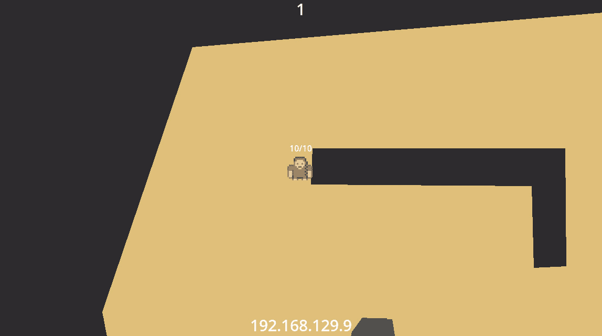

			Figure 11.28 – The server has an IP address displayed at the bottom of the screen to connect
			In *Figure 11**.28*, you can see that we want to show the IP address at the bottom of the screen. Let’s get to it:

				1.  In the `main.tscn` scene, add `CenterContainer` with `Label` as a child, just like we did for the timer. Give them names like in *Figure 11**.29*.

			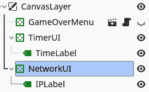

			Figure 11.29 – The CanvasLayer node with NetworkUI

				1.  Now, in the `main.gd` script, cache `IPLabel` at the top:

    ```

    @onready var _ip_label = $CanvasLayer/NetworkUI/IPLabel

    ```cpp

    				2.  Next, add this function that shows the local IP address:

    ```

    func show_local_ip_address():

    var addresses = []

    for ip in IP.get_local_addresses():

    if ip.begins_with("10.") or ip.begins_with("172.16.") or ip.begins_with("192.168."):

    addresses.push_back(ip)

    if not addresses.is_empty():

    _ip_label.text = addresses[0]

    ```cpp

    				3.  Now, call this function in the `_ready()` function, but only if we’re running on the server:

    ```

    func _ready():

    if multiplayer.is_server():

    show_local_ip_address()

    # …

    ```cpp

			Don’t worry too much about the implementation of the `show_local_ip_address()` function. The basis is that it will search for the local IP address by scanning all the network addresses of the current computer and saving the ones that start with `"10."`, `"172.16."`, or `"192.168."`, which are the know beginnings for local IP addresses. The reasons why it works are a little obscure and beyond the scope of this book.
			Now that we know what IP address the server has, let’s see how we can actually set everything up to connect two computers together.
			Connecting from another computer
			The big caveat for now, which we already mentioned in the introduction of the chapter, is that we will not be able to play over the real worldwide internet. This is because of multiple security reasons; you wouldn’t want strangers to have direct access to your computer. However, we will be able to play on the same local network. This means that two computers that are connected to the same router, the same Wi-Fi network, and so forth, will be able to connect to each other in the game! All we’ll have to do is the following:

				1.  Transfer the complete Godot project to another computer. You can do this any way you like. With a USB, using an online platform such as Dropbox, Google,Drive, or any other means of transferring files.
				2.  Make sure both computers are connected to the same local network.
				3.  Open the project in the same Godot Engine version as you are using.
				4.  Run a debug instance of the game on each computer.
				5.  Press play on one computer, making it the server. Use the IP address the server displays to connect to the other clients.

			Now, you should be able to play together over the network!
			That is all for connecting multiple computers. We’ll proceed with a summary of the chapter, but first, here are some additional exercises to solidify our knowledge.
			Additional exercises – Sharpening the axe

				1.  When the game ended, we got a menu with a `add_player()` function for each pair that is connected in the `_ready()` function of the `main.gd` script. You can get a list of all the peer IDs with `multiplayer.get_peers()`.

			Summary
			The joy in playing video games is sharing the experience and nothing makes that easier than directly playing together!
			In this chapter, we started by taking a crash course in computer networking where we learned the basics of how computer networks, such as the internet, work. After this, we started to implement multiplayer into our own game using the `MultiplayerSpawner` and `MultiplayerSynchronizer` node. Lastly, we tried out playing the game over a real network.
			This chapter marks the end of *Part 2* of the book, where we focused on learning how to develop our game and doing so. Starting from the next chapter, we’ll learn how to export a game, go a little deeper into more advanced programming topics, and see how we can save or load the game.
			Quiz time

				*   What is the difference between the TCP and UDP?
				*   If we take the example of a residence with flats, where the port number is the flat number, what does the IP address represent?
				*   What did we use `MultiplayerSpawner` for?
				*   What did we use `MultiplayerSynchronizer` for?
				*   What function would we use to check whether the current script is running on the server?

```

# 第三部分：深化我们的知识

在学习如何编程并从头开始创建你自己的游戏之后，你现在将退一步，学习一些更高级的编程和游戏开发技术。

在本最终部分的结束时，你将把你的游戏导出并分发到网络上的各种不同平台，以便每个人都可以在他们的浏览器中玩。你还将学习更多高级的面向对象编程概念和不同的编程模式，这些模式将有助于你在未来的游戏项目中。文件系统也将被涵盖，这样你就可以保存和加载数据。最后一章将指导你进行下一步，你可以咨询哪些资源来学习更多，以及如何加入游戏开发社区。

本部分包含以下章节：

+   *第十二章*，*导出到多个平台*

+   *第十三章*，*面向对象编程的继续与高级主题*

+   *第十四章*，*高级编程模式*

+   *第十五章*，*使用文件系统*

+   *第十六章*，*接下来是什么？*
