# 第十章：导出到多个平台

制作游戏后，我们应该将其交给玩家。毕竟，游戏是用来玩的！在以前，这意味着烧制成千上万的 CD，并将它们分发到世界各地的实体游戏店，希望人们会购买。这需要巨额的资金和人力。大型工作室通常只能看到 10% 的利润，因为其余的利润都消耗在购买实体 CD 和支付分销和店铺折扣上。即使你开发了一款成功的热门游戏，分销的前期投资也可能使其功亏一篑。

随着互联网和游戏平台如 **Steam** 和 **Itch.io** 的兴起，分发成本已经大幅降低，有时甚至免费，而且更加容易，几乎不需要前期投资。

在本章的整个过程中，我们将学习关于为我们的游戏导出生产构建的方方面面，甚至将其上传到 Itch.io（如果你愿意的话）。

在本章中，我们将涵盖以下主要主题：

+   为 Windows、Mac 和 Linux 导出游戏

+   将我们的游戏上传到 Itch.io

+   将我们的游戏导出到其他平台

# 技术要求

就像每一章一样，你可以在 GitHub 仓库的子文件夹中找到本章的最终代码：[`github.com/PacktPublishing/Learning-GDScript-by-Developing-a-Game-with-Godot-4/tree/main/chapter12`](https://github.com/PacktPublishing/Learning-GDScript-by-Developing-a-Game-with-Godot-4/tree/main/chapter12)。

# 导出到 Windows、Mac 和 Linux

导出是将我们正在开发的游戏制作成可在 Godot 之外可执行的过程。是的，我们可以在引擎编辑器中以调试模式运行我们的游戏，但理想情况下，我们不想与玩家分享我们的游戏代码。我们也不想让玩家首先下载包含编辑器的整个引擎，然后才是我们的游戏。

当为电脑导出时，我们需要为每个不同的操作系统进行单独的导出，例如 Windows、macOS 和 Linux。操作系统是一种管理计算机所有硬件和常见功能的软件。

无论你使用什么类型的 **操作系统**（**OS**），Windows、Mac 还是 Linux，Godot 都允许我们将游戏导出到任何其他平台。这样，我们可以轻松地为所有用户制作导出版本，无论他们更喜欢哪个平台。

在我们可以导出到任何平台之前，我们需要下载导出模板。

## 下载导出模板

要导出任何内容，Godot 引擎使用一个模板来告诉它如何实际导出我们的游戏，这个模板对于每个 Godot 引擎版本都是独特的，称为 **导出模板**。一旦我们有了模板，我们就可以导出到任何内置平台。我们可以轻松地从 Godot 编辑器本身下载这个导出模板，如下所示：

1.  在顶部菜单栏中，打开 **编辑器** 下拉菜单，然后点击 **管理导出** **模板...** 。

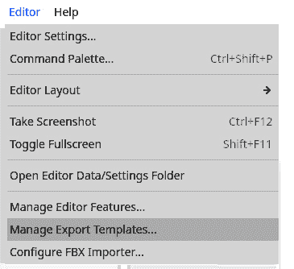

图 12.1 – 通过编辑器下拉菜单访问导出模板管理器

1.  点击**下载** **并安装**。

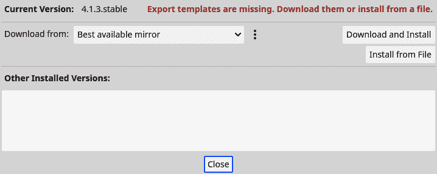

图 12.2 – 在导出模板管理器中，我们可以下载和安装导出模板

下载和安装导出模板需要一些时间，但您只需为每个使用的 Godot 引擎版本做一次即可。现在，我们已准备好进行适当的导出。

## 制作游戏的实际导出

在放置了我们给定 Godot 引擎版本的导出模板后，我们最终可以导出游戏。我们将使用**导出菜单**来完成这项工作。让我们开始吧：

1.  在顶部菜单栏中，打开**项目**下拉菜单并点击**导出...**。

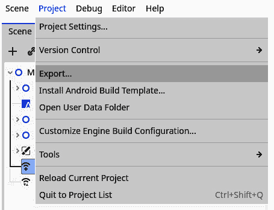

图 12.3 – 通过项目下拉菜单访问导出…菜单

1.  这将打开**导出**菜单，其中包含每个导出预设的导出设置。目前，它不包含任何导出预设。

1.  点击**添加...**并选择您现在正在使用的计算机平台（**Linux/X11**、**macOS**或**Windows 桌面**）。

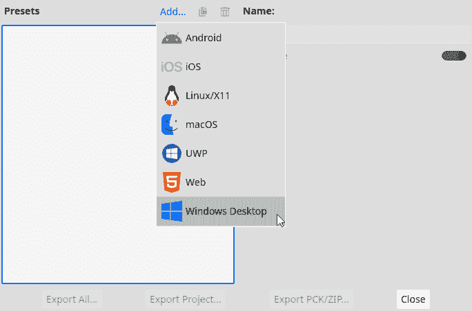

图 12.4 – 在导出菜单中添加特定平台的预设

1.  该平台将被添加到**预设**列表中。

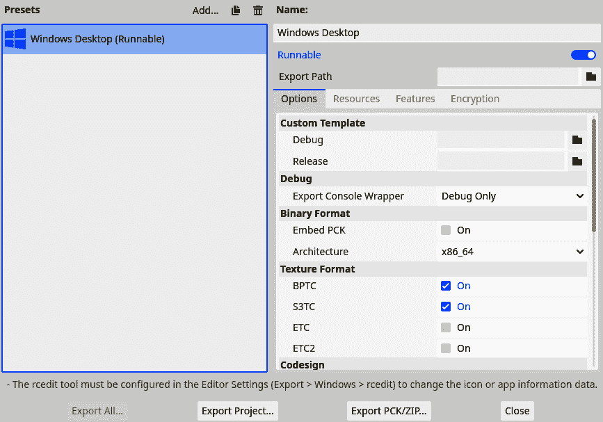

图 12.5 – 将 Windows 桌面平台添加为预设之一

1.  根据您添加的平台配置导出：

    +   `com.survivor.game`或类似的内容。

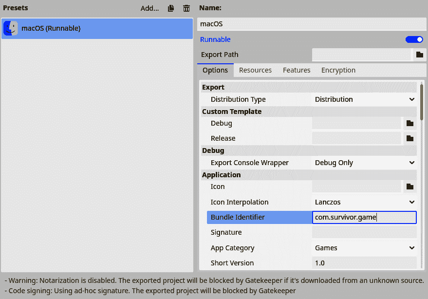

图 12.6 – 对于 macOS，您必须指定捆绑标识符

+   **仅限 Windows 和 Linux**：启用**嵌入 PCK**选项。这将确保我们的游戏 PCK 文件（包含所有游戏数据的包文件，如代码和艺术）嵌入到游戏的可执行文件中。

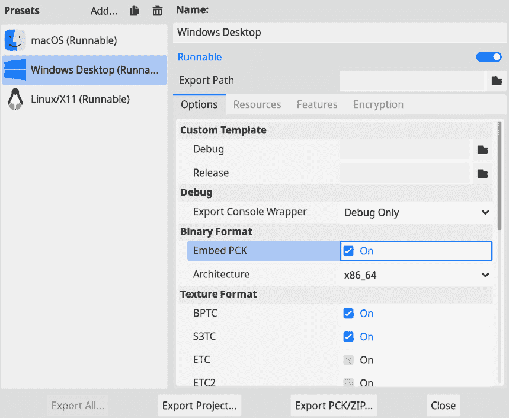

图 12.7 – 对于 Windows 和 Linux，启用嵌入 PCK 选项

1.  现在，点击**导出项目...**以导出游戏。

1.  在`exports`文件夹下创建一个新的文件夹，其中您可以创建每个平台的文件夹。因此，如果您为 Windows 导出，请将其放在`exports/windows`下。这只是为了给我们的导出提供一些结构。

1.  禁用**带有调试的导出**选项。


图 12.8 – 禁用带有调试的导出选项

1.  按**保存**。

我们现在将在我们刚刚创建的文件夹中有目标平台的游戏导出。为每个平台重复本节中的步骤。

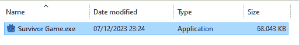

图 12.9 – Windows 平台的导出游戏

重要提示

你可能已经注意到导出菜单中还有一个名为 **导出全部...** 的按钮。当所有你想要导出的平台都设置好时，你可以按下这个按钮来同时导出所有平台。

导出后，就是时候发布游戏并与全世界分享它了。

# 将我们的游戏上传到 Itch.io

制作完一个游戏后，与认识的人或完全陌生的人分享它，看看他们如何互动和玩你制作的东西，这非常有趣。在本节中，我们将介绍将游戏上传到名为 Itch.io 的在线平台的过程。如果你出于任何原因不想分享你的游戏，现在可以跳过这一节；当你准备好时再回来。但不要过于担心分享游戏是否太早。玩家的反馈总是好事，无论你处于开发哪个阶段，创建 Itch.io 页面的这些步骤也是很好的练习。

## 什么是 Itch.io？

**Itch.io** 是一个在线平台和商店，人们可以在这里分发游戏、资产（制作游戏用）、或其他任何数字资源、文件或程序。它在游戏开发社区中非常知名，因为许多开发者都在那里发布了他们的小型游戏实验，但你也可以找到更大的项目。

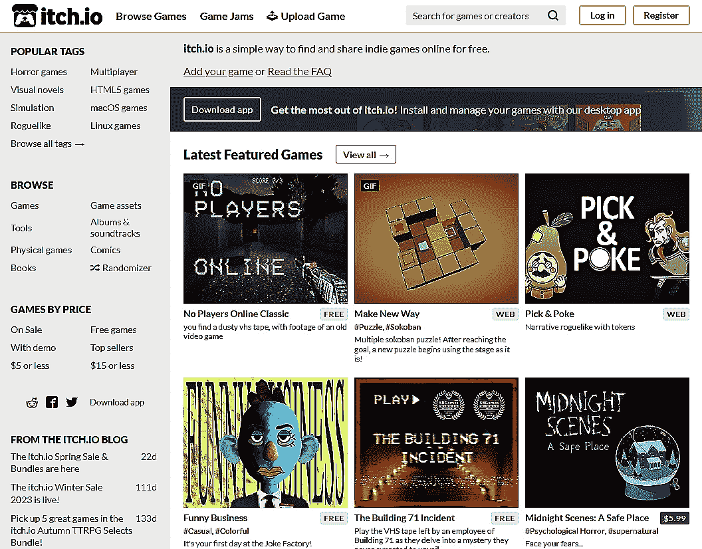

图 12.10 – Itch.io 的首页

Itch.io 也是参加 **游戏快闪** 的好地方。游戏快闪是一个在线小活动，你需要在一定时间限制内围绕一个特定主题制作游戏。时间限制和主题因游戏快闪而异。之后，所有参与者都会玩彼此的游戏并给出反馈。这是练习创建游戏并从其他游戏开发者那里获得反馈的好方法。

我们将把我们的电脑构建上传到 Itch.io 平台，但酷的是我们还可以上传一个可以在浏览器内玩的游戏构建，这样人们就不需要下载任何文件 – 他们可以直接开始玩。如果我们上传了正常导出和网页导出，人们仍然可以选择他们想要如何玩，这给了他们更多的选择。

## 将我们的游戏导出到网页

将游戏导出到网页意味着我们制作了一个可以包含在任何网站中并在任何浏览器中（包括移动浏览器）可玩的游戏导出。

重要提示

注意，当我们制作网页导出时，它只有在通过服务器运行时才能玩。你无法在没有在电脑上运行服务器或将其托管在在线平台上时直接在你的浏览器中打开导出。幸运的是，我们将在 Itch.io 上托管我们的游戏，所以你将能够在那里玩它。

我们首先需要做的是暂时移除游戏的多人模式。

### 移除多人模式

由于安全原因，网站永远不应该完全访问您的计算机。这就是为什么网络导出有一些限制，例如性能和网络略有下降。这意味着我们的游戏多人模式在网页导出中不会工作。有方法可以使多人模式在网页导出中工作，但这些超出了本书的范围。只需进行一个小小的更改，它仍然可以很好地用于单人游戏：

在`menu.gd`脚本的`_ready()`函数中，添加以下行：

```cpp
func _ready():
   _ip_address_line_edit.visible = OS.get_name() != "Web"
   # Rest of the _ready function
```

`OS.get_name()`函数给我们提供了游戏当前运行的操作系统名称。这确保了当玩家在网页上玩游戏时，IP 地址的输入字段不再可见，这样他们就不会卡在尝试连接上，这可能会破坏他们的游戏体验。

在禁用多人模式后，让我们看看如何制作网页导出。

### 制作实际的网页导出

制作网页导出的过程与导出到计算机平台一样简单；我们只需为**Web**平台添加一个新的预设，并正常导出项目。

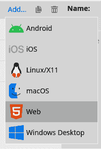

图 12.11 – 为 Web 平台添加导出预设

我们必须确保的一件事是，在保存文件时，将其命名为`index.html`，如图*图 12**.12*所示。Itch.io 要求这个名称，因为它会寻找一个`index.html`文件在浏览器中运行游戏。

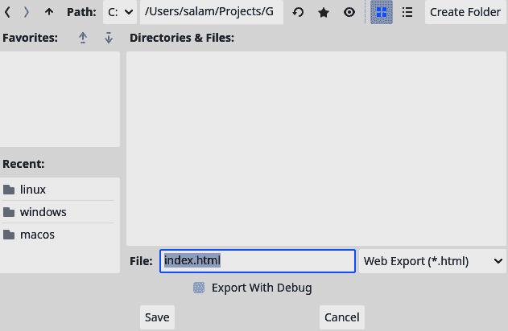

图 12.12 – 确保将网页导出保存为 index.html

现在我们有了导出文件，我们需要将其制作成 ZIP 文件。让我们学习如何做到这一点。

### 压缩网页导出

Itch.io 将需要一个包含所有导出文件的 ZIP 文件，用于网页导出。ZIP 文件是一种将多个其他文件捆绑成压缩格式的文件，这使得它们更容易传输，同时也使内容更小。

根据您使用的平台，过程略有不同。

对于 Windows 和 macOS，请按照以下步骤操作：

1.  选择所有导出文件。


图 12.13 – 选择所有导出的文件

1.  现在，右键单击它们，以便出现**选项**菜单。

    +   **对于 Windows**：在**发送到**下，选择**压缩（zipped）文件夹**。

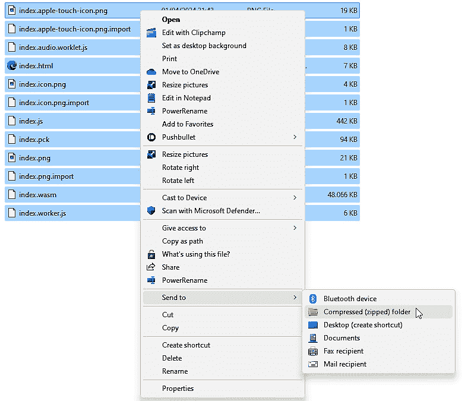

图 12.14 – 在 Windows 平台上，选择“压缩（zipped）文件夹”

+   **对于 macOS**：选择**压缩**。

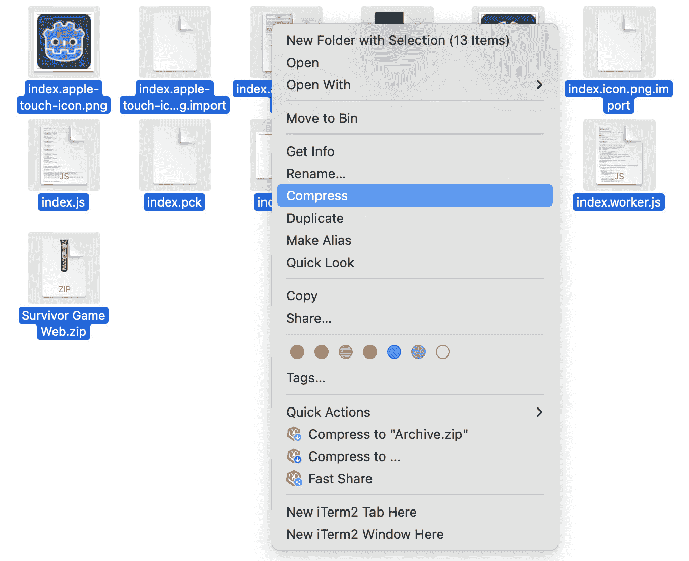

图 12.15 – 在 macOS 平台上，选择“压缩”

1.  现在，将 ZIP 文件命名为`Survivor` `Game Web`。

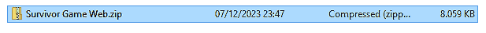

图 12.16 – 生成的 ZIP 文件

对于 Linux，请按照以下步骤操作：

1.  在您的计算机上打开终端应用程序。

1.  使用`cd ~/path/to/game/export/folder`命令（确保路径正确），导航到游戏的网页导出文件夹。

1.  现在，运行`zip -r "Survivor Game Web.zip" .`命令来创建一个包含此文件夹内容的 ZIP 文件。


图 12.17 – 创建 ZIP 文件后 Linux 终端的界面

所有导出文件都已准备好并压缩后，是时候将游戏上传到 Itch.io 了。

## 上传到 Itch.io

现在一切准备就绪，我们可以将我们的游戏上传到 Itch.io 平台，并创建一个人们可以玩游戏和下载游戏的页面：

1.  在[`itch.io/register`](https://itch.io/register)创建一个账户。请确保勾选旁边**我感兴趣在 itch.io 上分发内容**的复选框，因为这正是我们想要做的。


图 12.18 – 在注册 Itch.io 时，指明我们想要分发内容

1.  注册后，您首先需要通过打开 Itch.io 发送到您提供的账户电子邮件地址的电子邮件，并点击按钮**点击以验证您的** **电子邮件地址**来验证您的电子邮件地址。

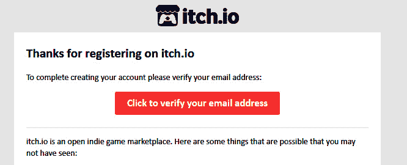

图 12.19 – 验证您的电子邮件地址

1.  在浏览器中，您应该已经被带到**创作者仪表板**页面。点击那个写着**创建** **新项目**的大红色按钮。

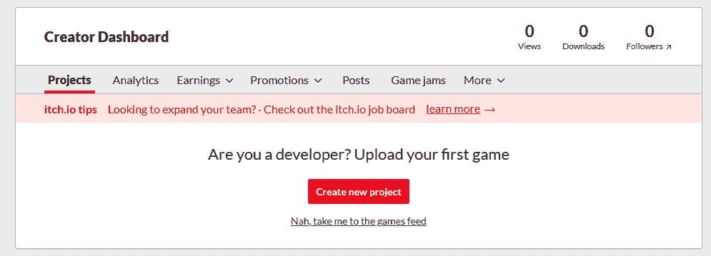

图 12.20 – 点击创建新项目以开始创建游戏页面

1.  给项目命名为`Survivor Game`。

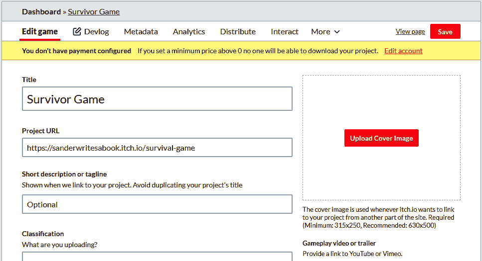

图 12.21 – 给项目命名为 Survivor Game

1.  在**项目类型**下，选择**HTML**。这将确保人们可以在他们的浏览器中玩游戏。

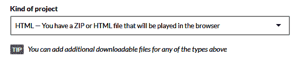

图 12.22 – 将项目类型设置为 HTML

1.  现在，在**上传**部分，上传每个导出的 ZIP 文件。

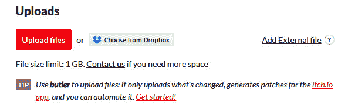

图 12.23 – 上传所有导出文件

1.  接下来，指明每个导出文件针对的平台。这将帮助人们了解他们需要下载哪个文件来适配他们的平台。

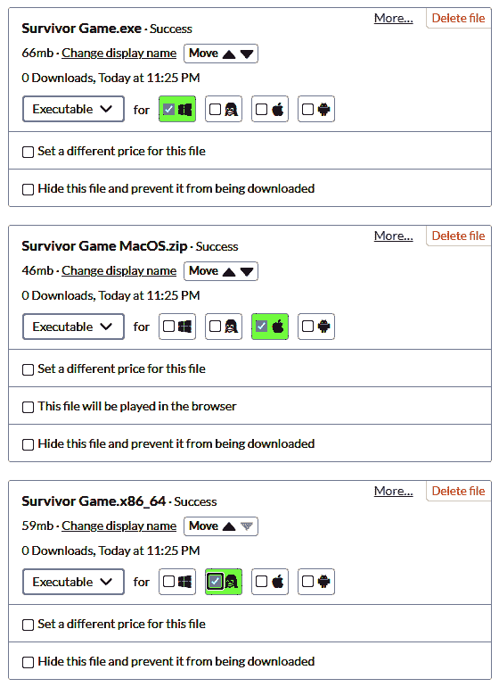

图 12.24 – 对于 Windows、macOS 和 Linux 平台，我们应该指明平台

1.  对于包含网页导出的 ZIP 文件，选择**此文件将在** **浏览器**中播放。

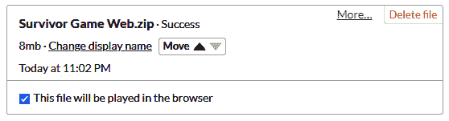

图 12.25 – 对于网页导出的 ZIP 文件，指明它可以在浏览器中播放

1.  在`1152` px × `648` px。这是我们游戏在 Itch 页面上的窗口大小。这些尺寸是我们项目设置中的确切尺寸。

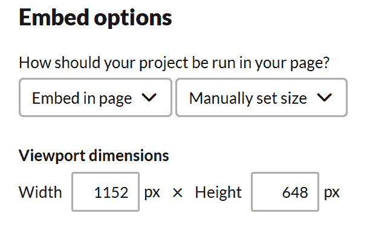

图 12.26 – 对于 Web 导出 ZIP，指明可以在浏览器中播放

1.  在**帧选项**下，启用**SharedArrayBuffer 支持**；这对于 Godot Engine 4 的 Web 导出是必需的。


图 12.27 – 启用 SharedArrayBuffer 支持

1.  点击**保存并查看页面**。

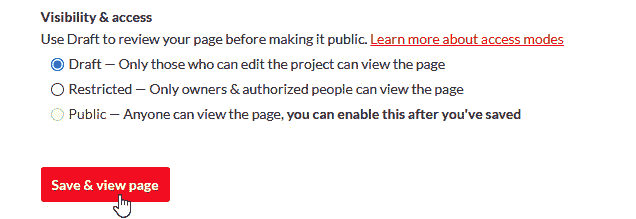

图 12.28 – 点击保存并查看页面

1.  我们将预览我们的页面看起来是什么样子。你会看到游戏需要首次加载。要公开发布，我们需要回到**编辑**页面。


图 12.29 – 首次加载时，游戏将需要额外的时间

1.  这次，在**可见性与访问**下选择**公开**。

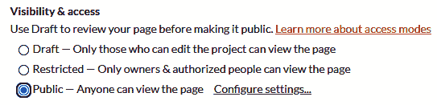

图 12.30 – 在可见性与访问下选择公开

1.  再次按**保存**。

游戏现在有自己的页面，并且对所有人可见！向你的朋友发送链接，并在社交媒体上分享 – 你发布了一款游戏！

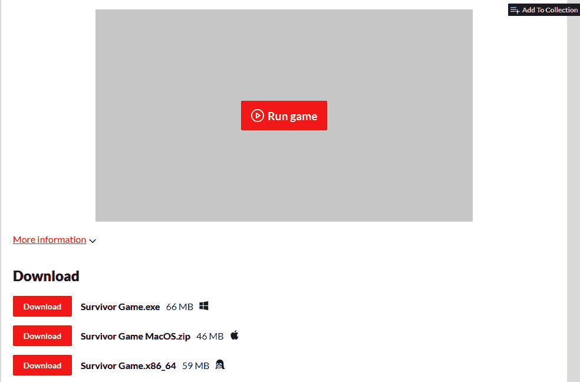

图 12.31 – 我们游戏的 Itch.io 页面

按下**运行游戏**将在浏览器内运行我们的游戏，而页面底部的下载按钮可以帮助我们下载我们想要的任何平台的游戏。

我们知道如何为大多数计算机和网页进行基本导出，但其他平台，如移动设备和游戏机呢？让我们接下来看看。

# 将我们的游戏导出到其他平台

现在我们的游戏已经发布，任何人都可以玩，让我们快速看看如何导出到不是常规计算机的其他平台。

## 移动平台

对于移动设备，如 Android 和 iOS 设备，过程稍微复杂一些。然而，一旦设置好，它将非常可靠。你可以在官方 Godot Engine 文档中找到导出到移动平台的指南：

+   导出到 Android：[`docs.godotengine.org/en/stable/tutorials/export/exporting_for_android.html`](https://docs.godotengine.org/en/stable/tutorials/export/exporting_for_android.html)

+   导出到 iOS：[`docs.godotengine.org/en/stable/tutorials/export/exporting_for_ios.html`](https://docs.godotengine.org/en/stable/tutorials/export/exporting_for_ios.html)

除了简单地导出游戏外，你还需要考虑到移动设备，主要是没有外部按钮，所以游戏玩法应该考虑到触摸屏控制。

## 控制台

让我们来直面问题——关于导出至游戏机，例如**PlayStation**、**Xbox**或**Nintendo**游戏机怎么办？

好消息是，这是可能的！坏消息是，由于 Godot 引擎是开源的，而导出至这些游戏机所需的代码库是闭源的，因此这些导出选项不能包含在基础 Godot 版本中。所以，默认情况下，它们不在引擎中。

然而，有一些公司提供专门针对 Godot 引擎的版本，用于导出至游戏机以及/或帮助移植整个游戏。这些公司包括**W4**（一家雇佣了许多原始 Godot 引擎开发者的公司）、**Pineapple Works**和**Lone Wolf Technology**。您可以在 Godot 文档网站上找到最新的列表：[`docs.godotengine.org/en/stable/tutorials/platform/consoles.html`](https://docs.godotengine.org/en/stable/tutorials/platform/consoles.html)。

# 概述

在本章中，我们学习了如何将我们的游戏导出至多个计算机平台，例如 Windows、Mac 和 Linux。我们还看到了如何将游戏导出至网页并上传到 Itch.io。现在，我们已经准备好创建一个完整游戏并发布它了！

在下一章中，我们将学习面向对象编程的更多高级技术。

# 测验时间

+   导出模板是什么？

+   为什么在导出至 Windows 和 Linux 时我们启用了**嵌入 PCK**？

+   我们可以使用 Godot 引擎导出至哪些平台？
