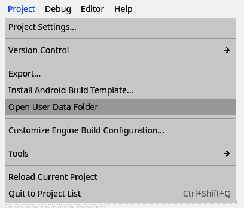
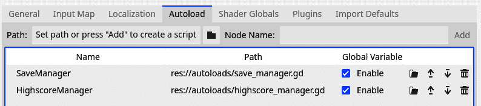
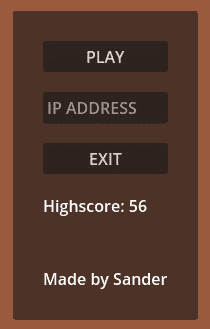

# 第十三章：使用文件系统

在早期，街机游戏永远不会存储玩家的进度。每次你投入一个 25 美分的硬币，游戏就会从零开始，除非有一个系统允许你在同一轮游戏中购买更多生命。但总的来说，你无法在第二天回来并从前一天停止的地方继续游戏。

即使早期的家用游戏机在保存进度方面功能有限。有些游戏会有一个代码系统，你可以从击败一个关卡的那一刻起获得一个秘密代码。后来，你可以使用这个代码直接从那里开始。但这些游戏仍然没有真正保存你的进度。

这种限制部分是因为存储空间，比如硬盘或闪存，非常昂贵。如今，几乎每台电脑和游戏机都标配了几百吉字节，甚至太字节，的存储空间。保存数据变得非常便宜且容易，玩家们已经习惯了在游戏会话之间跟踪某种进度。

在本章中，我们将涵盖以下主要内容：

+   文件系统是什么？

+   创建一个保存系统

# 技术要求

与每一章一样，你可以在 GitHub 仓库的子文件夹中找到本章的最终代码：[`github.com/PacktPublishing/Learning-GDScript-by-Developing-a-Game-with-Godot-4/tree/main/chapter15`](https://github.com/PacktPublishing/Learning-GDScript-by-Developing-a-Game-with-Godot-4/tree/main/chapter15)

# 文件系统是什么？

文件系统是一个管理系统，它管理文件、文件内容以及这些文件的元数据。例如，文件系统会管理文件存储在哪些文件夹中。它确保我们可以访问这些文件来读取内容、元数据，并将新数据写回。对于 Godot 来说，这意味着 Godot 引擎管理我们在游戏中可能需要的所有资源，从场景到脚本，以及图像和声音。

元数据

当我们有数据，比如一个文本文件时，它通常伴随着元数据。这是关于数据的数据。虽然文本文件包含实际数据，即文本，但元数据包含诸如创建日期、作者是谁、存储位置以及哪些账户可以访问文件等信息。

让我们在下一节中从文件路径开始探索文件系统。

## 文件路径

为了能够定位一个文件，文件系统为每个文件提供一个唯一的路径。在我们的电脑上，我们可以通过文件夹，也称为目录，找到文件，我们将它们以良好的顺序存储。在基于 Windows 的系统上，这个路径可能看起来像这样：

```cpp
C:\Users\user_name\Documents\my_text_file.txt
```

或者，在 macOS 和基于 Linux 的系统上，它可能看起来像这样：

```cpp
~/Documents/my_text_file.txt
```

对于资源和项目相关的其他文件，Godot 引擎的路径相对于项目`project.godot`文件的位置是相对的。该文件的路径被视为根目录。在 Godot 文件系统中访问资源文件的路径始终以`res://`开头。例如，要访问项目中的一个文件，路径可能看起来像这样：

```cpp
res://parts/player/player.tscn
```

重要提示

为了方便和兼容性，Godot 文件系统始终使用正斜杠(`/`)。即使在通常使用反斜杠(`\`)的基于 Windows 的系统上也是如此。

我们实际上在*第十章*中预加载弹头时已经使用过这些路径之一。

## 用户路径

我们可以轻松地使用`res://`路径访问所有项目文件，这非常方便，但存在一个问题。我们无法向`res://`域中的任何文件写入；当游戏从导出的构建中运行时，我们只能从中读取文件。为了帮助开发者解决这个问题，Godot 引擎提供了另一个根路径，`user://`，文件可以写入并从中读取。

Godot 引擎会在计算机上的某个位置自动创建一个文件夹来存储这些用户数据。这个文件夹的位置取决于游戏运行的系统，因此对于每个操作系统都会不同：

+   Windows: `%APPDATA%\Godot\app_userdata\<项目名称>`

+   macOS: `~/Library/Application Support/Godot/app_userdata/<``项目名称>`

+   Linux: `~/.local/share/godot/app_userdata/<``项目名称>`

重要提示

在项目设置中，我们甚至可以指定在每个三个操作系统中的文件夹位置，但现在不需要这样做，因为 Godot 会为我们处理并隐藏到某个安全的地方。

您可以通过打开**项目**菜单并选择**打开用户** **数据文件夹**来访问给定项目的`user://`文件夹。



图 15.1 - 打开用户数据文件夹将我们带到 user://文件夹

我们将在本章下一节中将使用`user://`路径来将保存数据写入。所以，让我们来实际实现我们自己的小保存系统。

# 创建一个保存系统

理论上，我们只需要打开一个文件，将我们想要保存的数据写入其中，然后，稍后，当我们需要数据时，再读取相同的文件。实际上，在 Godot 引擎中，读取和写入文件确实很容易。

我们首先将看到如何写入外部文件。

## 将数据写入磁盘

让我们通过在`autoloads`文件夹下创建一个名为`save_manager.gd`的新脚本来实现这一点。然后，为了保存数据，将此代码放入脚本中：

```cpp
extends Node
const SAVE_FILE_PATH: String = "user://save_data.json"
var save_data: Dictionary = {
   "highscore": 0
}
func write_save_data():
   var json_string: String = JSON.stringify(save_data)
   var save_file: FileAccess = FileAccess.open(SAVE_FILE_PATH, FileAccess.WRITE)
   if save_file == null:
      print("Could not open save file.")
      return
   save_file.save_data, that we’ll use to store all the data in. For now, it only contains highscore. If we want to access the saved data later on during the game, we can just use this variable.
			Then we have the `write_save_data()` function, which actually writes our data to a file. This function starts by converting our `save_data` dictionary to a JSON string using the `JSON.stringify()` function.
			The JSON standard
			JSON is a data format that is widely used on the web and other platforms. The name **JSON** stands for **JavaScript Object Notation**. It is a very lightweight way of storing data and has the added benefit of being easy to read and adjust once our data is stored in the file.
			Next, we use the `FileAccess` class to open the file in which we would like to write our data. We stored the path to the file as a constant, `SAVE_FILE_PATH`, at the top of the script. Because we want to write to the file, we need to open it with write access by providing `File.Access.WRITE` to the `open()` function. This mode of accessing the file will also create the file for us if it doesn’t exist yet. The opened file gets stored in the `save_file` variable.
			Next, we check whether `save_file` opened properly. If, for any reason, the file could not be opened, this variable’s value will be `null` and we should stop executing the function.
			More information
			For more on the `FileAccess` class, check out the official documentation: [`docs.godotengine.org/en/stable/classes/class_fileaccess.html`](https://docs.godotengine.org/en/stable/classes/class_fileaccess.html).
			The last thing we need to do, when the file is properly opened, is actually write the JSON data to it. We do this using `store_string()` on `save_file`, passing along `json_string`.
			That is all we need to write data to a file in the `user://` folder. Now we can write a function that reads this data back in.
			Reading data from disk
			To read data from the `user://` folder, we follow the same steps as writing it, but in reverse. Add this function to the `save_manager.gd` script:

```

func read_save_data():

var save_file: FileAccess = FileAccess.open(SAVE_FILE_PATH, FileAccess.READ)

if save_file == null:

print("无法打开保存文件。")

return

var file_content: String = save_file.get_as_text()

`save_data = read_save_data`函数加载保存的文件并解析内容，以便我们可以在游戏中使用。首先，我们使用`FileAccess.open`打开保存的文件，提供文件的路径和`FileAccess.READ`以指示我们只想读取它。之后，我们检查文件是否已正确打开，否则我们需要再次退出函数。

            接下来，我们将整个文件作为字符串读入一个名为`file_content`的变量中。我们将不得不将这个字符串从保存时的 JSON 格式解析为 GDScript 可以处理的格式，即字典。解析后的值直接存储在我们之前定义的`save_data`变量中。

            更多信息

            关于在 Godot 引擎中保存和加载数据的更多信息，请参阅官方文档：[`docs.godotengine.org/en/stable/tutorials/io/saving_games.html`](https://docs.godotengine.org/en/stable/tutorials/io/saving_games.html)。

            这太棒了，我们有两个函数可以为我们的小游戏写入和读取保存的数据。现在我们还需要添加一些函数来确保脚本可以被游戏使用。

            为游戏使用保存管理器做准备

            保存管理器几乎准备好了，但我们仍然需要添加这两个函数：

```cpp
func _ready():
   read_save_data()
func save_highscore(new_highscore: float):
   save_data.highscore = new_highscore
   write_save_data()
```

            第一个函数，即`_ready()`函数，确保我们从玩家启动游戏的那一刻起加载保存的数据。

            第二个函数提供了一个方便的方式来存储新的高分。它将新的高分添加到`save_data`字典中，然后将数据写入磁盘。

            现在，为了确保我们可以从任何地方访问保存管理器，将此脚本添加到项目的自动加载中。我们希望我们的保存管理器是第一个执行的自动加载，这将确保在游戏的任何其他部分执行之前，保存的数据被加载。为此，请确保`save_manager.gd`脚本位于自动加载列表的顶部。您可以通过拖放**SaveManager**的条目或通过点击右侧的箭头直到它位于顶部来实现这一点。

            

            图 15.2 - 确保 SaveManager 是列表中的第一个自动加载

            完成并放置此脚本作为自动加载后，我们终于可以将游戏连接到使用它。让我们在下一节中这样做。

            调整游戏以使用保存管理器

            现在，我们只需要从`highscore_manager.gd`脚本中获取高分，并在玩家获得新高分时保存高分。将以下`_ready`函数添加到`highscore_manager.gd`脚本中，并添加`SaveManager.save_highscore()`函数调用：

```cpp
func _ready():
   highscore = SaveManager.save_data.highscore
func set_new_highscore(value: int):
   if value > highscore:
      highscore = value
      SaveManager.save_highscore(highscore)
```

            在这些准备工作就绪后，我们最终可以玩一会儿游戏，得到一个高分，关闭游戏，当我们再次打开它时，看到我们之前的高分出现。

            

            图 15.3 - 打开游戏时加载高分

            现在我们的游戏已经真正准备好让用户在多天内努力打破自己的高分记录，而无需自己跟踪它。在下一节中，我们将简要查看保存文件的实际内容。

            查看保存文件

            目前，我们将保存文件视为一个黑盒，不知道其实际内容。我们以 JSON 格式将其保存到其中，然后读取它，将其解析回 GDScript 可用的数据。

            黑盒

            当我们不知道事物本身是如何工作时，我们说我们在与黑盒交互。我们向系统提供输入，它就会输出一些输出。

            当然，我们也可以使用文本编辑器，如 Windows 上的记事本，查看保存文件的内容。只需打开我们在本章早些时候在*用户路径*部分中提到的`user://`文件夹。从这里，打开我们在保存管理器中创建的`save_data.save`文件。

            你会发现这个文件中的数据非常易于阅读，看起来很像我们在`save_manager.gd`脚本中定义的实际字典。这是因为 JSON 也有字典数据结构的概念，其语法与 GDScript 中的字典语法非常相似。文件看起来是这样的：

```cpp
{"highscore":56}
```

            如果你愿意，你可以从这里更改保存数据并作弊，通过填写一个不可能的高分。不幸的是，如果用户知道在哪里查找保存文件，他们也会这样做。

            更多信息

            有加密保存文件的方法，但这些超出了本书的范围。更多信息请参阅官方文档：[`docs.godotengine.org/en/stable/classes/class_fileaccess.html#class-fileaccess-method-open-encrypted`](https://docs.godotengine.org/en/stable/classes/class_fileaccess.html#class-fileaccess-method-open-encrypted)。

            太棒了，随着我们的游戏保存玩家的最高分，我们已经到达了这一章的结尾。关于加载和保存游戏状态，还有很多技巧要学习，但到目前为止，这已经足够了。

            摘要

            在本章中，我们学习了关于 Godot 和计算机的文件系统的一切。它使我们能够编写一个小型保存系统，保持我们游戏的高分，并在每次启动游戏时加载它。

            这本书的这一部分已经结束了。在过去的五章中，我们深入探讨了编程概念、模式和文件系统。

            你们都已经准备好去开发自己的游戏了。但在你这样做之前，我想给你一些最后的提示和步骤，告诉你在这本书的最后一章中接下来要做什么。我们那里见。

            测验时间

                +   在 Godot 引擎中，`res://`和`user://`文件路径之间有什么区别？

                +   为了保存数据，我们使用了 JSON 格式。JSON 格式是 Godot 引擎独有的格式吗？在哪些其他领域广泛使用 JSON 格式？

```cpp

```
