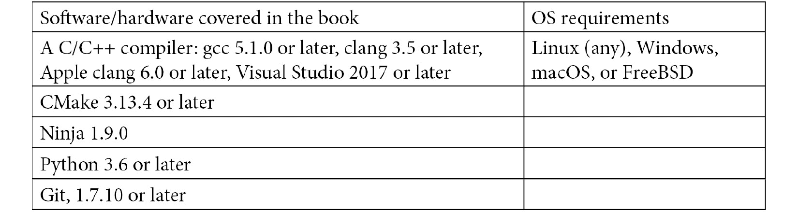

# 前言

构建编译器是一项复杂而迷人的任务。LLVM 项目为您的编译器提供了可重用的组件。LLVM 核心库实现了世界一流的优化代码生成器，为所有流行的 CPU 架构转换了与源语言无关的中间表示的机器代码。许多编程语言的编译器已经利用了 LLVM 技术。

本书教会您如何实现自己的编译器，以及如何使用 LLVM 来实现。您将学习编译器的前端如何将源代码转换为抽象语法树，以及如何从中生成中间表示（IR）。通过向编译器添加优化管道，您可以将 IR 编译为高性能的机器代码。

LLVM 框架可以通过多种方式进行扩展，您将学习如何向 LLVM 添加新的 pass、新的机器指令，甚至是一个全新的后端。高级主题，如为不同的 CPU 架构进行编译，以及使用自己的插件和检查器扩展 clang 和 clang 静态分析器也会被涵盖。本书采用实用的方法，包含大量示例源代码，使得在自己的项目中应用所学知识变得容易。

# 本书适合对象

本书适用于编译器开发人员、爱好者和工程师，他们对 LLVM 还不熟悉，有兴趣了解 LLVM 框架。对于希望使用基于编译器的工具进行代码分析和改进的 C++软件工程师，以及希望更多了解 LLVM 基础知识的 LLVM 库的普通用户也很有用。理解本书所涵盖概念需要具备中级水平的 C++编程经验。

# 本书涵盖内容

[*第一章*]，*安装 LLVM*，解释了如何设置和使用开发环境。在本章结束时，您将已经编译了 LLVM 库，并学会了如何自定义构建过程。

[*第二章*]，*LLVM 源码之旅*，介绍了各种 LLVM 项目，并讨论了所有项目共享的常见目录布局。您将使用 LLVM 核心库创建您的第一个项目，并为不同的 CPU 架构进行编译。

[*第三章*]，*编译器的结构*，为您概述了编译器的组件。在本章结束时，您将已经实现了生成 LLVM IR 的第一个编译器。

[*第四章*]，*将源文件转换为抽象语法树*，详细教您如何实现编译器的前端。您将为一种小型编程语言创建自己的前端，最终构建一个抽象语法树。

[*第五章*]，*IR 生成基础*，向您展示如何从抽象语法树生成 LLVM IR。在本章结束时，您将已经实现了一个示例语言的编译器，生成汇编文本或目标代码文件作为结果。

[*第六章*]，*高级语言结构的 IR 生成*，说明了如何将高级编程语言中常见的源语言特性转换为 LLVM IR。您将学习如何翻译聚合数据类型，实现类继承和虚函数的各种选项，以及如何遵守系统的应用二进制接口。

[*第七章*]，*高级 IR 生成*，向您展示如何为源语言中的异常处理语句生成 LLVM IR。您还将学习如何为基于类型的别名分析添加元数据，以及如何向生成的 LLVM IR 添加调试信息，并扩展您的编译器生成的元数据。

*第八章*，*优化 IR*，解释了 LLVM pass 管理器。您将实现自己的 pass，作为 LLVM 的一部分和作为插件，并学习如何将新 pass 添加到优化 pass 管道中。

*第九章*，*指令选择*，展示了 LLVM 如何将 IR 降低为机器指令。您将学习 LLVM 中如何定义指令，并向 LLVM 添加一个新的机器指令，以便指令选择考虑新指令。

*第十章*，*JIT 编译*，讨论了如何使用 LLVM 实现**即时**（**JIT**）编译器。在本章结束时，您将以两种不同的方式为 LLVM IR 实现自己的 JIT 编译器。

*第十一章*，*使用 LLVM 工具进行调试*，探讨了 LLVM 的各种库和组件的细节，这有助于您识别应用程序中的错误。您将使用 sanitizer 来识别缓冲区溢出和其他错误。使用 libFuzzer 库，您将测试具有随机数据输入的函数，XRay 将帮助您找到性能瓶颈。您将使用 clang 静态分析器在源代码级别识别错误，并了解您可以向分析器添加自己的检查器。您还将学习如何使用自己的插件扩展 clang。

*第十二章*，*创建自己的后端*，解释了如何向 LLVM 添加新的后端。您将实现所有必要的类，并在本章结束时将 LLVM IR 编译为另一种 CPU 架构。

# 为了充分利用本书

*您需要一台运行 Linux、Windows、macOS 或 FreeBSD 的计算机，并为操作系统安装了开发工具链。请参阅所需工具的表格。所有工具都应该在您的 shell 的搜索路径中。*



要查看*第九章*中的 DAG 可视化，*指令选择*，您必须安装来自[`graphviz.org/`](https://graphviz.org/)的 Graphviz 软件。默认情况下，生成的图像是 PDF 格式，您需要一个 PDF 查看器来显示它。

要创建*第十一章*中的火焰图，*使用 LLVM 工具进行调试*，您需要从[`github.com/brendangregg/FlameGraph`](https://github.com/brendangregg/FlameGraph)安装脚本。要运行脚本，您还需要安装最新版本的 Perl，并且要查看图形，您需要一个能够显示 SVG 文件的 Web 浏览器，所有现代浏览器都可以。要查看同一章节中的 Chrome Trace Viewer 可视化，您需要安装 Chrome 浏览器。

**如果您使用本书的数字版本，我们建议您自己输入代码或通过 GitHub 存储库（链接在下一节中提供）访问代码。这样做将有助于避免与复制和粘贴代码相关的任何潜在错误。**

# 下载示例代码文件

您可以从 GitHub 上的[`github.com/PacktPublishing/Learn-LLVM-12`](https://github.com/PacktPublishing/Learn-LLVM-12)下载本书的示例代码文件。如果代码有更新，将在现有的 GitHub 存储库上进行更新。

我们还有来自我们丰富书籍和视频目录的其他代码包，可在[`github.com/PacktPublishing/`](https://github.com/PacktPublishing/)上找到。看一看吧！

# 代码实例

本书的代码实例视频可在[`bit.ly/3nllhED`](https://bit.ly/3nllhED)上观看

# 下载彩色图片

我们还提供了一个 PDF 文件，其中包含本书中使用的屏幕截图/图表的彩色图像。您可以在此处下载：[`static.packt-cdn.com/downloads/9781839213502_ColorImages.pdf`](https://static.packt-cdn.com/downloads/9781839213502_ColorImages.pdf)。

# 使用的约定

本书中使用了许多文本约定。

`文本中的代码`：表示文本中的代码词、数据库表名、文件夹名、文件名、文件扩展名、路径名、虚拟 URL、用户输入和 Twitter 用户名。例如：“您可以在代码中观察到定义了一个量子电路操作，并定义了一个名为`numOnes`的变量。”

代码块设置如下：

```cpp
#include "llvm/IR/IRPrintingPasses.h"
#include "llvm/IR/LegacyPassManager.h"
#include "llvm/Support/ToolOutputFile.h"
```

当我们希望引起您对代码块的特定部分的注意时，相关行或项目将以粗体显示：

```cpp
  switch (Kind) {
// Many more cases
  case m88k:           return "m88k";
  }
```

**粗体**：表示新术语、重要单词或屏幕上看到的单词。例如，菜单或对话框中的单词会以这种方式出现在文本中。例如：“从**管理**面板中选择**系统信息**。”

提示或重要说明

看起来像这样。
