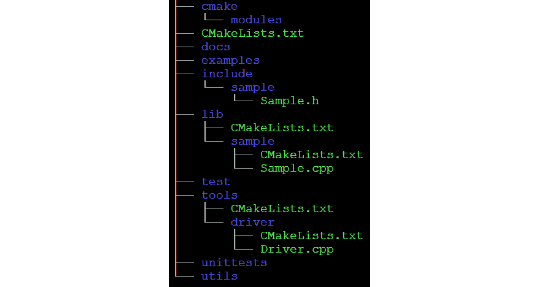
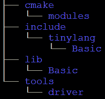
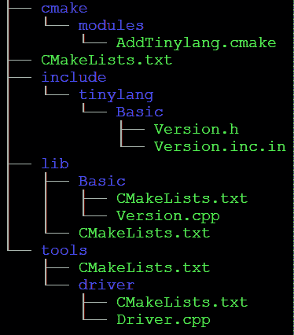

# 第二章：LLVM 源代码导览

LLVM 单一存储库包含`llvm-project`根目录下的所有项目。所有项目都遵循统一的源代码布局。要有效地使用 LLVM，了解可用内容以及其位置是很重要的。在本章中，您将了解以下内容：

+   LLVM 单一存储库的内容，涵盖了最重要的顶级项目

+   LLVM 项目的布局，展示了所有项目使用的通用源代码布局

+   如何使用 LLVM 库创建自己的项目，涵盖了在自己的项目中使用 LLVM 的所有方式

+   如何针对不同的 CPU 架构，展示交叉编译到另一个系统所需的步骤

# 技术要求

本章的代码文件可在[`github.com/PacktPublishing/Learn-LLVM-12/tree/master/Chapter02/tinylang`](https://github.com/PacktPublishing/Learn-LLVM-12/tree/master/Chapter02/tinylang)找到

您可以在[`bit.ly/3nllhED`](https://bit.ly/3nllhED)找到代码演示视频

# LLVM 单一存储库的内容

在*第一章*中，*安装 LLVM*，您克隆了 LLVM 单一存储库。该存储库包含所有 LLVM 顶级项目。它们可以分为以下几类：

+   LLVM 核心库和附加内容

+   编译器和工具

+   运行时库

在接下来的章节中，我们将更详细地了解这些组。

## LLVM 核心库和附加内容

LLVM 核心库位于`llvm`目录中。该项目提供了一组为知名 CPU 进行优化和代码生成的库。它还提供了基于这些库的工具。LLVM 静态编译器`llc`接受 LLVM `llvm-objdump`和`llvm-dwarfdump`文件，让您检查目标文件，以及像`llvm-ar`这样的工具让您从一组目标文件创建存档文件。它还包括帮助开发 LLVM 本身的工具。例如，`bugpoint`工具有助于找到 LLVM 内部崩溃的最小测试用例。`llvm-mc`是机器码播放器：该工具汇编和反汇编机器指令，并输出编码，这在添加新指令时非常有帮助。

LLVM 核心库是用 C++编写的。此外，还提供了 C 接口和 Go、Ocaml 和 Python 的绑定。

位于`polly`目录中的 Polly 项目为 LLVM 增加了另一组优化。它基于一种称为**多面体模型**的数学表示。采用这种方法，可以进行诸如为缓存局部性优化的循环等复杂优化。

`mlir`目录。

## 编译器和工具

LLVM 项目中包含一个名为 clang（[`clang.llvm.org/`](http://clang.llvm.org/)）的完整的 C/C++/Objective-C/Object-C++编译器。源代码位于`clang`目录中。它提供了一组库，用于从 C、C++、Objective-C 和 Objective-C++源文件中进行词法分析、语法分析、语义分析和生成 LLVM IR。小工具`clang`是基于这些库的编译器驱动程序。另一个有用的工具是`clang-format`，它可以根据用户提供的规则格式化 C/C++源文件和源代码片段。

Clang 旨在与 GCC（GNU C/C++编译器）和 CL（Microsoft C/C++编译器）兼容。

`clang-tools-extra`项目提供了 C/C++的其他工具，位于同名目录中。其中最值得注意的是`clang-tidy`，它是用于 C/C++的 Lint 风格检查器。`clang-tidy`使用 clang 库解析源代码并进行静态分析。该工具可以捕获比编译器更多的潜在错误，但运行时开销更大。

Llgo 是 Go 编程语言的编译器，位于`llgo`目录中。它是用 Go 编写的，并使用 LLVM 核心库的 Go 绑定与 LLVM 进行接口。Llgo 旨在与参考编译器（https://golang.org/）兼容，但目前唯一支持的目标是 64 位 x86 Linux。该项目似乎没有维护，并可能在将来被移除。

编译器创建的目标文件必须与运行时库链接在一起形成可执行文件。这是`lld`（[`lld.llvm.org/`](http://lld.llvm.org/)）的工作，LLVM 链接器位于`lld`目录中。该链接器支持 ELF、COFF、Mach-O 和 WebAssembly 格式。

没有调试器的编译器工具集是不完整的！LLVM 调试器称为`lldb`（[`lldb.llvm.org/`](http://lldb.llvm.org/)），位于同名目录中。其界面类似于 GDB，GNU 调试器，并且该工具可以直接支持 C、C++和 Objective-C。调试器是可扩展的，因此可以轻松添加对其他编程语言的支持。

## 运行时库

除了编译器，完整的编程语言支持还需要运行时库。所有列出的项目都位于顶级目录中，与同名目录中的目录相同：

+   `compiler-rt`项目提供了与编程语言无关的支持库。它包括通用函数，例如 32 位 i386 的 64 位除法，各种消毒剂，模糊库和分析库。

+   `libunwind`库基于 DWARF 标准提供了用于堆栈展开的辅助函数。这通常用于实现诸如 C++之类的语言的异常处理。该库是用 C 编写的，函数与特定的异常处理模型无关。

+   `libcxxabi`库在`libunwind`的基础上实现了 C++异常处理，并为其提供了标准的 C++函数。

+   最后，`libcxx`是 C++标准库的实现，包括 iostreams 和 STL。此外，`pstl`项目提供了 STL 算法的并行版本。

+   `libclc`是 OpenCL 的运行时库。OpenCL 是用于异构并行计算的标准，有助于将计算任务移动到图形卡上。

+   `libc`旨在提供完整的 C 库。该项目仍处于早期阶段。

+   `openmp`项目提供了对 OpenMP API 的支持。OpenMP 有助于多线程编程，并且可以根据源代码中的注释来并行化循环。

尽管这是一个很长的项目列表，但好消息是所有项目的结构都类似。我们将在下一节中查看通用目录布局。

# LLVM 项目的布局

所有 LLVM 项目都遵循相同的目录布局理念。为了理解这个理念，让我们将 LLVM 与**GCC**，**GNU 编译器集**进行比较。几十年来，GCC 为几乎您能想象到的每个系统提供了成熟的编译器。但是，除了编译器，没有利用代码的工具。原因是它不是为重用而设计的。这与 LLVM 不同。

每个功能都有明确定义的 API，并放在自己的库中。clang 项目（除其他外）有一个库，用于将 C/C++源文件词法分析为标记流。解析器库将此标记流转换为抽象语法树（也由库支持）。语义分析、代码生成甚至编译器驱动程序都作为库提供。著名的`clang`工具只是针对这些库链接的一个小应用程序。

优势是显而易见的：当您想要构建一个需要 C++文件的**抽象语法树**（**AST**）的工具时，您可以重用这些库的功能来构建 AST。不需要语义分析和代码生成，也不需要链接到这些库。这个原则被所有 LLVM 项目遵循，包括核心库！

每个项目都有类似的组织结构。因为 CMake 用于构建文件生成，每个项目都有一个`CMakeLists.txt`文件，描述了项目的构建过程。如果需要额外的 CMake 模块或支持文件，则它们存储在`cmake`子目录中，模块放置在`cmake/modules`中。

库和工具大多是用 C++编写的。源文件放在`lib`目录下，头文件放在`include`目录下。因为一个项目通常由多个库组成，在`lib`目录中为每个库都有一个目录。如果需要，这个过程会重复。例如，在`llvm/lib`目录中有`Target`目录，其中包含特定目标的降低代码。除了一些源文件外，每个目标都有一个子目录，这些子目录再次编译成库。每个目录都有一个`CMakeLists.txt`文件，描述了如何构建库以及哪些子目录还包含源代码。

`include`目录有一个额外的级别。为了使包含文件的名称唯一，路径名包括项目名称，这是`include`下的第一个子目录。只有在这个文件夹中，才会重复来自`lib`目录的结构。

应用程序的源代码位于`tools`和`utils`目录中。`utils`目录中是在编译或测试期间使用的内部应用程序。它们通常不是用户安装的一部分。`tools`目录包含面向最终用户的应用程序。在这两个目录中，每个应用程序都有自己的子目录。与`lib`目录一样，每个包含源代码的子目录都有一个`CMakeLists.txt`文件。

正确的代码生成对于编译器是*必不可少*的。这只能通过一个良好的测试套件来实现。`unittest`目录包含使用*Google Test*框架的单元测试。这主要用于单个函数和无法以其他方式进行测试的独立功能。`test`目录中是 LIT 测试。这些测试使用`llvm-lit`实用程序来执行测试。`llvm-lit`扫描文件以执行 shell 命令。文件包含用作测试输入的源代码，例如 LLVM IR。文件中嵌入了由`llvm-lit`执行的编译命令。然后验证此步骤的输出，通常借助`FileCheck`实用程序的帮助。这个实用程序从一个文件中读取检查语句，并将它们与另一个文件进行匹配。LIT 测试本身位于`test`目录下的子目录中，大致遵循`lib`目录的结构。

文档（通常作为`docs`目录。如果项目提供示例，则它们在`examples`目录中。

根据项目的需求，也可以有其他目录。最值得注意的是，一些提供运行时库的项目将源代码放在`src`目录中，并使用`lib`目录进行库导出定义。compiler-rt 和 libclc 项目包含与体系结构相关的代码。这总是放在以目标体系结构命名的子目录中（例如`i386`或`ptx`）。

总之，提供示例库并具有驱动程序工具的项目的一般布局如下：



图 2.1-一般项目目录布局

我们自己的项目也将遵循这种组织结构。

# 使用 LLVM 库创建您自己的项目

根据前一节的信息，现在可以使用 LLVM 库创建自己的项目。以下部分介绍了一个名为`tinylang`的小语言。在这里定义了这样一个项目的结构。尽管本节中的工具只是一个**Hello, world**应用程序，但其结构具有实现真实编译器所需的所有部分。

## 创建目录结构

第一个问题是是否应该将`tinylang`项目与 LLVM 一起构建（如 clang），还是应该是一个独立的项目，只是使用 LLVM 库。在前一种情况下，还需要决定在哪里创建项目。

首先假设`tinylang`应与 LLVM 一起构建。有不同的选项可供放置项目。第一个解决方案是在`llvm-projects`目录内创建项目的子目录。此目录中的所有项目都将作为构建 LLVM 的一部分进行捕获和构建。在创建并排项目布局之前，这是构建例如 clang 的标准方式。

第二个选项是将`tinylang`项目放在顶级目录中。因为它不是官方的 LLVM 项目，所以 CMake 脚本不知道它。在运行`cmake`时，您需要指定`–DLLVM_ENABLE_PROJECTS=tinylang`以将项目包含在构建中。

第三个选项是将项目目录放在`llvm-project`目录之外的其他位置。当然，您需要告诉 CMake 这个位置。例如，如果位置是`/src/tinylang`，则需要指定`–DLLVM_ENABLE_PROJECTS=tinylang –DLLVM_EXTERNAL_TINYLANG_SOURCE_DIR=/src/tinylang`。

如果要将项目构建为独立项目，则需要找到 LLVM 库。这是在稍后讨论的`CMakeLists.txt`文件中完成的。

在了解可能的选项之后，哪一个是最好的？将您的项目作为 LLVM 源树的一部分是有点不灵活的，因为大小。只要您不打算将项目添加到顶级项目列表中，我建议使用单独的目录。您可以在 GitHub 或类似服务上维护您的项目，而不必担心如何与 LLVM 项目同步。并且如前所示，您仍然可以与其他 LLVM 项目一起构建。

让我们创建一个非常简单的库和应用程序的项目。第一步是创建目录布局。选择一个对您方便的位置。在接下来的步骤中，我假设它与您克隆`llvm-project`目录的相同目录中。使用`mkdir`（Unix）或`md`（Windows）创建以下目录：



图 2.2- 项目所需的目录

接下来，我们将在这些目录中放置构建描述和源文件。

## 添加 CMake 文件

您应该从上一节中认识到基本结构。在`tinylang`目录中，创建一个名为`CMakeLists.txt`的文件，并执行以下步骤：

1.  文件开始时调用`cmake_minimum_required()`来声明所需的 CMake 的最小版本。这与*第一章*中的版本相同，*安装 LLVM*：

```cpp
Cmake_minimum_required(VERSION 3.13.4)
```

1.  下一个语句是`if()`。如果条件为真，则将构建项目，并且需要一些额外的设置。条件使用两个变量，`CMAKE_SOURCE_DIR`和`CMAKE_CURRENT_SOURCE_DIR`。`CMAKE_SOURCE_DIR`变量是在`cmake`命令行上给出的顶层源目录。正如我们在关于目录布局的讨论中看到的，每个具有源文件的目录都有一个`CMakeLists.txt`文件。CMake 当前处理的`CMakeLists.txt`文件的目录记录在`CMAKE_CURRENT_SOURCE_DIR`变量中。如果两个变量具有相同的字符串值，则将构建项目。否则，`CMAKE_SOURCE_DIR`将是`llvm`目录：

```cpp
if(CMAKE_SOURCE_DIR STREQUAL CMAKE_CURRENT_SOURCE_DIR)
```

独立设置很简单。每个 CMake 项目都需要一个名称。在这里，我们将其设置为`Tinylang`：

```cpp
  project(Tinylang)
```

1.  LLVM 软件包已被搜索，找到的 LLVM 目录被添加到 CMake 模块路径中：

```cpp
  find_package(LLVM REQUIRED HINTS     "${LLVM_CMAKE_PATH}")
  list(APPEND CMAKE_MODULE_PATH ${LLVM_DIR})
```

1.  然后，包含了 LLVM 提供的另外三个 CMake 模块。第一个仅在使用 Visual Studio 作为构建编译器时需要，并设置正确的运行时库以进行链接。另外两个模块添加了 LLVM 使用的宏，并根据提供的选项配置了构建：

```cpp
  include(ChooseMSVCCRT)
  include(AddLLVM)
  include(HandleLLVMOptions)
```

1.  接下来，LLVM 的头文件路径被添加到包含搜索路径中。添加了两个目录。从构建目录中添加了`include`目录，因为自动生成的文件保存在这里。另一个`include`目录是源目录内的目录：

```cpp
  include_directories("${LLVM_BINARY_DIR}/include"                      "${LLVM_INCLUDE_DIR}")
```

1.  使用`link_directories()`，将 LLVM 库的路径添加到链接器中：

```cpp
  link_directories("${LLVM_LIBRARY_DIR}")
```

1.  最后，设置一个标志以表示项目是独立构建的：

```cpp
  set(TINYLANG_BUILT_STANDALONE 1)
endif()
```

1.  现在进行常见的设置。将`cmake/modules`目录添加到 CMake 模块搜索路径中。这样可以稍后添加我们自己的 CMake 模块：

```cpp
list(APPEND CMAKE_MODULE_PATH   "${CMAKE_CURRENT_SOURCE_DIR}/cmake/modules")
```

1.  接下来，我们检查用户是否正在进行外部构建。与 LLVM 一样，我们要求用户为构建项目使用单独的目录：

```cpp
if(CMAKE_SOURCE_DIR STREQUAL CMAKE_BINARY_DIR AND NOT     MSVC_IDE)
  message(FATAL_ERROR "In-source builds are not     allowed.")
endif()
```

1.  `tinylang`的版本号被写入一个生成的文件中，使用`configure_file()`命令。版本号取自`TINYLANG_VERSION_STRING`变量。`configure_file()`命令读取一个输入文件，用当前值替换 CMake 变量，并写入一个输出文件。请注意，输入文件是从源目录读取的，并写入构建目录：

```cpp
set(TINYLANG_VERSION_STRING "0.1")
configure_file(${CMAKE_CURRENT_SOURCE_DIR}/include/tinylang/Basic/Version.inc.in
  ${CMAKE_CURRENT_BINARY_DIR}/include/tinylang/Basic/Version.inc)
```

1.  接下来，包含另一个 CMake 模块。`AddTinylang`模块具有一些辅助功能：

```cpp
include(AddTinylang)
```

1.  接下来是另一个`include_directories()`语句。这将我们自己的`include`目录添加到搜索路径的开头。与独立构建一样，添加了两个目录：

```cpp
include_directories(BEFORE
  ${CMAKE_CURRENT_BINARY_DIR}/include
  ${CMAKE_CURRENT_SOURCE_DIR}/include
  )
```

1.  在文件末尾，将`lib`和`tools`目录声明为 CMake 查找`CMakeLists.txt`文件的其他目录。这是连接目录的基本机制。此示例应用程序只在`lib`和`tools`目录下有源文件，因此不需要其他内容。更复杂的项目将添加更多目录，例如用于单元测试的目录：

```cpp
add_subdirectory(lib)
add_subdirectory(tools)
```

这是您项目的主要描述。

`AddTinylang.cmake`辅助模块放置在`cmake/modules`目录中。它具有以下内容：

```cpp
macro(add_tinylang_subdirectory name)
  add_llvm_subdirectory(TINYLANG TOOL ${name})
endmacro()
macro(add_tinylang_library name)
  if(BUILD_SHARED_LIBS)
    set(LIBTYPE SHARED)
  else()
    set(LIBTYPE STATIC)
  endif()
  llvm_add_library(${name} ${LIBTYPE} ${ARGN})
  if(TARGET ${name})
    target_link_libraries(${name} INTERFACE 
      ${LLVM_COMMON_LIBS})
    install(TARGETS ${name}
      COMPONENT ${name}
      LIBRARY DESTINATION lib${LLVM_LIBDIR_SUFFIX}
      ARCHIVE DESTINATION lib${LLVM_LIBDIR_SUFFIX}
      RUNTIME DESTINATION bin)
  else()
    add_custom_target(${name})
  endif()
endmacro()
macro(add_tinylang_executable name)
  add_llvm_executable(${name} ${ARGN} )
endmacro()
macro(add_tinylang_tool name)
  add_tinylang_executable(${name} ${ARGN})
  install(TARGETS ${name}
    RUNTIME DESTINATION bin
    COMPONENT ${name})
endmacro()
```

随着模块的包含，`add_tinylang_subdirectory()`、`add_tinylang_library()`、`add_tinylang_executable()`和`add_tinylang_tool()`函数可供使用。基本上，这些函数是 LLVM 提供的等效函数（在`AddLLVM`模块中）的包装器。`add_tinylang_subdirectory()`添加一个新的源目录以便在构建中包含。此外，还添加了一个新的 CMake 选项。通过此选项，用户可以控制是否应该编译该目录的内容。使用`add_tinylang_library()`定义一个也被安装的库。`add_tinylang_executable()`定义一个可执行文件，`add_tinylang_tool()`定义一个也被安装的可执行文件。

在`lib`目录中，即使没有源文件，也需要一个`CMakeLists.txt`文件。它必须包括该项目库的源目录。打开您喜欢的文本编辑器，并将以下内容保存到文件中：

```cpp
add_subdirectory(Basic)
```

一个大型项目会创建多个库，并且源文件会放在`lib`的子目录中。每个这些目录都必须在`CMakeLists.txt`文件中添加。我们的小项目只有一个名为`Basic`的库，所以只需要一行。

`Basic`库只有一个源文件`Version.cpp`。该目录中的`CMakeLists.txt`文件同样简单：

```cpp
add_tinylang_library(tinylangBasic
  Version.cpp
  )
```

定义了一个名为`tinylangBasic`的新库，并将编译的`Version.cpp`添加到该库中。LLVM 选项控制这是一个共享库还是静态库。默认情况下，将创建一个静态库。

在`tools`目录中重复相同的步骤。该文件夹中的`CMakeLists.txt`文件几乎与`lib`目录中的一样简单：

```cpp
create_subdirectory_options(TINYLANG TOOL)
add_tinylang_subdirectory(driver)
```

首先，定义一个 CMake 选项，用于控制是否编译此目录的内容。然后添加唯一的子目录`driver`，这次使用我们自己模块的函数。同样，这使我们能够控制是否包括此目录在编译中。

`driver`目录包含应用程序`Driver.cpp`的源代码。此目录中的`CMakeLists.txt`文件包含编译和链接此应用程序的所有步骤：

```cpp
set(LLVM_LINK_COMPONENTS
  Support
  )
add_tinylang_tool(tinylang
  Driver.cpp
  )
target_link_libraries(tinylang
  PRIVATE
  tinylangBasic
  )
```

首先，将`LLVM_LINK_COMPONENTS`变量设置为我们需要将我们的工具链接到的 LLVM 组件列表。LLVM 组件是一个或多个库的集合。显然，这取决于工具的实现功能。在这里，我们只需要`Support`组件。

使用`add_tinylang_tool()`定义一个新的可安装应用程序。名称为`tinylang`，唯一的源文件是`Driver.cpp`。要链接到我们自己的库，必须使用`target_link_libraries()`指定它们。这里只需要`tinylangBasic`。

现在，CMake 系统所需的文件已经就位。接下来，我们将添加源文件。

## 添加 C++源文件

让我们从`include/tinylang/Basic`目录开始。首先，创建`Version.inc.in`模板文件，其中包含配置的版本号：

```cpp
#define TINYLANG_VERSION_STRING "@TINYLANG_VERSION_STRING@"
```

`@`符号表示`TINYLANG_VERSION_STRING`是一个 CMake 变量，应该用其内容替换。

`Version.h`头文件只声明一个函数来检索版本字符串：

```cpp
#ifndef TINYLANG_BASIC_VERSION_H
#define TINYLANG_BASIC_VERSION_H
#include "tinylang/Basic/Version.inc"
#include <string>
namespace tinylang {
std::string getTinylangVersion();
}
#endif
```

此函数的实现在`lib/Basic/Version.cpp`文件中。它同样简单：

```cpp
#include "tinylang/Basic/Version.h"
std::string tinylang::getTinylangVersion() {
  return TINYLANG_VERSION_STRING;
}
```

最后，在`tools/driver/Driver.cpp`文件中有应用程序源代码：

```cpp
#include "llvm/Support/InitLLVM.h"
#include "llvm/Support/raw_ostream.h"
#include "tinylang/Basic/Version.h"
int main(int argc_, const char **argv_) {
  llvm::InitLLVM X(argc_, argv_);
  llvm::outs() << "Hello, I am Tinylang "               << tinylang::getTinylangVersion()
               << "\n";
}
```

尽管只是一个友好的工具，但源代码使用了典型的 LLVM 功能。`llvm::InitLLVM()`调用进行了一些基本的初始化。在 Windows 上，参数被转换为 Unicode，以便统一处理命令行解析。并且在应用程序崩溃的情况下（希望不太可能发生），会安装一个漂亮的打印堆栈跟踪处理程序。它输出调用层次结构，从发生崩溃的函数开始。要查看真实的函数名称而不是十六进制地址，必须存在调试符号。

LLVM 不使用 C++标准库的`iostream`类。它带有自己的实现。`llvm::outs()`是输出流，在这里用于向用户发送友好的消息。

## 编译 tinylang 应用程序

现在，第一个应用程序的所有文件都就位，可以编译该应用程序。简而言之，您应该有以下目录和文件：



图 2.3 - tinylang 项目的所有目录和文件

如前所述，有几种构建`tinylang`的方法。以下是如何将`tinylang`作为 LLVM 的一部分构建：

1.  使用以下命令切换到构建目录：

```cpp
$ cd build
```

1.  然后，按以下方式运行 CMake：

```cpp
-G Ninja). The build type is set to Release, thus producing optimized binaries (-DCMAKE_BUILD_TYPE=Release). Tinylang is built as an external project alongside LLVM (-DLLVM_EXTERNAL_PROJECTS=tinylang) and the source is found in a directory parallel to the build directory (-DLLVM_EXTERNAL_TINYLANG_SOURCE_DIR=../tinylang). A target directory for the build binaries is also given (-DCMAKE_INSTALL_PREFIX=../llvm-12). As the last parameter, the path of the LLVM project directory is specified (../llvm-project/llvm).
```

1.  现在，构建并安装所有内容：

```cpp
$ ninja
$ ninja install
```

1.  构建和安装后，`../llvm-12`目录包含 LLVM 和`tinylang`二进制文件。请检查您是否可以运行该应用程序：

```cpp
$ ../llvm-12/bin/tinylang
```

1.  您应该看到友好的消息。还请检查是否安装了 Basic 库：

```cpp
libtinylangBasic.a file.
```

与 LLVM 一起构建在您密切关注 LLVM 开发并希望尽快了解 API 更改时非常有用。在*第一章*中，*安装 LLVM*，我们检出了 LLVM 的特定版本。因此，我们看不到 LLVM 源代码的任何更改。

在这种情况下，构建 LLVM 一次并使用编译版本的 LLVM 编译`tinylang`作为独立项目是有意义的。以下是如何做到这一点：

1.  重新开始，进入`build`目录：

```cpp
$ cd build
```

这次，只使用 CMake 构建 LLVM：

```cpp
$ cmake -G Ninja -DCMAKE_BUILD_TYPE=Release \
  -DCMAKE_INSTALL_PREFIX=../llvm-12 \
  ../llvm-project/llvm
```

1.  将此与前面的 CMake 命令进行比较：缺少指向`tinylang`的参数；其他一切都是相同的。

1.  使用 Ninja 构建和安装 LLVM：

```cpp
$ ninja
$ ninja install
```

1.  现在您在`llvm-12`目录中安装了 LLVM。接下来，将构建`tinylang`项目。由于它是一个独立的构建，需要一个新的`build`目录。保留 LLVM 构建目录如下：

```cpp
$ cd ..
```

1.  现在创建一个新的`build-tinylang`目录。在 Unix 上，您使用以下命令：

```cpp
$ mkdir build-tinylang
```

在 Windows 上，您将使用以下命令：

```cpp
$ md build-tinylang
```

1.  使用以下命令进入新目录，无论是在哪个操作系统上：

```cpp
$ cd build-tinylang
```

1.  现在运行 CMake 为`tinylang`创建构建文件。唯一的特殊之处在于如何发现 LLVM，因为 CMake 不知道我们安装 LLVM 的位置。解决方案是使用`LLVMConfig.cmake`文件的路径来指定`LLVM_DIR`变量。命令如下：

```cpp
$ cmake -G Ninja -DCMAKE_BUILD_TYPE=Release \
  -DLLVM_DIR=../llvm-12/lib/cmake/llvm \
  -DCMAKE_INSTALL_PREFIX=../tinylang ../tinylang/
```

1.  安装目录现在也是分开的。像往常一样，使用以下命令构建和安装：

```cpp
$ ninja
$ ninja install
```

1.  命令完成后，您应该运行`../tinylang/bin/tinylang`应用程序，以检查应用程序是否正常工作。

### 包含 LLVM 的另一种方法

如果您不想为您的项目使用 CMake，那么您需要找出包含文件和库的位置，链接的库，使用了哪种构建模式等等。这些信息由`llvm-config`工具提供，该工具位于 LLVM 安装的`bin`目录中。假设该目录包含在您的 shell 搜索路径中，您运行`$ llvm-config`来查看所有选项。

例如，要使 LLVM 库链接到`support`组件（在前面的示例中使用），您运行以下命令：

```cpp
$ llvm-config –libs support
```

输出是一行库名称，包括编译器的链接选项，例如`-lLLVMSupport –lLLVMDemangle`。显然，这个工具可以很容易地与您选择的构建系统集成。

使用本节中显示的项目布局，您拥有一个适用于大型项目（如编译器）的结构。下一节奠定了另一个基础：如何为不同的目标架构进行交叉编译。

# 针对不同的 CPU 架构

今天，许多小型计算机，如树莓派，正在使用，并且资源有限。在这样的计算机上运行编译器通常是不可能的，或者运行时间太长。因此，编译器的一个常见要求是为不同的 CPU 架构生成代码。创建可执行文件的整个过程称为交叉编译。在上一节中，您创建了一个基于 LLVM 库的小型示例应用程序。现在我们将采用这个应用程序，并为不同的目标进行编译。

在交叉编译中，涉及两个系统：编译器在主机系统上运行，并为目标系统生成代码。为了表示这些系统，所谓的`x86_64-pc-win32`用于运行在 64 位 X86 CPU 上的 Windows 系统。CPU 架构是`x86_64`，`pc`是一个通用的供应商，`win32`是操作系统。这些部分由连字符连接。在 ARMv8 CPU 上运行 Linux 系统使用`aarch64-unknown-linux-gnu`作为三重。`aarch64`是 CPU 架构。操作系统是`linux`，运行`gnu`环境。对于基于 Linux 的系统，没有真正的供应商，因此这一部分是`unknown`。对于特定目的未知或不重要的部分通常被省略：三重`aarch64-linux-gnu`描述了相同的 Linux 系统。

假设您的开发机器在 X86 64 位 CPU 上运行 Linux，并且您希望交叉编译到运行 Linux 的 ARMv8 CPU 系统。主机三重是`x86_64-linux-gnu`，目标三重是`aarch64-linux-gnu`。不同的系统具有不同的特征。您的应用程序必须以可移植的方式编写，否则您将会受到失败的惊吓。常见的陷阱如下：

+   **字节序**：存储在内存中的多字节值的顺序可能不同。

+   `int`可能不足以容纳指针。

+   `long double`可以使用 64 位（ARM）、80 位（X86）或 128 位（ARMv8）。PowerPC 系统可能使用`long double`的双倍精度算术，通过使用两个 64 位`double`值的组合来获得更高的精度。

如果你不注意这些要点，那么你的应用程序在目标平台上可能会表现出令人惊讶的行为，甚至在你的主机系统上运行完美。LLVM 库在不同平台上进行了测试，也包含了对上述问题的可移植解决方案。

进行交叉编译，你需要以下工具：

+   为目标生成代码的编译器

+   一个能够为目标生成二进制文件的链接器

+   目标的头文件和库

Ubuntu 和 Debian 发行版有支持交叉编译的软件包。在下面的设置中，我们利用了这一点。`gcc`和`g++`编译器，`ld`链接器和库都可以作为预编译的二进制文件，生成 ARMv8 代码和可执行文件。要安装所有这些软件包，输入以下命令：

```cpp
$ sudo apt install gcc-8-aarch64-linux-gnu \
  g++-8-aarch64-linux-gnu binutils-aarch64-linux-gnu \
  libstdc++-8-dev-arm64-cross
```

新文件安装在`/usr/aarch64-linux-gnu`目录下。这个目录是目标系统的（逻辑）根目录。它包含通常的`bin`、`lib`和`include`目录。交叉编译器（`aarch64-linux-gnu-gcc-8`和`aarch64-linux-gnu-g++-8`）知道这个目录。

在其他系统上进行交叉编译

如果你的发行版没有所需的工具链，那么你可以从源代码构建它。gcc 和 g++编译器必须配置为为目标系统生成代码，binutils 工具需要处理目标系统的文件。此外，C 和 C++库需要使用这个工具链进行编译。这些步骤因使用的操作系统和主机和目标架构而异。在网上，你可以找到指令，如果你搜索`gcc 交叉编译<架构>`。

准备工作完成后，你几乎可以开始交叉编译示例应用程序（包括 LLVM 库），只是还有一个小细节。LLVM 使用*第一章*中构建的`llvm-tblgen`，或者你可以只编译这个工具。假设你在包含 GitHub 存储库克隆的目录中，输入以下命令：

```cpp
$ mkdir build-host
$ cd build-host
$ cmake -G Ninja \
  -DLLVM_TARGETS_TO_BUILD="X86" \
  -DLLVM_ENABLE_ASSERTIONS=ON \
  -DCMAKE_BUILD_TYPE=Release \
  ../llvm-project/llvm
$ ninja llvm-tblgen
$ cd ..
```

这些步骤现在应该很熟悉了。创建一个构建目录并进入。CMake 命令只为 X86 目标创建 LLVM 构建文件。为了节省空间和时间，进行了一个发布构建，但启用了断言以捕获可能的错误。只有`llvm-tblgen`工具是用 Ninja 编译的。

有了`llvm-tblgen`工具，现在你可以开始交叉编译了。CMake 命令行非常长，所以你可能想把命令存储在一个脚本文件中。与以前的构建不同的是，需要提供更多的信息：

```cpp
$ mkdir build-target
$ cd build-target
$ cmake -G Ninja \
  -DCMAKE_CROSSCOMPILING=True \
  -DLLVM_TABLEGEN=../build-host/bin/llvm-tblgen \
  -DLLVM_DEFAULT_TARGET_TRIPLE=aarch64-linux-gnu \
  -DLLVM_TARGET_ARCH=AArch64 \
  -DLLVM_TARGETS_TO_BUILD=AArch64 \
  -DLLVM_ENABLE_ASSERTIONS=ON \
  -DLLVM_EXTERNAL_PROJECTS=tinylang \
  -DLLVM_EXTERNAL_TINYLANG_SOURCE_DIR=../tinylang \
  -DCMAKE_INSTALL_PREFIX=../target-tinylang \
  -DCMAKE_BUILD_TYPE=Release \
  -DCMAKE_C_COMPILER=aarch64-linux-gnu-gcc-8 \
  -DCMAKE_CXX_COMPILER=aarch64-linux-gnu-g++-8 \
  ../llvm-project/llvm
$ ninja
```

再次创建一个构建目录并进入。一些 CMake 参数以前没有使用过，需要一些解释：

+   `CMAKE_CROSSCOMPILING`设置为`ON`告诉 CMake 我们正在进行交叉编译。

+   `LLVM_TABLEGEN`指定要使用的`llvm-tblgen`工具的路径。这是之前构建的那个。

+   `LLVM_DEFAULT_TARGET_TRIPLE`是目标架构的三元组。

+   `LLVM_TARGET_ARCH`用于**即时**（**JIT**）代码生成。它默认为主机的架构。对于交叉编译，这必须设置为目标架构。

+   `LLVM_TARGETS_TO_BUILD`是 LLVM 应该包括代码生成器的目标列表。列表至少应该包括目标架构。

+   `CMAKE_C_COMPILER`和`CMAKE_CXX_COMPILER`指定用于构建的 C 和 C++编译器。交叉编译器的二进制文件以目标三元组为前缀，并且 CMake 不会自动找到它们。

使用其他参数，请求启用断言的发布构建，并将我们的 tinylang 应用程序作为 LLVM 的一部分构建（如前一节所示）。编译过程完成后，您可以使用 `file` 命令检查您是否真的为 ARMv8 创建了一个二进制文件。运行 `$ file bin/tinylang` 并检查输出是否表明它是针对 ARM aarch64 架构的 ELF 64 位对象。

使用 clang 进行交叉编译

由于 LLVM 为不同的架构生成代码，使用 clang 进行交叉编译似乎是显而易见的。这里的障碍是 LLVM 并未提供所有所需的部分；例如，缺少 C 库。因此，您必须使用 LLVM 和 GNU 工具的混合，并且作为结果，您需要向 CMake 提供更多关于您正在使用的环境的信息。至少，您需要为 clang 和 clang++ 指定以下选项：`--target=<target-triple>`（启用为不同目标生成代码）、`--sysroot=<path>`（目标根目录的路径；参见前文）、`I`（头文件的搜索路径）和 `–L`（库的搜索路径）。在 CMake 运行期间，将编译一个小应用程序，如果您的设置有问题，CMake 将会报错。这一步足以检查您是否有一个可用的环境。常见问题包括选择错误的头文件、由于不同的库名称导致的链接失败，以及错误的搜索路径。

交叉编译非常复杂。有了本节的说明，您将能够为您选择的目标架构交叉编译您的应用程序。

# 总结

在本章中，您了解了 LLVM 仓库中的项目以及常用的布局。您为自己的小应用程序复制了这个结构，为更复杂的应用程序奠定了基础。作为编译器构建的至高学科，您还学会了如何为另一个目标架构交叉编译您的应用程序。

在下一章中，将概述示例语言 `tinylang`。您将了解编译器必须执行的任务以及 LLVM 库支持的位置。
