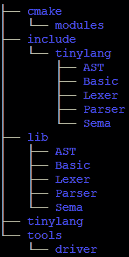

# 第四章：将源文件转换为抽象语法树

编译器通常分为两部分：前端和后端。在本章中，我们将实现编程语言的前端；也就是处理源语言的部分。我们将学习真实世界编译器使用的技术，并将其应用到我们自己的编程语言中。

我们将从定义编程语言的语法开始，以 **抽象语法树（AST）** 结束，这将成为代码生成的基础。你可以使用这种方法来为你想要实现编译器的每种编程语言。

在本章中，你将学习以下主题：

+   定义一个真正的编程语言将向你介绍 `tinylang` 语言，它是一个真正编程语言的子集，你必须为其实现一个编译器前端。

+   创建项目布局，你将为编译器创建项目布局。

+   管理源文件和用户消息，这将让你了解如何处理多个输入文件，并以愉快的方式通知用户有关问题。

+   构建词法分析器，讨论词法分析器如何分解为模块化部分。

+   构建一个递归下降解析器，将讨论从语法中导出解析器的规则，以执行语法分析。

+   使用 bison 和 flex 生成解析器和词法分析器，你将使用工具舒适地从规范中生成解析器和词法分析器。

+   执行语义分析，你将创建 AST 并评估其属性，这将与解析器交织在一起。

通过本章节你将获得的技能，你将能够为任何编程语言构建编译器前端。

# 技术要求

本章的代码文件可在[`github.com/PacktPublishing/Learn-LLVM-12/tree/master/Chapter04`](https://github.com/PacktPublishing/Learn-LLVM-12/tree/master/Chapter04)找到

你可以在[`bit.ly/3nllhED`](https://bit.ly/3nllhED)找到代码演示视频

# 定义一个真正的编程语言

一个真正的编程语言带来的挑战比简单的 `tinylang` 更多。

让我们快速浏览一下本章将使用的 `tinylang` 语法的子集。在接下来的章节中，我们将从这个语法中导出词法分析器和语法分析器：

```cpp
compilationUnit
  : "MODULE" identifier ";" ( import )* block identifier "." ;
Import : ( "FROM" identifier )? "IMPORT" identList ";" ;
Block
  : ( declaration )* ( "BEGIN" statementSequence )? "END" ;
```

Modula-2 中的编译单元以 `MODULE` 关键字开始，后面跟着模块的名称。模块的内容可以是导入模块的列表、声明和包含在初始化时运行的语句块：

```cpp
declaration
  : "CONST" ( constantDeclaration ";" )*
  | "VAR" ( variableDeclaration ";" )*
  | procedureDeclaration ";" ;
```

声明引入常量、变量和过程。已声明的常量以 `CONST` 关键字为前缀。同样，变量声明以 `VAR` 关键字开头。声明常量非常简单：

```cpp
constantDeclaration : identifier "=" expression ;
```

标识符是常量的名称。值来自表达式，必须在编译时可计算。声明变量稍微复杂一些：

```cpp
variableDeclaration : identList ":" qualident ;
qualident : identifier ( "." identifier )* ;
identList : identifier ( "," identifier)* ;
```

为了能够一次声明多个变量，必须使用标识符列表。类型的名称可能来自另一个模块，在这种情况下，前缀为模块名称。这称为限定标识符。过程需要最多的细节：

```cpp
procedureDeclaration
  : "PROCEDURE" identifier ( formalParameters )? ";"
    block identifier ;
formalParameters
  : "(" ( formalParameterList )? ")" ( ":" qualident )? ;
formalParameterList
  : formalParameter (";" formalParameter )* ;
formalParameter : ( "VAR" )? identList ":" qualident ;
```

在前面的代码中，你可以看到如何声明常量、变量和过程。过程可以有参数和返回类型。普通参数按值传递，而 `VAR` 参数按引用传递。前面的 `block` 规则中缺少的另一部分是 `statementSequence`，它只是一个单个语句的列表：

```cpp
statementSequence
  : statement ( ";" statement )* ;
```

一个语句如果后面跟着另一个语句，就用分号分隔。再次强调，只支持*Modula-2*语句的一个子集：

```cpp
statement
  : qualident ( ":=" expression | ( "(" ( expList )? ")" )? )
  | ifStatement | whileStatement | "RETURN" ( expression )? ;
```

这条规则的第一部分描述了赋值或过程调用。跟着`:=`的限定符标识符是一个赋值。另一方面，如果它后面跟着`(`，那么它就是一个过程调用。其他语句是通常的控制语句：

```cpp
ifStatement
  : "IF" expression "THEN" statementSequence
    ( "ELSE" statementSequence )? "END" ;
```

`IF`语句的语法也很简化，因为它只能有一个`ELSE`块。有了这个语句，我们可以有条件地保护一个语句：

```cpp
whileStatement
  : "WHILE" expression "DO" statementSequence "END" ;
```

`WHILE`语句描述了一个由条件保护的循环。与`IF`语句一起，这使我们能够在`tinylang`中编写简单的算法。最后，缺少表达式的定义：

```cpp
expList
  : expression ( "," expression )* ;
expression
  : simpleExpression ( relation simpleExpression )? ;
relation
  : "=" | "#" | "<" | "<=" | ">" | ">=" ;
simpleExpression
  : ( "+" | "-" )? term ( addOperator term )* ;
addOperator
  : "+" | "-" | "OR" ;
term
  : factor ( mulOperator factor )* ;
mulOperator
  : "*" | "/" | "DIV" | "MOD" | "AND" ;
factor
  : integer_literal | "(" expression ")" | "NOT" factor
  | qualident ( "(" ( expList )? ")" )? ; 
```

表达式语法与上一章中的 calc 非常相似。只支持`INTEGER`和`BOOLEAN`数据类型。

此外，还使用了`identifier`和`integer_literal`标记。一个`H`。

这已经是很多规则了，我们只覆盖了 Modula-2 的一部分！尽管如此，在这个子集中编写小型应用是可能的。让我们为`tinylang`实现一个编译器！

# 创建项目布局

`tinylang`的项目布局遵循我们在*第二章*中提出的方法，*浏览 LLVM 源码*。每个组件的源代码都在`lib`目录的子目录中，而头文件在`include/tinylang`的子目录中。子目录的名称取决于组件。在*第二章*中，*浏览 LLVM 源码*，我们只创建了`Basic`组件。

从上一章我们知道，我们需要实现词法分析器、解析器、AST 和语义分析器。每个都是自己的组件，称为`Lexer`、`Parser`、`AST`和`Sema`。在上一章中使用的目录布局如下：



图 4.1 - tinylang 项目的目录布局

这些组件有明确定义的依赖关系。在这里，`Lexer`只依赖于`Basic`。`Parser`依赖于`Basic`、`Lexer`、`AST`和`Sema`。最后，`Sema`只依赖于`Basic`和`AST`。这些明确定义的依赖关系有助于重用组件。

让我们更仔细地看看它们的实现！

# 管理源文件和用户消息

一个真正的编译器必须处理许多文件。通常，开发人员使用主编译单元的名称调用编译器。这个编译单元可以引用其他文件，例如，通过 C 中的`#include`指令或 Python 或 Modula-2 中的`import`语句。导入的模块可以导入其他模块，依此类推。所有这些文件必须加载到内存中，并通过编译器的分析阶段运行。在开发过程中，开发人员可能会出现语法或语义错误。一旦检测到，应该打印出包括源行和标记的错误消息。在这一点上，显然可以看出这个基本组件并不是简单的。

幸运的是，LLVM 带有一个解决方案：`llvm::SourceMgr`类。通过调用`AddNewSourceBuffer()`方法向`SourceMgr`添加新的源文件。或者，可以通过调用`AddIncludeFile()`方法加载文件。这两种方法都返回一个 ID 来标识缓冲区。您可以使用此 ID 来检索与关联文件的内存缓冲区的指针。要在文件中定义位置，必须使用`llvm::SMLoc`类。这个类封装了一个指向缓冲区的指针。各种`PrintMessage()`方法允许我们向用户发出错误和其他信息消息。

只缺少一个集中定义消息的方法。在大型软件（如编译器）中，您不希望在各个地方散布消息字符串。如果有要求更改消息或将其翻译成另一种语言，那么最好将它们放在一个中心位置！

一个简单的方法是每个消息都有一个 ID（一个`enum`成员），一个严重程度级别和包含消息的字符串。在你的代码中，你只引用消息 ID。当消息被打印时，严重程度级别和消息字符串才会被使用。这三个项目（ID、安全级别和消息）必须一致管理。LLVM 库使用预处理器来解决这个问题。数据存储在一个带有`.def`后缀的文件中，并且包装在一个宏名称中。该文件通常被多次包含，使用不同的宏定义。这个定义在`include/tinylang/Basic/Diagnostic.def`文件路径中，看起来如下：

```cpp
#ifndef DIAG
#define DIAG(ID, Level, Msg)
#endif
DIAG(err_sym_declared, Error, "symbol {0} already declared")
#undef DIAG
```

第一个宏参数`ID`是枚举标签，第二个参数`Level`是严重程度，第三个参数`Msg`是消息文本。有了这个定义，我们可以定义一个`DiagnosticsEngine`类来发出错误消息。接口在`include/tinylang/Basic/Diagnostic.h`文件中：

```cpp
#ifndef TINYLANG_BASIC_DIAGNOSTIC_H
#define TINYLANG_BASIC_DIAGNOSTIC_H
#include "tinylang/Basic/LLVM.h"
#include "llvm/ADT/StringRef.h"
#include "llvm/Support/FormatVariadic.h"
#include "llvm/Support/SMLoc.h"
#include "llvm/Support/SourceMgr.h"
#include "llvm/Support/raw_ostream.h"
#include <utility>
namespace tinylang {
```

在包含必要的头文件之后，现在使用`Diagnostic.def`来定义枚举。为了不污染全局命名空间，必须使用嵌套命名空间`diag`：

```cpp
namespace diag {
enum {
#define DIAG(ID, Level, Msg) ID,
#include "tinylang/Basic/Diagnostic.def"
};
} // namespace diag
```

`DiagnosticsEngine`类使用`SourceMgr`实例通过`report()`方法发出消息。消息可以有参数。为了实现这个功能，必须使用 LLVM 的可变格式支持。消息文本和严重程度级别是通过`static`方法获取的。作为奖励，发出的错误消息数量也被计算：

```cpp
class DiagnosticsEngine {
  static const char *getDiagnosticText(unsigned DiagID);
  static SourceMgr::DiagKind
  getDiagnosticKind(unsigned DiagID);
```

消息字符串由`getDiagnosticText()`返回，而级别由`getDiagnosticKind()`返回。这两个方法将在`.cpp`文件中实现：

```cpp
  SourceMgr &SrcMgr;
  unsigned NumErrors;
public:
  DiagnosticsEngine(SourceMgr &SrcMgr)
      : SrcMgr(SrcMgr), NumErrors(0) {}
  unsigned nunErrors() { return NumErrors; }
```

由于消息可以有可变数量的参数，C++中的解决方案是使用可变模板。当然，LLVM 提供的`formatv()`函数也使用了这个。为了获得格式化的消息，我们只需要转发模板参数：

```cpp
  template <typename... Args>
  void report(SMLoc Loc, unsigned DiagID,
              Args &&... Arguments) {
    std::string Msg =
        llvm::formatv(getDiagnosticText(DiagID),
                      std::forward<Args>(Arguments)...)
            .str();
    SourceMgr::DiagKind Kind = getDiagnosticKind(DiagID);
    SrcMgr.PrintMessage(Loc, Kind, Msg);
    NumErrors += (Kind == SourceMgr::DK_Error);
  }
};
} // namespace tinylang
#endif
```

到目前为止，我们已经实现了大部分的类。只有`getDiagnosticText()`和`getDiagnosticKind()`还没有。它们在`lib/Basic/Diagnostic.cpp`文件中定义，并且还使用了`Diagnostic.def`文件：

```cpp
#include "tinylang/Basic/Diagnostic.h"
using namespace tinylang;
namespace {
const char *DiagnosticText[] = {
#define DIAG(ID, Level, Msg) Msg,
#include "tinylang/Basic/Diagnostic.def"
};
```

与头文件中一样，`DIAG`宏被定义为检索所需的部分。在这里，我们将定义一个数组来保存文本消息。因此，`DIAG`宏只返回`Msg`部分。我们将使用相同的方法来处理级别：

```cpp
SourceMgr::DiagKind DiagnosticKind[] = {
#define DIAG(ID, Level, Msg) SourceMgr::DK_##Level,
#include "tinylang/Basic/Diagnostic.def"
};
} // namespace
```

毫不奇怪，这两个函数只是简单地索引数组以返回所需的数据：

```cpp
const char *
DiagnosticsEngine::getDiagnosticText(unsigned DiagID) {
  return DiagnosticText[DiagID];
}
SourceMgr::DiagKind
DiagnosticsEngine::getDiagnosticKind(unsigned DiagID) {
  return DiagnosticKind[DiagID];
}
```

`SourceMgr`和`DiagnosticsEngine`类的组合为其他组件提供了良好的基础。让我们先在词法分析器中使用它们！

# 构建词法分析器

正如我们从前一章所知，我们需要一个`Token`类和一个`Lexer`类。此外，还需要一个`TokenKind`枚举，以给每个标记类一个唯一的编号。拥有一个全能的头文件和一个实现文件并不可扩展，所以让我们重新构建一下。`TokenKind`枚举可以被普遍使用，并放在`Basic`组件中。`Token`和`Lexer`类属于`Lexer`组件，但放在不同的头文件和实现文件中。

有三种不同的标记类：`CONST`关键字，`;`分隔符和`ident`标记，代表源代码中的标识符。每个标记都需要一个枚举的成员名称。关键字和标点符号有自然的显示名称，可以用于消息。

与许多编程语言一样，关键字是标识符的子集。要将标记分类为关键字，我们需要一个关键字过滤器，检查找到的标识符是否确实是关键字。这与 C 或 C++中的行为相同，其中关键字也是标识符的子集。编程语言随着时间的推移而发展，可能会引入新的关键字。例如，最初的 K＆R C 语言没有使用`enum`关键字定义枚举。因此，应该存在一个指示关键字的语言级别的标志。

我们收集了几个信息片段，所有这些信息都属于`TokenKind`枚举的成员：枚举成员的标签，标点符号的拼写以及关键字的标志。至于诊断消息，我们将信息集中存储在名为`include/tinylang/Basic/TokenKinds.def`的`.def`文件中，如下所示。需要注意的一点是，关键字以`kw_`为前缀：

```cpp
#ifndef TOK
#define TOK(ID)
#endif
#ifndef PUNCTUATOR
#define PUNCTUATOR(ID, SP) TOK(ID)
#endif
#ifndef KEYWORD
#define KEYWORD(ID, FLAG) TOK(kw_ ## ID)
#endif
TOK(unknown)
TOK(eof)
TOK(identifier)
TOK(integer_literal)
PUNCTUATOR(plus,                "+")
PUNCTUATOR(minus,               "-")
// …
KEYWORD(BEGIN                       , KEYALL)
KEYWORD(CONST                       , KEYALL)
// …
#undef KEYWORD
#undef PUNCTUATOR
#undef TOK
```

有了这些集中定义，很容易在`include/tinylang/Basic/TokenKinds.h`文件中创建`TokenKind`枚举。同样，枚举被放入自己的命名空间中，称为`tok`：

```cpp
#ifndef TINYLANG_BASIC_TOKENKINDS_H
#define TINYLANG_BASIC_TOKENKINDS_H
namespace tinylang {
namespace tok {
enum TokenKind : unsigned short {
#define TOK(ID) ID,
#include "TokenKinds.def"
  NUM_TOKENS
};
```

现在，您应该熟悉用于填充数组的模式。`TOK`宏被定义为仅返回枚举标签的`ID`。作为有用的补充，我们还将`NUM_TOKENS`定义为枚举的最后一个成员，表示定义的标记数量：

```cpp
    const char *getTokenName(TokenKind Kind);
    const char *getPunctuatorSpelling(TokenKind Kind);
    const char *getKeywordSpelling(TokenKind Kind);
  }
}
#endif
```

实现文件`lib/Basic/TokenKinds.cpp`也使用`.def`文件来检索名称：

```cpp
#include "tinylang/Basic/TokenKinds.h"
#include "llvm/Support/ErrorHandling.h"
using namespace tinylang;
static const char * const TokNames[] = {
#define TOK(ID) #ID,
#define KEYWORD(ID, FLAG) #ID,
#include "tinylang/Basic/TokenKinds.def"
  nullptr
};
```

标记的文本名称是从其枚举标签的`ID`派生的。有两个特殊之处。首先，我们需要定义`TOK`和`KEYWORD`宏，因为`KEYWORD`的默认定义不使用`TOK`宏。其次，在数组的末尾添加了一个`nullptr`值，考虑到了添加的`NUM_TOKENS`枚举成员：

```cpp
const char *tok::getTokenName(TokenKind Kind) {
  return TokNames[Kind];
}
```

对于`getPunctuatorSpelling()`和`getKeywordSpelling()`函数，我们采用了稍微不同的方法。这些函数仅对枚举的子集返回有意义的值。这可以通过`switch`语句实现，它默认返回`nullptr`值：

```cpp
const char *tok::getPunctuatorSpelling(TokenKind Kind) {
  switch (Kind) {
#define PUNCTUATOR(ID, SP) case ID: return SP;
#include "tinylang/Basic/TokenKinds.def"
    default: break;
  }
  return nullptr;
}
const char *tok::getKeywordSpelling(TokenKind Kind) {
  switch (Kind) {
#define KEYWORD(ID, FLAG) case kw_ ## ID: return #ID;
#include "tinylang/Basic/TokenKinds.def"
    default: break;
  }
  return nullptr;
}
```

提示

请注意如何定义宏以从文件中检索所需的信息。

在上一章中，`Token`类是在与`Lexer`类相同的头文件中声明的。为了使其更模块化，我们将`Token`类放入`include/Lexer/Token.h`的头文件中。与之前一样，`Token`存储了指向标记开头的指针，长度和标记的种类，如之前定义的那样：

```cpp
class Token {
  friend class Lexer;
  const char *Ptr;
  size_t Length;
  tok::TokenKind Kind;
public:
  tok::TokenKind getKind() const { return Kind; }
  size_t getLength() const { return Length; }
```

`SMLoc`实例，表示消息中源的位置，是从标记的指针创建的：

```cpp
  SMLoc getLocation() const {
    return SMLoc::getFromPointer(Ptr);
  }
```

`getIdentifier()`和`getLiteralData()`方法允许我们访问标识符和文字数据的文本。对于任何其他标记类型，不需要访问文本，因为这是标记类型所暗示的：

```cpp
  StringRef getIdentifier() {
    assert(is(tok::identifier) &&
           "Cannot get identfier of non-identifier");
    return StringRef(Ptr, Length);
  }
  StringRef getLiteralData() {
    assert(isOneOf(tok::integer_literal,
                   tok::string_literal) &&
           "Cannot get literal data of non-literal");
    return StringRef(Ptr, Length);
  }
};
```

我们在`include/Lexer/Lexer.h`头文件中声明了`Lexer`类，并将实现放在`lib/Lexer/lexer.cpp`文件中。结构与上一章的 calc 语言相同。在这里，我们必须仔细看两个细节：

+   首先，有些运算符共享相同的前缀；例如，`<`和`<=`。当我们正在查看的当前字符是`<`时，我们必须先检查下一个字符，然后再决定我们找到了哪个标记。请记住，我们要求输入以空字节结尾。因此，如果当前字符有效，下一个字符总是可以使用的：

```cpp
    case '<':
      if (*(CurPtr + 1) == '=')
        formTokenWithChars(token, CurPtr + 2, tok::lessequal);
      else
        formTokenWithChars(token, CurPtr + 1, tok::less);
      break;
```

+   另一个细节是，在这一点上，关键字要多得多。我们该如何处理？一个简单而快速的解决方案是用关键字填充一个哈希表，这些关键字都存储在`TokenKinds.def`文件中。这可以在我们实例化`Lexer`类的同时完成。在这种方法中，也可以支持语言的不同级别，因为关键字可以根据附加的标志进行过滤。在这里，这种灵活性还不需要。在头文件中，关键字过滤器定义如下，使用`llvm::StringMap`的实例作为哈希表：

```cpp
class KeywordFilter {
  llvm::StringMap<tok::TokenKind> HashTable;
  void addKeyword(StringRef Keyword,
                  tok::TokenKind TokenCode);
public:
  void addKeywords();
```

`getKeyword()`方法返回给定字符串的标记类型，如果字符串不表示关键字，则返回默认值：

```cpp
  tok::TokenKind getKeyword(
      StringRef Name,
      tok::TokenKind DefaultTokenCode = tok::unknown) {
    auto Result = HashTable.find(Name);
    if (Result != HashTable.end())
      return Result->second;
    return DefaultTokenCode;
  }
};
```

在实现文件中，关键字表被填充：

```cpp
void KeywordFilter::addKeyword(StringRef Keyword,
                               tok::TokenKind TokenCode) 
{
  HashTable.insert(std::make_pair(Keyword, TokenCode));
}
void KeywordFilter::addKeywords() {
#define KEYWORD(NAME, FLAGS)                                 
addKeyword(StringRef(#NAME), tok::kw_##NAME);
#include "tinylang/Basic/TokenKinds.def"
}
```

有了这些技巧，编写一个高效的词法分析器类并不难。由于编译速度很重要，许多编译器使用手写的词法分析器，Clang 就是一个例子。

# 构建递归下降解析器

正如前一章所示，解析器是从其语法派生出来的。让我们回顾一下所有的*构造规则*。对于语法的每个规则，你都要创建一个方法，该方法的名称与规则左侧的非终端相同，以便解析规则的右侧。根据右侧的定义，你必须做到以下几点：

+   对于每个非终端，都会调用相应的方法。

+   每个标记都被消耗。

+   对于替代和可选或重复组，会检查先行标记（下一个未消耗的标记）以决定我们可以从哪里继续。

让我们将这些构造规则应用到语法的以下规则上：

```cpp
ifStatement
  : "IF" expression "THEN" statementSequence
    ( "ELSE" statementSequence )? "END" ;
```

我们可以很容易地将这个转换成以下的 C++方法：

```cpp
void Parser::parseIfStatement() {
  consume(tok::kw_IF);
  parseExpression();
  consume(tok::kw_THEN);
  parseStatementSequence();
  if (Tok.is(tok::kw_ELSE)) {
    advance();
    parseStatementSequence();
  }
  consume(tok::kw_END);
}
```

这样可以将`tinylang`的整个语法转换为 C++。一般来说，你必须小心并避免一些陷阱。

要注意的一个问题是左递归规则。如果右侧开始的终端与左侧相同，则规则是**左递归**。一个典型的例子可以在表达式的语法中找到：

```cpp
expression : expression "+" term ;
```

如果从语法中还不清楚，那么将其翻译成 C++应该很明显，这会导致无限递归：

```cpp
Void Parser::parseExpression() {
  parseExpression();
  consume(tok::plus);
  parseTerm();
}
```

左递归也可能间接发生，并涉及更多的规则，这更难以发现。这就是为什么存在一种算法，可以检测和消除左递归。

在每一步，解析器只需使用先行标记就可以决定如何继续。如果这个决定不能被确定性地做出，那么就说语法存在冲突。为了说明这一点，让我们来看看 C#中的`using`语句。就像在 C++中一样，`using`语句可以用来使一个符号在命名空间中可见，比如`using Math;`。还可以为导入的符号定义别名；也就是说，`using M = Math;`。在语法中，这可以表示如下：

```cpp
usingStmt : "using" (ident "=")? ident ";"
```

显然，这里存在一个问题。在解析器消耗了`using`关键字之后，先行标记是`ident`。但这个信息对我们来说不足以决定是否必须跳过或解析可选组。如果可选组的开始标记集与可选组后面的标记集重叠，那么这种情况总是会出现。

让我们用一个替代而不是一个可选组来重写规则：

```cpp
usingStmt : "using" ( ident "=" ident | ident ) ";" ;
```

现在，有一个不同的冲突：两种选择都以相同的标记开头。只看先行标记，解析器无法确定哪个选择是正确的。

这些冲突非常常见。因此，了解如何处理它们是很好的。一种方法是以这样的方式重写语法，使冲突消失。在前面的例子中，两种选择都以相同的标记开头。这可以被分解出来，得到以下规则：

```cpp
usingStmt : "using" ident ("=" ident)? ";" ;
```

这种表述没有冲突。但是，也应该注意到它的表达力较弱。在另外两种表述中，很明显哪个`ident`是别名，哪个`ident`是命名空间名称。在这个无冲突的规则中，最左边的`ident`改变了它的角色。首先，它是命名空间名称，但如果后面跟着一个等号（`=`），那么它就变成了别名。

第二种方法是添加一个额外的谓词来区分两种情况。这个谓词通常被称为`Token &peek(int n)`方法，它返回当前向前看标记之后的第 n 个标记。在这里，等号的存在可以作为决定的一个额外谓词：

```cpp
if (Tok.is(tok::ident) && Lex.peek(0).is(tok::equal)) {
  advance();
  consume(tok::equal);
}
consume(tok::ident);
```

现在，让我们加入错误恢复。在上一章中，我介绍了所谓的*恐慌模式*作为错误恢复的一种技术。基本思想是跳过标记，直到找到适合继续解析的标记。例如，在`tinylang`中，一个语句后面跟着一个分号（`;`）。

如果在`IF`语句中有语法问题，那么你会跳过所有标记，直到找到一个分号为止。然后，你继续下一个语句。不要使用特定的标记集的临时定义，最好使用系统化的方法。

对于每个非终结符，计算可以跟随非终结符的任何地方的标记集（称为`；`，`ELSE`和`END`标记可以跟随）。因此，在`parseStatement()`的错误恢复部分中使用这个集合。这种方法假设可以在本地处理语法错误。一般来说，这是不可能的。因为解析器跳过标记，可能会跳过太多标记，导致到达输入的末尾。在这一点上，本地恢复是不可能的。

为了防止无意义的错误消息，调用方法需要被告知错误恢复仍然没有完成。这可以通过`bool`返回值来实现：`true`表示错误恢复尚未完成，而`false`表示解析（包括可能的错误恢复）成功完成。

有许多方法可以扩展这种错误恢复方案。一个流行的方法是还使用活动调用者的 FOLLOW 集。举个简单的例子，假设`parseStatement()`被`parseStatementSequence()`调用，而后者被`parseBlock()`调用，而后者又被`parseModule()`调用。

在这里，每个相应的非终结符都有一个 FOLLOW 集。如果解析器在`parseStatement()`中检测到语法错误，那么会跳过标记，直到标记至少在活动调用者的 FOLLOW 集中的一个中。如果标记在语句的 FOLLOW 集中，那么错误会在本地恢复，向调用者返回一个`false`值。否则，返回一个`true`值，表示错误恢复必须继续。这种扩展的可能实现策略是将一个`std::bitset`或`std::tuple`传递给被调用者，表示当前 FOLLOW 集的并集。

还有一个问题尚未解决：我们如何调用错误恢复？在上一章中，使用了`goto`来跳转到错误恢复块。这样做虽然有效，但并不是一个令人满意的解决方案。根据之前的讨论，我们可以在一个单独的方法中跳过标记。Clang 有一个名为`skipUntil()`的方法，可以用于这个目的，我们也可以在`tinylang`中使用这个方法。

因为接下来要向解析器添加语义动作，如果有必要，最好有一个集中的地方放置清理代码。嵌套函数对此来说是理想的。C++没有嵌套函数。相反，lambda 函数可以起到类似的作用。完整的错误恢复的`parseIfStatement()`方法如下所示：

```cpp
bool Parser::parseIfStatement() {
  auto _errorhandler = [this] {
    return SkipUntil(tok::semi, tok::kw_ELSE, tok::kw_END);
  };
  if (consume(tok::kw_IF))
    return _errorhandler();
  if (parseExpression(E))
    return _errorhandler();
  if (consume(tok::kw_THEN))
    return _errorhandler();
  if (parseStatementSequence(IfStmts))
    return _errorhandler();
  if (Tok.is(tok::kw_ELSE)) {
    advance();
    if (parseStatementSequence(ElseStmts))
      return _errorhandler();
  }
  if (expect(tok::kw_END))
    return _errorhandler();
  return false;
}
```

# 使用 bison 和 flex 生成解析器和词法分析器

手动构建词法分析器和解析器并不困难，通常会产生快速的组件。缺点是很难引入更改，特别是在解析器中。如果您正在原型设计一种新的编程语言，这可能很重要。使用专门的工具可以缓解这个问题。

有许多可用的工具可以从规范文件生成词法分析器或解析器。在 Linux 世界中，**flex** (https://github.com/westes/flex) 和 **bison** ([`www.gnu.org/software/bison/`](https://www.gnu.org/software/bison/)) 是最常用的工具。Flex 从一组正则表达式生成词法分析器，而 bison 从语法描述生成解析器。通常，这两个工具一起使用。

Bison 生成的`tinylang`，存储在`tinylang.yy`文件中，以以下序言开始：

```cpp
%require "3.2"
%language "c++"
%defines "Parser.h"
%define api.namespace {tinylang}
%define api.parser.class {Parser}
%define api.token.prefix {T_}
%token
  identifier integer_literal string_literal
  PLUS MINUS STAR SLASH 
```

我们使用`%language`指令指示 bison 生成 C++代码。使用`%define`指令，我们覆盖了一些代码生成的默认值：生成的类应该命名为`Parser`，并位于`tinylang`命名空间中。此外，表示标记种类的枚举成员应以`T_`为前缀。我们要求版本为 3.2 或更高，因为这些变量中的一些是在此版本中引入的。为了能够与 flex 交互，我们告诉 bison 使用`%defines`指令写入一个`Parser.h`头文件。最后，我们必须使用`%token`指令声明所有使用的标记。语法规则在`%%`之后：

```cpp
%%
compilationUnit
  : MODULE identifier SEMI imports block identifier PERIOD ;
imports : %empty | import imports ;
import
  : FROM identifier IMPORT identList SEMI
  | IMPORT identList SEMI ;
```

请将这些规则与本章第一节中显示的语法规范进行比较。Bison 不知道重复组，因此我们需要添加一个称为`imports`的新规则来模拟这种重复。在`import`规则中，我们必须引入一个替代方案来模拟可选组。

我们还需要以这种方式重写`tinylang`语法的其他规则。例如，`IF`语句的规则变成了以下内容：

```cpp
ifStatement
  : IF expression THEN statementSequence
    elseStatement END ;
elseStatement : %empty | ELSE statementSequence ;
```

同样，我们必须引入一个新规则来模拟可选的`ELSE`语句。`%empty`指令可以省略，但使用它可以清楚地表明这是一个空的替代分支。

一旦我们以 bison 风格重写了所有语法规则，就可以使用以下命令生成解析器：

```cpp
$ bison tinylang.yy
```

这就是创建一个类似于上一节手写的解析器所需的全部内容！

同样，flex 易于使用。Flex 的规范是一系列正则表达式和相关联的操作，如果正则表达式匹配，则执行该操作。`tinylang.l`文件指定了`tinylang`的词法分析器。与 bison 规范一样，它以序言开始：

```cpp
%{
#include "Parser.h"
%}
%option noyywrap nounput noinput batch
id       [a-zA-Z_][a-zA-Z_0-9]*
digit    [0-9]
hexdigit [0-9A-F]
space    [ \t\r]
```

`%{` `}%`内的文本被复制到 flex 生成的文件中。我们使用这种机制来包含 bison 生成的头文件。使用`%option`指令，我们控制生成的词法分析器应具有哪些特性。我们只读取一个文件，不希望在到达文件末尾后继续读取另一个文件，因此我们指定`noyywrap`以禁用此功能。我们也不需要访问底层文件流，并使用`nounput`和`noinout`禁用它。最后，因为我们不需要交互式词法分析器，我们要求生成一个`batch`扫描器。

在序言中，我们还可以定义字符模式以供以后使用。在`%%`之后是定义部分：

```cpp
%%
{space}+
{digit}+      return
                   tinylang::Parser::token::T_integer_literal;
```

在定义部分，您指定一个正则表达式模式和一个要执行的操作，如果模式匹配输入。操作也可以为空。

`{space}+`模式使用序言中定义的`space`字符模式。它匹配一个或多个空白字符。我们没有定义操作，因此所有空白将被忽略。

为了匹配一个数字，我们使用`{digit}+`模式。作为操作，我们只返回相关的标记种类。对于所有标记都是这样做的。例如，我们对算术运算符做如下操作：

```cpp
"+"             return tinylang::Parser::token::T_PLUS;
"-"             return tinylang::Parser::token::T_MINUS;
"*"             return tinylang::Parser::token::T_STAR;
"/"             return tinylang::Parser::token::T_SLASH;
```

如果有多个模式匹配输入，则选择最长匹配的模式。如果仍然有多个模式匹配输入，则选择规范文件中按字典顺序排列的第一个模式。这就是为什么首先定义关键字的模式，然后才定义标识符的模式很重要：

```cpp
"VAR"           return tinylang::Parser::token::T_VAR;
"WHILE"         return tinylang::Parser::token::T_WHILE;
{id}            return tinylang::Parser::token::T_identifier;
```

这些操作不仅仅限于`return`语句。如果你的代码需要多于一行，那么你必须用大括号`{` `}`括起你的代码。

扫描器是用以下命令生成的：

```cpp
$ flex –c++ tinylang.l
```

你的语言项目应该使用哪种方法？解析器生成器通常生成 LALR(1)解析器。LALR(1)类比 LL(1)类更大，递归下降解析器可以构造。如果无法调整语法使其适合 LL(1)类，则应考虑使用解析器生成器。手动构造这样的自底向上解析器是不可行的。即使你的语法是 LL(1)，解析器生成器提供了更多的舒适性，同时生成的代码与手动编写的代码相似。通常，这是受许多因素影响的选择。Clang 使用手写解析器，而 GCC 使用 bison 生成的解析器。

# 执行语义分析

在前一节中构造的解析器只检查输入的语法。下一步是添加执行语义分析的能力。在上一章的 calc 示例中，解析器构造了一个 AST。在单独的阶段，语义分析器对这棵树进行了处理。这种方法总是可以使用的。在本节中，我们将使用稍微不同的方法，更加交织解析器和语义分析器。

这些是语义分析器必须执行的一些任务：

+   对于每个声明，语义分析器必须检查所使用的名称是否已经在其他地方声明过。

+   对于表达式或语句中的每个名称出现，语义分析器必须检查名称是否已声明，并且所需的使用是否符合声明。

+   对于每个表达式，语义分析器必须计算结果类型。还需要计算表达式是否是常量，如果是，还需要计算它的值。

+   对于赋值和参数传递，语义分析器必须检查类型是否兼容。此外，我们必须检查`IF`和`WHILE`语句中的条件是否为`BOOLEAN`类型。

对于编程语言的这么小的子集来说，这已经是很多要检查的了！

## 处理名称的作用域

让我们先来看看名称的作用域。名称的作用域是名称可见的范围。像 C 一样，`tinylang`使用先声明后使用的模型。例如，`B`和`X`变量在模块级别声明，因此它们是`INTEGER`类型：

```cpp
VAR B, X: INTEGER;
```

在声明之前，变量是未知的，不能使用。只有在声明之后才能使用。在过程内，可以声明更多的变量：

```cpp
PROCEDURE Proc;
VAR B: BOOLEAN;
BEGIN
  (* Statements *)
END Proc;
```

在此过程内，在注释所在的位置，使用`B`指的是局部变量`B`，而使用`X`指的是全局变量`X`。局部变量`B`的作用域是`Proc`过程。如果在当前作用域中找不到名称，则在封闭作用域中继续搜索。因此，`X`变量可以在过程内使用。在`tinylang`中，只有模块和过程会打开新的作用域。其他语言构造，如`struct`和`class`通常也会打开作用域。预定义实体，如`INTEGER`类型或`TRUE`文字，是在全局作用域中声明的，包围模块的作用域。

在`tinylang`中，只有名称是关键的。因此，作用域可以实现为名称到其声明的映射。只有当名称不存在时才能插入新名称。对于查找，还必须知道封闭或父作用域。接口（在`include/tinylang/Sema/Scope.h`文件中）如下：

```cpp
#ifndef TINYLANG_SEMA_SCOPE_H
#define TINYLANG_SEMA_SCOPE_H
#include "tinylang/Basic/LLVM.h"
#include "llvm/ADT/StringMap.h"
#include "llvm/ADT/StringRef.h"
namespace tinylang {
class Decl;
class Scope {
  Scope *Parent;
  StringMap<Decl *> Symbols;
public:
  Scope(Scope *Parent = nullptr) : Parent(Parent) {}
  bool insert(Decl *Declaration);
  Decl *lookup(StringRef Name);
  Scope *getParent() { return Parent; }
};
} // namespace tinylang
#endif
```

`lib/Sema/Scope.cpp`文件中的实现如下：

```cpp
#include "tinylang/Sema/Scope.h"
#include "tinylang/AST/AST.h"
using namespace tinylang;
bool Scope::insert(Decl *Declaration) {
  return Symbols
      .insert(std::pair<StringRef, Decl *>(
          Declaration->getName(), Declaration))
      .second;
}
```

请注意，`StringMap::insert()`方法不会覆盖现有条目。结果`std::pair`的`second`成员指示表是否已更新。此信息返回给调用者。

为了实现符号声明的搜索，`lookup()`方法搜索当前作用域；如果找不到任何内容，则搜索由`parent`成员链接的作用域：

```cpp
Decl *Scope::lookup(StringRef Name) {
  Scope *S = this;
  while (S) {
    StringMap<Decl *>::const_iterator I =
        S->Symbols.find(Name);
    if (I != S->Symbols.end())
      return I->second;
    S = S->getParent();
  }
  return nullptr;
}
```

然后变量声明如下处理：

+   当前作用域是模块作用域。

+   查找`INTEGER`类型声明。如果找不到声明或者它不是类型声明，则会出错。

+   实例化一个新的 AST 节点`VariableDeclaration`，重要属性是名称`B`和类型。

+   名称`B`被插入到当前作用域中，映射到声明实例。如果名称已经存在于作用域中，则这是一个错误。在这种情况下，当前作用域的内容不会改变。

+   对`X`变量也是同样的操作。

这里执行了两项任务。就像在 calc 示例中一样，构造了 AST 节点。同时，计算了节点的属性，例如其类型。为什么这是可能的？

语义分析器可以回退到两组不同的属性。作用域从调用者那里继承。类型声明可以通过评估类型声明的名称来计算（或合成）。语言设计成这样的方式，这两组属性足以计算 AST 节点的所有属性。

其中一个重要方面是*先声明后使用*模型。如果一种语言允许在声明之前使用名称，例如 C++中类内的成员，那么不可能一次计算 AST 节点的所有属性。在这种情况下，AST 节点必须只用部分计算的属性或纯粹的信息（例如在 calc 示例中）构造。

AST 必须被访问一次或多次以确定缺失的信息。在`tinylang`（和 Modula-2）的情况下，也可以不使用 AST 构造 - AST 是通过`parseXXX()`方法的调用层次结构间接表示的。从 AST 生成代码更为常见，因此我们也在这里构造了一个 AST。

在我们将所有部分放在一起之前，我们需要了解 LLVM 使用运行时类型信息（RTTI）的风格。

## 在 AST 中使用 LLVM 风格的 RTTI

当然，AST 节点是类层次结构的一部分。声明总是有一个名称。其他属性取决于正在声明的内容。如果声明了变量，则需要一个类型。常量声明需要一个类型和一个值，依此类推。当然，在运行时，您需要找出正在处理的声明的类型。可以使用`dynamic_cast<>` C++运算符来实现这一点。问题在于，如果 C++类附有虚表，即使用虚函数，则所需的 RTTI 才可用；另一个缺点是 C++ RTTI 过于臃肿。为了避免这些缺点，LLVM 开发人员引入了一种自制的 RTTI 风格，该风格在整个 LLVM 库中使用。

我们层次结构的（抽象）基类是`Decl`。为了实现 LLVM 风格的 RTTI，需要添加一个包含每个子类标签的公共枚举。此外，还需要一个私有成员和一个公共 getter 方法。私有成员通常称为`Kind`。在我们的情况下，看起来是这样的：

```cpp
class Decl {
public:
  enum DeclKind { DK_Module, DK_Const, DK_Type,
                  DK_Var, DK_Param, DK_Proc };
private:
  const DeclKind Kind;
public:
  DeclKind getKind() const { return Kind; }
};
```

现在每个子类都需要一个名为`classof`的特殊函数成员。此函数的目的是确定给定实例是否是请求的类型。对于`VariableDeclaration`，它的实现如下：

```cpp
static bool classof(const Decl *D) {
  return D->getKind() == DK_Var;
}
```

现在，您可以使用`llvm::isa<>`特殊模板来检查对象是否是请求类型的对象，并使用`llvm::dyn_cast<>`来动态转换对象。还有更多的模板存在，但这两个是最常用的。有关其他模板，请参见[`llvm.org/docs/ProgrammersManual.html#the-isa-cast-and-dyn-cast-templates`](https://llvm.org/docs/ProgrammersManual.html#the-isa-cast-and-dyn-cast-templates)，有关 LLVM 样式的更多信息，包括更高级的用法，请参见[`llvm.org/docs/HowToSetUpLLVMStyleRTTI.html`](https://llvm.org/docs/HowToSetUpLLVMStyleRTTI.html)。

## 创建语义分析器

有了这些知识，我们现在可以实现语义分析器，它操作由解析器创建的 AST 节点。首先，我们将实现存储在`include/llvm/tinylang/AST/AST.h`文件中的变量的 AST 节点的定义。除了支持 LLVM 样式的 RTTI 外，基类还存储声明的名称、名称的位置和指向封闭声明的指针。后者是为了生成嵌套过程所必需的。`Decl`基类声明如下：

```cpp
class Decl {
public:
  enum DeclKind { DK_Module, DK_Const, DK_Type,
                  DK_Var, DK_Param, DK_Proc };
private:
  const DeclKind Kind;
protected:
  Decl *EnclosingDecL;
  SMLoc Loc;
  StringRef Name;
public:
  Decl(DeclKind Kind, Decl *EnclosingDecL, SMLoc Loc,
       StringRef Name)
      : Kind(Kind), EnclosingDecL(EnclosingDecL), Loc(Loc),
        Name(Name) {}
  DeclKind getKind() const { return Kind; }
  SMLoc getLocation() { return Loc; }
  StringRef getName() { return Name; }
  Decl *getEnclosingDecl() { return EnclosingDecL; }
};
```

变量的声明只是添加了指向类型声明的指针：

```cpp
class TypeDeclaration;
class VariableDeclaration : public Decl {
  TypeDeclaration *Ty;
public:
  VariableDeclaration(Decl *EnclosingDecL, SMLoc Loc,
                      StringRef Name, TypeDeclaration *Ty)
      : Decl(DK_Var, EnclosingDecL, Loc, Name), Ty(Ty) {}
  TypeDeclaration *getType() { return Ty; }
  static bool classof(const Decl *D) {
    return D->getKind() == DK_Var;
  }
};
```

解析器中的方法需要扩展语义动作和已收集信息的变量：

```cpp
bool Parser::parseVariableDeclaration(DeclList &Decls) {
  auto _errorhandler = [this] {
    while (!Tok.is(tok::semi)) {
      advance();
      if (Tok.is(tok::eof)) return true;
    }
    return false;
  };
  Decl *D = nullptr; IdentList Ids;
  if (parseIdentList(Ids)) return _errorhandler();
  if (consume(tok::colon)) return _errorhandler();
  if (parseQualident(D)) return _errorhandler();
  Actions.actOnVariableDeclaration(Decls, Ids, D);
  return false;
}
```

`DeclList`是一个称为`std::vector<Decl*>`的声明列表，而`IdentList`是一个称为`std::vector<std::pair<SMLoc, StringRef>>`的位置和标识符列表。

`parseQualident()`方法返回一个声明，在这种情况下，预期是一个类型声明。

解析器类知道语义分析器类`Sema`的一个实例，它存储在`Actions`成员中。调用`actOnVariableDeclaration()`运行语义分析器和 AST 构造。实现在`lib/Sema/Sema.cpp`文件中：

```cpp
void Sema::actOnVariableDeclaration(DeclList &Decls,
                                    IdentList &Ids,
                                    Decl *D) {
  if (TypeDeclaration *Ty = dyn_cast<TypeDeclaration>(D)) {
    for (auto I = Ids.begin(), E = Ids.end(); I != E; ++I) {
      SMLoc Loc = I->first;
      StringRef Name = I->second;
      VariableDeclaration *Decl = new VariableDeclaration(
          CurrentDecl, Loc, Name, Ty);
      if (CurrentScope->insert(Decl))
        Decls.push_back(Decl);
      else
        Diags.report(Loc, diag::err_symbold_declared, Name);
    }
  } else if (!Ids.empty()) {
    SMLoc Loc = Ids.front().first;
    Diags.report(Loc, diag::err_vardecl_requires_type);
  }
}
```

首先，使用`llvm::dyn_cast<TypeDeclaration>`检查类型声明。如果它不是类型声明，则打印错误消息。否则，对于`Ids`列表中的每个名称，实例化一个`VariableDeclaration`并将其添加到声明列表中。如果将变量添加到当前作用域失败，因为名称已经被声明，则打印错误消息。

大多数其他实体以相同的方式构建，它们的语义分析复杂性是唯一的区别。模块和过程需要更多的工作，因为它们打开了一个新的作用域。打开一个新的作用域很容易：只需实例化一个新的`Scope`对象。一旦模块或过程被解析，作用域必须被移除。

这必须以可靠的方式完成，因为我们不希望在语法错误的情况下将名称添加到错误的作用域中。这是 C++中**资源获取即初始化**（**RAII**）习惯用法的经典用法。另一个复杂性来自于过程可以递归调用自身的事实。因此，必须在使用之前将过程的名称添加到当前作用域中。语义分析器有两种方法可以进入和离开作用域。作用域与声明相关联：

```cpp
void Sema::enterScope(Decl *D) {
  CurrentScope = new Scope(CurrentScope);
  CurrentDecl = D;
}
void Sema::leaveScope() {
  Scope *Parent = CurrentScope->getParent();
  delete CurrentScope;
  CurrentScope = Parent;
  CurrentDecl = CurrentDecl->getEnclosingDecl();
}
```

一个简单的辅助类用于实现 RAII 习惯用法：

```cpp
class EnterDeclScope {
  Sema &Semantics;
public:
  EnterDeclScope(Sema &Semantics, Decl *D)
      : Semantics(Semantics) {
    Semantics.enterScope(D);
  }
  ~EnterDeclScope() { Semantics.leaveScope(); }
};
```

在解析模块或过程时，现在有两种与语义分析器的交互。第一种是在解析名称之后。在这里，（几乎为空的）AST 节点被构造，并建立了一个新的作用域：

```cpp
bool Parser::parseProcedureDeclaration(/* … */) {
  /* … */
  if (consume(tok::kw_PROCEDURE)) return _errorhandler();
  if (expect(tok::identifier)) return _errorhandler();
  ProcedureDeclaration *D =
      Actions.actOnProcedureDeclaration(
          Tok.getLocation(), Tok.getIdentifier());
  EnterDeclScope S(Actions, D);
  /* … */
}
```

语义分析器不仅仅是检查当前作用域中的名称并返回 AST 节点：

```cpp
ProcedureDeclaration *
Sema::actOnProcedureDeclaration(SMLoc Loc, StringRef Name) {
  ProcedureDeclaration *P =
      new ProcedureDeclaration(CurrentDecl, Loc, Name);
  if (!CurrentScope->insert(P))
    Diags.report(Loc, diag::err_symbold_declared, Name);
  return P;
}
```

一旦所有声明和过程的主体被解析，真正的工作就开始了。基本上，语义分析器只需要检查过程声明末尾的名称是否等于过程的名称，并且用于返回类型的声明是否真的是一个类型声明：

```cpp
void Sema::actOnProcedureDeclaration(
    ProcedureDeclaration *ProcDecl, SMLoc Loc,
    StringRef Name, FormalParamList &Params, Decl *RetType,
    DeclList &Decls, StmtList &Stmts) {
  if (Name != ProcDecl->getName()) {
    Diags.report(Loc, diag::err_proc_identifier_not_equal);
    Diags.report(ProcDecl->getLocation(),
                 diag::note_proc_identifier_declaration);
  }
  ProcDecl->setDecls(Decls);
  ProcDecl->setStmts(Stmts);
  auto RetTypeDecl =
      dyn_cast_or_null<TypeDeclaration>(RetType);
  if (!RetTypeDecl && RetType)
    Diags.report(Loc, diag::err_returntype_must_be_type,
                 Name);
  else
    ProcDecl->setRetType(RetTypeDecl);
}
```

一些声明是固有的，无法由开发人员定义。这包括`BOOLEAN`和`INTEGER`类型以及`TRUE`和`FALSE`字面量。这些声明存在于全局范围，并且必须以编程方式添加。Modula-2 还预定义了一些过程，例如`INC`或`DEC`，这些过程也应该添加到全局范围。鉴于我们的类，全局范围的初始化很简单：

```cpp
void Sema::initialize() {
  CurrentScope = new Scope();
  CurrentDecl = nullptr;
  IntegerType =
      new TypeDeclaration(CurrentDecl, SMLoc(), "INTEGER");
  BooleanType =
      new TypeDeclaration(CurrentDecl, SMLoc(), "BOOLEAN");
  TrueLiteral = new BooleanLiteral(true, BooleanType);
  FalseLiteral = new BooleanLiteral(false, BooleanType);
  TrueConst = new ConstantDeclaration(CurrentDecl, SMLoc(),
                                      "TRUE", TrueLiteral);
  FalseConst = new ConstantDeclaration(
      CurrentDecl, SMLoc(), "FALSE", FalseLiteral);
  CurrentScope->insert(IntegerType);
  CurrentScope->insert(BooleanType);
  CurrentScope->insert(TrueConst);
  CurrentScope->insert(FalseConst);
}
```

有了这个方案，`tinylang`的所有必需计算都可以完成。例如，要计算表达式是否产生常量值，您必须确保发生以下情况：

+   字面量或对常量声明的引用是常量。

+   如果表达式的两侧都是常量，那么应用运算符也会产生一个常量。

这些规则很容易嵌入到语义分析器中，同时为表达式创建 AST 节点。同样，类型和常量值可以被计算。

应该指出，并非所有类型的计算都可以以这种方式完成。例如，要检测未初始化变量的使用，可以使用一种称为符号解释的方法。在其一般形式中，该方法需要通过 AST 的特殊遍历顺序，这在构建时是不可能的。好消息是，所提出的方法创建了一个完全装饰的 AST，可以用于代码生成。当然，可以根据需要打开或关闭昂贵的分析，这个 AST 当然可以用于进一步的分析。

要玩转前端，您还需要更新驱动程序。由于缺少代码生成，正确的`tinylang`程序不会产生任何输出。但是，它可以用来探索错误恢复并引发语义错误：

```cpp
#include "tinylang/Basic/Diagnostic.h"
#include "tinylang/Basic/Version.h"
#include "tinylang/Parser/Parser.h"
#include "llvm/Support/InitLLVM.h"
#include "llvm/Support/raw_ostream.h"
using namespace tinylang;
int main(int argc_, const char **argv_) {
  llvm::InitLLVM X(argc_, argv_);
  llvm::SmallVector<const char *, 256> argv(argv_ + 1,
                                            argv_ + argc_);
  llvm::outs() << "Tinylang "
               << tinylang::getTinylangVersion() << "\n";
  for (const char *F : argv) {
    llvm::ErrorOr<std::unique_ptr<llvm::MemoryBuffer>>
        FileOrErr = llvm::MemoryBuffer::getFile(F);
    if (std::error_code BufferError =
            FileOrErr.getError()) {
      llvm::errs() << "Error reading " << F << ": "
                   << BufferError.message() << "\n";
      continue;
    }
    llvm::SourceMgr SrcMgr;
    DiagnosticsEngine Diags(SrcMgr);
    SrcMgr.AddNewSourceBuffer(std::move(*FileOrErr),
                              llvm::SMLoc());
    auto lexer = Lexer(SrcMgr, Diags);
    auto sema = Sema(Diags);
    auto parser = Parser(lexer, sema);
    parser.parse();
  }
}
```

恭喜！您已经完成了对`tinylang`前端的实现！

现在，让我们尝试一下我们到目前为止学到的东西。保存以下源代码，这是欧几里德最大公约数算法的实现，保存为`Gcd.mod`文件：

```cpp
MODULE Gcd;
PROCEDURE GCD(a, b: INTEGER):INTEGER;
VAR t: INTEGER;
BEGIN
  IF b = 0 THEN RETURN a; END;
  WHILE b # 0 DO
    t := a MOD b;
    a := b;
    b := t;
  END;
  RETURN a;
END GCD;
END Gcd.
```

让我们用以下命令在这个文件上运行编译器：

```cpp
$ tinylang Gcm.mod
Tinylang 0.1
```

除了打印版本号之外，没有其他输出。这是因为只实现了前端部分。但是，如果更改源代码以包含语法错误，那么将打印错误消息。

我们将在下一章讨论代码生成，继续这个有趣的话题。

# 总结

在本章中，您了解了现实世界编译器在前端使用的技术。从项目的布局开始，您为词法分析器、解析器和语义分析器创建了单独的库。为了向用户输出消息，您扩展了现有的 LLVM 类，这允许消息被集中存储。词法分析器现在已经分成了几个接口。

然后，您学会了如何从语法描述中构建递归下降解析器，要避免哪些陷阱，以及如何使用生成器来完成工作。您构建的语义分析器执行了语言所需的所有语义检查，同时与解析器和 AST 构造交织在一起。

您的编码工作的结果是一个完全装饰的 AST，将在下一章中用于生成 IR 代码和目标代码。
