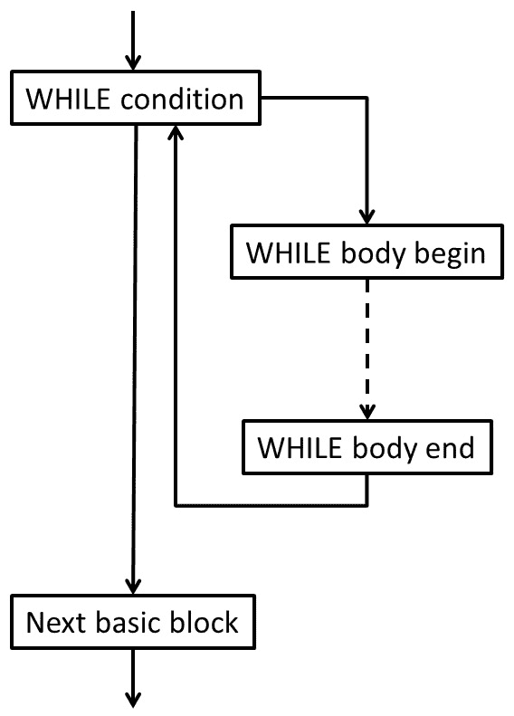

# 第五章：IR 代码生成基础

创建了装饰的**抽象语法树**（**AST**）用于您的编程语言后，下一个任务是从中生成 LLVM IR 代码。LLVM IR 代码类似于三地址代码，具有人类可读的表示。因此，我们需要一个系统化的方法来将语言概念，如控制结构，转换为 LLVM IR 的较低级别。

在本章中，您将学习 LLVM IR 的基础知识，以及如何从 AST 中为控制流结构生成 IR。您还将学习如何使用现代算法以**静态单赋值**（**SSA**）**形式**为表达式生成 LLVM IR。最后，您将学习如何发出汇编文本和目标代码。

本章将涵盖以下主题：

+   从 AST 生成 IR

+   使用 AST 编号以 SSA 形式生成 IR 代码

+   设置模块和驱动程序

在本章结束时，您将掌握创建自己的编程语言的代码生成器的知识，以及如何将其集成到自己的编译器中。

# 技术要求

本章的代码文件可在[`github.com/PacktPublishing/Learn-LLVM-12/tree/master/Chapter05/tinylang`](https://github.com/PacktPublishing/Learn-LLVM-12/tree/master/Chapter05/tinylang)找到

您可以在[`bit.ly/3nllhED`](https://bit.ly/3nllhED)找到代码的实际操作视频

# 从 AST 生成 IR

LLVM 代码生成器将模块作为 IR 的描述输入，并将其转换为目标代码或汇编文本。我们需要将 AST 表示转换为 IR。为了实现 IR 代码生成器，我们将首先查看一个简单的示例，然后开发所需的类：`CodeGenerator`、`CGModule`和`CGProcedure`类。`CodeGenerator`类是编译器驱动程序使用的通用接口。`CGModule`和`CGProcedure`类保存了为编译单元和单个函数生成 IR 代码所需的状态。

我们将从下一节开始查看`clang`生成的 IR。

## 理解 IR 代码

在生成 IR 代码之前，了解 IR 语言的主要元素是很有用的。在[*第三章*]（B15647_03_ePub_RK.xhtml#_idTextAnchor048）*编译器的结构*中，我们已经简要地看了 IR。了解 IR 的更多知识的简单方法是研究`clang`的输出。例如，保存这个 C 源代码，它实现了欧几里德算法来计算两个数的最大公约数，命名为`gcd.c`：

```cpp
unsigned gcd(unsigned a, unsigned b) {
  if (b == 0)
    return a;
  while (b != 0) {
    unsigned t = a % b;
    a = b;
    b = t;
  }
  return a;
}
```

然后，您可以使用以下命令创建 IR 文件`gcd.ll`：

```cpp
$ clang --target=aarch64-linux-gnu –O1 -S -emit-llvm gcd.c
```

IR 代码并非目标无关，即使它看起来经常是这样。前面的命令在 Linux 上为 ARM 64 位 CPU 编译源文件。`-S`选项指示`clang`输出一个汇编文件，并通过额外的`-emit-llvm`规范创建一个 IR 文件。优化级别`-O1`用于获得易于阅读的 IR 代码。让我们来看看生成的文件，并了解 C 源代码如何映射到 IR。在文件顶部，建立了一些基本属性：

```cpp
; ModuleID = 'gcd.c'
source_filename = "gcd.c"
target datalayout = "e-m:e-i8:8:32-i16:16:32-i64:64-
                     i128:128-n32:64-S128"
target triple = "aarch64-unknown-linux-gnu"
```

第一行是一个注释，告诉您使用了哪个模块标识符。在下一行，命名了源文件的文件名。使用`clang`，两者是相同的。

`target datalayout`字符串建立了一些基本属性。它的部分由`-`分隔。包括以下信息：

+   小写的`e`表示内存中的字节使用小端模式存储。要指定大端模式，使用大写的`E`。

+   `m：`指定应用于符号的名称修饰。这里，`m:e`表示使用了 ELF 名称修饰。

+   `iN:A:P`形式的条目，例如`i8:8:32`，指定了以位为单位的数据对齐。第一个数字是 ABI 所需的对齐，第二个数字是首选对齐。对于字节（`i8`），ABI 对齐是 1 字节（`8`），首选对齐是 4 字节（`32`）。

+   `n`指定了可用的本机寄存器大小。`n32:64`表示本机支持 32 位和 64 位宽整数。

+   `S`指定了堆栈的对齐方式，同样是以位为单位。`S128`表示堆栈保持 16 字节对齐。

注意

目标数据布局可以提供更多的信息。您可以在参考手册中找到完整的信息，网址为[`llvm.org/docs/LangRef.html#data-layout`](https://llvm.org/docs/LangRef.html#data-layout)。

最后，`target triple`字符串指定了我们正在编译的架构。这对于我们在命令行上提供的信息至关重要。您将在*第二章*中找到对 triple 的更深入讨论，*LLVM 源码之旅*。

接下来，在 IR 文件中定义了`gcd`函数。

```cpp
define i32 @gcd(i32 %a, i32 %b) {
```

这类似于 C 文件中的函数签名。`unsigned`数据类型被翻译为 32 位整数类型`i32`。函数名以`@`为前缀，参数名以`%`为前缀。函数体用大括号括起来。函数体的代码如下：

```cpp
entry:
  %cmp = icmp eq i32 %b, 0
  br i1 %cmp, label %return, label %while.body
```

IR 代码是以所谓的`entry`组织的。块中的代码很简单：第一条指令将参数`%b`与`0`进行比较。如果条件为`true`，第二条指令将分支到标签`return`，如果条件为`false`，则分支到标签`while.body`。

IR 代码的另一个特点是它在`%cmp`中。这个寄存器随后被使用，但再也没有被写入。像常量传播和公共子表达式消除这样的优化在 SSA 形式下工作得非常好，所有现代编译器都在使用它。

下一个基本块是`while`循环的主体：

```cpp
while.body:
  %b.addr.010 = phi i32 [ %rem, %while.body ],
                        [ %b, %entry ]
  %a.addr.09 = phi i32 [ %b.addr.010, %while.body ],
                       [ %a, %entry ]
  %rem = urem i32 %a.addr.09, %b.addr.010
  %cmp1 = icmp eq i32 %rem, 0
  br i1 %cmp1, label %return, label %while.body
```

在`gcd`的循环中，`a`和`b`参数被分配了新的值。如果一个寄存器只能写一次，那么这是不可能的。解决方案是使用特殊的`phi`指令。`phi`指令有一个基本块和值的参数列表。基本块表示来自该基本块的入边，值是来自这些基本块的值。在运行时，`phi`指令将先前执行的基本块的标签与参数列表中的标签进行比较。

然后指令的值就是与标签相关联的值。对于第一个`phi`指令，如果先前执行的基本块是`while.body`，那么值就是寄存器`%rem`。如果`entry`是先前执行的基本块，那么值就是`%b`。这些值是基本块开始时的值。寄存器`%b.addr.010`从第一个`phi`指令中获得一个值。同一个寄存器在第二个`phi`指令的参数列表中使用，但在通过第一个`phi`指令更改之前，假定值是之前的值。

在循环主体之后，必须选择返回值：

```cpp
return:
  %retval.0 = phi i32 [ %a, %entry ],
                      [ %b.addr.010, %while.body ]
  ret i32 %retval.0
}
```

再次，`phi`指令用于选择所需的值。`ret`指令不仅结束了这个基本块，还表示了运行时这个函数的结束。它将返回值作为参数。

关于使用`phi`指令有一些限制。它们必须是基本块的第一条指令。第一个基本块是特殊的：它没有先前执行的块。因此，它不能以`phi`指令开始。

IR 代码本身看起来很像 C 和汇编语言的混合体。尽管有这种熟悉的风格，但我们不清楚如何轻松地从 AST 生成 IR 代码。特别是`phi`指令看起来很难生成。但不要害怕。在下一节中，我们将实现一个简单的算法来做到这一点！

## 了解负载和存储方法

LLVM 中的所有局部优化都是基于这里显示的 SSA 形式。对于全局变量，使用内存引用。IR 语言知道加载和存储指令，用于获取和存储这些值。您也可以用于局部变量。这些指令不是 SSA 形式，LLVM 知道如何将它们转换为所需的 SSA 形式。因此，您可以为每个局部变量分配内存插槽，并使用加载和存储指令来更改它们的值。您只需要记住存储变量的内存插槽的指针。事实上，clang 编译器使用了这种方法。

让我们看一下带有加载和存储的 IR 代码。再次编译`gcd.c`，这次不启用优化：

```cpp
$ clang --target=aarch64-linux-gnu -S -emit-llvm gcd.c
```

`gcd`函数现在看起来不同了。这是第一个基本块：

```cpp
define i32 @gcd(i32, i32) {
  %3 = alloca i32, align 4
  %4 = alloca i32, align 4
  %5 = alloca i32, align 4
  %6 = alloca i32, align 4
  store i32 %0, i32* %4, align 4
  store i32 %1, i32* %5, align 4
  %7 = load i32, i32* %5, align 4
  %8 = icmp eq i32 %7, 0
  br i1 %8, label %9, label %11
```

IR 代码现在传递了寄存器和标签的自动编号。参数的名称没有指定。隐式地，它们是`%0`和`%1`。基本块没有标签，所以它被分配为`2`。第一条指令为四个 32 位值分配了内存。之后，参数`%0`和`%1`被存储在寄存器`%4`和`%5`指向的内存插槽中。为了执行参数`%1`与`0`的比较，该值被显式地从内存插槽中加载。通过这种方法，您不需要使用`phi`指令！相反，您从内存插槽中加载一个值，对其进行计算，并将新值存储回内存插槽。下次读取内存插槽时，您将得到最后计算出的值。`gcd`函数的所有其他基本块都遵循这种模式。

以这种方式使用加载和存储指令的优势在于生成 IR 代码相当容易。缺点是您会生成大量 IR 指令，LLVM 会在将基本块转换为 SSA 形式后的第一个优化步骤中使用`mem2reg` pass 来删除这些指令。因此，我们直接生成 SSA 形式的 IR 代码。

我们开始通过将控制流映射到基本块来生成 IR 代码。

## 将控制流映射到基本块

如前一节所述，一个良好形成的基本块只是*指令的线性序列*。一个基本块可以以`phi`指令开始，并且必须以分支指令结束。在基本块内部，不允许有`phi`或分支指令。每个基本块都有一个标签，标记基本块的第一条指令。标签是分支指令的目标。您可以将分支视为两个基本块之间的有向边，从而得到**控制流图**（**CFG**）。一个基本块可以有**前任者**和**后继者**。函数的第一个基本块在没有前任者的意义上是特殊的。

由于这些限制，源语言的控制语句，如`WHILE`或`IF`，会产生多个基本块。让我们看一下`WHILE`语句。`WHILE`语句的条件控制着循环体或下一条语句是否执行。条件必须在自己的基本块中生成，因为有两个前任者：

+   `WHILE`循环之前的语句产生的基本块

+   从循环体末尾返回到条件的分支

还有两个后继者：

+   循环体的开始

+   `WHILE`循环后面的语句产生的基本块

循环体本身至少有一个基本块：



图 5.1 - WHILE 语句的基本块

IR 代码生成遵循这种结构。我们在`CGProcedure`类中存储当前基本块的指针，并使用`llvm::IRBuilder<>`的实例将指令插入基本块。首先，我们创建基本块：

```cpp
void emitStmt(WhileStatement *Stmt) {
  llvm::BasicBlock *WhileCondBB = llvm::BasicBlock::Create(
      getLLVMCtx(), "while.cond", Fn);
  llvm::BasicBlock *WhileBodyBB = llvm::BasicBlock::Create(
      getLLVMCtx(), "while.body", Fn);
  llvm::BasicBlock *AfterWhileBB = 
    llvm::BasicBlock::Create(
      getLLVMCtx(), "after.while", Fn);
```

`Fn`变量表示当前函数，`getLLVMCtx()`返回 LLVM 上下文。这两者稍后设置。我们以一个分支结束当前基本块，该分支将保持条件：

```cpp
  Builder.CreateBr(WhileCondBB);
```

条件的基本块成为新的当前基本块。我们生成条件并以条件分支结束块：

```cpp
  setCurr(WhileCondBB);
  llvm::Value *Cond = emitExpr(Stmt->getCond());
  Builder.CreateCondBr(Cond, WhileBodyBB, AfterWhileBB);
```

接下来，我们生成循环体。作为最后一条指令，我们添加一个分支回到条件的基本块：

```cpp
  setCurr(WhileBodyBB);
  emit(Stmt->getWhileStmts());
  Builder.CreateBr(WhileCondBB);
```

这结束了`WHILE`语句的生成。`WHILE`语句后的空基本块成为新的当前基本块：

```cpp
  setCurr(AfterWhileBB);
}
```

按照这个模式，你可以为源语言的每个语句创建一个`emit()`方法。

# 使用 AST 编号生成 SSA 形式的 IR 代码

为了从 AST 中生成 SSA 形式的 IR 代码，我们使用一种称为**AST 编号**的方法。基本思想是对于每个基本块，我们存储在该基本块中写入的本地变量的当前值。

尽管它很简单，我们仍然需要几个步骤。首先我们将介绍所需的数据结构，然后我们将实现读写基本块内的本地值。然后我们将处理在几个基本块中使用的值，并最后优化创建的`phi`指令。

## 定义保存值的数据结构

我们使用`struct BasicBlockDef`来保存单个块的信息：

```cpp
struct BasicBlockDef {
llvm::DenseMap<Decl *, llvm::TrackingVH<llvm::Value>> Defs;
// ...
};
```

LLVM 类`llvm::Value`表示 SSA 形式中的值。`Value`类就像计算结果的标签。它通常通过 IR 指令创建一次，然后被后续使用。在各种优化过程中可能会发生变化。例如，如果优化器检测到值`％1`和`％2`始终相同，那么它可以用`％1`替换`％2`的使用。基本上，这改变了标签，但不改变计算。为了意识到这样的变化，我们不能直接使用`Value`类。相反，我们需要一个值句柄。有不同功能的值句柄。为了跟踪替换，我们使用`llvm::TrackingVH<>`类。因此，`Defs`成员将 AST 的声明（变量或形式参数）映射到其当前值。现在我们需要为每个基本块存储这些信息：

```cpp
llvm::DenseMap<llvm::BasicBlock *, BasicBlockDef> 
  CurrentDef;
```

有了这种数据结构，我们现在能够处理本地值。

## 读写基本块内的本地值

要在基本块中存储本地变量的当前值，我们只需在映射中创建一个条目：

```cpp
void writeLocalVariable(llvm::BasicBlock *BB, Decl *Decl,
                        llvm::Value *Val) {
  CurrentDef[BB].Defs[Decl] = Val;
}
```

查找变量的值有点复杂，因为该值可能不在基本块中。在这种情况下，我们需要扩展搜索到前驱，使用可能的递归搜索：

```cpp
llvm::Value *
readLocalVariable(llvm::BasicBlock *BB, Decl *Decl) {
  auto Val = CurrentDef[BB].Defs.find(Decl);
  if (Val != CurrentDef[BB].Defs.end())
    return Val->second;
  return readLocalVariableRecursive(BB, Decl);
}
```

真正的工作是搜索前驱，这在下一节中实现。

## 搜索前驱块的值

如果我们正在查看的当前基本块只有一个前驱，那么我们在那里搜索变量的值。如果基本块有几个前驱，那么我们需要在所有这些块中搜索该值并组合结果。要说明这种情况，可以看看上一节中`WHILE`语句的条件的基本块。

这个基本块有两个前驱 - 一个是`WHILE`循环之前的语句产生的，另一个是`WHILE`循环体结束的分支产生的。在条件中使用的变量应该有一个初始值，并且很可能在循环体中被改变。因此，我们需要收集这些定义并从中创建一个`phi`指令。从`WHILE`语句创建的基本块包含一个循环。

因为我们递归搜索前驱块，我们必须打破这个循环。为此，我们使用一个简单的技巧。我们插入一个空的`phi`指令并记录这个作为变量的当前值。如果我们在搜索中再次看到这个基本块，那么我们会发现变量有一个值，我们会使用它。搜索在这一点停止。收集到所有的值后，我们必须更新`phi`指令。

我们仍然会面临一个问题。在查找时，基本块的所有前驱可能并不都已知。这是怎么发生的？看看`WHILE`语句的基本块的创建。循环条件的 IR 首先生成。但是从主体末尾返回到包含条件的基本块的分支只能在生成主体的 IR 之后添加，因为这个基本块在之前是未知的。如果我们需要在条件中读取变量的值，那么我们就陷入困境，因为并不是所有的前驱都是已知的。

为了解决这种情况，我们必须再做一点：

1.  首先，我们给基本块附加一个标志。

1.  然后，如果我们知道基本块的所有前驱，我们将定义基本块为已封装。如果基本块没有被封装，并且我们需要查找尚未在这个基本块中定义的变量的值，那么我们插入一个空的`phi`指令并将其用作值。

1.  我们还需要记住这个指令。如果块后来被封装，那么我们需要用真实的值更新指令。为了实现这一点，我们向`struct BasicBlockDef`添加了两个成员：IncompletePhis 映射记录了我们需要稍后更新的`phi`指令，Sealed 标志指示基本块是否已封装：

```cpp
llvm::DenseMap<llvm::PHINode *, Decl *> 
  IncompletePhis;
unsigned Sealed : 1;
```

1.  然后，该方法可以按照描述实现：

```cpp
llvm::Value *readLocalVariableRecursive(
                               llvm::BasicBlock *BB,
                               Decl *Decl) {
  llvm::Value *Val = nullptr;
  if (!CurrentDef[BB].Sealed) {
    llvm::PHINode *Phi = addEmptyPhi(BB, Decl);
    CurrentDef[BB].IncompletePhis[Phi] = Decl;
    Val = Phi;
  } else if (auto *PredBB = BB
                           ->getSinglePredecessor()) {
    Val = readLocalVariable(PredBB, Decl);
  } else {
    llvm::PHINode *Phi = addEmptyPhi(BB, Decl);
    Val = Phi;
    writeLocalVariable(BB, Decl, Val);
    addPhiOperands(BB, Decl, Phi);
  }
  writeLocalVariable(BB, Decl, Val);
  return Val;
}
```

1.  “addEmptyPhi（）”方法在基本块的开头插入一个空的`phi`指令：

```cpp
llvm::PHINode *addEmptyPhi(llvm::BasicBlock *BB, Decl *Decl) {
  return BB->empty()
             ? llvm::PHINode::Create(mapType(Decl), 0,
              "", BB)
             : llvm::PHINode::Create(mapType(Decl), 0, 
              "", &BB->front());
}
```

1.  为了向`phi`指令添加缺失的操作数，我们首先搜索基本块的所有前驱，并将操作数对值和基本块添加到`phi`指令中。然后，我们尝试优化指令：

```cpp
void addPhiOperands(llvm::BasicBlock *BB, Decl *Decl,
                    llvm::PHINode *Phi) {
  for (auto I = llvm::pred_begin(BB),
            E = llvm::pred_end(BB);
       I != E; ++I) {
    Phi->addIncoming(readLocalVariable(*I, Decl), *I);
  }
  optimizePhi(Phi);
}
```

这个算法可能会生成不需要的`phi`指令。优化这些的方法在下一节中实现。

## 优化生成的 phi 指令

我们如何优化`phi`指令，为什么要这样做？尽管 SSA 形式对许多优化有利，`phi`指令通常不被算法解释，从而一般阻碍了优化。因此，我们生成的`phi`指令越少越好：

1.  如果指令只有一个操作数或所有操作数都具有相同的值，那么我们将用这个值替换指令。如果指令没有操作数，那么我们将用特殊值`Undef`替换指令。只有当指令有两个或更多不同的操作数时，我们才必须保留指令：

```cpp
void optimizePhi(llvm::PHINode *Phi) {
  llvm::Value *Same = nullptr;
  for (llvm::Value *V : Phi->incoming_values()) {
    if (V == Same || V == Phi)
      continue;
    if (Same && V != Same)
      return;
    Same = V;
  }
  if (Same == nullptr)
    Same = llvm::UndefValue::get(Phi->getType());
```

1.  删除一个`phi`指令可能会导致其他`phi`指令的优化机会。我们搜索其他`phi`指令中值的所有用法，然后尝试优化这些指令：

```cpp
  llvm::SmallVector<llvm::PHINode *, 8> CandidatePhis;
  for (llvm::Use &U : Phi->uses()) {
    if (auto *P =
            llvm::dyn_cast<llvm::PHINode>(U.getUser()))
      CandidatePhis.push_back(P);
  }
  Phi->replaceAllUsesWith(Same);
  Phi->eraseFromParent();
  for (auto *P : CandidatePhis)
    optimizePhi(P);
}
```

如果需要，这个算法可以进一步改进。我们可以选择并记住两个不同的值，而不是总是迭代每个`phi`指令的值列表。在`optimize`函数中，我们可以检查这两个值是否仍然在`phi`指令的列表中。如果是，那么我们知道没有什么可以优化的。但即使没有这种优化，这个算法运行非常快，所以我们现在不打算实现这个。

我们几乎完成了。只有封装基本块的操作还没有实现，我们将在下一节中实现。

## 封装一个块

一旦我们知道一个块的所有前驱都已知，我们就可以封存该块。如果源语言只包含结构化语句，比如 `tinylang`，那么很容易确定块可以被封存的位置。再看一下为 `WHILE` 语句生成的基本块。包含条件的基本块可以在从主体末尾添加分支之后封存，因为这是最后一个缺失的前驱。要封存一个块，我们只需向不完整的 `phi` 指令添加缺失的操作数并设置标志：

```cpp
void sealBlock(llvm::BasicBlock *BB) {
  for (auto PhiDecl : CurrentDef[BB].IncompletePhis) {
    addPhiOperands(BB, PhiDecl.second, PhiDecl.first);
  }
  CurrentDef[BB].IncompletePhis.clear();
  CurrentDef[BB].Sealed = true;
}
```

有了这些方法，我们现在可以准备生成表达式的 IR 代码了。

## 为表达式创建 IR 代码

一般来说，你可以像在*第三章*中已经展示的那样翻译表达式，*编译器的结构*。唯一有趣的部分是如何访问变量。前一节涵盖了局部变量，但还有其他类型的变量。让我们简要讨论一下我们需要做什么：

+   对于过程的局部变量，我们使用了前一节中的 `readLocalVariable()` 和 `writeLocalVariable()` 方法。

+   对于封闭过程中的局部变量，我们需要一个指向封闭过程框架的指针。这将在后面的部分处理。

+   对于全局变量，我们生成加载和存储指令。

+   对于形式参数，我们必须区分按值传递和按引用传递（`tinylang` 中的 `VAR` 参数）。按值传递的参数被视为局部变量，按引用传递的参数被视为全局变量。

把所有这些放在一起，我们得到了读取变量或形式参数的以下代码：

```cpp
llvm::Value *CGProcedure::readVariable(llvm::BasicBlock 
                                       *BB,
                                       Decl *D) {
  if (auto *V = llvm::dyn_cast<VariableDeclaration>(D)) {
    if (V->getEnclosingDecl() == Proc)
      return readLocalVariable(BB, D);
    else if (V->getEnclosingDecl() ==
             CGM.getModuleDeclaration()) {
      return Builder.CreateLoad(mapType(D),
                                CGM.getGlobal(D));
    } else
      llvm::report_fatal_error(
          "Nested procedures not yet supported");
  } else if (auto *FP =
                 llvm::dyn_cast<FormalParameterDeclaration>(
                     D)) {
    if (FP->isVar()) {
      return Builder.CreateLoad(
          mapType(FP)->getPointerElementType(),
          FormalParams[FP]);
    } else
      return readLocalVariable(BB, D);
  } else
    llvm::report_fatal_error("Unsupported declaration");
}
```

写入变量或形式参数是对称的；我们只需要用写入方法替换读取方法，并使用 `store` 指令代替 `load` 指令。

接下来，在生成函数的 IR 代码时应用这些函数，我们将在下一步实现。

## 发出函数的 IR 代码

大部分 IR 代码将存在于一个函数中。IR 代码中的函数类似于 C 中的函数。它指定了参数和返回值的名称和类型以及其他属性。要在不同的编译单元中调用函数，您需要声明该函数。这类似于 C 中的原型。如果您向函数添加基本块，那么您就定义了该函数。我们将在接下来的部分中完成所有这些工作，首先讨论符号名称的可见性。

## 使用链接和名称混淆来控制可见性

函数（以及全局变量）都有一个链接样式。通过链接样式，我们定义了符号名称的可见性以及如果有多个符号具有相同名称时应该发生什么。最基本的链接样式是 `private` 和 `external`。具有 `private` 链接的符号只在当前编译单元中可见，而具有 `external` 链接的符号是全局可用的。

对于没有适当模块概念的语言，比如 C，这当然是足够的。有了模块，我们需要做更多的工作。假设我们有一个名为 `Square` 的模块，提供一个 `Root()` 函数，还有一个名为 `Cube` 的模块，也提供一个 `Root()` 函数。如果函数是私有的，那么显然没有问题。函数得到名称 `Root` 和私有链接。如果函数被导出，以便在其他模块中调用，情况就不同了。仅使用函数名称是不够的，因为这个名称不是唯一的。

解决方案是调整名称以使其全局唯一。这称为名称混编。如何做取决于语言的要求和特性。在我们的情况下，基本思想是使用模块和函数名的组合来创建全局唯一的名称。使用`Square.Root`作为名称看起来是一个明显的解决方案，但可能会导致与汇编器的问题，因为点可能具有特殊含义。我们可以通过在名称组件前面加上它们的长度来获得类似的效果，而不是在名称组件之间使用分隔符：`6Square4Root`。这对于 LLVM 来说不是合法标识符，但我们可以通过在整个名称前面加上`_t`（`t`代表`tinylang`）来解决这个问题：`_t6Square4Root`。通过这种方式，我们可以为导出的符号创建唯一的名称：

```cpp
std::string CGModule::mangleName(Decl *D) {
  std::string Mangled;
  llvm::SmallString<16> Tmp;
  while (D) {
    llvm::StringRef Name = D->getName();
    Tmp.clear();
    Tmp.append(llvm::itostr(Name.size()));
    Tmp.append(Name);
    Mangled.insert(0, Tmp.c_str());
    D = D->getEnclosingDecl();
  }
  Mangled.insert(0, "_t");
  return Mangled;
}
```

如果您的源语言支持类型重载，那么您需要使用类型名称来扩展此方案。例如，为了区分 C++函数`int root(int)`和`double root(double)`，参数的类型和返回值被添加到函数名中。

您还需要考虑生成名称的长度，因为一些链接器对长度有限制。在 C++中有嵌套的命名空间和类，混编的名称可能会很长。在那里，C++定义了一种压缩方案，以避免一遍又一遍地重复名称组件。

接下来，我们将看看如何处理参数类型。

## 将 AST 描述中的类型转换为 LLVM 类型

函数的参数也需要一些考虑。首先，我们需要将源语言的类型映射到 LLVM 类型。由于`tinylang`目前只有两种类型，这很容易：

```cpp
llvm::Type *convertType(TypeDeclaration *Ty) {
  if (Ty->getName() == "INTEGER")
    return Int64Ty;
  if (Ty->getName() == "BOOLEAN")
    return Int1Ty;
  llvm::report_fatal_error("Unsupported type");
}
```

`Int64Ty`，`Int1Ty`，以及后来的`VoidTy`是类成员，保存着 LLVM 类型`i64`，`i1`和`void`的类型表示。

对于通过引用传递的形式参数，这还不够。这个参数的 LLVM 类型是一个指针。我们概括函数并考虑形式参数：

```cpp
llvm::Type *mapType(Decl *Decl) {
  if (auto *FP = llvm::
    dyn_cast<FormalParameterDeclaration>(
          Decl)) {
    llvm::Type *Ty = convertType(FP->getType());
    if (FP->isVar())
      Ty = Ty->getPointerTo();
    return Ty;
  }
  if (auto *V = llvm::dyn_cast<VariableDeclaration>(Decl))
    return convertType(V->getType());
  return convertType(llvm::cast<TypeDeclaration>(Decl));
}
```

有了这些帮助，我们接下来创建 LLVM IR 函数。

## 创建 LLVM IR 函数

要在 LLVM IR 中发出函数，需要一个函数类型，它类似于 C 中的原型。创建函数类型涉及映射类型，然后调用工厂方法创建函数类型：

```cpp
llvm::FunctionType *createFunctionType(
    ProcedureDeclaration *Proc) {
  llvm::Type *ResultTy = VoidTy;
  if (Proc->getRetType()) {
    ResultTy = mapType(Proc->getRetType());
  }
  auto FormalParams = Proc->getFormalParams();
  llvm::SmallVector<llvm::Type *, 8> ParamTypes;
  for (auto FP : FormalParams) {
    llvm::Type *Ty = mapType(FP);
    ParamTypes.push_back(Ty);
  }
  return llvm::FunctionType::get(ResultTy, ParamTypes,
                                 /* IsVarArgs */ false);
}
```

根据函数类型，我们还创建 LLVM 函数。这将函数类型与链接和名称混合在一起：

```cpp
llvm::Function *
createFunction(ProcedureDeclaration *Proc,
               llvm::FunctionType *FTy) {
  llvm::Function *Fn = llvm::Function::Create(
      Fty, llvm::GlobalValue::ExternalLinkage,
      mangleName(Proc), getModule());
```

`getModule()`方法返回当前的 LLVM 模块，稍后我们将对其进行设置。

创建函数后，我们可以为其添加更多信息。首先，我们可以给参数命名。这使得 IR 更易读。其次，我们可以向函数和参数添加属性以指定一些特性。例如，我们对通过引用传递的参数这样做。

在 LLVM 级别，这些参数是指针。但是根据源语言设计，这些是非常受限制的指针。类似于 C++中的引用，我们总是需要为`VAR`参数指定一个变量。因此，我们知道这个指针永远不会为空，并且它总是可以解引用的，这意味着我们可以读取指向的值而不会出现一般保护错误。同样根据设计，这个指针不能被传递。特别是，没有指针的副本会在函数调用之后存在。因此，该指针被称为不被捕获。

`llvm::AttributeBuilder`类用于构建形式参数的属性集。要获取参数类型的存储大小，我们可以简单地询问数据布局：

```cpp
  size_t Idx = 0;
  for (auto I = Fn->arg_begin(), E = Fn->arg_end(); I != E;
       ++I, ++Idx) {
    llvm::Argument *Arg = I;
    FormalParameterDeclaration *FP =
        Proc->getFormalParams()[Idx];
    if (FP->isVar()) {
      llvm::AttrBuilder Attr;
      llvm::TypeSize Sz =
          CGM.getModule()
            ->getDataLayout().getTypeStoreSize(
              CGM.convertType(FP->getType()));
      Attr.addDereferenceableAttr(Sz);
      Attr.addAttribute(llvm::Attribute::NoCapture);
      Arg->addAttrs(Attr);
    }
    Arg->setName(FP->getName());
  }
  return Fn;
}
```

我们现在已经创建了 IR 函数。在下一节中，我们将向函数添加函数体的基本块。

## 发出函数体

我们几乎完成了为函数发出 IR 代码！我们只需要将各个部分组合在一起以发出函数，包括其函数体：

1.  给定来自`tinylang`的过程声明，我们首先创建函数类型和函数：

```cpp
void run(ProcedureDeclaration *Proc) {
  this->Proc = Proc;
  Fty = createFunctionType(Proc);
  Fn = createFunction(Proc, Fty);
```

1.  接下来，我们创建函数的第一个基本块，并将其设置为当前基本块：

```cpp
  llvm::BasicBlock *BB = llvm::BasicBlock::Create(
      CGM.getLLVMCtx(), "entry", Fn);
  setCurr(BB);
```

1.  然后我们遍历所有的形式参数。为了正确处理 VAR 参数，我们需要初始化`FormalParams`成员（在`readVariable()`中使用）。与局部变量不同，形式参数在第一个基本块中有一个值，所以我们让这些值知道：

```cpp
  size_t Idx = 0;
  auto &Defs = CurrentDef[BB];
  for (auto I = Fn->arg_begin(), E = Fn->arg_end(); I !=        E; ++I, ++Idx) {
    llvm::Argument *Arg = I;
    FormalParameterDeclaration *FP = Proc->
      getParams()[Idx];
    FormalParams[FP] = Arg;
    Defs.Defs.insert(
        std::pair<Decl *, llvm::Value *>(FP, Arg));
  }
```

1.  在进行下一步之前，我们可以调用`emit()`方法开始生成语句的 IR 代码：

```cpp
  auto Block = Proc->getStmts();
  emit(Proc->getStmts());
```

1.  在生成 IR 代码之后，最后一个块可能还没有封闭，所以现在我们调用`sealBlock()`。`tinylang`中的一个过程可能有一个隐式返回，所以我们还要检查最后一个基本块是否有适当的终结符，如果没有，就添加一个：

```cpp
  sealBlock(Curr);
  if (!Curr->getTerminator()) {
    Builder.CreateRetVoid();
  }
}
```

这完成了函数的 IR 代码生成。我们仍然需要创建 LLVM 模块，其中包含所有的 IR 代码。我们将在下一节中完成这个工作。

# 设置模块和驱动程序

我们在 LLVM 模块中收集编译单元的所有函数和全局变量。为了简化 IR 生成，我们将前面章节中的所有函数封装在一个代码生成器类中。为了获得一个可工作的编译器，我们还需要定义要生成代码的目标架构，并添加生成代码的传递。我们将在接下来的章节中实现所有这些，从代码生成器开始。

## 将所有内容包装在代码生成器中

IR 模块是我们为编译单元生成的所有元素的大括号。在全局级别，我们遍历模块级别的声明，并创建全局变量，并调用过程的代码生成。在`tinylang`中，全局变量映射到`llvm::GobalValue`类的实例。这个映射保存在`Globals`中，并且可以在过程的代码生成中使用：

```cpp
void CGModule::run(ModuleDeclaration *Mod) {
  for (auto *Decl : Mod->getDecls()) {
    if (auto *Var =
            llvm::dyn_cast<VariableDeclaration>(Decl)) {
      llvm::GlobalVariable *V = new llvm::GlobalVariable(
          *M, convertType(Var->getType()),
          /*isConstant=*/false,
          llvm::GlobalValue::PrivateLinkage, nullptr,
          mangleName(Var));
      Globals[Var] = V;
    } else if (auto *Proc =
                   llvm::dyn_cast<ProcedureDeclaration>(
                       Decl)) {
      CGProcedure CGP(*this);
      CGP.run(Proc);
    }
  }
}
```

模块还包含`LLVMContext`类，并缓存了最常用的 LLVM 类型。后者需要初始化，例如，64 位整数类型：

```cpp
Int64Ty = llvm::Type::getInt64Ty(getLLVMCtx());
```

`CodeGenerator`类初始化 LLVM IR 模块，并调用模块的代码生成。最重要的是，这个类必须知道我们想要为哪个目标架构生成代码。这个信息传递给`llvm::TargetMachine`类，在驱动程序中设置：

```cpp
void CodeGenerator::run(ModuleDeclaration *Mod, std::string FileName) {
  llvm::Module *M = new llvm::Module(FileName, Ctx);
  M->setTargetTriple(TM->getTargetTriple().getTriple());
  M->setDataLayout(TM->createDataLayout());
  CGModule CGM(M);
  CGM.run(Mod);
}
```

为了方便使用，我们还引入了一个代码生成器的工厂方法：

```cpp
CodeGenerator *CodeGenerator::create(llvm::TargetMachine *TM) {
  return new CodeGenerator(TM);
}
```

`CodeGenerator`类提供了一个小接口来创建 IR 代码，这对于在编译器驱动程序中使用是理想的。在集成之前，我们需要实现对机器代码生成的支持。

## 初始化目标机器类

现在，只剩下创建目标机器了。有了目标机器，我们可以定义要生成代码的 CPU 架构。对于每个 CPU，还有一些可用的特性，可以用来影响代码生成。例如，CPU 架构系列的新 CPU 可以支持矢量指令。有了特性，我们可以切换矢量指令的使用。为了支持从命令行设置所有这些选项，LLVM 提供了一些支持代码。在`Driver`类中，我们添加了以下`include`变量：

```cpp
#include "llvm/CodeGen/CommandFlags.h"
```

这个`include`变量将常见的命令行选项添加到我们的编译器驱动程序中。许多 LLVM 工具也使用这些命令行选项，这样做的好处是为用户提供了一个共同的接口。只是缺少指定目标三元组的选项。由于这非常有用，我们自己添加这个选项：

```cpp
static cl::opt<std::string>
    MTriple("mtriple",
            cl::desc("Override target triple for module"));
```

让我们创建目标机器：

1.  为了显示错误消息，应用程序的名称必须传递给函数：

```cpp
llvm::TargetMachine *
createTargetMachine(const char *Argv0) {
```

1.  首先收集命令行提供的所有信息。这些是代码生成器的选项，CPU 的名称，可能要激活或停用的特性，以及目标的三元组：

```cpp
  llvm::Triple = llvm::Triple(
      !MTriple.empty()
          ? llvm::Triple::normalize(MTriple)
          : llvm::sys::getDefaultTargetTriple());
  llvm::TargetOptions =
      codegen::InitTargetOptionsFromCodeGenFlags(Triple);
  std::string CPUStr = codegen::getCPUStr();
  std::string FeatureStr = codegen::getFeaturesStr();
```

1.  然后我们在目标注册表中查找目标。如果发生错误，我们会显示错误消息并退出。用户指定的可能错误是不支持的三元组：

```cpp
  std::string Error;
  const llvm::Target *Target =
      llvm::TargetRegistry::lookupTarget(
                     codegen::getMArch(), Triple, 
                     Error);
  if (!Target) {
    llvm::WithColor::error(llvm::errs(), Argv0) << 
                     Error;
    return nullptr;
  }
```

1.  借助 `Target` 类的帮助，我们使用用户请求的所有已知选项配置目标机器：

```cpp
  llvm::TargetMachine *TM = Target->
    createTargetMachine(
      Triple.getTriple(), CPUStr, FeatureStr, 
      TargetOptions, 
      llvm::Optional<llvm::Reloc::Model>(
                           codegen::getRelocModel()));
  return TM;
}
```

有了目标机器实例，我们可以生成针对我们选择的 CPU 架构的 IR 代码。缺少的是将其转换为汇编文本或生成目标代码文件。我们将在下一节中添加这个支持。

## 发出汇编文本和目标代码

在 LLVM 中，IR 代码通过一系列 passes 运行。每个 pass 执行一个任务，例如删除死代码。我们将在 *第八章* 中了解更多关于 passes 的知识，*优化 IR*。输出汇编代码或目标文件也被实现为一个 pass。让我们为此添加基本支持！

我们需要包含更多的 LLVM 头文件。我们需要 `llvm::legacy::PassManager` 类来保存发出代码到文件的 passes。我们还希望能够输出 LLVM IR 代码，因此我们还需要一个 pass 来发出这个。最后，我们使用 `llvm:: ToolOutputFile` 类进行文件操作：

```cpp
#include "llvm/IR/IRPrintingPasses.h"
#include "llvm/IR/LegacyPassManager.h"
#include "llvm/Support/ToolOutputFile.h"
```

还需要另一个用于输出 LLVM IR 的命令行选项：

```cpp
static cl::opt<bool>
    EmitLLVM("emit-llvm",
             cl::desc("Emit IR code instead of assembler"),
             cl::init(false));
```

新 `emit()` 方法中的第一个任务是处理输出文件的名称。如果输入是从 `stdin` 读取的，表示为减号 `-`，那么我们将结果输出到 `stdout`。`ToolOutputFile` 类知道如何处理特殊文件名 `-`：

```cpp
bool emit(StringRef Argv0, llvm::Module *M,
          llvm::TargetMachine *TM,
          StringRef InputFilename) {
  CodeGenFileType FileType = codegen::getFileType();
  std::string OutputFilename;
  if (InputFilename == "-") {
    OutputFilename = "-";
  }
```

否则，我们会删除输入文件名的可能扩展，并根据用户给出的命令行选项附加`.ll`、`.s`或`.o`作为扩展名。`FileType` 选项在 `llvm/CodeGen/CommandFlags.inc` 头文件中定义，我们之前已经包含了这个选项。这个选项不支持发出 IR 代码，所以我们添加了新选项 `–emit-llvm`，只有在与汇编文件类型一起使用时才会生效：

```cpp
  else {
    if (InputFilename.endswith(".mod"))
      OutputFilename = InputFilename.drop_back(4).str();
    else
      OutputFilename = InputFilename.str();
    switch (FileType) {
    case CGFT_AssemblyFile:
      OutputFilename.append(EmitLLVM ? ".ll" : ".s");
      break;
    case CGFT_ObjectFile:
      OutputFilename.append(".o");
      break;
    case CGFT_Null:
      OutputFilename.append(".null");
      break;
    }
  }
```

一些平台区分文本和二进制文件，因此在打开输出文件时我们必须提供正确的打开标志：

```cpp
  std::error_code EC;
  sys::fs::OpenFlags = sys::fs::OF_None;
  if (FileType == CGFT_AssemblyFile)
    OpenFlags |= sys::fs::OF_Text;
  auto Out = std::make_unique<llvm::ToolOutputFile>(
      OutputFilename, EC, OpenFlags);
  if (EC) {
    WithColor::error(errs(), Argv0) << EC.message() << 
      '\n';
    return false;
  }
```

现在我们可以向 `PassManager` 添加所需的 passes。`TargetMachine` 类有一个实用方法，用于添加请求的类。因此，我们只需要检查用户是否要求输出 LLVM IR 代码：

```cpp
  legacy::PassManager PM;
  if (FileType == CGFT_AssemblyFile && EmitLLVM) {
    PM.add(createPrintModulePass(Out->os()));
  } else {
    if (TM->addPassesToEmitFile(PM, Out->os(), nullptr,
                                FileType)) {
      WithColor::error() << "No support for file type\n";
      return false;
    }
  }
```

准备工作都做好了，发出文件归结为一个函数调用：

```cpp
  PM.run(*M);
```

`ToolOutputFile` 类会在我们没有明确要求保留文件时自动删除文件。这样做可以使错误处理更容易，因为可能有很多地方需要处理错误，但只有一个地方在一切顺利的情况下被调用。我们成功地发出了代码，所以我们想要保留这个文件：

```cpp
  Out->keep();
```

最后，我们向调用者报告成功：

```cpp
  return true;
}
```

使用我们创建的 `llvm::Module` 调用 `CodeGenerator` 类的 `emit()` 方法，按照请求发出代码。

假设您在 `tinylang` 中有最大公约数算法存储在 `gcd.mod` 文件中。要将其转换为 `gcd.os` 目标文件，您可以输入以下内容：

```cpp
$ tinylang –filetype=obj gcd.mod
```

如果您想直接在屏幕上检查生成的 IR 代码，那么可以输入以下内容：

```cpp
$ tinylang –filetype=asm –emit-llvm –o – gcd.mod
```

让我们庆祝一下！到目前为止，我们已经创建了一个完整的编译器，从读取源语言到发出汇编代码或目标文件。

# 总结

在本章中，您学习了如何为 LLVM IR 代码实现自己的代码生成器。基本块是一个重要的数据结构，包含所有指令并表示分支。您学习了如何为源语言的控制语句创建基本块，以及如何向基本块添加指令。您应用了一种现代算法来处理函数中的局部变量，从而减少了 IR 代码。编译器的目标是为输入生成汇编文本或目标文件，因此您还添加了一个简单的编译流水线。有了这些知识，您将能够为自己的语言编译器生成 LLVM IR，随后生成汇编文本或目标代码。

在下一章中，您将学习如何处理聚合数据结构，以及如何确保函数调用符合您平台的规则。
