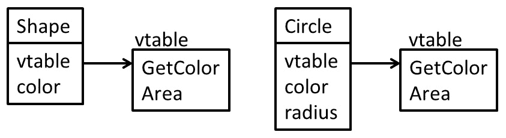
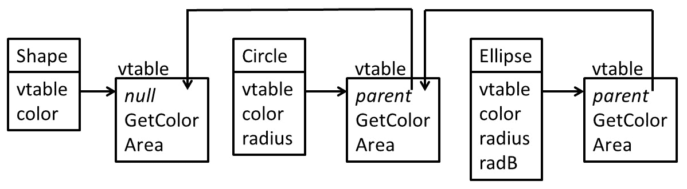
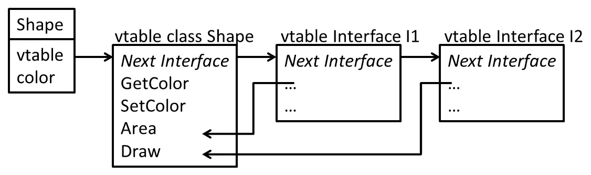
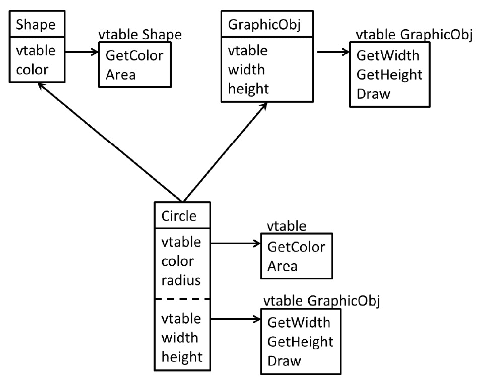
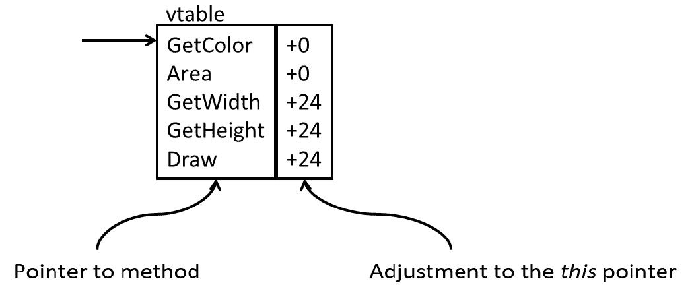

# 第六章：高级语言构造的 IR 生成

今天的高级语言通常使用聚合数据类型和**面向对象编程**（**OOP**）构造。**LLVM IR**对聚合数据类型有一定支持，我们必须自行实现类似类的 OOP 构造。添加聚合类型引发了一个问题，即如何传递聚合类型的参数。不同的平台有不同的规则，这也反映在 IR 中。遵守调用约定可确保可以调用系统函数。

在本章中，您将学习如何将聚合数据类型和指针转换为 LLVM IR，以及如何以符合系统的方式传递函数的参数。您还将学习如何在 LLVM IR 中实现类和虚函数。

本章将涵盖以下主题：

+   使用数组、结构和指针

+   正确获取应用程序二进制接口

+   为类和虚函数创建 IR 代码

通过本章结束时，您将掌握创建 LLVM IR 的聚合数据类型和 OOP 的知识。您还将了解如何根据平台规则传递聚合数据类型。

# 技术要求

本章的代码文件可在以下网址找到：[`github.com/PacktPublishing/Learn-LLVM-12/tree/master/Chapter06/tinylang`](https://github.com/PacktPublishing/Learn-LLVM-12/tree/master/Chapter06/tinylang)

您可以在以下网址找到代码的操作视频：[`bit.ly/3nllhED`](https://bit.ly/3nllhED)

# 使用数组、结构和指针

对于几乎所有应用程序，诸如`INTEGER`之类的基本类型是不够的。例如，要表示数学对象，如矩阵或复数，必须基于现有数据类型构造新的数据类型。这些新数据类型通常称为**聚合**或**复合类型**。

`tinylang`类型为`ARRAY [10] OF INTEGER`，或 C 类型为`long[10]`，在 IR 中表示如下：

```cpp
[10 x i64]
```

结构是不同类型的组合。在编程语言中，它们通常用具有命名成员的方式表示。例如，在`tinylang`中，结构写为`RECORD x, y: REAL; color: INTEGER; END;`，在 C 中相同的结构为`struct { float x, y; long color; };`。在 LLVM IR 中，只列出类型名称：

```cpp
{ float, float, i64 }
```

要访问成员，使用数字索引。与数组一样，第一个元素的索引号为`0`。

该结构的成员根据数据布局字符串中的规范在内存中布局。如果需要，将插入未使用的填充字节。如果需要控制内存布局，则可以使用紧凑结构，其中所有元素具有 1 字节对齐。语法略有不同：

```cpp
<{ float, float, i64 }>
```

加载到寄存器中，数组和结构被视为一个单元。例如，不可能将`%x`数组值寄存器的单个元素表示为`%x[3]`。这是因为`%x[i]`和`%x[j]`是否引用相同的元素。相反，我们需要特殊指令来提取和插入单个元素值到数组中。要读取第二个元素，我们使用以下：

```cpp
%el2 = extractvalue [10 x i64] %x, 1
```

我们还可以更新一个元素，例如第一个元素：

```cpp
%xnew = insertvalue [10 x i64] %x, i64 %el2, 0
```

这两个指令也适用于结构。例如，要从`%pt`寄存器中访问`color`成员，可以编写以下内容：

```cpp
%color = extractvalue { float, float, i64 } %pt, 2
```

这两个指令都有一个重要的限制：索引必须是一个常数。对于结构，这很容易解释。索引号只是名称的替代，诸如 C 的语言没有动态计算结构成员名称的概念。对于数组，这只是它无法有效实现。这两个指令在特定情况下具有价值，当元素数量较少且已知时。例如，复数可以建模为两个浮点数的数组。传递这个数组是合理的，并且在计算过程中始终清楚数组的哪一部分必须被访问。

为了在前端通用，我们必须使用指向内存的指针。LLVM 中的所有全局值都表示为指针。让我们声明一个全局变量 `@arr`，作为包含八个 `i64` 元素的数组，相当于 C 声明的 `long arr[8]`：

```cpp
@arr = common global [8 x i64] zeroinitializer
```

要访问数组的第二个元素，必须执行地址计算以确定索引元素的地址。然后，可以从该地址加载值。放入 `@second` 函数中，看起来像这样：

```cpp
define i64 @second() {
  %1 = getelementptr [8 x i64], [8 x i64]* @arr, i64 0, i64 
       1
  %2 = load i64, i64* %1
  ret i64 %2
}
```

`getelementptr` 指令是地址计算的主要工具。因此，它需要更多的解释。第一个操作数 `[8 x i64]` 是指令操作的基本类型。第二个操作数 `[8 x i64]* @arr` 指定了基本指针。请注意这里的细微差别：我们声明了一个包含八个元素的数组，但因为所有的全局值都被视为指针，所以我们有一个指向数组的指针。在 C 语法中，我们使用 `long (*arr)[8]`！这意味着我们首先必须解引用指针，然后才能索引元素，比如在 C 中的 `arr[0][1]`。第三个操作数 `i64 0` 解引用指针，第四个操作数 `i64 1` 是元素索引。这个计算的结果是索引元素的地址。请注意，这个指令不会触及任何内存。

除了结构体，索引参数不需要是常量。因此，`getelementptr` 指令可以在循环中用于检索数组的元素。这里对待结构体的方式不同：只能使用常量，并且类型必须是 `i32`。

有了这些知识，数组很容易从*第五章*，*IR 生成基础* 中集成到代码生成器中。`convertType()` 方法必须扩展以创建类型。如果 `Arr` 变量保存了数组的类型标识符，那么我们可以在方法中添加以下内容：

```cpp
llvm::Type *Component = convertType(Arr->getComponentType());
uint64_t NumElements = Arr->getNumElem();
return llvm::ArrayType::get(Component, NumElements);
```

这种类型可以用来声明全局变量。对于局部变量，我们需要为数组分配内存。我们在过程的第一个基本块中进行这个操作：

```cpp
for (auto *D : Proc->getDecls()) {
  if (auto *Var =
          llvm::dyn_cast<VariableDeclaration>(D)) {
    llvm::Type *Ty = mapType(Var);
    if (Ty->isAggregateType()) {
      llvm::Value *Val = Builder.CreateAlloca(Ty);
      Defs.Defs.insert(
          std::pair<Decl *, llvm::Value *>(Var, Val));
    }
  }
}
```

要读取和写入一个元素，我们必须生成 `getelemtptr` 指令。这被添加到 `emitExpr()`（读取值）和 `emitAssign()`（写入值）方法中。要读取数组的元素，首先读取变量的值。然后处理变量的选择器。对于每个索引，计算表达式并存储值。基于这个列表，计算引用元素的地址并加载值：

```cpp
auto &Selectors = Var->getSelectorList();
for (auto *I = Selectors.begin(),
          *E = Selectors.end();
     I != E;) {
  if (auto *Idx = llvm::dyn_cast<IndexSelector>(*I)) {
    llvm::SmallVector<llvm::Value *, 4> IdxList;
    IdxList.push_back(emitExpr(Idx->getIndex()));
    for (++I; I != E;) {
      if (auto *Idx2 =
              llvm::dyn_cast<IndexSelector>(*I)) {
        IdxList.push_back(emitExpr(Idx2->getIndex()));
        ++I;
      } else
        break;
    }
    Val = Builder.CreateGEP(Val, IdxList);
    Val = Builder.CreateLoad(
        Val->getType()->getPointerElementType(), Val);
  } else {
    llvm::report_fatal_error("Unsupported selector");
  }
}
```

写入数组元素使用相同的代码，唯一的区别是不生成 `load` 指令。而是使用指针作为 `store` 指令的目标。对于记录，使用类似的方法。记录成员的选择器包含常量字段索引，称为 `Idx`。将这个常量转换为常量 LLVM 值，如下所示：

```cpp
llvm::Value *FieldIdx = llvm::ConstantInt::get(Int32Ty, Idx);
```

然后，你可以像数组一样在 `Builder.CreateGEP()` 方法中使用值。

现在你有了将聚合数据类型转换为 LLVM IR 的知识。以系统兼容的方式传递这些类型的值需要一些小心，你将在下一节中学习如何正确实现它。

# 正确理解应用二进制接口

随着数组和记录被添加到代码生成器中，你可能会注意到有时生成的代码并不按预期执行。原因是到目前为止我们忽略了平台的调用约定。每个平台都定义了如何一个函数可以调用同一程序或库中的另一个函数的规则。这些规则在**应用二进制接口**（**ABI**）文档中进行了总结。典型的信息包括以下内容：

+   机器寄存器用于参数传递吗？如果是，使用哪些？

+   如何将数组和结构等聚合类型传递给函数？

+   返回值是如何处理的？

使用的规则种类繁多。在某些平台上，聚合始终以间接方式传递，这意味着在堆栈上放置聚合的副本，然后只传递该副本的指针作为参数。在其他平台上，小型聚合（例如 128 位或 256 位宽）在寄存器中传递，只有超过该阈值才使用间接参数传递。一些平台还使用浮点和矢量寄存器进行参数传递，而其他平台要求浮点值在整数寄存器中传递。

当然，这都是有趣的低级内容。不幸的是，这些内容泄漏到了 LLVM IR 中。起初，这让人感到惊讶。毕竟，我们在 LLVM IR 中定义了函数所有参数的类型！事实证明这是不够的。为了理解这一点，让我们考虑复数。一些语言具有内置的复数数据类型；例如，C99 具有`float _Complex`（等等）。较早版本的 C 没有复数类型，但您可以轻松地定义`struct Complex { float re, im; }`并在此类型上创建算术运算。这两种类型都可以映射到`{ float，float }`LLVM IR 类型。如果 ABI 现在规定内置复数类型的值在两个浮点寄存器中传递，但用户定义的聚合始终以间接方式传递，那么函数提供的信息对于 LLVM 来说不足以决定如何传递此特定参数。不幸的后果是我们需要向 LLVM 提供更多信息，而这些信息是高度特定于 ABI 的。

有两种方法可以向 LLVM 指定此信息：参数属性和类型重写。您需要使用的方法取决于目标平台和代码生成器。最常用的参数属性如下：

+   `inreg`指定参数在寄存器中传递。

+   `byval`指定参数按值传递。参数必须是指针类型。将指向数据的隐藏副本制作，并将此指针传递给被调用的函数。

+   `zeroext`和`signext`指定传递的整数值应该是零扩展或符号扩展。

+   `sret`指定此参数保存一个指向用于从函数返回聚合类型的内存的指针。

虽然所有代码生成器都支持`zeroext`、`signext`和`sret`属性，但只有一些支持`inreg`和`byval`。可以使用`addAttr()`方法将属性添加到函数的参数中。例如，要在`Arg`参数上设置`inreg`属性，可以调用以下方法：

```cpp
Arg->addAttr(llvm::Attribute::InReg);
```

要设置多个属性，可以使用`llvm::AttrBuilder`类。

提供额外信息的另一种方法是使用类型重写。通过这种方法，您可以伪装原始类型。您可以执行以下操作：

+   拆分参数；例如，不要传递一个复数参数，而是传递两个浮点参数。

+   将参数转换为不同的表示形式，例如，将大小为 64 位或更小的结构体转换为`i64`整数。

要在不改变值的位的情况下在类型之间转换，可以使用`bitcast`指令。`bitcast`指令不适用于聚合类型，但这并不是限制，因为您总是可以使用指针。如果将一个点建模为具有两个`int`成员的结构，在 LLVM 中表示为类型`{ i32，i32 }`，那么可以以以下方式将其`bitcast`为`i64`：

```cpp
%intpoint = bitcast { i32, i32}* %point to i64*
```

这将指针转换为结构体的指针，然后可以加载此值并将其作为参数传递。您只需确保两种类型的大小相同即可。

向参数添加属性或更改类型并不复杂。但是你怎么知道你需要实现什么？首先，你应该了解目标平台上使用的调用约定。例如，Linux 上的 ELF ABI 针对每个支持的 CPU 平台都有文档记录。只需查阅文档并熟悉它。有关 LLVM 代码生成器的要求也有文档记录。信息来源是 Clang 实现，在[`github.com/llvm/llvm-project/blob/main/clang/lib/CodeGen/TargetInfo.cpp`](https://github.com/llvm/llvm-project/blob/main/clang/lib/CodeGen/TargetInfo.cpp)文件中。这个单一文件包含了所有支持平台的 ABI 特定操作。这也是所有信息被收集的唯一地方。

在本节中，您学习了如何生成符合平台 ABI 的函数调用的 IR。下一节将介绍为类和虚函数创建 IR 的不同方法。

# 为类和虚函数创建 IR 代码

许多现代编程语言使用类支持面向对象编程。**类**是一个高级语言构造，在本节中，我们将探讨如何将类构造映射到 LLVM IR 中。

## 实现单继承

类是数据和方法的集合。一个类可以继承自另一个类，可能添加更多的数据字段和方法，或者覆盖现有的虚拟方法。让我们用 Oberon-2 中的类来说明这一点，这也是`tinylang`的一个很好的模型。一个`Shape`类定义了一个带有颜色和面积的抽象形状：

```cpp
TYPE Shape = RECORD
               color: INTEGER;
               PROCEDURE (VAR s: Shape) GetColor(): 
                   INTEGER;
               PROCEDURE (VAR s: Shape) Area(): REAL;
             END;
```

`GetColor`方法只返回颜色编号：

```cpp
PROCEDURE (VAR s: Shape) GetColor(): INTEGER;
BEGIN RETURN s.color; END GetColor;
```

抽象形状的面积无法计算，因此这是一个抽象方法：

```cpp
PROCEDURE (VAR s: Shape) Area(): REAL;
BEGIN HALT; END;
```

`Shape`类型可以扩展为表示`Circle`类：

```cpp
TYPE Circle = RECORD (Shape)
                radius: REAL;
                PROCEDURE (VAR s: Circle) Area(): REAL;
              END;
```

对于一个圆，可以计算出面积：

```cpp
PROCEDURE (VAR s: Circle) Area(): REAL;
BEGIN RETURN 2 * radius * radius; END;
```

类型也可以在运行时查询。如果`shape`是`Shape`类型的变量，那么我们可以这样制定类型测试：

```cpp
IF shape IS Circle THEN (* … *) END;
```

除了不同的语法之外，这与 C++中的工作方式非常相似。与 C++的一个显着区别是，Oberon-2 的语法使隐式的`this`指针变得显式，称之为方法的接收者。

要解决的基本问题是如何在内存中布局一个类，以及如何实现方法的动态调用和运行时类型检查。对于内存布局来说，这是相当容易的。`Shape`类只有一个数据成员，我们可以将它映射到相应的 LLVM 结构类型：

```cpp
@Shape = type { i64 }
```

`Circle`类添加了另一个数据成员。解决方案是将新的数据成员追加到末尾：

```cpp
@Circle = type { i64, float }
```

原因是一个类可以有许多子类。采用这种策略，共同基类的数据成员始终具有相同的内存偏移量，并且还使用相同的索引通过`getelementptr`指令访问字段。

要实现方法的动态调用，我们必须进一步扩展 LLVM 结构。如果在`Shape`对象上调用`Area()`函数，那么将调用抽象方法，导致应用程序停止。如果在`Circle`对象上调用它，那么将调用计算圆形面积的相应方法。`GetColor()`函数可以用于两个类的对象。实现这一点的基本思想是为每个对象关联一个带有函数指针的表。在这里，表将有两个条目：一个是`GetColor()`方法，另一个是`Area()`函数。`Shape`类和`Circle`类都有这样的表。这些表在`Area()`函数的条目上有所不同，根据对象的类型调用不同的代码。这个表被称为**虚方法表**，通常缩写为**vtable**。

仅有 vtable 是没有用的。我们必须将其与对象连接起来。为此，我们将一个指向 vtable 的指针始终添加为结构的第一个数据成员。在 LLVM 级别上，`@Shape`类型然后变成了以下形式：

```cpp
@Shape = type { [2 x i8*]*, i64 }
```

`@Circle`类型也类似扩展。结果的内存结构显示在*图 6.1*中：



图 6.1-类和虚拟方法表的内存布局

LLVM 没有 void 指针，而是使用字节指针。引入隐藏的`vtable`字段后，现在也需要一种初始化它的方法。在 C++中，这是调用构造函数的一部分。在 Oberon-2 中，当分配内存时，该字段会自动初始化。

然后执行动态调用方法的步骤如下：

1.  通过`getelementptr`指令计算 vtable 指针的偏移量。

1.  加载 vtable 的指针。

1.  计算函数在 vtable 中的偏移量。

1.  加载函数指针。

1.  通过`call`指令间接调用函数。

这听起来并不是很高效，但事实上，大多数 CPU 架构可以在只有两条指令的情况下执行这个动态调用。因此，这实际上是 LLVM 级别的冗长。

要将函数转换为方法，需要对象数据的引用。这是通过将数据指针作为方法的第一个参数来实现的。在 Oberon-2 中，这是显式的接收者。在类似于 C++的语言中，这是隐式的`this`指针。

有了 vtable，我们对每个类在内存中都有一个唯一的地址。这对运行时类型测试有帮助吗？答案是只有在有限的范围内有帮助。为了说明问题，让我们通过一个`Ellipse`类扩展类层次结构，它继承自`Circle`类。（这不是数学意义上的经典*is-a*关系。）如果我们有`Shape`类型的`shape`变量，那么我们可以将`shape IS Circle`类型测试实现为将存储在`shape`变量中的 vtable 指针与`Circle`类的 vtable 指针进行比较。只有当`shape`确实具有`Circle`类型时，比较才会返回`true`。但如果`shape`确实是`Ellipse`类型，那么比较会返回`false`，即使`Ellipse`类型的对象可以在只需要`Circle`类型的对象的所有地方使用。

显然，我们需要做更多的工作。解决方案是使用运行时类型信息扩展虚拟方法表。需要存储多少信息取决于源语言。为了支持运行时类型检查，只需存储指向基类 vtable 的指针，然后看起来像*图 6.2*：



图 6.2-支持简单类型测试的类和 vtable 布局

如果像之前描述的那样测试失败，那么就会用基类的 vtable 指针重复测试。这将重复进行，直到测试产生`true`，或者如果没有基类，则产生`false`。与调用动态函数不同，类型测试是一个昂贵的操作，因为在最坏的情况下，继承层次结构会一直向上走到根类。

如果你知道整个类层次结构，那么可以采用高效的方法：对类层次结构的每个成员进行深度优先编号。然后，类型测试变成了与数字或区间的比较，可以在常数时间内完成。事实上，这就是 LLVM 自己的运行时类型测试的方法，我们在上一章中了解到了。

将运行时类型信息与 vtable 耦合是一个设计决策，要么是源语言规定的，要么只是一个实现细节。例如，如果你需要详细的运行时类型信息，因为源语言支持运行时反射，并且你有没有 vtable 的数据类型，那么耦合两者并不是一个好主意。在 C++中，耦合导致一个具有虚函数（因此没有 vtable）的类没有附加的运行时类型数据。

通常，编程语言支持接口，它们是一组虚拟方法。接口很重要，因为它们增加了一个有用的抽象。我们将在下一节中看看接口的可能实现。

## 通过接口扩展单一继承

诸如**Java**之类的语言支持接口。接口是一组抽象方法，类似于没有数据成员且只定义了抽象方法的基类。接口提出了一个有趣的问题，因为实现接口的每个类可以在 vtable 中的不同位置具有相应的方法。原因很简单，vtable 中函数指针的顺序是从源语言中类定义中函数的顺序派生的。接口中的定义与此无关，不同的顺序是正常的。

因为接口中定义的方法可以有不同的顺序，我们将每个实现的接口附加到类上。对于接口的每个方法，此表可以指定 vtable 中方法的索引，或者可以是存储在 vtable 中的函数指针的副本。如果在接口上调用方法，那么将搜索接口的相应 vtable，然后获取函数指针并调用方法。将两个接口`I1`和`I2`添加到`Shape`类中会得到以下布局：



图 6.3 – 接口 vtable 的布局

警告在于我们必须找到正确的 vtable。我们可以使用类似于*运行时类型测试*的方法：我们可以通过接口 vtable 列表执行线性搜索。我们可以为每个接口分配一个唯一的数字（例如，内存地址），并使用此数字来识别 vtable。这种方案的缺点是显而易见的：通过接口调用方法比在类上调用相同的方法需要更多的时间。对于这个问题并没有简单的缓解方法。

一个好的方法是用哈希表替换线性搜索。在编译时，已知类实现的接口。因此，我们可以构造一个完美的哈希函数，将接口号映射到接口的 vtable。可能需要一个已知的唯一标识接口的数字来进行构造，以便内存不会有帮助。但是还有其他计算唯一数字的方法。如果源中的符号名称是唯一的，那么总是可以计算出诸如`MD5`之类的加密哈希，并将哈希用作数字。计算发生在编译时，因此没有运行时成本。

结果比线性搜索快得多，只需要常数时间。但是，它涉及对数字进行多次算术运算，比类类型的方法调用慢。

通常，接口也参与运行时类型测试，使得搜索列表变得更长。当然，如果实现了哈希表方法，那么它也可以用于运行时类型测试。

一些语言允许有多个父类。这对实现有一些有趣的挑战，我们将在下一节中掌握这些挑战。

## 添加对多重继承的支持

多重继承增加了另一个挑战。如果一个类从两个或更多的基类继承，那么我们需要以这样的方式组合数据成员，以便它们仍然可以从方法中访问。就像单一继承的情况一样，解决方案是追加所有数据成员，包括隐藏的 vtable 指针。`Circle`类不仅是一个几何形状，还是一个图形对象。为了模拟这一点，我们让`Circle`类继承自`Shape`类和`GraphicObj`类。在类布局中，`Shape`类的字段首先出现。然后，我们追加`GraphicObj`类的所有字段，包括隐藏的 vtable 指针。之后，我们添加`Circle`类的新数据成员，得到了*图 6.4*中显示的整体结构：



图 6.4 - 具有多重继承的类和 vtable 的布局

这种方法有几个影响。现在可以有几个指向对象的指针。指向`Shape`或`Circle`类的指针指向对象的顶部，而指向`GraphicObj`类的指针指向对象的内部，指向嵌入的`GraphicObj`对象的开头。在比较指针时必须考虑到这一点。

调用虚方法也会受到影响。如果一个方法在`GraphicObj`类中定义，那么这个方法期望`GraphicObj`类的类布局。如果这个方法在`Circle`类中没有被覆盖，那么有两种可能性。简单的情况是，如果方法调用是通过指向`GraphicObj`实例的指针完成的：在这种情况下，你在`GraphicObj`类的 vtable 中查找方法的地址并调用该函数。更复杂的情况是，如果你用指向`Circle`类的指针调用该方法。同样，你可以在`Circle`类的 vtable 中查找方法的地址。被调用的方法期望一个指向`GraphicObj`类实例的`this`指针，所以我们也必须调整该指针。我们可以做到这一点，因为我们知道`GraphicObj`类在`Circle`类内部的偏移量。

如果`GrapicObj`的方法在`Circle`类中被覆盖，那么如果通过指向`Circle`类的指针调用该方法，则不需要做任何特殊处理。然而，如果通过指向`GraphicObj`实例的指针调用该方法，那么我们需要进行另一个调整，因为该方法需要一个指向`Circle`实例的`this`指针。在编译时，我们无法计算这个调整，因为我们不知道这个`GraphicObj`实例是否是多重继承层次结构的一部分。为了解决这个问题，我们在 vtable 中的每个函数指针一起存储我们需要对`this`指针进行的调整，在*图 6.5*中显示。



图 6.5 - 具有对 this 指针的调整的 vtable

现在方法调用变成了以下形式：

1.  在 vtable 中查找函数指针。

1.  调整`this`指针。

1.  调用方法。

这种方法也可以用于实现接口。因为接口只有方法，每个实现的接口都会向对象添加一个新的 vtable 指针。这样做更容易实现，而且很可能更快，但它会给每个对象实例增加开销。在最坏的情况下，如果你的类有一个单独的 64 位数据字段，但实现了 10 个接口，那么你的对象在内存中需要 96 字节：8 字节用于类本身的 vtable 指针，8 字节用于数据成员，以及每个接口的 10 * 8 字节的 vtable 指针。

为了支持与对象的有意义比较并执行运行时类型测试，需要首先将指针规范化为对象。如果我们在 vtable 中添加一个额外的字段，其中包含对象顶部的偏移量，那么我们就可以始终调整指针指向真正的对象。在`Circle`类的 vtable 中，这个偏移量是`0`，但在嵌入的`GraphicObj`类的 vtable 中不是。当然，是否需要实现这一点取决于源语言的语义。

LLVM 本身不偏向于面向对象特性的特殊实现。正如在本节中所看到的，我们可以使用现有的 LLVM 数据类型来实现所有方法。如果你想尝试一种新的方法，那么一个好的方式是先在 C 中做一个原型。所需的指针操作很快就能转换为 LLVM IR，但在高级语言中推理功能更容易。

通过本节学到的知识，你可以在自己的代码生成器中将编程语言中常见的所有面向对象编程构造降低为 LLVM IR。你已经知道了如何表示内存中的单继承、带接口的单继承或多重继承，以及如何实现类型测试和查找虚拟函数，这些都是面向对象语言的核心概念。

# 总结

在本章中，你学会了如何将聚合数据类型和指针转换为 LLVM IR 代码。你还了解了 ABI 的复杂性。最后，你了解了将类和虚拟函数转换为 LLVM IR 的不同方法。有了本章的知识，你将能够为大多数真实编程语言创建一个 LLVM IR 代码生成器。

在下一章中，你将学习一些高级技术。异常处理在现代编程语言中非常常见，LLVM 对此提供了一些支持。将类型信息附加到指针可以帮助进行某些优化，所以我们也会添加这个功能。最后但同样重要的是，调试应用程序的能力对许多开发人员来说是至关重要的，因此我们将为我们的代码生成器添加调试元数据的生成。
