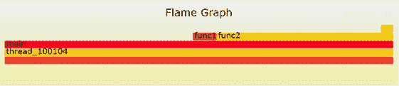
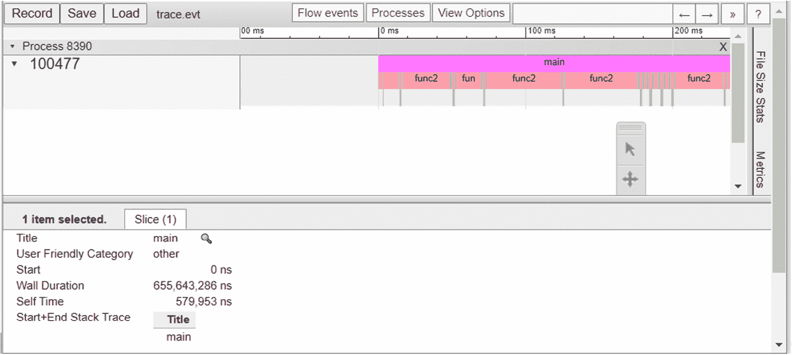
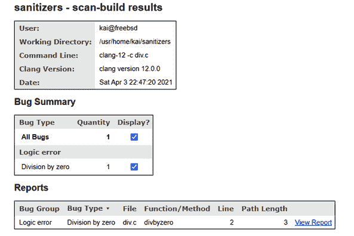
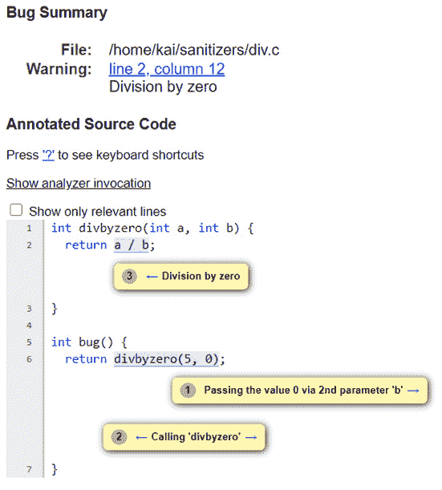

# 第十一章：使用 LLVM 工具进行调试

LLVM 带有一套工具，可帮助您识别应用程序中的某些错误。所有这些工具都使用 LLVM 和**Clang**库。

在本章中，您将学习如何使用**消毒剂**为应用程序安装仪器，如何使用最常见的消毒剂来识别各种错误，并如何为应用程序实现模糊测试。这将帮助您识别通常无法通过单元测试找到的错误。您还将学习如何识别应用程序中的性能瓶颈，运行**静态分析器**以识别通常无法通过编译器找到的问题，并创建自己的基于 Clang 的工具，以便您可以扩展 Clang 的新功能。

本章将涵盖以下主题：

+   使用消毒剂为应用程序安装仪器

+   使用**libFuzzer**查找错误

+   使用**XRay**进行性能分析

+   使用**Clang 静态分析器**检查源代码

+   创建自己的基于 Clang 的工具

在本章结束时，您将了解如何使用各种 LLVM 和 Clang 工具来识别应用程序中的大量错误类别。您还将获得扩展 Clang 的知识，例如强制执行命名约定或添加新的源分析功能。

# 技术要求

要在*使用 XRay 进行性能分析*部分创建**火焰图**，您需要从[`github.com/brendangregg/FlameGraph`](https://github.com/brendangregg/FlameGraph)安装脚本。一些系统，如**Fedora**和**FreeBSD**，提供了这些脚本的软件包，您也可以使用它们。

要在同一部分查看**Chrome 可视化**，您需要安装**Chrome**浏览器。您可以从[`www.google.com/chrome/`](https://www.google.com/chrome/)下载浏览器，或者使用系统的软件包管理器安装 Chrome 浏览器。本章的代码文件可在[`github.com/PacktPublishing/Learn-LLVM-12/tree/master/Chapter11`](https://github.com/PacktPublishing/Learn-LLVM-12/tree/master/Chapter11)找到

您可以在[`bit.ly/3nllhED`](https://bit.ly/3nllhED)找到代码的实际操作视频

# 使用消毒剂为应用程序安装仪器

LLVM 带有一些`compiler-rt`项目。消毒剂可以在 Clang 中启用，这使它们非常方便使用。在接下来的章节中，我们将看一下可用的消毒剂，即“地址”，“内存”和“线程”。我们将首先看一下“地址”消毒剂。

## 使用地址消毒剂检测内存访问问题

您可以使用“地址”消毒剂来检测应用程序中的一些内存访问错误。这包括常见错误，如在释放动态分配的内存后继续使用它，或者在分配的内存边界之外写入动态分配的内存。

启用“地址”消毒剂后，它将使用自己的版本替换对`malloc()`和`free()`函数的调用，并使用检查保护仪器化所有内存访问。当然，这会给应用程序增加很多开销，您只会在应用程序的测试阶段使用“地址”消毒剂。如果您对实现细节感兴趣，可以在`llvm/lib/Transforms/Instrumentation/AddressSanitizer.cpp`文件中找到该传递的源代码，以及在[`github.com/google/sanitizers/wiki/AddressSanitizerAlgorithm`](https://github.com/google/sanitizers/wiki/AddressSanitizerAlgorithm)上找到的算法描述。

让我们运行一个简短的示例来演示“地址”消毒剂的功能。以下示例应用程序`outofbounds.c`分配了`12`字节的内存，但初始化了`14`字节：

```cpp
#include <stdlib.h>
#include <string.h>
int main(int argc, char *argv[]) {
  char *p = malloc(12);
  memset(p, 0, 14);
  return (int)*p;
}
```

您可以编译并运行此应用程序，而不会注意到任何问题。这对于这种类型的错误是典型的。即使在更大的应用程序中，这种错误也可能长时间不被注意到。但是，如果您使用`-fsanitize=address`选项启用`address`检测器，那么应用程序在检测到错误后会停止。

启用`-g`选项的调试符号也很有用，因为它有助于确定源代码中错误的位置。以下代码是一个使用`address`检测器和启用调试符号编译源文件的示例：

```cpp
$ clang -fsanitize=address -g outofbounds.c -o outofbounds
```

现在，当运行应用程序时，您会得到一个冗长的错误报告：

```cpp
$ ./outofbounds
=================================================================
==1067==ERROR: AddressSanitizer: heap-buffer-overflow on address 0x60200000001c at pc 0x00000023a6ef bp 0x7fffffffeb10 sp 0x7fffffffe2d8
WRITE of size 14 at 0x60200000001c thread T0
    #0 0x23a6ee in __asan_memset /usr/src/contrib/llvm-project/compiler-rt/lib/asan/asan_interceptors_memintrinsics.cpp:26:3
    #1 0x2b2a03 in main /home/kai/sanitizers/outofbounds.c:6:3
    #2 0x23331f in _start /usr/src/lib/csu/amd64/crt1.c:76:7
```

报告还包含有关内存内容的详细信息。重要信息是错误的类型-`address`检测器拦截应用程序的执行。它显示了`outofbounds.c`文件中的*第 6 行*，其中包含对`memset()`的调用-确实是发生缓冲区溢出的确切位置。

如果您将`outofbounds.c`文件中包含`memset(p, 0, 14);`的行替换为以下代码，则会在释放内存后访问内存。您需要将源代码保存在`useafterfree.c`文件中：

```cpp
  memset(p, 0, 12);
  free(p);
```

再次，如果您编译并运行它，将检测到在释放内存后使用指针：

```cpp
$ clang -fsanitize=address -g useafterfree.c -o useafterfree
$ ./useafterfree
=================================================================
==1118==ERROR: AddressSanitizer: heap-use-after-free on address 0x602000000010 at pc 0x0000002b2a5c bp 0x7fffffffeb00 sp 0x7fffffffeaf8
READ of size 1 at 0x602000000010 thread T0
    #0 0x2b2a5b in main /home/kai/sanitizers/useafterfree.c:8:15
    #1 0x23331f in _start /usr/src/lib/csu/amd64/crt1.c:76:7
```

这次，报告指向包含对`p`指针的解引用的*第 8 行*。

在运行应用程序之前，将`ASAN_OPTIONS`环境变量设置为值`detect_leaks=1`，然后您还会收到有关内存泄漏的报告。在命令行上，您可以这样做：

```cpp
$ ASAN_OPTIONS=detect_leaks=1 ./useafterfree
```

`address`检测器非常有用，因为它捕获了一类难以检测的错误。`memory`检测器执行类似的任务，我们将在下一节中看到。

## 使用`memory`检测器查找未初始化的内存访问

使用未初始化的内存是另一类难以发现的错误。在**C**和**C++**中，一般的内存分配例程不会使用默认值初始化内存缓冲区。对于堆栈上的自动变量也是如此。

存在许多错误的机会，`memory`检测器有助于找到这些错误。如果您对实现细节感兴趣，可以在`llvm/lib/Transforms/Instrumentation/MemorySanitizer.cpp`文件中找到`memory`检测器传递的源代码。文件顶部的注释解释了实现背后的思想。

让我们运行一个小例子，并将以下源代码保存为`memory.c`文件。您应该注意到`x`变量没有初始化，但被用作`return`值：

```cpp
int main(int argc, char *argv[]) {
  int x;
  return x;
}
```

如果没有检测器，应用程序将正常运行。但是，如果使用`-fsanitize=memory`选项，则会收到错误报告：

```cpp
$ clang -fsanitize=memory -g memory.c -o memory
$ ./memory
==1206==WARNING: MemorySanitizer: use-of-uninitialized-value
    #0 0x10a8f49 in main /home/kai/sanitizers/memory.c:3:3
    #1 0x1053481 in _start /usr/src/lib/csu/amd64/crt1.c:76:7
SUMMARY: MemorySanitizer: use-of-uninitialized-value /home/kai/sanitizers/memory.c:3:3 in main
Exiting
```

与`address`检测器一样，`memory`检测器会在发现第一个错误时停止应用程序。

在下一节中，我们将看看如何使用`thread`检测器来检测多线程应用程序中的数据竞争。

## 使用`thread`检测器指出数据竞争

为了利用现代 CPU 的强大功能，应用程序现在使用多个线程。这是一种强大的技术，但也引入了新的错误来源。多线程应用程序中的一个非常常见的问题是对全局数据的访问没有受到保护，例如，`thread`检测器可以在`llvm/lib/Transforms/Instrumentation/ThreadSanitize.cpp`文件中检测到数据竞争。

为了演示`thread`检测器的功能，我们将创建一个非常简单的生产者/消费者风格的应用程序。生产者线程增加全局变量，而消费者线程减少相同的变量。对全局变量的访问没有受到保护，因此这显然是数据竞争。您需要将以下源代码保存在`thread.c`文件中：

```cpp
#include <pthread.h>
int data = 0;
void *producer(void *x) {
  for (int i = 0; i < 10000; ++i) ++data;
  return x;
}
void *consumer(void *x) {
  for (int i = 0; i < 10000; ++i) --data;
  return x;
}
int main() {
  pthread_t t1, t2;
  pthread_create(&t1, NULL, producer, NULL);
  pthread_create(&t2, NULL, consumer, NULL);
  pthread_join(t1, NULL);
  pthread_join(t2, NULL);
  return data;
}
```

从前面的代码中，`data`变量在两个线程之间共享。在这里，它是`int`类型，以使示例简单化。通常情况下，会使用诸如`std::vector`类或类似的数据结构。这两个线程运行`producer()`和`consumer()`函数。

`producer()`函数只增加`data`变量，而`consumer()`函数减少它。未实现访问保护，因此这构成了数据竞争。`main()`函数使用`pthread_create()`函数启动两个线程，使用`pthread_join()`函数等待线程结束，并返回`data`变量的当前值。

如果您编译并运行此应用程序，那么您将注意到没有错误；也就是说，返回值始终为 0。在这种情况下，如果循环执行的次数增加了 100 倍，就会出现错误，即返回值不等于 0。然后，您会看到其他值出现。

您可以使用`thread` sanitizer 来识别数据竞争。要启用带有`thread` sanitizer 的编译，您需要向 Clang 传递`-fsanitize=thread`选项。使用`-g`选项添加调试符号可以在报告中给出行号，这非常有帮助。请注意，您还需要链接`pthread`库：

```cpp
$ clang -fsanitize=thread -g thread.c -o thread -lpthread
$ ./thread
==================
WARNING: ThreadSanitizer: data race (pid=1474)
  Write of size 4 at 0x000000cdf8f8 by thread T2:
    #0 consumer /home/kai/sanitizers/thread.c:11:35 (thread+0x2b0fb2)
  Previous write of size 4 at 0x000000cdf8f8 by thread T1:
    #0 producer /home/kai/sanitizers/thread.c:6:35 (thread+0x2b0f22)
  Location is global 'data' of size 4 at 0x000000cdf8f8 (thread+0x000000cdf8f8)
  Thread T2 (tid=100437, running) created by main thread at:
    #0 pthread_create /usr/src/contrib/llvm-project/compiler-rt/lib/tsan/rtl/tsan_interceptors_posix.cpp:962:3 (thread+0x271703)
    #1 main /home/kai/sanitizers/thread.c:18:3 (thread+0x2b1040)
  Thread T1 (tid=100436, finished) created by main thread at:
    #0 pthread_create /usr/src/contrib/llvm-project/compiler-rt/lib/tsan/rtl/tsan_interceptors_posix.cpp:962:3 (thread+0x271703)
    #1 main /home/kai/sanitizers/thread.c:17:3 (thread+0x2b1021)
SUMMARY: ThreadSanitizer: data race /home/kai/sanitizers/thread.c:11:35 in consumer
==================
ThreadSanitizer: reported 1 warnings
```

报告指出了源文件的*第 6 行*和*第 11 行*，在这里全局变量被访问。它还显示了两个名为*T1*和*T2*的线程访问了该变量，以及各自调用`pthread_create()`函数的文件和行号。

在本节中，我们学习了如何使用三种 sanitizer 来识别应用程序中的常见问题。`address` sanitizer 帮助我们识别常见的内存访问错误，例如越界访问或在释放后使用内存。使用`memory` sanitizer，我们可以找到对未初始化内存的访问，而`thread` sanitizer 则帮助我们识别数据竞争。

在下一节中，我们将尝试通过在随机数据上运行我们的应用程序来触发 sanitizers，称为**模糊测试**。

# 使用 libFuzzer 查找错误

要测试您的应用程序，您需要编写**单元测试**。这是确保软件行为正确的好方法。但是，由于可能输入的数量呈指数增长，您可能会错过某些奇怪的输入，以及一些错误。

**模糊测试**可以在这里帮助。其思想是向应用程序提供随机生成的数据，或者基于有效输入但带有随机更改的数据。这样一遍又一遍地进行，因此您的应用程序将被大量输入进行测试。这是一种非常强大的测试方法。几乎所有浏览器和其他软件中的数百个错误都是通过模糊测试发现的。

LLVM 自带其自己的模糊测试库。最初是 LLVM 核心库的一部分，名为`compiler-rt`。该库旨在测试小型和快速函数。

让我们运行一个小例子。您需要提供`LLVMFuzzerTestOneInput()`函数。该函数由`fuzzer.c`文件调用：

```cpp
#include <stdint.h>
#include <stdlib.h>
int count(const uint8_t *Data, size_t Size) {
  int cnt = 0;
  if (Size)
    while (Data[cnt] >= '0' && Data[cnt] <= '9') ++cnt;
  return cnt;
}
int LLVMFuzzerTestOneInput(const uint8_t *Data, size_t 
                           Size) {
  count(Data, Size);
  return 0;
}
```

从前面的代码中，`count()`函数计算`Data`变量指向的内存中的数字数量。仅检查数据的大小以确定是否有任何可用字节。在`while`循环内，未检查大小。

使用正常的`0`字节。`LLVMFuzzerTestOneInput()`函数是所谓的`0`，目前是唯一允许的值。

要使用 libFuzzer 编译文件，您需要添加`-fsanitize=fuzzer`选项。建议还启用`address` sanitizer 和生成调试符号。使用以下命令编译文件：

```cpp
$ clang -fsanitize=fuzzer,address -g fuzzer.c -o fuzzer
```

运行测试时，会生成一个冗长的报告。该报告包含的信息比堆栈跟踪更多，因此让我们仔细看一下：

1.  第一行告诉您用于初始化随机数生成器的种子。您可以使用`–seed=`选项重复此执行：

```cpp
INFO: Seed: 1297394926
```

1.  默认情况下，libFuzzer 将输入限制为最多 4,096 字节。您可以使用`–max_len=`选项更改默认值：

```cpp
INFO: -max_len is not provided; libFuzzer will not generate inputs larger than 4096 bytes
```

1.  现在，我们在不提供样本输入的情况下运行测试。所有样本输入的集合称为语料库，在此运行中为空：

```cpp
INFO: A corpus is not provided, starting from an empty corpus
```

1.  随后将提供有关生成的测试数据的一些信息。它向您显示尝试了`28`个输入，找到了`6`个输入，总长度为`19`字节，这些输入一共覆盖了`6`个覆盖点或基本块：

```cpp
#28     NEW    cov: 6 ft: 9 corp: 6/19b lim: 4 exec/s: 0 rss: 29Mb L: 4/4 MS: 4 CopyPart-PersAutoDict-CopyPart-ChangeByte- DE: "1\x00"-
```

1.  之后，检测到缓冲区溢出，并且随后是来自`address`消毒剂的信息。最后，报告向您指出导致缓冲区溢出的输入的位置：

```cpp
artifact_prefix='./'; Test unit written to ./crash-17ba0791499db908433b80f37c5fbc89b870084b
```

有了保存的输入，您可以再次执行带有崩溃输入的测试用例：

```cpp
$ ./fuzzer crash-17ba0791499db908433b80f37c5fbc89b870084b
```

这显然对于识别问题非常有帮助。但是，使用随机数据通常并不是非常有用。如果尝试对`tinylang`词法分析器或解析器进行模糊测试，那么纯随机数据会导致立即拒绝输入，因为找不到有效的标记。

在这种情况下，提供一小组有效输入（称为语料库）更有用。然后，语料库的文件将被随机变异并用作输入。您可以将输入视为大多数有效，只是有一些位被翻转。这也适用于其他必须具有特定格式的输入。例如，对于处理**JPEG**和**PNG**文件的库，您将提供一些小的**JPEG**和**PNG**文件作为语料库。

您可以将语料库文件保存在一个或多个目录中，并且可以使用`printf`命令为模糊测试创建一个简单的语料库：

```cpp
$ mkdir corpus
$ printf "012345\0" >corpus/12345.txt
$ printf "987\0" >corpus/987.txt
```

在运行测试时，您将在命令行上提供目录：

```cpp
$ ./fuzzer corpus/
```

然后，语料库被用作生成随机输入的基础，正如报告所告诉您的那样：

```cpp
INFO: seed corpus: files: 2 min: 4b max: 7b total: 11b rss: 29Mb
```

如果要测试的函数处理标记或其他魔术值，比如编程语言，那么可以通过提供包含标记的字典来加快该过程。对于编程语言，字典将包含语言中使用的所有关键字和特殊符号。字典定义遵循简单的键值样式。例如，要在字典中定义`if`关键字，可以添加以下内容：

```cpp
kw1="if"
```

但是，密钥是可选的，可以省略。然后，您可以使用`–dict=`选项在命令行上指定字典文件。在下一节中，我们将了解 libFuzzer 实现的限制和替代方案。

## 限制和替代方案

libFuzzer 实现速度快，但对测试目标有一些限制。它们如下：

+   测试函数必须将输入作为内存中的数组接受。一些库函数需要数据的文件路径，因此无法使用 libFuzzer 进行测试。

+   不应调用`exit()`函数。

+   不应更改全局状态。

+   不应使用硬件随机数生成器。

从上述限制中，前两个限制是 libFuzzer 作为库的实现的含义。后两个限制是为了避免评估算法中的混淆。如果这些限制中的一个未满足，那么对模糊目标的两个相同调用可能会产生不同的结果。

模糊测试的最佳替代工具是**AFL**，位于[`github.com/google/AFL`](https://github.com/google/AFL)。AFL 需要一个被插装的二进制文件（提供了一个用于插装的 LLVM 插件），并要求应用程序在命令行上以文件路径形式接受输入。AFL 和 libFuzzer 可以共享相同的语料库和相同的字典文件。因此，可以使用这两种工具测试应用程序。在 libFuzzer 不适用的情况下，AFL 可能是一个很好的替代方案。

还有许多其他影响 libFuzzer 工作方式的方法。您可以阅读[`llvm.org/docs/LibFuzzer.html`](https://llvm.org/docs/LibFuzzer.html)上的参考页面以获取更多详细信息。

在下一节中，我们将看一个应用程序可能遇到的完全不同的问题；我们尝试识别性能瓶颈。

# 使用 XRay 进行性能分析

如果你的应用程序似乎运行缓慢，那么你可能想知道代码中花费了多少时间。在这种情况下，使用`llvm/lib/XRay/`目录对代码进行仪器化。运行时部分是`compiler-rt`的一部分。

在下面的示例源代码中，通过调用`usleep()`函数来模拟真实工作。`func1()`函数休眠 10 微秒。`func2()`函数根据`n`参数是奇数还是偶数，要么调用`func1()`，要么休眠 100 微秒。在`main()`函数内，这两个函数都在一个循环中被调用。这已经足够获取有趣的信息了。你需要将以下源代码保存在`xraydemo.c`文件中：

```cpp
#include <unistd.h>
void func1() { usleep(10); }
void func2(int n) {
  if (n % 2) func1();
  else usleep(100);
}
int main(int argc, char *argv[]) {
  for (int i = 0; i < 100; i++) { func1(); func2(i); }
  return 0;
}
```

要在编译期间启用 XRay 仪器化，你需要指定`-fxray-instrument`选项。少于 200 条指令的函数不会被仪器化。这是开发人员定义的一个任意阈值，在我们的情况下，这些函数不会被仪器化。阈值可以通过`-fxray-instruction-threshold=`选项指定。另外，我们可以添加一个函数属性来控制是否应该对函数进行仪器化。例如，添加以下原型将导致始终对函数进行仪器化：

```cpp
void func1() __attribute__((xray_always_instrument));
```

同样地，通过使用`xray_never_instrument`属性，你可以关闭对函数的仪器化。

现在我们将使用命令行选项并按以下方式编译`xraydemo.c`文件：

```cpp
$ clang -fxray-instrument -fxray-instruction-threshold=1 -g\
  xraydemo.c -o xraydemo
```

在生成的二进制文件中，默认情况下关闭了仪器。如果你运行这个二进制文件，你会注意到与未经仪器化的二进制文件没有任何区别。`XRAY_OPTIONS`环境变量用于控制运行时数据的记录。要启用数据收集，你需要按照以下方式运行应用程序：

```cpp
$ XRAY_OPTIONS= "patch_premain=true xray_mode=xray-basic "\
  ./xraydemo
```

`xray_mode=xray-basic`选项告诉运行时我们要使用基本模式。在这种模式下，会收集所有运行时数据，这可能会导致巨大的日志文件。当给出`patch_premain=true`选项时，那么在`main()`函数之前运行的函数也会被仪器化。

运行这个命令后，你会在目录中看到一个新文件，其中存储了收集到的数据。你需要使用`llvm-xray`工具从这个文件中提取可读的信息。

`llvm-xray`工具支持各种子命令。你可以使用`account`子命令来提取一些基本统计信息。例如，要获取前 10 个最常调用的函数，你可以添加`-top=10`选项来限制输出，并使用`-sort=count`选项来指定函数调用计数作为排序标准。你可以使用`-sortorder=`选项来影响排序顺序。运行以下命令来获取统计信息：

```cpp
$ llvm-xray account xray-log.xraydemo.xVsWiE -sort=count\
  -sortorder=dsc -instr_map ./xraydemo
Functions with latencies: 3
   funcid      count        sum  function
        1        150   0.166002  demo.c:4:0: func1
        2        100   0.543103  demo.c:9:0: func2
        3          1   0.655643  demo.c:17:0: main
```

你可以看到`func1()`函数被调用最频繁，以及在这个函数中累积的时间。这个示例只有三个函数，所以`-top=`选项在这里没有明显的效果，但对于真实的应用程序来说，它非常有用。

从收集到的数据中，可以重构出运行时发生的所有堆栈帧。你可以使用`stack`子命令来查看前 10 个堆栈。这里显示的输出已经为了简洁起见进行了缩减：

```cpp
$ llvm-xray stack xray-log.xraydemo.xVsWiE -instr_map\
  ./xraydemo
Unique Stacks: 3
Top 10 Stacks by leaf sum:
Sum: 1325516912
lvl   function              count              sum
#0    main                      1       1777862705
#1    func2                    50       1325516912
Top 10 Stacks by leaf count:
Count: 100
lvl   function              count              sum
#0    main                      1       1777862705
#1    func1                   100        303596276
```

`main()`函数调用了`func2()`函数，这是累积时间最长的堆栈帧。深度取决于调用了多少函数，堆栈帧通常很大。

这个子命令也可以用来创建一个`flamegraph.pl`脚本，将数据转换成**可伸缩矢量图形**（**SVG**）文件，你可以在浏览器中查看。

使用以下命令，您可以指示`llvm-xray`使用`-all-stacks`选项输出所有堆栈帧。使用`-stack-format=flame`选项，输出格式符合`flamegraph.pl`脚本的预期格式。使用`-aggregation-type`选项，您可以选择堆栈帧是按总时间还是按调用次数进行聚合。`llvm-xray`的输出被导入`flamegraph.pl`脚本，并将结果输出保存在`flame.svg`文件中：

```cpp
$ llvm-xray stack xray-log.xraydemo.xVsWiE -all-stacks\
  -stack-format=flame --aggregation-type=time\
  -instr_map ./xraydemo | flamegraph.pl >flame.svg
```

在浏览器中打开生成的`flame.svg`文件。图形如下所示：



图 11.1 - 由 llvm-xray 生成的火焰图

火焰图乍一看可能会令人困惑，因为*x*轴没有经过的时间的通常含义。相反，函数只是按名称排序。颜色选择是为了具有良好的对比度，并没有其他含义。从前面的图表中，您可以轻松确定调用层次结构和函数中所花费的时间。

关于堆栈帧的信息只有在将鼠标光标移动到表示该帧的矩形上方时才显示。单击帧后，您可以放大此堆栈帧。如果您想要识别值得优化的函数，火焰图非常有帮助。要了解更多关于火焰图的信息，请访问火焰图的发明者 Brendan Gregg 的网站[`www.brendangregg.com/flamegraphs.html`](http://www.brendangregg.com/flamegraphs.html)。

您可以使用`convert`子命令将数据转换为`.yaml`格式或`xray.evt`文件使用的格式，运行以下命令：

```cpp
$ llvm-xray convert -output-format=trace_event\
  -output=xray.evt -symbolize –sort\
  -instr_map=./xraydemo xray-log.xraydemo.xVsWiE
```

如果不指定`-symbolize`选项，则结果图中不会显示函数名称。

完成后，打开 Chrome 浏览器，输入`chrome:///tracing`。然后，单击`xray.evt`文件。您将看到以下数据的可视化：



图 11.2 - 由 llvm-xray 生成的 Chrome 跟踪查看器可视化

在此视图中，堆栈帧按函数调用发生的时间进行排序。要进一步解释可视化，请阅读[`www.chromium.org/developers/how-tos/trace-event-profiling-tool`](https://www.chromium.org/developers/how-tos/trace-event-profiling-tool)上的教程。

提示

`llvm-xray`工具具有更多功能。您可以在 LLVM 网站上阅读有关它的信息[`llvm.org/docs/XRay.html`](https://llvm.org/docs/XRay.html)和[`llvm.org/docs/XRayExample.html`](https://llvm.org/docs/XRayExample.html)。

在本节中，我们学习了如何使用 XRay 对应用程序进行工具化，如何收集运行时信息以及如何可视化这些数据。我们可以使用这些知识来找出应用程序中的性能瓶颈。

识别应用程序中的错误的另一种方法是分析源代码，这是由静态分析器完成的。

# 使用 Clang 静态分析器检查源代码

**Clang 静态分析器**是一种在 C、C++和**Objective C**源代码上执行额外检查的工具。静态分析器执行的检查比编译器执行的检查更彻底。它们在时间和所需资源方面也更昂贵。静态分析器具有一组检查器，用于检查特定的错误。

该工具对源代码进行符号解释，从中查看应用程序的所有代码路径，并从中推导出应用程序中使用的值的约束。**符号解释**是编译器中常用的技术，例如用于识别常量值。在静态分析器的上下文中，检查器适用于推导出的值。

例如，如果除法的除数为 0，则静态分析器会发出警告。我们可以通过`div.c`文件中的以下示例进行检查：

```cpp
int divbyzero(int a, int b) { return a / b; }
int bug() { return divbyzero(5, 0); }
```

在示例中，静态分析器将警告除以`0`。但是，在编译时，使用`clang -Wall -c div.c`命令编译的文件不会显示警告。

有两种方法可以从命令行调用静态分析器。较旧的工具是`scan-build`工具是更简单的解决方案。您只需将`compile`命令传递给工具，其他所有操作都会自动完成：

```cpp
$ scan-build clang -c div.c
scan-build: Using '/usr/local/llvm12/bin/clang-12' for static analysis
div.c:2:12: warning: Division by zero [core.DivideZero]
  return a / b;
         ~~^~~
1 warning generated.
scan-build: Analysis run complete.
scan-build: 1 bug found.
scan-build: Run 'scan-view /tmp/scan-build-2021-03-01-023401-8721-1' to examine bug reports.
```

屏幕上的输出已经告诉您发现了问题，即触发了名为`core.DivideZero`的检查器。但这还不是全部。您将在`/tmp`目录的提到的子目录中找到完整的 HTML 报告。您可以使用`scan-view`命令查看报告，或者在浏览器中打开子目录中找到的`index.html`文件。

报告的第一页显示了找到的错误的摘要：



图 11.3 - 摘要页面

对于每个找到的错误，摘要页面显示了错误的类型、源代码中的位置以及分析器发现错误后的路径长度。提供了指向错误详细报告的链接。

以下屏幕截图显示了错误的详细报告：



图 11.4 - 详细报告

通过详细报告，您可以通过跟随编号的气泡来验证错误。在我们的简单示例中，它显示了通过将`0`作为参数值传递导致除以零错误的三个步骤。

确实需要通过人来验证。如果派生的约束对于某个检查器不够精确，则可能会出现误报，即对于完全正常的代码报告错误。根据报告，您可以识别出误报。

您不仅限于使用工具提供的检查器。您也可以添加新的检查器。下一节将介绍如何执行此操作。

## 向 Clang 静态分析器添加新的检查器

要向 Clang 静态分析器添加新的检查器，您需要创建`Checker`类的新子类。静态分析器尝试通过代码的所有可能路径。分析引擎在某些点生成事件，例如，在函数调用之前或之后。如果需要处理这些事件，您的类必须为这些事件提供回调。`Checker`类和事件的注册在`clang/include/clang/StaticAnalyzer/Core/Checker.h`头文件中提供。

通常，检查器需要跟踪一些符号。但是检查器无法管理状态，因为它不知道分析引擎当前尝试的代码路径。因此，跟踪的状态必须在引擎中注册，并且只能使用`ProgramStateRef`实例进行更改。

许多库提供必须成对使用的函数。例如，C 标准库提供了`malloc()`和`free()`函数。`malloc()`函数分配的内存必须由`free()`函数精确释放一次。不调用`free()`函数或多次调用它都是编程错误。这种编码模式还有许多其他实例，静态分析器为其中一些提供了检查器。

`iconv`库提供了`iconv_open()`和`iconv_close()`函数，这两个函数必须成对使用。您可以实现一个检查器来检查这一点。

为了检测错误，检查器需要跟踪从`iconv_open()`函数返回的描述符。分析引擎为`iconv_open()`函数的返回值返回一个`SymbolRef`实例。我们将此符号与状态关联起来，以反映是否调用了`iconv_close()`。对于状态，我们创建了`IconvState`类，它封装了一个`bool`值。

新的`IconvChecker`类需要处理四个事件：

+   `PostCall`，在函数调用之后发生。在调用`iconv_open()`函数之后，我们检索返回值的符号，并记住它处于打开状态。

+   `PreCall`，在函数调用之前发生。在调用`iconv_close()`函数之前，我们检查描述符的符号是否处于打开状态。如果不是，则说明已经为描述符调用了`iconv_close()`函数，我们已经检测到对该函数的双重调用。

+   `DeadSymbols`，当未使用的符号被清理时发生。我们检查未使用的符号是否仍处于打开状态。如果是，则我们已经检测到对`iconv_close()`的缺失调用，这是资源泄漏。

+   `PointerEscape`，当符号不再能被分析器跟踪时调用。在这种情况下，我们从状态中移除符号，因为我们无法再推断描述符是否已关闭。

新的检查器是在 Clang 项目内实现的。让我们从将新的检查器添加到所有检查器的集合开始，这是`clang/include/clang/StaticAnalyzer/Checkers/Checkers.td`文件。每个检查器都与软件包相关联。我们的新检查器正在开发中，因此它属于`alpha`软件包。iconv API 是一个 POSIX 标准化的 API，因此它也属于`unix`软件包。在`Checkers.td`文件中找到`UnixAlpha`部分，并添加以下代码以注册新的`IconvChecker`：

```cpp
def IconvChecker : Checker<"Iconv">,
  HelpText<"Check handling of iconv functions">,
  Documentation<NotDocumented>;
```

这将新的检查器添加到已知**检查器**集合中，为命令行选项设置帮助文本，并声明此检查器没有文档。

接下来，我们在`clang/lib/StaticAnalyzer/Checkers/IconvChecker.cpp`文件中实现检查器：

1.  对于实现，我们需要包括几个头文件。`BuiltinCheckerRegistration.h`文件用于注册检查器。`Checker.h`文件提供了`Checker`类的声明和事件的回调。`CallEvent.h`文件声明了用于调用事件的类，`CheckerContext.h`文件用于声明`CheckerContext`类，它是提供对分析器状态访问的中心类：

```cpp
#include "clang/StaticAnalyzer/Checkers/
BuiltinCheckerRegistration.h"
#include "clang/StaticAnalyzer/Core/Checker.h"
#include "clang/StaticAnalyzer/Core/
PathSensitive/CallEvent.h"
#include "clang/StaticAnalyzer/Core/PathSensitive/
CheckerContext.h"
```

1.  为了避免输入命名空间名称，我们使用`clang`和`ento`命名空间：

```cpp
using namespace clang;
using namespace ento;
```

1.  我们将状态与表示 iconv 描述符的每个符号关联起来。状态可以是打开或关闭的，我们使用一个`bool`类型的变量，对于打开状态为`true`。状态值封装在`IconvState`结构中。该结构与`FoldingSet`数据结构一起使用，后者是一个过滤重复条目的哈希集。为了使该数据结构实现可用，这里添加了`Profile()`方法，该方法设置了该结构的唯一位。我们将该结构放入匿名命名空间中，以避免全局命名空间的污染。

```cpp
namespace {
struct IconvState {
  const bool IsOpen;
public:
  IconvState(bool IsOpen) : IsOpen(IsOpen) {}
  bool isOpen() const { return IsOpen; }
  bool operator==(const IconvState &O) const {
    return IsOpen == O.IsOpen;
  }
  void Profile(llvm::FoldingSetNodeID &ID) const {
    ID.AddInteger(IsOpen);
  }
};
}
```

1.  `IconvState`结构表示 iconv 描述符的状态，由`SymbolRef`类的符号表示。这最好通过一个映射来完成，该映射将符号作为键，状态作为值。正如前面所解释的，检查器不能保存状态。相反，状态必须在全局程序状态中注册，这是通过`REGISTER_MAP_WITH_PROGRAMSTATE`宏完成的。此宏引入了`IconvStateMap`名称，我们稍后将使用它来访问映射：

```cpp
REGISTER_MAP_WITH_PROGRAMSTATE(IconvStateMap, SymbolRef,
                               IconvState)
```

1.  我们还在匿名命名空间中实现了`IconvChecker`类。请求的`PostCall`、`PreCall`、`DeadSymbols`和`PointerEscape`事件是`Checker`基类的模板参数：

```cpp
namespace {
class IconvChecker
    : public Checker<check::PostCall, check::PreCall,
                     check::DeadSymbols,
                     check::PointerEscape> {
```

1.  `IconvChecker`类只有`CallDescription`类型的字段，用于识别程序中的`iconv_open()`、`iconv()`和`iconv_close()`函数调用：

```cpp
  CallDescription IconvOpenFn, IconvFn, IconvCloseFn;
```

1.  `report()`方法生成错误报告。该方法的重要参数是符号数组、错误类型和错误描述。在方法内部，为每个符号创建一个错误报告，并将该符号标记为错误的有趣对象。如果提供了源范围作为参数，则也将其添加到报告中。最后，报告被发出：

```cpp
  void
  report(ArrayRef<SymbolRef> Syms, const BugType &Bug,
         StringRef Desc, CheckerContext &C,
         ExplodedNode *ErrNode,
         Optional<SourceRange> Range = None) const {
    for (SymbolRef Sym : Syms) {
      auto R = std::make_unique
              <PathSensitiveBugReport>(
          Bug, Desc, ErrNode);
      R->markInteresting(Sym);
      if (Range)
        R->addRange(*Range);
      C.emitReport(std::move(R));
    }
  }
```

1.  `IconvChecker`类的构造函数只使用函数的名称初始化`CallDescription`字段：

```cpp
public:
  IconvChecker()
      : IconvOpenFn("iconv_open"), IconvFn("iconv"),
        IconvCloseFn("iconv_close", 1) {}
```

1.  当分析器执行函数调用后，会调用`checkPostCall()`方法。如果执行的函数不是全局 C 函数，也不是名为`iconv_open`，那么就没有什么要做的：

```cpp
  void checkPostCall(const CallEvent &Call,
                     CheckerContext &C) const {
    if (!Call.isGlobalCFunction() ||
        !Call.isCalled(IconvOpenFn))
      return;
```

1.  否则，我们尝试将函数的返回值作为符号获取。为了将具有打开状态的符号存储在全局程序状态中，我们需要从`CheckerContext`实例中获取`ProgramStateRef`实例。状态是不可变的，所以将符号添加到状态中会导致新的状态。通过调用`addTransition()`方法，分析器引擎被告知新的状态：

```cpp
    if (SymbolRef Handle =
            Call.getReturnValue().getAsSymbol()) {
      ProgramStateRef State = C.getState();
      State = State->set<IconvStateMap>(
          Handle, IconvState(true));
      C.addTransition(State);
    }
  }
```

1.  同样，当分析器执行函数之前，会调用`checkPreCall()`方法。我们只对名为`iconv_close`的全局 C 函数感兴趣：

```cpp
  void checkPreCall(const CallEvent &Call,
                    CheckerContext &C) const {
    if (!Call.isGlobalCFunction() ||
        !Call.isCalled(IconvCloseFn))
      return;
```

1.  如果函数的第一个参数的符号，也就是 iconv 描述符，是已知的，那么我们从程序状态中检索符号的状态：

```cpp
    if (SymbolRef Handle =
            Call.getArgSVal(0).getAsSymbol()) {
      ProgramStateRef State = C.getState();
      if (const IconvState *St =
              State->get<IconvStateMap>(Handle)) {
```

1.  如果状态表示关闭状态，那么我们已经检测到了双重关闭错误，并为此生成了一个错误报告。调用`generateErrorNode()`可能会返回`nullptr`值，如果已经为这条路径生成了错误报告，所以我们必须检查这种情况：

```cpp
        if (!St->isOpen()) {
          if (ExplodedNode *N = C.generateErrorNode()) {
            BugType DoubleCloseBugType(
                this, "Double iconv_close",
                "iconv API Error");
            report({Handle}, DoubleCloseBugType,
                   "Closing a previous closed iconv "
                   "descriptor",
                   C, N, Call.getSourceRange());
          }
          return;
        }
      }
```

1.  否则，我们将符号的状态设置为关闭：

```cpp
      State = State->set<IconvStateMap>(
          Handle, IconvState(false));
      C.addTransition(State);
    }
  }
```

1.  调用`checkDeadSymbols()`方法来清理未使用的符号。我们遍历我们跟踪的所有符号，并询问`SymbolReaper`实例当前的符号是否已经失效：

```cpp
  void checkDeadSymbols(SymbolReaper &SymReaper,
                        CheckerContext &C) const {
    ProgramStateRef State = C.getState();
    SmallVector<SymbolRef, 8> LeakedSyms;
    for (auto SymbolState :
         State->get<IconvStateMap>()) {
      SymbolRef Sym = SymbolState.first;
      IconvState &St = SymbolState.second;
      if (SymReaper.isDead(Sym)) {
```

1.  如果符号已经失效，那么我们需要检查状态。如果状态仍然是打开的，那么这是一个潜在的资源泄漏。有一个例外：`iconv_open()`在错误的情况下返回`-1`。如果分析器在处理此错误的代码路径中，那么假设存在资源泄漏是错误的，因为函数调用失败了。我们尝试从`ConstraintManager`实例中获取符号的值，如果这个值是`-1`，我们就不认为这个符号是资源泄漏。我们将一个泄漏的符号添加到`SmallVector`实例中，以便稍后生成错误报告。最后，我们从程序状态中删除死亡的符号：

```cpp
        if (St.isOpen()) {
          bool IsLeaked = true;
          if (const llvm::APSInt *Val =
                  State->getConstraintManager()
                      .getSymVal(State, Sym))
            IsLeaked = Val->getExtValue() != -1;
          if (IsLeaked)
            LeakedSyms.push_back(Sym);
        }
        State = State->remove<IconvStateMap>(Sym);
      }
    }
```

1.  循环结束后，我们调用`generateNonFatalErrorNode()`方法。这个方法转换到新的程序状态，并且如果这条路径上还没有错误节点，就返回一个错误节点。`LeakedSyms`容器保存了泄漏符号的（可能为空的）列表，我们调用`report()`方法生成错误报告：

```cpp
    if (ExplodedNode *N =
            C.generateNonFatalErrorNode(State)) {
      BugType LeakBugType(this, "Resource Leak",
                          "iconv API Error", true);
      report(LeakedSyms, LeakBugType,
             "Opened iconv descriptor not closed", C,
             N);
    }
  }
```

1.  当分析器检测到参数无法被跟踪的函数调用时，会调用`checkPointerEscape()`函数。在这种情况下，我们必须假设我们不知道 iconv 描述符是否在函数内部关闭。唯一的例外是对`iconv()`函数的调用，它执行转换并且已知不会调用`iconv_close()`函数。这完成了`IconvChecker`类的实现：

```cpp
  ProgramStateRef
  checkPointerEscape(ProgramStateRef State,
                     const InvalidatedSymbols &Escaped,
                     const CallEvent *Call,
                     PointerEscapeKind Kind) const {
    if (Kind == PSK_DirectEscapeOnCall &&
        Call->isCalled(IconvFn))
      return State;
    for (SymbolRef Sym : Escaped)
      State = State->remove<IconvStateMap>(Sym);
    return State;
  }
};
}
```

1.  最后，新的检查器需要在`CheckerManager`实例中注册。`shouldRegisterIconvChecker()`方法返回`true`，表示`IconvChecker`应该默认注册，`registerIconvChecker()`方法执行注册。这两个方法都是通过从`Checkers.td`文件生成的代码调用的。

```cpp
void ento::registerIconvChecker(CheckerManager &Mgr) {
  Mgr.registerChecker<IconvChecker>();
}
bool ento::shouldRegisterIconvChecker(
    const CheckerManager &Mgr) {
  return true;
}
```

这完成了新检查器的实现。您只需要将文件名添加到`clang/lib/StaticAnalyzer/Checkers/CmakeLists.txt`文件中的源文件名列表中：

```cpp
add_clang_library(clangStaticAnalyzerCheckers
…
  IconvChecker.cpp
…)
```

要编译新的检查器，您需要切换到构建目录并运行`ninja`命令：

```cpp
$ ninja 
```

您可以使用以下保存在`conv.c`文件中的源代码来测试新的检查器，其中包含两个对`iconv_close()`函数的调用：

```cpp
#include <iconv.h>
void doconv() {
  iconv_t id = iconv_open("Latin1", "UTF-16");
  iconv_close(id);
  iconv_close(id);
}
```

你学会了如何用自己的检查器扩展 Clang 静态分析器。你可以利用这些知识来创建新的通用检查器并贡献给社区，或者你可以创建专门为你的需求构建的检查器，提高产品的质量。

静态分析器是建立在 Clang 基础设施之上的，下一节将介绍如何构建自己的插件来扩展 Clang。

# 创建你自己的基于 Clang 的工具

静态分析器是 Clang 基础设施的一个令人印象深刻的例子。你也可以扩展 Clang 的功能，以便向 Clang 添加你自己的功能。这种技术与向 LLVM 添加一个 pass 插件非常相似。

让我们用一个简单的插件来探索功能。LLVM 编码标准要求函数名以小写字母开头。然而，编码标准随着时间的推移而发展，有许多情况下函数以大写字母开头。一个警告违反命名规则的插件可以帮助解决这个问题，所以让我们试一试。

因为你想在`PluginASTAction`类上运行一个用户定义的动作。如果你使用 Clang 库编写自己的工具，那么你为你的动作定义`ASTFrontendAction`类的子类。`PluginASTAction`类是`ASTFrontendAction`类的子类，还具有解析命令行选项的额外能力。

你还需要另一个`ASTConsumer`类的子类。AST 消费者是一个类，你可以在 AST 上运行一个动作，而不管 AST 的来源是什么。我们的第一个插件不需要更多的东西。你可以在`NamingPlugin.cpp`文件中创建实现，如下所示：

1.  首先包括所需的头文件。除了提到的`ASTConsumer`类，你还需要一个编译器实例和插件注册表的实例：

```cpp
#include "clang/AST/ASTConsumer.h"
#include "clang/Frontend/CompilerInstance.h"
#include "clang/Frontend/FrontendPluginRegistry.h"
```

1.  使用`clang`命名空间，并将你的实现放入匿名命名空间中，以避免名称冲突：

```cpp
using namespace clang;
namespace {
```

1.  接下来，定义你的`ASTConsumer`类的子类。稍后，如果检测到命名规则的违反，你将希望发出警告。为此，你需要一个对`DiagnosticsEngine`实例的引用。

1.  你需要在类中存储一个`CompilerInstance`实例，然后你可以要求一个`DiagnosticsEngine`实例：

```cpp
class NamingASTConsumer : public ASTConsumer {
  CompilerInstance &CI;
public:
  NamingASTConsumer(CompilerInstance &CI) : CI(CI) {}
```

1.  `ASTConsumer`实例有几个入口方法。`HandleTopLevelDecl()`方法符合我们的目的。该方法对顶层的每个声明都会被调用。这包括函数以外的内容，例如变量。因此，你将使用 LLVM RTTI `dyn_cast<>()`函数来确定声明是否是函数声明。`HandleTopLevelDecl()`方法有一个声明组作为参数，它可以包含多个声明。这需要对声明进行循环。以下代码展示了`HandleTopLevelDecl()`方法：

```cpp
  bool HandleTopLevelDecl(DeclGroupRef DG) override {
    for (DeclGroupRef::iterator I = DG.begin(),
                                E = DG.end();
         I != E; ++I) {
      const Decl *D = *I;
      if (const FunctionDecl *FD =
              dyn_cast<FunctionDecl>(D)) {
```

1.  在找到函数声明后，你需要检索函数的名称。你还需要确保名称不为空：

```cpp
        std::string Name =
            FD->getNameInfo().getName().getAsString();
        assert(Name.length() > 0 &&
               "Unexpected empty identifier");
```

如果函数名不以小写字母开头，那么你将发现一个违反命名规则的情况：

```cpp
        char &First = Name.at(0);
        if (!(First >= 'a' && First <= 'z')) {
```

1.  要发出警告，你需要一个`DiagnosticsEngine`实例。另外，你需要一个消息 ID。在 Clang 内部，消息 ID 被定义为一个枚举。因为你的插件不是 Clang 的一部分，你需要创建一个自定义 ID，然后用它来发出警告：

```cpp
          DiagnosticsEngine &Diag = 
              CI.getDiagnostics();
          unsigned ID = Diag.getCustomDiagID(
              DiagnosticsEngine::Warning,
              "Function name should start with "
              "lowercase letter");
          Diag.Report(FD->getLocation(), ID);
```

1.  除了关闭所有的大括号，你需要从这个函数中返回`true`来表示处理可以继续进行：

```cpp
        }
      }
    }
    return true;
  }
};
```

1.  接下来，你需要创建`PluginASTAction`子类，该子类实现了 Clang 调用的接口：

```cpp
class PluginNamingAction : public PluginASTAction {
public:
```

你必须实现的第一个方法是`CreateASTConsumer()`方法，它返回你的`NamingASTConsumer`类的一个实例。这个方法是由 Clang 调用的，传递的`CompilerInstance`实例让你可以访问编译器的所有重要类。以下代码演示了这一点：

```cpp
  std::unique_ptr<ASTConsumer>
  CreateASTConsumer(CompilerInstance &CI,
                    StringRef file) override {
    return std::make_unique<NamingASTConsumer>(CI);
  }
```

1.  插件还可以访问命令行选项。您的插件没有命令行参数，只需返回`true`表示成功：

```cpp
  bool ParseArgs(const CompilerInstance &CI,
                 const std::vector<std::string> &args)                                                override {
    return true;
  }
```

1.  插件的操作类型描述了何时调用操作。默认值是`Cmdline`，这意味着必须在命令行上命名插件才能调用。您需要覆盖该方法并将值更改为`AddAfterMainAction`，这将自动运行操作：

```cpp
  PluginASTAction::ActionType getActionType() override {
    return AddAfterMainAction;
  }
```

1.  您的`PluginNamingAction`类的实现已经完成；只缺少类和匿名命名空间的闭合大括号。将它们添加到代码中如下：

```cpp
};
}
```

1.  最后，您需要注册插件。第一个参数是插件的名称，第二个参数是帮助文本：

```cpp
static FrontendPluginRegistry::Add<PluginNamingAction>
    X("naming-plugin", "naming plugin");
```

这完成了插件的实现。要编译插件，在`CMakeLists.txt`文件中创建一个构建描述。插件位于 Clang 源树之外，因此您需要设置一个完整的项目。您可以按照以下步骤进行：

1.  从定义所需的**CMake**版本和项目名称开始：

```cpp
cmake_minimum_required(VERSION 3.13.4)
project(naminglugin)
```

1.  接下来，包括 LLVM 文件。如果 CMake 无法自动找到文件，则必须将`LLVM_DIR`变量设置为指向包含 CMake 文件的 LLVM 目录：

```cpp
find_package(LLVM REQUIRED CONFIG)
```

1.  将包含一些必需模块的 LLVM 目录附加到搜索路径中：

```cpp
list(APPEND CMAKE_MODULE_PATH ${LLVM_DIR})
include(ChooseMSVCCRT)
include(AddLLVM)
include(HandleLLVMOptions)
```

1.  然后，加载 Clang 的 CMake 定义。如果 CMake 无法自动找到文件，则必须将`Clang_DIR`变量设置为指向包含 CMake 文件的 Clang 目录：

```cpp
find_package(Clang REQUIRED)
```

1.  接下来，定义头文件和库文件的位置，以及要使用的定义：

```cpp
include_directories("${LLVM_INCLUDE_DIR}"
                    "${CLANG_INCLUDE_DIRS}")
add_definitions("${LLVM_DEFINITIONS}")
link_directories("${LLVM_LIBRARY_DIR}")
```

1.  前面的定义设置了构建环境。插入以下命令，定义插件的名称、插件的源文件和它是一个 Clang 插件：

```cpp
add_llvm_library(NamingPlugin MODULE NamingPlugin.cpp
                 PLUGIN_TOOL clang)
```

在**Windows**上，插件支持与**Unix**平台不同，必须链接所需的 LLVM 和 Clang 库。以下代码确保了这一点：

```cpp
if(LLVM_ENABLE_PLUGINS AND (WIN32 OR CYGWIN))
  set(LLVM_LINK_COMPONENTS Support)
  clang_target_link_libraries(NamingPlugin PRIVATE
    clangAST clangBasic clangFrontend clangLex)
endif()
```

1.  将这两个文件保存在`NamingPlugin`目录中。在与`NamingPlugin`目录相同级别创建一个`build-naming-plugin`目录，并使用以下命令构建插件：

```cpp
$ mkdir build-naming-plugin
$ cd build-naming-plugin
$ cmake –G Ninja ../NamingPlugin
$ ninja
```

这些步骤在`build`目录中创建了`NamingPlugin.so`共享库。

要测试插件，请将以下源代码保存为`naming.c`文件。`Func1`函数名称违反了命名规则，但`main`名称没有违反：

```cpp
int Func1() { return 0; }
int main() { return Func1(); }
```

要调用插件，您需要指定`-fplugin=`选项：

```cpp
$ clang -fplugin=./NamingPlugin.so  naming.c
naming.c:1:5: warning: Function name should start with lowercase letter
int Func1() { return 0; }
    ^
1 warning generated.
```

这种调用方式要求您覆盖`PluginASTAction`类的`getActionType()`方法，并返回与`Cmdline`默认值不同的值。

如果您没有这样做，例如，因为您希望更多地控制插件操作的调用，那么可以从编译器命令行运行插件：

```cpp
$ clang -cc1 -load ./NamingPlugin.so -plugin naming-plugin\
  naming.c
```

恭喜，您已经构建了您的第一个 Clang 插件！

这种方法的缺点是它有一定的限制。`ASTConsumer`类有不同的入口方法，但它们都是粗粒度的。这可以通过使用`RecursiveASTVisitor`类来解决。这个类遍历所有 AST 节点，您可以重写您感兴趣的`VisitXXX()`方法。您可以按照以下步骤重写插件以使用访问者：

1.  您需要为`RecursiveASTVisitor`类的定义添加额外的`include`。将其插入如下：

```cpp
#include "clang/AST/RecursiveASTVisitor.h"
```

1.  然后，在匿名命名空间中将访问者定义为第一个类。您只需存储对 AST 上下文的引用，这将使您能够访问所有重要的 AST 操作方法，包括发出警告所需的`DiagnosticsEngine`实例：

```cpp
class NamingVisitor
    : public RecursiveASTVisitor<NamingVisitor> {
private:
  ASTContext &ASTCtx;
public:
  explicit NamingVisitor(CompilerInstance &CI)
      : ASTCtx(CI.getASTContext()) {}
```

1.  在遍历期间，每当发现函数声明时，都会调用`VisitFunctionDecl()`方法。将内部循环的主体复制到`HandleTopLevelDecl()`函数中：

```cpp
  virtual bool VisitFunctionDecl(FunctionDecl *FD) {
    std::string Name =
        FD->getNameInfo().getName().getAsString();
    assert(Name.length() > 0 &&
           "Unexpected empty identifier");
    char &First = Name.at(0);
    if (!(First >= 'a' && First <= 'z')) {
      DiagnosticsEngine &Diag = 
          ASTCtx.getDiagnostics();
      unsigned ID = Diag.getCustomDiagID(
          DiagnosticsEngine::Warning,
          "Function name should start with "
          "lowercase letter");
      Diag.Report(FD->getLocation(), ID);
    }
    return true;
  }
};
```

1.  这完成了访问者模式的实现。在你的`NamingASTConsumer`类中，你现在只需要存储一个访问者实例：

```cpp
  std::unique_ptr<NamingVisitor> Visitor;
public:
  NamingASTConsumer(CompilerInstance &CI)
      : Visitor(std::make_unique<NamingVisitor>(CI)) {}
```

1.  你将删除`HandleTopLevelDecl()`方法，因为功能现在在访问者类中，所以你需要重写`HandleTranslationUnit()`方法。这个类对每个翻译单元调用一次，你将从这里开始 AST 遍历：

```cpp
  void
  HandleTranslationUnit(ASTContext &ASTCtx) override {
    Visitor->TraverseDecl(
        ASTCtx.getTranslationUnitDecl());
  }
```

这个新的实现具有完全相同的功能。优点是更容易扩展。例如，如果你想检查变量声明，那么你实现`VisitVarDecl()`方法。或者如果你想处理语句，那么你实现`VisitStmt()`方法。基本上，你对 C、C++和 Objective C 语言的每个实体都有一个访问者方法。

访问 AST 允许你构建执行复杂任务的插件。强制命名约定，如本节所述，是 Clang 的一个有用补充。你可以实现的另一个有用的插件是计算软件度量，比如**圈复杂度**。你还可以添加或替换 AST 节点，允许你例如添加运行时仪表。添加插件允许你按照你的需要扩展 Clang。

# 总结

在本章中，你学会了如何应用各种消毒剂。你使用`address`消毒剂检测指针错误，使用`memory`消毒剂检测未初始化的内存访问，并使用`thread`消毒剂检测数据竞争。应用程序错误通常是由格式不正确的输入触发的，你实现了模糊测试来使用随机数据测试你的应用程序。

你使用 XRay 为你的应用程序添加了仪表，以识别性能瓶颈，并且你也学习了各种可视化数据的方法。在本章中，你还使用了 Clang 静态分析器通过对源代码的解释来查找可能的错误，并学习了如何构建自己的 Clang 插件。

这些技能将帮助你提高构建应用程序的质量。在应用程序用户抱怨之前找到运行时错误肯定是件好事。应用本章中所学的知识，你不仅可以找到各种常见错误，还可以扩展 Clang 的新功能。

在下一章中，你将学习如何向 LLVM 添加新的后端。
