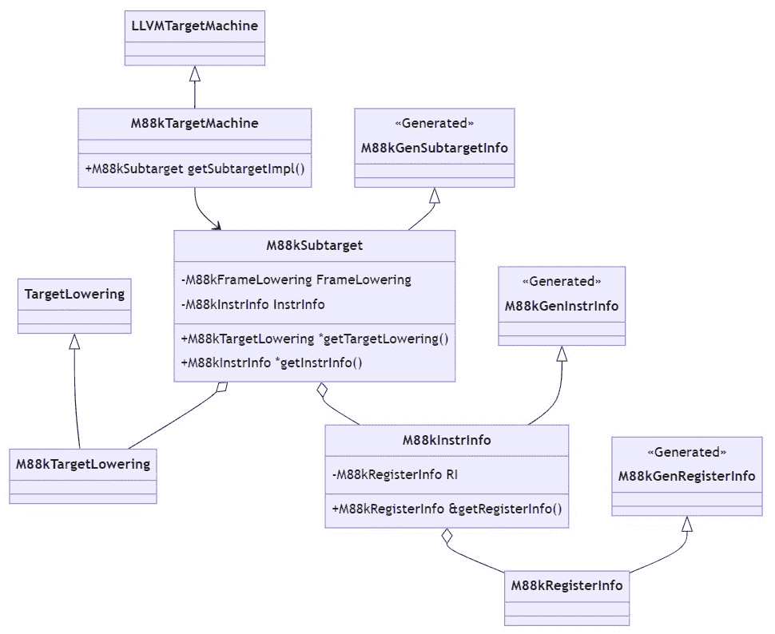

# 第十二章：指令选择

任何后端的核心都是指令选择。LLVM 实现了几种方法；在本章中，我们将通过选择**有向无环图**（**DAG**）和全局指令选择来实现指令选择。

在本章中，你将学习以下主题：

+   *定义调用约定规则*：本节展示了如何在目标描述中描述调用约定的规则

+   *通过选择 DAG 进行指令选择*：本节教你如何使用图数据结构实现指令选择

+   *添加寄存器和指令信息*：本节解释了如何访问目标描述中的信息，以及你需要提供哪些附加信息

+   *实施空帧降低*：本节介绍了函数的栈布局和前导部分

+   *生成机器指令*：本节告诉你机器指令是如何最终写入目标文件或汇编文本的

+   *创建目标机器和子目标*：本节展示了后端是如何配置的

+   *全局指令选择*：本节演示了指令选择的不同方法

+   *如何进一步发展后端*：本节为你提供了一些关于可能下一步的指导

到本章结束时，你将了解如何创建一个能够翻译简单指令的 LLVM 后端。你还将获得通过选择 DAG 和全局指令选择开发指令选择的知识，并且将熟悉你必须实现以使指令选择工作的重要支持类。

# 定义调用约定规则

实施调用约定规则是将 LLVM**中间表示**（**IR**）降低到机器代码的重要部分。基本规则可以在目标描述中定义。让我们看看。

大多数调用约定遵循一个基本模式：它们定义了一组寄存器用于参数传递。如果这个子集没有用完，下一个参数将传递到下一个空闲寄存器。如果没有空闲寄存器，则值将传递到栈上。这可以通过遍历参数并决定如何将每个参数传递给被调用函数，同时跟踪使用的寄存器来实现。在 LLVM 中，这个循环是在框架内部实现的，状态保存在一个名为`CCState`的类中。此外，规则也在目标描述中定义。

规则是以条件序列的形式给出的。如果条件成立，则执行操作。根据该操作的结果，要么找到参数的位置，要么评估下一个条件。例如，32 位整数在寄存器中传递。条件是类型检查，操作是将寄存器分配给该参数。在目标描述中，这被写成如下：

```cpp

CCIfType<[i32],
         CCAssignToReg<[R2, R3, R4, R5, R6, R7, R8, R9]>>,
```

当然，如果被调用的函数有超过八个参数，那么寄存器列表将会耗尽，操作将失败。剩余的参数将通过栈传递，我们可以将此指定为下一个操作：

```cpp

CCAssignToStack<4, 4>
```

第一个参数是栈槽的字节数大小，而第二个是对齐。由于这是一个通用的规则，没有使用条件。

## 实现调用约定规则

对于调用约定，还有一些需要注意的更多预定义条件和操作。例如，`CCIfInReg`检查参数是否带有`inreg`属性，如果函数有一个可变参数列表，则`CCIfVarArg`评估为`true`。`CCPromoteToType`操作将参数的类型提升到更大的类型，而`CCPassIndirect`操作表示参数值应该存储在栈上，并且将对该存储的指针作为普通参数传递。所有预定义的条件和操作都可以在`llvm/include/llvm/Target/TargetCallingConv.td`中引用。

参数和返回值都是这样定义的。我们将定义放入`M88kCallingConv.td`文件中：

1.  首先，我们必须定义参数的规则。为了简化编码，我们将只考虑 32 位值：

    ```cpp

    def CC_M88k : CallingConv<[
      CCIfType<[i8, i16], CCPromoteToType<i32>>,
      CCIfType<[i32,f32],
            CCAssignToReg<[R2, R3, R4, R5, R6, R7, R8, R9]>>,
      CCAssignToStack<4, 4>
    ]>;
    ```

1.  之后，我们必须定义返回值的规则：

    ```cpp

    def RetCC_M88k : CallingConv<[
      CCIfType<[i32], CCAssignToReg<[R2]>>
    ]>;
    ```

1.  最后，必须定义调用者保存寄存器的序列。请注意，我们使用`sequence`运算符生成寄存器序列，而不是逐个写出：

    ```cpp

    def CSR_M88k :
        CalleeSavedRegs<(add R1, R30,
                             (sequence "R%d", 25,  14))>;
    ```

在目标描述中定义调用约定规则的好处是它们可以用于各种指令选择方法。接下来，我们将查看通过选择 DAG 进行指令选择。

# 通过选择 DAG 进行指令选择

从中间表示（IR）创建机器指令是后端中一个非常重要的任务。实现它的一个常见方法是通过使用 DAG：

1.  首先，我们必须从中间表示（IR）创建一个 DAG。DAG 的一个节点代表一个操作，边表示控制和数据流依赖关系。

1.  接下来，我们必须遍历 DAG 并合法化类型和操作。合法化意味着我们只使用硬件支持的类型和操作。这需要我们创建一个配置，告诉框架如何处理非法类型和操作。例如，一个 64 位值可以被拆分为两个 32 位值，两个 64 位值的乘法可以改为库调用，一个复杂的操作，如计数人口，可以扩展为一系列更简单的操作来计算这个值。

1.  之后，使用模式匹配来匹配 DAG 中的节点，并用机器指令替换它们。我们在上一章中遇到了这样的模式。

1.  最后，指令调度器重新排列机器指令，以获得更高效的顺序。

这只是通过选择 DAG 进行指令选择过程的高级描述。如果您想了解更多细节，可以在[`llvm.org/docs/CodeGenerator.html#selectiondag-instruction-selection-process`](https://llvm.org/docs/CodeGenerator.html#selectiondag-instruction-selection-process)的*The LLVM Target-Independent Code Generator*用户指南中找到。

此外，LLVM 中的所有后端都实现了选择 DAG。主要优势是它生成高效的代码。然而，这也有代价：创建 DAG 代价高昂，并且会减慢编译速度。因此，这促使 LLVM 开发者寻找替代的、更理想的方法。一些目标通过 FastISel 实现指令选择，它仅用于非优化代码。它可以快速生成代码，但生成的代码不如选择 DAG 方法生成的代码。此外，它增加了一个全新的指令选择方法，这使测试工作翻倍。另一种用于指令选择的方法称为全局指令选择，我们将在后面的*全局指令选择*部分进行探讨。

在本章中，我们的目标是实现足够的后端功能，以便降低一个简单的 IR 函数，如下所示：

```cpp

define i32 @f1(i32 %a, i32 %b) {
  %res = and i32 %a, %b
  ret i32 %res
}
```

此外，对于真正的后端，还需要更多的代码，我们必须指出需要添加什么以实现更多功能。

要通过选择 DAG 实现指令选择，我们需要创建两个新的类：`M88kISelLowering`和`M88kDAGToDAGISel`。前者类用于定制 DAG，例如，通过定义哪些类型是合法的。它还包含支持函数和函数调用的代码。后者类执行 DAG 转换，其实现主要来自目标描述。

在后端中，我们将添加几个类的实现，*图 12**.1*展示了我们将进一步开发的主要类之间的高级关系：



图 12.1 – 主要类之间的关系

## 实现 DAG 降低 – 处理合法类型和设置操作

让我们首先实现`M88kISelLowering`类，该类存储在`M88kISelLowering.cpp`文件中。构造函数配置合法类型和操作：

1.  构造函数接受`TargetMachine`和`M88kSubtarget`类的引用作为参数。`TargetMachine`类负责目标的一般配置，例如，哪些传递需要运行。LLVM 后端通常针对一个 CPU 系列，而`M88kSubtarget`类描述了所选 CPU 的特性。我们将在本章后面讨论这两个类：

    ```cpp

    M88kTargetLowering::M88kTargetLowering(
        const TargetMachine &TM, const M88kSubtarget &STI)
        : TargetLowering(TM), Subtarget(STI) {
    ```

1.  第一步是声明哪种机器值类型使用哪种寄存器类。记住，寄存器类是从目标描述生成的。在这里，我们只处理 32 位值：

    ```cpp

      addRegisterClass(MVT::i32, &M88k::GPRRegClass);
    ```

1.  在添加所有寄存器类之后，我们必须计算这些寄存器类的派生属性。我们需要查询子目标以获取寄存器信息，这些信息主要来自目标描述：

    ```cpp

    computeRegisterProperties(Subtarget.getRegisterInfo());
    ```

1.  接下来，我们必须声明哪个寄存器包含栈指针：

    ```cpp

      setStackPointerRegisterToSaveRestore(M88k::R31);
    ```

1.  布尔值在不同的平台上表示方式不同。对于我们的目标，我们将声明布尔值存储在位`0`；其他位被清除：

    ```cpp

      setBooleanContents(ZeroOrOneBooleanContent);
    ```

1.  然后，我们设置函数的对齐方式。最小函数对齐是正确执行所需的对齐方式。此外，我们给出首选对齐方式：

    ```cpp

      setMinFunctionAlignment(Align(4));
      setPrefFunctionAlignment(Align(4));
    ```

1.  最后，我们声明哪些操作是合法的。在前一章中，我们只定义了三个逻辑指令，并且它们对于 32 位值是合法的：

    ```cpp

      setOperationAction(ISD::AND, MVT::i32, Legal);
      setOperationAction(ISD::OR, MVT::i32, Legal);
      setOperationAction(ISD::XOR, MVT::i32, Legal);
    ```

1.  除了`Legal`之外，我们还可以使用其他一些操作。`Promote`扩展类型，`Expand`用其他操作替换操作，`LibCall`将操作降低到库调用，而`Custom`调用`LowerOperation()`钩子方法，这允许你实现自己的自定义处理。例如，在 M88k 架构中，没有计数人口指令，因此我们请求将此操作扩展到其他操作：

    ```cpp

      setOperationAction(ISD::CTPOP, MVT::i32, Expand);
    }
    ```

现在，让我们回顾一些要点，以强调我们迄今为止所做定义之间的联系。在`M88kInstrInfo.td`文件中提到的目标描述中，我们使用`and`助记符定义了一个机器指令，并且我们还为其附加了一个模式。如果我们展开`AND`多类记录，并且只查看使用三个寄存器的指令，我们得到 TableGen 定义：

```cpp

let isCommutable = 1 in
  def ANDrr : F_LR<0b01000, Func, /*comp=*/0b0, "and",
                   [(set i32:$rd,
                       (and GPROpnd:$rs1, GPROpnd:$rs2))]>;
```

`"and"`字符串是指令的助记符。在 C++源代码中，我们使用`M88k::ANDrr`来引用这个指令。在模式中，使用 DAG `and`节点类型。在 C++中，它命名为`ISD::AND`，我们在调用`setOperationAction()`方法时使用了它。在指令选择期间，如果模式匹配（包括输入操作数），则将`and`类型的 DAG 节点替换为`M88k::ANDrr`指令。因此，当我们开发指令选择时，最重要的任务是定义正确的合法化操作并将模式附加到指令定义上。

## 实现 DAG 降低 - 降低形式参数

让我们转向`M88kISelLowering`类执行的另一个重要任务。我们在上一节中定义了调用约定的规则，但我们也需要将物理寄存器和内存位置映射到 DAG 中使用的虚拟寄存器。对于参数，这是在`LowerFormalArguments()`方法中完成的；返回值在`LowerReturn()`方法中处理。首先，我们必须处理参数：

1.  我们首先包括生成的源代码：

    ```cpp

    #include "M88kGenCallingConv.inc"
    ```

1.  `LowerFormalArguments()`方法接受多个参数。`SDValue`类表示与 DAG 节点关联的值，在处理 DAG 时经常使用。第一个参数`Chain`代表控制流，可能的更新`Chain`也是该方法的返回值。`CallConv`参数标识使用的调用约定，如果参数列表中包含可变参数，则`IsVarArg`设置为`true`。需要处理的参数通过`Ins`参数传递，同时带上它们在`DL`参数中的位置。`DAG`参数使我们能够访问`SelectionDAG`类。最后，映射的结果将存储在`InVals`向量参数中：

    ```cpp

    SDValue M88kTargetLowering::LowerFormalArguments(
        SDValue Chain, CallingConv::ID CallConv,
        bool IsVarArg,
        const SmallVectorImpl<ISD::InputArg> &Ins,
        const SDLoc &DL, SelectionDAG &DAG,
        SmallVectorImpl<SDValue> &InVals) const {
    ```

1.  我们的第一步是检索机器函数和机器寄存器信息的引用：

    ```cpp

      MachineFunction &MF = DAG.getMachineFunction();
      MachineRegisterInfo &MRI = MF.getRegInfo();
    ```

1.  接下来，我们必须调用生成的代码。我们需要实例化`CCState`类的一个对象。在调用`AnalyzeFormalArguments()`方法时使用的`CC_M88k`参数值是在目标描述中使用的调用约定名称。结果存储在`ArgLocs`向量中：

    ```cpp

      SmallVector<CCValAssign, 16> ArgLocs;
      CCState CCInfo(CallConv, IsVarArg, MF, ArgLocs,
                     *DAG.getContext());
      CCInfo.AnalyzeFormalArguments(Ins, CC_M88k);
    ```

1.  一旦确定了参数的位置，我们需要将它们映射到 DAG。因此，我们必须遍历所有位置：

    ```cpp

      for (unsigned I = 0, E = ArgLocs.size(); I != E; ++I) {
        SDValue ArgValue;
        CCValAssign &VA = ArgLocs[I];
        EVT LocVT = VA.getLocVT();
    ```

1.  映射取决于确定的地址。首先，我们处理分配给寄存器的参数。目标是把物理寄存器复制到虚拟寄存器。要做到这一点，我们需要确定正确的寄存器类别。由于我们只处理 32 位值，这很容易做到：

    ```cpp

        if (VA.isRegLoc()) {
          const TargetRegisterClass *RC;
          switch (LocVT.getSimpleVT().SimpleTy) {
          default:
            llvm_unreachable("Unexpected argument type");
          case MVT::i32:
            RC = &M88k::GPRRegClass;
            break;
          }
    ```

1.  由于寄存器类存储在`RC`变量中，我们可以创建虚拟寄存器并复制值。我们还需要将物理寄存器声明为输入活期：

    ```cpp

          Register VReg = MRI.createVirtualRegister(RC);
          MRI.addLiveIn(VA.getLocReg(), VReg);
          ArgValue =
              DAG.getCopyFromReg(Chain, DL, VReg, LocVT);
    ```

1.  在调用约定定义中，我们添加了规则，即 8 位和 16 位值应提升为 32 位，我们需要确保这里的提升。为此，必须插入一个 DAG 节点，以确保值被提升。之后，值被截断到正确的大小。注意，我们将`ArgValue`的值作为操作数传递给 DAG 节点，并将结果存储在同一个变量中：

    ```cpp

          if (VA.getLocInfo() == CCValAssign::SExt)
            ArgValue = DAG.getNode(
                ISD::AssertSext, DL, LocVT, ArgValue,
                DAG.getValueType(VA.getValVT()));
          else if (VA.getLocInfo() == CCValAssign::ZExt)
            ArgValue = DAG.getNode(
                ISD::AssertZext, DL, LocVT, ArgValue,
                DAG.getValueType(VA.getValVT()));
          if (VA.getLocInfo() != CCValAssign::Full)
            ArgValue = DAG.getNode(ISD::TRUNCATE, DL,
                                   VA.getValVT(), ArgValue);
    ```

1.  最后，我们通过将 DAG 节点添加到结果向量中完成对寄存器参数的处理：

    ```cpp

          InVals.push_back(ArgValue);
        }
    ```

1.  参数的另一个可能位置是在栈上。然而，我们没有定义任何加载和存储指令，所以我们还不能处理这种情况。这标志着对所有参数位置的遍历结束：

    ```cpp

        } else {
          llvm_unreachable("Not implemented");
        }
      }
    ```

1.  之后，我们可能需要添加代码来处理可变参数列表。同样，我们已经添加了一些代码来提醒我们尚未实现它：

    ```cpp

      assert(!IsVarArg && "Not implemented");
    ```

1.  最后，我们必须返回`Chain`参数：

    ```cpp

      return Chain;
    }
    ```

## 实现 DAG 降低 – 降低返回值

返回值处理方式类似。然而，我们必须扩展它们的目标描述。首先，我们需要定义一个新的 DAG 节点类型，称为`RET_GLUE`。这种 DAG 节点类型用于将返回值粘合在一起，防止它们被重新排列，例如，由指令调度器。`M88kInstrInfo.td`中的定义如下：

```cpp

def retglue : SDNode<"M88kISD::RET_GLUE", SDTNone,
                 [SDNPHasChain, SDNPOptInGlue, SDNPVariadic]>;
```

在同一文件中，我们还定义了一个伪指令来表示函数调用的返回，它将被选择为`RET_GLUE`节点：

```cpp

let isReturn = 1, isTerminator = 1, isBarrier = 1,
    AsmString = "RET" in
  def RET : Pseudo<(outs), (ins), [(retglue)]>;
```

当我们生成输出时，我们将扩展这个伪指令。

在这些定义到位后，我们可以实现`LowerReturn()`方法：

1.  参数与`LowerFormalArguments()`相同，只是顺序略有不同：

    ```cpp

    SDValue M88kTargetLowering::LowerReturn(
        SDValue Chain, CallingConv::ID CallConv,
        bool IsVarArg,
        const SmallVectorImpl<ISD::OutputArg> &Outs,
        const SmallVectorImpl<SDValue> &OutVals,
        const SDLoc &DL, SelectionDAG &DAG) const {
    ```

1.  首先，我们称生成的代码为`RetCC_M88k`调用约定：

    ```cpp

      SmallVector<CCValAssign, 16> RetLocs;
      CCState RetCCInfo(CallConv, IsVarArg,
                        DAG.getMachineFunction(), RetLocs,
                        *DAG.getContext());
      RetCCInfo.AnalyzeReturn(Outs, RetCC_M88k);
    ```

1.  然后，我们再次遍历位置。根据我们目前拥有的简单调用约定定义，这个循环最多执行一次。然而，如果我们添加对返回 64 位值的支持，这需要用两个寄存器返回，这将会改变：

    ```cpp

      SDValue Glue;
      SmallVector<SDValue, 4> RetOps(1, Chain);
      for (unsigned I = 0, E = RetLocs.size(); I != E; ++I) {
        CCValAssign &VA = RetLocs[I];
    ```

1.  之后，我们将返回值复制到分配给返回值的物理寄存器中。这主要与处理参数类似，但有一个例外，即使用`Glue`变量将值粘合在一起：

    ```cpp

        Register Reg = VA.getLocReg();
        Chain = DAG.getCopyToReg(Chain, DL, Reg, OutVals[I],
                                 Glue);
        Glue = Chain.getValue(1);
        RetOps.push_back(
            DAG.getRegister(Reg, VA.getLocVT()));
      }
    ```

1.  返回值是链和粘合的寄存器复制操作。后者仅在存在返回值时返回：

    ```cpp

      RetOps[0] = Chain;
      if (Glue.getNode())
        RetOps.push_back(Glue);
    ```

1.  最后，我们构建一个`RET_GLUE`类型的 DAG 节点，传递必要的值：

    ```cpp

      return DAG.getNode(M88kISD::RET_GLUE, DL, MVT::Other,
                         RetOps);
    }
    ```

恭喜！有了这些定义，指令选择的基石已经奠定。

## 在指令选择中实现 DAG 到 DAG 转换

还有一个关键部分缺失：我们需要定义执行目标描述中定义的 DAG 转换的 pass。类名为`M88kDAGToDAGISel`，存储在`M88kISelDAGToDAG.cpp`文件中。类的大部分是自动生成的，但我们仍然需要添加一些代码：

1.  我们首先定义调试类型并为传递提供描述性名称：

    ```cpp

    #define DEBUG_TYPE "m88k-isel"
    #define PASS_NAME
                "M88k DAG->DAG Pattern Instruction Selection"
    ```

1.  然后，我们必须在匿名命名空间内声明类。我们只重写`Select()`方法；其他代码在类的主体中生成并包含：

    ```cpp

    class M88kDAGToDAGISel : public SelectionDAGISel {
    public:
      static char ID;
      M88kDAGToDAGISel(M88kTargetMachine &TM,
                       CodeGenOpt::Level OptLevel)
          : SelectionDAGISel(ID, TM, OptLevel) {}
      void Select(SDNode *Node) override;
    #include "M88kGenDAGISel.inc"
    };
    } // end anonymous namespace
    ```

1.  然后，我们必须添加初始化传递的代码。LLVM 后端仍然使用传统的传递管理器，其设置与用于 IR 转换的传递管理器不同。使用静态成员`ID`值来识别传递。可以通过使用`INITIALIZE_PASS`宏来实现传递的初始化，该宏展开为 C++代码。我们还必须添加一个工厂方法来创建传递的实例：

    ```cpp

    char M88kDAGToDAGISel::ID = 0;
    INITIALIZE_PASS(M88kDAGToDAGISel, DEBUG_TYPE, PASS_NAME,
                    false, false)
    FunctionPass *
    llvm::createM88kISelDag(M88kTargetMachine &TM,
                            CodeGenOpt::Level OptLevel) {
      return new M88kDAGToDAGISel(TM, OptLevel);
    }
    ```

1.  最后，我们必须实现`Select()`方法。目前，我们只调用生成的代码。然而，如果我们遇到无法表示为 DAG 模式的复杂转换，那么我们可以在调用生成的代码之前添加我们自己的代码来执行转换：

    ```cpp

    void M88kDAGToDAGISel::Select(SDNode *Node) {
      SelectCode(Node);
    }
    ```

这样，我们就实现了指令选择。然而，在我们进行第一次测试之前，我们还需要添加一些支持类。我们将在接下来的几节中查看这些类。

# 添加寄存器和指令信息

目标描述捕获了关于寄存器和指令的大部分信息。要访问这些信息，我们必须实现`M88kRegisterInfo`和`M88kInstrInfo`类。这些类还包含我们可以重写的钩子，以完成在目标描述中难以表达的任务。让我们从在`M88kRegisterInfo.h`文件中声明的`M88kRegisterInfo`类开始：

1.  头文件首先包含来自目标描述生成的代码：

    ```cpp

    #define GET_REGINFO_HEADER
    #include "M88kGenRegisterInfo.inc"
    ```

1.  之后，我们必须在`llvm`命名空间中声明`M88kRegisterInfo`类。我们只重写了几个方法：

    ```cpp

    namespace llvm {
    struct M88kRegisterInfo : public M88kGenRegisterInfo {
      M88kRegisterInfo();
      const MCPhysReg *getCalleeSavedRegs(
          const MachineFunction *MF) const override;
      BitVector getReservedRegs(
          const MachineFunction &MF) const override;
      bool eliminateFrameIndex(
          MachineBasicBlock::iterator II, int SPAdj,
          unsigned FIOperandNum,
          RegScavenger *RS = nullptr) const override;
      Register getFrameRegister(
          const MachineFunction &MF) const override;
    };
    } // end namespace llvm
    ```

类的定义存储在`M88kRegisterInfo.cpp`文件中：

1.  再次，电影从包含来自目标描述生成的代码开始：

    ```cpp

    #define GET_REGINFO_TARGET_DESC
    #include "M88kGenRegisterInfo.inc"
    ```

1.  构造函数初始化超类，将包含返回地址的寄存器作为参数传递：

    ```cpp

    M88kRegisterInfo::M88kRegisterInfo()
        : M88kGenRegisterInfo(M88k::R1) {}
    ```

1.  然后，我们实现返回调用者保留寄存器列表的方法。我们在目标描述中定义了该列表，并且只返回该列表：

    ```cpp

    const MCPhysReg *M88kRegisterInfo::getCalleeSavedRegs(
        const MachineFunction *MF) const {
      return CSR_M88k_SaveList;
    }
    ```

1.  然后，我们处理保留寄存器。保留寄存器取决于平台和硬件。`r0`寄存器包含常量值`0`，因此我们将其视为保留寄存器。`r28`和`r29`寄存器始终保留供链接器使用。最后，`r31`寄存器用作栈指针。此列表可能取决于函数，并且由于这种动态行为，它不能生成：

    ```cpp

    BitVector M88kRegisterInfo::getReservedRegs(
        const MachineFunction &MF) const {
      BitVector Reserved(getNumRegs());
      Reserved.set(M88k::R0);
      Reserved.set(M88k::R28);
      Reserved.set(M88k::R29);
      Reserved.set(M88k::R31);
      return Reserved;
    }
    ```

1.  如果需要帧寄存器，则使用`r30`。请注意，我们的代码目前还不支持创建帧。如果函数需要帧，那么`r30`也必须在`getReservedRegs()`方法中标记为保留。然而，我们必须实现此方法，因为它在超类中被声明为纯虚函数：

    ```cpp

    Register M88kRegisterInfo::getFrameRegister(
        const MachineFunction &MF) const {
      return M88k::R30;
    }
    ```

1.  同样，我们需要实现`eliminateFrameIndex()`方法，因为它被声明为*纯虚*。它被调用以将操作数中的框架索引替换为用于在栈上寻址值的正确值：

    ```cpp

    bool M88kRegisterInfo::eliminateFrameIndex(
        MachineBasicBlock::iterator MI, int SPAdj,
        unsigned FIOperandNum, RegScavenger *RS) const {
      return false;
    }
    ```

`M88kInstrInfo`类有许多我们可以重写的钩子方法来完成特殊任务，例如，用于分支分析和重载。现在，我们只重写`expandPostRAPseudo()`方法，在这个方法中，我们扩展伪指令 RET。让我们从头文件`M88kInstrInfo.h`开始：

1.  头文件以包含生成的代码开始：

    ```cpp

    #define GET_INSTRINFO_HEADER
    #include "M88kGenInstrInfo.inc"
    ```

1.  `M88kInstrInfo`类从生成的`M88kGenInstrInfo`类派生。除了重写`expandPostRAPseudo()`方法外，唯一的其他添加是，这个类拥有先前定义的类`M88kRegisterInfo`的一个实例：

    ```cpp

    namespace llvm {
    class M88kInstrInfo : public M88kGenInstrInfo {
      const M88kRegisterInfo RI;
      [[maybe_unused]] M88kSubtarget &STI;
      virtual void anchor();
    public:
      explicit M88kInstrInfo(M88kSubtarget &STI);
      const M88kRegisterInfo &getRegisterInfo() const {
        return RI;
      }
      bool
      expandPostRAPseudo(MachineInstr &MI) const override;
    } // end namespace llvm
    ```

实现存储在`M88kInstrInfo.cpp`类中：

1.  与头文件一样，实现以包含生成的代码开始：

    ```cpp

    #define GET_INSTRINFO_CTOR_DTOR
    #define GET_INSTRMAP_INFO
    #include "M88kGenInstrInfo.inc"
    ```

1.  然后，我们定义`anchor()`方法，它用于将 vtable 固定到这个文件：

    ```cpp

    void M88kInstrInfo::anchor() {}
    ```

1.  最后，我们在`expandPostRAPseudo()`方法中扩展`RET`。正如其名称所暗示的，这个方法在寄存器分配器运行之后被调用，目的是扩展伪指令，该伪指令可能仍然与机器代码混合。如果机器指令的指令码`MI`是伪指令`RET`，我们必须插入`jmp %r1`跳转指令，这是退出函数的指令。然后，我们复制所有表示要返回值的隐式操作数，并删除伪指令。如果在代码生成过程中需要其他伪指令，我们也可以扩展这个函数来在这里扩展它们：

    ```cpp

    bool M88kInstrInfo::expandPostRAPseudo(
        MachineInstr &MI) const {
      MachineBasicBlock &MBB = *MI.getParent();
      switch (MI.getOpcode()) {
      default:
        return false;
      case M88k::RET: {
        MachineInstrBuilder MIB =
            BuildMI(MBB, &MI, MI.getDebugLoc(),
                    get(M88k::JMP))
                .addReg(M88k::R1, RegState::Undef);
        for (auto &MO : MI.operands()) {
          if (MO.isImplicit())
            MIB.add(MO);
        }
        break;
      }
      }
      MBB.erase(MI);
      return true;
    }
    ```

两个类都有最小实现。如果你继续开发目标，那么还需要重写更多方法。阅读`TargetInstrInfo`和`TargetRegisterInfo`基类的注释是值得的，这些基类可以在`llvm/include/llvm/CodeGen`目录中找到。

我们仍然需要更多类来使指令选择运行。接下来，我们将查看框架降低。

# 将一个空的框架降低框架放置到位

平台的二进制接口不仅定义了参数的传递方式。它还包括如何布局栈帧：局部变量存储在哪些位置，寄存器溢出到哪里等等。通常，在函数的开始和结束需要一段特殊的指令序列，称为`TargetFrameLowering`可用。简单的解决方案是为`M88kFrameLowering`类提供一个空的实现。

类的声明在`M88kFrameLowering.h`文件中。我们在这里必须重写纯虚函数：

```cpp

namespace llvm {
class M88kFrameLowering : public TargetFrameLowering {
public:
  M88kFrameLowering();
  void
  emitPrologue(MachineFunction &MF,
               MachineBasicBlock &MBB) const override;
  void
  emitEpilogue(MachineFunction &MF,
               MachineBasicBlock &MBB) const override;
  bool hasFP(const MachineFunction &MF) const override;
};
}
```

存储在`M88kFrameLowering.cpp`文件中的实现，在构造函数中提供了一些关于栈帧的基本细节。栈向下增长，到较小的地址，并且对齐在 8 字节边界上。当一个函数被调用时，局部变量直接存储在调用函数的栈指针下方，因此局部区域的偏移量是`0`。即使在函数调用期间，栈也应该保持在 8 字节边界上对齐。最后一个参数意味着栈不能重新对齐。其他函数只是有一个空的实现：

```cpp

M88kFrameLowering::M88kFrameLowering()
    : TargetFrameLowering(
          TargetFrameLowering::StackGrowsDown, Align(8),
          0, Align(8), false /* StackRealignable */) {}
void M88kFrameLowering::emitPrologue(
    MachineFunction &MF, MachineBasicBlock &MBB) const {}
void M88kFrameLowering::emitEpilogue(
    MachineFunction &MF, MachineBasicBlock &MBB) const {}
bool M88kFrameLowering::hasFP(
    const MachineFunction &MF) const { return false; }
```

当然，一旦我们的实现增长，这个类将是首先需要完全实现的第一批之一。

在我们可以将所有这些部分组合在一起之前，我们需要实现汇编打印机，它用于发出机器指令。

# 发出机器指令

指令选择从 LLVM IR 创建机器指令，表示为`MachineInstr`类。但这并不是结束。`MachineInstr`类的一个实例仍然携带额外的信息，例如标签或标志。要通过机器代码组件发出指令，我们需要将`MachineInstr`实例降低到`MCInst`实例。通过这样做，机器代码组件提供了将指令写入对象文件或将它们作为汇编文本打印出来的功能。`M88kAsmPrinter`类负责发出整个编译单元。指令降低被委托给`M88kMCInstLower`类。

汇编打印机是在后端运行的最后一个阶段。它的实现存储在`M88kAsmPrinter.cpp`文件中：

1.  `M88kAsmPrinter`类的声明在一个匿名命名空间中。除了构造函数外，我们只重写了`getPassName()`函数，它返回一个人类可读的字符串作为阶段的名称，以及`emitInstruction()`函数：

    ```cpp

    namespace {
    class M88kAsmPrinter : public AsmPrinter {
    public:
      explicit M88kAsmPrinter(
          TargetMachine &TM,
          std::unique_ptr<MCStreamer> Streamer)
          : AsmPrinter(TM, std::move(Streamer)) {}
      StringRef getPassName() const override {
        return "M88k Assembly Printer";
      }
      void emitInstruction(const MachineInstr *MI) override;
    };
    } // end of anonymous namespace
    ```

1.  像许多其他类一样，我们必须在我们的目标注册表中注册我们的汇编打印机：

    ```cpp

    extern "C" LLVM_EXTERNAL_VISIBILITY void
    LLVMInitializeM88kAsmPrinter() {
      RegisterAsmPrinter<M88kAsmPrinter> X(
          getTheM88kTarget());
    }
    ```

1.  `emitInstruction()`方法负责将机器指令`MI`发出到输出流。在我们的实现中，我们将指令降低委托给`M88kMCInstLower`类：

    ```cpp

    void M88kAsmPrinter::emitInstruction(
        const MachineInstr *MI) {
      MCInst LoweredMI;
      M88kMCInstLower Lower(MF->getContext(), *this);
      Lower.lower(MI, LoweredMI);
      EmitToStreamer(*OutStreamer, LoweredMI);
    }
    ```

这已经是完整的实现。基类`AsmPrinter`提供了许多你可以重写的有用钩子。例如，`emitStartOfAsmFile()`方法在发出任何内容之前被调用，而`emitEndOfAsmFile()`方法在发出所有内容之后被调用。这些方法可以在文件的开始和结束时发出特定目标的数据或代码。同样，`emitFunctionBodyStart()`和`emitFunctionBodyEnd()`方法在函数体发出之前和之后被调用。阅读`llvm/include/llvm/CodeGen/AsmPrinter.h`文件中的注释，以了解可以自定义的内容。

`M88kMCInstLower`类降低操作数和指令，我们的实现包含两个用于此目的的方法。声明在`M88kMCInstLower.h`文件中：

```cpp

class LLVM_LIBRARY_VISIBILITY M88kMCInstLower {
public:
  void lower(const MachineInstr *MI, MCInst &OutMI) const;
  MCOperand lowerOperand(const MachineOperand &MO) const;
};
```

定义被放入到 `M88kMCInstLower.cpp` 文件中：

1.  为了将 `MachineOperand` 降低到 `MCOperand`，我们需要检查操作数类型。在这里，我们只通过创建与 `MCOperand` 等效的寄存器和立即数值来处理寄存器和立即数，这些值由原始的 `MachineOperand` 值提供。一旦表达式作为操作数引入，这种方法就需要增强：

    ```cpp

    MCOperand M88kMCInstLower::lowerOperand(
        const MachineOperand &MO) const {
      switch (MO.getType()) {
      case MachineOperand::MO_Register:
        return MCOperand::createReg(MO.getReg());
      case MachineOperand::MO_Immediate:
        return MCOperand::createImm(MO.getImm());
      default:
        llvm_unreachable("Operand type not handled");
      }
    }
    ```

1.  指令的降低过程类似。首先，将操作码复制，然后处理操作数。`MachineInstr` 实例可以附加隐式操作数，这些操作数不会被降低，我们需要过滤它们：

    ```cpp

    void M88kMCInstLower::lower(const MachineInstr *MI,
                                MCInst &OutMI) const {
      OutMI.setOpcode(MI->getOpcode());
      for (auto &MO : MI->operands()) {
        if (!MO.isReg() || !MO.isImplicit())
          OutMI.addOperand(lowerOperand(MO));
      }
    }
    ```

这样，我们就实现了汇编打印机。现在，我们需要将所有这些部分组合在一起。我们将在下一节中这样做。

# 创建目标机器和子目标

到目前为止，我们已经实现了指令选择类和一些其他类。现在，我们需要设置我们的后端如何工作。就像优化管道一样，后端被分为多个阶段。配置这些阶段是 `M88kTargetMachine` 类的主要任务。此外，我们还需要指定哪些功能可用于指令选择。通常，一个平台是一系列 CPU，它们都有一个共同的指令集，但具有特定的扩展不同。例如，一些 CPU 有向量指令，而另一些则没有。在 LLVM IR 中，一个函数可以附加属性来指定该函数应该为哪个 CPU 编译，或者哪些功能可用。换句话说，每个函数可能有一个不同的配置，这被 `M88kSubTarget` 类捕获。

## 实现 M88kSubtarget

让我们先实现 `M88kSubtarget` 类。声明存储在 `M88kSubtarget.h` 类中：

1.  子目标的某些部分是从目标描述中生成的，我们首先包含这些代码：

    ```cpp

    #define GET_SUBTARGETINFO_HEADER
    #include "M88kGenSubtargetInfo.inc"
    ```

1.  然后，我们声明该类，从生成的 `M88kGenSubtargetInfo` 类派生。该类拥有几个先前定义的类——指令信息、目标降低类和帧降低类：

    ```cpp

    namespace llvm {
    class StringRef;
    class TargetMachine;
    class M88kSubtarget : public M88kGenSubtargetInfo {
      virtual void anchor();
      Triple TargetTriple;
      M88kInstrInfo InstrInfo;
      M88kTargetLowering TLInfo;
      M88kFrameLowering FrameLowering;
    ```

1.  子目标使用目标三元组、CPU 名称、特征字符串以及目标机器进行初始化，所有这些参数描述了我们的后端将为其生成代码的硬件：

    ```cpp

    public:
      M88kSubtarget(const Triple &TT,
                    const std::string &CPU,
                    const std::string &FS,
                    const TargetMachine &TM);
    ```

1.  接下来，我们再次包含生成的文件，这次是为了自动定义在目标描述中定义的功能的获取方法：

    ```cpp

    #define GET_SUBTARGETINFO_MACRO(ATTRIBUTE, DEFAULT,    \
                                    GETTER)                \
      bool GETTER() const { return ATTRIBUTE; }
    #include "M88kGenSubtargetInfo.inc"
    ```

1.  此外，我们需要声明 `ParseSubtargetFeatures()` 方法。该方法本身是从目标描述中生成的：

    ```cpp

      void ParseSubtargetFeatures(StringRef CPU,
                                  StringRef TuneCPU,
                                  StringRef FS);
    ```

1.  接下来，我们必须为成员变量添加获取方法：

    ```cpp

      const TargetFrameLowering *
      getFrameLowering() const override {
        return &FrameLowering;
      }
      const M88kInstrInfo *getInstrInfo() const override {
        return &InstrInfo;
      }
      const M88kTargetLowering *
      getTargetLowering() const override {
        return &TLInfo;
      }
    ```

1.  最后，我们必须为属于指令信息类的寄存器信息添加一个获取方法，这完成了声明：

    ```cpp

      const M88kRegisterInfo *
      getRegisterInfo() const override {
        return &InstrInfo.getRegisterInfo();
      }
    };
    } // end namespace llvm
    ```

接下来，我们必须实现实际的子目标类。实现存储在 `M88kSubtarget.cpp` 文件中：

1.  再次，我们首先通过包含生成的源文件来开始文件：

    ```cpp

    #define GET_SUBTARGETINFO_TARGET_DESC
    #define GET_SUBTARGETINFO_CTOR
    #include "M88kGenSubtargetInfo.inc"
    ```

1.  然后，我们定义锚定方法，它将 vtable 固定到这个文件：

    ```cpp

    void M88kSubtarget::anchor() {}
    ```

1.  最后，我们定义构造函数。请注意，生成的类期望两个 CPU 参数：第一个用于指令集，第二个用于调度。这里的用例是，你想要优化最新 CPU 的代码，但仍然能够在旧 CPU 上运行代码。我们不支持此功能，并为两个参数使用相同的 CPU 名称：

    ```cpp

    M88kSubtarget::M88kSubtarget(const Triple &TT,
                                 const std::string &CPU,
                                 const std::string &FS,
                                 const TargetMachine &TM)
        : M88kGenSubtargetInfo(TT, CPU, /*TuneCPU*/ CPU, FS),
          TargetTriple(TT), InstrInfo(*this),
          TLInfo(TM, *this), FrameLowering() {}
    ```

## 实现 M88kTargetMachine – 定义定义

最后，我们可以实现`M88kTargetMachine`类。这个类持有所有使用的子目标实例。它还拥有一个`TargetLoweringObjectFile`的子类，为降低过程提供如段名称等详细信息。最后，它创建在这个后端运行的传递配置。

`M88kTargetMachine.h`文件中的声明如下：

1.  `M88kTargetMachine`类从`LLVMTargetMachine`类派生。唯一的成员是一个`TargetLoweringObjectFile`实例和子目标映射：

    ```cpp

    namespace llvm {
    class M88kTargetMachine : public LLVMTargetMachine {
      std::unique_ptr<TargetLoweringObjectFile> TLOF;
      mutable StringMap<std::unique_ptr<M88kSubtarget>>
          SubtargetMap;
    ```

1.  构造函数的参数完全描述了我们将为其生成代码的目标配置。使用`TargetOptions`类，可以控制代码生成的许多细节 – 例如，是否可以使用浮点乘加指令。此外，重定位模型、代码模型和优化级别都传递给构造函数。值得注意的是，如果目标机器用于即时编译，则`JIT`参数设置为 true。

    ```cpp

    public:
      M88kTargetMachine(const Target &T, const Triple &TT,
                        StringRef CPU, StringRef FS,
                        const TargetOptions &Options,
                        std::optional<Reloc::Model> RM,
                        std::optional<CodeModel::Model> CM,
                        CodeGenOpt::Level OL, bool JIT);
    ```

1.  我们还需要重写一些方法。`getSubtargetImpl()`方法返回用于给定函数的子目标实例，而`getObjFileLowering()`方法仅返回成员变量。此外，我们重写`createPassConfig()`方法，它返回后端传递的配置：

    ```cpp

      ~M88kTargetMachine() override;
      const M88kSubtarget *
      getSubtargetImpl(const Function &) const override;
      TargetPassConfig *
      createPassConfig(PassManagerBase &PM) override;
      TargetLoweringObjectFile *
      getObjFileLowering() const override {
        return TLOF.get();
      }
    };
    } // end namespace llvm
    ```

## 实现 M88kTargetMachine – 添加实现

类的实现存储在`M88kTargetMachine.cpp`文件中。请注意，我们在*第十一章*中创建了此文件。现在，我们将用完整的实现替换此文件：

1.  首先，我们必须注册目标机器。此外，我们必须通过我们之前定义的初始化函数初始化 DAG-to-DAG 传递：

    ```cpp

    extern "C" LLVM_EXTERNAL_VISIBILITY void
    LLVMInitializeM88kTarget() {
      RegisterTargetMachine<M88kTargetMachine> X(
          getTheM88kTarget());
      auto &PR = *PassRegistry::getPassRegistry();
      initializeM88kDAGToDAGISelPass(PR);
    }
    ```

1.  接下来，我们必须定义支持函数，`computeDataLayout()`。我们曾在*第四章*中讨论了数据布局字符串，*IR 代码生成基础*。在这个函数中，数据布局作为后端，期望它被定义。由于数据布局依赖于硬件特性，因此将三元组、CPU 名称和特性集字符串传递给此函数。我们使用以下组件创建数据布局字符串。目标是大端(`E`)并使用`ELF`符号混淆。

    指针宽度为 32 位，且 32 位对齐。所有标量类型都是自然对齐的。`MC88110` CPU 有一个扩展的寄存器集，并支持 80 位宽的浮点数。如果我们支持这个特殊特性，那么我们需要在这里添加对 CPU 名称的检查，并相应地扩展字符串以包含浮点值。接下来，我们必须声明所有全局变量都有一个首选的 16 位对齐，并且硬件只有 32 位寄存器：

    ```cpp

    namespace {
    std::string computeDataLayout(const Triple &TT,
                                  StringRef CPU,
                                  StringRef FS) {
      std::string Ret;
      Ret += "E";
      Ret += DataLayout::getManglingComponent(TT);
      Ret += "-p:32:32:32";
      Ret += "-i1:8:8-i8:8:8-i16:16:16-i32:32:32-i64:64:64";
      Ret += "-f32:32:32-f64:64:64";
      Ret += "-a:8:16";
      Ret += "-n32";
      return Ret;
    }
    } // namespace
    ```

1.  现在，我们可以定义构造函数和析构函数。许多参数只是传递给超类构造函数。请注意，我们的`computeDataLayout()`函数在这里被调用。此外，`TLOF`成员使用`TargetLoweringObjectFileELF`的实例初始化，因为我们使用的是 ELF 文件格式。在构造函数的主体中，我们必须调用`initAsmInfo()`方法，该方法初始化超类中的许多数据成员：

    ```cpp

    M88kTargetMachine::M88kTargetMachine(
        const Target &T, const Triple &TT, StringRef CPU,
        StringRef FS, const TargetOptions &Options,
        std::optional<Reloc::Model> RM,
        std::optional<CodeModel::Model> CM,
        CodeGenOpt::Level OL, bool JIT)
        : LLVMTargetMachine(
              T, computeDataLayout(TT, CPU, FS), TT, CPU,
              FS, Options, !RM ? Reloc::Static : *RM,
              getEffectiveCodeModel(CM, CodeModel::Medium),
              OL),
          TLOF(std::make_unique<
               TargetLoweringObjectFileELF>()) {
      initAsmInfo();
    }
    M88kTargetMachine::~M88kTargetMachine() {}
    ```

1.  之后，我们定义了`getSubtargetImpl()`方法。要使用的子目标实例取决于`target-cpu`和`target-features`函数属性。例如，`target-cpu`属性可以设置为`MC88110`，从而针对第二代 CPU。然而，目标特性属性可能描述我们不应该使用该 CPU 的图形指令。我们尚未在目标描述中定义 CPU 及其特性，因此我们在这里做了比必要的更多的工作。然而，实现足够简单：我们查询函数属性，并使用返回的字符串或默认值。有了这些信息，我们可以查询`SubtargetMap`成员，如果找不到，我们创建子目标：

    ```cpp

    const M88kSubtarget *
    M88kTargetMachine::getSubtargetImpl(
        const Function &F) const {
      Attribute CPUAttr = F.getFnAttribute("target-cpu");
      Attribute FSAttr =
          F.getFnAttribute("target-features");
      std::string CPU =
          !CPUAttr.hasAttribute(Attribute::None)
              ? CPUAttr.getValueAsString().str()
              : TargetCPU;
      std::string FS = !FSAttr.hasAttribute(Attribute::None)
                           ? FSAttr.getValueAsString().str()
                           : TargetFS;
      auto &I = SubtargetMap[CPU + FS];
      if (!I) {
        resetTargetOptions(F);
        I = std::make_unique<M88kSubtarget>(TargetTriple,
                                            CPU, FS, *this);
      }
      return I.get();
    }
    ```

1.  最后，我们创建传递配置。为此，我们需要我们自己的类，`M88kPassConfig`，它从`TargetPassConfig`类派生。我们只重写了`addInstSelector`方法：

    ```cpp

    namespace {
    class M88kPassConfig : public TargetPassConfig {
    public:
      M88kPassConfig(M88kTargetMachine &TM,
                     PassManagerBase &PM)
          : TargetPassConfig(TM, PM) {}
      bool addInstSelector() override;
    };
    } // namespace
    ```

1.  通过这个定义，我们可以实现`createPassConfig`工厂方法：

    ```cpp

    TargetPassConfig *M88kTargetMachine::createPassConfig(
        PassManagerBase &PM) {
      return new M88kPassConfig(*this, PM);
    }
    ```

1.  最后，我们必须在`addInstSelector()`方法中将我们的指令选择类添加到传递管道中。返回值`false`表示我们已经添加了一个将 LLVM IR 转换为机器指令的传递：

    ```cpp

    bool M88kPassConfig::addInstSelector() {
      addPass(createM88kISelDag(getTM<M88kTargetMachine>(),
                                getOptLevel()));
      return false;
    }
    ```

完成实现是一个漫长的旅程！现在我们已经构建了`llc`工具，我们可以运行一个示例。将以下简单的 IR 保存到`and.ll`文件中：

```cpp

define i32 @f1(i32 %a, i32 %b) {
  %res = and i32 %a, %b
  ret i32 %res
}
```

现在，我们可以运行`llc`并验证生成的汇编代码是否合理：

```cpp

$ llc -mtriple m88k-openbsd < and.ll
        .text
        .file   "<stdin>"
        .globl  f1                              | -- Begin function f1
        .align  2
        .type   f1,@function
f1:                                     | @f1
| %bb.0:
        and %r2, %r2, %r3
        jmp %r1
.Lfunc_end0:
        .size   f1, .Lfunc_end0-f1
                                        | -- End function
        .section        ".note.GNU-stack","",@progbits
```

要为`m88k`目标编译，我们必须在命令行上指定三元组，就像这个例子中一样，或者在 IR 文件中。

在我们查看全局指令选择之前，先享受一下成功的喜悦。

# 全局指令选择

通过选择 DAG 进行指令选择可以生成快速代码，但这需要时间。编译器的速度对于开发者来说往往至关重要，他们希望快速尝试他们所做的更改。通常，编译器在优化级别`0`时应该非常快，但随着优化级别的提高，它可能需要更多的时间。然而，构建选择 DAG 需要花费大量时间，因此这种方法无法按需扩展。第一个解决方案是创建另一个名为`FastISel`的指令选择算法，它速度快但生成的代码质量不佳。它也没有与选择 DAG 实现共享代码，这是一个明显的问题。正因为如此，并非所有目标都支持`FastISel`。

选择 DAG 方法无法扩展，因为它是一个庞大且单一化的算法。如果我们能避免创建像选择 DAG 这样的新数据结构，那么我们应该能够使用小型组件执行指令选择。后端已经有一个传递管道，因此使用传递是一个自然的选择。基于这些想法，GlobalISel 执行以下步骤：

1.  首先，将 LLVM IR 降低到通用机器指令。通用机器指令代表了在真实硬件中最常见的操作。请注意，这种转换使用机器函数和机器基本块，这意味着它直接转换为后端其他部分使用的数据结构。

1.  然后，将通用机器指令合法化。

1.  之后，将通用机器指令的操作数映射到寄存器银行。

1.  最后，使用目标描述中定义的模式将通用指令替换为真实机器指令。

由于这些都是传递，我们可以在其中插入任意多的传递。例如，一个组合传递可以用来将一系列通用机器指令替换为另一个通用机器指令，或者是一个真实机器指令。关闭这些额外的传递可以提高编译速度，而开启它们则能提升生成代码的质量。因此，我们可以根据需要调整规模。

这种方法还有另一个优点。选择 DAG 按基本块逐个翻译，但机器传递是在机器函数上工作的，这使得我们能够在指令选择时考虑函数的所有基本块。因此，这种指令选择方法被称为全局指令选择（GlobalISel）。让我们看看这种方法是如何工作的，从调用转换开始。

## 降低参数和返回值

对于将 LLVM IR 转换为通用机器指令，我们只需要实现如何处理参数和返回值。同样，可以通过使用目标描述生成的代码来简化实现。我们将创建的类称为`M88kCallLowering`，其声明在`GISel/M88kCallLowering.h`头文件中：

```cpp

class M88kCallLowering : public CallLowering {
public:
  M88kCallLowering(const M88kTargetLowering &TLI);
  bool
  lowerReturn(MachineIRBuilder &MIRBuilder,
              const Value *Val,
              ArrayRef<Register> VRegs,
              FunctionLoweringInfo &FLI,
              Register SwiftErrorVReg) const override;
  bool lowerFormalArguments(
      MachineIRBuilder &MIRBuilder, const Function &F,
      ArrayRef<ArrayRef<Register>> VRegs,
      FunctionLoweringInfo &FLI) const override;
  bool enableBigEndian() const override { return true; }
};
```

当函数被转换时，GlobalISel 框架将调用 `lowerReturn()` 和 `lowerFormalArguments()` 方法。为了转换函数调用，你还需要覆盖并实现 `lowerCall()` 方法。请注意，我们还需要覆盖 `enableBigEndian()`。如果没有它，将会生成错误的机器代码。

对于 `GISel/M88kCallLowering.cpp` 文件中的实现，我们需要定义支持类。从目标描述生成的代码告诉我们参数是如何传递的——例如，在寄存器中。我们需要创建一个 `ValueHandler` 的子类来生成它的机器指令。对于传入的参数，我们需要从 `IncomingValueHandler` 派生我们的类，以及对于返回值从 `OutgoingValueHandler` 派生。这两个都非常相似，所以我们只看传入参数的处理器：

```cpp

namespace {
struct FormalArgHandler
    : public CallLowering::IncomingValueHandler {
  FormalArgHandler(MachineIRBuilder &MIRBuilder,
                   MachineRegisterInfo &MRI)
      : CallLowering::IncomingValueHandler(MIRBuilder,
                                           MRI) {}
  void assignValueToReg(Register ValVReg,
                        Register PhysReg,
                        CCValAssign VA) override;
  void assignValueToAddress(Register ValVReg,
                            Register Addr, LLT MemTy,
                            MachinePointerInfo &MPO,
                            CCValAssign &VA) override{};
  Register
  getStackAddress(uint64_t Size, int64_t Offset,
                  MachinePointerInfo &MPO,
                  ISD::ArgFlagsTy Flags) override {
    return Register();
  };
};
} // namespace
```

到目前为止，我们只能处理通过寄存器传递的参数，因此我们必须为其他方法提供虚拟实现。`assignValueToReg()` 方法将传入的物理寄存器的值复制到虚拟寄存器，如果需要则进行截断。我们在这里要做的只是将物理寄存器标记为函数的 live-in，并调用超类实现：

```cpp

void FormalArgHandler::assignValueToReg(
    Register ValVReg, Register PhysReg,
    CCValAssign VA) {
  MIRBuilder.getMRI()->addLiveIn(PhysReg);
  MIRBuilder.getMBB().addLiveIn(PhysReg);
  CallLowering::IncomingValueHandler::assignValueToReg(
      ValVReg, PhysReg, VA);
}
```

现在，我们可以实现 `lowerFormalArgument()` 方法：

1.  首先，`IR` 函数的参数被转换成 `ArgInfo` 类的实例。`setArgFlags()` 和 `splitToValueTypes()` 框架方法帮助复制参数属性，并在传入的参数需要多个虚拟寄存器时分割值类型：

    ```cpp

    bool M88kCallLowering::lowerFormalArguments(
        MachineIRBuilder &MIRBuilder, const Function &F,
        ArrayRef<ArrayRef<Register>> VRegs,
        FunctionLoweringInfo &FLI) const {
      MachineFunction &MF = MIRBuilder.getMF();
      MachineRegisterInfo &MRI = MF.getRegInfo();
      const auto &DL = F.getParent()->getDataLayout();
      SmallVector<ArgInfo, 8> SplitArgs;
      for (const auto &[I, Arg] :
           llvm::enumerate(F.args())) {
        ArgInfo OrigArg{VRegs[I], Arg.getType(),
                        static_cast<unsigned>(I)};
        setArgFlags(OrigArg,
                    I + AttributeList::FirstArgIndex, DL,
                    F);
        splitToValueTypes(OrigArg, SplitArgs, DL,
                          F.getCallingConv());
      }
    ```

1.  在 `SplitArgs` 变量中准备好参数后，我们就准备好生成机器代码了。这一切都是通过框架代码完成的，在生成的调用约定 `CC_M88k` 和我们的辅助类 `FormalArghandler` 的帮助下：

    ```cpp

      IncomingValueAssigner ArgAssigner(CC_M88k);
      FormalArgHandler ArgHandler(MIRBuilder, MRI);
      return determineAndHandleAssignments(
          ArgHandler, ArgAssigner, SplitArgs, MIRBuilder,
          F.getCallingConv(), F.isVarArg());
    }
    ```

返回值以类似的方式处理，主要区别是最多返回一个值。下一个任务是合法化通用机器指令。

## 将通用机器指令合法化

从 LLVM IR 到通用机器代码的转换主要是固定的。因此，可以生成使用不支持的数据类型的指令，以及其他挑战。合法化传递的任务是定义哪些操作和指令是合法的。有了这些信息，GlobalISel 框架试图将指令转换成合法形式。例如，m88k 架构只有 32 位寄存器，所以对 64 位值的位运算 `and` 是不合法的。然而，如果我们把 64 位值分成两个 32 位值，并使用两个位运算 `and` 代替，那么我们就有了合法的代码。这可以转换成一个合法化规则：

```cpp

  getActionDefinitionsBuilder({G_AND, G_OR, G_XOR})
      .legalFor({S32})
      .clampScalar(0, S32, S32);
```

当合法化传递处理`G_AND`指令时，如果所有操作数都是 32 位宽，则该指令是合法的。否则，操作数会被限制为 32 位宽，实际上是将更大的值分割成多个 32 位值，然后再次应用该规则。如果指令无法合法化，后端将终止并显示错误信息。

所有合法化规则都在`M88kLegalizerInfo`类的构造函数中定义，这使得该类非常简单。

“合法”是什么意思？

在 GlobalISel 中，如果一条通用指令可以被指令选择器翻译，则该指令是合法的。这给了我们在实现上更多的自由度。例如，我们可以声明一条指令作用于位值，即使硬件只操作 32 位值，只要指令选择器可以正确处理该类型即可。

我们接下来需要查看的是寄存器组选择器。

## 为操作数选择寄存器组

许多架构定义了多个寄存器组。寄存器组是一组寄存器。典型的寄存器组包括通用寄存器组和浮点寄存器组。为什么这个信息很重要？在寄存器组内部从一个寄存器移动到另一个寄存器的值通常成本很低，但将值复制到另一个寄存器组可能会很昂贵或不可能。因此，我们必须为每个操作数选择一个好的寄存器组。

这个类的实现涉及到对目标描述的补充。在`GISel/M88lRegisterbanks.td`文件中，我们定义了我们唯一的寄存器组，引用了我们定义的寄存器类：

```cpp

def GRRegBank : RegisterBank<"GRRB", [GPR, GPR64]>;
```

从这一行开始，生成了一些支持代码。然而，我们仍然需要添加一些可能生成的代码。首先，我们需要定义部分映射。这告诉框架值从哪个位索引开始，它的宽度是多少，以及它映射到哪个寄存器组。我们有两条条目，每个寄存器类一个：

```cpp

RegisterBankInfo::PartialMapping
    M88kGenRegisterBankInfo::PartMappings[]{
        {0, 32, M88k::GRRegBank},
        {0, 64, M88k::GRRegBank},
    };
```

要索引这个数组，我们必须定义一个枚举：

```cpp

enum PartialMappingIdx { PMI_GR32 = 0, PMI_GR64, };
```

由于我们只有三个地址指令，我们需要三个部分映射，每个操作数一个。我们必须创建一个包含所有这些指针的数组，第一个条目表示一个无效映射：

```cpp

RegisterBankInfo::ValueMapping
    M88kGenRegisterBankInfo::ValMappings[]{
        {nullptr, 0},
        {&M88kGenRegisterBankInfo::PartMappings[PMI_GR32], 1},
        {&M88kGenRegisterBankInfo::PartMappings[PMI_GR32], 1},
        {&M88kGenRegisterBankInfo::PartMappings[PMI_GR32], 1},
        {&M88kGenRegisterBankInfo::PartMappings[PMI_GR64], 1},
        {&M88kGenRegisterBankInfo::PartMappings[PMI_GR64], 1},
        {&M88kGenRegisterBankInfo::PartMappings[PMI_GR64], 1},
    };
```

要访问该数组，我们必须定义一个函数：

```cpp

const RegisterBankInfo::ValueMapping *
M88kGenRegisterBankInfo::getValueMapping(
    PartialMappingIdx RBIdx) {
  return &ValMappings[1 + 3*RBIdx];
}
```

在创建这些表格时，很容易出错。乍一看，所有这些信息都可以从目标描述中推导出来，源代码中的注释指出，这段代码应由 TableGen 生成！然而，这尚未实现，因此我们必须手动创建代码。

我们在`M88kRegisterBankInfo`类中必须实现的最重要函数是`getInstrMapping()`，它返回指令每个操作数的映射寄存器组。现在这变得简单，因为我们可以查找部分映射数组，然后将其传递给`getInstructionMapping()`方法，该方法构建完整的指令映射：

```cpp

const RegisterBankInfo::InstructionMapping &
M88kRegisterBankInfo::getInstrMapping(
    const MachineInstr &MI) const {
  const ValueMapping *OperandsMapping = nullptr;
  switch (MI.getOpcode()) {
  case TargetOpcode::G_AND:
  case TargetOpcode::G_OR:
  case TargetOpcode::G_XOR:
    OperandsMapping = getValueMapping(PMI_GR32);
    break;
  default:
#if !defined(NDEBUG) || defined(LLVM_ENABLE_DUMP)
    MI.dump();
#endif
    return getInvalidInstructionMapping();
  }
  return getInstructionMapping(DefaultMappingID, /*Cost=*/1,
                               OperandsMapping,
                               MI.getNumOperands());
}
```

在开发过程中，忘记通用指令的寄存器组映射是很常见的。不幸的是，在运行时生成的错误信息并没有提到映射失败的指令是哪一个。简单的修复方法是返回无效映射之前先转储指令。然而，我们需要在这里小心，因为`dump()`方法并不适用于所有构建类型。

在映射寄存器组之后，我们必须将通用机器指令翻译成实际的机器指令。

## 翻译通用机器指令

对于通过选择 DAG 进行指令选择，我们在目标描述中添加了模式，这些模式使用 DAG 操作和操作数。为了重用这些模式，引入了从 DAG 节点类型到通用机器指令的映射。例如，DAG 的`and`操作映射到通用的`G_AND`机器指令。并非所有 DAG 操作都有等效的通用机器指令；然而，最常见的情况都得到了覆盖。因此，在目标描述中定义所有代码选择模式是有益的。

`M88kInstructionSelector`类的实现大部分，该类可以在`GISel/M88kInstructionSelector.cpp`文件中找到，是从目标描述生成的。然而，我们需要重写`select()`方法，这允许我们将目标描述中模式未覆盖的通用机器指令进行翻译。由于我们只支持非常小的通用指令子集，我们可以简单地调用生成的模式匹配器：

```cpp

bool M88kInstructionSelector::select(MachineInstr &I) {
  if (selectImpl(I, *CoverageInfo))
    return true;
  return false;
}
```

指令选择实现后，我们可以使用 GlobalISel 来翻译 LLVM IR！

## 运行示例

要使用 GlobalISel 翻译 LLVM IR，我们需要在`llc`的命令行中添加`-global-isel`选项。例如，你可以使用之前定义的 IR 文件`and.ll`：

```cpp

$ llc -mtriple m88k-openbsd -global-isel < and.ll
```

打印的汇编文本是相同的。为了让我们确信翻译使用了 GlobalISel，我们必须利用这样一个事实：我们可以使用`-stop-after=`选项在指定 pass 运行后停止翻译。例如，要查看合法化后的通用指令，你会运行以下命令：

```cpp

$ llc -mtriple m88k-openbsd -global-isel < and.ll \
  -stop-after=legalizer
```

在运行一个 pass 之后（或之前）停止的能力是 GlobalISel 的另一个优点，因为它使得调试和测试实现变得容易。

到目前为止，我们已经有一个可以翻译一些 LLVM IR 到 m88k 架构机器代码的工作后端。让我们思考如何从这里过渡到一个更完整的后端。

# 如何进一步发展后端

通过本章和上一章的代码，我们已经创建了一个可以将一些 LLVM IR 翻译成机器代码的后端。看到后端工作是非常令人满意的，但它离用于严肃任务还远。还需要更多的编码。以下是如何进一步发展后端的步骤：

+   你应该做的第一个决定是是否要使用 GlobalISel 或选择 DAG。根据我们的经验，GlobalISel 更容易理解和开发，但 LLVM 源树中的所有目标都实现了选择 DAG，你可能已经对它有了一些使用经验。

+   接下来，你应该定义添加和减去整数值的指令，这可以与位运算`and`指令类似地完成。

+   之后，你应该实现加载和存储指令。这更为复杂，因为你需要翻译不同的寻址模式。很可能会遇到索引，例如，为了访问数组的一个元素，这很可能需要之前定义的加法指令。

+   最后，你可以完全实现帧降低和调用降低。在这个阶段，你可以将一个简单的“Hello, world!”风格的应用程序翻译成可运行的程序。

+   下一个逻辑步骤是实现分支指令，这可以使循环的翻译成为可能。为了生成最优代码，你需要在指令信息类中实现分支分析方法。

当你达到这个阶段时，你的后端已经可以翻译简单的算法。你也应该积累了足够多的经验，可以根据你的优先级开发缺失的部分。

# 摘要

在本章中，你向你的后端添加了两种不同的指令选择：通过选择 DAG 进行指令选择和全局指令选择。为此，你需要在目标描述中定义调用约定。此外，你需要实现寄存器和指令信息类，这些类让你能够访问从目标描述生成的信息，但你还需要用额外的信息来增强它们。你了解到栈帧布局和前导代码生成在之后是必需的。为了翻译一个示例，你添加了一个用于发出机器指令的类，并创建了后端的配置。你还学习了全局指令选择的工作原理。最后，你获得了一些关于如何独立开发后端的指导。

在下一章中，我们将探讨在指令选择之后可以执行的一些任务——我们将在后端管道中添加一个新的传递，查看如何将后端集成到 clang 编译器中，以及如何交叉编译到不同的架构。
