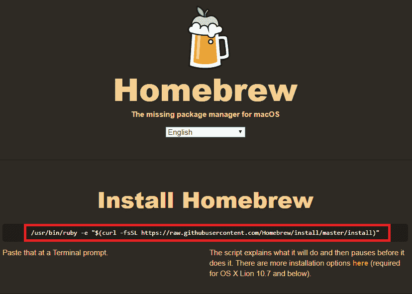

# 第一章：设置 OpenGL

欢迎来到现代 OpenGL 的世界。**开放图形库**（**OpenGL**）是一个 API，它为开发者提供了一系列函数，使他们能够操纵图形和图像。它是当今大多数游戏的核心框架，无论是 iOS 或 Android 的移动游戏，还是其他平台，如桌面和游戏机。OpenGL 本身就是最好的证明。看看你能想到的任何类型的游戏，在 OpenGL 中都是可以实现的。它不仅限于 3D；你还可以创建 2D 游戏。2D 和 3D 游戏引擎都是使用 OpenGL 创建的，所以它能够胜任你所能想到的一切。在本书中，我们将学习所有必要的 3D 游戏开发概念。

在本章中，我们将探讨如何在 Windows 和 Mac 上使用各种库（如 GLFW、GLEW、SDL 和 SFML）设置 OpenGL。本章的主要重点是了解如何下载这些库以及如何使用它们设置 OpenGL。在我们学习如何设置项目的同时，我们还将探讨如何使用绝对和相对链接将这些库链接到我们的项目中。

本章节将涵盖以下主题：

+   下载必需的库

+   在不同平台上设置项目以使用库

+   使用库创建 OpenGL 渲染窗口

您可以在 GitHub 上的`Chapter01`文件夹中找到本章节的所有代码文件。GitHub 链接可以在本书的序言中找到。

# 在 Windows 上使用 GLFW 和 GLEW 设置 OpenGL

在本节中，我们将学习如何在 Windows 系统上使用 Visual Studio 通过 GLFW 和 GLEW 设置 OpenGL，但首先让我们了解 GLFW 和 GLEW 是什么。**GLFW**是一个**OpenGL 框架**。这是一个非常轻量级的框架，它允许我们检测事件，如键盘输入、鼠标输入和其他类型的输入，但更重要的是，它允许你创建一个渲染窗口，你可以在其中渲染你的代码，因为 OpenGL 没有创建渲染窗口的方法，它需要像 GLFW 这样的东西来创建。

**GLEW**是**OpenGL 扩展包装器**，它基本上允许你使用新的 OpenGL 函数，或者更确切地说，非核心函数。它在运行时提供系统机制来确定目标平台支持哪些 OpenGL 扩展。对于任何新函数，你本质上需要像 OpenGL 扩展包装器这样的东西来初始化扩展并编写可移植的应用程序。

**首要之事**：对于本书来说，你有一个良好的 C++基础非常重要，因为在本书中，你将使用 C++与 OpenGL 结合。OpenGL 并不容易。如果你是第一次编码或者编码时间不长，建议你先掌握 C++，然后再继续阅读本书。

让我们通过下载 GLFW 和 GLEW 库来开始我们的设置过程。

# 下载必需的库

让我们开始设置，按照以下步骤操作：

1.  首先，我们需要 Visual Studio。您可能已经安装了它。如果您已经安装，那真是太好了。如果没有，请访问[`visualstudio.microsoft.com/`](https://visualstudio.microsoft.com/)，转到“下载”，然后点击下载**Visual Studio Community 2017**版本。然后，按照说明将 Visual Studio 安装到您的系统上。一旦安装完成，您只需确保它已设置为 C++环境。

如果您有**专业**版本，那真是太好了，但**社区**版本也完全足够。

1.  接下来，我们将下载**OpenGL 扩展管理器**库。访问[`glew.sourceforge.net/`](http://glew.sourceforge.net/)，然后点击“二进制”选项下载 32 位或 64 位版本文件，根据您的系统需求：


下载 GLEW 的二进制文件

下载完成后，只需解压文件并将其放置在您认为方便访问的地方，因为对于这个项目以及您创建的任何其他项目，它将引用该目录。所以，您不想移动它，因为那样您将不得不重新设置您项目的设置。对于这个项目，建议您在`C:`驱动器中创建一个名为`OpenGL`的文件夹，并将所有下载的库放在里面。这将帮助您在链接库到项目时更容易访问。

当您解压文件时，它们不会被很好地命名，您可能会发现所有版本号和相关信息都让人困惑。因此，为了去除任何版本信息文本，最好将文件夹重命名为像`GLEW`和`GLFW`这样简单的东西。这样很整洁，您可以轻松知道自己在做什么，并且这使得查看事物变得容易得多。

1.  一旦完成，我们将继续下载**OpenGL 框架**库文件。访问[`www.glfw.org/`](http://www.glfw.org/)并点击“下载”菜单。我们将需要下载 Windows 的预编译二进制文件。如以下截图所示，根据您的系统需求选择并点击下载 32 位或 64 位版本：


下载 GLFW 的二进制文件

**注意**：即使您知道您需要下载 64 位版本来在 64 位机器上进行开发，也尽量坚持使用 32 位版本，因为除非您认为您的游戏或应用程序将使用超过 4GB 的内存，否则 32 位版本将完全足够，并且有助于最大化兼容性。

下载文件后，解压它，如前所述，将其放置在`OpenGL`文件夹内的`GLFW`文件夹中。

# 使用绝对链接链接 GLFW 和 GLEW 库

在我们下载了所有必要的文件后，我们将使用 GLFW 和 GLEW 库在 Visual Studio 中为 OpenGL 设置环境。按照以下步骤操作：

1.  打开 Visual Studio，然后点击创建新项目...:


Visual Studio 启动页面

1.  然后，转到 Visual C++ | Windows 桌面 | Windows 控制台应用程序，并将你的项目命名为 `GLFWOpenGL`，如以下截图所示，然后点击 OK：


创建新项目

如果你没有在新建项目窗口中看到 Visual C++ 选项，你可能需要下载 Visual C++。更多信息，你可以访问以下链接：

[`docs.microsoft.com/en-us/cpp/build/vscpp-step-0-installation`](https://docs.microsoft.com/en-us/cpp/build/vscpp-step-0-installation)

1.  现在，在解决方案资源管理器窗口中右键单击项目。转到添加 | 新项，你将得到一个添加新项窗口。选择 C++ 文件，因为这将是我们的主文件，让我们将其命名为 `main.cpp`，然后点击添加按钮。

1.  接下来，在解决方案资源管理器窗口中右键单击项目**。** 点击属性**。**

1.  将弹出一个属性页窗口；点击 C/C++ | 通用，然后转到附加包含目录。点击下拉菜单，然后点击 <编辑>，你将得到如下弹窗：


添加包含目录

1.  如前一张截图所示，点击新建按钮，然后点击三个点。现在，浏览到 `OpenGL` 文件夹中的 `GLEW` 文件夹。选择 `include` 文件夹，然后点击选择文件夹按钮。接下来，我们重复相同的步骤将 GLFW 库添加到我们的项目中。一旦我们包含了这两个库，点击 OK 按钮。

1.  现在，再次在属性页窗口中，我们将转到链接器 | 通用，然后转到附加库目录。点击下拉菜单，然后点击 <编辑>，你将得到一个弹窗，如下所示：


添加库

1.  如前一张截图所示，点击新建按钮，然后点击三个点。现在，浏览到你下载 GLEW 文件的 `OpenGL` 文件夹。打开 `GLEW` 文件夹中的 `lib` 文件夹，然后双击 `Release` 文件夹，选择 `Win32`，然后点击选择文件夹按钮。

1.  重复相同的步骤以包含 GLFW 库。但对于 GLFW，你有一系列不同的库可以选择。对于我们的项目，最好选择 `lib-vc2015` 文件夹。一旦你添加了这两个库，点击 OK 按钮。

有许多其他版本的库可供选择用于 GLFW。所以，如果你有较旧的 Visual Studio 版本，你可以选择那个特定版本的库。

1.  接下来，我们将转到“链接器 | 输入”，然后转到“附加依赖项**”。**点击下拉菜单，然后点击“编辑”。在这里，我们将输入`opengl32.lib`到文本框中，如以下截图所示突出显示。`opengl32.lib`是内置在操作系统中的库。接下来，我们将输入`glew32s.lib`。这是一个静态库，它将被静态链接到你的项目中。如果你不想静态链接它，你可以简单地从后缀中移除`s`；这取决于你。接下来，我们将输入`glfw3.lib`，然后点击“确定”按钮：


添加额外的依赖项

1.  然后，点击“应用”按钮。

在上一节中，我们讨论了如何下载必需的库以及如何使用绝对链接将它们链接到我们的项目中。

在下一节中，我们将研究如何使用相对链接将这些库链接到我们的项目中，我们还将了解相对链接对我们有何益处。你可以选择其中任何一个来将库链接到你的项目中；这是你的选择。

# 使用相对链接链接 GLFW 和 GLEW 库

在本节中，我们将探讨如何使用 GLFW 作为提供者设置 OpenGL，以相对链接创建渲染窗口。在上一节中，我们讨论了绝对链接，所以，让我们快速概述一下绝对链接和相对链接实际上是什么。

绝对链接是一个将库明确链接到项目的过程。例如，如果你创建了一个项目，并且正在链接像 GLFW 和 GLEW 这样的库，在链接它们时，你将明确输入它们所在目录的路径。如果它们在`C:`驱动器上，你实际上会输入显式的目录。但是，如果你将库文件移动到任何其他位置，那么你就必须更新你的 Visual Studio 项目以反映更改的路径。

使用相对链接，库实际上被链接，但相对于项目。所以，你不会说库在`C:`驱动器上；相反，你说它们从特定文件夹相对链接到你的项目。所以即使你移动了库，也不会影响你的项目。这是一个在需要良好视觉编辑器的平台上传输项目的绝佳方法。当你在一个实际上没有良好视觉编辑器的平台上工作时，这种方法更适合开发；例如，Unity 或 Unreal 这样的平台。

因此，让我们开始相对链接我们的库并创建一个 OpenGL 渲染窗口。让我们打开 Visual Studio 并按照以下步骤操作：

1.  点击“创建新项目...”并转到 Visual C++ | Windows 桌面 | Windows 控制台应用程序。将项目命名为`GLApp`（因为我们正在学习如何相对链接库，所以我们创建了一个不同的项目）。

1.  然后，在新项目窗口中，点击浏览...按钮。转到桌面上的 `OpenGL` 文件夹（我们使用这种文件夹结构格式来理解相对链接）。只需选择文件夹，然后点击确定。

1.  在开始项目之前，你需要做的一件事是在桌面上的 `OpenGL` 文件夹内创建一个名为 `External Libraries` 的文件夹。在 `External Libraries` 文件夹中提取 GLEW 和 GLFW 的库文件。

1.  现在，我们将右键单击解决方案资源管理器窗口中的项目。转到添加 | 新项。选择 C++ 文件，并将其命名为 `main.cpp`，然后点击添加按钮。

1.  接下来，在解决方案资源管理器窗口中右键单击项目，转到属性**。**

1.  将会弹出一个属性页面窗口；点击 C/C++ | 通用，然后转到附加包含目录。在其中，点击下拉菜单，然后点击 <编辑>：


添加包含目录

1.  然后，点击新按钮。由于我们在本节中进行相对链接，所以不会点击三个点。点击它们仅用于绝对链接，因为我们必须浏览到存储库的目录。

1.  在前一个截图突出显示的文本框中，键入 `$(SolutionDir)`；这个命令指的是包含我们的 `.sln` 文件的文件夹。所以如果我们指定路径中的文件夹，每次我们在项目中做新的操作时，它都会相对链接到该文件所在的位置。

1.  要将文件包含到我们的项目中，添加以下截图所示的路径，然后点击确定按钮：


1.  接下来，我们将链接库。所以，在属性页面窗口中，我们将转到链接器 | 通用，然后转到附加库目录。点击下拉菜单，点击编辑，然后点击新建。添加以下截图所示的路径，然后点击确定，然后应用：


1.  现在，我们还有一件事要做，那就是链接 `.lib` 文件。所以，转到链接器 **|** 输入，然后转到附加依赖项。点击下拉菜单，然后点击 <编辑>。现在，在文本框中，只需键入 `opengl32.lib`。这个库文件不是与 `GLFW` 或 `GLEW` 一起下载的；它是内置在 Windows 中的。接下来，在新的一行中，只需键入 `glew32s.lib`，然后对于 `GLFW lib-vc2015`，键入 `glfw3.lib`。然后，点击确定并点击应用按钮。

无论你选择哪种链接过程，你都可以按照那个方法进行。使用你用来链接库的任何一种方法，我们都需要完成一个最后的步骤，才能开始编码，那就是将动态链接库复制并粘贴到我们的项目中。

# 将动态链接库添加到项目中

让我们看看这些步骤，并了解如何将一个 **动态链接库** (**dll**) 添加到我们的项目中：

1.  前往 `C:` 驱动器上的 `OpenGL` 文件夹；在其中，进入 `GLEW` 文件夹，打开它并进入 `bin`，双击它，然后进入 `Win32` 并打开它。然后，复制如以下截图所示的高亮显示的 `glew32.dll` 动态链接库：


glew32.dll 动态链接库

1.  按照上一步的说明，将 GLFW 的 `.dll` 文件添加到你的项目中

1.  现在，前往你的系统中 `main.cpp` 文件所在的位置，并将复制的动态链接库文件粘贴在那里。

通过这一最后步骤，我们已经完成了 OpenGL 的设置，并且已经将库绝对或相对地链接到我们的项目中。我们现在可以开始编写 OpenGL 渲染窗口的代码了。

在前面的部分，我们讨论了如何在 Windows 平台上设置 OpenGL。但是，如果你在 Mac 系统上工作怎么办？因此，让我们看看我们如何在 Mac 平台上下载库并设置 OpenGL。

# 在 Mac 上使用 GLFW 设置 OpenGL

到目前为止，我们已经讨论了如何设置我们的项目以在 Windows 上使用 GLFW 库。在本节中，我们将讨论如何在 Mac 系统上设置 OpenGL。那么，让我们开始吧。

# 在 Mac 上下载 GLFW 和 GLEW 库

要将必需的库下载并安装到你的 Mac 系统中，我们必须安装一个名为 **Homebrew** 的 Mac 包管理器。Homebrew 将帮助我们安装所有必要的包和库来运行我们的 OpenGL 代码。

要安装 Homebrew，请访问 [`brew.sh/`](https://brew.sh/)，复制以下截图中的高亮显示的路径，将其粘贴到你的终端中，然后按下 *Enter*。提示将会在你的系统中下载并安装 Homebrew：



Homebrew 主页上的路径

一旦我们安装了 Homebrew，我们就会将 GLFW 和 GLEW 库下载到我们的系统中。让我们首先安装 GLFW。为此，我们需要在终端窗口中输入以下命令：

```cpp
brew install glfw3 
```

在前面的命令中，你必须已经注意到我们包含了数字 `3`；这样做的原因是，如果你只输入 `glfw`，它会安装一个较旧的版本，而我们不希望这样做，所以插入 `glfw3` 将会安装最新版本。按下 *Enter* 键，库将会被下载到你的系统中。

现在，我们将对 GLEW 执行相同的操作；在终端中输入以下命令：

```cpp
brew install glew  
```

我们不需要为这个版本做任何设置；只需按下 *Enter* 键，必要的文件就会被下载。这就是将库下载到我们系统中的全部过程。

注意，由于我们是在系统本身上安装库，而不是在我们的项目中安装，所以每次你将项目移动到不同的系统时，你都需要在那个特定的系统上安装这些库。

一旦我们借助 Homebrew 下载并安装了所有必需的库，我们接下来将进行设置 Xcode 以使用 OpenGL。

确保 Xcode 已安装到您的系统上。如果没有，请按照以下说明在您的系统上安装它。

# 设置 Xcode 以使用 OpenGL

在本节中，我们将讨论如何设置 Xcode 以运行我们的 OpenGL 代码。按照以下步骤执行设置过程：

1.  打开 Xcode，并点击创建一个新的 Xcode 项目选项。

1.  前往 OS X | 应用程序，选择命令行工具，然后点击下一步。

1.  您将看到以下窗口；填写必要的详细信息，如以下屏幕截图所示：


项目的基本细节

1.  在前面的屏幕截图中，请确保语言选项始终设置为**C++**，然后点击下一步。组织名称和组织标识符属性，您可以设置为任何您想要的。

1.  接下来，设置您希望存储和保存项目的位置。然后，点击创建按钮。接下来，我们有一个普通的 C++项目准备好了。在我们开始编写代码之前，我们需要遵循一些额外的步骤来设置我们的项目。

1.  首先，在 Xcode 中，点击您的项目并转到构建设置。在构建设置中，转到搜索路径部分，并点击头文件搜索路径。然后，点击加号并输入`/usr/local/include`。这将允许我们在`main.cpp`文件中`#include` GLEW 和 GLFW。

1.  现在转到构建阶段，然后点击链接二进制与库，并点击加号按钮。在搜索栏中输入`opengl`，选择 OpenGL.framework，然后点击添加按钮。

1.  再次点击加号按钮，然后点击添加其他....现在，按*Cmd* + *Shift* + *G*，它将打开一个`go-to`文件夹搜索栏。在它里面，输入`/usr/local`。然后点击 Cellar，转到 glew | lib 文件夹，选择没有小箭头的`libGLEW.1.12.0.dylib`，然后点击打开。

箭头只是一个快捷方式，一个别名，我们不希望这样。我们也不希望 MX 版本，只希望普通的`.dy`非别名库。

1.  再次点击加号，然后点击添加其他...，按*Cmd* + *Shift* + *G*，并输入`/usr/local`。现在转到 Cellar，转到 glfw | lib。选择非别名的`libglfw3.3.1.dylib`并点击打开。

执行所有步骤后，我们的项目现在已设置好，可以在 Mac 上使用 GLEW 和 GLFW 与 OpenGL。我们现在可以转到 Xcode 中的`main.cpp`文件，并开始编写创建 OpenGL 渲染窗口的代码。

# 使用 GLFW 创建 OpenGL 渲染窗口

让我们去 Visual Studio 或 Xcode 中的`main.cpp`文件，然后开始。在您的编辑器中开始输入以下代码：

1.  首先，向我们的代码中添加一些头文件：

```cpp
#include <iostream> 

// GLEW 
#define GLEW_STATIC 
#include <GL/glew.h> 

// GLFW 
#include <GLFW/glfw3.h> 
```

`iostream`只是 C++中内置的输入/输出流。然后，使用`GLEW_STATIC`，我们静态链接了 GLEW。如果您不想静态链接它，只需省略`#define`行。

1.  接下来，我们将创建一些常量，这些常量将用于存储窗口的宽度和高度：

```cpp
// Window dimensions 
const GLint WIDTH = 800, HEIGHT = 600; 
```

你可能会想，为什么我们使用 `GLint` 而不是普通的 `int`？原因在于不同操作系统上普通 `int` 的问题；例如，在不同的编译器中，它可能有不同的长度。使用 `GLint`，它在任何编译器上都是一致的，因此这是一种确保最大兼容性的好方法。

1.  现在，我们将使用 `int main` 设置我们的主入口点，然后初始化 GLFW：

```cpp
// The MAIN function, from here we start the application and run the game loop 
int main() 
{ 
   // Init GLFW 
   glfwInit(); 
```

1.  接下来，我们将设置一些窗口提示，这实际上是我们将为窗口设置的某些属性：

```cpp
// Set all the required options for GLFW 
glfwWindowHint(GLFW_CONTEXT_VERSION_MAJOR, 3); 
glfwWindowHint(GLFW_CONTEXT_VERSION_MINOR, 3); 
```

我们选择 3.3 的原因是因为在 3.1 版本之后，旧版本的 OpenGL 中的代码已被弃用。这样做是为了禁止开发者使用旧版本的 OpenGL。从 3.3 版本开始，OpenGL 版本与着色器版本相匹配。因此，对于 3.3 版本，OpenGL 着色器语言版本也是 3.3；这有助于保持事物的一致性、整洁和有序。但如果你需要新功能，请随意使用类似 4.3 的版本。

1.  接下来，我们将输入一些更多的窗口提示：

```cpp
glfwWindowHint(GLFW_OPENGL_PROFILE, GLFW_OPENGL_CORE_PROFILE); 
```

在这个项目中，我们将使用 `CORE_PROFILE`。实际上，有两种主要的配置文件可供选择：核心配置文件和兼容性配置文件，`COMPAT_PROFILE`。我们在项目中使用 `CORE_PROFILE` 的原因是 `CORE_PROFILE` 使用新的 OpenGL 功能，而兼容性配置文件使用旧的方法做事，从而确保最大的兼容性。你可能可能会想，即使它确保了最大的兼容性，为什么建议不要使用 `COMPAT_PROFILE`？原因在于这本书中你正在学习 OpenGL 的一般知识，所以我们不想学习过时的方法。相反，我们想学习使用顶点对象和顶点数组来存储图形卡上的新、现代 OpenGL。因此，如果你使用兼容模式，你只是在使用诸如 `glBegin` 之类的功能时陷入不良实践。所以，这就是我们将其设置为核心配置文件的原因。

1.  一旦我们设置了配置文件，我们将设置窗口提示以获取向前兼容性：

```cpp
glfwWindowHint(GLFW_OPENGL_FORWARD_COMPAT, GL_TRUE); 
```

这个窗口提示实际上在 macOS 上是必需的，否则它将崩溃，但在 Windows 上也没有任何害处。

1.  在 `WindowHint` 中，我们将设置 `GLFW_RESIZABLE`，并将其设置为 `FALSE` 以防止窗口被调整大小。如果您希望它可以调整大小，只需将其设置为 `TRUE`：

```cpp
glfwWindowHint(GLFW_RESIZABLE, GL_FALSE); 
```

1.  接下来，我们将创建我们的窗口。为此，我们将添加以下代码：

```cpp
// Create a GLFWwindow object that we can use for GLFW's functions 
GLFWwindow *window = glfwCreateWindow(WIDTH, HEIGHT, "LearnOpenGL", nullptr, nullptr); 
```

在前面的代码中，我们调用变量 `WIDTH` 和 `HEIGHT` 的值。这些术语定义了窗口的大小，而 `"LearnOpenGL"` 设置了窗口的标题。窗口和监视器变量被定义为空指针，我们将在后面的章节中处理这些问题。

1.  接下来，我们将定义屏幕宽度和高度的变量，因为这将是我们希望窗口设置的实际分辨率：

```cpp
int screenWidth, screenHeight; 
```

然后，在接下来的代码行中，使用 `glfwGetFramebufferSize`，我们传递屏幕宽度和高度的引用：

```cpp
glfwGetFramebufferSize( window, &screenWidth, &screenHeight ); 
```

这行代码实际上获取的是屏幕窗口本身的实际宽度，相对于屏幕的密度。当你创建 OpenGL 视口时，你可以有效地省略这些行，只使用 `screenWidth` 和 `screenHeight` 的值。但是，如果你有像 Mac 或 Retina Mac 这样的设备，它们不是原生 1920 x 1080，或者例如具有 3840 x 2160 分辨率的更高密度屏幕，窗口就会变得混乱。内容将显示在屏幕的左下角或右上角。上一行代码帮助我们获取窗口的实际宽度和高度，相对于任何像素密度的变化。因此，建议保留它，因为它将确保未来的最大兼容性，因为越来越多的超高分辨率屏幕正在出现。

1.  现在，我们想要检查窗口是否成功创建，我们将按照以下步骤进行：

```cpp
if (nullptr == window) 
{ 
       std::cout << "Failed to create GLFW window" << std::endl; 
       glfwTerminate(); 

       return EXIT_FAILURE; 
} 
```

在前面的代码中，我们检查了 `nullptr == window` 条件，并让用户知道出了些问题。然后，我们只是使用 `glfwTerminate();` 终止任何已初始化的内容，并最终退出：

```cpp
glfwMakeContextCurrent(window); 
```

1.  接下来，我们需要启用 GLEW，我们将按照以下步骤进行：

```cpp
// Set this to true so GLEW knows to use a modern approach to retrieving function pointers and extensions 
   glewExperimental = GL_TRUE; 
```

看到代码中的 `glewExperimental`，你可能会想知道我们是否在使用实验性功能？为什么我们要将其设置为 `TRUE`？这样做的原因是 GLEW 知道使用现代方法来检索函数、指针和扩展。基本上，这只是说我们正在使用 GLEW 的新和现代方式，但这并不一定是一个实验性功能。

1.  然后，我们将初始化 GLEW 并确保一次性成功初始化：

```cpp
// Initialize GLEW to setup the OpenGL Function pointers 
if (GLEW_OK != glewInit()) 
{ 
      std::cout << "Failed to initialize GLEW" << std::endl; 
      return EXIT_FAILURE; 
} 
```

你也可以使用 `return -1` 而不是 `return EXIT_FAILURE;` 来代替 Xcode。

1.  接下来，我们将设置 OpenGL 视口：

```cpp
   // Define the viewport dimensions 
   glViewport(0, 0, screenWidth, screenHeight); 
```

在上一行代码中，我们所做的是将初始坐标从 0, 0 设置到 `screenWidth` 和 `screenHeight`。在这里获取的值将是我们窗口相对于屏幕的准确表示，因为你的屏幕可能有更高的或更低的像素密度。

1.  因此，现在我们已经设置了视口，我们将创建我们的游戏循环：

```cpp
// Game loop 
while (!glfwWindowShouldClose(window)) 
{ 
       // Check if any events have been activiated (key pressed, 
       //mouse moved etc.) and call corresponding response functions 
       glfwPollEvents(); 

       // Render 
       // Clear the colorbuffer 
       glClearColor(0.2f, 0.3f, 0.3f, 1.0f); 
       glClear(GL_COLOR_BUFFER_BIT); 

      // Draw OpenGL 

      glfwSwapBuffers(window); 
} 
```

在前面的代码中，我们创建了一个 `While` 循环并将其初始化为检查窗口是否打开；如果是，则运行循环。在循环中，我们使用 `glClearColor` 函数清除 `colorbuffer`。`ClearColor` 实际上是一行可选代码，但我们添加它的原因是如果我们不添加它，我们可能会得到一个空白、黑色的背景，因为我们还没有绘制任何东西。所以，我们试图用一些颜色来美化它。我们定义了介于 0 和 1 之间的颜色，这与介于 0 和 255 之间的范围相当相似，其中 0 没有价值，1 是红色、绿色、蓝色和 alpha 的完全强度。

1.  然后，我们添加了 `glClear` 来清除我们的窗口，以便我们准备好绘制下一帧，并在其中放入 `GL_COLOR_BUFFER_BIT;`。这就是你将绘制 OpenGL 内容的地方。由于我们本章不会绘制任何内容，我们将添加 `glfwSwapBuffers` 并将其提供给窗口。然后，在 `while` 循环执行后，我们将添加 `glfwTerminate` 来关闭窗口：

```cpp
// Terminate GLFW, clearing any resources allocated by GLFW. 
glfwTerminate(); 

return EXIT_SUCCESS; 
}    

```

你也可以使用 `return -1` 代替 `return EXIT_FAILURE;` 来用于 Xcode。

现在，让我们运行此代码并检查输出。你将在屏幕上看到一个类似的 OpenGL 窗口：


Windows 的 OpenGL 渲染窗口

# 在 Windows 上使用 SDL 设置 OpenGL

在本节中，我们将讨论如何在 Windows 机器上使用 SDL 和 GLEW 设置 OpenGL。**SDL** 代表 **Simple DirectMedia Layer**，它允许我们创建渲染窗口，并通过 OpenGL 提供对输入设备的访问。SDL 主要用于编写在各种操作系统上运行的游戏和其他媒体应用程序。它是一个用 C 语言编写的跨平台多媒体库。**GLEW**（**OpenGL Extension Wrangler**），如前所述，允许我们轻松使用扩展和非核心 OpenGL 功能。

# 下载 SDL 库

我们将首先下载基本库开始设置。让我们首先按照以下步骤下载 SDL 库：

1.  访问 [`libsdl.org/index.php`](http://libsdl.org/index.php)，转到下载，并点击最新版本；在撰写本书时，SDL 2.0 是最新版本。

1.  点击最新版本后，你可能想要下载开发库或运行时库。对于这个项目，建议你下载开发库。

1.  我们将选择 Visual C++ 的版本，即 `SDL2-devel-2.0.8-VC.zip`。点击文件名并下载。

1.  下载完文件后，解压并将其放入我们在前面章节中创建的`OpenGL`文件夹内的`SDL`文件夹中。

1.  下载 SDL 库之后，我们继续下载 GLEW 库，但由于我们在前面的章节中已经下载了它们，所以你可以直接参考那里。

如果你想快速回顾下载 GLEW，可以参考章节开头“下载基本库”部分。

# 使用 SDL 和 GLEW 以绝对链接方式设置 OpenGL

按照以下步骤在 Visual Studio 中设置使用 SDL 和 GLEW 以绝对链接方式设置 OpenGL 的环境：

1.  打开 Visual Studio 并在主页窗口中点击“创建新项目...”。

1.  前往 Visual C++ | Windows 桌面 | Windows 控制台应用程序，将你的项目命名为 `SDLOpenGL`，然后点击确定。

1.  接下来，在解决方案资源管理器窗口中右键单击项目。点击“属性**”。**

1.  将弹出一个属性页窗口，点击 C/C++ | 一般，然后转到附加包含目录。点击下拉菜单，然后点击编辑，你将得到一个弹出窗口。

1.  点击“新建”按钮，然后点击三个点。现在，你想要进入`OpenGL`文件夹中的 SDL。选择`include`，然后点击“选择文件夹”按钮。重复相同的步骤以包含 GLEW 文件。一旦两个文件都已被包含，点击“确定”按钮。

1.  现在，再次在“属性页”窗口中，我们将转到链接器 | 一般，然后转到附加库目录。点击下拉菜单，然后点击“编辑”，你将得到一个弹出窗口。

1.  在窗口中，点击“新建”按钮，然后点击三个点，进入 SDL 文件夹。打开`lib`文件夹，转到 x86（实际上是一个 32 位文件），然后点击“选择文件夹”按钮。

1.  重复相同的步骤以包含 GLEW 库。打开`lib`文件夹，然后双击`Release`文件夹，选择 Win32，然后点击“选择文件夹”按钮。一旦添加了这两个库，点击“确定”按钮。

1.  接下来，我们将转到链接器 **|** 输入，然后转到附加依赖项**。** 点击下拉菜单，然后点击“编辑”，输入`opengl32.lib`。然后，输入`glew32s.lib`。如果您不想静态链接库，可以只删除`s`。接下来，输入`SDL2.lib`和`SDL2main.lib`，然后点击“确定”。

1.  然后，点击“应用”按钮。

# 使用 SDL 和 GLEW 设置 OpenGL，并使用相对链接

在本节中，我们将查看如何使用 SDL 和 GLEW 作为创建渲染窗口的提供者来设置 OpenGL。按照以下步骤操作：

1.  点击“创建新项目...”，然后转到 Visual C++。选择 Windows 控制台应用程序，并将其命名为类似`SDLApp`的名称。

1.  然后，在“新项目”窗口中，点击“浏览...”按钮。转到您在桌面上创建的`OpenGL`文件夹，并将下载的库放入`外部库`中。只需选择文件夹，然后点击“确定”。

1.  现在，我们将在“解决方案资源管理器”窗口中的项目上右键单击。转到“添加 | 新项”，你将得到一个“添加新项”窗口。选择 C++文件，因为这将是我们的主入口点；让我们将其命名为`main.cpp`，然后点击“添加”按钮。

1.  接下来，再次在“解决方案资源管理器”窗口中右键单击项目。点击“属性**”。**

1.  将会弹出一个“属性页”窗口。点击 C/C++ | 一般，然后转到附加包含目录。点击下拉菜单，然后点击“编辑”。

1.  然后，点击“新建”按钮，在文本框中输入`$(SolutionDir)`。此命令指的是包含我们的`.sln`文件的文件夹。因此，如果我们指定路径中的文件夹，并且每当我们在项目中做新的操作时，它都会相对链接到该文件所在的位置。

1.  要链接包含文件，添加路径，如以下截图所示：


1.  接下来，我们将链接库。因此，转到链接器 | 通用，然后转到附加库目录。点击下拉菜单，然后点击编辑。点击新建并添加路径，如以下截图所示，然后点击确定，并点击应用：


1.  接下来，我们将链接`.lib`文件。因此，转到下拉菜单并点击编辑。现在，只需输入`opengl32.lib`。然后，我们将输入`glew32s.lib`。接下来，我们将输入`SDL2.lib`和`SDL2main.lib`，然后点击确定。

1.  然后，点击应用按钮。

# 将 DLL 文件添加到项目中

如前几节所述，在完成设置之前，我们必须将动态链接库复制到我们的项目中。按照以下步骤进行操作：

1.  转到`C:\OpenGL\SDL\lib\x86`并复制`SDL2.dll`动态链接库，如以下截图所示：


SDL2.dll 动态链接库

1.  现在，转到你的系统中`main.cpp`文件所在的位置，并将动态链接库粘贴在那里。我们还需要从`GLEW`文件夹的`bin`文件夹中复制并粘贴`glew32.dll`文件。

# 在 Mac 上使用 SDL 设置 OpenGL

在这里，我们将查看如何在 Mac 系统上使用 SDL 设置 OpenGL。我们将首先在你的系统上下载必要的库。如前几节所示，我们将使用 Homebrew 下载软件包和库。

# 下载 SDL 和 GLEW 库

在终端中，输入以下命令以下载和安装 SDL 库：

```cpp
brew install sdl2
```

现在，只需按*Enter*键，SDL 库将被下载到你的系统上。接下来，我们将下载 GLEW 库，但由于我们已经在上一节中下载了它，你可以参考那里。如果你想快速回顾下载 GLEW，可以参考*为 Mac 下载 GLFW 和 GLEW 库*部分。

# 使用 SDL 设置 Xcode 的 OpenGL

按照以下步骤操作：

1.  打开 Xcode 并点击创建一个新的 Xcode 项目。

1.  转到 OS X | 应用程序，然后选择命令行工具，并点击下一步。

1.  你将看到以下窗口。填写必要的详细信息，如截图所示，并确保在语言选项中选择了 C++：


项目详情

1.  然后，设置你想要存储和保存项目的位置，然后点击创建按钮。

1.  接下来，点击你的项目并转到构建设置。在构建设置中，转到搜索路径部分并点击头文件搜索路径。然后，点击加号并输入`/usr/local/include`。这将允许我们在`main.cpp`中包含 GLEW 和 SDL 头文件。

1.  现在转到构建阶段，然后点击链接二进制与库，并点击加号按钮。在搜索栏中输入`opengl`，选择`OpenGL.framework`，然后点击添加按钮。

1.  再次点击+按钮，然后点击添加其他...现在，按*Cmd* + *Shift* + *G*，它将打开一个`go-to`文件夹搜索栏。在其中，键入`/usr/local`。然后点击 Cellar，进入 glew | lib 文件夹，选择不带小箭头的`libGLEW.1.12.0.dylib`，然后点击打开。

1.  再次点击+，然后点击添加其他...按*Cmd* + *Shift* + *G*并键入`/usr/local`。现在转到 Cellar，进入 sdl | lib。选择非别名的`libSDL2-2.0.0.dylib`，然后点击打开按钮。

执行所有步骤后，我们的项目现在已设置好，可以在 Mac 上使用 SDL 和 GLEW 以及 OpenGL。我们现在可以转到`main.cpp`文件，并开始编写创建 OpenGL 渲染窗口的代码。

# 使用 SDL 创建 OpenGL 渲染窗口

执行以下步骤以了解如何使用 SDL 创建渲染窗口：

1.  让我们去 Visual Studio 或 Xcode 中的`main.cpp`文件，开始编写代码。首先，我们需要包含`iostream`；这将用于记录任何错误：

```cpp
#include <iostream> 
```

1.  然后，我们将包含其他必要的头文件，如下所示：

```cpp
#include <SDL.h> 

#include <GL/glew.h> 

#include <SDL_opengl.h>  
```

1.  接下来，我们将使用`GLint`创建一个常量变量：

```cpp
const GLint WIDTH = 800, HEIGHT = 600;
```

使用`GLint`的原因相当简单：在不同的编译器上，普通的`int`可能有不同的大小，而`GLint`始终是一致的。`WIDTH`和`HEIGHT`变量将存储我们窗口的大小。

1.  然后，我们将设置我们的主入口点：

```cpp
int main(int argc, char *argv[]) 
{ 
```

你可能已经注意到我们传递了`argc`整数和`*argv []`作为`char`。这些是参数计数和参数值，SDL 需要它们来运行代码，否则在运行时你会得到错误。

1.  接下来，我们将使用`SDL_Init()`初始化 SDL，并将`SDL_INIT_EVERYTHING`传递给它，以确保我们正在初始化 SDL 库的每个部分：

```cpp
   SDL_Init(SDL_INIT_EVERYTHING); 
```

1.  然后，我们将设置一些属性，这些属性本质上是我们将为我们的窗口设置的属性：

```cpp
SDL_GL_SetAttribute(SDL_GL_CONTEXT_PROFILE_MASK,     SDL_GL_CONTEXT_PROFILE_CORE); 
```

因此，我们可以使用 SDL 的 OpenGL 的三个主要配置文件：

+   ES，即嵌入式系统，用于移动设备等设备

+   这是核心配置文件，用于现代 OpenGL

+   然后是兼容性配置文件，它允许你使用较旧的 OpenGL 版本，并确保最大兼容性。

对于我们的项目，我们将使用核心配置文件。

1.  接下来，我们将设置更多属性，如下所示：

```cpp
SDL_GL_SetAttribute(SDL_GL_CONTEXT_MAJOR_VERSION, 3); SDL_GL_SetAttribute(SDL_GL_CONTEXT_MINOR_VERSION, 3); SDL_GL_SetAttribute(SDL_GL_STENCIL_SIZE, 8); 
```

1.  一旦所有属性都已声明，我们将声明 SDL 窗口，如下所示：

```cpp
SDL_Window *window = SDL_CreateWindow("OpenGL", 0, 0, WIDTH, HEIGHT, SDL_WINDOW_OPENGL); 
```

之前的代码包含我们窗口的名称，`OpenGL`。然后，我们将窗口位置设置为`(0, 0)`。为了设置窗口的宽度和高度，我们将使用之前声明的`WIDTH`和`HEIGHT`值。使用这些值的优点是，如果我们稍后更改它们，这些值将得到更新。

1.  接下来，对于上下文，我们只需要提供之前创建的窗口变量：

```cpp
SDL_GLContext context = SDL_GL_CreateContext(window); 

// Set this to true so GLEW knows to use a modern approach to
retrieving function pointers and extensions 
glewExperimental = GL_TRUE; 
```

1.  现在，我们将初始化 GLEW 并通过在 `if` 语句中检查条件来确保它已经被初始化。如果没有初始化，我们将在控制台中通知用户或开发者：

```cpp
// Initialize GLEW to setup the OpenGL Function pointers 
if (GLEW_OK != glewInit()) 
{ 
      std::cout << "Failed to initialize GLEW" << std::endl; 
      return EXIT_FAILURE; 
}  
```

1.  现在，我们将设置 OpenGL 视口，如下所示：

```cpp
// Define the viewport dimensions 
glViewport(0, 0, WIDTH, HEIGHT); 
```

在前面的代码行中，我们设置了初始坐标从 `0`、`0` 到 `Width` 和 `Height`。您在这里检索到的值将是我们窗口相对于屏幕的准确表示，因为您可能有更高或更低的像素密度屏幕。接下来，我们将创建一个窗口事件，如下所示：

```cpp
SDL_Event windowEvent; 
```

1.  现在，我们将创建我们的游戏循环：

```cpp
while (true) 
{ 
      if (SDL_PollEvent(&windowEvent)) 
      { 
             if (windowEvent.type == SDL_QUIT) break; 
      } 

      // Clear the colorbuffer 
      glClearColor(0.2f, 0.3f, 0.3f, 1.0f); 
      glClear(GL_COLOR_BUFFER_BIT); 

      // draw OpenGL 

      SDL_GL_SwapWindow(window); 
} 

   SDL_GL_DeleteContext(context); 
   SDL_DestroyWindow(window); 
   SDL_Quit(); 

   return EXIT_SUCCESS; 
} 
```

在前面的代码中，我们将 `while` 设置为 `true` 以保持循环在应用程序打开期间持续运行。如果发生某些情况，比如用户关闭应用程序，我们将退出 `while` 循环并进行一些清理。当循环运行时，我们将检查窗口事件并传递窗口的引用。我们还将检查窗口是否正在关闭，如果是的话，我们将退出循环。现在，在两个 `if` 语句之外，我们将尝试使用 `glClearColor` 语句清除屏幕。`ClearColor` 语句并不是必需的。我们添加它是因为我们可能最终会得到一个黑色背景，因为我们目前没有绘制任何形状或纹理。我们将使用以下参数将颜色添加到窗口中：`0.2f`、`0.3f`、`0.3f` 和 `1.0f`。这些值介于 0 和 1 之间；它们与 0 到 255 非常相似。这些是红色、绿色、蓝色和 alpha 值。接下来，我们将使用 `glClear` 清除屏幕。最后，我们将执行的操作是 `SDL_GL_SwapWindow`。如果存在双缓冲，它将交换窗口；如果没有，则不会。然后，我们将进行一些清理并使用 `EXIT_SUCCESS` 退出代码。

现在，让我们运行此代码并检查输出。您将得到与前面章节中相同的 OpenGL 窗口。

# 在 Windows 上使用 SFML 设置 OpenGL

在本节中，我们将研究如何在 Windows 机器上使用 SFML 和 GLEW 设置 OpenGL。但是，首先，让我们了解 SFML 是什么。**SFML** 是一个简单且快速的多媒体库。它是一个为跨平台使用而设计的软件开发库，旨在为系统上的各种多媒体组件提供编程接口。它允许您执行诸如处理或渲染窗口、绘制我们的 OpenGL 以及处理事件（如各种输入）等操作，它还允许我们处理纹理。

# 下载 SFML 库

请通过访问[`www.sfml-dev.org/index.php`](https://www.sfml-dev.org/index.php)将 SFML 库下载到您的系统上。然后，转到下载，点击 SFML 2.5.0，然后选择与您的 Visual Studio 版本和系统兼容性匹配的任何 Visual C++版本，并相应地点击链接。文件将以 ZIP 文件的形式下载到您的系统上。接下来，转到`OpenGL`文件夹（我们在前面的章节中创建的），并在其中创建一个名为`SFML`的文件夹以提取和放置我们的 SFML 文件。

# 将 SFML 和 GLEW 库链接到项目中

将 SFML 和 GLEW 库以绝对或相对链接方式链接到我们的项目的步骤与我们之前章节中讨论的类似。唯一的区别将在于我们链接`.lib`文件的步骤。为此，转到“附加依赖项”，在文本框中仅输入`opengl32.lib`。然后，我们将输入`glew32s.lib`。要链接 SFML 库，我们将输入`sfml-graphics.lib`、`sfml-system.lib`和`sfml-window.lib`，然后点击确定。

# 将 DLL 文件添加到项目中

如前几节所示，在开始编码之前，我们需要将动态链接库放入我们的项目中。为此，转到`C:\OpenGL\SFML\bin\`并复制`sfml-graphics-2.dll`、`sfml-system-2.dll`和`sfml-window-2.dll`，并将它们粘贴到您的系统中`main.cpp`文件所在的位置。我们还将从`GLEW`文件夹的`bin`文件夹中复制并粘贴`glew32.dll`文件到这里。

通过这样，我们就准备好使用 SFML 编写 OpenGL 渲染窗口了。

# 在 Mac 上使用 SFML 设置 OpenGL

将 SFML 和 GLEW 库下载并链接到我们的项目的步骤将与之前章节中讨论的将 GLFW 和 SDL 库链接到 Mac 系统上的项目类似。

设置过程完成后，让我们继续编写我们的 OpenGL 渲染窗口代码。

# 使用 SFML 创建 OpenGL 渲染窗口

检查以下步骤：

1.  在 Visual Studio 或 Xcode 中转到您的`main.cpp`文件，并开始输入以下代码：

```cpp
#include <iostream> 
```

1.  在这里，我们将 GLEW 和 SFML 库包含到我们的项目中：

```cpp
#include <GL/glew.h> 

#include <SFML/Window.hpp> 

const GLint WIDTH = 800, HEIGHT = 600; 
```

在前面的代码行中，我们定义了`GLint`常量。我们创建全局变量的原因是为了能够轻松地在代码的任何需要的地方使用它们，无论是最初创建窗口还是操纵某种形状。

1.  接下来，让我们定义我们的入口点：

```cpp
int main( ) 
{ 
   sf::ContextSettings settings; 
   settings.depthBits = 24; settings.stencilBits = 8; 
```

在前面的代码行中，我们为我们的应用程序和渲染窗口定义了一些设置：

```cpp
settings.majorVersion = 3; 
settings.minorVersion = 3; 
settings.attributeFlags = sf::ContextSettings::Core; 
```

在这里，我们在前面的代码行中定义的`majorVersion`和`minorVersion`是为了设置 OpenGL 的版本。在这里，我们通过将`minorVersion`和`majorVersion`设置为 3.3 来设置版本为 3.3。如果你希望设置其他版本，你必须相应地进行更改。`majorVersion`位于小数点左侧，而`minorVersion`位于小数点右侧。然后，我们通过将`ContextSettings`设置为`Core`来定义我们正在使用核心现代 OpenGL。

1.  接下来，你想要定义`sf::Window`。在这里，我们将放置`sf::VideoMode`，并将`WIDTH`、`HEIGHT`和`32`设置为像素深度。然后，我们将添加`OpenGL SFML`作为窗口的标题。接着，我们添加`sf::Style::Titlebar`和`sf::Style::Close`以使窗口具有标题栏和关闭按钮：

```cpp
sf::Window window( sf::VideoMode( WIDTH, HEIGHT, 32 ), "OpenGL     SFML", sf::Style::Titlebar | sf::Style::Close, settings ); 
```

1.  现在，我们将尝试通过将其设置为`TRUE`来初始化 GLEW，如果初始化失败，我们将向开发者显示`Failed to initialize GLEW`消息。然后，我们将执行`return EXIT_FAILURE`因为初始化失败了：

```cpp
   glewExperimental = GL_TRUE; 

   if ( GLEW_OK != glewInit( ) ) 
   { 
      std::cout << "Failed to initialize GLEW" << std::endl; 

      return EXIT_FAILURE; 
   } 

   bool running = true; 
```

1.  接下来，我们将创建一个`while`循环并在其中定义某些条件：

```cpp

while ( running ) 
{ 
   sf::Event windowEvent; 

   while ( window.pollEvent( windowEvent ) ) 
   { 
      switch ( windowEvent.type ) 
      { 
      case sf::Event::Closed: 
         running = false; 

         break; 
      } 
  }  
```

在前面的`while`循环中，我们声明如果窗口关闭，我们将停止运行我们的应用程序并退出循环。

1.  然后，我们将为我们的窗口添加一些颜色并定义一个绘图空间：

```cpp

      glClearColor( 0.2f, 0.3f, 0.3f, 1.0f ); 
      glClear( GL_COLOR_BUFFER_BIT ); 

      // draw OpenGL 

      window.display( ); 
   } 

   window.close( ); 

   return EXIT_SUCCESS; 
  }
}   
```

让我们运行我们的代码并检查是否有任何错误。如果没有错误弹出，我们将得到一个渲染窗口作为输出，类似于我们在前面的章节中看到的那样。

# 摘要

在本章中，我们讨论了如何使用各种库设置 OpenGL：GLFW、GLEW、SDL 和 SFML。我们学习了如何在 Windows 和 Mac 上设置我们的 OpenGL 项目。此外，我们还讨论了如何使用绝对或相对链接将库链接到我们的项目中。然后，我们创建了渲染窗口来显示 OpenGL 图形。

在下一章中，我们将学习如何使用 OpenGL 绘制三角形和矩形等形状。此外，我们还将讨论如何将颜色和纹理应用到形状上。
