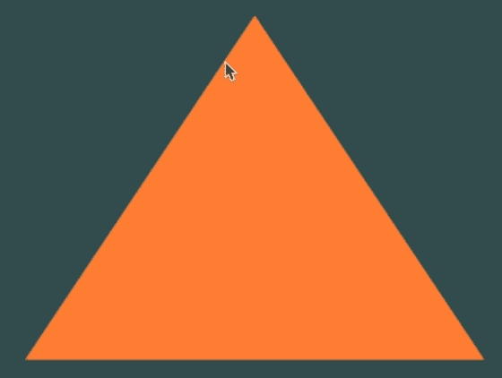
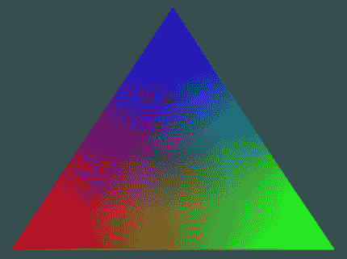
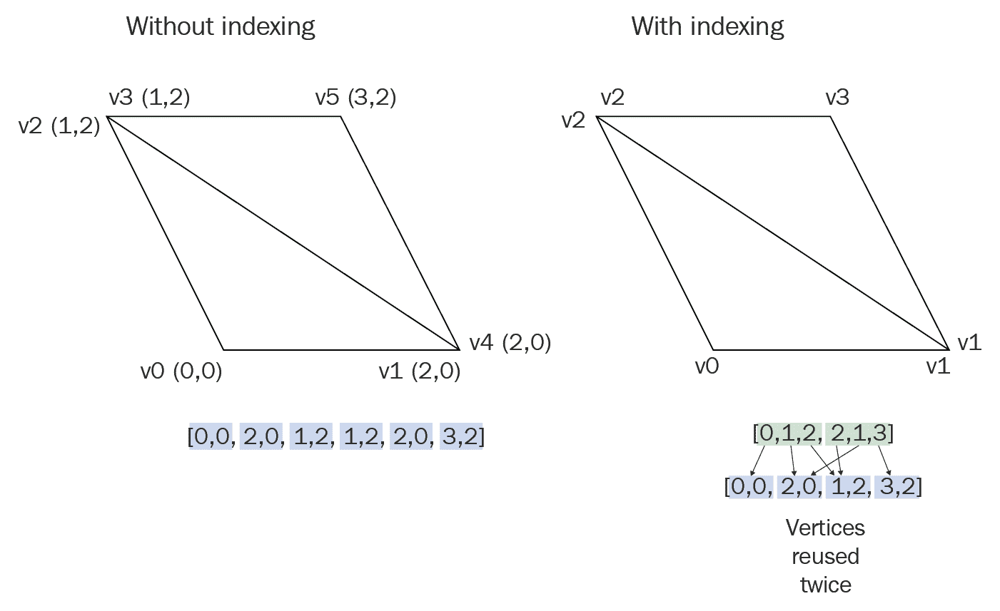
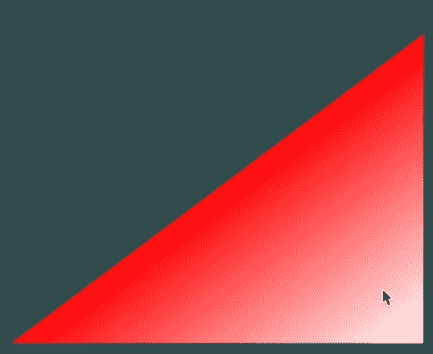

# 第二章：绘制形状和应用纹理

上一章全是关于设置我们的项目以使用不同类型的库，如 GLFW、GLEW、SMFL 和 SDL。在本章中，我们将超越设置部分，学习实现一些真正酷的 OpenGL 功能。我们将学习着色器以及如何使用它们来创建各种形状。然后，我们将继续学习如何创建一个单独的着色器文件并在我们的代码中引用它。我们还将讨论如何使用 SOIL 库将不同的纹理应用到形状上。

在本章中，我们将详细介绍以下主题：

+   学习使用着色器绘制三角形

+   创建一个单独的着色器文件并在主代码中引用它

+   使用 SOIL 库绘制矩形并应用纹理

本章将引导你进入 OpenGL 编程，你将学习很多与之相关的概念。

在我们开始编码之前，有一些事情我们需要理解。首先，从现在开始我们将编写的代码是平台和框架无关的。所以，无论你是在 Mac 上使用 Xcode 还是 Windows 上的 Visual Studio，任何平台上的 OpenGL 代码都将相同，因为 OpenGL 是一种平台无关的编程语言。其次，对于本章，我们将使用 GLFW 库。由于我们不会编写任何 GLFW 特定的代码，本章中的代码将适用于 SFML、SDL 或任何其他你希望使用的库。

因此，让我们开始吧。

你可以在 GitHub 上的`Chapter02`文件夹中找到本章的所有代码文件。本书的序言中可以找到 GitHub 链接。

# 绘制三角形

在本节中，我们将探讨如何在 OpenGL 中使用 GLFW 库绘制三角形。首先，让我们回到上一章中我们使用 GLFW 库创建 OpenGL 渲染窗口的代码文件，并对它进行必要的修改。让我们看一下以下步骤，以了解绘制三角形所需的代码：

1.  我们将首先在我们的代码中包含必要的头文件：

```cpp
#include <iostream>
// GLEW
#define GLEW_STATIC
#include <GL/glew.h>
// GLFW
#include <GLFW/glfw3.h>
// Window dimensions
const GLuint WIDTH = 800, HEIGHT = 600;
```

1.  要在现代 OpenGL 中创建形状，我们需要创建着色器。因此，让我们首先在我们的代码中添加一些着色器。首先，我们将添加一个常量，`GLchar *`，我们将称之为`vertexShaderSource`。这将是一个字符串，其版本将是`330 核心`：

```cpp
// Shaders
const GLchar* vertexShaderSource = "#version 330 core\n"
```

`330 核心`定义了 OpenGL 3.3 版本的着色器语言版本。如果你使用的是 OpenGL 4.0 版本，那么着色器语言版本不一定是`440`；它可能是其他版本。通过在互联网上查找，你可以了解应该使用哪个着色器版本。

1.  我们在上一行代码中提到的`vertexShaderSource`将仅处理我们三角形的**位置**和**定位**，我们将如下定义：

```cpp
"layout (location = 0) in vec3 position;\n"
"void main()\n"
"{\n"
"gl_Position = vec4(position.x, position.y, position.z, 1.0);\n"
"}\0";
```

1.  在下面的代码中，我们将有另一个着色器源，即`fragmentShaderSource`。这将处理我们三角形的**颜色**和**纹理**。目前，我们在着色器中明确设置的颜色值仅在`vec4`变量中：

```cpp
const GLchar* fragmentShaderSource = "#version 330 core\n"
"out vec4 color;\n"
"void main()\n"
"{\n"
"color = vec4(1.0f, 0.5f, 0.2f, 1.0f);\n"
"}\n\0";
```

在前面的代码中，我们将`vec4`变量的值赋为`1.0f`、`0.5f`、`0.2f`和`1.0f`，这些是红色、绿色、蓝色和 alpha 值。我们在这里定义的颜色范围在 0 到 1 之间，0 表示关闭，1 表示全强度；这与 RGB 颜色值在 0 到 255 之间的范围非常相似。

1.  接下来，在以下代码行中，我们将定义我们的渲染窗口，正如前一章所讨论的，只需看一下以下代码进行审查：

```cpp
 // The MAIN function, from here we start the application and run the game loop
 int main()
 {
 // Init GLFW
 glfwInit( );

 // Set all the required options for GLFW
 glfwWindowHint( GLFW_CONTEXT_VERSION_MAJOR, 3 );
 glfwWindowHint( GLFW_CONTEXT_VERSION_MINOR, 3 );
 glfwWindowHint( GLFW_OPENGL_PROFILE, GLFW_OPENGL_CORE_PROFILE );
 glfwWindowHint( GLFW_OPENGL_FORWARD_COMPAT, GL_TRUE );

 glfwWindowHint( GLFW_RESIZABLE, GL_FALSE );

 // Create a GLFWwindow object that we can use for GLFW's functions
 GLFWwindow *window = glfwCreateWindow( WIDTH, HEIGHT, "LearnOpenGL", nullptr, nullptr );

 int screenWidth, screenHeight;
 glfwGetFramebufferSize( window, &screenWidth, &screenHeight );

 if ( nullptr == window )
 {
 std::cout << "Failed to create GLFW window" << std::endl;
 glfwTerminate( );

 return EXIT_FAILURE;
 }

 glfwMakeContextCurrent( window );
// Set this to true so GLEW knows to use a modern approach to retrieving function pointers and extensions
 glewExperimental = GL_TRUE;
 // Initialize GLEW to setup the OpenGL Function pointers
 if ( GLEW_OK != glewInit( ) )
 {
 std::cout << "Failed to initialize GLEW" << std::endl;
 return EXIT_FAILURE;
 }

 // Define the viewport dimensions
 glViewport( 0, 0, screenWidth, screenHeight );
```

1.  现在，在`while`循环之前，我们将添加一行代码来定义我们的着色器。让我们首先将以下代码添加到我们的程序中：

```cpp
 // Build and compile our shader program
 // Vertex shader
 GLuint vertexShader = glCreateShader( GL_VERTEX_SHADER );
 glShaderSource( vertexShader, 1, &vertexShaderSource, NULL );
```

在前面的代码行中，我们为`vertexShader`创建了一个变量，并使用`glShaderSource()`定义了着色器的源。为此函数，我们传递了参数，将`1`作为`vertexShaderSource`的引用，并将最后一个参数暂时传递为`NULL`。

1.  接下来，我们将使用`glCompileShader()`编译着色器，并将`vertexShader`传递给它。然后，我们将使用`GLint success`检查任何编译错误。我们将以日志的形式向开发者显示这些编译错误。因此，我们定义了一个`char`变量`infoLog`，它将是一个包含 512 个项目的数组：

```cpp
glCompileShader( vertexShader );
 // Check for compile time errors
 GLint success;
 GLchar infoLog[512];
```

1.  然后，我们将向我们的代码中添加`glGetShaderiv()`函数。它将在`params`中返回我们的着色器对象的参数值。为此函数，我们将传递参数`vertexShader`、编译状态`GL_COMPILE_STATUS`，然后传递`&success`：

```cpp
glGetShaderiv( vertexShader, GL_COMPILE_STATUS, &success );
```

1.  接下来，我们将使用`if`语句检查我们的着色器是否成功编译。如果它没有成功编译，将会生成一个着色器日志，并让开发者了解编译错误。为了显示错误，我们将添加`glGetShaderInfoLog()`函数，并在其中传递参数`vertexShader`、`512`、`NULL`和`infoLog`，然后添加

    `std::cout << "ERROR::SHADER::VERTEX::COMPILATION_FAILED\n"`并输出`infoLog`，以便我们可以更深入地了解它：

```cpp
if ( !success )
 {
 glGetShaderInfoLog( vertexShader, 512, NULL, infoLog );
 std::cout << "ERROR::SHADER::VERTEX::COMPILATION_FAILED\n" << infoLog << std::endl;
 }
```

1.  现在，我们将对片段着色器做同样的操作，看一下以下突出显示的代码行，以了解对片段着色器所做的更改：

```cpp
 // Fragment shader
 GLuint fragmentShader = glCreateShader( GL_FRAGMENT_SHADER );
 glShaderSource( fragmentShader, 1, &fragmentShaderSource, NULL );
 glCompileShader( fragmentShader );

 // Check for compile time errors
 glGetShaderiv( fragmentShader,GL_COMPILE_STATUS, &success );

 if ( !success )
 {
   glGetShaderInfoLog( fragmentShader,512, NULL, infoLog );
   std::cout << "ERROR::SHADER::FRAGMENT::COMPILATION_FAILED\n" << infoLog <<    std::endl;
 }
```

1.  然后，我们将链接着色器。为此，我们将创建一个名为`shaderProgram`的变量，并在`glCreateProgram();`中引用它。`glCreateProgram()`创建一个空的程序对象，并通过返回一个非零值来引用它。**程序对象**是一个可以附加着色器对象的实体。

1.  然后，我们将定义`glAttachShader();`函数来附加我们的着色器。在那里，我们将传递`shaderProgram`，这是我们之前步骤中刚刚创建的变量。然后我们将传递要附加到其上的着色器。所以，第一个我们将传递的是`vertexShader`，然后我们将附加`fragmentShader`。然后，我们将定义`glLinkProgram();`函数，并将`shaderProgram`链接到它。看看以下代码以了解描述：

```cpp
 // Link shaders
 GLuint shaderProgram = glCreateProgram( );
 glAttachShader( shaderProgram, vertexShader );
 glAttachShader( shaderProgram, fragmentShader );
 glLinkProgram( shaderProgram );
```

1.  接下来，我们将检查任何链接错误，始终记得检查你代码中的任何错误。我们将如下检查错误：

```cpp
 // Check for linking errors
 glGetProgramiv( shaderProgram, GL_LINK_STATUS, &success );

 if ( !success )
 {
 glGetProgramInfoLog( shaderProgram, 512, NULL, infoLog );
 std::cout << "ERROR::SHADER::PROGRAM::LINKING_FAILED\n" << infoLog << std::endl;
 }
glDeleteShader( vertexShader );
glDeleteShader( fragmentShader );
```

在上一行代码中，我们定义了`glGetProgramiv();`并引用了我们的`shaderProgram`，因为我们将会检查代码中是否存在任何错误。然后，我们将检查链接状态并将结果分配给成功。接下来，我们检查着色器的链接是否成功。如果链接不成功，我们将基本上与之前几行代码做相同的事情；也就是说，我们将生成错误日志。

我们定义了`glGetProgramInfoLog ();`函数，并在其中传递了参数，例如`shaderProgram`，因为这是我们检查错误时需要检查的内容。然后我们传递了`512`作为项目数量，`NULL`数组以及`infoLog`，因为这是我们打算分配任何错误日志的地方。然后我们输入了需要显示给开发者的错误信息。

因此，现在我们已经检查了在链接着色器程序时是否有任何错误，我们实际上可以删除顶点和片段着色器，因为我们将不再使用它们，因为它们现在是我们的着色器程序的一部分。所以，我们输入了`glDeleteShader();`函数并引用了顶点和片段着色器。

1.  接下来，我们要做的是定义顶点数据，以便我们能够根据位置实际绘制三角形：

```cpp
 // Set up vertex data (and buffer(s)) and attribute pointers
 GLfloat vertices[] =
 {
      -0.5f, -0.5f, 0.0f, // Left
      0.5f, -0.5f, 0.0f,  // Right
      0.0f, 0.5f, 0.0f    // Top
 };
```

在前面的代码中，如果你想绘制一个四边形，你必须定义四个顶点。

在上一行代码中，我们首先定义了一个浮点数组`vertices[]`，并在其中定义了我们的左、右和顶部坐标。

对于我们定义的坐标，在 OpenGL 中默认情况下，如果你没有明确设置它们，你的屏幕值范围在`-1`和`1`之间。所以，值`0`位于中间，`0.5`是中间的 25%，或者 75%是远离左侧。在后面的章节中，我们将探讨如何更改该系统，使其实际上使用更多的屏幕。

1.  现在我们已经创建了`vertices[]`数组，我们需要做的是创建**顶点缓冲对象**（**VBO**）和**顶点数组对象**（**VAO**）。我们首先定义`GLuint`变量`VBO`和`VAO`。然后，我们将通过简单地输入`glGenVertexArrays();`来生成顶点数组，在这个函数中，我们将传递`1`和一个对 VAO 的引用。接下来，我们将通过定义函数`glGenBuffers();`来生成缓冲区，并将`1`和引用`VBO`传递给它。

```cpp
 GLuint VBO, VAO;
 glGenVertexArrays( 1, &VAO );
 glGenBuffers( 1, &VBO );
```

1.  然后，我们将绑定顶点数组对象，然后绑定并设置顶点缓冲区，让我们继续。我们将添加`glBindVertexArray();`函数并将`VAO`传递给它。然后，我们将添加`glBindBuffer();`函数并将`GL_ARRAY_BUFFER`和`VBO`传递给它。接下来，我们将添加`glBufferData();`函数并将`GL_ARRAY_BUFFER`和`size()`传递给它。由于我们将以动态方式检查顶点的尺寸，因此我们传递了函数`size()`，并将要绘制的顶点传递给此函数，然后最终我们将传递`GL_STATIC_DRAW`。所以，这是我们用来绘制好东西的缓冲区数据：

```cpp
// Bind the Vertex Array Object first, then bind and set vertex buffer(s) and attribute pointer(s).
 glBindVertexArray( VAO );

 glBindBuffer( GL_ARRAY_BUFFER, VBO );
 glBufferData( GL_ARRAY_BUFFER, sizeof( vertices ), vertices, GL_STATIC_DRAW );
```

1.  接下来，我们将创建顶点指针，因此我们将添加函数`glVertexAttribPointer()`，并将此函数的参数传递如下代码所示。然后，我们将通过输入`glEnableVertexAttribArray()`函数来启用顶点数组，并将`0`传递给它。

```cpp
 glVertexAttribPointer( 0, 3, GL_FLOAT, GL_FALSE, 3 * sizeof( GLfloat ), ( GLvoid * ) 0 );
 glEnableVertexAttribArray( 0 );
```

1.  然后，我们将绑定缓冲区，将`glBindBuffer()`函数添加到我们的代码中。这将需要两个值：`GL_ARRAY_BUFFER`和`0.`

1.  然后在下一行，我们将添加`glBindVertexArray()`函数，这将是一个`0`。因为我们在这里正在解绑顶点数组对象。始终解绑任何缓冲区或数组以防止出现奇怪的错误是一个好习惯。请看以下代码：

```cpp
glBindBuffer( GL_ARRAY_BUFFER, 0 ); 
// Note that this is allowed, the call to glVertexAttribPointer //registered VBO as the currently bound vertex buffer object so //afterwards we can safely unbind

 glBindVertexArray( 0 ); 
// Unbind VAO (it's always a good thing to unbind any buffer/array //to prevent strange bugs)
```

# 添加代码以绘制形状

下一步，我们将添加代码以绘制三角形：

1.  我们将在 while 循环中绘制形状。我们希望在`glClear()`函数之后绘制它。因此，一旦屏幕被清除，在屏幕缓冲区交换之前，我们将添加`glUseProgram()`函数。这将指示我们正在使用哪个着色器程序，在我们的项目中，这是`shaderProgram`，我们将顶点和片段着色器链接到它。

1.  然后，我们将添加`glBindVertexArray();`函数并将 VAO 绑定到它。

1.  接下来，我们将调用`glDrawArrays();`函数，这将最终绘制我们的三角形。在`glDrawArrays();`函数中，我们将传递的第一个参数是模式，即`GL_TRIANGLES`、`GL_QUAD`或`GL_LINE`。根据你有多少个顶点以及你试图实现的对象或形状，这将有所不同——我们将在本章的后面更深入地介绍它。传递给`glDrawArrays();`函数的第二个参数是`0`，传递的最后一个参数是`3`，因为我们已经将形状中的顶点数设置为`3`，因为它是一个三角形。

1.  然后，添加`glBindVertexArray()`函数，并将`0`传递给它。我们只是在取消绑定它。

1.  现在，实际上只剩下最后一件事要做：清理。一旦我们用完所有资源，我们将释放所有资源。因此，在循环外部，添加`glDeleteVertexArrays()`函数并分配`1`，`&VAO`，然后添加`glDeleteBuffers()`函数来删除缓冲区。查看以下代码以了解前面的代码描述，同时观察代码中的高亮术语：

```cpp
 // Game loop
 while ( !glfwWindowShouldClose( window ) )
 {
 // Check if any events have been activiated (key pressed, mouse moved //etc.) and call corresponding response functions

glfwPollEvents( );

 // Render
 // Clear the colorbuffer
 glClearColor( 0.2f, 0.3f, 0.3f, 1.0f );
 glClear( GL_COLOR_BUFFER_BIT );

 // Draw our first triangle
 glUseProgram( shaderProgram );
 glBindVertexArray( VAO );
 glDrawArrays( GL_TRIANGLES, 0, 3 );
 glBindVertexArray( 0 );

 // Swap the screen buffers
 glfwSwapBuffers( window );
 }

 // Properly de-allocate all resources once they've outlived their purpose
 glDeleteVertexArrays( 1, &VAO );
 glDeleteBuffers( 1, &VBO );

 // Terminate GLFW, clearing any resources allocated by GLFW.
 glfwTerminate( );

 return EXIT_SUCCESS;
 }

```

现在我们已经准备好运行我们的代码了。一旦编译无误，你将得到以下三角形作为输出：



# 抽象着色器

让我们看看本节中的着色器，尽管我们在创建三角形并使用着色器为其着色时已经看过着色器。在本节中，我们将把着色器代码抽象成一个顶点着色器文件和一个片段着色器文件，这样会整洁得多，也更易于重用。此外，我们还将抽象出着色器的加载，因为一旦我们抽象出这一点，我们可能根本不需要更改它，或者至少更改不会太多。进一步来说，在我们的项目中，我们只需使用这些文件来在我们的代码中加载着色器，这将使其易于使用。

# 创建着色器文件

按照以下步骤创建文件：

1.  我们将首先在我们的项目 IDE 中创建两个新的空文件，并将这两个文件命名为`core.vs`和`core.frag`。在这里，`vs`代表向量着色器文件，而`frag`代表片段着色器文件。

实际上，你给它们取什么名字都无关紧要，只要在引用它们时，确切地引用名称和扩展名。

1.  然后，打开你的`core.vs`文件，剪切并粘贴我们在上一节中添加的`VectorShaderSource`代码。按照以下代码中的高亮更改进行修改：

```cpp
#version 330 core
layout (location = 0) in vec3 position;
layout (location = 1) in vec3 color;
out vec3 ourColor;
void main()
{
 gl_Position = vec4(position, 1.0f);
 ourColor = color;
}
```

让我们保存这个文件，我们的向量着色器文件就创建完成了。接下来，我们将对片段着色器文件做同样的操作。

1.  因此，让我们在我们的 IDE 中打开`core.frag`，并从上一节中的代码中剪切并粘贴`fragmentShaderSource`代码。粘贴后，按照以下代码中的高亮部分进行修改：

```cpp
#version 330 core
in vec3 ourColor;
out vec4 color;
void main()
{
 color = vec4(ourColor, 1.0f);
}
```

保存此文件，我们现在也创建了片段着色器文件。让我们继续创建用于抽象着色器代码加载的`Shader.h`文件。

# 创建 Shader.h 头文件

现在，我们还将创建一个着色器加载文件，即`Shader.h`，并使用它将我们的着色器加载到代码中。按照以下步骤创建`Shader.h`文件：

1.  因此，让我们在我们的项目中创建一个空的头文件，并将其命名为`Shader.h`。

1.  一旦创建了这个文件，打开它，并从我们在上一节中提到的代码中剪切并粘贴着色器加载代码。

1.  我们实际上要做的就是剪切`glViewport( 0, 0, screenWidth, screenHeight );`代码之后的全部内容，以及顶点数组`GLfloat vertices[]`代码之上的内容。因为我们剪切出的代码实际上是加载我们的着色器。

1.  然后，按照以下代码进行更改：

```cpp
 #ifndef SHADER_H
 #define SHADER_H
 #include <string>
 #include <fstream>
 #include <sstream>
 #include <iostream>
 #include <GL/glew.h>
```

所以，在前面几行代码中，我们只是使用简单的`#ifndef`和`#define`来防止它被多次包含。我们只是包含流和字符串头文件，因为它们是我们将要加载文件的地方，所以我们需要正确的头文件来加载它。然后，显然我们需要 GLEW，这假设你已经设置了 GLEW。

1.  之后，我们有了`GLuint`程序，并且那里有一些注释。我们将实时构建着色器：

```cpp
class Shader
 {
 public:
 GLuint Program;
 // Constructor generates the shader on the fly
 Shader( const GLchar *vertexPath, const GLchar *fragmentPath )
 {
```

1.  以下变量用于存储和加载代码和着色器文件：

```cpp
// 1\. Retrieve the vertex/fragment source code from filePath
 std::string vertexCode;
 std::string fragmentCode;
 std::ifstream vShaderFile;
 std::ifstream fShaderFile;
```

1.  在以下代码中，我们只是在处理一些异常：

```cpp
// ensures ifstream objects can throw exceptions:
 vShaderFile.exceptions ( std::ifstream::badbit );
 fShaderFile.exceptions ( std::ifstream::badbit );
```

1.  在下面的代码中，我们使用了字符串流，我们要做的是打开文件，以便我们获取顶点和片段路径。使用字符串流，我们将文件读取到实际的流中。然后，因为我们不再需要它了，我们可以直接关闭它。然后，我们将它加载到我们的字符串中，并捕获任何错误。如果你之前做过 C++，这很简单，我们建议你应该熟悉 C++：

```cpp
try
 {
      // Open files
      vShaderFile.open( vertexPath );
      fShaderFile.open( fragmentPath );
      std::stringstream vShaderStream, fShaderStream;
      // Read file's buffer contents into streams
      vShaderStream << vShaderFile.rdbuf( );
      fShaderStream << fShaderFile.rdbuf( );
      // close file handlers
      vShaderFile.close( );
      fShaderFile.close( );
      // Convert stream into string
      vertexCode = vShaderStream.str( );
      fragmentCode = fShaderStream.str( );
 }

catch ( std::ifstream::failure e )
 {
     std::cout << "ERROR::SHADER::FILE_NOT_SUCCESFULLY_READ" << std::endl;
 }
```

1.  之后，我们只是获取 C 字符串。然后，我们只是编译着色器，这我们已经做了。所以，在代码的前两行之后，我们基本上就完成了：

```cpp
 const GLchar *vShaderCode = vertexCode.c_str( );
 const GLchar *fShaderCode = fragmentCode.c_str( );

 // Compile shaders

 GLuint vertex, fragment;
 GLint success;
 GLchar infoLog[512];

// Vertex Shader
 vertex = glCreateShader( GL_VERTEX_SHADER );
 glShaderSource( vertex, 1, &vShaderCode, NULL );
 glCompileShader( vertex );
 // Print compile errors if any
 glGetShaderiv( vertex, GL_COMPILE_STATUS, &success );
 if ( !success )
 {
 glGetShaderInfoLog( vertex, 512, NULL, infoLog );
 std::cout << "ERROR::SHADER::VERTEX::COMPILATION_FAILED\n" << infoLog << std::endl;
 }

// Fragment Shader
 fragment = glCreateShader( GL_FRAGMENT_SHADER );
 glShaderSource( fragment, 1, &fShaderCode, NULL );
 glCompileShader( fragment );
 // Print compile errors if any
 glGetShaderiv( fragment, GL_COMPILE_STATUS, &success );
 if ( !success )
 {
    glGetShaderInfoLog( fragment, 512, NULL, infoLog );
    std::cout << "ERROR::SHADER::FRAGMENT::COMPILATION_FAILED\n" << infoLog << std::endl;
 }

// Shader Program
 this->Program = glCreateProgram( );
 glAttachShader( this->Program, vertex );
 glAttachShader( this->Program, fragment );
 glLinkProgram( this->Program );
 // Print linking errors if any
 glGetProgramiv( this->Program, GL_LINK_STATUS, &success );
 if (!success)
 {
    glGetProgramInfoLog( this->Program, 512, NULL, infoLog );
    std::cout << "ERROR::SHADER::PROGRAM::LINKING_FAILED\n" << infoLog << std::endl;
 }

// Delete the shaders as they're linked into our program now and no //longer necessery
 glDeleteShader( vertex );
 glDeleteShader( fragment );

 }
```

1.  然后这里有一条低行，只是说使用程序：

```cpp
// Uses the current shader
 void Use( )
 {
 glUseProgram( this->Program );
 }
 };
#endif
```

因此，我们在前面的代码中使我们的着色器代码变得更加动态。接下来，我们将进入`main.cpp`并对其进行一些更改。

# 修改绘制三角形的代码

由于我们在前面的章节中创建了着色器文件和`Shader.h`头文件，我们现在将加载这些文件到我们的三角形代码中。为此，我们必须对我们之前编写的三角形代码进行一些更改。请查看以下步骤：

1.  我们首先包括`Shader.h`头文件，因为没有它，我们实际上无法使用`Shader`类：

```cpp
#include "Shader.h"
```

1.  然后，在我们定义顶点之前，我们将添加以下高亮显示的代码：

```cpp
// Build and compile our shader program
 Shader ourShader( "core.vs", "core.frag" );
```

对于 Xcode，这个高亮显示的代码将被以下行代码替换：

`Shader ourShader( "resources/shaders/core.vs", "resources/shaders/core.frag" );`

如果你没有在 Mac 上添加这一行执行我们的三角形代码，你将得到一个错误，并且三角形不会在输出窗口中生成。

发生这种情况的原因是项目文件夹中有可执行文件，但我们没有资源文件。所以，我们必须将这些文件添加到我们的项目中：

1.  我们想要做的是在 Xcode 的项目文件夹中，右键单击它，转到新建文件夹，创建一个名为`resources`的文件夹。

1.  在`resources`文件夹内，我们将创建另一个名为`shaders`的文件夹。然后在那里，当我们需要这些特定文件类型时，我们创建一个名为`images`/`videos`的文件夹。所以，这对未来也会很有好处。

1.  接下来，我们将把我们的着色器文件`core.vs`和`core.frag`移动到`shader`文件夹中。

1.  然后，转到你的项目，转到构建阶段，然后点击加号，并点击新建复制文件阶段选项。

1.  点击之后，你会看到一个新部分，复制文件（0 项）。打开它，确保目标设置为 Resources，然后点击其下的加号。

1.  然后，选择`resources`文件夹，并点击添加按钮。

1.  此外，我们还想对我们的`vertices []`数组做一些修改。你可能记得当我们创建`core.vs`时，我们实际上创建了一个颜色输入。所以，我们不是直接设置颜色，我们将允许某种颜色输入。为此，我们将扩展顶点数组如下：

```cpp
GLfloat vertices[] =
 {
     // Positions          // Colors
     0.5f, -0.5f, 0.0f,    1.0f, 0.0f, 0.0f,  // Bottom Right
     -0.5f, -0.5f, 0.0f,   0.0f, 1.0f, 0.0f,  // Bottom Left
     0.0f, 0.5f, 0.0f,     0.0f, 0.0f, 1.0f   // Top
 };
```

在上述代码行中，我们实际上是通过放置红色、绿色和蓝色的值来添加颜色的。这将非常令人兴奋，因为我们正在为每个顶点分配一个颜色，接下来会发生的事情是，颜色将混合在一起，这将在我们三角形上产生一个非常惊人的效果。

1.  接下来，我们将进入我们的位置属性和颜色属性代码，并用以下代码替换它们：

```cpp
// Position attribute
 glVertexAttribPointer( 0, 3, GL_FLOAT, GL_FALSE, 6 * sizeof( GLfloat ), ( GLvoid * ) 0 );
 glEnableVertexAttribArray( 0 );
 // Color attribute
 glVertexAttribPointer( 1, 3, GL_FLOAT, GL_FALSE, 6 * sizeof( GLfloat ), ( GLvoid * )( 3 * sizeof( GLfloat ) ) );
 glEnableVertexAttribArray( 1 );
```

上述代码行将定义三角形的定位和颜色属性。在`vertices []`中，我们现在有六个值：3 个用于位置坐标，另外 3 个用于颜色坐标。这就是为什么我们在前面的代码中放置了 6，因为我们有`6`，所以每个顶点有两个值，我们添加了颜色，因此我们需要在代码中添加`6`。

1.  接下来，我们将删除：

```cpp
glBindBuffer( GL_ARRAY_BUFFER, 0 );
```

1.  然后，我们将进入 while 循环，并将`glUseProgram( shaderProgram )`替换为以下代码：

```cpp
ourShader.Use( );
```

通过对代码进行上述最后微小的修改，我们现在可以运行我们的程序了。一旦成功编译且没有错误，你将在屏幕上得到以下彩色三角形的输出：



在代码中，我们已经为每个顶点添加了颜色。输出三角形的颜色已经混合在一起。这就是 OpenGL 所做的事情：它将颜色混合在一起。如果你之前搜索过 OpenGL，或者你一般对游戏开发感兴趣，你可能会遇到一些类似这样的三角形。这几乎是 OpenGL 的一个入门仪式，相当于其他编程语言中的 Hello World 代码。

# 加载并将纹理应用到形状上

在本节中，我们将探讨如何在我们的代码中加载纹理，并学习将这些纹理应用到我们的对象上。纹理是一种用于为对象添加细节的图像。想象一下，如果我们将木纹应用到立方体上，那么在我们的游戏世界中它将看起来像一个木箱。

对于本节，我们的对象将是一个矩形。因此，首先我们将学习如何在 OpenGL 中绘制矩形形状，然后了解如何将其纹理应用到上面。为了将纹理应用到形状上，我们更倾向于使用 SOIL 库，即简单的 OpenGL 图像库。如果您愿意，您可以使用其他库，如 libpng，它正如其名，仅支持 PNG 格式的图像。但在这个章节中，我们只学习关于 SOIL 的内容，实际上是关于 SOIL2 的。

SOIL 是一个跨平台库，它支持 Android 和 iOS 作为游戏开发的一部分。GLFW 没有任何内置的图像加载方法，这就是我们为什么要使用 SOIL 库来加载我们的纹理。此外，SOIL 有助于使我们的代码在各种平台上尽可能动态，而且使用起来也非常简单。

因此，首先让我们了解如何在 Windows 和 Mac 平台上设置我们的项目以使用 SOIL 库。

# 在 Windows 上设置使用 SOIL 的项目

在本节中，我们将了解如何在 Windows 平台上设置我们的项目以使用 SOIL 库。因此，我们将从下载 SOIL 库和 Premake 开始。您可能想知道，Premake 是什么？Premake 是一个用于为 Visual Studio、Xcode 等平台生成项目文件的命令行工具。

按照以下步骤了解设置过程：

1.  打开您的网络浏览器并访问以下链接 [`bitbucket.org/SpartanJ`](https://bitbucket.org/SpartanJ)。在仓库部分点击 SOIL2 选项并打开网页，然后在简介下选择最新的 SOIL 库版本的第一个分支。

我们下载 SOIL2 库的原因是因为原始的 SOIL 库实际上非常旧，并且已经很久没有更新了。

1.  下载完成后，只需在 Google 上搜索 Premake 或访问以下链接：[`premake.github.io/`](https://premake.github.io/)。然后，点击下载选项。建议您下载最新的稳定分支，因此请下载 4.4 版本，这是目前稳定的版本（在撰写本书时）。

1.  接下来，转到您下载文件的位置，并解压这两个压缩文件夹。

1.  然后，转到 `Premake` 文件夹，并将 `premake4.exe` 复制粘贴到我们刚刚解压的 `SOIL` 文件夹中。

1.  打开命令提示符，在这里你可能需要将目录路径更改为你下载并解压 `SOIL` 文件夹的位置。假设 `C:` 驱动器是所有文件下载的驱动器，并且你将 `SOIL` 文件夹下载并解压到该驱动器，那么你只需要在命令提示符中输入 `cd`，然后将 `SOIL` 文件夹拖放到其中。它会自动进入 `SOIL` 文件夹的位置。

如果你的下载文件在另一个驱动器上，那么你首先需要告诉命令提示符将其切换到那个特定的驱动器。要做到这一点，只需输入驱动器的实际字母，然后输入 `:` 并按 *Enter* 键，然后你可以遵循之前的拖放过程。

1.  接下来，在命令提示符中，输入 `premake4.exe`——或者它被称作的任何可执行文件名称——然后输入 `vs2017`，然后按 *Enter* 键。这将生成我们的 Visual Studio 项目。

如果你使用的是较旧版本，例如 2010，你可以在 `vs` 命令中使用 2010。它没有 Visual Studio 新版本的命令，但如果你输入那个命令，它会提示你升级一些属性，所以不用担心。

1.  现在，让我们回到 `SOIL` 文件夹，打开其中存在的 `make` 文件夹，然后打开 `Windows` 文件夹。

1.  在 `Windows` 文件夹中，你会得到一个 `SOIL2.sln` 文件。双击它，一旦它在 Visual Studio 中打开，可能会弹出一个升级编译器和库的窗口。只需点击 OK 按钮。

1.  然后，在 Visual Studio 中，在右侧，你会看到一些文件名。我们只关心 `soil2-static-lib` 这个文件。右键单击该文件，然后点击构建选项。这将构建我们的项目。然后你可以关闭 Visual Studio。

1.  现在，如果你回到 `SOIL` 文件夹，会发现又生成了更多文件夹。我们感兴趣的是 `lib` 文件夹。

1.  在 `lib` 文件夹内部，有一个 `Windows` 文件夹，其中包含我们需要的 `.lib` 文件。

1.  复制那个 `.lib` 文件，然后前往你创建 OpenGL 项目的位置。我们将在 `.sln` 文件所在的位置创建一个新的文件夹，并将其命名为 `External Libraries`。

1.  在 `External Libraries` 文件夹中，我们将创建一个名为 `SOIL2` 的子文件夹，并在其中创建一个名为 `lib` 的文件夹。

1.  然后，在刚才创建的 `lib` 文件夹中，粘贴 `soil2-debug.lib` 文件。这样，我们将使用相对链接来链接我们的 SOIL 库。如果你了解绝对链接过程并希望使用它，你可以使用它。

1.  现在，我们需要做的是回到 `SOIL` 文件夹，复制 `SOIL2` 文件夹中的文件，并将其粘贴到 `OpenGL` 文件夹内的 `OpenGL_VisualStudio` 文件夹中。

1.  所以，一旦你完成了所有这些步骤，最后一件要做的事情是将`soil2-debug.lib`链接到我们的项目中。要使用相对链接将`.lib`文件链接到 Visual Studio 项目，你可以参考上一章中的“使用相对链接链接 GLFW 和 GLEW 库”部分。

通过这样，我们已经设置了我们的项目以在 Visual Studio 中使用 SOIL 库。

# 在 Mac 上设置使用 SOIL 的项目

在本节中，我们将了解如何在 Mac 平台上设置我们的项目以使用 SOIL 库。让我们看看以下步骤：

1.  打开你的网络浏览器并访问以下链接：[`bitbucket.org/SpartanJ`](https://bitbucket.org/SpartanJ)。

1.  在“存储库”部分点击 SOIL2 选项并打开网页，然后在“简介”部分选择最新的 SOIL 库的第一个分支。

1.  接下来，转到你下载文件的位置并解压它们。解压后，转到`src`文件夹，然后进入`SOIL2`文件夹。然后只需将这个文件夹复制并粘贴到你的项目目录中，这个目录也包含你的`main.cpp`和`shader`文件。

1.  现在，就像你通常做的那样将库添加到我们的三角形项目中。所以，我们将右键单击项目，在 Xcode 中转到“添加文件”选项，点击 SOIL，然后点击“添加”按钮。

因此，一旦我们完成了包含操作，设置部分就结束了。现在，我们将回到上一节中的代码，并对其进行修改以向我们的形状添加纹理。

# 将纹理应用到我们的形状上

现在我们已经设置好使用 SOIL 库，让我们转到我们的三角形代码，并对它进行必要的修改以加载我们的形状并应用纹理。请按照以下步骤操作：

1.  因此，我们首先将 SOIL 库包含到我们的代码中；为此，请在代码开头输入以下行：

```cpp
#include SOIL2/SOIL2.h
```

这里，我们输入了`SOIL2/SOIL2.h`，因为我们的库在`SOIL2`文件夹中。

1.  下一步，我们将启用具有如 PNG 扩展的图像的 alpha 支持。要做到这一点，在我们定义了`glViewport()`之后，输入以下代码行：

```cpp
// enable alpha support
 glEnable( GL_BLEND );
 glBlendFunc( GL_SRC_ALPHA, GL_ONE_MINUS_SRC_ALPHA );
```

在前面的代码行中，`glEnable(GL_BLEND)`函数将帮助我们混合形状中的图像。然后我们使用了`glBlendFunc()`，并传递了两个参数`GL_SRC_ALPHA`和`GL_ONE_MINUS_SRC_ALPHA`。这就是我们启用 alpha 支持的方式。

1.  接下来，我们需要修改我们的顶点，因为我们将会使用矩形形状来应用纹理，同时我们还需要添加纹理坐标。所以请查看以下顶点数组，并在你的代码中进行必要的修改：

```cpp
// Set up vertex data (and buffer(s)) and attribute pointers
 GLfloat vertices[] =
 {
 // Positions         // Colors             // Texture Coords
 0.5f, 0.5f, 0.0f,    1.0f, 0.0f, 0.0f,     1.0f, 1.0f, // Top Right
 0.5f, -0.5f, 0.0f,   0.0f, 1.0f, 0.0f,     1.0f, 0.0f, // Bottom Right
-0.5f, -0.5f, 0.0f,   0.0f, 0.0f, 1.0f,     0.0f, 0.0f, // Bottom Left
-0.5f, 0.5f, 0.0f,    1.0f, 1.0f, 0.0f,     0.0f, 1.0f  // Top Left
 }; 
```

由于我们要绘制一个矩形，我们需要四个不同的顶点：左下角、右下角、左上角和右上角。在先前的代码中，我们添加的值实际上不在-1 和 1 之间；这些值在 0 和 1 之间，因此被称为归一化值。你可能在计算机图形学中经常听到这个术语。归一化值基本上意味着值在 0 和 1 之间。例如，如果你有一个宽度为 1280 x 1280 的图像，归一化版本是 0 到 1，如果你将值设置为 0.5，它将在 640 处，因为它在中间，0 和 1280 之间的一半是 640。这只是归一化的一个非常基本的概述。如果你想了解更多关于它的信息，请随时 Google 它。

1.  接下来，我们要创建另一个索引数组。看看下面的代码，让我们试着理解它：

```cpp
GLuint indices[] =
 { // Note that we start from 0!
 0, 1, 3, // First Triangle
 1, 2, 3 // Second Triangle
 };
```

在前面的数组中定义两个三角形的原因是，因为我们在这个部分绘制一个四边形，我们的矩形形状实际上需要定义两个三角形索引。看看下面的图像来理解这个概念：



前面的图像展示了带有和不带有索引的三角形坐标的定义。那么，让我们来看看不带索引的部分。不带索引的情况下，要绘制一个四边形，你需要六个不同的顶点，如图所示。尽管两个三角形之间共享了两对相似的坐标，但顶点的定义并不高效。然而，使用索引方法，我们可以共享顶点。所以，就像带有索引的图像中那样，两个三角形共享同一对顶点。因此，我们将重用这些顶点，结果我们将只定义四个顶点。忽略图像中显示的编号；它与我们的情况略有不同，但原则仍然适用。如果你尝试在纸上绘制它，并将我们索引数组中得到的数字应用到实际的三角形或四边形上，它将更有意义。你可能现在不明白为什么要这样做，那是因为我们只是在绘制一个四边形。但是，想象一下，当你有一个游戏，你有成千上万的三角形，它们形成各种复杂的形状。因此，这种带有索引的方法确实变得非常方便，并提高了你代码的效率。

1.  接下来，在我们的`GLuint`部分，在索引下面，我们想要创建另一个名为`EBO`的缓冲区，所以按照以下突出显示的行修改代码：

```cpp
GLuint VBO, VAO, EBO;
```

1.  我们需要为元素缓冲对象（EBO）生成缓冲区，所以输入以下突出显示的代码行，然后我们还需要绑定该缓冲区：

```cpp
 glGenVertexArrays(1,&VAO);
 glGenBuffers(1,&VBO );
//Generating EBO
 glGenBuffers(1,&EBO );

 glBindVertexArray( VAO );

 glBindBuffer( GL_ARRAY_BUFFER, VBO );
 glBufferData( GL_ARRAY_BUFFER, sizeof( vertices ), vertices, GL_STATIC_DRAW );
 //Binding the EBO
 glBindBuffer( GL_ELEMENT_ARRAY_BUFFER, EBO );
 glBufferData( GL_ELEMENT_ARRAY_BUFFER, sizeof( indices ), indices, GL_STATIC_DRAW );
```

1.  接下来，我们将修改我们的位置和颜色属性，并添加一个额外的属性，即纹理坐标属性。让我们查看以下突出显示的代码，并尝试理解对其所做的修改：

```cpp
 // Position attribute
 glVertexAttribPointer( 0, 3, GL_FLOAT, GL_FALSE, 8 * sizeof( GLfloat ), ( GLvoid * ) 0 );
 glEnableVertexAttribArray(0);
 // Color attribute
 glVertexAttribPointer( 1, 3, GL_FLOAT, GL_FALSE, 8 * sizeof( GLfloat ), ( GLvoid * )( 3 * sizeof( GLfloat ) ) );
 glEnableVertexAttribArray(1);
 // Texture Coordinate attribute
 glVertexAttribPointer( 2, 2, GL_FLOAT, GL_FALSE, 8 * sizeof( GLfloat ), ( GLvoid * )( 6 * sizeof( GLfloat ) ) );
 glEnableVertexAttribArray( 2 );
```

在前面的代码中，对于位置和颜色属性，我们将 `6` 替换为 `8`，因为我们有八个坐标在我们的顶点数组中：三个用于位置，三个用于颜色，两个用于纹理坐标。然后，我们创建了另一个顶点属性指针作为纹理坐标属性。

1.  接下来，我们将添加纹理加载代码。在我们的主代码中，在我们解绑顶点数组并在 `while` 循环开始之前，我们将添加纹理加载代码。

1.  首先，我们需要创建一个 `GLuint` `texture` 变量，因为它将持有我们对纹理的引用。

1.  接下来，我们将创建 `int` 变量作为 `width` 和 `height`。这将定义我们的纹理的宽度和高度。

1.  然后，我们需要添加 `glGenTextures()` 函数，为此，我们将 `size` 设置为 `1`，并将对纹理变量的引用放入其中。

1.  然后，我们将使用 `glBindTexture()` 函数绑定纹理。请查看以下突出显示的代码：

```cpp
glBindVertexArray( 0 ); // Unbind VAO

 // Load and create a texture
 GLuint texture;
 int width, height;
 // Texture
 glGenTextures( 1, &texture );
 glBindTexture( GL_TEXTURE_2D, texture );
```

1.  然后，我们将设置我们的纹理参数。为此，我们将添加函数 `glTexParameteri ()`，并将以下参数传递给此函数：

    +   我们将要设置的第一个参数是 `GL_TEXTURE_2D`。

    +   然后，对于 `name`，我们将设置我们将使用的包裹类型 `GL_TEXTURE_WRAP_S`。

    +   对于包裹，我们将添加 `GL_REPEAT`。

建议您查看不同的包裹技术。您可以在 OpenGL API 指南中找到更多关于此的信息，如果您查看 [learnopengl.com](https://learnopengl.com/) 和 [open.gl](https://open.gl/)，您将能够阅读更多关于我们所编写的所有代码行信息。

1.  因此，我们接下来要做的是复制上一行代码，并按照代码中的突出显示进行以下更改：

```cpp
// Set our texture parameters
 glTexParameteri( GL_TEXTURE_2D, GL_TEXTURE_WRAP_S, GL_REPEAT );
 glTexParameteri( GL_TEXTURE_2D, GL_TEXTURE_WRAP_T, GL_REPEAT );
```

1.  接下来，我们将设置纹理过滤。查看以下代码了解详情：

```cpp
// Set texture filtering
 glTexParameteri( GL_TEXTURE_2D, GL_TEXTURE_MIN_FILTER, GL_LINEAR );
 glTexParameteri( GL_TEXTURE_2D, GL_TEXTURE_MAG_FILTER, GL_LINEAR );
```

1.  现在，我们将把实际的纹理加载代码添加到主代码中。为此，我们将创建一个无符号字符变量 `*image`，它将持有对函数 `SOIL_load_image()` 的引用。我们将以下参数传递给此函数：

    +   第一个参数将是实际图像的路径，我们将使用它作为对象的纹理。因此，我们将放置 `res/images/image1.jpg`。

    +   第二个参数将是图像宽度和高度的引用。

    +   对于第三个参数，我们只需将其传递为 `0`。

    +   对于第四个参数，我们将设置加载方法，所以我们将添加`SOIL_LOAD_RGBA`。即使它是一个 JPEG 图像，你也总是想将其作为 alpha 图像加载。这样做的原因是，它允许我们正在编写的代码更加动态。所以如果我们用 PNG 图像替换 JPEG 图像，它仍然可以工作。如果你放入不同类型的 alpha 图像，或者没有 alpha 的图像，只要该类型由 SOIL 支持，代码就可以正常工作。

```cpp
 unsigned char *image = SOIL_load_image( "res/images/image1.jpg", &width, &height, 0, SOIL_LOAD_RGBA );
```

1.  接下来，我们将通过添加`glTexImage2d()`函数指定一个二维纹理图像，并将此函数传递以下代码中的突出显示参数：

```cpp
// Load, create texture 
glTexImage2D( GL_TEXTURE_2D, 0, GL_RGBA, width, height, 0, GL_RGBA, GL_UNSIGNED_BYTE, image );
```

1.  我们将生成米柏（mipmap），因此我们将放置`glGenerateMipmap()`函数。对于这个函数，我们指定`GL_TEXTURE_2D`，因为我们使用的是 2D 纹理。

1.  然后，我们将释放我们的图像数据，因为清理总是好的。所以，我们将添加`SOIL_free_image_data()`函数，我们将仅指定我们的图像字符数组。

1.  然后，我们将使用`glBindTexture()`函数解绑纹理，并将`GL_TEXTURE_2D`传递给该函数，并通过传递`0`来解绑纹理。查看以下代码以获得清晰的理解：

```cpp
//Generate mipmaps
glGenerateMipmap( GL_TEXTURE_2D );
SOIL_free_image_data( image );
glBindTexture( GL_TEXTURE_2D, 0 );
```

你可能会想什么是米柏（mipmap）？米柏本质上是一种纹理图像的细节级别方案。它是一种通过原始图像的 2 倍因子创建一系列小图像的方法，然后根据观察者的距离加载最接近实际显示纹理的图像。所以如果某物较远，所需的纹理不是很大。而如果它更近，则需要更大的纹理。所以，它只是帮助正确加载纹理。建议在网上快速检查以了解更多关于米柏的信息。

我们的代码还没有完成。因此，我们现在将进入 while 循环。

# 修改 while 循环

让我们按照以下步骤进行：

1.  在 while 循环中，我们将在使用着色器和绑定顶点数组之间的点之间放置一些代码。我们在这里想要做的是添加`glActiveTexture()`函数。这个函数将帮助我们激活我们指定的纹理。

1.  然后，我们将添加`glBindTexture()`函数。对于这个函数，我们将传递`GL_TEXTURE_2D`和`texture`。

1.  接下来，我们只需添加`glUniform1i()`函数，并将其传递以下突出显示的参数。

```cpp
// Draw the triangle
 ourShader.Use( );
 glActiveTexture( GL_TEXTURE0 );
 glBindTexture( GL_TEXTURE_2D, texture );
 glUniform1i( glGetUniformLocation( ourShader.Program, "ourTexture" ), 0 );

```

1.  然后，我们将添加绘制我们的容器的代码：

```cpp
 // Draw container
 glBindVertexArray( VAO );
 glDrawElements( GL_TRIANGLES, 6, GL_UNSIGNED_INT, 0 );
 glBindVertexArray( 0 );
```

1.  最后，我们需要做的就是删除元素缓冲对象（EBO）的缓冲区。所以，我们将添加`glDeleteBuffers(1, &EBO);`到我们的代码中：

```cpp
// Properly de-allocate all resources once they've outlived their purpose
 glDeleteVertexArrays( 1, &VAO );
 glDeleteBuffers( 1, &VBO );
 glDeleteBuffers( 1, &EBO );

 // Terminate GLFW, clearing any resources allocated by GLFW.
 glfwTerminate( );
```

现在，如果我们运行我们的代码，代码编译过程中将出现一些错误，你将得到以下类似的输出：



这并不是我们想要的；这显然不是我们想要加载到我们的形状中的。所以，让我们尝试理解这个原因。我们得到错误输出的唯一原因是我们没有更新我们的顶点和片段着色器以加载纹理。所以，让我们更新它。

# 更新着色器文件以集成纹理坐标

按照以下步骤对您的着色器文件进行修改：

1.  首先，让我们转到顶点着色器，我们的`core.vs`文件，并对以下代码中突出显示的部分进行修改：

```cpp
#version 330 core
layout (location = 0) in vec3 position;
layout (location = 1) in vec3 color;
layout (location = 2) in vec2 texCoord;
out vec3 ourColor;
out vec2 TexCoord;
void main()
{
 gl_Position = vec4(position, 1.0f);
 ourColor = color;
 // We swap the y-axis by substracing our coordinates from 1\. This is done because most images have the top y-axis inversed with OpenGL's top y-axis.
 // TexCoord = texCoord;
 TexCoord = vec2(texCoord.x, 1.0 - texCoord.y);
}
```

你可能想知道我们在`TexCoord = vec2(texCoord.x, 1.0 - texCoord.y);`这里做了什么。好吧，我们正在通过从`1`减去我们的坐标来交换 y 轴，这仅仅是因为在 OpenGL 中，大多数图像的顶部 y 轴是反转的。

1.  接下来，转到片段着色器`core.frag`，并对以下突出显示的部分进行修改：

```cpp
#version 330 core
in vec3 ourColor;
in vec2 TexCoord;
out vec4 color;
// Texture samplers
uniform sampler2D ourTexture1;
void main()
{
 // Linearly interpolate between both textures (second texture is //only slightly combined)
 color = texture(ourTexture1, TexCoord);
}
```

现在，如果我们保存更新后的着色器文件并运行我们的程序，我们将得到以下输出：


检查您的图像是否与比例完全匹配。如果看起来有点压扁，那只是因为我们为顶点定义的坐标造成的。这与纹理加载无关。在后面的章节中，我们将学习使用逻辑坐标，这样任何加载的图像都可以正确地适应。所以，这就是纹理加载的全部内容。

# 概述

在本章中，我们学习了如何使用着色器绘制各种形状。我们首先绘制了一个三角形并为其添加了颜色。然后，我们使用三角形的概念来绘制我们的四边形，并学习了如何对其应用纹理。

在下一章中，我们将学习如何将平移和旋转等变换应用到我们的形状上，并学习如何绘制一个立方体并对其应用纹理。我们还将探讨投影的概念：透视和正交投影，以及如何在我们的世界中实现这些投影。
