# 第五章：光源类型和灯光的组合

在本章中，我们将讨论各种光照效果类型，例如漫反射光、环境光和镜面反射光。您还将探索不同类型的光源，例如方向性光源、点光源和聚光灯。我们还将讨论如何将这不同类型的光源结合到您的游戏世界中。

本章我们将涵盖以下主题：

+   实现不同类型的光源，例如方向性光源、点光源和聚光灯

+   理解不同类型的光照效果，例如漫反射光、环境光和镜面反射光

+   如何在您的游戏世界中组合不同类型的光照效果和光源

让我们开始吧。

您可以在 GitHub 上的`Chapter05`文件夹中找到本章的所有代码文件。GitHub 链接可以在书的序言中找到。

# 方向性光源

在本节中，我们将讨论方向性光源。我们现在已经相当深入地了解了 OpenGL 中可以使用的不同光照机制。我们探讨了光照贴图，以便能够照亮物体，并根据特定物体或物体特定部分的材料类型以不同的方式影响物体。

# 方向性光源

我们已经探讨了其他基本材料和基本光照，但你在游戏中可以使用几种主要的光源类型，例如方向性光源、点光源和聚光灯。我们将在后面的章节中介绍点光源和聚光灯；但方向性光源通常是 3D 图形中最基本的光源类型：

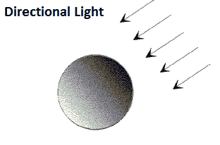

因此，正如您在前面的图中可以看到的，有一些箭头从一个光源发出。方向性光源没有原点，或者更准确地说，没有位置，因为光源无限远。

例如，假设您有五个立方体。无论它们的材质如何，我们假设它们都是相同的，并且以相同的方式旋转，但位置各不相同。所以，让我们假设它们彼此之间相距 100 英里，并且朝任何方向。实际上，光和方向性光将以相同的方式影响每个单独的立方体对象，因为方向性光源没有起始位置。您无法接近光源；您可能会认为如果您朝光源的方向移动，您会接近光源。技术上，您可以说这是真的。但如果它没有原始位置和原始位置，并且无限远，它仍然会无限远。所以这就是方向性光源。

方向光在场景中类似于你拥有的普通光，然后你使用聚光灯和点光源来增强你的场景，创建更具体的东西。所以，让我们考虑这个例子。如果你有一个设定在平坦地面或某个岛屿上的游戏，那么方向光可以是太阳。

如果你不是真正垂直向上，你没有进入太空，你不能真正地靠近太阳；那么你可以将其视为方向光，在许多游戏中，这通常被认为是方向光。

再次，这取决于你玩的游戏类型。如果你玩的游戏可以进入太空并到达星星或太阳，那么这根本就不是方向光；那将是另一种光。但不同类型的光将在不同的部分中介绍。所以，让我们通过使用`shaders/lighting.frag`文件来实现这一点，如下面的代码所示：

```cpp
struct Light
{
 //vec3 position;
 vec3 direction;

 vec3 ambient;
 vec3 diffuse;
 vec3 specular;
};
```

我们所做的是注释掉原始位置`vec3 position`，而不是添加一个方向，即`vec3 direction`。

在漫反射光照中，我们需要稍作修改：

```cpp
 // Diffuse
 vec3 norm = normalize(Normal);
 // vec3 lightDir = normalize(light.position - FragPos);
 vec3 lightDir = normalize(-light.direction);
 float diff = max(dot(norm, lightDir), 0.0);
 vec3 diffuse = light.diffuse * diff * vec3(texture(material.diffuse, TexCoords));
```

所以，让我们只注释掉`lightDir`，因为尽管我们还将有一个光方向，但我们想保留这段代码以备将来使用。所以，添加一个新的代码行，`lightDir = normalize -light.direction`。

所以，这就是我们在这里需要做的全部，因为我们不是在计算位置（`light.position`）和实际片段着色器位置（`FragPos`）之间的差异。我们不需要这样做，因为我们只关心光的方向。

# 修改主代码以整合我们的世界中的方向光

现在打开`main.cpp`文件，该文件用于实际的光照和着色器。注释掉我们的着色器程序，因为我们在这个部分实际上不会使用灯着色器，仅仅是因为我们不希望有任何具有原点位置的光源：

```cpp
// Build and compile our shader program
 Shader lightingShader( "res/shaders/lighting.vs",  
 "res/shaders/lighting.frag" );
 //Shader lampShader( "res/shaders/lamp.vs", "res/shaders/lamp.frag" );
```

在这里，我们将使用不同立方体位置的一个数组。

```cpp
// Positions all containers
 glm::vec3 cubePositions[] = {
 glm::vec3( 0.0f, 0.0f, 0.0f),
 glm::vec3( 2.0f, 5.0f, -15.0f),
 glm::vec3( -1.5f, -2.2f, -2.5f),
 glm::vec3( -3.8f, -2.0f, -12.3f),
 glm::vec3( 2.4f, -0.4f, -3.5f),
 glm::vec3( -1.7f, 3.0f, -7.5f),
 glm::vec3( 1.3f, -2.0f, -2.5f),
 glm::vec3( 1.5f, 2.0f, -2.5f),
 glm::vec3( 1.5f, 0.2f, -1.5f),
 glm::vec3( -1.3f, 1.0f, -1.5f)
 };
```

我们将生成几个立方体，非常类似于我们之前所做的那样，你可以看到不同立方体之间的差异。我们不再需要光照顶点数组对象，因为我们不做灯着色器，所以让我们只注释掉它：

```cpp
/*
 // Then, we set the light's VAO (VBO stays the same. After all, the vertices are the same for the light object (also a 3D cube))
 GLuint lightVAO;
 glGenVertexArrays(1, &lightVAO);
 glBindVertexArray(lightVAO);
 // We only need to bind to the VBO (to link it with glVertexAttribPointer), no need to fill it; the VBO's data already contains all we need.
 glBindBuffer(GL_ARRAY_BUFFER, VBO);
 // Set the vertex attributes (only position data for the lamp))
 glVertexAttribPointer(0, 3, GL_FLOAT, GL_FALSE, 8 * sizeof(GLfloat), (GLvoid*)0); // Note that we skip over the other data in our buffer object (we don't need the normals/textures, only positions).
 glEnableVertexAttribArray(0);
 glBindVertexArray(0);
 */
```

到目前为止，一切看起来都很好，但我们需要在`while`循环中进行一些更改，到我们使用光照着色器的部分。所以，添加`GLint lightDirLoc = glGetUniformLocation`和`glUniform3f`：

```cpp
// Use cooresponding shader when setting uniforms/drawing objects
 lightingShader.Use( );
 //GLint lightPosLoc = glGetUniformLocation(lightingShader.Program, "light.position");
 GLint lightDirLoc = glGetUniformLocation( lightingShader.Program, "light.direction" );
 GLint viewPosLoc = glGetUniformLocation( lightingShader.Program, "viewPos" );
//glUniform3f(lightPosLoc, lightPos.x, lightPos.y, lightPos.z);
glUniform3f( lightDirLoc, -0.2f, -1.0f, -0.3f );
glUniform3f( viewPosLoc, camera.GetPosition( ).x    , camera.GetPosition( ).y, camera.GetPosition( ).z );
```

视图位置位置，也就是摄像机的位置，是好的。环境光和漫反射不需要更改。如果你想修改它们，也可以，但在这个特定的章节中不是必需的。

现在，创建一个如下所示的循环：

```cpp
 // Draw 10 containers with the same VAO and VBO information; 
// only their world space coordinates differ
 glm::mat4 model;
 glBindVertexArray( boxVAO );
 for ( GLuint i = 0; i < 10; i++)
 {
 model = glm::mat4( );
 model = glm::translate( model, cubePositions[i] );
 GLfloat angle = 20.0f * i;
 model = glm::rotate( model, angle, glm::vec3( 1.0f, 0.3f, 0.5f ) );
 glUniformMatrix4fv( modelLoc, 1, GL_FALSE, glm::value_ptr( model ) );

 glDrawArrays( GL_TRIANGLES, 0, 36 );
 }
 glBindVertexArray( 0 );
```

在这里，我们添加`glm::mat4`作为一个 4x4 矩阵。我们将称之为模型。然后我们添加`glBindVertexArray`，它将获取盒子顶点数组对象。有时我们只想有一个立方体；有时我们想有多个，所以我们将使用`cubePositions`，它将迭代器作为索引。现在我们将添加`GLfloat angle = 20.0f * i; model = glm::rotate`，对于旋转，它将再次使用模型。对于角度，我们只是放置角度。之后，我们将添加一个向量，`glm::vec3`，对于这个，我们只是放置`1.0f`、`0.3f`和`0.5f`。我们只是将 4x4 矩阵统一化。使用`glUniformMatrix4fv`，因为它有四个浮点值和`modelLoc`，这是我们之前创建的，它将取值为`1`。然后添加`GL_FALSE`和`glm::value_ptr (model)`。`glDrawArrays`将取`GL_TRIANGLES`，起始索引`0`和`36`个不同的顶点。所以，如果我们在这里放置一个分号，我们只需要将顶点数组绑定到`0`，所以我们只是取消绑定它。

现在我们将运行这个家伙，结果却是构建失败。这是因为我们注释掉了光顶点数组对象，因此我们也就没有必要使用`glDeleteVertexArrays( 1, &lightVAO )`了。所以，现在再次运行它，你将得到构建成功，并看到以下输出：

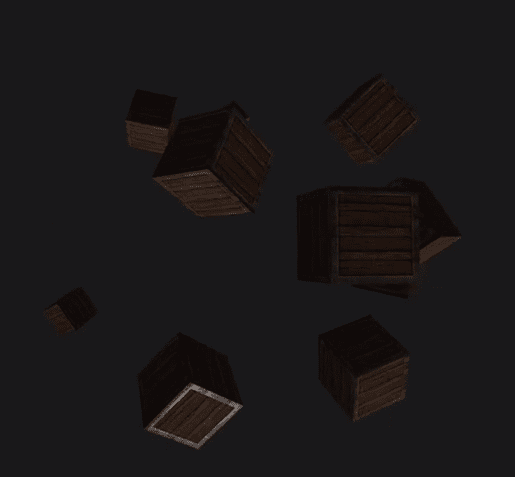

在这里，我们有我们的不同对象。所有这些对象都受到光照的影响方式相同。显然，角度不同，这就是光照影响它的强度不同的原因。但在它们的位置方面，这并不重要。因为光照来自一个方向，物体受到的影响完全相同。它们既不暗也不亮。镜面光照将以相同的方式影响它们，并且是角度使得光照影响它不同。

到目前为止，我们已经学习了现代 OpenGL 中的方向光。在下一节中，我们将介绍一种更高级的光照形式，我们将使用光照创建一些非常酷的东西。当你看到我们的所有游戏，尤其是那些在图形保真度方面看起来非常棒的游戏时，你会发现，当你开始深入到这些游戏的底层并开始进行图形编程时，你会看到很多都是由于光照造成的。

光照影响事物的方式可能具有最大的影响，因为通过使用正常光照，你可以使一个物体看起来有深度，即使它只是一个平面纹理，这相当激进。

# 点光源

在本章中，我们将讨论点光源。到目前为止，我们已经对光照系统进行了深入的探讨。一种技术是方向性光源，本质上是指向某个方向的光源，因此得名方向性光源；但它们没有原始位置，也就是说，它们在无限远处。所以，比如说，我们有两个完全相同的物体，以完全相同的方式旋转，并且没有其他光照影响这些物体；无论它们彼此距离多远，它们都不会受到方向性光源的不同影响。

# 点光源的概念

**点光源**是一种具有实际起源的光源，它向每个方向发出光：

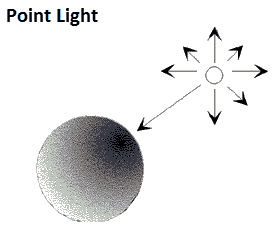

你几乎可以将一个点光源想象成我们生活中的太阳或星星。你可以争论说，从技术上讲，太阳从不同的侧面发出不同数量的光，但为了争论，我们可以这样说，它从其起源向所有方向发出相同强度、相同类型的光。在空间游戏中，像太阳、星星或其他类似物体一样有一个点光源是非常常见的。

首先，只需打开你的光照片段着色器，即`../shaders/lighting.frag`，在这个文件中，我们需要修改一些东西：

```cpp
struct Light
{
 //vec3 direction;
 vec3 position;

 vec3 ambient;
 vec3 diffuse;
 vec3 specular;

 float constant;
 float linear;
 float quadratic;
};
```

在前面的代码片段中，我们将注释掉`direction`向量，因为我们不再需要方向，因为光源有一个位置，它只是向每个方向发出光。所以，`ambient`、`diffuse`和`specular`将不需要更改。现在，我们将添加一个常数、一个线性和一个二次浮点数。这就是灯光结构体的全部内容。

# 扩散部分

现在，让我们检查一下扩散部分：

```cpp
// Diffuse
 vec3 norm = normalize(Normal);
 vec3 lightDir = normalize(light.position - FragPos);
 //vec3 lightDir = normalize(-light.direction); 
 float diff = max(dot(norm, lightDir), 0.0);
 vec3 diffuse = light.diffuse * diff * vec3(texture(material.diffuse, 
 TexCoords));
```

我们仍然将规范化我们的`Normal`，但我们想要光位置和片段位置之间的差异。所以我们将注释掉光方向，`vec3 lightDir = normalize(-light.direction)`，我们将取消注释`light.position - FragPos`。

差异，`max (dot( norm, lightDir)`, 将保持不变。在`diffuse`方面，我们仍在使用`light.diffuse`，将其乘以`float diffuse`变量，`diff`，然后是`vec3`。

# 镜面反射部分

让我们现在看看镜面反射部分：

```cpp
// Specular
 vec3 viewDir = normalize(viewPos - FragPos);
 vec3 reflectDir = reflect(-lightDir, norm);
 float spec = pow(max(dot(viewDir, reflectDir), 0.0),   
 material.shininess);
 vec3 specular = light.specular * spec * 
 vec3(texture(material.specular, TexCoords)); 
```

在这里，视方向和反射方向不会改变。我们需要添加的是称为衰减的东西，类似于距离和光照。

# 衰减部分

衰减实际上是一种断开连接。衰减光照是随着你远离物体而光照的减少。看看这张图片：

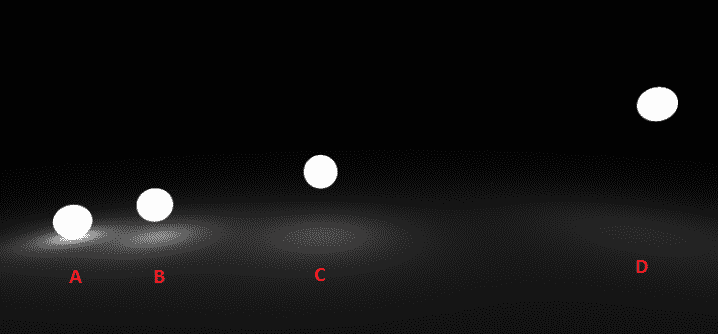

我们有四个不同的光源，**A**、**B**、**C**和**D**。我们将假设它们都是相同的。**A**对地面的影响比**D**更大，因为**D**更远。所以，基本上衰减就是衰减。

因此，让我们来实现它：

```cpp
// Attenuation
 float distance = length(light.position - FragPos);
 float attenuation = 1.0f / (light.constant + light.linear * distance
 + light.quadratic * (distance * distance)); 
```

在前面的代码片段中，如果光源距离更远但角度相同，它仍然会以相同的方式影响我们的对象，而我们不希望这样。因此，我们将添加`float distance = length(light.position - FragPos)`，然后添加`float attenuation = 1.0f / (light.constant + light.linear * distance + light.quadratic * (distance * distance))`。所以，这就是我们计算距离和衰减的方法。

如果你想了解更多关于它是如何工作的信息，请随意查看以下链接：

+   [`open.gl`](https://open.gl/)

+   [`learnopengl.com`](https://learnopengl.com)

这些是很好的资源，所以请随意查看它们。

现在我们将添加环境光、漫反射和镜面光的衰减：

```cpp
 // Attenuation
 float distance = length(light.position - FragPos);
 float attenuation = 1.0f / (light.constant + light.linear * 
 distance + light.quadratic * (distance * distance));

 ambient *= attenuation;
 diffuse *= attenuation;
 specular *= attenuation;
```

我们需要这些，因为所有三个都需要考虑衰减，因为它们需要考虑距离。

# main.cpp 中的更改时间

打开`main.cpp`文件。我们需要对其进行一些修改。首先，我们需要实际取消注释`lampShader`：

```cpp
// Build and compile our shader program
 Shader lightingShader( "res/shaders/lighting.vs", 
 "res/shaders/lighting.frag" );
 Shader lampShader( "res/shaders/lamp.vs", "res/shaders/lamp.frag" );
```

这是因为我们再次使用灯，因为我们正在处理点光源。

下一个我们需要改变的是光顶点数组对象，因为我们现在正在使用灯着色器。所以，取消注释以下代码块：

```cpp
 GLuint VBO, boxVAO;
 glGenVertexArrays( 1, &boxVAO );
 glGenBuffers( 1, &VBO );

 glBindBuffer( GL_ARRAY_BUFFER, VBO );
 glBufferData( GL_ARRAY_BUFFER, sizeof(vertices), 
 vertices, GL_STATIC_DRAW );

 glBindVertexArray( boxVAO );
 glVertexAttribPointer( 0, 3, GL_FLOAT, GL_FALSE, 8 * 
 sizeof( GLfloat ), ( GLvoid * )0 );
 glEnableVertexAttribArray(0);
 glVertexAttribPointer( 1, 3, GL_FLOAT, GL_FALSE, 8 * 
 sizeof( GLfloat ), ( GLvoid * )( 3 * sizeof( GLfloat ) ) );
 glEnableVertexAttribArray( 1 );
 glVertexAttribPointer( 2, 2, GL_FLOAT, GL_FALSE, 8 * 
 sizeof( GLfloat ), ( GLvoid * )( 6 * sizeof( GLfloat ) ) );
 glEnableVertexAttribArray( 2 );
 glBindVertexArray( 0 );
```

现在我们需要一个发射贴图，所以我们将添加`emissionMap`：

```cpp
 // Load textures
 GLuint diffuseMap, specularMap, emissionMap;
 glGenTextures( 1, &diffuseMap );
 glGenTextures( 1, &specularMap );
 glGenTextures( 1, &emissionMap );
```

现在我们需要做的唯一改变实际上是在我们的`while`循环中：

```cpp
 lightingShader.Use( );

 GLint lightPosLoc = glGetUniformLocation( lightingShader.Program, 
 "light.position" );
 //GLint lightDirLoc = glGetUniformLocation( lightingShader.Program,    
 //"light.direction" );
 GLint viewPosLoc = glGetUniformLocation( lightingShader.Program, 
 "viewPos" );
 glUniform3f( lightPosLoc, lightPos.x, lightPos.y, lightPos.z );
 //glUniform3f( lightPosLoc, -02.f, 1.0f, -0.3f );
 glUniform3f( viewPosLoc, camera.GetPosition( ).x, camera.GetPosition( ).y, camera.GetPosition( ).z );
 and comment out the directions, GLint lightDirLoc = glGetUniformLocation( lightingShader.Program, "light.direction" );, because again, the pointer light emits light in every direction. Also, don't forget to comment out glUniform3f( lightPosLoc, -02.f, 1.0f, -0.3f ); and remove the comment from glUniform3f( lightPosLoc, lightPos.x, lightPos.y, lightPos.z );
```

现在，我们还需要添加常量、线性项和二次项，这些都是浮点值：

```cpp
// Set lights properties
 glUniform3f( glGetUniformLocation( lightingShader.Program, "light.ambient" ), 0.2f, 0.2f, 0.2f );
 glUniform3f( glGetUniformLocation( lightingShader.Program, "light.diffuse" ), 0.5f, 0.5f, 0.5f );
 glUniform3f( glGetUniformLocation( lightingShader.Program, "light.specular" ), 1.0f, 1.0f, 1.0f );
 glUniform1f( glGetUniformLocation( lightingShader.Program, "light.constant" ), 1.0f );
 glUniform1f( glGetUniformLocation( lightingShader.Program, "light.linear" ), 0.09 );
 glUniform1f( glGetUniformLocation( lightingShader.Program, "light.quadratic" ), 0.032 );
```

现在，为了绑定我们的纹理，我们需要取消注释`lampShader.Use( )`块。同时，删除光顶点数组对象，即取消注释`glDeleteVertexArrays( 1, &lightVAO );`行：

```cpp
 glDeleteVertexArrays( 1, &boxVAO );
 glDeleteVertexArrays( 1, &lightVAO );
 glDeleteBuffers( 1, &VBO );
```

现在，我们准备运行我们的应用程序，我们得到以下屏幕：

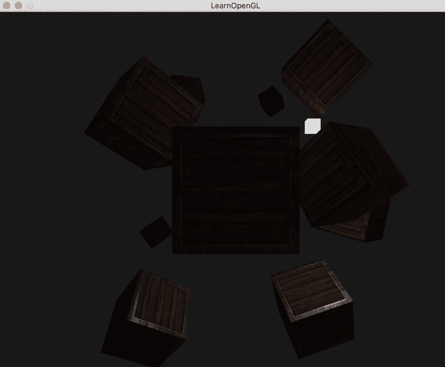

如果检查输出，我们得到了原始的光源，并且距离较远的对象稍微暗一些，正如它们应该的那样。

但让我们在`main.cpp`中再做一个更改；我们实际上可以通过在`while`循环中取消注释以下行来移动我们的光：

+   `lightPos.x -=0.005f;`

+   `lightPos.z -=0.005f;`

现在，如果你重新运行应用程序，正如你在以下屏幕截图中所见，衰减已经考虑在内。你可以看到这个对象现在稍微亮一些，你实际上会开始看到这个特定的对象变亮：

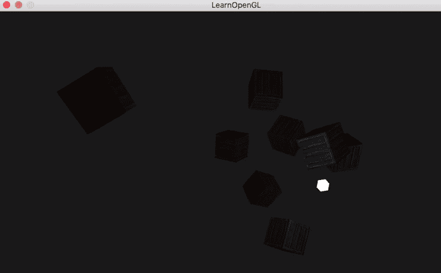

现在，再次在`while`循环中取消注释以下行：

+   `lightPos.x -=0.005f;`

+   `lightPos.z -=0.005f;`

而我们将尝试在相机部分改变光的位置：

```cpp
// Camera
Camera camera( glm::vec3( 0.0f, 0.0f, 3.0f ) );
GLfloat lastX = WIDTH / 2.0;
GLfloat lastY = HEIGHT / 2.0;
bool keys[1024];
bool firstMouse = true;

// Light attributes
glm::vec3 lightPos( 1.2f, 1.0f, -2.0f );
```

所以，正如你可以在前面的代码中看到的那样，我们在光属性部分将`2.0f`替换为`-2.0f`。现在，如果你运行你的应用程序，你可以看到光正在向每个方向发射。较近的对象比远处的对象更亮：

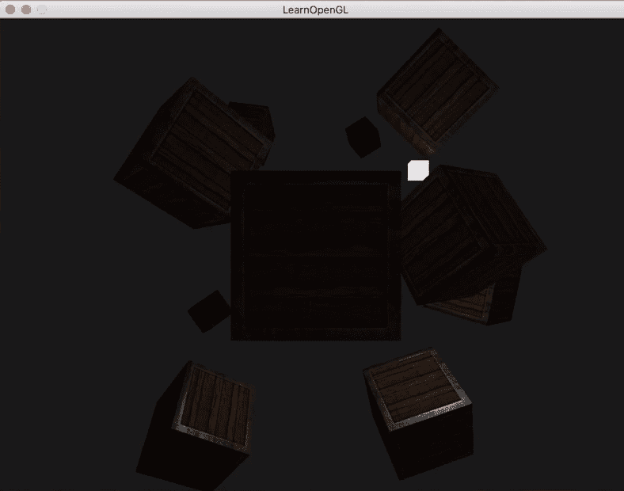

所以，这就是点光源的全部内容。

# 聚光灯

让我们讨论并看看我们如何将聚光灯添加到我们的游戏中。我们已经看过方向光，我们也看过点光源。方向光有一个方向，但没有原始位置，所以它是无限远的。点光源有一个位置，但它向每个方向发光，而聚光灯有一个位置和方向。

看看以下聚光灯的图示：

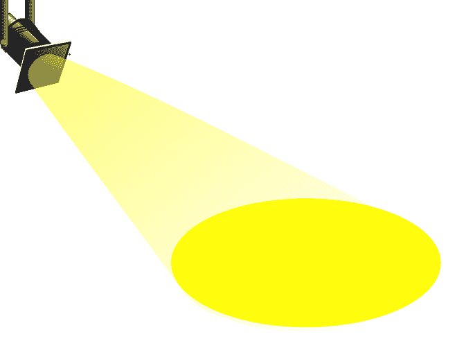

所以，光源的位置很高，你还可以看到有一个光的方向。它本质上创建了一个圆锥形的效果，就像灯或火炬一样。聚光灯在舞台上使用。但在你的世界中，聚光灯在游戏的多个场景中使用。

所以，无需多言，让我们开始编写我们的聚光灯代码。

# 修改着色器文件

按照以下步骤进行：

1.  更新着色器文件实际上非常非常简单。我们只需要实际修改着色器文件中的光照片段着色器；其他所有内容看起来都很好。在`lighting.frag`中，我们可以保持`Material`结构体不变，因为它有`diffuse`、`specular`和`shininess`，这正是我们需要的聚光灯特性。

1.  但是，与光结构体一起，我们需要方向，因为聚光灯有一个原始位置和它照射的方向。所以，我们将取消注释`vec3 direction`。我们还需要几个浮点变量。第一个是`float cutOff`。下一个是`float outerCutOff`。看看以下代码：

```cpp
#version 330 core
struct Material
{
     sampler2D diffuse;
     sampler2D specular;
     float shininess;
};
struct Light
{
     vec3 position;
     vec3 direction;
     float cutOff;
 float outerCutOff;

     float constant;
     float linear;
     float quadratic;

     vec3 ambient;
     vec3 diffuse;
     vec3 specular;
};
```

1.  从`void main`开始之前的其余术语保持不变。

1.  在`void main`中，环境计算、漫反射计算和镜面反射计算都没有变化。甚至衰减计算也不会变化。我们实际上需要做的只是为聚光灯添加一个额外的部分，这将计算柔和的边缘。

1.  所以，对于柔和边缘的计算，我们将添加`float theta = dot();`，并将`lightDir`传递给它。这需要被归一化，所以我们传递`normalize()`。然后最后，在这里你需要指定`-light.direction`。你需要添加一个负的光值，因为你是从摄像机的角度而不是从用户的角度来做的。这就是为什么位置被取反。在下一行，我们需要计算`cutOff`和`outerCutOff`之间的差异，所以我们将添加以下内容：

```cpp
float epsilon = (light.cutOff - light.outerCutOff);
```

1.  然后添加`float intensity = clamp();`。在这里，我们将传递`theta - light.outerCutOff`。我们想将这个计算除以`epsilon`，然后只放两个值，`0.0`和`1.0`：

```cpp
float intensity = clamp((theta - light.outerCutOff) / epsilon, 0.0, 1.0);
```

1.  最后，我们只需要将强度添加到`diffuse`和`specular`中：

```cpp
diffuse *= intensity;
specular *= intensity;
```

所以，我们现在实际上已经完成了着色器的更新。

# 对 Camera.h 进行微小修改

在本节中，我们需要 `GetFront`，这是主代码中的一个私有变量。我们将在 `Camera.h` 文件中对它进行一些小的修改。所以，在 `glm::vec3 GetPosition()` 方法下面，我们将添加一个简单的方法，如下所示：

```cpp
glm::vec3 GetFront()
{
    return this -> front;
}
```

# 修改主代码

现在，如果我们转到 `main.cpp`，我们将进行以下修改：

1.  我们不需要 `lampShader`，因为我们将通过聚光灯来完成，所以我们将注释掉代码。我们不需要任何类型的灯片着色器或其他类似的东西，因为我们在这个部分要做的是将聚光灯附着在本质上相当于相机的位置。你几乎可以把它想象成那些顶部带有灯的头盔，人们用来攀岩和类似的活动。我们只是简单地模拟这个效果，因为方向光和点光源很棒，如果你让它们保持静态，它们很容易被看到和理解正在发生的事情。有了聚光灯，如果你能移动它，那真的很有帮助，而移动它的最好方法就是使用相机。

1.  我们将注释掉光顶点数组对象，因为我们不再需要它了。

1.  在注释掉这些代码之后，我们可以直接进入循环，并需要在这里做一些修改。当我们到达 `lightingShader.Use` 时，我们需要更改那里的某些代码。我们将添加 `GLint lightSpotDirLocation = glGetUniformLocation();`。在这里，我们需要传递 `lightingShader.Program`，另一个需要指定的参数是 `"light.direction"`。我们接下来要做的是复制前面的代码，并对其进行以下修改：

```cpp
 lightingShader.Use();
 GLint lightPosLoc = glGetUniformLocation( lightingShader.Program, "light.position" );
 GLint lightSpotdirLoc = glGetUniformLocation( lightingShader.Program, "light.direction" );
 GLint lightSpotCutOffLoc = glGetUniformLocation( lightingShader.Program, "light.cutOff" );
 GLint lightSpotOuterCutOffLoc = glGetUniformLocation( lightingShader.Program, "light.outerCutOff" );
 GLint viewPosLoc = glGetUniformLocation( lightingShader.Program, "viewPos" );
 glUniform3f( lightPosLoc, camera.GetPosition( ).x, camera.GetPosition( ).y, camera.GetPosition( ).z);
 glUniform3f( lightSpotdirLoc, camera.GetFront( ).x, camera.GetFront( ).y, camera.GetFront( ).z);
 glUniform1f( lightSpotCutOffLoc, glm::cos( glm::radians( 12.5f ) ) );
 glUniform1f( lightSpotOuterCutOffLoc, glm::cos( glm::radians( 17.5f ) ) );
 glUniform3f( viewPosLoc, camera.GetPosition( ).x, camera.GetPosition( ).y, camera.GetPosition( ).z);
```

1.  我们将修改 `lightingShader` 代码中剩余的术语，其中我们设置光属性如下：

```cpp
glUniform3f( glGetUniformLocation( lightingShader.Program, "light.ambient" ),   0.1f, 0.1f, 0.1f );
glUniform3f( glGetUniformLocation( lightingShader.Program, "light.diffuse" ), 0.8f, 0.8f, 0.8f );

```

1.  在这里，我们只改变一件事。我们将注释掉整个 `lampShader` 代码。因为我们已经注释掉了声明和初始化，所以在这里我们也需要这样做。

1.  我们还需要注释掉 `glDeleteVertexArrays();`。

我们现在可以运行这个程序了。你会在屏幕上看到类似的输出。所以，正如你所见，我们有一些光线。聚光灯附着在我们身上。

因此，如果我们向前移动，正如你所见，我们得到了一种聚光灯效果，而且越靠近它，效果越明显，如下面的截图所示：

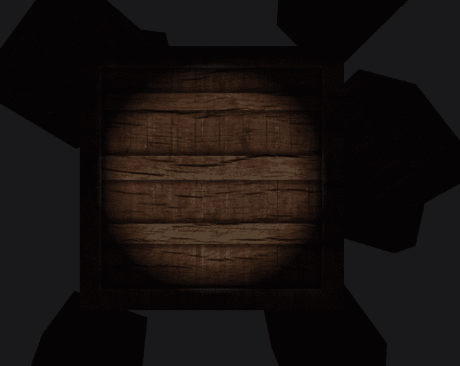

否则，当我们远离物体时，它非常宽，如下面的截图所示：

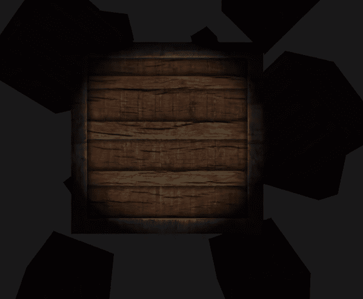

因此，它们较小。当我们四处张望时，我们得到了一种聚光灯效果。正如你所见，它对远离物体的物体产生的影响略有不同，我们有一个非常酷的聚光灯，如下面的截图所示：

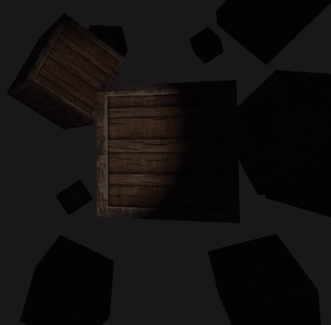

让我们尝试在角落处做一下，如下所示：

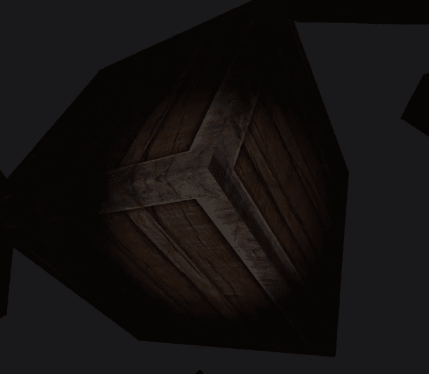

我们有一个非常酷的附着在我们头上的聚光灯。你可以继续创建某种建筑游戏或某种矿工游戏，其中你头上有一个光源。那会非常酷。

# 结合光线

在本节中，我们将探讨如何结合我们的光源。到目前为止，在前面几节中，我们已经介绍了方向光、点光源和聚光灯。以下是对它们的简要概述：

+   **方向光**: 方向光是一种具有特定方向的光。它以特定方向发光，但没有位置，没有位置。它只是无限地远离一切。

+   **点光源**: 点光源有一个位置，但它向每个方向发光。根据你所做的工作和你的游戏类型，你可能会将太阳或星星作为方向光，但如果你能进入太空，绕着你的星星或靠近它，那么你可能想要一个点光源。

+   **聚光灯**: 聚光灯本质上就像一盏灯。它在初始位置投射光线，然后在方向上也是如此。所以它就像是前两种光类型的组合。

在前面的章节中，我们看了所有这些，但此刻，在这些章节中，我们只是逐个介绍它们。我们要么注释掉代码，要么修改代码，只是为了展示一个真实的情况。但在实际的游戏场景或自由应用程序场景中，你将想要多个光源。你将想要多个方向光、点光源和聚光灯的实例。你可能还想要尝试创建你自己的非常酷的效果。在本节中，我们将结合我们三种类型的光投射器。

如往常一样，我们将从更新着色器文件开始。

# 准备着色器文件

看一下下面提到的步骤：

1.  我们需要做的第一件事是进入片段着色器中的照明部分，`lighting.frag`。这是我们实际上需要修改的唯一着色器，所以我们不会触摸`lighting.vs`。查看以下步骤以了解我们需要对片段着色器做出的更改：

1.  因此，首先，我们将添加`#define`，这将是`NUMBER_OF_POINT_LIGHTS`。对于我们的项目，我们将添加值为 4，因为我们将有四个点光源。

1.  接下来，我们需要为三种不同类型的光源创建一个数据类型：方向光、点光源和聚光灯。为此，我们将实际上复制代码中已有的结构体。我们将适当地重命名每一个：`DirLight`用于方向光，`PointLight`用于点光源，`SpotLight`用于聚光灯。我们不需要结构体中所有的向量和浮点数。查看以下代码以了解我们需要在定义的新结构体中做出的所有更改：

```cpp
version 330 core
#define NUMBER_OF_POINT_LIGHTS 4
struct Material
{
     sampler2D diffuse;
     sampler2D specular;
     float shininess;
};
```

1.  方向光，如您可能记得的，没有位置，它有一个方向。它有环境光、漫反射和镜面反射，但没有任何浮点变量：常数、线性二次。所以我们将只移除它们：

```cpp
struct DirLight
{
     vec3 direction;

     vec3 ambient;
     vec3 diffuse;
     vec3 specular;
};
```

1.  对于点光源，请记住它没有方向；它有一个位置，因为它只是向所有方向发射光。我们可以去掉`cutOff`和`outerCutOff`，但我们需要其他所有东西：

```cpp
struct PointLight
{
     vec3 position;

     float constant;
     float linear;
     float quadratic;

     vec3 ambient;
     vec3 diffuse;
     vec3 specular;
};
```

1.  对于聚光灯，这里不会有任何变化，因为这个结构是在上一节中创建的，该节涵盖了聚光灯：

```cpp
struct SpotLight
{
     vec3 position;
     vec3 direction;
     float cutOff;
     float outerCutOff;

     float constant;
     float linear;
     float quadratic;

     vec3 ambient;
     vec3 diffuse;
     vec3 specular;
};
```

1.  随着我们向下移动，`uniform Light light`将略有变化，因为我们有三个不同的光源。所以我们将对其进行以下更改：

```cpp
uniform DirLight dirLight;
uniform PointLight pointLights[NUMBER_OF_POINT_LIGHTS];
uniform SpotLight spotLight;
uniform Material material;
```

在前面的代码中，如您可能记得的，我们创建了一个`#define`。因此，`uniform PointLight`将是一个灯光数组。尽管我们创建了多个聚光灯和一个方向光以及聚光灯，但您也可以创建多个方向光和多个聚光灯，例如台灯、棍子上点的灯等。您可能有一个非常强烈的光源，例如模拟太阳的方向光，然后您可能只有其他一些普通的小灯。

1.  接下来我们需要做的是创建一些函数原型，因为到目前为止，我们一直在`main`函数中做所有的事情。到目前为止这还不错，但我们需要在做事的方式上增加一些灵活性。所以，我们将添加`vec3 CalcDirLight();`，这将接受一些参数，例如`DirLight`。然后我们将取一个`vec3`作为法线。我们之前已经解释了所有这些不同向量和属性的使用。再次强调，我们只是在结合过去几节中我们所做的工作。然后，我们将复制代码并对其做出以下突出显示的更改：

```cpp
// Function prototypes
vec3 CalcDirLight( DirLight light, vec3 normal, vec3 viewDir );
vec3 CalcPointLight( PointLight light, vec3 normal, vec3 fragPos, vec3 viewDir );
vec3 CalcSpotLight( SpotLight light, vec3 normal, vec3 fragPos, vec3 viewDir );
```

# 在`lighting.frag`的`void main`中修改

查看以下步骤以了解修改：

1.  在`lighting.frag`的`void main`中，我们将移除所有最初存在的代码并添加新的代码。我们将从添加`vec3 normal`开始。我们只是使用`Normal`进行标准化。

1.  然后，我们将为`viewDir`创建一个`vec3`。这将标准化`viewPos`和`FragPos`之间的差异。

1.  现在我们需要进行方向光计算。为此，我们只需调用`CalcDirLight`方法。所以，我们不会在`main`中做很多代码。因为我们正在向其中添加更多内容，它正变得像另一个 C++项目，因为我们正在将其抽象成不同的方法，这样我们就可以在需要的时候重用这段代码。所以，我们将添加`vec3 result`并将`CalcDirLight();`的值赋给它，这将接受`dirLight`变量、我们刚刚计算出的`norm`和`viewDir`。

1.  接下来，我们只是将点光源循环遍历，然后考虑它们。所以，添加一个 for 循环并传递初始化参数，`int i = 0; i < NUMBER_OF_POINT_LIGHTS; i++`。在 `for` 循环中，我们将添加 `result += CalcPointLight()`。我们正在做的是将不同点光源的效果添加到我们的结果中，因为这种光照再次影响我们的特定对象，这就是它的做法。所以，我们将 `pointLights[i]`、`norm` 和 `FragPos` 传递给 `CalcPointLight()`。

1.  我们现在将添加聚光灯的代码。所以我们将考虑聚光灯并添加 `result += CalcSpotLight()`。这简单地接受 `spotLight` 变量、`norm`、`FragPos` 和 `viewDir`。然后我们将添加 `color = vec4(result,1.0);`。请查看以下代码以了解描述：

```cpp
void main( )
{
 // Properties
 vec3 norm = normalize( Normal );
 vec3 viewDir = normalize( viewPos - FragPos );

 // Directional lighting
 vec3 result = CalcDirLight( dirLight, norm, viewDir );

 // Point lights
 for ( int i = 0; i < NUMBER_OF_POINT_LIGHTS; i++ )
 {
 result += CalcPointLight( pointLights[i], norm, FragPos, viewDir );
 }

 // Spot light
 result += CalcSpotLight( spotLight, norm, FragPos, viewDir );

 color = vec4( result, 1.0 );
}
```

1.  这都是我们之前做过的事情，我们现在只是将其抽象出来。

1.  现在我们来计算不同光源颜色的计算。所以在这里，我们将复制并粘贴 `vec3 calc` 代码到所有三个光源。现在我们来计算方向光。所以我们将向 `vec3 CalcDirLight()` 方法添加 `vec3 lightDir`，这将等于 `normalize( -light.direction )`。

`-light.direction` 的原因是因为我们不是从我们的对象出发来做的，而是从光线出发。所以，不是对象看光线的方向，而是光线从对象出发。这就是为什么它被翻转的原因。

1.  现在我们需要添加 `float`。这将是要素阴影。所以 `diff = max()`，并将 `dot( normal, lightDir ), 0.0` 传递给 `max()`。

1.  接下来，我们将计算镜面反射阴影。所以添加 `vec3 reflectDir = reflect()`，并将 `-lightDir` 和 `normal` 传递给 `reflect()`。

1.  然后我们将添加 `float spec = pow()`，并将 `max()` 传递给 `max()`，其中包含 `dot( viewDir, reflectDir )` 和 `0.0`。

1.  最后，我们需要添加 `material.shininess`。现在我们需要组合结果。所以添加 `vec3 ambient = light.ambient * vec3 ()`，并将 `vec3()` 传递给 `texture( material.diffuse, TexCoords )`。这将是要素纹理的漫反射和纹理坐标，对于漫反射和镜面反射光，它与环境光类似，所以请在以下代码中做出突出显示的更改。同时，请查看以下代码以了解前面的描述：

```cpp
 vec3 CalcDirLight( DirLight light, vec3 normal, vec3 viewDir )
{
 vec3 lightDir = normalize( -light.direction );

 // Diffuse shading
 float diff = max( dot( normal, lightDir ), 0.0 );

 // Specular shading
 vec3 reflectDir = reflect( -lightDir, normal );
 float spec = pow( max( dot( viewDir, reflectDir ), 0.0 ), material.shininess );

 // Combine results
 vec3 ambient = light.ambient * vec3( texture( material.diffuse, TexCoords ) );
 vec3 diffuse = light.diffuse * diff * vec3( texture( material.diffuse, TexCoords ) );
 vec3 specular = light.specular * spec * vec3( texture( material.specular, TexCoords ) );

 return ( ambient + diffuse + specular );
}
```

在前面的代码中，我们只需要返回计算结果，即 `ambient + diffuse + specular`。

1.  现在我们需要计算点光源，所以我们将复制前面步骤中提到的代码行，并将其粘贴到 `CalcPointLight()` 方法中；我们将添加、更改和删除所需的内容。请看以下突出显示的代码以了解更改：

```cpp
// Calculates the color when using a point light.
vec3 CalcPointLight( PointLight light, vec3 normal, vec3 fragPos, vec3 viewDir )
{
 vec3 lightDir = normalize( light.position - fragPos );

 // Diffuse shading
 float diff = max( dot( normal, lightDir ), 0.0 );

 // Specular shading
 vec3 reflectDir = reflect( -lightDir, normal );
 float spec = pow( max( dot( viewDir, reflectDir ), 0.0 ), material.shininess );

 // Attenuation
 float distance = length( light.position - fragPos );
 float attenuation = 1.0f / ( light.constant + light.linear * distance + light.quadratic * ( distance * distance ) );

 // Combine results
 vec3 ambient = light.ambient * vec3( texture( material.diffuse, TexCoords ) );
 vec3 diffuse = light.diffuse * diff * vec3( texture( material.diffuse, TexCoords ) );
 vec3 specular = light.specular * spec * vec3( texture( material.specular, TexCoords ) );

 ambient *= attenuation;
 diffuse *= attenuation;
 specular *= attenuation;

 return ( ambient + diffuse + specular );
}
```

在前面的代码中，在定义了 `specular` 阴影之后，我们添加了衰减代码，因为我们需要考虑衰减。

1.  现在，我们需要对`spotlight ()`方法进行计算。同样，我们只是复制并粘贴之前的代码，因为我们很可能会添加很多东西，但我们需要大部分。所以请看以下突出显示的代码：

```cpp
// Calculates the color when using a spot light.
vec3 CalcSpotLight( SpotLight light, vec3 normal, vec3 fragPos, vec3 viewDir )
{
 vec3 lightDir = normalize( light.position - fragPos );

 // Diffuse shading
 float diff = max( dot( normal, lightDir ), 0.0 );

 // Specular shading
 vec3 reflectDir = reflect( -lightDir, normal );
 float spec = pow( max( dot( viewDir, reflectDir ), 0.0 ), material.shininess );

 // Attenuation
 float distance = length( light.position - fragPos );
 float attenuation = 1.0f / ( light.constant + light.linear * distance + light.quadratic * ( distance * distance ) );

 // Spotlight intensity
 float theta = dot( lightDir, normalize( -light.direction ) );
 float epsilon = light.cutOff - light.outerCutOff;
 float intensity = clamp( ( theta - light.outerCutOff ) / epsilon, 0.0, 1.0 );

 // Combine results
 vec3 ambient = light.ambient * vec3( texture( material.diffuse, TexCoords ) );
 vec3 diffuse = light.diffuse * diff * vec3( texture( material.diffuse, TexCoords ) );
 vec3 specular = light.specular * spec * vec3( texture( material.specular, TexCoords ) );

 ambient *= attenuation * intensity;
 diffuse *= attenuation * intensity;
 specular *= attenuation * intensity;

 return ( ambient + diffuse + specular );
}
```

在前面的代码中，在我们继续到`ambient`、`diffuse`和`specular`向量之前，我们需要添加聚光灯强度计算的代码。仔细查看突出显示的代码。然后，最后，我们只需要考虑强度。所以我们在代码的最后几行中只是将衰减乘以强度。

我们现在已经更新了片段光照着色器。我们之前已经覆盖了所有这些内容。我们现在只是将它们全部组合在一起。现在，我们已经完成了。我相信这里肯定会有错误，因为这里有很多代码，所以当我们开始编译它时我们会处理这些错误。所以让我们保存它。

现在，我们将继续修改我们的主要代码。

# 主代码的更改

按照以下步骤在我们的代码中组合光源：

1.  在`main.cpp`中，我们需要灯的着色器，所以我们将取消注释它。在`cubePositions`之后，因为我们现在有多个点光源位置，我们将添加`glm::vec3`，这将被称为`pointLightPositions[]`。我们将在其中添加`glm::vec3();`，为此，我们将传递`0.7f`、`0.2f`和`2.0f`。复制这一行代码，粘贴四次，并做以下修改：

```cpp
  // Positions of the point lights
     glm::vec3 pointLightPositions[] = 
{
     glm::vec3( 0.7f, 0.2f, 2.0f ),
     glm::vec3( 2.3f, -3.3f, -4.0f ),
     glm::vec3( -4.0f, 2.0f, -12.0f ),
     glm::vec3( 0.0f, 0.0f, -3.0f )
 };
```

1.  接下来，我们将取消注释灯光顶点数组对象，因为我们现在需要它来组合灯光。

1.  我们需要做的重大更改现在都在`while`循环中。我们正在使用光照着色器，所以我们将对其进行以下更改：

```cpp
// Use cooresponding shader when setting uniforms/drawing objects
 lightingShader.Use( );
 GLint viewPosLoc = glGetUniformLocation( lightingShader.Program, "viewPos" );
 glUniform3f( viewPosLoc, camera.GetPosition( ).x, camera.GetPosition( ).y, camera.GetPosition( ).z);
 // Set material properties
 glUniform1f( glGetUniformLocation( lightingShader.Program, "material.shininess" ), 32.0f );
```

1.  我们正在设置方向光的制服：

```cpp
 // Directional light
 glUniform3f( glGetUniformLocation( lightingShader.Program, "dirLight.direction" ), -0.2f, -1.0f, -0.3f );
 glUniform3f( glGetUniformLocation( lightingShader.Program, "dirLight.ambient" ), 0.05f, 0.05f, 0.05f );
 glUniform3f( glGetUniformLocation( lightingShader.Program, "dirLight.diffuse" ), 0.4f, 0.4f, 0.4f );
 glUniform3f( glGetUniformLocation( lightingShader.Program, "dirLight.specular" ), 0.5f, 0.5f, 0.5f );
```

1.  然后我们将为点光源 1 设置制服：

```cpp
// Point light 1
 glUniform3f( glGetUniformLocation( lightingShader.Program, "pointLights[0].position" ), pointLightPositions[0].x, pointLightPositions[0].y, pointLightPositions[0].z );
 glUniform3f( glGetUniformLocation( lightingShader.Program, "pointLights[0].ambient" ), 0.05f, 0.05f, 0.05f );
 glUniform3f( glGetUniformLocation( lightingShader.Program, "pointLights[0].diffuse" ), 0.8f, 0.8f, 0.8f );
 glUniform3f( glGetUniformLocation( lightingShader.Program, "pointLights[0].specular" ), 1.0f, 1.0f, 1.0f );
 glUniform1f( glGetUniformLocation( lightingShader.Program, "pointLights[0].constant" ), 1.0f );
 glUniform1f( glGetUniformLocation( lightingShader.Program, "pointLights[0].linear" ), 0.09f );
 glUniform1f( glGetUniformLocation( lightingShader.Program, "pointLights[0].quadratic" ), 0.032f );
```

1.  同样，为点光源 2 设置制服：

```cpp
// Point light 2
 glUniform3f( glGetUniformLocation( lightingShader.Program, "pointLights[1].position" ), pointLightPositions[1].x, pointLightPositions[1].y, pointLightPositions[1].z );
 glUniform3f( glGetUniformLocation( lightingShader.Program, "pointLights[1].ambient" ), 0.05f, 0.05f, 0.05f );
 glUniform3f( glGetUniformLocation( lightingShader.Program, "pointLights[1].diffuse" ), 0.8f, 0.8f, 0.8f );
 glUniform3f( glGetUniformLocation( lightingShader.Program, "pointLights[1].specular" ), 1.0f, 1.0f, 1.0f );
 glUniform1f( glGetUniformLocation( lightingShader.Program, "pointLights[1].constant" ), 1.0f );
 glUniform1f( glGetUniformLocation( lightingShader.Program, "pointLights[1].linear" ), 0.09f );
 glUniform1f( glGetUniformLocation( lightingShader.Program, "pointLights[1].quadratic" ), 0.032f );
```

1.  这里是点光源 3 的制服定义：

```cpp
 // Point light 3
 glUniform3f( glGetUniformLocation( lightingShader.Program, "pointLights[2].position" ), pointLightPositions[2].x, pointLightPositions[2].y, pointLightPositions[2].z );
 glUniform3f( glGetUniformLocation( lightingShader.Program, "pointLights[2].ambient" ), 0.05f, 0.05f, 0.05f );
 glUniform3f( glGetUniformLocation( lightingShader.Program, "pointLights[2].diffuse" ), 0.8f, 0.8f, 0.8f );
 glUniform3f( glGetUniformLocation( lightingShader.Program, "pointLights[2].specular" ), 1.0f, 1.0f, 1.0f );
 glUniform1f( glGetUniformLocation( lightingShader.Program, "pointLights[2].constant" ), 1.0f );
 glUniform1f( glGetUniformLocation( lightingShader.Program, "pointLights[2].linear" ), 0.09f );
 glUniform1f( glGetUniformLocation( lightingShader.Program, "pointLights[2].quadratic" ), 0.032f );
```

1.  这里是点光源 4 的定义：

```cpp
// Point light 4
 glUniform3f( glGetUniformLocation( lightingShader.Program, "pointLights[3].position" ), pointLightPositions[3].x, pointLightPositions[3].y, pointLightPositions[3].z );
 glUniform3f( glGetUniformLocation( lightingShader.Program, "pointLights[3].ambient" ), 0.05f, 0.05f, 0.05f );
 glUniform3f( glGetUniformLocation( lightingShader.Program, "pointLights[3].diffuse" ), 0.8f, 0.8f, 0.8f );
 glUniform3f( glGetUniformLocation( lightingShader.Program, "pointLights[3].specular" ), 1.0f, 1.0f, 1.0f );
 glUniform1f( glGetUniformLocation( lightingShader.Program, "pointLights[3].constant" ),  1.0f );
 glUniform1f( glGetUniformLocation( lightingShader.Program, "pointLights[3].linear" ), 0.09f );
 glUniform1f( glGetUniformLocation( lightingShader.Program, "pointLights[3].quadratic" ), 0.032f );

```

1.  然后我们将按照以下方式定义聚光灯的制服：

```cpp
// SpotLight
 glUniform3f( glGetUniformLocation( lightingShader.Program, "spotLight.position" ), camera.GetPosition( ).x, camera.GetPosition( ).y, camera.GetPosition( ).z );
 glUniform3f( glGetUniformLocation( lightingShader.Program, "spotLight.direction" ), camera.GetFront( ).x, camera.GetFront( ).y, camera.GetFront( ).z );

glUniform3f( glGetUniformLocation( lightingShader.Program, "spotLight.ambient" ), 0.0f, 0.0f, 0.0f );

 glUniform3f( glGetUniformLocation( lightingShader.Program, 
"spotLight.diffuse" ), 1.0f, 1.0f, 1.0f );

 glUniform3f( glGetUniformLocation( lightingShader.Program, 
"spotLight.specular" ), 1.0f, 1.0f, 1.0f );

 glUniform1f( glGetUniformLocation( lightingShader.Program, "spotLight.constant" ), 1.0f );

 glUniform1f( glGetUniformLocation( lightingShader.Program, "spotLight.linear" ), 0.09f );

glUniform1f( glGetUniformLocation( lightingShader.Program, "spotLight.quadratic" ), 0.032f );

glUniform1f( glGetUniformLocation( lightingShader.Program, "spotLight.cutOff" ), glm::cos( glm::radians( 12.5f ) ) );
 glUniform1f( glGetUniformLocation( lightingShader.Program, "spotLight.outerCutOff" ), glm::cos( glm::radians( 15.0f ) ) );
```

在前面的代码行中，我们为 5 或 6 种类型的灯光设置了所有制服。我们必须手动设置它们，并在数组中索引正确的`PointLight`结构来设置每个制服变量。这可以通过定义灯光类型为类并在其中设置它们的值，或者通过使用更高效的制服方法，即使用制服缓冲对象来使代码更友好。

1.  我们仍然有我们不再需要的所有代码，所以，从我们完成 spotlight 相关内容的点开始，到我们开始定义视图矩阵的点，我们需要删除所有这些代码。这些都是当只有一种灯光类型时的残留代码，它被称为`Light`，所以我们将删除它。

1.  我们需要将着色器中的注释重新添加回去，并且需要将删除灯光顶点数组对象的注释重新添加回去。

1.  我们已经遍历了我们的盒子数组，创建了所有不同的盒子，并且我们有了我们的灯着色器。记住，我们有多个点光源，所以我们只需要为它创建一个循环。所以，在绑定顶点数组和解绑它之后，我们需要添加 `glBindVertexArray( lightVAO );`。

1.  然后我们将添加我们的 `for` 循环，并将循环的初始化参数作为 `GLuint i = 0; i < 4; i++` 传递，并将 `model = glm::mat4();` 添加到循环中。

1.  然后，在另一行，我们将添加 `model = glm::translate();`，这只是为了将 `model` 平移。然后这个向量的值将是 `pointLightPositions`。然后传递迭代器 `[i]`。

1.  现在，我们只是将立方体稍微缩小一点，就像我们之前做的那样。所以我们将添加 `model = glm::scale();`，并将 `model` 和 `glm::vec3( 0.2f )` 传递给它。

1.  在另一行我们将添加 `glUniformMatrix4fv()`，因为它是一个 4x4 矩阵，我们需要传递 `modelLoc, 1, GL_FALSE;` 和 `glm::value_ptr()`；到这个，我们将传递模型。

1.  然后我们将添加 `glDrawArrays();`，并传递 `GL_TRIANGLES`、`0` 和 `36`。在这段循环在另一行完成后，我们需要取消绑定顶点数组，即 `glBindVertexArray( 0 );`。请查看以下代码以了解描述：

```cpp
// We now draw as many light bulbs as we have point lights.
 glBindVertexArray( lightVAO );
 for ( GLuint i = 0; i < 4; i++ )
 {
 model = glm::mat4( );
 model = glm::translate( model, pointLightPositions[i] );
 model = glm::scale( model, glm::vec3( 0.2f ) ); // Make it a smaller cube
 glUniformMatrix4fv( modelLoc, 1, GL_FALSE, glm::value_ptr( model ) );
 glDrawArrays( GL_TRIANGLES, 0, 36 );
 }
 glBindVertexArray( 0 );
```

我们现在已经准备好运行代码了。保存更新后的代码并编译它。你将在屏幕上看到类似以下输出：

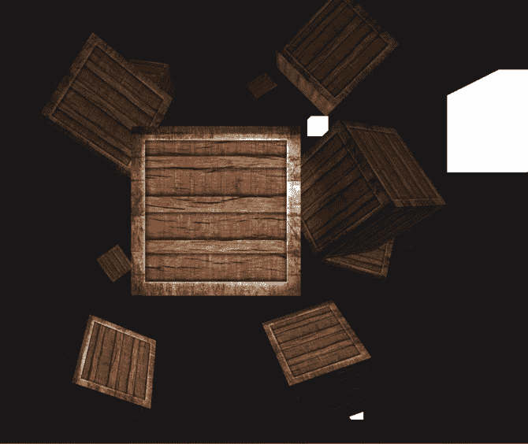

我们有多个光源，其中四个是点光源，一个是普通的灯。我们建议你找出哪些是点光源，哪个是灯。正如你所见，我们有一个附加的聚光灯，还有一个普通的方向光。你可能认为很难分辨出哪种光是什么，在现实世界中通常也是如此。光会影响我们周围的一切，这就是它在游戏中的工作方式。现在，如果你试图远离物体，我们的聚光灯实际上已经不再影响立方体了，但它仍然在那里，如下面的截图所示：


随着我们越来越接近它，它开始影响物体：

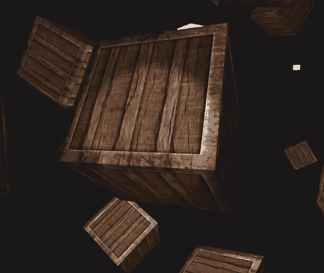

看起来很酷，可以看到效果是如何与其他光源结合的。所以，这就是结合方向光、点光和聚光灯的方法。这一章有很多冗长的代码，但我们已经在前面的章节中做了很多。

# 摘要

在这一章中，我们讨论了不同类型的光源，如方向光、点光和聚光灯。然后我们学习了如何将这些光源和光照效果结合起来，以在我们的游戏世界中生成逼真的光照。

在下一章中，我们将讨论立方体贴图，并学习如何为我们游戏生成天空盒。
