# Hello Qt

Qt 是一个成熟而强大的框架，可在多种平台上交付复杂的应用程序。它被广泛应用于嵌入式设备，包括电视、卫星机顶盒、医疗设备、汽车仪表板等。它在 Linux 世界中也有丰富的历史，KDE 和 Sailfish OS 广泛使用它，许多应用程序也是使用 Qt 开发的。在过去几年中，它在移动领域也取得了巨大进展。然而，在 Microsoft Windows 和 Apple Mac OS X 世界中，C#/.NET 和 Objective-C/Cocoa 的主导地位意味着 Qt 经常被忽视。

本书旨在演示 Qt 框架的强大和灵活性，并展示如何编写应用程序一次并部署到多个操作系统桌面上。我们将从头开始构建一个完整的现实世界的**业务线**（**LOB**）解决方案，包括独立的库、用户界面和单元测试项目。

我们将介绍如何使用 QML 构建现代、响应式的用户界面，并将其与丰富的 C++类连接起来。我们将使用 QMake 控制项目配置和输出的每个方面，包括平台检测和条件表达式。我们将构建“自我意识”的数据实体，可以将自己序列化到 JSON 并从中反序列化。我们将在数据库中持久化这些数据实体，并学习如何查找和更新它们。我们将访问互联网并消费 RSS 源。最后，我们将生成一个安装包，以便将我们的应用程序部署到其他机器上。

在这一章中，我们将安装和配置 Qt 框架以及相关的**集成开发环境**（**IDE**）Qt Creator。我们将创建一个简单的草稿应用程序，我们将在本书的其余部分中使用它来演示各种技术。我们将涵盖以下主题：

+   安装 Qt

+   维护你的安装

+   Qt Creator

+   草稿项目

+   qmake

# 安装 Qt

让我们首先访问 Qt 网站[`www.qt.io`](https://www.qt.io/)：

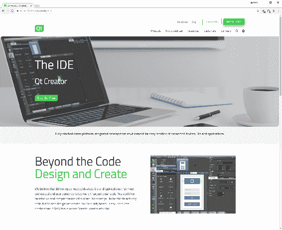

网站布局经常变化，但你要找的是下载桌面和移动端的 Qt 开源版本：

1.  从顶级菜单中选择产品，然后选择 IDE 和工具

1.  点击免费开始

1.  选择桌面和移动应用程序

1.  点击获取你的开源软件包

如果你继续在这些个人项目之外使用 Qt，请确保阅读 Qt 网站上提供的许可信息（[`www.qt.io/licensing/`](https://www.qt.io/licensing/)）。如果你的项目范围需要或者你想要访问官方 Qt 支持和与 Qt 公司的紧密战略关系的好处，升级到商业 Qt 许可证。

该网站将检测你的操作系统并建议一个推荐的下载：

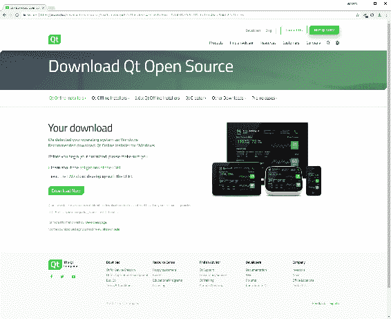

在 Windows 上，你将被推荐使用在线安装程序`*.exe`文件，而在 Linux 上，你将被提供一个`*.run`文件，如果你使用 Mac OS X，则会提供一个`.dmg`文件。在所有情况下，下载并启动安装程序：

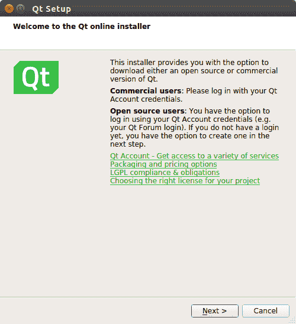

在 Linux 上，一旦下载完成，你可能需要首先转到`*.run`文件并将其标记为可执行，以便能够启动它。要做到这一点，右键单击文件管理器中的文件，然后单击属性。单击权限选项卡，选中“允许作为程序执行文件”的复选框。

在初始的欢迎对话框之后，你首先看到的是注册或使用 Qt 账户登录的选项。如果你愿意，可以随意创建一个，但现在我们将继续跳过：

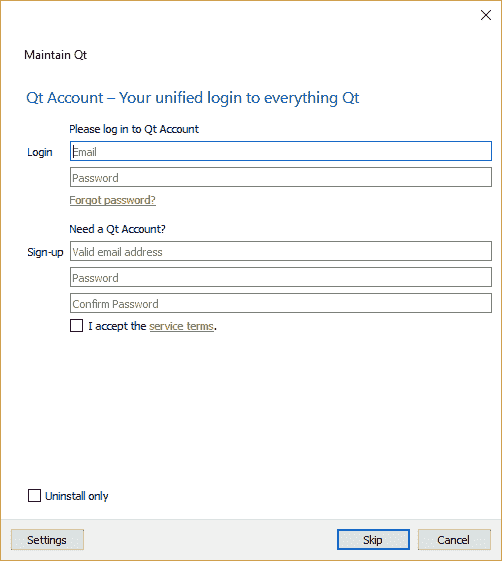

然后会要求你选择要安装的组件。

你的第一个决定是你想要哪个版本的 Qt 框架。你可以同时安装多个版本。让我们选择最新和最好的（写作时的 Qt 5.10），并取消选择所有旧版本。

接下来，展开所选版本，你会看到一个次要的选项列表。所有描述为“Qt 5.9.x 预构建组件...”的选项都被称为**工具包**。工具包本质上是一组工具，使你能够使用特定的编译器/链接器构建你的应用程序，并在特定的目标架构上运行它。每个工具包都带有专门为该特定工具集编译的 Qt 框架二进制文件以及必要的支持文件。请注意，工具包不包含所引用的编译器；你需要提前安装它们。在 Windows 上的一个例外是 MinGW（包括 Windows 的 GCC），你可以选择通过底部的工具组件列表安装。

在 Windows 上，我们将选择 MinGW 5.3.0 32 位工具包，还有来自工具部分的 MinGW 5.3.0 开发环境。在我的（64 位）机器上，我已经安装了 Microsoft Visual Studio 2017，所以我们还会选择 MSVC 2017 64 位工具包，以帮助在本书后面演示一些技术。在 Linux 上，我们选择 GCC 64 位，而在 Mac OS 上，我们选择 macOS 64 位（使用 Clang 编译器）。请注意，在 Mac OS 上，你必须安装 XCode，并且最好至少启动一次 XCode，让它有机会完成初始化和配置。

随意暂停，安装任何其他 IDE 或编译器，然后回来选择相匹配的工具包。你选择哪个并不太重要——本书中介绍的技术适用于任何工具包，只是结果可能略有不同。请注意，你所看到的可用工具包将取决于你的操作系统和芯片组；例如，如果你使用的是 32 位机器，就不会提供 64 位工具包。

在工具包下面是一些可选的 Qt API（如 Qt Charts），在本书涉及的主题中我们不需要，但如果你想探索它们的功能，可以随意添加。请注意，它们可能与核心 Qt 框架有不同的许可协议。

无论工具包和 API，你会注意到在工具部分，Qt Creator 是默认安装的 IDE，这也是我们在本书中将要使用的 IDE。

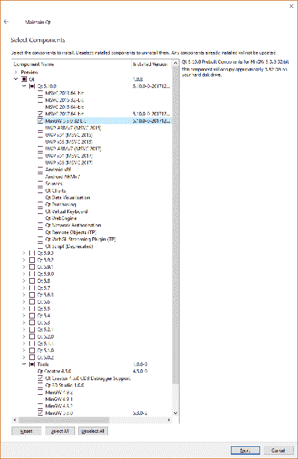

完成选择后，点击下一步和更新开始安装。

通常最好将安装位置保持默认以保持机器的一致性，但随意选择任何你想要安装的位置。

# 维护你的安装

安装后，你可以通过位于你安装 Qt 的目录中的`维护工具`应用程序来更新、添加和删除组件（甚至整个 Qt 安装）。

启动这个工具基本上和我们第一次安装 Qt 时的体验是一样的。添加或移除组件选项是你想要添加之前可能不需要的项目，包括工具包甚至是全新的框架发布。除非你主动取消选择，已经安装在系统上的组件不会受到影响。

# Qt Creator

虽然 Qt Creator 的详细概述超出了本书的范围（Qt Creator 手册可以通过帮助模式访问，如此处所述），但在我们开始第一个项目之前，快速浏览一下是值得的，所以启动新安装的应用程序，我们来看一下：

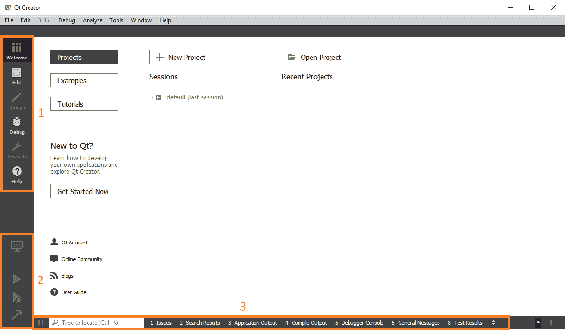

在左上角（1）是应用程序的不同区域或模式：

+   欢迎模式是 Qt Creator 启动时的默认模式，是创建或打开项目的起点。有一套广泛的示例，帮助展示框架的各种功能，以及一些教程视频的选择。

+   编辑模式是您将花费绝大部分时间的地方，用于编辑各种基于文本的文件。

+   设计仅在打开 UI 文件时可访问，并且是用于视图的所见即所得编辑器。虽然对 UX 设计和基本布局工作很有用，但它可能会很快变得令人沮丧，因此我们将在编辑模式下进行所有 QML 工作。以这种方式工作有助于理解 QML（因为你必须编写它），并且还具有编辑器不添加不需要的代码的优势。

+   调试模式用于调试应用程序，超出了本书的范围。

+   项目模式是管理项目配置的地方，包括构建设置。在此处进行的更改将反映在`*.pro.user`文件中。

+   帮助模式带您进入 Qt Creator 手册和 Qt 库参考。

在识别的 Qt 符号上按下*F1*将自动打开该符号的上下文相关帮助。

在下面，我们有构建/运行工具（2）：

+   Kit/Build 让您选择您的工具包并设置构建模式

+   运行构建并在不进行调试的情况下运行应用程序

+   开始调试构建并使用调试器运行应用程序（请注意，您必须在所选工具包中安装和配置调试器才能使用此功能）

+   构建项目构建应用程序而不运行它

在底部（3），我们有一个搜索框，然后是几个输出窗口：

问题显示任何警告或错误。对于与您的代码相关的编译器错误，双击该项将导航到相关的源代码。

+   搜索结果让您在各种范围内查找文本的出现。*Ctrl *+ *F*会带出一个快速搜索，然后从那里选择*高级…*也会带出搜索结果控制台。

+   应用程序输出是控制台窗口；所有来自应用程序代码的输出，如`std::`cout 和 Qt 的等效`qDebug()`，以及 Qt 框架的某些消息都会显示在这里。

+   编译输出包含来自构建过程的输出，从 qmake 到编译和链接。

+   调试器控制台包含我们在本书中不会涉及的调试信息。

+   常规消息包含其他杂项输出，其中最有用的是来自`*.pro`文件的 qmake 解析，我们稍后会看到。

搜索框真的是一个隐藏的宝石，可以帮助您避免点击无尽的文件和文件夹，试图找到您要找的东西。您可以在框中开始输入要查找的文件名，然后会出现一个带有所有匹配文件的过滤列表。只需单击您想要的文件，它就会在编辑器中打开。不仅如此，您还可以应用大量的过滤器。单击光标放在空的搜索框中，它会显示一个可用过滤器的列表。例如，过滤器`m`会搜索 C++方法。所以，假设您记得写了一个名为`SomeAmazingFunction()`的方法，但不记得它在哪里，只需转到搜索框，开始输入`m Some`，它就会出现在过滤列表中。

在编辑模式下，布局会略有变化，并且会出现一些新的窗格。最初它们将是空的，但一旦打开项目，它们将类似于以下内容：

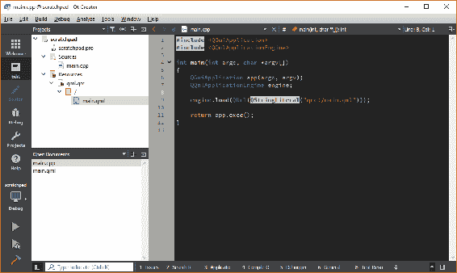

在导航栏旁边是项目资源管理器，您可以使用它来浏览解决方案的文件和文件夹。下面的窗格是您当前打开的所有文档的列表。右侧的较大区域是编辑器窗格，您可以在其中编写代码和编辑文档。

在项目资源管理器中双击文件通常会在编辑器窗格中打开它并将其添加到打开的文档列表中。单击打开文档列表中的文档将在编辑器窗格中激活它，而单击文件名右侧的小 x 将关闭它。

窗格可以更改以显示不同的信息，调整大小，分割，关闭，并可能使用标题中的按钮过滤或与编辑器同步。尝试一下，看看它们能做什么。

正如你所期望的，现代 IDE 的外观和感觉是非常可定制的。选择工具 > 选项…来查看可用的选项。我通常编辑以下内容：

+   环境 > 接口 > 主题 > 平面

+   `文本编辑器 > 字体和颜色 > 颜色方案 > 我自己的方案`

+   `文本编辑器 > 完成 > 用括号包围文本选择 > 关闭`

+   `文本编辑器 > 完成 > 用引号包围文本选择 > 关闭`

+   `C++ > 代码风格 > 当前设置 > 复制…然后编辑…`

+   `编辑代码风格 > 指针和引用 > 绑定到类型名称 > 打开（其他选项关闭）`

玩弄一下，把东西弄得你喜欢。

# 草稿项目

为了演示 Qt 项目可以有多简单，并给我们一个编程沙盒来玩耍，我们将创建一个简单的草稿项目。对于这个项目，我们甚至不会使用 IDE 来为我们做，这样你就可以真正看到项目是如何建立起来的。

首先，我们需要创建一个根文件夹来存储所有的 Qt 项目。在 Windows 上，我使用`c:\projects\qt`，而在 Linux 和 Mac OS 上我使用`~/projects/qt`。在任何你喜欢的地方创建这个文件夹。

请注意，文件同步工具（OneDrive，DropBox 等）有时会导致项目文件夹出现问题，因此请将项目文件保存在常规的未同步文件夹中，并使用远程存储库进行版本控制以进行备份和共享。

在本书的其余部分，我会宽松地将这个文件夹称为`<Qt 项目>`或类似的。我们也倾向于使用 Unix 风格的/分隔符来表示文件路径，而不是 Windows 风格的反斜杠`\`。因此，对于使用 Windows 的读者，`<Qt 项目>/scratchpad/amazing/code`等同于`c:\projects\qt\scratchpad\amazing\code`。Qt 也倾向于使用这种约定。

同样，本书中大部分截图将来自 Windows，因此 Linux/Mac 用户应将任何关于`c:\projects\qt`的引用解释为`~/projects/qt`。

在我们的 Qt 项目文件夹中，创建一个名为 scratchpad 的新文件夹并进入其中。创建一个名为`scratchpad.pro`的新纯文本文件，记得删除操作系统可能想要为你添加的任何`.txt`扩展名。

接下来，只需双击该文件，它将在 Qt Creator 中打开：

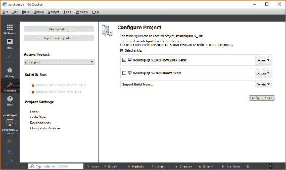

在这里，Qt Creator 问我们如何配置我们的项目，即在构建和运行代码时我们想要使用哪些工具包。选择一个或多个可用的工具包，然后点击配置项目。您可以随后轻松添加和删除工具包，所以不用担心选择哪个。

如果你切换回到`文件系统`，你会看到 Qt Creator 已经为我们创建了一个名为`scratchpad.pro.user`的新文件。这只是一个包含配置信息的 XML 文件。如果你删除这个文件并再次打开`.pro`文件，你将被提示再次配置项目。正如它的名字所暗示的那样，配置设置与本地用户有关，所以通常如果你加载了别人创建的项目，你也需要通过配置项目步骤。

成功配置项目后，您将看到项目已经打开，即使是一个完全空的`.pro`文件。这就是一个项目可以变得多么简单！

回到`文件系统`，创建以下纯文本文件：

+   `main.cpp`

+   `main.qml`

+   `qml.qrc`

我将逐个查看这些文件，解释它们的目的，并很快添加它们的内容。在现实世界的项目中，我们当然会使用 IDE 为我们创建文件。事实上，当我们创建主解决方案文件时，这正是我们要做的。然而，以这种方式做的目的是向您展示，归根结底，项目只是一堆文本文件。永远不要害怕手动创建和编辑文件。许多现代 IDE 可能会通过一个又一个的菜单和永无止境的选项窗口使人困惑和复杂化。Qt Creator 可能会错过其他 IDE 的一些高级功能，但它非常简洁和直观。

创建了这些文件后，在项目窗格中双击 `scratchpad.pro` 文件，我们将开始编辑我们的新项目。

# qmake

我们的项目（`.pro`）文件由一个名为 **qmake** 的实用程序解析，它生成驱动应用程序构建的 `Makefiles`。我们定义了我们想要的项目输出类型，包括哪些源文件以及依赖关系等等。我们现在将在项目文件中简单地设置变量来实现这些。

将以下内容添加到 `scratchpad.pro`：

```cpp
TEMPLATE = app

QT += qml quick

CONFIG += c++14
SOURCES += main.cpp
RESOURCES += qml.qrc
```

让我们依次浏览每一行：

```cpp
TEMPLATE = app
```

`TEMPLATE` 告诉 qmake 这是什么类型的项目。在我们的情况下，它是一个可执行应用程序，由 `app` 表示。我们感兴趣的其他值是用于构建库二进制文件的 `lib` 和用于多项目解决方案的 `subdirs`。请注意，我们使用 `=` 运算符设置变量：

```cpp
QT += qml quick
```

Qt 是一个模块化框架，允许您只引入您需要的部分。`QT` 标志指定我们想要使用的 Qt 模块。*core* 和 *gui* 模块默认包含在内。请注意，我们使用 `+=` 将附加值追加到期望列表的变量中：

```cpp
CONFIG += c++14
```

`CONFIG` 允许您添加项目配置和编译器选项。在这种情况下，我们指定要使用 C++14 特性。请注意，如果您使用的编译器不支持这些语言特性标志，它们将不起作用。

```cpp
SOURCES += main.cpp
```

`SOURCES` 是我们想要包含在项目中的所有 `*.cpp` 源文件的列表。在这里，我们添加了我们的空 `main.cpp` 文件，我们将在其中实现我们的 `main()` 函数。我们目前还没有，但当我们有时，我们的头文件将使用 `HEADERS` 变量指定：

```cpp
RESOURCES += qml.qrc 
```

`RESOURCES` 是项目中包含的所有资源集合文件（`*.qrc`）的列表。资源集合文件用于管理应用程序资源，如图像和字体，但对我们来说最关键的是我们的 QML 文件。

更新项目文件后，保存更改。

每当您保存对 `*.pro` 文件的更改时，qmake 将解析该文件。如果一切顺利，您将在 Qt Creator 的右下角获得一个小绿条。红色条表示某种问题，通常是语法错误。进程的任何输出都将写入“常规消息”窗口，以帮助您诊断和解决问题。空格将被忽略，所以不用担心完全匹配空行。

要让 qmake 重新审视您的项目并生成新的 `Makefiles`，请在项目窗格中右键单击您的项目，然后选择“运行 qmake”。这可能有点乏味，但在构建和运行应用程序之前手动运行 qmake 是一个好习惯。我发现某些类型的代码更改可能会“悄悄地”通过，当您运行应用程序时，它们似乎没有产生任何效果。如果您看到应用程序忽略了您刚刚进行的更改，请在每个项目上运行 qmake 并重试。如果出现虚假的链接器错误，也是同样的情况。

您会看到我们的其他文件现在神奇地出现在项目窗格中：

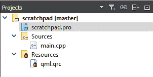

双击 `main.cpp` 进行编辑，我们将写入我们的第一行代码：

```cpp
#include <QGuiApplication>
#include <QQmlApplicationEngine>

int main(int argc, char *argv[])
{
    QGuiApplication app(argc, argv);
    QQmlApplicationEngine engine;

    engine.load(QUrl(QStringLiteral("qrc:/main.qml")));

    return app.exec();
}
```

我们在这里所做的就是实例化一个 Qt GUI 应用程序对象，并要求它加载我们的`main.qml`文件。这非常简短和简单，因为 Qt 框架为我们做了所有复杂的底层工作。我们不必担心平台检测或管理窗口句柄或 OpenGL。

可能最有用的事情之一是学会将光标放在 Qt 对象中，然后按下*F1*将打开该类型的帮助。对于 Qt 对象上的方法和属性也是如此。在帮助文件中查看`QGuiApplication`和`QQmlApplicationEngine`是关于什么的。

要编辑项目中的下一个文件`qml.qrc`，您需要右键单击并选择要打开它的编辑器。默认是资源编辑器。

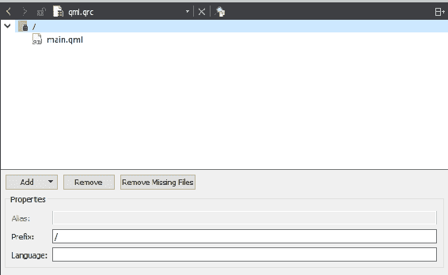

我个人不喜欢这个编辑器。我觉得它并没有比纯文本编辑更容易，也不是特别直观。关闭它，选择`以纯文本编辑器打开`。

添加以下内容：

```cpp
<RCC>
    <qresource prefix="/">
        <file>main.qml</file>
    </qresource>
</RCC>
```

回到`main.cpp`，我们要求 Qt 加载`qrc:/main.qml`文件。这基本上可以解释为“在具有前缀`/`和名称`main.qml`的`qrc`文件中查找文件”。现在在我们的`qrc`文件中，我们创建了一个具有前缀属性`/`的`qresource`元素。在这个元素内部，我们有一个资源集合（尽管只有一个），它的名称是`main.qml`。将`qrc`文件视为一个可移植的文件系统。请注意，资源文件相对于引用它们的`.qrc`文件而言。在这种情况下，我们的`main.qml`文件与我们的`qml.qrc`文件在同一个文件夹中。例如，如果它在名为`views`的子文件夹中，那么`qml.qrc`中的行将是这样的：

```cpp
<file>views/main.qml</file>
```

同样，在`main.cpp`中的字符串将是`qrc:/views/main.qml`。

保存这些更改后，您将看到我们空的`main.qml`文件出现在项目窗格中`qml.qrc`文件的子文件夹中。双击该文件进行编辑，我们将完成我们的项目：

```cpp
import QtQuick 2.9
import QtQuick.Window 2.3

Window {
    visible: true
    width: 1024
    height: 768
    title: qsTr("Scratchpad")
    color: "#ffffff"

    Text {
        id: message
        anchors.centerIn: parent
        font.pixelSize: 44
        text: qsTr("Hello Qt Scratchpad!")
        color: "#008000"
    }
}
```

我们将在第二章中详细介绍 QML，*项目结构*，但简而言之，这个文件代表了应用程序启动时向用户呈现的屏幕或视图。

导入行类似于 C++中的`#include`语句，不过不是包含单个头文件，而是导入整个模块。在这种情况下，我们希望使用基本的 QtQuick 模块来访问所有核心的 QML 类型，还有 QtQuick 窗口模块来访问`Window`组件。模块是有版本的，通常情况下，你会想要使用你所使用的 Qt 版本的最新版本。当前的版本号可以在 Qt 文档中找到。请注意，尽管在输入版本号时会有代码补全，但有时呈现的选项并不反映最新可用的版本。

正如其名称所示，`Window`元素为我们提供了一个顶级窗口，在其中我们的所有其他内容将被呈现。我们给它一个大小为 1024 x 765 像素，一个标题为“scratchpad”，以及一个白色的背景颜色，用十六进制 RGB 值表示。

在该组件中（QML 是一种分层标记语言），我们使用`Text`组件添加了一个欢迎消息。我们将文本居中显示在屏幕上，并设置了字体大小和颜色，但除此之外，在这个阶段我们不关心花哨的格式或其他任何东西，所以这就是我们会做的复杂程度。我们稍后会更详细地介绍这个，所以如果看起来有点陌生，不要担心。

就是这样。要构建和运行我们令人惊叹的新应用程序，首先使用左下角的监视器图标选择您想要的工具包和构建配置：

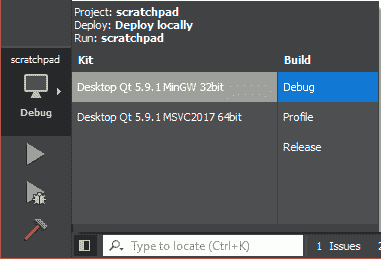

接下来，在项目窗格中右键单击项目名称，然后选择运行 qmake。完成后，使用绿色播放图标运行应用程序：

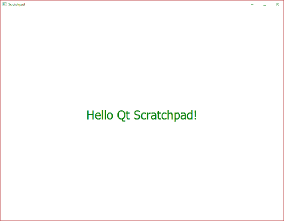

# 总结

在本章中，我们下载、安装和配置了 Qt。我们快速浏览了 Qt Creator IDE，尝试了它的选项，并了解了如何使用它编辑各种文件。我们对 qmake 有了初步了解，并看到了创建项目是多么简单，从而使事情变得不再神秘。最后，我们从头开始构建了我们的处女作品（弱笑话打算），并在屏幕上得到了必不可少的“Hello World”消息。

在第二章 *项目结构*中，我们将在这些基础上建立，并设置我们的主要解决方案。
