# 第二章：项目结构

在本章中，我们将创建一个新的多项目解决方案，这将是我们示例应用程序的基础。我们将应用模型视图控制器模式，将用户界面和业务逻辑分离。我们还将介绍 Qt 的单元测试框架—QtTest，并演示如何将其集成到我们的解决方案中。我们将在本章中涵盖以下内容：

+   项目、MVC 和单元测试

+   创建库项目

+   创建单元测试项目

+   创建用户界面项目

+   掌握 MVC

+   QObject 基类

+   QML

+   控制项目输出

# 项目、MVC 和单元测试

我们在上一章中构建的草稿应用是一个 Qt 项目，由一个`.pro`文件表示。在商业环境中，技术解决方案通常作为公司倡议的一部分开发，这些倡议通常也被称为**项目**。为了尽量减少混淆（和项目出现的次数！），我们将使用项目来表示由`.pro`文件定义的 Qt 项目，倡议一词用来指代商业意义上的项目。

我们将要开展的倡议是一个通用的客户管理系统。它将是一个可以调整和重新用于多个应用程序的东西—供应商管理客户、卫生服务管理患者等。它将执行现实世界**业务线**（**LOB**）应用程序中一遍又一遍发现的常见任务，主要是添加、编辑和删除数据。

我们的草稿应用完全封装在一个项目中。对于较小的应用程序，这是完全可行的。然而，对于较大的代码库，特别是涉及多个开发人员的情况，通常最好将事情分解成更易管理的部分。

我们将使用超轻量级的**模型视图控制**（**MVC**）架构模式的实现。如果你之前没有接触过 MVC，它主要用于将业务逻辑与用户界面解耦。用户界面（视图）向一个类似于交换机的类（控制器）传达命令，以检索数据并执行所需的操作。控制器反过来将数据、逻辑和规则的责任委托给数据对象（模型）：

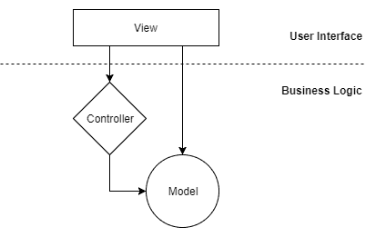

关键是**视图**知道**控制器**和**模型**，因为它需要向**控制器**发送命令并显示**模型**中保存的数据。**控制器**知道**模型**，因为它需要将工作委托给它，但它不知道**视图**。模型对**控制器**或**视图**一无所知。

在商业环境中以这种方式设计应用程序的一个关键好处是，专门的用户体验专家可以在视图上工作，而程序员可以在业务逻辑上工作。第二个好处是，因为业务逻辑层对 UI 一无所知，所以你可以添加、编辑，甚至完全替换用户界面而不影响逻辑层。一个很好的用例是为桌面应用程序拥有“全功能”UI，为移动设备拥有一个伴侣“半功能”UI，两者都可以使用相同的业务逻辑。考虑到所有这些，我们将把我们的 UI 和业务逻辑物理上分开成两个项目。

我们还将研究如何将自动化单元测试集成到我们的解决方案中。单元测试和**测试驱动开发**（**TDD**）在最近变得非常流行，当在商业环境中开发应用程序时，你很可能会被要求在编写代码时编写单元测试。如果没有，你应该提议这样做，因为它具有很大的价值。如果你以前没有进行过单元测试，不要担心；它非常简单，我们将在本书的后面更详细地讨论它。

最后，我们需要一种方法来将这些子项目聚合在一起，以便我们不必单独打开它们。我们将通过一个伞解决方案项目来实现这一点，该项目除了将其他项目绑在一起外，什么也不做。这就是我们将布置我们的项目的方式：

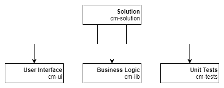

# 项目创建

在上一章中，我们看到了通过创建一些文本文件来设置新项目是多么容易。但是，我们将使用 Qt Creator 创建我们的新解决方案。我们将使用新项目向导来引导我们创建一个顶级解决方案和一个单个子项目。

从顶部菜单中，选择文件>新文件或项目，然后选择项目>其他项目>Subdirs 项目，然后单击“选择...”：

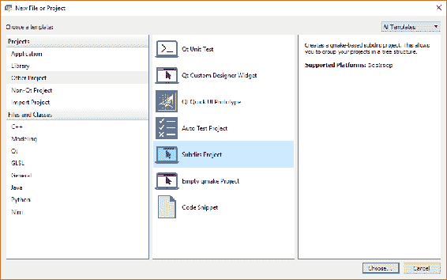

Subdirs Project 是我们需要的顶级解决方案项目的模板。将其命名为`cm`，并在我们的`qt`项目文件夹中创建：

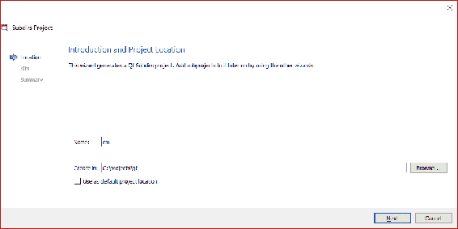

在 Kit Selection 窗格中，选中我们安装的 Desktop Qt 5.10.0 MinGW 32 位套件。如果您已安装其他套件，可以随意选择要尝试的其他套件，但这并非必需。然后单击“下一步”：

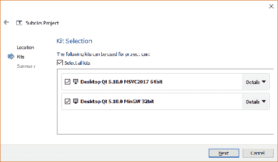

如前所述，版本控制超出了本书的范围，因此在项目管理窗格中，从“添加到版本控制”下拉菜单中选择“无”。然后单击“完成并添加子项目”：

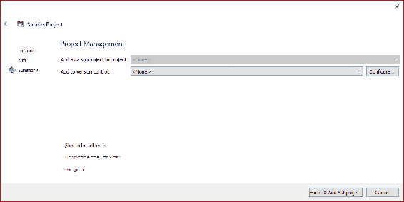

我们将把用户界面项目作为第一个子项目添加。向导遵循的步骤与我们刚刚遵循的步骤更多或更少相同，因此执行以下操作：

1.  选择项目>应用程序>Qt Quick 应用程序-空，并单击“选择...”

1.  在项目位置对话框中，将其命名为`cm-ui`（用于客户端管理-用户界面），将位置保留为我们的新`cm`文件夹，然后单击“下一步”。

1.  在定义构建系统对话框中，选择构建系统 qmake，然后单击“下一步”。

1.  在定义项目详细信息对话框中，保留默认的最小 Qt 版本 QT 5.9 和未选中使用 Qt 虚拟键盘框，然后单击“下一步”。

1.  在 Kit Selection 对话框中，选择桌面 Qt 5.10.0 MinGW 32 位套件以及您希望尝试的其他套件，然后单击“下一步”。

1.  最后，在项目管理对话框中，跳过版本控制（将其保留为<无>）并单击“完成”。

我们的顶级解决方案和 UI 项目现在已经启动，所以让我们按照以下步骤添加其他子项目。接下来添加业务逻辑项目，如下所示：

1.  在“项目”窗格中，右键单击顶级`cm`文件夹，然后选择“新建子项目...”。

1.  选择项目>库> C++库，并单击“选择...”。

1.  在介绍和项目位置对话框中，选择共享库作为类型，将其命名为`cm-lib`，在`<Qt Projects>/cm`中创建它，然后单击“下一步”。

1.  在选择所需模块对话框中，只接受 QtCore 的默认设置，然后单击“下一步”。

1.  在**类信息**对话框中，我们有机会创建一个新类来帮助我们入门。给出类名`Client`，使用`client.h`头文件和`client.cpp`源文件，然后单击“下一步”。

1.  最后，在项目管理对话框中，跳过版本控制（将其保留为<无>）并单击“完成”。

最后，我们将重复这个过程来创建我们的单元测试项目：

1.  新子项目....

1.  项目>其他项目>Qt 单元测试。

1.  项目名称`cm-tests`。

1.  包括 QtCore 和 QtTest。

1.  创建`ClientTests`测试类，其中包括`testCase1`测试槽和`client-tests.cpp`文件名。将类型设置为测试，并检查生成初始化和清理代码。

1.  跳过版本控制并完成。

我们刚刚经历了很多对话框，但现在我们已经将骨架解决方案放置好了。您的项目文件夹应该如下所示：

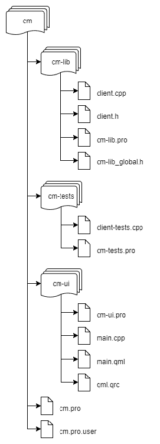

现在让我们依次查看每个项目，并在开始添加内容之前进行一些调整。

# cm-lib

首先，前往文件资源管理器，在`cm-lib`下创建一个名为`source`的新子文件夹；将`cm-lib_global.h`移动到其中。在`source`中创建另一个名为`models`的子文件夹，并将`Client`类文件都移动到其中。

接下来，在 Qt Creator 中，打开`cm-lib.pro`并编辑如下：

```cpp
QT -= gui
TARGET = cm-lib
TEMPLATE = lib
CONFIG += c++14
DEFINES += CMLIB_LIBRARY
INCLUDEPATH += source

SOURCES += source/models/client.cpp

HEADERS += source/cm-lib_global.h \
    source/models/client.h
```

由于这是一个库项目，我们不需要加载默认的 GUI 模块，因此我们使用`QT`变量将其排除。`TARGET`变量是我们希望给我们的二进制输出的名称（例如`cm-lib.dll`）。这是可选的，如果未提供，将默认为项目名称，但我们将明确指定。接下来，与我们在草稿应用程序中看到的`app`模板不同，这次我们使用`lib`来创建一个库。我们通过`CONFIG`变量添加了 c++14 特性。

`cm-lib_global.h`文件是一个有用的预处理器样板，我们可以用它来导出我们的共享库符号，您很快就会看到它的用途。我们在`DEFINES`变量中使用`CMLIB_LIBRARY`标志来触发此导出。

最后，我们稍微重写了`SOURCES`和`HEADERS`变量列表，以考虑在我们移动了一些东西之后的新文件位置，并且我们将源文件夹（这是我们所有代码的所在地）添加到`INCLUDEPATH`中，这样当我们使用`#include`语句时就可以搜索到路径。

在项目窗格中右键单击`cm-lib`文件夹，选择运行 qmake。完成后，再次右键单击并选择**重新构建**。一切应该都是绿色和愉快的。

# cm-tests

创建新的`source/models`子文件夹，并将`client-tests.cpp`移动到那里。切换回 Qt Creator 并编辑`cm-tests.pro`：

```cpp
QT += testlib
QT -= gui
TARGET = client-tests
TEMPLATE = app

CONFIG += c++14 
CONFIG += console 
CONFIG -= app_bundle

INCLUDEPATH += source 

SOURCES += source/models/client-tests.cpp
```

这基本上与`cm-lib`的方法相同，唯一的区别是我们想要一个控制台应用程序而不是一个库。我们不需要 GUI 模块，但我们将添加`testlib`模块以获取 Qt 测试功能的访问权限。

目前这个子项目还没有太多内容，但您应该能够成功运行 qmake 并重新构建。

# cm-ui

这次创建两个子文件夹：`source`和`views`。将`main.cpp`移动到`source`中，将`main.qml`移动到`views`中。将`qml.qrc`重命名为`views.qrc`，并编辑`cm-ui.pro`：

```cpp
QT += qml quick

TEMPLATE = app

CONFIG += c++14 

INCLUDEPATH += source 

SOURCES += source/main.cpp 

RESOURCES += views.qrc 

# Additional import path used to resolve QML modules in Qt Creator's code model 
QML_IMPORT_PATH = $$PWD
```

我们的 UI 是用 QML 编写的，需要`qml`和`quick`模块，所以我们添加了这些。我们编辑`RESOURCES`变量以获取我们重命名的资源文件，并编辑`QML_IMPORT_PATH`变量，我们将在进入自定义 QML 模块时详细介绍。

接下来，编辑`views.qrc`以考虑我们已将`main.qml`文件移动到`views`文件夹中。记得右键单击并选择“使用其他应用程序打开”>“纯文本编辑器”：

```cpp
<RCC>
    <qresource prefix="/">
        <file>views/main.qml</file>
    </qresource>
</RCC>
```

最后，我们还需要编辑`main.cpp`中的一行以考虑文件移动：

```cpp
engine.load(QUrl(QStringLiteral("qrc:/views/main.qml")));
```

现在，您应该能够运行 qmake 并重新构建`cm-ui`项目。在运行之前，让我们快速看一下构建配置按钮，因为现在我们有多个项目打开了：

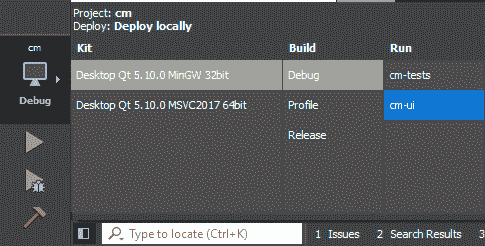

请注意，现在除了工具链和构建选项之外，我们还必须选择要运行的可执行文件。确保选择了`cm-ui`，然后运行应用程序：


确实是世界你好。这是相当令人失望的东西，但我们已经成功地构建和运行了一个多项目解决方案，这是一个很好的开始。当您无法再忍受更多乐趣时，请关闭应用程序！

# MVC 的掌握

现在我们的解决方案结构已经就位，我们将开始 MVC 实现。正如您将看到的那样，它非常简单，非常容易设置。

首先，展开`cm-ui > Resources > views.qrc > / > views`，右键单击`main.qml`，选择重命名，将文件重命名为`MasterView.qml`。如果收到有关项目编辑的消息，请选择“是”以继续：

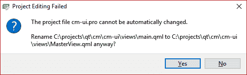

如果您收到错误消息，文件仍将在项目窗格中显示为`main.qml`，但文件在文件系统中已被重命名。

接下来，编辑`views.qrc`（右键单击它，然后选择使用纯文本编辑器打开）。将内容替换为以下内容：

```cpp
<RCC>
    <qresource prefix="/views">
        <file alias="MasterView.qml">views/MasterView.qml</file>
    </qresource>
</RCC>
```

如果您还记得我们如何在`main.cpp`中加载这个 QML 文件，语法是`qrc:<prefix><filename>`。我们以前有一个`/`前缀和一个`views/main.qml`相对文件名。这给了我们`qrc:/views/main.qml`。

`/`的前缀并不是非常描述性的。随着您添加更多的 QML 文件，将它们组织成具有有意义前缀的块会非常有帮助。拥有无结构的资源块也会使项目面板变得混乱，导航起来更加困难，就像您刚才在`views.qrc > / > views`中看到的那样。因此，第一步是将前缀从`/`重命名为`/views`。

然而，使用`/views`作为前缀和`views/main.qml`作为相对文件名，我们的 URL 现在是`qrc:/views/views/main.qml`。

这比以前更糟糕了，在`views.qrc`中我们仍然有一个深层的文件夹结构。幸运的是，我们可以为我们的文件添加一个*别名*来解决这两个问题。您可以使用资源的别名来代替相对路径，因此如果我们分配一个`main.qml`的别名，我们可以用`main.qml`来替换`views/main.qml`，得到`qrc:/views/main.qml`。

这是简洁和描述性的，我们的项目面板也更整洁了。

因此，回到我们更新后的`views.qrc`版本，我们只是将文件名从`main.qml`更新为`MasterView.qml`，与我们执行的文件重命名一致，并且我们还提供了一个快捷别名，这样我们就不必两次指定 views。

现在我们需要更新`main.cpp`中的代码以反映这些更改：

```cpp
engine.load(QUrl(QStringLiteral("qrc:/views/MasterView.qml")));
```

您应该能够运行 qmake，并构建和运行以验证没有出现问题。

接下来，我们将创建一个`MasterController`类，因此右键单击`cm-lib`项目，然后选择添加新内容… > C++ > C++类 > 选择…：

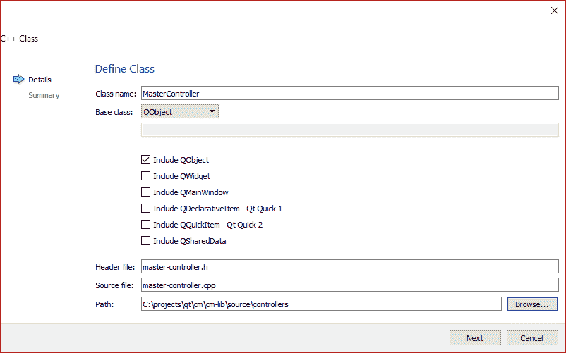

使用“浏览…”按钮创建`source/controllers`子文件夹。

通过选择 QObject 作为基类并包含它，Qt Creator 将为我们编写一些样板代码。您随后可以自己添加它，所以不要觉得这是创建新类的必要部分。

一旦您跳过了版本控制并创建了类，声明和定义如下。我们的`MasterController`目前还没有做任何特别激动人心的事情，我们只是在做基础工作。

这是`master-controller.h`：

```cpp
#ifndef MASTERCONTROLLER_H
#define MASTERCONTROLLER_H
#include <QObject>

#include <cm-lib_global.h>
namespace cm {
namespace controllers {
class CMLIBSHARED_EXPORT MasterController : public QObject
{
    Q_OBJECT
public:
    explicit MasterController(QObject* parent = nullptr);
};

}}

#endif
```

我们真正添加到 Qt Creator 默认实现的只是`CMLIBSHARED_EXPORT`宏，Qt Creator 在`cm-lib_global.h`中为我们编写的，以处理我们的共享库导出，并将类放在一个命名空间中。

我总是将项目名称作为根命名空间，然后是反映源目录中类文件物理位置的其他命名空间，所以在这种情况下，我使用`cm::controllers`，因为该类位于`source/controllers`目录中。

这是`master-controller.cpp`：

```cpp
#include "master-controller.h"

namespace cm {
namespace controllers {
MasterController::MasterController(QObject* parent)
    : QObject(parent)
{
}

}}

```

在实现文件中，我使用了一个略微不正统的风格——大多数人只是在`.cpp`文件的顶部添加`using namespace cm::controllers;`。我经常喜欢将代码放在命名空间的范围内，因为在 IDE 中可以折叠它。通过重复最内层的命名空间范围（在这个例子中是*controllers*），您可以将代码分解成可折叠的区域，就像在 C#中一样，这有助于在更大的文件中进行导航，因为您可以折叠您不感兴趣的部分。这在功能上没有任何区别，所以使用您喜欢的风格。

# QObject

那么，我们继承的这个古怪的**QObject**是什么东西？它是所有 Qt 对象的基类，并且它为我们提供了一些强大的功能。

QObjects 将自己组织成对象层次结构，*parent*对象承担其*child*对象的所有权，这意味着我们不必太担心内存管理。例如，如果我们有一个从 QObject 派生的 Client 类的实例，它是从 QObject 派生的 Address 的父类，那么当客户端被销毁时，地址会自动被销毁。

QObjects 携带元数据，允许一定程度的类型检查，并且是与 QML 交互的支柱。它们还可以通过事件订阅机制相互通信，其中事件被发射为*signals*，订阅的代理被称为*slots*。

现在您需要记住的是，对于您编写的任何自定义类，如果您希望在 UI 中与之交互，请确保它派生自 QObject。每当您从 QObject 派生时，请确保在做任何其他事情之前始终向您的类添加神奇的 Q_OBJECT 宏。它注入了一堆超级复杂的样板代码，您不需要理解就可以有效地使用 QObjects。

我们现在需要引用一个子项目（`cm-lib`中的`MasterController`）中的代码到另一个子项目（`cm-ui`）中。我们首先需要能够访问我们的`#include`语句的声明。编辑`cm-ui.pro`中的`INCLUDEPATH`变量如下：

```cpp
INCLUDEPATH += source \
    ../cm-lib/source
```

`\`符号是“继续到下一行”的指示符，因此您可以将一个变量设置为跨越多行的多个值。就像控制台命令一样，‘..’表示向上遍历一个级别，所以这里我们从本地文件夹（`cm-ui`）中跳出，然后进入`cm-lib`文件夹以获取其源代码。您需要小心，项目文件夹保持相对位置不变，否则这将无法工作。

紧接着，我们将告诉我们的 UI 项目在哪里找到我们的库项目的实现（已编译的二进制文件）。如果您查看与顶级`cm`项目文件夹并排的文件系统，您会看到一个或多个构建文件夹，例如，build-cm-Desktop_Qt_5_9_0_MinGW_32bit-Debug。每个文件夹在为给定的工具包和配置运行 qmake 时创建，并在构建时填充输出。

接下来，导航到与您正在使用的工具包和配置相关的文件夹，您会发现一个带有另一个配置文件夹的 cm-lib 文件夹。复制这个文件路径；例如，我正在使用 MinGW 32 位工具包进行调试配置，所以我的路径是`<Qt Projects>/build-cm-Desktop_Qt_5_10_0_MinGW_32bit-Debug/cm-lib/debug`。

在那个文件夹中，您会找到与您的操作系统相关的已编译二进制文件，例如，在 Windows 上是`cm-lib.dll`。这是我们希望我们的`cm-ui`项目引用的`cm-lib`库实现的文件夹。为了设置这一点，将以下语句添加到`cm-ui.pro`中：

```cpp
LIBS += -L$$PWD/../../build-cm-Desktop_Qt_5_10_0_MinGW_32bit-Debug/cm-lib/debug -lcm-lib
```

`LIBS`是用于向项目添加引用库的变量。`-L`前缀表示目录，而`-l`表示库文件。使用这种语法允许我们忽略文件扩展名（`.a`，`.o`，`.lib`）和前缀（lib...），这些可能因操作系统而异，让 qmake 自行解决。我们使用特殊的`$$`符号来访问`PWD`变量的值，该变量包含当前项目的工作目录（在这种情况下是`cm/cm-ui`的完整路径）。然后，我们从该位置向上两个目录，使用`../..`来到 Qt 项目文件夹。然后，我们再次向下钻取到我们知道`cm-lib`二进制文件构建的位置。

现在，这个写起来很痛苦，丑陋得要命，一旦我们切换工具包或配置，它就会崩溃，但我们稍后会回来整理所有这些。项目引用都已连接好，我们可以前往`cm-ui`中的`main.cpp`。

为了能够在 QML 中使用给定的类，我们需要在创建 QML 应用程序引擎之前在`main()`中注册它。首先，包括`MasterController`：

```cpp
#include <controllers/master-controller.h>
```

然后，在实例化`QGuiApplication`之后但在声明`QQmlApplicationEngine`之前，添加以下行：

```cpp
qmlRegisterType<cm::controllers::MasterController>("CM", 1, 0, "MasterController");
```

我们在这里所做的是将类型注册到 QML 引擎中。请注意，模板参数必须使用所有命名空间进行完全限定。我们将类型的元数据添加到一个名为 CM 的模块中，版本号为 1.0，并且我们希望在 QML 标记中将此类型称为`MasterController`。

然后，我们实例化`MasterController`的一个实例，并将其注入到根 QML 上下文中：

```cpp
cm::controllers::MasterController masterController;

QQmlApplicationEngine engine;
engine.rootContext()->setContextProperty("masterController", &masterController);
engine.load(QUrl(QStringLiteral("qrc:/views/MasterView")));
```

请注意，在加载 QML 文件之前，您需要设置上下文属性，并且还需要添加以下标头：

```cpp
#include <QQmlContext>
```

因此，我们已经创建了一个控制器，将其注册到了 QML 引擎中，并且一切就绪。现在呢？让我们开始我们的第一段 QML。

# QML

**Qt 建模语言**（**QML**）是一种用于用户界面布局的分层声明性语言，其语法类似于**JavaScript 对象表示法**（**JSON**）。它可以通过 Qt 的元对象系统绑定到 C++对象，并且还支持内联 JavaScript。它很像 HTML 或 XAML，但没有 XML 的繁琐。如果你更喜欢 JSON 而不是 XML，这只能是一件好事！

继续打开`MasterView.qml`，我们将看到发生了什么。

您将看到的第一件事是一对`import`语句。它们类似于 C++中的`#include`语句，它们引入了我们想要在视图中使用的功能部分。它们可以是打包和版本化的模块，如 QtQuick 2.9，也可以是指向本地内容的相对路径。

接下来，QML 层次结构从一个 Window 对象开始。对象的范围由随后的{}表示，因此括号内的所有内容都是对象的属性或子对象。

属性遵循 JSON 属性语法，形式为 key: value。一个显着的区别是，除非您提供字符串文字作为值，否则不需要引号。在这里，我们将窗口对象的`visible`属性设置为`true`，窗口的大小设置为 640 x 480 像素，并在标题栏中显示 Hello World。

让我们更改标题并添加一个简单的消息。将 Hello World 的标题更改为 Client Management，并在窗口的正文中插入一个 Text 组件：

```cpp
Window {
    visible: true
    width: 640
    height: 480
    title: qsTr("Client Management")

    Text {
        text: "Welcome to the Client Management system!"
    }
}
```

保存您的更改，并运行 qmake 并运行应用程序：

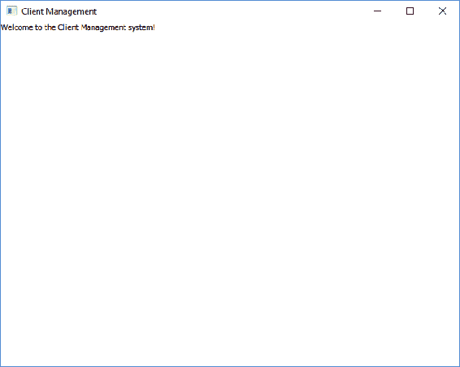

让我们让`MasterController`开始发挥作用，而不是在 UI 中硬编码我们的欢迎消息，我们将从我们的控制器动态获取它。

编辑`master-controller.h`，并添加一个名为`welcomeMessage`的新的`QString`类型的公共属性，并将其设置为初始值：

```cpp
QString welcomeMessage = "This is MasterController to Major Tom";
```

你还需要`#include <QString>`。

为了能够从 QML 访问此成员，我们需要配置一个新的属性。在 Q_OBJECT 宏之后但在第一个公共访问修饰符之前，添加以下内容：

```cpp
Q_PROPERTY( QString ui_welcomeMessage MEMBER welcomeMessage CONSTANT )
```

在这里，我们正在创建一个新的`QString`类型的属性，QML 可以访问。QML 将把属性称为`ui_welcomeMessage`，在调用时，将获取（或设置）`MEMBER`变量中称为`welcomeMessage`的值。我们明确地设置了变量的值，并且不会更改它，因此它将保持`CONSTANT`。

您可以简单地将属性命名为`welcomeMessage`，而不是`ui_welcomeMessage`。我个人偏好于明确地为仅用于 UI 消耗的事物添加 ui_ 前缀，以将其与成员变量和方法区分开。做适合您的事情。

返回`MasterView.qml`，我们将使用这个属性。将`Text`组件的`text`属性更改为以下内容：

```cpp
text: masterController.ui_welcomeMessage
```

注意 QML 编辑器如何识别`masterController`，甚至为其提供代码完成。现在，QML 不再显示字符串文字作为消息，而是访问我们在`main()`中注入到根上下文中的`MasterController`实例的`ui_welcomeMessage`属性，这将进而获取`welcomeMessage`成员变量的值。

构建和运行，现在您应该能够看到来自`MasterController`的消息：

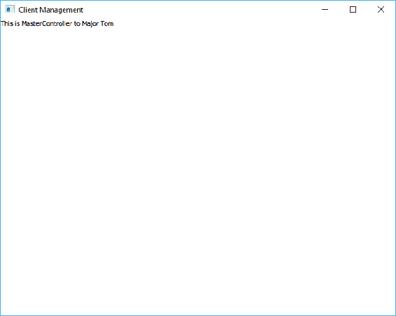

我们现在有了一个让 QML 调用 C++代码并获取我们想要提供的任何数据和业务逻辑的工作机制。在这里，需要注意的一点是我们的`MasterController`对`MasterView`的存在一无所知，这是 MVC 模式的关键部分。

# 项目输出

为了让我们的`cm-ui`项目知道在哪里找到`cm-lib`的实现，我们在项目文件中使用了`LIBS`变量。这是一个相当丑陋的文件夹名，但只有一行，一切都运行得很完美，所以很容易就会让事情保持原样。然而，期待着当我们准备好为测试或者生产制作我们的第一个构建时。我们编写了一些非常聪明的代码，一切都构建和运行得很好。我们将配置从 Debug 切换到 Release 然后...一切都垮掉了。问题在于我们在项目文件中硬编码了库路径，以便在`Debug`文件夹中查找。切换到不同的套件或另一个操作系统，问题会更糟，因为使用不同的编译器会导致二进制兼容性问题。

让我们设定一些目标：

+   摆脱笨重的`build-cm…`文件夹

+   将所有编译后的二进制输出聚合到一个共同的文件夹`cm/binaries`

+   将所有临时构建工件隐藏在它们自己的文件夹`cm/<project>/build`

+   为不同的编译器和架构创建单独的构建和二进制文件夹

+   自动检测这些编译器和架构

那么，这些有趣的长文件夹名字首先是从哪里来的呢？在 Qt Creator 中，点击导航栏中的项目模式图标。在左侧的构建和运行部分，选择桌面 Qt 5.9.0 MinGW 32 位 > 构建。在这里，您将看到此解决方案中 MinGW 套件的构建设置，并在影子构建复选框下，您将认出长的构建目录。

我们需要保持影子构建的启用，因为这使我们能够对不同的套件执行构建到替代位置的能力。我们将在`.pro`文件中控制我们构建的确切输出，但我们仍然需要在这里指定一个构建目录，以使 Qt Creator 保持愉快。输入<Qt Projects>/shadow-builds。使用窗格顶部的下拉菜单重复此设置，为每个构建配置(Debug/Release/Profile)和您正在使用的所有套件：

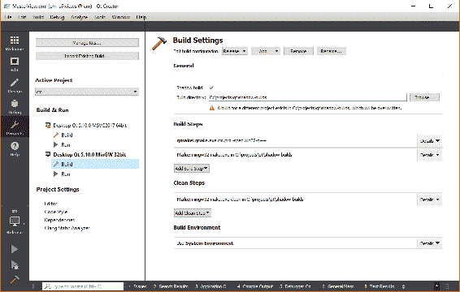

在您的文件系统中，删除任何旧的`build-cm…`文件夹。右键单击解决方案文件夹并运行 qmake。qmake 完成后，您应该看到`cm-lib`，`cm-tests`和`cm-ui`文件夹已经在<Qt Projects>/shadow-builds 中创建，并且长的`build-cm…`文件夹没有重新出现。

动态设置任何相对路径的第一步是知道您当前所在的路径。我们已经在 qmake 中看到了`$$PWD`的作用，以获取项目工作目录。为了帮助我们可视化正在发生的事情，让我们介绍我们的第一个 qmake 函数——`message()`。

在`cm.pro`中添加以下行——放在文件的任何位置都可以：

```cpp
message(cm project dir: $${PWD})
```

在`cm-lib.pro`中添加以下行：

```cpp
message(cm-lib project dir: $${PWD})
```

`message()`是 qmake 支持的测试函数，它将提供的字符串参数输出到控制台。请注意，您不需要用双引号括起文本。当您保存更改时，您将看到解决方案项目和库项目的**项目工作目录**（**PWD**）被记录到 General Messages 控制台中：

`Project MESSAGE: cm project dir: C:/projects/qt/cm`

`Project MESSAGE: cm-lib project dir: C:/projects/qt/cm/cm-lib`

qmake 实际上会对`.pro`文件进行多次处理，因此每当您使用`message()`时，您可能会在控制台中看到相同的输出多次。您可以使用`message()`与作用域一起来过滤掉大部分重复的内容——`!build_pass:message(Here is my message)`。这可以防止在构建过程中调用`message()`方法。

如果我们回顾 Qt Creator 对于影子构建的默认行为，我们会发现其目的是允许多个构建并存。这是通过构建包含工具包、平台和构建配置的不同文件夹名称来实现的：

`build-cm-solution-Desktop_Qt_5_10_0_MinGW_32bit-Debug`

仅通过查看文件夹名称，您就可以看出其中的内容是使用 Qt 5.10.0 为 Desktop MinGW 32 位工具包在调试模式下构建的**cm**项目。我们现在将以更清晰和更灵活的方式重新实施这种方法。

我们将更喜欢一个分层结构，包括`操作系统 > 编译器 > 处理器架构 > 构建配置`文件夹，而不是将信息连接成一个很长的文件夹名称。

首先硬编码此路径，然后再进行自动化。编辑`cm-lib.pro`并添加以下内容：

```cpp
DESTDIR = $$PWD/../binaries/windows/gcc/x86/debug
message(cm-lib output dir: $${DESTDIR})
```

这是为了反映我们正在使用 MinGW 32 位工具包在 Windows 上以调试模式构建。如果您使用不同的操作系统，请将*Windows*替换为*osx*或*Linux*。我们在 General Messages 控制台中添加了另一个`message()`调用以输出此目标目录。请记住，`$$PWD`提取正在处理的`.pro`文件（在本例中为`cm-lib.pro`）的工作目录，因此这给了我们`<Qt Projects>/cm/cm-lib`。

右键单击`cm-lib`项目，运行 qmake 并构建。确保选择了 MinGW 工具包以及调试模式。

在文件系统中导航到`<Qt Projects>/cm/binaries/<OS>/gcc/x86/debug`，您将看到我们的库二进制文件，而不会有构建工件的混乱。这是一个很好的第一步，但是如果您现在将构建配置更改为 Release 或切换工具包，目标目录将保持不变，这不是我们想要的。

我们即将实施的技术将在我们的三个项目中使用，因此我们不必在所有的`.pro`文件中重复配置，让我们将配置提取到一个共享文件中并进行包含。

在根目录`cm`文件夹中，创建两个名为`qmake-target-platform.pri`和`qmake-destination-path.pri`的新空文本文件。在`cm-lib.pro`，`cm-tests.pro`和`cm-ui.pro`中添加以下行：

```cpp
include(../qmake-target-platform.pri)
include(../qmake-destination-path.pri)
```

在`*.pro`文件的顶部附近添加这些行。只要它们在设置`DESTDIR`变量之前，确切的顺序并不太重要。

编辑`qmake-target-platform.pri`如下：

```cpp
win32 {
    CONFIG += PLATFORM_WIN
    message(PLATFORM_WIN)
    win32-g++ {
        CONFIG += COMPILER_GCC
        message(COMPILER_GCC)
    }
    win32-msvc2017 {
        CONFIG += COMPILER_MSVC2017
        message(COMPILER_MSVC2017)
        win32-msvc2017:QMAKE_TARGET.arch = x86_64
    }
}

linux {
    CONFIG += PLATFORM_LINUX
    message(PLATFORM_LINUX)
    # Make QMAKE_TARGET arch available for Linux
    !contains(QT_ARCH, x86_64){
        QMAKE_TARGET.arch = x86
    } else {
        QMAKE_TARGET.arch = x86_64
    }
    linux-g++{
        CONFIG += COMPILER_GCC
        message(COMPILER_GCC)
    }
}

macx {
    CONFIG += PLATFORM_OSX
    message(PLATFORM_OSX)
    macx-clang {
        CONFIG += COMPILER_CLANG
        message(COMPILER_CLANG)
        QMAKE_TARGET.arch = x86_64
    }
    macx-clang-32{
        CONFIG += COMPILER_CLANG
        message(COMPILER_CLANG)
        QMAKE_TARGET.arch = x86
    }
}

contains(QMAKE_TARGET.arch, x86_64) {
    CONFIG += PROCESSOR_x64
    message(PROCESSOR_x64)
} else {
    CONFIG += PROCESSOR_x86
    message(PROCESSOR_x86)
}
CONFIG(debug, release|debug) {
    CONFIG += BUILD_DEBUG
    message(BUILD_DEBUG)
} else {
    CONFIG += BUILD_RELEASE
    message(BUILD_RELEASE)
}
```

在这里，我们利用了 qmake 的平台检测功能，将个性化标志注入`CONFIG`变量中。在每个操作系统上，不同的平台变量变得可用。例如，在 Windows 上，存在`win32`变量，Linux 由`linux`表示，Mac OS X 由`macx`表示。我们可以使用这些平台变量与花括号一起充当 if 语句：

```cpp
win32 {
    # This block will execute on Windows only…
}
```

我们可以考虑不同的平台变量组合，以确定当前选择的套件正在使用的编译器和处理器架构，然后向`CONFIG`添加开发人员友好的标志，以便稍后在我们的`.pro`文件中使用。请记住，我们正在尝试构建一个构建路径——`操作系统 > 编译器 > 处理器架构 > 构建配置`。

当你保存这些更改时，你应该会在通用消息控制台中看到类似以下的标志：

```cpp
Project MESSAGE: PLATFORM_WIN
Project MESSAGE: COMPILER_GCC
Project MESSAGE: PROCESSOR_x86
Project MESSAGE: BUILD_DEBUG
```

尝试切换套件或更改构建配置，你应该会看到不同的输出。当我将套件切换到 Visual Studio 2017 64 位的 Release 模式时，我现在得到了这个结果：

```cpp
Project MESSAGE: PLATFORM_WIN
Project MESSAGE: COMPILER_MSVC2017
Project MESSAGE: PROCESSOR_x64
Project MESSAGE: BUILD_RELEASE
```

在使用 MinGW 64 位套件的 Linux 机器上，我得到了这个结果：

```cpp
Project MESSAGE: PLATFORM_LINUX
Project MESSAGE: COMPILER_GCC
Project MESSAGE: PROCESSOR_x64
Project MESSAGE: BUILD_DEBUG
```

在使用 Clang 64 位的 Mac 上，我得到了以下结果：

```cpp
Project MESSAGE: PLATFORM_OSX
Project MESSAGE: COMPILER_CLANG
Project MESSAGE: PROCESSOR_x64
Project MESSAGE: BUILD_DEBUG
```

为了使其在 Windows 上工作，我不得不做一个假设，因为`QMAKE_TARGET.arch`在 MSVC2017 上没有正确检测到，所以我假设如果编译器是 MSVC2017，那么它必须是 x64，因为没有 32 位套件可用。

现在所有的平台检测都已完成，我们可以动态构建目标路径。编辑`qmake-destination-path.pri`：

```cpp
platform_path = unknown-platform
compiler_path = unknown-compiler
processor_path = unknown-processor
build_path = unknown-build

PLATFORM_WIN {
    platform_path = windows
}
PLATFORM_OSX {
    platform_path = osx
}
PLATFORM_LINUX {
    platform_path = linux
}

COMPILER_GCC {
    compiler_path = gcc
}
COMPILER_MSVC2017 {
    compiler_path = msvc2017
}
COMPILER_CLANG {
    compiler_path = clang
}

PROCESSOR_x64 {
    processor_path = x64
}
PROCESSOR_x86 {
    processor_path = x86
}

BUILD_DEBUG {
    build_path = debug
} else {
    build_path = release
}

DESTINATION_PATH = $$platform_path/$$compiler_path/$$processor_path/$$build_path
message(Dest path: $${DESTINATION_PATH})
```

在这里，我们创建了四个新变量——*platform_path*、*compiler_path*、*processor_path*和*build_path*——并为它们都分配了默认值。然后我们使用了在前一个文件中创建的`CONFIG`标志，并构建了我们的文件夹层次结构，将其存储在我们自己的变量`DESTINATION_PATH`中。例如，如果我们检测到操作系统是 Windows，我们会将`PLATFORM_WIN`标志添加到`CONFIG`中，从而将`platform_path`设置为`windows`。在 Windows 上切换套件和配置，我现在得到了这些消息：

```cpp
Dest path: windows/gcc/x86/debug
```

或者，我得到了这个结果：

```cpp
Dest path: windows/msvc2017/x64/release
```

在 Linux 上，我得到了以下结果：

```cpp
Dest path: linux/gcc/x64/debug
```

在 Mac OS 上，我得到了这个结果：

```cpp
Dest path: osx/clang/x64/debug
```

你可以将这些平台检测和目标路径创建技巧结合在一个文件中，但通过将它们分开，你可以在项目文件的其他地方使用这些标志。无论如何，我们现在正在根据我们的构建环境动态创建路径，并将其存储在一个变量中以供以后使用。

接下来要做的事情是将这个`DESTINATION_PATH`变量插入到我们的项目文件中。在这里，我们还可以使用相同的机制来构建我们的构建产物，通过添加几行代码。将以下内容添加到所有三个`*.pro`文件中，替换`cm-lib.pro`中已有的`DESTDIR`语句：

```cpp
DESTDIR = $$PWD/../binaries/$$DESTINATION_PATH
OBJECTS_DIR = $$PWD/build/$$DESTINATION_PATH/.obj
MOC_DIR = $$PWD/build/$$DESTINATION_PATH/.moc
RCC_DIR = $$PWD/build/$$DESTINATION_PATH/.qrc
UI_DIR = $$PWD/build/$$DESTINATION_PATH/.ui
```

临时构建产物现在将放置在构建文件夹内的离散目录中。

最后，我们可以解决最初导致我们来到这里的问题。在`cm-tests`和`cm-ui`中，我们现在可以使用我们新的动态目标路径设置`LIBS`变量：

```cpp
LIBS += -L$$PWD/../binaries/$$DESTINATION_PATH -lcm-lib
```

你现在可以右键单击`cm`项目，运行 qmake，并构建以自动构建所有三个子项目。所有的输出将被发送到正确的位置，库二进制文件可以很容易地被其他项目找到。你可以切换套件和配置，而不必担心引用错误的库。

# 总结

在本章中，我们将我们的项目创建技能提升到了一个新的水平，我们的解决方案现在开始成形。我们实现了 MVC 模式，并弥合了 UI 和业务逻辑项目之间的差距。我们尝试了我们的第一点 QML，并研究了 Qt 框架的基石 QObject。

我们移除了所有那些难看的`build-cm…`文件夹，展示了我们的 qmake 技巧，并控制了所有文件的位置。所有的二进制文件现在都放在`cm/binaries`文件夹中，按平台、编译器、处理器架构和构建配置进行组织。所有不需要的临时构建产物现在都被隐藏起来。我们可以自由切换套件和构建配置，并且我们的输出会自动重定向到正确的位置。

在第三章中，*用户界面*，我们将设计我们的 UI，并深入了解更多的 QML。
