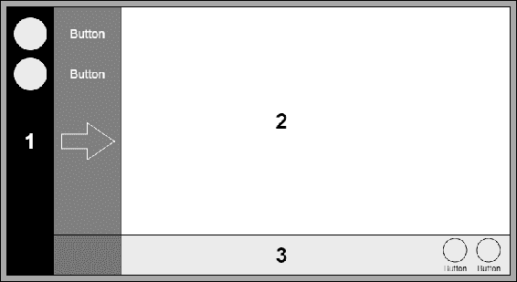
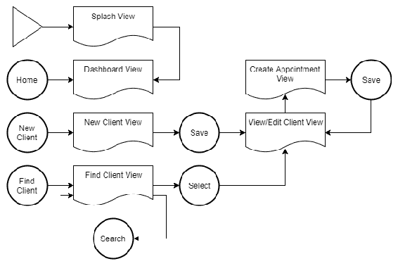
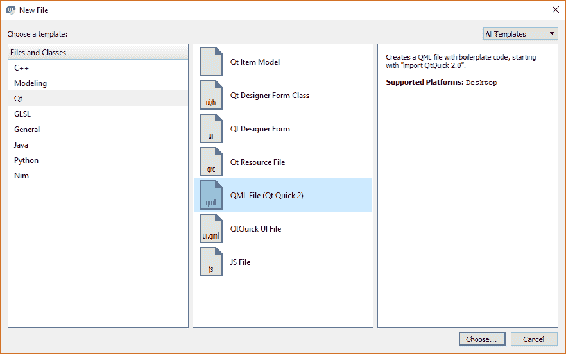
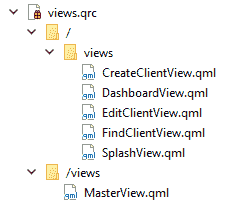
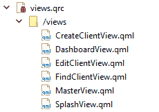
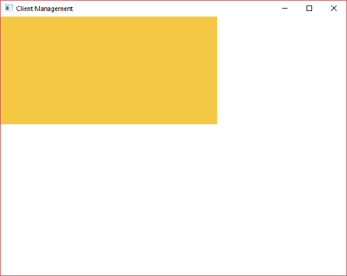
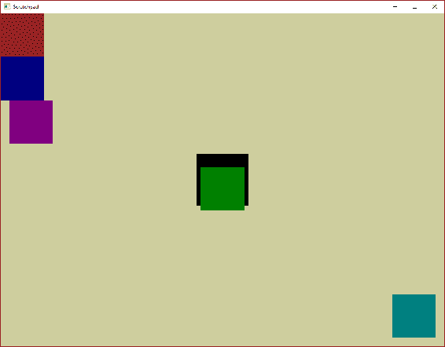
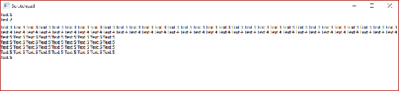
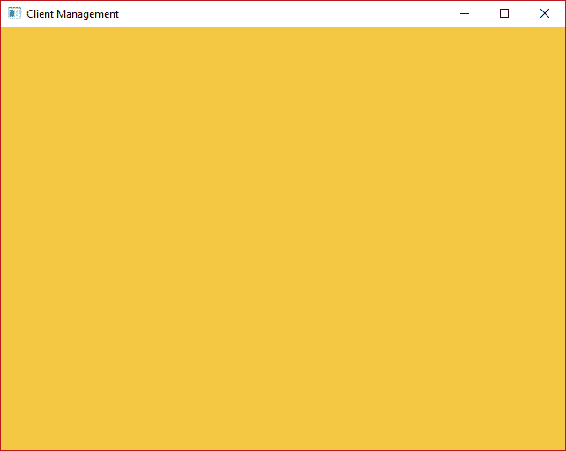
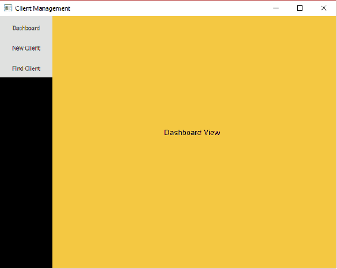

# 用户界面

在本章中，我们将更详细地了解 QML 并勾勒出我们的用户界面布局。我们将为所有屏幕创建占位视图，并实现一个在它们之间导航的框架。我们还将讨论这些视图中的内容，特别是如何以灵活和响应的方式锚定和调整元素的大小。我们将涵盖以下主题：

+   用户界面设计

+   创建视图

+   StackView 组件

+   锚定元素

+   调整元素大小

+   在视图之间导航

# UX

如果您曾经使用过其他声明性 UI 技术，如 HTML 和 XAML，它们通常采用父/子方法来处理 UI，即存在一个父视图或根视图，其中包含全局功能，例如顶级导航。然后有动态内容或子视图，根据需要切换并呈现上下文相关的命令。

我们将采用相同的方法，将我们的 MasterView 作为 UI 的根。我们将添加一个全局导航栏和一个内容窗格，我们可以根据需要添加和删除内容。子视图将可选择地呈现命令栏以执行操作，例如将记录保存到数据库。

让我们看看我们的基本布局目标：



导航栏（**1**）将一直存在，并包含按钮，这些按钮将引导用户进入应用程序中的关键区域。默认情况下，该栏将很窄，并且与按钮相关的命令将由图标表示；然而，按下切换按钮将展开该栏，以显示每个按钮的附带描述文本。

内容窗格（**2**）将是一堆子视图。通过在内容窗格中替换子视图来导航到应用程序的不同区域。例如，如果我们在导航栏上添加一个新客户按钮并按下它，我们将把**新客户视图**推送到内容框架堆栈上。

命令栏（**3**）是一个可选元素，将用于向用户呈现更多的命令按钮。与导航栏的关键区别在于，这些命令将与当前视图相关，与上下文相关。例如，当创建新客户时，我们将需要一个保存按钮，但当我们搜索客户时，保存按钮就没有意义。每个子视图将可选择地呈现自己的命令栏。命令将由图标呈现，并在下面有一个简短的描述。 

现在让我们规划屏幕的流程，或者我们称之为视图：



# 创建视图

在**cm-ui**中，右键单击`views.qrc`，然后选择添加新项…. 选择 Qt > QML 文件，然后单击选择…：



在`cm-ui/ui/views`中创建`SplashView.qml`文件。重复此过程，直到创建了以下所有视图为止：

| **文件** | **目的** |
| --- | --- |
| `SplashView.qml` | 在加载 UI 时显示的占位视图。 |
| `DashboardView.qml` | 中央的“主页”视图。 |
| `CreateClientView.qml` | 用于输入新客户详细信息的视图。 |
| `EditClientView.qml` | 用于阅读/更新现有客户详细信息的视图。 |
| `FindClientView.qml` | 用于搜索现有客户的视图。 |

像之前一样在纯文本编辑器中编辑`views.qrc`。您会看到我们的新视图已经添加到了一个新的`qresource`块中，并且具有以下默认前缀：

```cpp
<RCC>
    <qresource prefix="/views">
        <file alias="MasterView">views/MasterView.qml</file>
    </qresource>
    <qresource prefix="/">
        <file>views/SplashView.qml</file>
        <file>views/DashboardView.qml</file>
        <file>views/CreateClientView.qml</file>
        <file>views/EditClientView.qml</file>
        <file>views/FindClientView.qml</file>
    </qresource>
</RCC>
```

还要注意，项目导航器有点混乱：



将所有新文件移动到`“/views”`前缀块中，并删除`“/”`块。为每个新文件添加别名：

```cpp
<RCC>
    <qresource prefix="/views">
        <file alias="MasterView.qml">views/MasterView.qml</file>
        <file alias="SplashView.qml">views/SplashView.qml</file>
        <file alias="DashboardView.qml">views/DashboardView.qml</file>
        <file alias="CreateClientView.qml">views/CreateClientView.qml</file>
        <file alias="EditClientView.qml">views/EditClientView.qml</file>
        <file alias="CreateAppointmentView.qml">views/CreateAppointmentView.qml</file>
        <file alias="FindClientView.qml">views/FindClientView.qml</file>
    </qresource>
</RCC>
```

一旦保存了这些更改，您应该看到导航器变得整洁了：



# StackView

我们的子视图将通过**StackView**组件呈现，它提供了一个基于堆栈的导航模型，并内置了历史记录。当要显示新视图（在这种情况下，视图几乎可以是任何 QML）时，它们被推送到堆栈上，并且可以从堆栈中弹出，以返回到上一个视图。我们不需要使用历史记录功能，但它们是一个非常有用的功能。

要访问组件，我们首先需要引用该模块，因此在**MasterView**中添加导入：

```cpp
import QtQuick.Controls 2.2
```

完成后，让我们用`StackView`替换包含欢迎消息的**Text**元素：

```cpp
StackView {
    id: contentFrame
    initialItem: "qrc:/views/SplashView.qml"
}
```

我们为组件分配一个唯一标识符`contentFrame`，这样我们就可以在 QML 的其他地方引用它，并指定我们要默认加载的子视图——新的`SplashView`。

接下来，编辑`SplashView`。将`QtQuick`模块版本更新为 2.9，以便与**MasterView**匹配（如果没有明确说明，对所有后续的 QML 文件都要这样做）。这并不是严格必要的，但避免视图之间的不一致是一个好习惯。Qt 的次要版本发布通常不会有太多破坏性的变化，但是在两个引用不同版本 QtQuick 的视图上运行相同的代码可能会表现出不同的行为，这可能会引起问题。

现在我们对这个视图所做的就是让一个矩形的宽度为 400 像素，高度为 200 像素，具有“充满活力”的背景颜色，这样我们就可以看到它已经加载了：

```cpp
import QtQuick 2.9

Rectangle {
    width: 400
    height: 200
    color: "#f4c842"
}
```

颜色可以使用十六进制 RGB 值或命名的 SVG 颜色来指定，就像我们在这里做的一样。我通常觉得十六进制更容易，因为我永远记不住颜色的名称！

如果你将鼠标悬停在 Qt Creator 中的十六进制字符串上，你会得到一个非常有用的小弹出颜色样本。

现在运行应用程序，你会看到欢迎消息不再显示，取而代之的是一个绚丽的橙黄色矩形，这就是我们的**SplashView**。



# 锚点

我们美妙的新**SplashView**有一个小问题，那就是它实际上并没有填满窗口。当然，我们可以将 400 x 200 的尺寸改为 1024 x 768，这样它就与**MasterView**匹配了，但是如果用户调整窗口大小会发生什么呢？现代 UI 都是响应式设计——动态内容可以适应呈现的显示器，因此为只适用于一个平台的硬编码属性并不理想。幸运的是，锚点来拯救我们了。

让我们利用我们可靠的旧**scratchpad**项目，看看锚点是如何运作的。

右键单击`qml.qrc`，在`scratchpad`文件夹中的`main.qml`文件旁边添加一个新的`AnchorsDemo.qml` QML 文件。不要担心子文件夹、`.qrc`前缀、别名或任何其他东西。

进入`main.cpp`，加载我们的新文件，而不是`main.qml`：

```cpp
engine.load(QUrl(QStringLiteral("qrc:/AnchorsDemo.qml")));
```

接下来，将以下代码粘贴到`AnchorsDemo`中：

```cpp
import QtQuick 2.9
import QtQuick.Window 2.2

Window {
    visible: true
    width: 1024
    height: 768
    title: qsTr("Scratchpad")
    color: "#ffffff"
    Rectangle {
        id: paleYellowBackground
        anchors.fill: parent
        color: "#cece9e"
    }
    Rectangle {
        id: blackRectangleInTheCentre
        width: 120
        height: 120
        anchors.centerIn: parent
        color: "#000000"
    }
    Rectangle {
        id: greenRectangleInTheCentre
        width: 100
        height: 100
        anchors.centerIn: parent
        anchors.verticalCenterOffset: 20
        color: "#008000"
    }
    Rectangle {
        id: redRectangleTopLeftCorner
        width: 100
        height: 100
        anchors {
            top: parent.top
            left: parent.left
        }
        color: "#800000"
    }
    Rectangle {
        id: blueRectangleTopLeftCorner
        width: 100
        height: 100
        anchors{
            top: redRectangleTopLeftCorner.bottom
            left: parent.left
        }
        color: "#000080"
    }
    Rectangle {
        id: purpleRectangleTopLeftCorner
        width: 100
        height: 100
        anchors{
            top: blueRectangleTopLeftCorner.bottom
            left: parent.left
            leftMargin: 20
        }
        color: "#800080"
    }
    Rectangle {
        id: turquoiseRectangleBottomRightCorner
        width: 100
        height: 100
        anchors{
            bottom: parent.bottom
            right: parent.right
            margins: 20
        }
        color: "#008080"
    }
}
```

构建和运行应用程序，你会看到这个相当令人困惑的景象：



这一切乍一看可能有点令人困惑，如果你的颜色感知不够理想，我很抱歉，但我们所做的只是用不同的锚点值绘制一系列花哨的彩色矩形。让我们逐个矩形地走一遍，看看发生了什么：

```cpp
Rectangle {
    id: paleYellowBackground
    anchors.fill: parent
    color: "#cece9e"
}
```

我们的第一个矩形是沉闷的黄褐色背景；`anchors.fill: parent`告诉矩形填充其父级，无论大小如何。任何给定的 QML 组件的父级是包含它的 QML 组件——在层次结构中的下一个级别。在这种情况下，它是**Window**元素。**Window**元素是 1024 x 768 像素，所以矩形就是这么大。请注意，我们不需要为矩形指定宽度和高度属性，因为它们是从锚点中推断出来的。

这正是我们想要的**SplashView**的行为，但在我们回到主项目之前，让我们看看锚点的一些其他功能：

```cpp
Rectangle {
    id: blackRectangleInTheCentre
    width: 120
    height: 120
    anchors.centerIn: parent
    color: "#000000"
}
Rectangle {
    id: greenRectangleInTheCentre
    width: 100
    height: 100
    anchors.centerIn: parent
    anchors.verticalCenterOffset: 20
    color: "#008000"
}
```

我们将一起看接下来的两个矩形。首先是一个边长为 120 像素的黑色矩形；`anchors.centerIn: parent`将其定位在其父元素的中心。我们必须指定**width**和**height**，因为我们只是定位它，而不是调整大小。

接下来，我们有一个稍小一点的绿色矩形，也是在其父元素中居中。然后我们使用`anchors.verticalCenterOffset`属性将其向下移动 20 像素。用于定位的*x*，*y*坐标系统的根（0, 0）位于屏幕的左上角；`verticalCenterOffset`会增加 y 坐标。正数会将项目向下移动，负数会将项目向上移动。它的姐妹属性`horizontalCenterOffset`用于*x*轴的调整。

这里要注意的最后一件事是，矩形重叠，显示的是绿色矩形，黑色矩形被推到后面并被遮挡。同样，我们所有的小矩形都在大背景矩形的前面。QML 以自上而下的方式呈现，因此当根元素（**Window**）被绘制时，其子元素会从文件顶部到底部依次处理。因此，文件底部的项目将呈现在文件顶部的项目前面。如果你先把墙涂成白色，然后再涂成黑色，墙会变成黑色，因为那是最后涂的（呈现的）：

```cpp
Rectangle {
    id: redRectangleTopLeftCorner
    width: 100
    height: 100
    anchors {
        top: parent.top
        left: parent.left
    }
    color: "#800000"
}
```

接下来，我们画一个红色矩形，而不是一次性定位或调整整个矩形，我们只是锚定某些边。我们将其**top**边的锚点与其父元素（**Window**）的**top**边的锚点对齐。我们将其**left**边锚定到其父元素的**left**边。因此，它变成了与左上角“连接”起来。

我们必须输入以下内容：

```cpp
anchors.top: parent.top
anchors.left: parent.left
```

这里还有一个有用的语法糖，我们可以去掉重复的部分，并在花括号内设置`anchors`组的子属性：

```cpp
anchors {
    top: parent.top
    left: parent.left
}
```

接下来是蓝色矩形：

```cpp
Rectangle {
    id: blueRectangleTopLeftCorner
    width: 100
    height: 100
    anchors{
        top: redRectangleTopLeftCorner.bottom
        left: parent.left
    }
    color: "#000080"
}
```

这遵循相同的模式，不过这次我们不仅仅附加到其父元素，还要锚定到一个兄弟元素（红色矩形），我们可以通过`id`属性引用它：

```cpp
Rectangle {
    id: purpleRectangleTopLeftCorner
    width: 100
    height: 100
    anchors{
        top: blueRectangleTopLeftCorner.bottom
        left: parent.left
        leftMargin: 20
    }
    color: "#800080"
}
```

紫色矩形锚定在蓝色矩形的底部和窗口的左侧，但这里我们引入了第一个边距。每一边都有自己的边距，在这种情况下，我们使用`leftMargin`来给我们一个从左锚点的偏移，就像我们之前在`verticalCenterOffset`中看到的一样：

```cpp
Rectangle {
    id: turquoiseRectangleBottomRightCorner
    width: 100
    height: 100
    anchors{
        bottom: parent.bottom
        right: parent.right
        margins: 20
    }
    color: "#008080"
}
```

最后，我们的青绿色矩形利用了屏幕右侧的一些空白空间，并演示了如何使用`margins`属性同时设置四个边的边距。

请注意，所有这些绑定都是动态的。尝试调整窗口大小，所有的矩形都会自动适应。锚点是响应式 UI 设计的好工具。

让我们回到我们的`cm-ui`项目中的`SplashView`，并应用我们刚学到的知识。用更动态的`anchors.fill`属性替换固定的**width**和**height**属性：

```cpp
Rectangle {
    anchors.fill: parent
    color: "#f4c842"
}
```

现在，`SplashView`将填充其父元素。构建并运行，你会发现，我们原本期望的可爱多彩的矩形已经完全消失了。让我们看看为什么会这样。

# 大小

我们的矩形将填满其父元素，因此矩形的大小完全取决于其父元素的大小。沿着 QML 层次结构向上走，包含矩形的组件是**MasterView**中的`StackView`元素：

```cpp
StackView {
    id: contentFrame
    initialItem: Qt.resolvedUrl("qrc:/views/SplashView.qml")
}
```

通常，QML 组件足够聪明，可以根据它们的子元素自行调整尺寸。以前，我们将矩形设置为固定尺寸的 400 x 200。`StackView`可以查看并说：“我需要包含一个尺寸为 400 x 200 的**Rectangle**，所以我也会把自己做成 400 x 200。简单！”我们总是可以通过它的**width**和**height**属性来覆盖它，并将其设置为其他尺寸，但它可以计算出它想要的尺寸。

回到`scratchpad`，创建一个新的`SizingDemo.qml`视图，并编辑`main.cpp`以在启动时加载它，就像我们在`AnchorsDemo`中所做的那样。编辑`SizingDemo`如下：

```cpp
import QtQuick 2.9
import QtQuick.Window 2.2

Window {
    visible: true
    width: 1024
    height: 768
    title: qsTr("Scratchpad")
    color: "#ffffff"
    Column {
        id: columnWithText
        Text {
            id: text1
            text: "Text 1"
        }
        Text {
            id: text2
            text: "Text 2"
            width: 300
            height: 20
        }
        Text {
            id: text3
            text: "Text 3 Text 3 Text 3 Text 3 Text 3 Text 3 Text 3 Text 3 Text 3 Text 3 Text 3 Text 3 Text 3 Text 3 Text 3 Text 3 Text 3 Text 3 Text 3 Text 3 Text 3 Text 3 Text 3 Text 3 Text 3 Text 3 Text 3 Text 3 Text 3 Text 3 Text 3 Text 3 Text 3 Text 3 Text 3 Text 3 Text 3"
        }
        Text {
            id: text4
            text: "Text 4 Text 4 Text 4 Text 4 Text 4 Text 4 Text 4 Text 4 Text 4 Text 4 Text 4 Text 4 Text 4 Text 4 Text 4 Text 4 Text 4 Text 4 Text 4 Text 4 Text 4 Text 4 Text 4 Text 4 Text 4 Text 4 Text 4 Text 4 Text 4 Text 4 Text 4 Text 4 Text 4 Text 4 Text 4 Text 4 Text 4"
            width: 300
        }
        Text {
            id: text5
            text: "Text 5 Text 5 Text 5 Text 5 Text 5 Text 5 Text 5 Text 5 Text 5 Text 5 Text 5 Text 5 Text 5 Text 5 Text 5 Text 5 Text 5 Text 5 Text 5 Text 5 Text 5 Text 5 Text 5 Text 5 Text 5 Text 5 Text 5 Text 5 Text 5 Text 5 Text 5 Text 5 Text 5 Text 5 Text 5 Text 5 Text 5"
            width: 300
            wrapMode: Text.Wrap
        }
    }
    Column {
        id: columnWithRectangle
        Rectangle {
            id: rectangle
            anchors.fill: parent
        }
    }
    Component.onCompleted: {
        console.log("Text1 - implicitWidth:" + text1.implicitWidth + " implicitHeight:" + text1.implicitHeight + " width:" + text1.width + " height:" + text1.height)
        console.log("Text2 - implicitWidth:" + text2.implicitWidth + " implicitHeight:" + text2.implicitHeight + " width:" + text2.width + " height:" + text2.height)
        console.log("Text3 - implicitWidth:" + text3.implicitWidth + " implicitHeight:" + text3.implicitHeight + " width:" + text3.width + " height:" + text3.height)
        console.log("Text4 - implicitWidth:" + text4.implicitWidth + " implicitHeight:" + text4.implicitHeight + " width:" + text4.width + " height:" + text4.height)
        console.log("Text5 - implicitWidth:" + text5.implicitWidth + " implicitHeight:" + text5.implicitHeight + " width:" + text5.width + " height:" + text5.height)
        console.log("ColumnWithText - implicitWidth:" + columnWithText.implicitWidth + " implicitHeight:" + columnWithText.implicitHeight + " width:" + columnWithText.width + " height:" + columnWithText.height)
        console.log("Rectangle - implicitWidth:" + rectangle.implicitWidth + " implicitHeight:" + rectangle.implicitHeight + " width:" + rectangle.width + " height:" + rectangle.height)
        console.log("ColumnWithRectangle - implicitWidth:" + columnWithRectangle.implicitWidth + " implicitHeight:" + columnWithRectangle.implicitHeight + " width:" + columnWithRectangle.width + " height:" + columnWithRectangle.height)
    }
}
```

运行这个，你会得到另一个充满无意义的屏幕：



对我们来说，更有趣的是控制台输出的内容：

`qml: Text1 - implicitWidth:30 implicitHeight:13 width:30 height:13`

`qml: Text2 - implicitWidth:30 implicitHeight:13 width:300 height:20`

`qml: Text3 - implicitWidth:1218 implicitHeight:13 width:1218 height:13`

`qml: Text4 - implicitWidth:1218 implicitHeight:13 width:300 height:13`

`qml: Text5 - implicitWidth:1218 implicitHeight:65 width:300 height:65`

`qml: ColumnWithText - implicitWidth:1218 implicitHeight:124 width:1218 height:124`

`qml: Rectangle - implicitWidth:0 implicitHeight:0 width:0 height:0`

`qml: ColumnWithRectangle - implicitWidth:0 implicitHeight:0 width:0 height:0`

那么，发生了什么？我们创建了两个**Column**元素，这是不可见的布局组件，可以垂直排列它们的子元素。我们用各种**Text**元素填充了第一个列，并在第二个列中添加了一个**Rectangle**。视图底部是一个 JavaScript 函数，当**Window**组件完成（即加载完成）时将执行。函数所做的就是写出视图上各个元素的`implicitWidth`、`implicitHeight`、`width`和`height`属性。

让我们逐个浏览元素和相应的控制台行：

```cpp
Text {
    id: text1
    text: "Text 1"
}
```

`qml: Text1 - implicitWidth:30 implicitHeight:13 width:30 height:13`

这个文本元素包含了一小段文本，我们没有指定任何尺寸。它的`implicitWidth`和`implicitHeight`属性是基于其内容所需的尺寸。它的`width`和`height`属性是元素实际的尺寸。在这种情况下，它会根据自己的需求调整尺寸，因为我们没有另外指定，所以它的`width`/`height`与`implicitWidth`/`implicitHeight`相同：

```cpp
Text {
    id: text2
    text: "Text 2"
    width: 300
    height: 20
}
```

`qml: Text2 - implicitWidth:30 implicitHeight:13 width:300 height:20`

对于`text2`，隐式尺寸与`text1`相同，因为内容几乎相同。然而，这次，我们明确告诉它宽度为 300，高度为 20。控制台告诉我们，元素按照指示进行，并且确实是那个尺寸：

```cpp
Text {
    id: text3
    text: "Text 3 Text 3 Text 3 Text 3 Text 3 Text 3 Text 3 Text 3 Text 3 Text 3 Text 3 Text 3 Text 3 Text 3 Text 3 Text 3 Text 3 Text 3 Text 3 Text 3 Text 3 Text 3 Text 3 Text 3 Text 3 Text 3 Text 3 Text 3 Text 3 Text 3 Text 3 Text 3 Text 3 Text 3 Text 3 Text 3 Text 3"
}
```

`qml: Text3 - implicitWidth:1218 implicitHeight:13 width:1218 height:13`

`text3`采取了与`text1`相同的不干涉方式，但内容是一段更长的文本。这次，`implicitWidth`要大得多，因为它需要适应长文本的空间。请注意，这实际上比窗口还要宽，文本被截断了。同样，我们没有另外指示，所以它自行调整尺寸：

```cpp
Text {
    id: text4
    text: "Text 4 Text 4 Text 4 Text 4 Text 4 Text 4 Text 4 Text 4 Text 4 Text 4 Text 4 Text 4 Text 4 Text 4 Text 4 Text 4 Text 4 Text 4 Text 4 Text 4 Text 4 Text 4 Text 4 Text 4 Text 4 Text 4 Text 4 Text 4 Text 4 Text 4 Text 4 Text 4 Text 4 Text 4 Text 4 Text 4 Text 4"
    width: 300
}
```

`qml: Text4 - implicitWidth:1218 implicitHeight:13 width:300 height:13`

`text4`有相同的冗长文本块，但这次我们告诉它我们想要的宽度。你会注意到，即使元素只有 300 像素宽，文本也能在整个窗口上都可见。内容溢出了容器的边界。你可以将`clip`属性设置为`true`来防止这种情况，但我们在这里并不太关心：

```cpp
Text {
    id: text5
    text: "Text 5 Text 5 Text 5 Text 5 Text 5 Text 5 Text 5 Text 5 Text 
    5 Text 5 Text 5 Text 5 Text 5 Text 5 Text 5 Text 5 Text 5 Text 5   
    Text 5 Text 5 Text 5 Text 5 Text 5 Text 5 Text 5 Text 5 Text 5 Text 
    5 Text 5 Text 5 Text 5 Text 5 Text 5 Text 5 Text 5 Text 5 Text 5"
    width: 300
    wrapMode: Text.Wrap
}
```

`qml: Text5 - implicitWidth:1218 implicitHeight:65 width:300 height:65`

`text5`重复了相同的长文本块，并将宽度限制为 300，但这次，我们通过将`wrapMode`属性设置为`Text.Wrap`来使事情更有条理。通过这个设置，启用的行为更像是你从一个文本块中期望的——它填满了可用的宽度，然后换行到下一行。元素的`implicitHeight`和因此`height`已增加以容纳内容。然而，请注意，`implicitHeight`仍然与之前相同；这仍然是控件希望的宽度，以便根据我们定义的约束来容纳其所有内容，而我们没有定义高度约束。

然后我们打印出包含所有这些文本的列的属性：

`qml: ColumnWithText - implicitWidth:1218 implicitHeight:124 width:1218 height:124`

需要注意的重要一点是，列能够计算出需要多宽和多高才能容纳所有子元素。

接下来，我们遇到了在`SplashView`中遇到的问题：

```cpp
Column {
    id: columnWithRectangle
    Rectangle {
        id: rectangle
        anchors.fill: parent
    }
}
```

在这里，我们遇到了一个鸡生蛋蛋生鸡的情况。`Column`试图计算出容纳其子元素所需的大小，因此它查看了`Rectangle`。`Rectangle`没有显式的大小信息，也没有自己的子元素，它只是设置为填充其父元素`Column`。两个元素都无法确定自己应该有多大，因此它们都默认为 0x0，这使它们变得不可见。

`qml: Rectangle - implicitWidth:0 implicitHeight:0 width:0 height:0`

`qml: ColumnWithRectangle - implicitWidth:0 implicitHeight:0 width:0 height:0`

多年来，元素的大小调整可能是我在 QML 中遇到的最困扰的问题。作为一般指导方针，如果您编写了一些 QML 但无法在屏幕上看到它呈现，那可能是一个大小问题。我通常发现，当调试时，给每个元素一个任意的固定**宽度**和**高度**是一个好的开始，然后逐个使尺寸动态化，直到重新创建问题。

有了这个知识，让我们回到`MasterView`并解决之前的问题。

将`anchors.fill: parent`添加到`StackView`组件：

```cpp
StackView {
    id: contentFrame
    anchors.fill: parent
    initialItem: Qt.resolvedUrl("qrc:/views/SplashView.qml")
}
```

`StackView`现在将填充其父级**Window**，我们已经明确给定了固定大小为 1024 x 768。再次运行应用程序，现在您应该有一个可爱的橙黄色的`SplashView`，它填满了屏幕，并且在调整窗口大小时可以愉快地调整大小：



# 导航

让我们快速在我们的`SplashView`中添加一个内容：

```cpp
Rectangle {
    anchors.fill: parent
    color: "#f4c842"
    Text {
        anchors.centerIn: parent
        text: "Splash View"
    }
}
```

这只是将视图的名称添加到屏幕上，因此当我们开始在视图之间移动时，我们知道我们正在查看哪一个。完成后，将`SplashView`的内容复制到所有其他新视图中，并更新每个视图中的文本以反映视图的名称，例如，在`DashboardView`中，文本可以说“Dashboard View”。

我们想要进行的第一次导航是当`MasterView`加载完成并且我们准备好进行操作时，加载`DashboardView`。我们可以使用我们刚刚看到的 QML 组件插槽之一`Component.onCompleted()`来实现这一点。

在`MasterView`中的根`Window`组件中添加以下行：

```cpp
Component.onCompleted: contentFrame.replace("qrc:/views/DashboardView.qml");
```

现在构建和运行时，一旦`MasterView`加载完成，它就会将子视图切换到`DashboardView`。这可能发生得如此之快，以至于您甚至不再看到`SplashView`，但它仍然存在。如果您的应用程序需要进行大量初始化，并且无法使用非阻塞 UI，那么拥有这样的启动视图是非常好的。这是一个方便的地方，可以放置公司标志和“Reticulating splines...”加载消息。是的，这是一个模拟人生的参考！

StackView 就像是你的网络浏览器中的历史记录。如果你访问[www.google.com](http://www.google.com)，然后访问[www.packtpub.com](http://www.packtpub.com)，你就是在将[www.packtpub.com](http://www.packtpub.com) *推送*到堆栈上。如果你在浏览器上点击返回，你就会回到[www.google.com](http://www.google.com)。这个历史记录可以包含多个页面（或视图），你可以通过它们向后和向前导航。有时你不需要历史记录，有时你甚至不希望用户能够返回。我们调用的`replace()`方法，正如其名称所示，会将一个新视图推送到堆栈上，并清除任何历史记录，这样你就无法返回。

在`Component.onCompleted`槽中，我们已经看到了如何直接从 QML 中导航到视图的示例。我们可以使用这种方法来进行应用程序的所有导航。例如，我们可以添加一个按钮，让用户创建一个新的客户，当点击时，直接将`CreateClientView`推送到堆栈上，如下所示：

```cpp
Button {
    onClicked: contentFrame.replace("qrc:/views/CreateClientView.qml")
}
```

对于 UX 设计或简单的 UI 重型应用程序，这是一个完全有效的方法。问题在于你的 QML 视图和组件变得非常紧密地耦合，而业务逻辑层对用户的操作一无所知。很多时候，移动到应用程序的新屏幕并不像只是显示一个新视图那么简单。你可能需要更新状态机，设置一些模型，或者清除前一个视图中的一些数据。通过将所有的导航请求都通过我们的**MasterController**中转站，我们解耦了我们的组件，并获得了业务逻辑拦截点，以便执行任何必要的操作，并验证请求是否合适。

我们将通过从业务逻辑层发出信号并让我们的**MasterView**对其做出响应并执行过渡来请求导航到这些视图。我们不会在**MasterController**中添加这些功能，而是将导航的责任委托给`cm-lib`中的一个新控制器，因此在`cm/cm-lib/source/controllers`中创建一个名为`navigation-controller.h`的新头文件（没有实际的实现，所以我们不需要一个`.cpp`文件），并添加以下代码：

```cpp
#ifndef NAVIGATIONCONTROLLER_H
#define NAVIGATIONCONTROLLER_H

#include <QObject>

#include <cm-lib_global.h>
#include <models/client.h>

namespace cm {
namespace controllers {

class CMLIBSHARED_EXPORT NavigationController : public QObject
{
    Q_OBJECT

public:
    explicit NavigationController(QObject* _parent = nullptr)
        : QObject(_parent)
    {}

signals:
    void goCreateClientView();
    void goDashboardView();
    void goEditClientView(cm::models::Client* client);
    void goFindClientView();
};

}
}
#endif
```

我们创建了一个最小的类，它继承自`QObject`，并为我们的新视图实现了一个信号。请注意，我们不需要导航到**MasterView**或**SplashView**，因此没有相应的信号。当我们导航到`EditClientView`时，我们需要通知 UI 我们想要编辑哪个**Client**，因此我们将其作为参数传递。从业务逻辑代码的任何地方调用这些方法会向外界发出一个请求，说“我想去某个视图，请”。然后由 UI 层的**MasterView**来监视这些请求并做出相应的响应。请注意，业务逻辑层仍然对 UI 实现一无所知。如果没有人响应这个信号，也没关系；这不是双向通信。

每当你从`QObject`继承时，一定要记住`Q_OBJECT`宏，还有一个接受`QObject`父对象的重载构造函数。由于我们希望在这个项目之外（在 UI 项目中）使用这个类，我们还必须记住 CMLIBSHARED_EXPORT 宏。

我们在这里稍微展望了一下，并假设我们的 Client 类将在`cm::models`命名空间中，但 Qt 在我们创建项目时为我们添加的默认`Client`类并不在这个命名空间中，所以在继续之前让我们先修复这个问题。

**client.h**：

```cpp
#ifndef CLIENT_H
#define CLIENT_H

#include "cm-lib_global.h"

namespace cm {
namespace models {

class CMLIBSHARED_EXPORT Client
{
public:
    Client();
};

}}

#endif
```

`client.cpp`：

```cpp
#include "client.h"

namespace cm {
namespace models {

Client::Client()
{
}

}}
```

我们需要能够创建一个 NavigationController 的实例，并让我们的 UI 与它交互。出于单元测试的原因，将对象创建隐藏在某种对象工厂接口后面是一个很好的做法，但在这个阶段我们不关心这个，所以我们将简单地在**MasterController**中创建对象。让我们趁机在**MasterController**中添加私有实现（PImpl）习惯用法。如果你以前没有接触过 PImpl，它只是一种将所有私有实现细节从头文件中移出并放入定义中的技术。这有助于保持头文件尽可能短和干净，只包含对公共 API 的消费者必要的包含。将声明和实现替换为以下内容：

`master-controller.h`：

```cpp
#ifndef MASTERCONTROLLER_H
#define MASTERCONTROLLER_H

#include <QObject>
#include <QScopedPointer>
#include <QString>

#include <cm-lib_global.h>
#include <controllers/navigation-controller.h>

namespace cm {
namespace controllers {

class CMLIBSHARED_EXPORT MasterController : public QObject
{
    Q_OBJECT
    Q_PROPERTY( QString ui_welcomeMessage READ welcomeMessage CONSTANT )
    Q_PROPERTY( cm::controllers::NavigationController* ui_navigationController READ navigationController CONSTANT )

public:
    explicit MasterController(QObject* parent = nullptr);
    ~MasterController();

    NavigationController* navigationController();
    const QString& welcomeMessage() const;

private:
    class Implementation;
    QScopedPointer<Implementation> implementation;
};

}}
#endif
```

`master-controller.cpp`：

```cpp
#include "master-controller.h"

namespace cm {
namespace controllers {

class MasterController::Implementation
{
public:
    Implementation(MasterController* _masterController)
        : masterController(_masterController)
    {
        navigationController = new NavigationController(masterController);
    }

    MasterController* masterController{nullptr};
    NavigationController* navigationController{nullptr};
    QString welcomeMessage = "This is MasterController to Major Tom";
};

MasterController::MasterController(QObject* parent)
    : QObject(parent)
{
    implementation.reset(new Implementation(this));
}

MasterController::~MasterController()
{
}

NavigationController* MasterController::navigationController()
{
    return implementation->navigationController;
}

const QString& MasterController::welcomeMessage() const
{
    return implementation->welcomeMessage;
}

}}
```

你可能已经注意到，对于 NavigationController 的访问器方法，我们没有指定 cm::controllers 命名空间，但对于`Q_PROPERTY`我们做了。这是因为属性是由 UI QML 访问的，它不在`cm`命名空间的范围内执行，所以我们必须明确指定完全限定的名称。作为一个一般的经验法则，对于 QML 直接交互的任何东西，包括信号和插槽中的参数，都要明确指定命名空间。

接下来，我们需要在**cm-ui**项目中使用`main.cpp`注册新的`NavigationController`类，所以在现有的**MasterController**旁边添加以下注册：

```cpp
qmlRegisterType<cm::controllers::NavigationController>("CM", 1, 0, "NavigationController");
```

我们现在准备好让**MasterView**对这些导航信号做出反应。在`StackView`之前添加以下元素：

```cpp
Connections {
    target: masterController.ui_navigationController
    onGoCreateClientView: contentFrame.replace("qrc:/views/CreateClientView.qml")
    onGoDashboardView: contentFrame.replace("qrc:/views/DashboardView.qml")
    onGoEditClientView: contentFrame.replace("qrc:/views/EditClientView.qml", {selectedClient: client})
    onGoFindClientView: contentFrame.replace("qrc:/views/FindClientView.qml")
}
```

我们正在创建一个连接组件，绑定到我们的新**NavigationController**实例，它对我们添加的每个 go 信号做出反应，并通过`contentFrame`导航到相关视图，使用我们之前用于移动到仪表板的`replace()`方法。因此，每当**NavigationController**上触发`goCreateClientView()`信号时，我们的`Connections`组件上的`onGoCreateClientView()`插槽将被调用，并且`CreateClientView`将加载到名为`contentFrame`的**StackView**中。在`onGoEditClientView`的情况下，从信号传递了一个`client`参数，我们将该对象传递给一个名为`selectedClient`的属性，稍后我们将在视图中添加该属性。

在 QML 组件中，一些信号和插槽是自动生成并连接的，遵循约定。插槽的命名方式是`on[CapitalisedNameOfRelatedSignal]`。例如，如果有一个名为`mySplendidSignal()`的信号，那么相应的插槽将被命名为`onMySplendidSignal`。这些约定适用于我们的`NavigationController`和`Connections`组件。

接下来，让我们在**MasterView**中添加一个导航栏，带有一些占位按钮，以便我们可以尝试这些信号。

添加一个`Rectangle`来形成我们条的背景：

```cpp
Rectangle {
    id: navigationBar
    anchors {
        top: parent.top
        bottom: parent.bottom
        left: parent.left
    }
    width: 100
    color: "#000000"
}
```

这会在视图的左侧绘制一个宽度为 100 像素的黑色条。

我们还需要调整我们的`StackView`，以便为我们的条留出一些空间。我们不是填充其父级，而是将其四个边的三个边锚定到其父级，但将左侧与我们的条的右侧连接起来：

```cpp
StackView {
    id: contentFrame
    anchors {
        top: parent.top
        bottom: parent.bottom
        right: parent.right
        left: navigationBar.right
    }
    initialItem: Qt.resolvedUrl("qrc:/views/SplashView.qml")
}
```

现在，让我们在我们的导航`Rectangle`中添加一些按钮：

```cpp
 Rectangle {
    id: navigationBar
    …

    Column {
        Button {
            text: "Dashboard"
            onClicked: masterController.ui_navigationController.goDashboardView()
        }
        Button {
            text: "New Client"
            onClicked: masterController.ui_navigationController.goCreateClientView()
        }
        Button {
            text: "Find Client"
            onClicked: masterController.ui_navigationController.goFindClientView()
        }
    }

}
```

我们使用`Column`组件来为我们布局按钮，而不是必须单独将按钮锚定到彼此。每个按钮显示一些文本，当点击时，调用**NavigationController**上的一个信号。我们的`Connection`组件对信号做出反应，并为我们执行视图转换：



太棒了，我们有一个功能完善的导航框架！然而，当你点击导航按钮时，导航栏会短暂消失然后再次出现。我们的**应用输出**控制台中也出现了“冲突的锚点”消息，这表明我们做了一些不太对的事情。在继续之前，让我们解决这些问题。

# 解决冲突

导航栏的问题很简单。如前所述，QML 的结构是分层的。这体现在元素的渲染方式上——首先出现的子元素首先被渲染。在我们的情况下，我们先绘制导航栏，然后再绘制内容框架。当**StackView**组件加载新内容时，默认情况下会应用花哨的过渡效果，使其看起来很漂亮。这些过渡效果可能导致内容移出控件的边界并覆盖在其下方的任何内容上。有几种方法可以解决这个问题。

首先，我们可以重新排列组件的渲染顺序，并将导航栏放在内容框架之后。这将在`StackView`的顶部绘制导航栏，而不管它的情况如何。第二个选项，也是我们将实现的选项，就是简单地设置**StackView**的`clip`属性：

```cpp
clip: true
```

这会裁剪任何超出控件边界的内容，并且不会渲染它。

下一个问题有点更加深奥。正如我们讨论过的，QML 开发过去几年中我遇到的最令人困惑的问题之一是组件的大小。我们使用的一些组件，比如**Rectangle**，本质上是视觉元素。如果它们的大小没有被定义，要么是直接使用`width/height`属性，要么是间接使用**anchors**，那么它们就不会被渲染。其他元素，比如**Connections**，根本不是视觉元素，大小属性是多余的。布局元素，比如**Column**，可能在一个轴上有固定的大小，但在另一个轴上是动态的。

大多数组件共同的一点是它们都继承自**Item**，而**Item**又直接继承自**QtObject**，它只是一个普通的**QObject**。就像 C++端的 Qt 框架为普通的**QObject**实现了很多默认行为一样，QML 组件通常为我们可以在这里利用的**Item**组件实现了默认行为。

在我们的子视图中，我们使用**Rectangle**作为根对象。这是有道理的，因为我们想要显示一个固定大小和颜色的矩形。然而，这对**StackView**造成了问题，因为它不知道自己应该有多大。为了提供这些信息，我们尝试将其锚定到其父级（**StackView**），但这又会引发自己的问题，与我们切换视图时**StackView**正在执行的过渡效果发生冲突。

我们摆脱这个困境的方法是，将子视图的根改为普通的**Item**。**StackView**组件具有处理**Item**组件的内部逻辑，并且会自动调整大小。然后，我们的**Rectangle**组件就成为了已经自动调整大小的**Item**组件的子组件，我们可以将其锚定到这个组件上：

```cpp
Item {
    Rectangle {
        ...
    }
}
```

这有点令人困惑，感觉像巫术一样，但这里的要点是，在你的自定义 QML 中，将**Item**作为根元素通常是一个好主意。继续在所有子视图中以这种方式添加根**Item**组件（但不包括**MasterView**）。

再次运行应用程序，现在你应该有流畅的过渡效果，并且控制台中没有警告消息。

# 总结

我们已经建立了一个灵活的、解耦的导航机制，并成功地在不同的视图之间进行了过渡。我们已经建立了导航栏的基本结构，并且在本章开头设计的工作内容窗格中工作。

让 UI 调用业务逻辑层发出信号，然后 UI 对此做出反应，可能看起来有点绕弯，但这种业务逻辑信号/UI 插槽设计带来了好处。它使 UI 模块化，因为视图不需要相互了解。它将导航逻辑保留在业务逻辑层，并使该层能够请求 UI 将用户导航到特定视图，而无需了解 UI 或视图本身的任何信息。关键是，它还为我们提供了拦截点，因此当用户请求导航到特定视图时，我们可以处理它并执行任何我们需要的额外处理，比如状态管理或清理。

在第四章*“样式”*中，我们将介绍共享样式组件，以及在完成动态命令栏的 UI 设计之前，介绍 QML 模块和图标。
