# 第四章：样式

在开发过程中，通常最好先考虑功能，然后再考虑形式，但 UI 是我们的用户与之交互的应用程序的一部分，也是成功解决方案的关键因素。在本章中，我们将介绍类似 CSS 的样式资源，并在上一章介绍的响应式设计原则的基础上进行构建。

我们将创建自定义的 QML 组件和模块，以最大程度地重用代码。我们将集成 Font Awesome 到我们的解决方案中，为我们提供一套可扩展的图标，并帮助我们的 UI 呈现出现代的图形外观。我们将整理导航栏，引入命令的概念，并构建一个动态的、上下文敏感的命令栏的框架。

在本章中，我们将涵盖以下主题：

+   自定义样式资源

+   字体真棒

+   自定义组件

+   导航栏样式

+   命令

# 样式资源

首先，让我们创建一个新的资源文件，以包含我们需要的非 QML 视觉元素。在`cm-ui`项目中，添加新... > Qt > Qt 资源文件：

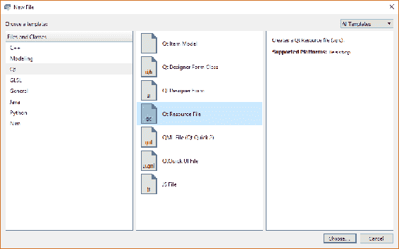

将文件命名为`assets.qrc`，并将其放置在`cm/cm-ui`中。您的新文件将自动在资源编辑器中打开，我发现这个编辑器并不是特别有用，所以关闭它。您将看到`assets.qrc`文件已添加到`cm-ui`项目的资源部分。右键单击它，然后选择添加新... > Qt > QML 文件。将文件命名为`Style.qml`，并将其保存到`cm/cm-ui/assets`。

在纯文本编辑器中编辑`assets.qrc`文件，方式与我们为视图所做的方式相同：

```cpp
<RCC>
    <qresource prefix="/assets">
        <file alias="Style.qml">assets/Style.qml</file>
    </qresource>
</RCC>
```

现在，编辑`Style.qml`，我们将添加一个用于视图背景颜色的单个样式属性：

```cpp
pragma Singleton
import QtQuick 2.9

Item {
    readonly property color colourBackground: "#f4c842"
}
```

在 C++术语中，我们正在创建一个具有名为`colourBackground`的 const 颜色类型的公共成员变量的单例类，并初始化为（非常）浅灰色的十六进制 RGB 代码的值。

现在，我们需要进行一点手动的调整。我们需要在与`Style.qml`（`cm/cm-ui/assets`）相同的文件夹中创建一个名为`qmldir`的模块定义文件（没有文件扩展名）。对于这种类型的文件，没有内置模板，因此我们需要自己创建它。在旧版本的 Windows 中，文件资源管理器总是坚持要求文件扩展名，因此这总是一个痛苦的练习。需要使用控制台命令强制重命名文件。Windows 10 将愉快地创建没有扩展名的文件。在 Unix 世界中，没有扩展名的文件更常见。

创建`qmldir`文件后，编辑`assets.qrc`，并在`/assets`前缀内的`Style.qml`旁边插入一个新条目：

```cpp
<file alias="qmldir">assets/qmldir</file>
```

双击新添加的`qmldir`文件，并输入以下行：

```cpp
module assets
singleton Style 1.0 Style.qml
```

我们已经在**导入 QtQuick 2.9**时看到了模块。这使得 QtQuick 模块的 2.9 版本可以在我们的视图中使用。在我们的`qmldir`文件中，我们正在定义一个名为`assets`的新模块，并告诉 Qt 该模块的 1.0 版本中有一个**Style**对象，其实现在我们的`Style.qml`文件中。

创建并连接了我们的新样式模块后，现在让我们开始使用这种现代的米白色。从我们看到的第一个子视图`SplashView`开始，并添加以下内容以访问我们的新模块：

```cpp
import assets 1.0
```

您会注意到我们被呈现出愤怒的红色下划线，表明一切并不顺利。将鼠标指针悬停在该行上，工具提示会告诉我们，我们需要将导入路径添加到我们的新`qmldir`定义文件中。

有几种方法可以做到这一点。第一种选择是转到“项目”模式，选择当前“工具包”的构建设置，然后选择调试模式。在“构建环境”部分的底部，单击“详细信息”。在这里，您可以看到当前工具包和配置的所有环境变量的列表。添加一个名为 QML2_IMPORT_PATH 的新变量，并将其值设置为`cm-ui`文件夹：

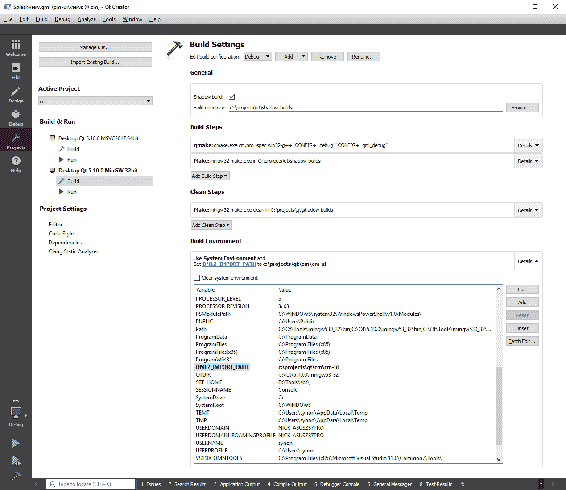

这将`cm-ui`项目的工作目录(`/projects/qt/cm/cm-ui`)添加到 QML 导入路径。请注意，我们的模块名必须反映到`qmldir`文件相对于此导入路径的相对路径。

这种方法的问题在于，这个环境变量与`cm.pro.user`文件绑定。如果您与其他开发人员共享项目，他们将拥有自己的`cm.pro.user`文件，并且他们必须记住也要添加这个变量。此外，它与绝对路径绑定，如果您将项目代码复制到另一台机器上，它可能不在那个位置。

第二种，也是首选的选项是在实例化**QQmlApplicationEngine**之后立即在`main.cpp`中添加以下行：

```cpp
engine.addImportPath("qrc:/");
```

那么为什么是`qrc:/`而不是我们`qmldir`文件的绝对路径？您会记得我们在`cm-ui.pro`中的`RESOURCES`变量中添加了我们的`views.qrc`资源包。这样做的作用是将`views.qrc`中的所有文件编译到应用程序二进制文件中，形成一种虚拟文件系统，其中前缀充当虚拟文件夹。这个虚拟文件系统的根目录被引用为`qrc:/`，通过在导入路径中使用这个，我们实质上是在要求 Qt 在我们的所有捆绑资源文件中查找任何模块。转到`cm-ui.pro`，确保我们的新`assets.qrc`也已添加到`RESOURCES`中：

```cpp
RESOURCES += views.qrc \
    assets.qrc
```

这可能有点令人困惑，所以重申一下，我们已经添加了以下文件夹来搜索新的模块，可以使用 QML2_IMPORT_PATH 环境变量在本地物理文件系统上搜索我们的`cm-ui`项目文件夹，或者使用`addImportPath()`方法在运行时搜索我们虚拟资源文件系统的根目录。

在这两种情况下，定义我们的新模块的`qmldir`文件位于一个名为`assets`的文件夹中，即在物理文件系统中的`<Qt Projects>/cm/cm-ui/assets`或虚拟文件系统中的`qrc:/assets`。

这给我们模块名`assets`。如果我们的文件夹结构更深，比如 stuff/badgers/assets，那么我们的模块需要被称为`stuff.badgers.assets`，因为这是相对于我们定义的导入路径的路径。同样，如果我们想为现有视图添加另一个模块，我们将在`cm-ui/views`中创建一个`qmldir`文件，并称模块为`views`。

如果您发现 Qt Creator 仍然有点困惑，红线仍然存在，请确保`cm-ui.pro`包含`QML_IMPORT_PATH += $$PWD`行。

有了这一切，我们现在可以使用我们的新模块。包括模块意味着我们现在可以访问我们的单例`Style`对象并从中读取属性。替换我们的`SplashView`的`color`属性：

```cpp
Rectangle {
    ...    
    color: Style.colourBackground
    ...
}
```

重复此操作，为除`MasterView`之外的所有视图设置背景颜色。记得在每个视图中也包含`include ui.assets 1.0`。

当您构建和运行应用程序时，您可能会想知道为什么我们要经历所有这些麻烦，而视图看起来与以前完全相同。好吧，假设我们刚刚与营销部的人开了个会，他们告诉我们，橙黄色不再适合品牌，我们需要将所有视图更改为干净的米白色。以前，我们必须进入每个视图，并将颜色从`#f4c842`更改为`#efefef`。现在，只有七个，所以这没什么大不了的，但是想象一下，如果我们不得不为 50 个复杂的视图中的所有组件更改所有颜色，那将是一个非常痛苦的过程。

然而，转到`Style.qml`并将`colourBackground`属性从`#f4c842`更改为`#efefef`。构建和运行应用程序，沐浴在我们重新品牌的应用程序的荣耀中！通过尽早设置我们的共享样式组件，我们可以在进行的过程中添加属性，然后稍后重新设计我们的应用程序变得更容易。我们可以在这里添加所有类型的属性，不仅仅是颜色，所以随着我们进一步开发，我们将添加大小、字体和其他东西。

# Font Awesome

有了我们的样式框架，让我们来看看我们的导航栏是什么样子的，然后想想我们想要实现什么：

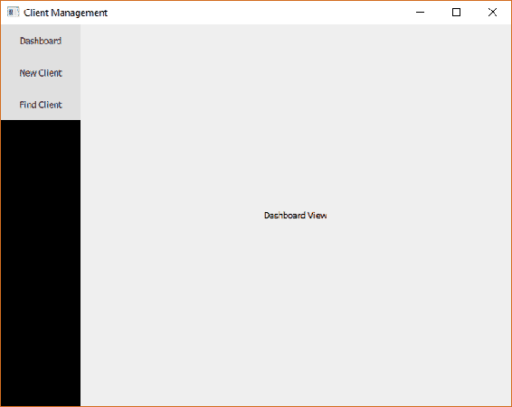

我们想要在导航栏上显示的按钮是仪表板视图（主页视图）、新客户视图和查找客户视图，以及顶部的切换按钮，用于展开和折叠栏。

常见的 UI 设计模式是使用图标表示简单的命令。有多种方式可以获取有关命令的更多信息；例如，当您悬停在按钮上时，可以在工具提示中或屏幕底部的状态栏中显示信息。我们的方法是拥有一个可折叠的栏。栏的默认状态将是折叠的，并显示代表每个命令的图标。在展开状态下，栏将显示图标和命令的文本描述。用户可以使用额外的按钮切换状态。这是一种在移动应用程序开发中特别普遍的模式，因为您希望默认情况下尽可能少地占用屏幕空间。

有几种选项可以显示按钮的图标。较旧的桌面应用程序很可能会使用某种图像文件。这样可以完全控制图标的外观，但也带来了一些缺点。图像文件往往比较大，并且是固定大小的。如果需要以不同的大小绘制它们，它们可能会看起来很糟糕，特别是如果它们被放大或者纵横比发生变化。

**可缩放矢量图形**（**SVG**）文件要小得多，并且缩放效果非常好。它们更难创建，在艺术上可能有一些限制，但对于图标的用途非常有用。然而，根据经验，它们在 Qt/QML 中可能会很棘手。

第三种选项可以让您获得 SVG 的小文件大小和可伸缩性优势，但更容易使用的是符号字体文件。这是 Web 开发中非常常见的解决方案，也是我们将采取的方法。

有许多符号字体可用，但也许最受欢迎的是**Font Awesome**。它提供了各种精彩的符号，并且有一个非常有帮助的网站；请查看：[`fontawesome.io/`](http://fontawesome.io/)。

检查您选择使用的字体的任何许可证，特别是如果您要商业使用它们。

下载工具包并打开存档文件。我们感兴趣的文件是`fonts`/`fontawesome-webfont.ttf`。将此文件复制到我们项目文件夹中的`cm/cm-ui/assets`中。

在我们的`cm-ui`项目中，编辑`assets.qrc`并将字体添加到我们的资源中：

```cpp
<file alias="fontawesome.ttf">assets/fontawesome-webfont.ttf</file>
```

请记住，我们的别名不一定要与原始文件名相同，我们已经有机会将其缩短一点。

接下来，编辑`Style.qml`，我们将把字体与我们的自定义样式连接起来，以便轻松使用。我们首先需要加载字体并使其可用，我们使用`FontLoader`组件来实现这一点。在根**Item**元素内添加以下内容：

```cpp
FontLoader {
    id: fontAwesomeLoader
    source: "qrc:/assets/fontawesome.ttf"
}    
```

在`source`属性中，我们使用了我们在`assets.qrc`文件中定义的`/assets`前缀（或虚拟文件夹），以及`fontawesome.ttf`的别名。现在，我们已经加载了字体，但是就目前而言，我们无法从`Style.qml`之外引用它。这是因为只有根组件级别的属性可以在文件之外访问。子组件被视为私有的。我们绕过这个问题的方法是为我们想要公开的元素创建一个`property alias`：

```cpp
Item {
    property alias fontAwesome: fontAwesomeLoader.name

    readonly property color colourBackground: "#efefef"

    FontLoader {
        id: fontAwesomeLoader
        source: "qrc:/assets/fontawesome.ttf"
    }    
}
```

这将创建一个名为`fontAwesome`的公共可用属性，当调用时，它会简单地将调用者重定向到内部`fontAwesomeLoader`元素的`name`属性。

完成连接后，让我们找到我们想要使用的图标。回到 Font Awesome 网站，转到图标页面。在这里，您可以看到所有可用的图标。单击其中一个将显示有关它的更多信息，我们可以从中获取需要显示它的关键信息，即 Unicode 字符。我将为我们的菜单选择以下图标，但请随意选择任何您想要的图标：

| **命令** | **图标** | **Unicode 字符** |
| --- | --- | --- |
| Toggle Menu | bars | f0c9 |
| Dashboard | home | f015 |
| New Client | user-plus | f234 |
| Find Client | search | f002 |

现在，让我们用每个图标的`Text`组件替换`MasterView`上的`Button`组件：

```cpp
Column {
    Text {
        font {
            family: Style.fontAwesome
            pixelSize: 42
        }
        color: "#ffffff"
        text: "\uf0c9"
    }
    Text {
        font {
            family: Style.fontAwesome
            pixelSize: 42
        }
        color: "#ffffff"
        text: "\uf015"
    }
    Text {
        font {
            family: Style.fontAwesome
            pixelSize: 42
        }
        color: "#ffffff"
        text: "\uf234"
    }
    Text {
        font {
            family: Style.fontAwesome
            pixelSize: 42
        }
        color: "#ffffff"
        text: "\uf002"
    }
}
```

如果您还没有添加**assets 1.0**导入，则还需要添加它：

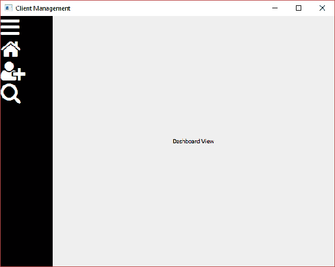

接下来，我们将为客户命令添加描述性文本。将每个`Text`组件包装在`Row`中，并添加一个描述的`Text`组件，如下所示：

```cpp
Row {
    Text {
        font {
            family: Style.fontAwesome
            pixelSize: 42
        }
        color: "#ffffff"
        text: "\uf234"
    }
    Text {
        color: "#ffffff"
        text: "New Client"
    }
}
```

`Row`组件将水平布置其子元素——首先是图标，然后是描述性文本。对其他命令重复此操作。为其他按钮添加 Dashboard 和 Find Client 的描述，对于切换命令只需添加空字符串：

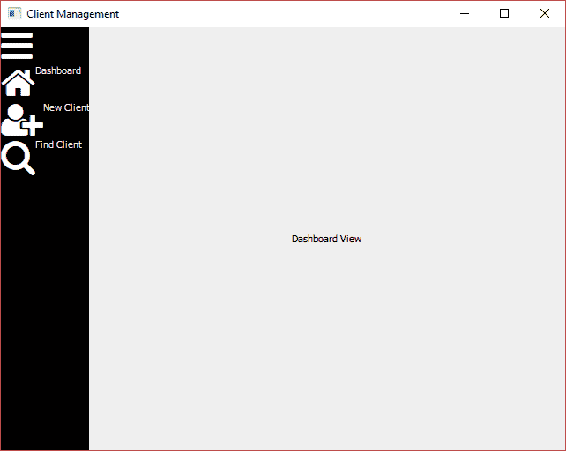

在我们进一步进行更改之前，我们将停下来，进行一些重构，并开始引入组件。

# 组件

我们刚刚编写的 QML 已经足够功能，但已经变得难以维护。我们的`MasterView`变得有点长，难以阅读。例如，当我们要更改命令按钮的外观时，例如对齐图标和文本，我们将不得不在四个地方进行更改。如果我们想要添加第五个按钮，我们必须复制、粘贴和编辑大量的 QML。这就是可重用组件发挥作用的地方。

组件与我们已经创建的视图完全相同——只是 QML 的片段。区别纯粹是语义上的。在本书中，视图代表布局内容的屏幕，而组件是内容。

创建新组件的最简单方法是当您已经编写了要形成组件基础的 QML 时。右键单击我们为命令添加的任何`Row`元素，并选择**重构 > 将组件移动到单独的文件中**。

将新组件命名为`NavigationButton`并将其保存到一个新文件夹`cm/cm-ui/components`中：

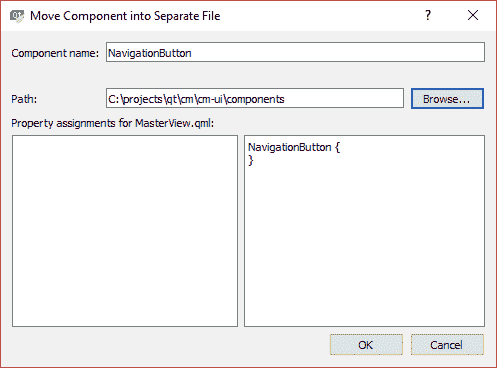

`Row`元素将移动到我们的新文件中，在`MasterView`中，您将得到一个空的`NavigationButton`组件：

```cpp
NavigationButton {
}
```

不幸的是，它带有一个大大的红色波浪线，我们的应用程序将不再运行。虽然重构步骤已经为我们创建了一个新的`NavigationButton.qml`文件，但它实际上并没有包含在我们的项目中，所以 Qt 不知道它在哪里。不过，解决起来很容易，我们只需要像我们对视图和资产所做的那样设置我们的资源包：

1.  创建一个名为`components.qrc`的新的`Qt Resource File`，放在`cm/cm-ui`文件夹中

1.  在`cm/cm-ui/components`中创建一个空的`qmldir`文件，就像我们为我们的资产所做的那样

1.  编辑`components.qrc`以在`/components`前缀下包含我们的两个新文件：

```cpp
<RCC>
    <qresource prefix="/components">
        <file alias="qmldir">components/qmldir</file>
        <file   
 alias="NavigationButton.qml">components/NavigationButton.qml</file>
    </qresource>
</RCC>
```

1.  编辑`qmldir`以设置我们的模块并将我们的`NavigationButton`组件添加到其中：

```cpp
module components
NavigationButton 1.0 NavigationButton.qml
```

1.  确保`components.qrc`已添加到`cm-ui.pro`中的`RESOURCES`变量中

1.  在`MasterView`中，包含我们的新组件模块，以便访问我们的新组件：

```cpp
import components 1.0
```

有时，要使我们的模块得到完全识别并消除红色波浪线，可能只能通过重新启动 Qt Creator 来实现，因为这样可以强制重新加载所有的 QML 模块。

现在我们有一个可重用的组件，隐藏了实现细节，减少了代码重复，并且更容易添加新的命令和维护旧的命令。然而，在我们可以为其他命令利用它之前，还有一些改变需要做。

目前，我们的`NavigationButton`有硬编码的图标和描述文本值，无论何时我们使用组件，它们都将是相同的。我们需要公开文本属性，以便我们可以为我们的每个命令设置不同的值。正如我们所看到的，我们可以使用属性别名来实现这一点，但我们需要为此添加唯一的标识符到我们的`Text`元素中。让我们将默认值设置为一些通用的内容，并且还要实现本书早期的建议，将`Item`组件作为根元素：

```cpp
import QtQuick 2.9
import assets 1.0

Item {
    property alias iconCharacter: textIcon.text
    property alias description: textDescription.text

    Row {
        Text {
            id: textIcon
            font {
                family: Style.fontAwesome
                pixelSize: 42
            }
            color: "#ffffff"
            text: "\uf11a"
        }
        Text {
            id: textDescription
            color: "#ffffff"
            text: "SET ME!!"
        }
    }
}
```

现在我们的组件可以通过属性进行配置，我们可以替换`MasterView`中的命令：

```cpp
Column {
    NavigationButton {
        iconCharacter: "\uf0c9"
        description: ""
    }
    NavigationButton {
        iconCharacter: "\uf015"
        description: "Dashboard"
    }
    NavigationButton {
        iconCharacter: "\uf234"
        description: "New Client"
    }
    NavigationButton {
        iconCharacter: "\uf002"
        description: "Find Client"
    }
}
```

这比我们之前拥有的所有重复的 QML 要简洁和易于管理得多。现在，如果你运行应用程序，你会看到虽然我们已经向前迈出了一小步，但我们也后退了一步：

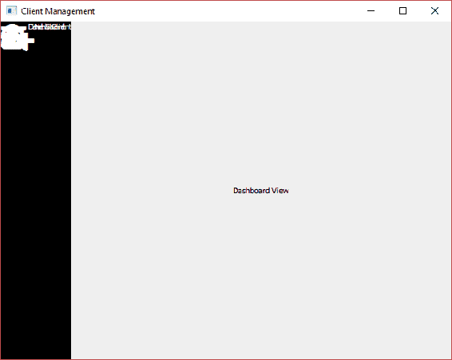

正如你所看到的，我们所有的组件都是叠加在一起的。这个问题的根本原因是我们之前提到的关于大小的问题。我们有一个带有根`Item`元素的可视组件，并且我们没有明确定义它的大小。我们忽视的另一件事是我们的自定义样式。让我们接下来修复这些问题。

# 样式化导航栏

从简单的部分开始，让我们首先将`NavigationButton`中的硬编码颜色和图标像素大小移到`Style.qml`中：

```cpp
readonly property color colourNavigationBarBackground: "#000000"
readonly property color colourNavigationBarFont: "#ffffff"
readonly property int pixelSizeNavigationBarIcon: 42
```

我们现在需要考虑我们想要调整按钮元素的大小。我们有一个图标，我们希望它是正方形的，所以宽度和高度将是相同的。接下来，我们有一个文本描述，它的高度将与图标相同，但宽度会更宽：

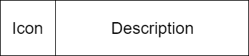

整个组件的宽度是图标的宽度加上描述的宽度。整个组件的高度与图标和描述的高度相同；然而，这样做可以让我们更灵活地将高度设置为两者中较大的一个。这样，如果我们决定将一个项目变大，我们知道组件将足够大以容纳它们。让我们选择图标的起始尺寸为 80 x 80，描述的尺寸为 80 x 240，并定义这些属性：

```cpp
readonly property real widthNavigationButtonIcon: 80
readonly property real heightNavigationButtonIcon: widthNavigationButtonIcon
readonly property real widthNavigationButtonDescription: 240
readonly property real heightNavigationButtonDescription: heightNavigationButtonIcon
readonly property real widthNavigationButton: widthNavigationButtonIcon + widthNavigationButtonDescription
readonly property real heightNavigationButton: Math.max(heightNavigationButtonIcon, heightNavigationButtonDescription)
```

这里有几件事情需要注意。属性可以直接绑定到其他属性，这样可以减少重复的数量，使整个设置更加动态。我们知道我们希望我们的图标是正方形的，所以通过将高度绑定为与宽度相同，如果我们想要改变图标的总大小，我们只需要更新宽度，高度将自动更新。QML 还与 JavaScript 引擎有很强的集成，所以我们可以使用`Math.max()`函数来帮助我们找出哪个高度更大。

我们希望导航按钮提供一些视觉提示，当用户将鼠标悬停在按钮上时，指示它是一个交互元素。为了做到这一点，我们需要每个按钮都有自己的背景矩形。

在`NavigationButton`中，将`Row`元素包装在一个新的`Rectangle`中，并将尺寸插入到我们的组件中：

```cpp
Item {
    property alias iconCharacter: textIcon.text
    property alias description: textDescription.text

    width: Style.widthNavigationButton
    height: Style.heightNavigationButton

    Rectangle {
        id: background
        anchors.fill: parent
        color: Style.colourNavigationBarBackground

        Row {
            Text {
                id: textIcon
                width: Style.widthNavigationButtonIcon
                height: Style.heightNavigationButtonIcon
                font {
                    family: Style.fontAwesome
                    pixelSize: Style.pixelSizeNavigationBarIcon
                }
                color: Style.colourNavigationBarFont
                text: "\uf11a"
            }
            Text {
                id: textDescription
                width: Style.widthNavigationButtonDescription
                height: Style.heightNavigationButtonDescription
                color: Style.colourNavigationBarFont
                text: "SET ME!!"
            }
        }
    }
}
```

再次运行，你会看到略微的改进：

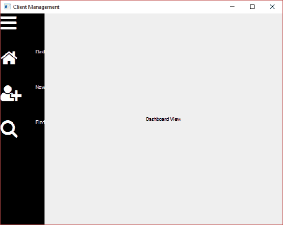

我们的导航栏被硬编码为 100 像素宽，导致部分描述被切断。我们需要改变这一点，并且还要实现切换展开/折叠的功能。我们已经计算出了我们需要的尺寸，所以让我们通过向`Style.qml`添加一些新属性来做好准备：

```cpp
readonly property real widthNavigationBarCollapsed: widthNavigationButtonIcon
readonly property real heightNavigationBarExpanded: widthNavigationButton
```

折叠状态将刚好宽到足够容纳图标，而展开状态将包含整个按钮，包括描述。

接下来，让我们将我们的导航栏封装在一个新的组件中。在这种情况下，不会有任何重用的好处，因为只会有一个，但这有助于保持我们的 QML 组织有序，并使`MasterView`更简洁和易于阅读。

你可以右键单击`MasterView`中的`Rectangle`组件，并将我们的导航栏重构为一个新的 QML 文件，就像我们为我们的`NavigationButton`所做的那样。然而，让我们手动操作，这样你就可以熟悉这两种方法。右键单击`components.qrc`，然后选择添加新内容... > Qt > QML 文件。将`NavigationBar.qml`添加到`cm/cm-ui/components`中：

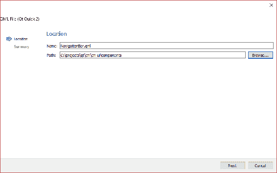

编辑`components.qrc`，将我们的新`NavigationBar`移动到`/components`前缀部分，并使用别名：

```cpp
<file alias="NavigationBar.qml">components/NavigationBar.qml</file>
```

将组件添加到我们的组件模块中，编辑`qmldir`：

```cpp
NavigationBar 1.0 NavigationBar.qml
```

从`MasterView`中剪切`Rectangle`及其子元素，并将其粘贴到`NavigationBar.qml`中的根`Item`元素内。如果已经初始化为较旧的版本，请将`QtQuick`模块导入更新为版本 2.9。添加一个导入我们资产模块的导入，以获得对我们 Style 对象的访问。将`Rectangle`的`anchors`和`width`属性移到根`Item`，并设置`Rectangle`以填充其父元素：

```cpp
import QtQuick 2.9
import assets 1.0

Item {
    anchors {
        top: parent.top
        bottom: parent.bottom
        left: parent.left
    }
    width: 100

    Rectangle {
        anchors.fill: parent
        color: "#000000"

        Column {
            NavigationButton {
                iconCharacter: "\uf0c9"
                description: ""
            }
            NavigationButton {
                iconCharacter: "\uf015"
                description: "Dashboard"
            }
            NavigationButton {
                iconCharacter: "\uf234"
                description: "New Client"
            }
            NavigationButton {
                iconCharacter: "\uf002"
                description: "Find Client"
            }
        }
    }
}
```

回到`MasterView`，现在可以在原来的`Rectangle`位置添加新的`NavigationBar`组件：

```cpp
NavigationBar {
    id: navigationBar
}
```

虽然你会再次看到可怕的红色波浪线，但你实际上可以运行应用程序并验证重构没有出现任何问题。

我们新的`NavigationBar`组件的定位是好的，但`width`要复杂一些——我们怎么知道它应该是`Style.widthNavigationBarCollapsed`还是`Style.heightNavigationBarExpanded`？我们将通过一个公开访问的布尔属性来控制这一点，该属性指示栏是否已折叠。然后我们可以使用这个属性的值来决定我们想要使用哪个宽度，使用条件`?`操作符语法。最初将属性设置为 true，这样栏将默认以折叠状态呈现：

```cpp
property bool isCollapsed: true
```

有了这个，替换 100 的硬编码`width`如下：

```cpp
width: isCollapsed ? Style.widthNavigationBarCollapsed : Style.heightNavigationBarExpanded
```

接下来，更新`Rectangle`的`color`属性为`Style.colourNavigationBarBackground`：

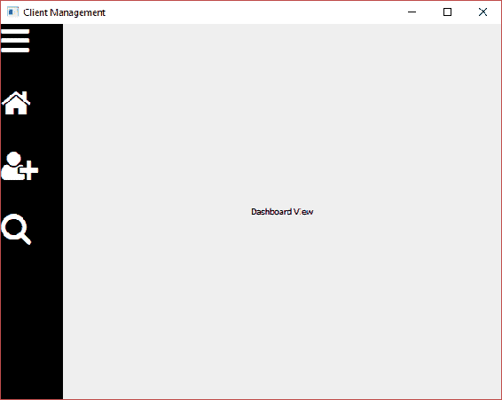

现在我们已经接近了，但我们一路上错过的一个关键点是，现在点击按钮实际上什么都不做了。让我们下一步修复这个问题。

# 点击

在本书的早期，我们看过一个叫做`MouseArea`的组件。这很快被我们使用的`Button`组件所取代，它为我们提供了点击功能。然而，现在我们正在开发自己的按钮形式，我们需要自己实现点击功能。与`Button`组件类似，我们的`NavigationButton`在被点击时实际上不应该做任何事情，除了通知其父组件事件已发生。组件应尽可能地通用和无知于上下文，以便您可以在多个地方使用它们。我们需要做的是添加一个`MouseArea`组件，并通过自定义信号简单地传递`onClicked`事件。

在`NavigationButton`中，我们首先添加我们希望在组件被点击时发出的信号。在属性之后添加这个：

```cpp
signal navigationButtonClicked()
```

尽量给信号起相当具体的名称，即使有点长。如果你简单地把一切都叫做`clicked()`，那么事情可能会变得有点混乱，有时你可能会发现自己引用了一个不同于你打算的信号。

接下来，我们将添加另一个属性来支持我们将要实现的鼠标悬停效果。这将是一个`color`类型，并且我们将默认它为常规背景颜色：

```cpp
property color hoverColour: Style.colourNavigationBarBackground
```

我们将与`Rectangle`的`states`属性一起使用这个颜色：

```cpp
states: [
    State {
        name: "hover"
        PropertyChanges {
            target: background
            color: hoverColour
        }
    }
]
```

将数组中的每个状态视为一个命名配置。默认配置没有名称（""），由我们已经在`Rectangle`元素中设置的属性组成。 “悬停”状态应用于`PropertyChanges`元素中指定的属性的更改，也就是说，它将把 ID 为`background`的元素的`color`属性更改为`hoverColour`的值。

接下来，在`Rectangle`内但在`Row`下方，添加我们的`MouseArea`：

```cpp
MouseArea {
    anchors.fill: parent
    cursorShape: Qt.PointingHandCursor
    hoverEnabled: true
    onEntered: background.state = "hover"
    onExited: background.state = ""
    onClicked: navigationButtonClicked()
}
```

我们使用`anchors`属性来填充整个按钮背景区域，包括图标和描述。接下来，我们将通过将鼠标光标更改为指向手指，当它进入按钮区域时启用悬停`hoverEnabled`标志来使事情变得有趣一些。启用后，当光标进入和退出区域时会发出**entered**和**exited**信号，我们可以使用相应的插槽通过在刚刚实现的悬停状态和默认（""）之间切换来改变我们的背景`Rectangle`的外观。最后，我们通过`MouseArea`的`clicked()`信号响应`onClicked()`插槽并简单地发出我们自己的信号。

现在我们可以对`NavigationBar`组件中的`navigationButtonClicked()`信号做出反应，并在此过程中添加一些悬停颜色。首先实现切换按钮：

```cpp
NavigationButton {
    iconCharacter: "\uf0c9"
    description: ""
    hoverColour: "#993333"
    onNavigationButtonClicked: isCollapsed = !isCollapsed
}
```

我们实现了`<MyCapitalisedSignalName>`约定来为我们的信号创建一个插槽，当它触发时，我们只需在`true`和`false`之间切换`isCollapsed`的值。

现在可以运行应用程序。单击切换按钮以展开和折叠导航栏：

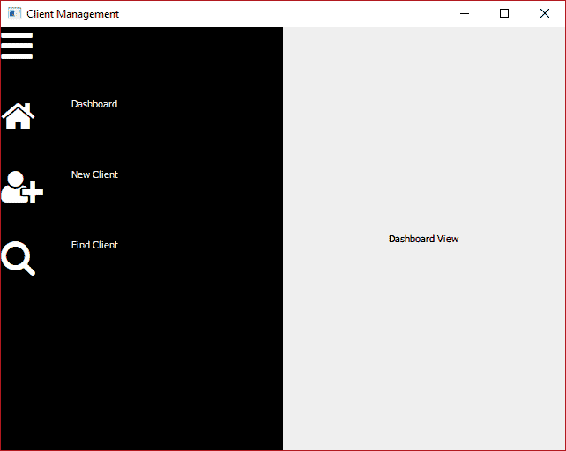

请注意，由于我们使用了`anchors`，子视图会动态调整大小以适应导航栏。当您悬停在按钮上时，还会看到指向手指光标和一道闪烁的颜色，这有助于用户理解它是一个交互式元素并可视化边界。

对于剩余的导航按钮，我们希望在点击事件发生时发出`NavigationCoordinator`上的`goDashboardView()`，`goCreateClientView()`和`goFindClientView()`信号。

将`onNavigationButtonClicked`插槽添加到其他按钮，并通过`masterController`对象深入到我们想要调用的信号。也可以添加一些自己喜欢的花哨颜色：

```cpp
NavigationButton {
    iconCharacter: "\uf015"
    description: "Dashboard"
    hoverColour: "#dc8a00"
    onNavigationButtonClicked: masterController.ui_navigationController.goDashboardView();
}
NavigationButton {
    iconCharacter: "\uf234"
    description: "New Client"
    hoverColour: "#dccd00"
    onNavigationButtonClicked: masterController.ui_navigationController.goCreateClientView();
}
NavigationButton {
    iconCharacter: "\uf002"
    description: "Find Client"
    hoverColour: "#8aef63"
    onNavigationButtonClicked: masterController.ui_navigationController.goFindClientView();
}
```

现在可以单击按钮导航到不同的子视图。

为了完成导航栏的最后一些微调，我们需要更好地对齐按钮的内容并调整一些大小。

描述文本应该垂直对齐到图标的中心而不是顶部，我们的图标应该居中而不是紧贴窗口边缘。第一个问题很容易解决，因为我们已经在大小上保持了一致并且明确。只需将以下属性添加到`NavigationButton`中的两个`Text`组件中：

```cpp
verticalAlignment: Text.AlignVCenter
```

两个`Text`元素的大小被调整为占据整个按钮的高度，因此我们只需要在该空间内垂直对齐文本。

修复图标的对齐方式与之前一样，但这次是在水平轴上。在图标的`Text`组件中添加以下内容：

```cpp
horizontalAlignment: Text.AlignHCenter
```

至于大小，我们的描述文本有点小，文本后面有很多空白。向我们的`Style`对象添加一个新属性：

```cpp
readonly property int pixelSizeNavigationBarText: 22
```

在描述`Text`元素中使用新属性：

```cpp
font.pixelSize: Style.pixelSizeNavigationBarText
```

接下来，将`Style`中的`widthNavigationButtonDescription`属性减小到 160。

运行应用程序，我们几乎到达目标了。大小和对齐现在好多了：

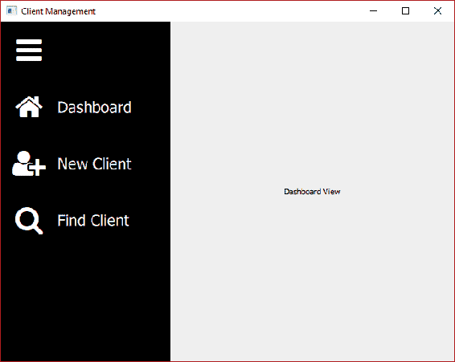

但是，您可能没有注意到的一件事是，当栏被折叠并且只显示图标时，`MouseArea`仍然是包括描述的整个按钮的宽度。尝试将鼠标移动到描述的位置，您会看到指向手光标出现。您甚至可以单击组件，然后进行过渡。我们需要做的是，而不是`NavigationButton`中的根`Item`元素是一个固定宽度（`Style.widthNavigationButton`），我们需要使其动态，并将其设置为`parent.width`。为了使其工作，我们需要沿着 QML 层次结构向上走，并确保其父级也有宽度。其父级是`NavigationBar`中的`Column`元素。将`Column`的`width`属性设置为`parent.width`。

有了这些改变，导航栏现在的行为符合预期。

# 命令

我们待办事项清单上的下一件事是实现一个上下文敏感的命令栏。虽然我们的导航栏是一个恒定的存在，无论用户在做什么，都有相同的按钮，但是命令栏会出现和消失，并且会根据上下文包含不同的按钮。例如，如果用户正在添加或编辑客户，我们将需要一个保存按钮来提交对数据库的任何更改。然而，如果我们正在搜索客户，那么保存就没有意义，而查找按钮更相关。虽然创建命令栏的技术与导航栏大致相似，但所需的额外灵活性提出了更大的挑战。

为了帮助我们克服这些障碍，我们将实现命令。这种方法的额外好处是，我们可以将逻辑从 UI 层移出，并移到业务逻辑层。我喜欢 UI 尽可能愚蠢和通用。这样可以使您的应用程序更加灵活，而且 C++代码中的错误比 QML 中的错误更容易识别和解决。

命令对象将封装一个图标，描述性文本，一个用于确定按钮是否启用的函数，最后，一个在相关按钮被按下时将被发射的`executed()`信号。然后我们的命令栏中的每个按钮将绑定到一个命令对象上。

我们的每个子视图可能都有一个命令列表和一个关联的命令栏。对于具有这些功能的视图，我们将通过命令控制器向 UI 呈现命令列表。

在`cm-lib`项目中创建两个新的`C++`类，两者都应该继承自 QObject：

+   **在新文件夹`cm-lib/source/framework`中的命令**

+   **现有文件夹`cm-lib/source/controllers`中的命令控制器**

`command.h`：

```cpp
#ifndef COMMAND_H
#define COMMAND_H

#include <functional>

#include <QObject>
#include <QScopedPointer>
#include <QString>

#include <cm-lib_global.h>

namespace cm {
namespace framework {

class CMLIBSHARED_EXPORT Command : public QObject
{
    Q_OBJECT
    Q_PROPERTY( QString ui_iconCharacter READ iconCharacter CONSTANT )
    Q_PROPERTY( QString ui_description READ description CONSTANT )
    Q_PROPERTY( bool ui_canExecute READ canExecute NOTIFY canExecuteChanged )

public:
    explicit Command(QObject* parent = nullptr,
                     const QString& iconCharacter = "",
                     const QString& description = "",
                     std::function<bool()> canExecute = [](){ return 
                                                           true; });
    ~Command();

    const QString& iconCharacter() const;
    const QString& description() const;
    bool canExecute() const;

signals:
    void canExecuteChanged();
    void executed();

private:
    class Implementation;
    QScopedPointer<Implementation> implementation;
};

}}

#endif
```

`command.cpp`：

```cpp
#include "command.h"

namespace cm {
namespace framework {

class Command::Implementation
{
public:
    Implementation(const QString& _iconCharacter, const QString& 
     _description, std::function<bool()> _canExecute)
        : iconCharacter(_iconCharacter)
        , description(_description)
        , canExecute(_canExecute)
    {
    }

    QString iconCharacter;
    QString description;
    std::function<bool()> canExecute;
};

Command::Command(QObject* parent, const QString& iconCharacter, const QString& description, std::function<bool()> canExecute)
    : QObject(parent)
{
    implementation.reset(new Implementation(iconCharacter, description, canExecute));
}

Command::~Command()
{
}

const QString& Command::iconCharacter() const
{
    return implementation->iconCharacter;
}

const QString& Command::description() const
{
    return implementation->description;
}

bool Command::canExecute() const
{
    return implementation->canExecute();
}

}
}
```

现在，QObject，命名空间和 dll 导出代码应该是熟悉的。我们将要在 UI 按钮上显示的图标字符和描述值表示为字符串。我们将成员变量隐藏在私有实现中，并为它们提供`访问器`方法。我们可以将`canExecute`成员表示为一个简单的`bool`成员，调用代码可以根据需要将其设置为`true`或`false`；然而，一个更加优雅的解决方案是传入一个方法，让它在运行时为我们计算值。默认情况下，我们将其设置为返回`true`的 lambda，这意味着按钮将被启用。我们提供了一个`canExecuteChanged()`信号来配合使用，我们可以在需要 UI 重新评估按钮是否启用时触发它。最后一个元素是`executed()`信号，当相应的按钮被按下时将被 UI 触发。

`command-controller.h`：

```cpp
#ifndef COMMANDCONTROLLER_H
#define COMMANDCONTROLLER_H

#include <QObject>
#include <QtQml/QQmlListProperty>
#include <cm-lib_global.h>
#include <framework/command.h>

namespace cm {
namespace controllers {

class CMLIBSHARED_EXPORT CommandController : public QObject
{
    Q_OBJECT
    Q_PROPERTY(QQmlListProperty<cm::framework::Command> 
     ui_createClientViewContextCommands READ  
     ui_createClientViewContextCommands CONSTANT)

public:
    explicit CommandController(QObject* _parent = nullptr);
    ~CommandController();

    QQmlListProperty<framework::Command> 
    ui_createClientViewContextCommands();

public slots:
    void onCreateClientSaveExecuted();

private:
    class Implementation;
    QScopedPointer<Implementation> implementation;
};

}}

#endif
```

`command-controller.cpp`：

```cpp
#include "command-controller.h"

#include <QList>
#include <QDebug>

using namespace cm::framework;

namespace cm {
namespace controllers {

class CommandController::Implementation
{
public:
    Implementation(CommandController* _commandController)
        : commandController(_commandController)
    {
        Command* createClientSaveCommand = new Command( 
          commandController, QChar( 0xf0c7 ), "Save" );
        QObject::connect( createClientSaveCommand, &Command::executed,   
   commandController, &CommandController::onCreateClientSaveExecuted );
        createClientViewContextCommands.append( createClientSaveCommand );
    }

    CommandController* commandController{nullptr};

    QList<Command*> createClientViewContextCommands{};
};

CommandController::CommandController(QObject* parent)
    : QObject(parent)
{
    implementation.reset(new Implementation(this));
}

CommandController::~CommandController()
{
}

QQmlListProperty<Command> CommandController::ui_createClientViewContextCommands()
{
    return QQmlListProperty<Command>(this, implementation->createClientViewContextCommands);
}

void CommandController::onCreateClientSaveExecuted()
{
    qDebug() << "You executed the Save command!";
}

}}
```

在这里，我们引入了一个新类型——`QQmlListProperty`。它本质上是一个包装器，使 QML 能够与自定义对象列表进行交互。请记住，我们需要在`Q_PROPERTY`语句中完全限定模板化类型。实际保存数据的私有成员是一个 QList，并且我们已经实现了一个将 QList 取出并将其转换为相同模板化类型的`QQmlListProperty`的`访问器`方法。

根据`QQmlListProperty`的文档，这种对象构造方法不应该在生产代码中使用，但我们将使用它来保持简单。

我们为`CreateClientView`创建了一个单一的命令列表。稍后我们将为其他视图添加命令列表。同样，现在我们会保持简单；我们只创建一个用于保存新创建客户的命令。在创建命令时，我们将其父级设置为命令协调器，这样我们就不必担心内存管理。我们为其分配了一个软盘图标（unicode f0c7）和`Save`标签。我们暂时将`canExecute`函数保持为默认值，这样它将始终处于启用状态。接下来，我们将`command`的`executed()`信号连接到`CommandController`的`onCreateClientSaveExecuted()`槽。连接完成后，我们将命令添加到列表中。

我们的意图是向用户呈现一个绑定到`Command`对象的命令按钮。当用户按下按钮时，我们将从 UI 触发`executed()`信号。我们设置的连接将导致命令控制器上的槽被调用，然后我们将执行我们的业务逻辑。现在，当按钮被按下时，我们将简单地在控制台上打印一行。

接下来，在`main.cpp`中注册我们的两种新类型（记住`#includes`）：

```cpp
qmlRegisterType<cm::controllers::CommandController>("CM", 1, 0, "CommandController");
qmlRegisterType<cm::framework::Command>("CM", 1, 0, "Command");
```

最后，我们需要将`CommandCoordinator`属性添加到`MasterController`中：

```cpp
Q_PROPERTY( cm::controllers::CommandController* ui_commandController READ commandController CONSTANT )
```

然后，我们添加一个`accessor`方法：

```cpp
CommandController* commandController();
```

最后，在`master-controller.cpp`中，实例化私有实现中的对象，并以与我们为`NavigationController`做的方式完全相同的方式实现`accessor`方法。

现在，我们已经为我们的`CreateClientView`准备好了一个（非常简短的！）命令列表。

# 命令栏

让我们首先为我们的命令组件的样式添加一些属性：

```cpp
readonly property color colourCommandBarBackground: "#cecece"
readonly property color colourCommandBarFont: "#131313"
readonly property color colourCommandBarFontDisabled: "#636363"
readonly property real heightCommandBar: heightCommandButton
readonly property int pixelSizeCommandBarIcon: 32
readonly property int pixelSizeCommandBarText: 12

readonly property real widthCommandButton: 80
readonly property real heightCommandButton: widthCommandButton
```

接下来，在我们的 UI 项目中创建两个新的 QML 组件：在`cm-ui/components`中创建`CommandBar.qml`和`CommandButton.qml`。更新`components.qrc`并将新组件移动到带有别名的`/components`前缀中。编辑`qmldir`并追加新组件：

```cpp
CommandBar 1.0 CommandBar.qml
CommandButton 1.0 CommandButton.qml
```

对于我们的按钮设计，我们希望在图标下方布置描述。图标应该略微位于中心位置之上。组件应该是正方形的，如下所示：

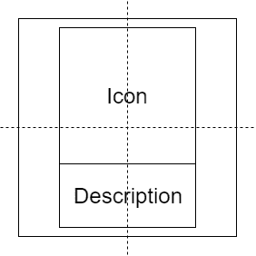

`CommandButton.qml`：

```cpp
import QtQuick 2.9
import CM 1.0
import assets 1.0

Item {
    property Command command
    width: Style.widthCommandButton
    height: Style.heightCommandButton

    Rectangle {
        id: background
        anchors.fill: parent
        color: Style.colourCommandBarBackground

        Text {
            id: textIcon
            anchors {
                centerIn: parent
                verticalCenterOffset: -10
            }
            font {
                family: Style.fontAwesome
                pixelSize: Style.pixelSizeCommandBarIcon
            }
            color: command.ui_canExecute ? Style.colourCommandBarFont : 
                                          colourCommandBarFontDisabled
            text: command.ui_iconCharacter
            horizontalAlignment: Text.AlignHCenter
        }

        Text {
            id: textDescription
            anchors {
                top: textIcon.bottom
                bottom: parent.bottom
                left: parent.left
                right: parent.right
            }
            font.pixelSize: Style.pixelSizeNavigationBarText
            color: command.ui_canExecute ? Style.colourCommandBarFont : 
                                          colourCommandBarFontDisabled
            text: command.ui_description
            horizontalAlignment: Text.AlignHCenter
            verticalAlignment: Text.AlignVCenter
        }

        MouseArea {
            anchors.fill: parent
            cursorShape: Qt.PointingHandCursor
            hoverEnabled: true
            onEntered: background.state = "hover"
            onExited: background.state = ""
            onClicked: if(command.ui_canExecute) {
                           command.executed();
                       }
        }

        states: [
            State {
                name: "hover"
                PropertyChanges {
                    target: background
                    color: Qt.darker(Style.colourCommandBarBackground)
                }
            }
        ]
    }
}
```

这与我们的`NavigationButton`组件非常相似。我们传入一个`Command`对象，从中我们将获取图标字符和描述以显示在**Text**元素中，以及在按钮被按下时发出的信号，只要命令可以执行。

我们使用了一种替代**Row/Column**布局的方法，并使用锚点来定位我们的图标和描述。我们将图标居中放置在父`Rectangle`中，然后应用垂直偏移将其向上移动，以便为描述留出空间。我们将描述的顶部锚定到图标的底部。

我们不是在按钮被按下时传播信号，而是首先验证命令是否可以执行，然后发出`Command`对象的`executed()`信号。我们还使用这个标志有选择地为我们的文本元素着色，如果命令被禁用，我们使用较浅的灰色字体。

我们使用`MouseArea`实现了一些更多的悬停功能，但我们不是暴露一个属性来传递悬停颜色，而是使用内置的`Qt.darker()`方法将默认颜色变暗几个色调。如果命令可以执行，我们也只在`MouseArea`的`onEntered()`槽中应用状态更改。

`CommandBar.qml`：

```cpp
import QtQuick 2.9
import assets 1.0

Item {
    property alias commandList: commandRepeater.model

    anchors {
        left: parent.left
        bottom: parent.bottom
        right: parent.right
    }
    height: Style.heightCommandBar

    Rectangle {
        anchors.fill: parent
        color: Style.colourCommandBarBackground

        Row {
            anchors {
                top: parent.top
                bottom: parent.bottom
                right: parent.right
            }

            Repeater {
                id: commandRepeater
                delegate: CommandButton {
                    command: modelData
                }
            }
        }
    }
}
```

这基本上与`NavigationBar`相同，但是使用动态命令列表而不是硬编码的 QML 按钮。我们引入了另一个新组件——`Repeater`。通过`model`属性提供的对象列表，`Repeater`将为列表中的每个项目实例化在`delegate`属性中定义的 QML 组件。列表中的对象可通过内置的`modelData`变量获得。使用这种机制，我们可以为给定列表中的每个命令自动生成一个`CommandButton`元素。我们使用另一个属性别名，以便调用者可以设置命令列表。

让我们在`CreateClientView`中使用它。首先，`import components 1.0`，然后在根`Item`内以及`Rectangle`之后添加以下内容：

```cpp
CommandBar {
    commandList: masterController.ui_commandController.ui_createClientViewContextCommands
}
```

我们通过属性层次结构深入到创建客户端视图的命令列表，并将该列表传递给负责处理其余部分的命令栏。如果`CommandBar`有红色波浪线，不要担心，Qt Creator 只是需要跟上我们的快速步伐。

运行应用程序并导航到创建客户端视图：

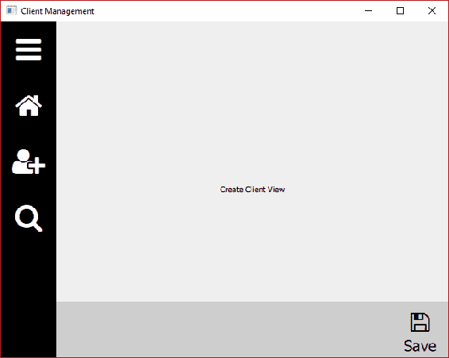

单击按钮，您将看到消息输出到控制台。添加新命令就像将新的`Command`对象附加到`CommandController`内的 QList 一样简单——不需要 UI 更改！命令栏将自动为列表中找到的每个命令创建一个新按钮。还要注意，此命令栏仅出现在`CreateClientView`上，因此它是上下文敏感的。我们可以通过简单地向`CommandController`添加额外的列表和属性来轻松地将命令栏添加到其他视图中，就像我们稍后将要做的那样。

# 总结

在本章中，我们对导航栏进行了急需的改进。我们添加了我们的前几个组件，并利用了我们的新自定义样式对象，Font Awesome 为我们提供了一些可爱的可伸缩图形。我们还引入了命令，并且已经准备好能够向我们的视图添加上下文敏感的命令按钮。

在第五章 *数据*中，我们将深入研究业务逻辑层，并完善我们的第一个数据模型。
