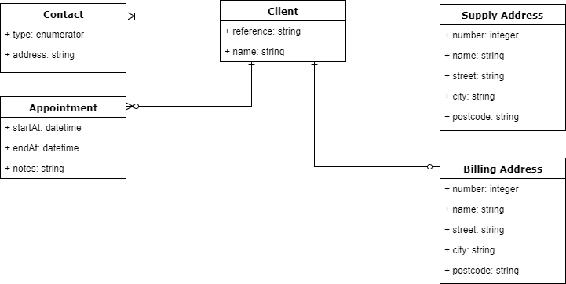
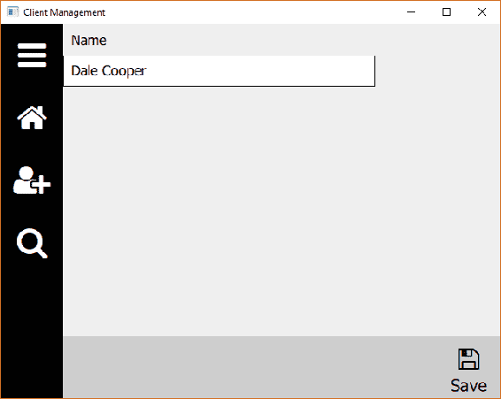

# 数据

在本章中，我们将实现处理任何业务应用程序中最关键部分的类——数据。我们将引入自我感知的数据实体，它们可以自动序列化到**JavaScript 对象表示**（**JSON**）中，这是一种在 Web 通信中经常使用的流行序列化格式。我们将为应用程序创建核心模型，并通过自定义控件将它们连接到我们的 UI 以进行读取和写入。我们将涵盖以下主题：

+   JSON

+   数据装饰器

+   抽象数据实体

+   数据实体的集合

+   具体数据模型

+   UI 控件和数据绑定

# JSON

如果您以前从未接触过 JSON，让我们快速进行一次简短的课程。这是一种简单而轻量的表达对象层次结构及其属性的方式。在发送 HTTP 请求时，这是一个非常受欢迎的选择。它类似于 XML 的意图，但要简洁得多。

JSON 对象封装在大括号`{}`中，属性以 key: value 的格式表示。字符串用双引号`""`括起来。我们可以将单个客户对象表示如下：

```cpp
{
    "reference": "CLIENT0001",
    "name": "Dale Cooper"
}
```

请注意，空格和制表符等控制字符会被忽略——缩进的属性只是为了使事情更易读。

在通过网络传输 JSON 时，通常最好去除其中的多余字符（例如在 HTTP 请求中），以减少有效负载的大小；每个字节都很重要！

属性值可以是以下类型之一：`String`，`Number`，`JSON 对象`，`JSON 数组`，以及字面值`true`，`false`和`null`。

我们可以将供应地址和账单地址添加到我们的客户作为子 JSON 对象，为每个对象提供一个唯一的键。虽然键可以是任何格式，只要它们是唯一的，但通常使用驼峰命名法，例如`myAwesomeJsonKey`。我们可以用 null 表示一个空地址对象：

```cpp
{
    "reference": "CLIENT0001",
    "name": "Dale Cooper",
    "supplyAddress": {
         "number": 7,
        "name": "White Lodge",
        "street": "Lost Highway",
        "city": "Twin Peaks",
        "postcode": "WS119"
    },
    "billingAddress": null
}
```

对象的集合（数组）用方括号`[]`括起来，用逗号分隔。我们可以通过简单地留空方括号来表示没有预约：

```cpp
{
    "reference": "CLIENT0001",
    "name": "Dale Cooper",
    "supplyAddress": {
        "number": 7,
        "name": "White Lodge",
        "street": "Lost Highway",
        "city": "Twin Peaks",
        "postcode": "WS119"
    },
    "billingAddress": null,
    "contacts": [
        {
            "type": 1,
            "address": "+12345678"
        },
        {
            "type": 2,
            "address": "dale.cooper@fbi.com"
        }
    ],
    "appointments": []
}
```

# 对象层次结构

大多数现实世界的应用程序以分层或关系方式表示数据，将数据合理化为离散对象。通常有一个中心的“根”对象，它作为父对象包含了几个其他子对象，可以是单个对象或集合。每个离散对象都有自己的一组数据项，可以是任意数量的类型。我们要涵盖的关键原则如下所列：

+   一系列数据类型（`string`，`integer`，`datetime`）和枚举值

+   对象层次结构

+   多个相同类型的单个子实体

+   实体的集合

在平衡这些目标与简单性的基础上，我们将致力于实现以下数据图表：



每个模型的目的在下表中描述：

| **模型** | **描述** |
| --- | --- |
| **客户** | 这是我们对象层次结构的根，代表了我们公司与个人或团体的关系，例如客户或患者。 |
| **联系人** | 我们可以用来联系客户的地址集合。可能的联系方式包括电话、电子邮件和传真。每个客户可以有一个或多个联系人。 |
| **预约** | 与客户安排的预约集合，例如现场访问或咨询。每个客户可以有零个或多个预约。 |
| **供应地址** | 与客户关系密切的地址，例如我们公司供应能源的地点或患者的家庭地址。每个客户必须有一个供应地址。 |
| **账单地址** | 用于开具发票的可选地址，例如公司的总部。每个客户可以有零个或一个账单地址。 |

另一种完全有效的方法是将地址聚合到一个集合中，就像我们在联系人中所做的那样，但我想演示如何在多个属性中使用相同类型的对象（地址）。

高级设计就位后，我们现在可以编写我们的类。但是，在开始处理数据实体之前，让我们先看一下数据项。

# 数据装饰器

我们的客户端模型的`name`属性的一个简单实现是将其添加为`QString`；然而，这种方法有一些缺点。每当我们在 UI 中显示此属性时，我们可能希望在文本框旁边显示一个信息性标签，以便用户知道它是用来做什么的，比如说“姓名”或类似的内容。每当我们想要验证用户输入的姓名时，我们必须在代码中的其他地方进行管理。最后，如果我们想要将值序列化到 JSON 中或从 JSON 中反序列化，再次需要有一些其他组件来为我们完成。 

为了解决所有这些问题，我们将引入`DataDecorator`的概念，它将提升给定的基本数据类型，并为我们提供标签、验证功能和 JSON 序列化。我们的模型将维护一个`DataDecorators`集合，允许它们通过简单地遍历数据项并执行相关操作来验证和将自己序列化为 JSON。

在我们的`cm-lib`项目中，在一个新文件夹`cm-lib/source/data`中创建以下类：

| **类** | **目的** |
| --- | --- |
| `DataDecorator` | 我们数据项的基类 |
| `StringDecorator` | 用于字符串属性的派生类 |
| `IntDecorator` | 用于整数属性的派生类 |
| `DateTimeDecorator` | 用于日期/时间属性的派生类 |
| `EnumeratorDecorator` | 用于枚举属性的派生类 |

我们的`DataDecorator`基类将包含所有数据项共享的特性。

`data-decorator.h`：

```cpp
#ifndef DATADECORATOR_H
#define DATADECORATOR_H

#include <QJsonObject>
#include <QJsonValue>
#include <QObject>
#include <QScopedPointer>

#include <cm-lib_global.h>

namespace cm {
namespace data {

class Entity;

class CMLIBSHARED_EXPORT DataDecorator : public QObject
{
    Q_OBJECT
    Q_PROPERTY( QString ui_label READ label CONSTANT )

public:
    DataDecorator(Entity* parent = nullptr, const QString& key = 
                  "SomeItemKey", const QString& label = "");
                                 virtual ~DataDecorator();

    const QString& key() const;
    const QString& label() const;
    Entity* parentEntity();

    virtual QJsonValue jsonValue() const = 0;
    virtual void update(const QJsonObject& jsonObject) = 0;

private:
    class Implementation;
    QScopedPointer<Implementation> implementation;
};

}}

#endif
```

我们从 QObject 继承，添加我们的`dllexport`宏，并像往常一样将整个内容放入命名空间中。此外，因为这是一个抽象基类，我们确保已实现了虚拟析构函数。

我们知道，因为我们从 QObject 继承，我们希望在构造函数中接收一个父指针。我们还知道所有数据项都将是**Entity**的子项（我们将很快编写并在此处进行前向声明），它本身将从 QObject 派生。我们可以利用这两个事实，将我们的`DataDecorator`直接作为 Entity 的子项。

我们用一对字符串构造装饰器。我们所有的数据装饰器必须有一个键，该键在序列化到 JSON 和从 JSON 中使用时将被使用，并且它们还将共享一个`label`属性，UI 可以用来在数据控件旁边显示描述性文本。我们将这些成员隐藏在私有实现中，并为它们实现一些访问器方法。

最后，我们开始实现 JSON 序列化，声明虚拟方法来表示值为`QJsonValue`，并从提供的`QJsonObject`更新值。由于基类中未知值，而是在派生类中实现，因此这两种方法都是纯虚拟函数。

`data-decorator.cpp`：

```cpp
#include "data-decorator.h"

namespace cm {
namespace data {

class DataDecorator::Implementation
{
public:
    Implementation(Entity* _parent, const QString& _key, const QString& 
                                                         _label)
        : parentEntity(_parent)
        , key(_key)
        , label(_label)
    {
    }
    Entity* parentEntity{nullptr};
    QString key;
    QString label;
};

DataDecorator::DataDecorator(Entity* parent, const QString& key, const QString& label)
    : QObject((QObject*)parent)
{
    implementation.reset(new Implementation(parent, key, label));
}

DataDecorator::~DataDecorator()
{
}

const QString& DataDecorator::key() const
{
    return implementation->key;
}

const QString& DataDecorator::label() const
{
    return implementation->label;
}

Entity* DataDecorator::parentEntity()
{
    return implementation->parentEntity;
}

}}
```

实现非常简单，基本上只是管理一些数据成员。

接下来，我们将实现用于处理字符串的派生装饰器类。

`string-decorator.h`：

```cpp
#ifndef STRINGDECORATOR_H
#define STRINGDECORATOR_H

#include <QJsonObject>
#include <QJsonValue>
#include <QObject>
#include <QScopedPointer>
#include <QString>

#include <cm-lib_global.h>
#include <data/data-decorator.h>

namespace cm {
namespace data {

class CMLIBSHARED_EXPORT StringDecorator : public DataDecorator
{
    Q_OBJECT

    Q_PROPERTY( QString ui_value READ value WRITE setValue NOTIFY 
               valueChanged )
public:
    StringDecorator(Entity* parentEntity = nullptr, const QString& key = "SomeItemKey", const QString& label = "", const QString& value = "");
    ~StringDecorator();

    StringDecorator& setValue(const QString& value);
    const QString& value() const;

    QJsonValue jsonValue() const override;
    void update(const QJsonObject& jsonObject) override;

signals:
    void valueChanged();

private:
    class Implementation;
    QScopedPointer<Implementation> implementation;
};

}}

#endif
```

这里没有太多其他事情发生 - 我们只是添加了一个强类型的`QString`值属性来保存我们的值。我们还重写了虚拟的与 JSON 相关的方法。

从继承自 QObject 的类派生时，如果派生类实现了自己的信号或槽，您需要在派生类以及基类中添加`Q_OBJECT`宏。

`string-decorator.cpp`：

```cpp
#include "string-decorator.h"

#include <QVariant>

namespace cm {
namespace data {

class StringDecorator::Implementation
{
public:
    Implementation(StringDecorator* _stringDecorator, const QString& 
                                                      _value)
        : stringDecorator(_stringDecorator)
        , value(_value)
    {
    }

    StringDecorator* stringDecorator{nullptr};
    QString value;
};

StringDecorator::StringDecorator(Entity* parentEntity, const QString& key, const QString& label, const QString& value)
    : DataDecorator(parentEntity, key, label)
{
    implementation.reset(new Implementation(this, value));
}

StringDecorator::~StringDecorator()
{
}

const QString& StringDecorator::value() const
{
    return implementation->value;
}

StringDecorator& StringDecorator::setValue(const QString& value)
{
    if(value != implementation->value) {
        // ...Validation here if required...
        implementation->value = value;
        emit valueChanged();
    }
    return *this;
}

QJsonValue StringDecorator::jsonValue() const
{
    return QJsonValue::fromVariant(QVariant(implementation->value));
}

void StringDecorator::update(const QJsonObject& _jsonObject)
{
    if (_jsonObject.contains(key())) {
        setValue(_jsonObject.value(key()).toString());
    } else {
        setValue("");
    }
}
}}
```

这里没有什么特别复杂的。通过使用`READ`和`WRITE`属性语法，而不是更简单的`MEMBER`关键字，我们现在有了一种拦截 UI 设置值的方法，并且我们可以决定是否要将更改应用到成员变量。修改器可以像你需要的那样复杂，但我们现在所做的一切只是设置值并发出信号告诉 UI 它已经被更改。我们将操作包装在一个相等检查中，所以如果新值与旧值相同，我们就不会采取任何行动。

在这里，修改器返回对自身（*this）的引用，这很有帮助，因为它使方法链接成为可能，例如，`myName.setValue(“Nick”).setSomeNumber(1234).setSomeOtherProperty(true)`。然而，这对于属性绑定并不是必要的，所以如果你喜欢的话，可以使用更常见的`void`返回类型。

我们使用两步转换过程，将我们的`QString`值转换为`QVariant`，然后再将其转换为我们目标的`QJsonValue`类型。`QJsonValue`将被插入到父实体 JSON 对象中，使用`DataDecorator`基类的`key`。当我们编写**Entity**相关的类时，我们将更详细地介绍这一点。

另一种方法是简单地将各种数据项的值表示为`DataDecorator`基类中的`QVariant`成员，而不需要为`QString`、`int`等编写单独的类。这种方法的问题在于，最终你将不得不编写大量的恶心代码，比如“如果你有一个包含字符串的`QVariant`，那么运行这段代码，如果它包含一个`int`，那么运行这段代码...”。我更喜欢写额外的类来换取已知类型和更清晰、更简单的代码。当我们进行数据验证时，这将变得特别有帮助。验证字符串与验证数字完全不同，而验证日期又与二者不同。

`IntDecorator`和`DateTimeDecorator`与`StringDecorator`几乎相同，只是用`QString`值替换为 int 或`QDateTime`。然而，我们可以为`DateTimeDecorator`补充一些额外的属性来帮助我们。添加以下属性和每个属性对应的访问器方法：

```cpp
Q_PROPERTY( QString ui_iso8601String READ toIso8601String NOTIFY valueChanged )
Q_PROPERTY( QString ui_prettyDateString READ toPrettyDateString NOTIFY valueChanged )
Q_PROPERTY( QString ui_prettyTimeString READ toPrettyTimeString NOTIFY valueChanged )
Q_PROPERTY( QString ui_prettyString READ toPrettyString NOTIFY valueChanged )
```

这些属性的目的是使 UI 能够轻松地访问日期/时间值，作为预先格式化为几种不同样式的`QString`。让我们逐个运行每个访问器的实现。

Qt 内置支持 ISO8601 格式的日期，这是在系统之间传输日期时间值时非常常见的格式，例如在 HTTP 请求中。这是一种灵活的格式，支持几种不同的表示，但通常遵循格式 yyyy-MM-ddTHH:mm:ss.zt，其中 T 是一个字符串文字，z 是毫秒，t 是时区信息：

```cpp
QString DateTimeDecorator::toIso8601String() const
{
    if (implementation->value.isNull()) {
        return "";
    } else {
        return implementation->value.toString(Qt::ISODate);
    }
}
```

接下来，我们提供一种方法来以长的人类可读格式显示完整的日期时间，例如，Sat 22 Jul 2017 @ 12:07:45：

```cpp
QString DateTimeDecorator::toPrettyString() const
{
    if (implementation->value.isNull()) {
        return "Not set";
    } else {
        return implementation->value.toString( "ddd d MMM yyyy @ HH:mm:ss" );
    }
}
```

最后两种方法分别显示日期或时间组件，例如，22 Jul 2017 或 12:07 pm：

```cpp
QString DateTimeDecorator::toPrettyDateString() const
{
    if (implementation->value.isNull()) {
        return "Not set";
    } else {
        return implementation->value.toString( "d MMM yyyy" );
    }
}

QString DateTimeDecorator::toPrettyTimeString() const
{
    if (implementation->value.isNull()) {
        return "Not set";
    } else {
        return implementation->value.toString( "hh:mm ap" );
    }
}
```

我们的最终类型，`EnumeratorDecorator`，与`IntDecorator`基本相同，但它还接受一个映射器。这个容器帮助我们将存储的整数值映射为字符串表示。如果我们考虑要实现的`Contact.type`枚举器，枚举值将是 0、1、2 等；然而，当涉及到 UI 时，这个数字对用户来说没有任何意义。我们真的需要呈现`Email`、`Telephone`或其他字符串表示，而映射允许我们做到这一点。

`enumerator-decorator.h`：

```cpp
#ifndef ENUMERATORDECORATOR_H
#define ENUMERATORDECORATOR_H

#include <map>

#include <QJsonObject>
#include <QJsonValue>
#include <QObject>
#include <QScopedPointer>

#include <cm-lib_global.h>
#include <data/data-decorator.h>

namespace cm {
namespace data {

class CMLIBSHARED_EXPORT EnumeratorDecorator : public DataDecorator
{
    Q_OBJECT
    Q_PROPERTY( int ui_value READ value WRITE setValue NOTIFY 
                                              valueChanged )
    Q_PROPERTY( QString ui_valueDescription READ valueDescription 
                                             NOTIFY valueChanged )

public:
    EnumeratorDecorator(Entity* parentEntity = nullptr, const QString& 
    key = "SomeItemKey", const QString& label = "", int value = 0,  
    const std::map<int, QString>& descriptionMapper = std::map<int, 
     QString>());
    ~EnumeratorDecorator();

    EnumeratorDecorator& setValue(int value);
    int value() const;
    QString valueDescription() const;

    QJsonValue jsonValue() const override;
    void update(const QJsonObject& jsonObject) override;

signals:
    void valueChanged();

private:
    class Implementation;
    QScopedPointer<Implementation> implementation;
};

}}

#endif
```

我们将映射存储为私有实现类中的另一个成员变量，然后使用它来提供枚举值的字符串表示：

```cpp
QString EnumeratorDecorator::valueDescription() const
{
    if (implementation->descriptionMapper.find(implementation->value) 
                       != implementation->descriptionMapper.end()) {
        return implementation->descriptionMapper.at(implementation-
                                                    >value);
    } else {
        return {};
    }
}
```

现在我们已经介绍了我们实体所需的数据类型，让我们继续讨论实体本身。

# 实体

由于我们希望在我们的数据模型之间共享许多功能，我们将实现一个**Entity**基类。我们需要能够表示父/子关系，以便客户可以拥有供应和账单地址。我们还需要支持实体的集合，用于我们的联系人和约会。最后，每个实体层次结构必须能够将自身序列化为 JSON 对象，并从 JSON 对象中反序列化。

在`cm-lib/source/data`中创建一个名为 Entity 的新类。

`entity.h`：

```cpp
#ifndef ENTITY_H
#define ENTITY_H

#include <map>

#include <QObject>
#include <QScopedPointer>

#include <cm-lib_global.h>
#include <data/data-decorator.h>

namespace cm {
namespace data {

class CMLIBSHARED_EXPORT Entity : public QObject
{
    Q_OBJECT

public:
    Entity(QObject* parent = nullptr, const QString& key = 
                                                  "SomeEntityKey");
    Entity(QObject* parent, const QString& key, const QJsonObject& 
     jsonObject);
    virtual ~Entity();

public:
    const QString& key() const;
    void update(const QJsonObject& jsonObject);
    QJsonObject toJson() const;

signals:
    void childEntitiesChanged();
    void dataDecoratorsChanged();

protected:
    Entity* addChild(Entity* entity, const QString& key);
    DataDecorator* addDataItem(DataDecorator* dataDecorator);

protected:
    class Implementation;
    QScopedPointer<Implementation> implementation;
};

}}

#endif
```

`entity.cpp`：

```cpp
#include "entity.h"

namespace cm {
namespace data {

class Entity::Implementation
{
public:
    Implementation(Entity* _entity, const QString& _key)
        : entity(_entity)
        , key(_key)
    {
    }
    Entity* entity{nullptr};
    QString key;
    std::map<QString, Entity*> childEntities;
    std::map<QString, DataDecorator*> dataDecorators;
};

Entity::Entity(QObject* parent, const QString& key)
    : QObject(parent)
{
    implementation.reset(new Implementation(this, key));
}

Entity::Entity(QObject* parent, const QString& key, const QJsonObject& 
               jsonObject) : Entity(parent, key)
{
    update(jsonObject);
}

Entity::~Entity()
{
}

const QString& Entity::key() const
{
    return implementation->key;
}

Entity* Entity::addChild(Entity* entity, const QString& key)
{
    if(implementation->childEntities.find(key) == 
        std::end(implementation->childEntities)) {
        implementation->childEntities[key] = entity;
        emit childEntitiesChanged();
    }
    return entity;
}

DataDecorator* Entity::addDataItem(DataDecorator* dataDecorator)
{
    if(implementation->dataDecorators.find(dataDecorator->key()) == 
       std::end(implementation->dataDecorators)) {
        implementation->dataDecorators[dataDecorator->key()] = 
        dataDecorator;
        emit dataDecoratorsChanged();
    }
    return dataDecorator;
}

void Entity::update(const QJsonObject& jsonObject)
{
    // Update data decorators
    for (std::pair<QString, DataDecorator*> dataDecoratorPair : 
         implementation->dataDecorators) {
        dataDecoratorPair.second->update(jsonObject);
    }
    // Update child entities
    for (std::pair<QString, Entity*> childEntityPair : implementation-
    >childEntities) {childEntityPair.second>update(jsonObject.value(childEntityPair.first).toObject());
    }
}

QJsonObject Entity::toJson() const
{
    QJsonObject returnValue;
    // Add data decorators
    for (std::pair<QString, DataDecorator*> dataDecoratorPair : 
                         implementation->dataDecorators) {
        returnValue.insert( dataDecoratorPair.first, 
        dataDecoratorPair.second->jsonValue() );
    }
    // Add child entities
    for (std::pair<QString, Entity*> childEntityPair : implementation->childEntities) {
        returnValue.insert( childEntityPair.first, childEntityPair.second->toJson() );
    }
    return returnValue;
}

}}
```

与我们的`DataDecorator`基类非常相似，我们为所有实体分配一个唯一的键，这将用于 JSON 序列化。我们还添加了一个重载的构造函数，我们可以通过它传递一个`QJsonObject`，以便我们可以从 JSON 实例化一个实体。另外，我们还声明了一对方法来将现有实例序列化为 JSON 并从 JSON 中反序列化。

我们的实体将维护一些集合——表示模型属性的数据装饰器的地图，以及表示单个子项的实体的地图。我们将每个项的键映射到实例。

我们公开了一些受保护的方法，派生类将使用这些方法来添加其数据项和子项；例如，我们的客户模型将添加一个名称数据项以及`supplyAddress`和`billingAddress`子项。为了补充这些方法，我们还添加了信号，告诉任何感兴趣的观察者集合已经发生了变化。

在这两种情况下，我们在添加之前检查地图上是否已经存在该键。然后我们返回提供的指针，以便消费者可以将其用于进一步操作。当我们开始实现数据模型时，您将看到这一点的价值。

我们使用填充的地图来进行 JSON 序列化方法。我们已经在我们的`DataDecorator`基类上声明了一个`update()`方法，因此我们只需迭代所有数据项，并依次将 JSON 对象传递给每个数据项。每个派生的装饰器类都有自己的实现来处理解析。类似地，我们对每个子实体递归调用`Entity::update()`。

将序列化为 JSON 对象遵循相同的模式。每个数据项都可以将其值转换为`QJsonValue`对象，因此我们依次获取每个值，并将其附加到根 JSON 对象中，使用每个项的键。我们对每个子项递归调用`Entity::toJson()`，这样就可以级联到层次结构树下。

在我们完成**Entity**之前，我们需要声明一组类来表示实体集合。

# 实体集合

要实现实体集合，我们需要利用一些更高级的 C++技术，并且我们将暂时中断我们迄今为止的惯例，实现在单个头文件中的多个类。

在`cm-lib/source/data`中创建`entity-collection.h`，并在其中像平常一样添加我们的命名空间并前向声明 Entity：

```cpp
#ifndef ENTITYCOLLECTION_H
#define ENTITYCOLLECTION_H

namespace cm {
namespace data {
    class Entity;
}}

#endif
```

接下来，我们将依次讨论必要的类，每个类都必须按顺序添加到命名空间中。

我们首先定义根类，它除了继承自`QObject`并给我们访问它带来的所有好处外，什么也不做，比如对象所有权和信号。这是必需的，因为直接从`QObject`派生的类不能被模板化：

```cpp
class CMLIBSHARED_EXPORT EntityCollectionObject : public QObject
{
    Q_OBJECT

public:
    EntityCollectionObject(QObject* _parent = nullptr) : QObject(_parent) {}
    virtual ~EntityCollectionObject() {}

signals:
    void collectionChanged();
};
```

你需要添加`QObject`和我们的 DLL 导出宏的包含。接下来，我们需要一个类型不可知的接口，用于与我们的实体一起使用，就像我们已经实现的`DataDecorator`和实体映射一样。然而，在这里情况会有些复杂，因为我们不会为每个集合派生一个新类，所以我们需要一种获取类型化数据的方法。我们有两个要求。首先，UI 需要一个派生类型的`QList`（例如**Client**），这样它就可以访问特定于客户的所有属性并显示所有数据。其次，我们的**Entity**类需要一个基本类型的向量（**Entity***），这样它就可以迭代它的集合而不用关心它正在处理的确切类型。我们实现这一点的方法是声明两个模板方法，但推迟到以后再定义它们。`derivedEntities()`将在消费者想要一个派生类型的集合时使用，而`baseEntities()`将在消费者只想要访问基本接口时使用。

```cpp
class EntityCollectionBase : public EntityCollectionObject
{
public:
    EntityCollectionBase(QObject* parent = nullptr, const QString& key 
                                         = "SomeCollectionKey")
        : EntityCollectionObject(parent)
        , key(key)
    {}

    virtual ~EntityCollectionBase()
    {}

    QString getKey() const
    {
        return key;
    }

    virtual void clear() = 0;
    virtual void update(const QJsonArray& json) = 0;
    virtual std::vector<Entity*> baseEntities() = 0;

    template <class T>
    QList<T*>& derivedEntities();

    template <class T>
    T* addEntity(T* entity);

private:
    QString key;
};
```

接下来，我们声明一个完整的模板类，其中我们存储我们的派生类型的集合并实现我们所有的方法，除了我们刚刚讨论的两个模板方法：

```cpp
template <typename T>
class EntityCollection : public EntityCollectionBase
{
public:
    EntityCollection(QObject* parent = nullptr, const QString& key = 
             "SomeCollectionKey")
        : EntityCollectionBase(parent, key)
    {}

    ~EntityCollection()
    {}

    void clear() override
    {
        for(auto entity : collection) {
            entity->deleteLater();
        }
        collection.clear();
    }

    void update(const QJsonArray& jsonArray) override
    {
        clear();
        for(const QJsonValue& jsonValue : jsonArray) {
            addEntity(new T(this, jsonValue.toObject()));
        }
    }

    std::vector<Entity*> baseEntities() override
    {
        std::vector<Entity*> returnValue;
        for(T* entity : collection) {
            returnValue.push_back(entity);
        }
        return returnValue;
    }

    QList<T*>& derivedEntities()
    {
        return collection;
    }

    T* addEntity(T* entity)
    {
        if(!collection.contains(entity)) {
            collection.append(entity);
            EntityCollectionObject::collectionChanged();
        }
        return entity;
    }

private:
    QList<T*> collection;       
};
```

你需要`#include <QJsonValue>`和`<QJsonArray>`来获取这些类。

`clear()`方法只是清空集合并整理内存；`update()`在概念上与我们在 Entity 中实现的 JSON 方法相同，只是我们处理的是一组实体，所以我们使用 JSON 数组而不是对象。`addEntity()`将派生类的实例添加到集合中，`derivedEntities()`返回集合；`baseEntities()`做了更多的工作，根据请求创建一个新的向量，并用集合中的所有项目填充它。它只是隐式地转换指针，所以我们不用担心昂贵的对象实例化。

最后，我们为我们的魔术模板方法提供实现：

```cpp
template <class T>
QList<T*>& EntityCollectionBase::derivedEntities()
{
    return dynamic_cast<const EntityCollection<T>&>(*this).derivedEntities();
}

template <class T>
T* EntityCollectionBase::addEntity(T* entity)
{
    return dynamic_cast<const EntityCollection<T>&>(*this).addEntity(entity);
}
```

通过推迟实现这些方法，我们现在已经完全声明了我们的模板化`EntityCollection`类。现在我们可以将任何对模板方法的调用“路由”到模板类中的实现。这是一种让你头脑转弯的棘手技术，但当我们开始在我们的现实世界模型中实现这些集合时，它将有望更加合理。

现在我们的实体集合已经准备就绪，我们可以返回到我们的 Entity 类并将它们加入其中。

在头文件中，`#include <data/entity-collection.h>`，添加信号：

```cpp
void childCollectionsChanged(const QString& collectionKey);
```

还有，添加受保护的方法：

```cpp
EntityCollectionBase* addChildCollection(EntityCollectionBase* entityCollection);
```

在实现文件中，添加私有成员：

```cpp
std::map<QString, EntityCollectionBase*> childCollections;
```

然后，添加这个方法：

```cpp
EntityCollectionBase* Entity::addChildCollection(EntityCollectionBase* entityCollection)
{
    if(implementation->childCollections.find(entityCollection- 
     >getKey()) == std::end(implementation->childCollections)) {
        implementation->childCollections[entityCollection->getKey()] =  
                                        entityCollection;
        emit childCollectionsChanged(entityCollection->getKey());
    }
    return entityCollection;
}
```

这与其他映射的工作方式完全相同，将键与基类的指针关联起来。

接下来，将集合添加到`update()`方法中：

```cpp
void Entity::update(const QJsonObject& jsonObject)
{
    // Update data decorators
    for (std::pair<QString, DataDecorator*> dataDecoratorPair :   
         implementation->dataDecorators) {
        dataDecoratorPair.second->update(jsonObject);
    }

    // Update child entities
    for (std::pair<QString, Entity*> childEntityPair : implementation- 
       >childEntities) { childEntityPair.second- 
       >update(jsonObject.value(childEntityPair.first).toObject());
    }

    // Update child collections
    for (std::pair<QString, EntityCollectionBase*> childCollectionPair 
         : implementation->childCollections) {
            childCollectionPair.second-
        >update(jsonObject.value(childCollectionPair.first).toArray());
    }
}
```

最后，将集合添加到`toJson()`方法中：

```cpp
QJsonObject Entity::toJson() const
{
    QJsonObject returnValue;

    // Add data decorators
    for (std::pair<QString, DataDecorator*> dataDecoratorPair : 
        implementation->dataDecorators) {
        returnValue.insert( dataDecoratorPair.first, 
        dataDecoratorPair.second->jsonValue() );
    }

    // Add child entities
    for (std::pair<QString, Entity*> childEntityPair : implementation-
        >childEntities) {
        returnValue.insert( childEntityPair.first, 
       childEntityPair.second->toJson() );
    }

    // Add child collections
    for (std::pair<QString, EntityCollectionBase*> childCollectionPair 
        : implementation->childCollections) {
        QJsonArray entityArray;
            for (Entity* entity : childCollectionPair.second-
           >baseEntities()) {
            entityArray.append( entity->toJson() );
        }
        returnValue.insert( childCollectionPair.first, entityArray );
    }

    return returnValue;
}
```

你需要`#include <QJsonArray>`来获取最后一段代码。

我们使用`baseEntities()`方法来给我们一个`Entity*`的集合。然后我们将每个实体的 JSON 对象附加到一个 JSON 数组中，当完成时，将该数组添加到我们的根 JSON 对象中，带有集合的键。

过去几节内容非常长且复杂，可能看起来需要大量工作才能实现一些数据模型。然而，这是你只需要编写一次的所有代码，并且它可以为你提供大量的功能，让你在创建每个实体时都能免费使用，所以从长远来看是值得投资的。我们将继续看如何在我们的数据模型中实现这些类。

# 数据模型

现在我们已经有了基础设施，可以定义数据对象（实体和实体集合）和各种类型的属性（数据装饰器），我们可以继续构建我们在本章前面所列出的对象层次结构。我们已经有了一个由 Qt Creator 创建的默认**Client**类，所以在`cm-lib/source/models`中补充以下新类：

| **类** | **目的** |
| --- | --- |
| `Address` | 代表供应或结算地址 |
| `Appointment` | 代表与客户的约会 |
| `Contact` | 代表与客户联系的方法 |

我们将从最简单的模型开始——地址。

`address.h`：

```cpp
#ifndef ADDRESS_H
#define ADDRESS_H

#include <QObject>

#include <cm-lib_global.h>
#include <data/string-decorator.h>
#include <data/entity.h>

namespace cm {
namespace models {

class CMLIBSHARED_EXPORT Address : public data::Entity
{
    Q_OBJECT
    Q_PROPERTY(cm::data::StringDecorator* ui_building MEMBER building 
                                                      CONSTANT)
    Q_PROPERTY(cm::data::StringDecorator* ui_street MEMBER street  
                                                    CONSTANT)
    Q_PROPERTY(cm::data::StringDecorator* ui_city MEMBER city CONSTANT)
    Q_PROPERTY(cm::data::StringDecorator* ui_postcode MEMBER postcode 
                                                      CONSTANT)
    Q_PROPERTY(QString ui_fullAddress READ fullAddress CONSTANT)

public:
    explicit Address(QObject* parent = nullptr);
    Address(QObject* parent, const QJsonObject& json);

    data::StringDecorator* building{nullptr};
    data::StringDecorator* street{nullptr};
    data::StringDecorator* city{nullptr};
    data::StringDecorator* postcode{nullptr};

    QString fullAddress() const;
};

}}

#endif
```

我们定义了我们在本章开头设计的属性，但是我们使用我们的新`StringDecorators`，而不是使用常规的`QString`对象。为了保护数据的完整性，我们应该真正使用`READ`关键字，并通过访问器方法返回`StringDecorator* const`，但为了简单起见，我们将使用`MEMBER`。我们还提供了一个重载的构造函数，我们可以用它来从`QJsonObject`构造地址。最后，我们添加了一个辅助的`fullAddress()`方法和属性，将地址元素连接成一个单一的字符串，以在 UI 中使用。

`address.cpp`：

```cpp
#include "address.h"

using namespace cm::data;

namespace cm {
namespace models {

Address::Address(QObject* parent)
        : Entity(parent, "address")
{
    building = static_cast<StringDecorator*>(addDataItem(new StringDecorator(this, "building", "Building")));
    street = static_cast<StringDecorator*>(addDataItem(new StringDecorator(this, "street", "Street")));
    city = static_cast<StringDecorator*>(addDataItem(new StringDecorator(this, "city", "City")));
    postcode = static_cast<StringDecorator*>(addDataItem(new StringDecorator(this, "postcode", "Post Code")));
}

Address::Address(QObject* parent, const QJsonObject& json)
        : Address(parent)
{
    update(json);
}

QString Address::fullAddress() const
{
    return building->value() + " " + street->value() + "\n" + city->value() + "\n" + postcode->value();
}

}}
```

这是我们所有辛苦工作开始汇聚的地方。我们需要对我们的每个属性做两件事。首先，我们需要一个指向派生类型（`StringDecorator`）的指针，这样我们就可以向 UI 呈现并编辑值。其次，我们需要让基本的 Entity 类知道基本类型（`DataDecorator`），以便它可以迭代数据项并为我们执行 JSON 序列化工作。我们可以使用`addDataItem()`方法在一行语句中实现这两个目标：

```cpp
building = static_cast<StringDecorator*>(addDataItem(new StringDecorator(this, "building", "Building")));
```

分解一下，我们使用`building`键和`Building` UI 标签创建一个新的`StringDecorator*`。这立即传递给`addDataItem()`，它将其添加到**Entity**中的`dataDecorators`集合中，并将数据项作为`DataDecorator*`返回。然后我们可以将其强制转换回`StringDecorator*`，然后将其存储在`building`成员变量中。

这里的另一个实现部分是获取 JSON 对象，通过调用默认构造函数正常构造地址，然后使用`update()`方法更新模型。

`Appointment`和`Contact`模型遵循相同的模式，只是具有不同的属性和每种数据类型的适当变体的`DataDecorator`。`Contact`的变化更显著的是在其对`contactType`属性使用`EnumeratorDecorator`。为了支持这一点，我们首先在头文件中定义一个枚举器，其中包含我们想要的所有可能值：

```cpp
enum eContactType {
    Unknown = 0,
    Telephone,
    Email,
    Fax
};

```

请注意，我们将`Unknown`的默认值表示为`0`。这很重要，因为它允许我们容纳初始未设置的值。接下来，我们定义一个映射器容器，允许我们将枚举类型中的每个类型映射到一个描述性字符串：

```cpp
std::map<int, QString> Contact::contactTypeMapper = std::map<int, QString> {
    { Contact::eContactType::Unknown, "" }
    , { Contact::eContactType::Telephone, "Telephone" }
    , { Contact::eContactType::Email, "Email" }
    , { Contact::eContactType::Fax, "Fax" }
};
```

在创建新的`EnumeratorDecorator`时，我们提供默认值（对于`eContactType::Unknown`为 0）以及映射器：

```cpp
contactType = static_cast<EnumeratorDecorator*>(addDataItem(new EnumeratorDecorator(this, "contactType", "Contact Type", 0, contactTypeMapper)));
```

我们的客户模型稍微复杂一些，因为它不仅有数据项，还有子实体和集合。但是，我们创建和公开这些内容的方式与我们已经看到的非常相似。

`client.h`：

```cpp
#ifndef CLIENT_H
#define CLIENT_H

#include <QObject>
#include <QtQml/QQmlListProperty>

#include <cm-lib_global.h>
#include <data/string-decorator.h>
#include <data/entity.h>
#include <data/entity-collection.h>
#include <models/address.h>
#include <models/appointment.h>
#include <models/contact.h>

namespace cm {
namespace models {

class CMLIBSHARED_EXPORT Client : public data::Entity
{
    Q_OBJECT
    Q_PROPERTY( cm::data::StringDecorator* ui_reference MEMBER 
                                           reference CONSTANT )
    Q_PROPERTY( cm::data::StringDecorator* ui_name MEMBER name CONSTANT )
    Q_PROPERTY( cm::models::Address* ui_supplyAddress MEMBER 
                                     supplyAddress CONSTANT )
    Q_PROPERTY( cm::models::Address* ui_billingAddress MEMBER 
                                     billingAddress CONSTANT )
    Q_PROPERTY( QQmlListProperty<Appointment> ui_appointments READ 
                        ui_appointments NOTIFY appointmentsChanged )
    Q_PROPERTY( QQmlListProperty<Contact> ui_contacts READ ui_contacts 
                                          NOTIFY contactsChanged )

public:    
    explicit Client(QObject* parent = nullptr);
    Client(QObject* parent, const QJsonObject& json);

    data::StringDecorator* reference{nullptr};
    data::StringDecorator* name{nullptr};
    Address* supplyAddress{nullptr};
    Address* billingAddress{nullptr};
    data::EntityCollection<Appointment>* appointments{nullptr};
    data::EntityCollection<Contact>* contacts{nullptr};

    QQmlListProperty<cm::models::Appointment> ui_appointments();
    QQmlListProperty<cm::models::Contact> ui_contacts();

signals:
    void appointmentsChanged();
    void contactsChanged();
};

}}

#endif
```

我们将子实体公开为指向派生类型的指针，将集合公开为指向模板化的`EntityCollection`的指针。

`client.cpp`：

```cpp
#include "client.h"

using namespace cm::data;

namespace cm {
namespace models {

Client::Client(QObject* parent)
    : Entity(parent, "client")
{
    reference = static_cast<StringDecorator*>(addDataItem(new 
                StringDecorator(this, "reference", "Client Ref")));
    name = static_cast<StringDecorator*>(addDataItem(new 
                StringDecorator(this, "name", "Name")));
    supplyAddress = static_cast<Address*>(addChild(new Address(this), 
                                          "supplyAddress"));
    billingAddress = static_cast<Address*>(addChild(new Address(this), 
                                          "billingAddress"));
    appointments = static_cast<EntityCollection<Appointment>*>
    (addChildCollection(new EntityCollection<Appointment>(this, 
                                            "appointments")));
    contacts = static_cast<EntityCollection<Contact>*>(addChildCollection(new EntityCollection<Contact>(this, "contacts")));
}

Client::Client(QObject* parent, const QJsonObject& json)
    : Client(parent)
{
    update(json);
}

QQmlListProperty<Appointment> Client::ui_appointments()
{
    return QQmlListProperty<Appointment>(this, appointments->derivedEntities());
}

QQmlListProperty<Contact> Client::ui_contacts()
{
    return QQmlListProperty<Contact>(this, contacts->derivedEntities());
}

}}
```

添加子实体遵循与数据项相同的模式，但使用`addChild()`方法。请注意，我们添加了多个相同地址类型的子实体，但确保它们具有不同的`key`值，以避免重复和无效的 JSON。实体集合使用`addChildCollection()`添加，除了使用模板化之外，它们遵循相同的方法。

虽然创建实体和数据项需要大量工作，但创建模型实际上非常简单，现在它们都具有我们原本没有的功能。

在 UI 中使用我们新的模型之前，我们需要在`cm-ui`的`main.cpp`中注册类型，包括表示数据项的数据装饰器。记得先添加相关的`#include`语句：

```cpp
qmlRegisterType<cm::data::DateTimeDecorator>("CM", 1, 0, "DateTimeDecorator");
qmlRegisterType<cm::data::EnumeratorDecorator>("CM", 1, 0, "EnumeratorDecorator");
qmlRegisterType<cm::data::IntDecorator>("CM", 1, 0, "IntDecorator");
qmlRegisterType<cm::data::StringDecorator>("CM", 1, 0, "StringDecorator");

qmlRegisterType<cm::models::Address>("CM", 1, 0, "Address");
qmlRegisterType<cm::models::Appointment>("CM", 1, 0, "Appointment");
qmlRegisterType<cm::models::Client>("CM", 1, 0, "Client");
qmlRegisterType<cm::models::Contact>("CM", 1, 0, "Contact");
```

完成后，我们将在`MasterController`中创建一个客户端的实例，用于填充新客户端的数据。这完全遵循了我们用于添加其他控制器的相同模式。

首先，在`MasterController`的私有实现中添加成员变量：

```cpp
Client* newClient{nullptr};
```

然后，在`Implementation`构造函数中初始化它：

```cpp
newClient = new Client(masterController);
```

第三，添加访问器方法：

```cpp
Client* MasterController::newClient()
{
    return implementation->newClient;
}
```

最后，添加`Q_PROPERTY`：

```cpp
Q_PROPERTY( cm::models::Client* ui_newClient READ newClient CONSTANT )
```

现在，我们有一个空的客户端实例可供 UI 使用，特别是`CreateClientView`，我们将在下一步中编辑它。首先添加一个新客户端实例的快捷属性：

```cpp
property Client newClient: masterController.ui_newClient
```

请记住，所有属性都应在根 Item 级别定义，并且您需要`import CM 1.0`才能访问已注册的类型。这只是让我们能够使用`newClient`作为访问实例的简写，而不必每次都输入`masterController.ui_newClient`。

到目前为止，一切都已经准备就绪，您应该能够运行应用程序并导航到新的客户端视图，而没有任何问题。视图目前还没有使用新的客户端实例，但它已经准备好进行操作。现在，让我们看看如何与它进行交互。

# 自定义文本框

我们将从客户端的`name`数据项开始。当我们在 UI 中使用另一个`QString`属性时，我们使用基本文本组件显示它。这个组件是只读的，所以为了查看和编辑我们的属性，我们需要寻找其他东西。在基本的`QtQuick`模块中有几个选项：`TextInput`和`TextEdit`。`TextInput`用于单行可编辑的纯文本，而`TextEdit`处理多行文本块，并支持富文本。`TextInput`非常适合我们的**name**。

导入`QtQuick.Controls`模块可以使其他基于文本的组件如`Label`、`TextField`和`TextArea`可用。Label 继承并扩展 Text，`TextField`继承并扩展`TextInput`，`TextArea`继承并扩展`TextEdit`。在这个阶段，基本控件已经足够了，但请注意这些替代品的存在。如果您发现自己尝试使用基本控件做一些它似乎不支持的事情，那么导入`QtQuick.Controls`并查看它更强大的同类。它很可能具有您正在寻找的功能。

让我们在所学知识的基础上构建一个新的可重用组件。和往常一样，我们将首先准备我们需要的样式属性：

```cpp
readonly property real sizeScreenMargin: 20
```

```cpp
readonly property color colourDataControlsBackground: "#ffffff"
readonly property color colourDataControlsFont: "#131313" 
readonly property int pixelSizeDataControls: 18 
readonly property real widthDataControls: 400 
readonly property real heightDataControls: 40
```

接下来，在`cm/cm-ui/components`中创建`StringEditorSingleLine.qml`。这可能不是最美观的名称，但至少它是描述性的！

通常有助于在自定义 QML 视图和组件中使用前缀，以帮助区分它们与内置的 Qt 组件，并避免命名冲突。如果我们在这个项目中使用这种方法，我们可以将这个组件称为`CMTextBox`或者其他同样简短简单的名称。使用任何适合您的方法和约定，这不会产生功能上的差异。

编辑`components.qrc`和`qmldir`，就像我们之前做的那样，以便在我们的组件模块中使用新组件。

我们尝试实现这个组件的目标如下：

+   能够传递任何数据模型和视图中的`StringDecorator`属性并查看/编辑值

+   查看`StringDecorator`的`ui_label`属性中定义的控件的描述性标签

+   查看/编辑`StringDecorator`的`ui_value`属性在`TextBox`中

+   如果窗口足够宽，则标签和文本框将水平布局

+   如果窗口不够宽，则标签和文本框将垂直布局

考虑到这些目标，实现`StringEditorSingleLine`如下：

```cpp
import QtQuick 2.9
import CM 1.0
import assets 1.0

Item {
    property StringDecorator stringDecorator

    height: width > textLabel.width + textValue.width ? 
    Style.heightDataControls : Style.heightDataControls * 2

    Flow {
        anchors.fill: parent

        Rectangle {
            width: Style.widthDataControls
            height: Style.heightDataControls
            color: Style.colourBackground
            Text {
                id: textLabel
                anchors {
                    fill: parent
                    margins: Style.heightDataControls / 4
                }
                text: stringDecorator.ui_label
                color: Style.colourDataControlsFont
                font.pixelSize: Style.pixelSizeDataControls
                verticalAlignment: Qt.AlignVCenter
            }
        }

        Rectangle {
            id: background
            width: Style.widthDataControls
            height: Style.heightDataControls
            color: Style.colourDataControlsBackground
            border {
                width: 1
                color: Style.colourDataControlsFont
            }
            TextInput {
                id: textValue
                anchors {
                    fill: parent
                    margins: Style.heightDataControls / 4
                }
                text: stringDecorator.ui_value
                color: Style.colourDataControlsFont
                font.pixelSize: Style.pixelSizeDataControls
                verticalAlignment: Qt.AlignVCenter
            }
        }

        Binding {
            target: stringDecorator
            property: "ui_value"
            value: textValue.text
        }
    }
}
```

我们从公共`StringDecorator`属性开始（因为它在根 Item 元素中），我们可以从组件外部设置它。

我们引入了一种新的元素——Flow——来为我们布置标签和文本框。与始终沿着单个方向（如行或列）布置内容不同，Flow 项将将其子元素并排布置，直到可用空间用尽，然后像页面上的单词一样将它们包裹起来。我们通过将其锚定到根 Item 来告诉它有多少可用空间可以使用。

接下来是我们描述性标签在文本控件中和可编辑值在`TextInput`控件中。我们将两个控件嵌入明确大小的矩形中。这些矩形帮助我们对齐元素，并为我们提供绘制背景和边框的机会。

`Binding`组件在两个不同对象的属性之间建立了依赖关系；在我们的情况下，是名为`textValue`的`TextInput`控件和名为`stringDecorator`的`StringDecorator`实例。`target`属性定义了我们要更新的对象，`property`是我们要设置的`Q_PROPERTY`，`value`是我们要设置的值。这是一个关键元素，使我们实现了真正的双向绑定。没有这个，我们将能够从`StringDecorator`中查看值，但我们在 UI 中进行的任何更改都不会更新该值。

回到`CreateClientView`，用我们的新组件替换旧的文本元素，并传入`ui_name`属性：

```cpp
StringEditorSingleLine {
    stringDecorator: newClient.ui_name
}
```

现在构建并运行应用程序，导航到创建客户端视图，并尝试编辑名称：



如果您切换到查找客户端视图，然后再切换回来，您会看到该值被保留，证明更新成功地设置在字符串装饰器中。

我们新绑定的视图目前还没有太多数据，但在接下来的章节中，我们将为这个视图添加更多内容，因此让我们添加一些最后的修饰来做好准备。

首先，我们只需要向视图添加另外三四个属性，我们将会用完空间，因为我们为窗口设置的默认大小非常小，所以在`MasterView`中将窗口大小调整到适合您显示器的舒适大小。我会给自己一些待遇，选择全高清的 1920 x 1080。

即使有更大的窗口可供使用，我们仍然需要准备可能溢出的情况，因此我们将将我们的内容添加到另一个名为`ScrollView`的新元素中。顾名思义，它的工作方式类似于流，并根据其可用的空间来管理其内容。如果内容超出可用空间，它将为用户呈现滚动条。它还是一个非常适合手指操作的控件，在触摸屏上，用户可以直接拖动内容，而不必费力地操作微小的滚动条。

尽管我们目前只有一个属性，但当我们添加更多属性时，我们需要对它们进行布局，因此我们将添加一列。

最后，控件粘附在视图的边界上，因此我们将在视图周围添加一点间隙和一些列间距。

修改后的视图应如下所示：

```cpp
import QtQuick 2.9
import QtQuick.Controls 2.2
import CM 1.0
import assets 1.0
import components 1.0

Item {
    property Client newClient: masterController.ui_newClient

    Rectangle {
        anchors.fill: parent
        color: Style.colourBackground
    }

    ScrollView {
        id: scrollView
        anchors {
            left: parent.left
            right: parent.right
            top: parent.top
            bottom: commandBar. top
            margins: Style.sizeScreenMargin
        }
        clip: true
        Column {
            spacing: Style.sizeScreenMargin
            width: scrollView.width
            StringEditorSingleLine {
                stringDecorator: newClient.ui_name
                anchors {
                    left: parent.left
                    right: parent.right
                }
            }
        }
    }

    CommandBar {
        id: commandBar
        commandList: masterController.ui_commandController.ui_createClientViewContextCommands
    }
}
```

构建并运行，您应该会看到漂亮整洁的屏幕边距。您还应该能够将窗口从宽变窄，并看到字符串编辑器自动调整其布局。

# 总结

这是一个相当庞大的章节，但我们已经涵盖了任何业务应用程序中可能最重要的元素，那就是数据。我们实现了一个能够将自身序列化到 JSON 并开始构建数据绑定控件的自我意识实体框架。我们已经设计并创建了我们的数据模型，现在正在进入回家的阶段。在第六章中，*单元测试*，我们将关注到迄今为止被忽视的单元测试项目，并检查我们的实体是否按预期行为。
