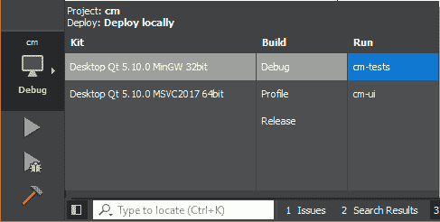
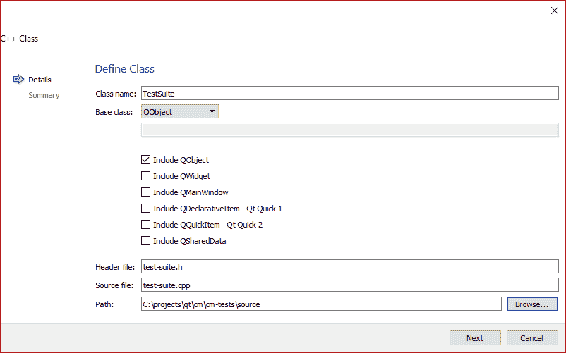

# 单元测试

在本章中，我们将介绍一个近年来真正流行起来的过程——单元测试。我们将简要讨论它是什么以及为什么我们要这样做，然后介绍如何使用 Qt 自己的单元测试工具 Qt Test 将其集成到我们的解决方案中。我们将涵盖以下主题：

+   单元测试原则

+   默认的 Qt 方法

+   另一种方法

+   DataDecorator 测试

+   实体测试

+   模拟

# 单元测试

单元测试的本质是将应用程序分解为最小的功能块（单元），然后在倡议范围内使用真实场景测试每个单元。例如，考虑一个简单的方法，它接受两个有符号整数并将它们相加：

```cpp
int add(intx, int y);
```

一些示例场景可以列举如下：

+   添加两个正数

+   添加两个负数

+   添加两个零

+   添加一个正数和一个负数

+   添加零和一个正数

+   添加零和一个负数

我们可以为每种情况编写一个测试，然后每当我们的代码库发生更改（任何代码，不仅仅是我们的`add()`方法），都可以执行这些测试，以确保代码仍然按预期运行。这是一个非常有价值的工具，可以让您确信您所做的任何代码更改都不会对现有功能产生不利影响。

历史上，这些测试通常是手动执行的，但现在存在工具可以使我们能够编写代码自动测试代码，听起来有点矛盾，但它确实有效。Qt 提供了一个专门为基于 Qt 的应用程序设计的单元测试框架，称为 Qt Test，这就是我们将要使用的。

您可以使用其他 C++测试框架，如 Google 测试，这些框架可能提供更多的功能和灵活性，特别是在与 Google 模拟一起使用时，但设置起来可能会更加麻烦。

**测试驱动开发**（**TDD**）将单元测试提升到了一个新的水平，并实际上改变了你编写代码的方式。实质上，你首先编写一个测试。测试最初会失败（实际上，可能甚至无法构建），因为你没有实现。然后，你编写最少量的代码使测试通过，然后继续编写下一个测试。你以这种方式迭代地构建你的实现，直到你交付所需的功能块。最后，你根据所需的标准重构代码，使用完成的单元测试来验证重构后的代码仍然按预期运行。有时这被称为*红-绿-重构*。

这不是一本关于单元测试的书，当然也不是关于 TDD 的书，所以我们的方法会很宽松，但它是现代应用程序开发的重要组成部分，了解它如何融入到您的 Qt 项目中是很重要的。

我们已经演示了从业务逻辑项目向 UI 传递简单数据（欢迎消息）的机制，因此，像往常一样，本章的第一个目标是为该行为编写一个基本的单元测试。完成后，我们将继续测试我们在上一章中实现的数据类。

# 默认的 Qt 方法

当我们创建`cm-tests`项目时，Qt Creator 会为我们创建一个`ClientTests`类，供我们用作起点，其中包含一个名为`testCase1`的单个测试。让我们直接执行这个默认测试，看看会发生什么。然后我们将查看代码并讨论发生了什么。

将运行输出切换到`cm-tests`，然后编译和运行：



这次你不会看到任何花哨的应用程序，但你会在 Qt Creator 的 Application Output 窗格中看到一些文本：

```cpp
********* Start testing of ClientTests *********
Config: Using QtTest library 5.10.0, Qt 5.10.0 (i386-little_endian-ilp32 shared (dynamic) debug build; by GCC 5.3.0)
PASS : ClientTests::initTestCase()
PASS : ClientTests::testCase1()
PASS : ClientTests::cleanupTestCase()
Totals: 3 passed, 0 failed, 0 skipped, 0 blacklisted, 0ms
********* Finished testing of ClientTests *********
```

我们可以看到已经调用了三个方法，其中第二个是我们的默认单元测试。另外两个函数——`initTestCase()`和`cleanupTestCase()`——是在类的测试套件之前和之后执行的特殊方法，允许您设置执行测试所需的任何前提条件，然后执行任何清理工作。所有三个步骤都通过了。

现在，在`client-tests.cpp`中，添加另一个方法`testCase2()`，它与`testCase1()`相同，但将`true`条件替换为`false`。请注意，类声明和方法定义都在同一个`.cpp`文件中，所以你需要在两个地方都添加这个方法。再次运行测试：

```cpp
********* Start testing of ClientTests *********
Config: Using QtTest library 5.10.0, Qt 5.10.0 (i386-little_endian-ilp32 shared (dynamic) debug build; by GCC 5.3.0)
PASS : ClientTests::initTestCase()
PASS : ClientTests::testCase1()
FAIL! : ClientTests::testCase2() 'false' returned FALSE. (Failure)
..\..\cm\cm-tests\source\models\client-tests.cpp(37) : failure location
PASS : ClientTests::cleanupTestCase()
Totals: 3 passed, 1 failed, 0 skipped, 0 blacklisted, 0ms
********* Finished testing of ClientTests *********
```

这一次，你可以看到`testCase2()`试图验证 false 是否为 true，当然它不是，我们的测试失败了，并在过程中输出了我们的失败消息。`initTestCase()`和`cleanupTestCase()`仍然在测试套件的开始和结束时执行。

现在我们已经看到了通过和失败的测试是什么样子的，但实际上发生了什么呢？

我们有一个派生自`QObject`的类`ClientTests`，它实现了一个空的默认构造函数。然后我们有一些声明为私有`Q_SLOTS`的方法。就像`Q_OBJECT`一样，这是一个宏，为我们注入了一堆聪明的样板代码，而且就像`Q_OBJECT`一样，你不需要担心理解它的内部工作原理就可以使用它。类中定义为这些私有槽之一的每个方法都作为一个单元测试执行。

然后，单元测试方法使用`QVERIFY2`宏来验证给定的布尔条件，即 true 是 true。如果失败了，我们在`testCase2`中设计的话，有用的消息失败将被输出到控制台。

如果有一个`QVERIFY2`，那么可能会有一个`QVERIFY1`，对吧？嗯，几乎是的，有一个`QVERIFY`，它执行相同的测试，但没有失败消息参数。其他常用的宏是`QCOMPARE`，它验证相同类型的两个参数是否等价，以及`QVERIFY_EXCEPTION_THROWN`，它验证在执行给定表达式时是否抛出了异常。这可能听起来有点奇怪，因为我们理想情况下不希望我们的代码抛出异常。然而，事情并不总是理想的，我们应该始终编写负面测试，验证代码在出现问题时的行为。一个常见的例子是，当我们有一个接受对象指针作为参数的方法时。我们应该编写一个负面测试，验证如果我们传入一个`nullptr`会发生什么（无论你多么小心，这总是可能发生的）。我们可能希望代码忽略它并不再采取进一步的行动，或者我们可能希望抛出某种空参数异常，这就是`QVERIFY_EXCEPTION_THROWN`的用武之地。

在测试用例定义之后，另一个宏`QTEST_APPLESS_MAIN`将一个`main()`钩子桩出来执行测试，最后的`#include`语句引入了构建过程生成的.moc 文件。每个继承自 QObject 的类都会生成一个`companion .moc`文件，其中包含由`Q_OBJECT`和其他相关宏创建的所有`magic`元数据代码。

现在，如果你在想“为什么要测试 true 是否为 true，false 是否为 true？”，那么你绝对不会这样做，这是一对完全无意义的测试。这个练习的目的只是看看 Qt Creator 为我们提供的默认方法是如何工作的，它确实有效，但它有一些关键的缺陷，我们需要在编写真正的测试之前解决这些问题。

第一个问题是，`QTEST_APPLESS_MAIN`创建了一个`main()`方法，以便在`ClientTests`中运行我们的测试用例。当我们编写另一个测试类时会发生什么？我们将有两个`main()`方法，事情将变得不顺利。另一个问题是，我们的测试输出只是传输到“应用程序输出”窗格。在商业环境中，通常会有构建服务器拉取应用程序代码，执行构建，运行单元测试套件，并标记任何测试失败以进行调查。为了使这项工作正常进行，构建工具需要能够访问测试输出，并且不能像人类一样读取 IDE 中的“应用程序输出”窗格。让我们看看解决这些问题的另一种方法。

# 自定义方法

我们将采取的自定义方法仍然适用于我们刚刚讨论的相同基本概念。在其核心，我们仍将拥有一个包含一系列要执行的单元测试方法的测试类。我们将只是补充一些额外的样板代码，以便我们可以轻松地容纳多个测试类，并将输出传输到文件而不是控制台。

让我们首先在源文件夹中的`cm-tests`中添加一个新的`TestSuite`类：



`test-suite.h`：

```cpp
#ifndef TESTSUITE_H
#define TESTSUITE_H

#include <QObject>
#include <QString>
#include <QtTest/QtTest>

#include <vector>

namespace cm {

class TestSuite : public QObject
{
    Q_OBJECT
public:
    explicit TestSuite(const QString& _testName = "");
    virtual ~TestSuite();

    QString testName;
    static std::vector<TestSuite*>& testList();
};

}

#endif
```

`test-suite.cpp`：

```cpp
#include "test-suite.h"

#include <QDebug>

namespace cm {

TestSuite::TestSuite(const QString& _testName)
    : QObject()
    , testName(_testName)
{
    qDebug() << "Creating test" << testName;
    testList().push_back(this);
    qDebug() << testList().size() << " tests recorded";
}

TestSuite::~TestSuite()
{
    qDebug() << "Destroying test";
}

std::vector<TestSuite*>& TestSuite::testList()
{
    static std::vector<TestSuite*> instance = std::vector<TestSuite*>();
    return instance;
}

}

```

在这里，我们正在创建一个基类，该基类将用于我们的每个测试类。通常情况下，常规类和测试套件类之间是一对一的关系，例如`Client`和`ClientTests`类。`TestSuite`的每个派生实例都会将自己添加到共享向量中。乍一看可能有点混乱，因此我们还使用`qDebug()`向控制台输出一些信息，以便您可以跟踪发生的情况。当我们创建第一个从`TestSuite`派生的类时，这将更有意义。

接下来，再次在源文件夹中添加一个新的 C++源文件`main.cpp`：

`main.cpp`：

```cpp
#include <QtTest/QtTest>
#include <QDebug>

#include "test-suite.h"

using namespace cm;

int main(int argc, char *argv[])
{
    Q_UNUSED(argc);
    Q_UNUSED(argv);

    qDebug() << "Starting test suite...";
    qDebug() << "Accessing tests from " << &TestSuite::testList();
    qDebug() << TestSuite::testList().size() << " tests detected";

    int failedTestsCount = 0;

    for(TestSuite* i : TestSuite::testList()) {
        qDebug() << "Executing test " << i->testName;
        QString filename(i->testName + ".xml");
        int result = QTest::qExec(i, QStringList() << " " << "-o" << 
                                  filename << "-xunitxml");
        qDebug() << "Test result " << result;
        if(result != 0) {
            failedTestsCount++;
        }
    }

    qDebug() << "Test suite complete - " << 
          QString::number(failedTestsCount) << " failures detected.";

    return failedTestsCount;
}
```

由于添加了用于信息的`qDebug()`语句，这看起来比实际情况更复杂。我们遍历每个注册的测试类，并使用静态的`QTest::qExec()`方法来检测并运行其中发现的所有测试。然而，一个关键的补充是，我们为每个类创建一个 XML 文件，并将结果传输到其中。

这种机制解决了我们的两个问题。现在我们有一个单一的`main()`方法，将检测并运行我们所有的测试，并且我们得到一个单独的 XML 文件，其中包含每个测试套件的输出。但是，在构建项目之前，您需要重新查看`client-tests.cpp`，并注释或删除`QTEST_APPLESS_MAIN`行，否则我们将再次面临多个`main()`方法的问题。现在不要担心`client-tests.cpp`的其余部分；当我们开始测试我们的数据类时，我们将稍后重新访问它。

现在构建和运行，您将在“应用程序输出”中获得一组不同的文本：

```cpp
Starting test suite...
Accessing tests from 0x40b040
0 tests detected
Test suite complete - "0" failures detected.
```

让我们继续实现我们的第一个`TestSuite`。我们有一个`MasterController`类，向 UI 呈现消息字符串，因此让我们编写一个简单的测试来验证消息是否正确。我们需要在`cm-tests`项目中引用`cm-lib`中的代码，因此请确保将相关的`INCLUDE`指令添加到`cm-tests.pro`中：

```cpp
INCLUDEPATH += source \
    ../cm-lib/source
```

在`cm-tests/source/controllers`中创建一个名为`MasterControllerTests`的新的伴随测试类。

`master-controller-tests.h`：

```cpp
#ifndef MASTERCONTROLLERTESTS_H
#define MASTERCONTROLLERTESTS_H

#include <QtTest>

#include <controllers/master-controller.h>
#include <test-suite.h>

namespace cm {
namespace controllers {

class MasterControllerTests : public TestSuite
{
    Q_OBJECT

public:
    MasterControllerTests();

private slots:
    /// @brief Called before the first test function is executed
    void initTestCase();
    /// @brief Called after the last test function was executed.
    void cleanupTestCase();
    /// @brief Called before each test function is executed.
    void init();
    /// @brief Called after every test function.
    void cleanup();

private slots:
    void welcomeMessage_returnsCorrectMessage();

private:
    MasterController masterController;
};

}}

#endif
```

我们明确添加了`initTestCase()`和`cleanupTestCase()`支撑方法，这样它们的来源就不再神秘。我们还为完整性添加了另外两个特殊的支撑方法：`init()`和`cleanup()`。不同之处在于这些方法在每个单独的测试之前和之后执行，而不是在整个测试套件之前和之后执行。

这些方法对我们没有任何作用，只是为了将来参考。如果您想简化事情，可以安全地将它们删除。

`master-controller-tests.cpp`：

```cpp
#include "master-controller-tests.h"

namespace cm {
namespace controllers { // Instance

static MasterControllerTests instance;

MasterControllerTests::MasterControllerTests()
    : TestSuite( "MasterControllerTests" )
{
}

}

namespace controllers { // Scaffolding

void MasterControllerTests::initTestCase()
{
}

void MasterControllerTests::cleanupTestCase()
{
}

void MasterControllerTests::init()
{
}

void MasterControllerTests::cleanup()
{
}

}

namespace controllers { // Tests

void MasterControllerTests::welcomeMessage_returnsCorrectMessage()
{
    QCOMPARE( masterController.welcomeMessage(), QString("Welcome to the Client Management system!") );
}

}}
```

我们再次有一个单一的测试，但这次它确实有一些有意义的目的。我们希望测试当我们实例化一个`MasterController`对象并访问其`welcomeMessage`方法时，它是否返回我们想要的消息，即 Welcome to the Client Management system!。

与搭建方法不同，您的测试命名完全取决于个人喜好。我倾向于松散地遵循`methodIAmTesting_givenSomeScenario_doesTheCorrectThing`的格式，例如：

```cpp
divideTwoNumbers_givenTwoValidNumbers_returnsCorrectResult()
divideTwoNumbers_givenZeroDivisor_throwsInvalidArgumentException()
```

我们构造一个`MasterController`的实例作为我们将用来测试的私有成员变量。在实现中，我们通过构造函数指定了测试套件的名称，并创建了测试类的静态实例。这是将`MasterControllerTests`添加到我们在`TestSuite`类中看到的静态向量的触发器。

最后，对于我们测试的实现，我们使用`QCOMPARE`宏测试我们`masterController`实例的`welcomeMessage`的值与我们想要的消息。请注意，因为`QCOMPARE`是一个宏，您不会得到隐式类型转换，因此您需要确保期望和实际结果的类型相同。在这里，我们通过从文字构造一个`QString`对象来实现这一点。

运行`qmake`，构建并运行以查看我们在应用程序输出窗格中的测试结果：

```cpp
Creating test "MasterControllerTests"
1 tests recorded
Starting test suite...
Accessing tests from 0x40b040
1 tests detected
Executing test "MasterControllerTests"
Test result 1
Test suite complete - "1" failures detected.
Destroying test
```

这始于通过静态实例注册`MasterControllerTests`类。`main()`方法迭代注册的测试套件集合，并找到一个，然后执行该套件中的所有单元测试。测试套件包含一个运行并立即失败的单元测试。这可能看起来比之前不太有用，因为没有指示哪个测试失败或失败的原因。但是，请记住，这个输出只是我们为额外信息添加的`qDebug()`语句的输出；这不是测试执行的真正输出。在`master-controller-tests.cpp`中，我们使用`TestSuite`实例化了一个`testName`参数为`MasterControllerTests`，因此输出将被导入到名为`MasterControllerTests.xml`的文件中。

导航到`cm/binaries`文件夹，通过文件夹浏览到我们为所选配置指定项目输出的位置，在那里，您将看到`MasterControllerTests.xml`：

```cpp
<testsuite name="cm::controllers::MasterControllerTests" tests="3" failures="1" errors="0">
    <properties>
       <property name="QTestVersion" value="5.10.0"/>
       <property name="QtVersion" value="5.10.0"/>
       <property name="QtBuild" value="Qt 5.10.0 (i386-little_endian- 
                 ilp32 shared (dynamic) debug build; by GCC 5.3.0)"/>
    </properties>
    <testcase name="initTestCase" result="pass"/>
    <testcase name="welcomeMessage_returnsCorrectMessage" 
                    result="fail">
    <failure result="fail" message="Compared values are not the same Actual (masterController.welcomeMessage) : "This is MasterController to Major Tom" Expected (QString("Welcome to the Client Management system!")): "Welcome to the Client Management system!""/>
    </testcase>
    <testcase name="cleanupTestCase" result="pass"/>
    <system-err/>
</testsuite>
```

在这里，我们有来自测试的完整输出，您可以看到失败是因为我们从`masterController`得到的欢迎消息是 This is MasterController to Major Tom，而我们期望的是 Welcome to the Client Management system!。

`MasterController`的行为与预期不符，我们发现了一个错误，所以前往`master-controller.cpp`并修复问题：

```cpp
QString welcomeMessage = "Welcome to the Client Management system!";
```

重新构建两个项目，再次执行测试，并沐浴在 100%的通过率的荣耀中：

```cpp
Creating test "MasterControllerTests"
1 tests recorded
Starting test suite...
Accessing tests from 0x40b040
1 tests detected
Executing test "MasterControllerTests"
Test result 0
Test suite complete - "0" failures detected.
Destroying test
```

现在我们已经设置好了测试框架，让我们测试一些比简单的字符串消息更复杂的东西，并验证我们在上一章中所做的工作。

# DataDecorator 测试

在第五章中，*数据*，我们创建了从`DataDecorator`派生的各种类。让我们为每个类创建相应的测试类，并测试以下功能：

+   对象构造

+   设置值

+   将值作为 JSON 获取

+   从 JSON 更新值

在`cm-tests/source/data`中，创建`DateTimeDecoratorTests`、`EnumeratorDecoratorTests`、`IntDecoratorTests`和`StringDecoratorTests`类。

让我们从最简单的套件`IntDecoratorTests`开始。测试在套件之间基本上是相似的，因此一旦我们编写了一个套件，我们就能够将大部分内容复制到其他套件中，然后根据需要进行补充。

`int-decorator-tests.h`：

```cpp
#ifndef INTDECORATORTESTS_H
#define INTDECORATORTESTS_H

#include <QtTest>

#include <data/int-decorator.h>
#include <test-suite.h>

namespace cm {
namespace data {

class IntDecoratorTests : public TestSuite
{
    Q_OBJECT

public:
    IntDecoratorTests();

private slots:
    void constructor_givenNoParameters_setsDefaultProperties();
    void constructor_givenParameters_setsProperties();
    void setValue_givenNewValue_updatesValueAndEmitsSignal();
    void setValue_givenSameValue_takesNoAction();
    void jsonValue_whenDefaultValue_returnsJson();
    void jsonValue_whenValueSet_returnsJson();
    void update_whenPresentInJson_updatesValue();
    void update_whenNotPresentInJson_updatesValueToDefault();
};

}}

#endif
```

一种常见的方法是遵循“方法作为单元”的方法，其中每个方法是类中最小的可测试单元，然后以多种方式测试该单元。因此，我们首先测试构造函数，无论是否有参数。`setValue()`方法只有在实际更改值时才会执行任何操作，因此我们测试设置不同的值和相同的值。接下来，我们测试是否可以将装饰器转换为 JSON 值，无论是使用默认值（在`int`的情况下为`0`）还是使用设置的值。最后，我们对`update()`方法执行了一些测试。如果我们传入包含该属性的 JSON，那么我们期望值将根据 JSON 值进行更新。但是，如果 JSON 中缺少该属性，我们期望类能够优雅地处理并重置为默认值。

请注意，我们并没有明确测试`value()`方法。这只是一个简单的访问方法，没有副作用，我们将在其他单元测试中调用它，因此我们将在那里间接测试它。如果您愿意，可以为其创建额外的测试。

`int-decorator-tests.cpp`：

```cpp
#include "int-decorator-tests.h"

#include <QSignalSpy>

#include <data/entity.h>

namespace cm {
namespace data { // Instance

static IntDecoratorTests instance;

IntDecoratorTests::IntDecoratorTests()
    : TestSuite( "IntDecoratorTests" )
{
}

}

namespace data { // Tests

void IntDecoratorTests::constructor_givenNoParameters_setsDefaultProperties()
{
    IntDecorator decorator;
    QCOMPARE(decorator.parentEntity(), nullptr);
    QCOMPARE(decorator.key(), QString("SomeItemKey"));
    QCOMPARE(decorator.label(), QString(""));
    QCOMPARE(decorator.value(), 0);
}

void IntDecoratorTests::constructor_givenParameters_setsProperties()
{
    Entity parentEntity;
    IntDecorator decorator(&parentEntity, "Test Key", "Test Label", 
                                                       99);
    QCOMPARE(decorator.parentEntity(), &parentEntity);
    QCOMPARE(decorator.key(), QString("Test Key"));
    QCOMPARE(decorator.label(), QString("Test Label"));
    QCOMPARE(decorator.value(), 99);
}

void IntDecoratorTests::setValue_givenNewValue_updatesValueAndEmitsSignal()
{
    IntDecorator decorator;
    QSignalSpy valueChangedSpy(&decorator, 
                               &IntDecorator::valueChanged);
    QCOMPARE(decorator.value(), 0);
    decorator.setValue(99);
    QCOMPARE(decorator.value(), 99);
    QCOMPARE(valueChangedSpy.count(), 1);
}

void IntDecoratorTests::setValue_givenSameValue_takesNoAction()
{
    Entity parentEntity;
    IntDecorator decorator(&parentEntity, "Test Key", "Test Label", 
                                                               99);
    QSignalSpy valueChangedSpy(&decorator, 
                               &IntDecorator::valueChanged);
    QCOMPARE(decorator.value(), 99);
    decorator.setValue(99);
    QCOMPARE(decorator.value(), 99);
    QCOMPARE(valueChangedSpy.count(), 0);
}

void IntDecoratorTests::jsonValue_whenDefaultValue_returnsJson()
{
    IntDecorator decorator;
    QCOMPARE(decorator.jsonValue(), QJsonValue(0));
}
void IntDecoratorTests::jsonValue_whenValueSet_returnsJson()
{
    IntDecorator decorator;
    decorator.setValue(99);
    QCOMPARE(decorator.jsonValue(), QJsonValue(99));
}

void IntDecoratorTests::update_whenPresentInJson_updatesValue()
{
    Entity parentEntity;
    IntDecorator decorator(&parentEntity, "Test Key", "Test Label", 99);
    QSignalSpy valueChangedSpy(&decorator, 
                               &IntDecorator::valueChanged);
    QCOMPARE(decorator.value(), 99);
    QJsonObject jsonObject;
    jsonObject.insert("Key 1", "Value 1");
    jsonObject.insert("Test Key", 123);
    jsonObject.insert("Key 3", 3);
    decorator.update(jsonObject);
    QCOMPARE(decorator.value(), 123);
    QCOMPARE(valueChangedSpy.count(), 1);
}

void IntDecoratorTests::update_whenNotPresentInJson_updatesValueToDefault()
{
    Entity parentEntity;
    IntDecorator decorator(&parentEntity, "Test Key", "Test Label", 
                                                                99);
    QSignalSpy valueChangedSpy(&decorator, 
                               &IntDecorator::valueChanged);
    QCOMPARE(decorator.value(), 99);
    QJsonObject jsonObject;
    jsonObject.insert("Key 1", "Value 1");
    jsonObject.insert("Key 2", 123);
    jsonObject.insert("Key 3", 3);
    decorator.update(jsonObject);
    QCOMPARE(decorator.value(), 0);
    QCOMPARE(valueChangedSpy.count(), 1);
}

}}
```

单元测试通常遵循“安排 > 执行 > 断言”的模式。首先满足测试的前提条件：变量被初始化，类被配置等。然后执行一个操作，通常是调用正在测试的函数。最后，检查操作的结果。有时，这些步骤中的一个或多个将是不必要的，或者可能与另一个步骤合并，但这是一般模式。

我们通过初始化一个没有传递任何参数的新`IntDecorator`来开始测试构造函数，然后测试对象的各种属性是否已初始化为预期的默认值，使用`QCOMPARE`将实际值与预期值进行匹配。然后我们重复测试，但这次，我们为每个参数传递值，并验证它们是否已在实例中更新。

在测试`setValue()`方法时，我们需要检查`valueChanged()`信号是否被发射。我们可以通过将 lambda 连接到信号来设置一个标志来实现这一点，如下所示：

```cpp
bool isCalled = false;
QObject::connect(&decorator, &IntDecorator::valueChanged, [&isCalled](){
    isCalled = true;
});

/*...Perform action...*/ 

QVERIFY(isCalled);
```

然而，我们在这里使用的一个更简单的解决方案是使用 Qt 的`QSignalSpy`类来跟踪对指定信号的调用。然后，我们可以使用`count()`方法来检查信号被调用的次数。

第一个`setValue()`测试确保当我们提供一个与现有值不同的新值时，该值将被更新，并且`valueChanged()`信号将被发射一次。第二个测试确保当我们设置相同的值时，不会采取任何操作，并且信号不会被发射。请注意，在这两种情况下，我们都使用额外的`QCOMPARE`调用来断言在采取行动之前值是否符合我们的预期。考虑以下伪测试：

1.  设置你的类。

1.  执行一个操作。

1.  测试值为`99`。

如果一切都按预期工作，第 1 步将值设置为`0`，第 2 步执行正确的操作并将值更新为`99`，第 3 步通过，因为值为`99`。然而，第 1 步可能是有错误的，并错误地将值设置为`99`，第 2 步甚至没有实现并且不采取任何行动，但第 3 步（和测试）通过，因为值为`99`。通过在第 1 步之后使用`QCOMPARE`前提条件，可以避免这种情况。

`jsonValue()`测试是简单的相等性检查，无论是使用默认值还是设置值。

最后，在`update()`测试中，我们构造了一对 JSON 对象。在一个对象中，我们添加了一个具有与我们的装饰器对象相同键的项（“Test Key”），我们期望它被匹配，并且相关值（`123`）通过`setValue()`传递。在第二个对象中，该键不存在。在这两种情况下，我们还添加了其他多余的项，以确保类能够正确地忽略它们。后续操作的检查与`setValue()`测试相同。

`StringDecoratorTests`类基本上与`IntDecoratorTests`相同，只是值数据类型不同，并且默认值为空字符串`""`而不是`0`。

`DateTimeDecorator`也遵循相同的模式，但还有额外的测试用于字符串格式化辅助方法`toIso8601String()`等。

`EnumeratorDecoratorTests`执行相同的测试，但需要更多的设置，因为需要一个枚举器和相关的映射器。在测试的主体中，每当我们测试`value()`时，我们还需要测试`valueDescription()`以确保两者保持一致。例如，每当值是`eTestEnum::Value2`时，`valueDescription()`必须是`Value 2`。请注意，我们总是将枚举值与`value()`检查一起使用，并将它们`static_cast`为`int`。考虑以下例子：

```cpp
QCOMPARE(decorator.value(), static_cast<int>(eTestEnum::Value2));
```

通过使用原始的`int`值来缩短这个过程可能很诱人：

```cpp
QCOMPARE(decorator.value(), 2);
```

这种方法的问题，除了数字 2 对于代码读者来说比枚举`Value2`的意义要少得多之外，是`eTestEnum`的值可能会改变并使测试无效。考虑这个例子：

```cpp
enum eTestEnum {
    Unknown = 0,
    MyAmazingNewTestValue,
    Value1,
    Value2,
    Value3
};
```

由于插入了`MyAmazingNewTestValue`，`Value2`的数字等价物实际上现在是 3。任何使用数字 2 表示`Value2`的测试现在都是错误的，而那些使用更冗长的`static_cast<int>(eTestEnum::Value2)`的测试仍然是正确的。

重新构建并运行新的测试套件，它们应该都能愉快地通过并让我们对之前编写的代码重新获得信心。测试了数据装饰器后，让我们继续测试我们的数据模型。

# 实体测试

既然我们对数据装饰器的工作有了一些信心，让我们提升一个层次，测试我们的数据实体。Client 类是我们模型层次结构的根，通过测试它，我们可以测试我们的其他模型。

我们已经在`cm-tests/source/models`中有`client-tests.cpp`，这是 Qt Creator 在创建项目时为我们添加的，所以继续添加一个配套的头文件`client-tests.h`。

`client-tests.h`：

```cpp
#ifndef CLIENTTESTS_H
#define CLIENTTESTS_H

#include <QtTest>
#include <QJsonObject>

#include <models/client.h>
#include <test-suite.h>

namespace cm {
namespace models {

class ClientTests : public TestSuite
{
    Q_OBJECT

public:
    ClientTests();

private slots:
    void constructor_givenParent_setsParentAndDefaultProperties();
    void constructor_givenParentAndJsonObject_setsParentAndProperties();
    void toJson_withDefaultProperties_constructsJson();
    void toJson_withSetProperties_constructsJson();
    void update_givenJsonObject_updatesProperties();
    void update_givenEmptyJsonObject_updatesPropertiesToDefaults();

private:
    void verifyBillingAddress(const QJsonObject& jsonObject);
    void verifyDefaultBillingAddress(const QJsonObject& jsonObject);
    void verifyBillingAddress(Address* address);
    void verifyDefaultBillingAddress(Address* address);
    void verifySupplyAddress(const QJsonObject& jsonObject);
    void verifyDefaultSupplyAddress(const QJsonObject& jsonObject);
    void verifySupplyAddress(Address* address);
    void verifyDefaultSupplyAddress(Address* address);
    void verifyAppointments(const QJsonObject& jsonObject);
    void verifyDefaultAppointments(const QJsonObject& jsonObject);
    void verifyAppointments(const QList<Appointment*>& appointments);
    void verifyDefaultAppointments(const QList<Appointment*>& appointments);
    void verifyContacts(const QJsonObject& jsonObject);
    void verifyDefaultContacts(const QJsonObject& jsonObject);
    void verifyContacts(const QList<Contact*>& contacts);
    void verifyDefaultContacts(const QList<Contact*>& contacts);

    QByteArray jsonByteArray = R"(
    {
        "reference": "CM0001",
        "name": "Mr Test Testerson",
        "billingAddress": {
            "building": "Billing Building",
            "city": "Billing City",
            "postcode": "Billing Postcode",
            "street": "Billing Street"
        },
        "appointments": [
         {"startAt": "2017-08-20T12:45:00", "endAt": "2017-08-
                      20T13:00:00", "notes": "Test appointment 1"},
         {"startAt": "2017-08-21T10:30:00", "endAt": "2017-08-
                      21T11:30:00", "notes": "Test appointment 2"}
        ],
        "contacts": [
            {"contactType": 2, "address":"email@test.com"},
            {"contactType": 1, "address":"012345678"}
        ],
        "supplyAddress": {
            "building": "Supply Building",
            "city": "Supply City",
            "postcode": "Supply Postcode",
            "street": "Supply Street"
        }
    })";
};

}}

#endif
```

这里有三个主要的测试区域：

+   对象构造

+   序列化为 JSON

+   从 JSON 反序列化

与之前的套件一样，每个区域都有几种不同的测试方式，一种是使用默认数据，一种是使用指定数据。在私有部分，您会看到许多验证方法。它们用于封装测试特定子集所需的功能。这样做的优势与常规代码相同：它们使单元测试更加简洁和可读，并且允许轻松重用验证规则。此外，在私有部分，我们定义了一个 JSON 块，我们可以用它来构造我们的 Client 实例。`QByteArray`，顾名思义，只是一个带有许多相关有用函数的字节数组：

```cpp
void ClientTests::constructor_givenParent_setsParentAndDefaultProperties()
{
    Client testClient(this);
    QCOMPARE(testClient.parent(), this);
    QCOMPARE(testClient.reference->value(), QString(""));
    QCOMPARE(testClient.name->value(), QString(""));

    verifyDefaultBillingAddress(testClient.billingAddress);
    verifyDefaultSupplyAddress(testClient.supplyAddress);
    verifyDefaultAppointments(testClient.appointments-
                              >derivedEntities());
    verifyDefaultContacts(testClient.contacts->derivedEntities());
}

void ClientTests::constructor_givenParentAndJsonObject_setsParentAndProperties()
{
    Client testClient(this, QJsonDocument::fromJson(jsonByteArray).object());
    QCOMPARE(testClient.parent(), this);
    QCOMPARE(testClient.reference->value(), QString("CM0001"));
    QCOMPARE(testClient.name->value(), QString("Mr Test Testerson"));

    verifyBillingAddress(testClient.billingAddress);
    verifySupplyAddress(testClient.supplyAddress);
    verifyAppointments(testClient.appointments->derivedEntities());
    verifyContacts(testClient.contacts->derivedEntities());
}
```

从构造函数测试开始，我们实例化一个新的 Client，有时带有 JSON 对象，有时没有。请注意，为了将我们的 JSON 字节数组转换为`QJsonObject`，我们需要通过`QJsonDocument`进行传递。一旦我们有了初始化的客户端，我们检查名称属性并利用验证方法来测试子对象的状态。无论我们是否通过 JSON 对象提供任何初始数据，我们都希望`supplyAddress`和`billingAddress`对象以及预约和联系人集合都会自动为我们创建。默认情况下，集合应该是空的：

```cpp
void ClientTests::toJson_withDefaultProperties_constructsJson()
{
    Client testClient(this);
    QJsonDocument jsonDoc(testClient.toJson());
    QVERIFY(jsonDoc.isObject());
    QJsonObject jsonObject = jsonDoc.object();
    QVERIFY(jsonObject.contains("reference"));
    QCOMPARE(jsonObject.value("reference").toString(), QString(""));
    QVERIFY(jsonObject.contains("name"));
    QCOMPARE(jsonObject.value("name").toString(), QString(""));
    verifyDefaultBillingAddress(jsonObject);
    verifyDefaultSupplyAddress(jsonObject);
    verifyDefaultAppointments(jsonObject);
    verifyDefaultContacts(jsonObject);
}

void ClientTests::toJson_withSetProperties_constructsJson()
{
    Client testClient(this, QJsonDocument::fromJson(jsonByteArray).object());
    QCOMPARE(testClient.reference->value(), QString("CM0001"));
    QCOMPARE(testClient.name->value(), QString("Mr Test Testerson"));

    verifyBillingAddress(testClient.billingAddress);
    verifySupplyAddress(testClient.supplyAddress);
    verifyAppointments(testClient.appointments->derivedEntities());
    verifyContacts(testClient.contacts->derivedEntities());
    QJsonDocument jsonDoc(testClient.toJson());
    QVERIFY(jsonDoc.isObject());
    QJsonObject jsonObject = jsonDoc.object();
    QVERIFY(jsonObject.contains("reference"));
    QCOMPARE(jsonObject.value("reference").toString(), QString("CM0001"));
    QVERIFY(jsonObject.contains("name"));
    QCOMPARE(jsonObject.value("name").toString(), QString("Mr Test 
                                                  Testerson"));
    verifyBillingAddress(jsonObject);
    verifySupplyAddress(jsonObject);
    verifyAppointments(jsonObject);
    verifyContacts(jsonObject);
}
```

`toJson()`测试遵循相同的模式。我们构造一个没有 JSON 对象的对象，这样我们就可以得到所有属性和子对象的默认值。然后我们立即在构造函数中使用`toJson()`调用来构造一个`QJsonDocument`，以获取序列化的 JSON 对象。测试`name`属性，然后再次利用验证方法。当使用 JSON 构造**Client**时，我们添加前置检查，以确保我们的属性在再次调用`toJson()`之前已经正确设置，并测试结果：

```cpp
void ClientTests::update_givenJsonObject_updatesProperties()
{
    Client testClient(this);
    testClient.update(QJsonDocument::fromJson(jsonByteArray).object());
    QCOMPARE(testClient.reference->value(), QString("CM0001"));
    QCOMPARE(testClient.name->value(), QString("Mr Test Testerson"));

    verifyBillingAddress(testClient.billingAddress);
    verifySupplyAddress(testClient.supplyAddress);
    verifyAppointments(testClient.appointments->derivedEntities());
    verifyContacts(testClient.contacts->derivedEntities());
}

void ClientTests::update_givenEmptyJsonObject_updatesPropertiesToDefaults()
{
    Client testClient(this, QJsonDocument::fromJson(jsonByteArray).object());
    QCOMPARE(testClient.reference->value(), QString("CM0001"));
    QCOMPARE(testClient.name->value(), QString("Mr Test Testerson"));
    verifyBillingAddress(testClient.billingAddress);
    verifySupplyAddress(testClient.supplyAddress);
    verifyAppointments(testClient.appointments->derivedEntities());
    verifyContacts(testClient.contacts->derivedEntities());
    testClient.update(QJsonObject());
    QCOMPARE(testClient.reference->value(), QString(""));
    QCOMPARE(testClient.name->value(), QString(""));

    verifyDefaultBillingAddress(testClient.billingAddress);
    verifyDefaultSupplyAddress(testClient.supplyAddress);
    verifyDefaultAppointments(testClient.appointments-
                              >derivedEntities());
    verifyDefaultContacts(testClient.contacts->derivedEntities());
}
```

`update()`测试与`toJson()`相同，但方向相反。这次，我们使用我们的字节数组构造一个 JSON 对象，并将其传递给`update()`，然后检查模型的状态。

各种私有验证方法只是一系列检查，可以避免我们重复编写相同的代码。考虑以下示例：

```cpp
void ClientTests::verifyDefaultSupplyAddress(Address* address)
{
    QVERIFY(address != nullptr);
    QCOMPARE(address->building->value(), QString(""));
    QCOMPARE(address->street->value(), QString(""));
    QCOMPARE(address->city->value(), QString(""));
    QCOMPARE(address->postcode->value(), QString(""));
}
```

再次构建和运行单元测试，新的**客户端**测试应该都能顺利通过。

# Mocking

到目前为止，我们编写的单元测试都相当简单。虽然我们的**Client**类并不是完全独立的，但它的依赖关系都是其他数据模型和装饰器，它可以随意拥有和更改。然而，展望未来，我们将希望将客户端数据持久化到数据库中。让我们看一些如何实现这一点的例子，并讨论我们所做的设计决策如何影响 Client 类的可测试性。

打开`scratchpad`项目并创建一个新的头文件`mocking.h`，在这里我们将实现一个虚拟的 Client 类来进行测试。

`mocking.h`：

```cpp
#ifndef MOCKING_H
#define MOCKING_H

#include <QDebug>

class Client
{
public:
    void save()
    {
        qDebug() << "Saving Client";
    }
};

#endif
```

在`main.cpp`中，`#include <mocking.h>`，更新`engine.load()`行以加载默认的`main.qml`，如果还没有的话，并添加几行来启动和保存一个虚拟的 Client 对象：

```cpp
engine.load(QUrl(QStringLiteral("qrc:/main.qml")));

Client client;
client.save();
```

构建并运行应用程序，忽略窗口，查看应用程序输出控制台：

```cpp
Saving Client
```

我们有一种方法可以要求客户端保存自身，但它也需要一个数据库来保存自身。让我们将数据库管理功能封装到`DatabaseController`类中。在 mocking.h 中，在 Client 类之前添加以下实现。注意，你需要提前声明 Client：

```cpp
class Client;

class DatabaseController
{
public:
    DatabaseController()
    {
        qDebug() << "Creating a new database connection";
    }

    void save(Client* client)
    {
        qDebug() << "Saving a Client to the production database";
    }
};
```

现在，编辑 Client 类：

```cpp
class Client
{
    DatabaseController databaseController;

public:
    void save()
    {
        qDebug() << "Saving Client";
        databaseController.save(this);
    }
};
```

回到`main.cpp`，用以下内容替换 Client 行：

```cpp
qDebug() << "Running the production code...";

Client client1;
client1.save();
Client client2;
client2.save();
```

现在我们创建并保存两个客户端而不是一个。再次构建、运行，并再次检查控制台：

```cpp
Running the production code…
Creating a new database connection
Saving Client
Saving a Client to the production database
Creating a new database connection
Saving Client
Saving a Client to the production database
```

好了，现在我们将客户端保存到生产数据库中，但我们为每个客户端创建了一个新的数据库连接，这似乎有点浪费。Client 类需要一个`DatabaseController`的实例来运行，这就是一个依赖关系。然而，我们不需要 Client 负责创建该实例；我们可以通过构造函数传递或*注入*该实例，并在其他地方管理`DatabaseController`的生命周期。这种依赖注入技术是一种更广泛的设计模式，称为**控制反转**。让我们将一个共享的`DatabaseController`的引用传递给我们的 Client 类：

```cpp
class Client
{
    DatabaseController& databaseController;

public:
    Client(DatabaseController& _databaseController)
        : databaseController(_databaseController)
    {
    }

    void save()
    {
        qDebug() << "Saving Client";
        databaseController.save(this);
    }
};
```

在`main.cpp`中：

```cpp
qDebug() << "Running the production code...";

DatabaseController databaseController;

Client client1(databaseController);
client1.save();
Client client2(databaseController);
client2.save();
```

构建并运行以下内容：

```cpp
Running the production code…
Creating a new database connection
Saving Client
Saving a Client to the production database
Saving Client
Saving a Client to the production database
```

很好，我们已经建立了一个高效的解耦系统架构；让我们来测试一下。

在`mocking.h`中，在 Client 类之后添加一个假的测试套件：

```cpp
class ClientTestSuite
{
public:
    void saveTests()
    {
        DatabaseController databaseController;
        Client client1(databaseController);
        client1.save();
        Client client2(databaseController);
        client2.save();

        qDebug() << "Test passed!";
    }
};
```

在`main.cpp`中，在保存`client2`后，添加以下内容来运行我们的测试：

```cpp
qDebug() << "Running the test code...";

ClientTestSuite testSuite;
testSuite.saveTests();
```

构建并运行这个：

```cpp
Running the production code...
Creating a new database connection
Saving Client
Saving a Client to the production database
Saving Client
Saving a Client to the production database
Running the test code...
Creating a new database connection
Saving Client
Saving a Client to the production database
Saving Client
Saving a Client to the production database
Test passed!
```

我们的测试通过了，太棒了！有什么不喜欢的呢？嗯，我们刚刚将一些测试数据保存到了我们的生产数据库中。

如果你还没有为大多数类实现接口，那么在开始单元测试后，你很快就会这样做。这不仅仅是为了避免像将测试数据写入生产数据库这样的不良副作用；它还允许你模拟各种行为，从而使单元测试变得更加容易。

因此，让我们将`DatabaseController`移到接口后面。用一个超级接口驱动版本替换`mocking.h`中的普通`DatabaseController`：

```cpp
class IDatabaseController
{
public:
    virtual ~IDatabaseController(){}
    virtual void save(Client* client) = 0;
};

class DatabaseController : public IDatabaseController
{
public:
    DatabaseController()
    {
        qDebug() << "Creating a new database connection";
    }

    void save(Client* client) override
    {
        qDebug() << "Saving a Client to the production database";
    }
};
```

接口已经就位，我们现在可以创建一个虚假或模拟的实现：

```cpp
class MockDatabaseController : public IDatabaseController
{
public:
    MockDatabaseController()
    {
        qDebug() << "Absolutely not creating any database connections 
                                                           at all";
    }

    void save(Client* client) override
    {
        qDebug() << "Just testing - not saving any Clients to any 
                                                   databases";
    }
};
```

接下来，调整我们的客户端，保存一个对接口的引用，而不是具体的实现：

```cpp
class Client
{
    IDatabaseController& databaseController;

public:
    Client(IDatabaseController& _databaseController)
        : databaseController(_databaseController)
    {
    }

    void save()
    {
        qDebug() << "Saving Client";
        databaseController.save(this);
    }
};
```

最后，改变我们的测试套件，创建一个模拟控制器传递给客户端：

```cpp
void saveTests()
{
    MockDatabaseController databaseController;
    ...
}
```

构建并运行这个：

```cpp
Running the production code...
Creating a new database connection
Saving Client
Saving a Client to the production database
Saving Client
Saving a Client to the production database
Running the test code...
Absolutely not creating any database connections at all
Saving Client
Just testing - not saving any Clients to any databases
Saving Client
Just testing - not saving any Clients to any databases
Test passed!
```

完美。通过编程接口和注入依赖，我们可以安全地进行隔离测试。我们可以创建尽可能多的模拟实现，并用它们来模拟我们想要的任何行为，从而使我们能够测试多种不同的场景。一旦你更深入地涉足模拟，使用像**google mock**这样的专用框架确实很值得，因为它们可以节省你编写大量样板模拟类的麻烦。你可以使用辅助宏轻松地一次性模拟接口，然后在运行时指定各个方法的行为。

# 总结

在本章中，我们首次正式查看了单元测试项目，并且你已经看到了如何使用 Qt 测试框架实现单元测试。我们还讨论了编程接口的重要性，以实现模拟。现在我们已经为我们的主要数据类准备好了单元测试，所以如果我们不小心改变了行为，单元测试将失败并为我们指出潜在的问题。

正如我们讨论过的，这不是一本关于测试驱动开发的书，我们有时会采取捷径，违背本章的建议，以尽可能简单地解释其他概念，但我敦促你在项目中实现某种单元测试，因为这是一种非常有价值的实践，总是值得额外的时间投资。一些开发人员喜欢全面的 TDD 的严谨性，而其他人更喜欢事后编写单元测试来验证他们所做的工作。找到适合你和你编码风格的方法。

我们将偶尔返回测试项目，以演示某些行为。但我们肯定不会达到 100%的代码覆盖率。现在你已经有了测试项目和脚手架，只需要为想要测试的每个类添加进一步的测试类。只要你像本章中一样从`TestSuite`继承，它们将在运行测试项目时被自动检测和执行。

在第七章 *持久化*中，我们将继续实现我们刚讨论过的功能——将数据持久化到数据库中。
