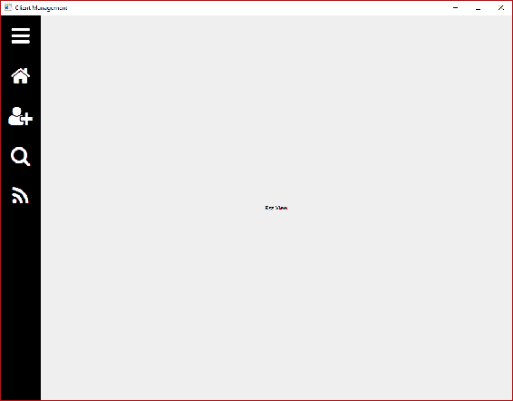
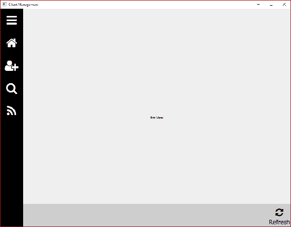
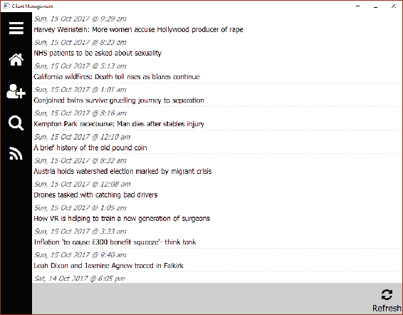

# Web 请求

这一章将带我们走向全球，从我们的应用程序进一步走向互联网。从编写一些辅助类来管理我们的 Web 请求开始，我们将从实时 RSS 订阅中提取数据，并通过一些 XML 处理来解释它。有了解析后的数据，我们可以利用我们的 QML 技能并在新视图上显示项目。点击 RSS 项目中的一个将启动一个 Web 浏览器窗口，以便更详细地查看相关文章。我们将涵盖以下主题：

+   网络访问

+   Web 请求

+   RSS 视图

+   RSS

# 网络访问

低级网络协议协商由 Qt 内部处理，我们可以轻松通过`QNetworkAccessManager`类连接到外部世界。为了能够访问这个功能，我们需要将`network`模块添加到`cm-lib.pro`中：

```cpp
QT += sql network
```

Qt 的一个弱点是缺乏接口，在某些情况下使单元测试变得困难。如果我们直接使用`QNetworkAccessManager`，我们将无法在不进行真实网络调用的情况下测试我们的代码，这是不可取的。然而，这个问题的一个快速简单的解决方案是将 Qt 实现隐藏在我们自己的接口后面，我们将在这里这样做。

在本章中，我们需要能够通过网络检查连接性并发送 HTTP GET 请求。考虑到这一点，在`cm-lib/source/networking`中创建一个新文件夹`i-network-access-manager.h`并实现接口：

```cpp
#ifndef INETWORKACCESSMANAGER_H
#define INETWORKACCESSMANAGER_H
#include <QNetworkReply>
#include <QNetworkRequest>

namespace cm {
namespace networking {
class INetworkAccessManager
{
public:
    INetworkAccessManager(){}
    virtual ~INetworkAccessManager(){}
    virtual QNetworkReply* get(const QNetworkRequest& request) = 0;
    virtual bool isNetworkAccessible() const = 0;
};
}}
#endif
```

`QNetworkRequest`是另一个 Qt 类，表示要发送到网络的请求，`QNetworkReply`表示从网络接收到的响应。理想情况下，我们也会隐藏这些实现在接口后面，但现在让我们先使用网络访问接口。有了这个，继续在同一文件夹中创建一个具体的实现类`NetworkAccessManager`：

`network-access-manager.h`：

```cpp
#ifndef NETWORKACCESSMANAGER_H
#define NETWORKACCESSMANAGER_H
#include <QObject>
#include <QScopedPointer>
#include <networking/i-network-access-manager.h>
namespace cm {
namespace networking {
class NetworkAccessManager : public QObject, public INetworkAccessManager
{
    Q_OBJECT
public:
    explicit NetworkAccessManager(QObject* parent = nullptr);
    ~NetworkAccessManager();
    QNetworkReply* get(const QNetworkRequest& request) override;
    bool isNetworkAccessible() const override;
private:
    class Implementation;
    QScopedPointer<Implementation> implementation;
};
}}
#endif
```

`network-access-manager.cpp`：

```cpp
#include "network-access-manager.h"
#include <QNetworkAccessManager>
namespace cm {
namespace networking {
class NetworkAccessManager::Implementation
{
public:
    Implementation()
    {}
    QNetworkAccessManager networkAccessManager;
};
NetworkAccessManager::NetworkAccessManager(QObject *parent)
    : QObject(parent)
    , INetworkAccessManager()
{
    implementation.reset(new Implementation());
}
NetworkAccessManager::~NetworkAccessManager()
{
}
QNetworkReply* NetworkAccessManager::get(const QNetworkRequest& request)
{
    return implementation->networkAccessManager.get(request);
}
bool NetworkAccessManager::isNetworkAccessible() const
{
    return implementation->networkAccessManager.networkAccessible() == QNetworkAccessManager::Accessible;
}
}}
```

我们所做的就是持有一个`QNetworkAccessManager`的私有实例，并通过接口将调用传递给它。接口可以很容易地扩展以包括使用相同方法的 HTTP POST 请求等其他功能。

# Web 请求

如果你以前没有使用过 HTTP 协议，它归结为客户端和服务器之间的请求和响应对话。例如，我们可以在我们喜爱的网络浏览器中向[www.bbc.co.uk](http://www.bbc.co.uk)发出请求，我们将收到一个包含各种新闻和文章的响应。在我们的`NetworkAccessManager`包装器的`get()`方法中，我们引用了一个`QNetworkRequest`（我们对服务器的请求）和一个`QNetworkReply`（服务器对我们的响应）。虽然我们不会直接隐藏`QNetworkRequest`和`QNetworkReply`在它们自己独立的接口后面，但我们将采用 Web 请求和相应的概念，并为该交互创建一个接口和实现。在`cm-lib/source/networking`中，创建一个接口头文件`i-web-request.h`：

```cpp
#ifndef IWEBREQUEST_H
#define IWEBREQUEST_H
#include <QUrl>
namespace cm {
namespace networking {
class IWebRequest
{
public:
    IWebRequest(){}
    virtual ~IWebRequest(){}
    virtual void execute() = 0;
    virtual bool isBusy() const = 0;
    virtual void setUrl(const QUrl& url) = 0;
    virtual QUrl url() const = 0;
};
}}
#endif
```

HTTP 请求的关键信息是请求要发送到的 URL，由`QUrl` Qt 类表示。我们为该属性提供了`url()`访问器和`setUrl()`修改器。另外两个方法是检查`isBusy()`网络请求对象是否正在进行请求或接收响应，以及`execute()`或将请求发送到网络。同样，有了接口，让我们直接转向在同一文件夹中创建一个新的`WebRequest`类的实现。

`web-request.h`：

```cpp
#ifndef WEBREQUEST_H
#define WEBREQUEST_H
#include <QList>
#include <QObject>
#include <QSslError>
#include <networking/i-network-access-manager.h>
#include <networking/i-web-request.h>
namespace cm {
namespace networking {
class WebRequest : public QObject, public IWebRequest
{
    Q_OBJECT
public:
    WebRequest(QObject* parent, INetworkAccessManager* networkAccessManager, const QUrl& url);
    WebRequest(QObject* parent = nullptr) = delete;
    ~WebRequest();
public:
    void execute() override;
    bool isBusy() const override;
    void setUrl(const QUrl& url) override;
    QUrl url() const override;
signals:
    void error(QString message);
    void isBusyChanged();
    void requestComplete(int statusCode, QByteArray body);
    void urlChanged();
private slots:
    void replyDelegate();
    void sslErrorsDelegate( const QList<QSslError>& _errors );
private:
    class Implementation;
    QScopedPointer<Implementation> implementation;
};
}}
#endif
```

`web-request.cpp`：

```cpp
#include "web-request.h"

#include <QMap>
#include <QNetworkReply>
#include <QNetworkRequest>
namespace cm {
namespace networking { // Private Implementation
static const QMap<QNetworkReply::NetworkError, QString> networkErrorMapper = {
    {QNetworkReply::ConnectionRefusedError, "The remote server refused the connection (the server is not accepting requests)."},
    /* ...section shortened in print for brevity...*/
    {QNetworkReply::UnknownServerError, "An unknown error related to the server response was detected."}
};
class WebRequest::Implementation
{
public:
    Implementation(WebRequest* _webRequest, INetworkAccessManager* _networkAccessManager, const QUrl& _url)
        : webRequest(_webRequest)
        , networkAccessManager(_networkAccessManager)
        , url(_url)
    {
    }
    WebRequest* webRequest{nullptr};
    INetworkAccessManager* networkAccessManager{nullptr};
    QUrl url {};
    QNetworkReply* reply {nullptr};
public: 
    bool isBusy() const
    {
        return isBusy_;
    }
    void setIsBusy(bool value)
    {
        if (value != isBusy_) {
            isBusy_ = value;
            emit webRequest->isBusyChanged();
        }
    }
private:
    bool isBusy_{false};
};
}
namespace networking {  // Structors
WebRequest::WebRequest(QObject* parent, INetworkAccessManager* networkAccessManager, const QUrl& url)
    : QObject(parent)
    , IWebRequest()
{
    implementation.reset(new WebRequest::Implementation(this, networkAccessManager, url));
}
WebRequest::~WebRequest()
{
}
}
namespace networking { // Methods
void WebRequest::execute()
{
    if(implementation->isBusy()) {
        return;
    }

    if(!implementation->networkAccessManager->isNetworkAccessible()) {
        emit error("Network not accessible");
        return;
    }
    implementation->setIsBusy(true);
    QNetworkRequest request;
    request.setUrl(implementation->url);
    implementation->reply = implementation->networkAccessManager->get(request);
    if(implementation->reply != nullptr) {
        connect(implementation->reply, &QNetworkReply::finished, this, &WebRequest::replyDelegate);
        connect(implementation->reply, &QNetworkReply::sslErrors, this, &WebRequest::sslErrorsDelegate);
    }
}
bool WebRequest::isBusy() const
{
    return implementation->isBusy();
}
void WebRequest::setUrl(const QUrl& url)
{
    if(url != implementation->url) {
        implementation->url = url;
        emit urlChanged();
    }
}
QUrl WebRequest::url() const
{
    return implementation->url;
}
}
namespace networking { // Private Slots
void WebRequest::replyDelegate()
{
    implementation->setIsBusy(false);
    if (implementation->reply == nullptr) {
        emit error("Unexpected error - reply object is null");
        return;
    }
    disconnect(implementation->reply, &QNetworkReply::finished, this, &WebRequest::replyDelegate);
    disconnect(implementation->reply, &QNetworkReply::sslErrors, this, &WebRequest::sslErrorsDelegate);
    auto statusCode = implementation->reply->attribute(QNetworkRequest::HttpStatusCodeAttribute).toInt();
    auto responseBody = implementation->reply->readAll();
    auto replyStatus = implementation->reply->error();
    implementation->reply->deleteLater();
    if (replyStatus != QNetworkReply::NoError) {
        emit error(networkErrorMapper[implementation->reply->error()]);
    }
    emit requestComplete(statusCode, responseBody);
}
void WebRequest::sslErrorsDelegate(const QList<QSslError>& errors)
{
    QString sslError;
    for (const auto& error : errors) {
        sslError += error.errorString() + "\n";
    }
    emit error(sslError);
}
}}
```

实现看起来比实际复杂，纯粹是因为错误代码映射过长。在出现问题时，Qt 将使用枚举器报告错误。映射的目的只是将枚举器与人类可读的错误描述匹配，以便向用户呈现或写入控制台或日志文件。

除了接口方法之外，我们还有一些信号，可以用来告诉任何感兴趣的观察者发生了什么事件：

+   `error()` 将在出现问题时被发出，并将错误描述作为参数传递

+   `isBusyChanged()` 在请求开始或结束时被触发，并且请求变得繁忙或空闲

+   `requestComplete()` 在接收和处理响应后被发出，并将包含 HTTP 状态代码和表示响应主体的字节数组

+   `urlChanged()` 当 URL 更新时将被触发

我们还有一些私有槽，将作为处理回复和处理任何 SSL 错误的委托。当我们执行新请求时，它们连接到 `QNetworkReply` 对象上的信号，当我们收到回复时再次断开连接。

实现的核心是两个方法——`execute()` 用于发送请求和 `replyDelegate()` 用于处理响应。

在执行时，我们首先确保我们没有在执行另一个请求，然后与网络访问管理器检查我们是否有可用连接。假设我们有，然后设置繁忙标志并使用当前设置的 URL 构造一个 `QNetworkRequest`。然后将请求传递给我们的网络访问管理器（作为接口注入，因此我们可以更改其行为），最后，我们连接我们的委托槽并等待响应。

当我们收到回复时，我们取消繁忙标志并断开我们的槽，然后读取我们感兴趣的响应细节，主要是 HTTP 状态代码和响应主体。我们检查回复是否成功完成（请注意，在此上下文中，“负面”的 HTTP 响应代码在 4xx 或 5xx 范围内仍然算作成功完成的请求），并为任何感兴趣的方捕获和处理细节。

# RSS View

让我们向我们的应用程序添加一个新视图，我们可以使用我们的新类显示来自 Web 服务的一些信息。

这里没有什么新的或复杂的，所以我不会展示所有的代码，但有一些步骤要记住：

1.  在 `cm-ui/views` 中创建一个新的 `RssView.qml` 视图，并暂时从 `SplashView` 复制 QML，将“Splash View”文本替换为“Rss View”

1.  在 `/views` 前缀块中的 `views.qrc` 中添加视图，并使用别名 `RssView.qml`

1.  将 `goRssView()` 信号添加到 `NavigationController`

1.  在 `MasterView` 中，将 `onGoRssView` 槽添加到 Connections 元素，并使用它导航到 `RssView`

1.  在 `NavigationBar` 中，添加一个新的 `NavigationButton`，其中 `iconCharacter` 为 `\uf09e`，描述为 `RSS Feed`，`hoverColour` 为 `#8acece`，并使用 `onNavigationButtonClicked` 槽调用 `NavigationController` 上的 `goRssView()`

只需几个简单的步骤，我们现在已经有了一个全新的视图，可以使用导航栏访问：



接下来，我们将通过以下步骤向视图添加一个上下文命令栏：

1.  在 `CommandController` 中，添加一个新的私有成员列表 `rssViewContextCommands`

1.  添加一个访问器方法 `ui_rssViewContextCommands()`

1.  添加一个名为 `ui_rssViewContextCommands` 的 `Q_PROPERTY`

1.  添加一个新的槽 `onRssRefreshExecuted()`，它只是向控制台写入调试消息；目前表示它已被调用

1.  将一个名为 `rssRefreshCommand` 的新命令附加到 `rssViewContextCommands`，其中 `0xf021` 为图标字符，标签为“Refresh”，并将其连接到 `onRssRefreshExecuted()` 槽

1.  在 `RssView` 中，添加一个 `CommandBar` 组件，其中 `commandList` 与命令控制器上的 `ui_rssViewContextCommands` 相连

前几章的辛勤工作现在真的开始见效了；我们的新视图有了自己的命令栏和一个完全功能的刷新按钮。当您单击它时，它应该将您添加到控制台的调试消息：



接下来，我们需要创建我们的`NetworkAccessManager`和`WebRequest`类的实例。像往常一样，我们将把这些添加到`MasterController`并向`CommandController`注入依赖项。

在`MasterController`中，添加两个新的私有成员：

```cpp
NetworkAccessManager* networkAccessManager{nullptr};
WebRequest* rssWebRequest{nullptr};
```

记得包含相关的头文件。在`Implementation`构造函数中实例化这些新成员，确保它们在`commandController`之前创建：

```cpp
networkAccessManager = new NetworkAccessManager(masterController);
rssWebRequest = new WebRequest(masterController, networkAccessManager, QUrl("http://feeds.bbci.co.uk/news/rss.xml?edition=uk"));
```

在这里，我们使用了与英国相关的 BBC RSS 订阅的 URL；随时可以通过替换超链接文本来将其替换为您选择的其他订阅。

接下来，将`rssWebRequest`作为新参数传递给`commandController`构造函数：

```cpp
commandController = new CommandController(masterController, databaseController, navigationController, newClient, clientSearch, rssWebRequest);
```

接下来，编辑`CommandController`以将此新参数作为接口的指针：

```cpp
explicit CommandController(QObject* _parent = nullptr, IDatabaseController* databaseController = nullptr, NavigationController* navigationController = nullptr, models::Client* newClient = nullptr, models::ClientSearch* clientSearch = nullptr, networking::IWebRequest* rssWebRequest = nullptr);
```

通过`Implementation`构造函数将此指针传递并将其存储为私有成员变量，就像我们对所有其他依赖项所做的那样：

```cpp
IWebRequest* rssWebRequest{nullptr};
```

现在我们可以更新`onRssRefreshExecuted()`槽来执行网络请求：

```cpp
void CommandController::onRssRefreshExecuted()
{
    qDebug() << "You executed the Rss Refresh command!";

    implementation->rssWebRequest->execute();
}
```

命令控制器现在对用户按下刷新按钮做出反应并执行网络请求。但是，当我们收到响应时，我们目前并没有做任何事情。让我们在公共槽部分为`MasterController`添加一个委托：

```cpp
void MasterController::onRssReplyReceived(int statusCode, QByteArray body)
{
    qDebug() << "Received RSS request response code " << statusCode << ":";
    qDebug() << body;
}
```

现在，在`Implementation`中实例化`rssWebRequest`后，我们可以将`requestComplete`信号连接到我们的新委托：

```cpp
QObject::connect(rssWebRequest, &WebRequest::requestComplete, masterController, &MasterController::onRssReplyReceived);
```

现在构建并运行应用程序，导航到 RSS 视图，并单击刷新。在请求执行时稍等片刻，您将在应用程序输出控制台上看到各种无意义的打印内容：

```cpp
Received RSS request response code 200 :
"<?xml version=\"1.0\" encoding=\"UTF-8\"?>\n<?xml-stylesheet title=...”
```

恭喜！您已经获得了一个 RSS 订阅！现在，这是什么？

# RSS

**Rich Site Summary **(**RSS**)是一种用于定期传递变化的网络内容的格式，本质上是整个网站、新闻广播、博客或类似内容被压缩成要点。每个项目由日期和描述性标题等基本信息组成，并附有指向包含完整文章的网页的超链接。

数据是从 XML 扩展的，并且必须遵守在[`www.rssboard.org/rss-specification`](http://www.rssboard.org/rss-specification)中描述的定义标准。

为了本示例的目的，将 XML 简化如下：

```cpp
<rss>
    <channel>
        <title></title>
        <description></description>
        <link></link>
        <image>
            <url></url>
            <title></title>
            <link></link>
            <width></width>
            <height></height>
        </image>
        <item>
            <title></title>
            <description></description>
            <link></link>
            <pubDate></pubDate>
        </item>
        <item>
                …
          </item>
    </channel>
</rss>
```

在根`<rss>`节点内，我们有一个`<channel>`节点，它又包含一个`<image>`节点和一个或多个`<item>`节点的集合。

我们将这些节点建模为类，但首先我们需要引入 XML 模块并编写一个小的辅助类来为我们进行一些解析。在`cm-lib.pro`和`cm-ui.pro`中，将`xml`模块添加到`QT`变量中的模块中；考虑以下示例：

```cpp
QT += sql network xml
```

接下来，在新文件夹`cm-lib/source/utilities`中创建一个新的`XmlHelper`类。

`xml-helper.h`：

```cpp
#ifndef XMLHELPER_H
#define XMLHELPER_H
#include <QDomNode>
#include <QString>
namespace cm {
namespace utilities {
class XmlHelper
{
public:
    static QString toString(const QDomNode& domNode);
private:
    XmlHelper(){}
    static void appendNode(const QDomNode& domNode, QString& output);
};
}}
#endif
```

`xml-helper.cpp`：

```cpp
#include "xml-helper.h"

namespace cm {
namespace utilities {
QString XmlHelper::toString(const QDomNode& domNode)
{
    QString returnValue;
    for(auto i = 0; i < domNode.childNodes().size(); ++i) {
        QDomNode subNode = domNode.childNodes().at(i);
        appendNode(subNode, returnValue);
    }
    return returnValue;
}
void XmlHelper::appendNode(const QDomNode& domNode, QString& output)
{
    if(domNode.nodeType() == QDomNode::TextNode) {
        output.append(domNode.nodeValue());
        return;
    }
    if(domNode.nodeType() == QDomNode::AttributeNode) {
        output.append(" ");
        output.append(domNode.nodeName());
        output.append("=\"");
        output.append(domNode.nodeValue());
        output.append("\"");
        return;
    }
    if(domNode.nodeType() == QDomNode::ElementNode) {
        output.append("<");
        output.append(domNode.nodeName());
        // Add attributes
        for(auto i = 0; i < domNode.attributes().size(); ++i) {
            QDomNode subNode = domNode.attributes().item(i);
            appendNode(subNode, output);
        }
        output.append(">");
        for(auto i = 0; i < domNode.childNodes().size(); ++i) {
            QDomNode subNode = domNode.childNodes().at(i);
            appendNode(subNode, output);
        }
        output.append("</" + domNode.nodeName() + ">");
    }
}
}}
```

我不会详细介绍这个类的功能，因为它不是本章的重点，但基本上，如果我们收到包含 HTML 标记的 XML 节点（这在 RSS 中很常见），XML 解析器会有点困惑并将 HTML 分解为 XML 节点，这不是我们想要的。考虑以下示例：

```cpp
<xmlNode>
    Here is something from a website that has a <a href=”http://www.bbc.co.uk”>hyperlink</a> in it.
</xmlNode>
```

在这种情况下，XML 解析器将把`<a>`视为 XML，并将内容分解为三个类似于这样的子节点：

```cpp
<xmlNode>
    <textNode1>Here is something from a website that has a </textNode1>
    <a href=”http://www.bbc.co.uk”>hyperlink</a>
    <textNode2>in it.</textNode2>
</xmlNode>
```

这使得在 UI 上向用户显示 xmlNode 的内容变得困难。相反，我们使用 XmlHelper 手动解析内容并构造一个单个字符串，这样更容易处理。

现在，让我们继续处理 RSS 类。在新的`cm-lib/source/rss`文件夹中，创建新的`RssChannel`、`RssImage`和`RssItem`类。

`rss-image.h`：

```cpp
#ifndef RSSIMAGE_H
#define RSSIMAGE_H
#include <QObject>
#include <QScopedPointer>
#include <QtXml/QDomNode>
#include <cm-lib_global.h>
namespace cm {
namespace rss {
class CMLIBSHARED_EXPORT RssImage : public QObject
{
    Q_OBJECT
    Q_PROPERTY(quint16 ui_height READ height CONSTANT)
    Q_PROPERTY(QString ui_link READ link CONSTANT)
    Q_PROPERTY(QString ui_title READ title CONSTANT)
    Q_PROPERTY(QString ui_url READ url CONSTANT)
    Q_PROPERTY(quint16 ui_width READ width CONSTANT)
public:
    explicit RssImage(QObject* parent = nullptr, const QDomNode& domNode = QDomNode());
    ~RssImage();
    quint16 height() const;
    const QString& link() const;
    const QString& title() const;
    const QString& url() const;
    quint16 width() const;
private:
    class Implementation;
    QScopedPointer<Implementation> implementation;
};
}}

#endif
```

`rss-image.cpp`：

```cpp
#include "rss-image.h"

namespace cm {
namespace rss {
class RssImage::Implementation
{
public:
    QString url;    // Mandatory. URL of GIF, JPEG or PNG that represents the channel.
    QString title;  // Mandatory.  Describes the image.
    QString link;   // Mandatory.  URL of the site.
    quint16 width;  // Optional.  Width in pixels.  Max 144, default 
                                                                    88.
    quint16 height; // Optional.  Height in pixels.  Max 400, default 
                                                                    31
    void update(const QDomNode& domNode)
    {
        QDomElement imageUrl = domNode.firstChildElement("url");
        if(!imageUrl.isNull()) {
            url = imageUrl.text();
        }
        QDomElement imageTitle = domNode.firstChildElement("title");
        if(!imageTitle.isNull()) {
            title = imageTitle.text();
        }
        QDomElement imageLink = domNode.firstChildElement("link");
        if(!imageLink.isNull()) {
            link = imageLink.text();
        }
        QDomElement imageWidth = domNode.firstChildElement("width");
        if(!imageWidth.isNull()) {
            width = static_cast<quint16>(imageWidth.text().toShort());
        } else {
            width = 88;
        }
        QDomElement imageHeight = domNode.firstChildElement("height");
        if(!imageHeight.isNull()) {
            height = static_cast<quint16>
                                  (imageHeight.text().toShort());
        } else {
            height = 31;
        }
    }
};
RssImage::RssImage(QObject* parent, const QDomNode& domNode)
    : QObject(parent)
{
    implementation.reset(new Implementation());
    implementation->update(domNode);
}
RssImage::~RssImage()
{
}
quint16 RssImage::height() const
{
    return implementation->height;
}
const QString& RssImage::link() const
{
    return implementation->link;
}
const QString& RssImage::title() const
{
    return implementation->title;
}
const QString& RssImage::url() const
{
    return implementation->url;
}
quint16 RssImage::width() const
{
    return implementation->width;
}
}}
```

这个类只是一个普通的纯数据模型，唯一的例外是它将从 Qt 的`QDomNode`类表示的 XML `<image>`节点构造而成。我们使用`firstChildElement()`方法来定位`<url>`、`<title>`和`<link>`强制的子节点，然后通过`text()`方法访问每个节点的值。`<width>`和`<height>`节点是可选的，如果它们不存在，我们将使用默认的图像尺寸 88 x 31 像素。

`rss-item.h`：

```cpp
#ifndef RSSITEM_H
#define RSSITEM_H
#include <QDateTime>
#include <QObject>
#include <QscopedPointer>
#include <QtXml/QDomNode>
#include <cm-lib_global.h>
namespace cm {
namespace rss {
class CMLIBSHARED_EXPORT RssItem : public QObject
{
    Q_OBJECT
    Q_PROPERTY(QString ui_description READ description CONSTANT)
    Q_PROPERTY(QString ui_link READ link CONSTANT)
    Q_PROPERTY(QDateTime ui_pubDate READ pubDate CONSTANT)
    Q_PROPERTY(QString ui_title READ title CONSTANT)
public:
    RssItem(QObject* parent = nullptr, const QDomNode& domNode = QDomNode());
    ~RssItem();
    const QString& description() const;
    const QString& link() const;
    const QDateTime& pubDate() const;
    const QString& title() const;
private:
    class Implementation;
    QScopedPointer<Implementation> implementation;
};
}}
#endif
```

`rss-item.cpp`：

```cpp
#include "rss-item.h"
#include <QTextStream>
#include <utilities/xml-helper.h>
using namespace cm::utilities;
namespace cm {
namespace rss {
class RssItem::Implementation
{
public:
    Implementation(RssItem* _rssItem)
        : rssItem(_rssItem)
    {
    }
    RssItem* rssItem{nullptr};
    QString description;    // This or Title mandatory.  Either the 
                            synopsis or full story.  HTML is allowed.
    QString link;           // Optional. Link to full story.  Populated 
                                  if Description is only the synopsis.
    QDateTime pubDate;      // Optional. When the item was published. 
                     RFC 822 format e.g. Sun, 19 May 2002 15:21:36 GMT.
    QString title;          // This or Description mandatory.
    void update(const QDomNode& domNode)
    {
        for(auto i = 0; i < domNode.childNodes().size(); ++i) {
            QDomNode childNode = domNode.childNodes().at(i);
            if(childNode.nodeName() == "description") {
                description = XmlHelper::toString(childNode);
            }
        }
        QDomElement itemLink = domNode.firstChildElement("link");
        if(!itemLink.isNull()) {
            link = itemLink.text();
        }
        QDomElement itemPubDate = domNode.firstChildElement("pubDate");
        if(!itemPubDate.isNull()) {
            pubDate = QDateTime::fromString(itemPubDate.text(), 
                                                     Qt::RFC2822Date);
        }
        QDomElement itemTitle = domNode.firstChildElement("title");
        if(!itemTitle.isNull()) {
            title = itemTitle.text();
        }
    }
};
RssItem::RssItem(QObject* parent, const QDomNode& domNode)
{
    implementation.reset(new Implementation(this));
    implementation->update(domNode);
}
RssItem::~RssItem()
{
}
const QString& RssItem::description() const
{
    return implementation->description;
}
const QString& RssItem::link() const
{
    return implementation->link;
}
const QDateTime& RssItem::pubDate() const
{
    return implementation->pubDate;
}
const QString& RssItem::title() const
{
    return implementation->title;
}
}}
```

这个类与上一个类基本相同。这次我们在解析`<description>`节点时使用我们的 XMLHelper 类，因为它很有可能包含 HTML 标记。还要注意，Qt 还包含了`Qt::RFC2822Date`格式说明符，当使用静态的`QDateTime::fromString()`方法将字符串转换为`QDateTime`对象时，这是 RSS 规范中使用的格式，可以节省我们手动解析日期的工作。

`rss-channel.h`：

```cpp
#ifndef RSSCHANNEL_H
#define RSSCHANNEL_H
#include <QDateTime>
#include <QtXml/QDomElement>
#include <QtXml/QDomNode>
#include <QList>
#include <QObject>
#include <QtQml/QQmlListProperty>
#include <QString>
#include <cm-lib_global.h>
#include <rss/rss-image.h>
#include <rss/rss-item.h>
namespace cm {
namespace rss {
class CMLIBSHARED_EXPORT RssChannel : public QObject
{
    Q_OBJECT
    Q_PROPERTY(QString ui_description READ description CONSTANT)
    Q_PROPERTY(cm::rss::RssImage* ui_image READ image CONSTANT)
    Q_PROPERTY(QQmlListProperty<cm::rss::RssItem> ui_items READ 
                                                ui_items CONSTANT)
    Q_PROPERTY(QString ui_link READ link CONSTANT)
    Q_PROPERTY(QString ui_title READ title CONSTANT)
public:
    RssChannel(QObject* parent = nullptr, const QDomNode& domNode = QDomNode());
    ~RssChannel();
    void addItem(RssItem* item);
    const QString& description() const;
    RssImage* image() const;
    const QList<RssItem*>& items() const;
    const QString& link() const;
    void setImage(RssImage* image);
    const QString& title() const;
    QQmlListProperty<RssItem> ui_items();
    static RssChannel* fromXml(const QByteArray& xmlData, QObject* 
                                            parent = nullptr);
private:
    class Implementation;
    QScopedPointer<Implementation> implementation;
};
}}
#endif
```

`rss-channel.cpp`：

```cpp
#include "rss-channel.h"
#include <QtXml/QDomDocument>
namespace cm {
namespace rss {
class RssChannel::Implementation
{
public:
    QString description;            // Mandatory.  Phrase or sentence describing the channel.
    RssImage* image{nullptr};       // Optional.  Image representing the channel.
    QList<RssItem*> items;          // Optional.  Collection representing stories.
    QString link;                   // Mandatory.  URL to the corresponding HTML website.
    QString title;                  // Mandatory.  THe name of the Channel.
    void update(const QDomNode& domNode)
    {
        QDomElement channelDescription = domNode.firstChildElement("description");
        if(!channelDescription.isNull()) {
            description = channelDescription.text();
        }
        QDomElement channelLink = domNode.firstChildElement("link");
        if(!channelLink.isNull()) {
            link = channelLink.text();
        }
        QDomElement channelTitle = domNode.firstChildElement("title");
        if(!channelTitle.isNull()) {
            title = channelTitle.text();
        }
    }
};
RssChannel::RssChannel(QObject* parent, const QDomNode& domNode)
    : QObject(parent)
{
    implementation.reset(new Implementation());
    implementation->update(domNode);
}
RssChannel::~RssChannel()
{
}
void RssChannel::addItem(RssItem* item)
{
    if(!implementation->items.contains(item)) {
        item->setParent(this);
        implementation->items.push_back(item);
    }
}
const QString&  RssChannel::description() const
{
    return implementation->description;
}
RssImage* RssChannel::image() const
{
    return implementation->image;
}
const QList<RssItem*>&  RssChannel::items() const
{
    return implementation->items;
}
const QString&  RssChannel::link() const
{
    return implementation->link;
}
void RssChannel::setImage(RssImage* image)
{
    if(implementation->image) {
        implementation->image->deleteLater();
        implementation->image = nullptr;
    }
    image->setParent(this);
    implementation->image = image;
}
const QString& RssChannel::title() const
{
    return implementation->title;
}
QQmlListProperty<RssItem> RssChannel::ui_items()
{
    return QQmlListProperty<RssItem>(this, implementation->items);
}
RssChannel* RssChannel::fromXml(const QByteArray& xmlData, QObject* parent)
{
    QDomDocument doc;
    doc.setContent(xmlData);
    auto channelNodes = doc.elementsByTagName("channel");
    // Rss must have 1 channel
    if(channelNodes.size() != 1) return nullptr;
    RssChannel* channel = new RssChannel(parent, channelNodes.at(0));
    auto imageNodes = doc.elementsByTagName("image");
    if(imageNodes.size() > 0) {
        channel->setImage(new RssImage(channel, imageNodes.at(0)));
    }
    auto itemNodes = doc.elementsByTagName("item");
    for (auto i = 0; i < itemNodes.size(); ++i) {
        channel->addItem(new RssItem(channel, itemNodes.item(i)));
    }
    return channel;
}
}}
```

这个类与之前的类基本相同，但因为这是我们 XML 树的根对象，所以我们还有一个静态的`fromXml()`方法。这里的目标是获取包含 RSS feed XML 的 RSS 网络请求响应的字节数组，并让该方法为我们创建一个 RSS Channel、Image 和 Items 层次结构。

我们将 XML 字节数组传递给 Qt 的`QDomDocument`类，就像我们之前使用 JSON 和`QJsonDocument`类一样。我们使用`elementsByTagName()`方法找到`<channel>`标签，然后使用该标签作为构造函数的`QDomNode`参数构造一个新的`RssChannel`对象。`RssChannel`通过`update()`方法填充自己的属性。然后我们定位`<image>`和`<item>`子节点，并创建新的`RssImage`和`RssItem`实例，将它们添加到根`RssChannel`对象中。同样，这些类能够从提供的`QDomNode`中填充自己的属性。

在我们忘记之前，让我们也在`main()`中注册这些类：

```cpp
qmlRegisterType<cm::rss::RssChannel>("CM", 1, 0, "RssChannel");
qmlRegisterType<cm::rss::RssImage>("CM", 1, 0, "RssImage");
qmlRegisterType<cm::rss::RssItem>("CM", 1, 0, "RssItem");
```

我们现在可以在`MasterController`中添加一个`RssChannel`，供 UI 绑定：

1.  在`MasterController`中，添加一个新的`rssChannel`私有成员变量，类型为`RssChannel*`

1.  添加一个`rssChannel()`访问器方法

1.  添加一个`rssChannelChanged()`信号

1.  添加一个名为`ui_rssChannel`的`Q_PROPERTY`，使用`READ`访问器和`NOTIFY`信号

当我们没有任何 RSS 数据来提供时，我们不会创建一个构造，而是在 RSS 回复委托中执行：

```cpp
void MasterController::onRssReplyReceived(int statusCode, QByteArray body)
{
    qDebug() << "Received RSS request response code " << statusCode << ":";
    qDebug() << body;
    if(implementation->rssChannel) {
        implementation->rssChannel->deleteLater();
        implementation->rssChannel = nullptr;
        emit rssChannelChanged();
    }
    implementation->rssChannel = RssChannel::fromXml(body, this);
    emit rssChannelChanged();
}
```

我们进行一些清理工作，检查我们是否已经在内存中有一个旧的频道对象，如果有，我们使用`QObject`的`deleteLater()`方法安全地删除它。然后我们继续使用来自网络请求的 XML 数据构造一个新的频道。

始终在`QObject`派生类上使用`deleteLater()`，而不是标准的 C++ `delete`关键字，因为销毁将与事件循环同步，您将最小化意外异常的风险。

我们将以与管理搜索结果类似的方式显示响应中的 RSS 项目，使用`ListView`和相关的委托。将`RssItemDelegate.qml`添加到`cm-ui/components`，并执行编辑`components.qrc`和`qmldir`文件的常规步骤：

```cpp
import QtQuick 2.9
import assets 1.0
import CM 1.0
Item {
    property RssItem rssItem
    implicitWidth: parent.width
    implicitHeight: background.height
    Rectangle {
        id: background
        width: parent.width
        height: textPubDate.implicitHeight + textTitle.implicitHeight + 
                       borderBottom.height + (Style.sizeItemMargin * 3)
        color: Style.colourPanelBackground
        Text {
            id: textPubDate
            anchors {
                top: parent.top
                left: parent.left
                right: parent.right
                margins: Style.sizeItemMargin
            }
            text: Qt.formatDateTime(rssItem.ui_pubDate, "ddd, d MMM 
                                                    yyyy @ h:mm ap")
            font {
                pixelSize: Style.pixelSizeDataControls
                italic: true
                weight: Font.Light
            }
            color: Style.colorItemDateFont
        }
        Text {
            id: textTitle
            anchors {
                top: textPubDate.bottom
                left: parent.left
                right: parent.right
                margins: Style.sizeItemMargin
            }
            text: rssItem.ui_title
            font {
                pixelSize: Style.pixelSizeDataControls
            }
            color: Style.colorItemTitleFont
            wrapMode: Text.Wrap
        }
        Rectangle {
            id: borderBottom
            anchors {
                top: textTitle.bottom
                left: parent.left
                right: parent.right
                topMargin: Style.sizeItemMargin
            }
            height: 1
            color: Style.colorItemBorder
        }
        MouseArea {
            anchors.fill: parent
            cursorShape: Qt.PointingHandCursor
            hoverEnabled: true
            onEntered: background.state = "hover"
            onExited: background.state = ""
            onClicked: if(rssItem.ui_link !== "") {
                           Qt.openUrlExternally(rssItem.ui_link);
                       }
        }
        states: [
            State {
                name: "hover"
                PropertyChanges {
                    target: background
                    color: Style.colourPanelBackgroundHover
                }
            }
        ]
    }
}
```

为了支持这个组件，我们需要添加一些额外的样式属性：

```cpp
readonly property color colourItemBackground: "#fefefe"
readonly property color colourItemBackgroundHover: "#efefef"
readonly property color colorItemBorder: "#efefef"
readonly property color colorItemDateFont: "#636363"
readonly property color colorItemTitleFont: "#131313"
readonly property real sizeItemMargin: 5
```

我们现在可以在`RssView`中利用这个委托：

```cpp
import QtQuick 2.9
import assets 1.0
import components 1.0
Item {
    Rectangle {
        anchors.fill: parent
        color: Style.colourBackground
    }
    ListView {
        id: itemsView
        anchors {
            top: parent.top
            left: parent.left
            right: parent.right
            bottom: commandBar.top
            margins: Style.sizeHeaderMargin
        }
        clip: true
        model: masterController.ui_rssChannel ? masterController.ui_rssChannel.ui_items : 0
        delegate: RssItemDelegate {
            rssItem: modelData
        }
    }
    CommandBar {
        id: commandBar
        commandList: masterController.ui_commandController.ui_rssViewContextCommands
    }
}
```

构建并运行，导航到 RSS 视图，并单击刷新按钮以进行网络请求并显示响应：



将鼠标悬停在项目上以查看光标效果，并单击项目以在默认的网络浏览器中打开它。Qt 在`Qt.openUrlExternally()`方法中为我们处理此操作，我们将 RSS 项目`link`属性传递给它。

# 摘要

在本章中，我们将我们的触角延伸到应用程序之外，并开始使用互联网上的 HTTP 请求与外部 API 进行交互。我们使用自己的接口对 Qt 功能进行了抽象，以改善解耦并使我们的组件更易于测试。我们快速了解了 RSS 及其结构，以及如何使用 Qt 的 XML 模块处理 XML 节点树。最后，我们加强了我们一直在做的出色的 UI 工作，并添加了一个交互式视图来显示 RSS 订阅，并启动默认的 Web 浏览器以显示给定的 URL。

在第九章 *总结* 中，我们将看看将我们的应用程序打包部署到其他计算机所需的步骤。
