# 第九章：总结

在本章中，我们将总结一些在之前章节中没有完全涉及的主题。我们将通过将对象创建移动到对象工厂来使我们的应用程序更具可测试性。我们将通过添加缩放功能使我们的 UI 更加动态。`EnumeratorDecorator`属性将拥有自己的 UI 组件，并且当我们添加联系人管理时，我们将利用它们。最后，我们将通过打包和部署我们的应用程序来总结一切。我们将涵盖以下主题：

+   对象工厂

+   动态 UI 缩放

+   将图像添加到仪表板

+   枚举选择器

+   管理联系人

+   部署和安装我们的应用程序

# 对象工厂

在一个更大的系统中，如果`MasterController`测试更全面，那么将所有这些对象创建硬编码在私有实现中将会导致问题，因为`MasterController`与其依赖之间的紧密耦合。一个选择是在`main()`中创建所有其他对象，并将它们注入到`MasterController`构造函数中，就像我们对其他控制器所做的那样。这将意味着注入大量的构造函数参数，而且能够将`MasterController`实例作为所有其他对象的父对象是很方便的，因此我们将注入一个单一的对象工厂，控制器可以使用它来满足其所有对象创建需求。

这个工厂模式的关键部分是将所有内容隐藏在接口后面，因此在测试`MasterController`时，您可以传入一个模拟工厂并控制所有对象的创建。在`cm-lib`中，在`source/framework`中创建一个新的`i-object-factory.h`头文件：

```cpp
#ifndef IOBJECTFACTORY_H
#define IOBJECTFACTORY_H

#include <controllers/i-command-controller.h>
#include <controllers/i-database-controller.h>
#include <controllers/i-navigation-controller.h>
#include <models/client.h>
#include <models/client-search.h>
#include <networking/i-network-access-manager.h>
#include <networking/i-web-request.h>

namespace cm {
namespace framework {

class IObjectFactory
{
public:
    virtual ~IObjectFactory(){}

    virtual models::Client* createClient(QObject* parent) const = 0;
    virtual models::ClientSearch* createClientSearch(QObject* parent, controllers::IDatabaseController* databaseController) const = 0;
    virtual controllers::ICommandController* createCommandController(QObject* parent, controllers::IDatabaseController* databaseController, controllers::INavigationController* navigationController, models::Client* newClient, models::ClientSearch* clientSearch, networking::IWebRequest* rssWebRequest) const = 0;
    virtual controllers::IDatabaseController* createDatabaseController(QObject* parent) const = 0;
    virtual controllers::INavigationController* createNavigationController(QObject* parent) const = 0;
    virtual networking::INetworkAccessManager* createNetworkAccessManager(QObject* parent) const = 0;
    virtual networking::IWebRequest* createWebRequest(QObject* parent, networking::INetworkAccessManager* networkAccessManager, const QUrl& url) const = 0;
};

}}

#endif
```

除了模型之外，我们将创建的所有对象都将被移动到接口后面。这是因为它们本质上只是数据容器，我们可以在测试场景中轻松创建真实实例，而不会产生任何副作用。

出于简洁起见，我们将跳过这个练习，并将其留给读者自己练习。使用`IDatabaseController`作为示例或参考代码示例。

有了工厂接口可用，将`MasterController`构造函数更改为接受一个实例作为依赖项：

```cpp
MasterController::MasterController(QObject* parent, IObjectFactory* objectFactory)
    : QObject(parent)
{
    implementation.reset(new Implementation(this, objectFactory));
}
```

我们将对象传递给`Implementation`并将其存储在一个私有成员变量中，就像以前做过的那样。有了工厂可用，我们现在可以将所有基于`new`的对象创建语句移动到`IObjectFactory`接口的具体实现（`ObjectFactory`类）中，并用更抽象和可测试的内容替换`MasterController`中的这些语句：

```cpp
Implementation(MasterController* _masterController, IObjectFactory* _objectFactory)
    : masterController(_masterController)
    , objectFactory(_objectFactory)
{
    databaseController = objectFactory->createDatabaseController(masterController);
    clientSearch = objectFactory->createClientSearch(masterController, databaseController);
    navigationController = objectFactory->createNavigationController(masterController);
    networkAccessManager = objectFactory->createNetworkAccessManager(masterController);
    rssWebRequest = objectFactory->createWebRequest(masterController, networkAccessManager, QUrl("http://feeds.bbci.co.uk/news/rss.xml?edition=uk"));
    QObject::connect(rssWebRequest, &IWebRequest::requestComplete, masterController, &MasterController::onRssReplyReceived);
    newClient = objectFactory->createClient(masterController);
    commandController = objectFactory->createCommandController(masterController, databaseController, navigationController, newClient, clientSearch, rssWebRequest);
}
```

现在，在测试`MasterController`时，我们可以传入`IObjectFactory`接口的模拟实现，并控制对象的创建。除了实现`ObjectFactory`并在实例化`MasterController`时将其传递给它之外，另一个变化是在`main.cpp`中，我们现在需要注册接口到`NavigationController`和`CommandController`，而不是具体的实现。我们可以通过简单地用`qmlRegisterUncreatableType`的伴随语句替换`qmlRegisterType`语句来实现这一点：

```cpp
qmlRegisterUncreatableType<cm::controllers::INavigationController>("CM", 1, 0, "INavigationController", "Interface");
qmlRegisterUncreatableType<cm::controllers::ICommandController>("CM", 1, 0, "ICommandController", "Interface");
```

# UI 缩放

在本书中，我们非常关注响应式 UI，尽可能使用锚点和相对定位，以便当用户调整窗口大小时，内容可以按比例缩放和适当调整。我们还将所有“硬编码”的属性，如大小和颜色，都放入了一个集中的样式对象中。

如果我们选择一个与大小有关的属性，例如`sizeScreenMargin`，它目前具有固定值`20`。如果我们决定增加`MasterView`中**Window**元素的起始大小，这个屏幕边距大小将保持不变。现在，由于样式对象，增加屏幕边距也非常容易，但如果所有硬编码的属性都可以随着**Window**元素的动态缩放而动态地放大和缩小，那将是很好的。这样，我们可以尝试不同的窗口大小，而无需每次更新样式。

正如我们已经看到的，QML 的灵活性通过内置的 JavaScript 支持得到了进一步扩展，我们可以做到这一点。

首先，让我们在 Style 中为窗口创建新的宽度和高度属性：

```cpp
readonly property real widthWindow: 1920
readonly property real heightWindow: 1080
```

在`MasterView`中使用这些新属性：

```cpp
Window {
    width: Style.widthWindow
    height: Style.heightWindow
    ….
}
```

到目前为止，在 Style 中创建的所有尺寸属性都与 1920 x 1080 的窗口尺寸相关，因此让我们将其记录为 Style 中的新属性：

```cpp
readonly property real widthWindowReference: 1920
readonly property real heightWindowReference: 1080
```

然后，我们可以使用参考尺寸和实际尺寸来计算水平和垂直轴上的缩放因子。因此，简单来说，如果我们设计时考虑到窗口宽度为 1,000，然后我们将窗口设置为 2,000 宽，我们希望一切在水平方向上按 2 的比例缩放。在 Style 中添加以下函数：

```cpp
function hscale(size) {
    return Math.round(size * (widthWindow / widthWindowReference))
}
function vscale(size) {
    return Math.round(size * (heightWindow / heightWindowReference))
}
function tscale(size) {
    return Math.round((hscale(size) + vscale(size)) / 2)
}
```

`hscale`和`vscale`函数分别计算水平和垂直缩放因子。对于像字体像素大小这样的特定尺寸属性，没有独立的宽度和高度，因此我们可以使用`tscale`函数计算水平和垂直缩放的平均值。

然后，我们可以将我们想要缩放的任何属性包装在适当的函数中。例如，我们的屏幕边距可以使用`tscale`函数：

```cpp
readonly property real sizeScreenMargin: tscale(20)
```

现在，不仅可以在 Style 中增加窗口的初始大小，而且所选的属性将自动按比例缩放到新的大小。

一个非常有用的模块，可以帮助调整大小是`QtQuick.Window`。我们已经将其添加到`MasterView`中，以便访问 Window 元素。该模块中还有另一个对象 Screen，它提供有关用户显示的信息。它包含诸如屏幕宽度和高度、方向和像素密度等属性，如果您正在使用高 DPI 显示器（如 Microsoft Surface 或 Macbook），这些属性可能会很有用。您可以将这些值与您的样式属性结合使用，以执行诸如使窗口全屏或使其占据屏幕大小的 50%并将其定位在显示器中心等操作。

# 仪表板

仪表板或“主页”是欢迎用户并展示当前状态的好地方。每日消息、事实和数据、性能图表，或者简单地一些公司品牌都可以帮助定位和聚焦用户。让我们稍微改进一下我们的仪表板视图，并演示如何显示图像。

选择一张宽高比为 1:1 的图片，这意味着宽度和高度相同。不一定要是正方形，只是为了简化本例中的缩放管理。我选择了**Packt**的标志，尺寸为 500 x 500 像素，保存为`packt-logo-500x500.jpg`。保存到`cm/cm-ui/assets`并将其添加到我们的`assets.qrc`资源中：

```cpp
<file alias="packt-logo-500x500">assets/packt-logo-500x500.jpg</file>
```

添加一些新的 Style 属性，利用我们的新的缩放能力：

```cpp
readonly property color colourDashboardBackground: "#f36f24"
readonly property color colourDashboardFont: "#ffffff"
readonly property int pixelSizeDashboard: tscale(36)
readonly property real sizeDashboardLogo: tscale(500)
```

然后，我们可以将我们的图像添加到`DashboardView`中：

```cpp
Item {
    Rectangle {
        anchors.fill: parent
        color: Style.colourDashboardBackground
        Image {
            id: logo
            source: "qrc:/assets/packt-logo-500x500"
            anchors.centerIn: parent
            width: Style.sizeDashboardLogo
            height: Style.sizeDashboardLogo
        }
        Text {
            anchors {
                top: logo.bottom
                horizontalCenter: logo.horizontalCenter
            }
            text: "Client Management System"
            color: Style.colourDashboardFont
            font.pixelSize: Style.pixelSizeDashboard
        }
    }
}
```

现在，当我们转到仪表板时，可以看到更有刺激性的东西：

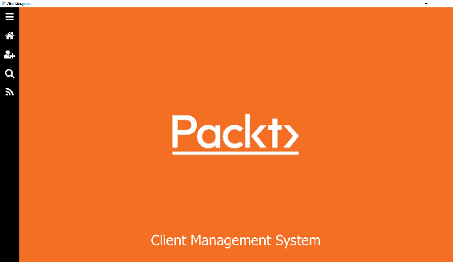

# 枚举选择器

回到第五章，*数据*，我们创建了一个联系人模型，其中实现了一个带有`EnumeratorDecorator`的`ContactType`属性。对于本书中使用的其他基于字符串的属性，简单的文本框是捕获数据的良好解决方案，但是如何捕获枚举值呢？用户不应该知道枚举器的基础整数值，并要求他们输入所需选项的字符串表示形式是在寻找麻烦。我们真正想要的是一个下拉列表，以某种方式利用我们添加到类中的`contactTypeMapper`容器。我们希望向用户呈现字符串描述供其选择，然后将整数值存储在`EnumeratorDecorator`对象中。

桌面应用程序通常以特定方式呈现下拉列表，其中有一种选择器，您按下它然后弹出（或更准确地说，下拉！）一个可滚动的选项列表供选择。然而，QML 不仅面向跨平台，而且面向跨设备应用程序。许多笔记本电脑具有触摸屏功能，而且市场上出现了越来越多的混合设备，它们既可以作为笔记本电脑，也可以作为平板电脑。因此，即使我们不打算为移动商店构建下一个大型应用程序，考虑我们的应用程序在“手指友好”方面是很重要的，经典的下拉列表在触摸屏上可能很难使用。让我们改用移动设备上使用的基于按钮的方法。

不幸的是，我们无法直接在 QML 中使用现有的`std::map`，因此我们需要添加一些新的类来为我们构建桥梁。我们将把每个键/值对表示为`DropDownValue`，并在`DropDown`对象中保存这些对象的集合。`DropDown`对象应该在其构造函数中接受一个`std::map<int, QString>`，并为我们创建`DropDownValue`集合。

首先在`cm-lib/source/data`中创建`DropDownValue`类。

`dropdown-value.h`：

```cpp
#ifndef DROPDOWNVALUE_H
#define DROPDOWNVALUE_H
#include <QObject>
#include <cm-lib_global.h>
namespace cm {
namespace data {
class CMLIBSHARED_EXPORT DropDownValue : public QObject
{
    Q_OBJECT
    Q_PROPERTY(int ui_key MEMBER key CONSTANT )
    Q_PROPERTY(QString ui_description MEMBER description CONSTANT)
public:
    DropDownValue(QObject* parent = nullptr, int key = 0, const QString& description = "");
    ~DropDownValue();
public:
    int key{0};
    QString description{""};
};
}}
#endif
```

`dropdown-value.cpp`：

```cpp
#include "dropdown-value.h"
namespace cm {
namespace data {
DropDownValue::DropDownValue(QObject* parent, int _key, const QString& _description)
        : QObject(parent)
{
    key = _key;
    description = _description;
}
DropDownValue::~DropDownValue()
{
}
}}
```

这里没有什么复杂的东西，只是一个整数值和相关字符串描述的 QML 友好封装。

接下来，在`cm-lib/source/data`中再次创建`DropDown`类。

`dropdown.h`：

```cpp
#ifndef DROPDOWN_H
#define DROPDOWN_H
#include <QObject>
#include <QtQml/QQmlListProperty>
#include <cm-lib_global.h>
#include <data/dropdown-value.h>
namespace cm {
namespace data {
class CMLIBSHARED_EXPORT DropDown : public QObject
{
    Q_OBJECT
    Q_PROPERTY(QQmlListProperty<cm::data::DropDownValue> ui_values READ ui_values CONSTANT)
public:
    explicit DropDown(QObject* _parent = nullptr, const std::map<int, QString>& values = std::map<int, QString>());
    ~DropDown();
public:
    QQmlListProperty<DropDownValue> ui_values();
public slots:
    QString findDescriptionForDropdownValue(int valueKey) const;
private:
    class Implementation;
    QScopedPointer<Implementation> implementation;
};
}}
#endif
```

`dropdown.cpp`：

```cpp
#include "dropdown.h"

namespace cm {
namespace data {
class DropDown::Implementation
{
public:
    Implementation(DropDown* _dropdown, const std::map<int, QString>& _values)
        : dropdown(_dropdown)
    {
        for(auto pair : _values) {
             values.append(new DropDownValue(_dropdown, pair.first, pair.second));
        }
    }
    DropDown* dropdown{nullptr};
    QList<DropDownValue*> values;
};
DropDown::DropDown(QObject* parent, const std::map<int, QString>& values)
   : QObject(parent)
{
    implementation.reset(new DropDown::Implementation(this, values));
}
DropDown::~DropDown()
{
}
QString DropDown::findDescriptionForDropdownValue(int valueKey) const
{
    for (auto value : implementation->values) {
        if (value->key == valueKey) {
            if(!value->description.isEmpty()) {
                return value->description;
            }
            break;
        }
    }
    return "Select >";
}
QQmlListProperty<DropDownValue> DropDown::ui_values()
{
    return QQmlListProperty<DropDownValue>(this, implementation->values);
}
}}
```

如讨论的，我们实现一个构造函数，它接受我们在`EnumeratorDecorator`类中使用的相同类型的`std::map`，并基于它创建一个`DropDownValue`对象集合。然后 UI 可以通过`ui_values`属性访问该集合。我们为 UI 提供的另一个功能是通过`findDescriptionForDropdownValue`公共槽，这允许 UI 从`EnumeratorDecorator`中获取所选整数值并获取相应的文本描述。如果没有当前选择（即，描述是空字符串），那么我们将返回`Select >`，以提示用户他们需要进行选择。

由于我们将在 QML 中使用这些新类型，因此需要在`main.cpp`中注册它们：

```cpp
qmlRegisterType<cm::data::DropDown>("CM", 1, 0, "DropDown");
qmlRegisterType<cm::data::DropDownValue>("CM", 1, 0, "DropDownValue");
```

在 Contact 中添加一个新的`DropDown`属性，名为`ui_contactTypeDropDown`，并在构造函数中使用`contactTypeMapper`实例化成员变量。现在，每当在 UI 中呈现联系人时，相关的`DropDown`将可用。如果您想要在整个应用程序中重用下拉列表，这可以很容易地放入一个专用组件，比如下拉管理器，但是对于这个例子，让我们避免额外的复杂性。

我们还需要能够从 UI 中添加一个新的联系人对象，因此在`Client`中添加一个新的公共槽：

```cpp
void Client::addContact()
{
    contacts->addEntity(new Contact(this));
    emit contactsChanged();
}
```

完成 C++后，我们可以继续进行 UI 实现。

我们需要一些组件来进行下拉选择。当呈现`EnumeratorDecorator`属性时，我们希望显示当前选定的值，就像我们在字符串编辑器中所做的那样。在视觉上，它将类似于一个按钮，其关联的字符串描述作为其标签，当按下时，用户将转换到第二个组件，这实质上是一个视图。这个子视图将占据整个内容框架，并呈现所有可用的枚举选项的列表，再次表示为按钮。当用户通过按下其中一个按钮进行选择时，他们将转换回原始视图，并且他们的选择将在原始组件中更新。

首先，我们将创建用户将要转换到的视图，其中将列出所有可用选项。为了支持这一点，我们需要在 Style 中添加一些额外的属性：

```cpp
readonly property color colourDataSelectorBackground: "#131313"
readonly property color colourDataControlsBackgroundSelected: "#f36f24"
readonly property color colourDataSelectorFont: "#ffffff"
readonly property int sizeDataControlsRadius: tscale(5)
```

在`cm-ui/components`中创建`EnumeratorSelectorView.qml`：

```cpp
import QtQuick 2.9
import QtQuick.Controls 2.2
import CM 1.0
import assets 1.0
Item {
    id: stringSelectorView
    property DropDown dropDown
    property EnumeratorDecorator enumeratorDecorator
    property int selectedValue
    ScrollView {
        id: scrollView
        visible: true
        anchors.fill: parent
        anchors {
            top: parent.bottom
             left: parent.left
             right: parent.right
             bottom: parent.top
             margins: Style.sizeScreenMargin
        }
        Flow {
            flow: Grid.TopToBottom
            spacing: Style.sizeControlSpacing
            height: scrollView.height
            Repeater {
                id: repeaterAnswers
                model: dropDown.ui_values
                delegate:
                    Rectangle {
                        property bool isSelected: modelData.ui_key.ui_value === enumeratorDecorator.ui_value
                        width: Style.widthDataControls
                        height: Style.heightDataControls
                        radius: Style.sizeDataControlsRadius
                        color: isSelected ? Style.colourDataControlsBackgroundSelected : Style.colourDataSelectorBackground
                        Text {
                            anchors {
                                fill: parent
                                margins: Style.heightDataControls / 4
                            }
                            text: modelData.ui_description
                            color: Style.colourDataSelectorFont
                            font.pixelSize: Style.pixelSizeDataControls
                            verticalAlignment: Qt.AlignVCenter
                        }
                        MouseArea {
                            anchors.fill: parent
                            onClicked: {
                                selectedValue = modelData.ui_key;
                                contentFrame.pop();
                            }
                        }
                    }
            }
        }
    }
    Binding {
        target: enumeratorDecorator
        property: "ui_value"
        value: selectedValue
    }
}
```

在这里，我们第一次使用**Repeater**元素。Repeater 为其模型属性中找到的每个项目实例化其代理属性中定义的 QML 元素。我们将其模型设置为`DropDownValue`对象的集合，并创建内联代理。代理本质上是另一个带有一些选择代码的按钮。我们可以创建一个新的自定义组件，并将其用于代理，以保持代码更清晰，但出于简洁起见，我们将在这里跳过。此组件的关键部分是`Binding`元素，它为我们提供了与提供的`EnumeratorDecorator`的双向绑定，以及`MouseArea`中的`onClicked`事件代理，它执行更新并将此组件弹出堆栈，将我们返回到我们来自的任何视图。

在`cm-ui/components`中创建一个新的`EnumeratorSelector.qml`：

```cpp
import QtQuick 2.9
import QtQuick.Controls 2.2
import CM 1.0
import assets 1.0
Item {
    property DropDown dropDown
    property EnumeratorDecorator enumeratorDecorator
    id: enumeratorSelectorRoot
    height: width > textLabel.width + textAnswer.width ? 
    Style.heightDataControls : Style.heightDataControls * 2
    Flow {
        anchors.fill: parent
        Rectangle {
            width: Style.widthDataControls
            height: Style.heightDataControls
            Text {
                id: textLabel
                anchors {
                    fill: parent
                    margins: Style.heightDataControls / 4
                }
                text: enumeratorDecorator.ui_label
                color: Style.colourDataControlsFont
                font.pixelSize: Style.pixelSizeDataControls
                verticalAlignment: Qt.AlignVCenter
            }
        }
        Rectangle {
            id: buttonAnswer
            width: Style.widthDataControls
            height: Style.heightDataControls
            radius: Style.sizeDataControlsRadius
            enabled: dropDown ? dropDown.ui_values.length > 0 : false
            color: Style.colourDataSelectorBackground
            Text {
                id: textAnswer
                anchors {
                    fill: parent
                    margins: Style.heightDataControls / 4
                }
                text: dropDown.findDescriptionForDropdownValue(enumeratorDecorator.ui_value)
                color: Style.colourDataSelectorFont
                font.pixelSize: Style.pixelSizeDataControls
                verticalAlignment: Qt.AlignVCenter
            }
            MouseArea {
                anchors.fill: parent
                onClicked: contentFrame.push("qrc:/components/EnumeratorSelectorView.qml",
 {dropDown: enumeratorSelectorRoot.dropDown,
 enumeratorDecorator: enumeratorSelectorRoot.enumeratorDecorator})
            }
        }
    }
}
```

这个组件在布局上与`StringEditorSingleLine`有很多相似之处，但它用按钮表示替换了文本元素。我们从绑定的`EnumeratorDecorator`中获取值，并将其传递给我们在`DropDown`类上创建的插槽，以获取当前选定值的字符串描述。当用户按下按钮时，`MouseArea`的`onClicked`事件执行与我们在`MasterView`中看到的相同类型的视图转换，将用户带到新的`EnumeratorSelectorView`。

我们在这里有点作弊，因为我们直接通过其`contentFrame` ID 在`MasterView`中引用`StackView`。在设计时，Qt Creator 无法知道`contentFrame`是什么，因为它在一个完全不同的文件中，所以它可能会标记为错误，而且您肯定不会得到自动完成。然而，在运行时，这个组件将成为与`MasterView`相同的 QML 层次结构的一部分，因此它将能够找到它。这是一种风险的方法，因为如果层次结构中的另一个元素也被称为`contentFrame`，那么可能会发生糟糕的事情。更安全的方法是通过`MasterView`从`QtObject`属性作为`contentFrame`将`contentFrame`一直传递到 QML 层次结构的底部。

当我们添加或编辑客户时，我们目前忽略联系人，并始终有一个空集合。让我们看看如何向集合添加对象，并在此过程中使用我们闪亮的新`EnumeratorSelector`。

# 联系人

我们将需要一些新的 UI 组件来管理我们的联系人。我们之前使用过`AddressEditor`来管理我们的地址详细信息，所以我们将继续在那个模式下创建一个`ContactEditor`组件。该组件将显示我们的联系人集合，每个联系人都将由`ContactDelegate`表示。在最初创建新的客户对象时，不会有任何联系人，因此我们还需要一种让用户添加新联系人的方式。我们将通过按钮按下来实现这一点，并创建一个可以添加到内容视图的新组件。让我们先做这个。

为了支持这个新组件，像往常一样，我们将在 Style 中添加一些属性：

```cpp
readonly property real widthFormButton: 240
readonly property real heightFormButton: 60
readonly property color colourFormButtonBackground: "#f36f24"
readonly property color colourFormButtonFont: "#ffffff"
readonly property int pixelSizeFormButtonIcon: 32
readonly property int pixelSizeFormButtonText: 22
readonly property int sizeFormButtonRadius: 5
```

在`cm-ui/components`中创建`FormButton.qml`：

```cpp
import QtQuick 2.9
import CM 1.0
import assets 1.0
Item {
    property alias iconCharacter: textIcon.text
    property alias description: textDescription.text
    signal formButtonClicked()
    width: Style.widthFormButton
    height: Style.heightFormButton
    Rectangle {
        id: background
        anchors.fill: parent
        color: Style.colourFormButtonBackground
        radius: Style.sizeFormButtonRadius
        Text {
            id: textIcon
            anchors {
                verticalCenter: parent.verticalCenter
                left: parent.left
                margins: Style.heightFormButton / 4
            }
            font {
                family: Style.fontAwesome
                pixelSize: Style.pixelSizeFormButtonIcon
            }
            color: Style.colourFormButtonFont
            text: "\uf11a"
            horizontalAlignment: Text.AlignHCenter
            verticalAlignment: Text.AlignVCenter
        }
        Text {
            id: textDescription
            anchors {
                left: textIcon.left
                bottom: parent.bottom
                top: parent.top
                right: parent.right
            }
            font.pixelSize: Style.pixelSizeFormButtonText
            color: Style.colourFormButtonFont
            text: "SET ME!!"
            horizontalAlignment: Text.AlignHCenter
            verticalAlignment: Text.AlignVCenter
        }
        MouseArea {
            anchors.fill: parent
            cursorShape: Qt.PointingHandCursor
            hoverEnabled: true
            onEntered: background.state = "hover"
            onExited: background.state = ""
            onClicked: formButtonClicked()
        }
        states: [
            State {
                name: "hover"
                PropertyChanges {
                    target: background
                    color: Qt.darker(Style.colourFormButtonBackground)
                }
            }
        ]
    }
}
```

在这里，我们结合了我们在本书中早期编写的`NavigationButton`和`CommandButton`控件的方面。唯一的真正区别是它旨在更自由地在主内容框架中使用，而不是被限制在其中一个工具栏中。

接下来，让我们添加我们将用于显示/编辑单个联系人对象的组件。在`cm-ui/components`中创建`ContactDelegate.qml`：

```cpp
import QtQuick 2.9
import CM 1.0
import assets 1.0
Item {
    property Contact contact
    implicitWidth: flow.implicitWidth
    implicitHeight: flow.implicitHeight + borderBottom.implicitHeight + Style.sizeItemMargin
    height: width > selectorType.width + textAddress.width + Style.sizeScreenMargin
            ? selectorType.height + borderBottom.height + Style.sizeItemMargin
            : selectorType.height + textAddress.height + Style.sizeScreenMargin + borderBottom.height + Style.sizeItemMargin
    Flow {
        id: flow
        width: parent.width
        spacing: Style.sizeScreenMargin
        EnumeratorSelector {
            id: selectorType
            width: Style.widthDataControls
            dropDown: contact.ui_contactTypeDropDown
            enumeratorDecorator: contact.ui_contactType
        }
        StringEditorSingleLine {
            id: textAddress
            width: Style.widthDataControls
            stringDecorator: contact.ui_address
        }
    }
    Rectangle {
        id: borderBottom
        anchors {
            top: flow.bottom
            left: parent.left
            right: parent.right
            topMargin: Style.sizeItemMargin
        }
        height: 1
        color: Style.colorItemBorder
    }
}
```

这与我们在第八章中添加的`RssItemDelegate`几乎相同，*Web 请求*。我们添加了新的`EnumeratorSelector`并将其绑定到`ui_contactType`属性，使用`ui_contactTypeDropDown`为控件提供下拉信息。

在`cm-ui/components`中创建`ContactsEditor.qml`：

```cpp
import QtQuick 2.9
import CM 1.0
import assets 1.0
Panel {
    property Client client
    id: contactsEditorRoot
    contentComponent:
        Column {
            id: column
            spacing: Style.sizeControlSpacing
            Repeater {
                id: contactsView
                model: client.ui_contacts
                delegate:
                    ContactDelegate {
                        width: contactsEditorRoot.width
                        contact: modelData
                    }
            }
            FormButton {
                iconCharacter: "\uf067"
                description: "Add Contact"
                onFormButtonClicked: {
                    client.addContact();
                }
            }
        }
}
```

我们已经在`ContactDelegate`和`FormButton`控件中完成了所有的艰苦工作，所以这部分非常简短。我们将所有内容添加到`Panel`中，以便外观和感觉与其他视图保持一致。我们使用另一个`Repeater`，以便为集合中的每个联系人启动一个`ContactDelegate`，并在联系人之后立即显示一个按钮，以将新联系人添加到列表中。为了做到这一点，我们调用了本章前面添加的`addContact()`方法。

现在，我们只需要将我们的`ContactsEditor`实例添加到`CreateClientView`中：

```cpp
ContactsEditor {
    width: scrollView.width
    client: newClient
    headerText: "Contact Details"
}
```

我们还可以在`EditClientView`中使用相同的组件：

```cpp
ContactsEditor {
    width: scrollView.width
    client: selectedClient
    headerText: "Contact Details"
}
```

就是这样。构建和运行，您可以尽情添加和编辑联系人：

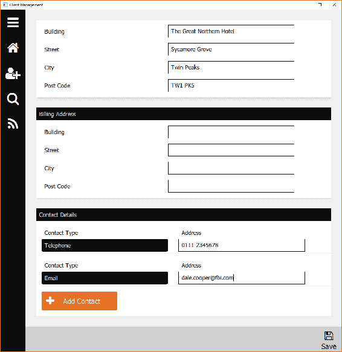

一旦保存了新的客户端，如果查看数据库，您会看到联系人数组已经相应地更新，如下面的屏幕截图所示：

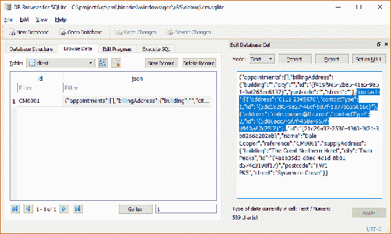

现在剩下的就是约会集合，我们已经涵盖了您需要处理的所有技能，所以我们将把它作为读者的练习，并继续进行最后一个话题 - 将我们的应用部署到最终用户。

# 部署准备

我们应用程序的核心是`cm-ui`可执行文件。这是最终用户启动并打开图形窗口并编排我们编写的所有花哨东西的文件。当我们在 Qt Creator 中运行`cm-ui`项目时，它会为我们打开可执行文件，一切都能正常工作。然而，将我们的应用程序分发给其他用户比简单地在他们的机器上放置可执行文件的副本并启动它要复杂得多。

我们的可执行文件有各种依赖关系，需要放置在适当位置才能运行。一个依赖关系的典型例子是我们自己的`cm-lib`库。几乎所有的业务逻辑都隐藏在那里，没有这个功能，我们的 UI 就无法做太多事情。跨各种操作系统的依赖关系解析的实现细节非常复杂，远远超出了本书的范围。然而，我们的应用程序的基本要求是相同的，无论平台如何。

有四类依赖关系需要考虑，并确保它们在我们目标用户的机器上，以便我们的应用程序能够正常运行：

+   第 1 项：我们编写或手动添加到解决方案中的自定义库。在这种情况下，我们只需要担心`cm-lib`库。

+   第 2 项：我们的应用程序直接或间接链接到的 Qt 框架的部分。通过我们在`.pro`文件中添加的模块，我们已经了解了其中一些，例如，`qml`和`quick`模块需要`QtQml`和`QtQuick`组件。

+   第 3 项：Qt 框架本身的任何内部依赖关系。这包括特定于平台的文件，QML 子系统的资源以及诸如`sqlite`或`openssl`之类的第三方库。

+   第 4 项：我们用 C++编译器构建应用程序所需的任何库。

我们已经在第二章中广泛使用了第 1 项，*项目结构*，我们在控制输出的确切位置方面付出了很多工作。我们并不需要担心第 2 和第 3 项，因为我们在开发机器上有完整的 Qt 框架安装，它为我们处理了一切。同样，第 4 项由我们使用的工具包决定，如果我们的机器上有编译器可用，那么它需要的库也是有的。 

确定我们需要为最终用户复制的内容（很可能他们没有安装 Qt 或其他开发工具）可能是一项痛苦的工作。即使我们做到了这一点，将所有东西打包成一个整洁的包或安装程序，让用户轻松运行，也可能是一个项目。幸运的是，Qt 以捆绑工具的形式为我们提供了一些帮助。

Linux 和 macOS X 有应用程序包的概念，应用程序可执行文件和所有依赖项可以一起打包成一个单个文件，然后可以轻松分发和点击按钮启动。Windows 则更加自由，如果我们想将所有文件捆绑到一个可安装文件中，我们需要做更多的工作，但是 Qt 再次拯救了我们，并提供了出色的 Qt 安装程序框架，为我们简化了这个过程。

让我们依次查看每个操作系统，并为每个操作系统生成一个应用程序包或安装程序。

# OS X

首先，使用您选择的套件在发布模式下构建解决方案。您已经知道，如果我们在 Qt Creator 中按下运行按钮，我们的应用程序会启动，一切都很顺利。但是，导航到 Finder 中的`cm-ui.app`文件，尝试直接启动它；在这方面，情况就不那么美好了：

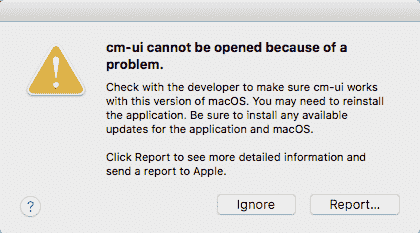

问题在于缺少依赖项。我们可以使用**otool**来查看这些依赖项是什么。首先，将`cm-ui.app`包复制到一个新目录——`cm/installer/osx`。

这并不是绝对必要的，但我喜欢将构建和部署文件分开。这样，如果我们进行代码更改并重新构建解决方案，我们只会更新二进制文件夹中的应用程序，而我们的部署文件则保持不变。

接下来，查看应用程序包内部，看看我们正在处理什么。在 Finder 中，*Ctrl*点击我们刚刚复制到安装程序文件夹的`cm-ui.app`，然后选择显示包内容。我们感兴趣的部分是`Contents/MacOS`文件夹。在那里，你会找到我们的`cm-ui`应用程序可执行文件。

有了这个识别，打开一个命令终端，导航到`cm/installer/osx`，并在可执行文件上运行`otool`：

```cpp
$ otool -L cm-ui.app/Contents/MacOS/cm-ui
```

你会看到一个与以下内容相同或类似的输出：

```cpp
cm-ui:
libcm-lib.1.dylib (compatibility version 1.0.0, current version 1.0.0)
@rpath/QtQuick.framework/Versions/5/QtQuick (compatibility version 5.9.0, current version 5.9.1)
@rpath/QtQml.framework/Versions/5/QtQml (compatibility version 5.9.0, current version 5.9.1)
@rpath/QtNetwork.framework/Versions/5/QtNetwork (compatibility version 5.9.0, current version 5.9.1)
@rpath/QtCore.framework/Versions/5/QtCore (compatibility version 5.9.0, current version 5.9.1)
/System/Library/Frameworks/DiskArbitration.framework/Versions/A/DiskArbitration (compatibility version 1.0.0, current version 1.0.0)
/System/Library/Frameworks/IOKit.framework/Versions/A/IOKit (compatibility version 1.0.0, current version 275.0.0)
@rpath/QtGui.framework/Versions/5/QtGui (compatibility version 5.9.0, current version 5.9.1)
@rpath/QtXml.framework/Versions/5/QtXml (compatibility version 5.9.0, current version 5.9.1)
/System/Library/Frameworks/OpenGL.framework/Versions/A/OpenGL (compatibility version 1.0.0, current version 1.0.0)
/System/Library/Frameworks/AGL.framework/Versions/A/AGL (compatibility version 1.0.0, current version 1.0.0)
/usr/lib/libc++.1.dylib (compatibility version 1.0.0, current version 307.5.0)
/usr/lib/libSystem.B.dylib (compatibility version 1.0.0, current version 1238.50.2)
```

让我们提醒自己需要考虑的依赖关系，并看看它们与我们刚刚看到的输出有什么关系：

+   我们手动编写或添加到解决方案中的自定义库（`cm-lib`）。这是`libcm-lib.1.dylib`的引用。没有路径组件的事实表明工具不太确定这个文件的位置。它应该在可执行文件本身的相同文件夹中吗？它应该在标准的`/usr/lib/`文件夹中吗？幸运的是，我们可以在打包应用程序时指定这个文件的位置。

+   我们的应用程序链接到的 Qt 框架的部分。`QtQuick`、`QtQml`等都是我们在`cm-ui`代码中直接引用的框架模块。其中一些是通过我们的`cm-ui.pro`文件中的 QT 变量明确引入的，而其他一些则是使用 QML 等隐式包含的。

+   Qt 框架本身的任何内部依赖项。我们之前没有看到这些列出来，但如果我们对`QtQuick`模块运行 otool，你会看到它依赖于`QtQml`、`QtNetwork`、`QtGui`和`QtCore`。还有一些系统级别的库是必需的，比如 OpenGL，虽然我们没有明确针对它们编码，但 Qt 使用了它们。

+   由我们构建应用程序的 C++编译器所需的任何库；这里特别突出的是`libc++.1.dylib`。

为了手动捆绑所有的依赖项，我们可以将它们全部复制到应用程序包中，然后执行一些重新配置步骤，以更新我们从 otool 中看到的位置元数据。

让我们选择一个框架依赖项——`QtQuick`——并快速浏览一下我们需要做什么才能实现这一点，然后我们将转向真正方便的工具，它可以为我们完成所有这些非常不愉快的繁重工作。

首先，我们将创建一个`Frameworks`目录，系统将在其中搜索捆绑的依赖项：

```cpp
$ mkdir cm-ui.app/Contents/Frameworks
```

接下来，我们将物理地将引用的文件复制到新目录。由于前面的`LC_RPATH`条目，我们知道在我们的开发机器上查找现有文件的位置，即`/Users/<Your Username>/Qt5.9.1/5.9.1/clang_64/lib`：

```cpp
$ cp -R /Users/<Your Username>  /Qt5.9.1 /5.9.1/clang_64 /lib/ QtQuick.framework cm-ui.app/Contents/Frameworks
```

然后，我们需要使用`install_name_tool`更改复制的库文件的共享库标识名称：

```cpp
$ install_name_tool -id @executable_path /../Frameworks / QtQuick.framework/Versions/5/QtQuick cm-ui.app /Contents /Frameworks / QtQuick.framework/Versions/5/QtQuick
```

这里的语法是`install_name_tool -id [新名称] [共享库文件]`。要到达库文件（而不是我们复制的框架包），我们要深入到`Versions/5/QtQuick`。我们将该二进制文件的 ID 设置为可执行文件将查找到的位置，即在这种情况下，是在与可执行文件本身相同级别的`Frameworks`文件夹中（`../`）。

接下来，我们还需要更新可执行文件的依赖项列表，以便在正确的位置查找这个新文件：

```cpp
$ install_name_tool -change @rpath/QtQuick.framework/Versions/5/QtQuick @executable_path/../Frameworks/QtQuick.framework/Versions/5/QtQuick cm-ui.app/Contents/MacOs/cm-ui
```

这里的语法是`install_name_tool -change [旧值] [新值] [可执行文件]`。我们要将旧的`@rpath`条目更改为我们刚刚添加的新 Frameworks 路径。同样，我们使用`@executable_path`变量，以便依赖项始终位于相对于可执行文件的相同位置。现在，可执行文件和共享库中的元数据都相互匹配，并与我们现在添加到应用程序包中的`Frameworks`文件夹相关联。

请记住，这还不是全部，因为`QtQuick`本身也有依赖项，所以我们需要复制和重新配置所有这些文件，然后检查它们的依赖项。一旦我们耗尽了`cm-ui`可执行文件的整个依赖树，我们还需要为`cm-lib`库重复这个过程。正如你所想象的那样，这很快就会变得乏味。

幸运的是，`macdeployqt` Qt Mac 部署工具正是我们需要的。它会扫描可执行文件的 Qt 依赖项，并将它们复制到我们的应用程序包中，同时处理重新配置工作。该工具位于您构建应用程序的已安装工具包的`bin`文件夹中，例如`/Qt/5.9.1/5.9.1/clang_64/bin`。

在命令终端中，执行`macdeployqt`如下（假设你在`cm/installer/osx`目录中）：

```cpp
$ <Path to bin>/macdeployqt cm-ui.app -qmldir=<Qt Projects>/cm/cm-ui -libpath=<Qt Projects>/cm/binaries/osx/clang/x64/release
```

记得用尖括号中的参数替换你系统上的完整路径（或将可执行文件路径添加到系统的 PATH 变量中）。

`qmldir`标志告诉工具在哪里扫描 QML 导入，并设置为我们的 UI 项目文件夹。`libpath`标志用于指定我们编译的`cm-lib`文件所在的位置。

此操作的输出将如下所示：

```cpp
File exists, skip copy: "cm-ui.app/Contents/PlugIns/quick/libqtquick2plugin.dylib"
File exists, skip copy: "cm-ui.app/Contents/PlugIns/quick/libqtquickcontrols2plugin.dylib"
File exists, skip copy: "cm-ui.app/Contents/PlugIns/quick/libqtquickcontrols2materialstyleplugin.dylib"
File exists, skip copy: "cm-ui.app/Contents/PlugIns/quick/libqtquickcontrols2universalstyleplugin.dylib"
File exists, skip copy: "cm-ui.app/Contents/PlugIns/quick/libwindowplugin.dylib"
File exists, skip copy: "cm-ui.app/Contents/PlugIns/quick/libqtquicktemplates2plugin.dylib"
File exists, skip copy: "cm-ui.app/Contents/PlugIns/quick/libqtquickcontrols2materialstyleplugin.dylib"
File exists, skip copy: "cm-ui.app/Contents/PlugIns/quick/libqtquickcontrols2materialstyleplugin.dylib"
File exists, skip copy: "cm-ui.app/Contents/PlugIns/quick/libqtquickcontrols2universalstyleplugin.dylib"
File exists, skip copy: "cm-ui.app/Contents/PlugIns/quick/libqtquickcontrols2universalstyleplugin.dylib"
WARNING: Plugin "libqsqlodbc.dylib" uses private API and is not Mac App store compliant.
WARNING: Plugin "libqsqlpsql.dylib" uses private API and is not Mac App store compliant.
ERROR: no file at "/opt/local/lib/mysql55/mysql/libmysqlclient.18.dylib"
ERROR: no file at "/usr/local/lib/libpq.5.dylib"
```

Qt 在 SQL 模块上有点古怪，如果你使用一个 SQL 驱动程序，它会尝试打包所有的驱动程序；然而，我们知道我们只使用 SQLite，不需要 MySQL 或 PostgreSQL，所以我们可以安全地忽略这些错误。

执行完毕后，你应该能够在 Finder 中再次查看包内容，并看到所有准备好等待部署的依赖项，如下所示：

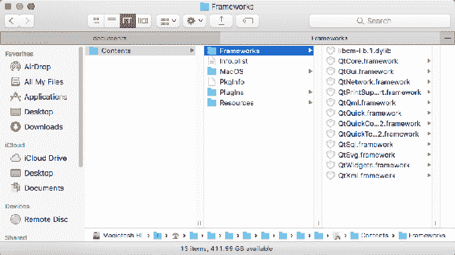

多么巨大的时间节省者！它已经为我们创建了适当的文件结构，并复制了所有的 Qt 模块和插件，以及我们的`cm-lib`共享库。现在尝试执行`cm-ui.app`文件，它应该成功启动应用程序。

# Linux

Linux 的打包和部署与 OS X 大致相似，我们不会以相同的细节水平进行覆盖，所以如果你还没有这样做，至少先略读一下 OS X 部分。与所有平台一样，首先要做的是使用你选择的工具包在**Release**模式下构建解决方案，以生成二进制文件。

第一次以 Release 模式构建时，我收到了“无法找到-lGL”错误。这是因为 OpenGL 的`dev`库没有安装在我的系统上。获取这些库的一种方法是安装 FreeGlut：

`$ sudo apt-get update`

`$ sudo apt-get install build-essential`

`$ sudo apt-get install freeglut3-dev`

编译完成后，将`cm-ui`二进制文件复制到新的`cm/installer/linux`目录中。

接下来，我们可以查看我们的应用程序有哪些依赖项。在命令终端中，切换到`cm/installer/linux`文件夹并运行`ldd`：

```cpp
$ ldd <Qt Projects>/cm/binaries/linux/gcc/x64/release/cm-ui
```

您将看到类似以下的输出：

```cpp
linux-vdso.so.1 => (0x00007ffdeb1c2000)
libcm-lib.so.1 => /usr/lib/libcm-lib.so.1 (0x00007f624243d000)
libQt5Gui.so.5 => /home/nick/Qt/5.9.1/gcc_64/lib/libQt5Gui.so.5 (0x00007f6241c8f000)
libQt5Qml.so.5 => /home/nick/Qt/5.9.1/gcc_64/lib/libQt5Qml.so.5 (0x00007f6241698000)
libQt5Xml.so.5 => /home/nick/Qt/5.9.1/gcc_64/lib/libQt5Xml.so.5 (0x00007f624145e000)
libQt5Core.so.5 => /home/nick/Qt/5.9.1/gcc_64/lib/libQt5Core.so.5 (0x00007f6240d24000)
libstdc++.so.6 => /usr/lib/x86_64-linux-gnu/libstdc++.so.6 (0x00007f62409a1000)
libgcc_s.so.1 => /lib/x86_64-linux-gnu/libgcc_s.so.1 (0x00007f624078b000)
libc.so.6 => /lib/x86_64-linux-gnu/libc.so.6 (0x00007f62403c1000)
libQt5Sql.so.5 => /home/nick/Qt/5.9.1/gcc_64/lib/libQt5Sql.so.5 (0x00007f6240179000)
libQt5Network.so.5 => /home/nick/Qt/5.9.1/gcc_64/lib/libQt5Network.so.5 (0x00007f623fde8000)
libpthread.so.0 => /lib/x86_64-linux-gnu/libpthread.so.0 (0x00007f623fbcb000)
libGL.so.1 => /usr/lib/x86_64-linux-gnu/mesa/libGL.so.1 (0x00007f623f958000)
libz.so.1 => /lib/x86_64-linux-gnu/libz.so.1 (0x00007f623f73e000)
libm.so.6 => /lib/x86_64-linux-gnu/libm.so.6 (0x00007f623f435000)
librt.so.1 => /lib/x86_64-linux-gnu/librt.so.1 (0x00007f623f22c000)
libicui18n.so.56 => /home/nick/Qt/5.9.1/gcc_64/lib/libicui18n.so.56 (0x00007f623ed93000)
libicuuc.so.56 => /home/nick/Qt/5.9.1/gcc_64/lib/libicuuc.so.56 (0x00007f623e9db000)
libicudata.so.56 => /home/nick/Qt/5.9.1/gcc_64/lib/libicudata.so.56 (0x00007f623cff7000)
libdl.so.2 => /lib/x86_64-linux-gnu/libdl.so.2 (0x00007f623cdf3000)
libgthread-2.0.so.0 => /usr/lib/x86_64-linux-gnu/libgthread-2.0.so.0 (0x00007f623cbf1000)
libglib-2.0.so.0 => /lib/x86_64-linux-gnu/libglib-2.0.so.0 (0x00007f623c8df000)
/lib64/ld-linux-x86-64.so.2 (0x0000562f21a5c000)
libexpat.so.1 => /lib/x86_64-linux-gnu/libexpat.so.1 (0x00007f623c6b6000)
libxcb-dri3.so.0 => /usr/lib/x86_64-linux-gnu/libxcb-dri3.so.0 (0x00007f623c4b2000)
libxcb-present.so.0 => /usr/lib/x86_64-linux-gnu/libxcb-present.so.0 (0x00007f623c2af000)
libxcb-sync.so.1 => /usr/lib/x86_64-linux-gnu/libxcb-sync.so.1 (0x00007f623c0a8000)
libxshmfence.so.1 => /usr/lib/x86_64-linux-gnu/libxshmfence.so.1 (0x00007f623bea4000)
libglapi.so.0 => /usr/lib/x86_64-linux-gnu/libglapi.so.0 (0x00007f623bc75000)
libXext.so.6 => /usr/lib/x86_64-linux-gnu/libXext.so.6 (0x00007f623ba63000)
libXdamage.so.1 => /usr/lib/x86_64-linux-gnu/libXdamage.so.1 (0x00007f623b85f000)
libXfixes.so.3 => /usr/lib/x86_64-linux-gnu/libXfixes.so.3 (0x00007f623b659000)
libX11-xcb.so.1 => /usr/lib/x86_64-linux-gnu/libX11-xcb.so.1 (0x00007f623b457000)
libX11.so.6 => /usr/lib/x86_64-linux-gnu/libX11.so.6 (0x00007f623b11c000)
libxcb-glx.so.0 => /usr/lib/x86_64-linux-gnu/libxcb-glx.so.0 (0x00007f623af03000)
libxcb-dri2.so.0 => /usr/lib/x86_64-linux-gnu/libxcb-dri2.so.0 (0x00007f623acfe000)
libxcb.so.1 => /usr/lib/x86_64-linux-gnu/libxcb.so.1 (0x00007f623aadb000)
libXxf86vm.so.1 => /usr/lib/x86_64-linux-gnu/libXxf86vm.so.1 (0x00007f623a8d5000)
libdrm.so.2 => /usr/lib/x86_64-linux-gnu/libdrm.so.2 (0x00007f623a6c4000)
libpcre.so.3 => /lib/x86_64-linux-gnu/libpcre.so.3 (0x00007f623a453000)
libXau.so.6 => /usr/lib/x86_64-linux-gnu/libXau.so.6 (0x00007f623a24e000)
libXdmcp.so.6 => /usr/lib/x86_64-linux-gnu/libXdmcp.so.6 (0x00007f623a048000)
```

这是一些依赖项的列表！关键是要注意我们的`cm-lib`库的依赖关系：

```cpp
libcm-lib.so.1 => /usr/lib/libcm-lib.so.1
```

这表明可执行文件将在`/usr/lib`文件夹中查找我们的库，因此在继续之前，让我们确保它在那里可用，将`libcm-lib.so.1`复制到`/usr/lib`中：

```cpp
$ sudo cp <Qt Projects>/cm/binaries/linux/gcc/x64/release/libcm-lib.so.1 /usr/lib
```

我们已经可以猜到手动管理所有这些依赖项将是一场噩梦，讨论了 OS X 的过程并看到了有多少依赖项，所以我们的 Kit 的`bin`文件夹中一定有一个工具可以为我们完成所有工作，对吗？嗯，是和不是。与 OS X 和 Windows 一样，我们没有官方的 Qt 工具可以为我们完成这项工作。幸运的是，Qt 社区的出色成员`probonopd`已经挺身而出，用`linuxdeployqt`填补了这一空白。

您可以从 GitHub 项目的发布页面[`github.com/probonopd/linuxdeployqt`](https://github.com/probonopd/linuxdeployqt)获取`linuxdeployqt`应用程序映像。下载文件（`linuxdeployqt-continuous-x86_64.AppImage`），然后将其设置为可执行文件：

```cpp
$ chmod a+x <Path to downloaded file>/linuxdeployqt-continuous-x86_64.AppImage
```

然后，我们可以执行它，并让它按照依赖关系进行操作。首先将目录更改为`cm/installer/linux`：

```cpp
$ <Path to downloaded file>/linuxdeployqt-continuous-x86_64.AppImage cm-ui -qmldir=<Qt Projects>/cm/cm-ui -appimage
```

`qmldir`标志告诉工具在哪里扫描 QML 导入，并设置为我们的 UI 项目文件夹。`appimage`标志用于让工具为我们创建一个应用程序映像文件，这是一个包含所有内容的单个文件。

第一次可能不会完全正常工作。您的输出可能如下所示：

```cpp
ERROR: Desktop file missing, creating a default one (you will probably want to edit it)
ERROR: Icon file missing, creating a default one (you will probably want to edit it)
ERROR: "/usr/bin/qmake -query" exited with 1 : "qmake: could not exec '/usr/lib/x86_64-linux-gnu/qt4/bin/qmake': No such file or directory\n"
ERROR: Qt path could not be determined from qmake on the $PATH
ERROR: Make sure you have the correct Qt on your $PATH
ERROR: You can check this with qmake -v
```

前两个错误只是因为我们没有提供桌面文件或图标，系统已经为我们生成了默认值；我们可以忽略这些。其余的是因为`linuxdeployqt`不知道`qmake`在哪里。我们可以提供路径作为额外参数（`-qmake=<PATH>`），或者为了节省我们每次都要这样做，我们可以将其添加到我们的 PATH 环境变量中：

```cpp
$ export PATH=<Qt Path>/5.9.1/gcc_64/bin/:$PATH
```

然后我们可以检查是否可以找到 qmake，尝试检索版本信息：

```cpp
$ qmake -v
```

如果它正常，您将看到版本信息：

```cpp
QMake version 3.1
Using Qt version 5.9.1 in /home/nick/Qt/5.9.1/gcc_64/lib
```

修复后，我们现在可以尝试再次运行`linuxdeployqt`命令。但是，我们解决了一个问题，现在又遇到了另一个问题：

```cpp
ERROR: Desktop file missing, creating a default one (you will probably want to edit it)
ERROR: Icon file missing, creating a default one (you will probably want to edit it)
ERROR: ldd outputLine: "libmysqlclient.so.18 => not found"
ERROR: for binary: "/home/nick/Qt/5.9.1/gcc_64/plugins/sqldrivers/libqsqlmysql.so"
ERROR: Please ensure that all libraries can be found by ldd. Aborting.
```

再次忽略前两个错误。现在它找不到 MySQL 驱动程序，这很烦人，因为我们甚至不是 MySQL，这与我们在 OS X 上看到的相同的 Qt SQL 问题。作为解决方法，让我们通过临时重命名来有效地“隐藏”我们不想要的 SQL 驱动程序：

```cpp
$ cd <Qt Path>/5.9.1/gcc_64/plugins/sqldrivers
$ mv libqsqlmysql.so libqsqlmysql.so_ignore
$ mv libqsqlpsql.so libqsqlpsql.so_ignore
```

再次运行`linuxdeployqt`命令。这次会有大量输出，最终会出现成功消息，包括以下内容：

```cpp
App name for filename: Application
dest_path: Application-x86_64.AppImage
```

这告诉我们，我们的应用程序映像已命名为`Application-x86_64.AppImage`，它保存在`Downloads`文件夹中。

在文件管理器中查看，您会看到它已经在我们的可执行文件旁边添加了各种文件和目录：

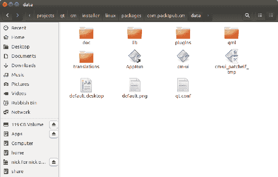

它还将`Application-x86_64.AppImage`文件放在了`Downloads`文件夹中，这是一个包含所有依赖项的单个自包含可执行文件包。但是，如果您前往`Downloads`并尝试启动`AppImage`，可能会出现错误（通过终端命令执行它以查看错误消息）：

```cpp
QXcbIntegration: Cannot create platform OpenGL context, neither GLX nor EGL are enabled
```

这似乎是`linuxdeployqt`缺少一些依赖项的问题，但由于某种原因，再次运行该工具会神奇地解决这些问题。再次执行`linuxdeployqt`命令，嘿，`AppImage`现在可以正常工作了。

# Windows

首先，使用您选择的套件在**Release**模式下构建解决方案。完成后，将`cm-ui.exe`和`cm-lib.dll`应用程序二进制文件复制到新的`cm/installer/windows/packages/com.packtpub.cm/data`目录。这种奇怪的目录结构将在下一节—Qt 安装程序框架中解释，我们只是在简化后续的额外复制。

接下来，让我们回顾一下我们需要考虑的依赖关系：

+   条款 1：我们已经编写或手动添加到解决方案中的自定义库（`cm-lib`）

+   条款 2：我们的应用程序链接到的 Qt 框架的部分

+   条款 3：Qt 框架本身的任何内部依赖项

+   条款 4：C++编译器所需的任何库

好消息是第 1 项已经完成了！Windows 将在与可执行文件相同的文件夹中查找可执行文件的依赖项。这真的很有帮助，通过简单地将 DLL 复制到与可执行文件相同的文件夹中，我们已经解决了这个依赖关系。Qt 安装程序框架会将给定文件夹中的所有文件部署到目标机器上的相同位置，因此我们知道这在部署后也会被保留。

坏消息是剩下的步骤手动管理有点噩梦。我们可以通过查看我们明确添加到`*.pro`文件的模块来初步确定我们需要 Qt 的哪些部分。这将是从`cm-ui`和`cm-lib`中添加的`qml`、`quick`和`xml`，以及默认包括的`core`中的`sql`、`network`和`xml`。

我们可以使用我们为`cm-lib.dll`所做的方法，简单地手动将每个 Qt DLL 文件复制到数据文件夹中。这将满足第 2 项，虽然非常乏味，但相当简单。然而，第 3 项是一个痛苦的练习，我们真的不想自己做。

幸运的是，`windeployqt` Qt Windows 部署工具正是我们需要的。它会扫描一个`.exe`文件以查找 Qt 依赖项，并将它们复制到我们的安装程序文件夹中。该工具位于您使用的已安装套件的`bin`文件夹中，例如`/Qt/5.9.1/mingw32/bin`。

在命令终端中，执行以下命令`windeployqt`：

```cpp
$ <Path to bin>/windeployqt.exe --qmldir <Qt Projects>/cm/cm-ui <Qt Projects>/cm/installer/windows/packages/com.packtpub.cm/data/cm-ui.exe --compiler-runtime
```

请记住，用尖括号中的参数替换您系统上的完整路径（或将可执行文件路径添加到系统的 PATH 变量中）。

`qmldir`标志告诉工具在哪里扫描 QML 导入，并设置为我们的 UI 项目文件夹。告诉工具要扫描哪个`.exe`文件的后，`compiler-runtime`标志表示我们也想要编译器运行时文件，所以它甚至为我们处理了第 4 项作为奖励！

默认情况下，找到的依赖项随后将被复制到与被扫描的可执行文件相同的文件夹中。这是将编译后的二进制文件首先复制到专用安装程序文件夹的一个很好的理由，以便开发项目输出和部署内容保持分开。

执行后，您应该看到大量的输出。虽然诱人地认为“哦，那做了一些事情，所以一切都应该没问题”，但浏览输出是一个好主意，即使您不确定它在做什么，因为有时您可以发现明显的问题，可以采取行动来解决。

例如，当首次部署 MinGW 套件构建时，我遇到了给定的行：

```cpp
Warning: Cannot find GCC installation directory. g++.exe must be in the path.
```

尽管命令已成功执行，我可以在安装程序文件夹中看到一大堆 Qt 依赖项，但我实际上缺少了 GCC 依赖项。按照说明并将`<Qt Installation path>/Tools/mingw530_32/bin`添加到系统环境变量的 PATH 变量中是一个简单的修复方法。重新启动命令终端并再次运行`windeployqt`命令后，它随后成功完成，没有警告，并且 GCC 文件如预期地出现在数据文件夹中，与所有 Qt 二进制文件一起。如果没有注意到这个安静的小警告，我可能会继续进行一些潜在的关键文件缺失。

正如您所看到的，`windeployqt`是一个巨大的时间节省器，但不幸的是，它并不是一个万能解决方案，有时会漏掉所需的文件。存在诸如 Dependency Walker 之类的工具，可以帮助详细分析依赖树，但一个很好的起点就是手动从数据文件夹启动`cm-ui`可执行文件并查看发生了什么。在我们的情况下，是这样的：

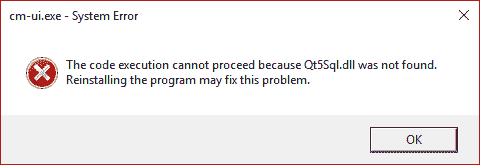

坏消息是它不起作用，但好消息是至少它清楚地告诉我们为什么它不起作用——它缺少`Qt5Sql.dll`依赖项。我们知道我们确实在那里有一个依赖项，因为当我们开始进行数据库工作时，我们不得不在`.pro`文件中添加`sql`模块。然而，等等，我们刚刚执行了一个应该为我们拉取所有 Qt 依赖项的命令，对吧？对，我不知道为什么这个工具会漏掉一些它真的应该知道的依赖项，但它确实漏掉了。我不知道这是一个错误、一个疏忽，还是与底层第三方 SQLite 实现相关的许可限制，但无论如何，简单的解决方案是我们只需要自己复制它。

转到`<Qt Installation>/5.9.1/<kit>/bin`，将`Qt5Sql.dll`复制到我们的数据文件夹中。再次启动`cm-ui.exe`，哇，它成功打开了！

除了从 bin 目录中缺少`.dll`文件之外，还要注意来自插件目录的缺少文件/文件夹。在我们的情况下，您将看到已成功复制了几个文件夹（bearer、iconengines 等），但有时它们不会复制，并且很难弄清楚，因为您不会像我们在缺少 DLL 时那样得到有用的错误消息。在这种情况下，我只能推荐三件事：试验、错误和互联网。

所以，现在我们有一个包含我们可爱的应用程序二进制文件和一大堆同样可爱的其他文件和文件夹的文件夹。现在呢？嗯，我们可以简单地将整个文件夹复制到用户的计算机上，并让他们像我们一样启动可执行文件。然而，一个更整洁和更专业的解决方案是将所有内容打包成一个漂亮的安装包，这就是 Qt Installer Framework 工具的用武之地。

# Qt Installer 框架

让我们编辑我们的 Qt 安装并获取 Qt Installer 框架。

从您的 Qt 安装目录启动 MaintenanceTool 应用程序，您将看到一个与我们第一次安装 Qt 时看到的几乎相同的向导。要将 Qt Installer Framework 添加到您现有的安装中，请按照以下步骤操作：

1.  要么登录到您的 Qt 帐户，要么跳过

1.  选择添加或删除组件，然后点击下一步

1.  在选择组件对话框中，勾选工具 > Qt Installer Framework 3.0，然后点击下一步

1.  通过点击更新开始安装

安装完成后，您可以在`Qt/Tools/QtInstallerFramework/3.0`中找到已安装的工具。

您可以以完全相同的方式添加更多的模块、工具包等。除非您主动取消选择，否则您已安装的任何组件都不会受到影响。

Qt Installer Framework 需要存在两个特定目录：config 和 packages。Config 是描述整个安装程序的单一配置，而您可以将多个包（或组件）捆绑在同一个安装包中。每个组件在 packages 文件夹内有自己的子目录，其中包含一个数据文件夹，其中包含该组件要安装的所有项目，以及一个 meta 文件夹，其中包含包的配置数据。

在我们的情况下，虽然我们有两个项目（`cm-lib`和`cm-ui`），但将一个项目分发而不包括另一个是没有意义的，因此我们将文件聚合到一个包中。包的常见命名约定是`com.<publisher>.<component>`，所以我们将命名为`com.packtpub.cm.`我们已经在上一节创建了所需的数据文件夹（为前瞻性规划欢呼！），并且`windeployqt`已经为我们填充了文件。

这里没有必需的命名约定，所以如果愿意，可以随意为包命名其他名称。如果我们想要将一个额外的可选组件与我们的应用程序捆绑在一起，只需创建一个额外的包文件夹（例如，`com.packtpub.amazingcomponent`），其中包含相关的数据和元数据文件，包括一个单独的`package.xml`来配置该组件。

创建任何缺失的文件夹，以便在`cm/installer/windows`内部得到以下文件夹结构：

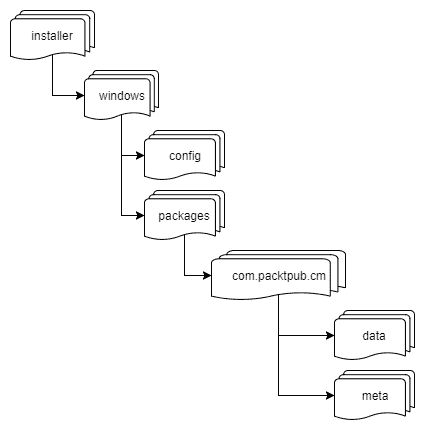

为了补充这些文件夹，我们还需要提供两个 XML 配置文件。

在 config 子文件夹中创建`config.xml`：

```cpp
<?xml version="1.0" encoding="UTF-8"?>
<Installer>
    <Name>Client Management</Name>
    <Version>1.0.0</Version>
    <Title>Client Management Application Installer</Title>
    <Publisher>Packt Software Publishing</Publisher>
    <StartMenuDir>Client Management</StartMenuDir>
    <TargetDir>@HomeDir@/ClientManagement</TargetDir>
</Installer>
```

此配置文件自定义了安装程序的行为。我们在这里指定的属性如下：

| 属性 | 目的 |
| --- | --- |
| `Name` | 应用程序名称 |
| `Version` | 应用程序版本 |
| `Title` | 标题栏中显示的安装程序名称 |
| `Publisher` | 软件的发布者 |
| `StartMenuDir` | Windows 开始菜单中的默认程序组 |
| `TargetDir` | 应用程序安装的默认目标目录 |

在`TargetDir`属性中，您会注意到奇怪的@符号，它们定义了一个预定义变量`HomeDir`，允许我们动态获取到最终用户的主目录路径。您也可以以同样的方式访问其他属性的值，例如，`@ProductName@`将返回“Client Management”。更多信息请参阅[`doc.qt.io/qtinstallerframework/scripting.html#predefined-variables`](http://doc.qt.io/qtinstallerframework/scripting.html#predefined-variables)。

接下来，在`packages/com.packtpub.cm/meta`子文件夹中创建`package.xml`：

```cpp
<?xml version="1.0" encoding="UTF-8"?>
<Package>
    <DisplayName>Client Management application</DisplayName>
    <Description>Install the Client Management application.</Description>
    <Version>1.0.0</Version>
    <ReleaseDate>2017-10-30</ReleaseDate>
    <Licenses>
        <License name="Fictional Training License Agreement" file="license.txt" />
    </Licenses>
    <Default>true</Default>
</Package>
```

此文件配置了`com.packtpub.cm`包（我们的 Client Management 应用程序）的以下属性：

| 属性 | 目的 |
| --- | --- |
| `DisplayName` | 组件的名称。 |
| `Description` | 选择组件时显示的文本。 |
| `Version` | 组件的版本（用于推广组件更新）。 |
| `ReleaseDate` | 组件发布的日期。 |
| `Licenses` | 必须同意才能安装包的许可证集合。许可协议的文本是从 meta 文件夹中的指定文件中获取的。 |
| `Default` | 表示组件是否默认选中的布尔标志。 |

您还需要在 meta 文件夹中创建`license.txt`；在这种情况下，内容并不重要，因为这只是用于演示，所以可以在里面写任何无关紧要的东西。

当所有的二进制文件、依赖项和配置都就绪后，我们现在可以在命令终端中运行 Qt Framework Installer 来生成我们的安装包。首先，切换到`cm/installer/windows`文件夹，然后执行`binarycreator`：

```cpp
$ <Qt Installation Path> \Tools \QtInstallerFramework \3.0\ bin\ binarycreator.exe -c config\config.xml -p packages ClientManagementInstaller.exe
```

`-c`标志告诉工具`config.xml`文件的位置，`-p`告诉工具所有包的位置。最后一个参数是您想要给结果安装程序的名称。

将我们的应用程序整齐地打包成一个单独的安装程序文件`ClientManagementInstaller.exe`后，我们现在可以轻松地将其分发给最终用户进行安装。

# 安装

启动安装程序后，您将看到一个欢迎对话框，其内容源自我们的`config.xml`文件：

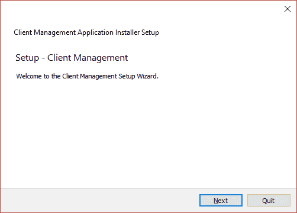

然后我们被提示指定安装的目标目录，我们期望的是安装后，该文件夹将包含我们在数据文件夹中汇总的所有文件和文件夹：

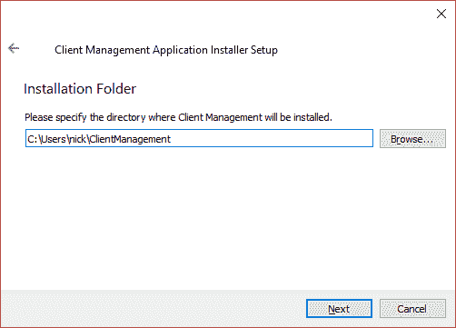

然后，我们将看到我们通过包目录定义的所有组件的列表，这种情况下只是`com.packtpub.cm`文件夹中的应用程序和依赖项：

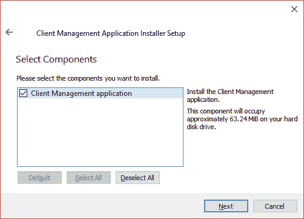

接下来，我们将看到我们在`packages.xml`中定义的任何许可证，包括文本文件中提供的许可证信息：

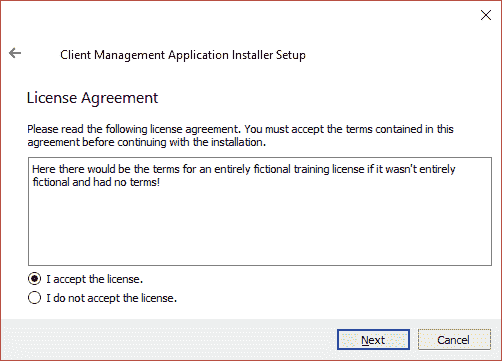

然后我们被提示设置开始菜单快捷方式，默认情况下由`config.xml`提供：

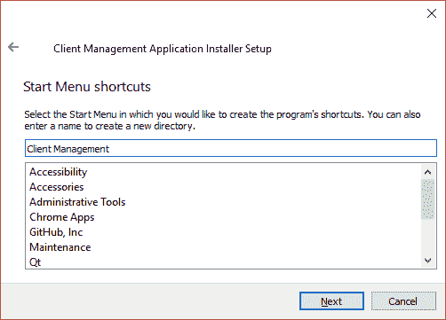

我们现在已经准备好安装了，并在确认之前提供了磁盘使用情况统计信息：

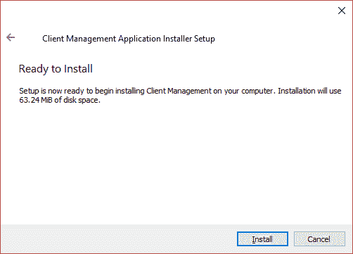

在安装完成时稍等片刻后，我们将看到最终确认对话框：

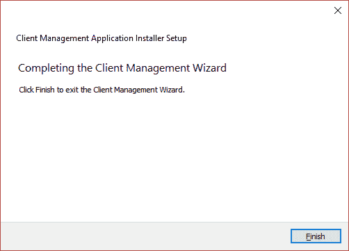

您应该在目标目录中看到一个新的`ClientManagement`文件夹，其中包含我们安装的应用程序！

# 总结

在这一章中，我们通过引入第一个对象工厂，使我们的应用程序更具可测试性。它们是一个非常有用的抽象层，使单元测试变得更加容易，在更大的项目中，通常会出现几个工厂。然后，我们通过具有可以随着窗口缩放的样式属性，使我们的 UI 更加动态。`EnumeratorDecorators`得到了一些关注，并且有了自己的编辑组件，完全适合手指操作。然后我们利用该编辑器实现了联系人管理，展示了如何轻松查看和编辑对象集合。

随着我们的应用程序更加完善，我们看了一下如何将我们闪亮的新作品交到最终用户手中。不同的操作系统都有自己的看法，您无疑会在自己的特定环境中发现怪癖并遇到挑战，但希望您现在有了解决它们所需的工具。

这种情绪不仅适用于部署，还适用于整个项目生命周期。本书的目标不是讨论理论问题，虽然有趣，但在您作为开发人员的日常角色中永远不会出现。目标是提出解决实际问题的解决方案。我们从头到尾开发了一个功能性的业务应用程序，通过常见任务，您将在日常工作中遇到，无论是在工作中进行倡议还是在家中进行个人项目。

我希望本书中详细介绍的一些方法对您有所帮助，并且您将继续享受与 Qt 一起工作的乐趣，就像我一样。
