# 第一章：虚幻引擎概述

首先，感谢您拿起这本书。我相信您一定很兴奋地想要学习如何制作自己的游戏。在本章中，我将向您介绍游戏中不同的基本组件以及虚幻引擎 4 如何帮助您制作您梦想中的游戏。

本章将涵盖以下主题：

+   游戏中包含什么？

+   **虚幻引擎**（**UE**）的历史

+   游戏开发是如何进行的？

+   UE 的组件及其编辑器

# 游戏中包含什么？

当你玩游戏时，你可能能够识别出游戏中需要包含的内容。在一个简单的 PC 射击游戏示例中，当你按下左鼠标按钮时，枪会触发。你看到子弹飞出，听到枪声，四处张望看看你是否击中了什么。如果你击中了什么，例如，一堵墙，目标会受到某种形式的损伤。

作为游戏创作者，我们需要学习分解我们在游戏中看到的内容，以确定我们为游戏需要什么。以下是一个简单的分解，不涉及过多细节：将鼠标点击与子弹发射联系起来，播放类似枪声的声音文件，在枪管附近显示火花（称为**粒子效果**），目标显示一些可见的损伤。

考虑这个例子，尝试将任何游戏可视化并分解为其基本组件。这将极大地帮助你设计和创建游戏关卡。

当你在玩游戏时，幕后有很多事情在进行。借助虚幻引擎，许多组件的交互已经被设计和定制，你需要根据你自己的游戏进行定制。当你使用引擎来制作游戏时，这将节省大量时间。

# 什么是游戏引擎？

游戏引擎所做的是为你提供工具和程序，帮助你定制和构建游戏；它为你制作自己的游戏提供了先发优势。虚幻引擎是目前市场上更受欢迎的选择之一，并且任何人都可以免费用于开发（如果你的游戏盈利，则需要支付版税；更多信息请访问[`www.unrealengine.com/custom-licensing`](https://www.unrealengine.com/custom-licensing)）。它的流行主要归功于其广泛的定制性、多平台能力和使用它创建高质量 AAA 游戏的能力。如果你打算开始游戏开发生涯，这绝对是你想要开始尝试并用于构建你作品集的引擎之一。

# 虚幻引擎的历史

在解释这个强大无比的游戏引擎能做什么以及它是如何工作的之前，让我们先短暂地回顾一下过去，看看 UE 是如何产生的，以及它是如何发展到今天这个样子的。

对于玩家来说，你可能对 Unreal 游戏系列很熟悉。你知道第一款 Unreal 游戏是如何制作的吗？Epic Games 的工程师构建了一个引擎，帮助他们创建第一款 Unreal 游戏。多年来，随着每一代 Unreal 游戏系列的发展，越来越多的功能被添加到引擎中，以帮助游戏开发。这反过来又提高了 UE 的能力，并在几年内迅速改善了游戏引擎。

在 1998 年，UE 的第一个版本使得对第一人称射击游戏的修改成为可能。你可以使用自己的内容替换 Unreal 内容，并使用 UnrealScript 调整**非玩家角色**（**NPCs**），也称为**机器人**（由计算机通过人工智能控制的玩家）的行为。随后，通过开发在线游戏*Unreal Tournament*，将多人在线功能添加到 UE 中。这款游戏还把 PlayStation 2 添加到了兼容平台列表中，除了 PC 和 Mac。

到 2002 年，UE 取得了飞跃性的进步，通过开发粒子系统（生成如雾和烟雾等效果的系统）、静态网格工具（操纵对象的工具）、物理引擎（允许对象之间如碰撞的交互）和 Matinee（创建剪辑的工具，即简短的非交互式电影），将其带入下一代。这一改进导致了*Unreal Championship*和*Unreal Tournament 2003*的发展。*Unreal Championship*的发布还把 Xbox 游戏机添加到了列表中，并在 Xbox Live 中提供了多人游戏功能。

Epic 的下一款游戏*Unreal II: The Awakening*的开发，通过引入动画系统和现有引擎的整体改进，将 UE 向前推进。2000 年代初互联网速度的加快也增加了多人在线游戏的需求。*Unreal Tournament 2004*允许玩家相互进行在线战斗。这导致了车辆和大型战场的创建，以及在线网络能力的提升。2005 年，*Unreal Champion 2*在 Xbox 游戏机上的发布，加强了 UE 在 Xbox 平台上的能力。这也见证了新第三人称摄像系统的一个重要特性的创建。这为使用该引擎创建的游戏类型打开了更大的可能性。

*战争机器*是电子游戏行业中最为知名的品牌之一，它推动 Epic Games 在 2006 年创建并发布了其游戏引擎的第三个版本，*Unreal Engine 3*。

使用 DirectX 9/10 的图形引擎的改进，使得制作更逼真的角色和对象成为可能。**Kismet** 的引入，这是一个视觉脚本系统，允许游戏和关卡设计师在不深入编写代码的情况下创建更具吸引力的战斗玩法逻辑。UE3 的平台功能包括增加了 Xbox360 和 PlayStation 3。在光照控制和材质方面进行了全面革新。UE3 还引入了新的物理引擎。2008 年发布的 *《战争机器 2》* 看到了 UE3 的逐步改进。2013 年，发布了 *《战争机器：审判》*。

PC 在线游戏也受到了 Epic Games 开发者的关注。2009 年，发布了 Atlas Technology，与 UE 结合使用，以允许创建 **大型多人在线游戏**（**MMOG**）。

移动游戏需求的增加也导致 UE3 向着增强其对各种移动平台的支持能力方向发展。所有这些进步和技术能力使 UE3 成为最流行的 Unreal Engine 版本，并且至今仍然非常广泛地被使用。

UE3 在市场上主导了 8 年，直到 UE4 的出现。UE4 于 2014 年发布，通过用新的 **蓝图** 概念取代 Kismet 带来了最大的变化。我们将在本章后面更详细地讨论 UE4 的功能。

# 游戏开发

每个游戏工作室都有自己的一套流程来确保其游戏的成功发布。游戏制作通常在游戏发布之前要经过几个阶段。一般来说，有前期制作/规划阶段、制作阶段和后期制作阶段。大部分时间通常都花在制作阶段。

游戏开发是一个迭代的过程。一个想法的诞生是这个过程的开始。游戏的想法必须首先经过测试，看看它是否真的对目标受众有乐趣。这通过快速原型化关卡来完成。从几周到几个月甚至几年，这个原型的迭代可以变成一个完整游戏。

开发团队负责这个迭代过程。在整个开发周期中，每个人对游戏的贡献都会直接影响游戏及其成功。

开发团队由几个专业小组松散组成：艺术家（2D/3D 模型师、动画师）、电影制作者、音效设计师、游戏设计师和程序员。

## 艺术家

他们创建游戏中所有可见的对象，从菜单按钮到游戏关卡中的树木。一些艺术家专注于 3D 模型，而其他人则专注于动画。艺术家使游戏看起来美丽而逼真。艺术家必须学习如何将他们创建的图像/模型导入 UE4，这些图像/模型通常首先使用其他软件（如 3DMax、Maya 和 MODO）创建。他们很可能会使用蓝图来为游戏创建某些自定义行为。

## 电影制作者

许多电影专家也是受过训练的艺术家。他们拥有独特的视角和创意技能，能够创作短片场景/剪辑场景。UE4 中的 Matinee 工具将是他们大部分时间会使用的工具。

## 音效设计师

音效设计师具有敏锐的听觉，他们大多数都受过音乐训练。他们在声音实验室中工作，为游戏创建定制的声音/音乐。他们负责将声音文件导入 UE4，以便在游戏中的合适时刻播放。当使用 UE4 时，他们大部分时间会使用声音提示编辑器。

## 游戏设计师

设计师决定游戏中的发生什么，游戏中发生什么，以及游戏将涉及什么。在规划阶段，大部分时间将花费在讨论、演示和文档上。在生产阶段，他们将监督游戏原型制作过程，以确保游戏关卡按照设计创建。设计师经常花费时间在 Unreal 编辑器中，以自定义和微调关卡。

## 程序员

他们是研究团队，负责了解团队创建游戏所需的技术和软件。在前期制作阶段，他们负责决定哪些软件程序是必需的，并且能够创建游戏。他们还必须确保所使用的不同软件之间兼容。程序员也会编写代码，使艺术家创建的对象根据设计师的想法变得生动。他们编写游戏的规则和功能。一些程序员也参与创建游戏工具和研究。他们并不直接参与创建游戏，而是支持制作流程。具有极端图形的游戏通常有一支研究团队优化图形，并为游戏创建更逼真的图形。他们大部分时间都在编写代码，可能使用 Visual Studio 用 C++编写代码。他们还能够修改和扩展 UE4 的功能，以满足他们正在开发的游戏的需求。

# Unreal Engine 4 的组件

Unreal Engine 是一个帮助您制作游戏的引擎。Unreal Engine 由几个组件组成，它们协同工作以驱动游戏。其庞大的工具和编辑器系统允许您组织您的资产，并操纵它们以创建您游戏的游戏玩法。

Unreal Engine 的组件包括音效引擎、物理引擎、图形引擎、输入和游戏框架，以及在线模块。

## 音效引擎

音效引擎负责在游戏中添加音乐和声音。它集成到 Unreal 中，允许您播放各种声音文件，以设定氛围并增加游戏的真实感。游戏中声音有许多用途。环境声音始终在背景中。当需要时，声音效果可以重复，或者是一次性的，由游戏中的特定事件触发。

在森林环境中，你可以将鸟鸣、风、树木和树叶沙沙声作为环境声音。这些单独的声音可以组合成森林环境声音，并在游戏角色在森林中时在背景中柔和地持续播放。重复的声音，如脚步声文件，可以连接到行走动作的动画。一次性音效，如城市中特定建筑的爆炸声，可以链接到游戏中的事件触发器。在虚幻中，声音的触发是通过称为**声音提示**的提示实现的。

## 物理引擎

在现实世界中，物体遵循物理定律。物体根据牛顿运动定律发生碰撞并被设置成运动状态。物体之间的吸引力也遵循万有引力定律和爱因斯坦的广义相对论。在游戏世界中，为了使物体对现实生活的反应相似，必须通过编程构建相同的系统。虚幻物理引擎利用由 NVIDIA 开发的 PhysX 引擎进行计算，以实现逼真的物理交互，例如碰撞和流体动力学。这种高级物理引擎的存在使我们能够专注于制作游戏，而不是花费时间让物体正确地与游戏世界交互。

## 图形引擎

为了在屏幕上显示图像，它必须渲染到您的显示监视器（如您的 PC/电视或移动设备）上。图形引擎通过获取有关整个场景的信息（如颜色、纹理、几何形状、单个物体的阴影和光照，以及场景的视点），并考虑影响物体整体颜色、光线、阴影和遮挡的交叉交互因素，负责在您的显示上输出信息。

图形引擎随后在后台使用所有这些信息进行大量计算，然后才能将最终的像素信息输出到屏幕上。图形引擎的强大功能影响场景的真实感。虚幻图形引擎具有输出逼真游戏画面质量的能力。它优化场景和处理大量实时光照计算的能力，使用户能够在游戏中创建逼真的物体。

该引擎可用于创建适用于所有平台（PC、Xbox、PlayStation 和移动设备）的游戏。它支持 DirectX 11/12、OpenGL 和 JavaScript/WebGL 渲染。

## 输入和游戏框架

Unreal Engine 包含一个输入系统，该系统将玩家按下的键和按钮转换为游戏中角色执行的动作。此输入系统可以通过游戏框架进行配置。游戏框架包含跟踪游戏进度和控制游戏规则的函数。**抬头显示**（**HUDs**）和**用户界面**（**UIs**）是游戏框架的一部分，用于在游戏过程中向玩家提供反馈。例如，`GameMode`、`GameState`和`PlayerState`等游戏类设置游戏规则并控制游戏状态。游戏中的角色由玩家（使用`PlayerController`类）或 AI（使用`AIController`类）控制。无论是由玩家还是 AI 控制，游戏中的角色都是称为**Pawn**类的基类的一部分。**Character**类是**Pawn**类的子集，专门用于垂直方向的玩家表示，例如人类。

在 Unreal Gameplay 框架和控制器就绪的情况下，它允许对玩家的行为进行完全自定义，并具有灵活性，如下面的图所示：

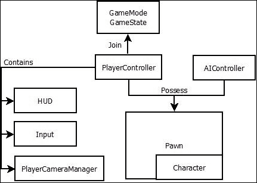

## 光线和阴影

光是游戏制作中的强大工具。它可以以多种方式使用，例如创造场景的气氛或吸引玩家对游戏中的对象的注意。Unreal Engine 4 提供了一套基本灯光，可以轻松放置到您的游戏关卡中。它们是**方向光**、**点光**、**聚光灯**和**天空光**。

**方向光**发射平行光束，**点光**像灯泡一样发光（从单个点以径向向外向所有方向发射），**聚光灯**以锥形形状向外发射光线，而**天空光**模仿天空向下照射关卡中的物体：

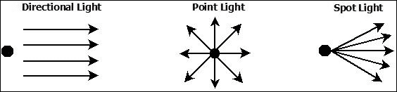

光的有效设计也为您的游戏创建了逼真的阴影。通过选择关卡中的灯光类型，您可以影响场景的气氛和渲染时间，这反过来又影响游戏的每秒帧数。在游戏世界中，您有两种类型的阴影：静态和动态。静态阴影可以预先烘焙到场景中，这使得它们渲染速度快。动态阴影在运行时改变，渲染成本更高。我们将在第四章*光照和环境控制*中了解更多关于光照和阴影的知识。

## 后处理效果

后处理效果是在场景结束时添加的效果，用于提高场景质量。Unreal Engine 4 提供了非常好的后处理效果选择，您可以将它们添加到您的关卡中，以增强整体场景。

它提供全场景**高动态范围渲染**（**HDRR**）。这允许明亮的对象非常明亮，暗淡的对象非常暗淡，但我们仍然能够看到其中的细节。（这是 NVIDIA 进行 HDR 渲染的动机。）

UE4 后处理效果包括使用**时间抗锯齿**（**TXAA**）的**抗锯齿**、**泛光**、**色彩分级**、**景深**、**眼睛适应**、**镜头光晕**、**后处理材质**、**场景边缘**、**屏幕空间反射**和**晕影**。尽管游戏通常在设计时考虑后处理效果，但用户通常可以选择关闭它们，如果需要的话。这是因为它们通常需要消耗相当数量的额外资源，以换取更好的视觉效果。

## 人工智能

如果你完全不了解**人工智能**（**AI**）的概念，它可以被认为是人类创造来模拟现实生活的智能。人类创造了人工智能，给对象一个大脑，使其能够思考并自主做出决策。

从根本上讲，人工智能由复杂的规则集组成，帮助对象做出决策并执行其设计功能/行为。在游戏中，NPC 被赋予某种形式的人工智能，以便玩家可以与之互动。例如，赋予 NPC 寻找攻击甜点的能力。如果受到攻击，他们会逃跑、躲藏，并找到一个更好的位置进行反击。

Unreal Engine 4 提供了良好的基本人工智能，为你自定义和改进游戏中 NPC 的人工智能奠定了基础。关于在 Unreal Engine 中如何设计人工智能的更多细节将在第五章*动画和人工智能*中讨论。

## 线上和跨平台功能

Unreal Engine 4 提供了为许多平台创建游戏的能力。如果你使用 Unreal Engine 4 创建游戏，它可以移植到不同的平台，如 Web、iOS、Linux、Windows 和 Android。此外，**通用 Windows 平台**（**UWP**）也将很快被添加。它还有一个在线子系统，为游戏提供集成 Xbox Live、Facebook、Steam 等功能的能力。

# Unreal Engine 和其强大的编辑器

在了解了 Unreal Engine 的不同组件之后，现在是时候学习更多关于各种编辑器以及它们如何赋予我们创建游戏的实际功能了。

## Unreal Editor

Unreal Engine 拥有多个编辑器，有助于游戏的创建。默认情况下，Unreal Editor 是 Unreal Engine 的启动编辑器。它可以被认为是允许访问其他子系统（如材质和蓝图子系统）的主要编辑器。

Unreal Editor 提供了一个由视口和窗口组成的可视化界面，使你能够导入、组织、编辑并向你的游戏资产添加行为/交互。其他子编辑器/子系统具有非常专业的功能，允许你控制资产（外观和行为）的细节。

虚幻编辑器，连同所有子系统，是设计师的一个伟大工具。它允许物理放置资产，并使用户能够在不修改代码的情况下控制游戏变量。

## 材质编辑器

着色器和材质赋予物体独特的颜色和纹理。虚幻引擎 4 利用基于物理的着色。这个新的材质管道让艺术家能够更好地控制物体的外观和感觉。基于物理的着色具有更详细的光与表面的关系。这种理论将两个物理属性（微观表面细节和反射率）绑定在一起，以实现物体的最终外观。

在过去，许多最终外观是通过调整着色器/材质算法中的值来实现的。在虚幻引擎 4 中，我们现在可以通过调整光和着色算法的值来达到高质量的内容，这会产生更一致和可预测的结果。关于着色器和材质的更多细节将在第四章中提供，*光照和环境控制*。以下截图显示了 UE4 中的材质编辑器：

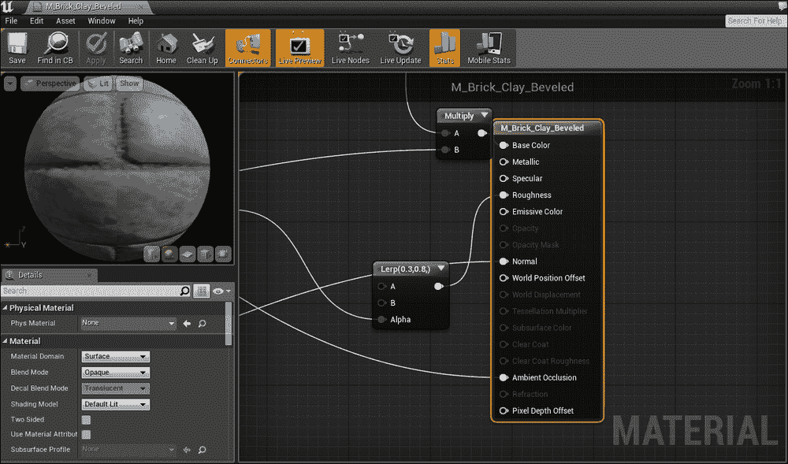

### 瀑布粒子系统

瀑布粒子系统提供了广泛的能力来设计和创建粒子效果。通过设计每个粒子的尺寸、颜色和纹理以及这些粒子群如何相互交互来模拟真实粒子效果行为，可以创建诸如烟雾、火花和火焰等效果。以下截图显示了 UE4 中的瀑布粒子系统：

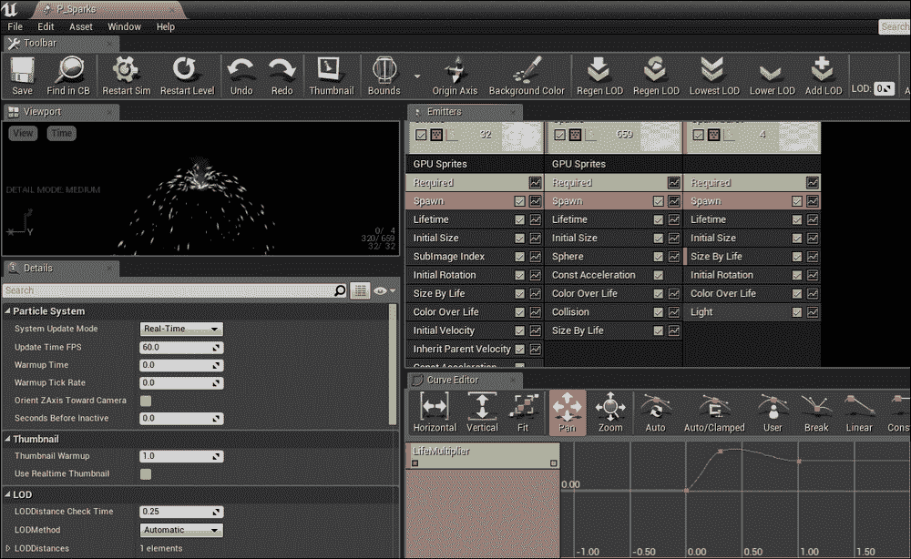

### 人物骨骼网格动画

人物动画系统允许您设计和控制角色的骨骼、骨骼网格和插座的动画。此工具可用于预览角色的动画并设置关键帧之间的混合动画。还可以通过**物理资产工具**（**PhAT**）调整物理和碰撞属性。以下截图显示了 UE4 中的人物动画系统：

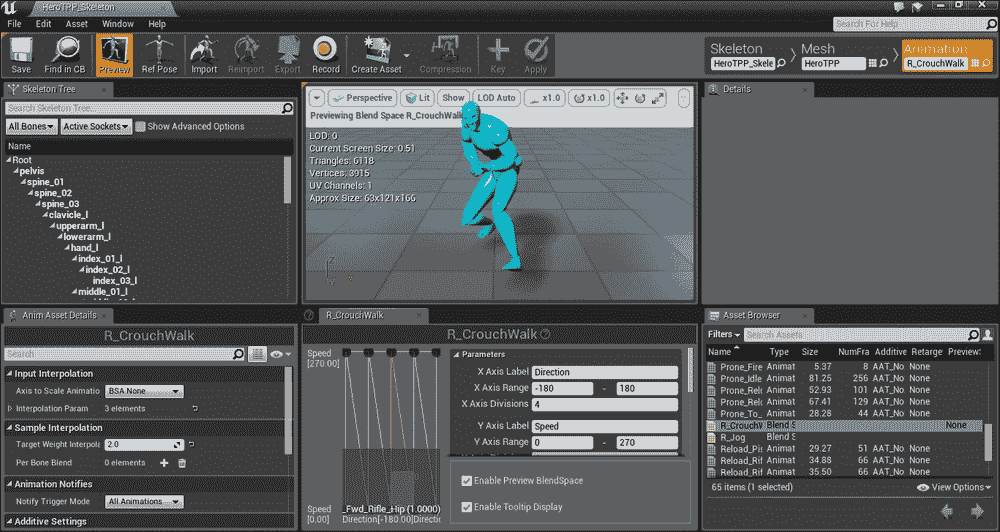

### 地形 - 构建大型户外世界和植被

要使用编辑器创建大型户外空间，虚幻引擎通过地形系统提供雕刻和绘画工具，以帮助我们。一个高效的**细节级别**（**LOD**）系统和内存利用率允许大规模地形塑造。还有一个植被编辑器，可以将草地、雪和沙子应用到户外环境中。

## 声音提示编辑器

声音和音乐的控制是通过声音提示编辑器完成的。声音和音乐通过称为**声音提示**的提示触发播放。可以使用此编辑器实现开始/停止/重复/淡入或淡出的功能。以下截图显示了 UE4 中的声音提示编辑器：

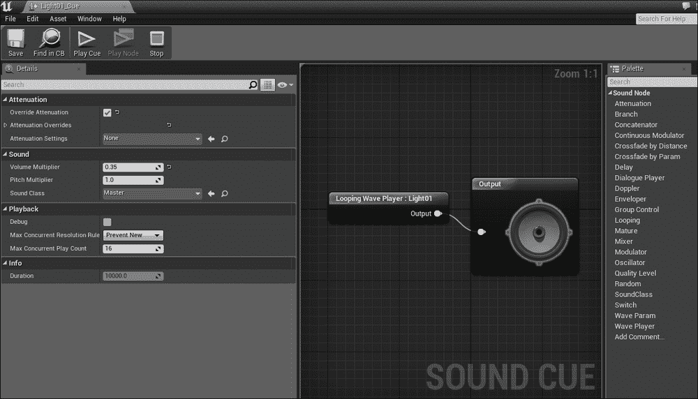

## Matinee 编辑器

Matinee 编辑器工具集允许创建游戏过场场景和电影。这些创建的短剪辑可以用来介绍游戏关卡开始，在游戏开始前讲故事，甚至作为游戏的宣传视频。以下截图显示了 UE4 中的 Matinee 编辑器：

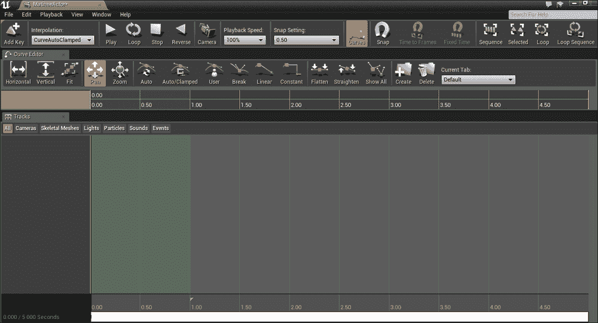

## 蓝图可视化脚本系统

蓝图系统是 Unreal Engine 中的一个新特性。Unreal Engine 4 是第一个使用这一革命性系统的引擎。对于那些熟悉 Unreal Engine 3 的人来说，它可以被视为 Unreal 脚本系统、Kismet 和 Prefab 功能的增强和改进的合并版本。蓝图可视化脚本系统允许您使用可视化脚本语言（由线条连接的类似框的流程图）扩展代码功能。这种能力意味着您不需要编写或编译代码，就可以创建、排列和自定义游戏对象的行为/交互。这也为非程序员（艺术家/设计师）提供了快速原型设计或创建关卡以及操作游戏玩法的能力，而无需应对游戏编程的挑战。蓝图的一个酷特性是，您可以通过点击对象并选择 **创建变量** 来创建变量，就像在编程中一样。这为开发者打开了在不进行复杂编码的情况下可以做的事情。

为了帮助开发者调试蓝图脚本逻辑，您可以在执行过程中可视地看到事件序列和属性值。类似于编码中的故障排除，您还可以设置断点来暂停蓝图序列。以下截图显示了 UE4 中的关卡蓝图编辑器：

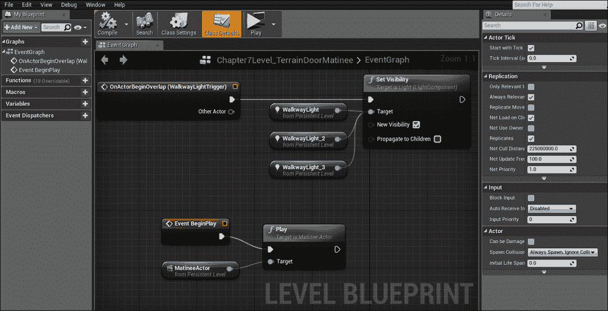

# Unreal 编程

访问 Unreal Engine 的源代码使用户能够自由地创建几乎任何他们能想到的东西。基础代码的功能可以被扩展和定制，以满足游戏所需的各种功能。从内部学习 Unreal Engine 的工作原理可以解锁其在游戏创作中的全部潜力。

Unreal Engine 也为编程人员集成了非常实用的调试功能。其中之一就是 **热重载** 功能。这个工具使得 C++ 代码的更改能够立即反映在游戏中。为了方便快速更改代码，Unreal Engine 还包括了 **代码视图**。通过在 **代码视图** 类别中点击一个对象的功能，它将直接显示在 Visual Studio 中与该对象相关的代码，您可以在那里对代码进行更改。

对于包含代码更改的游戏项目，可以设置版本控制和源代码管理。

## Unreal 对象

实体是虚幻中所有游戏对象的基础类。为了使实体具有更多的属性和功能，实体类被扩展到各种更复杂的类。在编程方面，实体类充当容器类，用于包含称为组件的专用对象。组件功能的组合赋予了实体其独特的属性。

# 虚幻编辑器入门指南

这是对我们如何使用虚幻编辑器的一个快速概述。我们将简要介绍如何使用编辑器中的各种窗口来创建游戏。

## 开始菜单

当启动虚幻引擎时，您将默认首先进入一个菜单窗口。这个新的开始菜单简单易导航。它有一个大标签页，允许您选择要启动的游戏引擎版本，并清楚地显示了您创建的项目。它还提供了对市场（Marketplace）的访问，这是一个由他人创建的游戏样本库，您可以下载（有些免费，有些付费）。菜单还提供了来自 Epic 的最新更新和新闻，以确保开发者能够了解最新的开发和变化。以下截图显示了开始菜单：

## 项目浏览器

启动所需版本的虚幻引擎后，虚幻项目浏览器会弹出。此浏览器为您提供创建预定制游戏级别的选项。这意味着您有一系列通用级别，您可以从这些级别开始构建您的游戏级别。对于那些对游戏制作新手来说，这个功能允许您快速直接进入构建各种类型的游戏。您可以直接在**蓝图**或**C++**作为基础模板的情况下，创建第一人称射击级别和第三人称游戏设置，或者 2D/3D 横版滚动平台级别。**新建项目**标签页的酷之处在于，它还允许您选择目标设备（PC/移动），目标图像质量，以及是否将虚幻内容包含在启动项目中。以下截图显示了项目浏览器：

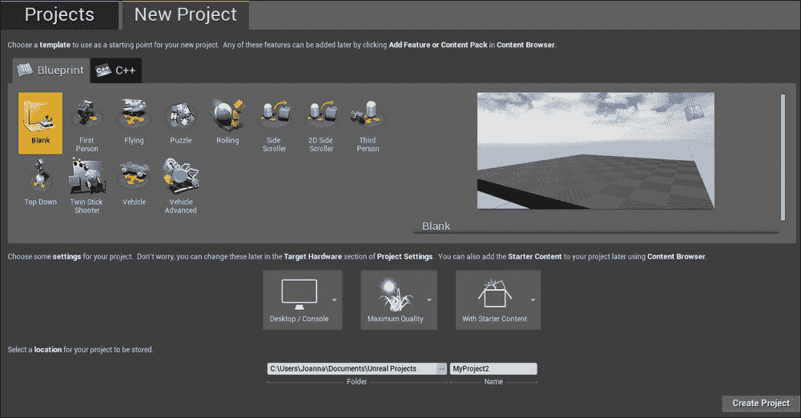

## 内容浏览器

当虚幻编辑器启动时，会出现各种窗口和面板的默认布局。其中之一是**内容浏览器**。**内容浏览器**是一个窗口，您可以在这里找到您拥有的所有内容（游戏资产）。它将您的资产分类到不同的文件夹中，例如`音频`、`材质`、`动画`、`粒子效果`等。此窗口还具有**导入**按钮，允许您将使用其他软件创建的游戏资产导入到游戏中。以下截图显示了**内容浏览器**的默认位置（用绿色突出显示）：

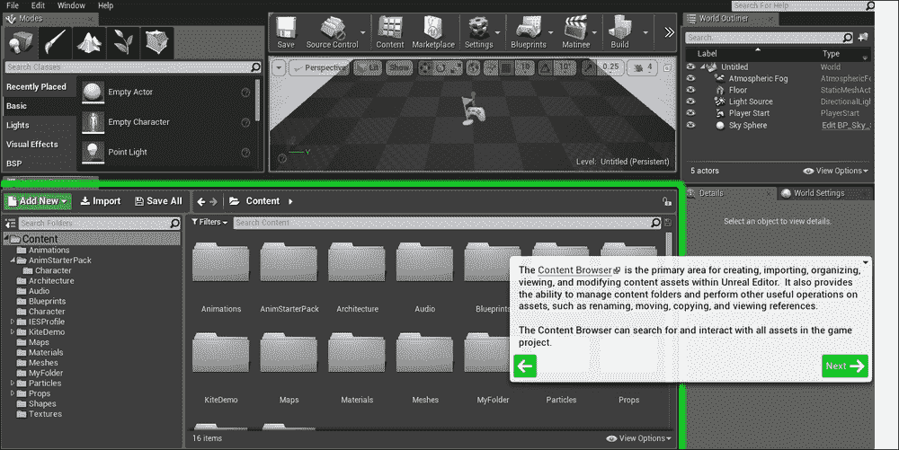

## 工具栏

**工具栏**是一个可定制的功能区，提供对工具和编辑器的快速访问。默认布局包括对蓝图和 Matinee 编辑器的快速访问。快速播放和启动游戏功能也是标准功能区布局的一部分。这些按钮允许你快速查看游戏中的创作。以下截图显示了默认的**工具栏**：

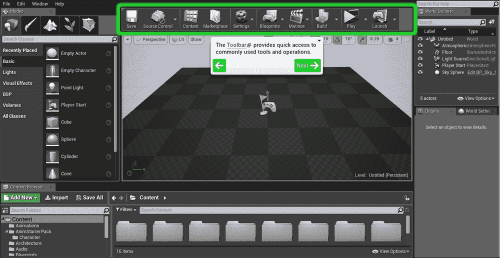

## 视口

**视口**是通往游戏世界之窗，所以你看到的就是游戏中的内容。如果你使用“新建项目”菜单中提供的选项之一创建了一个关卡，你会注意到摄像机已经根据该预定制关卡的设置进行了调整。这就是你将用于放置对象并移动它们的窗口。当你点击工具栏中的**播放**按钮时，这个**视口**窗口就会活跃起来，允许你与游戏关卡进行交互。以下截图显示了在编辑器中高亮的**视口**窗口：

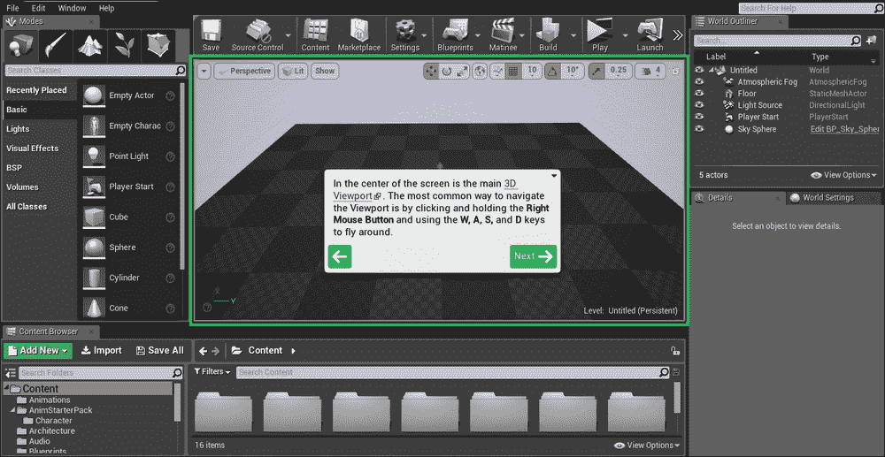

## 场景大纲

**场景大纲**包含场景中放置的对象列表。它只包含当前场景中加载的内容。你可以创建文件夹并为对象命名（以帮助你轻松识别对象）。它也是一个快速分组项目的方法，这样你可以选择它们并批量进行更改。以下截图显示了在编辑器中高亮的**场景大纲**：

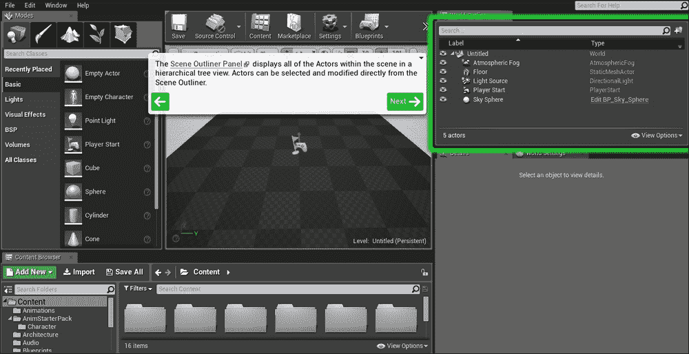

## 模式

**模式**窗口赋予你创建和将对象放置到游戏世界中的能力。你可以选择你希望执行的活动类型。从放置、绘制、景观、植被和几何编辑中选择。放置是将对象放入游戏世界。绘制允许你绘制对象的顶点和纹理。景观和植被是制作大规模自然地形的有用工具。几何编辑提供了修改和编辑对象的工具。以下截图中的高亮区域显示了**模式**窗口：

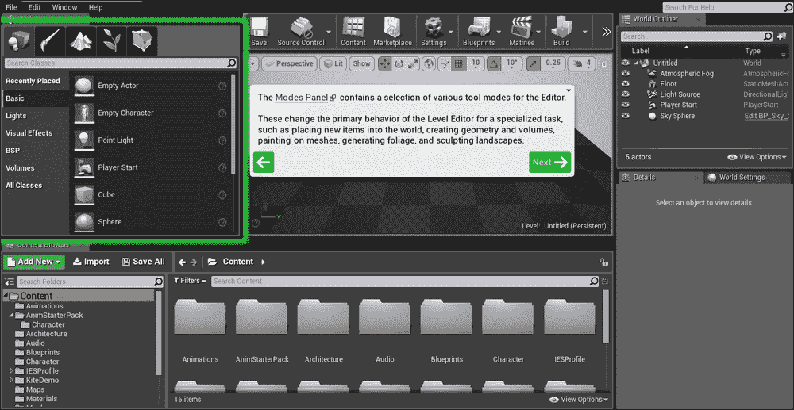

# 摘要

在本章中，我们介绍了关于游戏引擎的基础内容，特别是虚幻引擎 4 及其历史。我们还简要讨论了游戏开发的过程以及游戏公司中存在的各种角色，这些角色有助于创建游戏的不同组件。然后，我们介绍了虚幻引擎的不同组件以及我们如何使用这些不同的功能来帮助我们制作游戏。最后，我们介绍了可用于帮助我们自定义游戏各个组件的不同编辑器。

在接下来的章节中，我们将深入了解虚幻引擎 4 的功能和特性。在下一章中，你将接触到虚幻编辑器的一些基本功能，并开始制作自己的游戏关卡。
