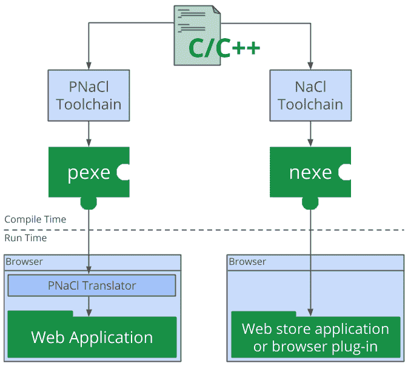
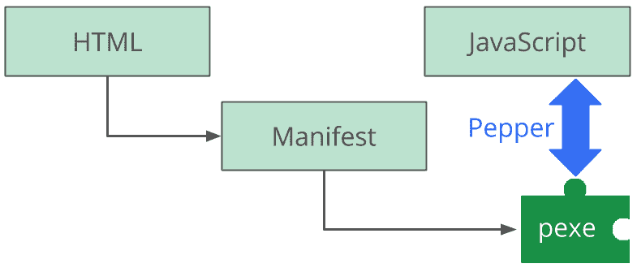
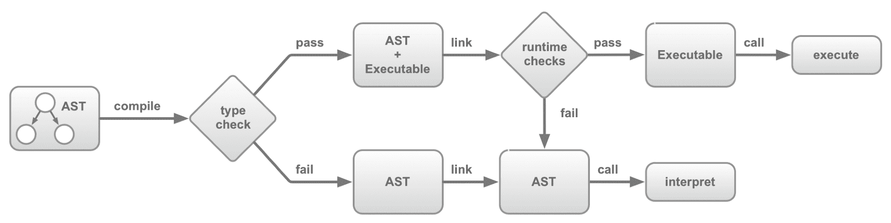
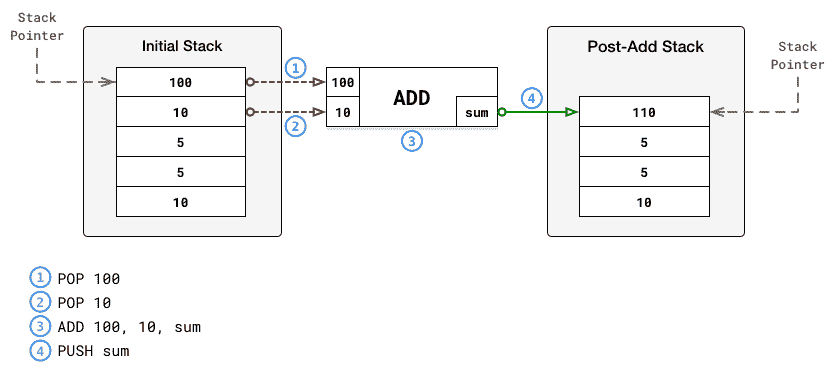
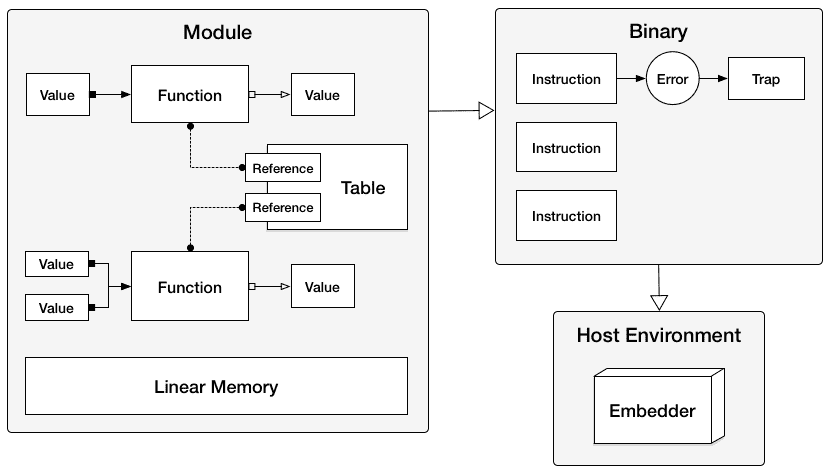
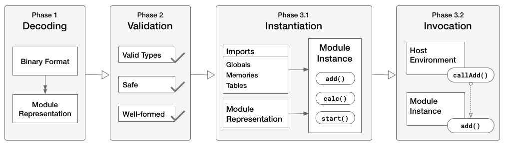
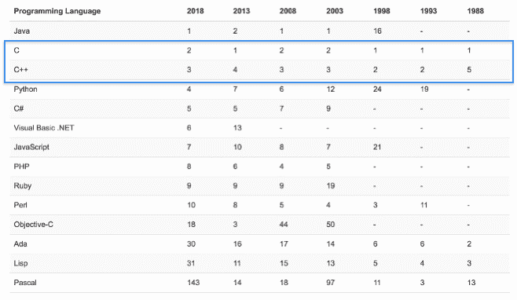
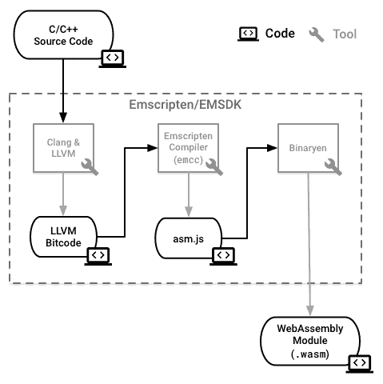

# 什么是 WebAssembly？

**WebAssembly**（**Wasm**）代表了 Web 平台的一个重要里程碑。使开发人员能够在 Web 上运行编译后的代码，而无需插件或浏览器锁定，带来了许多新的机会。关于 WebAssembly 是什么以及对其持续能力的一些怀疑，存在一些混淆。

在本章中，我们将讨论 WebAssembly 的产生过程，WebAssembly 在官方定义方面的含义以及它所涵盖的技术。将涵盖潜在的用例、支持的语言和局限性，以及如何找到额外的信息。

我们本章的目标是了解以下内容：

+   为 WebAssembly 铺平道路的技术

+   WebAssembly 是什么以及它的一些潜在用例

+   可以与 WebAssembly 一起使用的编程语言

+   WebAssembly 的当前局限性

+   WebAssembly 与 Emscripten 和 asm.js 的关系

# 通往 WebAssembly 的道路

可以说，Web 开发有一个有趣的历史。已经进行了几次（失败的）尝试来扩展平台以支持不同的语言。诸如插件之类的笨拙解决方案未能经受住时间的考验，而将用户限制在单个浏览器上则是一种灾难的预兆。

WebAssembly 作为一个优雅的解决方案，解决了自从浏览器能够执行代码以来一直存在的问题：*如果你想为 Web 开发，你必须使用 JavaScript*。幸运的是，使用 JavaScript 并没有像在 2000 年代初那样带有负面含义，但它作为一种编程语言仍然有一定的局限性。在本节中，我们将讨论导致 WebAssembly 出现的技术，以更好地理解为什么需要这种新技术。

# JavaScript 的演变

JavaScript 是由 Brendan Eich 在 1995 年的短短 10 天内创建的。最初被程序员视为一种*玩具*语言，主要用于在网页上制作按钮闪烁或横幅出现。过去的十年里，JavaScript 已经从一个玩具演变成了一个具有深远能力和庞大追随者的平台。

2008 年，浏览器市场的激烈竞争导致了**即时**（**JIT**）编译器的添加，这提高了 JavaScript 的执行速度 10 倍。Node.js 于 2009 年首次亮相，代表了 Web 开发的范式转变。Ryan Dahl 结合了谷歌的 V8 JavaScript 引擎、事件循环和低级 I/O API，构建了一个平台，允许在服务器和客户端使用 JavaScript。Node.js 导致了`npm`，这是一个允许在 Node.js 生态系统内使用的库的包管理器。截至撰写本文时，有超过 60 万个可用的包，每天都有数百个包被添加：


自 2012 年以来 npm 包数量的增长，来自 Modulecounts

不仅是 Node.js 生态系统在增长；JavaScript 本身也在积极发展。ECMA **技术委员会 39**（**TC39**）规定了 JavaScript 的标准，并监督新语言特性的添加，每年发布一次 JavaScript 的更新，采用社区驱动的提案流程。凭借其丰富的库和工具、对语言的不断改进以及拥有最庞大的程序员社区之一，JavaScript 已经成为一个不可忽视的力量。

但是这种语言确实有一些缺点：

+   直到最近，JavaScript 只包括 64 位浮点数。这可能会导致非常大或非常小的数字出现问题。`BigInt`是一种新的数值原语，可以缓解一些这些问题，正在被添加到 ECMAScript 规范中，但可能需要一些时间才能在浏览器中得到完全支持。

+   JavaScript 是弱类型的，这增加了它的灵活性，但可能会导致混淆和错误。它基本上给了你足够的绳子来绞死自己。

+   尽管浏览器供应商尽最大努力，但 JavaScript 并不像编译语言那样高效。

+   如果开发人员想要创建 Web 应用程序，他们需要学习 JavaScript——不管他们喜不喜欢。

为了避免编写超过几行 JavaScript，一些开发人员构建了**转译器**，将其他语言转换为 JavaScript。转译器（或源到源编译器）是一种将一种编程语言的源代码转换为另一种编程语言等效源代码的编译器。TypeScript 是前端 JavaScript 开发的流行工具，将 TypeScript 转译为针对浏览器或 Node.js 的有效 JavaScript。选择任何编程语言，都有很大可能有人为其创建了 JavaScript 转译器。例如，如果你喜欢编写 Python，你有大约 15 种不同的工具可以用来生成 JavaScript。但最终，它仍然是 JavaScript，因此你仍然受到该语言的特殊性的影响。

随着 Web 逐渐成为构建和分发应用程序的有效平台，越来越复杂和资源密集型的应用程序被创建。为了满足这些应用程序的需求，浏览器供应商开始研发新技术，将其集成到软件中，而不会干扰 Web 开发的正常进程。谷歌和 Mozilla 分别是 Chrome 和 Firefox 的创建者，他们采取了两种不同的路径来实现这一目标，最终形成了 WebAssembly。

# 谷歌和 Native Client

谷歌开发了**Native Client**（**NaCl**），旨在安全地在 Web 浏览器中运行本机代码。可执行代码将在**沙盒**中运行，并提供本机代码执行的性能优势。

在软件开发的背景下，沙盒是一个环境，防止可执行代码与系统的其他部分进行交互。它旨在防止恶意代码的传播，并对软件的操作进行限制。

NaCl 与特定架构相关，而**Portable Native Client**（**PNaCl**）是 NaCl 的独立于架构的版本，可在任何平台上运行。该技术由两个元素组成：

+   可以将 C/C++代码转换为 NaCl 模块的工具链

+   运行时组件是嵌入在浏览器中的组件，允许执行 NaCl 模块：



本机客户端工具链及其输出

NaCl 的特定架构可执行文件（`nexe`）仅限于从谷歌 Chrome Web 商店安装的应用程序和扩展，但 PNaCl 可执行文件（`pexe`）可以在 Web 上自由分发并嵌入 Web 应用程序中。Pepper 使得可移植性成为可能，Pepper 是用于创建 NaCl 模块的开源 API，以及其相应的插件 API（PPAPI）。Pepper 实现了 NaCl 模块与托管浏览器之间的通信，并以安全和可移植的方式访问系统级功能。通过包含清单文件和已编译模块（`pexe`）以及相应的 HTML、CSS 和 JavaScript，应用程序可以轻松分发：



Pepper 在本机客户端应用程序中的作用

NaCl 提供了克服 Web 性能限制的有希望的机会，但也有一些缺点。尽管 Chrome 内置支持 PNaCl 可执行文件和 Pepper，其他主要浏览器却没有。技术的反对者对应用程序的黑盒性质以及潜在的安全风险和复杂性表示了异议。

Mozilla 致力于改进 JavaScript 的性能，使用`asm.js`。由于 API 规范的不完整和文档有限，他们不会为 Firefox 添加对 Pepper 的支持。最终，NaCl 于 2017 年 5 月被弃用，改为支持 WebAssembly。

# Mozilla 和 asm.js

Mozilla 于 2013 年推出了`asm.js`，并为开发人员提供了一种将其 C 和 C++源代码转换为 JavaScript 的方法。`asm.js`的官方规范将其定义为 JavaScript 的严格子集，可用作编译器的低级高效目标语言。它仍然是有效的 JavaScript，但语言特性仅限于适合**提前**（**AOT**）优化的特性。AOT 是浏览器的 JavaScript 引擎用来通过将其编译为本机机器代码来更有效地执行代码的技术。`asm.js`通过具有 100%类型一致性和手动内存管理来实现这些性能增益。

使用 Emscripten 等工具，C/C++代码可以被转译成`asm.js`，并且可以使用与普通 JavaScript 相同的方式进行分发。访问`asm.js`模块中的函数需要**链接**，这涉及调用其函数以获取具有模块导出的对象。

`asm.js`非常灵活，但是与模块的某些交互可能会导致性能损失。例如，如果`asm.js`模块被赋予访问自定义 JavaScript 函数的权限，而该函数未通过动态或静态验证，代码就无法利用 AOT 并会退回到解释器：



`asm.js`的 AOT 编译工作流程

`asm.js`不仅仅是一个过渡阶段。它构成了 WebAssembly 的**最小可行产品**（**MVP**）的基础。官方 WebAssembly 网站在标题为*WebAssembly 高级目标*的部分明确提到了`asm.js`。

那么为什么要创建 WebAssembly 而不使用`asm.js`呢？除了潜在的性能损失外，`asm.js`模块是一个必须在编译之前通过网络传输的文本文件。WebAssembly 模块是以二进制格式，这使得由于其较小的大小而更加高效地传输。

WebAssembly 模块使用基于 promise 的实例化方法，利用现代 JavaScript 并消除了任何*这个加载了吗*的代码。

# WebAssembly 的诞生

**万维网联盟**（**W3C**）是一个致力于制定 Web 标准的国际社区，于 2015 年 4 月成立了 WebAssembly 工作组，以标准化 WebAssembly 并监督规范和提案过程。自那时起，*核心规范*和相应的*JavaScript API*和*Web API*已经发布。浏览器中对 WebAssembly 支持的初始实现是基于`asm.js`的功能集。WebAssembly 的二进制格式和相应的`.wasm`文件结合了`asm.js`输出的特征和 PNaCl 的分布式可执行概念。

那么 WebAssembly 将如何成功，而 NaCl 失败了呢？根据 Axel Rauschmayer 博士的说法，详细原因在[`2ality.com/2015/06/web-assembly.html#what-is-different-this-time`](http://2ality.com/2015/06/web-assembly.html#what-is-different-this-time)中有三个原因。

“首先，这是一个协作努力，没有任何一家公司单独进行。目前，涉及的项目有：Firefox，Chromium，Edge 和 WebKit。

其次，与 Web 平台和 JavaScript 的互操作性非常出色。从 JavaScript 中使用 WebAssembly 代码将像导入模块一样简单。

第三，这不是要取代 JavaScript 引擎，而是要为它们增加一个新功能。这大大减少了实现 WebAssembly 的工作量，并有助于获得 Web 开发社区的支持。”

- Dr. Axel Rauschmayer

# WebAssembly 到底是什么，我在哪里可以使用它？

WebAssembly 在官方网站上有一个简明扼要的定义，但这只是一个部分。WebAssembly 还有其他几个组件。了解每个组件的作用将让您更好地理解整个技术。在本节中，我们将详细解释 WebAssembly 的定义，并描述潜在的用例。

# 官方定义

官方的 WebAssembly 网站（[`webassembly.org`](https://webassembly.org)）提供了这个定义：

Wasm 是一种基于堆栈的虚拟机的二进制指令格式。Wasm 被设计为高级语言（如 C/C++/Rust）的可移植编译目标，从而可以在 Web 上部署客户端和服务器应用程序。

让我们把这个定义分解成几个部分，以便更清楚地解释。

# 二进制指令格式

WebAssembly 实际上包括几个元素——二进制格式和文本格式，这些都在*核心规范*中有文档记录，对应的 API（JavaScript 和 Web），以及一个编译目标。二进制和文本格式都映射到一个公共结构，以**抽象语法**的形式存在。为了更好地理解抽象语法，可以在**抽象语法树**（**AST**）的上下文中解释。AST 是编程语言源代码结构的树形表示。诸如 ESLint 之类的工具使用 JavaScript 的 AST 来查找 linting 错误。以下示例包含 JavaScript 的函数和相应的 AST（来自[`astexplorer.net`](https://astexplorer.net)）。

一个简单的 JavaScript 函数如下：

```cpp
function doStuff(thingToDo) {
  console.log(thingToDo);
}
```

相应的 AST 如下：

```cpp
{
  "type": "Program",
  "start": 0,
  "end": 57,
  "body": [
    {
      "type": "FunctionDeclaration",
      "start": 9,
      "end": 16,
      "id": {
        "type": "Identifier",
        "start": 17,
        "end": 26,
        "name": "doStuff"
      },
      "generator": false,
      "expression": false,
      "params": [
        {
          "type": "Identifier",
          "start": 28,
          "end": 57,
          "name": "thingToDo"
        }
      ],
      "body": {
        "type": "BlockStatement",
        "start": 32,
        "end": 55,
        "body": [
          {
            "type": "ExpressionStatement",
            "start": 32,
            "end": 55,
            "expression": {
              "type": "CallExpression",
              "start": 32,
              "end": 54,
              "callee": {
                "type": "MemberExpression",
                "start": 32,
                "end": 43,
                "object": {
                  "type": "Identifier",
                  "start": 32,
                  "end": 39,
                  "name": "console"
                },
                "property": {
                  "type": "Identifier",
                  "start": 40,
                  "end": 43,
                  "name": "log"
                },
                "computed": false
              },
              "arguments": [
                {
                  "type": "Identifier",
                  "start": 44,
                  "end": 53,
                  "name": "thingToDo"
                }
              ]
            }
          }
        ]
      }
    }
  ],
  "sourceType": "module"
}
```

AST 可能会很冗长，但它在描述程序的组件方面做得很好。在 AST 中表示源代码使得验证和编译变得简单高效。WebAssembly 文本格式的代码被序列化为 AST，然后编译为二进制格式（作为`.wasm`文件），然后被网页获取、加载和利用。模块加载时，浏览器的 JavaScript 引擎利用**解码堆栈**将`.wasm`文件解码为 AST，执行类型检查，并解释执行函数。WebAssembly 最初是用于 AST 的二进制指令格式。由于验证返回`void`的 Wasm 表达式的性能影响，二进制指令格式已更新为针对**堆栈机**。

堆栈机由两个元素组成：堆栈和指令。堆栈是一个具有两个操作的数据结构：*push*和*pop*。项目被推送到堆栈上，然后按照**后进先出**（**LIFO**）的顺序从堆栈中弹出。堆栈还包括一个**指针**，指向堆栈顶部的项目。指令表示对堆栈中项目执行的操作。例如，一个`ADD`指令可能从堆栈中弹出顶部的两个项目（值为`100`和`10`），并将总和推回到堆栈上（值为`110`）：



一个简单的堆栈机

WebAssembly 的堆栈机操作方式相同。程序计数器（指针）维护代码中的执行位置，虚拟控制堆栈跟踪`blocks`和`if`结构的进入（推入）和退出（弹出）。指令执行时不涉及 AST。因此，定义中的**二进制指令格式**部分指的是一种二进制表示的指令，这些指令可以被浏览器中的解码堆栈读取。

# 可移植的编译目标

WebAssembly 从一开始就考虑了可移植性。在这个上下文中，可移植性意味着 WebAssembly 的二进制格式可以在各种操作系统和指令集架构上高效地执行，无论是在 Web 上还是离线。WebAssembly 的规范定义了执行环境中的可移植性。WebAssembly 被设计为在符合某些特征的环境中高效运行，其中大部分与内存有关。WebAssembly 的可移植性也可以归因于核心技术周围缺乏特定的 API。相反，它定义了一个 `import` 机制，其中可用的导入集由宿主环境定义。

简而言之，这意味着 WebAssembly 不与特定环境绑定，比如 Web 或桌面。WebAssembly 工作组已经定义了一个 *Web API*，但这与 *核心规范* 是分开的。*Web API* 适用于 WebAssembly，而不是反过来。

定义中的**编译**方面表明，WebAssembly 从高级语言编写的源代码编译成其二进制格式将会很简单。MVP 关注两种语言，C 和 C++，但由于 Rust 与 C++ 相似，也可以使用。编译将通过使用 Clang/LLVM 后端来实现，尽管在本书中我们将使用 Emscripten 生成我们的 Wasm 模块。计划最终支持其他语言和编译器（比如 GCC），但 MVP 专注于 LLVM。

# 核心规范

官方定义为我们提供了对整体技术的高层洞察，但为了完整起见，值得深入挖掘一下。WebAssembly 的 *核心规范* 是官方文档，如果你想深入了解 WebAssembly，可以参考这个文档。如果你对运行时结构的特征感兴趣，可以查看第 4 节：*执行*。我们在这里不会涉及这一点，但了解 *核心规范* 的位置将有助于建立对 WebAssembly 的完整定义。

# 语言概念

*核心规范* 表明 WebAssembly 编码了一种低级的、类似汇编的编程语言。规范定义了这种语言的结构、执行和验证，以及二进制和文本格式的细节。语言本身围绕以下概念构建：

+   **值**，或者说 WebAssembly 提供的值类型

+   在堆栈机器内执行的**指令**

+   在错误条件下产生的**陷阱**并中止执行

+   **函数**，代码组织成的函数，每个函数都以一系列值作为参数，并返回一系列值作为结果

+   **表**，这是特定元素类型（比如函数引用）的值数组，可以被执行程序选择

+   **线性内存**，这是一个原始字节的数组，可以用来存储和加载值

+   **模块**，WebAssembly 二进制（`.wasm` 文件）包含函数、表和线性内存

+   **嵌入器**，WebAssembly 可以在宿主环境（比如 Web 浏览器）中执行的机制

函数、表、内存和模块与 *JavaScript API* 直接相关，对此有所了解是很重要的。这些概念描述了语言本身的基本结构以及如何编写或编码 WebAssembly。就使用而言，理解 WebAssembly 对应的语义阶段提供了对该技术的完整定义：



语言概念及其关系

# 语义阶段

*核心规范* 描述了编码模块（`.wasm` 文件）在宿主环境（比如 Web 浏览器）中被利用时经历的不同阶段。规范的这一方面代表了输出是如何处理和执行的：

+   **解码**：将二进制格式转换为模块

+   **验证**：解码模块经过验证检查（例如类型检查），以确保模块形式良好且安全

+   **执行，第 1 部分：实例化**：通过初始化**全局变量**、**内存**和**表**来实例化模块实例，然后调用模块的`start()`函数

+   **执行，第 2 部分：调用**：从模块实例调用导出的函数：

以下图表提供了语义阶段的可视化表示：



模块使用的语义阶段

# JavaScript 和 Web API

WebAssembly 工作组还发布了与 JavaScript 和 Web 交互的 API 规范，使它们有资格被纳入 WebAssembly 技术领域。*JavaScript API*的范围仅限于 JavaScript 语言本身，而不是特定于环境（例如 Web 浏览器或 Node.js）。它定义了用于与 WebAssembly 交互和管理编译和实例化过程的类、方法和对象。*Web API*是*JavaScript API*的扩展，定义了特定于 Web 浏览器的功能。*Web API*规范目前仅定义了两种方法，`compileStreaming`和`instantiateStreaming`，这些是简化在浏览器中使用 Wasm 模块的便利方法。这些将在第二章中更详细地介绍，*WebAssembly 的要素 - Wat、Wasm 和 JavaScript API*。

# 那么它会取代 JavaScript 吗？

WebAssembly 的最终目标不是取代 JavaScript，而是补充它。JavaScript 丰富的生态系统和灵活性仍然使其成为 Web 的理想语言。WebAssembly 的 JavaScript API 使得两种技术之间的互操作性相对简单。那么你是否能够只使用 WebAssembly 构建 Web 应用程序？WebAssembly 的一个明确目标是可移植性，复制 JavaScript 的所有功能可能会阻碍该目标。然而，官方网站包括一个目标，即执行并与现有 Web 平台很好地集成，所以只有时间能告诉我们。在一种编译为 WebAssembly 的语言中编写整个代码库可能并不实际，但将一些应用程序逻辑移动到 Wasm 模块可能在性能和加载时间方面有益。

# 我可以在哪里使用它？

WebAssembly 的官方网站列出了大量潜在的用例。我不打算在这里覆盖它们所有，但有几个代表了对 Web 平台功能的重大增强：

+   图像/视频编辑

+   游戏

+   音乐应用程序（流媒体、缓存）

+   图像识别

+   实时视频增强

+   虚拟现实和增强现实

尽管一些用例在技术上可以使用 JavaScript、HTML 和 CSS 实现，但使用 WebAssembly 可以带来显著的性能提升。提供一个二进制文件（而不是单个 JavaScript 文件）可以大大减少捆绑包大小，并且在页面加载时实例化 Wasm 模块可以加快代码执行速度。

WebAssembly 不仅仅局限于浏览器。在浏览器之外，您可以使用它来构建移动设备上的混合本机应用程序，或者执行不受信任代码的服务器端计算。在手机应用程序中使用 Wasm 模块可能在功耗和性能方面非常有益。

WebAssembly 在使用上也提供了灵活性。你可以在 WebAssembly 中编写整个代码库，尽管在当前形式或 Web 应用程序的上下文中可能不太实际。鉴于 WebAssembly 的强大 JavaScript API，你可以在 JavaScript/HTML 中编写 UI，并使用 Wasm 模块来实现不直接访问 DOM 的功能。一旦支持了其他语言，对象就可以在 Wasm 模块和 JavaScript 代码之间轻松传递，这将大大简化集成并增加开发者的采用率。

# 支持哪些语言？

WebAssembly 的 MVP 的高级目标是提供与`asm.js`大致相同的功能。这两种技术非常相关。C、C++和 Rust 是非常受欢迎的支持手动内存分配的语言，这使它们成为最初实现的理想候选。在本节中，我们将简要概述每种编程语言。

# C 和 C++

C 和 C++是已经存在 30 多年的低级编程语言。C 是过程化的，不本质上支持类和继承等面向对象编程概念，但它快速、可移植且被广泛使用。

C++是为了填补 C 的不足而构建的，它添加了诸如运算符重载和改进的类型检查等功能。这两种语言一直稳居前 10 最受欢迎的编程语言之列，这使它们非常适合 MVP：



TIOBE 长期历史上前 10 种编程语言的排名

C 和 C++的支持也内置在 Emscripten 中，因此除了简化编译过程，它还允许你充分利用 WebAssembly 的功能。还可以使用 LLVM 将 C/C++代码编译成`.wasm`文件。LLVM 是一组模块化和可重用的编译器和工具链技术。简而言之，它是一个简化从源代码到机器代码的编译过程配置的框架。如果你想制作自己的编程语言并且想要构建编译器，LLVM 有工具来简化这个过程。我将在第十章中介绍如何使用 LLVM 将 C/C++编译成`.wasm`文件，*高级工具和即将推出的功能*。

以下片段演示了如何使用 C++将“Hello World！”打印到控制台：

```cpp
#include <iostream>

int main() {
    std::cout << "Hello, World!\n";
    return 0;
}
```

# Rust

C 和 C++原本是 WebAssembly 的主要使用语言，但 Rust 也是一个完全合适的替代品。Rust 是一种系统编程语言，语法与 C++类似。它设计时考虑了内存安全性，但仍保留了 C 和 C++的性能优势。Rust 当前的夜间构建版本的编译器可以从 Rust 源代码生成`.wasm`文件，因此如果你更喜欢 Rust 并且熟悉 C++，你应该能够在本书的大多数示例中使用 Rust。

以下片段演示了如何使用 Rust 将“Hello World！”打印到控制台：

```cpp
fn main() {
    println!("Hello World!");
}
```

# 其他语言

还存在各种工具，可以使其他流行的编程语言与 WebAssembly 一起使用，尽管它们大多是实验性的：

+   通过 Blazor 的 C#

+   通过 WebIDL 的 Haxe

+   通过 TeaVM 或 Bytecoder 的 Java

+   通过 TeaVM 的 Kotlin

+   通过 AssemblyScript 的 TypeScript

技术上也可以将一种语言转译为 C，然后将其编译为 Wasm 模块，但编译的成功取决于转译器的输出。很可能你需要对代码进行重大更改才能使其正常工作。

# 有哪些限制？

诚然，WebAssembly 并非没有局限性。新功能正在积极开发，技术不断发展，但 MVP 功能仅代表了 WebAssembly 功能的一部分。在本节中，我们将介绍其中一些限制以及它们对开发过程的影响。

# 没有垃圾回收

WebAssembly 支持平面线性内存，这本身并不是一个限制，但需要一些了解如何显式分配内存以执行代码。C 和 C++是 MVP 的逻辑选择，因为内存管理内置于语言中。一开始没有包括一些更流行的高级语言，比如 Java，原因是**垃圾回收**（**GC**）。

GC 是一种自动内存管理形式，程序不再使用的对象占用的内存会被自动回收。GC 类似于汽车上的自动变速器。经过熟练工程师的大力优化，它可以尽可能高效地运行，但限制了驾驶员的控制量。手动分配内存就像驾驶手动变速器的汽车。它可以更好地控制速度和扭矩，但错误使用或缺乏经验可能会导致汽车严重损坏。C 和 C++的出色性能和速度部分归功于手动分配内存。

GC 语言允许您编程而无需担心内存可用性或分配。JavaScript 就是一个 GC 语言的例子。浏览器引擎采用一种称为标记-清除算法来收集不可达对象并释放相应的内存。WebAssembly 目前正在努力支持 GC 语言，但很难准确说出何时会完成。

# 没有直接的 DOM 访问

WebAssembly 无法访问 DOM，因此任何 DOM 操作都需要间接通过 JavaScript 或使用诸如 Emscripten 之类的工具来完成。有计划添加引用 DOM 和其他 Web API 对象的能力，但目前仍处于提案阶段。DOM 操作可能会与 GC 语言紧密相关，因为它将允许在 WebAssembly 和 JavaScript 代码之间无缝传递对象。

# 旧版浏览器不支持

旧版浏览器没有全局的`WebAssembly`对象可用来实例化和加载 Wasm 模块。如果找不到该对象，有一些实验性的 polyfills 会使用`asm.js`，但 WebAssembly 工作组目前没有创建的计划。由于`asm.js`和 WebAssembly 密切相关，如果`WebAssembly`对象不可用，简单地提供一个`asm.js`文件仍然可以提供性能增益，同时适应向后兼容性。您可以在[`caniuse.com/#feat=wasm`](https://caniuse.com/#feat=wasm)上查看当前支持 WebAssembly 的浏览器。

# 它与 Emscripten 有什么关系？

Emscripten 是可以从 C 和 C++源代码生成`asm.js`的源到源编译器。我们将使用它作为一个构建工具来生成 Wasm 模块。在本节中，我们将快速回顾 Emscripten 与 WebAssembly 的关系。

# Emscripten 的作用

Emscripten 是一个 LLVM 到 JavaScript 的编译器，这意味着它接受诸如 Clang（用于 C 和 C++）的编译器的 LLVM 位码输出，并将其转换为 JavaScript。它不是一个特定的技术，而是一组技术的组合，它们一起构建、编译和运行`asm.js`。为了生成 Wasm 模块，我们将使用**Emscripten SDK**（**EMSDK**）管理器：



使用 EMSDK 生成 Wasm 模块

# EMSDK 和 Binaryen

在第四章中，*安装所需的依赖项*，我们将安装 EMSDK 并使用它来管理编译 C 和 C++ 到 Wasm 模块所需的依赖项。Emscripten 使用 Binaryen 的 `asm2wasm` 工具将 Emscripten 输出的 `asm.js` 编译成 `.wasm` 文件。Binaryen 是一个编译器和工具链基础库，包括将各种格式编译成 WebAssembly 模块以及反之的工具。了解 Binaryen 的内部工作对于使用 WebAssembly 并不是必需的，但重要的是要意识到底层技术以及它们如何协同工作。通过将某些标志传递给 Emscripten 的编译命令 (`emcc`)，我们可以将结果的 `asm.js` 代码传递给 Binaryen 以输出我们的 `.wasm` 文件。

# 总结

在本章中，我们讨论了与 WebAssembly 的历史相关的技术，以及导致其创建的技术。提供了对 WebAssembly 定义的详细概述，以便更好地理解涉及的底层技术。

*核心规范*、*JavaScript API* 和 *Web API* 被提出为 WebAssembly 的重要元素，并展示了技术将如何发展。我们还审查了潜在的用例、当前支持的语言以及使非支持语言可用的工具。

WebAssembly 的局限性是缺乏 GC、无法直接与 DOM 通信以及不支持旧版浏览器。这些都是为了传达技术的新颖性并揭示其中一些缺点而进行讨论的。最后，我们讨论了 Emscripten 在开发过程中的作用以及它在 WebAssembly 开发工作流程中的位置。

在第二章中，*WebAssembly 元素 - Wat、Wasm 和 JavaScript API*，我们将更深入地探讨构成 WebAssembly 的元素：**WebAssembly 文本格式**（**Wat**）、二进制格式（Wasm）、JavaScript 和 Web API。

# 问题

1.  哪两种技术影响了 WebAssembly 的创建？

1.  什么是堆栈机器，它与 WebAssembly 有什么关系？

1.  WebAssembly 如何补充 JavaScript？

1.  哪三种编程语言可以编译成 Wasm 模块？

1.  LLVM 在 WebAssembly 方面扮演什么角色？

1.  WebAssembly 有哪三个潜在的用例？

1.  DOM 访问和 GC 有什么关系？

1.  Emscripten 使用什么工具来生成 Wasm 模块？

# 进一步阅读

+   官方 WebAssembly 网站：[`webassembly.org`](https://webassembly.org)

+   原生客户端技术概述：[`developer.chrome.com/native-client/overview`](https://developer.chrome.com/native-client/overview)

+   LLVM 编译器基础设施项目：[`llvm.org`](https://llvm.org)

+   关于 Emscripten：[`kripken.github.io/emscripten-site/docs/introducing_emscripten/about_emscripten.html`](http://kripken.github.io/emscripten-site/docs/introducing_emscripten/about_emscripten.html)

+   asm.js 规范：[`asmjs.org/spec/latest`](http://asmjs.org/spec/latest)
