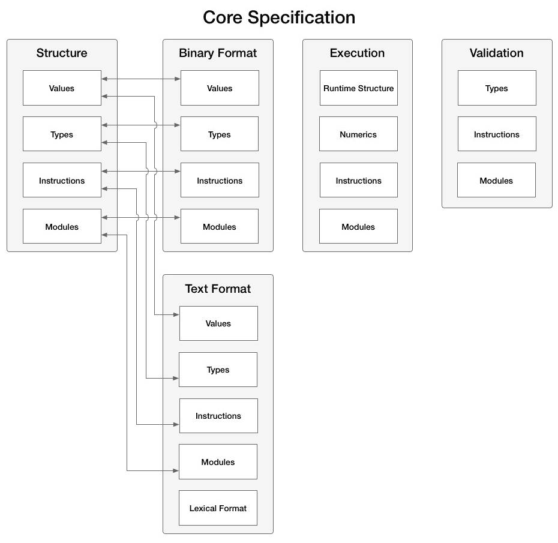
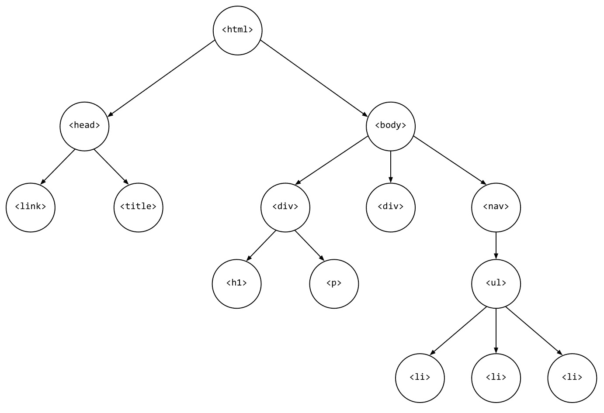
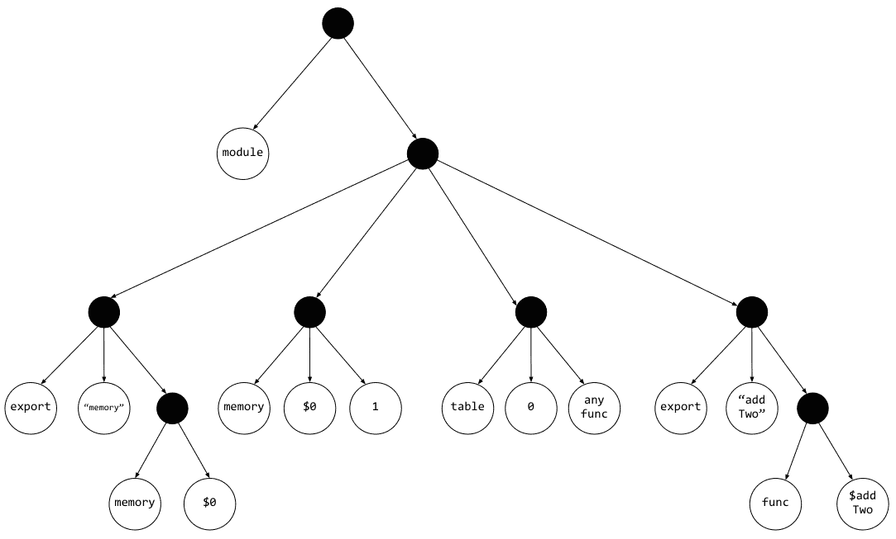
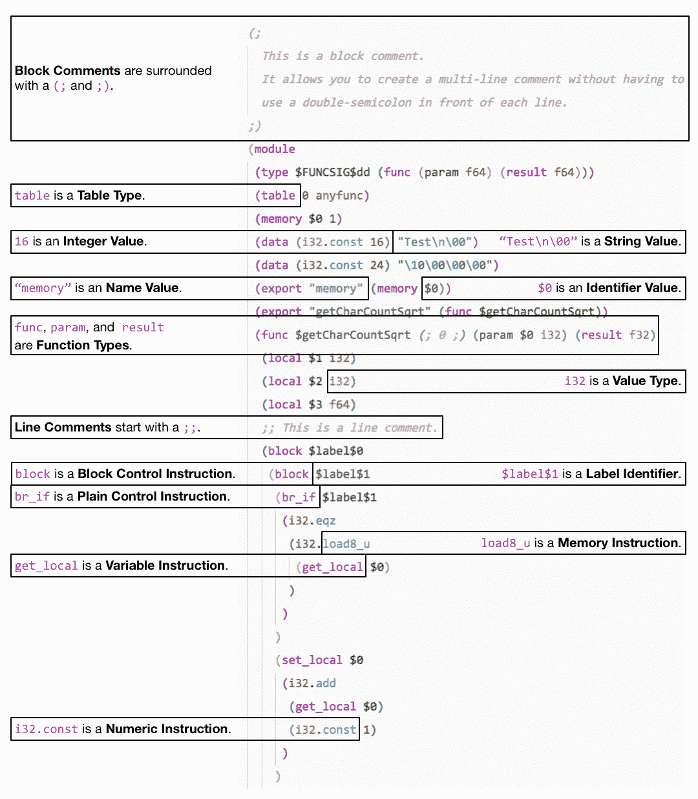
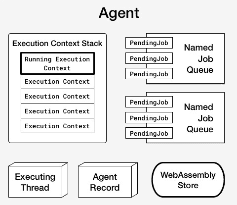
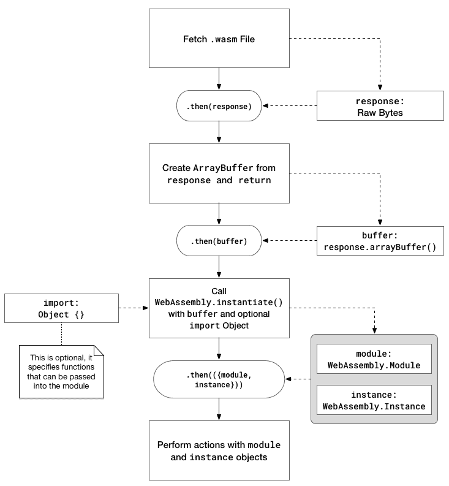
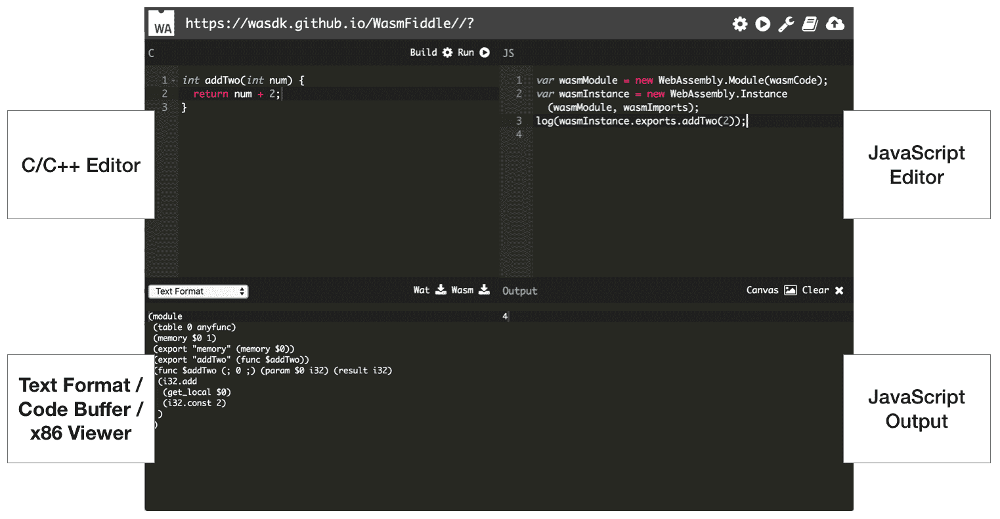
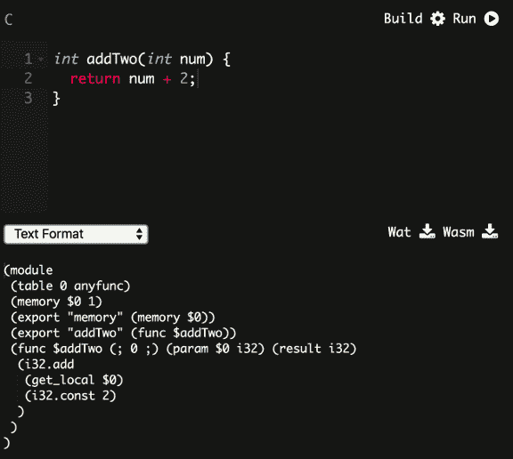
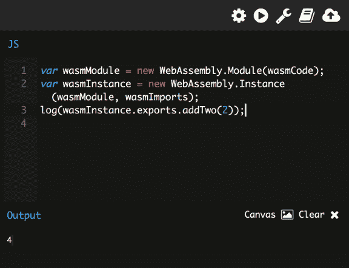

# 第二章：WebAssembly 的元素-Wat、Wasm 和 JavaScript API

第一章《什么是 WebAssembly？》描述了 WebAssembly 的历史，并提供了技术的高层概述以及潜在的用例和限制。WebAssembly 被描述为由多个元素组成，不仅仅是官方定义中指定的二进制指令格式。

在本章中，我们将深入研究与 WebAssembly 工作组创建的官方规范相对应的元素。我们将更详细地检查 Wat 和二进制格式，以更好地理解它们与模块的关系。我们将审查*JavaScript API*和*Web API*，以确保您能够有效地在浏览器中使用 WebAssembly。

本章的目标是理解以下内容：

+   文本和二进制格式之间的关系

+   Wat 是什么以及它在开发过程中的作用

+   二进制格式和模块（Wasm）文件

+   JavaScript 和 Web API 的组件以及它们与 Wasm 模块的关系

+   如何利用 WasmFiddle 评估 WebAssembly 的阶段（C/C++ > Wat > Wasm）

# 共同结构和抽象语法

在第一章中，《什么是 WebAssembly？》，我们讨论了 WebAssembly 的二进制和文本格式如何映射到抽象语法的共同结构。在深入了解这些格式之前，值得一提的是它们在*核心规范*中的关系。以下图表是目录的可视化表示（为了清晰起见，排除了一些部分）：

*核心规范*目录

正如您所看到的，**文本格式**和**二进制格式**部分包含与**结构**部分相关的**值**、**类型**、**指令**和**模块**的子部分。因此，我们在下一节中涵盖的许多内容与二进制格式有直接的对应关系。考虑到这一点，让我们深入了解文本格式。

# Wat

*文本格式*部分提供了对常见语言概念（如值、类型和指令）的技术描述。如果您打算为 WebAssembly 构建工具，这些都是重要的概念，但如果您只打算在应用程序中使用它，则不是必需的。话虽如此，文本格式是 WebAssembly 的重要部分，因此有一些概念您应该了解。在本节中，我们将深入了解文本格式的一些细节，并从*核心规范*中突出重点。

# 定义和 S 表达式

要理解 Wat，让我们从直接从 WebAssembly *核心规范*中提取的描述的第一句开始：

"WebAssembly 模块的文本格式是它们的抽象语法渲染成 S 表达式。"

那么什么是**符号表达式**（**S 表达式**）？S 表达式是嵌套列表（树形结构）数据的表示。基本上，它们提供了一种在文本形式中表示基于列表的数据的简单而优雅的方式。要理解文本表示的嵌套列表如何映射到树形结构，让我们从 HTML 页面中推断树形结构。以下示例包含一个简单的 HTML 页面和相应的树形结构图。

一个简单的 HTML 页面：

```cpp
<html>
<head>
  <link rel="icon" href="favicon.ico">
  <title>Page Title</title>
</head>
<body>
  <div>
    <h1>Header</h1>
    <p>This is a paragraph.</p>
  </div>
  <div>Some content</div>
  <nav>
    <ul>
      <li>Item 1</li>
      <li>Item 2</li>
      <li>Item 3</li>
    </ul>
  </nav>
</body>
</html>
```

相应的树形结构是：



HTML 页面的树形结构图

即使你以前从未见过树形结构，也很容易看出 HTML 如何在结构和层次结构方面映射到树形结构。映射 HTML 元素相对简单，因为它是一种具有明确定义标签且没有实际逻辑的标记语言。

Wat 表示可以具有多个具有不同参数的函数的模块。为了演示源代码、Wat 和相应的树结构之间的关系，让我们从一个简单的 C 函数开始，该函数将 2 添加到作为参数传入的数字中：

这是一个将`2`添加到传入的`num`参数并返回结果的 C 函数：

```cpp
int addTwo(int num) {
    return num + 2;
}
```

将`addTwo`函数转换为有效的 Wat 会产生以下结果：

```cpp
(module
  (table 0 anyfunc)
  (memory $0 1)
  (export "memory" (memory $0))
  (export "addTwo" (func $addTwo))
  (func $addTwo (; 0 ;) (param $0 i32) (result i32)
    (i32.add
      (get_local $0)
      (i32.const 2)
    )
  )
)
```

在第一章中，*什么是 WebAssembly？*，我们谈到了与*核心规范*相关的语言概念（*函数*、*线性内存*、*表*等）。在该规范中，*结构*部分在抽象语法的上下文中定义了每个这些概念。规范的*文本格式*部分也与这些概念对应，您可以在前面的片段中通过它们的关键字来定义它们（`func`、`memory`、`table`）。

树结构：



Wat 的树结构图

整个树太大，无法放在一页上，因此此图表仅限于 Wat 源文本的前五行。每个填充的点代表一个列表节点（或一组括号的内容）。正如您所看到的，用 s 表达式编写的代码可以以树结构清晰简洁地表达，这就是为什么 s 表达式被选择为 WebAssembly 的文本格式的原因。

# 值、类型和指令

尽管详细覆盖*核心规范*的*文本格式*部分超出了本文的范围，但值得演示一些语言概念如何映射到相应的 Wat。以下图表演示了这些映射在一个样本 Wat 片段中。这是从 C 代码编译而来的，表示一个以单词作为参数并返回字符数的平方根的函数：



具有语言概念细节的 Wat 示例

如果您打算编写或编辑 Wat，请注意它支持块和行注释。指令被分成块，并包括设置和获取与有效类型相关联的变量的内存。您可以使用`if`语句控制逻辑流，并且使用`loop`关键字支持循环。

# 在开发过程中的作用

文本格式允许以文本形式表示二进制 Wasm 模块。这对于开发和调试的便利性有一些深远的影响。拥有 WebAssembly 模块的文本表示允许开发人员在浏览器中查看加载模块的源代码，从而消除了抑制 NaCl 采用的黑匣子问题。它还允许围绕故障排除模块构建工具。官方网站描述了驱动文本格式设计的用例：

• 在 WebAssembly 模块上查看源代码，从而自然地适应 Web（其中可以查看每个源代码）。

• 在没有源映射的情况下，在浏览器开发工具中呈现（这在最小可行产品（MVP）的情况下是必然的）。

• 直接编写 WebAssembly 代码的原因包括教学、实验、调试、优化和测试规范本身。

列表中的最后一项反映了文本格式并不打算在正常开发过程中手动编写，而是从诸如 Emscripten 之类的工具生成。在生成模块时，您可能不会看到或操作任何`.wat`文件，但在调试上下文中可能会查看它们。

文本格式不仅在调试方面有价值，而且具有这种中间格式可以减少对单个编译工具的依赖。目前存在多种不同的工具来消耗和发出这种 s 表达式语法，其中一些工具被 Emscripten 用于将您的代码编译成`.wasm`文件。

# 二进制格式和模块文件（Wasm）

*二进制格式*部分的*核心规范*提供了与*文本格式*部分相同级别的语言概念细节。在本节中，我们将简要介绍二进制格式的一些高级细节，并讨论构成 Wasm 模块的各个部分。

# 定义和模块概述

二进制格式被定义为抽象语法的密集线性编码。不要过于技术化，这基本上意味着它是一种高效的二进制形式，可以快速解码，文件大小小，内存使用减少。二进制格式的文件表示是`.wasm`文件，这将是 Emscripten 的编译输出，我们将用于示例。

*值*、*类型*和*指令*子部分在二进制格式的*核心规范*中与*文本格式*部分直接相关。每个概念都在编码的上下文中进行了介绍。例如，根据规范，整数类型使用 LEB128 可变长度整数编码进行编码，可以是无符号或有符号变体。如果您希望为 WebAssembly 开发工具，这些都是重要的细节，但如果您只打算在网站上使用它，则不是必需的。

*结构*、*二进制格式*和*文本格式*（wat）部分的*核心规范*都有一个*模块*子部分。我们在上一节中没有涵盖模块的方面，因为在二进制的上下文中描述它们更为谨慎。官方的 WebAssembly 网站为模块提供了以下描述：

"WebAssembly 中的可分发、可加载和可执行的代码单元称为**模块**。在运行时，可以使用一组导入值对模块进行**实例化**，以产生一个**实例**，它是一个不可变的元组，引用了运行模块可访问的所有状态。"

我们将在本章后面讨论如何使用 JavaScript 和 Web API 与模块进行交互，因此让我们建立一些上下文，以了解模块元素如何映射到 API 方法。

# 模块部分

一个模块由几个部分组成，其中一些您将通过 JavaScript API 进行交互：

+   导入（`import`）是可以在模块内访问的元素，可以是以下之一：

+   函数，可以在模块内使用`call`运算符调用

+   全局变量，可以通过`global`运算符在模块内访问

+   线性内存，可以通过`memory`运算符在模块内访问

+   表，可以通过`call_indirect`在模块内访问

+   导出（`export`）是可以由消费 API（即由 JavaScript 函数调用）访问的元素

+   模块启动函数（`start`）在模块实例初始化后调用

+   全局（`global`）包含全局变量的内部定义

+   线性内存（`memory`）包含具有初始内存大小和可选最大大小的线性内存的内部定义

+   数据（`data`）包含数据段数组，指定给定内存的固定范围的初始内容

+   表（`table`）是一个线性内存，其元素是特定表元素类型的不透明值：

+   在 MVP 中，其主要目的是在 C/C++中实现间接函数调用

+   元素（`elements`）是一个允许模块使用任何其他模块中的任何导入或内部定义表的元素进行初始化的部分

+   函数和代码：

+   函数部分声明了模块中定义的每个内部函数的签名

+   代码部分包含由函数部分声明的每个函数的函数体

一些关键字（`import`，`export`等）可能看起来很熟悉；它们出现在前一节的 Wat 文件的内容中。WebAssembly 的组件遵循一个直接对应 API 的逻辑映射（例如，您将`memory`和`table`实例传递给 JavaScript 的`WebAssembly.instantiate()`函数）。您与二进制格式的模块的主要交互将通过这些 API 进行。

# JavaScript 和 Web API

除了*WebAssembly 核心规范*之外，还有两个用于与 WebAssembly 模块交互的 API 规范：*WebAssembly JavaScript 接口*（JavaScript API）和*WebAssembly Web API*。在前面的章节中，我们涵盖了*核心规范*的相关方面，以便熟悉基础技术。如果您从未阅读过*核心规范*（或者跳过了本章的前几节），这并不会阻碍您在应用程序中使用 WebAssembly。但对于 API 来说情况并非如此，因为它们描述了实例化和与编译后的 Wasm 模块交互所需的方法和接口。在本节中，我们将回顾 Web 和 JavaScript API，并描述如何使用 JavaScript 加载和与 Wasm 模块进行通信。

# WebAssembly 存储和对象缓存

在深入讨论交互之前，让我们讨论 JavaScript 和 WebAssembly 在执行上下文中的关系。*核心规范*在*执行*部分包含了以下描述：

"在实例化模块或调用结果模块实例上的导出函数时，将执行 WebAssembly 代码。

执行行为是根据模拟程序状态的抽象机器来定义的。它包括一个堆栈，记录操作数值和控制结构，以及包含全局状态的抽象存储。"

在幕后，JavaScript 使用称为**代理**的东西来管理执行。定义中提到的*存储*包含在代理中。以下图表代表了一个 JavaScript 代理：



JavaScript 代理元素

存储表示抽象机器的状态。WebAssembly 操作接受存储并返回更新后的存储。每个代理都与将 JavaScript 对象映射到 WebAssembly 地址的缓存相关联。那么这为什么重要呢？它代表了 WebAssembly 模块与 JavaScript 之间交互的基本方法。JavaScript 对象对应于*JavaScript API*中的 WebAssembly 命名空间。考虑到这一点，让我们深入了解接口。

# 加载模块和 WebAssembly 命名空间方法

*JavaScript API*涵盖了浏览器中全局`WebAssembly`对象上可用的各种对象。在讨论这些对象之前，我们将从`WebAssembly`对象上可用的方法开始，简要概述它们的预期目的：

+   `instantiate()`是用于编译和实例化 WebAssembly 代码的主要 API

+   `instantiateStreaming()`执行与`instantiate()`相同的功能，但它使用流式处理来编译和实例化模块，从而消除了一个中间步骤

+   `compile()`只编译 WebAssembly 模块，但不实例化它

+   `compileStreaming()`也只编译 WebAssembly 模块，但它使用类似于`instantiateStreaming()`的流式处理

+   `validate()`检查 WebAssembly 二进制代码以确保字节有效，并在有效时返回 true，无效时返回 false

`instantiateStreaming()`和`compileStreaming()`方法目前仅存在于*Web API*中。事实上，这两种方法构成了整个规范。`WebAssembly`对象上可用的方法主要用于编译和实例化模块。考虑到这一点，让我们讨论如何获取和实例化一个 Wasm 模块。

当您执行一个 fetch 调用来获取一个模块时，它会返回一个 Promise，该 Promise 解析为该模块的原始字节，这些字节需要加载到一个`ArrayBuffer`中并进行实例化。从现在开始，我们将把这个过程称为加载模块。

以下图表展示了这个过程：



获取和加载 WebAssembly 模块

使用 Promises 实际上非常简单。以下代码演示了如何加载一个模块。`importObj`参数传递任何数据或函数给 Wasm 模块。您现在可以忽略它，因为我们将在第五章中更详细地讨论它，*创建和加载 WebAssembly 模块*：

```cpp
fetch('example.wasm')
  .then(response => response.arrayBuffer())
  .then(buffer => WebAssembly.instantiate(buffer, importObj))
  .then(({ module, instance }) => {
    // Do something with module or instance
  });
```

上面的示例规定了使用`instantiate()`方法加载模块的方法。`instantiateStreaming()`方法有些不同，并通过一步完成获取、编译和实例化模块来简化这个过程。以下代码使用这种方法实现了相同的目标（加载模块）：

```cpp
WebAssembly.instantiateStreaming(fetch('example.wasm'), importObj)
  .then(({ module, instance }) => {
    // Do something with module or instance
  });
```

实例化方法返回一个 Promise，该 Promise 解析为一个包含编译的`WebAssembly.Module`（`module`）和`WebAssembly.Instance`（`instance`）的对象，这两者将在本节后面进行详细介绍。在大多数情况下，您将使用其中一种方法在您的站点上加载 Wasm 模块。实例包含了所有可以从 JavaScript 代码调用的导出的 WebAssembly 函数。

`compile()`和`compileStreaming()`方法返回一个 Promise，该 Promise 只解析为一个编译的`WebAssembly.Module`。如果您想要在以后编译一个模块并实例化它，这将非常有用。**Mozilla 开发者网络**（**MDN**），由 Mozilla 管理的 Web 文档站点，提供了一个示例，其中编译的模块被传递给了一个 Web Worker。

就`validate()`方法而言，它的唯一目的是测试作为参数传入的类型数组或`ArrayBuffer`是否有效。这将在响应的原始字节加载到`ArrayBuffer`后调用。这个方法没有包含在代码示例中，因为尝试实例化或编译无效的 Wasm 模块将抛出`TypeError`或`WebAssembly`对象上存在的`Error`对象之一。我们将在本节后面介绍这些`Error`对象。

# WebAssembly 对象

除了在*加载模块和 WebAssembly 命名空间方法*部分介绍的方法之外，全局`WebAssembly`对象还有子对象，用于与和排查 WebAssembly 交互。这些对象直接对应我们在 WebAssembly 二进制和文本格式部分讨论的概念。以下列表包含了这些对象以及它们的定义，这些定义来自 MDN：

+   `WebAssembly.Module`对象包含了已经被浏览器编译的无状态 WebAssembly 代码，可以有效地与 worker 共享，缓存在`IndexedDB`中，并且可以被多次实例化

+   `WebAssembly.Instance`对象是`WebAssembly.Module`的一个有状态的可执行实例，其中包含了所有导出的 WebAssembly 函数，允许从 JavaScript 调用 WebAssembly 代码

+   `WebAssembly.Memory`，在使用构造函数调用时，创建一个新的`Memory`对象，它是一个可调整大小的`ArrayBuffer`，保存着被 WebAssembly `Instance`访问的内存的原始字节

+   `WebAssembly.Table`，在使用构造函数调用时，创建一个给定大小和元素类型的新`Table`对象，表示一个 WebAssembly `Table`（存储函数引用）

+   `WebAssembly.CompileError`在使用构造函数调用时，创建一个错误，指示在 WebAssembly 解码或验证过程中发生了问题

+   `WebAssembly.LinkError`在使用构造函数调用时，创建一个错误，指示在模块实例化过程中发生了问题

+   `WebAssembly.RuntimeError`在调用构造函数时创建一个错误，指示 WebAssembly 指定了一个陷阱（例如，发生了堆栈溢出）。

让我们分别深入研究每一个，从`WebAssembly.Module`对象开始。

# WebAssembly.Module

`WebAssembly.Module`对象是`ArrayBuffer`和实例化模块之间的中间步骤。`compile()`和`instantiate()`方法（以及它们的流式处理对应方法）返回一个解析为模块的 Promise（小写的 module 表示已编译的`Module`）。一个模块也可以通过直接将类型化数组或`ArrayBuffer`传递给构造函数来同步创建，但对于大型模块，这是不鼓励的。

`Module`对象还有三个静态方法：`exports()`、`imports()`和`customSections()`。所有三个方法都以模块作为参数，但`customSections()`以表示部分名称的字符串作为其第二个参数。自定义部分在*Core Specification*的*Binary Format*部分中描述，并且旨在用于调试信息或第三方扩展。在大多数情况下，你不需要定义这些。`exports()`函数在你使用一个你没有创建的 Wasm 模块时很有用，尽管你只能看到每个导出的名称和种类（例如，`function`）。

对于简单的用例，你不会直接处理`Module`对象或已编译的模块。大部分交互将在`Instance`中进行。

# WebAssembly.Instance

`WebAssembly.Instance`对象是实例化的 WebAssembly 模块，这意味着你可以从中调用导出的 WebAssembly 函数。调用`instantiate()`或`instantiateStreaming()`会返回一个解析为包含实例的对象的 Promise。你可以通过引用实例的`export`属性上函数的名称来调用 WebAssembly 函数。例如，如果一个模块包含一个名为`sayHello()`的导出函数，你可以使用`instance.exports.sayHello()`来调用该函数。

# WebAssembly.Memory

`WebAssembly.Memory`对象保存了 WebAssembly `Instance`访问的内存。这个内存可以从 JavaScript 和 WebAssembly 中访问和改变。要创建一个新的`Memory`实例，你需要通过`WebAssembly.Memory()`构造函数传递一个带有`initial`和（可选的）`maximum`值的对象。这些值以 WebAssembly 页面为单位，其中一个页面是 64KB。通过调用带有表示要增长的 WebAssembly 页面数量的单个参数的`grow()`函数来增加内存实例的大小。你也可以通过其`buffer`属性访问内存实例中包含的当前缓冲区。

MDN 描述了获取`WebAssembly.Memory`对象的两种方法。第一种方法是从 JavaScript 中构造它（`var memory = new WebAssembly.Memory(...)`），而第二种方法是由 WebAssembly 模块导出它。重要的一点是内存可以在 JavaScript 和 WebAssembly 之间轻松传递。

# WebAssembly.Table

`WebAssembly.Table`对象是一个类似数组的结构，用于存储函数引用。与`WebAssembly.Memory`一样，`Table`可以从 JavaScript 和 WebAssembly 中访问和改变。在撰写时，表只能存储函数引用，但随着技术的发展，很可能还可以存储其他实体。

要创建一个新的`Table`实例，你需要传递一个带有`element`、`initial`和（可选的）`maximum`值的对象。`element`成员是一个表示表中存储的值类型的字符串；目前唯一有效的值是`"anyfunc"`（用于函数）。`initial`和`maximum`值表示 WebAssembly `Table`中的元素数量。

您可以使用`length`属性访问`Table`实例中的元素数量。该实例还包括用于操作和查询表中元素的方法。`get()`方法允许您访问给定索引处的元素，该索引作为参数传递。`set()`方法允许您将第一个参数指定的索引处的元素设置为第二个参数指定的值（根据前面的说明，仅支持函数）。最后，`grow()`允许您增加`Table`实例（元素数量）的大小，增加的数量作为参数传递。

# WebAssembly 错误（CompileError、LinkError、RuntimeError）

JavaScript API 提供了用于创建特定于 WebAssembly 的`Error`对象实例的构造函数，但我们不会花太多时间来介绍这些对象。本节开头的对象定义列表描述了每个错误的性质，如果满足指定条件，则可能引发这些错误。这三个错误都可以使用消息、文件名和行号参数（均为可选）进行构造，并且具有与标准 JavaScript `Error`对象相同的属性和方法。

# 使用 WasmFiddle 连接各个部分

我们在本章中回顾了 WebAssembly 的各个元素以及相应的 JavaScript 和 Web API，但是理解这些元素如何组合在一起仍然可能会令人困惑。随着我们在本书中的示例中的进展，您将能够看到 C/C++、WebAssembly 和 JavaScript 是如何相互交互的，这些概念将变得更加清晰。

话虽如此，演示这种交互可能有助于澄清一些困惑。在本节中，我们将使用一个名为 WasmFiddle 的在线工具来演示这些元素之间的关系，以便您可以看到 WebAssembly 的实际运行情况，并对开发工作流程有一个高层次的概述。

# 什么是 WasmFiddle？

WasmFiddle 位于[`wasdk.github.io/WasmFiddle/`](https://wasdk.github.io/WasmFiddle/)，是一个在线代码编辑工具，允许您编写一些 C 或 C++代码并将其转换为 Wat，编译为 Wasm，或者直接使用 JavaScript 进行交互。C/C++和 JavaScript 编辑器都很简单，不打算用作您的主要开发环境，但它在 Wasm 编译器中提供了有价值的服务。在第三章 *设置开发环境*中，您将发现从零开始生成 Wasm 文件需要一些工作——能够将您的 C 代码粘贴到浏览器中并点击几个按钮会使事情变得更加方便。以下图表快速概述了界面：



WasmFiddle 用户界面的组件

如您所见，界面相对简单。让我们尝试一些代码！

# C 代码转换为 Wat

以下屏幕截图中左上角的窗格包含一个简单的 C 函数，该函数将 2 添加到指定为参数的数字。左下角的窗格包含相应的 Wat：



C 函数和相应的 Wat

如果这看起来很熟悉，那是因为相同的代码在本章开头对 Wat 的 s 表达式进行了解释时使用过。深入挖掘一下，您可以看到 C 代码如何对应于 Wat 输出。`addTwo()`函数作为字符串从模块中导出，位于第`5`行。第`5`行还包含`(func $addTwo)`，它引用了第`6`行上的`$addTwo`函数。第`6`行指定可以传入一个`i32`类型（整数）的单个参数，并且返回的结果也是`i32`。在左上角（或 C/C++编辑器上方）按下“Build”按钮将把 C 代码编译成 Wasm 文件。一旦构建完成，Wasm 将可以供下载或与 JavaScript 进行交互。

# Wasm 到 JavaScript

以下屏幕截图中的右上方窗格包含一些 JavaScript 代码，用于编译在上一步生成的 Wasm。`wasmCode`是在构建完成时生成的，因此应该自动可用。WasmFiddle 不使用`instantiate()`方法，而是创建一个编译后的`WebAssembly.Module`实例，并将其传递给新的`WebAssembly.Instance`的构造函数。`wasmImports`对象目前为空，但如果需要，我们可以传入`WebAssembly.Memory`和`WebAssembly.Table`实例：



JavaScript 代码调用从编译后的 Wasm 模块中的 C 函数

JavaScript 的最后一行将`addTwo()`的结果打印到右下窗格中，当传入数字`2`时。`log()`方法是一个自定义函数，确保输出打印到右下窗格（数字`4`）。请注意 JavaScript 代码如何与`wasmInstance`交互。`addTwo()`函数是从实例的`exports`对象中调用的。尽管这是一个人为的例子，但它演示了 C 或 C++代码在被 JavaScript 用作 Wasm 模块之前经历的步骤。

# 总结

在本章中，我们讨论了 WebAssembly 的元素及其关系。 *核心规范*的结构被用来描述文本和二进制格式到一个共同的抽象语法的映射。我们强调了文本格式（Wat）在调试和开发环境中的有用性，以及为什么 s 表达式非常适合抽象语法的文本表示。我们还回顾了有关二进制格式和构成模块的各种元素的细节。在 JavaScript 和 Web API 中定义了方法和对象，并描述了它们在 WebAssembly 交互中的作用。最后，使用 WasmFiddle 工具演示了源代码、Wat 和 JavaScript 之间的关系的简单示例。

在第三章中，*设置开发环境*，我们将安装开发工具，以便有效地使用 WebAssembly 进行工作。

# 问题

1.  s 表达式擅长表示什么类型的数据？

1.  二进制和文本格式之间共享的四个语言概念是什么？

1.  文本格式的一个用例是什么？

1.  可以存储在 WebAssembly `Table`中的唯一元素类型是什么？

1.  JavaScript 引擎使用什么来管理执行？

1.  哪种方法需要更少的代码来实例化一个模块，`instantiate()`还是`instantiateStreaming()`？

1.  `WebAssembly` JavaScript 对象上有哪些错误对象，以及是什么事件导致了每一个错误对象？

# 进一步阅读

+   MDN 上的 WebAssembly：[`developer.mozilla.org/en-US/docs/WebAssembly`](https://developer.mozilla.org/en-US/docs/WebAssembly)

+   WasmFiddle：[`wasdk.github.io/WasmFiddle`](https://wasdk.github.io/WasmFiddle)

+   维基百科上的 s 表达式：[`en.wikipedia.org/wiki/S-expression`](https://en.wikipedia.org/wiki/S-expression)

+   树的示例：[`interactivepython.org/runestone/static/pythonds/Trees/ExamplesofTrees.html`](http://interactivepython.org/runestone/static/pythonds/Trees/ExamplesofTrees.html)
