# 设置开发环境

现在您熟悉了 WebAssembly 的元素，是时候设置一个合适的开发环境了。使用 WebAssembly 进行开发等同于使用 C 或 C++进行开发。区别在于构建过程和输出。在本章中，我们将介绍开发工具，并讨论如何在您的系统上安装和配置它们。

本章的目标是了解以下内容：

+   如何安装所需的开发工具（Git、Node.js 和 Visual Studio Code）

+   如何配置 Visual Studio Code 以便使用 C/C++和 WebAssembly 扩展

+   如何设置本地 HTTP 服务器来提供 HTML、JavaScript 和`.wasm`文件

+   检查浏览器是否支持 WebAssembly

+   有哪些有用的工具可以简化和改进开发过程

# 安装开发工具

您需要安装一些应用程序和工具来开始开发 WebAssembly。我们将使用文本编辑器 Visual Studio Code 来编写我们的 C/C++、JavaScript、HTML 和 Wat。我们还将使用 Node.js 来提供文件和 Git 来管理我们的代码。我们将使用软件包管理器来安装这些工具，这使得安装过程比手动下载和安装要简单得多。在本节中，我们将涵盖操作系统，以及每个平台的软件包管理器。我们还将简要介绍每个应用程序在开发过程中的作用。

# 操作系统和硬件

为了确保安装和配置过程顺利进行，重要的是要了解我在本书中使用的操作系统。如果遇到问题，可能是由于您使用的平台与我使用的平台不兼容。在大多数情况下，您不应该遇到问题。为了排除操作系统版本可能导致的问题，我提供了我在下面列表中使用的操作系统的详细信息：

# macOS

+   High Sierra，版本 10.13.x

+   2.2 GHz 英特尔 i7 处理器

+   16 GB 的 RAM

# Ubuntu

+   在 VMware Fusion 中运行的 Ubuntu 16.04 LTS

+   2.2 GHz 英特尔 i7 处理器

+   4 GB 的 RAM

# Windows

+   Windows 10 Pro 在 VMware Fusion 中运行

+   2.2 GHz 英特尔 i7 处理器

+   8 GB 的 RAM

# 软件包管理器

软件包管理器是简化软件安装过程的工具。它们允许我们在命令行中升级、配置、卸载和搜索可用软件，而无需访问网站下载和运行安装程序。它们还简化了具有多个依赖项或需要在使用前手动配置的软件的安装过程。在本节中，我将介绍每个平台的软件包管理器。

# macOS 的 Homebrew

Homebrew 是 macOS 的一个优秀的软件包管理器，它允许我们直接安装大多数我们将使用的工具。Homebrew 就像在终端中粘贴以下命令并运行它一样简单：

```cpp
/usr/bin/ruby -e "$(curl -fsSL https://raw.githubusercontent.com/Homebrew/install/master/install)"
```

您将在终端中看到一些消息，指导您完成安装过程。完成后，您需要安装一个名为**Homebrew-Cask**的 Homebrew 扩展，它允许您安装 macOS 应用程序，而无需下载安装程序，挂载它，并将应用程序拖入`Applications`文件夹。您可以通过运行以下命令来安装：

```cpp
brew tap caskroom/cask
```

就是这样！现在你可以通过运行以下任一命令来安装应用程序：

```cpp
# For command line tools: brew install <Tool Name> 
# For desktop applications:
brew cask install <Application Name>
```

# Ubuntu 的 Apt

Apt 是 Ubuntu 提供的软件包管理器；无需安装。它允许您直接安装命令行工具和应用程序。如果 Apt 的存储库中没有某个应用程序，您可以使用以下命令添加存储库：

```cpp
add-apt-repository 
```

# Windows 的 Chocolatey

Chocolatey 是 Windows 的软件包管理器。它类似于 Apt，可以让您安装命令行工具和应用程序。要安装 Chocolatey，您需要以管理员身份运行命令提示符（`cmd.exe`）。您可以通过按下开始菜单按钮，输入 cmd，右键单击命令提示符应用程序并选择以管理员身份运行来实现这一点：

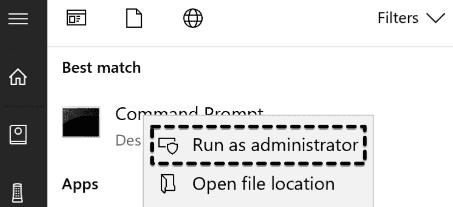

以管理员身份运行命令提示符

然后运行以下命令：

```cpp
@"%SystemRoot%\System32\WindowsPowerShell\v1.0\powershell.exe" -NoProfile -InputFormat None -ExecutionPolicy Bypass -Command "iex ((New-Object System.Net.WebClient).DownloadString('https://chocolatey.org/install.ps1'))" &amp;&amp; SET "PATH=%PATH%;%ALLUSERSPROFILE%\chocolatey\bin"
```

获取命令文本的最简单方法是通过 Chocolatey 的安装页面[`chocolatey.org/install`](https://chocolatey.org/install)。在*使用 cmd.exe 安装*部分下有一个按钮可以将文本复制到剪贴板上。您也可以按照安装页面上的步骤使用 PowerShell 来安装应用程序。

# Git

Git 是一个**版本控制系统**（**VCS**），它允许您跟踪文件的更改并在多个开发人员共同贡献到同一代码库的工作之间进行管理。Git 是 GitHub 和 GitLab 的 VCS 引擎，并且也可在 Bitbucket 上使用（它们还提供 Mercurial，这是另一个 VCS）。Git 将允许我们从 GitHub 克隆存储库，并且是下一章中将要介绍的 EMS DK 的先决条件。在本节中，我们将介绍 Git 的安装过程。

# 在 macOS 上安装 Git

如果您使用的是 macOS，Git 可能已经可用。macOS 自带了 Apple Git，可能会比最新版本落后几个版本。对于本书的目的，您已经安装的版本应该足够了。如果您希望升级，可以通过在终端中运行以下命令来安装最新版本的 Git：

```cpp
# Install Git to the Homebrew installation folder (/usr/local/bin/git):
brew install git

# Ensure the default Git is pointing to the Homebrew installation:
sudo mv /usr/bin/git /usr/bin/git-apple
```

如果运行此命令，您应该会看到`/usr/local/bin/git`：

```cpp
which git
```

您可以通过运行以下命令来检查安装是否成功：

```cpp
git --version
```

# 在 Ubuntu 上安装 Git

您可以使用`apt`来安装 Git；只需在终端中运行以下命令：

```cpp
sudo apt install git
```

您可以通过运行以下命令来检查安装是否成功：

```cpp
git --version
```

# 在 Windows 上安装 Git

您可以使用 Chocolatey 来安装 Git。打开命令提示符或 PowerShell 并运行以下命令：

```cpp
choco install git
```

您可以通过运行以下命令来检查安装是否成功：

```cpp
git --version
```

您可以通过在安装命令的末尾添加`-y`来绕过确认消息（例如，`choco install git -y`）。您还可以选择始终跳过确认，方法是输入

**`choco feature enable -n allowGlobalConfirmation`** 命令。

# Node.js

Node.js 的官方网站将其描述为一个异步事件驱动的 JavaScript 运行时。Node 旨在构建可扩展的网络应用程序。我们将在本书中使用它来提供我们的文件并在浏览器中处理它们。Node.js 捆绑了`npm`，这是 JavaScript 的软件包管理器，它将允许我们全局安装软件包并通过命令行访问它们。在本节中，我们将介绍使用**Node 版本管理器**（**nvm**）在每个平台上的安装过程。

# nvm

我们将使用 Node.js 的**长期稳定**（**LTS**）版本（版本 8）来确保我们使用平台的最稳定版本。我们将使用`nvm`来管理 Node.js 版本。这将防止冲突，如果您已经在计算机上安装了更高（或更低）版本的 Node.js。`nvm`允许您安装多个 Node.js 版本，并可以快速切换到单个终端窗口的上下文中进行隔离。

# 在 macOS 上安装 nvm

在终端中运行以下命令：

```cpp
brew install nvm
```

按照 Homebrew 指定的后续安装步骤确保您可以开始使用它（您可能需要重新启动终端会话）。如果在执行步骤之前清除了终端内容，您可以运行此命令再次查看安装步骤：

```cpp
brew info nvm
```

您可以通过运行以下命令来检查安装是否成功：

```cpp
nvm --version
```

# 在 Ubuntu 上安装 nvm

Ubuntu 捆绑了`wget`，它可以使用 HTTP/S 和 FTP/S 协议检索文件。`nvm`的 GitHub 页面（[`github.com/creationix/nvm`](https://github.com/creationix/nvm)）包含使用`wget`安装它的以下命令：

```cpp
wget -qO- https://raw.githubusercontent.com/creationix/nvm/v0.33.11/install.sh | bash
```

安装完成后，重新启动终端以完成安装。您可以通过运行以下命令来检查安装是否成功：

```cpp
nvm --version
```

# 在 Windows 上安装 nvm

`nvm`目前不支持 Windows，因此您实际上正在安装一个名为`nvm`-windows 的不同应用程序。`nvm`-windows 的 GitHub 页面位于[`github.com/coreybutler/nvm-windows`](https://github.com/coreybutler/nvm-windows)。一些命令略有不同，但我们运行的安装命令将是相同的。要安装`nvm`-windows，请打开命令提示符或 PowerShell 并运行此命令：

```cpp
choco install nvm
```

您可以通过运行以下命令来检查安装是否成功：

```cpp
nvm --version
```

# 使用 nvm 安装 Node.js

安装`nvm`后，您需要安装本书中将使用的 Node.js 版本：版本 8.11.1。要安装它，请运行以下命令：

```cpp
nvm install 8.11.1
```

如果您之前没有安装 Node.js 或`nvm`，它将自动将其设置为默认的 Node.js 安装，因此此命令的输出应为`v8.11.1`：

```cpp
node --version
```

如果您已安装现有的 Node.js 版本，您可以将 v8.11.1 作为默认版本，或者确保在使用本书示例时运行此命令以使用 v8.11.1：

```cpp
nvm use 8.11.1
```

您可以在代码所在的文件夹中创建一个名为`.nvmrc`的文件，并将其填充为`v8.11.1`。您可以在此目录中运行`nvm use`，它将设置版本为`8.11.1`，而无需指定它。

# GNU make 和 rimraf

在`learn-webassembly`存储库中，代码示例使用 GNU Make 和 VS Code 的任务功能（我们将在第五章中介绍）来执行整本书中定义的构建任务。GNU Make 是一个非常好的跨平台工具，用于自动化构建过程。您可以在[`www.gnu.org/software/make`](https://www.gnu.org/software/make)上阅读更多关于 GNU Make 的信息。让我们回顾每个平台的安装步骤。

# macOS 和 Ubuntu 上的 GNU Make

如果您使用的是 macOS 或 Linux，则 GNU `make`应该已经安装。要验证这一点，请在终端中运行以下命令：

```cpp
make -v
```

如果您看到版本信息，您已经准备好了。跳到*安装 rimraf*部分。否则，请按照您的平台的 GNU Make 安装说明进行操作。

# 在 macOS 上安装 GNU Make

要在 macOS 上安装 GNU Make，请从终端运行以下命令：

```cpp
brew install make
```

您可以通过运行以下命令来检查安装是否成功：

```cpp
make -v
```

如果您看到版本信息，请跳到*安装 rimraf*部分。

# 在 Ubuntu 上安装 GNU Make

要在 Ubuntu 上安装 GNU Make，请从终端运行以下命令：

```cpp
sudo apt-get install make
```

您可以通过运行以下命令来检查安装是否成功：

```cpp
make -v
```

如果您看到版本信息，请跳到*安装 rimraf*部分。

# 在 Windows 上安装 GNU make

您可以使用 Chocolatey 在 Windows 上安装 GNU `make`。打开命令提示符或 PowerShell 并运行以下命令：

```cpp
choco install make
```

您可能需要重新启动 CLI 以使用`make`命令。重新启动后，运行以下命令以验证安装：

```cpp
make -v
```

如果您看到版本信息，请继续下一节。如果遇到问题，您可能需要下载并安装[`gnuwin32.sourceforge.net/packages/make.htm`](http://gnuwin32.sourceforge.net/packages/make.htm)上的设置包。

# 安装 rimraf

在 Makefiles 或 VS Code 任务中定义的一些构建步骤会删除文件或目录。根据您的平台和 shell，删除文件或文件夹所需的命令会有所不同。为了解决这个问题，我们将使用`rimraf npm`包（[`www.npmjs.com/package/rimraf`](https://www.npmjs.com/package/rimraf)）。全局安装该包会提供一个`rimraf`命令，该命令可以执行适合操作系统和 shell 的正确删除操作。

要安装`rimraf`，请确保已安装 Node.js，并从 CLI 运行以下命令：

```cpp
npm install -g rimraf
```

为了确保安装成功，请运行以下命令：

```cpp
rimraf --help
```

您应该看到使用说明和一系列命令行标志。让我们继续进行 VS Code 安装。

# VS Code

VS Code 是一个跨平台的文本编辑器，支持多种语言，并拥有丰富的扩展生态系统。集成调试和 Git 支持内置，并且不断添加新功能。我们可以在本书的整个 WebAssembly 开发过程中使用它。在本节中，我们将介绍每个平台的安装步骤：

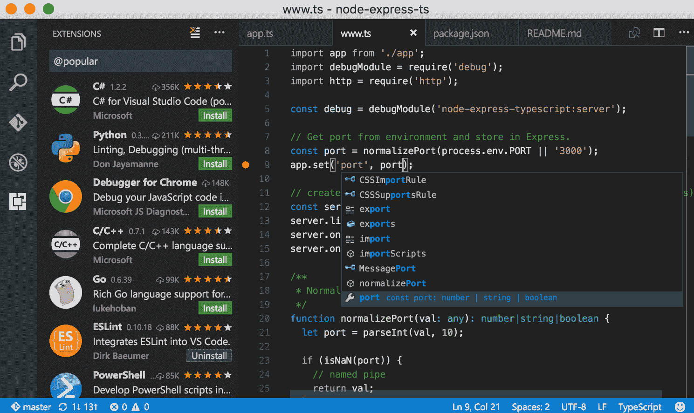

来自 Visual Studio Code 网站的屏幕截图

# 在 macOS 上安装 Visual Studio Code

使用 Homebrew-Cask 安装 VS Code。在终端中运行以下命令进行安装：

```cpp
brew cask install visual-studio-code
```

安装完成后，您应该能够从“应用程序”文件夹或 Launchpad 启动它。

# 在 Ubuntu 上安装 Visual Studio Code

在 Ubuntu 上安装 VS Code 的过程有一些额外的步骤，但仍然相对简单。首先，从 VS Code 的下载页面（[`code.visualstudio.com/Download`](https://code.visualstudio.com/Download)）下载`.deb`文件。下载完成后，运行以下命令完成安装：

```cpp
# Change directories to the Downloads folder
cd ~/Downloads

# Replace <file> with the name of the downloaded file
sudo dpkg -i <file>.deb

# Complete installation
sudo apt-get install -f
```

如果出现缺少依赖项错误，您可以在`sudo dpkg`之前运行以下命令来解决它：

```cpp
sudo apt-get install libgconf-2-4
sudo apt --fix-broken install
```

您现在应该能够从启动器中打开 VS Code 了。

# 在 Windows 上安装 VS Code

您可以使用 Chocolatey 安装 VS Code。从命令提示符或 PowerShell 运行以下命令：

```cpp
choco install visualstudiocode
```

安装后，您可以从“开始”菜单中访问它。

您可以通过在 CLI 中运行`code .`来打开当前工作目录的 VS Code。

# 配置 VS Code

VS Code 是一个功能强大的文本编辑器，具有许多出色的功能。除了高度可配置和可定制之外，它还拥有一个非常丰富的扩展生态系统。我们需要安装其中一些扩展，这样我们就不需要为不同的编程语言使用不同的编辑器。在本节中，我们将介绍如何配置 VS Code 以及安装哪些扩展来简化 WebAssembly 开发过程。

# 管理设置和自定义

自定义和配置 VS Code 非常简单和直观。您可以通过在 macOS 上选择 Code | Preferences | Settings 或在 Windows 上选择 File | Preferences | Settings 来管理自定义设置，如编辑器字体和选项卡大小。用户和工作区设置分别在 JSON 文件中管理，并且在您无法记住设置的确切名称时提供自动完成。您还可以通过在首选项菜单中选择适当的选项来更改主题或键盘快捷键。设置文件也是您可以为安装的任何扩展设置自定义设置的地方。安装扩展时会默认添加一些设置，因此更改它们就像更新和保存此文件一样简单。

# 扩展概述

在配置过程中，我们需要安装一些扩展。在 VS Code 中，有多种方式可以查找和安装扩展。我喜欢点击扩展按钮（编辑器左侧活动栏顶部的第四个按钮），在搜索框中输入我要找的内容，然后点击绿色的安装按钮来安装我想要的扩展。你也可以访问 VS Code Marketplace（[`marketplace.visualstudio.com/vscode`](https://marketplace.visualstudio.com/vscode)），搜索并选择你想要安装的扩展，然后在扩展页面上点击绿色的安装按钮。你也可以通过命令行来管理扩展。更多信息，请访问[`code.visualstudio.com/docs/editor/extension-gallery`](https://code.visualstudio.com/docs/editor/extension-gallery)：

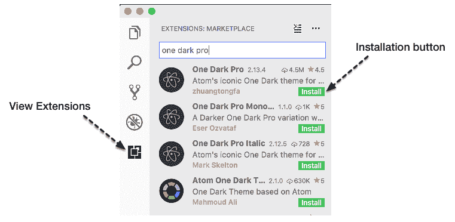

在 VS Code 中安装扩展

# C/C++和 WebAssembly 的配置

VS Code 默认不支持 C 和 C++，但有一个很好的扩展可以让你使用这些语言。它也不支持 WebAssembly 文本格式的语法高亮，但有一个扩展可以添加这个功能。在本节中，我们将介绍*为 VS Code 安装和配置 C/C++*和*WebAssembly Toolkit for VSCode*扩展。

# 为 VS Code 安装 C/C++

VS Code 的 C/C++扩展包括了一些用于编写和调试 C 和 C++代码的功能，比如自动补全、符号搜索、类/方法导航、逐行代码步进等等。要安装这个扩展，可以在扩展中搜索 C/C++并安装由微软创建的名为 C/C++的扩展，或者访问扩展的官方页面[`marketplace.visualstudio.com/items?itemName=ms-vscode.cpptools`](https://marketplace.visualstudio.com/items?itemName=ms-vscode.cpptools)并点击绿色的安装按钮。

安装完成后，你可以通过在 VS Code 的扩展列表中选择扩展并选择*Contributions*标签来查看扩展的配置细节。这个标签包含了各种设置、命令和调试器的详细信息：

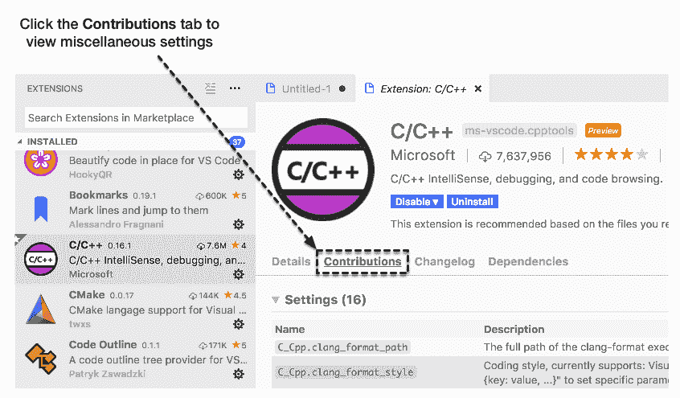

C/C++扩展的*Contributions*标签

# 为 VS Code 配置 C/C++

微软有一个官方页面专门介绍这个扩展，你可以在[`code.visualstudio.com/docs/languages/cpp`](https://code.visualstudio.com/docs/languages/cpp)上查看。这个页面描述了如何通过使用 JSON 文件进行配置等内容。让我们首先创建一个新的配置文件来管理我们的 C/C++环境。你可以通过按下*F1*键，输入 C/C，然后选择 C/Cpp: Edit Configurations…来生成一个新的配置文件：

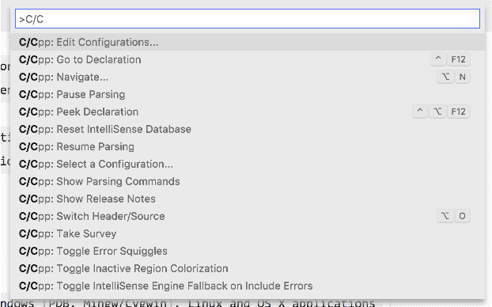

C/C++扩展选项的命令面板

这将在当前项目的`.vscode`文件夹中生成一个新的`c_cpp_properties.json`文件。该文件包含了关于你的 C/C++编译器的配置选项，基于你的平台、要使用的 C 和 C++标准，以及头文件的包含路径。生成后，你可以关闭这个文件。当我们配置 EMSDK 时，我们会再次访问它。

# VSCode 的 WebAssembly 工具包

目前有几种不同的 WebAssembly 扩展可用于 VS Code。我正在使用 VSCode 的 WebAssembly 工具包扩展，因为它允许你右键单击一个`.wasm`文件并选择 Show WebAssembly，这样就可以显示文件的 Wat 表示。你可以通过扩展面板（搜索 WebAssembly）或从 VS Code Marketplace 的官方扩展页面（[`marketplace.visualstudio.com/items?itemName=dtsvet.vscode-wasm`](https://marketplace.visualstudio.com/items?itemName=dtsvet.vscode-wasm)）安装这个扩展：

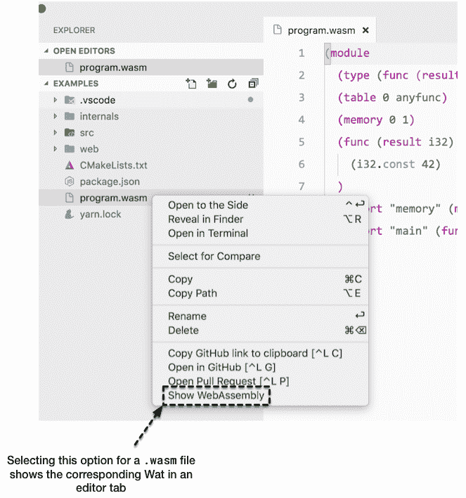

使用 VS Code 扩展的 WebAssembly Toolkit 查看`.wasm`文件的 Wat

安装完成后，您就可以开始了！现在您已经安装了所有必需的扩展，让我们评估一些可简化常见任务的可选扩展。

# 其他有用的扩展

VS Code 有一些很棒的扩展，可以提高效率并自定义界面。在本节中，我将介绍一些我安装的扩展，这些扩展可以简化常见任务以及用户界面/图标主题。您不需要为本书中的示例安装这些扩展，但您可能会发现其中一些有用。

# 自动重命名标签

在处理 HTML 时，此扩展非常有用。如果更改标记类型，它会自动更改关闭标记的名称。例如，如果您有一个`<div>`元素，并且想将其更改为`<span>`，将打开元素的文本更改为`span`将更新关闭元素的文本（`</div>`更改为`</span>`）：

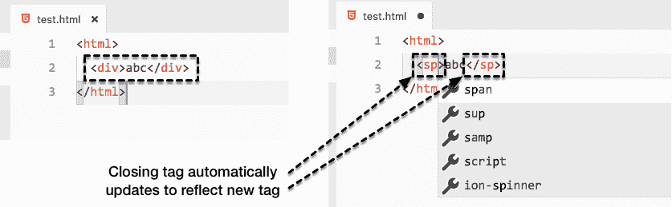

自动重命名标签重命名 HTML 标签

# 括号对颜色器

此扩展为您的代码着色括号，大括号和括号，以便您可以快速识别开放和关闭括号。WebAssembly 的文本格式广泛使用括号，因此能够确定哪些元素包含在哪个列表中，使调试和评估变得更加简单：

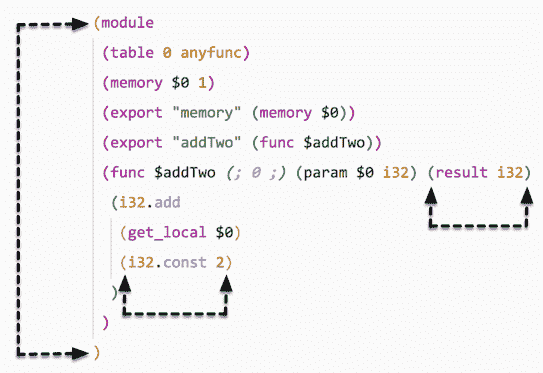

在 Wat 文件中匹配括号的括号对颜色器

# Material Icon 主题和 Atom One Light 主题

在 VS Code Marketplace 上有超过 1,000 个图标和界面主题可用。我在本节中包括 Material Icon 主题和 Atom One Light 主题，因为它们在本书的截图中被使用。Material Icon 主题非常受欢迎，已经有超过 200 万次下载，而 Atom One Light 主题已经有超过 70,000 次下载：

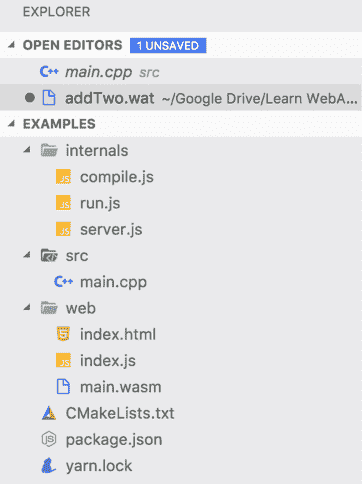

Material Icons 主题中的图标

# 为 Web 设置

与 Wasm 模块交互和调试将在浏览器中进行，这意味着我们需要一种方法来提供包含我们示例文件的文件夹。正如我们在第二章中讨论的那样，*WebAssembly 的元素-Wat，Wasm 和 JavaScript API*，WebAssembly 被集成到浏览器的 JavaScript 引擎中，但您需要确保您使用支持它的浏览器。在本节中，我们将提供克隆书籍示例存储库的说明。我们还将回顾如何快速设置本地 Web 服务器以进行测试和评估浏览器选项，以确保您能够在本地开发。

# 克隆书籍示例存储库

您可能希望现在克隆 GitHub 存储库，其中包含本书中的所有示例。您绝对需要为第七章 *从头开始创建应用程序*克隆代码，因为应用程序的代码库太大，无法放入单个章节中。选择硬盘上的一个文件夹，并运行以下命令来克隆存储库：

```cpp
git clone https://github.com/mikerourke/learn-webassembly
```

克隆过程完成后，您会发现示例按章节组织。如果一个章节中有几个示例，它们将按章节文件夹内的子文件夹进行拆分。

如果您使用 Windows，请不要将存储库克隆到`\Windows`文件夹或任何其他权限受限的文件夹中。否则，在尝试编译示例时，您将遇到问题。

# 安装本地服务器

我们将使用一个`npm`包`serve`来提供文件。要安装，只需运行此命令：

```cpp
npm install -g serve
```

安装完成后，您可以在任何文件夹中提供文件。为了确保它正常工作，让我们尝试提供一个本地文件夹。本节的代码位于`learn-webassembly`存储库的`/chapter-03-dev-env`文件夹中。按照以下说明验证您的服务器安装：

1.  首先，让我们创建一个包含我们将在本书的其余部分中使用的代码示例的文件夹（示例使用名称`book-examples`）。

1.  启动 VS Code，并从菜单栏中选择文件 | 打开...（对于 macOS/Linux），以及文件 | 打开文件夹...（对于 Windows）。

1.  接下来，选择文件夹`book-examples`，然后按打开（或选择文件夹）按钮。

1.  一旦 VS Code 完成加载，右键单击 VS Code 文件资源管理器中的位置，并从菜单中选择新文件夹，命名文件夹为`chapter-03-dev-env`。

1.  选择`chapter-03-dev-env`文件夹，然后按新建文件按钮（或*Cmd*/*Ctrl* + *N*）创建一个新文件。将文件命名为`index.html`，并填充以下内容：

```cpp
<!doctype html>
<html lang="en-us">
  <title>Test Server</title>
</head>
<body>
  <h1>Test</h1>
  <div>
    This is some text on the main page. Click <a href="stuff.html">here</a>
    to check out the stuff page.
  </div>
</body>
</html>
```

1.  在`chapter-03-dev-env`文件夹中创建另一个名为`stuff.html`的文件，并填充以下内容：

```cpp
<!doctype html>
<html lang="en-us">
<head>
  <title>Test Server</title>
</head>
<body>
  <h1>Stuff</h1>
  <div>
    This is some text on the stuff page. Click <a href="index.html">here</a>
    to go back to the index page.
  </div>
</body>
</html>
```

1.  我们将使用 VS Code 的集成终端来提供文件。您可以通过选择 View | Integrated Terminal 来访问此功能，或者使用键盘快捷键*Ctrl* + *`*（*`*是*Esc*键下的反引号键）。加载后，运行此命令来提供工作文件夹：

```cpp
serve -l 8080 chapter-03-dev-env
```

您应该看到以下内容：

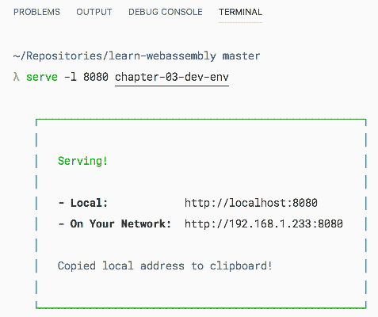

在终端中运行 serve 命令的结果

`-l 8080`标志告诉`serve`在端口`8080`上提供文件。第一个链接（`http://127.0.0.1:8080`）只能在您的计算机上访问。下面的任何链接都可以用来从本地网络上的另一台计算机访问页面。如果您在浏览器中导航到第一个链接（`http://127.0.0.1:8080/index.html`），您应该会看到这个：

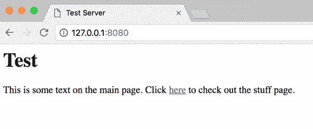

在 Google Chrome 中提供的测试页面

单击此处链接应该将您带到 Stuff 页面（地址栏将显示`127.0.0.1:8080/stuff.html`）。如果一切正常，现在是验证您的浏览器的时候了。

# 验证您的浏览器

为了确保您能够在浏览器中测试示例，您需要确保全局存在`WebAssembly`对象。为了防止与浏览器兼容性相关的任何问题，我建议您安装 Google Chrome 或 Mozilla Firefox 进行开发。如果您之前安装了这两个浏览器中的任何一个，那么您的浏览器很有可能已经是有效的。为了做到全面，我们仍将介绍验证过程。在本节中，我将回顾您可以采取的步骤，以确保您的浏览器支持 WebAssembly。

# 验证 Google Chrome

验证 Chrome 的过程非常简单。选择看起来像三个垂直点的按钮（在地址栏旁边），然后选择**更多工具** | **开发者工具**，或者使用键盘快捷键*Cmd*/*Ctrl* + *Shift* + *I*：

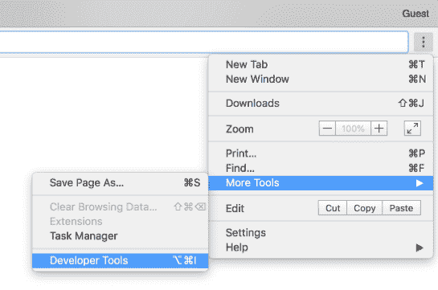

在 Google Chrome 中访问开发者工具

一旦开发者工具窗口出现，选择控制台选项卡，输入`WebAssembly`，然后按*Enter*。如果您看到这个，您的浏览器是有效的：

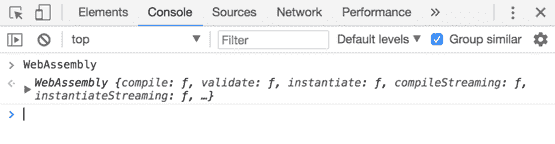

在 Google Chrome 的开发者工具控制台中验证 WebAssembly 的结果

# 验证 Mozilla Firefox

验证 Firefox 的过程与验证 Google Chrome 几乎相同。选择**工具** | **Web 开发者** | **切换工具**，或者使用键盘快捷键*Cmd*/*Ctrl* + *Shift* + *I*：

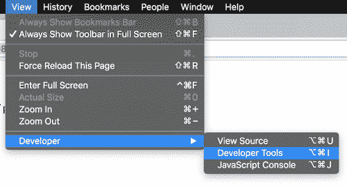

在 Mozilla Firefox 中访问开发者工具

选择控制台选项卡，点击命令输入框，输入`WebAssembly`，然后按*Enter*。如果您的 Firefox 版本有效，您将看到这个：

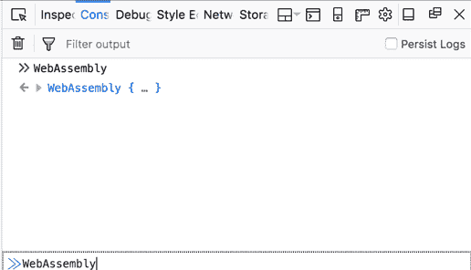

在 Mozilla Firefox 中验证 WebAssembly 的结果

# 验证其他浏览器

其他浏览器的验证过程基本相同；在不同浏览器之间唯一不同的验证方面是如何访问开发者工具。如果`WebAssembly`对象可以通过您正在使用的浏览器的控制台访问，您可以使用该浏览器进行 WebAssembly 开发。

# 其他工具

除了我们在前几节中介绍的应用程序和工具之外，还有一些功能丰富且免费的工具可以极大地改善您的开发过程。我没有时间介绍它们所有，但我想强调一下我经常使用的工具。在本节中，我将简要介绍每个平台上可用的一些流行的工具和应用程序。

# macOS 的 iTerm2

默认的 macOS 安装包括 Terminal 应用程序，Terminal，这对本书的使用已经足够了。如果您想要一个更全面的终端，iTerm2 是一个很好的选择。它提供诸如分割窗口、广泛的定制、多个配置文件和可以显示笔记、运行作业、命令历史等的工具栏功能。您可以从官方网站([`www.iterm2.com/`](https://www.iterm2.com/))下载图像文件并手动安装，或者使用 Homebrew-Cask 安装 iTerm，使用以下命令：

```cpp
brew cask install iterm2
```

这是 iTerm2 打开并显示多个编辑器窗口的样子：

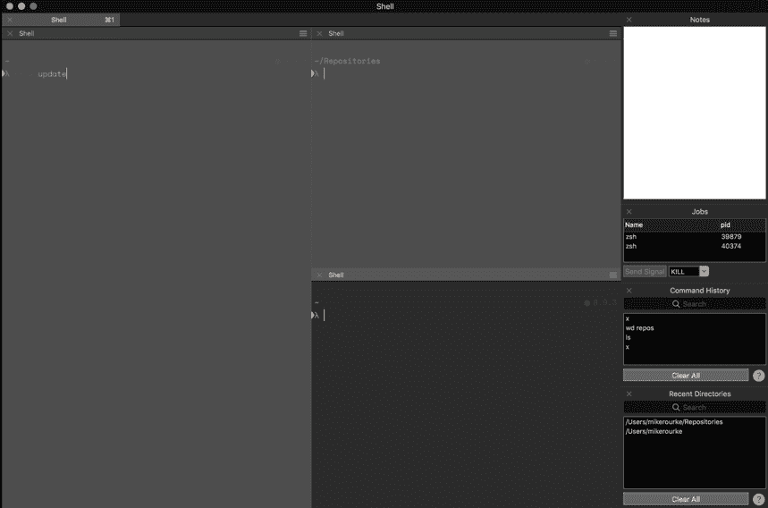

具有多个窗格和工具栏的 iTerm 实例

# Ubuntu 的 Terminator

Terminator 是 Ubuntu 的 iTerm 和`cmder`，是一个终端仿真器，允许在单个窗口内使用多个选项卡和窗格。Terminator 还提供诸如拖放、查找功能和大量插件和主题等功能。您可以通过`apt`安装 Terminator。为了确保您使用的是最新版本，请在终端中运行以下命令：

```cpp
sudo add-apt-repository ppa:gnome-terminator
sudo apt-get update
sudo apt-get install terminator 
```

参考截图：

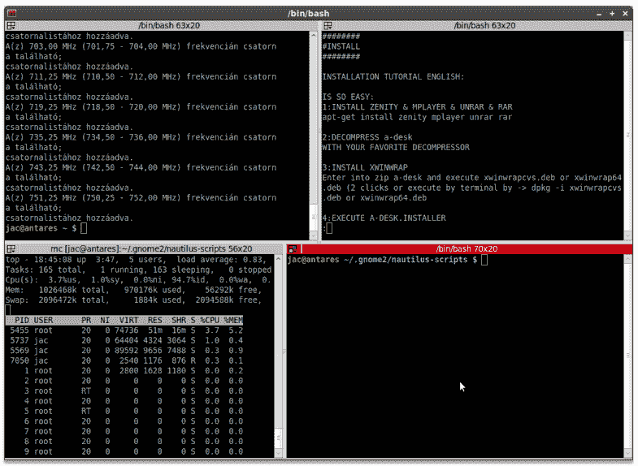

从 http://technicalworldforyou.blogspot.com 获取的终结者截图

B09984_03_17

# Windows 的 cmder

`cmder`是 Windows 的控制台仿真器，为标准命令提示符或 PowerShell 添加了许多功能和特性。它提供诸如多个选项卡和可定制性之类的功能。它允许您在同一程序中打开不同外壳的实例。您可以从官方网站([cmder.net](https://cmder.net))下载并安装它，或者使用以下命令使用 Chocolatey 安装它：

```cpp
choco install cmder
```

这就是它的样子：

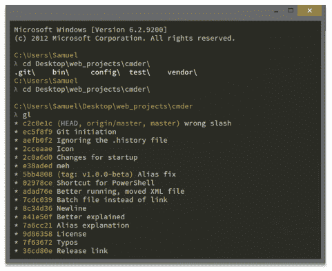

官方网站的 cmder 截图

# Zsh 和 Oh-My-Zsh

Zsh 是一个改进了 Bash 的交互式 shell。Oh-My-Zsh 是 Zsh 的配置管理器，具有各种有用的插件。您可以在他们的网站上看到整个列表([`github.com/robbyrussell/oh-my-zsh`](https://github.com/robbyrussell/oh-my-zsh))。例如，如果您想在 CLI 中拥有强大的自动完成和语法高亮功能，可以使用诸如 zsh-autosuggestion 和 zsh-syntax-highlighting 等插件。您可以在 macOS、Linux 和 Windows 上安装和配置 Zsh 和 Oh-My-Zsh。Oh-My-Zsh 页面上有安装说明以及主题和插件列表。

# 摘要

在本章中，我们介绍了我们将用于开始使用 WebAssembly 进行工作的开发工具的安装和配置过程。我们讨论了如何使用操作系统的软件包管理器（例如 macOS 的 Homebrew）快速轻松地安装 Git、Node.js 和 VS Code。还介绍了配置 VS Code 的步骤以及您可以添加的必需和可选扩展以增强开发体验。我们讨论了如何安装本地 Web 服务器进行测试以及如何验证浏览器以确保支持 WebAssembly。最后，我们简要回顾了一些您可以安装到平台上以帮助开发的其他工具。

在第四章中，*安装所需的依赖项*，我们将安装所需的依赖项并测试工具链。

# 问题

1.  你应该使用哪个操作系统的软件包管理器？

1.  BitBucket 支持 Git 吗？

1.  为什么我们使用 Node.js 的第 8 个版本而不是最新版本？

1.  你如何在 Visual Studio Code 中更改颜色主题？

1.  你如何访问 Visual Studio Code 中的命令面板？

1.  你如何检查浏览器是否支持 WebAssembly？

1.  *其他工具*部分中的工具在所有三个操作系统上都受支持吗？

# 进一步阅读

+   Homebrew：[`brew.sh`](https://brew.sh)

+   `apt`文档：[`help.ubuntu.com/lts/serverguide/apt.html.en`](https://help.ubuntu.com/lts/serverguide/apt.html.en)

+   Chocolatey：[`chocolatey.org`](https://chocolatey.org)

+   Git：[`git-scm.com`](https://git-scm.com)

+   Node.js：[`nodejs.org/en`](https://nodejs.org/en)

+   GNU Make：[`www.gnu.org/software/make`](https://www.gnu.org/software/make)

+   VS Code：[`code.visualstudio.com`](https://code.visualstudio.com)
