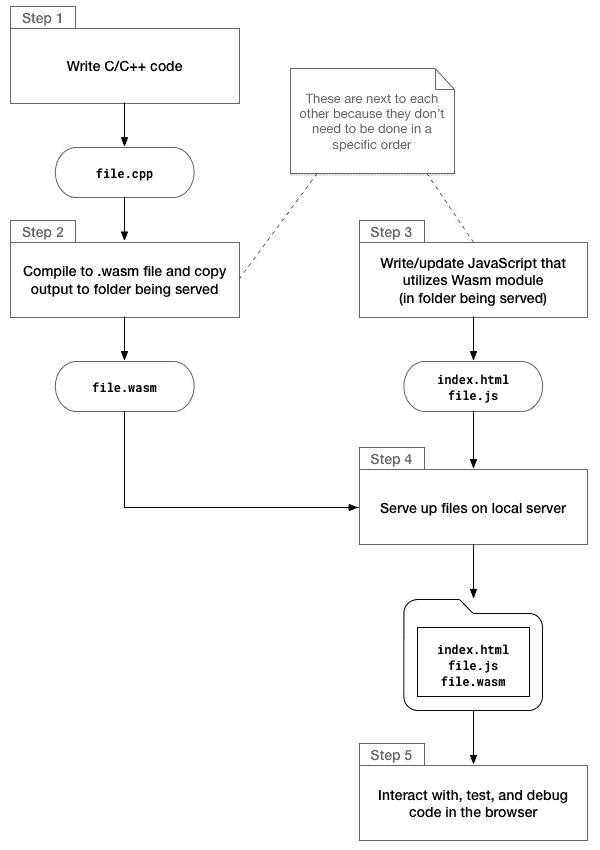
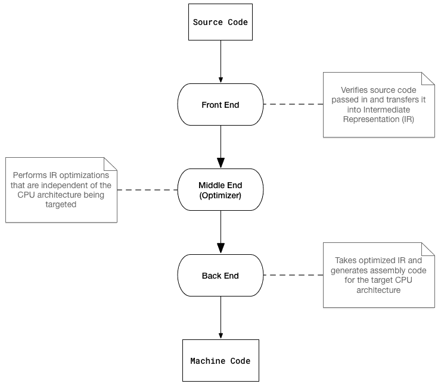
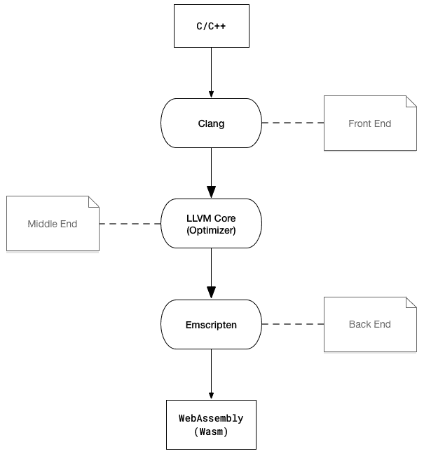
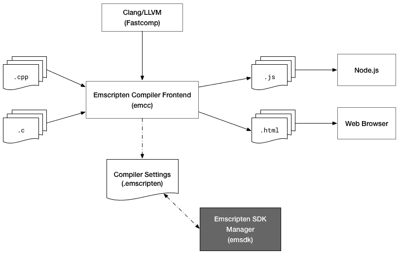
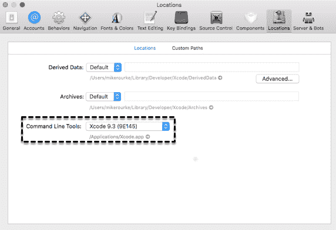

# 安装所需的依赖项

现在您已经设置好了开发环境，并准备开始编写 C、C++和 JavaScript，是时候添加最后一块拼图了。为了从我们的 C/C++代码生成`.wasm`文件，我们需要安装和配置**Emscripten SDK**（**EMSDK**）。

在本章中，我们将讨论开发工作流程，并谈论 EMSDK 如何融入开发过程。我们将提供详细的说明，说明如何在每个平台上安装和配置 EMSDK，以及任何先决条件。安装和配置过程完成后，您将通过编写和编译一些 C 代码来测试它。

本章的目标是理解以下内容：

+   与 WebAssembly 一起工作时的整体开发工作流程

+   EMSDK 与 Emscripten 和 WebAssembly 的关系以及为什么需要它

+   如何安装 EMSDK 的先决条件

+   如何安装和配置 EMSDK

+   如何测试 EMSDK 以确保它正常工作

# 开发工作流程

WebAssembly 的开发工作流程与大多数其他需要编译和构建过程的语言类似。在进入工具设置之前，我们将介绍开发周期。在本节中，我们将为本章其余部分将安装和配置的工具建立一些上下文。

# 工作流程中的步骤

对于本书，我们将编写 C 和 C++代码，并将其编译为 Wasm 模块，但这个工作流程适用于任何编译为`.wasm`文件的编程语言。以下图表概述了这个过程：



开发工作流程中的步骤

本书中将使用这个过程来进行示例，因此您将了解项目结构如何与工作流程对应。我们将使用一些可用的工具来加快和简化这个过程，但步骤仍将保持不变。

# 将工具集成到工作流程中

有许多编辑器和工具可用于简化开发过程。幸运的是，C/C++和 JavaScript 已经存在了相当长的时间，因此您可以利用最适合您的选项。WebAssembly 的工具列表要短得多，因为这项技术存在的时间较短，但它们确实存在。

我们将使用的主要工具是 VS Code，它提供了一些优秀和有用的功能，可以简化构建和开发过程。除了用它来编写我们的代码外，我们还将利用 VS Code 内置的任务功能从 C/C++构建`.wasm`文件。通过在项目根文件夹中创建一个`.vscode/tasks.json`文件，我们可以指定与构建步骤相关的所有参数，并使用键盘快捷键快速运行它。除了执行构建之外，我们还可以启动和停止运行的 Node.js 进程（即工作流程图中的本地服务器）。我们将在下一章中介绍如何添加和配置这些功能。

# Emscripten 和 EMSDK

我们将使用 Emscripten 将我们的 C/C++代码编译为`.wasm`文件。到目前为止，Emscripten 只是在一般情况下简要提到过。由于我们将在构建过程中使用这个工具和相应的 Emscripten SDK（EMSDK），因此了解每种技术的作用以及它在开发工作流程中的作用是很重要的。在本节中，我们将描述 Emscripten 的目的，并讨论它与 EMSDK 的关系。

# Emscripten 概述

那么 Emscripten 是什么？维基百科提供了以下定义：

“Emscripten 是一个源到源编译器，作为 LLVM 编译器的后端运行，并生成称为 asm.js 的 JavaScript 子集。它也可以生成 WebAssembly。”

我们在第一章中讨论了源到源编译器（或转换器），并以 TypeScript 为例。转换器将一种编程语言的源代码转换为另一种编程语言的等效源代码。为了详细说明 Emscripten 作为 LLVM 编译器的后端运行，我们需要提供有关 LLVM 的一些额外细节。

LLVM 的官方网站（[`llvm.org`](https://llvm.org)）将 LLVM 定义为*一组模块化和可重用的编译器和工具链技术*。LLVM 由几个子项目组成，但我们将重点放在 Emscripten 使用的两个项目上：Clang 和 LLVM 核心库。为了了解这些部件如何组合在一起，让我们回顾一下三阶段编译器的设计：



通用三阶段编译器的设计

该过程相对简单：三个独立的阶段或*端*处理编译过程。这种设计允许不同的前端和后端用于各种编程语言和目标架构，并通过使用中间表示将机器代码与源代码完全解耦。现在让我们将每个编译阶段与我们将用于生成 WebAssembly 的工具链的组件相关联：



使用 LLVM、Clang 和 Emscripten 的三阶段编译

Clang 用于将 C/C++编译为 LLVM 的**中间表示**（**IR**），Emscripten 将其编译为 Wasm 模块（二进制格式）。这两个图表还展示了 Wasm 和机器代码之间的关系。您可以将 WebAssembly 视为浏览器中的 CPU，Wasm 是其运行的机器代码。

# EMSDK 适用于哪里？

Emscripten 是指用于将 C 和 C++编译为`asm.js`或 WebAssembly 的工具链。EMSDK 用于管理工具链中的工具和相应的配置。这消除了复杂的环境设置需求，并防止了工具版本不兼容的问题。通过安装 EMSDK，我们拥有了使用 Emscripten 编译器所需的所有工具（除了先决条件）。以下图表是 Emscripten 工具链的可视化表示（EMSDK 显示为深灰色）：



Emscripten 工具链（从 emscripten.org 稍作修改）

现在您对 Emscripten 和 EMSDK 有了更好的了解，让我们继续安装先决条件的过程。

# 安装先决条件

在安装和配置 EMSDK 之前，我们需要安装一些先决条件。您在第三章中安装了两个先决条件：Node.js 和 Git。每个平台都有略有不同的安装过程和工具要求。在本节中，我们将介绍每个平台的先决条件工具的安装过程。

# 常见的先决条件

您可能已经安装了所有的先决条件。以下是无论平台如何都需要的三个先决条件：

+   Git

+   Node.js

+   Python 2.7

注意 Python 版本；这很重要，因为安装错误的版本可能会导致安装过程失败。如果您在第二章中跟随并安装了 Node.js 和 Git，那么剩下的就是安装 Python 2.7 和为您的平台指定的任何其他先决条件。每个平台的 Python 安装过程将在以下子节中指定。

Python 是一种用于通用编程的高级编程语言。如果您想了解更多，请访问官方网站[`www.python.org/`](https://www.python.org/)。

# 在 macOS 上安装先决条件

在安装 EMSDK 之前，您需要安装另外三个工具：

+   Xcode

+   Xcode 命令行工具

+   CMake

您可以从 macOS 应用商店安装 Xcode。如果您已经安装了 Xcode，可以通过转到 Xcode | 首选项 | 位置并检查命令行工具选项是否有值来检查是否已安装命令行工具。如果您安装了 Homebrew 软件包管理器，则应该已经安装了命令行工具：



检查 Xcode 命令行工具的当前版本

如果没有看到，请打开终端并运行此命令：

```cpp
xcode-select --install
```

完成后，可以通过运行此命令来安装 CMake：

```cpp
brew install cmake
```

在安装 Python 之前，请运行此命令：

```cpp
python --version
```

如果您看到`Python 2.7.xx`（其中`xx`是补丁版本，可以是任何数字），则可以准备安装 EMSDK。如果出现错误，表示找不到 Python 命令，或者看到`Python 3.x.xx`，我建议您安装`pyenv`，一个 Python 版本管理器。要安装`pyenv`，请运行此命令：

```cpp
brew install pyenv
```

您需要执行一些额外的配置步骤才能完成安装。请按照[`github.com/pyenv/pyenv#homebrew-on-mac-os-x`](https://github.com/pyenv/pyenv#homebrew-on-mac-os-x)上的 Homebrew 安装说明进行操作。安装和配置`pyenv`后，运行此命令安装 Python 2.7：

```cpp
pyenv install 2.7.15
```

安装完成后，运行此命令：

```cpp
pyenv global 2.7.15
```

为确保您使用的是正确版本的 Python，请运行此命令：

```cpp
python --version
```

您应该看到 Python `2.7.xx`，其中`xx`是补丁版本（我看到的是`2.7.10`，这将可以正常工作）。

# 在 Ubuntu 上安装先决条件

Ubuntu 应该已经安装了 Python 2.7。您可以通过运行此命令确认：

```cpp
python --version
```

如果您看到 Python `2.7.xx`（其中`xx`是补丁版本，可以是任何数字），则可以准备安装 EMSDK。如果出现错误，表示找不到 python 命令，或者看到`Python 3.x.xx`，我建议您安装`pyenv`，一个 Python 版本管理器。在安装`pyenv`之前，请检查是否已安装`curl`。您可以通过运行以下命令来执行此操作：

```cpp
curl --version
```

如果您看到版本号和其他信息，则已安装`curl`。如果没有，您可以通过运行以下命令来安装`curl`：

```cpp
sudo apt-get install curl
```

`curl`安装完成后，运行此命令安装`pyenv`：

```cpp
curl -L https://github.com/pyenv/pyenv-installer/raw/master/bin/pyenv-installer | bash
```

安装和配置 pyenv 后，运行此命令安装 Python 2.7：

```cpp
pyenv install 2.7.15
```

如果遇到构建问题，请转到[`github.com/pyenv/pyenv/wiki/common-build-problems`](https://github.com/pyenv/pyenv/wiki/common-build-problems)上的*常见构建问题*页面。安装完成后，运行此命令：

```cpp
pyenv global 2.7.15
```

为确保您使用的是正确版本的 Python，请运行此命令：

```cpp
python --version
```

您应该看到`Python 2.7.xx`，其中`xx`是补丁版本（我看到的是`2.7.10`，这将可以正常工作）。

# 在 Windows 上安装先决条件

Windows 的唯一额外先决条件是 Python 2.7。在尝试安装之前，运行此命令：

```cpp
python --version
```

如果您看到`Python 2.7.xx`（其中`xx`是补丁版本，可以是任何数字），则可以准备安装 EMSDK。如果出现错误，表示找不到 Python 命令，或者看到`Python 3.x.xx`并且系统上没有安装 Python 2.7，请运行此命令安装 Python 2.7：

```cpp
choco install python2 -y
```

如果在安装 Python 2.7 之前看到`Python 3.x.xx`，您应该能够通过更新路径来更改当前的 Python 版本。在尝试安装 EMSDK 之前，运行此命令将 Python 设置为 2.7：

```cpp
SET PATH=C:\Python27\python.exe
```

# 安装和配置 EMSDK

如果您已安装了所有先决条件，就可以准备安装 EMSDK 了。获取 EMSDK 并使其运行的过程相对简单。在本节中，我们将介绍 EMSDK 的安装过程，并演示如何更新您的 VS Code C/C++配置以适应 Emscripten。

# 跨所有平台的安装过程

首先，选择一个文件夹来安装 EMSDK。我创建了一个文件夹在 `~/Tooling`（或者在 Windows 上是 `C:\Users\Mike\Tooling`）。在终端中，`cd` 到你刚创建的文件夹，并运行这个命令：

```cpp
git clone https://github.com/juj/emsdk.git
```

一旦克隆过程完成，请按照下面对应你的平台的部分中的说明完成安装。

# 在 macOS 和 Ubuntu 上安装

一旦克隆过程完成，运行以下代码片段中的每个命令。如果看到一条建议你运行 `git pull` 而不是 `./emsdk update` 的消息，请在运行 `./emsdk install latest` 命令之前使用 `git pull` 命令：

```cpp
# Change directory into the EMSDK installation folder
cd emsdk

# Fetch the latest registry of available tools
./emsdk update

# Download and install the latest SDK tools
./emsdk install latest

# Make the latest SDK active for the current user (writes ~/.emscripten file)
./emsdk activate latest

# Activate PATH and other environment variables in the current Terminal
source ./emsdk_env.sh
```

`source ./emsdk_env.sh` 命令将在当前终端中激活环境变量，这意味着每次创建新的终端实例时，你都需要重新运行它。为了避免这一步，你可以将以下行添加到你的 Bash 或 Zsh 配置文件中（即 `~/.bash_profile` 或 `~/.zshrc`）：

```cpp
source ~/Tooling/emsdk/emsdk_env.sh > /dev/null
```

如果你将 EMSDK 安装在不同的位置，请确保更新路径以反映这一点。将这行添加到你的配置文件中将自动运行该环境更新命令，这样你就可以立即开始使用 EMSDK。为了确保你可以使用 Emscripten 编译器，请运行这个命令：

```cpp
emcc --version
```

如果你看到一个带有版本信息的消息，设置就成功了。如果你看到一个错误消息，说明找不到该命令，请仔细检查你的配置。你可能在你的 Bash 或 Zsh 配置文件中指定了无效的 `emsdk_env.sh` 路径。

# 在 Windows 上安装和配置

在完成安装之前，我建议你以后使用 **PowerShell**。本书中的示例将在 `cmder` 中使用 PowerShell。一旦克隆过程完成，运行以下代码片段中给出的每个命令。如果看到一条建议你运行 `git pull` 而不是 `./emsdk update` 的消息，请在运行 `./emsdk install latest` 命令之前使用 `git pull` 命令：

```cpp
# Change directory into the EMSDK installation folder
cd emsdk

# Fetch the latest registry of available tools
.\emsdk update

# Download and install the latest SDK tools
.\emsdk install latest

# Make the latest SDK active for the current user (writes ~/.emscripten file)
.\emsdk activate --global latest
```

`.\emsdk activate` 命令中的 `--global` 标志允许你在每个会话中运行 `emcc` 而无需运行脚本来设置环境变量。为了确保你可以使用 Emscripten 编译器，请重新启动你的 CLI 并运行这个命令：

```cpp
emcc --version
```

如果你看到一个带有版本信息的消息，设置就成功了。

# 在 VS Code 中配置

如果你还没有这样做，创建一个包含我们将要使用的代码示例的文件夹（示例使用名称 `book-examples`）。在 VS Code 中打开这个文件夹，按 *F1* 键，选择 C/Cpp: Edit Configurations… 来创建一个 `.vscode/c_cpp_properties.json` 文件在你项目的根目录。它应该会自动打开文件。将以下行添加到 `browse.path` 数组中：`"${env:EMSCRIPTEN}/system/include"`。这将防止在包含 `emscripten.h` 头文件时抛出错误。如果它没有自动生成，你可能需要手动创建 `browse` 对象并添加一个 `path` 条目。以下代码片段代表了 Ubuntu 上更新后的配置文件：

```cpp
{
  "name": "Linux",
  "includePath": [
    "/usr/include",
    "/usr/local/include",
    "${workspaceFolder}",
    "${env:EMSCRIPTEN}/system/include"
  ],
  "defines": [],
  "intelliSenseMode": "clang-x64",
  "browse": {
    "path": [
      "/usr/include",
      "/usr/local/include",
      "${workspaceFolder}"
      ],
    "limitSymbolsToIncludedHeaders": true,
    "databaseFilename": ""
  }
}
```

# 测试编译器

安装和配置 EMSDK 后，你需要测试它以确保你能够从 C/C++ 代码生成 Wasm 模块。测试的最简单方法是使用 `emcc` 命令编译一些代码，并尝试在浏览器中运行它。在这一部分，我们将通过编写和编译一些简单的 C 代码并评估与 `.wasm` 输出相关联的 Wat 来验证 EMSDK 的安装。

# C 代码

我们将使用一些非常简单的 C 代码来测试我们的编译器安装。我们不需要导入任何头文件或外部库。我们不会在这个测试中使用 C++，因为我们需要对 C++执行额外的步骤，以防止名称混淆，我们将在第六章中更详细地描述。本节的代码位于`learn-webassembly`存储库的`/chapter-04-installing-deps`文件夹中。按照这里列出的说明来测试 EMSDK。

在你的`/book-examples`文件夹中创建一个名为`/chapter-04-installing-deps`的子文件夹。接下来，在这个文件夹中创建一个名为`main.c`的新文件，并填充以下内容：

```cpp
int addTwoNumbers(int leftValue, int rightValue) {
    return leftValue + rightValue;
}
```

# 编译 C 代码

为了使用 Emscripten 编译 C/C++文件，我们将使用`emcc`命令。我们需要向编译器传递一些参数，以确保我们获得一个在浏览器中可以利用的有效输出。为了从 C/C++文件生成 Wasm 文件，命令遵循这种格式：

```cpp
emcc <file.c> -Os -s WASM=1 -s SIDE_MODULE=1 -s BINARYEN_ASYNC_COMPILATION=0 -o <file.wasm>
```

以下是`emcc`命令的每个参数的详细说明：

| **参数** | **描述** |
| --- | --- |
| `<file.c>` | 将被编译为 Wasm 模块的 C 或 C++输入文件的路径；当我们运行命令时，我们将用实际文件路径替换它。 |
| `-Os` | 编译器优化级别。这个优化标志允许模块实例化，而不需要 Emscripten 的粘合代码。 |
| `-s WASM=1` | 告诉编译器将代码编译为 WebAssembly。 |
| `-s SIDE_MODULE=1` | 确保只输出一个`WebAssembly`模块（没有粘合代码）。 |
| `-s BINARYEN_ASYNC_COMPILATION=0` | 来自官方文档：是否异步编译 wasm，这更有效，不会阻塞主线程。目前，这对于除了最小的模块之外的所有模块在 V8 中运行是必需的。 |
| `-o <file.wasm>` | 输出文件`.wasm`文件的路径。当我们运行命令时，我们将用所需的输出路径替换它。 |

为了测试 Emscripten 是否正常工作，请在 VS Code 中打开集成终端并运行以下命令：

```cpp
# Ensure you're in the /chapter-04-installing-deps folder:
cd chapter-04-installing-deps

# Compile the main.c file to main.wasm:
emcc main.c -Os -s WASM=1 -s SIDE_MODULE=1 -s BINARYEN_ASYNC_COMPILATION=0 -o main.wasm
```

第一次编译文件可能需要一分钟，但后续构建将会快得多。如果编译成功，你应该在`/chapter-04-installing-deps`文件夹中看到一个`main.wasm`文件。如果遇到错误，Emscripten 的错误消息应该足够详细，以帮助你纠正问题。

如果一切顺利完成，你可以通过在 VS Code 的文件资源管理器中右键单击`main.wasm`并从上下文菜单中选择显示 WebAssembly 来查看与`main.wasm`文件相关的 Wat。输出应该如下所示：

```cpp
(module
  (type $t0 (func (param i32)))
  (type $t1 (func (param i32 i32) (result i32)))
  (type $t2 (func))
  (type $t3 (func (result f64)))
  (import "env" "table" (table $env.table 2 anyfunc))
  (import "env" "memoryBase" (global $env.memoryBase i32))
  (import "env" "tableBase" (global $env.tableBase i32))
  (import "env" "abort" (func $env.abort (type $t0)))
  (func $_addTwoNumbers (type $t1) (param $p0 i32) (param $p1 i32) (result i32)
    get_local $p1
    get_local $p0
    i32.add)
  (func $runPostSets (type $t2)
    nop)
  (func $__post_instantiate (type $t2)
     get_global $env.memoryBase
    set_global $g2
    get_global $g2
    i32.const 5242880
    i32.add
    set_global $g3)
  (func $f4 (type $t3) (result f64)
    i32.const 0
    call $env.abort
    f64.const 0x0p+0 (;=0;))
  (global $g2 (mut i32) (i32.const 0))
  (global $g3 (mut i32) (i32.const 0))
  (global $fp$_addTwoNumbers i32 (i32.const 1))
  (export "__post_instantiate" (func $__post_instantiate))
  (export "_addTwoNumbers" (func $_addTwoNumbers))
  (export "runPostSets" (func $runPostSets))
  (export "fp$_addTwoNumbers" (global 4))
  (elem (get_global $env.tableBase) $f4 $_addTwoNumbers))
```

如果编译器成功运行，你就可以继续下一步，编写 JavaScript 代码与模块进行交互，这将在下一章中介绍。

# 摘要

在本章中，我们介绍了在使用 WebAssembly 时的整体开发工作流程。为了生成我们的`.wasm`文件，我们正在使用 Emscripten，这需要安装 EMSDK。在审查任何安装细节之前，我们讨论了底层技术，并描述了它们如何相互关联以及与 WebAssembly 的关系。我们介绍了在本地计算机上使 EMDSK 工作所需的每个步骤。每个平台上 EMSDK 的安装过程都有所介绍，以及 EMSDK 的安装和配置说明。安装 EMSDK 之后，我们测试了编译器（不是）。那是我们在上一节中运行的`emcc`命令。使用`emcc`命令对一个简单的 C 代码文件，以确保 Emscripten 工作正常。在下一章中，我们将详细介绍创建和加载你的第一个模块的过程！

# 问题

1.  开发工作流程中的五个步骤是什么？

1.  Emscripten 在编译过程中代表哪个阶段或结束？

1.  IR 代表什么（LLVM 的输出）？

1.  EMSDK 在 Emscripten 的编译过程中扮演什么角色？

1.  在所有三个平台（macOS、Windows 和 Linux）上需要哪些 EMSDK 先决条件？

1.  为什么需要在使用 Emscripten 编译器之前运行`emsdk_env`脚本？

1.  为什么需要将`"${env:EMSCRIPTEN}/system/include"`路径添加到 C/Cpp 配置文件中？

1.  用于将 C/C++编译为 Wasm 模块的命令是什么？

1.  `-Os`编译器标志代表什么？

# 进一步阅读

+   Emscripten: [`emscripten.org`](http://emscripten.org)

+   LLVM 编译器基础设施项目：[`llvm.org`](https://llvm.org)

+   使用 Visual Studio Code 进行 C++编程：[`code.visualstudio.com/docs/languages/cpp`](https://code.visualstudio.com/docs/languages/cpp)
