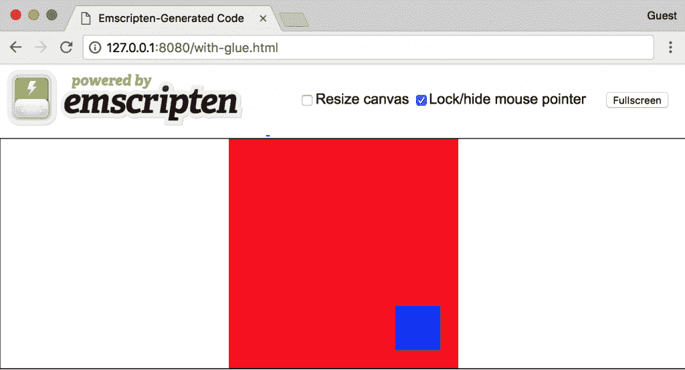
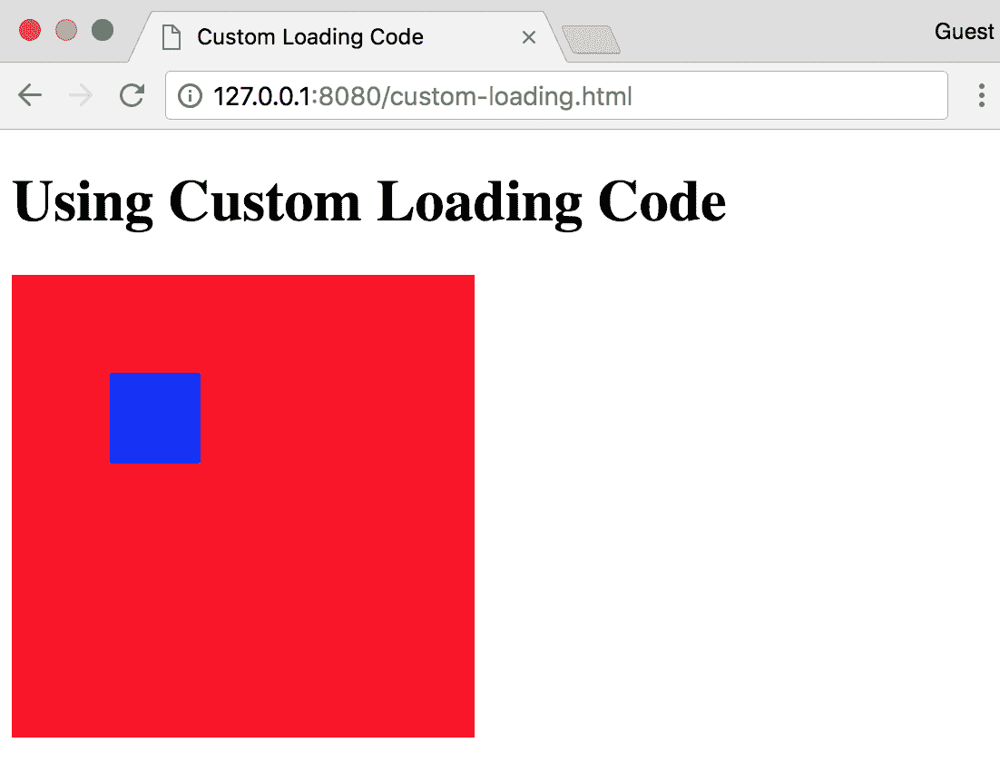
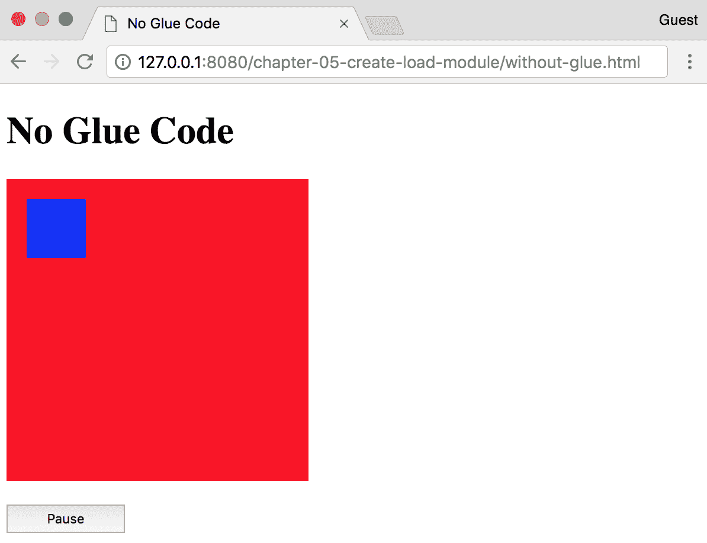

# 创建和加载 WebAssembly 模块

我们在第四章 *安装所需的依赖项*中向`emcc`命令传递的标志产生了一个单一的`.wasm`文件，可以使用本机的`WebAssembly`对象在浏览器中加载和实例化。C 代码是一个非常简单的示例，旨在测试编译器，而无需考虑包含的库或 WebAssembly 的限制。通过利用 Emscripten 的一些功能，我们可以克服 C/C++代码的一些 WebAssembly 的限制，而只有最小的性能损失。

在本章中，我们将涵盖与 Emscripten 的粘合代码使用对应的编译和加载步骤。我们还将描述使用浏览器的`WebAssembly`对象编译/输出严格的`.wasm`文件并加载它们的过程。

本章的目标是理解以下内容：

+   利用 Emscripten 的 JavaScript“glue”代码编译 C 代码的过程

+   如何在浏览器中加载 Emscripten 模块

+   只输出`.wasm`文件的 C 代码编译过程（没有“glue”代码）

+   如何在 VS Code 中配置构建任务

+   如何使用全局的`WebAssembly`对象在浏览器中编译和加载 Wasm 模块

# 使用 Emscripten 粘合代码编译 C

在第四章 *安装所需的依赖项*中，您编写并编译了一个简单的三行程序，以确保您的 Emscripten 安装有效。我们向`emcc`命令传递了几个标志，这些标志要求只输出一个`.wasm`文件。通过向`emcc`命令传递其他标志，我们可以在`.wasm`文件旁边输出 JavaScript 粘合代码以及一个处理加载过程的 HTML 文件。在本节中，我们将编写一个更复杂的 C 程序，并使用 Emscripten 提供的输出选项进行编译。

# 编写示例 C 代码

我们在第四章中涵盖的示例中没有包含任何头文件或传递任何函数，*安装所需的依赖项*。由于代码的目的仅是测试编译器安装是否有效，因此并不需要太多。Emscripten 提供了许多额外的功能，使我们能够与 JavaScript 以及反之互动我们的 C 和 C++代码。其中一些功能是 Emscripten 特有的，不对应*核心规范*或其 API。在我们的第一个示例中，我们将利用 Emscripten 的一个移植库和 Emscripten 的 API 提供的一个函数。

以下程序使用**Simple DirectMedia Layer**（**SDL2**）在画布上对角移动一个矩形的无限循环。它取自[`github.com/timhutton/sdl-canvas-wasm`](https://github.com/timhutton/sdl-canvas-wasm)，但我将其从 C++转换为 C 并稍微修改了代码。本节的代码位于`learn-webassembly`存储库的`/chapter-05-create-load-module`文件夹中。按照以下说明使用 Emscripten 编译 C。

在您的`/book-examples`文件夹中创建一个名为`/chapter-05-create-load-module`的文件夹。在此文件夹中创建一个名为`with-glue.c`的新文件，并填充以下内容：

```cpp
/*
 * Converted to C code taken from:
 * https://github.com/timhutton/sdl-canvas-wasm
 * Some of the variable names and comments were also
 * slightly updated.
 */
#include <SDL2/SDL.h>
#include <emscripten.h>
#include <stdlib.h>

// This enables us to have a single point of reference
// for the current iteration and renderer, rather than
// have to refer to them separately.
typedef struct Context {
  SDL_Renderer *renderer;
  int iteration;
} Context;

/*
 * Looping function that draws a blue square on a red
 * background and moves it across the <canvas>.
 */
void mainloop(void *arg) {
    Context *ctx = (Context *)arg;
    SDL_Renderer *renderer = ctx->renderer;
    int iteration = ctx->iteration;

    // This sets the background color to red:
    SDL_SetRenderDrawColor(renderer, 255, 0, 0, 255);
    SDL_RenderClear(renderer);

    // This creates the moving blue square, the rect.x
    // and rect.y values update with each iteration to move
    // 1px at a time, so the square will move down and
    // to the right infinitely:
    SDL_Rect rect;
    rect.x = iteration;
    rect.y = iteration;
    rect.w = 50;
    rect.h = 50;
    SDL_SetRenderDrawColor(renderer, 0, 0, 255, 255);
    SDL_RenderFillRect(renderer, &rect);

    SDL_RenderPresent(renderer);

    // This resets the counter to 0 as soon as the iteration
    // hits the maximum canvas dimension (otherwise you'd
    // never see the blue square after it travelled across
    // the canvas once).
    if (iteration == 255) {
        ctx->iteration = 0;
    } else {
        ctx->iteration++;
    }
}

int main() {
    SDL_Init(SDL_INIT_VIDEO);
    SDL_Window *window;
    SDL_Renderer *renderer;

    // The first two 255 values represent the size of the <canvas>
    // element in pixels.
    SDL_CreateWindowAndRenderer(255, 255, 0, &window, &renderer);

    Context ctx;
    ctx.renderer = renderer;
    ctx.iteration = 0;

    // Call the function repeatedly:
    int infinite_loop = 1;

    // Call the function as fast as the browser wants to render
    // (typically 60fps):
    int fps = -1;

    // This is a function from emscripten.h, it sets a C function
    // as the main event loop for the calling thread:
    emscripten_set_main_loop_arg(mainloop, &ctx, fps, infinite_loop);

    SDL_DestroyRenderer(renderer);
    SDL_DestroyWindow(window);
    SDL_Quit();

    return EXIT_SUCCESS;
}
```

`main()`函数末尾的`emscripten_set_main_loop_arg()`是可用的，因为我们在文件顶部包含了`emscripten.h`。以`SDL_`为前缀的变量和函数是可用的，因为在文件顶部包含了`#include <SDL2/SDL.h>`。如果您在`<SDL2/SDL.h>`语句下看到了红色的波浪线错误，您可以忽略它。这是因为 SDL 的`include`路径不在您的`c_cpp_properties.json`文件中。

# 编译示例 C 代码

现在我们已经编写了我们的 C 代码，我们需要编译它。您必须传递给`emcc`命令的一个必需标志是`-o <target>`，其中`<target>`是所需输出文件的路径。该文件的扩展名不仅仅是输出该文件；它会影响编译器做出的一些决定。下表摘自 Emscripten 的`emcc`文档[`kripken.github.io/emscripten-site/docs/tools_reference/emcc.html#emcc-o-target`](http://kripken.github.io/emscripten-site/docs/tools_reference/emcc.html#emcc-o-target)，定义了根据指定的文件扩展名生成的输出类型：

| **扩展名** | **输出** |
| --- | --- |
| `<name>.js` | JavaScript 胶水代码（如果指定了`s WASM=1`标志，则还有`.wasm`）。 |
| `<name>.html` | HTML 和单独的 JavaScript 文件（`<name>.js`）。有单独的 JavaScript 文件可以提高页面加载时间。 |
| `<name>.bc` | LLVM 位码（默认）。 |
| `<name>.o` | LLVM 位码（与`.bc`相同）。 |
| `<name>.wasm` | 仅 Wasm 文件（使用第四章中指定的标志）。 |

您可以忽略`.bc`和`.o`文件扩展名，我们不需要输出 LLVM 位码。`.wasm`扩展名不在`emcc` *工具参考*页面上，但如果您传递正确的编译器标志，它是一个有效的选项。这些输出选项影响我们编写的 C/C++代码。

# 输出带有胶水代码的 HTML

如果您为输出文件指定 HTML 文件扩展名（例如，`-o with-glue.html`），您将得到一个`with-glue.html`、`with-glue.js`和`with-glue.wasm`文件（假设您还指定了`-s WASM=1`）。如果您在源 C/C++文件中有一个`main()`函数，它将在 HTML 加载后立即执行该函数。让我们编译我们的示例 C 代码，看看它是如何运行的。要使用 HTML 文件和 JavaScript 胶水代码进行编译，`cd`到`/chapter-05-create-load-module`文件夹，并运行以下命令：

```cpp
emcc with-glue.c -O3 -s WASM=1 -s USE_SDL=2 -o with-glue.html
```

第一次运行此命令时，Emscripten 将下载并构建`SDL2`库。这可能需要几分钟才能完成，但您只需要等待一次。Emscripten 会缓存该库，因此后续构建速度会快得多。构建完成后，您将在文件夹中看到三个新文件：HTML、JavaScript 和 Wasm 文件。运行以下命令在本地`serve`文件：

```cpp
serve -l 8080
```

如果您在浏览器中打开`http://127.0.0.1:8080/with-glue.html`，您应该会看到以下内容：



在浏览器中运行 Emscripten 加载代码

蓝色矩形应该从红色矩形的左上角对角线移动到右下角。由于您在 C 文件中指定了`main()`函数，Emscripten 知道应该立即执行它。如果您在 VS code 中打开`with-glue.html`文件并滚动到文件底部，您将看到加载代码。您不会看到任何对`WebAssembly`对象的引用；这在 JavaScript 胶水代码文件中处理。

# 输出没有 HTML 的胶水代码

Emscripten 在 HTML 文件中生成的加载代码包含错误处理和其他有用的功能，以确保模块在执行`main()`函数之前加载。如果您为输出文件的扩展名指定`.js`，则必须自己创建 HTML 文件并编写加载代码。在下一节中，我们将更详细地讨论加载代码。

# 加载 Emscripten 模块

加载和与使用 Emscripten 的胶水代码的模块进行交互与 WebAssembly 的 JavaScript API 有很大不同。这是因为 Emscripten 为与 JavaScript 代码交互提供了额外的功能。在本节中，我们将讨论 Emscripten 在输出 HTML 文件时提供的加载代码，并审查在浏览器中加载 Emscripten 模块的过程。

# 预生成的加载代码

如果在运行`emcc`命令时指定了`-o <target>.html`，Emscripten 会生成一个 HTML 文件，并自动添加代码来加载模块到文件的末尾。以下是 HTML 文件中加载代码的样子，其中排除了每个`Module`函数的内容：

```cpp
var statusElement = document.getElementById('status');
var progressElement = document.getElementById('progress');
var spinnerElement = document.getElementById('spinner');

var Module = {
  preRun: [],
  postRun: [],
  print: (function() {...})(),
  printErr: function(text) {...},
  canvas: (function() {...})(),
  setStatus: function(text) {...},
  totalDependencies: 0,
  monitorRunDependencies: function(left) {...}
};

Module.setStatus('Downloading...');

window.onerror = function(event) {
  Module.setStatus('Exception thrown, see JavaScript console');
  spinnerElement.style.display = 'none';
  Module.setStatus = function(text) {
    if (text) Module.printErr('[post-exception status] ' + text);
  };
};
```

`Module`对象内的函数用于检测和解决错误，监视`Module`的加载状态，并在对应的粘合代码文件执行`run()`方法之前或之后可选择执行一些函数。下面的代码片段中显示的`canvas`函数返回了在加载代码之前在 HTML 文件中指定的 DOM 中的`<canvas>`元素：

```cpp
canvas: (function() {
  var canvas = document.getElementById('canvas');
  canvas.addEventListener(
    'webglcontextlost',
    function(e) {
      alert('WebGL context lost. You will need to reload the page.');
      e.preventDefault();
    },
    false
  );

  return canvas;
})(),
```

这段代码方便检测错误并确保`Module`已加载，但对于我们的目的，我们不需要那么冗长。

# 编写自定义加载代码

Emscripten 生成的加载代码提供了有用的错误处理。如果你在生产中使用 Emscripten 的输出，我建议你包含它以确保你正确处理错误。然而，我们实际上不需要所有的代码来使用我们的`Module`。让我们编写一些更简单的代码并测试一下。首先，让我们将我们的 C 文件编译成没有 HTML 输出的粘合代码。为此，运行以下命令：

```cpp
emcc with-glue.c -O3 -s WASM=1 -s USE_SDL=2 -s MODULARIZE=1 -o custom-loading.js
```

`-s MODULARIZE=1`编译器标志允许我们使用类似 Promise 的 API 来加载我们的`Module`。编译完成后，在`/chapter-05-create-load-module`文件夹中创建一个名为`custom-loading.html`的文件，并填充以下内容：

```cpp
<!doctype html>
<html lang="en-us">
<head>
  <title>Custom Loading Code</title>
</head>
<body>
  <h1>Using Custom Loading Code</h1>
  <canvas id="canvas"></canvas>
  <script type="application/javascript" src="img/custom-loading.js"></script>
  <script type="application/javascript">
    Module({
      canvas: (() => document.getElementById('canvas'))(),
    })
      .then(() => {
        console.log('Loaded!');
      });
  </script>
</body>
</html>
```

现在加载代码使用了 ES6 的箭头函数语法来加载画布函数，这减少了所需的代码行数。通过在`/chapter-05-create-load-module`文件夹中运行`serve`命令来启动本地服务器：

```cpp
serve -l 8080
```

当你在浏览器中导航到`http://127.0.0.1:8080/custom-loading.html`时，你应该看到这个：



在浏览器中运行自定义加载代码

当然，我们运行的函数并不是非常复杂，但它演示了加载 Emscripten 的`Module`所需的基本要求。我们将在第六章中更详细地研究`Module`对象，*与 JavaScript 交互和调试*，但现在只需知道加载过程与 WebAssembly 不同，我们将在下一节中介绍。

# 编译不带粘合代码的 C 代码

如果我们想要按照官方规范使用 WebAssembly，而不使用 Emscripten 提供的额外功能，我们需要向`emcc`命令传递一些标志，并确保编写的代码可以相对轻松地被 WebAssembly 使用。在*编写示例 C 代码*部分，我们编写了一个程序，它在红色画布上对角移动的蓝色矩形。它利用了 Emscripten 的一个移植库 SDL2。在本节中，我们将编写和编译一些不依赖于 Emscripten 辅助方法和移植库的 C 代码。

# 用于 WebAssembly 的 C 代码

在我们开始编写用于 WebAssembly 模块的 C 代码之前，让我们进行一个实验。在`/chapter-05-create-load-module`文件夹中打开 CLI，并尝试运行以下命令：

```cpp
emcc with-glue.c -Os -s WASM=1 -s USE_SDL=2 -s SIDE_MODULE=1 -s BINARYEN_ASYNC_COMPILATION=0 -o try-with-glue.wasm
```

在编译完成后，你应该在 VS Code 的文件资源管理器面板中看到一个`try-with-glue.wasm`文件。右键单击该文件，选择显示 WebAssembly。相应的 Wat 表示的开头应该类似于以下代码：

```cpp
(module
  (type $t0 (func (param i32)))
  (type $t1 (func (param i32 i32 i32 i32 i32) (result i32)))
  (type $t2 (func (param i32) (result i32)))
  (type $t3 (func))
  (type $t4 (func (param i32 i32) (result i32)))
  (type $t5 (func (param i32 i32 i32 i32)))
  (type $t6 (func (result i32)))
  (type $t7 (func (result f64)))
  (import "env" "memory" (memory $env.memory 256))
  (import "env" "table" (table $env.table 4 anyfunc))
  (import "env" "memoryBase" (global $env.memoryBase i32))
  (import "env" "tableBase" (global $env.tableBase i32))
  (import "env" "abort" (func $env.abort (type $t0)))
  (import "env" "_SDL_CreateWindowAndRenderer" (func $env._SDL_CreateWindowAndRenderer (type $t1)))
  (import "env" "_SDL_DestroyRenderer" (func $env._SDL_DestroyRenderer (type $t0)))
  (import "env" "_SDL_DestroyWindow" (func $env._SDL_DestroyWindow (type $t0)))
  (import "env" "_SDL_Init" (func $env._SDL_Init (type $t2)))
  (import "env" "_SDL_Quit" (func $env._SDL_Quit (type $t3)))
  (import "env" "_SDL_RenderClear" (func $env._SDL_RenderClear (type $t2)))
  (import "env" "_SDL_RenderFillRect" (func $env._SDL_RenderFillRect (type $t4)))
  (import "env" "_SDL_RenderPresent" (func $env._SDL_RenderPresent (type $t0)))
  (import "env" "_SDL_SetRenderDrawColor" (func $env._SDL_SetRenderDrawColor (type $t1)))
  (import "env" "_emscripten_set_main_loop_arg" (func $env._emscripten_set_main_loop_arg (type $t5)))
  ...
```

如果你想在浏览器中加载并执行它，你需要向 WebAssembly 的`instantiate()`或`compile()`函数传递一个`importObj`对象，其中包含每个`import "env"`函数的`env`对象。Emscripten 在幕后处理所有这些工作，使用粘合代码使其成为一个非常有价值的工具。然而，我们可以通过使用 DOM 替换 SDL2 功能，同时仍然在 C 中跟踪矩形的位置。

我们将以不同的方式编写 C 代码，以确保我们只需要将一些函数传递到`importObj.env`对象中来执行代码。在`/chapter-05-create-load-module`文件夹中创建一个名为`without-glue.c`的文件，并填充以下内容：

```cpp
/*
 * This file interacts with the canvas through imported functions.
 * It moves a blue rectangle diagonally across the canvas
 * (mimics the SDL example).
 */
#include <stdbool.h>

#define BOUNDS 255
#define RECT_SIDE 50
#define BOUNCE_POINT (BOUNDS - RECT_SIDE)

// These functions are passed in through the importObj.env object
// and update the rectangle on the <canvas>:
extern int jsClearRect();
extern int jsFillRect(int x, int y, int width, int height);

bool isRunning = true;

typedef struct Rect {
  int x;
  int y;
  char direction;
} Rect;

struct Rect rect;

/*
 * Updates the rectangle location by 1px in the x and y in a
 * direction based on its current position.
 */
void updateRectLocation() {
    // Since we want the rectangle to "bump" into the edge of the
    // canvas, we need to determine when the right edge of the
    // rectangle encounters the bounds of the canvas, which is why
    // we're using the canvas width - rectangle width:
    if (rect.x == BOUNCE_POINT) rect.direction = 'L';

    // As soon as the rectangle "bumps" into the left side of the
    // canvas, it should change direction again.
    if (rect.x == 0) rect.direction = 'R';

    // If the direction has changed based on the x and y
    // coordinates, ensure the x and y points update
    // accordingly:
    int incrementer = 1;
    if (rect.direction == 'L') incrementer = -1;
    rect.x = rect.x + incrementer;
    rect.y = rect.y + incrementer;
}

/*
 * Clear the existing rectangle element from the canvas and draw a
 * new one in the updated location.
 */
void moveRect() {
    jsClearRect();
    updateRectLocation();
    jsFillRect(rect.x, rect.y, RECT_SIDE, RECT_SIDE);
}

bool getIsRunning() {
    return isRunning;
}

void setIsRunning(bool newIsRunning) {
    isRunning = newIsRunning;
}

void init() {
    rect.x = 0;
    rect.y = 0;
    rect.direction = 'R';
    setIsRunning(true);
}
```

我们将从 C 代码中调用这些函数来确定*x*和*y*坐标。`setIsRunning()`函数可用于暂停矩形的移动。现在我们的 C 代码已经准备好了，让我们来编译它。在 VS Code 终端中，`cd`进入`/chapter-05-create-load-module`文件夹，并运行以下命令：

```cpp
emcc without-glue.c -Os -s WASM=1 -s SIDE_MODULE=1 -s BINARYEN_ASYNC_COMPILATION=0 -o without-glue.wasm
```

编译完成后，你可以右键单击生成的`without-glue.wasm`文件，选择 Show WebAssembly 来查看 Wat 表示。你应该在文件顶部看到`import "env"`项的以下内容：

```cpp
(module
  (type $t0 (func (param i32)))
  (type $t1 (func (result i32)))
  (type $t2 (func (param i32 i32 i32 i32) (result i32)))
  (type $t3 (func))
  (type $t4 (func (result f64)))
  (import "env" "memory" (memory $env.memory 256))
  (import "env" "table" (table $env.table 8 anyfunc))
  (import "env" "memoryBase" (global $env.memoryBase i32))
  (import "env" "tableBase" (global $env.tableBase i32))
  (import "env" "abort" (func $env.abort (type $t0)))
  (import "env" "_jsClearRect" (func $env._jsClearRect (type $t1)))
  (import "env" "_jsFillRect" (func $env._jsFillRect (type $t2)))
  ...
```

我们需要在`importObj`对象中传入`_jsClearRect`和`_jsFillRect`函数。我们将在 HTML 文件与 JavaScript 交互代码的部分介绍如何做到这一点。

# 在 VS Code 中使用构建任务进行编译

`emcc`命令有点冗长，手动为不同文件在命令行上运行这个命令可能会变得麻烦。为了加快编译过程，我们可以使用 VS Code 的 Tasks 功能为我们将要使用的文件创建一个构建任务。要创建一个构建任务，选择 Tasks | Configure Default Build Task…，选择 Create tasks.json from template 选项，并选择 Others 来在`.vscode`文件夹中生成一个简单的`tasks.json`文件。更新文件的内容以包含以下内容：

```cpp
{
  // See https://go.microsoft.com/fwlink/?LinkId=733558
  // for the documentation about the tasks.json format
  "version": "2.0.0",
  "tasks": [
    {
      "label": "Build",
      "type": "shell",
      "command": "emcc",
      "args": [
        "${file}",
        "-Os",
        "-s", "WASM=1",
        "-s", "SIDE_MODULE=1",
        "-s", "BINARYEN_ASYNC_COMPILATION=0",
        "-o", "${fileDirname}/${fileBasenameNoExtension}.wasm"
       ],
      "group": {
        "kind": "build",
        "isDefault": true
       },
       "presentation": {
         "panel": "new"
       }
     }
  ]
}
```

`label`值只是一个运行任务时的名称。`type`和`command`值表示它应该在 shell（终端）中运行`emcc`命令。`args`值是要传递给`emcc`命令的参数数组（基于空格分隔）。`"${file}"`参数告诉 VS Code 编译当前打开的文件。`"${fileDirname}/${fileBasenameNoExtension}.wasm"`参数表示`.wasm`输出将与当前打开的文件具有相同的名称（带有`.wasm`扩展名），并且应放在当前打开文件的活动文件夹中。如果不指定`${fileDirname}`，输出文件将放在根文件夹中（而不是在本例中的`/chapter-05-create-load-module`中）。

`group`对象表示这个任务是默认的构建步骤，所以如果你使用键盘快捷键*Cmd*/*Ctrl* + *Shift* + *B*，这就是将要运行的任务。`presentation.panel`值为`"new"`告诉 VS Code 在运行构建步骤时打开一个新的 CLI 实例。这是个人偏好，可以省略。

一旦`tasks.json`文件完全填充，你可以保存并关闭它。要测试它，首先删除在上一节中使用`emcc`命令生成的`without-glue.wasm`文件。接下来，确保你打开了`without-glue.c`文件，并且光标在文件中，然后通过选择**Tasks** | Run Build Task…或使用键盘快捷键*Cmd*/*Ctrl* + *Shift* + *B*来运行构建任务。集成终端中的一个新面板将执行编译，一两秒后会出现一个`without-glue.wasm`文件。

# 获取和实例化 Wasm 文件

现在我们有了一个 Wasm 文件，我们需要一些 JavaScript 代码来编译和执行它。有一些步骤我们需要遵循，以确保代码可以成功地在浏览器中使用。在本节中，我们将编写一些常见的 JavaScript 加载代码，以便在其他示例中重用，创建一个演示 Wasm 模块使用的 HTML 文件，并在浏览器中测试结果。

# 常见的 JavaScript 加载代码

我们将在几个示例中获取和实例化一个`.wasm`文件，因此将 JavaScript 加载代码移到一个公共文件是有意义的。实际的获取和实例化代码只有几行，但是反复重新定义 Emscripten 期望的`importObj`对象是一种浪费时间。我们将使这段代码在一个通常可访问的文件中，以加快编写代码的过程。在`/book-examples`文件夹中创建一个名为`/common`的新文件夹，并添加一个名为`load-wasm.js`的文件，其中包含以下内容：

```cpp
/**
 * Returns a valid importObj.env object with default values to pass
 * into the WebAssembly.Instance constructor for Emscripten's
 * Wasm module.
 */
const getDefaultEnv = () => ({
  memoryBase: 0,
  tableBase: 0,
  memory: new WebAssembly.Memory({ initial: 256 }),
  table: new WebAssembly.Table({ initial: 2, element: 'anyfunc' }),
  abort: console.log
});

/**
 * Returns a WebAssembly.Instance instance compiled from the specified
 * .wasm file.
 */
function loadWasm(fileName, importObj = { env: {} }) {
  // Override any default env values with the passed in importObj.env
  // values:
  const allEnv = Object.assign({}, getDefaultEnv(), importObj.env);

  // Ensure the importObj object includes the valid env value:
  const allImports = Object.assign({}, importObj, { env: allEnv });

  // Return the result of instantiating the module (instance and module):
  return fetch(fileName)
    .then(response => {
      if (response.ok) return response.arrayBuffer();
      throw new Error(`Unable to fetch WebAssembly file ${fileName}`);
    })
    .then(bytes => WebAssembly.instantiate(bytes, allImports));
}
```

`getDefaultEnv()`函数为 Emscripten 的 Wasm 模块提供所需的`importObj.env`内容。我们希望能够传入任何其他的导入，这就是为什么使用`Object.assign()`语句的原因。除了 Wasm 模块期望的任何其他导入之外，Emscripten 的 Wasm 输出将始终需要这五个`"env"`对象的导入语句：

```cpp
(import "env" "memory" (memory $env.memory 256))
(import "env" "table" (table $env.table 8 anyfunc))
(import "env" "memoryBase" (global $env.memoryBase i32))
(import "env" "tableBase" (global $env.tableBase i32))
(import "env" "abort" (func $env.abort (type $t0)))
```

我们需要将这些传递给`instantiate()`函数，以确保 Wasm 模块成功加载，否则浏览器将抛出错误。现在我们的加载代码准备好了，让我们继续进行 HTML 和矩形渲染代码。

# HTML 页面

我们需要一个包含`<canvas>`元素和与 Wasm 模块交互的 JavaScript 代码的 HTML 页面。在`/chapter-05-create-load-module`文件夹中创建一个名为`without-glue.html`的文件，并填充以下内容：

```cpp
<!doctype html>
<html lang="en-us">
<head>
  <title>No Glue Code</title>
  <script type="application/javascript" src="img/load-wasm.js"></script>
</head>
<body>
  <h1>No Glue Code</h1>
  <canvas id="myCanvas" width="255" height="255"></canvas>
  <div style="margin-top: 16px;">
    <button id="actionButton" style="width: 100px; height: 24px;">
      Pause
    </button>
  </div>
  <script type="application/javascript">
    const canvas = document.querySelector('#myCanvas');
    const ctx = canvas.getContext('2d');

    const env = {
      table: new WebAssembly.Table({ initial: 8, element: 'anyfunc' }),
      _jsFillRect: function (x, y, w, h) {
        ctx.fillStyle = '#0000ff';
        ctx.fillRect(x, y, w, h);
      },
      _jsClearRect: function() {
        ctx.fillStyle = '#ff0000';
        ctx.fillRect(0, 0, 255, 255);
      },
    };

    loadWasm('without-glue.wasm', { env }).then(({ instance }) => {
      const m = instance.exports;
      m._init();

      // Move the rectangle by 1px in the x and y every 20 milliseconds:
      const loopRectMotion = () => {
        setTimeout(() => {
          m._moveRect();
          if (m._getIsRunning()) loopRectMotion();
        }, 20)
      };

      // Enable you to pause and resume the rectangle movement:
      document.querySelector('#actionButton')
        .addEventListener('click', event => {
          const newIsRunning = !m._getIsRunning();
          m._setIsRunning(newIsRunning);
          event.target.innerHTML = newIsRunning ? 'Pause' : 'Start';
          if (newIsRunning) loopRectMotion();
        });

      loopRectMotion();
    });
  </script>
</body>
</html>
```

这段代码将复制我们在前几节中创建的 SDL 示例，并添加一些功能。当矩形撞到右下角时，它会改变方向。您还可以使用`<canvas>`元素下的按钮暂停和恢复矩形的移动。您可以看到我们如何将`_jsFillRect`和`_jsClearRect`函数传递给`importObj.env`对象，以便 Wasm 模块可以引用它们。

# 提供所有服务

让我们在浏览器中测试我们的代码。从 VS Code 终端，确保您在`/book-examples`文件夹中，并运行命令启动本地服务器：

```cpp
serve -l 8080
```

重要的是您要在`/book-examples`文件夹中。如果您只尝试在`/chapter-05-create-load-module`文件夹中提供代码，您将无法使用`loadWasm()`函数。如果您在浏览器中打开`http://127.0.0.1:8080/chapter-05-create-load-module/without-glue.html`，您应该会看到这个：



在浏览器中运行的无粘合代码示例

尝试按下暂停按钮；标题应该更改为开始，矩形应该停止移动。再次点击它应该导致矩形重新开始移动。

# 总结

在本章中，我们介绍了使用 Emscripten 粘合代码和 Wasm 模块的编译和加载过程。通过利用 Emscripten 的一些内置功能，如移植库和辅助方法，我们能够展示 Emscripten 提供的优势。我们讨论了一些可以传递给`emcc`命令的编译器标志，以及这将如何影响您的输出。通过利用 VS Code 的任务功能，我们能够设置一个构建命令，以加快未来的构建过程。我们还回顾了在没有粘合代码的情况下编译和加载 Wasm 模块的过程。我们编写了一些可重用的 JavaScript 代码来加载模块，以及与我们编译的 Wasm 模块交互的代码。

在第六章，*与 JavaScript 交互和调试*中，我们将介绍在浏览器中与 JavaScript 交互和调试技术。

# 问题

1.  SDL 代表什么？

1.  除了 JavaScript、HTML 和 Wasm，您还可以使用`emcc`命令的`-o`标志生成什么其他输出类型？

1.  使用 Emscripten 的预生成加载代码有哪些优势？

1.  在 C/C++文件中，您必须如何命名您的函数，以确保它会自动在浏览器中执行编译后的输出？

1.  为什么在使用移植库时不能只使用 Wasm 文件输出而不使用“粘合”代码？

1.  在 VS Code 中运行默认构建任务的键盘快捷键是什么？

1.  在 Wasm 加载代码中，为什么我们需要`getDefaultEnv()`方法？

1.  对于使用 Emscripten 创建的 Wasm 模块，传递给 Wasm 实例化代码的`importObj.env`对象需要哪五个项目？

# 进一步阅读

+   关于 SDL：[`www.libsdl.org/index.php`](https://www.libsdl.org/index.php)

+   **Emscripten 编译器前端**（**emcc**）：[`kripken.github.io/emscripten-site/docs/tools_reference/emcc.html`](http://kripken.github.io/emscripten-site/docs/tools_reference/emcc.html)

+   通过任务与外部工具集成：[`code.visualstudio.com/docs/editor/tasks`](https://code.visualstudio.com/docs/editor/tasks)

+   加载和运行 WebAssembly 代码：[`developer.mozilla.org/en-US/docs/WebAssembly/Loading_and_running`](https://developer.mozilla.org/en-US/docs/WebAssembly/Loading_and_running)
