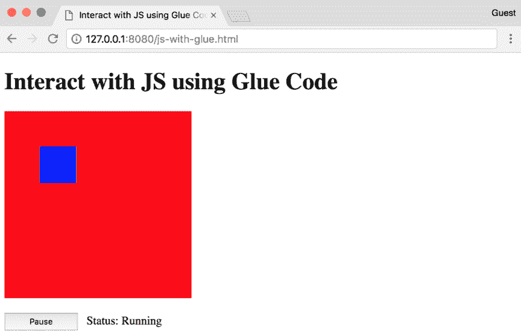
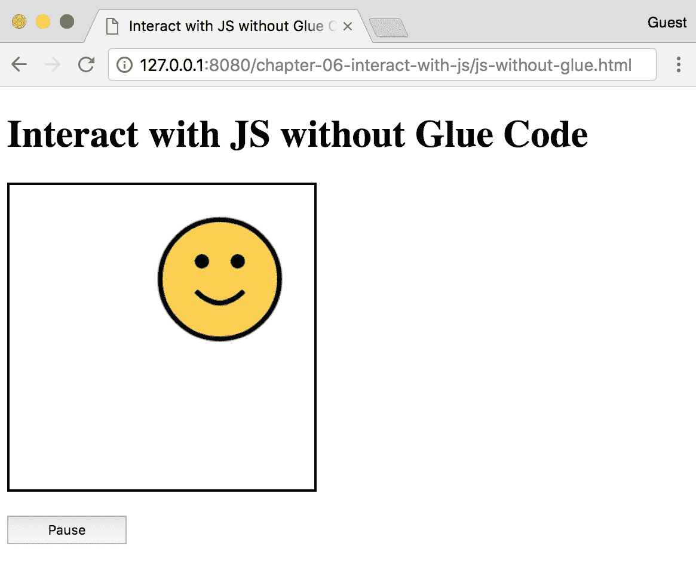
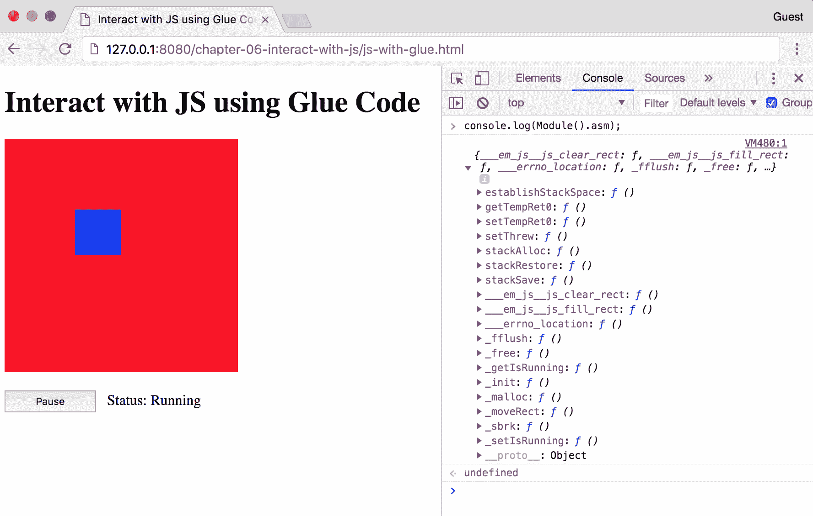
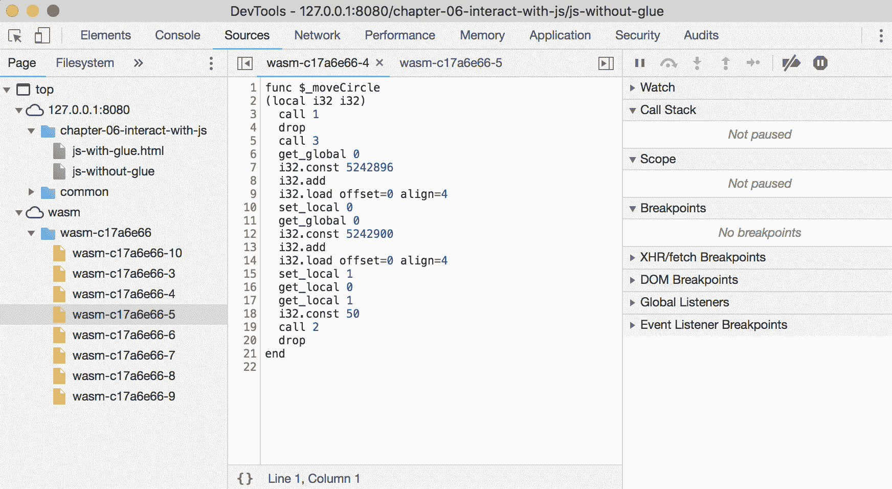
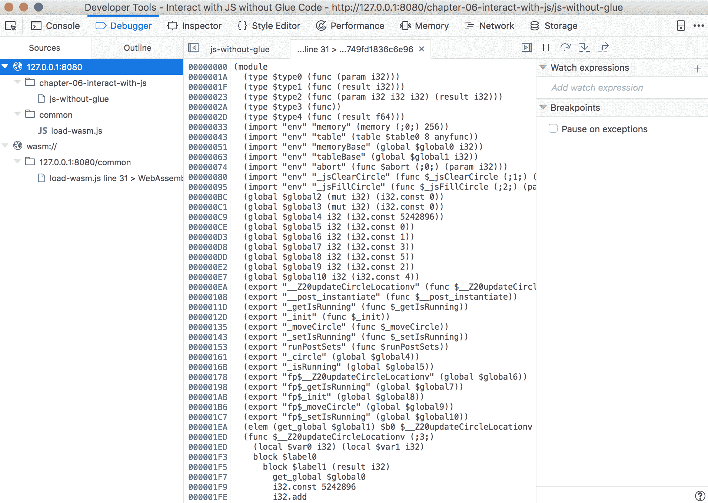

# 第六章：与 JavaScript 交互和调试

WebAssembly 中有许多令人兴奋的功能和提案。然而，在撰写本书时，功能集相当有限。就目前而言，您可以从 Emscripten 提供的一些功能中获益良多。从 JavaScript 与 C/C++交互（反之亦然）的过程将取决于您是否决定使用 Emscripten。

在本章中，我们将介绍如何使用 JavaScript 函数与 C/C++代码以及如何与 JavaScript 中编译输出的 C/C++代码进行交互。我们还将描述 Emscripten 的*glue*代码如何影响 Wasm 实例的使用方式以及如何在浏览器中调试编译代码。

本章的目标是理解以下内容：

+   Emscripten 的`Module`与浏览器的`WebAssembly`对象之间的差异

+   如何从您的 JavaScript 代码中调用编译后的 C/C++函数

+   如何从您的 C/C++代码中调用 JavaScript 函数

+   在使用 C++时需要注意的特殊考虑事项

+   在浏览器中调试编译输出的技术

# Emscripten 模块与 WebAssembly 对象

在上一章中，我们简要介绍了 Emscripten 的`Module`对象以及如何在浏览器中加载它。`Module`对象提供了几种方便的方法，并且与浏览器的`WebAssembly`对象有很大的不同。在本节中，我们将更详细地回顾 Emscripten 的`Module`对象。我们还将讨论 Emscripten 的`Module`与 WebAssembly 的*JavaScript API*中描述的对象之间的差异。

# 什么是 Emscripten 模块？

Emscripten 的官方网站为`Module`对象提供了以下定义：

“Module 是一个全局 JavaScript 对象，Emscripten 生成的代码在其执行的各个点上调用它的属性。”

`Module`不仅在加载过程上与 WebAssembly 的`compile`和`instantiate`函数不同，而且`Module`在全局范围内提供了一些有用的功能，否则在 WebAssembly 中需要自定义实现。在获取和加载 Emscripten 的 JavaScript *glue*代码后，`Module`在全局范围内(`window.Module`)可用。

# 胶水代码中的默认方法

Emscripten 的`Module`对象提供了一些默认方法和属性，以帮助调试和确保编译代码的成功执行。您可以利用`preRun`和`postRun`属性在`run()`函数调用之前或之后执行 JavaScript 代码，或将`print()`和`printErr()`函数的输出导入页面上的 HTML 元素。我们将在本书的后面使用其中一些方法。您可以在[`kripken.github.io/emscripten-site/docs/api_reference/module.html`](https://kripken.github.io/emscripten-site/docs/api_reference/module.html)了解更多信息。

# WebAssembly 对象的差异

我们在第五章中介绍了浏览器的 WebAssembly 对象和相应的加载过程，*创建和加载 WebAssembly 模块*。WebAssembly 的 JavaScript 和 Web API 定义了浏览器的`window.WebAssembly`对象中可用的对象和方法。Emscripten 的`Module`可以看作是 WebAssembly 的`Module`和`Instance`对象的组合，这些对象存在于 WebAssembly 的实例化函数返回的`result`对象中。通过将`-s MODULARIZE=1`标志传递给`emcc`命令，我们能够复制 WebAssembly 的实例化方法（在一定程度上）。随着我们评估在即将到来的章节中集成 JavaScript 和 C/C++的方法，我们将更详细地检查 Emscripten 的`Module`与浏览器的`WebAssembly`对象之间的差异。

# 从 JavaScript 调用编译后的 C/C++函数

从 Wasm 实例调用函数是一个相对简单的过程，无论是否使用 Emscripten 的粘合代码。利用 Emscripten 的 API 可以提供更广泛的功能和集成，但需要将粘合代码与`.wasm`文件一起包含。在本节中，我们将回顾通过 JavaScript 与编译后的 Wasm 实例进行交互的方法以及 Emscripten 提供的附加工具。

# 从 Module 调用函数

Emscripten 提供了两个函数来从 JavaScript 调用编译后的 C/C++函数：`ccall()`和`cwrap()`。这两个函数都存在于`Module`对象中。决定使用哪一个取决于函数是否会被多次调用。以下内容摘自 Emscripten 的 API 参考文档`preamble.js`，可以在[`kripken.github.io/emscripten-site/docs/api_reference/preamble.js.html`](http://kripken.github.io/emscripten-site/docs/api_reference/preamble.js.html)上查看。

在使用`ccall()`或`cwrap()`时，不需要在函数调用前加上`_`前缀，只需使用 C/C++文件中指定的名称。

# Module.ccall()

`Module.ccall()`从 JavaScript 调用编译后的 C 函数，并返回该函数的结果。`Module.ccall()`的函数签名如下：

```cpp
ccall(ident, returnType, argTypes, args, opts)
```

在`returnType`和`argTypes`参数中必须指定类型名称。可能的类型有`"number"`、`"string"`、`"array"`和`"boolean"`，分别对应适当的 JavaScript 类型。不能在`returnType`参数中指定`"array"`，因为无法知道数组的长度。如果函数不返回任何内容，可以为`returnType`指定`null`（注意没有引号）。

`opts`参数是一个可选的选项对象，可以包含一个名为`async`的布尔属性。为此属性指定值`true`意味着调用将执行异步操作。我们不会在任何示例中使用此参数，但如果您想了解更多信息，可以在文档[`kripken.github.io/emscripten-site/docs/api_reference/preamble.js.html#calling-compiled-c-functions-from-javascript`](http://kripken.github.io/emscripten-site/docs/api_reference/preamble.js.html#calling-compiled-c-functions-from-javascript)中找到。

让我们看一个`ccall()`的例子。以下代码取自 Emscripten 网站，演示了如何从 C 文件的编译输出中调用名为`c_add()`的函数：

```cpp
// Call C from JavaScript
var result = Module.ccall(
  'c_add', // name of C function
  'number', // return type
  ['number', 'number'], // argument types
  [10, 20] // arguments
);

// result is 30
```

# Module.cwrap()

`Module.cwrap()`类似于`ccall()`，它调用一个编译后的 C 函数。然而，它不是返回一个值，而是返回一个 JavaScript 函数，可以根据需要重复使用。`Module.cwrap()`的函数签名如下：

```cpp
cwrap(ident, returnType, argTypes)
```

与`ccall()`一样，您可以指定代表`returnType`和`argTypes`参数的字符串值。在调用函数时，不能在`argTypes`中使用`"array"`类型，因为无法知道数组的长度。对于不返回值的函数，可以在`returnType`参数中使用`null`（不带引号）。

以下代码取自 Emscripten 网站，演示了如何使用`cwrap()`创建可重用的函数：

```cpp
// Call C from JavaScript
var c_javascript_add = Module.cwrap(
  'c_add', // name of C function
  'number', // return type
  ['number', 'number'] // argument types
);

// Call c_javascript_add normally
console.log(c_javascript_add(10, 20)); // 30
console.log(c_javascript_add(20, 30)); // 50
```

# C++和名称修饰

您可能已经注意到，`ccall()`和`cwrap()`的描述指出两者都用于调用编译后的 C 函数。故意省略了 C++，因为需要额外的步骤才能从 C++文件中调用函数。C++支持函数重载，这意味着可以多次使用相同的函数名称，但对每个函数传递不同的参数以获得不同的结果。以下是使用函数重载的一些代码示例：

```cpp
int addNumbers(int num1, int num2) {
    return num1 + num2;
}

int addNumbers(int num1, int num2, int num3) {
    return num1 + num2 + num3;
}

int addNumbers(int num1, int num2, int num3, int num4) {
    return num1 + num2 + num3 + num4;
}

// The function will return a value based on how many
// arguments you pass it:
int getSumOfTwoNumbers = addNumbers(1, 2);
// returns 3

int getSumOfThreeNumbers = addNumbers(1, 2, 3);
// returns 6

int getSumOfFourNumbers = addNumbers(1, 2, 3, 4);
// returns 10
```

编译器需要区分这些函数。如果它使用了名称`addNumbers`，并且您尝试在一个地方用两个参数调用该函数，在另一个地方用三个参数调用该函数，那么它将失败。要在编译后的 Wasm 中按名称调用函数，您需要将函数包装在`extern`块中。包装函数的一个影响是您必须明确为每个条件定义函数。以下代码片段演示了如何实现之前的函数而不进行名称混淆：

```cpp
extern "C" {
int addTwoNumbers(int num1, int num2) {
    return num1 + num2;
}

int addThreeNumbers(int num1, int num2, int num3) {
    return num1 + num2 + num3;
}

int addFourNumbers(int num1, int num2, int num3, int num4) {
    return num1 + num2 + num3 + num4;
}
}
```

# 从 WebAssembly 实例调用函数

我们在上一章中演示了如何从 JavaScript 中调用 Wasm 实例中的函数，但那是假设您在浏览器中实例化了一个模块而没有粘合代码。Emscripten 还提供了从 Wasm 实例调用函数的能力。在模块实例化后，您可以通过从已解析的`Promise`的结果中访问的`instance.exports`对象来调用函数。MDN 的文档为`WebAssembly.instantiateStreaming`提供了以下函数签名：

```cpp
Promise<ResultObject> WebAssembly.instantiateStreaming(source, importObject);
```

根据您的浏览器，您可能需要使用`WebAssembly.instantiate()`方法。Chrome 目前支持`WebAssembly.instantiateStreaming()`，但如果在尝试加载模块时遇到错误，请改用`WebAssembly.instantiate()`方法。

`ResultObject`包含我们需要引用的`instance`对象，以便从模块中调用导出的函数。以下是调用编译后的 Wasm 实例中名为`_addTwoNumbers`的函数的一些代码：

```cpp
// Assume the importObj is already defined.
WebAssembly.instantiateStreaming(
  fetch('simple.wasm'),
  importObj
)
  .then(result => {
    const addedNumbers = result.instance.exports._addTwoNumbers(1, 2);
    // result is 3
  });
```

Emscripten 提供了一种以类似的方式执行函数调用的方法，尽管实现略有不同。如果使用类似 Promise 的 API，您可以从`Module()`解析出的`asm`对象中访问函数。以下示例演示了如何利用这个功能：

```cpp
// Using Emscripten's Module
Module()
  .then(result => {
    // "asm" is essentially "instance"
    const exports = result.asm;
    const addedNumbers = exports._addTwoNumbers(1, 2);
    // result is 3
  });
```

使用 Emscripten 复制 WebAssembly 的 Web API 语法可以简化任何未来的重构。如果决定使用 WebAssembly 的 Web API，您可以轻松地将`Module()`替换为 WebAssembly 的`instantiateStreaming()`方法，并将`result.asm`替换为`result.instance`。

# 从 C/C++调用 JavaScript 函数

从 C/C++代码访问 JavaScript 的功能可以在使用 WebAssembly 时增加灵活性。在 Emscripten 的粘合代码和仅使用 Wasm 的实现之间，利用 JavaScript 的方法和手段有很大的不同。在本节中，我们将介绍您可以在 C/C++代码中集成 JavaScript 的各种方式，无论是否使用 Emscripten。

# 使用粘合代码与 JavaScript 交互

Emscripten 提供了几种将 JavaScript 与 C/C++代码集成的技术。可用的技术在实现和复杂性上有所不同，有些只适用于特定的执行环境（例如浏览器）。决定使用哪种技术取决于您的具体用例。我们将重点介绍`emscripten_run_script()`函数和使用`EM_*`包装器内联 JavaScript 的内容。以下部分的内容取自 Emscripten 网站的*与代码交互*部分，网址为[`kripken.github.io/emscripten-site/docs/porting/connecting_cpp_and_javascript/Interacting-with-code.html#interacting-with-code`](https://kripken.github.io/emscripten-site/docs/porting/connecting_cpp_and_javascript/Interacting-with-code.html#interacting-with-code)。

# 使用`emscripten_run_script()`执行字符串。

Emscripten 网站将`emscripten_run_script()`函数描述为调用 JavaScript 进行 C/C++的最直接但略慢的方法。这是一种非常适合单行 JavaScript 代码的技术，并且对于调试非常有用。文档说明它有效地使用`eval()`运行代码，`eval()`是一个执行字符串作为代码的 JavaScript 函数。以下代码取自 Emscripten 网站，演示了使用`emscripten_run_script()`调用浏览器的`alert()`函数并显示文本`'hi'`的方法：

```cpp
emscripten_run_script("alert('hi')");
```

对于性能是一个因素的更复杂的用例，使用*内联 JavaScript*提供了更好的解决方案。

# 使用 EM_ASM()执行内联 JavaScript()

您可以在 C/C++文件中使用`EM_ASM()`包装 JavaScript 代码，并在浏览器中运行编译后的代码时执行它。以下代码演示了基本用法：

```cpp
#include <emscripten.h>

int main() {
    EM_ASM(
        console.log('This is some JS code.');
    );
    return 0;
}
```

JavaScript 代码会立即执行，并且无法在包含它的 C/C++文件中重复使用。参数可以传递到 JavaScript 代码块中，其中它们作为变量`$0`，`$1`等到达。这些参数可以是`int32_t`或`double`类型。以下代码片段取自 Emscripten 网站，演示了如何在`EM_ASM()`块中使用参数：

```cpp
EM_ASM({
    console.log('I received: ' + [ $0, $1 ]);
}, 100, 35.5);
```

# 重用内联 JavaScript 与 EM_JS()

如果您需要在 C/C++文件中使用可重用的函数，可以将 JavaScript 代码包装在`EM_JS()`块中，并像普通的 C/C++函数一样执行它。`EM_JS()`的定义如下代码片段所示：

```cpp
EM_JS(return_type, function_name, arguments, code)
```

`return_type`参数表示与 JavaScript 代码输出对应的 C 类型（例如`int`或`float`）。如果从 JavaScript 代码中没有返回任何内容，请为`return_type`指定`void`。下一个参数`function_name`表示在从 C/C++文件的其他位置调用 JavaScript 代码时要使用的名称。`arguments`参数用于定义可以从 C 调用函数传递到 JavaScript 代码中的参数。`code`参数是用大括号括起来的 JavaScript 代码。以下代码片段取自 Emscripten 网站，演示了在 C 文件中使用`EM_JS()`的方法：

```cpp
#include <emscripten.h>

EM_JS(void, take_args, (int x, float y), {
    console.log(`I received ${x} and ${y}`);
});

int main() {
    take_args(100, 35.5);
    return 0;
}
```

# 使用粘合代码的示例

让我们编写一些代码来利用所有这些功能。在本节中，我们将修改我们在第五章中使用的代码，即*编译 C 而不使用粘合代码*和*获取和实例化 Wasm 文件*部分，*创建和加载 WebAssembly 模块*。这是显示在红色画布上移动的蓝色矩形的代码，并且可以通过单击按钮暂停和重新启动。本节的代码位于`learn-webassembly`存储库中的`/chapter-06-interact-with-js`文件夹中。让我们首先更新 C 代码。

# C 代码

在您的`/book-examples`文件夹中创建一个名为`/chapter-06-interact-with-js`的新文件夹。在`/chapter-06-interact-with-js`文件夹中创建一个名为`js-with-glue.c`的新文件，并填充以下内容：

```cpp
/*
 * This file interacts with the canvas through imported functions.
 * It moves a blue rectangle diagonally across the canvas
 * (mimics the SDL example).
 */
#include <emscripten.h>
#include <stdbool.h>

#define BOUNDS 255
#define RECT_SIDE 50
#define BOUNCE_POINT (BOUNDS - RECT_SIDE)

bool isRunning = true;

typedef struct Rect {
  int x;
  int y;
  char direction;
} Rect;

struct Rect rect;

/*
 * Updates the rectangle location by 1px in the x and y in a
 * direction based on its current position.
 */
void updateRectLocation() {
    // Since we want the rectangle to "bump" into the edge of the
    // canvas, we need to determine when the right edge of the
    // rectangle encounters the bounds of the canvas, which is why
    // we're using the canvas width - rectangle width:
    if (rect.x == BOUNCE_POINT) rect.direction = 'L';

    // As soon as the rectangle "bumps" into the left side of the
    // canvas, it should change direction again.
    if (rect.x == 0) rect.direction = 'R';

    // If the direction has changed based on the x and y
    // coordinates, ensure the x and y points update
    // accordingly:
    int incrementer = 1;
    if (rect.direction == 'L') incrementer = -1;
    rect.x = rect.x + incrementer;
    rect.y = rect.y + incrementer;
}

EM_JS(void, js_clear_rect, (), {
    // Clear the rectangle to ensure there's no color where it
    // was before:
    var canvas = document.querySelector('#myCanvas');
    var ctx = canvas.getContext('2d');
    ctx.fillStyle = '#ff0000';
    ctx.fillRect(0, 0, 255, 255);
});

EM_JS(void, js_fill_rect, (int x, int y, int width, int height), {
    // Fill the rectangle with blue in the specified coordinates:
    var canvas = document.querySelector('#myCanvas');
    var ctx = canvas.getContext('2d');
    ctx.fillStyle = '#0000ff';
    ctx.fillRect(x, y, width, height);
});

/*
 * Clear the existing rectangle element from the canvas and draw a
 * new one in the updated location.
 */
EMSCRIPTEN_KEEPALIVE
void moveRect() {
    // Event though the js_clear_rect doesn't have any
    // parameters, we pass 0 in to prevent a compiler warning:
    js_clear_rect(0);
    updateRectLocation();
    js_fill_rect(rect.x, rect.y, RECT_SIDE, RECT_SIDE);
}

EMSCRIPTEN_KEEPALIVE
bool getIsRunning() {
    return isRunning;
}

EMSCRIPTEN_KEEPALIVE
void setIsRunning(bool newIsRunning) {
    isRunning = newIsRunning;
    EM_ASM({
        // isRunning is either 0 or 1, but in JavaScript, 0
        // is "falsy", so we can set the status text based
        // without explicitly checking if the value is 0 or 1:
        var newStatus = $0 ? 'Running' : 'Paused';
        document.querySelector('#runStatus').innerHTML = newStatus;
    }, isRunning);
}

EMSCRIPTEN_KEEPALIVE
void init() {
    emscripten_run_script("console.log('Initializing rectangle...')");
    rect.x = 0;
    rect.y = 0;
    rect.direction = 'R';
    setIsRunning(true);
    emscripten_run_script("console.log('Rectangle should be moving!')");
}
```

您可以看到我们使用了 Emscripten 提供的所有三种 JavaScript 集成。有两个函数`js_clear_rect()`和`js_fill_rect()`，它们在`EM_JS()`块中定义，代替了原始示例中导入的函数。`setIsRunning()`函数中的`EM_ASM()`块更新了我们将添加到 HTML 代码中的新状态元素的文本。`emscripten_run_script()`函数只是简单地记录一些状态消息。我们需要在我们计划在模块外部使用的函数上方指定`EMSCRIPTEN_KEEPALIVE`。如果不指定这一点，编译器将把这些函数视为死代码并将其删除。

# HTML 代码

让我们在`/chapter-06-interact-with-js`文件夹中创建一个名为`js-with-glue.html`的文件，并填充以下内容：

```cpp
<!doctype html>
<html lang="en-us">
<head>
  <title>Interact with JS using Glue Code</title>
</head>
<body>
  <h1>Interact with JS using Glue Code</h1>
  <canvas id="myCanvas" width="255" height="255"></canvas>
  <div style="margin-top: 16px;">
    <button id="actionButton" style="width: 100px; height: 24px;">Pause</button>
    <span style="width: 100px; margin-left: 8px;">Status:</span>
    <span id="runStatus" style="width: 100px;"></span>
  </div>
  <script type="application/javascript" src="img/js-with-glue.js"></script>
  <script type="application/javascript">
    Module()
      .then(result => {
        const m = result.asm;
        m._init();

        // Move the rectangle by 1px in the x and y every 20 milliseconds:
        const loopRectMotion = () => {
          setTimeout(() => {
            m._moveRect();
            if (m._getIsRunning()) loopRectMotion();
          }, 20)
        };

        // Enable you to pause and resume the rectangle movement:
        document.querySelector('#actionButton')
          .addEventListener('click', event => {
            const newIsRunning = !m._getIsRunning();
            m._setIsRunning(newIsRunning);
            event.target.innerHTML = newIsRunning ? 'Pause' : 'Start';
            if (newIsRunning) loopRectMotion();
          });

        loopRectMotion();
      });
  </script>
</body>
</html>
```

我们添加了两个`<span>`元素来显示矩形移动的状态，以及相应的标签。我们使用 Emscripten 的类似 Promise 的 API 来加载模块并引用编译代码中的函数。我们不再将`_jsFillRect`和`_jsClearRect`函数传递给模块，因为我们在`js-with-glue.c`文件中处理了这个问题。

# 编译和提供结果

要编译代码，请确保你在`/chapter-06-interact-with-js`文件夹中，并运行以下命令：

```cpp
emcc js-with-glue.c -O3 -s WASM=1 -s MODULARIZE=1 -o js-with-glue.js
```

完成后，运行以下命令启动本地服务器：

```cpp
serve -l 8080
```

打开浏览器，转到`http://127.0.0.1:8080/js-with-glue.html`。你应该会看到类似这样的东西：



在浏览器中运行胶水代码

如果你按下暂停按钮，按钮上的标题应该会变成开始，状态旁边的文本应该会变成暂停，矩形应该会停止移动。

# 无需胶水代码与 JavaScript 交互

在 C/C++文件中利用 JavaScript 代码遵循与 Emscripten 使用的技术不同的范例。你不是在 C/C++文件中编写 JavaScript，而是将函数传递到你的 WebAssembly 实例化代码中。在本节中，我们将更详细地描述这个过程。

# 使用导入对象将 JavaScript 传递给 C/C++

为了在你的 C/C++代码中利用 JavaScript 的功能，你需要向传递到 WebAssembly 实例化函数的`importObj.env`参数中添加一个函数定义。你可以在`importObj.env`之外或内联定义函数。以下代码片段演示了每个选项：

```cpp
// You can define the function inside of the env object:
const env = {
  // Make sure you prefix the function name with "_"!
  _logValueToConsole: value => {
    console.log(`'The value is ${value}'`);
  }
};

// Or define it outside of env and reference it within env:
const logValueToConsole = value => {
  console.log(`'The value is ${value}'`);
};

const env = {
  _logValueToConsole: logValueToConsole
};
```

考虑到 C、C++和 Rust 的手动内存管理和严格类型要求，你在 Wasm 模块中可以传递和利用的内容是有限的。JavaScript 允许你在代码执行过程中轻松地添加、删除和更改对象的属性值。你甚至可以通过向内置语言特性的`prototype`添加函数来扩展语言。C、C++和 Rust 更加严格，如果你不熟悉这些语言，要充分利用 WebAssembly 可能会很困难。

# 在 C/C++中调用导入的函数

你需要在使用`importObj.env`的 C/C++代码中定义你传递的 JavaScript 函数。函数签名必须与你传递的相匹配。以下示例更详细地演示了这一点。以下是与编译的 C 文件(`index.html`)交互的 JavaScript 代码：

```cpp
// index.html <script> contents
const env = {
  _logAndMultiplyTwoNums: (num1, num2) => {
    const result = num1 * num2;
    console.log(result);
    return result;
  },
};

loadWasm('main.wasm', { env })
  .then(({ instance }) => {
    const result = instance.exports._callMultiply(5.5, 10);
    console.log(result);
    // 55 is logged to the console twice
  });
```

这是`main.c`的内容，它被编译为`main.wasm`并在`index.html`中使用：

```cpp
// main.c (compiled to main.wasm)
extern float logAndMultiplyTwoNums(float num1, float num2);

float callMultiply(float num1, float num2) {
    return logAndMultiplyTwoNums(num1, num2);
}
```

你调用 C/C++中的 JavaScript 函数的方式与调用普通的 C/C++函数相同。虽然当你将它传递到`importObj.env`时，你需要在你的函数前加上`_`，但在 C/C++文件中定义时，你不需要包括前缀。

# 一个没有胶水代码的例子

来自第五章的*编译不使用胶水代码的 C*和*获取和实例化 Wasm 文件*部分的示例代码演示了如何在我们的 C 文件中集成 JavaScript 而不使用 Emscripten 的胶水代码。在本节中，我们将稍微修改示例代码，并将文件类型更改为 C++。

# C++代码

在你的`/chapter-06-interact-with-js`文件夹中创建一个名为`js-without-glue.cpp`的文件，并填充以下内容：

```cpp
/*
 * This file interacts with the canvas through imported functions.
 * It moves a circle diagonally across the canvas.
 */
#define BOUNDS 255
#define CIRCLE_RADIUS 50
#define BOUNCE_POINT (BOUNDS - CIRCLE_RADIUS)

bool isRunning = true;

typedef struct Circle {
  int x;
  int y;
  char direction;
} Circle;

struct Circle circle;

/*
 * Updates the circle location by 1px in the x and y in a
 * direction based on its current position.
 */
void updateCircleLocation() {
    // Since we want the circle to "bump" into the edge of the canvas,
    // we need to determine when the right edge of the circle
    // encounters the bounds of the canvas, which is why we're using
    // the canvas width - circle width:
    if (circle.x == BOUNCE_POINT) circle.direction = 'L';

    // As soon as the circle "bumps" into the left side of the
    // canvas, it should change direction again.
    if (circle.x == CIRCLE_RADIUS) circle.direction = 'R';

    // If the direction has changed based on the x and y
    // coordinates, ensure the x and y points update accordingly:
    int incrementer = 1;
    if (circle.direction == 'L') incrementer = -1;
    circle.x = circle.x + incrementer;
    circle.y = circle.y - incrementer;
}

// We need to wrap any imported or exported functions in an
// extern block, otherwise the function names will be mangled.
extern "C" {
// These functions are passed in through the importObj.env object
// and update the circle on the <canvas>:
extern int jsClearCircle();
extern int jsFillCircle(int x, int y, int radius);

/*
 * Clear the existing circle element from the canvas and draw a
 * new one in the updated location.
 */
void moveCircle() {
    jsClearCircle();
    updateCircleLocation();
    jsFillCircle(circle.x, circle.y, CIRCLE_RADIUS);
}

bool getIsRunning() {
    return isRunning;
}

void setIsRunning(bool newIsRunning) {
    isRunning = newIsRunning;
}

void init() {
    circle.x = 0;
    circle.y = 255;
    circle.direction = 'R';
    setIsRunning(true);
}
}
```

这段代码与之前的例子类似，但画布上元素的形状和方向已经改变。现在，元素是一个圆，从画布的左下角开始，沿对角线向右上移动。

# HTML 代码

接下来，在你的`/chapter-06-interact-with-js`文件夹中创建一个名为`js-without-glue.html`的文件，并填充以下内容：

```cpp
<!doctype html>
<html lang="en-us">
<head>
  <title>Interact with JS without Glue Code</title>
  <script
    type="application/javascript"
    src="img/load-wasm.js">
  </script>
  <style>
    #myCanvas {
      border: 2px solid black;
    }
    #actionButtonWrapper {
      margin-top: 16px;
    }
    #actionButton {
      width: 100px;
      height: 24px;
    }
  </style>
</head>
<body>
  <h1>Interact with JS without Glue Code</h1>
  <canvas id="myCanvas" width="255" height="255"></canvas>
  <div id="actionButtonWrapper">
    <button id="actionButton">Pause</button>
  </div>
  <script type="application/javascript">
    const canvas = document.querySelector('#myCanvas');
    const ctx = canvas.getContext('2d');

    const fillCircle = (x, y, radius) => {
      ctx.fillStyle = '#fed530';
      // Face outline:
      ctx.beginPath();
      ctx.arc(x, y, radius, 0, 2 * Math.PI);
      ctx.fill();
      ctx.stroke();
      ctx.closePath();

      // Eyes:
      ctx.fillStyle = '#000000';
      ctx.beginPath();
      ctx.arc(x - 15, y - 15, 6, 0, 2 * Math.PI);
      ctx.arc(x + 15, y - 15, 6, 0, 2 * Math.PI);
      ctx.fill();
      ctx.closePath();

      // Mouth:
      ctx.beginPath();
      ctx.moveTo(x - 20, y + 10);
      ctx.quadraticCurveTo(x, y + 30, x + 20, y + 10);
      ctx.lineWidth = 4;
      ctx.stroke();
      ctx.closePath();
    };

    const env = {
      table: new WebAssembly.Table({ initial: 8, element: 'anyfunc' }),
      _jsFillCircle: fillCircle,
      _jsClearCircle: function() {
        ctx.fillStyle = '#fff';
        ctx.fillRect(0, 0, 255, 255);
      },
    };

    loadWasm('js-without-glue.wasm', { env }).then(({ instance }) => {
      const m = instance.exports;
      m._init();

      // Move the circle by 1px in the x and y every 20 milliseconds:
      const loopCircleMotion = () => {
        setTimeout(() => {
          m._moveCircle();
          if (m._getIsRunning()) loopCircleMotion();
        }, 20)
      };

      // Enable you to pause and resume the circle movement:
      document.querySelector('#actionButton')
        .addEventListener('click', event => {
          const newIsRunning = !m._getIsRunning();
          m._setIsRunning(newIsRunning);
          event.target.innerHTML = newIsRunning ? 'Pause' : 'Start';
          if (newIsRunning) loopCircleMotion();
        });

      loopCircleMotion();
    });
  </script>
</body>
</html>
```

我们可以使用 canvas 元素的 2D 上下文上可用的函数手动绘制路径，而不是使用`rect()`元素。

# 编译和提供结果

我们只生成了一个 Wasm 模块，因此可以使用我们在上一章中设置的构建任务来编译我们的代码。选择任务 | 运行构建任务...或使用键盘快捷键*Ctrl*/*Cmd* + *Shift* + *B*来编译代码。如果您不使用 VS Code，请在`/chapter-06-interact-with-js`文件夹中打开 CLI 实例并运行以下命令：

```cpp
emcc js-without-glue.cpp -Os -s WASM=1 -s SIDE_MODULE=1 -s BINARYEN_ASYNC_COMPILATION=0 -o js-without-glue.wasm
```

完成后，在`/book-examples`文件夹中打开终端，并运行以下命令启动本地服务器：

```cpp
serve -l 8080
```

打开浏览器并导航到`http://127.0.0.1:8080/chapter-06-interact-with-js/js-without-glue.html`。您应该会看到类似以下的内容：



在浏览器中运行的 Wasm 模块，无需粘合代码

与之前的示例一样，如果按下暂停按钮，则按钮上的标题应更改为开始，并且圆圈应停止移动。

# 高级 Emscripten 功能

我们在前面的部分中介绍了我们将在 JavaScript 和 C/C++之间频繁使用的 Emscripten 功能，但这并不是 Emscripten 提供的唯一功能。还有一些高级功能和额外的 API，您需要了解，特别是如果您计划向应用程序添加更复杂的功能。在本节中，我们将简要介绍一些这些高级功能，并提供有关您可以了解更多信息的详细信息。

# Embind

Embind 是 Emscripten 提供的用于连接 JavaScript 和 C++的附加功能。Emscripten 的网站提供了以下描述：

"Embind 用于将 C++函数和类绑定到 JavaScript，以便编译后的代码可以被'普通'JavaScript 以自然的方式使用。Embind 还支持从 C++调用 JavaScript 类。"

Embind 是一个强大的功能，允许 JavaScript 和 C++之间进行紧密集成。您可以将一些 C++代码包装在`EMSCRIPTEN_BINDINGS()`块中，并通过浏览器中的`Module`对象引用它。让我们看一个来自 Emscripten 网站的例子。以下文件`example.cpp`使用`emcc`的`--bind`标志编译：

```cpp
// example.cpp
#include <emscripten/bind.h>

using namespace emscripten;

float lerp(float a, float b, float t) {
    return (1 - t) * a + t * b;
}

EMSCRIPTEN_BINDINGS(my_module) {
    function("lerp", &lerp);
}
```

生成的模块在`example.html`中加载，并调用`lerp()`函数：

```cpp
<!-- example.html -->
<!doctype html>
<html>
<script src="img/example.js"></script>
<script>
  // example.js was generated by running this command:
  // emcc --bind -o example.js example.cpp
  console.log('lerp result: ' + Module.lerp(1, 2, 0.5));
</script>
</html>
```

上述示例仅代表 Embind 功能的一小部分。您可以在[`kripken.github.io/emscripten-site/docs/porting/connecting_cpp_and_javascript/embind.html`](https://kripken.github.io/emscripten-site/docs/porting/connecting_cpp_and_javascript/embind.html)了解更多关于 Embind 的信息。

# 文件系统 API

Emscripten 通过使用 FS 库提供对文件操作的支持，并公开了一个用于处理文件系统的 API。但是，默认情况下在编译项目时不会包含它，因为它可能会显著增加文件的大小。如果您的 C/C++代码使用文件，该库将自动添加。文件系统类型根据执行环境而异。例如，如果在 worker 内运行代码，则可以使用`WORKERFS`文件系统。默认情况下使用`MEMFS`，它将数据存储在内存中，当页面重新加载时，内存中的任何数据都将丢失。您可以在[`kripken.github.io/emscripten-site/docs/api_reference/Filesystem-API.html#filesystem-api`](https://kripken.github.io/emscripten-site/docs/api_reference/Filesystem-API.html#filesystem-api)阅读有关文件系统 API 的更多信息。

# Fetch API

Emscripten 还提供了 Fetch API。以下内容摘自文档：

"Emscripten Fetch API 允许本机代码通过 XHR（HTTP GET、PUT、POST）从远程服务器传输文件，并将下载的文件持久存储在浏览器的 IndexedDB 存储中，以便可以在随后的页面访问中本地重新访问。Fetch API 可以从多个线程调用，并且可以根据需要同步或异步运行网络请求。"

Fetch API 可用于与 Emscripten 的其他功能集成。如果您需要获取 Emscripten 未使用的数据，应使用浏览器的 Fetch API ([`developer.mozilla.org/en-US/docs/Web/API/Fetch_API`](https://developer.mozilla.org/en-US/docs/Web/API/Fetch_API))。您可以在[`kripken.github.io/emscripten-site/docs/api_reference/fetch.html`](https://kripken.github.io/emscripten-site/docs/api_reference/fetch.html)上了解有关 Fetch API 的更多信息。

# 在浏览器中调试

在浏览器中有效地调试 JavaScript 代码并不总是容易的。然而，浏览器和具有内置调试功能的编辑器/IDE 的开发工具已经显著改进。不幸的是，将 WebAssembly 添加到 Web 应用程序会给调试过程增加额外的复杂性。在本节中，我们将回顾一些调试 JavaScript 并利用 Wasm 的技术，以及 Emscripten 提供的一些额外功能。

# 高级概述

调试 Emscripten 的`Module`相对比较简单。Emscripten 的错误消息形式良好且描述清晰，因此通常您会立即发现问题的原因。您可以在浏览器的开发工具控制台中查看这些消息。

如果在运行`emcc`命令时指定了`.html`输出，一些调试代码将已经内置（`Module.print`和`Module.printErr`）。在 HTML 文件中，加载代码设置了`window.onerror`事件来调用`Module.printErr`事件，因此您可以查看加载时发生的错误的详细信息。

您可能会遇到的一个常见错误是调用错误的函数名称。如果您正在使用 Emscripten 的类似 Promise 的 API，可以通过在浏览器控制台中运行以下代码来打印出可用的函数：

```cpp
console.log(Module().asm);
```

以下屏幕截图显示了我们在本章的*从 C/C++调用 JavaScript 函数*部分中使用的`js-with-glue.js`示例的输出：



在浏览器控制台中记录`Module().asm`的内容

您的函数以及 Emscripten 生成的一些函数将以`_`为前缀。编写可编译的代码的优势在于编译器将在前期捕获大多数错误。鉴于 C 和 C++等语言可用的广泛工具，您应该能够快速理解和解决这些错误。

如果您没有使用任何粘合代码，并且使用 WebAssembly 的 JavaScript 和 Web API 实例化 Wasm 文件，则调试可能会变得更加复杂。正如之前所述，您有优势可以在 C 或 C++代码的编译时捕获大多数错误。与 Emscripten 一样，浏览器开发工具控制台中打印出的错误消息提供了堆栈跟踪和相对清晰的问题描述。然而，如果您正在解决一个特别棘手的错误，记录到控制台可能会变得繁琐和难以管理。幸运的是，您可以使用源映射来提高调试能力。

# 使用源映射

Emscripten 有能力通过向编译器传递一些额外的标志来生成源映射。源映射允许浏览器将文件的源映射到应用程序中使用的文件。例如，您可以使用 JavaScript 构建工具（如 Webpack）在构建过程中对代码进行缩小。但是，如果您试图查找错误，导航和调试缩小的代码将变得非常困难。通过生成源映射，您可以在浏览器的开发工具中查看原始形式的代码，并设置断点进行调试。让我们为我们的`/chapter-06-interact-with-js/js-without-glue.cpp`文件生成一个源映射。在`/book-examples`文件夹中，在终端中运行以下命令：

```cpp
emcc chapter-06-interact-with-js/js-without-glue.cpp -O1 -g4 -s WASM=1 -s SIDE_MODULE=1 -s BINARYEN_ASYNC_COMPILATION=0 -o chapter-06-interact-with-js/js-without-glue.wasm --source-map-base http://localhost:8080/chapter-06-interact-with-js/
```

`-g4`参数启用源映射，而`--source-map-base`参数告诉浏览器在哪里找到源映射文件。编译后，通过运行以下命令从`/book-examples`文件夹启动本地服务器：

```cpp
serve -l 8080
```

转到`http://127.0.0.1:8080/chapter-06-interact-with-js/js-without-glue.html`，打开开发者工具，并选择源标签（在 Chrome 中）或调试器标签（在 Firefox 中）。如果您使用 Chrome，您应该会看到以下内容：



Chrome 开发者工具中的 Wasm 源映射

正如您所看到的，文件名并不是很有帮助。每个文件应该在顶部包含函数名称，尽管其中一些名称可能已经被搅乱。如果遇到错误，您可以设置断点，Chrome 的调试功能允许您导航调用堆栈。Firefox 以不同的方式处理它们的源映射。以下截图显示了 Firefox 的开发者工具中的调试器视图：



Firefox 开发者工具中的 Wasm 源映射

源映射是一个包含 Wasm 文件的 Wat 表示的单个文件。您也可以在这里设置断点和调试代码。随着 WebAssembly 的发展，将会有更多（和更好）的工具可用。与此同时，记录到控制台和利用源映射是您可以使用的当前调试方法。

# 总结

在本章中，我们专注于 JavaScript 和 C/C++之间的互联，Emscripten 提供的一些功能，以及如何有效地调试在浏览器中使用 Wasm 的 Web 应用程序。我们回顾了从 JavaScript 调用编译后的 C/C++函数的各种方法，以及如何将 JavaScript 与您的 C/C++代码集成。Emscripten 的 API 被提出作为一种理解如何通过在编译后的 Wasm 文件中包含粘合代码来克服 WebAssembly 当前限制的方法。即使 Emscripten 提供的功能不在官方的 WebAssembly *Core Specification*中（也许永远不会），这也不应该阻止您利用它们。最后，我们简要介绍了如何在浏览器中调试 Wasm 文件，以及 Emscripten 模块或 WebAssembly 实例的上下文。

在下一章中，我们将从头开始构建一个真实的 WebAssembly 应用程序。

# 问题

1.  您用于与浏览器中的编译代码交互的`Module`对象上的两个函数的名称是什么？

1.  您需要用什么来包装您的 C++代码，以确保函数名称不会被搅乱？

1.  `EM_ASM()`和`EM_JS()`之间有什么区别？

1.  `emscripten_run_script()`和`EM_ASM()`/`EM_JS()`中哪个更有效？

1.  如果您想在 C/C++代码之外使用它，您需要在函数上面的行中包含什么（提示：它以`EMSCRIPTEN`开头）？

1.  在哪里可以定义需要传递到`importObj.env`对象中的函数，当实例化模块时？

1.  Emscripten 提供了哪些额外的 API？

1.  源映射的目的是什么？

# 进一步阅读

+   Emscripten API 参考：[`kripken.github.io/emscripten-site/docs/api_reference/index.html`](http://kripken.github.io/emscripten-site/docs/api_reference/index.html)

+   源映射简介：[`blog.teamtreehouse.com/introduction-source-maps`](http://blog.teamtreehouse.com/introduction-source-maps)

+   使用浏览器调试 WebAssembly：[`webassemblycode.com/using-browsers-debug-webassembly`](http://webassemblycode.com/using-browsers-debug-webassembly)
