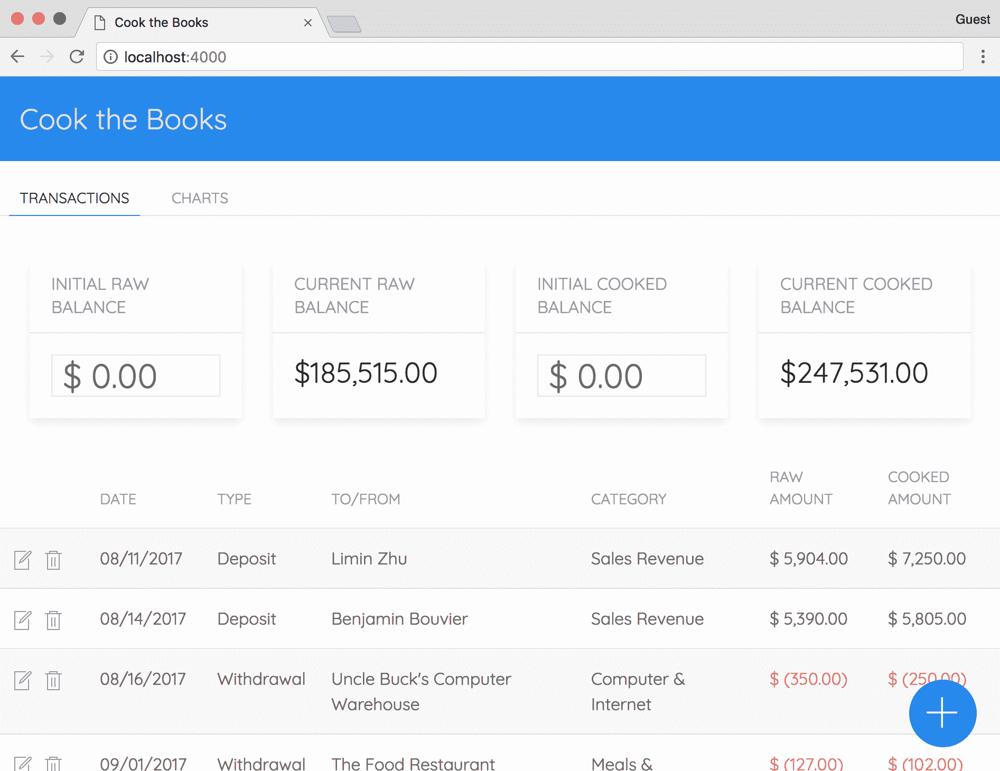
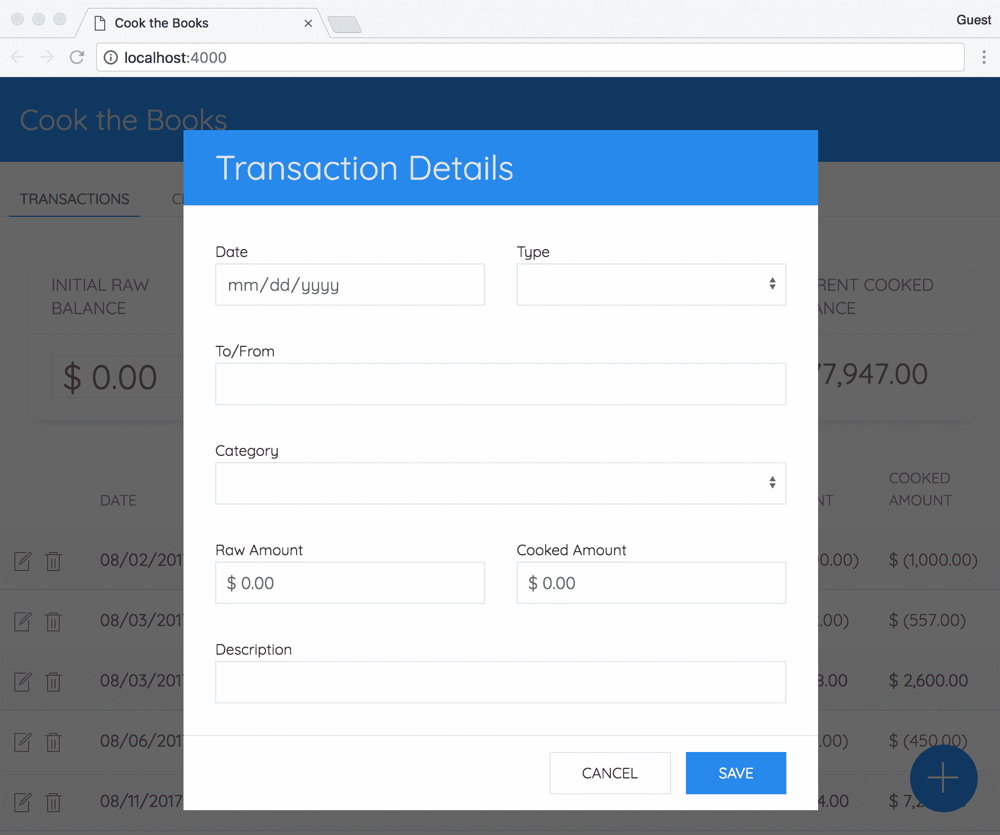
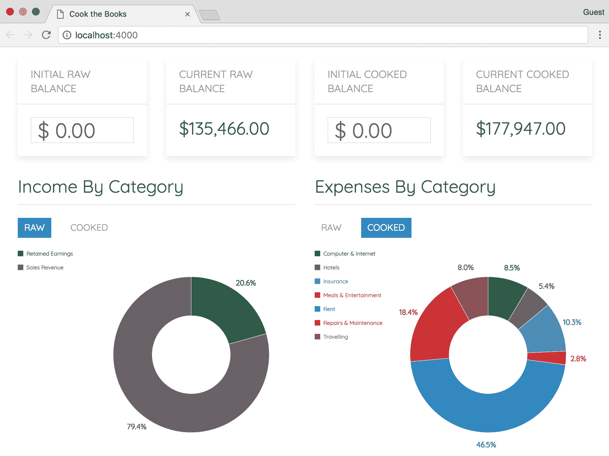

# 从头开始创建一个应用程序

现在是应用你的知识的时候了！由于 WebAssembly 的主要设计目标之一是在现有的 Web 平台内执行并与之很好地集成，因此构建一个 Web 应用程序来测试它是有意义的。即使 WebAssembly 的当前功能集相当有限，我们仍然可以在基本水平上利用这项技术。在本章中，我们将从头开始构建一个单页应用程序，该应用程序在*核心规范*的上下文中利用 Wasm 模块。

在本章结束时，您将知道如何：

+   编写使用 C 执行简单计算的函数

+   使用 Vue 构建一个基本的 JavaScript 应用程序

+   将 Wasm 集成到您的 JavaScript 应用程序中

+   确定 WebAssembly 在当前形式下的能力和限制

+   使用`browser-sync`运行和测试 JavaScript 应用程序

# Cook the Books – 使 WebAssembly 负责

如前所述，WebAssembly 的当前功能集相当有限。我们可以使用 Emscripten 大大扩展 Web 应用程序的功能，但这会带来与官方规范的不兼容以及添加粘合代码的成本。我们仍然可以有效地使用 WebAssembly，这就是我们将在本章中构建的应用程序。在本节中，我们将回顾构建应用程序所使用的库和工具，以及其功能的简要概述。

# 概述和功能

在 WebAssembly 的当前形式中，我们可以相对容易地在 Wasm 模块和 JavaScript 代码之间传递数字。在现实世界中，会计应用程序似乎是一个合乎逻辑的选择。我对会计软件唯一的争议是它有点无聊（无意冒犯）。我们将通过一些不道德的会计实践来*调味*一下。该应用程序被命名为*Cook the Books*，这是与会计欺诈相关的术语。Investopedia 提供了对 Cook the Books 的以下定义：

"Cook the Books 是一个成语，用来描述公司为了伪造其财务报表而进行的欺诈活动。通常，Cook the Books 涉及增加财务数据以产生以前不存在的收益。用于 Cook the Books 的技术示例包括加速收入，延迟支出，操纵养老金计划以及实施合成租赁。"

Investopedia 页面[`www.investopedia.com/terms/c/cookthebooks.asp`](https://www.investopedia.com/terms/c/cookthebooks.asp)提供了构成 Cook the Books 的详细示例。我们将为我们的应用程序采取简单的方法。我们将允许用户输入一个交易，包括原始金额和虚假金额。原始金额代表实际存入或取出的金额，而虚假金额是其他人看到的金额。该应用程序将生成显示原始或虚假交易的按类别显示支出和收入的饼图。用户可以轻松地在两种视图之间切换。该应用程序包括以下组件：

+   用于在交易和图表之间切换的选项卡

+   显示交易的表格

+   允许用户添加、编辑或删除交易的按钮

+   用于添加/更新交易的模态对话框

+   显示按类别的收入/支出的饼图

# 使用的 JavaScript 库

应用程序的 JavaScript 部分将使用从 CDN 提供的几个库。它还将使用一个本地安装的库来监视代码的更改。以下各节将描述每个库及其在应用程序中的目的。

# Vue

Vue 是一个 JavaScript 框架，允许您将应用程序拆分为单独的组件，以便于开发和调试。我们使用它来避免一个包含所有应用程序逻辑的单片 JavaScript 文件和另一个包含整个 UI 的单片 HTML 文件。选择 Vue 是因为它不需要构建系统的额外复杂性，并且允许我们在不进行任何转换的情况下使用 HTML、CSS 和 JavaScript。官方网站是[`vuejs.org`](https://vuejs.org)。

# UIkit

UIkit 是我们将用来为应用程序添加样式和布局的前端框架。有数十种替代方案，如 Bootstrap 或 Bulma，它们提供了类似的组件和功能。但我选择了 UIkit，因为它具有有用的实用类和附加的 JavaScript 功能。您可以在[`getuikit.com`](https://getuikit.com)上查看文档。

# Lodash

Lodash 是一个出色的实用程序库，提供了在 JavaScript 中执行常见操作的方法，这些方法在语言中尚未内置。我们将使用它来执行计算和操作交易数据。文档和安装说明可以在[`lodash.com`](https://lodash.com)找到。

# 数据驱动文档

**数据驱动文档**（**D3**）是一个多功能库，允许您将数据转化为令人印象深刻的可视化效果。D3 的 API 由几个模块组成，从数组操作到图表和过渡。我们将主要使用 D3 来创建饼图，但我们也将利用它提供的一些实用方法。您可以在[`d3js.org`](https://d3js.org)找到更多信息。

# 其他库

为了以正确的格式显示货币值并确保用户输入有效的美元金额，我们将利用**accounting.js**（[`openexchangerates.github.io/accounting.js`](http://openexchangerates.github.io/accounting.js)）和**vue-numeric**（[`kevinongko.github.io/vue-numeric`](https://kevinongko.github.io/vue-numeric)）库。为了简化开发，我们将设置一个基本的`npm`项目，并使用**browser-sync** （[`www.browsersync.io`](https://www.browsersync.io)）来立即看到运行应用程序中的代码更改。

# C 和构建过程

该应用程序使用 C，因为我们正在进行基本代数的简单计算。在这种情况下使用 C++是没有意义的。这将引入一个额外的步骤，确保我们需要从 JavaScript 调用的函数被包装在`extern`块中。我们将在一个单独的 C 文件中编写计算函数，并将其编译成一个单独的 Wasm 模块。我们可以继续使用 VS Code 的任务功能来执行构建，但是参数将需要更新，因为我们只编译一个文件。让我们继续进行项目配置。

# 项目设置

WebAssembly 还没有存在足够长的时间来建立关于文件夹结构、文件命名约定等方面的最佳实践。如果您搜索 C/C++或 JavaScript 项目的最佳实践，您会遇到大量相互矛盾的建议和坚定的观点。考虑到这一点，让我们在本节中花时间设置我们的项目所需的配置文件。

该项目的代码位于`learn-webassembly`存储库中的`/chapter-07-cook-the-books`文件夹中。当我们进行应用程序的 JavaScript 部分时，您必须拥有此代码。我不会提供书中所有 Vue 组件的源代码，因此您需要从存储库中复制它们。

# 为 Node.js 配置

为了尽可能保持应用程序的简单性，我们将避免使用 Webpack 或 Rollup.js 等构建/捆绑工具。这样可以减少所需的依赖项数量，并确保您遇到的任何问题都不是由构建依赖项的重大更改引起的。

我们将创建一个 Node.js 项目，因为它允许我们运行脚本并为开发目的本地安装依赖项。到目前为止，我们使用了`/book-examples`文件夹，但我们将在`/book-examples`之外创建一个新的项目文件夹，以配置 VS Code 中不同的默认构建任务。打开终端，`cd`到所需的文件夹，并输入以下命令：

```cpp
// Create a new directory and cd into it:
mkdir cook-the-books
cd cook-the-books

// Create a package.json file with default values
npm init -y
```

`-y`命令跳过提示，并使用合理的默认值填充`package.json`文件。完成后，运行以下命令安装`browser-sync`：

```cpp
npm install -D browser-sync@².24.4
```

`-D`是可选的，表示该库是开发依赖项。如果您正在构建和分发应用程序，您将使用`-D`标志，因此我包含它以遵循常见做法。我建议安装特定版本以确保`start`脚本可以正常运行。安装完`browser-sync`后，将以下条目添加到`package.json`文件中的`scripts`条目中：

```cpp
...
"scripts": {
 ...
 "start": "browser-sync start --server \"src\" --files \"src/**\" --single --no-open --port 4000"
},
…
```

如果您使用`-y`标志运行`npm init`，应该会有一个名为`test`的现有脚本，为了清晰起见，我省略了它。如果您没有使用`-y`标志运行它，您可能需要创建`scripts`条目。

如果需要，您可以填写`"description"`和`"author"`键。文件最终应该看起来类似于这样：

```cpp
{
  "name": "cook-the-books",
  "version": "1.0.0",
  "description": "Example application for Learn WebAssembly",
  "main": "src/index.js",
  "scripts": {
    "start": "browser-sync start --server \"src\" --files \"src/**\" --single --no-open --port 4000",
    "test": "echo \"Error: no test specified\" && exit 1"
  },
  "keywords": [],
  "author": "Mike Rourke",
  "license": "MIT",
  "devDependencies": {
    "browser-sync": "².24.4"
  }
}
```

如果您从`start`脚本中省略了`--no-open`标志，浏览器将自动打开。该标志被包含在其中以防止用户在无头环境中运行时出现问题。

# 添加文件和文件夹

在根文件夹中创建两个新文件夹：`/lib`和`/src`。JavaScript、HTML、CSS 和 Wasm 文件将位于`/src`文件夹中，而 C 文件将位于`/lib`文件夹中。我只想在`/src`中包含 Web 应用程序使用的文件。我们永远不会直接从应用程序中使用 C 文件，只会使用编译后的输出。

将`/book-examples`项目中的`/.vscode`文件夹复制到根文件夹中。这将确保您使用现有的 C/C++设置，并为构建任务提供一个良好的起点。

如果您使用的是 macOS 或 Linux，您将需要使用终端来复制文件夹；您可以通过运行`cp -r`命令来实现这一点。

# 配置构建步骤

我们需要修改`/.vscode/tasks.json`文件中的默认构建步骤，以适应我们更新后的工作流。我们在`/book-examples`项目中使用的构建步骤的参数允许我们编译当前在编辑器中活动的任何文件。它还将`.wasm`文件输出到与源 C 文件相同的文件夹中。然而，这个配置对于这个项目来说是没有意义的。我们将始终编译相同的 C 文件，并将输出到特定文件夹中的编译后的`.wasm`文件。为了实现这一点，在`/.vscode/tasks.json`中的`Build`任务的`args`数组中更新为以下内容：

```cpp
"args": [
  "${workspaceFolder}/lib/main.c",
  "-Os",
  "-s", "WASM=1",
  "-s", "SIDE_MODULE=1",
  "-s", "BINARYEN_ASYNC_COMPILATION=0",
  "-o", "${workspaceFolder}/src/assets/main.wasm"
],
```

我们更改了输入和输出路径，它们是`args`数组中的第一个和最后一个元素。现在两者都是静态路径，无论打开的是哪个文件，都会编译和输出相同的文件。

# 设置模拟 API

我们需要一些模拟数据和一种持久化任何更新的方法。如果您将数据存储在本地的 JSON 文件中，那么您对交易所做的任何更改都将在刷新页面后丢失。我们可以使用 Express 这样的库来设置一个本地服务器，模拟一个数据库，编写路由等等。但是，相反地，我们将利用在线可用的优秀开发工具。在线工具 jsonstore.io 允许您为小型项目存储 JSON 数据，并提供开箱即用的端点。按照以下步骤来启动和运行您的模拟 API：

1.  转到[`www.jsonstore.io/`](https://www.jsonstore.io/)并点击复制按钮将端点复制到剪贴板；这是您将发出 HTTP 请求的端点。

1.  转到 JSFiddle 网站[`jsfiddle.net/mikerourke/cta0km6d`](https://jsfiddle.net/mikerourke/cta0km6d)，将您的 jsonstore.io 端点粘贴到输入中，然后按“填充数据”按钮。

1.  打开一个新标签，并在地址栏中粘贴您的 jsonstore.io 端点，然后在 URL 的末尾添加`/transactions`，然后按*Enter*。如果您在浏览器中看到 JSON 文件的内容，则 API 设置成功。

将 jsonstore.io 端点保持方便——在构建应用程序的 JavaScript 部分时会用到它。

# 下载 C stdlib Wasm

我们需要 C 标准库中的`malloc()`和`free()`函数来实现我们 C 代码中的功能。WebAssembly 没有内置这些函数，因此我们需要提供自己的实现。

幸运的是，有人已经为我们构建了这个；我们只需要下载模块并将其包含在实例化步骤中。该模块可以从 Guy Bedford 的`wasm-stdlib-hack` GitHub 存储库[`github.com/guybedford/wasm-stdlib-hack`](https://github.com/guybedford/wasm-stdlib-hack)中下载。您需要从`/dist`文件夹中下载`memory.wasm`文件。下载文件后，在项目的`/src`文件夹中创建一个名为`/assets`的文件夹，并将`memory.wasm`文件复制到其中。

您可以从`learn-webassembly`存储库的`/chapter-07-cook-the-books/src/assets`文件夹中复制`memory.wasm`文件，而不是从 GitHub 上下载它。

# 最终结果

执行这些步骤后，您的项目应如下所示：

```cpp
├── /.vscode
│    ├── tasks.json
│    └── c_cpp_properties.json
├── /lib
├── /src
│    └── /assets
│         └── memory.wasm
├── package.json
└── package-lock.json
```

# 构建 C 部分

应用程序的 C 部分将聚合交易和类别金额。我们在 C 中执行的计算可以很容易地在 JavaScript 中完成，但 WebAssembly 非常适合计算。我们将在第八章《使用 Emscripten 移植游戏》中深入探讨 C/C++的更复杂用法，但现在我们试图限制我们的范围，以符合“核心规范”的限制。在本节中，我们将编写一些 C 代码，以演示如何在不使用 Emscripten 的情况下将 WebAssembly 与 Web 应用程序集成。

# 概述

我们将编写一些 C 函数，用于计算原始和烹饪交易的总额以及结余。除了计算总额外，我们还需要计算每个类别的总额，以在饼图中显示。所有这些计算将在单个 C 文件中执行，并编译为单个 Wasm 文件，该文件将在应用程序加载时实例化。对于未经培训的人来说，C 可能有点令人生畏，因此为了清晰起见，我们的代码将牺牲一些效率。我想抽出一点时间向阅读本书的 C/C++程序员道歉；你们可能不会喜欢你们所看到的 C 代码。

为了动态执行计算，我们需要在添加和删除交易时分配和释放内存。为此，我们将使用**双向链表**。双向链表是一种数据结构，允许我们在列表内部删除项目或*节点*，并根据需要添加和编辑节点。节点使用`malloc()`添加，使用`free()`删除，这两者都是在上一节中下载的`memory.wasm`模块提供的。

# 关于工作流程的说明

开发操作的顺序并不反映通常构建使用 WebAssembly 的应用程序的方式。工作流程将包括在 C/C++和 JavaScript 之间跳转，以实现所需的结果。在这种情况下，我们从 JavaScript 中转移到 WebAssembly 的功能已经知道，因此我们将首先编写 C 代码。

# C 文件内容

让我们逐个讨论 C 文件的每个部分。在`/lib`文件夹中创建一个名为`main.c`的文件，并在每个部分中填充以下内容。如果我们将其分成较小的块，那么更容易理解 C 文件中发生的事情。让我们从*声明*部分开始。

# 声明

第一部分包含我们将用于创建和遍历双向链表的声明，如下所示：

```cpp
#include <stdlib.h>

struct Node {
  int id;
  int categoryId;
  float rawAmount;
  float cookedAmount;
  struct Node *next;
  struct Node *prev;
};

typedef enum {
  RAW = 1,
  COOKED = 2
} AmountType;

struct Node *transactionsHead = NULL;
struct Node *categoriesHead = NULL;
```

`Node`结构用于表示交易或类别。`transactionsHead`和`categoriesHead`节点实例表示我们将使用的每个链表中的第一个节点（一个用于交易，一个用于类别）。`AmountType`枚举不是必需的，但当我们到达使用它的代码部分时，我们将讨论它的用途。

# 链表操作

第二部分包含用于向链表中添加和删除节点的两个函数：

```cpp
void deleteNode(struct Node **headNode, struct Node *delNode) {
    // Base case:
    if (*headNode == NULL || delNode == NULL) return;

    // If node to be deleted is head node:
    if (*headNode == delNode) *headNode = delNode->next;

    // Change next only if node to be deleted is NOT the last node:
    if (delNode->next != NULL) delNode->next->prev = delNode->prev;

    // Change prev only if node to be deleted is NOT the first node:
    if (delNode->prev != NULL) delNode->prev->next = delNode->next;

    // Finally, free the memory occupied by delNode:
    free(delNode);
}

void appendNode(struct Node **headNode, int id, int categoryId,
                float rawAmount, float cookedAmount) {
    // 1\. Allocate node:
    struct Node *newNode = (struct Node *) malloc(sizeof(struct Node));
    struct Node *last = *headNode; // Used in Step 5

    // 2\. Populate with data:
    newNode->id = id;
    newNode->categoryId = categoryId;
    newNode->rawAmount = rawAmount;
    newNode->cookedAmount = cookedAmount;

    // 3\. This new node is going to be the last node, so make next NULL:
    newNode->next = NULL;

    // 4\. If the linked list is empty, then make the new node as head:
    if (*headNode == NULL) {
        newNode->prev = NULL;
        *headNode = newNode;
        return;
    }

    // 5\. Otherwise, traverse till the last node:
    while (last->next != NULL) {
        last = last->next;
    }

    // 6\. Change the next of last node:
    last->next = newNode;

    // 7\. Make last node as previous of new node:
    newNode->prev = last;
}
```

代码中的注释描述了每个步骤发生的情况。当我们需要向列表中添加一个节点时，我们必须使用`malloc()`分配`struct` `Node`占用的内存，并将其附加到链表中的最后一个节点。如果我们需要删除一个节点，我们必须从链表中删除它，并通过调用`free()`函数释放节点使用的内存。

# 交易操作

第三部分包含用于向`transactions`链表中添加、编辑和删除交易的函数，如下所示：

```cpp
struct Node *findNodeById(int id, struct Node *withinNode) {
    struct Node *node = withinNode;
    while (node != NULL) {
        if (node->id == id) return node;
        node = node->next;
    }
    return NULL;
}

void addTransaction(int id, int categoryId, float rawAmount,
                    float cookedAmount) {
    appendNode(&transactionsHead, id, categoryId, rawAmount, cookedAmount);
}

void editTransaction(int id, int categoryId, float rawAmount,
                     float cookedAmount) {
    struct Node *foundNode = findNodeById(id, transactionsHead);
    if (foundNode != NULL) {
        foundNode->categoryId = categoryId;
        foundNode->rawAmount = rawAmount;
        foundNode->cookedAmount = cookedAmount;
    }
}

void removeTransaction(int id) {
    struct Node *foundNode = findNodeById(id, transactionsHead);
    if (foundNode != NULL) deleteNode(&transactionsHead, foundNode);
}
```

我们在上一部分中审查的`appendNode()`和`deleteNode()`函数并不打算从 JavaScript 代码中调用。相反，调用`addTransaction()`、`editTransaction()`和`removeTransaction()`用于更新本地链表。`addTransaction()`函数调用`appendNode()`函数将传递的数据添加到本地链表中的新节点中。`removeTransaction()`调用`deleteNode()`函数删除相应的交易节点。`findNodeById()`函数用于根据指定的 ID 确定需要在链表中更新或删除的节点。

# 交易计算

第四部分包含用于计算原始和处理后`transactions`的总额和最终余额的函数，如下所示：

```cpp
void calculateGrandTotals(float *totalRaw, float *totalCooked) {
    struct Node *node = transactionsHead;
    while (node != NULL) {
        *totalRaw += node->rawAmount;
        *totalCooked += node->cookedAmount;
        node = node->next;
    }
}

float getGrandTotalForType(AmountType type) {
    float totalRaw = 0;
    float totalCooked = 0;
    calculateGrandTotals(&totalRaw, &totalCooked);

    if (type == RAW) return totalRaw;
    if (type == COOKED) return totalCooked;
    return 0;
}

float getFinalBalanceForType(AmountType type, float initialBalance) {
    float totalForType = getGrandTotalForType(type);
    return initialBalance + totalForType;
}
```

我们在声明部分中声明的`AmountType enum`在这里用于避免**魔术数字**。这使得很容易记住`1`代表原始交易，`2`代表处理后的交易。原始和处理后的交易的总额都是在`calculateGrandTotals()`函数中计算的，即使在`getGrandTotalForType()`中只请求一个类型。由于我们只能从 Wasm 函数中返回一个值，当我们为原始和处理后的交易都调用`getGrandTotalForType()`时，我们最终会循环遍历所有交易两次。对于相对较少的交易量和计算的简单性，这并不会产生任何问题。`getFinalBalanceForType()`返回指定`initialBalance`加上总额。当我们在 Web 应用程序中添加更改初始余额的功能时，您将看到这一点。

# 类别计算

第五和最后一部分包含用于按类别计算总额的函数，我们将在饼图中使用，如下所示：

```cpp
void upsertCategoryNode(int categoryId, float transactionRaw,
                        float transactionCooked) {
    struct Node *foundNode = findNodeById(categoryId, categoriesHead);
    if (foundNode != NULL) {
        foundNode->rawAmount += transactionRaw;
        foundNode->cookedAmount += transactionCooked;
    } else {
        appendNode(&categoriesHead, categoryId, categoryId, transactionRaw,
                   transactionCooked);
    }
}

void buildValuesByCategoryList() {
    struct Node *node = transactionsHead;
    while (node != NULL) {
        upsertCategoryNode(node->categoryId, node->rawAmount,
                           node->cookedAmount);
        node = node->next;
    }
}

void recalculateForCategories() {
    categoriesHead = NULL;
    buildValuesByCategoryList();
}

float getCategoryTotal(AmountType type, int categoryId) {
    // Ensure the category totals have been calculated:
    if (categoriesHead == NULL) buildValuesByCategoryList();

    struct Node *categoryNode = findNodeById(categoryId, categoriesHead);
    if (categoryNode == NULL) return 0;

    if (type == RAW) return categoryNode->rawAmount;
    if (type == COOKED) return categoryNode->cookedAmount;
    return 0;
}
```

每当调用`recalculateForCategories()`或`getCategoryTotal()`函数时，都会调用`buildValuesByCategoryList()`函数。该函数循环遍历`transactions`链表中的所有交易，并为每个对应的类别创建一个节点，其中包含聚合的原始和总金额。`upsertCategoryNode()`函数在`categories`链表中查找与`categoryId`对应的节点。如果找到，则将原始和处理后的交易金额添加到该节点上的现有金额中，否则为该类别创建一个新节点。调用`recalculateForCategories()`函数以确保类别总额与任何交易更改保持最新。

# 编译为 Wasm

填充文件后，我们需要将其编译为 Wasm，以便在应用程序的 JavaScript 部分中使用。通过从菜单中选择任务 | 运行构建任务... 或使用键盘快捷键*Cmd*/*Ctrl* + *Shift* + *B*来运行构建任务。如果构建成功，您将在`/src/assets`文件夹中看到一个名为`main.wasm`的文件。如果出现错误，终端应提供有关如何解决错误的详细信息。

如果您没有使用 VS Code，请在`/cook-the-books`文件夹中打开终端实例，并运行以下命令：

```cpp
emcc lib/main.c -Os -s WASM=1 -s SIDE_MODULE=1 -s BINARYEN_ASYNC_COMPILATION=0 -o src/assets/main.wasm
```

C 代码就是这样。让我们继续进行 JavaScript 部分。

# 构建 JavaScript 部分

应用程序的 JavaScript 部分向用户呈现交易数据，并允许他们轻松添加、编辑和删除交易。该应用程序分为几个文件，以简化开发过程，并使用本章节中描述的库。在本节中，我们将逐步构建应用程序，从 API 和全局状态交互层开始。我们将编写函数来实例化和与我们的 Wasm 模块交互，并审查构建用户界面所需的 Vue 组件。

# 概述

该应用程序被分解为上下文，以简化开发过程。我们将从底层开始构建应用程序，以确保在编写代码时不必在不同的上下文之间来回跳转。我们将从 Wasm 交互代码开始，然后转向全局存储和 API 交互。我将描述每个 Vue 组件的目的，但只会为少数几个提供源代码。如果您正在跟随并希望在本地运行应用程序，则需要将`learn-webassembly`存储库中`/chapter-07-cook-the-books`文件夹中的`/src/components`文件夹复制到您的项目的`/src`文件夹中。

# 关于浏览器兼容性的说明

在我们开始编写任何代码之前，您必须确保您的浏览器支持我们将在应用程序中使用的较新的 JavaScript 功能。您的浏览器必须支持 ES 模块（`import`和`export`）、Fetch API 和`async`/`await`。您至少需要 Google Chrome 的版本 61 或 Firefox 的版本 60。您可以通过从菜单栏中选择关于 Chrome 或关于 Firefox 来检查您当前使用的版本。我目前正在使用 Chrome 版本 67 和 Firefox 版本 61 运行应用程序，没有任何问题。

# 在 initializeWasm.js 中创建一个 Wasm 实例

您的项目的`/src/assets`文件夹中应该有两个编译好的 Wasm 文件：`main.wasm`和`memory.wasm`。由于我们需要在`main.wasm`代码中使用从`memory.wasm`导出的`malloc()`和`free()`函数，我们的加载代码将与之前的示例有所不同。在`/src/store`文件夹中创建一个名为`initializeWasm.js`的文件，并填充以下内容：

```cpp
/**
 * Returns an array of compiled (not instantiated!) Wasm modules.
 * We need the main.wasm file we created, as well as the memory.wasm file
 * that allows us to use C functions like malloc() and free().
 */
const fetchAndCompileModules = () =>
  Promise.all(
    ['../assets/main.wasm', '../assets/memory.wasm'].map(fileName =>
      fetch(fileName)
        .then(response => {
          if (response.ok) return response.arrayBuffer();
          throw new Error(`Unable to fetch WebAssembly file: ${fileName}`);
        })
        .then(bytes => WebAssembly.compile(bytes))
    )
  );

/**
 * Returns an instance of the compiled "main.wasm" file.
 */
const instantiateMain = (compiledMain, memoryInstance, wasmMemory) => {
  const memoryMethods = memoryInstance.exports;
  return WebAssembly.instantiate(compiledMain, {
    env: {
      memoryBase: 0,
      tableBase: 0,
      memory: wasmMemory,
      table: new WebAssembly.Table({ initial: 16, element: 'anyfunc' }),
      abort: console.log,
      _consoleLog: value => console.log(value),
      _malloc: memoryMethods.malloc,
      _free: memoryMethods.free
    }
  });
};

/**
 * Compiles and instantiates the "memory.wasm" and "main.wasm" files and
 * returns the `exports` property from main's `instance`.
 */
export default async function initializeWasm() {
  const wasmMemory = new WebAssembly.Memory({ initial: 1024 });
  const [compiledMain, compiledMemory] = await fetchAndCompileModules();

  const memoryInstance = await WebAssembly.instantiate(compiledMemory, {
    env: {
      memory: wasmMemory
    }
  });

  const mainInstance = await instantiateMain(
    compiledMain,
    memoryInstance,
    wasmMemory
  );

  return mainInstance.exports;
}
```

文件的默认`export`函数`initializeWasm()`执行以下步骤：

1.  创建一个新的`WebAssembly.Memory`实例（`wasmMemory`）。

1.  调用`fetchAndCompileModules()`函数以获取`memory.wasm`（`compiledMemory`）和`main.wasm`（`compiledMain`）的`WebAssembly.Module`实例。

1.  实例化`compiledMemory`（`memoryInstance`）并将`wasmMemory`传递给`importObj`。

1.  将`compiledMain`、`memoryInstance`和`wasmMemory`传递给`instantiateMain()`函数。

1.  实例化`compiledMain`并将从`memoryInstance`导出的`malloc()`和`free()`函数以及`wasmMemory`传递给`importObj`。

1.  返回从`instantiateMain`返回的`Instance`的`exports`属性。

如您所见，当 Wasm 模块内部存在依赖关系时，该过程更加复杂。

您可能已经注意到`memoryInstance`的`exports`属性上的`malloc`和`free`方法没有用下划线前缀。这是因为`memory.wasm`文件是使用 LLVM 而不是 Emscripten 编译的，后者不会添加下划线。

# 在 WasmTransactions.js 中与 Wasm 交互

我们将使用 JavaScript 的`class`语法来创建一个封装 Wasm 交互函数的包装器。这使我们能够快速更改 C 代码，而无需搜索整个应用程序以找到调用 Wasm 函数的位置。如果您在 C 文件中重命名一个方法，您只需要在一个地方重命名它。在`/src/store`文件夹中创建一个名为`WasmTransactions.js`的新文件，并填充以下内容：

```cpp
import initializeWasm from './initializeWasm.js';

/**
 * Class used to wrap the functionality from the Wasm module (rather
 * than access it directly from the Vue components or store).
 * @class
 */
export default class WasmTransactions {
  constructor() {
    this.instance = null;
    this.categories = [];
  }

  async initialize() {
    this.instance = await initializeWasm();
    return this;
  }

  getCategoryId(category) {
    return this.categories.indexOf(category);
  }

  // Ensures the raw and cooked amounts have the proper sign (withdrawals
  // are negative and deposits are positive).
  getValidAmounts(transaction) {
    const { rawAmount, cookedAmount, type } = transaction;
    const getAmount = amount =>
      type === 'Withdrawal' ? -Math.abs(amount) : amount;
    return {
      validRaw: getAmount(rawAmount),
      validCooked: getAmount(cookedAmount)
    };
  }

  // Adds the specified transaction to the linked list in the Wasm module.
  addToWasm(transaction) {
    const { id, category } = transaction;
    const { validRaw, validCooked } = this.getValidAmounts(transaction);
    const categoryId = this.getCategoryId(category);
    this.instance._addTransaction(id, categoryId, validRaw, validCooked);
  }

  // Updates the transaction node in the Wasm module:
  editInWasm(transaction) {
    const { id, category } = transaction;
    const { validRaw, validCooked } = this.getValidAmounts(transaction);
    const categoryId = this.getCategoryId(category);
    this.instance._editTransaction(id, categoryId, validRaw, validCooked);
  }

  // Removes the transaction node from the linked list in the Wasm module:
  removeFromWasm(transactionId) {
    this.instance._removeTransaction(transactionId);
  }

  // Populates the linked list in the Wasm module. The categories are
  // needed to set the categoryId in the Wasm module.
  populateInWasm(transactions, categories) {
    this.categories = categories;
    transactions.forEach(transaction => this.addToWasm(transaction));
  }

  // Returns the balance for raw and cooked transactions based on the
  // specified initial balances.
  getCurrentBalances(initialRaw, initialCooked) {
    const currentRaw = this.instance._getFinalBalanceForType(
      AMOUNT_TYPE.raw,
      initialRaw
    );
    const currentCooked = this.instance._getFinalBalanceForType(
      AMOUNT_TYPE.cooked,
      initialCooked
    );
    return { currentRaw, currentCooked };
  }

  // Returns an object that has category totals for all income (deposit)
  // and expense (withdrawal) transactions.
  getCategoryTotals() {
    // This is done to ensure the totals reflect the most recent
    // transactions:
    this.instance._recalculateForCategories();
    const categoryTotals = this.categories.map((category, idx) => ({
      category,
      id: idx,
      rawTotal: this.instance._getCategoryTotal(AMOUNT_TYPE.raw, idx),
      cookedTotal: this.instance._getCategoryTotal(AMOUNT_TYPE.cooked, idx)
    }));

    const totalsByGroup = { income: [], expenses: [] };
    categoryTotals.forEach(categoryTotal => {
      if (categoryTotal.rawTotal < 0) {
        totalsByGroup.expenses.push(categoryTotal);
      } else {
        totalsByGroup.income.push(categoryTotal);
      }
    });
    return totalsByGroup;
  }
}
```

当对类的实例调用`initialize（）`函数时，`initializeWasm（）`函数的返回值被分配给类的`instance`属性。`class`方法调用`this.instance`中的函数，并在适用的情况下返回所需的结果。请注意`getCurrentBalances（）`和`getCategoryTotals（）`函数中引用的`AMOUNT_TYPE`对象。这对应于我们 C 文件中的`AmountType enum`。`AMOUNT_TYPE`对象在加载应用程序的`/src/main.js`文件中全局声明。现在我们已经编写了 Wasm 交互代码，让我们继续编写 API 交互代码。

# 在 api.js 中利用 API

API 提供了在 fetch 调用上定义的 HTTP 方法的方式来添加、编辑、删除和查询交易。为了简化执行这些操作的过程，我们将编写一些 API“包装”函数。在`/src/store`文件夹中创建一个名为`api.js`的文件，并填充以下内容：

```cpp
// Paste your jsonstore.io endpoint here (no ending slash):
const API_URL = '[JSONSTORE.IO ENDPOINT]';

/**
 * Wrapper for performing API calls. We don't want to call response.json()
 * each time we make a fetch call.
 * @param {string} endpoint Endpoint (e.g. "/transactions" to make API call to
 * @param {Object} init Fetch options object containing any custom settings
 * @returns {Promise<*>}
 * @see https://developer.mozilla.org/en-US/docs/Web/API/WindowOrWorkerGlobalScope/fetch
 */
const performApiFetch = (endpoint = '', init = {}) =>
  fetch(`${API_URL}${endpoint}`, {
    headers: {
      'Content-type': 'application/json'
    },
    ...init
  }).then(response => response.json());

export const apiFetchTransactions = () =>
  performApiFetch('/transactions').then(({ result }) =>
    /*
     * The response object looks like this:
     * {
     *   "result": {
     *     "1": {
     *       "category": "Sales Revenue",
     *       ...
     *     },
     *     "2": {
     *       "category": "Hotels",
     *       ...
     *     },
     *     ...
     *   }
     * }
     * We need the "1" and "2" values for deleting or editing existing
     * records, so we store that in the transaction record as "apiId".
     */
    Object.keys(result).map(apiId => ({
      ...result[apiId],
      apiId
    }))
  );

export const apiEditTransaction = transaction =>
  performApiFetch(`/transactions/${transaction.apiId}`, {
    method: 'POST',
    body: JSON.stringify(transaction)
  });

export const apiRemoveTransaction = transaction =>
  performApiFetch(`/transactions/${transaction.apiId}`, {
    method: 'DELETE'
  });

export const apiAddTransaction = transaction =>
  performApiFetch(`/transactions/${transaction.apiId}`, {
    method: 'POST',
    body: JSON.stringify(transaction)
  });
```

您需要在*设置项目*部分创建的 jsonstore.io 端点才能与 API 交互。将`[JSONSTORE.IO ENDPOINT]`替换为您的 jsonstore.io 端点。确保端点不以斜杠或单词 transactions 结尾。

# 在 store.js 中管理全局状态

在应用程序中管理全局状态的文件有很多组成部分。因此，我们将代码分解成较小的块，并逐个部分地进行讲解。在`/src/store`文件夹中创建一个名为`store.js`的文件，并填充以下各部分的内容。

# 导入和存储声明

第一部分包含`import`语句和导出的`store`对象上的`wasm`和`state`属性，如下所示：

```cpp
import {
  apiFetchTransactions,
  apiAddTransaction,
  apiEditTransaction,
  apiRemoveTransaction
} from './api.js';
import WasmTransactions from './WasmTransactions.js';

export const store = {
  wasm: null,
  state: {
    transactions: [],
    activeTransactionId: 0,
    balances: {
      initialRaw: 0,
      currentRaw: 0,
      initialCooked: 0,
      currentCooked: 0
    }
  },
  ...
```

所有 API 交互都限于`store.js`文件。由于我们需要操作、添加和搜索交易，所以从`api.js`导出的所有函数都被导入。`store`对象在`wasm`属性中保存了`WasmTransactions`实例，并在`state`属性中保存了初始状态。`state`中的值在应用程序的多个位置引用。当应用程序加载时，`store`对象将被添加到全局`window`对象中，因此所有组件都可以访问全局状态。

# 交易操作

第二部分包含管理 Wasm 实例（通过`WasmTransactions`实例）和 API 中的交易的函数，如下所示：

```cpp
...
  getCategories() {
    const categories = this.state.transactions.map(
      ({ category }) => category
    );
    // Remove duplicate categories and sort the names in ascending order:
    return _.uniq(categories).sort();
  },

  // Populate global state with the transactions from the API response:
  populateTransactions(transactions) {
    const sortedTransactions = _.sortBy(transactions, [
      'transactionDate',
      'id'
    ]);
    this.state.transactions = sortedTransactions;
    store.wasm.populateInWasm(sortedTransactions, this.getCategories());
    this.recalculateBalances();
  },

  addTransaction(newTransaction) {
    // We need to assign a new ID to the transaction, so this just adds
    // 1 to the current maximum transaction ID:
    newTransaction.id = _.maxBy(this.state.transactions, 'id').id + 1;
    store.wasm.addToWasm(newTransaction);
    apiAddTransaction(newTransaction).then(() => {
      this.state.transactions.push(newTransaction);
      this.hideTransactionModal();
    });
  },

  editTransaction(editedTransaction) {
    store.wasm.editInWasm(editedTransaction);
    apiEditTransaction(editedTransaction).then(() => {
      this.state.transactions = this.state.transactions.map(
        transaction => {
          if (transaction.id === editedTransaction.id) {
            return editedTransaction;
          }
          return transaction;
        }
      );
      this.hideTransactionModal();
    });
  },

  removeTransaction(transaction) {
    const transactionId = transaction.id;
    store.wasm.removeFromWasm(transactionId);

    // We're passing the whole transaction record into the API call
    // for the sake of consistency:
    apiRemoveTransaction(transaction).then(() => {
      this.state.transactions = this.state.transactions.filter(
        ({ id }) => id !== transactionId
      );
      this.hideTransactionModal();
    });
  },
...
```

populateTransactions（）函数从 API 中获取所有交易，并将它们加载到全局状态和 Wasm 实例中。类别名称是从`getCategories（）`函数中的`transactions`数组中推断出来的。当调用`store.wasm.populateInWasm（）`时，结果将传递给`WasmTransactions`实例。

`addTransaction()`、`editTransaction()`和`removeTransaction()`函数执行与它们的名称相对应的操作。所有三个函数都操作 Wasm 实例，并通过 fetch 调用更新 API 上的数据。每个函数都调用`this.hideTransactionModal()`，因为只能通过`TransactionModal`组件对交易进行更改。一旦更改成功，模态应该关闭。接下来让我们看一下`TransactionModal`管理代码。

# 交易模态管理

第三部分包含管理`TransactionModal`组件（位于`/src/components/TransactionsTab/TransactionModal.js`）的可见性和内容的函数，如下所示：

```cpp
...
  showTransactionModal(transactionId) {
    this.state.activeTransactionId = transactionId || 0;
    const transactModal = document.querySelector('#transactionModal');
    UIkit.modal(transactModal).show();
  },

  hideTransactionModal() {
    this.state.activeTransactionId = 0;
    const transactModal = document.querySelector('#transactionModal');
    UIkit.modal(transactModal).hide();
  },

  getActiveTransaction() {
    const { transactions, activeTransactionId } = this.state;
    const foundTransaction = transactions.find(transaction =>
      transaction.id === activeTransactionId);
    return foundTransaction || { id: 0 };
  },
...
```

`showTransactionModal()`和`hideTransactionModal()`函数应该是不言自明的。在代表`TransactionModal`的 DOM 元素上调用`UIkit.modal()`的`hide()`或`show()`方法。`getActiveTransaction()`函数返回与全局状态中的`activeTransactionId`值相关联的交易记录。

# 余额计算

第四部分包含计算和更新全局状态中`balances`对象的函数：

```cpp
...
  updateInitialBalance(amount, fieldName) {
    this.state.balances[fieldName] = amount;
  },

  // Update the "balances" object in global state based on the current
  // initial balances:
  recalculateBalances() {
    const { initialRaw, initialCooked } = this.state.balances;
    const { currentRaw, currentCooked } = this.wasm.getCurrentBalances(
      initialRaw,
      initialCooked
    );
    this.state.balances = {
      initialRaw,
      currentRaw,
      initialCooked,
      currentCooked
    };
  }
};
```

`updateInitialBalance()`函数根据`amount`和`fieldName`参数设置全局状态中`balances`对象的属性值。`recalculateBalances()`函数更新`balances`对象上的所有字段，以反映对初始余额或交易所做的任何更改。

# 存储初始化

文件中的最后一部分代码初始化了存储：

```cpp
/**
 * This function instantiates the Wasm module, fetches the transactions
 * from the API endpoint, and loads them into state and the Wasm
 * instance.
 */
export const initializeStore = async () => {
  const wasmTransactions = new WasmTransactions();
  store.wasm = await wasmTransactions.initialize();
  const transactions = await apiFetchTransactions();
  store.populateTransactions(transactions);
};
```

`initializeStore()`函数实例化 Wasm 模块，从 API 获取所有交易，并填充状态的内容。这个函数是从`/src/main.js`中的应用程序加载代码中调用的，我们将在下一节中介绍。

# 在 main.js 中加载应用程序

我们需要一个入口点来加载我们的应用程序。在`/src`文件夹中创建一个名为`main.js`的文件，并填充以下内容：

```cpp
import App from './components/App.js';
import { store, initializeStore } from './store/store.js';

// This allows us to use the <vue-numeric> component globally:
Vue.use(VueNumeric.default);

// Create a globally accessible store (without having to pass it down
// as props):
window.$store = store;

// Since we can only pass numbers into a Wasm function, these flags
// represent the amount type we're trying to calculate:
window.AMOUNT_TYPE = {
  raw: 1,
  cooked: 2
};

// After fetching the transactions and initializing the Wasm module,
// render the app.
initializeStore()
  .then(() => {
    new Vue({ render: h => h(App), el: '#app' });
  })
  .catch(err => {
    console.error(err);
  });
```

这个文件是在从`/src/index.html`中的 CDN 中获取和加载库之后加载的。我们使用全局的`Vue`对象来指定我们要使用`VueNumeric`组件。我们将从`/store/store.js`导出的`store`对象添加到`window`中作为`$store`。这不是最健壮的解决方案，但在应用程序的范围内将足够。如果你正在创建一个生产应用程序，你会使用像**Vuex**或**Redux**这样的库来进行全局状态管理。出于简化的目的，我们将放弃这种方法。

我们还将`AMOUNT_TYPE`添加到`window`对象中。这样做是为了确保整个应用程序可以引用`AMOUNT_TYPE`值，而不是指定一个魔术数字。在将值分配给`window`之后，将调用`initializeStore()`函数。如果`initializeStore()`函数成功触发，将创建一个新的`Vue`实例来渲染应用程序。接下来让我们添加 web 资源，然后转向 Vue 组件。

# 添加 web 资源

在我们开始向应用程序添加 Vue 组件之前，让我们创建包含我们标记和样式的 HTML 和 CSS 文件。在`/src`文件夹中创建一个名为`index.html`的文件，并填充以下内容：

```cpp
<!doctype html>
<html lang="en-us">
<head>
  <title>Cook the Books</title>
  <link
    rel="stylesheet"
    type="text/css"
    href="https://cdnjs.cloudflare.com/ajax/libs/uikit/3.0.0-rc.6/css/uikit.min.css"
  />
  <link rel="stylesheet" type="text/css" href="styles.css" />
  <script src="img/uikit.min.js"></script>
  <script src="img/uikit-icons.min.js"></script>
  <script src="img/accounting.umd.js"></script>
  <script src="img/lodash.min.js"></script>
  <script src="img/d3.min.js"></script>
  <script src="img/vue.min.js"></script>
  <script src="img/vue-numeric.min.js"></script>
  <script src="img/main.js" type="module"></script>
</head>
<body>
  <div id="app"></div>
</body>
</html>
```

我们只使用 HTML 文件从 CDN 中获取库，指定 Vue 可以渲染的`<div>`，并加载`main.js`来启动应用程序。请注意最后一个`<script>`元素上的`type="module"`属性。这允许我们在整个应用程序中使用 ES 模块。现在让我们添加 CSS 文件。在`/src`文件夹中创建一个名为`styles.css`的文件，并填充以下内容：

```cpp
@import url("https://fonts.googleapis.com/css?family=Quicksand");

:root {
  --blue: #2889ed;
}

* {
  font-family: "Quicksand", Helvetica, Arial, sans-serif !important;
}

#app {
  -webkit-font-smoothing: antialiased;
  -moz-osx-font-smoothing: grayscale;
}

.addTransactionButton {
  color: white;
  height: 64px;
  width: 64px;
  background: var(--blue);
  position: fixed;
  bottom: 24px;
  right: 24px;
}

.addTransactionButton:hover {
  color: white;
  background-color: var(--blue);
  opacity: .6;
}

.errorText {
  color: white;
  font-size: 36px;
}

.appHeader {
  height: 80px;
  margin: 0;
}

.balanceEntry {
  font-size: 2rem;
}

.tableAmount {
  white-space: pre;
}
```

这个文件只有几个类，因为大部分的样式将在组件级别处理。在下一节中，我们将回顾构成我们应用程序的 Vue 组件。

# 创建 Vue 组件

使用 Vue，我们可以创建单独的组件，封装其自身的功能，然后组合这些组件来构建应用程序。这比将应用程序存储在单个庞大文件中更容易进行调试、扩展和变更管理。

该应用程序使用单文件组件开发方法。在开始审查组件文件之前，让我们看看最终产品。以下屏幕截图显示了选择了 TRANSACTIONS 选项卡的应用程序：


使用 TRANSACTIONS 选项卡运行应用程序

以下是应用程序的屏幕截图，选择了 CHARTS 选项卡：


使用 CHARTS 选项卡运行应用程序

# Vue 组件的结构

Vue 组件只是一个包含属性的导出对象文件，定义了该组件的外观和行为。这些属性必须具有符合 Vue API 的名称。您可以在[`vuejs.org/v2/api`](https://vuejs.org/v2/api)上阅读有关这些属性和 Vue API 的其他方面。以下代码代表包含此应用程序中使用的 Vue API 元素的示例组件：

```cpp
import SomeComponent from './SomeComponent.js';

export default {
  name: 'dummy-component',

  // Props passed from other components:
  props: {
    label: String,
  },

  // Other Vue components to render within the template:
  components: {
    SomeComponent
  },

  // Used to store local data/state:
  data() {
    return {
      amount: 0
    }
  },

  // Used to store complex logic that outside of the `template`:
  computed: {
    negativeClass() {
      return {
        'negative': this.amount < 0
      };
    }
  },

  // Methods that can be performed within the component:
  methods: {
    addOne() {
      this.amount += 1;
    }
  },

  // Perform actions if the local data changes:
  watch: {
    amount(val, oldVal) {
      console.log(`New: ${val} | Old: ${oldVal}`);
    }
  },

  // Contains the HTML to render the component:
  template: `
    <div>
      <some-component></some-component>
      <label for="someAmount">{{ label }}</label>
      <input
        id="someAmount"
        :class="negativeClass"
        v-model="amount"
        type="number"
      />
      <button @click="addOne">Add One</button>
    </div>
  `
};
```

上面每个属性的注释描述了其目的，尽管在非常高的层次上。让我们通过审查`App`组件来看看 Vue 的实际运行情况。

# App 组件

`App`组件是渲染应用程序中所有子组件的基本组件。我们将简要审查`App`组件的代码，以更好地理解 Vue。接下来，我们将描述每个剩余组件的作用，但只审查相应代码的部分。`App`组件文件的内容，位于`/src/components/App.js`，如下所示：

```cpp
import BalancesBar from './BalancesBar/BalancesBar.js';
import ChartsTab from './ChartsTab/ChartsTab.js';
import TransactionsTab from './TransactionsTab/TransactionsTab.js';

/**
 * This component is the entry point for the application. It contains the
 * header, tabs, and content.
 */
export default {
  name: 'app',
  components: {
    BalancesBar,
    ChartsTab,
    TransactionsTab
  },
  data() {
    return {
      balances: $store.state.balances,
      activeTab: 0
    };
  },
  methods: {
    // Any time a transaction is added, edited, or removed, we need to
    // ensure the balance is updated:
    onTransactionChange() {
      $store.recalculateBalances();
      this.balances = $store.state.balances;
    },

    // When the "Charts" tab is activated, this ensures that the charts
    // get automatically updated:
    onTabClick(event) {
      this.activeTab = +event.target.dataset.tab;
    }
  },
  template: `
    <div>
      <div class="appHeader uk-background-primary uk-flex uk-flex-middle">
        <h2 class="uk-light uk-margin-remove-bottom uk-margin-left">
          Cook the Books
        </h2>
      </div>
      <div class="uk-position-relative">
        <ul uk-tab class="uk-margin-small-bottom uk-margin-top">
          <li class="uk-margin-small-left">
            <a href="#" data-tab="0" @click="onTabClick">Transactions</a>
          </li>
          <li>
            <a href="#" data-tab="1" @click="onTabClick">Charts</a>
          </li>
        </ul>
        <balances-bar
          :balances="balances"
          :onTransactionChange="onTransactionChange">
        </balances-bar>
        <ul class="uk-switcher">
          <li>
            <transactions-tab :onTransactionChange="onTransactionChange">
            </transactions-tab>
          </li>
          <li>
            <charts-tab :isActive="this.activeTab === 1"></charts-tab>
          </li>
        </ul>
      </div>
    </div>
  `
};
```

我们使用`components`属性指定在`App`组件的`template`中渲染的其他 Vue 组件。`data()`函数返回本地状态，用于跟踪余额和活动的选项卡（TRANSACTIONS 或 CHARTS）。`methods`属性包含两个函数：`onTransactionChange()`和`onTabClick()`。`onTransactionChange()`函数调用`$store.recalculateBalances()`，如果对交易记录进行更改，则更新本地状态中的`balances`。`onTabClick()`函数将本地状态中的`activeTab`值更改为所点击选项卡的`data-tab`属性。最后，`template`属性包含用于渲染组件的标记。

如果您在 Vue 中不使用单文件组件（`.vue`扩展名），则需要将模板属性中的组件名称转换为 kebab case。例如，在前面显示的`App`组件中，`BalancesBar`被更改为`<balances-bar>`。

# BalancesBar

`/components/BalancesBar`文件夹包含两个组件文件：`BalanceCard.js`和`BalancesBar.js`。`BalancesBar`组件跨越 TRANSACTIONS 和 CHARTS 选项卡，并直接位于选项卡控制下方。它包含四个`BalanceCard`组件，分别对应四种余额类型：初始原始、当前原始、初始熟练和当前熟练。代表初始余额的第一和第三张卡包含输入，因此余额可以更改。代表当前余额的第二和第四张卡在 Wasm 模块中动态计算（使用`getFinalBalanceForType()`函数）。以下代码片段来自`BalancesBar`组件，演示了 Vue 的绑定语法：

```cpp
<balance-card
  title="Initial Raw Balance"
  :value="balances.initialRaw"
  :onChange="amount => onBalanceChange(amount, 'initialRaw')">
</balance-card>
```

`value`和`onChange`属性之前的`:`表示这些属性绑定到了 Vue 组件。如果`balances.initialRaw`的值发生变化，`BalanceCard`中显示的值也会更新。此卡的`onBalanceChange()`函数会更新全局状态中`balances.initialRaw`的值。

# TransactionsTab

`/components/TransactionsTab`文件夹包含以下四个组件文件：

+   `ConfirmationModal.js`

+   `TransactionModal.js`

+   `TransactionsTab.js`

+   `TransactionsTable.js`

`TransactionsTab`组件包含`TransactionsTable`和`TransactionsModal`组件，以及用于添加新交易的按钮。更改和添加是通过`TransactionModal`组件完成的。`TransactionsTable`包含所有当前的交易，每行都有按钮，可以编辑或删除交易。如果用户按下删除按钮，`ConfirmationModal`组件将出现并提示用户继续。如果用户按下“是”，则删除交易。以下摘录来自`TransactionsTable`组件的`methods`属性，演示了如何格式化显示值：

```cpp
getFormattedTransactions() {
  const getDisplayAmount = (type, amount) => {
    if (amount === 0) return accounting.formatMoney(amount);
    return accounting.formatMoney(amount, {
      format: { pos: '%s %v', neg: '%s (%v)' }
    });
  };

  const getDisplayDate = transactionDate => {
    if (!transactionDate) return '';
    const parsedTime = d3.timeParse('%Y-%m-%d')(transactionDate);
    return d3.timeFormat('%m/%d/%Y')(parsedTime);
  };

  return $store.state.transactions.map(
    ({
      type,
      rawAmount,
      cookedAmount,
      transactionDate,
      ...transaction
    }) => ({
      ...transaction,
      type,
      rawAmount: getDisplayAmount(type, rawAmount),
      cookedAmount: getDisplayAmount(type, cookedAmount),
      transactionDate: getDisplayDate(transactionDate)
    })
  );
}
```

上述`getFormattedTransactions()`函数应用格式化到每个`transaction`记录中的`rawAmount`、`cookedAmount`和`transactionDate`字段。这样做是为了确保显示的值包括美元符号（对于金额）并以用户友好的格式呈现。

# ChartsTab

`/components/ChartsTab`文件夹包含两个组件文件：`ChartsTab.js`和`PieChart.js`。`ChartsTab`组件包含两个`PieChart`组件的实例，一个用于收入，一个用于支出。每个`PieChart`组件显示按类别的原始或烹饪百分比。用户可以通过图表上方的按钮在原始或烹饪视图之间切换。`PieChart.js`中的`drawChart()`方法使用 D3 来渲染饼图和图例。它使用 D3 的内置动画在加载时对饼图的每个部分进行动画处理：

```cpp
arc
  .append('path')
  .attr('fill', d => colorScale(d.data.category))
  .transition()
  .delay((d, i) => i * 100)
  .duration(500)
  .attrTween('d', d => {
    const i = d3.interpolate(d.startAngle + 0.1, d.endAngle);
    return t => {
      d.endAngle = i(t);
      return arcPath(d);
    };
  });
```

```cpp
https://bl.ocks.org. That's it for the components review; let's try running the application.
```

# 运行应用程序

您已经编写并编译了 C 代码，并添加了前端逻辑。现在是时候启动应用程序并与之交互了。在本节中，我们将验证应用程序的`/src`文件夹，运行应用程序，并测试功能，以确保一切都正常工作。

# 验证/src 文件夹

在启动应用程序之前，请参考以下结构，确保您的/src 文件夹结构正确，并包含以下内容：

```cpp
├── /assets
│    ├── main.wasm
│    └── memory.wasm
├── /components
│    ├── /BalancesBar
│    │    ├── BalanceCard.js
│    │    └── BalancesBar.js
│    ├── /ChartsTab
│    │    ├── ChartsTab.js
│    │    └── PieChart.js
│    ├── /TransactionsTab
│    │    ├── ConfirmationModal.js
│    |    ├── TransactionModal.js
│    |    ├── TransactionsTab.js
│    |    └── TransactionsTable.js
│    └── App.js
├── /store
│    ├── api.js
│    ├── initializeWasm.js
│    ├── store.js
│    └── WasmTransactions.js
├── index.html
├── main.js
└── styles.css
```

如果一切匹配，您就可以继续了。

# 启动它！

要启动应用程序，请在`/cook-the-books`文件夹中打开终端并运行以下命令：

```cpp
npm start
```

`browser-sync`是我们在本章第一节安装的开发依赖项，它充当本地服务器（类似于`serve`库）。它使应用程序可以从`package.json`文件中指定的端口（在本例中为`4000`）在浏览器中访问。如果您在浏览器中导航到`http://localhost:4000/index.html`，您应该会看到这个：



初始加载的应用程序

我们使用`browser-sync`而不是`serve`，因为它会监视文件的更改，并在您进行更改时自动重新加载应用程序。要看到它的效果，请尝试将`App.js`中标题栏的内容从`Cook the Books`更改为`Broil the Books`。浏览器将刷新，您将在标题栏中看到更新后的文本。

# 测试一下

为了确保一切都正常工作，请测试一下应用程序。以下各节描述了应用程序特定功能的操作和预期行为。跟着操作，看看是否得到了预期结果。如果遇到问题，您可以随时参考`learn-webassembly`存储库中`/chapter-07-cook-the-books`文件夹。

# 更改初始余额

尝试更改“INITIAL RAW BALANCE”和“INITIAL COOKED BALANCE”`BalanceCard`组件上的输入值。当前的“CURRENT RAW BALANCE”和“CURRENT COOKED BALANCE”卡片数值应该更新以反映您的更改。

# 创建新交易

记下当前的原始和处理后的余额，然后按下窗口右下角的蓝色添加按钮。它应该加载`TransactionModal`组件。填写输入，记下**类型**，**原始金额**和**处理后的金额**，然后按保存按钮。

余额应该已经更新以反映新的金额。如果您选择了“提款”作为**类型**，则余额应该减少，否则，它们会增加（存款）如下截图所示：



添加新交易时的 TransactionModal

# 删除现有交易

在`TransactionsTable`组件中选择一行，注意金额，然后按下该记录的垃圾桶按钮。`ConfirmationModal`组件应该出现。当您按下**是**按钮时，交易记录应该不再出现在表中，并且当前余额应该更新以反映与已删除交易相关的金额，如下截图所示：


在按下删除按钮后显示确认模态

# 编辑现有交易

按照创建新交易的相同步骤，除了更改现有金额。检查当前余额以确保它们反映了更新后的交易金额。

# 测试图表选项卡

选择“图表”选项卡以加载`ChartsTab`组件。按下每个`PieChart`组件中的按钮以在原始视图和处理后的视图之间切换。饼图应该重新渲染以显示更新后的值：



选择 CHARTS 选项卡的内容，选择不同的金额类型

# 总结

恭喜，您刚刚构建了一个使用 WebAssembly 的应用程序！告诉您的朋友！现在您了解了 WebAssembly 的能力和限制，是时候扩展我们的视野，并使用 Emscripten 提供的一些出色功能了。

# 摘要

在本章中，我们从头开始构建了一个会计应用程序，该应用程序使用 WebAssembly 而没有 Emscripten 提供的任何额外功能。通过遵守*核心规范*，我们展示了 WebAssembly 在其当前形式下的限制。然而，我们能够通过使用 Wasm 模块快速执行计算，这非常适合会计。我们使用 Vue 将应用程序拆分为组件，使用 UIkit 进行设计和布局，并使用 D3 从我们的交易数据创建饼图。在第八章中，*使用 Emscripten 移植游戏*，我们将充分利用 Emscripten 将现有的 C++代码库移植到 WebAssembly。

# 问题

1.  为什么我们在这个应用程序中使用 Vue（而不是 React 或 Angular）？

1.  为什么我们在这个项目中使用 C 而不是 C++？

1.  为什么我们需要使用 jsonstore.io 设置一个模拟 API，而不是在本地的 JSON 文件中存储数据？

1.  我们在 C 文件中使用的数据结构的名称是什么？

1.  我们从`memory.wasm`文件中需要哪些函数，它们用于什么？

1.  为什么我们要在 Wasm 模块周围创建一个包装类？

1.  为什么我们将`$store`对象设为全局？

1.  在生产应用程序中，您可以使用哪些库来管理全局状态？

1.  我们为什么使用`browser-sync`而不是`serve`来运行应用程序？

# 进一步阅读

+   Vue: [`vuejs.org`](https://vuejs.org)
