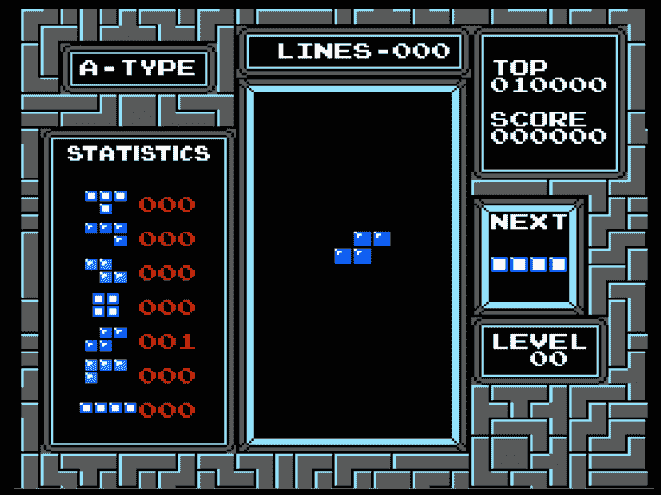
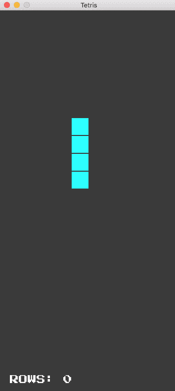
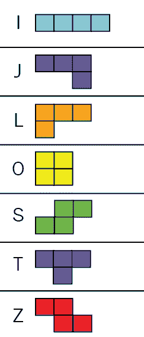
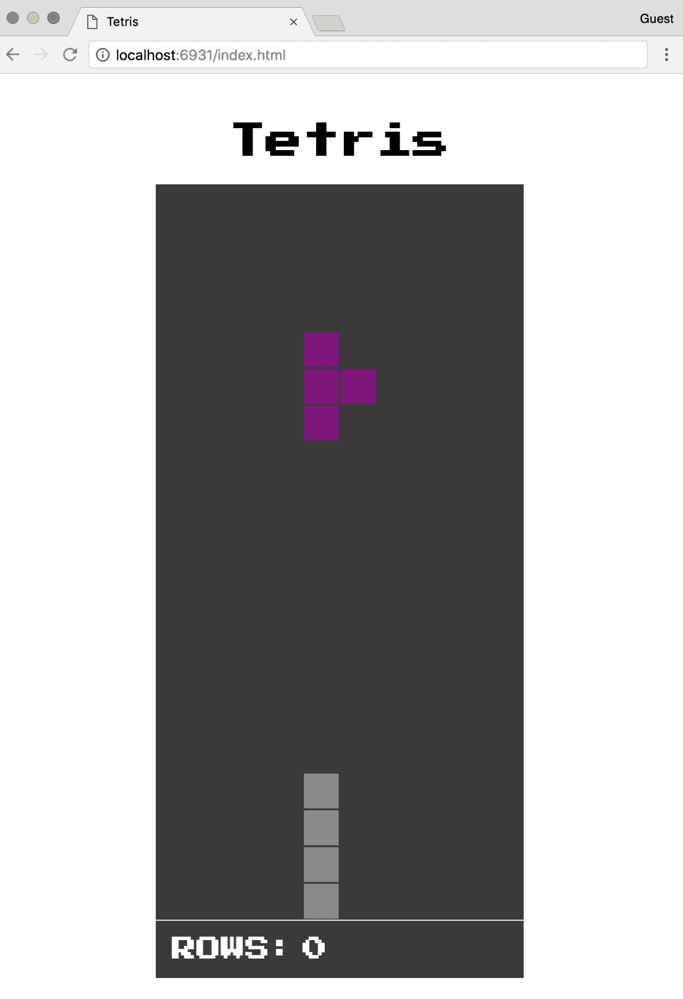

# 使用 Emscripten 移植游戏

如 第七章 所示，*从头开始创建应用程序*，WebAssembly 在当前形式下仍然相对有限。Emscripten 提供了强大的 API，用于扩展 WebAssembly 的功能，以添加功能到您的应用程序。在某些情况下，编译为 WebAssembly 模块和 JavaScript 粘合代码（而不是可执行文件）可能只需要对现有的 C 或 C++源代码进行轻微更改。

在本章中，我们将接受一个用 C++编写的代码库，将其编译为传统可执行文件，然后更新代码，以便将其编译为 Wasm/JavaScript。我们还将添加一些额外功能，以更紧密地集成到浏览器中。

通过本章结束时，您将知道如何执行以下操作：

+   更新 C++代码库以编译为 Wasm 模块/JavaScript 粘合代码（而不是本机可执行文件）是很重要的

+   使用 Emscripten 的 API 将浏览器集成到 C++应用程序中

+   使用正确的`emcc`标志构建一个多文件的 C++项目

+   使用`emrun`在浏览器中运行和测试 C++应用程序

# 游戏概述

在本章中，我们将接受一个用 C++编写的俄罗斯方块克隆，并更新代码以集成 Emscripten 并编译为 Wasm/JS。原始形式的代码库利用 SDL2 编译为可执行文件，并可以从命令行加载。在本节中，我们将简要回顾一下俄罗斯方块是什么，如何获取代码（而无需从头开始编写），以及如何运行它。

# 什么是俄罗斯方块？

俄罗斯方块的主要目标是在游戏区域内旋转和移动各种形状的方块（*Tetriminos*），以创建没有间隙的一行方块。当创建了一整行时，它将从游戏区域中删除，并且您的得分将增加一分。在我们的游戏版本中，不会有获胜条件（尽管很容易添加）。

重要的是要了解游戏的规则和机制，因为代码使用算法来实现诸如碰撞检测和记分等概念。了解函数的目标有助于理解其中的代码。如果需要提高俄罗斯方块技能，我建议您在线尝试一下。您可以在[`emulatoronline.com/nes-games/classic-tetris/`](https://emulatoronline.com/nes-games/classic-tetris/)上玩，无需安装 Adobe Flash。它看起来就像原始的任天堂版本：



在 EmulatorOnline.com 上玩经典的俄罗斯方块

我们将要处理的版本不包含方块计数器、级别或分数（我们只关注行数），但其操作方式将相同。

# 源的源

事实证明，搜索 Tetris C++会提供大量的教程和示例存储库供选择。为了保持到目前为止使用的格式和命名约定，我将这些资源结合起来创建了自己的游戏版本。本章结束时的*进一步阅读*部分中有这些资源的链接，如果您有兴趣了解更多。无论来源如何，移植代码库的概念和过程都是适用的。在这一点上，让我们简要讨论一下移植的一般情况。

# 关于移植的说明

将现有代码库移植到 Emscripten 并不总是一项简单的任务。在评估 C、C++或 Rust 应用程序是否适合转换时，需要考虑几个变量。例如，使用多个第三方库的游戏，甚至使用几个复杂的第三方库可能需要大量的工作。Emscripten 提供了以下常用库：

+   `asio`：一个网络和低级 I/O 编程库

+   `Bullet`：一个实时碰撞检测和多物理模拟库

+   `Cocos2d`：一套开源的跨平台游戏开发工具

+   `FreeType`：用于呈现字体的库

+   `HarfBuzz`：一个 OpenType 文本整形引擎

+   `libpng`：官方 PNG 参考库

+   `Ogg`：一个多媒体容器格式

+   `SDL2`：设计用于提供对音频、键盘、鼠标、操纵杆和图形硬件的低级访问的库

+   `SDL2_image`：一个图像文件加载库

+   `SDL2_mixer`：一个示例多通道音频混音库

+   `SDL2_net`：一个小型的跨平台网络库

+   `SDL2_ttf`：一个示例库，允许您在 SDL 应用程序中使用 TrueType 字体

+   `Vorbis`：通用音频和音乐编码格式

+   `zlib`：无损数据压缩库

如果库尚未移植，您将需要自行移植。这将有利于社区，但需要大量的时间和资源投入。我们的俄罗斯方块示例只使用了 SDL2，这使得移植过程相对简单。

# 获取代码

本章的代码位于`learn-webassembly`存储库的`/chapter-08-tetris`文件夹中。`/chapter-08-tetris`中有两个目录：`/output-native`文件夹，其中包含原始（未移植）代码，以及`/output-wasm`文件夹，其中包含移植后的代码。

如果您想要使用 VS Code 的任务功能进行本地构建步骤，您需要在 VS Code 中打开`/chapter-08-tetris/output-native`文件夹，而不是顶层的`/learn-webassembly`文件夹。

# 构建本地项目

`/output-native`文件夹中的`/cmake`文件夹和`CMakeLists.txt`文件是构建项目所必需的。`README.md`文件包含了在每个平台上启动代码的说明。构建项目并不是必须要通过移植过程。在您的平台上安装所需的依赖项并成功构建项目的过程可能会耗费大量时间和精力。如果您仍然希望继续，您可以按照`README.md`文件中的说明，在选择任务 | 运行任务... 后从列表中选择构建可执行文件来通过 VS Code 的任务功能构建可执行文件。

# 游戏的运行情况

如果您成功构建了项目，您应该能够通过从 VS Code 菜单中选择**任务** | **运行任务...**并从列表中选择启动可执行任务来运行它。如果一切顺利，您应该会看到类似以下的内容：



编译后的游戏可以本地运行

我们的游戏版本没有失败条件；它只是每清除一行就将行数增加一。如果俄罗斯方块中的一个方块触及到了板的顶部，游戏就结束了，板重新开始。这是游戏的一个基本实现，但是额外的功能会增加复杂性和所需的代码量。让我们更详细地审查代码库。

# 深入了解代码库

现在您已经可以使用代码了，您需要熟悉代码库。如果您不了解要移植的代码，那么您将更难成功地进行移植。在本章中，我们将逐个讨论每个 C++类和头文件，并描述它们在应用程序中的作用。

# 将代码分解为对象

C++是围绕面向对象的范式设计的，这正是俄罗斯方块代码库用来简化应用程序管理的方式。代码库由 C++类文件组成

（`.cpp`）和头文件（`.h`）代表游戏上下文中的对象。我使用了*什么是俄罗斯方块？*部分的游戏概述来推断我需要哪些对象。

游戏方块（Tetriminos）和游戏区（称为井或矩阵）是类的良好候选对象。也许不那么直观，但同样有效的是*游戏*本身。类不一定需要像实际对象那样具体 —— 它们非常适合存储共享代码。我很喜欢少打字，所以我选择使用`Piece`来表示一个 Tetrimino，`Board`来表示游戏区（尽管*井*这个词更短，但并不太合适）。我创建了一个头文件来存储全局变量（`constants.h`），一个`Game`类来管理游戏过程，以及一个`main.cpp`文件，它作为游戏的入口点。以下是`/src`文件夹的内容：

```cpp
├── board.cpp
├── board.h
├── constants.h
├── game.cpp
├── game.h
├── main.cpp
├── piece.cpp
└── piece.h
```

每个文件（除了`main.cpp`和`constants.h`）都有一个类（`.cpp`）和头文件（`.h`）。头文件允许您在多个文件中重用代码并防止代码重复。*进一步阅读*部分包含了一些资源，供您了解更多关于头文件的知识。`constants.h`文件几乎在应用程序的所有其他文件中都被使用，所以让我们首先来回顾一下它。

# 常量文件

我选择使用一个包含我们将要使用的常量的头文件，而不是在代码库中到处使用令人困惑的*魔术数字*。这个文件的内容如下：

```cpp
#ifndef TETRIS_CONSTANTS_H
#define TETRIS_CONSTANTS_H

namespace Constants {
    const int BoardColumns = 10;
    const int BoardHeight = 720;
    const int BoardRows = 20;
    const int BoardWidth = 360;
    const int Offset = BoardWidth / BoardColumns;
    const int PieceSize = 4;
    const int ScreenHeight = BoardHeight + 50;
}

#endif // TETRIS_CONSTANTS_H
```

文件第一行的`#ifndef`语句是一个`#include`保护，它可以防止在编译过程中多次包含头文件。这些保护在应用程序的所有头文件中都被使用。每个常量的目的将在我们逐个讨论每个类时变得清晰。我首先包含它是为了提供各种元素大小及其相互关系的上下文。

让我们继续看一下代表游戏各个方面的各种类。`Piece`类代表最低级别的对象，所以我们从这里开始，逐步向上到`Board`和`Game`类。

# 方块类

方块，或*Tetrimino*，是可以在棋盘上移动和旋转的元素。有七种不同的 Tetriminos — 每种都用一个字母表示，并有对应的颜色：



Tetrimino 颜色，取自维基百科

我们需要一种方式来定义每个方块的形状、颜色和当前方向。每个方块有四种不同的方向（每次旋转 90 度），这导致了所有方块的 28 种总变化。颜色不会改变，所以只需要分配一次。有了这个想法，让我们首先看一下头文件（`piece.h`）：

```cpp
#ifndef TETRIS_PIECE_H
#define TETRIS_PIECE_H

#include <SDL2/SDL.h>
#include "constants.h"

class Piece {
 public:
  enum Kind { I = 0, J, L, O, S, T, Z };

  explicit Piece(Kind kind);

  void draw(SDL_Renderer *renderer);
  void move(int columnDelta, int rowDelta);
  void rotate();
  bool isBlock(int column, int row) const;
  int getColumn() const;
  int getRow() const;

 private:
  Kind kind_;
  int column_;
  int row_;
  int angle_;
};

#endif // TETRIS_PIECE_H
```

游戏使用 SDL2 来渲染各种图形元素并处理键盘输入，这就是为什么我们将`SDL_Renderer`传递给`draw()`函数。您将看到 SDL2 是如何在`Game`类中使用的，但现在只需知道它被包含在内即可。头文件定义了`Piece`类的接口；让我们来看一下`piece.cpp`中的实现。我们将逐段代码进行讨论并描述功能。

# 构造函数和 draw()函数

代码的第一部分定义了`Piece`类的构造函数和`draw()`函数：

```cpp
#include "piece.h"

using namespace Constants;

Piece::Piece(Piece::Kind kind) :
    kind_(kind),
    column_(BoardColumns / 2 - PieceSize / 2),
    row_(0),
    angle_(0) {
}

void Piece::draw(SDL_Renderer *renderer) {
    switch (kind_) {
        case I:
            SDL_SetRenderDrawColor(renderer,
                /* Cyan: */ 45, 254, 254, 255);
            break;
        case J:
            SDL_SetRenderDrawColor(renderer,
                /* Blue: */ 11, 36, 251, 255);
            break;
        case L:
            SDL_SetRenderDrawColor(renderer,
                /* Orange: */ 253, 164, 41, 255);
            break;
        case O:
            SDL_SetRenderDrawColor(renderer,
                /* Yellow: */ 255, 253, 56, 255);
            break;
       case S:
            SDL_SetRenderDrawColor(renderer,
                /* Green: */ 41, 253, 47, 255);
            break;
        case T:
            SDL_SetRenderDrawColor(renderer,
                /* Purple: */ 126, 15, 126, 255);
            break;
        case Z:
            SDL_SetRenderDrawColor(renderer,
                /* Red: */ 252, 13, 28, 255);
            break;
        }

        for (int column = 0; column < PieceSize; ++column) {
            for (int row = 0; row < PieceSize; ++row) {
                if (isBlock(column, row)) {
                    SDL_Rect rect{
                        (column + column_) * Offset + 1,
                        (row + row_) * Offset + 1,
                        Offset - 2,
                        Offset - 2
                    };
                SDL_RenderFillRect(renderer, &rect);
            }
        }
    }
}
```

构造函数用默认值初始化类。`BoardColumns`和`PieceSize`的值是来自`constants.h`文件的常量。`BoardColumns`表示棋盘上可以放置的列数，在这种情况下是`10`。`PieceSize`常量表示方块在列中占据的区域或块，为`4`。分配给私有`columns_`变量的初始值表示棋盘的中心。

`draw()`函数循环遍历棋盘上所有可能的行和列，并填充任何由棋子占据的单元格与其对应的颜色。判断单元格是否被棋子占据是在`isBlock()`函数中执行的，接下来我们将讨论这个函数。

# move()、rotate()和 isBlock()函数

第二部分包含移动或旋转方块并确定其当前位置的逻辑：

```cpp
void Piece::move(int columnDelta, int rowDelta) {
    column_ += columnDelta;
    row_ += rowDelta;
}

void Piece::rotate() {
    angle_ += 3;
    angle_ %= 4;
}

bool Piece::isBlock(int column, int row) const {
    static const char *Shapes[][4] = {
        // I
        {
            " *  "
            " *  "
            " *  "
            " *  ",
            "    "
            "****"
            "    "
            "    ",
            " *  "
            " *  "
            " *  "
            " *  ",
            "    "
            "****"
            "    "
            "    ",
        },
        // J
        {
            "  * "
            "  * "
            " ** "
            "    ",
            "    "
            "*   "
            "*** "
            "    ",
            " ** "
            " *  "
            " *  "
            "    ",
            "    "
            "    "
            "*** "
            " *  ",
        },
        ...
    };
    return Shapes[kind_][angle_][column + row * PieceSize] == '*';
}

int Piece::getColumn() const {
 return column_;
}
int Piece::getRow() const {
 return row_;
}
```

`move()`函数更新了私有`column_`和`row_`变量的值，从而决定了方块在棋盘上的位置。`rotate()`函数将私有`angle_`变量的值设置为`0`、`1`、`2`或`3`（这就是为什么使用`%= 4`）。

确定显示哪种类型的方块，它的位置和旋转是在`isBlock()`函数中执行的。我省略了`Shapes`多维数组的除了前两个元素之外的所有内容，以避免文件混乱，但是剩下的五种方块类型在实际代码中是存在的。我承认这不是最优雅的实现，但它完全适合我们的目的。

私有的`kind_`和`angle_`值被指定为`Shapes`数组中的维度，以选择四个相应的`char*`元素。这四个元素代表方块的四种可能的方向。如果字符串中的`column + row * PieceSize`索引是一个星号，那么方块就存在于指定的行和列。如果你决定通过网络上的一个俄罗斯方块教程（或者查看 GitHub 上的许多俄罗斯方块存储库之一）来学习，你会发现有几种不同的方法来计算一个单元格是否被方块占据。我选择了这种方法，因为它更容易可视化方块。

# `getColumn()`和`getRow()`函数

代码的最后一部分包含了获取方块的行和列的函数：

```cpp
int Piece::getColumn() const {
    return column_;
}

int Piece::getRow() const {
    return row_;
}
```

这些函数只是简单地返回私有`column_`或`row_`变量的值。现在你对`Piece`类有了更好的理解，让我们继续学习`Board`。

# Board 类

`Board`包含`Piece`类的实例，并且需要检测方块之间的碰撞，行是否已满，以及游戏是否结束。让我们从头文件（`board.h`）的内容开始：

```cpp
#ifndef TETRIS_BOARD_H
#define TETRIS_BOARD_H

#include <SDL2/SDL.h>
#include <SDL2/SDL2_ttf.h>
#include "constants.h"
#include "piece.h"

using namespace Constants;

class Board {
 public:
  Board();
  void draw(SDL_Renderer *renderer, TTF_Font *font);
  bool isCollision(const Piece &piece) const;
  void unite(const Piece &piece);

 private:
  bool isRowFull(int row);
  bool areFullRowsPresent();
  void updateOffsetRow(int fullRow);
  void displayScore(SDL_Renderer *renderer, TTF_Font *font);

  bool cells_[BoardColumns][BoardRows];
  int currentScore_;
};

#endif // TETRIS_BOARD_H
```

`Board`有一个`draw()`函数，类似于`Piece`类，还有一些其他函数用于管理行和跟踪棋盘上哪些单元格被占据。`SDL2_ttf`库用于在窗口底部渲染带有当前分数（清除的行数）的“ROWS:”文本。现在，让我们来看看实现文件（`board.cpp`）的每个部分。

# 构造函数和 draw()函数

代码的第一部分定义了`Board`类的构造函数和`draw()`函数：

```cpp
#include <sstream>
#include "board.h"

using namespace Constants;

Board::Board() : cells_{{ false }}, currentScore_(0) {}

void Board::draw(SDL_Renderer *renderer, TTF_Font *font) {
    displayScore(renderer, font);
    SDL_SetRenderDrawColor(
        renderer,
        /* Light Gray: */ 140, 140, 140, 255);
    for (int column = 0; column < BoardColumns; ++column) {
        for (int row = 0; row < BoardRows; ++row) {
            if (cells_[column][row]) {
                SDL_Rect rect{
                    column * Offset + 1,
                    row * Offset + 1,
                    Offset - 2,
                    Offset - 2
                };
                SDL_RenderFillRect(renderer, &rect);
            }
        }
    }
}
```

`Board`构造函数将私有`cells_`和`currentScore_`变量的值初始化为默认值。`cells_`变量是一个布尔值的二维数组，第一维表示列，第二维表示行。如果一个方块占据特定的列和行，数组中相应的值为`true`。`draw()`函数的行为类似于`Piece`中的`draw()`函数，它用颜色填充包含方块的单元格。然而，这个函数只填充被已经到达底部的方块占据的单元格，颜色为浅灰色，不管是什么类型的方块。

# isCollision()函数

代码的第二部分包含了检测碰撞的逻辑：

```cpp
bool Board::isCollision(const Piece &piece) const {
    for (int column = 0; column < PieceSize; ++column) {
        for (int row = 0; row < PieceSize; ++row) {
            if (piece.isBlock(column, row)) {
                int columnTarget = piece.getColumn() + column;
                int rowTarget = piece.getRow() + row;
                if (
                    columnTarget < 0
                    || columnTarget >= BoardColumns
                    || rowTarget < 0
                    || rowTarget >= BoardRows
                ) {
                    return true;
                }
                if (cells_[columnTarget][rowTarget]) return true;
            }
        }
    }
    return false;
}
```

`isCollision()`函数循环遍历棋盘上的每个单元格，直到找到由作为参数传递的`&piece`占据的单元格。如果方块即将与棋盘的任一侧碰撞，或者已经到达底部，函数返回`true`，否则返回`false`。

# unite()函数

代码的第三部分包含了将方块与顶行合并的逻辑，当方块停止时。

```cpp
void Board::unite(const Piece &piece) {
    for (int column = 0; column < PieceSize; ++column) {
        for (int row = 0; row < PieceSize; ++row) {
            if (piece.isBlock(column, row)) {
                int columnTarget = piece.getColumn() + column;
                int rowTarget = piece.getRow() + row;
                cells_[columnTarget][rowTarget] = true;
            }
        }
    }

    // Continuously loops through each of the rows until no full rows are
    // detected and ensures the full rows are collapsed and non-full rows
    // are shifted accordingly:
    while (areFullRowsPresent()) {
        for (int row = BoardRows - 1; row >= 0; --row) {
            if (isRowFull(row)) {
                updateOffsetRow(row);
                currentScore_ += 1;
                for (int column = 0; column < BoardColumns; ++column) {
                    cells_[column][0] = false;
                }
            }
        }
    }
}

bool Board::isRowFull(int row) {
    for (int column = 0; column < BoardColumns; ++column) {
        if (!cells_[column][row]) return false;
    }
    return true;
}

bool Board::areFullRowsPresent() {
    for (int row = BoardRows - 1; row >= 0; --row) {
        if (isRowFull(row)) return true;
    }
    return false;
}

void Board::updateOffsetRow(int fullRow) {
    for (int column = 0; column < BoardColumns; ++column) {
        for (int rowOffset = fullRow - 1; rowOffset >= 0; --rowOffset) {
            cells_[column][rowOffset + 1] =
            cells_[column][rowOffset];
        }
    }
}
```

`unite()`函数和相应的`isRowFull()`、`areFullRowsPresent()`和`updateOffsetRow()`函数执行多个操作。它通过将适当的数组位置设置为`true`，使用指定的`&piece`参数更新了私有的`cells_`变量，该参数占据了行和列。它还通过将相应的`cells_`数组位置设置为`false`来清除棋盘上的任何完整行（所有列都填满），并增加了`currentScore_`。清除行后，`cells_`数组被更新，将清除的行上面的行向下移动`1`。

# displayScore()函数

代码的最后部分在游戏窗口底部显示分数：

```cpp
void Board::displayScore(SDL_Renderer *renderer, TTF_Font *font) {
    std::stringstream message;
    message << "ROWS: " << currentScore_;
    SDL_Color white = { 255, 255, 255 };
    SDL_Surface *surface = TTF_RenderText_Blended(
        font,
        message.str().c_str(),
        white);
    SDL_Texture *texture = SDL_CreateTextureFromSurface(
        renderer,
        surface);
    SDL_Rect messageRect{ 20, BoardHeight + 15, surface->w, surface->h };
    SDL_FreeSurface(surface);
    SDL_RenderCopy(renderer, texture, nullptr, &messageRect);
    SDL_DestroyTexture(texture);
}
```

`displayScore()`函数使用`SDL2_ttf`库在窗口底部（在棋盘下方）显示当前分数。`TTF_Font *font`参数从`Game`类传递进来，以避免在更新分数时每次初始化字体。`stringstream message`变量用于创建文本值，并将其设置为`TTF_RenderText_Blended()`函数内的 C `char*`。其余代码绘制文本在`SDL_Rect`上，以确保正确显示。

这就是`Board`类的全部内容；让我们继续看看`Game`类是如何组合在一起的。

# 游戏类

`Game`类包含循环函数，使您可以通过按键在棋盘上移动方块。以下是头文件（`game.h`）的内容：

```cpp
#ifndef TETRIS_GAME_H
#define TETRIS_GAME_H

#include <SDL2/SDL.h>
#include <SDL2/SDL2_ttf.h>
#include "constants.h"
#include "board.h"
#include "piece.h"

class Game {
 public:
  Game();
  ~Game();
  bool loop();

 private:
  Game(const Game &);
  Game &operator=(const Game &);

  void checkForCollision(const Piece &newPiece);
  void handleKeyEvents(SDL_Event &event);

  SDL_Window *window_;
  SDL_Renderer *renderer_;
  TTF_Font *font_;
  Board board_;
  Piece piece_;
  uint32_t moveTime_;
};

#endif // TETRIS_GAME_H
```

`loop()`函数包含游戏逻辑，并根据事件管理状态。在`private:`标头下的前两行防止创建多个游戏实例，这可能会导致内存泄漏。私有方法减少了`loop()`函数中的代码行数，简化了维护和调试。让我们继续看`game.cpp`中的实现。

# 构造函数和析构函数

代码的第一部分定义了在加载类实例（构造函数）和卸载类实例（析构函数）时执行的操作：

```cpp
#include <cstdlib>
#include <iostream>
#include <stdexcept>
#include "game.h"

using namespace std;
using namespace Constants;

Game::Game() :
    // Create a new random piece:
    piece_{ static_cast<Piece::Kind>(rand() % 7) },
    moveTime_(SDL_GetTicks())
{
    if (SDL_Init(SDL_INIT_VIDEO) != 0) {
        throw runtime_error(
            "SDL_Init(SDL_INIT_VIDEO): " + string(SDL_GetError()));
        }
        SDL_CreateWindowAndRenderer(
            BoardWidth,
            ScreenHeight,
            SDL_WINDOW_OPENGL,
            &window_,
            &renderer_);
        SDL_SetWindowPosition(
            window_,
            SDL_WINDOWPOS_CENTERED,
            SDL_WINDOWPOS_CENTERED);
        SDL_SetWindowTitle(window_, "Tetris");

    if (TTF_Init() != 0) {
        throw runtime_error("TTF_Init():" + string(TTF_GetError()));
    }
    font_ = TTF_OpenFont("PressStart2P.ttf", 18);
    if (font_ == nullptr) {
        throw runtime_error("TTF_OpenFont: " + string(TTF_GetError()));
    }
}

Game::~Game() {
    TTF_CloseFont(font_);
    TTF_Quit();
    SDL_DestroyRenderer(renderer_);
    SDL_DestroyWindow(window_);
    SDL_Quit();
}
```

构造函数代表应用程序的入口点，因此所有必需的资源都在其中分配和初始化。`TTF_OpenFont()`函数引用了从 Google Fonts 下载的 TrueType 字体文件，名为 Press Start 2P。您可以在[`fonts.google.com/specimen/Press+Start+2P`](https://fonts.google.com/specimen/Press+Start+2P)上查看该字体。它存在于存储库的`/resources`文件夹中，并在构建项目时复制到可执行文件所在的相同文件夹中。如果在初始化 SDL2 资源时发生错误，将抛出`runtime_error`并提供错误的详细信息。析构函数（`~Game()`）在应用程序退出之前释放我们为 SDL2 和`SDL2_ttf`分配的资源，以避免内存泄漏。

# loop()函数

代码的最后部分代表了`Game::loop`：

```cpp
bool Game::loop() {
    SDL_Event event;
    while (SDL_PollEvent(&event)) {
        switch (event.type) {
            case SDL_KEYDOWN:
                handleKeyEvents(event);
                break;
            case SDL_QUIT:
                return false;
            default:
                return true;
        }
    }

    SDL_SetRenderDrawColor(renderer_, /* Dark Gray: */ 58, 58, 58, 255);
    SDL_RenderClear(renderer_);
    board_.draw(renderer_, font_);
    piece_.draw(renderer_);

    if (SDL_GetTicks() > moveTime_) {
        moveTime_ += 1000;
        Piece newPiece = piece_;
        newPiece.move(0, 1);
        checkForCollision(newPiece);
    }
    SDL_RenderPresent(renderer_);
    return true;
}

void Game::checkForCollision(const Piece &newPiece) {
    if (board_.isCollision(newPiece)) {
        board_.unite(piece_);
        piece_ = Piece{ static_cast<Piece::Kind>(rand() % 7) };
        if (board_.isCollision(piece_)) board_ = Board();
    } else {
        piece_ = newPiece;
    }
}

void Game::handleKeyEvents(SDL_Event &event) {
    Piece newPiece = piece_;
    switch (event.key.keysym.sym) {
        case SDLK_DOWN:
            newPiece.move(0, 1);
            break;
        case SDLK_RIGHT:
            newPiece.move(1, 0);
            break;
        case SDLK_LEFT:
            newPiece.move(-1, 0);
            break;
        case SDLK_UP:
            newPiece.rotate();
            break;
        default:
            break;
     }
     if (!board_.isCollision(newPiece)) piece_ = newPiece;
}
```

`loop()`函数返回一个布尔值，只要`SDL_QUIT`事件尚未触发。每隔`1`秒，执行`Piece`和`Board`实例的`draw()`函数，并相应地更新棋盘上的方块位置。左、右和下箭头键控制方块的移动，而上箭头键将方块旋转 90 度。对按键的适当响应在`handleKeyEvents()`函数中处理。`checkForCollision()`函数确定活动方块的新实例是否与棋盘的任一侧发生碰撞，或者停在其他方块的顶部。如果是，就创建一个新方块。清除行的逻辑（通过`Board`的`unite()`函数）也在这个函数中处理。我们快要完成了！让我们继续看`main.cpp`文件。

# 主文件

`main.cpp`没有关联的头文件，因为它的唯一目的是作为应用程序的入口点。实际上，该文件只有七行：

```cpp
#include "game.h"

int main() {
    Game game;
    while (game.loop());
    return 0;
}
```

`while`语句在`loop()`函数返回`false`时退出，这发生在`SDL_QUIT`事件触发时。这个文件所做的就是创建一个新的`Game`实例并启动循环。这就是代码库的全部内容；让我们开始移植！

# 移植到 Emscripten

你对代码库有很好的理解，现在是时候开始用 Emscripten 移植了。幸运的是，我们能够利用一些浏览器的特性来简化代码，并完全移除第三方库。在这一部分，我们将更新代码以编译为 Wasm 模块和 JavaScript *glue*文件，并更新一些功能以利用浏览器。

# 为移植做准备

`/output-wasm`文件夹包含最终结果，但我建议你创建一个`/output-native`文件夹的副本，这样你就可以跟随移植过程。为本地编译和 Emscripten 编译设置了 VS Code 任务。如果你遇到困难，你可以随时参考`/output-wasm`的内容。确保你在 VS Code 中打开你复制的文件夹（文件 | 打开并选择你复制的文件夹），否则你将无法使用任务功能。

# 有什么改变？

这个游戏是移植的理想候选，因为它使用了 SDL2，这是一个广泛使用的库，已经有了 Emscripten 移植。在编译步骤中包含 SDL2 只需要传递一个额外的参数给`emcc`命令。`SDL2_ttf`库的 Emscripten 移植也存在，但保留它在代码库中并没有太多意义。它的唯一目的是以文本形式呈现得分（清除的行数）。我们需要将 TTF 文件与应用程序一起包含，并复杂化构建过程。Emscripten 提供了在我们的 C++中使用 JavaScript 代码的方法，所以我们将采取一个更简单的方法：在 DOM 中显示得分。

除了改变现有的代码，我们还需要创建一个 HTML 和 CSS 文件来在浏览器中显示和样式化游戏。我们编写的 JavaScript 代码将是最小的——我们只需要加载 Emscripten 模块，所有功能都在 C++代码库中处理。我们还需要添加一些`<div>`元素，并相应地布局以显示得分。让我们开始移植！

# 添加 web 资源

在你的项目文件夹中创建一个名为`/public`的文件夹。在`/public`文件夹中添加一个名为`index.html`的新文件，并填充以下内容：

```cpp
<!doctype html>
<html lang="en-us">
<head>
  <title>Tetris</title>
  <link rel="stylesheet" type="text/css" href="styles.css" />
</head>
<body>
  <div class="wrapper">
    <h1>Tetris</h1>
    <div>
      <canvas id="canvas"></canvas>
      <div class="scoreWrapper">
        <span>ROWS:</span><span id="score"></span>
      </div>
    </div>
  </div>
  <script type="application/javascript" src="img/index.js"></script>
  <script type="application/javascript">
    Module({ canvas: (() => document.getElementById('canvas'))() })
  </script>
</body>
</html>
```

在第一个`<script>`标签中加载的`index.js`文件尚不存在；它将在编译步骤中生成。让我们为元素添加一些样式。在`/public`文件夹中创建一个`styles.css`文件，并填充以下内容：

```cpp
@import url("https://fonts.googleapis.com/css?family=Press+Start+2P");

* {
  font-family: "Press Start 2P", sans-serif;
}

body {
  margin: 24px;
}

h1 {
  font-size: 36px;
}

span {
  color: white;
  font-size: 24px;
}

.wrapper {
  display: flex;
  align-items: center;
  flex-direction: column;
}

.titleWrapper {
  display: flex;
  align-items: center;
  justify-content: center;
}

.header {
  font-size: 24px;
  margin-left: 16px;
}

.scoreWrapper {
  background-color: #3A3A3A;
  border-top: 1px solid white;
  padding: 16px 0;
  width: 360px;
}

span:first-child {
  margin-left: 16px;
  margin-right: 8px;
}
```

由于我们使用的 Press Start 2P 字体托管在 Google Fonts 上，我们可以导入它以在网站上使用。这个文件中的 CSS 规则处理简单的布局和样式。这就是我们需要创建的与 web 相关的文件。现在，是时候更新 C++代码了。

# 移植现有代码

我们只需要编辑一些文件才能正确使用 Emscripten。为了简单和紧凑起见，只包含受影响的代码部分（而不是整个文件）。让我们按照上一节的顺序逐个文件进行，并从`constants.h`开始。

# 更新常量文件

我们将在 DOM 上显示清除的行数，而不是在游戏窗口本身上显示，所以你可以从文件中删除`ScreenHeight`常量。我们不再需要额外的空间来容纳得分文本：

```cpp
namespace Constants {
    const int BoardColumns = 10;
    const int BoardHeight = 720;
    const int BoardRows = 20;
    const int BoardWidth = 360;
    const int Offset = BoardWidth / BoardColumns;
    const int PieceSize = 4;
    // const int ScreenHeight = BoardHeight + 50; <----- Delete this line
}
```

不需要对`Piece`类文件（`piece.cpp`/`piece.h`）进行任何更改。但是，我们需要更新`Board`类。让我们从头文件（`board.h`）开始。从底部开始，逐步更新`displayScore()`函数。在`index.html`文件的`<body>`部分，有一个`id="score"`的`<span>`元素。我们将使用`emscripten_run_script`命令来更新此元素以显示当前分数。因此，`displayScore()`函数变得更短了。变化前后如下所示。

这是 Board 类的`displayScore()`函数的原始版本：

```cpp
void Board::displayScore(SDL_Renderer *renderer, TTF_Font *font) {
    std::stringstream message;
    message << "ROWS: " << currentScore_;
    SDL_Color white = { 255, 255, 255 };
    SDL_Surface *surface = TTF_RenderText_Blended(
        font,
        message.str().c_str(),
        white);
    SDL_Texture *texture = SDL_CreateTextureFromSurface(
        renderer,
        surface);
    SDL_Rect messageRect{ 20, BoardHeight + 15, surface->w, surface->h };
    SDL_FreeSurface(surface);
    SDL_RenderCopy(renderer, texture, nullptr, &messageRect);
    SDL_DestroyTexture(texture);
 }
```

这是`displayScore()`函数的移植版本：

```cpp
void Board::displayScore(int newScore) {
    std::stringstream action;
    action << "document.getElementById('score').innerHTML =" << newScore;
    emscripten_run_script(action.str().c_str());
 }
```

`emscripten_run_script`操作只是在 DOM 上找到`<span>`元素，并将`innerHTML`设置为当前分数。我们无法在这里使用`EM_ASM()`函数，因为 Emscripten 不识别`document`对象。由于我们可以访问类中的私有`currentScore_`变量，我们将把`draw()`函数中的`displayScore()`调用移动到`unite()`函数中。这限制了对`displayScore()`的调用次数，以确保只有在分数实际改变时才调用该函数。我们只需要添加一行代码来实现这一点。现在`unite()`函数的样子如下：

```cpp
void Board::unite(const Piece &piece) {
    for (int column = 0; column < PieceSize; ++column) {
        for (int row = 0; row < PieceSize; ++row) {
            if (piece.isBlock(column, row)) {
                int columnTarget = piece.getColumn() + column;
                int rowTarget = piece.getRow() + row;
                cells_[columnTarget][rowTarget] = true;
            }
        }
    }

    // Continuously loops through each of the rows until no full rows are
    // detected and ensures the full rows are collapsed and non-full rows
    // are shifted accordingly:
    while (areFullRowsPresent()) {
        for (int row = BoardRows - 1; row >= 0; --row) {
            if (isRowFull(row)) {
                updateOffsetRow(row);
                currentScore_ += 1;
                for (int column = 0; column < BoardColumns; ++column) {
                    cells_[column][0] = false;
                }
            }
        }
        displayScore(currentScore_); // <----- Add this line
    }
}
```

由于我们不再使用`SDL2_ttf`库，我们可以更新`draw()`函数的签名并删除`displayScore()`函数调用。更新后的`draw()`函数如下：

```cpp
void Board::draw(SDL_Renderer *renderer/*, TTF_Font *font */) {
                                        // ^^^^^^^^^^^^^^ <-- Remove this argument
    // displayScore(renderer, font); <----- Delete this line
    SDL_SetRenderDrawColor(
        renderer,
        /* Light Gray: */ 140, 140, 140, 255);
    for (int column = 0; column < BoardColumns; ++column) {
        for (int row = 0; row < BoardRows; ++row) {
            if (cells_[column][row]) {
                SDL_Rect rect{
                    column * Offset + 1,
                    row * Offset + 1,
                    Offset - 2,
                    Offset - 2
                };
                SDL_RenderFillRect(renderer, &rect);
            }
        }
    }
 }
```

`displayScore()`函数调用已从函数的第一行中删除，并且`TTF_Font *font`参数也被删除了。让我们在构造函数中添加一个对`displayScore()`的调用，以确保当游戏结束并开始新游戏时，初始值设置为`0`。

```cpp
Board::Board() : cells_{{ false }}, currentScore_(0) {
    displayScore(0); // <----- Add this line
}
```

课堂文件就到这里。由于我们更改了`displayScore()`和`draw()`函数的签名，并移除了对`SDL2_ttf`的依赖，我们需要更新头文件。从`board.h`中删除以下行：

```cpp
#ifndef TETRIS_BOARD_H
#define TETRIS_BOARD_H

#include <SDL2/SDL.h>
// #include <SDL2/SDL2_ttf.h> <----- Delete this line
#include "constants.h"
#include "piece.h"

using namespace Constants;

class Board {
 public:
  Board();
  void draw(SDL_Renderer *renderer /*, TTF_Font *font */);
                                    // ^^^^^^^^^^^^^^ <-- Remove this
  bool isCollision(const Piece &piece) const;
  void unite(const Piece &piece);

 private:
  bool isRowFull(int row);
  bool areFullRowsPresent();
  void updateOffsetRow(int fullRow);
  void displayScore(SDL_Renderer *renderer, TTF_Font *font);
                                         // ^^^^^^^^^^^^^^ <-- Remove this
  bool cells_[BoardColumns][BoardRows];
  int currentScore_;
};

#endif // TETRIS_BOARD_H
```

我们正在顺利进行！我们需要做的最后一个更改也是最大的一个。现有的代码库有一个`Game`类来管理应用程序逻辑，以及一个`main.cpp`文件来在`main()`函数中调用`Game.loop()`函数。循环机制是一个 while 循环，只要`SDL_QUIT`事件没有触发就会继续运行。我们需要改变我们的方法以适应 Emscripten。

Emscripten 提供了一个`emscripten_set_main_loop`函数，接受一个`em_callback_func`循环函数、`fps`和一个`simulate_infinite_loop`标志。我们不能包含`Game`类并将`Game.loop()`作为`em_callback_func`参数，因为构建会失败。相反，我们将完全消除`Game`类，并将逻辑移到`main.cpp`文件中。将`game.cpp`的内容复制到`main.cpp`（覆盖现有内容）并删除`Game`类文件（`game.cpp`/`game.h`）。由于我们不再声明`Game`类，因此从函数中删除`Game::`前缀。构造函数和析构函数不再有效（它们不再是类的一部分），因此我们需要将该逻辑移动到不同的位置。我们还需要重新排列文件以确保我们调用的函数出现在调用函数之前。最终结果如下：

```cpp
#include <emscripten/emscripten.h>
#include <SDL2/SDL.h>
#include <stdexcept>
#include "constants.h"
#include "board.h"
#include "piece.h"

using namespace std;
using namespace Constants;

static SDL_Window *window = nullptr;
static SDL_Renderer *renderer = nullptr;
static Piece currentPiece{ static_cast<Piece::Kind>(rand() % 7) };
static Board board;
static int moveTime;

void checkForCollision(const Piece &newPiece) {
    if (board.isCollision(newPiece)) {
        board.unite(currentPiece);
        currentPiece = Piece{ static_cast<Piece::Kind>(rand() % 7) };
        if (board.isCollision(currentPiece)) board = Board();
    } else {
        currentPiece = newPiece;
    }
}

void handleKeyEvents(SDL_Event &event) {
    Piece newPiece = currentPiece;
    switch (event.key.keysym.sym) {
        case SDLK_DOWN:
            newPiece.move(0, 1);
            break;
        case SDLK_RIGHT:
            newPiece.move(1, 0);
            break;
        case SDLK_LEFT:
            newPiece.move(-1, 0);
            break;
        case SDLK_UP:
            newPiece.rotate();
            break;
        default:
            break;
    }
    if (!board.isCollision(newPiece)) currentPiece = newPiece;
}

void loop() {
    SDL_Event event;
    while (SDL_PollEvent(&event)) {
        switch (event.type) {
            case SDL_KEYDOWN:
                handleKeyEvents(event);
                break;
            case SDL_QUIT:
                break;
            default:
                break;
        }
    }

    SDL_SetRenderDrawColor(renderer, /* Dark Gray: */ 58, 58, 58, 255);
    SDL_RenderClear(renderer);
    board.draw(renderer);
    currentPiece.draw(renderer);

    if (SDL_GetTicks() > moveTime) {
        moveTime += 1000;
        Piece newPiece = currentPiece;
        newPiece.move(0, 1);
        checkForCollision(newPiece);
    }
    SDL_RenderPresent(renderer);
}

int main() {
    moveTime = SDL_GetTicks();
    if (SDL_Init(SDL_INIT_VIDEO) != 0) {
        throw std::runtime_error("SDL_Init(SDL_INIT_VIDEO)");
    }
    SDL_CreateWindowAndRenderer(
        BoardWidth,
        BoardHeight,
        SDL_WINDOW_OPENGL,
        &window,
        &renderer);

    emscripten_set_main_loop(loop, 0, 1);

    SDL_DestroyRenderer(renderer);
    renderer = nullptr;
    SDL_DestroyWindow(window);
    window = nullptr;
    SDL_Quit();
    return 0;
}
```

`handleKeyEvents()`和`checkForCollision()`函数没有改变；我们只是将它们移到了文件的顶部。`loop()`函数的返回类型从`bool`改为`void`，这是`emscripten_set_main_loop`所需的。最后，构造函数和析构函数中的代码被移动到了`main()`函数中，并且移除了对`SDL2_ttf`的任何引用。我们不再使用调用`Game`的`loop()`函数的 while 语句，而是使用`emscripten_set_main_loop(loop, 0, 1)`。我们修改了文件顶部的`#include`语句以适应 Emscripten、SDL2 和我们的`Board`和`Piece`类。这就是所有的更改——现在是时候配置构建并测试游戏了。

# 构建和运行游戏

随着代码的更新和所需的 Web 资产的准备，现在是构建和测试游戏的时候了。编译步骤与本书中之前的示例类似，但我们将使用不同的技术来运行游戏。在本节中，我们将配置构建任务以适应 C++文件，并使用 Emscripten 提供的功能来运行应用程序。

# 使用 VS Code 任务进行构建

我们将以两种方式配置构建：使用 VS Code 任务和 Makefile。如果您喜欢使用 VS Code 以外的编辑器，Makefile 是一个不错的选择。`/.vscode/tasks.json`文件已经包含了构建项目所需的任务。Emscripten 构建步骤是默认的（还有一组本地构建任务）。让我们逐个检查`tasks`数组中的每个任务，看看发生了什么。第一个任务在构建之前删除任何现有的编译输出文件：

```cpp
{
  "label": "Remove Existing Web Files",
  "type": "shell",
  "command": "rimraf",
  "options": {
    "cwd": "${workspaceRoot}/public"
  },
  "args": [
    "index.js",
    "index.wasm"
  ]
}
```

第二个任务使用`emcc`命令进行构建：

```cpp
{
  "label": "Build WebAssembly",
  "type": "shell",
  "command": "emcc",
  "args": [
    "--bind", "src/board.cpp", "src/piece.cpp", "src/main.cpp",
    "-std=c++14",
    "-O3",
    "-s", "WASM=1",
    "-s", "USE_SDL=2",
    "-s", "MODULARIZE=1",
    "-o", "public/index.js"
  ],
  "group": {
    "kind": "build",
    "isDefault": true
  },
  "problemMatcher": [],
  "dependsOn": ["Remove Existing Web Files"]
}
```

相关的参数都放在同一行上。`args`数组中唯一的新的和陌生的添加是`--bind`参数和相应的`.cpp`文件。这告诉 Emscripten 所有在`--bind`之后的文件都是构建项目所需的。通过从菜单中选择任务|运行构建任务...或使用键盘快捷键*Cmd*/*Ctrl + Shift + B*来测试构建。构建需要几秒钟，但终端会在编译过程完成时通知您。如果成功，您应该在`/public`文件夹中看到一个`index.js`和一个`index.wasm`文件。

# 使用 Makefile 进行构建

如果您不想使用 VS Code，您可以使用 Makefile 来实现与 VS Code 任务相同的目标。在项目文件夹中创建一个名为`Makefile`的文件，并填充以下内容（确保文件使用制表符而不是空格）：

```cpp
# This allows you to just run the "make" command without specifying
# arguments:
.DEFAULT_GOAL := build

# Specifies which files to compile as part of the project:
CPP_FILES = $(wildcard src/*.cpp)

# Flags to use for Emscripten emcc compile command:
FLAGS = -std=c++14 -O3 -s WASM=1 -s USE_SDL=2 -s MODULARIZE=1 \
        --bind $(CPP_FILES)

# Name of output (the .wasm file is created automatically):
OUTPUT_FILE = public/index.js

# This is the target that compiles our executable
compile: $(CPP_FILES)
    emcc  $(FLAGS) -o $(OUTPUT_FILE)

# Removes the existing index.js and index.wasm files:
clean:
    rimraf $(OUTPUT_FILE)
    rimraf public/index.wasm

# Removes the existing files and builds the project:
build: clean compile
    @echo "Build Complete!"
```

所执行的操作与 VS Code 任务中执行的操作相同，只是使用更通用的工具格式。默认的构建步骤已在文件中设置，因此您可以在项目文件夹中运行以下命令来编译项目：

```cpp
make
```

现在您已经有了一个编译好的 Wasm 文件和 JavaScript 粘合代码，让我们尝试运行游戏。

# 运行游戏

我们将使用 Emscripten 工具链的内置功能`emrun`，而不是使用`serve`或`browser-sync`。它提供了一个额外的好处，即捕获`stdout`和`stderr`（如果您将`--emrun`链接标志传递给`emcc`命令），并在需要时将它们打印到终端。我们不会使用`--emrun`标志，但是在不必安装任何额外的依赖项的情况下拥有一个本地 Web 服务器是一个很好的附加功能。在项目文件夹中打开一个终端实例，并运行以下命令来启动游戏：

```cpp
emrun --browser chrome --no_emrun_detect public/index.html
```

如果您正在开发中使用`firefox`，可以为浏览器指定`firefox`。`--no_emrun_detect`标志会隐藏终端中的一条消息，指出 HTML 页面不支持`emrun`。如果您导航到`http://localhost:6931/index.html`，您应该会看到以下内容：



在浏览器中运行的俄罗斯方块

尝试旋转和移动方块，以确保一切都正常工作。当成功清除一行时，行数应该增加一。您还可能注意到，如果您离棋盘边缘太近，您将无法旋转一些方块。恭喜，您已成功将一个 C++游戏移植到 Emscripten！

# 总结

在本章中，我们将一个使用 SDL2 编写的 C++ Tetris 克隆移植到 Emscripten，以便可以在浏览器中使用 WebAssembly 运行。我们介绍了 Tetris 的规则以及它们如何映射到现有代码库中的逻辑。我们还逐个审查了现有代码库中的每个文件以及必须进行的更改，以成功编译为 Wasm 文件和 JavaScript 粘合代码。更新现有代码后，我们创建了所需的 HTML 和 CSS 文件，然后使用适当的`emcc`标志配置了构建步骤。构建完成后，使用 Emscripten 的`emrun`命令运行游戏。

在第九章中，*与 Node.js 集成*，我们将讨论如何将 WebAssembly 集成到 Node.js 中，以及这种集成提供的好处。

# 问题

1.  Tetris 中的方块叫什么？

1.  选择不将现有的 C++代码库移植到 Emscripten 的一个原因是什么？

1.  我们用什么工具来将游戏编译成本机代码（例如，可执行文件）？

1.  `constants.h`文件的目的是什么？

1.  为什么我们能够消除 SDL2_ttf 库？

1.  我们使用了哪个 Emscripten 函数来开始运行游戏？

1.  我们在`emcc`命令中添加了哪个参数来构建游戏，它有什么作用？

1.  `emrun`相对于`serve`和 Browsersync 这样的工具有什么优势？

# 进一步阅读

+   C++中的头文件：[`www.sitesbay.com/cpp/cpp-header-files`](https://www.sitesbay.com/cpp/cpp-header-files)

+   GitHub 上的 SDL2 Tetris：[`github.com/andwn/sdl2-tetris`](https://github.com/andwn/sdl2-tetris)

+   GitHub 上的 Tetris：[`github.com/abesary/tetris`](https://github.com/abesary/tetris)

+   Tetris - Linux on GitHub: [`github.com/abesary/tetris-linux`](https://github.com/abesary/tetris-linux)
