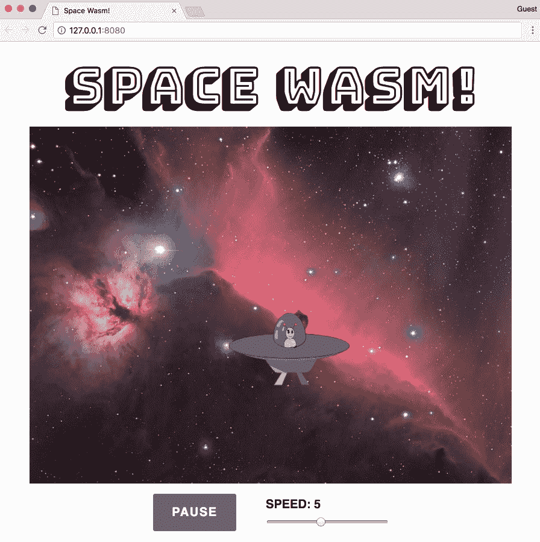

# 与 Node.js 集成

现代 Web 在开发和服务器端管理方面严重依赖 Node.js。随着越来越复杂的浏览器应用程序执行计算密集型操作，性能的提升将非常有益。在本章中，我们将描述通过各种示例集成 WebAssembly 与 Node.js 的各种方式。

本章的目标是理解以下内容：

+   将 WebAssembly 与 Node.js 集成的优势

+   如何与 Node.js 的 WebAssembly API 交互

+   如何在使用 Webpack 的项目中利用 Wasm 模块

+   如何使用`npm`库为 WebAssembly 模块编写单元测试

# 为什么选择 Node.js？

在第三章中，描述了 Node.js 作为异步事件驱动的 JavaScript 运行时，这是从官方网站上获取的定义。然而，Node.js 代表的是我们构建和管理 Web 应用程序方式的深刻转变。在本节中，我们将讨论 WebAssembly 和 Node.js 之间的关系，以及为什么这两种技术如此互补。

# 无缝集成

Node.js 在 Google 的 V8 JavaScript 引擎上运行，该引擎驱动着 Google Chrome。由于 V8 的 WebAssembly 实现遵循*核心规范*，因此您可以使用与浏览器相同的 API 与 WebAssembly 模块进行交互。您可以使用 Node.js 的`fs`模块将`.wasm`文件的内容读入缓冲区，然后对结果调用`instantiate()`，而不是执行`.wasm`文件的 fetch 调用。

# 互补技术

JavaScript 在服务器端也存在一些限制。使用 WebAssembly 的卓越性能可以优化昂贵的计算或处理大量数据。作为一种脚本语言，JavaScript 擅长自动化简单的任务。您可以编写一个脚本来将 C/C++编译为 Wasm 文件，将其复制到`build`文件夹中，并在浏览器中查看变化（如果使用类似`Browsersync`的工具）。

# 使用 npm 进行开发

Node.js 拥有一个庞大的工具和库生态系统，以`npm`的形式存在。Sven Sauleau 和其他开源社区成员创建了`webassemblyjs`，这是一个使用 Node.js 构建的 WebAssembly 工具套件。`webassemblyjs`网站[`webassembly.js.org`](https://webassembly.js.org)包括标语*WebAssembly 的工具链*。目前有超过 20 个`npm`包可执行各种任务并辅助开发，例如 ESLint 插件、AST 验证器和格式化程序。AssemblyScript 是一种 TypeScript 到 WebAssembly 的编译器，允许您编写高性能的代码，无需学习 C 或 C++即可编译为 Wasm 模块。Node.js 社区显然对 WebAssembly 的成功充满信心。

# 使用 Express 进行服务器端 WebAssembly

Node.js 可以以多种方式用于增加 WebAssembly 项目的价值。在本节中，我们将通过一个示例 Node.js 应用程序来介绍集成 WebAssembly 的方法。该应用程序使用 Express 和一些简单的路由来调用编译后的 Wasm 模块中的函数。

# 项目概述

该项目重用了我们在第七章中构建的应用程序（*从头开始创建应用程序*）的一些代码，以演示如何将 Node.js 与 WebAssembly 一起使用。本节的代码位于`learn-webassembly`存储库中的`/chapter-09-node/server-example`文件夹中。我们将审查与 Node.js 直接相关的应用程序部分。以下结构代表项目的文件结构：

```cpp
├── /lib
│    └── main.c
├── /src
|    ├── Transaction.js
|    ├── /assets
|    │   ├── db.json
|    │   ├── main.wasm
|    │   └── memory.wasm
|    ├── assign-routes.js
|    ├── index.js
|    └── load-assets.js
├── package.json
├── package-lock.json
└── requests.js
```

关于依赖项，该应用程序使用`express`和`body-parser`库来设置路由并解析来自请求主体的 JSON。对于数据管理，它使用`lowdb`，这是一个提供读取和更新 JSON 文件方法的库。JSON 文件位于`/src/assets/db.json`中，其中包含了从 Cook the Books 数据集中略微修改的数据。我们使用`nodemon`来监视`/src`文件夹中的更改并自动重新加载应用程序。我们使用`rimraf`来管理文件删除。该库作为依赖项包含在事件中，以防您没有在第三章中全局安装它，*设置开发环境*。最后，`node-fetch`库允许我们在测试应用程序时使用 fetch API 进行 HTTP 请求。

为了简化 JavaScript 和 C 文件中的功能，`rawAmount`和`cookedAmount`字段被替换为单个`amount`字段，`category`字段现在是`categoryId`，它映射到`db.json`中的`categories`数组。

# Express 配置

应用程序在`/src/index.js`中加载。该文件的内容如下所示：

```cpp
const express = require('express');
const bodyParser = require('body-parser');
const loadAssets = require('./load-assets');
const assignRoutes = require('./assign-routes');

// If you preface the npm start command with PORT=[Your Port] on
// macOS/Ubuntu or set PORT=[Your Port] on Windows, it will change the port
// that the server is running on, so PORT=3001 will run the app on
// port 3001:
const PORT = process.env.PORT || 3000;

const startApp = async () => {
  const app = express();

  // Use body-parser for parsing JSON in the body of a request:
  app.use(bodyParser.urlencoded({ extended: true }));
  app.use(bodyParser.json());

  // Instantiate the Wasm module and local database:
  const assets = await loadAssets();

  // Setup routes that can interact with Wasm and the database:
  assignRoutes(app, assets);

  // Start the server with the specified port:
  app.listen(PORT, (err) => {
    if (err) return Promise.reject(err);
    return Promise.resolve();
  });
};

startApp()
  .then(() => console.log(`Server is running on port ${PORT}`))
  .catch(err => console.error(`An error occurred: ${err}`));
```

该文件设置了一个新的 Express 应用程序，添加了`body-parser`中间件，加载了模拟数据库和 Wasm 实例，并分配了路由。让我们继续讨论在浏览器和 Node.js 中实例化 Wasm 模块的区别。

# 使用 Node.js 实例化 Wasm 模块

Wasm 文件在`/src/load-assets.js`中实例化。我们使用了来自 Cook the Books 的`memory.wasm`文件，但`/assets/main.wasm`文件是从位于`/lib`文件夹中的稍微不同版本的`main.c`编译而来。`loadWasm()`函数执行的操作与 Cook the Books 中的 Wasm 初始化代码相同，但是将`bufferSource`传递给`WebAssembly.instantiate()`的方法不同。让我们通过查看`load-assets.js`文件中`loadWasm()`函数的部分代码来进一步了解这一点：

```cpp
const fs = require('fs');
const path = require('path');

const assetsPath = path.resolve(__dirname, 'assets');

const getBufferSource = fileName => {
  const filePath = path.resolve(assetsPath, fileName);
  return fs.readFileSync(filePath); // <- Replaces the fetch() and .arrayBuffer()
};

// We're using async/await because it simplifies the Promise syntax
const loadWasm = async () => {
  const wasmMemory = new WebAssembly.Memory({ initial: 1024 });
  const memoryBuffer = getBufferSource('memory.wasm');
  const memoryInstance = await WebAssembly.instantiate(memoryBuffer, {
    env: {
      memory: wasmMemory
    }
  });
  ...
```

为了详细说明区别，以下是使用`fetch`实例化模块的一些代码：

```cpp
fetch('main.wasm')
  .then(response => {
    if (response.ok) return response.arrayBuffer();
    throw new Error('Unable to fetch WebAssembly file');
  })
  .then(bytes => WebAssembly.instantiate(bytes, importObj));
```

在使用 Node.js 时，`fetch`调用被`fs.readFileSync()`函数替换，不再需要`arrayBuffer()`函数，因为`fs.readFileSync()`返回一个可以直接传递给`instantiate()`函数的缓冲区。一旦 Wasm 模块被实例化，我们就可以开始与实例交互。

# 创建模拟数据库

`load-assets.js`文件还包含了创建模拟数据库实例的方法：

```cpp
const loadDb = () => {
  const dbPath = path.resolve(assetsPath, 'db.json');
  const adapter = new FileSync(dbPath);
  return low(adapter);
};
```

`loadDb()`函数将`/assets/db.json`的内容加载到`lowdb`的实例中。从`load-assets.js`中默认导出的函数调用了`loadWasm()`和`loadDb()`函数，并返回一个包含模拟数据库和 Wasm 实例的对象：

```cpp
module.exports = async function loadAssets() {
  const db = loadDb();
  const wasmInstance = await loadWasm();
  return {
    db,
    wasmInstance
  };
};
```

接下来，我将使用术语数据库来指代访问`db.json`文件的`lowdb`实例。现在资产已加载，让我们回顾一下应用程序如何与它们交互。

# 与 WebAssembly 模块交互

与数据库和 Wasm 实例的交互发生在`/src`文件夹中的两个文件中：`Transaction.js`和`assign-routes.js`。在我们的示例应用程序中，所有与 API 的通信都是通过 HTTP 请求完成的。向特定端点发送请求将触发服务器上与数据库/Wasm 实例的一些交互。让我们从直接与数据库和 Wasm 实例交互的`Transaction.js`开始回顾。

# 在 Transaction.js 中包装交互

就像 Cook the Books 一样，有一个类包装了 Wasm 交互代码并提供了一个清晰的接口。`Transaction.js`的内容与 Cook the Books 中的`/src/store/WasmTransactions.js`的内容非常相似。大部分更改是为了适应交易记录中存在`categoryId`和单个`amount`字段（不再有原始和烹饪金额）。还添加了与数据库交互的附加功能。例如，这是一个编辑现有交易的函数，既在数据库中，又在 Wasm 实例的链接列表中：

```cpp
getValidAmount(transaction) {
  const { amount, type } = transaction;
  return type === 'Withdrawal' ? -Math.abs(amount) : amount;
}

edit(transactionId, contents) {
  const updatedTransaction = this.db.get('transactions')
    .find({ id: transactionId })
    .assign(contents)
    .write();

  const { categoryId, ...transaction } = updatedTransaction;
  const amount = this.getValidAmount(transaction);
  this.wasmInstance._editTransaction(transactionId, categoryId, amount);

  return updatedTransaction;
}
```

`edit()`函数使用`contents`参数中的值更新与`transactionId`参数对应的数据库记录。`this.db`是在`load-assets.js`文件中创建的数据库实例。由于`updatedTransaction`记录上可用`categoryId`字段，我们可以直接将其传递给`this.wasmInstance._editTransaction()`。当创建`Transaction`的新实例时，它会被传递到构造函数中。

# 在 assign-routes.js 中的交易操作

`assign-routes.js`文件定义了路由并将它们添加到`index.js`中创建的`express`实例（`app`）中。在 Express 中，路由可以直接在`app`上定义（例如`app.get()`），也可以通过使用`Router`来定义。在这种情况下，使用了`Router`来将多个方法添加到相同的路由路径上。以下代码取自`assign-routes.js`文件，创建了一个`Router`实例并添加了两个路由：一个`GET`路由返回所有交易，一个`POST`路由创建一个新的交易。

```cpp
module.exports = function assignRoutes(app, assets) {
  const { db, wasmInstance } = assets;
  const transaction = new Transaction(db, wasmInstance);
  const transactionsRouter = express.Router();

  transactionsRouter
    .route('/')
    .get((req, res) => {
      const transactions = transaction.findAll();
      res.status(200).send(transactions);
    })
    .post((req, res) => {
      const { body } = req;
      if (!body) {
        return res.status(400).send('Body of request is empty');
      }
      const newRecord = transaction.add(body);
      res.status(200).send(newRecord);
    });

  ...

  // Set the base path for all routes on transactionsRouter:
  app.use('/api/transactions', transactionsRouter);
}
```

片段末尾的`app.use()`函数指定了在`transactionsRouter`实例上定义的所有路由都以`/api/transactions`为前缀。如果您在本地端口`3000`上运行应用程序，可以在浏览器中导航到`http://localhost:3000/api/transactions`，并以 JSON 格式查看所有交易的数组。

从`get()`和`post()`函数的主体中可以看出，与任何交易记录的交互都被委托给了第 3 行创建的`Transaction`实例。这完成了我们对代码库相关部分的审查。每个文件都包含描述文件功能和目的的注释，因此在继续下一部分之前，您可能需要审查这些内容。在下一部分中，我们将构建、运行并与应用程序交互。

# 构建和运行应用程序

在构建和测试项目之前，您需要安装`npm`依赖项。在`/server-example`文件夹中打开终端并运行以下命令：

```cpp
npm install
```

完成后，您可以继续进行构建步骤。

# 构建应用程序

在这个应用程序中，构建是指使用`emcc`命令将`lib/main.c`编译为`.wasm`文件。由于这是一个 Node.js 项目，我们可以使用`package.json`文件中的`scripts`键来定义任务。您仍然可以使用 VS Code 的任务功能，因为它会自动检测`package.json`文件中的脚本，并在选择任务时将它们呈现在任务列表中。以下代码包含了该项目`package.json`文件中`scripts`部分的内容：

```cpp
"scripts": {
  "prebuild": "rimraf src/assets/main.wasm",
  "build": "emcc lib/main.c -Os -s WASM=1 -s SIDE_MODULE=1
           -s BINARYEN_ASYNC_COMPILATION=0 -s ALLOW_MEMORY_GROWTH=1
           -o src/assets/main.wasm",
  "start": "node src/index.js",
  "watch": "nodemon src/* --exec 'npm start'"
},
```

`build`脚本被拆分成多行以便显示，因此您需要将这些行组合成有效的 JSON。`prebuild`脚本会删除现有的 Wasm 文件，而`build`脚本会使用所需的标志运行`emcc`命令，将`lib/main.c`编译并将结果输出到`src/assets/main.wasm`。要运行该脚本，请在`/server-example`文件夹中打开终端并运行以下命令：

```cpp
npm run build
```

如果`/src/assets`文件夹中包含名为`main.wasm`的文件，则构建已成功完成。如果发生错误，终端应提供错误的描述以及堆栈跟踪。

你可以创建`npm`脚本，在特定脚本之前或之后运行，方法是创建一个与相同名称的条目，并在前面加上`pre`或`post`。例如，如果你想在`build`脚本完成后运行一个脚本，你可以创建一个名为`"postbuild"`的脚本，并指定你想要运行的命令。

# 启动和测试应用程序

如果你正在对应用程序进行更改或尝试修复错误，你可以使用`watch`脚本来监视`/src`文件夹中内容的任何更改，并在有更改时自动重新启动应用程序。由于我们只是运行和测试应用程序，所以可以使用`start`命令。在终端中，确保你在`/server-example`文件夹中，并运行以下命令：

```cpp
npm start
```

你应该看到一个消息，上面写着`服务器正在 3000 端口上运行`。现在你可以向服务器发送 HTTP 请求了。要测试应用程序，在`server-example`目录中打开一个新的终端实例，并运行以下命令：

```cpp
node ./requests.js 1
```

这应该记录下对`/api/transactions`端点的`GET`调用的响应主体。`requests.js`文件包含了允许你对所有可用路由进行请求的功能。`getFetchActionForId()`函数返回一个带有端点和选项值的对象，对应于`assign-routes.js`文件中的一个路由。`actionId`是一个任意的数字，用于简化测试并减少运行命令时的输入量。例如，你可以运行以下命令：

```cpp
node ./requests.js 5
```

它将记录下*计算机与互联网*类别的所有交易的总和。如果你想要其他类别的总和，可以向`node`命令传递额外的参数。要获取*保险*类别的所有交易总和，运行以下命令：

```cpp
node ./requests.js 5 3
```

尝试通过每个请求（总共有八个）进行。如果你发出了一个添加、删除或编辑交易的请求，你应该在`/src/assets/db.json`文件中看到变化。这就是 Node.js 示例项目的全部内容。在下一节中，我们将利用 Webpack 来加载和与 Wasm 模块交互。

# 使用 Webpack 进行客户端 WebAssembly

Web 应用程序在复杂性和规模上继续增长。简单地提供一些手写的 HTML、CSS 和 JavaScript 文件对于大型应用程序来说是不可行的。为了管理这种复杂性，Web 开发人员使用捆绑器来实现模块化，确保浏览器兼容性，并减少 JavaScript 文件的大小。在本节中，我们将使用一种流行的捆绑器 Webpack 来利用 Wasm，而不使用`emcc`。

# 项目概述

示例 Webpack 应用程序扩展了我们在第五章的*编译 C 而不使用粘合代码*部分中编写的 C 代码的功能，*创建和加载 WebAssembly 模块*。我们不再展示一个蓝色矩形在红色背景上弹跳，而是展示一个飞船在马头星云中弹跳。碰撞检测功能已经修改，以适应在矩形内弹跳，所以飞船的移动将是随机的。本节的代码位于`learn-webassembly`存储库中的`/chapter-09-node/webpack-example`文件夹中。项目的文件结构如下所示：

```cpp
├── /src
│    ├── /assets
│    │    ├── background.jpg
│    │    └── spaceship.svg
│    ├── App.js
│    ├── index.html
│    ├── index.js
│    ├── main.c
│    └── styles.css
├── package.json
├── package-lock.json
└── webpack.config.js
```

我们将在后面的章节中审查 Webpack 配置文件。现在，让我们花一点时间更详细地讨论 Webpack。

# 什么是 Webpack？

在过去的几年里，JavaScript 生态系统一直在迅速发展，导致不断涌现新的框架和库。捆绑器的出现使开发人员能够将 JavaScript 应用程序分成多个文件，而不必担心管理全局命名空间、脚本加载顺序或 HTML 文件中的一长串`<script>`标签。捆绑器将所有文件合并为一个文件，并解决任何命名冲突。

截至撰写本文时，Webpack 是前端开发中最流行的打包工具之一。然而，它的功能远不止于合并 JavaScript 文件。它还执行复杂的任务，如代码拆分和摇树（死代码消除）。Webpack 采用了插件架构，这导致了大量由社区开发的插件。在`npm`上搜索 Webpack 目前返回超过 12,000 个包！这个详尽的插件列表，加上其强大的内置功能集，使 Webpack 成为一个功能齐全的构建工具。

# 安装和配置 Webpack

在开始应用程序演示之前，在`/webpack-example`文件夹中打开终端并运行以下命令：

```cpp
npm install 
```

# 依赖概述

应用程序使用 Webpack 的版本 4（在撰写本文时为最新版本）来构建我们的应用程序。我们需要使用 Webpack 插件来加载应用程序中使用的各种文件类型，并使用 Babel 来利用较新的 JavaScript 功能。以下片段列出了我们在项目中使用的`devDependencies`（取自`package.json`）：

```cpp
...
"devDependencies": {
  "@babel/core": "⁷.0.0-rc.1",
  "@babel/preset-env": "⁷.0.0-rc.1",
  "babel-loader": "⁸.0.0-beta.4",
  "cpp-wasm-loader": "0.7.7",
  "css-loader": "1.0.0",
  "file-loader": "1.1.11",
  "html-loader": "0.5.5",
  "html-webpack-plugin": "3.2.0",
  "mini-css-extract-plugin": "0.4.1",
  "rimraf": "2.6.2",
  "webpack": "4.16.5",
  "webpack-cli": "3.1.0",
  "webpack-dev-server": "3.1.5"
},
...
```

我为一些库指定了确切的版本，以确保应用程序能够成功构建和运行。任何以`-loader`或`-plugin`结尾的库都与 Webpack 一起使用。`cpp-wasm-loader`库允许我们直接导入 C 或 C++文件，而无需先将其编译为 Wasm。Webpack 4 内置支持导入`.wasm`文件，但无法指定`importObj`参数，这是使用 Emscripten 生成的模块所必需的。

# 在 webpack.config.js 中配置加载器和插件

除了 JavaScript 之外，我们还在应用程序中使用了几种不同的文件类型：CSS、SVG、HTML 等。安装`-loader`依赖项只是问题的一部分——您还需要告诉 Webpack 如何加载它们。您还需要为已安装的任何插件指定配置详细信息。您可以在项目的根文件夹中的`webpack.config.js`文件中指定加载和配置详细信息。以下片段包含了`/webpack-example/webpack.config.js`的内容：

```cpp
const HtmlWebpackPlugin = require('html-webpack-plugin');
const MiniCssExtractPlugin = require('mini-css-extract-plugin');

module.exports = {
  module: {
    rules: [
      {
        test: /\.js$/,
        exclude: /node_modules/,
        use: {
          loader: 'babel-loader',
          options: {
            // We need this to use async/await:
            presets: [
              [
                '@babel/preset-env', {
                  targets: { node: '10' }
                }
              ]
            ]
          }
        }
      },
      {
        test: /\.html$/,
        use: {
          loader: 'html-loader',
          options: { minimize: true }
        }
      },
      {
        test: /\.css$/,
        use: [MiniCssExtractPlugin.loader, 'css-loader']
      },
      {
        test: /\.(c|cpp)$/,
        use: {
          loader: 'cpp-wasm-loader',
          options: {
            emitWasm: true
          }
        }
      },
      {
        test: /\.(png|jpg|gif|svg)$/,
        use: {
          loader: 'file-loader',
          options: {
            name: 'assets/[name].[ext]'
          }
        }
      }
    ]
  },
  plugins: [
    new HtmlWebpackPlugin({
      template: './src/index.html',
      filename: './index.html'
    }),
    // This is used for bundling (building for production):
    new MiniCssExtractPlugin({
      filename: '[name].css',
      chunkFilename: '[id].css'
    })
  ]
};
```

`rules`部分告诉 Webpack 使用哪个加载器来处理文件扩展名。数组中的第四项处理 C/C++文件（注意`test`字段值包含`c|cpp`）。`HtmlWebpackPlugin`获取`/src/index.html`的内容，添加任何所需的`<script>`标签，对其进行最小化，并在`build`文件夹中创建一个`index.html`，默认为`/dist`。`MiniCssExtractPlugin`将任何导入的 CSS 复制到`/dist`文件夹中的单个 CSS 文件中。我们将在后面的部分中讨论如何构建项目，所以让我们继续进行应用程序代码的讲解，从 C 文件开始。

# C 代码

由于我们可以直接导入 C 和 C++文件，因此 C 文件位于`/src`文件夹中。这个文件，`main.c`，包含了管理碰撞检测和移动飞船的逻辑。这段代码基于我们在第五章中创建的`without-glue.c`文件，*创建和加载 WebAssembly 模块*。我们不打算审查整个文件，只审查已更改并值得解释的部分。让我们从定义和声明部分开始，其中包括一个新的`struct`：`Bounds`。

# 定义和声明

包含定义和声明部分的代码如下所示：

```cpp
typedef struct Bounds {
  int width;
  int height;
} Bounds;

// We're using the term "Rect" to represent the rectangle the
// image occupies:
typedef struct Rect {
  int x;
  int y;
  int width;
  int height;
  // Horizontal direction of travel (L/R):
  char horizDir;
  // Vertical direction of travel (U/D):
  char vertDir;
} Rect;

struct Bounds bounds;
struct Rect rect;
```

对现有的`Rect`定义添加了新属性，以适应灵活的大小和在*x*和*y*方向上的移动跟踪。我们定义了一个新的`struct`，`Bounds`，并删除了现有的`#define`语句，因为`<canvas>`元素不再是具有静态尺寸的正方形。模块加载时声明了这两个元素的新实例。这些实例的尺寸属性在`start()`函数中赋值，接下来我们将介绍这个函数。

# start()函数

更新的`start()`函数，作为模块的入口点，如下所示：

```cpp
EMSCRIPTEN_KEEPALIVE
void start(int boundsWidth, int boundsHeight, int rectWidth,
           int rectHeight) {
    rect.x = 0;
    rect.y = 0;
    rect.horizDir = 'R';
    rect.vertDir = 'D';
    rect.width = rectWidth;
    rect.height = rectHeight;
    bounds.width = boundsWidth;
    bounds.height = boundsHeight;
    setIsRunning(true);
}
```

从 JavaScript 调用的任何函数都以`EMSCRIPTEN_KEEPALIVE`语句为前缀。现在，我们将`Bounds`和`Rect`元素的宽度和高度作为参数传递给`start()`函数，然后将其分配给本地的`bounds`和`rect`变量。这使我们可以轻松地更改任一元素的尺寸，而无需对碰撞检测逻辑进行任何更改。在这个应用程序的上下文中，`rect`表示飞船图像所在的矩形。我们设置了`rect`的默认水平和垂直方向，使图像最初向右和向下移动。让我们继续进行`rect`移动/碰撞检测代码。

# 更新`updateRectLocation()`函数

与碰撞检测和`Rect`移动相关的代码在`updateRectLocation()`函数中处理，如下所示：

```cpp
/**
 * Updates the rectangle location by +/- 1px in the x or y based on
 * the current location.
 */
void updateRectLocation() {
    // Determine if the bounding rectangle has "bumped" into either
    // the left/right side or top/bottom side. Depending on which side,
    // flip the direction:
    int xBouncePoint = bounds.width - rect.width;
    if (rect.x == xBouncePoint) rect.horizDir = 'L';
    if (rect.x == 0) rect.horizDir = 'R';

    int yBouncePoint = bounds.height - rect.height;
    if (rect.y == yBouncePoint) rect.vertDir = 'U';
    if (rect.y == 0) rect.vertDir = 'D';

    // If the direction has changed based on the x and y
    // coordinates, ensure the x and y points update
    // accordingly:
    int horizIncrement = 1;
    if (rect.horizDir == 'L') horizIncrement = -1;
    rect.x = rect.x + horizIncrement;

    int vertIncrement = 1;
    if (rect.vertDir == 'U') vertIncrement = -1;
    rect.y = rect.y + vertIncrement;
}
```

这段代码与我们在第五章中编写的代码的主要区别是碰撞检测逻辑。现在，函数不仅仅是水平跟踪`rect`实例的位置，并在其击中右边界时改变方向，而是现在函数同时跟踪水平和垂直方向，并独立管理每个方向。虽然这不是最高效的算法，但它确实实现了确保飞船在遇到`<canvas>`边缘时改变方向的目标。

# JavaScript 代码

我们应用程序唯一的生产依赖是 Vue。虽然应用程序只包含一个组件，但 Vue 使得管理数据、函数和组件生命周期比手动操作简单得多。`index.js`文件包含了 Vue 初始化代码，而渲染和应用程序逻辑在`/src/App.js`中。这个文件有很多部分，所以我们将像在上一节一样分块审查代码。让我们从`import`语句开始。

# 导入语句

以下代码演示了 Webpack 加载器的工作原理：

```cpp
// This is loaded using the css-loader dependency:
import './styles.css';

// This is loaded using the cpp-wasm-loader dependency:
import wasm from './main.c';

// These are loaded using the file-loader dependency:
import backgroundImage from './assets/background.jpg';
import spaceshipImage from './assets/spaceship.svg';
```

我们在`webpack.config.js`文件中配置的加载器知道如何处理 CSS、C 和图像文件。现在我们有了所需的资源，我们可以开始定义我们的组件状态。

# 组件状态

以下代码在`data()`函数中初始化了组件的本地状态：

```cpp
export default {
  data() {
    return {
      instance: null,
      bounds: { width: 800, height: 592 },
      rect: { width: 200, height: 120 },
      speed: 5
    };
  },
  ...
```

虽然`bounds`和`rect`属性永远不会改变，但我们在本地状态中定义它们，以便将组件使用的所有数据保存在一个位置。`speed`属性决定了飞船在`<canvas>`上移动的速度，并且范围为`1`到`10`。`instance`属性初始化为 null，但将用于访问编译后的 Wasm 模块的导出函数。让我们继续进行编译 Wasm 文件并填充`<canvas>`的 Wasm 初始化代码。

# Wasm 初始化

编译 Wasm 文件并填充`<canvas>`元素的代码如下所示：

```cpp
methods: {
  // Create a new Image instance to pass into the drawImage function
  // for the <canvas> element's context:
  loadImage(imageSrc) {
    const loadedImage = new Image();
    loadedImage.src = imageSrc;
    return new Promise((resolve, reject) => {
      loadedImage.onload = () => resolve(loadedImage);
      loadedImage.onerror = () => reject();
    });
  },

  // Compile/load the contents of main.c and assign the resulting
  // Wasm module instance to the components this.instance property:
  async initializeWasm() {
    const ctx = this.$refs.canvas.getContext('2d');

    // Create Image instances of the background and spaceship.
    // These are required to pass into the ctx.drawImage() function:
    const [bouncer, background] = await Promise.all([
      this.loadImage(spaceshipImage),
      this.loadImage(backgroundImage)
    ]);

    // Compile the C code to Wasm and assign the resulting
    // module.exports to this.instance:
    const { width, height } = this.bounds;
    return wasm
      .init(imports => ({
        ...imports,
        _jsFillRect(x, y, w, h) {
          ctx.drawImage(bouncer, x, y, w, h);
        },
        _jsClearRect() {
          ctx.drawImage(background, 0, 0, width, height);
        }
      }))
        .then(module => {
          this.instance = module.exports;
          return Promise.resolve();
        });
  },
  ...
```

在组件的`methods`键中定义了其他函数，但现在我们将专注于将导入的 C 文件编译为 Wasm 的代码。在为飞船和背景图像创建`Image`实例之后，将`main.c`文件（导入为`.wasm`）编译为 Wasm 模块，并将结果的`exports`分配给`this.instance`。完成这些操作后，可以从导出的 Wasm 模块中调用`start()`函数。由于`initializeWasm()`函数调用了`<canvas>`元素的`getContext()`函数，因此在调用此函数之前，组件需要被挂载。让我们审查`methods`定义的其余部分和`mounted()`事件处理程序。

# 组件挂载

其余的`methods`定义和`mounted()`事件处理程序函数如下所示：

```cpp
  ...
  // Looping function to move the spaceship across the canvas.
  loopRectMotion() {
    setTimeout(() => {
      this.instance.moveRect();
      if (this.instance.getIsRunning()) this.loopRectMotion();
    }, 15 - this.speed);
  },
  // Pauses/resumes the spaceship's movement when the button is
  // clicked:
  onActionClick(event) {
    const newIsRunning = !this.instance.getIsRunning();
    this.instance.setIsRunning(newIsRunning);
    event.target.innerHTML = newIsRunning ? 'Pause' : 'Resume';
    if (newIsRunning) this.loopRectMotion();
  }
},
mounted() {
  this.initializeWasm().then(() => {
    this.instance.start(
      this.bounds.width,
      this.bounds.height,
      this.rect.width,
      this.rect.height
    );
    this.loopRectMotion();
  });
},
```

一旦 Wasm 模块被编译，`start()`函数就可以在`this.instance`上访问。`bounds`和`rect`尺寸被传递到`start()`函数中，然后调用`loopRectFunction()`来开始移动飞船。`onActionClick()`事件处理程序函数根据飞船当前是否在运动来暂停或恢复飞船的移动。

`loopRectMotion()`函数的工作方式与第五章中的示例代码相同，*创建和加载 WebAssembly 模块*，只是现在速度是可调节的。`15 - this.speed`的计算可能看起来有点奇怪。由于图像的移动速度是基于函数调用之间经过的时间，增加这个数字实际上会减慢飞船的速度。因此，`this.speed`从`15`中减去，选择`15`是因为它略大于`10`，但不会在将`this.speed`增加到最大值时使飞船变得模糊。这就是组件逻辑；让我们继续到代码的渲染部分，其中定义了`template`。

# 组件渲染

`template`属性的内容，决定了要渲染的内容，如下所示：

```cpp
template: `
  <div class="flex column">
   <h1>SPACE WASM!</h1>
    <canvas
      ref="canvas"
      :height="bounds.height"
      :width="bounds.width">
    </canvas>
    <div class="flex controls">
      <div>
        <button class="defaultText" @click="onActionClick">
          Pause
        </button>
      </div>
    <div class="flex column">
      <label class="defaultText" for="speed">Speed: {{speed}}</label>
      <input
        v-model="speed"
        id="speed"
        type="range"
        min="1"
        max="10"
        step="1">
    </div>
  </div>
</div>

```

由于我们使用了 Vue，我们可以将 HTML 元素的属性和事件处理程序绑定到组件中定义的属性和方法。除了一个暂停/恢复按钮，还有一个范围`<input>`，允许您改变速度。通过将其向左或向右滑动，您可以减慢或加快飞船的速度，并立即看到变化。这就结束了我们的回顾；让我们看看 Webpack 如何用来构建或运行应用程序。

# 构建和运行应用程序

使用`cpp-wasm-loader`库可以消除构建步骤生成 Wasm 模块的需要，但我们仍然需要将应用程序捆绑起来进行分发。在`package.json`的`scripts`部分，有一个`build`和`start`脚本。运行`build`脚本会执行生成捆绑包的`webpack`命令。为了确保这一切都正常工作，打开`/webpack-example`文件夹中的终端实例，并运行以下命令：

```cpp
npm run build
```

第一次运行项目构建可能需要一分钟。这可能归因于 Wasm 编译步骤。但是，后续的构建应该会快得多。如果构建成功，您应该会看到一个新创建的`/dist`文件夹，其中包含以下内容：

```cpp
├── /assets
│    ├── background.jpg
│    └── spaceship.svg
├── index.html
├── main.css
├── main.js
└── main.wasm
```

# 测试构建

让我们尝试构建以确保一切都正常工作。在终端实例中运行以下命令来启动应用程序：

```cpp
serve -l 8080 dist
```

如果在浏览器中导航到`http://127.0.0.1:8080/index.html`，您应该会看到这个：



Webpack 应用程序在浏览器中运行

飞船图像（取自[`commons.wikimedia.org/wiki/File:Alien_Spaceship_-_SVG_Vector.svg`](https://commons.wikimedia.org/wiki/File:Alien_Spaceship_-_SVG_Vector.svg)）在 Horsehead 星云背景图像（取自[`commons.wikimedia.org/wiki/File:Horsehead_Nebula_Christmas_2017_Deography.jpg`](https://commons.wikimedia.org/wiki/File:Horsehead_Nebula_Christmas_2017_Deography.jpg)）的范围内弹来弹去。当按下暂停按钮时，按钮的标题会更改为恢复，飞船停止移动。再次按下按钮将会将标题更改回暂停，并且飞船将再次开始移动。调整速度滑块会增加或减少飞船的速度。

# 运行启动脚本

应用程序已安装`webpack-dev-server`库，它的操作方式类似于`Browsersync`。该库使用 LiveReloading，在您对`/src`中的文件进行任何更改时会自动更新应用程序。由于我们使用了 C 和 C++文件的 Webpack 加载器，因此如果您更改了 C 文件，自动更新事件也会触发。运行以下命令来启动应用程序并监视更改：

```cpp
npm start
```

当构建完成时，浏览器窗口应该会自动打开，然后将您引导到运行的应用程序。要查看实时重新加载功能的操作，请尝试将`main.c`中的`setIsRunning()`函数中的`isRunning`变量的值设置为 false，而不是`newIsRunning`：

```cpp
EMSCRIPTEN_KEEPALIVE
void setIsRunning(bool newIsRunning) {
    // isRunning = newIsRunning;

    // Set the value to always false:
    isRunning = false;
}
```

飞船应该被卡在左上角。如果您将其改回，飞船将重新开始移动。在下一节中，我们将编写 JavaScript 单元测试来测试 WebAssembly 模块。

# 使用 Jest 测试 WebAssembly 模块

经过充分测试的代码可以防止回归错误，简化重构，并减轻添加新功能时的一些挫折感。一旦您编译了一个 Wasm 模块，您应该编写测试来确保它的功能符合预期，即使您已经为您从中编译出来的 C、C++或 Rust 代码编写了测试。在本节中，我们将使用**Jest**，一个 JavaScript 测试框架，来测试编译后的 Wasm 模块中的函数。

# 正在测试的代码

此示例中使用的所有代码都位于`/chapter-09-node/testing-example`文件夹中。代码和相应的测试非常简单，不代表真实应用程序，但旨在演示如何使用 Jest 进行测试。以下代码表示`/testing-example`文件夹的文件结构：

```cpp
├── /src
|    ├── /__tests__
|    │    └── main.test.js
|    └── main.c
├── package.json
└── package-lock.json
```

我们将要测试的 C 文件的内容，`/src/main.c`，如下所示：

```cpp
int addTwoNumbers(int leftValue, int rightValue) {
    return leftValue + rightValue;
}

float divideTwoNumbers(float leftValue, float rightValue) {
    return leftValue / rightValue;
}

double findFactorial(float value) {
    int i;
    double factorial = 1;

    for (i = 1; i <= value; i++) {
        factorial = factorial * i;
    }
    return factorial;
}
```

文件中的所有三个函数都执行简单的数学运算。`package.json`文件包含一个脚本，用于将 C 文件编译为 Wasm 文件进行测试。运行以下命令来编译 C 文件：

```cpp
npm run build
```

`/src`目录中应该有一个名为`main.wasm`的文件。让我们继续描述测试配置步骤。

# 测试配置

在这个示例中，我们将使用 Jest 作为唯一的依赖项，Jest 是 Facebook 开发的 JavaScript 测试框架。Jest 是测试的绝佳选择，因为它包含大多数您需要的功能，如覆盖率、断言和模拟等。在大多数情况下，您可以在零配置的情况下使用它，具体取决于您的应用程序的复杂性。如果您想了解更多，请访问 Jest 的网站[`jestjs.io`](https://jestjs.io)。在`/chapter-09-node/testing-example`文件夹中打开一个终端实例，并运行以下命令来安装 Jest：

```cpp
npm install
```

在`package.json`文件中，`scripts`部分有三个条目：`build`、`pretest`和`test`。`build`脚本使用所需的标志执行`emcc`命令，将`/src/main.c`编译为`/src/main.wasm`。`test`脚本使用`--verbose`标志执行`jest`命令，为每个测试套件提供额外的细节。`pretest`脚本只是运行`build`脚本，以确保在运行任何测试之前存在`/src/main.wasm`。

# 测试文件审查

让我们来看一下位于`/src/__tests__/main.test.js`的测试文件，并审查代码的每个部分的目的。测试文件的第一部分实例化`main.wasm`文件，并将结果分配给本地的`wasmInstance`变量：

```cpp
const fs = require('fs');
const path = require('path');

describe('main.wasm Tests', () => {
  let wasmInstance;

  beforeAll(async () => {
    const wasmPath = path.resolve(__dirname, '..', 'main.wasm');
    const buffer = fs.readFileSync(wasmPath);
    const results = await WebAssembly.instantiate(buffer, {
      env: {
        memoryBase: 0,
        tableBase: 0,
        memory: new WebAssembly.Memory({ initial: 1024 }),
        table: new WebAssembly.Table({ initial: 16, element: 'anyfunc' }),
        abort: console.log
      }
    });
    wasmInstance = results.instance.exports;
  });
 ...
```

Jest 提供了生命周期方法来执行任何设置或拆卸操作以便在运行测试之前进行。您可以指定在所有测试之前或之后运行的函数（`beforeAll()`/`afterAll()`），或者在每个测试之前或之后运行的函数（`beforeEach()`/`afterEach()`）。我们需要一个编译后的 Wasm 模块实例，从中我们可以调用导出的函数，因此我们将实例化代码放在`beforeAll()`函数中。

我们将整个测试套件包装在文件的`describe()`块中。Jest 使用`describe()`函数来封装相关测试套件，使用`test()`或`it()`来表示单个测试。以下是这个概念的一个简单示例：

```cpp
const add = (a, b) => a + b;

describe('the add function', () => {
  test('returns 6 when 4 and 2 are passed in', () => {
    const result = add(4, 2);
    expect(result).toEqual(6);
  });

  test('returns 20 when 12 and 8 are passed in', () => {
    const result = add(12, 8);
    expect(result).toEqual(20);
  });
});
```

下一节代码包含了所有的测试套件和每个导出函数的测试：

```cpp
...
  describe('the _addTwoNumbers function', () => {
    test('returns 300 when 100 and 200 are passed in', () => {
      const result = wasmInstance._addTwoNumbers(100, 200);
      expect(result).toEqual(300);
    });

    test('returns -20 when -10 and -10 are passed in', () => {
      const result = wasmInstance._addTwoNumbers(-10, -10);
      expect(result).toEqual(-20);
    });
  });

  describe('the _divideTwoNumbers function', () => {
    test.each([
      [10, 100, 10],
      [-2, -10, 5],
    ])('returns %f when %f and %f are passed in', (expected, a, b) => {
      const result = wasmInstance._divideTwoNumbers(a, b);
      expect(result).toEqual(expected);
    });

    test('returns ~3.77 when 20.75 and 5.5 are passed in', () => {
      const result = wasmInstance._divideTwoNumbers(20.75, 5.5);
      expect(result).toBeCloseTo(3.77, 2);
    });
  });

  describe('the _findFactorial function', () => {
    test.each([
      [120, 5],
      [362880, 9.2],
    ])('returns %p when %p is passed in', (expected, input) => {
      const result = wasmInstance._findFactorial(input);
      expect(result).toEqual(expected);
    });
  });
});
```

第一个`describe()`块，用于`_addTwoNumbers()`函数，有两个`test()`实例，以确保函数返回作为参数传入的两个数字的总和。接下来的两个`describe()`块，用于`_divideTwoNumbers()`和`_findFactorial()`函数，使用了 Jest 的`.each`功能，允许您使用不同的数据运行相同的测试。`expect()`函数允许您对作为参数传入的值进行断言。最后一个`_divideTwoNumbers()`测试中的`.toBeCloseTo()`断言检查结果是否在`3.77`的两个小数位内。其余使用`.toEqual()`断言来检查相等性。

使用 Jest 编写测试相对简单，运行测试甚至更容易！让我们尝试运行我们的测试，并查看 Jest 提供的一些 CLI 标志。

# 运行测试

要运行测试，请在`/chapter-09-node/testing-example`文件夹中打开终端实例，并运行以下命令：

```cpp
npm test
```

您应该在终端中看到以下输出：

```cpp
main.wasm Tests
  the _addTwoNumbers function
    ✓ returns 300 when 100 and 200 are passed in (4ms)
    ✓ returns -20 when -10 and -10 are passed in
  the _divideTwoNumbers function
    ✓ returns 10 when 100 and 10 are passed in
    ✓ returns -2 when -10 and 5 are passed in (1ms)
    ✓ returns ~3.77 when 20.75 and 5.5 are passed in
  the _findFactorial function
    ✓ returns 120 when 5 is passed in (1ms)
    ✓ returns 362880 when 9.2 is passed in

Test Suites: 1 passed, 1 total
Tests: 7 passed, 7 total
Snapshots: 0 total
Time: 1.008s
Ran all test suites.
```

如果您有大量的测试，可以从`package.json`中的`test`脚本中删除`--verbose`标志，并仅在需要时将标志传递给`npm test`命令。您可以将其他几个 CLI 标志传递给`jest`命令。以下列表包含一些常用的标志：

+   `--bail`: 在第一个失败的测试套件后立即退出测试套件

+   `--coverage`: 收集测试覆盖率，并在测试运行后在终端中显示

+   `--watch`: 监视文件更改并重新运行与更改文件相关的测试

您可以通过在`--`之后添加这些标志来将这些标志传递给`npm`测试命令。例如，如果您想使用`--bail`标志，您可以运行以下命令：

```cpp
npm test -- --bail
```

您可以在官方网站上查看所有 CLI 选项的完整列表：[`jestjs.io/docs/en/cli`](https://jestjs.io/docs/en/cli)。

# 总结

在本章中，我们讨论了将 WebAssembly 与 Node.js 集成的优势，并演示了 Node.js 如何在服务器端和客户端使用。我们评估了一个使用 Wasm 模块执行会计交易计算的 Express 应用程序。然后，我们审查了一个基于浏览器的应用程序，该应用程序利用 Webpack 从 C 文件中导入和调用函数，而无需编写任何 Wasm 实例化代码。最后，我们看到了如何利用 Jest 测试框架来测试编译模块并确保其正常运行。在第十章中，*高级工具和即将推出的功能*，我们将介绍高级工具，并讨论 WebAssembly 即将推出的功能。

# 问题

1.  将 WebAssembly 与 Node.js 集成的优势之一是什么？

1.  Express 应用程序使用哪个库来读取和写入数据到 JSON 文件？

1.  在浏览器和 Node.js 中加载模块有什么区别？

1.  您可以使用什么技术在现有的`npm`脚本之前或之后运行一个`npm`脚本？

1.  Webpack 执行的任务名称是什么，以消除死代码？

1.  Webpack 中加载程序的目的是什么？

1.  Jest 中`describe()`和`test()`函数之间的区别是什么？

1.  如何将额外的 CLI 标志传递给`npm test`命令？

# 进一步阅读

+   Express: [`expressjs.com`](https://expressjs.com)

+   Webpack: [`webpack.js.org`](https://webpack.js.org)

+   Jest API: [`jestjs.io/docs/en/api`](https://jestjs.io/docs/en/api)
