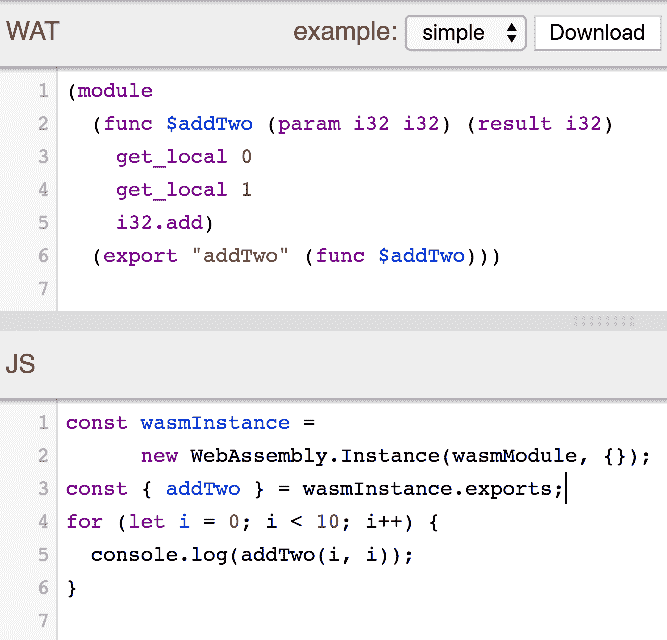
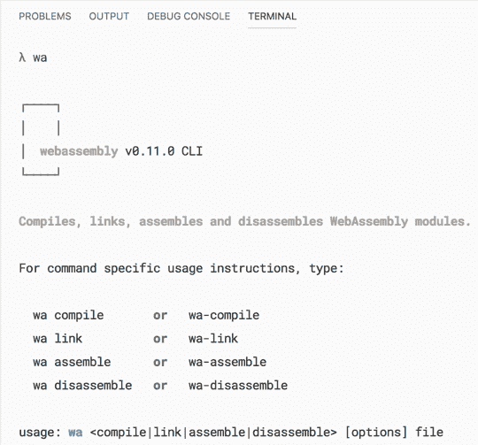
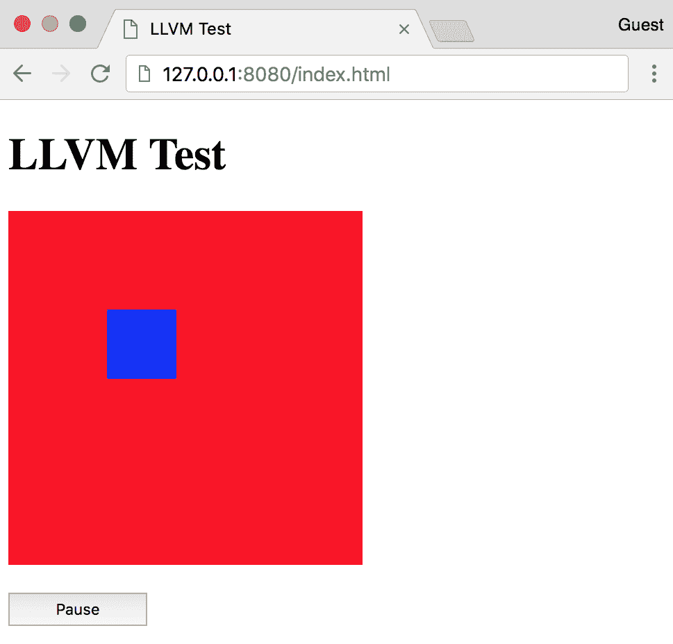
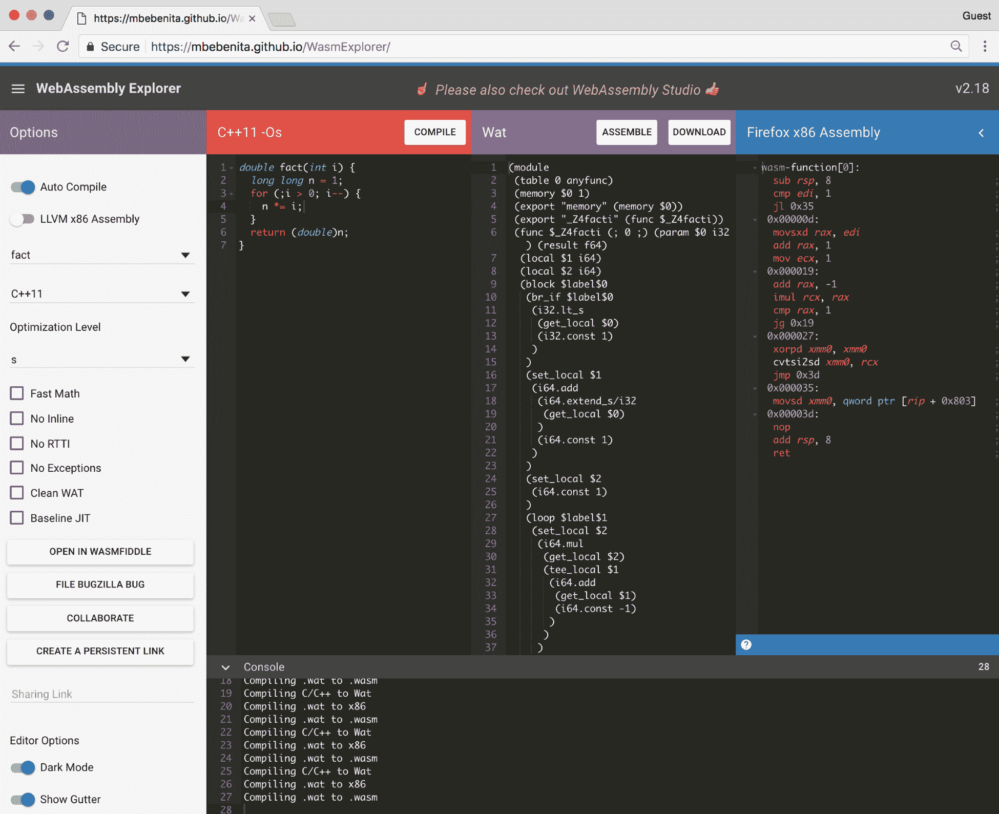
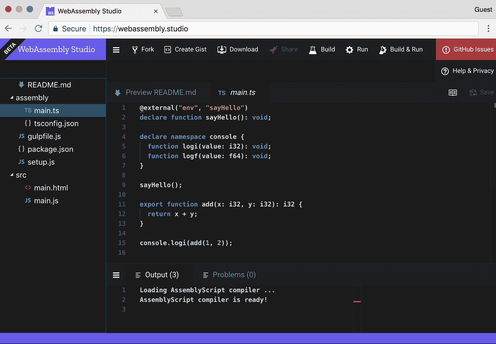
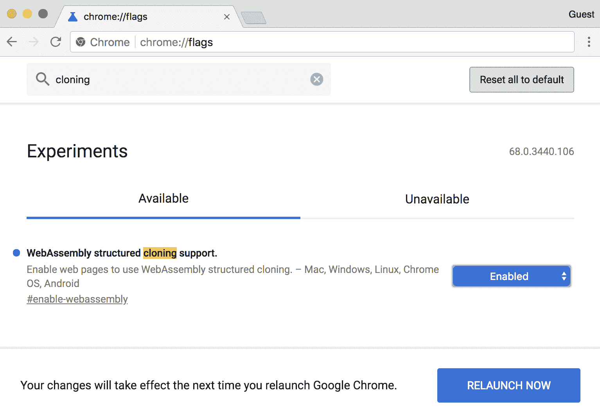
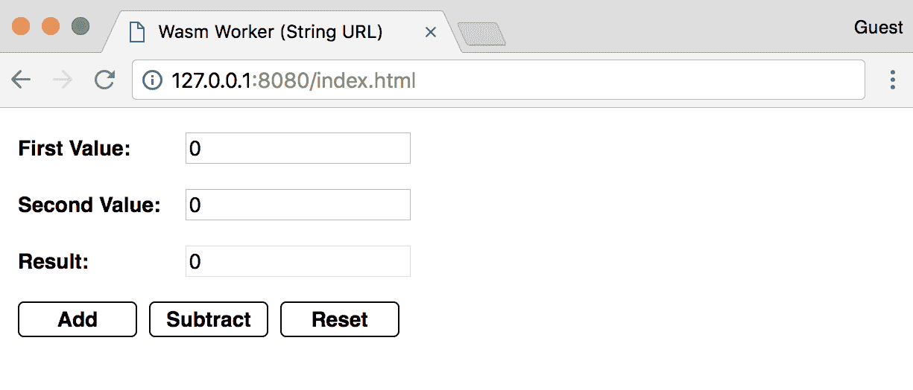
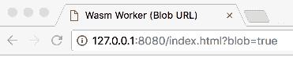
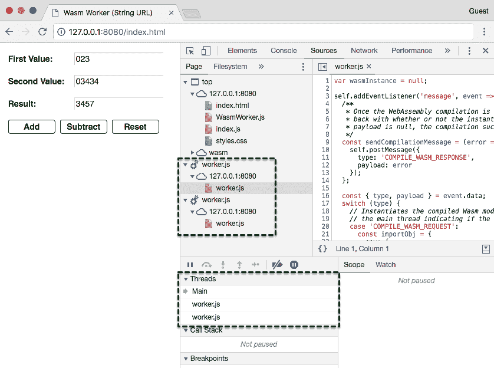
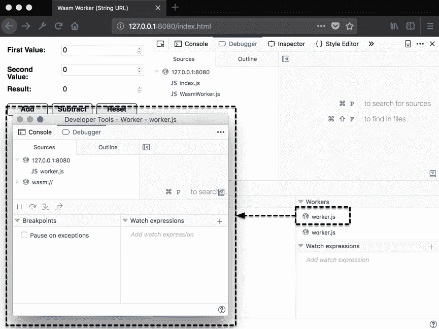

# 第十章：高级工具和即将推出的功能

WebAssembly 的生态系统不断增长和发展。开发人员已经看到了 WebAssembly 的潜力。他们构建工具来改善开发体验或从他们选择的语言输出 Wasm 模块（尽管有一些限制）。

在本章中，我们将评估使 WebAssembly 运行的基础技术。我们还将审查您可以在浏览器中使用的工具，并介绍一种利用 Web Workers 的高级用例。最后，我们将快速审查即将推出的功能和 WebAssembly 路线图上的提案。

本章的目标是理解以下内容：

+   WABT 和 Binaryen 如何适应构建过程以及它们可以用于什么

+   如何使用 LLVM 编译 WebAssembly 模块（而不是 Emscripten）

+   WasmFiddle 等在线工具和其他有用的在线工具

+   如何利用 Web Workers 并行运行 WebAssembly

+   未来将集成到 WebAssembly 中的功能（提议和进行中）

# WABT 和 Binaryen

WABT 和 Binaryen 允许开发人员使用源文件并开发 WebAssembly 工具。如果您有兴趣以更低的级别使用 WebAssembly，这些工具提供了实现这一目标的手段。在本节中，我们将更详细地评估这些工具，并审查每个工具的目的和功能。

# WABT-WebAssembly 二进制工具包

WABT 的重点是对 WebAssembly 二进制（.wasm）文件和文本（.wat）文件进行操作，以及在这两种格式之间进行转换。WABT 提供了将 Wat 转换为 Wasm（wat2wasm）和反之（wasm2wat）的工具，以及将 Wasm 文件转换为 C 源文件和头文件（wasm2c）的工具。您可以在 WABT GitHub 存储库的 README 文件中查看所有工具的完整列表[`github.com/WebAssembly/wabt`](https://github.com/WebAssembly/wabt)。

WABT 的一个示例用例是我们在第三章中安装的*VS Code WebAssembly Toolkit*扩展，*设置开发环境*。该扩展依赖于 WABT 来查看与.wasm 文件相关联的文本格式。存储库提供了 wat2wasm 和 wasm2wat 演示的链接，您可以使用这些演示来测试 Wat 程序的有效性或使用 JavaScript 与编译后的二进制文件进行交互。以下屏幕截图包含 wat2wasm 演示中的 Wat 和 JavaScript 实例化代码：



wat2wasm 的 Wat 和 JavaScript 加载代码的“simple”示例

在 JS 面板的第 3 行中，您可能已经注意到`wasmInstance.exports`中的`addTwo()`函数没有前缀`_`。Emscripten 在编译过程中会自动添加`_`。您可以通过将.wasm 文件转换为.wat 文件，更新函数名称，然后使用 WABT 将其转换回.wasm 文件来省略`_`，尽管这不太实用。WABT 简化了将文本格式转换为二进制格式和反之的过程。如果您想构建 WebAssembly 的编译工具，您将使用 Binaryen，我们将在下一节中介绍。

# Binaryen

Binaryen 的 GitHub 页面[`github.com/WebAssembly/binaryen`](https://github.com/WebAssembly/binaryen)将 Binaryen 描述为用 C++编写的 WebAssembly 编译器和工具链基础库。它旨在使编译到 WebAssembly 变得简单、快速和有效。它通过提供简单的 C API、内部 IR 和优化器来实现这些目标。与 WABT 一样，Binaryen 提供了一套广泛的工具，用于开发 WebAssembly 工具。以下列表描述了 Binaryen 提供的一部分工具：

+   **wasm-shell**：能够加载和解释 WebAssembly

+   **asm2wasm**：将 asm.js 代码编译为 Wasm 模块

+   **wasm2js**：将 Wasm 模块编译为 JavaScript

+   **wasm-merge**：将多个 Wasm 文件合并为一个

+   **wasm.js**：包括 Binaryen 解释器、asm2wasm、Wat 解析器和其他 Binaryen 工具的 JavaScript 库

+   **binaryen.js**：提供 Binaryen 工具链的 JavaScript 接口的 JavaScript 库

wasm.js 和 binaryen.js 工具对于对构建 WebAssembly 工具感兴趣的 JavaScript 开发人员特别有吸引力。`binaryen.js`库可作为`npm`包使用（[`www.npmjs.com/package/binaryen`](https://www.npmjs.com/package/binaryen)）。

`binaryen.js`的一个很好的示例是 AssemblyScript（[`github.com/AssemblyScript/assemblyscript`](https://github.com/AssemblyScript/assemblyscript)）。AssemblyScript 是 TypeScript 的严格类型子集，可生成 WebAssembly 模块。该库附带了一个 CLI，可以快速搭建新项目并管理构建步骤。在*使用 LLVM 编译*部分，我们将介绍如何使用 LLVM 编译 Wasm 模块。

# 使用 LLVM 编译

在第一章中，我们讨论了 Emscripten 的 EMSDK 和 LLVM 之间的关系。Emscripten 使用 LLVM 和 Clang 将 C/C++编译为 LLVM 位码。Emscripten 编译器（`emcc`）将该位码编译为 asm.js，然后传递给 Binaryen 生成 Wasm 文件。如果您有兴趣使用 LLVM，可以在不安装 EMSDK 的情况下将 C/C++编译为 Wasm。在本节中，我们将回顾使用 LLVM 启用 Wasm 编译的过程。在将一些示例 C++代码编译为 Wasm 文件后，我们将在浏览器中尝试它。

# 安装过程

如果要使用 LLVM 编译 WebAssembly 模块，需要安装和配置多个工具。使这些工具正确配合工作可能是一个费时费力的过程。幸运的是，有人经历了这个麻烦，使这个过程变得简单得多。Daniel Wirtz 创建了一个名为`webassembly`的`npm`包（[`www.npmjs.com/package/webassembly`](https://www.npmjs.com/package/webassembly)），可以执行以下操作（带有相应的 CLI 命令）：

+   将 C/C++代码编译为 WebAssembly 模块（`wa compile`）

+   将多个 WebAssembly 模块链接到一个模块（`wa link`）

+   将 WebAssembly 模块反汇编为文本格式（`wa disassemble`）

+   将 WebAssembly 文本格式组装为模块（`wa assemble`）

该库在后台使用 Binaryen、Clang、LLVM 和其他 LLVM 工具。我们将全局安装此包，以确保我们可以访问`wa`命令。要安装，请打开终端实例并运行以下命令：

```cpp
npm install -g webassembly
```

安装所需的依赖可能需要几分钟。完成后，运行以下命令验证安装：

```cpp
wa
```

您应该在终端中看到以下内容：



wa 命令的输出

您应该准备好开始编译 Wasm 模块了。让我们继续进行示例代码。

# 示例代码

为了测试编译器，我们将使用第五章中*无需胶水代码与 JavaScript 交互*部分的`without-glue.c`文件的稍作修改的版本。此部分的代码位于`learn-webassembly`存储库的`/chapter-10-advanced-tools/compile-with-llvm`目录中。按照以下说明创建编译器测试所需的文件。让我们从 C++文件开始。

# C++文件

在您的`/book-examples`目录中创建一个名为`/compile-with-llvm`的新目录。在`/compile-with-llvm`目录中创建一个名为`main.cpp`的新文件，并填充以下内容：

```cpp
#include <stdbool.h>

#define BOUNDS 255
#define RECT_SIDE 50
#define BOUNCE_POINT (BOUNDS - RECT_SIDE)

bool isRunning = true;

typedef struct Rect {
  int x;
  int y;
  char direction;
} Rect;

struct Rect rect;

void updateRectLocation() {
    if (rect.x == BOUNCE_POINT) rect.direction = 'L';
    if (rect.x == 0) rect.direction = 'R';
    int incrementer = 1;
    if (rect.direction == 'L') incrementer = -1;
    rect.x = rect.x + incrementer;
    rect.y = rect.y + incrementer;
}

extern "C" {
extern int jsClearRect();
extern int jsFillRect(int x, int y, int width, int height);

__attribute__((visibility("default")))
void moveRect() {
    jsClearRect();
    updateRectLocation();
    jsFillRect(rect.x, rect.y, RECT_SIDE, RECT_SIDE);
}

__attribute__((visibility("default")))
bool getIsRunning() {
    return isRunning;
}

__attribute__((visibility("default")))
void setIsRunning(bool newIsRunning) {
    isRunning = newIsRunning;
}

__attribute__((visibility("default")))
void init() {
    rect.x = 0;
    rect.y = 0;
    rect.direction = 'R';
    setIsRunning(true);
}
}
```

该文件中的代码与第五章中的`without-glue.c`的内容几乎相同，*创建和加载 WebAssembly 模块*。文件中的注释已被删除，并且导入/导出的函数被包装在`extern "C"`块中。`__attribute__((visibility("default")))`行是宏语句（类似于`EMSCRIPTEN_KEEPALIVE`），它们确保在死代码消除步骤期间不会从编译输出中删除这些函数。与之前的示例一样，我们将通过 HTML 文件与编译后的 Wasm 模块进行交互。让我们接下来创建这个文件。

# HTML 文件

在`/compile-with-llvm`目录中创建一个名为`index.html`的文件，并填充以下内容：

```cpp
<!doctype html>
<html lang="en-us">
<head>
  <title>LLVM Test</title>
</head>
<body>
  <h1>LLVM Test</h1>
  <canvas id="myCanvas" width="255" height="255"></canvas>
  <div style="margin-top: 16px;">
    <button id="actionButton" style="width: 100px; height: 24px;">
      Pause
    </button>
  </div>
  <script type="application/javascript">
    const canvas = document.querySelector('#myCanvas');
    const ctx = canvas.getContext('2d');

    const importObj = {
      env: {
        memoryBase: 0,
        tableBase: 0,
        memory: new WebAssembly.Memory({ initial: 256 }),
        table: new WebAssembly.Table({ initial: 8, element: 'anyfunc' }),
        abort: console.log,
        jsFillRect: function(x, y, w, h) {
          ctx.fillStyle = '#0000ff';
          ctx.fillRect(x, y, w, h);
        },
        jsClearRect: function() {
          ctx.fillStyle = '#ff0000';
          ctx.fillRect(0, 0, 255, 255);
        }
      }
    };

    WebAssembly.instantiateStreaming(fetch('main.wasm'), importObj)
      .then(({ instance }) => {
        const m = instance.exports;
        m.init();

        const loopRectMotion = () => {
          setTimeout(() => {
            m.moveRect();
            if (m.getIsRunning()) loopRectMotion();
          }, 20)
        };

    document.querySelector('#actionButton')
      .addEventListener('click', event => {
        const newIsRunning = !m.getIsRunning();
        m.setIsRunning(newIsRunning);
        event.target.innerHTML = newIsRunning ? 'Pause' : 'Start';
        if (newIsRunning) loopRectMotion();
      });

      loopRectMotion();
    });
  </script>
</body>
</html>
```

该文件的内容与第五章中的`without-glue.html`文件非常相似，*创建和加载 WebAssembly 模块*。我们不再使用`/common/load-wasm.js`文件中的`loadWasm()`函数，而是使用`WebAssembly.instantiateStreaming()`函数。这使我们可以省略一个额外的`<script>`元素，并直接从`/compile-with-llvm`目录中提供文件。

在传递给`importObj`的`jsFillRect`和`jsClearRect`函数中省略了`_`。我们也可以在`instance.exports`对象中省略这些函数的`_`。LLVM 不会在模块中传入或传出的数据/函数前缀中使用`_`。在下一节中，我们将编译`main.cpp`并在浏览器中与生成的 Wasm 文件交互。

# 编译和运行示例

我们使用了`webassembly npm`包，并带有`-g`标志，因此终端中应该可以使用`wa`命令。在`/compile-with-llvm`目录中打开一个终端实例，并运行以下命令：

```cpp
wa compile main.cpp -o main.wasm
```

您应该会在 VS Code 的文件资源管理器中的`compile-with-llvm`文件夹中看到一个名为`main.wasm`的文件。为了确保 Wasm 模块编译正确，运行以下命令：

```cpp
serve -l 8080
```

如果您在浏览器中导航到`http://127.0.0.1:8080/index.html`，您应该会看到以下内容：



在浏览器中运行的 LLVM 编译模块

# 在线工具

本地编译 WebAssembly 模块的安装和配置过程，诚然有点繁琐。幸运的是，有几种在线工具可供您在浏览器中开发和交互使用 WebAssembly。在本节中，我们将回顾这些工具，并讨论它们各自提供的功能。

# WasmFiddle

在第二章的*用 WasmFiddle 连接各部分*部分中，*WebAssembly 的要素* *- Wat，Wasm 和 JavaScript API*，我们使用 WasmFiddle 将一个简单的 C 函数编译为 Wasm，并使用 JavaScript 进行交互。WasmFiddle 提供了 C/C++编辑器，JavaScript 编辑器，Wat/x86 查看器和 JavaScript 输出面板。如果需要，还可以与`<canvas>`进行交互。WasmFiddle 使用 LLVM 生成 Wasm 模块，这就是为什么导入和导出不会以`_`为前缀。您可以在[`wasdk.github.io/WasmFiddle`](https://wasdk.github.io/WasmFiddle)上使用 WasmFiddle。

# WebAssembly Explorer

WebAssembly Explorer 位于[`mbebenita.github.io/WasmExplorer`](https://mbebenita.github.io/WasmExplorer)，提供了与 WasmFiddle 类似的功能。它允许您将 C 或 C++编译为 Wasm 模块，并查看相应的 Wat。但是，WebAssembly Explorer 提供了 WasmFiddle 中没有的额外功能。例如，您可以将 C 或 C++编译为 Wasm，并查看相应的 Firefox x86 和 LLVM x86 代码。您可以从代码示例列表中进行选择，并指定优化级别（`emcc`中的`-O`标志）。它还提供了一个按钮，允许您将代码导入到 WasmFiddle 中：



WebAssembly Explorer 的屏幕截图

# WebAssembly Studio

位于[`webassembly.studio`](https://webassembly.studio)的 WebAssembly Studio 是一个功能丰富的编辑器和开发环境。您可以创建 C、Rust 和 AssemblyScript 项目。它提供了在浏览器中构建和运行代码的能力，并与 GitHub 很好地集成。WebAssembly Studio 使您能够构建 Web 应用程序，而无需在本地安装和配置所需的 WebAssembly 工具：



WebAssembly Studio 的屏幕截图

在下一节中，我们将演示如何使用 Web Workers 为您的 WebAssembly 应用程序添加并行性。

# 使用 Web Workers 实现并行 Wasm

构建执行大量计算或其他资源密集型工作的复杂应用程序的过程可以从使用**线程**中受益。线程允许您通过将功能分配给独立运行的任务来并行执行操作。在撰写本文时，WebAssembly 中的线程支持处于*功能提案*阶段。在此阶段，规范尚未编写，功能尚未实现。幸运的是，JavaScript 提供了 Web Workers 形式的线程功能。在本节中，我们将演示如何使用 JavaScript 的 Web Workers API 与单独的线程中的 Wasm 模块进行交互。

# Web Workers 和 WebAssembly

Web Workers 允许您在浏览器中利用线程，可以通过将一些逻辑从主（UI）线程中卸载来提高应用程序的性能。工作线程还能够使用`XMLHttpRequest`执行 I/O 操作。工作线程通过将消息发布到事件处理程序与主线程通信。

Web Workers 允许我们将 Wasm 模块加载到单独的线程中，并执行不会影响 UI 性能的操作。Web Workers 确实有一些限制。它们无法直接操作 DOM 或访问`window`对象上的某些方法和属性。线程之间传递的消息必须是序列化对象，这意味着你不能传递函数。现在你知道了 worker 是什么，让我们讨论如何创建一个。

# 创建一个工作线程

在创建工作线程之前，您需要一个包含在工作线程中运行的代码的 JavaScript 文件。您可以在[`github.com/mdn/simple-web-worker/blob/gh-pages/worker.js`](https://github.com/mdn/simple-web-worker/blob/gh-pages/worker.js)上看到一个简单的工作定义文件的示例。该文件应包含一个`message`事件侦听器，当从其他线程接收到消息时执行操作并做出相应响应。

创建了该文件后，您就可以使用它来创建一个工作线程。通过将 URL 参数传递给`Worker()`构造函数来创建工作线程。URL 可以是表示包含工作定义代码的文件名称的字符串，也可以使用`Blob`构造。如果您从服务器获取工作定义代码，则`Blob`技术可能很有用。示例应用程序演示了如何同时使用这两种方法。让我们继续介绍如何将 WebAssembly 与 Web Workers 集成的过程。

# WebAssembly 工作流程

为了在单独的线程中利用 Wasm 模块，必须在主线程中编译 Wasm 文件，并在 Web Worker 中实例化。让我们更详细地审查这个过程：

1.  使用`Worker()`构造函数创建了一个新的 Web Worker（我们将其称为`wasmWorker`）。

1.  发出 fetch 调用以检索`.wasm`文件，并在响应上调用`arrayBuffer()`函数。

1.  `arrayBuffer()`函数的解析值传递给`WebAssembly.compile()`函数。

1.  `WebAssembly.compile()`函数解析为`WebAssembly.Module`实例，并使用`postMessage()`函数将其包含在发送到`wasmWorker`的消息体中。

1.  在`wasmWorker`中，从消息体中传递给`WebAssembly.instantiate()`函数的`WebAssembly.Module`实例，将解析为一个`WebAssembly.Instance`。

1.  `WebAssembly.Instance`导出对象被分配给`wasmWorker`中的一个本地变量，并用于调用 Wasm 函数。

要从`wasmWorker`的 Wasm 实例中调用函数，你需要向工作线程发送一个消息，其中包含要传递给 Wasm 函数的任何参数。然后，`wasmWorker`执行该函数，并将结果传递回主线程。这就是在 Web Workers 的上下文中如何利用线程的关键。在我们继续进行示例应用程序之前，你可能需要解决谷歌 Chrome 施加的一个限制。请按照“谷歌 Chrome 中的限制”部分中的说明，确保示例应用程序能够成功运行。

# 谷歌 Chrome 中的限制

谷歌 Chrome 对 Web Worker 的`postMessage()`函数的主体中可以包含什么施加了限制。如果你尝试将编译后的`WebAssembly.Module`发送到工作线程，你将收到错误消息，并且操作将不成功。你可以通过设置一个标志来覆盖这一限制。要启用此功能，请打开谷歌 Chrome，并在地址栏中输入`chrome://flags`。在页面顶部的搜索框中输入`cloning`。你应该看到一个名为 WebAssembly structured cloning support 的列表项。从下拉菜单中选择 Enabled 选项，并在提示时点击 RELAUNCH NOW 按钮：



在谷歌 Chrome 中更新 WebAssembly 标志

Chrome 重新启动后，你可以无问题地运行示例应用程序。如果你使用 Mozilla Firefox，则无需任何操作。它默认支持此功能。让我们继续进行示例应用程序，演示在线程中使用 WebAssembly 的用法。

# 代码概述

示例应用程序并不是一个真正的应用程序。它是一个简单的表单，接受两个输入值，并返回这两个值的和或差。加法和减法操作分别从它们自己的 Wasm 模块中导出，并在工作线程中实例化。这个示例可能是刻意构造的，但它有效地演示了如何将 WebAssembly 集成到 Web Workers 中。

这一部分的代码位于`learn-webassembly`存储库的`/chapter-10-advanced-tools/parallel-wasm`目录中。接下来的部分将逐步介绍代码库的每个部分，并描述如何从头开始构建应用程序。如果你想跟着做，可以在你的`/book-examples`目录中创建一个名为`/parallel-wasm`的文件夹。

# C 代码

该示例使用了两个工作线程：一个用于加法，另一个用于减法。因此，我们需要两个单独的 Wasm 模块。在你的`/parallel-wasm`目录中创建一个名为`/lib`的文件夹。在`/lib`目录中，创建一个名为`add.c`的文件，并填充以下内容：

```cpp
int calculate(int firstVal, int secondVal) {
    return firstVal + secondVal;
}
```

在`/lib`中创建另一个名为`subtract.c`的文件，并填充以下内容：

```cpp
int calculate(int firstVal, int secondVal) {
    return firstVal - secondVal;
}
```

请注意，两个文件中的函数名都是`calculate`。这样做是为了避免在工作代码中编写任何条件逻辑来确定要调用的 Wasm 函数。代数运算与工作线程相关联，因此当我们需要加两个数字时，将在`addWorker`中调用`_calculate()`函数。当我们查看代码的 JavaScript 部分时，这将变得更清晰。

# JavaScript 代码

在我们深入研究 JavaScript 代码之前，在你的`/parallel-wasm`目录中创建一个名为`/src`的文件夹。让我们从包含在工作线程中运行的代码的文件开始。

# 在 worker.js 中定义线程执行

在`/src`目录中创建一个名为`worker.js`的新文件，并填充以下内容：

```cpp
var wasmInstance = null;

self.addEventListener('message', event => {
  /**
   * Once the WebAssembly compilation is complete, this posts a message
   * back with whether or not the instantiation was successful. If the
   * payload is null, the compilation succeeded.
   */
  const sendCompilationMessage = (error = null) => {
    self.postMessage({
      type: 'COMPILE_WASM_RESPONSE',
      payload: error
    });
  };

  const { type, payload } = event.data;
  switch (type) {
    // Instantiates the compiled Wasm module and posts a message back to
    // the main thread indicating if the instantiation was successful:
    case 'COMPILE_WASM_REQUEST':
      const importObj = {
        env: {
          memoryBase: 0,
          tableBase: 0,
          memory: new WebAssembly.Memory({ initial: 256 }),
          table: new WebAssembly.Table({ initial: 2, element: 'anyfunc' }),
          abort: console.log
        }
      };

      WebAssembly.instantiate(payload, importObj)
        .then(instance => {
          wasmInstance = instance.exports;
          sendCompilationMessage();
        })
        .catch(error => {
          sendCompilationMessage(error);
        });
      break;

    // Calls the `calculate` method associated with the instance (add or
    // subtract, and posts the result back to the main thread:
    case 'CALC_REQUEST':
      const { firstVal, secondVal } = payload;
      const result = wasmInstance._calculate(firstVal, secondVal);

      self.postMessage({
        type: 'CALC_RESPONSE',
        payload: result
      });
      break;

    default:
      break;
  }
}, false);
```

代码封装在`message`事件的事件监听器中（`self.addEventListener(...)`），当对应的 worker 上调用`postMessage()`函数时会触发该事件。事件监听器的回调函数中的`event`参数包含一个`data`属性，其中包含消息的内容。应用程序中线程之间传递的所有消息都遵循**Flux Standard Action**（**FSA**）约定。遵循此约定的对象具有`type`和`payload`属性，其中`type`是一个字符串，`payload`可以是任何类型。您可以在[`github.com/redux-utilities/flux-standard-action`](https://github.com/redux-utilities/flux-standard-action)上了解更多关于 FSA 的信息。

您可以使用`postMessage()`函数传递的数据的任何格式或结构，只要数据是可序列化的。

`switch`语句根据消息的`type`值执行操作，该值是一个字符串。如果`type`是`'COMPILE_WASM_REQUEST'`，则调用`WebAssembly.instantiate()`函数，传入消息的`payload`和`importObj`。结果的`exports`对象分配给本地的`wasmInstance`变量以供以后使用。如果`type`是`'CALC_REQUEST'`，则使用`payload`对象中的`firstVal`和`secondVal`值调用`wasmInstance._calculate()`函数。计算代码应该解释为什么函数被命名为`_calculate()`而不是`_add()`或`_subtract()`。通过使用一个通用名称，工作线程不关心它执行的是什么操作，它只是调用函数以获得结果。

在这两种情况下，工作线程都使用`postMessage()`函数向主线程发送消息。我使用了`REQUEST`/`RESPONSE`约定来表示`type`属性的值。这使您可以快速识别消息的来源线程。从主线程发送的消息以`_REQUEST`结尾，而来自工作线程的响应以`_RESPONSE`结尾。让我们继续进行 WebAssembly 交互代码。

# 在 WasmWorker.js 中与 Wasm 交互

在`/src`目录中创建一个名为`WasmWorker.js`的新文件，并填充以下内容：

```cpp
/**
 * Web Worker associated with an instantiated Wasm module.
 * @class
 */
export default class WasmWorker {
  constructor(workerUrl) {
    this.worker = new Worker(workerUrl);
    this.listenersByType = {};
    this.addListeners();
  }

  // Add a listener associated with the `type` value from the
  // Worker message:
  addListenerForType(type, listener) {
    this.listenersByType[type] = listener;
  }

  // Add event listeners for error and message handling.
  addListeners() {
    this.worker.addEventListener('error', event => {
      console.error(`%cError: ${event.message}`, 'color: red;');
    }, false);

    // If a handler was specified using the `addListener` method,
    // fire that method if the `type` matches:
    this.worker.addEventListener('message', event => {
      if (
        event.data instanceof Object &&
        event.data.hasOwnProperty('type') &&
        event.data.hasOwnProperty('payload')
      ) {
        const { type, payload } = event.data;
        if (this.listenersByType[type]) {
          this.listenersByTypetype;
        }
      } else {
        console.log(event.data);
      }
    }, false);
  }

  // Fetches the Wasm file, compiles it, and passes the compiled result
  // to the corresponding worker. The compiled module is instantiated
  // in the worker.
  initialize(name) {
    return fetch(`calc-${name}.wasm`)
      .then(response => response.arrayBuffer())
      .then(bytes => WebAssembly.compile(bytes))
      .then(wasmModule => {
        this.worker.postMessage({
          type: 'COMPILE_WASM_REQUEST',
          payload: wasmModule
      });
      return Promise.resolve();
    });
  }

  // Posts a message to the worker thread to call the `calculate`
  // method from the Wasm instance:
  calculate(firstVal, secondVal) {
    this.worker.postMessage({
      type: 'CALC_REQUEST',
        payload: {
        firstVal,
        secondVal
      }
    });
  }
}
```

`WasmWorker`类管理与 Wasm 文件关联的工作线程。在`WasmWorker`构造函数中，创建一个新的`Worker`，并为`error`和`message`事件添加了默认的事件监听器。`initialize()`函数获取与`name`参数关联的`.wasm`文件，编译它，并将结果的`WebAssembly.Module`实例发送到工作线程以进行实例化。

`addListenerForType()`函数用于指定一个`callback`函数（`listener`），当消息响应中的`type`字段与传递给函数的`type`参数匹配时执行。这是为了捕获来自工作线程的`_calculate()`函数的结果。

最后，在`WasmWorker`中的`calculate()`函数向工作线程发送一条消息，消息中包括从`<form>`中的`<input>`元素传入的`firstVal`和`secondVal`参数。让我们继续看应用加载代码，以了解`WasmWorker`如何与 UI 交互。

# 在 index.js 中加载应用程序

在`/src`目录中创建一个名为`index.js`的新文件，并填充以下内容：

```cpp
import WasmWorker from './WasmWorker.js';

/**
 * If you add ?blob=true to the end of the URL (e.g.
 * http://localhost:8080/index.html?blob=true), the worker will be
 * created from a Blob rather than a URL. This returns the
 * URL to use for the Worker either as a string or created from a Blob.
 */
const getWorkerUrl = async () => {
  const url = new URL(window.location);
  const isBlob = url.searchParams.get('blob');
  var workerUrl = 'worker.js';
  document.title = 'Wasm Worker (String URL)';

  // Create a Blob instance from the text contents of `worker.js`:
  if (isBlob === 'true') {
    const response = await fetch('worker.js');
    const results = await response.text();
    const workerBlob = new Blob([results]);
    workerUrl = window.URL.createObjectURL(workerBlob);
    document.title = 'Wasm Worker (Blob URL)';
  }

  return Promise.resolve(workerUrl);
};

/**
 * Instantiates the Wasm module associated with the specified worker
 * and adds event listeners to the "Add" and "Subtract" buttons.
 */
const initializeWorker = async (wasmWorker, name) => {
  await wasmWorker.initialize(name);
  wasmWorker.addListenerForType('CALC_RESPONSE', payload => {
    document.querySelector('#result').value = payload;
  });

  document.querySelector(`#${name}`).addEventListener('click', () => {
    const inputs = document.querySelectorAll('input');
    var [firstInput, secondInput] = inputs.values();
    wasmWorker.calculate(+firstInput.value, +secondInput.value);
  });
};

/**
 * Spawns (2) workers: one associated with calc-add.wasm and another
 * with calc-subtract.wasm. Adds an event listener to the "Reset"
 * button to clear all the input values.
 */
const loadPage = async () => {
  document.querySelector('#reset').addEventListener('click', () => {
    const inputs = document.querySelectorAll('input');
    inputs.forEach(input => (input.value = 0));
  });

  const workerUrl = await getWorkerUrl();
  const addWorker = new WasmWorker(workerUrl);
  await initializeWorker(addWorker, 'add');

  const subtractWorker = new WasmWorker(workerUrl);
  await initializeWorker(subtractWorker, 'subtract');
};

loadPage()
  .then(() => console.log('%cPage loaded!', 'color: green;'))
  .catch(error => console.error(error));
```

应用程序的入口点是`loadPage()`函数。在我们深入讨论工作线程初始化代码之前，让我们讨论一下`getWorkerUrl()`函数。在本节的前面，我们了解到可以将表示文件名的字符串或从`Blob`创建的 URL 传递给`Worker()`构造函数。以下示例代码演示了第一种技术：

```cpp
var worker = new Worker('worker.js');
```

第二种技术在`getWorkerUrl()`函数的`if (isBlob === 'true')`块中进行演示。如果当前的`window.location`值以`?blob=true`结尾，那么传递给`Worker()`构造函数的 URL 将从`Blob`创建。唯一显着的区别是`document.title`的值，它会更新以反映 URL 类型。让我们回到`loadPage()`函数，讨论初始化代码。

在`loadPage()`函数中为重置按钮添加事件侦听器后，创建了两个`WasmWorker`实例：`addWorker`和`subtractWorker`。每个 worker 都作为`wasmWorker`参数传递给`initializeWorker()`函数。在`initializeWorker()`中，调用`wasmWorker.initialize()`函数来实例化 Wasm 模块。调用`wasmWorker.addListenerForType()`函数来将 Result `<input>`的值设置为对应 worker 中`_calculate()`函数返回的值。最后，为`<button>`的`click`事件添加了一个事件侦听器，该事件要么将`firstVal`和`secondVal` `<input>`值相加，要么相减（基于`name`参数）。这就是 JavaScript 代码的全部内容。让我们创建一个 HTML 和 CSS 文件，然后继续进行构建步骤。

# Web 资产

我们需要一个 HTML 文件作为应用程序的入口点。在`/src`目录中创建一个名为`index.html`的文件，并填充以下内容：

```cpp
<!DOCTYPE html>
<html>
<head>
  <meta charset="utf-8">
  <title>Wasm Workers</title>
  <link rel="stylesheet" type="text/css" href="styles.css" />
</head>
<body>
  <form class="valueForm">
    <div class="valueForm">
      <label for="firstVal">First Value:</label>
      <input id="firstVal" type="number" value="0" />
    </div>
    <div class="valueForm">
      <label for="secondVal">Second Value:</label>
      <input id="secondVal" type="number" value="0" />
    </div>
    <div class="valueForm">
      <label for="result">Result:</label>
      <input id="result" type="number" value="0" readonly />
    </div>
  </form>
  <div>
    <button id="add">Add</button>
    <button id="subtract">Subtract</button>
    <button id="reset">Reset</button>
  </div>
  <script type="module" src="img/index.js"></script>
</body>
</html>
```

该应用程序由一个带有三个`<input>`元素和一个包含三个`<button>`元素的块组成。前两个`<input>`元素对应于`payload`中包含的`firstVal`和`secondVal`属性，这些属性发送到任一工作线程。最后一个`<input>`是只读的，并显示任一操作的结果。

在`<form>`下面的一组`<button>`元素对`<input>`值执行操作。前两个`<button>`元素将`<input>`值发送到`addWorker`或`subtractWorker`线程（取决于按下哪个按钮）。最后一个`<button>`将所有`<input>`值设置为`0`。

应用程序在`</body>`结束标记之前的最后一行的`<script>`标记中初始化。与 Cook the Books 一样，`type="module"`属性允许我们在较新的浏览器中使用`import`/`export`语法。最后，我们需要为应用程序添加一些样式。在`/src`目录中创建一个名为`styles.css`的文件，并填充以下内容：

```cpp
* {
  font-family: sans-serif;
  font-size: 14px;
}

body {
  margin: 16px;
}

form.valueForm {
  display: table;
}

div.valueForm {
  display: table-row;
}

label, input {
  display: table-cell;
  margin-bottom: 16px;
}

label {
  font-weight: bold;
  padding-right: 16px;
}

button {
  border: 1px solid black;
  border-radius: 4px;
  cursor: pointer;
  font-weight: bold;
  height: 24px;
  margin-right: 4px;
  width: 80px;
}

button:hover {
  background: lightgray;
}
```

这是我们需要创建的最后一个文件，但不是运行应用程序所需的最后一个文件。我们仍然需要从`/lib`目录中的 C 文件生成 Wasm 文件。让我们继续进行构建步骤。

# 构建和运行应用程序

代码编写完成后，现在是时候构建和测试应用程序了。完成构建步骤后，我们将与正在运行的应用程序进行交互，并回顾如何使用浏览器的开发工具来排除 Web Workers 的故障。

# 编译 C 文件

我们需要将每个 C 文件编译为单独的`.wasm`文件，这意味着执行编译步骤所需的命令是冗长的。要执行构建，请在`/parallel-wasm`目录中打开一个终端实例，并运行以下命令：

```cpp
# First, compile the add.c file: emcc -Os -s WASM=1 -s SIDE_MODULE=1 -s BINARYEN_ASYNC_COMPILATION=0 lib/add.c -o src/calc-add.wasm # Next, compile the subtract.c fileemcc -Os -s WASM=1 -s SIDE_MODULE=1 -s BINARYEN_ASYNC_COMPILATION=0 lib/subtract.c -o src/calc-subtract.wasm
```

您应该在`/src`目录中看到两个新文件：`calc-add.wasm`和`calc-subtract.wasm`。有了所需的文件，现在是时候测试应用程序了。

# 与应用程序交互

在`/parallel-wasm`目录中打开一个终端实例，并运行以下命令：

```cpp
serve -l 8080 src
```

如果在浏览器中导航到`http://127.0.0.1:8080/index.html`，您应该会看到这个：



在浏览器中运行的 Wasm Workers 应用程序

尝试更改第一个值和第二个值输入中的值，然后按“添加”和“减去”按钮。结果输入应该更新为计算结果。如果您导航到`http://127.0.0.1:8080/index.html?blob=true`，传递给`Worker()`构造函数的 URL 参数将使用`Blob`而不是文件名。选项卡应更改以反映使用`Blob`技术来构造 URL：



选项卡标题已更新以反映 Blob URL 技术

# 调试 Web Workers

您可以使用浏览器的开发工具设置断点并与工作线程进行交互。在 Google Chrome 中，打开开发者工具并选择“源”选项卡。文件列表面板应包含两个`worker.js`实例。调试器面板包含一个“线程”部分，其中包含“主”线程和两个`worker.js`线程。以下屏幕截图显示了 Chrome 开发者工具面板中用于运行应用程序的线程调试元素：



Chrome 开发者工具面板中的线程调试工具

在 Firefox 中，worker 调试是在单独的开发者工具窗口中完成的。要查看此操作，请在 Firefox 中打开开发者工具，并选择调试器面板。单击 Workers 面板中的`worker.js`列表项之一。应该会出现一个新的开发者工具窗口，对应于所选的 worker。以下屏幕截图显示了从 Workers 面板中选择的`worker.js`实例的单独开发者工具窗口：



Firefox 开发者工具面板中的线程调试工具

在下一节中，我们将讨论一些即将推出的 WebAssembly 功能。

# 即将推出的功能

有几个即将推出的 WebAssembly 功能处于标准化过程的各个阶段。其中一些比其他功能更具影响力，但它们都是有价值的改进。在本节中，我们将描述标准化过程，并审查代表 WebAssembly 能力显著转变的一些功能的子集。本节大部分内容引用自 Colin Eberhardt 的博客文章，标题为*WebAssembly 的未来-即将推出的功能和提案*。该文章可以在[`blog.scottlogic.com/2018/07/20/wasm-future.html`](https://blog.scottlogic.com/2018/07/20/wasm-future.html)找到。

# 标准化过程

WebAssembly W3C 流程文档位于[`github.com/WebAssembly/meetings/blob/master/process/phases.md`](https://github.com/WebAssembly/meetings/blob/master/process/phases.md)，描述了标准化过程的六个阶段（从 0 到 5）。以下列表提供了对每个阶段的简要描述：

+   **第 0 阶段。预提案**：WebAssembly**社区组**（**CG**）成员有一个想法，并且 CG 投票决定是否将其移至第 1 阶段。

+   **第 1 阶段。功能提案**：预提案过程已成功，并在 GitHub 的 WebAssembly 组织中创建了一个存储库以记录该功能。

+   **第 2 阶段。提议的规范文本可用**：完整的提议规范文本可用，可能的实现已经原型化，并添加了测试套件。

+   **第 3 阶段。实施阶段**：嵌入器实施该功能，存储库已更新以包括对规范的修订，并且规范已更新以包括对参考解释器中功能的实施。

+   **第 4 阶段。标准化功能**：如果两个或两个以上的 Web VM 和至少一个工具链实现了该功能，则该功能将完全移交给 WebAssembly**工作组**（**WG**）。

+   **第 5 阶段。功能已标准化**：WG 成员已达成共识，该功能已完成。

现在您已经熟悉了与标准化过程相关的阶段，让我们继续讨论线程提案。

# 线程

在前一节中，我们使用 Web Workers 将 Wasm 模块移动到工作线程中，这样我们就可以调用 Wasm 函数而不会阻塞主线程。然而，在工作线程之间传递消息存在性能限制。为了解决这个问题，提出了一个 WebAssembly 的线程功能。

该提案目前处于第一阶段，详细描述在[`github.com/WebAssembly/threads/blob/master/proposals/threads/Overview.md`](https://github.com/WebAssembly/threads/blob/master/proposals/threads/Overview.md)。根据提案文件，线程功能添加了一个新的共享线性内存类型和一些新的原子内存访问操作。这个提案在范围上相对有限。Eberhardt 在他的博客文章中提供了以下阐述：

“值得注意的是，这个提案并没有引入创建线程的机制（这引起了很多争论），而是由主机提供这个功能。在浏览器中执行的 wasm 的上下文中，这将是熟悉的 WebWorkers。”

虽然这个功能不允许创建线程，但它提供了一种更简单的方法来在 JavaScript 中创建的工作线程之间共享数据。

# 主机绑定

主机绑定提案，也处于第一阶段，将解决 WebAssembly 在浏览器中使用时的一个重要限制：DOM 操作。该提案文件在[`github.com/WebAssembly/host-bindings/blob/master/proposals/host-bindings/Overview.md`](https://github.com/WebAssembly/host-bindings/blob/master/proposals/host-bindings/Overview.md)中提供了该功能的以下目标列表：

+   **人机工程学**：允许 WebAssembly 模块创建、传递、调用和操作 JavaScript + DOM 对象

+   **速度**：允许 JS/DOM 或其他主机调用进行优化

+   **平台一致性**：允许使用 WebIDL 来注释 Wasm 的导入/导出（通过工具）

+   **渐进式**：提供一种可填充的策略

改进 WebAssembly 与 JavaScript 和 Web API 的互操作性将大大简化开发过程。它还将消除诸如 Emscripten 等工具提供的“胶水”代码的需求。

# 垃圾回收

**垃圾回收**（**GC**）提案目前处于第一阶段。我们在第一章的*WebAssembly 是什么？*部分讨论了垃圾回收。提案文件在[`github.com/WebAssembly/gc/blob/master/proposals/gc/Overview.md`](https://github.com/WebAssembly/gc/blob/master/proposals/gc/Overview.md)中提供了该功能的广泛概述，并描述了需要添加到规范中的元素。Eberhardt 在他的博客文章中对提案进行了以下描述：

“这个提案为 WebAssembly 添加了 GC 功能。有趣的是，它不会有自己的 GC，而是将与主机环境提供的 GC 集成。这是有道理的，因为这个提案和其他各种提案（主机绑定，引用类型）旨在改进与主机的互操作性，使共享状态和调用 API 变得更容易。拥有一个单一的 GC 来管理内存会使这一切变得更容易。”

这个功能将需要大量的工作来实现，但将其添加到 WebAssembly 中将是值得的。让我们用一个当前正在实施阶段的功能来结束这一节：引用类型。

# 引用类型

引用类型，目前处于第三阶段，构成了主机绑定和 GC 功能的基础。提案文档位于[`github.com/WebAssembly/reference-types/blob/master/proposals/reference-types/Overview.md`](https://github.com/WebAssembly/reference-types/blob/master/proposals/reference-types/Overview.md)，描述了添加一个新类型`anyref`，它可以作为值类型和表元素类型使用。`anyref`类型允许您将 JavaScript 对象传递给 Wasm 模块。Eberhardt 在他的博客文章中描述了这一功能的影响：

“通过 anyref 类型，wasm 模块实际上无法对对象执行太多操作。更重要的是，模块持有对 JS 堆中的垃圾收集对象的引用，这意味着它们在 wasm 执行期间需要被跟踪。这个提案被视为通往更重要的垃圾收集提案的一个垫脚石。”

WebAssembly 还有其他一些令人兴奋的功能正在开发中。WebAssembly CG 和 WG 正在投入他们的时间和资源，使这些功能成为现实。您可以在 GitHub 上的 WebAssembly 组织页面上查看所有提案，网址为[`github.com/WebAssembly`](https://github.com/WebAssembly)。

# 摘要

在这一章中，我们回顾了 WebAssembly 的高级工具和另一种编译方法。我们了解了 WABT 和 Binaryen 在 WebAssembly 开发过程中的作用以及它们提供的功能。我们通过使用 WebAssembly 的`npm`包，使用 LLVM 编译了一个 Wasm 模块，并在浏览器中与结果进行了交互。我们回顾了一些在线可用的 WebAssembly 工具，并创建了一个简单的应用程序，使用 Web Workers 将 Wasm 模块存储在单独的线程中。最后，我们讨论了 WebAssembly 的即将推出的功能和标准化过程。现在你对 WebAssembly 有了更深入的了解，可以开始构建一些东西了！

# 问题

+   WABT 代表什么？

+   Binaryen 提供了哪三个元素，使编译到 WebAssembly 变得*简单*、*快速*和*有效*？

+   使用 Emscripten 和 LLVM 编译的模块在`importObj`/`exports`方面的主要区别是什么？

+   哪个在线工具允许您使用 AssemblyScript？

+   您可以传递给`Worker()`构造函数的两种参数类型是什么？

+   主线程和工作线程之间传递消息使用了什么约定？

+   WebAssembly 标准化过程中有多少个阶段？

+   在引用类型功能中定义的新类型的名称是什么？

# 进一步阅读

+   内存管理速成课： [`hacks.mozilla.org/2017/06/a-crash-course-in-memory-management`](https://hacks.mozilla.org/2017/06/a-crash-course-in-memory-management)

+   MDN Web Workers API: [`developer.mozilla.org/en-US/docs/Web/API/Web_Workers_API`](https://developer.mozilla.org/en-US/docs/Web/API/Web_Workers_API)

+   WebAssembly - Web Workers: [`medium.com/@c.gerard.gallant/webassembly-web-workers-f2ba637c3e4a`](https://medium.com/@c.gerard.gallant/webassembly-web-workers-f2ba637c3e4a)
