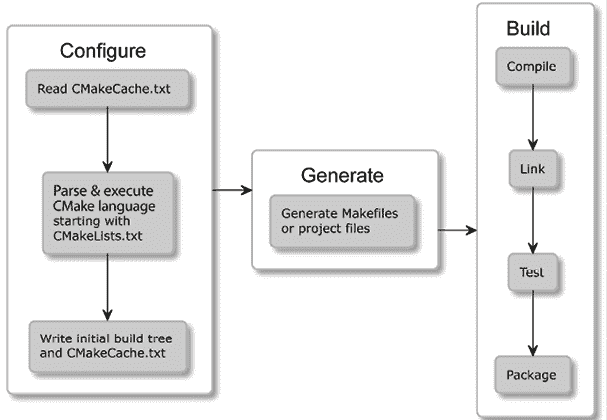
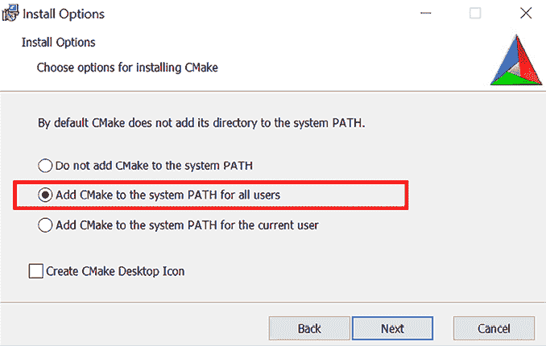
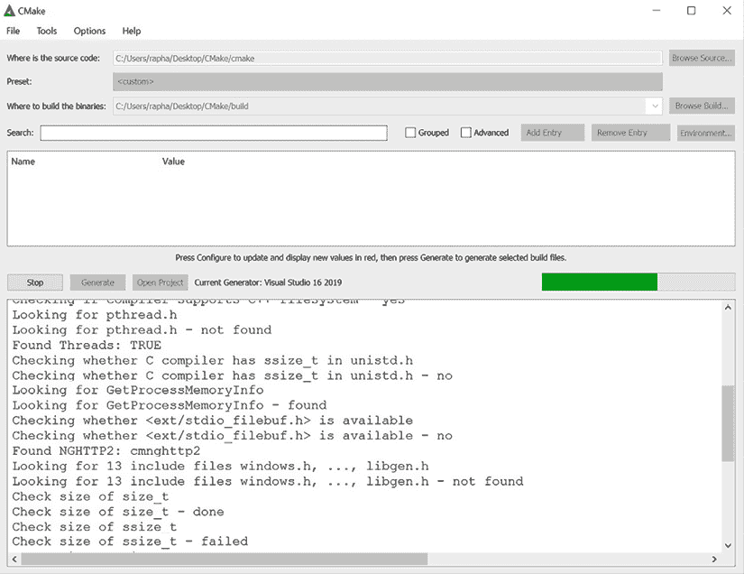
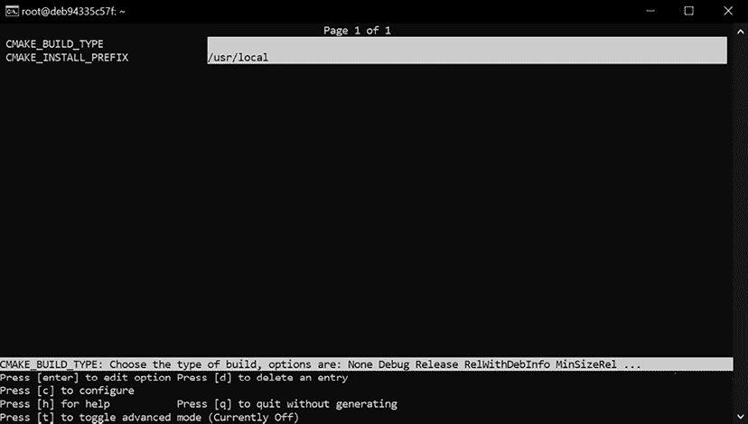

# 第一章：CMake 入门

软件创建有一种神奇的魅力。我们不仅仅是在创建一个能够被激活的工作机制，而且我们还常常在构思解决方案功能背后的想法。

为了将我们的想法付诸实践，我们在以下循环中工作：设计、编码和测试。我们发明变更，用编译器理解的语言表达这些变更，并检查它们是否按预期工作。为了从源代码中创建合适的高质量软件，我们需要仔细执行重复且容易出错的任务：调用正确的命令，检查语法，链接二进制文件，运行测试，报告问题等等。

每次都记住每个步骤是非常费劲的。相反，我们希望专注于实际编码，并将其他所有工作委托给自动化工具。理想情况下，这个过程应该在我们修改代码后，点击一个按钮就开始。它应该是智能的、快速的、可扩展的，并且在不同操作系统和环境中以相同方式工作。它应该得到多个**集成开发环境**（**IDE**）的支持。进一步地，我们可以将这个过程流畅地整合进**持续集成**（**CI**）流水线，每当提交更改到共享仓库时，自动构建和测试我们的软件。

CMake 是许多此类需求的答案；然而，它需要一些工作来正确配置和使用。CMake 不是复杂性的根源；复杂性来自于我们在这里所处理的主题。别担心，我们会非常有条理地逐步学习这一过程。很快，你就会成为一个软件构建高手。

我知道你迫不及待地想开始编写自己的 CMake 项目，而这正是我们在本书的大部分内容中要做的事情。但因为你将主要为用户（包括你自己）创建项目，所以首先理解用户的视角是非常重要的。

那么，让我们从这里开始：成为一个*CMake 高级用户*。我们将了解一些基础知识：这个工具是什么，原理上它如何工作，以及如何安装它。然后，我们将深入探讨命令行和操作模式。最后，我们将总结项目中不同文件的用途，并解释如何在不创建项目的情况下使用 CMake。

本章将涵盖以下主要内容：

+   理解基础知识

+   在不同平台上安装 CMake

+   精通命令行

+   导航项目文件

+   发现脚本和模块

# 技术要求

你可以在 GitHub 上找到本章中提供的代码文件，地址是 [`github.com/PacktPublishing/Modern-CMake-for-Cpp-2E/tree/main/examples/ch01`](https://github.com/PacktPublishing/Modern-CMake-for-Cpp-2E/tree/main/examples/ch01)。

要构建本书提供的示例，请始终执行所有推荐的命令：

```cpp
cmake -B <build tree> -S <source tree>
cmake --build <build tree> 
```

一定要将占位符`<build tree>`和`<source tree>`替换为适当的路径。正如本章所述，**build tree**是输出目录的路径，而**source tree**是源代码所在的路径。

为了构建 C++程序，你还需要一个适合你平台的编译器。如果你熟悉 Docker，你可以使用在*不同平台上安装 CMake*一节中介绍的完全集成的镜像。如果你更倾向于手动设置 CMake，我们将在同一节中解释安装过程。

# 理解基础知识

C++源代码的编译似乎是一个相当简单的过程。让我们从经典的 Hello World 示例开始。

以下代码位于`ch01/01-hello/hello.cpp`中，*C++语言中的 Hello World*：

```cpp
#include <iostream>
int main() {
  std::cout << "Hello World!" << std::endl;
  return 0;
} 
```

为了生成可执行文件，我们当然需要一个 C++编译器。CMake 本身不附带编译器，因此你需要自行选择并安装一个。常见的选择包括：

+   Microsoft Visual C++ 编译器

+   GNU 编译器集合

+   Clang/LLVM

大多数读者都对*编译器*非常熟悉，因为它是学习 C++时不可或缺的部分，所以我们不会详细介绍如何选择和安装编译器。本书中的示例将使用 GNU GCC，因为它是一个成熟的、开源的、可免费在多个平台上使用的软件编译器。

假设我们已经安装了编译器，对于大多数供应商和系统，运行它的方式类似。我们应该将文件名作为参数传递给它：

```cpp
$ g++ hello.cpp -o hello 
```

代码是正确的，因此编译器将默默地生成一个可执行的二进制文件，供我们的机器理解。我们可以通过调用文件名来运行它：

```cpp
$ ./hello
Hello World! 
```

运行一个命令来构建程序很简单；然而，随着项目的增长，你会很快明白，所有东西都保存在一个文件中是不可能的。清洁代码实践建议源代码文件应保持简短，并且结构要井井有条。手动编译每个文件可能是一个乏味且容易出错的过程。一定有更好的方法。

## 什么是 CMake？

假设我们通过编写一个脚本来自动化构建，该脚本遍历我们的项目树并编译所有内容。为了避免不必要的编译，脚本将检测自上次运行以来源代码是否已被修改。现在，我们希望有一种方便的方式来管理每个文件传递给编译器的参数——最好是基于可配置的标准来处理。此外，我们的脚本应当知道如何将所有已编译的文件链接成一个单一的二进制文件，或者更好的是，构建可以重用的完整解决方案，并将其作为模块集成到更大的项目中。

构建软件是一个非常多样化的过程，涵盖了多个不同的方面：

+   编译可执行文件和库

+   管理依赖关系

+   测试

+   安装

+   打包

+   生成文档

+   再做一些测试

创建一个真正模块化且强大的 C++ 构建工具以适应所有需求将需要非常长的时间。事实证明，它做到了。Bill Hoffman 在 Kitware 实现了 CMake 的第一个版本，已经有 20 多年的历史了。正如你可能已经猜到的，它非常成功。如今，它拥有众多功能并得到了社区的广泛支持。CMake 正在积极开发，并已成为 C 和 C++ 程序员的行业标准。

自动化构建代码的问题早于 CMake 的诞生，所以自然，市面上有很多选择：GNU Make、Autotools、SCons、Ninja、Premake 等。但为什么 CMake 却占据优势呢？

关于 CMake，有几个我认为（当然是主观的）重要的地方：

+   它始终专注于支持现代编译器和工具链。

+   CMake 真正跨平台——它支持为 Windows、Linux、macOS 和 Cygwin 构建项目。

+   它为流行的 IDE 生成项目文件：Microsoft Visual Studio、Xcode 和 Eclipse CDT。此外，它也是其他项目模型的基础，如 CLion。

+   CMake 操作在恰当的抽象层次上——它允许你将文件分组到可重用的目标和项目中。

+   有大量的项目是用 CMake 构建的，并提供了一种简便的方式将它们集成到你的项目中。

+   CMake 将测试、打包和安装视为构建过程的固有部分。

+   为了保持 CMake 的精简，过时的、未使用的功能会被弃用。

CMake 提供了一种统一、简化的体验。无论你是在 IDE 中构建软件，还是直接从命令行构建，真正重要的是它也会处理构建后的阶段。

即使所有前面的环境不同，你的 CI/CD 流水线也可以轻松使用相同的 CMake 配置，并通过单一标准构建项目。

## 它是如何工作的？

你可能会认为 CMake 是一个在一端读取源代码并在另一端生成二进制文件的工具——虽然从原则上讲这是真的，但这并不是完整的画面。

CMake 本身不能独立构建任何东西——它依赖系统中的其他工具来执行实际的编译、链接和其他任务。你可以把它看作是构建过程的指挥者：它知道需要执行哪些步骤，最终目标是什么，以及如何找到合适的工作者和材料来完成任务。

这个过程有三个阶段：

+   配置

+   生成

+   构建

让我们详细探讨一下这些内容。

### 配置阶段

这个阶段是关于读取存储在目录中的项目详情，称为 **源树**，并为生成阶段准备一个输出目录或 **构建树**。

CMake 首先检查项目是否已配置过，并从 `CMakeCache.txt` 文件中读取缓存的配置变量。在第一次运行时，情况并非如此，因此它会创建一个空的构建树，并收集关于它所处环境的所有细节：例如，架构是什么，哪些编译器可用，已安装了哪些链接器和归档工具。此外，它还会检查是否能正确编译一个简单的测试程序。

接下来，解析并执行 `CMakeLists.txt` 项目配置文件（是的，CMake 项目是用 CMake 的编程语言配置的）。这个文件是一个 CMake 项目的最基本形式（源文件可以稍后添加）。它告诉 CMake 项目的结构、目标及其依赖项（库和其他 CMake 包）。

在此过程中，CMake 将收集的信息存储在构建树中，例如系统细节、项目配置、日志和临时文件，这些信息将在下一步骤中使用。具体来说，CMake 会创建一个 `CMakeCache.txt` 文件，用于存储更稳定的信息（例如编译器和其他工具的路径），这样当整个构建过程重新执行时，可以节省时间。

### 生成阶段

在读取项目配置后，CMake 将为其所处的具体环境生成一个 **构建系统**。构建系统实际上就是为其他构建工具（例如，GNU Make 或 Ninja 的 Makefile，以及 Visual Studio 的 IDE 项目文件）量身定制的配置文件。在这个阶段，CMake 还可以通过评估 **生成器表达式** 对构建配置进行一些最后的调整。

生成阶段会在配置阶段之后自动执行。因此，本书及其他资源有时在提到“构建系统的配置”或“生成”时会将这两个阶段互换使用。要明确仅运行配置阶段，可以使用 `cmake-gui` 工具。

### 构建阶段

为了生成项目中指定的最终产物（如可执行文件和库），CMake 需要运行适当的 **构建工具**。这可以通过直接调用、通过 IDE 或使用适当的 CMake 命令来实现。这些构建工具将执行步骤，通过编译器、链接器、静态和动态分析工具、测试框架、报告工具以及你能想到的其他任何工具来生成 **目标产物**。

这个解决方案的优势在于，它能够通过单一配置（即相同的项目文件）按需为每个平台生成构建系统：



图 1.1：CMake 的各个阶段

你还记得我们在 *理解基础* 部分提到的 `hello.cpp` 应用程序吗？用 CMake 构建它非常简单。我们只需要在与源文件相同的目录中放置以下 `CMakeLists.txt` 文件。

**ch01/01-hello/CMakeLists.txt**

```cpp
cmake_minimum_required(VERSION 3.26)
project(Hello)
add_executable(Hello hello.cpp) 
```

创建该文件后，在相同目录下执行以下命令：

```cpp
cmake -B <build tree>
cmake --build <build tree> 
```

请注意，`<build tree>`是一个占位符，应该替换为存放生成文件的临时目录的路径。

这是在 Docker 中运行的 Ubuntu 系统的输出（Docker 是一种可以在其他系统内运行的虚拟机；我们将在*在不同平台上安装 CMake*一节中讨论它）。第一个命令生成一个**构建系统**：

```cpp
~/examples/ch01/01-hello# cmake -B ~/build_tree
-- The C compiler identification is GNU 11.3.0
-- The CXX compiler identification is GNU 11.3.0
-- Detecting C compiler ABI info
-- Detecting C compiler ABI info - done
-- Check for working C compiler: /usr/bin/cc - skipped
-- Detecting C compile features
-- Detecting C compile features - done
-- Detecting CXX compiler ABI info
-- Detecting CXX compiler ABI info - done
-- Check for working CXX compiler: /usr/bin/c++ - skipped
-- Detecting CXX compile features
-- Detecting CXX compile features - done
-- Configuring done (1.0s)
-- Generating done (0.1s)
-- Build files have been written to: /root/build_tree 
```

第二个命令实际上是**构建**项目：

```cpp
~/examples/ch01/01-hello# cmake --build ~/build_tree
Scanning dependencies of target Hello
[ 50%] Building CXX object CMakeFiles/Hello.dir/hello.cpp.o
[100%] Linking CXX executable Hello
[100%] Built target Hello 
```

剩下的就是运行已编译的程序：

```cpp
~/examples/ch01/01-hello# ~/build_tree/Hello
Hello World! 
```

在这里，我们已经生成了一个存储在**构建树**目录中的构建系统。接下来，我们执行了构建阶段并生成了一个可以运行的最终二进制文件。

现在你知道结果是什么样子了，我相信你一定有很多问题：这个过程的前提条件是什么？这些命令是什么意思？为什么需要两个命令？我该如何编写自己的项目文件？别担心——这些问题将在接下来的章节中得到解答。

本书将为您提供与当前版本的 CMake 相关的最重要信息（截至写作时，版本为 3.26）。为了给您提供最佳建议，我特别避免了任何已弃用或不再推荐的功能，并且强烈建议至少使用 CMake 版本 3.15，这被认为是*现代 CMake*。如果您需要更多信息，可以在[`cmake.org/cmake/help/`](https://cmake.org/cmake/help/)在线查看最新的完整文档。

# 在不同平台上安装 CMake

CMake 是一个跨平台的开源软件，用 C++ 编写。这意味着你当然可以自己编译它；然而，最可能的情况是你不需要这么做。因为可以从官方网站下载预编译的二进制文件，[`cmake.org/download/`](https://cmake.org/download/)。

基于 Unix 的系统提供了可以直接从命令行安装的现成包。

记住，CMake 并不自带编译器。如果您的系统还没有安装编译器，您需要在使用 CMake 之前先安装它们。确保将编译器的可执行文件路径添加到`PATH`环境变量中，以便 CMake 能找到它们。

为了避免在学习本书时遇到工具和依赖问题，我建议通过使用第一种安装方法：Docker 进行实践。在真实的工作场景中，除非你本身就处于虚拟化环境中，否则你当然会选择使用本地版本。

让我们来看一下 CMake 可以使用的不同环境。

## Docker

Docker（[`www.docker.com/`](https://www.docker.com/)）是一个跨平台工具，提供操作系统级虚拟化，允许应用程序以称为容器的定义良好的包的形式进行交付。这些自给自足的包包含了运行软件所需的所有库、依赖项和工具。Docker 在轻量级环境中执行其容器，并且这些环境相互隔离。

这个概念使得共享完整的工具链变得极为方便，这些工具链是某一特定过程所必需的，已经配置好并随时可以使用。当你不需要担心微小的环境差异时，一切变得非常简单，我无法强调这点有多么重要。

Docker 平台有一个公开的容器镜像仓库，[`registry.hub.docker.com/`](https://registry.hub.docker.com/)，提供数百万个现成的镜像。

为了方便起见，我已经发布了两个 Docker 仓库：

+   `swidzinski/cmake2:base`：一个基于 Ubuntu 的镜像，包含构建 CMake 所需的工具和依赖项

+   `swidzinski/cmake2:examples`：基于前述工具链的镜像，包含本书中的所有项目和示例

第一个选项适用于那些仅仅想要一个干净的镜像，准备构建自己项目的读者，第二个选项适用于在我们通过章节时进行动手实践并使用示例的读者。

你可以按照其官方文档中的说明安装 Docker（请参阅 [docs.docker.com/get-docker](http://docs.docker.com/get-docker)）。然后，在终端中执行以下命令来下载镜像并启动容器：

```cpp
$ docker pull swidzinski/cmake2:examples
$ docker run -it swidzinski/cmake2:examples
root@b55e271a85b2:root@b55e271a85b2:# 
```

请注意，示例位于匹配此格式的目录中：

```cpp
devuser/examples/examples/ch<N>/<M>-<title> 
```

在这里，`<N>` 和 `<M>` 分别是零填充的章节和示例编号（如 `01`、`08` 和 `12`）。

## Windows

在 Windows 上安装非常简单——只需从官方网站下载 32 位或 64 位的版本。你也可以选择便携式 ZIP 或 MSI 包，使用 Windows 安装程序，它将把 CMake 的 `bin` 目录添加到 `PATH` 环境变量中（*图 1.2*），这样你就可以在任何目录中使用它，而不会出现类似的错误：

`cmake` 未被识别为内部或外部命令、可操作程序或批处理文件。

如果你选择 ZIP 包，你需要手动完成安装。MSI 安装程序带有一个方便的图形用户界面：



图 1.2：安装向导可以为你设置 PATH 环境变量

正如我之前提到的，这是开源软件，因此你可以自行构建 CMake。然而，在 Windows 上，你首先需要在系统上获取 CMake 的二进制版本。这种情况是 CMake 贡献者用来生成新版本的方式。

Windows 平台与其他平台没有区别，也需要一个可以完成 CMake 启动的构建工具。一个流行的选择是 Visual Studio IDE，它捆绑了一个 C++编译器。社区版可以从 Microsoft 官网免费下载：[`visualstudio.microsoft.com/downloads/`](https://visualstudio.microsoft.com/downloads/)。

## Linux

在 Linux 上安装 CMake 与其他流行软件包的安装过程相同：从命令行调用包管理器。包仓库通常会保持更新，提供相对较新的 CMake 版本，但通常不会是最新版本。如果您对此没有异议，并且使用的是 Debian 或 Ubuntu 等发行版，那么最简单的做法就是直接安装适当的包：

```cpp
$ sudo apt-get install cmake 
```

对于 Red Hat 发行版，请使用以下命令：

```cpp
$ yum install cmake 
```

请注意，在安装包时，包管理器将从为您的操作系统配置的仓库中获取最新版本。在许多情况下，包仓库并不提供最新版本，而是提供一个经过时间验证的稳定版本，这些版本通常能够可靠地运行。根据您的需求选择，但请注意，旧版本不会具备本书中描述的所有功能。

要获取最新版本，请参考 CMake 官方网站的下载部分。如果您知道当前版本号，可以使用以下命令之一。

Linux x86_64 的命令是：

```cpp
$ VER=3.26.0 && wget https://github.com/Kitware/CMake/releases/download/v$VER/cmake-$VER-linux-x86_64.sh && chmod +x cmake-$VER-linux-x86_64.sh && ./cmake-$VER-linux-x86_64.sh 
```

Linux AArch64 的命令是：

```cpp
$ VER=3.26.0 && wget https://github.com/Kitware/CMake/releases/download/v$VER/cmake-$VER-Linux-aarch64.sh && chmod +x cmake-$VER-Linux-aarch64.sh && ./cmake-$VER-Linux-aarch64.sh 
```

或者，查看*从源代码构建*部分，学习如何在您的平台上自行编译 CMake。

## macOS

这个平台也得到了 CMake 开发者的强力支持。最常见的安装选择是通过 MacPorts，使用以下命令：

```cpp
$ sudo port install cmake 
```

请注意，在写作时，MacPorts 中提供的最新版本是 3.24.4。要获取最新版本，请安装`cmake-devel`包：

```cpp
$ sudo port install cmake-devel 
```

或者，您可以使用 Homebrew 包管理器：

```cpp
$ brew install cmake 
```

macOS 的包管理器将涵盖所有必要步骤，但请注意，除非您从源代码构建，否则您可能无法获得最新版本。

## 从源代码构建

如果您使用的是其他平台，或者只是想体验尚未发布的最新版本（或未被您喜欢的包仓库采用），请从官方网站下载源代码并自行编译：

```cpp
$ wget https://github.com/Kitware/CMake/releases/download/v3.26.0/cmake-3.26.0.tar.gz
$ tar xzf cmake-3.26.0.tar.gz
$ cd cmake-3.26.0
$ ./bootstrap
$ make
$ make install 
```

从源代码构建相对较慢，并且需要更多步骤。然而，只有通过这种方式，您才能自由选择任何版本的 CMake。这对于操作系统仓库中提供的包过时的情况尤其有用：系统版本越老，更新的频率越低。

现在我们已经安装了 CMake，接下来让我们学习如何使用它！

# 精通命令行

本书的大部分内容将教你如何为用户准备 CMake 项目。为了满足用户的需求，我们需要深入了解用户在不同场景下如何与 CMake 进行交互。这样，你可以测试你的项目文件，并确保它们正常工作。

CMake 是一套工具，包含五个可执行文件：

+   `cmake`：配置、生成和构建项目的主要可执行文件

+   `ctest`：用于运行并报告测试结果的测试驱动程序

+   `cpack`：用于生成安装程序和源代码包的打包程序

+   `cmake-gui`：`cmake` 的图形界面包装器

+   `ccmake`：`cmake` 的基于控制台的 GUI 包装器

此外，CMake 的背后公司 Kitware 还提供了一个名为 CDash 的独立工具，用于对我们项目的构建健康状态进行高级监控。

## CMake 命令行

`cmake` 是 CMake 套件的主要二进制文件，并提供几种操作模式（有时也称为动作）：

+   生成项目构建系统

+   构建项目

+   安装项目

+   运行脚本

+   运行命令行工具

+   运行工作流预设

+   获取帮助

让我们看看它们是如何工作的。

### 生成项目构建系统

构建我们项目所需的第一步是生成构建系统。以下是三种执行 CMake *生成项目构建系统* 操作的命令形式：

```cpp
cmake [<options>] -S <source tree> -B <build tree>
cmake [<options>] <source tree>
cmake [<options>] <build tree> 
```

我们将在接下来的章节中讨论可用的 `<options>`。现在，让我们专注于选择正确的命令形式。CMake 的一个重要特点是支持 *源代码外构建* 或支持将 *构建产物* 存储在与源代码树不同的目录中。这是一种推荐的做法，可以保持源代码目录的干净，避免将意外的文件或忽略指令污染 **版本控制系统**（**VCSs**）。

这就是为什么第一种命令形式是最实用的原因。它允许我们分别使用 `-S` 和 `-B` 来指定源代码树的路径和生成的构建系统路径：

```cpp
cmake -S ./project -B ./build 
```

CMake 将从 `./project` 目录读取项目文件，并在 `./build` 目录中生成构建系统（如有需要，事先创建该目录）。

我们可以省略一个参数，`cmake` 会“猜测”我们打算使用当前目录。注意，省略两个参数将产生 *源代码内构建*，并将 *构建产物* 与源代码文件一起存储，这是我们不希望发生的。

**运行 CMAKE 时要明确**

不要使用 `cmake <directory>` 命令的第二种或第三种形式，因为它们可能会产生一个杂乱的 *源代码内构建*。在 *第四章*，*设置你的第一个 CMake 项目* 中，我们将学习如何防止用户这样做。

```cpp
<directory>: it will use the cached path to the sources and rebuild from there. Since we often invoke the same commands from the Terminal command history, we might get into trouble here; before using this form, always check whether your shell is currently working in the right directory.
```

#### 示例

使用上一级目录中的源代码在当前目录中生成构建树：

```cpp
cmake -S .. 
```

使用当前目录中的源代码在 `./build` 目录中生成构建树：

```cpp
cmake -B build 
```

#### 选择生成器

如前所述，在生成阶段，你可以指定一些选项。选择和配置生成器决定了在后续的*构建项目*部分中，系统将使用哪个构建工具，构建文件的样子，以及构建树的结构。

那么，你应该在意吗？幸运的是，答案通常是“否”。CMake 确实支持多个本地构建系统在许多平台上的使用；然而，除非你同时安装了几个生成器，否则 CMake 会为你正确地选择一个。这个选择可以通过`CMAKE_GENERATOR`环境变量或直接在命令行中指定生成器来覆盖，例如：

```cpp
cmake -G <generator name> -S <source tree> -B <build tree> 
```

一些生成器（例如 Visual Studio）支持对工具集（编译器）和平台（编译器或 SDK）进行更深入的指定。此外，CMake 会扫描那些覆盖默认值的环境变量：`CMAKE_GENERATOR_TOOLSET`和`CMAKE_GENERATOR_PLATFORM`。另外，这些值也可以在命令行中直接指定：

```cpp
cmake -G <generator name>
      -T <toolset spec>
      -A <platform name>
      -S <source tree> -B <build tree> 
```

Windows 用户通常希望为他们喜欢的 IDE 生成构建系统。在 Linux 和 macOS 上，使用**Unix Makefiles**或**Ninja**生成器非常常见。

要检查你的系统上可用的生成器，请使用以下命令：

```cpp
cmake --help 
```

在`help`输出的末尾，你将得到一个完整的生成器列表，例如在 Windows 10 上生成的列表（部分输出已被截断以提高可读性）：

此平台上可用的生成器如下：

```cpp
Visual Studio 17 2022       
Visual Studio 16 2019       
Visual Studio 15 2017 [arch]
Visual Studio 14 2015 [arch]
Visual Studio 12 2013 [arch]
Visual Studio 11 2012 [arch]
Visual Studio 9 2008 [arch] 
Borland Makefiles           
NMake Makefiles             
NMake Makefiles JOM         
MSYS Makefiles              
MinGW Makefiles             
Green Hills MULTI           
Unix Makefiles              
Ninja                       
Ninja Multi-Config          
Watcom WMake                
CodeBlocks - MinGW Makefiles
CodeBlocks - NMake Makefiles
CodeBlocks - NMake Makefiles JOM
CodeBlocks - Ninja          
CodeBlocks - Unix Makefiles 
CodeLite - MinGW Makefiles  
CodeLite - NMake Makefiles  
CodeLite - Ninja            
CodeLite - Unix Makefiles   
Eclipse CDT4 - NMake Makefiles
Eclipse CDT4 - MinGW Makefiles
Eclipse CDT4 - Ninja        
Eclipse CDT4 - Unix Makefiles
Kate - MinGW Makefiles      
Kate - NMake Makefiles      
Kate - Ninja                
Kate - Unix Makefiles       
Sublime Text 2 - MinGW Makefiles
Sublime Text 2 - NMake Makefiles
Sublime Text 2 - Ninja      
Sublime Text 2 - Unix Makefiles 
```

如你所见，CMake 支持许多不同的生成器和 IDE。

#### 管理项目缓存

CMake 在配置阶段会查询系统的各种信息。由于这些操作可能需要一些时间，因此收集到的信息会缓存到构建树目录中的`CMakeCache.txt`文件中。有一些命令行选项可以更方便地管理缓存的行为。

我们可以使用的第一个选项是能够*预填充缓存信息*：

```cpp
cmake -C <initial cache script> -S <source tree> -B <build tree> 
```

我们可以提供一个 CMake 列表文件的路径，该文件（仅）包含一个`set()`命令列表，用于指定将用于初始化一个空构建树的变量。我们将在下一章讨论编写列表文件。

*初始化和修改*现有的缓存变量可以通过另一种方式进行（例如，当创建一个文件仅仅是为了设置几个变量时，可能有些过于繁琐）。你可以在命令行中直接设置它们，如下所示：

```cpp
cmake -D <var>[:<type>]=<value> -S <source tree> -B <build tree> 
```

`:<type>`部分是可选的（它由 GUI 使用），并接受以下类型：`BOOL`、`FILEPATH`、`PATH`、`STRING`或`INTERNAL`。如果你省略类型，CMake 会检查变量是否存在于`CMakeCache.txt`文件中并使用其类型；否则，它将被设置为`UNINITIALIZED`。

一个特别重要的变量是我们通常通过命令行设置的，它指定了**构建类型**（`CMAKE_BUILD_TYPE`）。大多数 CMake 项目将在多个场合使用它来决定诊断信息的详细程度、调试信息的存在与否，以及创建的工件的优化级别。

对于单配置生成器（如 GNU Make 和 Ninja），你应该在配置阶段指定**构建类型**，并为每种配置类型生成一个单独的构建树。这里使用的值有`Debug`、`Release`、`MinSizeRel`或`RelWithDebInfo`。如果缺少此信息，可能会对依赖它进行配置的项目产生未定义的影响。

这是一个例子：

```cpp
cmake -S . -B ../build -D CMAKE_BUILD_TYPE=Release 
```

请注意，多配置生成器是在构建阶段配置的。

出于诊断目的，我们还可以使用`-L`选项列出缓存变量：

```cpp
cmake -L -S <source tree> -B <build tree> 
```

有时，项目作者可能会提供有用的帮助信息与变量一起显示——要打印它们，请添加`H`修饰符：

```cpp
cmake -LH -S <source tree> -B <build tree>
cmake -LAH -S <source tree> -B <build tree> 
```

令人惊讶的是，手动使用`-D`选项添加的自定义变量，除非你指定支持的类型之一，否则在此打印输出中不可见。

可以使用以下选项来*移除*一个或多个变量：

```cpp
cmake -U <globbing_expr> -S <source tree> -B <build tree> 
```

在这里，*通配符表达式*支持`*`（通配符）和`?`（任意字符）符号。使用这些符号时要小心，因为很容易删除比预期更多的变量。

`-U`和`-D`选项可以重复使用多次。

#### 调试和追踪

`cmake`命令可以使用多种选项来让你查看内部信息。要获取关于变量、命令、宏和其他设置的一般信息，可以运行以下命令：

```cpp
cmake --system-information [file] 
```

可选的文件参数允许你将输出存储到文件中。在**构建树**目录中运行它将打印关于缓存变量和日志文件中构建信息的额外内容。

在我们的项目中，我们将使用`message()`命令来报告构建过程的详细信息。CMake 根据当前的日志级别（默认情况下为`STATUS`）筛选这些日志输出。以下行指定了我们感兴趣的日志级别：

```cpp
cmake --log-level=<level> 
```

在这里，`level`可以是以下任意之一：`ERROR`、`WARNING`、`NOTICE`、`STATUS`、`VERBOSE`、`DEBUG`或`TRACE`。你可以在`CMAKE_MESSAGE_LOG_LEVEL`缓存变量中永久指定此设置。

另一个有趣的选项允许你在每次调用`message()`时*显示日志上下文*。为了调试非常复杂的项目，可以像使用堆栈一样使用`CMAKE_MESSAGE_CONTEXT`变量。每当你的代码进入一个有趣的上下文时，你可以为它起个描述性的名字。通过这种方式，我们的消息将附带当前的`CMAKE_MESSAGE_CONTEXT`变量，如下所示：

```cpp
[some.context.example] Debug message. 
```

启用此类日志输出的选项如下：

```cpp
cmake --log-context <source tree> 
```

我们将在*第二章*，《CMake 语言》中更详细地讨论命名上下文和日志命令。

如果其他方法都失败了，我们需要使用“重磅武器”，那么总有*追踪模式*，它会打印出每个执行的命令，包含文件名、调用所在的行号以及传递的参数列表。你可以通过以下方式启用它：

```cpp
cmake --trace 
```

正如你所想象的那样，它不推荐用于日常使用，因为输出内容非常长。

#### 配置预设

用户可以指定许多选项来生成项目的**构建树**。在处理构建树路径、生成器、缓存和环境变量时，很容易感到困惑或遗漏某些内容。开发者可以简化用户与项目的交互，并提供一个 `CMakePresets.json` 文件，指定一些默认设置。

要列出所有可用的预设，执行以下命令：

```cpp
cmake --list-presets 
```

你可以使用以下提供的预设之一：

```cpp
cmake --preset=<preset> -S <source> -B <build tree> 
```

要了解更多，请参阅本章的*导航项目文件*部分和*第十六章*，*编写 CMake 预设*。

#### 清理构建树

有时，我们可能需要删除生成的文件。这可能是由于构建之间环境发生了变化，或者仅仅是为了确保我们在干净的状态下工作。我们可以手动删除构建树目录，或者仅将 `--fresh` 参数添加到命令行中：

```cpp
cmake --fresh -S <source tree> -B <build tree> 
```

CMake 然后会以系统无关的方式删除 `CMakeCache.txt` 和 `CMakeFiles/`，并从头开始生成构建系统。

### 构建一个项目

在生成构建树后，我们可以开始*构建项目*。CMake 不仅知道如何为许多不同的构建器生成输入文件，还可以根据项目的需求为它们运行，并提供适当的参数。

**避免直接调用 MAKE**

许多在线资源推荐在生成阶段之后直接通过调用 `make` 命令来运行 GNU Make。因为 GNU Make 是 Linux 和 macOS 的默认生成器，所以这个建议是有效的。然而，建议使用本节中描述的方法，因为它与生成器无关，并且在所有平台上都得到官方支持。因此，你不需要担心每个应用程序用户的确切环境。

构建模式的语法是：

```cpp
cmake --build <build tree> [<options>] [-- <build-tool-options>] 
```

在大多数情况下，只需要提供最低限度的设置即可成功构建：

```cpp
cmake --build <build tree> 
```

唯一必需的参数是生成的*构建树*的路径。这与在生成阶段通过 `-B` 参数传递的路径相同。

CMake 允许你指定适用于所有构建器的关键构建参数。如果你需要向所选的本地构建器传递特殊参数，可以将它们添加到命令末尾，在 `--` 标记之后：

```cpp
cmake --build <build tree> -- <build tool options> 
```

让我们看看还有哪些其他选项可用。

#### 运行并行构建

默认情况下，许多构建工具会使用多个并发进程来利用现代处理器并并行编译源代码。构建工具了解项目依赖关系的结构，因此它们可以同时处理满足依赖关系的步骤，从而节省用户时间。

如果你希望在多核机器上更快地构建（或为了调试强制进行单线程构建），你可能想要覆盖该设置。

只需通过以下任一选项指定作业的数量：

```cpp
cmake --build <build tree> --parallel [<number of jobs>]
cmake --build <build tree> -j [<number of jobs>] 
```

另一种方法是通过`CMAKE_BUILD_PARALLEL_LEVEL`环境变量进行设置。命令行选项将覆盖这个变量。

#### 选择构建和清理的目标

每个项目由一个或多个部分组成，这些部分被称为**目标**（我们将在本书的第二部分讨论这些）。通常，我们希望构建所有可用的目标；然而，有时我们可能希望跳过某些目标，或者明确构建一个故意排除在正常构建之外的目标。我们可以通过以下方式做到这一点：

```cpp
cmake --build <build tree> --target <target1> --target <target2> … 
```

我们可以通过重复使用`–target`参数来指定多个构建目标。此外，还有一个简写版本`-t <target>`，可以用来代替。

#### 清理构建树

一个特殊的目标是`clean`，通常不会被构建。构建它的特殊效果是从构建目录中删除所有产物，这样以后可以重新从头开始创建。你可以通过以下方式开始这个过程：

```cpp
cmake --build <build tree> -t clean 
```

此外，如果你希望先清理然后再执行正常构建，CMake 还提供了一个便捷的别名：

```cpp
cmake --build <build tree> --clean-first 
```

这个操作与*清理构建树*部分中提到的清理不同，它只影响目标产物，而不会影响其他内容（如缓存）。

#### 为多配置生成器配置构建类型

所以，我们已经了解了一些关于生成器的信息：它们有不同的形状和大小。其中一些生成器支持在一个构建树中构建`Debug`和`Release`这两种构建类型。支持这一功能的生成器包括 Ninja Multi-Config、Xcode 和 Visual Studio。其他生成器都是单配置生成器，它们需要为每个想要构建的配置类型提供单独的构建树。

选择`Debug`、`Release`、`MinSizeRel`或`RelWithDebInfo`并按以下方式指定：

```cpp
cmake --build <build tree> --config <cfg> 
```

否则，CMake 将使用`Debug`作为默认设置。

#### 调试构建过程

当出现问题时，我们首先应该检查输出信息。然而，经验丰富的开发者知道，始终打印所有细节会让人困惑，所以它们通常默认隐藏这些信息。当我们需要深入查看时，可以通过告诉 CMake 启用详细模式来获得更详细的日志：

```cpp
cmake --build <build tree> --verbose
cmake --build <build tree> -v 
```

同样的效果可以通过设置`CMAKE_VERBOSE_MAKEFILE`缓存变量来实现。

### 安装项目

当构建产物生成后，用户可以将它们安装到系统中。通常，这意味着将文件复制到正确的目录，安装库，或执行某些来自 CMake 脚本的自定义安装逻辑。

安装模式的语法是：

```cpp
cmake --install <build tree> [<options>] 
```

与其他操作模式一样，CMake 需要一个生成的构建树的路径：

```cpp
cmake --install <build tree> 
```

安装操作还有很多其他附加选项。让我们看看它们能做些什么。

#### 选择安装目录

我们可以通过添加我们选择的前缀来预先添加安装路径（例如，当我们对某些目录的写入权限有限时）。以`/home/user`为前缀的`/usr/local`路径变成`/home/user/usr/local`。

该选项的签名如下：

```cpp
cmake --install <build tree> --install-prefix <prefix> 
```

如果你使用的是 CMake 3.21 或更早版本，你将需要使用一个不太明确的选项：

```cpp
cmake --install <build tree> --prefix <prefix> 
```

请注意，这在 Windows 上无法使用，因为该平台上的路径通常以驱动器字母开头。

#### 针对多配置生成器的安装

就像在构建阶段一样，我们可以指定要用于安装的构建类型（更多细节请参见*构建项目*部分）。可用的类型包括`Debug`、`Release`、`MinSizeRel`和`RelWithDebInfo`。其签名如下：

```cpp
cmake --install <build tree> --config <cfg> 
```

#### 选择要安装的组件

作为开发人员，你可能选择将项目拆分为可以独立安装的组件。我们将在*第十四章* *安装和打包*中进一步讨论组件的概念。现在，我们假设它们表示一些不需要在每种情况下都使用的工件集。这可能是像`application`、`docs`和`extra-tools`之类的东西。

要安装单个组件，使用以下选项：

```cpp
cmake --install <build tree> --component <component> 
```

#### 设置文件权限

如果安装是在类似 Unix 的平台上进行的，你可以使用以下选项指定已安装目录的默认权限，格式为`u=rwx,g=rx,o=rx`：

```cpp
cmake --install <build tree>
      --default-directory-permissions <permissions> 
```

#### 调试安装过程

类似于构建阶段，我们还可以选择查看安装阶段的详细输出。为此，请使用以下任一方法：

```cpp
cmake --install <build tree> --verbose
cmake --install <build tree> -v 
```

如果设置了`VERBOSE`环境变量，也可以实现相同的效果。

### 运行脚本

CMake 项目使用 CMake 自定义语言进行配置。它是跨平台的，且非常强大。既然它已经存在，为什么不让它用于其他任务呢？果然，CMake 可以运行独立的脚本（更多内容请参见*发现脚本和模块*部分），如下所示：

```cpp
cmake [{-D <var>=<value>}...] -P <cmake script file>
      [-- <unparsed options>...] 
```

运行这样的脚本不会执行任何*配置*或*生成*阶段，也不会影响缓存。

你可以通过两种方式将值传递给此脚本：

+   通过使用`-D`选项定义的变量

+   通过可以在`--`标记后传递的参数

CMake 将为所有传递给脚本的参数（包括`--`标记）创建`CMAKE_ARGV<n>`变量。

### 运行命令行工具

在少数情况下，我们可能需要以平台无关的方式运行单个命令——比如复制文件或计算校验和。并非所有平台都是一样的，因此并非每个系统都提供所有命令（或者它们的名称不同）。

CMake 提供了一种模式，在这种模式下，大多数常见命令可以跨平台以相同的方式执行。其语法如下：

```cpp
cmake -E <command> [<options>] 
```

由于这种模式的使用比较有限，我们不会深入讨论它。不过，如果你对细节感兴趣，我建议运行 `cmake -E` 来列出所有可用命令。为了简单了解可用命令，CMake 3.26 支持以下命令：`capabilities`，`cat`，`chdir`，`compare_files`，`copy`，`copy_directory`，`copy_directory_if_different`，`copy_if_different`，`echo`，`echo_append`，`env`，`environment`，`make_directory`，`md5sum`，`sha1sum`，`sha224sum`，`sha256sum`，`sha384sum`，`sha512sum`，`remove`，`remove_directory`，`rename`，`rm`，`sleep`，`tar`，`time`，`touch`，`touch_nocreate`，`create_symlink`，`create_hardlink`，`true` 和 `false`。

如果你想使用的命令缺失，或者你需要更复杂的行为，可以考虑将其包装在脚本中并以 `-P` 模式运行。

### 运行预设工作流

我们在 *它是如何工作的？* 部分中提到，使用 CMake 构建有三个阶段：配置、生成和构建。此外，我们还可以通过 CMake 运行自动化测试，甚至创建可重新分发的包。通常，用户需要通过命令行手动执行每个步骤，通过调用适当的 `cmake` 操作。然而，高级项目可以指定 **工作流预设**，将多个步骤捆绑为一个操作，只需一个命令就能执行。现在，我们只提到，用户可以通过运行以下命令来获取可用预设的列表：

```cpp
cmake ––workflow --list-presets 
```

它们可以通过以下方式执行预设的工作流：

```cpp
cmake --workflow --preset <name> 
```

这一部分将在 *第十六章*，*编写 CMake 预设* 中深入讲解。

### 获取帮助

不足为奇的是，CMake 提供了大量的帮助，可以通过其命令行访问。帮助模式的语法如下：

```cpp
cmake --help 
```

这将打印出可供深入探索的主题列表，并解释需要添加哪些参数才能获得更多帮助。

## CTest 命令行

自动化测试对于生成和维护高质量代码非常重要。CMake 套件带有一个专门的命令行工具，名为 CTest，专门用于此目的。它旨在标准化测试的运行和报告方式。作为 CMake 用户，你不需要了解测试这个特定项目的细节：使用了什么框架或如何运行它。CTest 提供了一个便捷的界面，可以列出、筛选、打乱、重试和时间限制测试运行。

要运行已构建项目的测试，我们只需在生成的构建树中调用 `ctest`：

```cpp
$ ctest
Test project /tmp/build
Guessing configuration Debug
    Start 1: SystemInformationNew
1/1 Test #1: SystemInformationNew .........   Passed 3.19 sec
100% tests passed, 0 tests failed out of 1
Total Test time (real) =   3.24 sec 
```

我们为此专门编写了整整一章内容：*第十一章*，*测试框架*。

## CPack 命令行

在我们构建并测试完我们惊人的软件后，我们准备与世界分享它。少数强力用户完全可以使用源代码。然而，绝大多数人为了方便和节省时间，选择使用预编译的二进制文件。

CMake 并不会让你陷入困境，它是自带电池的。CPack 是一个工具，用于为各种平台创建可重新分发的包：压缩归档、可执行安装程序、向导、NuGet 包、macOS 包、DMG 包、RPM 等。

CPack 的工作方式与 CMake 非常相似：它使用 CMake 语言进行配置，并且有许多 *包生成器* 可供选择（不要与 CMake 构建系统生成器混淆）。我们将在 *第十四章*《安装与打包》中详细介绍它，因为这个工具是为成熟的 CMake 项目使用的。

## CMake GUI

CMake for Windows 带有一个 GUI 版本，用于配置之前准备好的项目的构建过程。对于类 Unix 平台，它有一个使用 Qt 库构建的版本。Ubuntu 在 `cmake-qt-gui` 包中提供了它。

要访问 CMake GUI，请运行 `cmake-gui` 可执行文件：



图 1.3：CMake GUI——使用 Visual Studio 2019 生成器的构建系统的配置阶段

GUI 应用程序是为你的应用程序用户提供的便利：对于那些不熟悉命令行并且更喜欢图形界面的用户来说，它非常有用。

**使用命令行工具代替**

我绝对推荐终端用户使用 GUI，但对于像你这样的程序员，我建议避免任何手动阻塞步骤，因为每次构建程序时都需要点击表单。这在成熟的项目中尤其有利，其中整个构建过程可以在没有任何用户交互的情况下完全执行。

## CCMake 命令行

`ccmake` 可执行文件是 CMake 在类 Unix 平台上的交互式文本用户界面（如果没有明确构建，它在 Windows 上不可用）。我在这里提到它是为了让你知道当你看到它时会是什么（*图 1.4*），但和 GUI 一样，开发人员直接编辑 `CMakeCache.txt` 文件会更有利。



图 1.4：ccmake 中的配置阶段

说完这些，我们已经完成了 CMake 套件命令行的基本介绍。现在是时候了解一个典型的 CMake 项目的结构了。

# 导航项目目录和文件

CMake 项目由相当多的文件和目录组成。让我们大致了解每个文件的作用，以便我们可以开始修改它们。它们大致可以分为几类：

+   当然，我们会有一些项目文件，这些文件是我们作为开发人员在项目发展过程中准备和修改的。

+   还有一些文件是 CMake 为自己生成的，尽管它们包含 CMake 语言命令，但并不是供开发人员编辑的。任何手动更改都会被 CMake 覆盖。

+   有些文件是为高级用户（即：非项目开发人员）设计的，用来根据个人需求定制 CMake 构建项目的方式。

+   最后，还有一些临时文件，在特定上下文中提供有价值的信息。

本节还将建议你可以将哪些文件放入**版本控制系统**（**VCS**）的*忽略*文件中。

## 源代码树

这是你的项目所在的目录（也称为**项目根目录**）。它包含所有 C++源代码和 CMake 项目文件。

以下是该目录中的最重要要点：

+   它需要一个`CMakeLists.txt`配置文件。

+   这个目录的路径由用户在使用`cmake`命令*生成构建系统*时通过`-S`参数指定。

+   避免在 CMake 代码中硬编码任何指向*源代码树*的绝对路径——你的软件用户会将项目存储在不同的路径中。

在这个目录中初始化一个版本库是个好主意，可以使用像`Git`这样的 VCS。

## 构建树

CMake 在用户指定的路径中创建此目录。它将存储构建系统和构建过程中创建的所有内容：项目的构建产物、临时配置、缓存、构建日志以及本地构建工具（如 GNU Make）的输出。此目录的其他名称包括**构建根目录**和**二进制树**。

记住的关键点：

+   你的构建配置（构建系统）和构建产物将被创建在这里（例如二进制文件、可执行文件、库文件，以及用于最终链接的*目标文件*和归档文件）。

+   CMake 建议将该目录放置在源代码树目录之外（这种做法称为**源外构建**）。这样，我们可以防止项目的污染（**源内构建**）。

+   它通过`-B`参数在*生成构建系统*时指定给`cmake`命令。

+   这个目录并不是生成文件的最终目的地。相反，建议你的项目包含一个安装阶段，将最终的构件复制到系统中应有的位置，并删除所有用于构建的临时文件。

不要将这个目录添加到版本控制系统（VCS）中——每个用户会为自己选择一个目录。如果你有充分的理由进行源代码内构建，请确保将这个目录添加到 VCS 忽略文件中（例如`.gitignore`）。

## 列表文件

包含 CMake 语言的文件称为列表文件，可以通过调用`include()`和`find_package()`来互相包含，或者通过`add_subdirectory()`间接包含。CMake 并不强制规定这些文件的命名规则，但根据惯例，它们的扩展名是`.cmake`。

### 项目文件

CMake 项目使用`CMakeLists.txt`列表文件进行配置（注意，由于历史原因，这个文件的扩展名不常见）。该文件是每个项目源代码树顶端必须存在的文件，并且是配置阶段首先执行的文件。

顶级的`CMakeLists.txt`应该包含至少两个命令：

+   `cmake_minimum_required(VERSION <x.xx>)`：设置 CMake 的期望版本，并告诉 CMake 如何处理与策略相关的遗留行为。

+   `project(<name> <OPTIONS>)`：命名项目（提供的名称将存储在`PROJECT_NAME`变量中），并指定配置项目的选项（更多内容请参见*第二章*，*CMake 语言*）。

随着软件的成长，你可能希望将其划分为可以单独配置和推理的小单元。CMake 通过引入具有独立`CMakeLists.txt`文件的子目录来支持这一点。你的项目结构可能类似于以下示例：

```cpp
myProject/CMakeLists.txt
myProject/api/CMakeLists.txt
myProject/api/api.h
myProject/api/api.cpp 
```

一个非常简单的顶层`CMakeLists.txt`文件可以将所有内容整合在一起：

```cpp
cmake_minimum_required(VERSION 3.26)
project(app)
message("Top level CMakeLists.txt")
add_subdirectory(api) 
```

项目的主要方面在顶层文件中得到涵盖：管理依赖项、声明需求以及检测环境。我们还有一个`add_subdirectory(api)`命令，用来包含`api`子目录中的另一个`CMakeLists.txt`文件，以执行特定于应用程序 API 部分的步骤。

### 缓存文件

缓存变量将在配置阶段第一次运行时从列表文件生成，并存储在`CMakeCache.txt`中。该文件位于构建树的根目录，格式非常简单（为了简洁，省略了一些行）：

```cpp
# This is the CMakeCache file.
# For build in directory: /root/build tree
# It was generated by CMake: /usr/local/bin/cmake
# The syntax for the file is as follows:
# KEY:TYPE=VALUE
# KEY is the name of a variable in the cache.
# TYPE is a hint to GUIs for the type of VALUE, DO NOT EDIT
  #TYPE!.
# VALUE is the current value for the KEY.
########################
# EXTERNAL cache entries
########################
# Flags used by the CXX compiler during DEBUG builds.
CMAKE_CXX_FLAGS_DEBUG:STRING=/MDd /Zi /Ob0 /Od /RTC1
# ... more variables here ...
########################
# INTERNAL cache entries
########################
# Minor version of cmake used to create the current loaded
  cache
CMAKE_CACHE_MINOR_VERSION:INTERNAL=19
# ... more variables here ... 
```

从头部注释中可以看到，这种格式非常易于理解。`EXTERNAL`部分的缓存项是供用户修改的，而`INTERNAL`部分则由 CMake 管理。

这里有几个关键点需要记住：

+   你可以通过手动管理此文件，调用`cmake`（请参阅本章*命令行精通*部分中的*缓存选项*），或者通过`ccmake`或`cmake-gui`进行管理。

+   你可以通过删除此文件来重置项目为默认配置；它将从列表文件重新生成。

缓存变量可以从列表文件中读取和写入。有时，变量引用的求值过程会有些复杂；我们将在*第二章*，*CMake 语言*中详细讨论这一点。

### 包定义文件

CMake 生态系统的一个重要组成部分是项目可以依赖的外部包。它们以无缝、跨平台的方式提供库和工具。希望提供 CMake 支持的包作者会附带一个 CMake 包配置文件。

我们将在*第十四章*，*安装与打包*中学习如何编写这些文件。与此同时，以下是一些值得注意的细节：

+   **配置文件**（原始拼写）包含有关如何使用库的二进制文件、头文件和辅助工具的信息。有时，它们会公开可以在你的项目中使用的 CMake 宏和函数。

+   **配置文件**命名为`<PackageName>-config.cmake`或`<PackageName>Config.cmake`。

+   使用`find_package()`命令来包含包。

如果需要特定版本的包，CMake 将会检查关联的`<PackageName>-config-version.cmake`或`<PackageName>ConfigVersion.cmake`。

如果供应商没有为包提供配置文件，有时配置会与 CMake 本身捆绑，或者可以通过项目中的**Find-module**（原始拼写）提供。

### 生成的文件

许多文件是由`cmake`可执行文件在生成阶段生成的。因此，它们不应手动编辑。CMake 将它们用作`cmake`安装操作、CTest 和 CPack 的配置。

可能会遇到的文件包括：

+   `cmake_install.cmake`

+   `CTestTestfile.cmake`

+   `CPackConfig.cmake`

如果你正在实现源代码构建，最好将它们添加到 VCS 忽略文件中。

## JSON 和 YAML 文件

CMake 使用的其他格式包括**JavaScript 对象表示法**（**JSON**）和**另一种标记语言**（**YAML**）。这些文件作为与外部工具（如 IDE）进行通信的接口，或者提供可以轻松生成和解析的配置。

### 预设文件

项目的高级配置在需要指定诸如缓存变量、选择的生成器、构建树的路径等事项时，可能变得相对繁琐，特别是当我们有多种方式构建项目时。这时预设（presets）就派上用场了——我们可以通过提供一个存储所有详细信息的文件，而不是通过命令行手动配置这些值，并将其与项目一起发布。自 CMake 3.25 起，预设还允许我们配置**工作流**，将各个阶段（配置、构建、测试和打包）绑定为一个命名的执行步骤列表。

如本章的*掌握命令行*部分所提到的，用户可以通过 GUI 选择预设，或者使用命令`--list-presets`并使用`--preset=<preset>`选项为构建系统选择一个预设。

预设存储在两个文件中：

+   `CMakePresets.json`：这是供项目作者提供官方预设的文件。

+   `CMakeUserPresets.json`：这是为那些希望根据自己的喜好自定义项目配置的用户设计的（可以将其添加到 VCS 忽略文件中）。

预设在项目中并非必需，只有在高级场景下才会变得有用。详情请参见*第十六章*，*编写 CMake 预设*。

### 基于文件的 API

CMake 3.14 引入了一个 API，允许外部工具查询构建系统信息：生成文件的路径、缓存条目、工具链等。我们提到这个非常高级的话题，是为了避免在文档中看到*基于文件的 API*时产生困惑。该名称暗示了它的工作原理：必须将带有查询的 JSON 文件放置在构建树中的特定路径下。CMake 将在构建系统生成期间读取该文件，并将响应写入另一个文件，以便外部应用程序解析。

基于文件的 API 是为了替代一个已被弃用的机制——*服务器模式*（或 `cmake-server`），该机制最终在 CMake 3.26 中被移除。

### 配置日志

从 3.26 版本开始，CMake 将提供一个结构化的日志文件，用于高级调试 *配置阶段*，文件位于：

```cpp
<build tree>/CMakeFiles/CMakeConfigureLog.yaml 
```

这是一个你通常不需要关注的特性——直到你需要的时候。

## 在 Git 中忽略文件

有许多版本控制系统（VCS）；其中最流行的之一是 Git。每当我们开始一个新项目时，确保只将必要的文件*添加*到仓库中是很重要的。如果我们在 `.gitignore` 文件中指定不需要的文件，项目的清洁度会更容易维护。例如，我们可以排除一些生成的文件、用户特定的文件或临时文件。

Git 在创建新的提交时会自动跳过这些文件。以下是我在项目中使用的文件：

**ch01/01-hello/.gitignore**

```cpp
CMakeUserPresets.json
# If in-source builds are used, exclude their output like so:
build_debug/
build_release/
# Generated and user files
**/CMakeCache.txt
**/CMakeUserPresets.json
**/CTestTestfile.cmake
**/CPackConfig.cmake
**/cmake_install.cmake
**/install_manifest.txt
**/compile_commands.json 
```

现在，你持有了一张项目文件的地图。有些文件非常重要，你会经常使用它们，而有些文件则不太重要。虽然了解这些文件可能看起来没什么用，但知道 *不该在哪里寻找* 答案可能是非常宝贵的。无论如何，本章还有一个最后的问题：你可以使用 CMake 创建哪些其他自包含的单元？

# 发现脚本和模块

CMake 主要关注构建产生可以被其他系统使用的工件的项目（例如 CI/CD 管道、测试平台，或者部署到机器或存储在工件仓库中）。然而，CMake 还有两个概念使用其语言：脚本和模块。让我们解释它们是什么，以及它们有什么不同。

## 脚本

CMake 提供了一种与平台无关的编程语言，配备了许多有用的命令。用这种语言编写的脚本可以与更大的项目捆绑在一起，或者完全独立。

将其视为一种一致的跨平台工作方式。通常，为了执行一个任务，你需要为 Linux 创建一个单独的 Bash 脚本，为 Windows 创建单独的批处理文件或 PowerShell 脚本，依此类推。而 CMake 将这一切抽象化，你可以拥有一个在所有平台上都能正常工作的文件。当然，你也可以使用外部工具，如 Python、Perl 或 Ruby 脚本，但这增加了依赖项，会增加 C/C++ 项目的复杂性。那么，为什么要引入另一种语言呢？大多数情况下，你可以使用更简单的方式来完成任务。使用 CMake！

我们已经从 *掌握命令行* 部分学到，我们可以使用 `-P` 选项来执行脚本：`cmake -P script.cmake`。

但是我们希望使用的脚本文件的实际要求是什么呢？其实并不复杂：脚本可以根据需要复杂，也可以只是一个空文件。不过，仍然建议在每个脚本的开头调用 `cmake_minimum_required()` 命令。该命令告诉 CMake 应该对项目中的后续命令应用哪些策略（详细内容请参见 *第四章*，*设置你的第一个 CMake 项目*）。

这是一个简单脚本的示例：

**ch01/02-script/script.cmake**

```cpp
# An example of a script
cmake_minimum_required(VERSION 3.26.0)
message("Hello world")
file(WRITE Hello.txt "I am writing to a file") 
```

在运行脚本时，CMake 不会执行任何常规阶段（例如配置或生成），也不会使用缓存，因为在脚本中没有 **源树** 或 **构建树** 的概念。这意味着项目特定的 CMake 命令在脚本模式下不可用/不可使用。就这些了，祝你脚本编写愉快！

## 实用模块

CMake 项目可以使用外部模块来增强其功能。模块是用 CMake 语言编写的，包含宏定义、变量和执行各种功能的命令。它们的复杂程度从非常复杂的脚本（如 `CPack` 和 `CTest` 提供的脚本）到相对简单的脚本，例如 `AddFileDependencies` 或 `TestBigEndian`。

CMake 分发版包含了超过 80 个不同的实用模块。如果这些还不够，你可以通过浏览一些策划的列表，如 [`github.com/onqtam/awesome-cmake`](https://github.com/onqtam/awesome-cmake)，从互联网上下载更多，或者从头编写你自己的模块。

要使用实用模块，我们需要调用 `include(<MODULE>)` 命令。以下是一个简单的项目，展示了这一过程：

**ch01/03-module/CMakeLists.txt**

```cpp
cmake_minimum_required(VERSION 3.26.0)
project(ModuleExample)
include (TestBigEndian)
test_big_endian(IS_BIG_ENDIAN)
if(IS_BIG_ENDIAN)
message("BIG_ENDIAN")
else()
message("LITTLE_ENDIAN")
endif() 
```

我们将在相关主题时学习哪些模块可用。如果你感兴趣，可以查看包含模块的完整列表，网址为 [`cmake.org/cmake/help/latest/manual/cmake-modules.7.html`](https://cmake.org/cmake/help/latest/manual/cmake-modules.7.html)。

## 查找模块

在 *包定义文件* 部分，我提到 CMake 有一个机制，用来查找不支持 CMake 并且不提供 CMake 包配置文件的外部依赖文件。这就是查找模块的用途。CMake 提供了超过 150 个查找模块，能够定位这些已安装在系统中的包。就像实用模块一样，网上有更多的查找模块可用。作为最后的手段，你也可以自己编写。

你可以通过调用 `find_package()` 命令并提供相关包的名称来使用它们。这样，查找模块会进行一场捉迷藏的游戏，检查所有已知的软件位置。如果找到文件，将定义包含其路径的变量（如该模块手册中所指定）。现在，CMake 可以基于该依赖关系进行构建。

例如，`FindCURL` 模块搜索一个流行的 *Client URL* 库，并定义以下变量：`CURL_FOUND`、`CURL_INCLUDE_DIRS`、`CURL_LIBRARIES` 和 `CURL_VERSION_STRING`。

我们将在 *第九章*《*在 CMake 中管理依赖*》中更深入地讨论查找模块。

# 总结

现在您了解了 CMake 是什么以及它是如何工作的；您学习了 CMake 工具家族的关键组成部分，并了解了它如何在各种系统上安装。作为一名真正的高级用户，您知道如何通过命令行运行 CMake 的各种方式：构建系统生成、构建项目、安装、运行脚本、命令行工具和打印帮助信息。您还了解了 CTest、CPack 和 GUI 应用程序。这将帮助您以正确的视角为用户和其他开发者创建项目。此外，您还了解了项目的组成：目录、列表文件、配置、预设和辅助文件，以及如何在版本控制系统中忽略哪些内容。最后，您快速浏览了其他非项目文件：独立脚本和两种类型的模块——实用模块和查找模块。

在下一章中，我们将学习如何使用 CMake 编程语言。这将使您能够编写自己的列表文件，并为您的第一个脚本、项目和模块打开大门。

# 深入阅读

获取更多信息，您可以参考以下资源：

+   官方 CMake 网页和文档：[`cmake.org/`](https://cmake.org/)

+   单配置生成器：[`cgold.readthedocs.io/en/latest/glossary/single-config.html`](https://cgold.readthedocs.io/en/latest/glossary/single-config.html)

+   CMake GUI 中阶段的划分：[`stackoverflow.com/questions/39401003/`](https://stackoverflow.com/questions/39401003/)

# 留下评论！

喜欢这本书吗？通过留下亚马逊评论来帮助像您一样的读者。扫描下面的二维码，获取您选择的免费电子书。


