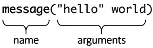
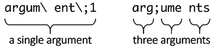
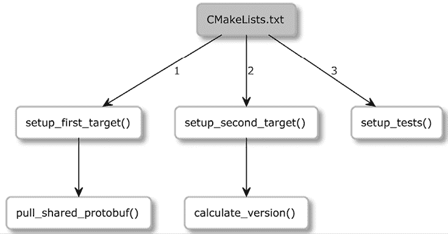

# 第二章：CMake 语言

用 **CMake** **语言** 编写代码比想象的要复杂。当你第一次阅读 CMake 列表文件时，可能会觉得它的语言如此简单，以至于可以直接实践，而不需要任何理论基础。你可能会尝试做出修改，并在没有充分理解其工作原理的情况下实验代码。我不会责怪你。我们程序员通常都很忙，构建相关的问题通常也不是一个值得投入大量时间的有趣话题。为了快速推进，我们往往凭直觉做出修改，希望它们能奏效。这种解决技术问题的方式被称为*巫术编程*。

CMake 语言看起来很简单：在我们引入了小扩展、修复、黑客技巧或一行代码后，我们突然发现有些东西不起作用。通常，调试所花费的时间超过了理解该主题本身所需的时间。幸运的是，这不会成为我们的命运，因为本章涵盖了使用 CMake 语言实践所需的大部分关键知识。

在本章中，我们不仅将学习 CMake 语言的构成模块——**注释**、**命令**、**变量**和**控制结构**——还将理解相关背景知识，并根据最新的实践进行示例操作。

CMake 让你处于一个独特的地位。一方面，你扮演着构建工程师的角色，必须全面了解编译器、平台及相关方面；另一方面，你是一个开发者，编写生成构建系统的代码。编写高质量代码是一项具有挑战性的任务，需要多方面的能力。代码不仅要能正常工作、易于阅读，还应该易于分析、扩展和维护。

总结时，我们将展示一些在 CMake 中最实用和最常用的命令。那些也常用但使用频率较低的命令将被放入*附录*，*杂项命令*中（包括 `string`、`list`、`file` 和 `math` 命令的参考指南）。

在本章中，我们将覆盖以下主要内容：

+   CMake 语言语法基础

+   处理变量

+   使用列表

+   理解 CMake 中的控制结构

+   探索常用的命令

# 技术要求

你可以在 GitHub 上找到本章中出现的代码文件，链接地址是：[`github.com/PacktPublishing/Modern-CMake-for-Cpp-2E/tree/main/examples/ch02`](https://github.com/PacktPublishing/Modern-CMake-for-Cpp-2E/tree/main/examples/ch02)。

为了构建本书提供的示例，始终使用推荐的命令：

```cpp
cmake -B <build tree> -S <source tree>
cmake --build <build tree> 
```

请确保将 `<build tree>` 和 `<source tree>` 占位符替换为适当的路径。提醒一下：**build tree** 是目标/输出目录的路径，**source tree** 是源代码所在的路径。

# CMake 语言语法基础

编写 CMake 代码与编写其他命令式语言非常相似：代码行从上到下、从左到右执行，偶尔会进入一个包含文件或调用的函数。执行的起点由模式决定（参见*第一章*中*掌握命令行*部分，*与 CMake 初步接触*），即从源代码树的根文件（`CMakeLists.txt`）或作为参数传递给 `cmake` 的 `.cmake` 脚本文件开始。

由于 CMake 脚本广泛支持 CMake 语言，除了项目相关功能外，我们将在本章中利用它们来练习 CMake 语法。一旦我们熟练掌握了编写简单列表文件的技巧，就可以进阶到创建实际的项目文件，这部分内容将在*第四章*中讲解，*设置你的第一个 CMake 项目*。

提醒一下，可以使用以下命令运行脚本：`cmake -P script.cmake`。

CMake 支持 **7 位** **ASCII** 文本文件，以实现跨平台的可移植性。你可以使用`\n`或`\r\n`行结束符。CMake 版本高于 3.2 支持 **UTF-8** 和 **UTF-16**，并且可以选择使用 **字节顺序标记** (**BOM**)。

在 CMake 列表文件中，所有内容要么是*注释*，要么是*命令调用*。

## 注释

就像在 **C++** 中一样，注释有两种类型：*单行*注释和*括号*（多行）注释。但与 C++ 不同的是，括号注释可以嵌套。单行注释以井号`#`开始：

```cpp
# they can be placed on an empty line
message("Hi"); # or after a command like here. 
```

多行括号注释得名于其符号——它们以`#`开头，后跟一个左方括号`[`，接着是任意数量的等号`=`（可以包括 0 个），然后是另一个方括号`[`。要关闭一个括号注释，请使用相同数量的等号并反向括号`]`：

```cpp
#[=[
bracket comment
  #[[
    nested bracket comment
  #]]
#]=] 
```

你可以通过在括号注释的首行再添加一个`#`来快速停用多行注释，如下所示：

```cpp
##[=[ this is a single-line comment now
no longer commented
  #[[
    still, a nested comment
  #]]
#]=] this is a single-line comment now 
```

知道如何使用注释绝对是有用的，但这又引出了另一个问题：我们应该在何时使用它们？因为编写列表文件本质上是编程，所以将最佳编码实践应用于它们也是一个好主意。

遵循这种做法的代码通常被称为*干净代码*——这是软件开发大师如罗伯特·C·马丁、马丁·福勒等许多作者多年来使用的术语。

关于哪些做法是有益的，哪些是有害的，常常会有很多争议，正如你所料，注释也未能免于这些争论。所有事情都应该根据具体情况进行判断，但普遍认可的指南认为好的注释至少应该具备以下之一：

+   **信息**：它们可以解开复杂性，比如正则表达式模式或格式化字符串。

+   **意图**：它们可以解释代码的意图，当代码的实现或接口并不明显时。

+   **澄清**：它们可以解释一些无法轻易重构或更改的概念。

+   **后果警告**：它们可以提供警告，特别是关于可能破坏其他部分的代码。

+   **加强**：它们可以强调某个在代码中难以表达的概念的重要性。

+   **合法条款**：它们可以添加这个必要的麻烦，通常这并不是程序员的领域。

最好通过更好的命名、重构或修正代码来避免注释。省略以下类型的注释：

+   **强制性**：这些是为了完整性而添加的，但它们并不真正重要。

+   **冗余**：这些内容重复了代码中已清晰表达的内容。

+   **误导性**：如果这些没有跟随代码变化，它们可能会变得过时或不准确。

+   **日志**：这些记录了已更改的内容及其时间（可以使用**版本控制系统**（**VCS**）来替代）。

+   **分隔符**：这些标记出不同的部分。

如果可以，避免添加注释，采用更好的命名实践，并重构或修正代码。编写优雅的代码是一个具有挑战性的任务，但它提升了读者的体验。由于我们花在阅读代码上的时间通常比编写代码的时间更多，我们应该始终努力编写易于阅读的代码，而不仅仅是追求快速完成。我建议你查看本章末尾的*进一步阅读*部分，那里有一些关于*清洁代码*的好参考。如果你对注释感兴趣，你可以找到我 YouTube 视频《你代码中的哪些注释是好的？》的链接，深入探讨这个话题。

## 命令调用

该采取行动啦！调用命令是 CMake 列表文件的核心。在运行命令时，必须指定命令名称，后面跟上括号，括号内可以包含以空格分隔的**命令参数**。



图 2.1：命令示例

命令名称不区分大小写，但 CMake 社区有一个约定，使用 `snake_case`（即用下划线连接的小写单词）。你还可以定义自己的命令，我们将在本章的*理解 CMake 中的控制结构*部分讲解这一点。

CMake 与 C++ 之间一个显著的区别是，CMake 中的命令调用不是表达式。这意味着你不能将另一个命令作为参数传递给已调用的命令，因为*括号内的所有内容*都被视为该特定命令的参数。

CMake 命令后面也不需要加分号。这是因为每行源代码只能包含一个命令。

命令后面可以选择性地加上注释：

```cpp
command(argument1 "argument2" argument3) # comment
command2() #[[ multiline comment 
```

但不是反过来：

```cpp
#[[ bracket
]] command() 
```

如我们之前所说，CMake 列表文件中的所有内容要么是*注释*，要么是*命令* *调用*。CMake 语法确实如此简单，通常来说，这是件好事。虽然有些限制（例如，你不能通过表达式来递增计数器变量），但大部分情况下，这些限制是可以接受的，因为 CMake 并非旨在成为一种通用编程语言。

CMake 提供了命令来操作变量、控制执行流、修改文件等等。为了简化操作，我们将在不同示例中逐步介绍相关命令。这些命令可以分为两组：

+   **脚本命令**：这些命令始终可用，它们改变命令处理器的状态，访问变量，并影响其他命令和环境。

+   **项目命令**：这些命令在项目中可用，它们用于操作项目状态和构建目标。

几乎所有命令都依赖于语言中的其他元素才能运行：变量、条件语句，最重要的是命令行参数。现在，让我们探讨一下如何利用它们。

## 命令参数

CMake 中的许多命令需要空格分隔的参数来配置其行为。如*图 2.1*所示，围绕参数使用的引号可能相当特殊。某些参数需要引号，而其他参数则不需要。为什么会有这样的区别呢？

在底层，CMake 识别的唯一数据类型是 `string`。因此，每个命令都期望它的参数是零个或多个字符串。CMake 会**评估**每个参数为静态字符串，然后将它们传递给命令。*评估*意味着**字符串插值**，或者用另一个值替换字符串的一部分。这可能意味着替换**转义序列**，扩展**变量引用**（也叫做*变量插值*），以及解包**列表**。

根据上下文的不同，我们可能需要根据需要启用这样的评估。因此，CMake 提供了三种类型的参数：

+   括号参数

+   加引号的参数

+   未加引号的参数

CMake 中的每种参数类型都有其特殊性，并提供不同级别的评估。

### 括号参数

括号参数不会被评估，因为它们用于将多行字符串逐字传递给命令作为单一参数。这意味着这样的参数会包括制表符和换行符形式的空白字符。

括号参数的格式与注释完全相同。它们以 `[=[` 开始，并以 `]=]` 结束，开头和结尾的等号数量必须匹配（只要匹配，省略等号也是允许的）。与注释的唯一不同是，括号参数不能嵌套。

下面是使用这种参数的示例，结合 `message()` 命令，它会将所有传递的参数打印到屏幕上：

**ch02/01-arguments/bracket.cmake**

```cpp
message([[multiline
  bracket
  argument
]])
message([==[
  because we used two equal-signs "=="
  this command receives only a single argument
  even if it includes two square brackets in a row
  { "petsArray" = [["mouse","cat"],["dog"]] }
]==]) 
```

在前面的示例中，我们可以看到不同形式的括号参数。注意在第一次调用中将闭合标签放在单独一行，会导致输出中出现空行：

```cpp
$ cmake -P ch02/01-arguments/bracket.cmake
multiline
bracket
argument
  because we used two equal-signs "=="
  following is still a single argument:
  { "petsArray" = [["mouse","cat"],["dog"]] } 
```

第二种形式在传递包含双括号（`]]`）（代码片段中突出显示）的文本时非常有用，因为它们不会被解释为标记参数的结束。

这类括号参数的使用较为有限——通常它们包含较长的文本块，其中的信息会显示给用户。大多数情况下，我们需要的是更动态的内容，比如带引号的参数。

### 带引号的参数

带引号的参数类似于常规的 C++ 字符串——这些参数将多个字符（包括空格）组合在一起，并且它们会展开*转义序列*。像 C++ 字符串一样，它们以双引号字符 `" ` 开头和结尾，因此要在输出字符串中包含引号字符，必须用反斜杠进行转义 `\"`。其他常见的转义序列也被支持：`\\` 表示字面上的反斜杠，`\t` 是制表符，`\n` 是换行符，`\r` 是回车符。

这就是与 C++ 字符串相似之处的终结。带引号的参数可以跨越多行，并且它们会插入变量引用。可以将它们视为内置的`printf`函数来自**C**，或来自**C++20**的`std::format`函数。要在参数中插入变量引用，只需将变量名用 `${name}` 这样的标记括起来。我们将在本章的*处理变量*部分进一步讨论变量引用。

你能猜到下面的脚本输出会有多少行吗？

**ch02/01-arguments/quoted.cmake**

```cpp
message("1\. escape sequence: \" \n in a quoted argument")
message("2\. multi...
  line")
message("3\. and a variable reference: ${CMAKE_VERSION}") 
```

让我们来看一个实际例子：

```cpp
$ cmake -P ch02/01-arguments/quoted.cmake
1\. escape sequence: "
in a quoted argument
2\. multi...
line
3\. and a variable reference: 3.26.0 
```

没错——我们有一个转义的引号字符，一个换行转义序列和一个字面上的换行符。我们还访问了一个内置的 `CMAKE_VERSION` 变量，可以看到它在最后一行被插入。让我们来看 CMake 是如何处理没有引号的参数的。

### 未加引号的参数

在编程领域，我们已经习惯了字符串必须以某种方式进行定界，例如使用单引号、双引号或反斜杠。CMake 偏离了这一惯例，提出了*未加引号的参数*。我们或许可以争论去掉定界符会让代码更易读。这个说法是否成立？我让你自己去判断。

未加引号的参数会同时处理*转义序列*和*变量引用*。但是，要小心分号 `(；)`，因为在 CMake 中，分号会被视为*列表*的定界符。如果参数中包含分号，CMake 会将其拆分成多个参数。如果需要使用分号，必须使用反斜杠进行转义 `\;`。我们将在本章的*使用列表*部分进一步讨论分号。

你可能会发现这些参数最难处理，因此这里有一个例子可以帮助说明这些参数是如何被划分的：



图 2.2：转义序列导致多个标记被解释为一个单一的参数

处理未加引号的参数时总是需要小心。一些 CMake 命令需要特定数量的参数，并会忽略任何附加内容。如果你的参数被不小心分开了，你可能会遇到难以调试的错误。

未加引号的参数不能包含未转义的*引号（“）*、井号（#）和反斜杠（\）。如果这些还不够记住，括号`()`仅在它们形成正确的配对时才允许使用。也就是说，你必须从一个左括号开始，并在关闭命令参数列表之前关闭它。

下面是一些展示我们讨论过的规则的例子：

**ch02/01-arguments/unquoted.cmake**

```cpp
message(a\ single\ argument)
message(two arguments)
message(three;separated;arguments)
message(${CMAKE_VERSION})  # a variable reference
message(()()())            # matching parentheses 
```

上面的代码将会输出什么呢？我们来看看：

```cpp
$ cmake -P ch02/01-arguments/unquoted.cmake
a single argument
twoarguments
threeseparatedarguments
3.16.3
()()() 
```

即使是像`message()`这样简单的命令，对于未加引号的参数分隔也有严格要求。当`a single argument`中的空格被正确转义时，它被正确打印出来。然而，`twoarguments`和`threeseparatearguments`却被*粘*在了一起，因为`message()`不会自动添加空格。

鉴于所有这些复杂性，何时使用未加引号的参数会更有利呢？一些 CMake 命令允许使用由关键字引导的可选参数，表示将提供一个可选参数。在这种情况下，使用未加引号的关键字参数可以使代码更加易读。例如：

```cpp
project(myProject VERSION 1.2.3) 
```

在这个命令中，`VERSION`关键字和后面的参数`1.2.3`是可选的。正如你所看到的，两个部分都没有加引号，以提高可读性。注意，关键字是区分大小写的。

现在我们已经了解了如何处理 CMake 参数的复杂性和怪癖，接下来就可以处理 CMake 中各种变量的操作了。

# 操作变量

CMake 中的**变量**是一个令人惊讶的复杂话题。变量不仅有三类——**普通变量**、**缓存变量**和**环境变量**——它们还存在于不同的**变量作用域**中，并有特定的规则规定一个*作用域*如何影响另一个作用域。通常，对于这些规则理解不够清晰会成为 bug 和头痛的源头。我建议你认真学习这一部分，确保在继续之前完全理解所有的概念。

让我们从一些关于 CMake 变量的关键事实开始：

+   变量名是区分大小写的，并且几乎可以包含任何字符。

+   所有变量都以字符串形式存储，即使一些命令可以将它们解释为其他数据类型的值（甚至是*列表*！）。

基本的变量操作命令是`set()`和`unset()`，但还有其他命令可以改变变量的值，例如`string()`和`list()`。

要声明一个**普通变量**，我们只需要调用`set()`，提供其名称和值：

**ch02/02-variables/set.cmake**

```cpp
set(MyString1 "Text1")
set([[My String2]] "Text2")
set("My String 3" "Text3")
message(${MyString1})
message(${My\ String2})
message(${My\ String\ 3}) 
```

如你所见，使用括号和加引号的参数可以使变量名包含空格。然而，在稍后的引用中，我们必须使用反斜杠`\`来转义空格。因此，建议仅在变量名中使用字母数字字符、连字符`(-)`和下划线`(_)`。

同时避免使用以下保留名称（无论是大写、小写还是混合大小写），这些名称以以下任何一个开始：`CMAKE_`、`_CMAKE_`，或者是一个下划线`_`，后跟任何 CMake 命令的名称。

要取消设置一个变量，我们可以使用`unset()`，方法如下：`unset(MyString1)`。

`set()`命令接受一个普通文本变量名作为第一个参数，但`message()`命令使用用`${}`语法包裹的变量引用。

如果我们将一个变量用`${}`语法传递给`set()`命令，会发生什么情况？

要回答这个问题，我们需要更好地理解*变量引用*。

## 变量引用

我已经在*命令参数*部分简要提到了引用，因为它们会在带引号和不带引号的参数中进行求值。我们了解到，要创建对已定义变量的引用，我们需要使用`${}`语法，像这样：`message(${MyString1})`。

在求值时，CMake 将从最内层的作用域遍历到最外层作用域，并将`${MyString1}`替换为一个值，或者如果没有找到变量，则替换为空字符串（CMake 不会产生任何错误信息）。这个过程也被称为*变量求值*、*扩展*或*插值*。

插值是从内向外进行的，从最内层的花括号对开始，逐步向外推进。例如，如果遇到`${MyOuter${MyInner}}`引用：

1.  CMake 将首先尝试评估`MyInner`，而不是查找名为`MyOuter${MyInner}`的变量。

1.  如果`MyInner`变量成功展开，CMake 将使用新形成的引用重复扩展过程，直到无法继续扩展为止。

为了避免出现意外的结果，建议不要将变量扩展标记存储在变量值中。

CMake 会执行变量扩展，直到完全展开，之后才会将得到的结果作为参数传递给命令。这就是为什么当我们调用`set(${MyInner} "Hi")`时；我们实际上不会改变`MyInner`变量，而是会修改一个以`MyInner`存储的值命名的变量。通常，这并不是我们想要的结果。

变量引用在处理变量类别时有些特别，但一般来说，以下内容适用：

+   `${}`语法用于引用*普通*或*缓存*变量。

+   `$ENV{}`语法用于引用*环境*变量。

+   `$CACHE{}`语法用于引用*缓存*变量。

没错，通过`${}`，你可能从某个类别获取到一个值：如果在当前作用域内设置了*普通*变量，则会使用该变量；但如果没有设置，或者被取消设置，CMake 将使用具有相同名称的*缓存*变量。如果没有这样的变量，引用将评估为空字符串。

CMake 预定义了许多内置的普通变量，它们有不同的用途。例如，你可以在`--`标记之后将命令行参数传递给脚本，这些参数将被存储在`CMAKE_ARGV<n>`变量中（`CMAKE_ARGC`变量将包含计数）。

让我们介绍其他类别的变量，以便更清楚地理解它们是什么。

## 使用环境变量

这是最简单的一种变量类型。CMake 会复制用于启动`cmake`进程的环境中的变量，并将它们提供给单一的全局作用域。要引用这些变量，可以使用`$ENV{<name>}`语法。

CMake 会更改这些变量，但更改只会影响正在运行的`cmake`进程中的本地副本，而不会影响实际的系统环境；此外，这些更改不会对后续的构建或测试运行产生影响，因此不推荐这样做。

请注意，有一些环境变量会影响 CMake 行为的不同方面。例如，`CXX`变量指定了用于编译 C++文件的可执行文件。我们将在本书中讲解环境变量，它们将变得非常相关。完整的列表可以在文档中找到：[`cmake.org/cmake/help/latest/manual/cmake-env-variables.7.html`](https://cmake.org/cmake/help/latest/manual/cmake-env-variables.7.html)。

需要注意的是，如果你将`ENV`变量作为命令的参数，值将在生成构建系统时进行插值。这意味着它们将永久地嵌入到构建树中，改变构建阶段的环境将没有任何效果。

例如，考虑以下项目文件：

**ch02/03-environment/CMakeLists.txt**

```cpp
cmake_minimum_required(VERSION 3.20.0)
project(Environment)
message("generated with " $ENV{myenv})
add_custom_target(EchoEnv ALL COMMAND echo "myenv in build
  is" $ENV{myenv}) 
```

上面的例子有两个步骤：它将在配置过程中打印`myenv`环境变量，并通过`add_custom_target()`添加一个构建阶段，该阶段在构建过程中回显相同的变量。我们可以用一个 bash 脚本来测试在配置阶段使用一个值、在构建阶段使用另一个值的效果：

**ch02/03-environment/build.sh**

```cpp
#!/bin/bash
export myenv=first
echo myenv is now $myenv
cmake -B build .
cd build
export myenv=second
echo myenv is now $myenv
cmake --build . 
```

运行前面的代码清楚地显示，在配置过程中设置的值被保留到生成的构建系统中：

```cpp
$ ./build.sh | grep -v "\-\-"
myenv is now first
generated with first
myenv is now second
Scanning dependencies of target EchoEnv
myenv in build is first
Built target EchoEnv 
```

这就结束了我们暂时对环境变量的讨论。现在让我们转向变量的最后一类：缓存变量。

## 使用缓存变量

我们在*第一章*《CMake 初步应用》中讨论 `cmake` 命令行选项时首次提到了缓存变量。本质上，它们是存储在构建树中 `CMakeCache.txt` 文件里的持久变量。它们包含在项目的*配置阶段*收集的信息。它们来源于系统（编译器、链接器、工具等的路径）和用户，通过 GUI 或通过命令行的 `-D` 选项提供。再强调一次，缓存变量在*脚本*中不可用；它们只存在于*项目*中。

如果 `${<name>}` 引用在当前作用域内找不到普通变量，而存在同名的缓存变量，则将使用缓存变量。然而，它们也可以通过 `$CACHE{<name>}` 语法显式引用，并通过 `set()` 命令的特殊形式进行定义：

```cpp
set(<variable> <value> CACHE <type> <docstring> [FORCE]) 
```

与用于*普通变量*的 `set()` 命令不同，缓存变量需要额外的参数：`<type>` 和 `<docstring>`。这是因为这些变量可以由用户配置，GUI 需要这些信息来适当地显示它们。

以下*类型*是被接受的：

+   `BOOL`：布尔值开/关。GUI 会显示一个复选框。

+   `FILEPATH`：磁盘上文件的路径。GUI 将打开一个文件对话框。

+   `PATH`：磁盘上目录的路径。GUI 将打开一个目录对话框。

+   `STRING`：一行文本。GUI 提供一个文本框供填写。通过调用 `set_property(CACHE <variable> STRINGS <values>)`，它可以被下拉框控件替代。

+   `INTERNAL`：一行文本。GUI 会跳过内部条目。内部条目可用于在多次运行之间持久存储变量。使用此类型隐式添加了 `FORCE` 关键字。

`<docstring>` 值仅仅是一个标签，GUI 会在字段旁边显示它，以便为用户提供有关该设置的更多细节。即使是 `INTERNAL` 类型，也需要提供此信息。

在代码中设置缓存变量的规则在某种程度上与环境变量相同——值仅在当前的 CMake 执行中被覆盖。然而，如果变量在缓存文件中不存在，或者指定了可选的 `FORCE` 参数，则该值将被持久保存：

```cpp
set(FOO "BAR" CACHE STRING "interesting value" FORCE) 
```

类似于 C++，CMake 支持*变量作用域*，尽管它的实现方式比较特定。

## 如何在 CMake 中正确使用变量作用域

**变量作用域** 可能是 CMake 语言中最奇怪的概念。这也许是因为我们习惯了在通用编程语言中实现变量作用域的方式。我们早期解释这个概念，是因为对作用域的错误理解通常是导致难以发现和修复的错误的根源。

为了澄清，作为一个通用概念，变量作用域旨在通过代码表达不同层次的抽象。作用域以树形结构相互嵌套。最外层的作用域（根）被称为**全局作用域**。任何作用域都可以称为**局部作用域**，表示当前执行或讨论的作用域。作用域在变量之间创建了边界，使得*嵌套作用域*可以访问*外部作用域*中定义的变量，但反过来则不行。

CMake 有两种变量作用域：

+   **文件**：在文件内执行块和自定义函数时使用

+   **目录**：当调用`add_subdirectory()`命令在嵌套目录中执行另一个`CMakeLists.txt`列表文件时使用

    条件块、循环块和宏不会创建独立的作用域。

那么，CMake 中变量作用域的实现有什么不同呢？当创建一个*嵌套作用域*时，CMake 会简单地用*外部作用域*中的所有变量的副本填充它。后续命令将影响这些副本。但一旦*嵌套作用域*的执行完成，所有副本将被删除，*外部作用域*中的原始变量将被恢复。

CMake 中作用域的概念有一些有趣的影响，这在其他语言中并不常见。在嵌套作用域中执行时，如果你取消设置（`unset()`）一个在*外部作用域*中创建的变量，它会消失，但仅在当前的*嵌套作用域*内，因为该变量是局部副本。如果你现在引用这个变量，CMake 会认为没有定义这样的变量，它将忽略*外部作用域*，并继续在缓存变量中查找（这些被视为独立的）。这是一个可能的陷阱。

*文件变量作用域*是通过`block()`和`function()`命令打开的（但不是`macro()`），并分别通过`endblock()`和`endfunction()`命令关闭。我们将在本章的*命令定义*部分讨论函数。现在，让我们看看如何通过更简单的`block()`命令（在 CMake 3.25 中引入）来实际使用变量作用域。

考虑以下示例：

**ch02/04-scope/scope.cmake**

```cpp
cmake_minimum_required(VERSION 3.26)
set(V 1)
message("> Global: ${V}")
block() # outer block
  message(" > Outer: ${V}")
  set(V 2)
  block() # inner block
    message("  > Inner: ${V}")
    set(V 3)
    message("  < Inner: ${V}")
  endblock()
  message(" < Outer: ${V}")
endblock()
message("< Global: ${V}") 
```

我们最初将变量`V`设置为`1`，在*全局作用域*中。进入外部和内部块后，我们分别将它们改为`2`和`3`。我们还会在进入和退出每个作用域时打印变量：

```cpp
> Global: 1
 > Outer: 1
  > Inner: 2
  < Inner: 3
 < Outer: 2
< Global: 1 
```

如前所述，当我们进入每个*嵌套作用域*时，变量值会从*外部作用域*临时复制，但在退出时会恢复其原始值。这反映在输出的最后两行中。

`block()`命令还可以将值传播到外部作用域（就像 C++ 默认的行为一样），但必须通过`PROPAGATE`关键字显式启用。如果我们使用`block(PROPAGATE V)`来启用内部块的传播，输出将如下所示：

```cpp
> Global: 1
 > Outer: 1
  > Inner: 2
  < Inner: 3
 < Outer: 3
< Global: 1 
```

再次，我们只影响了外部块的作用域，而没有影响全局作用域。

修改外部作用域变量的另一种方法是为 `set()` 和 `unset()` 命令设置 `PARENT_SCOPE` 标志：

```cpp
set(MyVariable "New Value" PARENT_SCOPE)
unset(MyVariable PARENT_SCOPE) 
```

这种解决方法有些局限，因为它不允许访问比当前层级更高的变量。另一个值得注意的事实是，使用 `PARENT_SCOPE` 不会改变当前作用域中的变量。

现在我们已经知道如何处理基本变量，让我们来看看一个特殊的情况：由于所有变量都以字符串形式存储，CMake 必须采取更有创意的方法来处理更复杂的数据结构，如*列表*。

# 使用列表

要存储一个**列表**，CMake 会将所有元素连接成一个字符串，使用分号 `;` 作为分隔符：`a;list;of;5;elements`。你可以通过反斜杠来转义分号，例如：`a\;single\;element`。

要创建一个列表，我们可以使用 `set()` 命令：

```cpp
set(myList a list of five elements) 
```

由于列表存储方式，以下命令将产生完全相同的效果：

```cpp
set(myList "a;list;of;five;elements")
set(myList a list "of;five;elements") 
```

CMake 会在未加引号的参数中自动解包列表。通过传递一个未加引号的 `myList` 引用，我们实际上是向命令发送了更多的参数：

```cpp
message("the list is:" ${myList}) 
```

`message()` 命令将接收六个参数：“`the list is:`”、"`a`"、"`list`"、"`of`"、"`five`" 和 "`elements`"。这可能会产生意外的后果，因为输出将没有额外的空格分隔每个参数：

```cpp
the list is:alistoffiveelements 
```

正如你所见，这是一个非常简单的机制，应该谨慎使用。

CMake 提供了一个 `list()` 命令，提供了多种子命令来读取、搜索、修改和排序列表。以下是简短的总结：

```cpp
list(LENGTH <list> <out-var>)
list(GET <list> <element index> [<index> ...] <out-var>)
list(JOIN <list> <glue> <out-var>)
list(SUBLIST <list> <begin> <length> <out-var>)
list(FIND <list> <value> <out-var>)
list(APPEND <list> [<element>...])
list(FILTER <list> {INCLUDE | EXCLUDE} REGEX <regex>)
list(INSERT <list> <index> [<element>...])
list(POP_BACK <list> [<out-var>...])
list(POP_FRONT <list> [<out-var>...])
list(PREPEND <list> [<element>...])
list(REMOVE_ITEM <list> <value>...)
list(REMOVE_AT <list> <index>...)
list(REMOVE_DUPLICATES <list>)
list(TRANSFORM <list> <ACTION> [...])
list(REVERSE <list>)
list(SORT <list> [...]) 
```

大多数情况下，我们在项目中并不需要使用列表。然而，如果你遇到那种少见的情况，列表概念会很方便，你可以在*附录*、*杂项命令*中找到 `list()` 命令的更深入参考。

现在我们已经知道如何处理各种列表和变量，让我们把重点转移到控制执行流程，学习 CMake 中可用的控制结构。

# 理解 CMake 中的控制结构

CMake 语言如果没有**控制结构**就不完整了！像其他所有功能一样，控制结构以命令的形式提供，分为三类：**条件块**、**循环**和**命令定义**。控制结构在脚本和项目的构建系统生成过程中执行。

## 条件块

CMake 中唯一支持的条件块是简单的 `if()` 命令。所有条件块必须以 `endif()` 命令结束，并且可以包含任意数量的 `elseif()` 命令和一个可选的 `else()` 命令，顺序如下：

```cpp
if(<condition>)
  <commands>
elseif(<condition>) # optional block, can be repeated
  <commands>
else()              # optional block
  <commands>
endif() 
```

如同许多其他命令式语言，`if()`-`endif()` 块控制哪些命令集合将被执行：

+   如果 `if()` 命令中指定的 `<condition>` 表达式满足条件，第一部分将被执行。

+   否则，CMake 会在本块中满足条件的第一个 `elseif()` 命令所属的部分执行命令。

+   如果没有这样的命令，CMake 会检查是否提供了`else()`命令，并执行该代码段中的任何命令。

+   如果前面的条件都不满足，执行将在`endif()`命令之后继续。

请注意，在任何条件块中都不会创建本地*变量作用域*。

提供的`<condition>`表达式根据非常简单的语法进行评估——让我们进一步了解它。

### 条件命令的语法

相同的语法适用于`if()`，`elseif()`和`while()`命令。

#### 逻辑运算符

`if()`条件支持`NOT`，`AND`和`OR`逻辑运算符：

+   `NOT <condition>`

+   `<condition> AND <condition>`

+   `<condition> OR <condition>`

此外，可以使用匹配的括号对（`()`）来嵌套条件。像所有优秀的编程语言一样，CMake 语言遵循评估顺序，从最内层的括号开始：

```cpp
(<condition>) AND (<condition> OR (<condition>)) 
```

#### 字符串和变量的评估

出于兼容性原因（因为变量引用（`${}`）语法并非一直存在），CMake 会尝试将*未加引号的参数*评估为*变量引用*。换句话说，在条件中使用一个简单的变量名（例如`QUX`）等同于写`${QUX}`。这里有一个示例供你考虑，还有一个陷阱：

```cpp
set(BAZ FALSE)
set(QUX "BAZ")
if(${QUX}) 
```

`if()`条件在这里有点复杂——首先，它会将`${QUX}`评估为`BAZ`，这是一个已识别的变量，然后它将被评估为一个包含五个字符的字符串`FALSE`。字符串只有在等于以下常量之一时才被视为*布尔真*（这些比较是不区分大小写的）：`ON`，`Y`，`YES`，`TRUE`，或者是一个*非零数字*。

这使我们得出结论，前面示例中的条件将评估为*布尔假*。

然而，这里有一个陷阱——如果条件中有一个未加引号的参数，且该参数是一个包含值的变量名，例如`BAR`，会如何评估呢？考虑以下代码示例：

```cpp
set(FOO BAR)
if(FOO) 
```

根据我们到目前为止所说的内容，它应该是`false`，因为`BAR`字符串不满足评估为*布尔真*值的条件。遗憾的是，并非如此，因为 CMake 在未加引号的变量引用时会做出例外处理。与加引号的参数不同，`FOO`不会被评估为`BAR`，从而生成`if("BAR")`语句（这将是`false`）。相反，只有当`FOO`等于以下常量之一时，CMake 才会将`if(FOO)`评估为`false`（这些比较是不区分大小写的）：

+   `OFF`，`NO`，`FALSE`，`N`，`IGNORE`，或`NOTFOUND`

+   以`-NOTFOUND`结尾的字符串

+   一个空字符串

+   零

因此，简单地请求一个未定义的变量将被评估为`false`：

```cpp
if (CORGE) 
```

当一个变量在之前定义时，情况就会发生变化，条件评估为`true`：

```cpp
set(CORGE "A VALUE")
if (CORGE) 
```

如果你认为递归求值未加引号的`if()`参数很令人困惑，可以将变量引用放在引号参数中：`if("${`CORGE`}")`。这会使得在将参数传递到`if()`命令之前，首先对参数进行求值，行为将与字符串求值一致。

换句话说，CMake 假定传递变量名给`if()`命令的用户是想检查该变量是否已定义且其值不等于*布尔假*。要明确检查变量是否已定义（忽略其值），我们可以使用以下方法：

```cpp
if(DEFINED <name>)
if(DEFINED CACHE{<name>})
if(DEFINED ENV{<name>}) 
```

#### 比较值

比较操作支持以下运算符：

`EQUAL`、`LESS`、`LESS_EQUAL`、`GREATER`、`GREATER_EQUAL`

其他语言中常见的比较运算符在 CMake 中并不适用：`==`、`>`、`<`、`!=` 等等。

它们可以用来比较数值，例如：

```cpp
if (1 LESS 2) 
```

你可以通过在任何运算符前添加`VERSION_`前缀来比较软件版本，格式为`major[.minor[.patch[.tweak]]]`：

```cpp
if (1.3.4 VERSION_LESS_EQUAL 1.4) 
```

被省略的组件会被视为零，且非整数版本组件会在该点截断比较的字符串。

对于*字典序*字符串比较，我们需要在操作符前加上`STR`前缀（注意没有下划线）：

```cpp
if ("A" STREQUAL "${B}") 
```

我们通常需要比简单的相等比较更高级的机制。幸运的是，CMake 还支持**POSIX** **正则表达式**匹配（CMake 文档提示支持**扩展正则表达式**（**ERE**）类型，但未提到支持特定的正则表达式字符类）。我们可以使用`MATCHES`运算符，如下所示：

```cpp
<VARIABLE|STRING> MATCHES <regex> 
```

任何匹配的组都会被捕获到`CMAKE_MATCH_<n>`变量中。

#### 简单检查

我们已经提到过一个简单的检查方法`DEFINED`，但还有其他方法，如果条件满足，直接返回`true`。

我们可以检查以下内容：

+   判断一个值是否在列表中：`<VARIABLE|STRING> IN_LIST <VARIABLE>`

+   判断在此版本的 CMake 中是否可以调用某个命令：`COMMAND <command-name>`

+   判断是否存在 CMake 策略：`POLICY <policy-id>`（在*第四章*《设置你的第一个 CMake 项目》中讲解过）

+   判断 CTest 测试是否通过`add_test()`添加：`TEST <test-name>`

+   判断构建目标是否已定义：`TARGET <target-name>`

我们将在*第五章*《与目标一起工作》中深入探讨构建目标，但现在我们只需要知道，目标是通过`add_executable()`、`add_library()`或`add_custom_target()`命令创建的项目中的构建过程的逻辑单元。

#### 检查文件系统

CMake 提供了多种操作文件的方法。我们很少需要直接操作文件，通常我们更倾向于使用高层方法。作为参考，本书将在*附录*中提供一个与文件相关的命令简短列表。但通常情况下，只需要以下运算符（仅对绝对路径定义了明确的行为）：

+   `EXISTS <path-to-file-or-directory>`：检查文件或目录是否存在。

+   这会解析符号链接（如果符号链接的目标存在，它会返回 `true`）。

+   `<file1> IS_NEWER_THAN <file2>`：检查哪个文件较新。

如果 `file1` 比 `file2` 更新（或两者相同），或者其中一个文件不存在，则返回 `true`。

+   `IS_DIRECTORY path-to-directory`：检查路径是否为目录。

+   `IS_SYMLINK file-name`：检查路径是否为符号链接。

+   `IS_ABSOLUTE path`：检查路径是否为绝对路径。

此外，从 3.24 版本开始，CMake 支持简单的路径比较检查，它会压缩多个路径分隔符，但不会进行其他规范化操作：

```cpp
if ("/a////b/c" PATH_EQUAL "/a/b/c") # returns true 
```

若要进行更高级的路径操作，请参考 `cmake_path()` 命令的文档。

这完成了条件命令的语法；接下来我们将讨论的控制结构是循环。

## 循环

CMake 中的循环非常简单——我们可以使用 `while()` 循环或 `foreach()` 循环来反复执行相同的一组命令。这两个命令都支持循环控制机制：

+   `break()` 循环会停止剩余代码块的执行，并跳出外部循环。

+   `continue()` 循环会停止当前迭代的执行，并从下一次迭代的顶部重新开始。

请注意，任何循环块中都不会创建局部的 *变量作用域*。

### while()

循环块通过 `while()` 命令打开，通过 `endwhile()` 命令关闭。只要在 `while()` 中提供的 `<condition>` 表达式为 `true`，被包裹的命令就会被执行。条件语法与 `if()` 命令相同：

```cpp
while(<condition>)
  <commands>
endwhile() 
```

你可能猜到了——通过一些额外的变量——`while` 循环可以替代 `for` 循环。实际上，使用 `foreach()` 循环更为简单——让我们来看一下。

### foreach() 循环

`foreach()` 块有多种变体，能够为给定列表中的每个值执行包裹的命令。像其他块一样，它有开启和关闭命令：`foreach()` 和 `endforeach()`。

`foreach()` 的最简单形式旨在提供类似 C++ 风格的 `for` 循环：

```cpp
foreach(<loop_var> RANGE <max>)
  <commands>
endforeach() 
```

CMake 会从 `0` 迭代到 `<max>`（包括 `<max>`）。如果我们需要更多控制，可以使用第二种变体，提供 `<min>`、`<max>`，并且可以选择性地提供 `<step>`。所有参数必须是非负整数，且 `<min>` 必须小于 `<max>`：

```cpp
foreach(<loop_var> RANGE <min> <max> [<step>]) 
```

然而，`foreach()` 在处理列表时真正展现其强大功能：

```cpp
foreach(<loop_variable> IN [LISTS <lists>] [ITEMS <items>]) 
```

CMake 会从一个或多个指定的 `<lists>` 列表变量中，或者从内联定义的 `<items>` 值列表中获取元素，并将其放入 `<loop variable>` 中。然后，它会为列表中的每个项执行所有命令。你可以选择仅提供列表、仅提供值，或者两者同时提供：

**ch02/06-loops/foreach.cmake**

```cpp
set(MyList 1 2 3)
foreach(VAR IN LISTS MyList ITEMS e f)
  message(${VAR})
endforeach() 
```

上述代码将输出以下内容：

```cpp
1
2
3
e
f 
```

或者，我们可以使用简短的版本（跳过 `IN` 关键字）来实现相同的结果：

```cpp
foreach(VAR 1 2 3 e f) 
```

从版本 3.17 起，`foreach()` 增强了对列表压缩的支持（`ZIP_LISTS`）：

```cpp
foreach(<loop_var>... IN ZIP_LISTS <lists>) 
```

压缩列表的过程涉及遍历多个列表，并对具有相同索引的对应项进行操作。让我们来看一个例子：

**ch02/06-loops/foreach.cmake**

```cpp
set(L1 "one;two;three;four")
set(L2 "1;2;3;4;5")
foreach(num IN ZIP_LISTS L1 L2)
    message("word=${num_0}, num=${num_1}")
endforeach() 
```

CMake 会为每个提供的列表创建一个 `num_<N>` 变量，并用每个列表中的项填充它。

你可以传递多个变量名（每个列表一个），每个列表将使用一个单独的变量来存储其项：

```cpp
foreach(word num IN ZIP_LISTS L1 L2)
    message("word=${word}, num=${num}") 
```

`ZIP_LISTS` 中的两个示例将产生相同的输出：

```cpp
word=one, num=1
word=two, num=2
word=three, num=3
word=four, num=4 
```

如果列表之间的项数不同，较短列表的变量将为空。

值得注意的是，从版本 3.21 起，`foreach()` 中的循环变量被限制在循环的局部作用域内。这结束了我们对循环的讨论。

## 命令定义

有两种方法可以定义自己的命令：可以使用 `macro()` 命令或 `function()` 命令。解释这两个命令之间的区别最简单的方式是将它们与 *C 风格的预处理器宏* 和实际的 C++ 函数进行比较：

`macro()` 命令更像是一个查找替换指令，而不是像 `function()` 这样的实际子程序调用。与函数不同，宏不会在调用栈上创建单独的条目。这意味着在宏中调用 `return()` 会返回到比函数更高一级的调用语句（如果我们已经在最顶层作用域，可能会终止执行）。

`function()` 命令为其变量创建 *局部作用域*，与 `macro()` 命令不同，后者在调用者的 *变量作用域* 中工作。这可能会导致混淆的结果。我们将在下一节讨论这些细节。

定义命令的两种方法都允许定义可以在命令的局部作用域中引用的命名参数。此外，CMake 提供了以下变量用于访问与调用相关的值：

+   `${ARGC}`：参数的数量

+   `${ARGV}`：所有参数作为列表

+   `${ARGV<index>}`：特定索引（从 0 开始）处的参数值，无论该参数是否为预期参数

+   `${ARGN}`：由调用者在最后一个预期参数后传递的匿名参数列表

访问超出 `ARGC` 范围的数字参数是未定义行为。为了处理高级场景（通常是参数个数未知的情况），你可能会对官方文档中的 `cmake_parse_arguments()` 感兴趣。如果你决定定义一个带命名参数的命令，那么每次调用必须传递所有参数，否则会无效。

### 宏

定义宏类似于定义任何其他块：

```cpp
macro(<name> [<argument>…])
  <commands>
endmacro() 
```

在此声明之后，我们可以通过调用宏的名称来执行宏（函数调用不区分大小写）。

如我们所知，宏不会在调用栈上创建单独的条目或 *变量作用域*。以下示例突出了与宏行为相关的一些问题：

**ch02/08-definitions/macro.cmake**

```cpp
macro(MyMacro myVar)
  set(myVar "new value")
  message("argument: ${myVar}")
endmacro()
set(myVar "first value")
message("myVar is now: ${myVar}")
MyMacro("called value")
message("myVar is now: ${myVar}") 
```

这是该脚本的输出：

```cpp
$ cmake -P ch02/08-definitions/macro.cmake
myVar is now: first value
argument: called value
myVar is now: new value 
```

发生了什么？尽管我们明确地将 `myVar` 设置为 `new value`，但它没有影响 `message("argument: ${myVar}")` 的输出！这是因为传递给宏的参数不会被当作真实的变量，而是当作常量查找并替换的指令。

另一方面，`myVar` 变量在全局范围内从 `first value` 被更改为 `new value`。这种行为是一个 *副作用*，被认为是不好的实践，因为在不阅读宏的情况下，无法知道哪些全局变量会被更改。建议尽可能使用函数，因为它们能够避免许多问题。

### 函数

要将命令声明为函数，请遵循以下语法：

```cpp
function(<name> [<argument>...])
  <commands>
endfunction() 
```

函数需要一个名称，并可以选择性地接受一组期望的参数名称。如前所述，函数创建它们自己的 *变量作用域*。你可以调用 `set()`，提供函数的某个命名参数，任何更改都将仅在函数内有效（除非指定了 `PARENT_SCOPE`，正如我们在 *如何正确使用 CMake 中的变量作用域* 部分讨论过的那样）。

函数遵循调用栈规则，可以使用 `return()` 命令返回到调用范围。从 CMake 3.25 开始，`return()` 命令允许使用可选的 `PROPAGATE` 关键字，后面跟着一个变量名列表。其目的是类似于 `block()` 命令 —— 将指定变量的值从 *局部范围* 传递到调用范围。

CMake 为每个函数设置了以下变量（这些变量自版本 3.17 起可用）：

+   `CMAKE_CURRENT_FUNCTION`

+   `CMAKE_CURRENT_FUNCTION_LIST_DIR`

+   `CMAKE_CURRENT_FUNCTION_LIST_FILE`

+   `CMAKE_CURRENT_FUNCTION_LIST_LINE`

让我们实际看看这些函数变量：

**ch02/08-definitions/function.cmake**

```cpp
function(MyFunction FirstArg)
  message("Function: ${CMAKE_CURRENT_FUNCTION}")
  message("File: ${CMAKE_CURRENT_FUNCTION_LIST_FILE}")
  message("FirstArg: ${FirstArg}")
  set(FirstArg "new value")
  message("FirstArg again: ${FirstArg}")
  message("ARGV0: ${ARGV0} ARGV1: ${ARGV1} ARGC: ${ARGC}")
endfunction()
set(FirstArg "first value")
MyFunction("Value1" "Value2")
message("FirstArg in global scope: ${FirstArg}") 
```

使用 `cmake -P function.cmake` 运行此脚本将打印以下输出：

```cpp
Function: MyFunction
File: /root/examples/ch02/08-definitions/function.cmake
FirstArg: Value1
FirstArg again: new value
ARGV0: Value1 ARGV1: Value2 ARGC: 2
FirstArg in global scope: first value 
```

如你所见，函数的一般语法和概念与宏非常相似，但不容易出现隐式错误。

### CMake 中的过程式范式

假设我们希望编写类似于 C++ 程序风格的 CMake 代码。我们将创建一个 `CMakeLists.txt` 文件，调用三个已定义的命令，这些命令可能会调用它们自己定义的命令。*图 2.3* 展示了这一点：



图 2.3：过程调用图

在 CMake 中，采用过程式风格编程可能会遇到问题，因为你必须在调用命令之前提供命令定义。CMake 的解析器不会接受其他方式。你的代码可能看起来像这样：

```cpp
cmake_minimum_required(...)
project(Procedural)
# Definitions
function(pull_shared_protobuf)
function(setup_first_target)
function(calculate_version)
function(setup_second_target)
function(setup_tests)
# Calls
setup_first_target()
setup_second_target()
setup_tests() 
```

多么糟糕！一切都被颠倒了！因为最低抽象级别的代码出现在文件的开头，所以很难理解。正确结构化的代码应该在第一个子程序中列出最一般的步骤，然后提供稍微更详细的子程序，并将最详细的步骤放在文件的末尾。

这个问题有解决方案，比如将命令定义移到其他文件中，并在不同目录之间划分作用域（作用域目录将在*第四章*，*设置你的第一个 CMake 项目*中详细解释）。但也有一种简单而优雅的方法——在文件顶部声明一个入口点宏，并在文件末尾调用它：

```cpp
macro(main)
  first_step()
  second_step()
  third_step()
endmacro()
function(first_step)
function(second_step)
function(third_step)
main() 
```

使用这种方法，我们的代码是按照逐渐缩小的范围编写的，并且由于我们实际上是在最后才调用`main()`宏，CMake 不会因为执行未定义的命令而报错。

为什么在这种情况下使用宏而不是函数？因为宏能够不受限制地访问全局变量，而且由于我们没有向`main()`传递任何参数，因此不需要担心通常的注意事项。

你可以在本书 GitHub 仓库的`ch02/09-procedural/CMakeLists.txt`列表文件中找到一个简单的示例。

### 关于命名约定的几点说明

命名在软件开发中一向被认为是难题，但尽管如此，保持易读易懂的解决方案仍然非常重要。对于 CMake 脚本和项目，我们应该像处理任何软件开发解决方案一样，遵循*清晰代码*的方法：

+   遵循一致的命名风格（`snake_case`是 CMake 社区公认的标准）。

+   使用简短但有意义的名称（例如，避免使用`func()`、`f()`等类似名称）。

+   避免在命名中使用双关语或聪明的做法。

+   使用可以发音、易于搜索且无需进行思维映射的名称。

现在我们已经知道如何正确地使用正确的语法调用命令，让我们首先探索哪些命令对我们最有益。

# 探索常用命令

CMake 提供了许多脚本命令，允许你处理变量和环境。部分命令在*附录*中有详细介绍，例如，`list()`、`string()`和`file()`。其他一些命令，如`find_file()`、`find_package()`和`find_path()`，更适合放在讨论它们各自主题的章节中。在本节中，我们将简要概述在大多数情况下都很有用的常见命令：

+   `message()`

+   `include()`

+   `include_guard()`

+   `file()`

+   `execute_process()`

让我们开始吧。

## message()命令

我们已经知道并喜爱我们可靠的`message()`命令，它将文本打印到标准输出。但是，它的功能远不止表面那么简单。通过提供一个`MODE`参数，你可以像这样定制命令的行为：`message(<MODE> "要打印的文本")`。

识别的模式如下：

+   `FATAL_ERROR`：这会停止处理和生成。

+   `SEND_ERROR`：这会继续处理，但跳过生成。

+   `WARNING`：这会继续处理。

+   `AUTHOR_WARNING`：一个 CMake 警告。此警告会继续处理。

+   `DEPRECATION`：如果启用了`CMAKE_ERROR_DEPRECATED`或`CMAKE_WARN_DEPRECATED`变量，则此命令按相应方式工作。

+   `NOTICE`或省略模式（默认）：这将向`stderr`打印一条信息，以引起用户的注意。

+   `STATUS`：这继续处理，推荐用于向用户传递主要信息。

+   `VERBOSE`：这继续处理，通常用于包含更详细的信息，这些信息通常不太必要。

+   `DEBUG`：这继续处理，并应包含在项目出现问题时可能有帮助的任何细节。

+   `TRACE`：这继续处理，推荐在项目开发过程中打印消息。通常，这些类型的消息在发布项目之前会被删除。

选择正确的模式需要额外的工作，但通过根据严重性为输出文本着色（自 3.21 起）或在声明不可恢复错误后停止执行，它可以节省调试时间：

**ch02/10-useful/message_error.cmake**

```cpp
message(FATAL_ERROR "Stop processing")
message("This won't be printed.") 
```

消息将根据当前的日志级别进行打印（默认情况下是`STATUS`）。我们在上一章的*调试和追踪选项*部分讨论了如何更改这一点。

在*第一章*，*CMake 的第一步*中，我提到了使用`CMAKE_MESSAGE_CONTEXT`进行调试，现在是时候深入研究它了。在此期间，我们已经深入了解了该主题的三个关键内容：列表、作用域和函数。

在复杂的调试场景中，指示消息发生在哪个上下文中可能非常有用。考虑以下输出，其中在`foo`函数中打印的消息具有适当的前缀：

```cpp
$ cmake -P message_context.cmake --log-context
[top] Before `foo`
[top.foo] foo message
[top] After `foo` 
```

其工作原理如下：

**ch02/10-useful/message_context.cmake**

```cpp
function(foo)
  list(APPEND CMAKE_MESSAGE_CONTEXT "foo")
  message("foo message")
endfunction()
list(APPEND CMAKE_MESSAGE_CONTEXT "top")
message("Before `foo`")
foo()
message("After `foo`") 
```

让我们分解一下：

1.  首先，我们将`top`添加到上下文跟踪变量`CMAKE_MESSAGE_CONTEXT`中，然后我们打印初始的`` Before `foo` ``消息，并且匹配的前缀`[top]`将被添加到输出中。

1.  接下来，进入`foo()`函数时，我们会在该函数所属的函数名后，将一个名为`foo`的新上下文添加到列表中，并输出另一条信息，该信息在输出中将以扩展的`[top.foo]`前缀出现。

1.  最后，在函数执行完成后，我们打印`` After `foo` ``消息。该消息将以原始的`[foo]`作用域打印。为什么？因为*变量作用域*规则：更改的`CMAKE_MESSAGE_CONTEXT`变量仅存在于函数作用域结束之前，然后会恢复为原始未更改的版本。

使用`message()`的另一个酷技巧是将缩进添加到`CMAKE_MESSAGE_INDENT`列表中（与`CMAKE_MESSAGE_CONTEXT`完全相同的方式）：

```cpp
list(APPEND CMAKE_MESSAGE_INDENT "  ")
message("Before `foo`")
foo()
message("After `foo`") 
```

我们脚本的输出看起来可能更简单：

```cpp
Before `foo`
  foo message
After `foo` 
```

由于 CMake 没有提供任何真正的调试器或断点等工具，因此在事情没有按计划进行时，生成干净的日志消息的能力变得非常方便。

## include()命令

将代码分割到不同的文件中以保持秩序并且，嗯，*分开*，是非常有用的。然后，我们可以通过调用`include()`从父列表文件中引用它们，如下所示：

```cpp
include(<file|module> [OPTIONAL] [RESULT_VARIABLE <var>]) 
```

如果我们提供了一个文件名（即带有`.cmake`扩展名的路径），CMake 会尝试打开并执行该文件。

请注意，不会创建嵌套的独立*变量作用域*，因此在该文件中对变量的任何更改将影响调用作用域。

如果文件不存在，CMake 会报错，除非我们指定该文件是可选的，使用`OPTIONAL`关键字。当我们需要知道`include()`是否成功时，可以提供一个`RESULT_VARIABLE`关键字，并指定变量名。该变量将在成功时填充包含文件的完整路径，若失败则为未找到（`NOTFOUND`）。

在脚本模式下运行时，任何相对路径都会相对于当前工作目录进行解析。如果希望强制根据脚本本身进行查找，可以提供绝对路径：

```cpp
include("${CMAKE_CURRENT_LIST_DIR}/<filename>.cmake") 
```

如果我们没有提供路径，但提供了模块名称（没有`.cmake`扩展名或其他后缀），CMake 会尝试查找该模块并包含它。CMake 会在`CMAKE_MODULE_PATH`中以及 CMake 模块目录中查找名为`<module>.cmake`的文件。

当 CMake 遍历源树并包含不同的列表文件时，以下变量会被设置：`CMAKE_CURRENT_LIST_DIR`、`CMAKE_CURRENT_LIST_FILE`、`CMAKE_PARENT_LIST_FILE`和`CMAKE_CURRENT_LIST_LINE`。

## `include_guard()`命令

当我们包含具有副作用的文件时，我们可能希望限制它们只能被包含一次。这时，`include_guard([DIRECTORY|GLOBAL])`就派上用场了。

将`include_guard()`放在包含文件的顶部。当 CMake 第一次遇到它时，它会在当前作用域中记录这一事实。如果该文件再次被包含（可能因为我们无法控制项目中的所有文件），则不会再进行处理。

如果我们想要防止在不相关的函数作用域中包含那些不会共享变量的文件，我们应该提供`DIRECTORY`或`GLOBAL`参数。正如名字所示，`DIRECTORY`关键字会在当前目录及其子目录中应用保护，而`GLOBAL`关键字则会将保护应用到整个构建中。

## `file()`命令

为了让你了解如何使用 CMake 脚本，我们快速看看`file()`命令的一些常用变体：

```cpp
file(READ <filename> <out-var> [...])
file({WRITE | APPEND} <filename> <content>...)
file(DOWNLOAD <url> [<file>] [...]) 
```

简而言之，`file()`命令允许你读取、写入、传输文件，并且可以操作文件系统、文件锁、路径和归档，所有这些操作都是系统独立的。更多详情请参见*附录*。

## `execute_process()`命令

有时你需要使用系统中可用的工具（毕竟，CMake 主要是一个构建系统生成器）。CMake 为此提供了一个命令：你可以使用`execute_process()`来运行其他进程并收集它们的输出。这个命令非常适合用于脚本，也可以在项目中使用，但它**仅在配置阶段有效**。以下是该命令的一般格式：

```cpp
execute_process(COMMAND <cmd1> [<arguments>]... [OPTIONS]) 
```

CMake 将使用操作系统的 API 创建一个子进程（因此，`&&`、`||`和`>`等 shell 操作符将无法使用）。但是，你仍然可以通过多次提供`COMMAND <cmd> <arguments>`参数来链式执行命令并将一个命令的输出传递给另一个命令。

可选地，你可以使用`TIMEOUT <seconds>`参数来终止任务，如果任务在规定时间内未完成，还可以根据需要设置`WORKING_DIRECTORY <directory>`。

所有任务的退出代码可以通过提供`RESULTS_VARIABLE <variable>`参数收集到一个列表中。如果你只对最后执行命令的结果感兴趣，可以使用单数形式：`RESULT_VARIABLE <variable>`。

为了收集输出，CMake 提供了两个参数：`OUTPUT_VARIABLE`和`ERROR_VARIABLE`（它们的使用方式相似）。如果你想合并`stdout`和`stderr`，可以对两个参数使用相同的变量。

请记住，当为其他用户编写项目时，确保你计划使用的命令在你声称支持的平台上是可用的。

# 总结

本章为 CMake 的实际编程打开了大门——你现在可以编写出色的、有信息量的注释，并利用内置命令，还理解了如何正确地为它们提供各种参数。仅凭这些知识，你就能理解你可能在其他人创建的项目中看到的 CMake 列表文件中的不寻常语法。我们已经涵盖了 CMake 中的变量——具体来说，如何引用、设置和取消设置*普通*、*缓存*和*环境变量*。我们深入探讨了文件和目录*变量作用域*的工作原理，如何创建它们，以及可能遇到的问题和解决方法。我们还涵盖了列表和控制结构。我们研究了条件语法、逻辑运算、无引号参数的评估，以及字符串和变量的操作。我们学习了如何比较值、进行简单检查并检查系统中文件的状态。这使我们能够编写条件块和`while`循环；在讨论循环时，我们也掌握了`foreach`循环的语法。

了解如何使用宏和函数语句定义自定义命令无疑会帮助你写出更清晰、更具程序化的代码。我们还讨论了改善代码结构和创建更具可读性名称的策略。

最后，我们正式介绍了`message()`命令及其多个日志级别。我们还学习了如何分区和包含列表文件，并发现了一些其他有用的命令。凭借这些信息，我们已经为迎接下一章，*第三章*，*在流行的 IDE 中使用 CMake*，做好了充分准备。

# 进一步阅读

有关本章涵盖的主题的更多信息，你可以参考以下链接：

+   《代码整洁之道：敏捷软件开发的手册》（Robert C. Martin）：[`amzn.to/3cm69DD`](https://www.amazon.co.uk/Clean-Code-Handbook-Software-Craftsmanship/dp/0132350882?&linkCode=sl1&tag=smoku-21&linkId=2bce0992e1e138154bfec781f28805ce&language=en_GB&ref_=as_li_ss_tl)

+   《重构：改善既有代码的设计》（Martin Fowler）：[`amzn.to/3cmWk8o`](https://amzn.to/3cmWk8o)

+   你代码中的哪些注释是好的？（Rafał Świdzinski）：[`youtu.be/4t9bpo0THb8`](https://youtu.be/4t9bpo0THb8)

+   设置并使用变量的 CMake 语法是什么？（StackOverflow）：[`stackoverflow.com/questions/31037882/whats-the-cmake-syntax-to-set-and-use-variables`](https://stackoverflow.com/questions/31037882/whats-the-cmake-syntax-to-set-and-use-variables)

# 加入我们的社区，加入 Discord 讨论群

加入我们社区的 Discord 空间，与作者和其他读者进行讨论：

[`discord.com/invite/vXN53A7ZcA`](https://discord.com/invite/vXN53A7ZcA)


