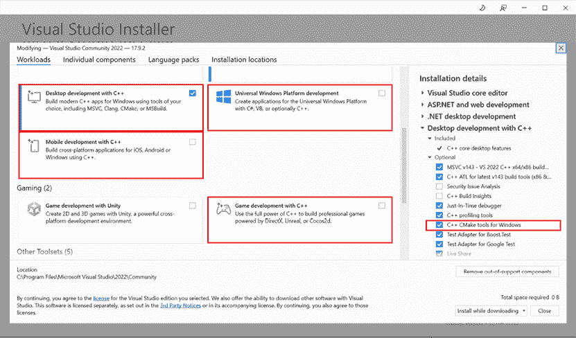

# 第三章：在流行的 IDE 中使用 CMake

编程既是一门艺术，也是一项深具技术性的过程，正如我们都深知的，它是非常困难的。因此，我们应该尽可能优化这一过程。虽然我们很少能通过简单的开关来获得更好的结果，但使用**集成开发环境（IDE）**绝对是其中少数的例外之一。

如果你以前没有使用过合适的 IDE（或者你认为像 Emacs 或 Vim 这样的文本处理器已经是你能得到的最好工具），那么本章就是为你准备的。如果你是经验丰富的专业人士，已经熟悉这个话题，你可以将本章作为当前热门选择的快速概览，或者考虑换一个工具，甚至更好的是，确认你当前使用的工具就是最好的选择。

本章以强调为新手提供可访问性的方式，轻松介绍了选择 IDE 这一关键问题。我们将讨论为什么你需要一个 IDE 以及如何选择最适合你需求的 IDE。虽然市场上有许多选择，但像往常一样，有些选择显然比其他的更好。不幸的是，这并不是一个通用的、一刀切的解决方案。许多因素会影响你选择合适 IDE 后的生产力水平。我们将讨论一些在某些规模的组织中可能很重要的考虑因素，确保你能够掌握细微差别而不至于陷入复杂性。接下来，我们会快速介绍工具链，在那里我们将讨论可用的选择。

然后，我们将重点介绍几种流行 IDE 的独特特点，如复杂的 CLion、灵活的 Visual Studio Code，以及强大的 Visual Studio IDE。每一节都将展示这些环境的优点和高级功能，帮助你了解如何迈出使用 IDE 的第一步。此外，我们还将介绍一个从众多功能中主观挑选出的高级功能，让你知道如果决定使用这套工具时，可能会遇到哪些亮点。

本章将涵盖以下主要内容：

+   了解集成开发环境（IDE）

+   从 CLion IDE 开始

+   从 Visual Studio Code 开始

+   从 Visual Studio IDE 开始

# 了解集成开发环境（IDE）

在本节中，我们将讨论 IDE 及其如何显著提高开发速度和代码质量。让我们先为那些对这个话题不熟悉的人解释一下什么是 IDE。

为什么以及如何选择一个 IDE？IDE（集成开发环境）是一种综合工具，它将各种专业工具结合起来，以简化软件开发过程。创建一个专业项目的过程包含多个步骤：设计、编码、构建、测试、打包、发布和维护。每个步骤都包含许多小任务，复杂性可能会让人感到压倒性。IDE 提供了解决方案，通过提供一个由 IDE 创建者策划和配置的工具平台，使你能够无缝使用这些工具，而无需为每个项目单独设置它们。

IDE 主要围绕代码编辑器、编译器和调试器设计。它们旨在提供足够的集成，使你能够编辑代码、立即编译并运行带有调试器的代码。IDE 可以包括构建工具链，或允许开发人员选择自己喜欢的编译器和调试器。编辑器通常是软件的核心部分，但通常可以通过插件大大扩展功能，例如代码高亮、格式化等。

更高级的 IDE 提供了非常复杂的功能，如热重载调试（在 Visual Studio 2022 中可用；继续阅读以了解更多）。这个功能允许你在调试器中运行代码，编辑它，并继续执行而无需重新启动程序。你还会发现重构工具，可以重命名符号或将代码提取到单独的函数中，以及静态分析工具，可以在编译之前识别错误。此外，IDE 还提供了与 Git 和其他版本控制系统的工具，这些工具对于解决冲突等问题非常有价值。

我相信你现在可以看到，早期学习如何使用 IDE 并在组织中标准化这种使用方式是多么有益。接下来，让我们了解一下为什么选择一个*适合你的*IDE 如此重要。

## 选择 IDE

有很多代码编辑器正处于被社区认定为功能完整的 IDE 的边缘。在选择一个具体的 IDE 之前，建议你先做一些研究，特别是考虑到当前软件发布周期的节奏以及该领域的快速变化。

在我几年的企业经验中，IDE 提供的功能足够吸引人，让人从一个 IDE 切换到另一个 IDE 的情况并不常见。开发人员的习惯几乎是第二天性，不能忽视。记住，一旦你在某个 IDE 中感到舒适，它很可能会成为你未来相当长时间的首选工具。这就是为什么你仍然会看到开发者使用 Vim（一个 1991 年发布的基于控制台的文本编辑器），并通过一堆插件扩展它，使它与现代的、基于 GUI 的 IDE 一样强大。所以不必感到压力。

程序员选择一个 IDE 而不是另一个 IDE 的原因各不相同；其中一些原因非常重要（速度、可靠性、全面性、完整性），而另一些则…没那么重要。我想分享一下我对这个选择的主观看法，希望你也能觉得有用。

### 选择一个全面的 IDE

如果你刚刚开始，你可能会考虑使用一个简单的文本编辑器并通过运行几个命令来构建代码。这种方法完全可行，尤其是在你尝试理解基础知识时（我鼓励你在本书中使用实际命令来跟踪你的进度）。它还帮助你理解没有 IDE 时初学者可能遇到的情况。

另一方面，IDE 是为了特定的目的而创建的。它们简化了开发人员在项目生命周期中处理的众多流程，这非常有价值。虽然最初可能会让人感到不知所措，但选择一个包括所有必要功能的综合 IDE。确保它尽可能完整，但要留意成本，因为 IDE 对于小型企业或个人开发者来说可能非常昂贵。这是一个在手动管理花费的时间和 IDE 提供的功能成本之间的平衡。

无论价格如何，总是选择一个有强大社区支持的 IDE，以便在遇到问题时获得帮助。浏览社区论坛和像[StackOverflow.com](http://StackOverflow.com)这样的热门问答网站，看看用户是否能得到他们问题的答案。此外，选择一个由有声望的公司积极开发的 IDE。你不想浪费时间在一个已经很久没有更新、可能会在不久的将来被弃用或停产的工具上。例如，不久前，GitHub 创建的编辑器 Atom，在发布 7 年后被停用。

### 选择一个在你的组织中得到广泛支持的 IDE

出乎意料的是，这可能并不符合每个开发者的偏好。你可能已经习惯了来自大学、之前工作或个人项目中的其他工具。正如前面提到的，这样的习惯可能会诱使你忽视公司的建议，固守自己熟悉的工具。抵制这种诱惑。随着时间的推移，这样的选择会变得越来越具有挑战性。根据我在爱立信、亚马逊和思科的经历，只有一次，我努力配置和维护一个非标准 IDE 是值得的。那是因为我成功获得了足够的组织支持，能够共同解决问题。

你的主要目标应该是编写代码，而不是在一个不受支持的 IDE 中挣扎。学习推荐的软件可能需要一些努力，但它所需的精力少于违背常规的做法（是的，Vim 输了这一战；是时候继续前进了）。

### 不要根据目标操作系统和平台选择 IDE

你可能认为如果你在为 Linux 开发软件，你需要使用一台 Linux 机器和基于 Linux 的 IDE。然而，C++ 是一种可移植的语言，这意味着只要你编写正确，它应该能够在任何平台上以相同的方式编译和运行。当然，你可能会遇到库的问题，因为并不是所有的库都是默认安装的，有些可能是特定于你的平台的。

严格遵循目标平台并非总是必要的，有时甚至可能适得其反。例如，如果你要针对一个较旧或**长期支持**（**LTS**）版本的操作系统进行开发，你可能无法使用最新的工具链版本。如果你希望在不同于目标平台的环境下进行开发，是完全可以实现的。

在这种情况下，可以考虑**交叉编译**或**远程开发**。交叉编译是指使用专门的工具链，使得在一个平台（如 Windows）上运行的编译器能够为另一个平台（如 Linux）生成目标文件。这种方法在行业中广泛使用，并且得到 CMake 的支持。或者，我推荐远程开发，在这种情况下，你将代码发送到目标机器，并在那里使用本地工具链进行构建。这种方法得到了许多 IDE 的支持，并且提供了几个好处，我们将在下一节中进行探讨。

### 选择一款支持远程开发的 IDE

虽然这不应是你主要的选择标准，但在满足其他要求后，考虑 IDE 是否支持远程开发是很有帮助的。随着时间的推移，即便是经验丰富的开发者也会遇到需要不同目标平台的项目，这可能是由于团队、项目甚至公司发生变化。

如果你首选的 IDE 支持远程开发，你可以继续使用它，利用在不同操作系统上编译和调试代码的能力，并在 IDE 的 GUI 中查看结果。远程开发相比交叉编译的主要优势是其集成的调试支持，提供了一个更加简洁的过程，而无需进行 CMake 项目级别的配置。此外，公司通常会提供强大的远程机器，让开发者可以使用更便宜、轻量级的本地设备。

当然，有人认为交叉编译提供了更大的开发环境控制，使得可以为测试做临时性更改。它不需要带宽进行代码传输，支持低端的互联网连接或离线工作。然而，考虑到大多数软件开发都需要上网获取信息，这可能就不是一个特别重要的优势。使用像 Docker 这样的虚拟化环境可以运行本地生产副本并设置远程开发连接，提供安全性、可定制性，以及构建和部署容器的能力。

这里提到的考虑因素稍微倾向于在大型公司工作的情况，在这些公司中，事务进展较慢，且很难做出高影响力的改变。如果你决定根据你的使用场景优先考虑其他 IDE 的方面，这些建议并不否定使用 CMake 时能获得一个完全完整的体验的可能性。

## 安装工具链

正如我们之前讨论的，IDE 整合了所有必要的工具来简化软件开发。这个过程的一个关键部分是构建二进制文件，有时在后台或即时构建，以为开发人员提供附加信息。工具链是由编译器、链接器、归档工具、优化器、调试器和 C++标准库实现等工具组成的集合。它们还可能包括其他实用的工具，如`bash`、`make`、`gawk`、`grep`等，这些工具用于构建程序。

一些 IDE 自带工具链或工具链下载器，而其他 IDE 则没有。最好直接运行已安装的 IDE，并检查是否能够编译一个基础的测试程序。CMake 通常会在配置阶段默认执行此操作，大多数 IDE 会在初始化新项目时作为一部分执行此过程。如果此过程失败，IDE 或操作系统的包管理器可能会提示你安装所需的工具。只需按照提示操作，因为这个流程通常已经做好了充分准备。

如果没有提示，或者如果你想使用特定的工具链，这里有一些根据平台不同的选项：

+   **GNU GCC** ([`gcc.gnu.org/`](https://gcc.gnu.org/)) 用于 Linux、Windows（通过 MinGW 或 Cygwin）、macOS 及其他多个平台。GCC 是最受欢迎且广泛使用的 C++编译器之一，支持多种平台和架构。

+   **Clang/LLVM** ([`clang.llvm.org/`](https://clang.llvm.org/)) 用于 Linux、Windows、macOS 等多个平台。Clang 是 C、C++和 Objective-C 编程语言的编译器前端，利用 LLVM 作为其后端。

+   **Microsoft Visual Studio/MSVC** ([`visualstudio.microsoft.com/`](https://visualstudio.microsoft.com/)) 主要用于 Windows，同时通过 Visual Studio Code 和 CMake 提供跨平台支持。MSVC 是由微软提供的 C++编译器，通常在 Visual Studio IDE 中使用。

+   **MinGW-w64** ([`mingw-w64.org/`](http://mingw-w64.org/)) 用于 Windows。MinGW-w64 是原 MinGW 项目的一个改进版，旨在提供对 64 位 Windows 和新 API 的更好支持。

+   **Apple Clang** ([`developer.apple.com/xcode/cpp/`](https://developer.apple.com/xcode/cpp/)) 用于 macOS、iOS、iPadOS、watchOS 和 tvOS。Apple 版 Clang，经过针对 Apple 硬件和软件生态系统的优化，已集成在 Xcode 中。

+   **Cygwin** ([`www.cygwin.com/`](https://www.cygwin.com/)) 用于 Windows。Cygwin 为 Windows 提供了一个与 POSIX 兼容的环境，允许使用 GCC 和其他 GNU 工具。

如果你想快速开始，而不深入研究每个工具链的细节，你可以按照我的个人偏好：如果 IDE 没有提供工具链，可以选择在 Windows 上使用 MinGW，在 Linux 上使用 Clang/LLVM，在 macOS 上使用 Apple Clang。每种工具链都非常适合其主要平台，并通常提供最佳体验。

## 使用本书的示例与 IDE 配合

本书附带了一套丰富的 CMake 项目示例，已上传至官方 GitHub 仓库，链接如下：[`github.com/PacktPublishing/Modern-CMake-for-Cpp-2E`](https://github.com/PacktPublishing/Modern-CMake-for-Cpp-2E)。

自然地，当我们探索 IDE 的主题时，出现了一个问题：我们如何在这里介绍的所有 IDE 中使用这个仓库呢？嗯，我们需要认识到，这本教你如何创建专业项目的书本身并不是一个专业项目。它是一个由多个不同完成度的项目组成的集合，在可能的情况下做了适当的简化。不幸的是（或者说，或许幸运的是？），IDE 并不是为加载成百上千的项目并方便管理它们而设计的。它们通常将功能集中于加载一个正在编辑的项目。

这让我们处于一个有些尴尬的境地：使用 IDE 来浏览示例集实际上很困难。当你使用 IDE 加载示例集时，通过选择示例目录来打开，绝大多数 IDE 会检测到多个 `CMakeLists.txt` 文件，并要求你选择一个。选定后，通常会执行初始化过程，写入临时文件，基本上会运行 CMake 配置和生成阶段，以便让项目进入可以构建的状态。正如你可能猜到的那样，这只对选中的 `CMakeLists.txt` 文件所在的示例有效。大多数 IDE 确实提供在工作区中切换不同目录（或项目）的方法，但这可能没有我们希望的那样简单直接。

如果你在这方面遇到困难，有两个选择：要么不使用 IDE 来构建示例（而是使用控制台命令），要么每次都将示例加载到一个新的项目中。如果你想练习命令，我推荐第一个选项，因为这些命令将来可能会派上用场，并且能帮助你更好地理解幕后发生了什么。这通常是构建工程师的一个不错选择，因为这些知识将被频繁使用。另一方面，如果你是在做单一项目，主要作为开发者关注代码的业务层面，或许尽早使用 IDE 是最佳选择。无论如何，选择一个并不妨碍你偶尔使用另一个。

说完这些，让我们集中精力回顾今天的顶级 IDE，看看哪个最适合你。无论你是否在公司工作，它们都会为你提供很好的服务。

# 从 CLion IDE 开始

CLion 是一款付费的跨平台 IDE，适用于 Windows、macOS 和 Linux，由 JetBrains 开发。没错——这款软件是基于订阅的；从 2024 年初开始，你可以以 $99.00 获得一年的个人使用许可。大型组织支付更多费用，初创公司支付较少。如果你是学生或发布开源项目，可以获得免费许可证。此外，还有 30 天的试用期来测试软件。这是本列表中唯一不提供“社区版”或简化版免费版本的 IDE。尽管如此，这仍然是一款由知名公司开发的强大软件，可能非常值得这个价格。

*图 3.1* 显示了 IDE 在浅色模式下的界面（深色模式是默认选项）：


图 3.1：CLion IDE 的主窗口

正如你所看到的，这是一款功能全面的 IDE，能够应对你可能遇到的任何需求。接下来我们来聊聊它的独特之处。

## 你可能会喜欢它的原因

与其他选择不同，C 和 C++ 是 CLion 支持的第一个也是唯一的编程语言。这个 IDE 的许多功能专门设计用于支持这一环境，并符合 C/C++ 的思维模式。我们将其他 IDE 的功能与 CLion 进行对比时，这一点尤为明显：代码分析、代码导航、集成调试器和重构工具在像 Visual Studio IDE 这样的竞争软件中都有。然而，它们并没有像 CLion 一样深入且强大地面向 C/C++。当然，这一点很难客观衡量。

不管怎样，CMake 已在 CLion 中完全集成，并且是该 IDE 中项目格式的首选。不过，像 Autotools 和 Makefile 项目这样的替代方案目前正处于早期支持阶段，可以用来最终迁移到 CMake。值得注意的是，CLion 原生支持 CMake 的 CTest，并支持多种单元测试框架，并提供专门的流程来生成代码、运行测试、收集和展示结果。你可以使用 Google Test、Catch、Boost.Test 和 doctest。

我特别喜欢的一个功能是能够与 Docker 配合使用，在容器中开发 C++ 程序——稍后会详细介绍。与此同时，让我们看看如何开始使用 CLion。

## 踏出你的第一步

从官方网站下载 CLion（[`www.jetbrains.com/clion`](https://www.jetbrains.com/clion)）后，你可以按照你所使用平台的常规安装流程进行安装。CLion 在 Windows（*图 3.2*）和 macOS（*图 3.3*）上都提供了一个足够直观的可视化安装程序。


图 3.2：Windows 上的 CLion 安装设置


图 3.3：macOS 上的 CLion 安装设置

在 Linux 上，你需要解压下载的档案并运行安装脚本：

```cpp
tar -xzf CLion-<version>.tar.gz
./CLion-<version>/bin/CLion.sh 
```

这些说明可能已经过时，请确保通过 CLion 网站确认最新信息。

在第一次运行时，你将被要求提供许可证代码或启动 30 天免费试用。选择第二个选项将允许你尝试该 IDE，并决定它是否适合你。接下来，你将能够创建一个新项目并选择目标 C++ 版本。之后，CLion 将自动检测可用的编译器和 CMake 版本，并尝试构建一个测试项目，以确认所有设置正确。在某些平台（如 macOS）上，你可能会收到自动提示，要求根据需要安装开发者工具。在其他平台上，你可能需要自行设置并确保这些工具在 `PATH` 环境变量中可用。

接下来，确保根据你的需求配置工具链。工具链是按项目配置的，所以请创建一个默认的 CMake 项目。然后，导航到 **设置**/**首选项** (*Ctrl*/*Command* + *Alt* + *S*)，选择 **构建、执行、部署** > **CMake**。在此标签页中，你可以配置构建配置文件（*图 3.3*）。如果需要，你可以添加一个 `Release` 配置文件，以便在不带调试符号的情况下构建优化后的文件。要添加该配置文件，只需点击配置文件列表上方的加号图标。CLion 会为你创建一个默认的 `Release` 配置文件。你可以通过主窗口顶部的下拉菜单在不同配置文件之间切换。

现在，你可以简单地按 *F9* 编译并运行程序，同时附加调试器。之后，阅读 CLion 的官方文档，因为还有很多有用的功能值得探索。我想向你介绍我最喜欢的功能之一：调试器。

## 高级功能：增强版调试器

CLion 的调试能力确实是前沿的，特别是为 C++ 设计的。我非常高兴发现了其中一个最新的功能——CMake 调试，它包括许多标准调试功能：代码逐步调试、断点、监视、内联值探索等。当某些事情无法按预期工作时，能够在不同作用域（缓存、`ENV` 和当前作用域）中查看变量是极其方便的。

对于 C++ 调试，你将获得由**GNU 项目调试器**（**GDB**）提供的许多标准功能，如汇编视图、断点、逐步调试、监视点等，但也有一些重要的增强功能。在 CLion 中，你会发现一个并行堆栈视图，它可以让你以图形化的方式查看所有线程，并显示每个线程的当前堆栈帧。此外，还有一个高级内存视图功能，允许你查看正在运行的程序在 RAM 中的布局，并即时修改内存。CLion 提供了多个其他工具，帮助你了解程序的运行情况：寄存器视图、代码反汇编、调试控制台、核心转储调试、任意可执行文件的调试等。

作为补充，CLion 拥有一项非常出色的**评估表达式**功能，它可以大显身手，甚至允许在程序执行过程中修改对象。只需右键点击一行代码，并从菜单中选择此功能。

关于 CLion 的介绍就到这里；现在是时候看看另一个 IDE 了。

# 开始使用 Visual Studio Code

**Visual Studio Code**（**VS Code**）是由 Microsoft 开发的一款免费的跨平台集成开发环境，适用于 Windows、macOS 和 Linux。不要将它与另一款 Microsoft 产品——Visual Studio IDE 混淆（通常以发布年份命名，例如 Visual Studio 2022）。

VS Code 因其庞大的扩展生态系统和对数百种编程语言的支持而受到青睐（据估计，支持的语言超过 220 种！）。当 GitHub 被 Microsoft 收购时，VS Code 被推出作为 Atom 的替代品。

该 IDE 的整体设计非常出色，正如*图 3.4*所示。


图 3.4：VS Code 的主窗口

现在，让我们来看看是什么让 VS Code 如此特别。

## 为什么你可能会喜欢它

C++虽然不是 VSC 支持的语言优先项，但由于有许多复杂的语言扩展，它离榜单前列很近。这个权衡带来了在同一环境下按需切换多种语言的能力。

使用这个工具需要一些学习曲线，因为大多数扩展遵循基础 UI 功能，而不是实现独立的高级接口。许多功能可以通过命令面板访问（按*F1*键即可）。命令面板需要你输入命令名称，而不是点击图标或按钮。为了保持 VSC 简洁、快速且免费，这是一个合理的取舍。事实上，这款 IDE 加载速度非常快，即使在我不进行项目开发时，我也更愿意将它用作通用文本编辑器。

尽管如此，VS Code 凭借庞大的优秀扩展库而真正强大，其中绝大多数都是免费的。对于 C++和 CMake，特别提供了专用扩展，接下来我们将看看如何配置它们。

## 开始你的第一步

VSC 可以从官方网站获取：[`code.visualstudio.com/`](https://code.visualstudio.com/)。该网站提供了适用于 Windows 和 macOS 的下载链接，还涵盖了多个 Linux 发行版：Debian、Ubuntu、Red Hat、Fedora 和 SUSE。根据你平台的常规安装流程安装软件。之后，你可以通过访问**扩展市场**（*Ctrl*/*Command + Shift + X*）来安装一系列扩展。以下是推荐的初始扩展：

+   Microsoft 的 C/C++

+   Microsoft 的 C/C++扩展包

+   twxs 的 CMake

+   Microsoft 的 CMake 工具

它们将提供常规的代码高亮、编译、运行和调试代码的能力，但你可能需要自己安装工具链。通常，当你开始打开相关文件时，VS Code 会在弹出窗口中建议安装扩展，因此你不一定需要自己去找。

如果你参与远程项目，我还建议安装 **Remote – SSH by Microsoft** 扩展，因为这将使体验更加连贯和舒适；该扩展不仅负责文件同步，还能通过附加到远程机器上的调试器来启用远程调试。

然而，还有一个更有趣的扩展，它改变了处理项目的方式；让我们看看如何改变。

## 高级功能：开发容器

如果你将应用程序部署到生产环境中，无论是传输已编译的工件还是运行构建过程，确保所有依赖项都已存在至关重要。否则，你将遇到各种问题。即便所有依赖项都已考虑到，不同的版本或配置可能会导致你的解决方案在开发环境或预发布环境中表现不同。我在很多情况下都有过类似的经历。在虚拟化普及之前，处理环境问题就是生活的一部分。

随着像 Docker 这样的轻量级容器的引入，一切变得更加简单。突然间，你能够运行一个精简的操作系统，并将服务隔离到自己的空间。这种隔离使得所有依赖项都可以与容器一起打包，从而解除了开发者的一大困扰。

直到最近，在容器中开发涉及手动构建、运行并通过 IDE 与远程会话连接到容器。这个过程并不难，但它需要手动操作，而这些操作可能会因不同开发者而有所不同。

近年来，微软发布了一个开源标准——开发容器（[`containers.dev/`](https://containers.dev/)），以帮助解决这个小小的不便。该规范主要由一个`devcontainer.json`文件组成，你可以将其放入你的项目仓库，指示 IDE 如何在容器中设置开发环境。

要使用此功能，只需安装 **Dev Containers by Microsoft** 扩展，并将其指向一个准备好的项目的仓库。如果你不介意修改主`CMakeLists.txt`，可以尝试使用本书的仓库：

git@github.com:PacktPublishing/Modern-CMake-for-Cpp-2E.git

我可以确认，其他 IDE，如 CLion，正在采用这一标准，所以如果你面临上述情况，采用这个标准似乎是一个不错的做法。接下来是微软家族的下一个产品。

# 从 Visual Studio IDE 开始

**Visual Studio** (**VS**) 是一款由微软开发的适用于 Windows 的 IDE。曾经也有适用于 macOS 的版本，但将在 2024 年 8 月停用。需要特别区分的是，它与微软的 *另一款 IDE* VS Code 是不同的。

VS 提供几种版本：社区版、专业版和企业版。社区版是免费的，适用于最多五个用户的公司。成熟的公司需要支付许可费用，费用从每个用户每月 $45 起。*图 3.5* 显示了 VS 社区版的界面：


图 3.5：VS 2022 的主窗口

像本章讨论的其他 IDE 一样，如果你更喜欢，可以启用暗黑模式。接下来，让我们看看这款 IDE 的一些值得注意的功能。

## 你可能会喜欢它的原因

这款 IDE 与 VS Code 共享许多特性，提供了类似的体验，但在更精致的形式下。整个套件功能丰富，许多功能都利用了 GUI、向导和可视化元素。这些功能大多可以开箱即用，而不是通过扩展来实现（尽管仍然有一个庞大且丰富的包市场，供你获取额外功能）。换句话说，它就像 VSC，但功能更为先进。

根据版本的不同，你的测试工具将涵盖广泛的测试类型：单元测试、性能测试、负载测试、手动测试、测试资源管理器、测试覆盖率、IntelliTest 和代码分析工具。尤其是分析工具，它是一个非常有价值的工具，并且在社区版中也有提供。

如果你正在设计 Windows 桌面应用程序，VS 提供了可视化编辑器和大量组件。对于 **通用 Windows 平台 (UWP)**，它有着广泛的支持，UWP 是 Windows 10 中引入的 Windows 应用程序 UI 标准。该支持使得 UI 设计时尚现代，且对适应性控件进行了深度优化，可以很好地适配不同屏幕。

另一个值得一提的地方是，尽管 VS 是一款仅支持 Windows 的 IDE，但你仍然可以开发针对 Linux 和移动平台（Android 和 iOS）的项目。它还支持使用 Windows 原生库和 Unreal Engine 的游戏开发者。

想亲自体验它是如何工作的吗？下面是开始使用的方法。

## 开始你的第一步

这款 IDE 仅适用于 Windows，并遵循标准的安装流程。首先从 [`visualstudio.microsoft.com/free-developer-offers/`](https://visualstudio.microsoft.com/free-developer-offers/) 下载安装程序。运行安装程序后，你将被要求选择版本（社区版、专业版或企业版）并选择你需要的工作负载：



图 3.6：VS IDE 安装器窗口

工作负载实际上是一些功能集，它们允许 VS 支持特定语言、环境或程序格式。一些工作负载包括 Python、Node.js 或 .NET。当然，我们更关注与 C++ 相关的工作负载（*图 3.6*）；针对不同使用场景，提供了广泛的支持：

+   使用 C++ 进行桌面开发

+   通用 Windows 平台开发

+   使用 C++ 进行游戏开发

+   使用 C++ 进行移动开发

+   使用 C++ 进行 Linux 开发

选择适合你所需应用的选项并点击**安装**。不必担心是否安装了所有选项——你可以随时通过重新运行安装程序来修改选择。如果你决定更精确地配置工作负载组件，请确保保留**Windows 的 C++ CMake 工具**或**Linux 的 C++ CMake 工具**选项，以便获得 CMake 支持。

安装完成后，你可以启动 IDE 并在启动窗口中选择**创建新项目**。根据你之前安装的工作负载，系统会展示多个模板。如果要使用 CMake，选择**CMake 项目**模板。其他选项不一定会使用它。在创建项目后，你可以通过点击窗口顶部的绿色播放按钮来启动它；代码会编译，并且你会看到基本程序执行后的输出：

```cpp
Hello CMake. 
```

现在，你已经准备好在 Visual Studio 中使用 CMake 了。

## 高级功能：Hot Reload 调试

尽管运行 Visual Studio 可能会消耗更多资源并且启动时间较长，但它提供了许多无可匹敌的功能。其中一个重大变化就是 Hot Reload。它的工作方式如下：打开一个 C++ 项目，附加调试器启动，修改代码文件，点击**Hot Reload**按钮（或*Alt + F10*），你的更改会立即反映到正在运行的应用程序中，同时保持应用程序的状态。

为确保启用 Hot Reload 支持，请在**项目 > 属性 > C/C++ > 常规**菜单中设置以下两个选项：

+   **调试信息格式**必须设置为**程序数据库用于编辑和继续 /ZI**

+   **启用增量链接**必须设置为**是 /INCREMENTAL**

Hot Reload 的幕后机制可能看起来像是魔法，但它是一个非常实用的功能。虽然存在一些限制，比如全局/静态数据的更改、对象布局的调整，或是“时间旅行”式的更改（比如修改已经构造好的对象的构造函数）。

你可以在官方文档中找到更多关于 Hot Reload 的信息，链接地址：[`learn.microsoft.com/en-us/visualstudio/debugger/hot-reload`](https://learn.microsoft.com/en-us/visualstudio/debugger/hot-reload)。

本章节总结了三大主要的 IDE。虽然初学时可能会感到学习曲线陡峭，但我保证，当你进入更高级的任务时，投入的学习努力会很快得到回报。

# 总结

本章深入探讨了如何使用 IDE 来优化编程过程，特别关注那些与 CMake 深度集成的 IDE。它为初学者和经验丰富的专业人士提供了全面的指南，详细说明了使用 IDE 的好处以及如何选择最适合个人或组织需求的 IDE。

我们首先讨论了 IDE 在提升开发速度和代码质量中的重要性，解释了什么是 IDE 以及它如何通过整合代码编辑器、编译器和调试器等工具，简化软件开发中的各个步骤。接下来，我们简要提醒了工具链的重要性，解释了如果系统中没有安装工具链则必须进行安装，并列出了最常见的选择。

我们讨论了如何开始使用 CLion 及其独特功能，并深入了解了它的调试能力。VS Code 是微软推出的免费跨平台集成开发环境（IDE），因其庞大的扩展生态系统和对众多编程语言的支持而广受认可。我们引导您完成了初始设置及其关键扩展的安装，并介绍了一项名为 Dev Containers 的高级功能。专为 Windows 设计的 VS IDE 提供了一个精致且功能丰富的环境，满足各种用户需求。我们还涵盖了设置过程、关键功能以及先进的 Hot Reload 调试功能。

每个 IDE 部分都提供了关于为什么选择特定 IDE 的见解，启动步骤，以及一个突显该 IDE 特点的高级功能。我们还强调了远程开发支持的概念，突出了它在行业中的日益重要性。

总结来说，本章作为程序员了解和选择 IDE 的基础指南，提供了主要选项的清晰概述，介绍了它们的独特优势，以及如何有效地与 CMake 配合使用，以提高编码效率和项目管理水平。在下一章中，我们将学习使用 CMake 设置项目的基础知识。

# 进一步阅读

有关本章内容的更多信息，您可以参考以下资源：

+   Qt Creator IDE，另一个支持 CMake 的选项：[`www.qt.io/product/development-tools`](https://www.qt.io/product/development-tools)

+   Eclipse IDE 适用于 C/C++ 开发者，也支持 CMake：[`www.eclipse.org/downloads/packages/release/2023-12/r/eclipse-ide-cc-developers`](https://www.eclipse.org/downloads/packages/release/2023-12/r/eclipse-ide-cc-developers)

+   macOS 的 Xcode 也可以与 CMake 一起使用：[`medium.com/practical-coding/migrating-to-cmake-in-c-and-getting-it-working-with-xcode-50b7bb80ae3d`](https://medium.com/practical-coding/migrating-to-cmake-in-c-and-getting-it-working-with-xcode-50b7bb80ae3d)

+   CodeLite 是另一个选择，感谢其 CMake 插件：[`docs.codelite.org/plugins/cmake/`](https://docs.codelite.org/plugins/cmake/)

# 加入我们的 Discord 社区

加入我们社区的 Discord 频道，与作者及其他读者进行讨论：

[`discord.com/invite/vXN53A7ZcA`](https://discord.com/invite/vXN53A7ZcA)


