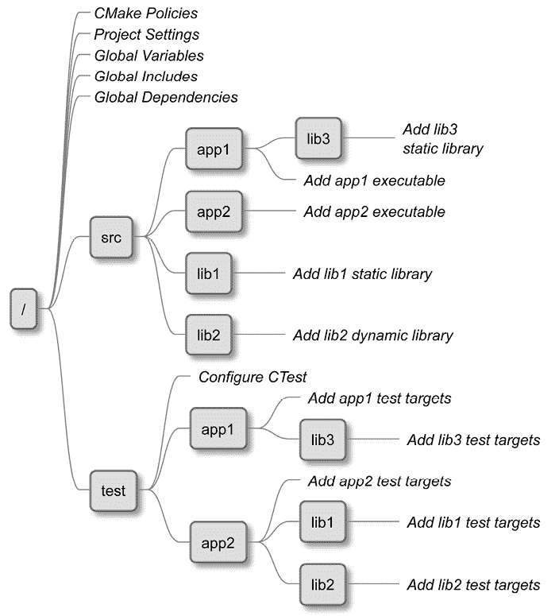

# 第四章：设置你的第一个 CMake 项目

现在，我们已经收集了足够的信息，可以开始讨论 CMake 的核心功能：*构建项目*。在 CMake 中，**项目**包含了所有源文件以及管理将我们的解决方案付诸实践所需的配置。配置开始时需要执行所有的检查：验证目标平台是否受支持，确保所有必要的依赖项和工具都已存在，并确认所提供的编译器是否与所需的功能兼容。  

一旦初步检查完成，CMake 将生成一个针对所选构建工具量身定制的构建系统。然后，构建系统将被执行，这意味着编译源代码并将其与相关的依赖项链接在一起，生成最终的构件。  

生成的构件可以通过不同的方式分发给用户。它们可以作为二进制包直接与用户共享，允许用户通过包管理器将其安装到他们的系统中。或者，它们可以作为单个可执行安装程序进行分发。此外，最终用户也可以通过访问开源仓库中的共享项目来自己创建这些构件。在这种情况下，用户可以利用 CMake 在自己的机器上编译项目，然后再进行安装。  

充分利用 CMake 项目可以显著提升开发体验以及生成代码的整体质量。通过利用 CMake 的强大功能，许多繁琐的任务可以被自动化，例如构建后执行测试、运行代码覆盖率检查器、格式化工具、验证器、静态分析工具以及其他工具。这种自动化不仅节省了时间，还确保了开发过程中的一致性，并促进了代码质量的提升。  

为了充分发挥 CMake 项目的优势，我们首先需要做出一些关键决策：如何正确配置整个项目，如何划分项目以及如何设置源代码树，以确保所有文件都能整齐地组织在正确的目录中。通过从一开始就建立一个连贯的结构和组织，CMake 项目可以在开发过程中得到有效管理和扩展。  

接下来，我们将了解项目的构建环境。我们将探讨诸如我们使用的架构、可用的工具、它们支持的功能以及我们正在使用的语言标准等内容。为了确保一切都同步，我们将编译一个测试用的 C++ 文件，并查看我们选择的编译器是否符合我们为项目设定的标准要求。这一切都旨在确保我们的项目、所使用的工具以及选择的标准能够顺利配合。  

在本章中，我们将涵盖以下主要内容：  

+   理解基本的指令和命令  

+   划分你的项目  

+   思考项目结构  

+   确定环境作用域  

+   配置工具链  

+   禁用源代码内构建  

# 技术要求  

你可以在 GitHub 上找到本章中出现的代码文件，链接为 [`github.com/PacktPublishing/Modern-CMake-for-Cpp-2E/tree/main/examples/ch04`](https://github.com/PacktPublishing/Modern-CMake-for-Cpp-2E/tree/main/examples/ch04)。

要构建本书中提供的示例，始终使用推荐的命令：

```cpp
cmake -B <build tree> -S <source tree>
cmake --build <build tree> 
```

请确保将占位符 `<build tree>` 和 `<source tree>` 替换为适当的路径。提醒一下：**build tree** 是目标/输出目录的路径，**source tree** 是源代码所在的路径。

# 理解基本的指令和命令

在*第一章*，*CMake 入门*中，我们已经看过了一个简单的项目定义。让我们再来回顾一下。它是一个包含几个配置语言处理器命令的 `CMakeLists.txt` 文件的目录：

**chapter01/01-hello/CMakeLists.txt**

```cpp
cmake_minimum_required(VERSION 3.26)
project(Hello)
add_executable(Hello hello.cpp) 
```

在同一章节中，在名为*项目文件*的部分中，我们学习了一些基本命令。这里我们将深入解释它们。

## 指定最低的 CMake 版本

在项目文件和脚本的最顶部使用 `cmake_minimum_required()` 命令非常重要。该命令不仅验证系统是否具有正确版本的 CMake，还隐式触发另一个命令 `cmake_policy(VERSION)`，该命令指定用于项目的策略。这些策略定义了 CMake 中命令的行为，它们是在 CMake 发展的过程中引入的，以适应支持的语言和 CMake 本身的变化和改进。

为了保持语言的简洁，CMake 团队每当出现不兼容的更改时，就引入了新的策略。每个策略启用了与该更改相关的新行为。这些策略确保项目能够适应 CMake 不断发展的特性和功能，同时保持与旧代码库的兼容性。

通过调用 `cmake_minimum_required()`，我们告诉 CMake 需要根据参数中提供的版本应用默认策略。当 CMake 升级时，我们无需担心它会破坏我们的项目，因为新版本附带的新策略不会被启用。

策略可以影响 CMake 的各个方面，包括其他重要命令，如 `project()`。因此，重要的是在 `CMakeLists.txt` 文件中首先设置你正在使用的版本。否则，你将收到警告和错误。

每个 CMake 版本都会引入大量策略。然而，除非你在将旧项目升级到最新 CMake 版本时遇到问题，否则不必深入了解这些策略的细节。在这种情况下，建议参考官方文档，获取有关策略的全面信息和指导：[`cmake.org/cmake/help/latest/manual/cmake-policies.7.html`](https://cmake.org/cmake/help/latest/manual/cmake-policies.7.html)。

## 定义语言和元数据

即使从技术上讲，`project()` 命令并不一定要放在 `cmake_minimum_required()` 之后，但建议将其放在该位置。这样做可以确保我们在配置项目时使用正确的策略。我们可以使用它的两种形式之一：

```cpp
project(<PROJECT-NAME> [<language-name>...]) 
```

或者：

```cpp
project(<PROJECT-NAME>
        [VERSION <major>[.<minor>[.<patch>[.<tweak>]]]]
        [DESCRIPTION <project-description-string>]
        [HOMEPAGE_URL <url-string>]
        [LANGUAGES <language-name>...]) 
```

我们需要指定 `<PROJECT-NAME>`，但其他参数是可选的。调用此命令将隐式设置以下变量：

```cpp
PROJECT_NAME
CMAKE_PROJECT_NAME (only in the top-level CMakeLists.txt)
PROJECT_IS_TOP_LEVEL, <PROJECT-NAME>_IS_TOP_LEVEL
PROJECT_SOURCE_DIR, <PROJECT-NAME>_SOURCE_DIR
PROJECT_BINARY_DIR, <PROJECT-NAME>_BINARY_DIR 
```

支持哪些语言？相当多。而且你可以同时使用多个语言！以下是你可以用来配置项目的语言关键字列表：

+   `ASM, ASM_NASM, ASM_MASM, ASMMARMASM, ASM-ATT`: 汇编语言的方言

+   `C`: C

+   `CXX`: C++

+   `CUDA`: Nvidia 的统一计算设备架构

+   `OBJC`: Objective-C

+   `OBJCXX`: Objective-C++

+   `Fortran`: Fortran

+   `HIP`: 跨平台异构计算接口（适用于 Nvidia 和 AMD 平台）

+   `ISPC`: 隐式 SPMD 程序编译器语言

+   `CSharp`: C#

+   `Java`: Java（需要额外的步骤，请参阅官方文档）

CMake 默认启用 C 和 C++，所以你可能需要明确指定只使用 `CXX` 来配置你的 C++ 项目。为什么？`project()` 命令会检测并测试你选择的语言所支持的编译器，因此声明所需的语言可以帮助你在配置阶段节省时间，跳过不必要的语言检查。

指定 `VERSION` 关键字将自动设置可以用于配置包或在头文件中暴露以供编译期间使用的变量（我们将在 *第七章*，*使用 CMake 编译 C++ 源代码* 的 *配置头文件* 部分中讲解）：

```cpp
PROJECT_VERSION, <PROJECT-NAME>_VERSION
CMAKE_PROJECT_VERSION (only in the top-level CMakeLists.txt)
PROJECT_VERSION_MAJOR, <PROJECT-NAME>_VERSION_MAJOR
PROJECT_VERSION_MINOR, <PROJECT-NAME>_VERSION_MINOR
PROJECT_VERSION_PATCH, <PROJECT-NAME>_VERSION_PATCH
PROJECT_VERSION_TWEAK, <PROJECT-NAME>_VERSION_TWEAK 
```

我们还可以设置 `DESCRIPTION` 和 `HOMEPAGE_URL`，这将为类似的目的设置以下变量：

```cpp
PROJECT_DESCRIPTION, <PROJECT-NAME>_DESCRIPTION
PROJECT_HOMEPAGE_URL, <PROJECT-NAME>_HOMEPAGE_URL 
```

`cmake_minimum_required()` 和 `project()` 命令将允许我们创建一个基本的列表文件并初始化一个空项目。虽然对于小型单文件项目，结构可能不那么重要，但随着代码库的扩展，这变得至关重要。你如何为此做准备？

# 划分你的项目

随着我们的解决方案在代码行数和文件数量上的增长，我们很快意识到必须解决一个迫在眉睫的挑战：要么开始划分项目，要么面临被复杂性淹没的风险。我们可以通过两种方式解决这个问题：拆分 CMake 代码和将源文件移动到子目录中。在这两种情况下，我们的目标都是遵循名为 **关注点分离** 的设计原则。简而言之，我们将代码拆分为更小的部分，将密切相关的功能组合在一起，同时保持其他代码部分分离，以建立清晰的边界。

我们在 *第一章*，*CMake 入门* 中谈到了划分 CMake 代码时讨论的列表文件。我们讲解了 `include()` 命令，它允许 CMake 执行来自外部文件的代码。

这种方法有助于关注点分离，但仅仅有一点点——专门的代码被提取到独立的文件中，甚至可以跨不相关的项目共享，但如果作者不小心，它仍然可能污染全局变量作用域，带入其中的内部逻辑。

你看，调用`include()`并不会引入任何额外的作用域或隔离，超出文件内已经定义的内容。让我们通过一个例子来看这个潜在问题，假设有一个支持小型汽车租赁公司的软件，它将包含许多源文件，定义软件的不同方面：管理客户、汽车、停车位、长期合同、维修记录、员工记录等等。如果我们将所有这些文件放在一个目录中，查找任何文件都会是一场噩梦。因此，我们在项目的主目录中创建了多个目录，并将相关文件移到其中。我们的`CMakeLists.txt`文件可能看起来像这样：

**ch04/01-partition/CMakeLists.txt**

```cpp
cmake_minimum_required(VERSION 3.26.0)
project(Rental CXX)
add_executable(Rental
               main.cpp
               **cars/car.cpp** 
               # more files in other directories
) 
```

这看起来很好，但正如你所看到的，我们仍然在顶层文件中包含了来自嵌套目录的源文件列表！为了增加关注点分离，我们可以将源列表提取到另一个 listfile 中，并将其存储在`sources`变量中：

**ch04/02-include/cars/cars.cmake**

```cpp
set(sources
    cars/car.cpp
#   more files in other directories
) 
```

现在我们可以使用`include()`命令引用这个文件，以访问`sources`变量：

**ch04/02-include/CMakeLists.txt**

```cpp
cmake_minimum_required(VERSION 3.26.0)
project(Rental CXX)
**include****(cars/cars.cmake)**
add_executable(Rental
               main.cpp
               ${sources} # for cars/
) 
```

CMake 实际上会将`sources`设置为与`add_executable`相同的作用域，并将变量填充为所有文件。这个解决方案是可行的，但也有一些缺陷：

+   **嵌套目录中的变量会污染顶层作用域（反之亦然）**：

虽然在一个简单的例子中并不是问题，但在更复杂的多级树结构中，尤其是过程中使用了多个变量时，它很容易变成一个难以调试的问题。如果我们有多个包含的 listfile，它们定义了各自的`sources`变量，该怎么办？

+   **所有目录将共享相同的配置**：

随着项目的成熟，这个问题会显现出来。如果没有任何粒度控制，我们只能将每个源文件视为相同，无法为某些代码部分指定不同的编译标志，选择更新的语言版本，或在代码的特定区域消除警告。所有内容都是全局的，这意味着我们需要同时对所有翻译单元进行更改。

+   **这里有共享的编译触发器**：

对配置的任何更改都会导致所有文件必须重新编译，即使这些更改对其中一些文件来说毫无意义。

+   **所有路径都是相对于顶层的**：

请注意，在`cars.cmake`中，我们必须提供`cars/car.cpp`文件的完整路径。这导致了大量重复的文本，破坏了可读性，也违反了**不要重复自己**（**DRY**）的干净代码原则（不必要的重复容易导致错误）。重命名一个目录将变得非常困难。

另一种选择是使用`add_subdirectory()`命令，它引入了变量作用域等。让我们来看看。

## 使用子目录管理作用域

在项目结构中，按照文件系统的自然结构来组织项目是一种常见做法，其中嵌套的目录表示应用程序的离散元素，如业务逻辑、图形用户界面（GUI）、API 和报告，最后是单独的测试、外部依赖、脚本和文档目录。为了支持这一概念，CMake 提供了以下命令：

```cpp
add_subdirectory(source_dir [binary_dir] [EXCLUDE_FROM_ALL]) 
```

正如之前所述，这将把源目录添加到我们的构建中。可选地，我们可以提供一个路径，将构建的文件写入该路径（`binary_dir`或构建树）。`EXCLUDE_FROM_ALL`关键字将禁用自动构建子目录中定义的目标（我们将在下一章中讨论**目标**）。这对于将项目中不需要用于核心功能的部分（如*示例*或*扩展*）分离开来非常有用。

`add_subdirectory()`将评估`source_dir`路径（相对于当前目录），并解析其中的`CMakeLists.txt`文件。这个文件将在目录作用域内进行解析，从而消除了前述方法中的问题：

+   变量被隔离在嵌套的作用域中。

+   嵌套的产物可以独立配置。

+   修改嵌套的`CMakeLists.txt`文件不需要重新构建不相关的目标。

+   路径是本地化到目录的，如果需要，也可以将其添加到父级**包含路径**中。

这是我们的`add_subdirectory()`示例的目录结构：

```cpp
├── CMakeLists.txt
├── cars
│   ├── CMakeLists.txt
│   ├── car.cpp
│   └── car.h
└── main.cpp 
```

在这里，我们有两个`CMakeLists.txt`文件。顶层文件将使用嵌套目录`cars`：

**ch04/03-add_subdirectory/CMakeLists.txt**

```cpp
cmake_minimum_required(VERSION 3.26.0)
project(Rental CXX)
add_executable(Rental main.cpp)
add_subdirectory(cars)
target_link_libraries(Rental PRIVATE cars) 
```

最后一行用于将`cars`目录中的产物链接到`Rental`可执行文件。这是一个特定于目标的命令，我们将在下一章中详细讨论：*第五章*，*与目标一起工作*。

让我们看看嵌套的列表文件长什么样：

**ch04/03-add_subdirectory/cars/CMakeLists.txt**

```cpp
add_library(cars OBJECT
    car.cpp
#   more files in other directories
)
target_include_directories(cars PUBLIC .) 
```

在这个示例中，我使用了`add_library()`来生成一个全局可见的**目标**`cars`，并通过`target_include_directories()`将`cars`目录添加到其公共**包含目录**中。这告诉 CMake `cars.h`文件的位置，因此在使用`target_link_libraries()`时，`main.cpp`文件可以直接使用头文件而无需提供相对路径：

```cpp
#include "car.h" 
```

我们可以在嵌套列表文件中看到`add_library()`命令，那么在这个示例中我们是否开始使用库了呢？其实没有。因为我们使用了`OBJECT`关键字，我们表示我们只关心生成**目标文件**（就像在之前的示例中那样）。我们只是将它们归类到一个单独的逻辑目标（`cars`）下。你可能已经对**目标**有了初步的了解。保持这个想法——我们将在下一章详细解释。

## 何时使用嵌套项目

在前一节中，我们简要提到了 `add_subdirectory()` 命令中使用的 `EXCLUDE_FROM_ALL` 参数，用来标识我们代码库中的附加元素。CMake 文档建议，如果这些部分存在于源代码树中，它们应该在各自的 `CMakeLists.txt` 文件中有自己的 `project()` 命令，这样它们就可以生成自己的构建系统，并且可以独立构建。

还有其他场景会有用吗？当然。例如，一个场景是在你与多个 C++ 项目合作，它们在一个 **CI**/**CD** 管道中构建（可能是在构建一个框架或一组库时）。或者，可能是你正在将构建系统从一个遗留的解决方案（例如 GNU Make）迁移过来，它使用普通的 **makefile**。在这种情况下，你可能希望有一个选项，逐步将它们拆解成更独立的部分——可能是将它们放入一个独立的构建管道，或者仅仅是在一个更小的范围内工作，IDE 如 **CLion** 可以加载它们。你可以通过在嵌套目录中的列表文件中添加 `project()` 命令来实现这一点。只需别忘了在前面加上 `cmake_minimum_required()`。

由于支持项目嵌套，我们是否可以以某种方式将并行构建的相关项目连接起来？

## 保持外部项目为外部项目

虽然从技术上讲，在 CMake 中引用一个项目的内部内容到另一个项目是可能的，但这并不是常规做法，也不推荐这样做。CMake 确实提供了一些支持，包括 `load_cache()` 命令用于从另一个项目的缓存中加载值。然而，使用这种方法可能会导致循环依赖和项目耦合的问题。最好避免使用这个命令，并做出决定：我们的相关项目应该嵌套在一起，通过库连接，还是合并为一个单独的项目？

这是我们可以使用的分区工具：*包含列表文件*，*添加子目录* 和 *嵌套项目*。那么我们该如何使用它们，才能让我们的项目保持可维护、易于导航和扩展呢？为了做到这一点，我们需要一个明确定义的项目结构。

# 思考项目结构

不是什么秘密，随着项目的增长，找到其中的内容会变得越来越困难——无论是在列表文件中还是在源代码中。因此，从一开始就保持项目的清晰性非常重要。

假设有这样一个场景，你需要交付一些重要且时间紧迫的变更，而这些变更在项目中的两个目录里都不太适合。现在，你需要额外推送一个 *清理提交*，以重构文件层次结构，使其更适合你的更改。或者，更糟的是，你决定将它们随便放在任何地方，并添加一个 TODO，计划以后再处理这个问题。

在一年中的过程中，这些问题不断积累，技术债务也在增长，维护代码的成本也随之增加。当在生产环境中出现严重漏洞需要快速修复时，或者当不熟悉代码库的人需要进行偶尔的更改时，这种情况会变得非常麻烦。

因此，我们需要一个好的项目结构。那么这意味着什么呢？我们可以借鉴软件开发中其他领域（如系统设计）的一些规则。项目应具有以下特征：

+   易于导航和扩展

+   边界清晰（项目特定的文件应仅包含在项目目录中）

+   单独的目标遵循层次树结构

并没有唯一的解决方案，但在各种在线项目结构模板中，我建议使用这个模板，因为它简单且具有可扩展性：


图 4.1：项目结构示例

该项目概述了以下组件的目录：

+   `cmake`：共享宏和函数、find_modules，以及一次性脚本

+   `src`：二进制文件和库的源文件和头文件

+   `test`：自动化测试的源代码

在这个结构中，`CMakeLists.txt` 文件应该存在于以下目录中：顶层项目目录、`test`、`src` 以及所有其子目录。主列表文件不应该自己声明任何构建步骤，而是应配置项目的一般设置，并通过 `add_subdirectory()` 命令将构建责任委托给嵌套的列表文件。这些列表文件如果需要，还可以将工作委托给更深层次的列表文件。

一些开发者建议将可执行文件和库分开，创建两个顶级目录而不是一个：`src` 和 `lib`。CMake 对这两种工件的处理是相同的，在这个层级上的分离其实并不重要。如果你喜欢这种模型，可以随意使用它。

在 `src` 目录中拥有多个子目录对于大型项目非常有用。但如果你只构建一个单一的可执行文件或库，你可以跳过这些子目录，直接将源文件存储在 `src` 中。无论如何，记得在那里添加一个 `CMakeLists.txt` 文件，并执行任何嵌套的列表文件。这是你一个简单目标的文件树结构示例：


图 4.2：可执行文件的目录结构

在 *图 4.1* 中，我们看到 `src` 目录根目录下有一个 `CMakeLists.txt` 文件 – 它将配置关键的项目设置，并包含所有来自嵌套目录的列表文件。`app1` 目录（在 *图 4.2* 中可见）包含另一个 `CMakeLists.txt` 文件，以及 `.cpp` 实现文件：`class_a.cpp` 和 `class_b.cpp`。还有一个包含可执行程序入口点的 `main.cpp` 文件。`CMakeLists.txt` 文件应该定义一个目标，使用这些源文件来构建一个可执行文件 – 接下来的一章中我们将学习如何做到这一点。

我们的头文件被放置在`include`目录中，可以用于为其他 C++翻译单元声明符号。

接下来，我们有一个`lib3`目录，它包含专门用于该可执行文件的库（在项目其他地方或外部使用的库应该位于`src`目录中）。这种结构提供了极大的灵活性，并且允许轻松扩展项目。当我们继续添加更多类时，我们可以方便地将它们分组到库中，以提高编译速度。让我们看看一个库是怎样的：


图 4.3：库的目录结构

库应遵循与可执行文件相同的结构，但有一个小区别：一个可选的`lib1`目录被添加到包含目录中。当库计划在项目外部使用时，该目录会被包含。它包含其他项目在编译过程中将使用的公共头文件。当我们开始构建自己的库时，我们将在*第七章*，*使用 CMake 编译 C++源文件*中进一步讨论这个话题。

所以，我们已经讨论了文件在目录结构中的布局方式。现在，是时候看看各个`CMakeLists.txt`文件是如何汇聚在一起形成一个完整的项目，并且它们在更大场景中的作用是什么。



图 4.4：CMake 如何在一个项目中合并列表文件

在前面的图中，每个框表示一个`CMakeLists.txt`列表文件，位于每个目录中，而斜体标签表示每个文件执行的操作（从上到下）。让我们从 CMake 的角度再次分析这个项目（有关所有详细信息，请查看`ch04/05-structure`目录中的示例）：

1.  执行从项目根目录开始——也就是从位于源代码树顶部的`CMakeLists.txt`列表文件开始。该文件将设置 CMake 的最低要求版本及适当的策略，设置项目名称、支持的语言和全局变量，并包含`cmake`目录中的文件，以便它们的内容在全局范围内可用。

1.  下一步是通过调用`add_subdirectory(src bin)`命令进入`src`目录的范围（我们希望将编译的产物放在`<binary_tree>/bin`而不是`<binary_tree>/src`）。

1.  CMake 读取`src/CMakeLists.txt`文件，发现它的唯一目的是添加四个嵌套的子目录：`app1`、`app2`、`lib1`和`lib2`。

1.  CMake 进入`app1`的变量范围，了解另一个嵌套的库`lib3`，它有自己的`CMakeLists.txt`文件；然后进入`lib3`的范围。正如你可能注意到的，这是一个深度优先遍历目录结构。

1.  `lib3`库添加了一个与其同名的静态库目标。CMake 返回到`app1`的父范围。

1.  `app1`子目录添加了一个依赖于`lib3`的可执行文件。CMake 返回到`src`的父范围。

1.  CMake 会继续进入剩余的嵌套作用域并执行它们的 listfiles，直到所有 `add_subdirectory()` 调用完成。

1.  CMake 返回到顶层作用域并执行剩余的命令 `add_subdirectory(test)`。每次，CMake 都会进入新的作用域并执行适当 listfile 中的命令。

1.  所有的目标都被收集并检查其正确性。CMake 现在拥有生成构建系统所需的所有必要信息。

需要注意的是，前面的步骤是按我们在 listfiles 中编写命令的顺序执行的。在某些情况下，这个顺序非常重要，而在其他情况下，它可能不那么关键。我们将在下一章，*第五章*，*与目标工作* 中深入探讨这个问题，理解它的含义。

那么，什么时候是创建包含项目所有元素的目录的合适时机呢？我们应该从一开始就创建所有未来需要的内容并保持目录为空，还是等到我们真正有了需要放入各自类别的文件时再创建？这是一个选择——我们可以遵循**极限编程**（**XP**）规则**YAGNI**（**你不会需要它**），或者我们可以尝试让我们的项目具有未来适应性，为未来的开发者打下良好的基础。

尝试在这些方法之间寻找良好的平衡——如果你怀疑你的项目将来可能需要一个 `extern` 目录，那么就添加它（你的版本控制系统可能需要一个空的 `.keep` 文件来将目录检查到仓库中）。

另一种有效的方式来引导他人放置外部依赖项是创建一个 `README` 文件，概述推荐的结构。这对于将来将参与项目的经验较少的程序员特别有帮助。你可能自己也观察到过：开发人员往往不愿意创建目录，特别是在项目的根目录下。如果我们提供一个良好的项目结构，其他人会更倾向于遵循它。

一些项目几乎可以在所有环境中构建，而另一些则对其要求非常特定。顶层的 listfile 是确定适当行动方案的理想位置。让我们看看如何做到这一点。

# 环境作用域

CMake 提供了多种方式来查询环境，通过 `CMAKE_` 变量、`ENV` 变量和特殊命令。例如，收集到的信息可以用来支持跨平台脚本。这些机制使我们能够避免使用平台特定的 shell 命令，这些命令可能不容易移植，或者在不同环境中有不同的命名。

对于性能关键型应用，了解构建平台的所有特性（例如，指令集、CPU 核心数等）会非常有用。然后，这些信息可以传递给编译后的二进制文件，以便它们能够优化到最佳状态（我们将在下一章学习如何进行传递）。让我们来探索 CMake 提供的本地信息。

## 检测操作系统

有很多情况需要了解目标操作系统是什么。即便是像文件系统这样常见的事情，在 Windows 和 Unix 之间也有很大的不同，例如区分大小写、文件路径结构、扩展名的存在、权限等等。一台系统上可用的大多数命令在另一台系统上都不可用；它们可能会有不同的名称（例如，Unix 中是`ifconfig`，而 Windows 中是`ipconfig`），或者输出的内容完全不同。

如果你需要在一个 CMake 脚本中支持多个目标操作系统，只需检查`CMAKE_SYSTEM_NAME`变量，以便可以根据需要采取相应的措施。下面是一个简单的示例：

```cpp
if(CMAKE_SYSTEM_NAME STREQUAL "Linux")
  message(STATUS "Doing things the usual way")
elseif(CMAKE_SYSTEM_NAME STREQUAL "Darwin")
  message(STATUS "Thinking differently")
elseif(CMAKE_SYSTEM_NAME STREQUAL "Windows")
  message(STATUS "I'm supported here too.")
elseif(CMAKE_SYSTEM_NAME STREQUAL "AIX")
  message(STATUS "I buy mainframes.")
else()
  message(STATUS "This is ${CMAKE_SYSTEM_NAME} speaking.")
endif() 
```

如果需要，可以使用一个包含操作系统版本的变量：`CMAKE_SYSTEM_VERSION`。不过，我的建议是尽量使你的解决方案尽可能不依赖于具体系统，并使用内置的 CMake 跨平台功能。特别是在文件系统操作方面，你应该使用在*附录*中描述的`file()`命令。

## 交叉编译 —— 主机和目标系统是什么？

**交叉编译**是指在一台机器上编译代码，以便在不同的目标平台上执行。例如，使用适当的工具集，您可以通过在 Windows 机器上运行 CMake 来为 Android 编译应用程序。尽管交叉编译超出了本书的范围，但了解它如何影响 CMake 的某些部分是很重要的。

允许交叉编译的必要步骤之一是将`CMAKE_SYSTEM_NAME`和`CMAKE_SYSTEM_VERSION`变量设置为适合你正在编译的操作系统的值（CMake 文档称其为**目标系统**）。用于执行构建的操作系统被称为**主机系统**。

无论配置如何，主机系统的信息始终可以通过名称中包含`HOST`关键字的变量访问：`CMAKE_HOST_SYSTEM`、`CMAKE_HOST_SYSTEM_NAME`、`CMAKE_HOST_SYSTEM_PROCESSOR` 和 `CMAKE_HOST_SYSTEM_VERSION`。

还有一些包含`HOST`关键字的变量，记住它们明确引用的是主机系统。否则，所有变量引用的都是目标系统（通常情况下，这也是主机系统，除非我们在进行交叉编译）。

如果你有兴趣深入了解交叉编译，我建议参考 CMake 文档：[`cmake.org/cmake/help/latest/manual/cmake-toolchains.7.html`](https://cmake.org/cmake/help/latest/manual/cmake-toolchains.7.html)。

## 缩写变量

CMake 会预定义一些变量，这些变量会提供主机和目标系统的信息。如果使用了特定的系统，则会将相应的变量设置为非 `false` 值（即 `1` 或 `true`）：

+   `ANDROID, APPLE, CYGWIN, UNIX, IOS, WIN32, WINCE, WINDOWS_PHONE`

+   `CMAKE_HOST_APPLE, CMAKE_HOST_SOLARIS, CMAKE_HOST_UNIX, CMAKE_HOST_WIN32`

`WIN32` 和 `CMAKE_HOST_WIN32` 变量对于 32 位和 64 位版本的 Windows 和 MSYS 为 `true`（此值是为了兼容性保留的）。另外，`UNIX` 对于 Linux、macOS 和 Cygwin 为 `true`。

## 主机系统信息

CMake 可以提供更多变量，但为了节省时间，它不会查询环境中不常需要的信息，比如 *处理器是否支持 MMX* 或 *总物理内存是多少*。这并不意味着这些信息不可用——你只需要显式地请求它们，方法是使用以下命令：

```cpp
cmake_host_system_information(RESULT <VARIABLE> QUERY <KEY>...) 
```

我们需要提供目标变量和我们感兴趣的键列表。如果只提供一个键，则变量将包含一个值；否则，它将是一个值的列表。我们可以请求关于环境和操作系统的许多详细信息：

| **Key** | **描述** |
| --- | --- |
| `HOSTNAME` | 主机名 |
| `FQDN` | 完全限定域名 |
| `TOTAL_VIRTUAL_MEMORY` | 总虚拟内存（单位：MiB） |
| `AVAILABLE_VIRTUAL_MEMORY` | 可用虚拟内存（单位：MiB） |
| `TOTAL_PHYSICAL_MEMORY` | 总物理内存（单位：MiB） |
| `AVAILABLE_PHYSICAL_MEMORY` | 可用物理内存（单位：MiB） |
| `OS_NAME` | 如果此命令存在，`uname -s` 的输出；可能为 `Windows`、`Linux` 或 `Darwin` |
| `OS_RELEASE` | 操作系统子类型，例如 `on Windows Professional` |
| `OS_VERSION` | 操作系统版本 ID |
| `OS_PLATFORM` | [`On`](http://On) Windows，`$ENV{PROCESSOR_ARCHITECTURE}`。在 Unix/macOS 上，使用 `uname -m` |

如果需要，我们甚至可以查询特定处理器的信息：

| **Key** | **描述** |
| --- | --- |
| `NUMBER_OF_LOGICAL_CORES` | 逻辑核心数量 |
| `NUMBER_OF_PHYSICAL_CORES` | 物理核心数量 |
| `HAS_SERIAL_NUMBER` | 如果处理器有序列号，则为 `1` |
| `PROCESSOR_SERIAL_NUMBER` | 处理器序列号 |
| `PROCESSOR_NAME` | 人类可读的处理器名称 |
| `PROCESSOR_DESCRIPTION` | 人类可读的完整处理器描述 |
| `IS_64BIT` | 如果处理器是 64 位的，则为 `1` |
| `HAS_FPU` | 如果处理器有浮点运算单元，则为 `1` |
| `HAS_MMX` | 如果处理器支持 MMX 指令，则为 `1` |
| `HAS_MMX_PLUS` | 如果处理器支持扩展 MMX 指令，则为 `1` |
| `HAS_SSE` | 如果处理器支持 SSE 指令，则为 `1` |
| `HAS_SSE2` | 如果处理器支持 SSE2 指令，则为 `1` |
| `HAS_SSE_FP` | 如果处理器支持 SSE 浮点指令，则为 `1` |
| `HAS_SSE_MMX` | 如果处理器支持 SSE MMX 指令，则为 `1` |
| `HAS_AMD_3DNOW` | 如果处理器支持 3DNow 指令，则为 `1` |
| `HAS_AMD_3DNOW_PLUS` | 如果处理器支持 3DNow+ 指令，则为 `1` |
| `HAS_IA64` | 如果 IA64 处理器正在模拟 x86，则为 `1` |

## 该平台是 32 位还是 64 位架构？

在 64 位架构中，内存地址、处理器寄存器、处理器指令、地址总线和数据总线都是 64 位宽。虽然这是一个简化的定义，但它大致说明了 64 位平台与 32 位平台的区别。

在 C++ 中，不同的架构意味着一些基本数据类型（`int` 和 `long`）以及指针的位宽不同。CMake 利用指针的大小来收集目标机器的信息。这些信息通过 `CMAKE_SIZEOF_VOID_P` 变量提供，对于 64 位，它的值为 `8`（因为指针宽度为 8 字节），对于 32 位，值为 `4`（4 字节）：

```cpp
if(CMAKE_SIZEOF_VOID_P EQUAL 8)
  message(STATUS "Target is 64 bits")
endif() 
```

## 系统的字节序是什么？

架构可以根据处理器的字节顺序（即数据的自然单位）分为 **大端序** 或 **小端序**。在 **大端序** 系统中，最高有效字节存储在最低的内存地址，而最低有效字节存储在最高的内存地址。另一方面，在 **小端序** 系统中，字节顺序是反转的，最低有效字节存储在最低内存地址，最高有效字节存储在最高内存地址。

在大多数情况下，**字节序**并不重要，但当你编写需要便于移植的按位代码时，CMake 会为你提供一个存储在 `CMAKE_<LANG>_BYTE_ORDER` 变量中的 `BIG_ENDIAN` 或 `LITTLE_ENDIAN` 值，其中 `<LANG>` 可以是 `C`、`CXX`、`OBJC` 或 `CUDA`。

现在我们知道如何查询环境变量，让我们将注意力转向项目的关键设置。

# 配置工具链

对于 CMake 项目，工具链包含了构建和运行应用程序时使用的所有工具——例如工作环境、生成器、CMake 可执行文件本身以及编译器。

想象一下，当你的构建因为一些神秘的编译和语法错误停止时，一个经验较少的用户会有什么感受。他们必须深入源代码并尝试理解发生了什么。经过一个小时的调试，他们发现正确的解决方法是更新他们的编译器。我们能否为用户提供更好的体验，在开始构建之前检查编译器是否具备所有必需的功能？

当然！有方法可以指定这些要求。如果工具链不支持所有必需的功能，CMake 会提前停止并显示清晰的错误信息，提示用户介入。

## 设置 C++ 标准

我们可以考虑的初步步骤之一是指定编译器应该支持的所需 C++ 标准，以构建我们的项目。对于新项目，建议至少设置 C++14，但最好是 C++17 或 C++20。从 CMake 3.20 开始，如果编译器支持，可以将所需标准设置为 C++23。此外，从 CMake 3.25 开始，可以将标准设置为 C++26，尽管这目前只是一个占位符。

自 **C++11** 官方发布以来已经过去了十多年，它不再被视为 *现代 C++ 标准*。除非你的目标环境非常旧，否则不建议使用这个版本来启动项目。

坚持使用旧标准的另一个原因是如果你在构建难以升级的遗留目标。然而，C++ 委员会一直在努力保持 C++ 向后兼容，在大多数情况下，你不会遇到将标准提高到更高版本的任何问题。

CMake 支持在每个目标的基础上设置标准（如果你的代码库的某些部分非常旧，这很有用），但最好是让整个项目趋向于一个统一的标准。可以通过将 `CMAKE_CXX_STANDARD` 变量设置为以下值之一来完成：`98`、`11`、`14`、`17`、`20`、`23` 或 `26`，方法如下：

```cpp
set(CMAKE_CXX_STANDARD 23) 
```

这将成为所有后续定义的目标的默认值（因此最好将其设置在根列表文件的顶部附近）。如果需要，你可以在每个目标的基础上覆盖它，方法如下：

```cpp
set_property(TARGET <target> PROPERTY CXX_STANDARD <version>) 
```

或者：

```cpp
set_target_properties(<targets> PROPERTIES CXX_STANDARD <version>) 
```

第二个版本允许我们在需要时指定多个目标。

## 坚持标准支持

前面提到的 `CXX_STANDARD` 属性不会阻止 CMake 继续构建，即使编译器不支持所需的版本——它被视为一种偏好设置。CMake 并不知道我们的代码是否实际使用了旧编译器中无法使用的新特性，它会尽力在现有的环境中工作。

如果我们确定这不会成功，可以设置另一个变量（该变量可以像之前的变量一样在每个目标上覆盖）以明确要求我们所需的标准：

```cpp
set(CMAKE_CXX_STANDARD_REQUIRED ON) 
```

在这种情况下，如果系统中的编译器不支持所需的标准，用户将看到以下信息，构建将停止：

```cpp
Target "Standard" requires the language dialect "CXX23" (with compiler extensions), but CMake does not know the compile flags to use to enable it. 
```

即使在现代环境中，要求支持 C++23 可能有些过头。但是，C++20 应该在最新的系统上没有问题，因为自 2021/2022 年以来，**GCC**/**Clang/MSVC** 都已经普遍支持它。

## 厂商特定的扩展

根据你所在组织实施的政策，你可能会对允许或禁用特定供应商扩展感兴趣。这些扩展是什么呢？我们可以这样说，C++标准的进展对于一些编译器生产商的需求来说有点慢，所以他们决定为语言添加自己的增强功能——如果你喜欢的话，叫做*扩展*。例如，C++ **技术报告 1**（**TR1**）是一个库扩展，它在这些功能普及之前就引入了正则表达式、智能指针、哈希表和随机数生成器。为了支持 GNU 项目发布的这类插件，CMake 会用`-std=gnu++14`替换标准编译器标志（`-std=c++14`）。

一方面，这可能是期望的，因为它提供了一些方便的功能。另一方面，如果你切换到不同的编译器（或者你的用户这样做了），你的代码将失去可移植性，无法编译通过。这也是一个按目标设置的属性，存在一个默认变量`CMAKE_CXX_EXTENSIONS`。CMake 在这里更为宽容，允许使用扩展，除非我们特别告诉它不要使用：

```cpp
set(CMAKE_CXX_EXTENSIONS OFF) 
```

如果可能的话，我推荐这样做，因为这个选项将坚持使用与供应商无关的代码。这种代码不会给用户带来任何不必要的要求。与之前的选项类似，你可以使用`set_property()`按目标修改这个值。

## 跨过程优化

通常，编译器会在单一翻译单元的层面上优化代码，这意味着你的`.cpp`文件会被预处理、编译，然后优化。在这些操作过程中生成的中间文件会被传递给链接器，最终生成一个单一的二进制文件。然而，现代编译器具备在链接时执行**跨过程优化**（interprocedural optimization）的能力，也称为**链接时优化**（link-time optimization）。这使得所有编译单元可以作为一个统一的模块进行优化，原则上这将实现更好的结果（有时会以更慢的构建速度和更多的内存消耗为代价）。

如果你的编译器支持跨过程优化，使用它可能是一个不错的主意。我们将采用相同的方法。负责此设置的变量叫做`CMAKE_INTERPROCEDURAL_OPTIMIZATION`。但在设置它之前，我们需要确保它被支持，以避免错误：

```cpp
include(CheckIPOSupported)
check_ipo_supported(RESULT ipo_supported)
set(CMAKE_INTERPROCEDURAL_OPTIMIZATION ${ipo_supported}) 
```

如你所见，我们需要包含一个内建模块以访问`check_ipo_supported()`命令。如果优化不被支持，这段代码会优雅地失败，并回退到默认行为。

## 检查支持的编译器功能

正如我们之前讨论的，如果我们的构建失败了，最好尽早失败，这样我们可以给用户提供清晰的反馈信息并缩短等待时间。有时我们特别关心哪些 C++ 特性受支持（哪些不受支持）。CMake 会在配置阶段询问编译器，并将可用特性的列表存储在 `CMAKE_CXX_COMPILE_FEATURES` 变量中。我们可以编写一个非常具体的检查，询问是否有某个特性可用：

**ch04/07-features/CMakeLists.txt**

```cpp
list(FIND CMAKE_CXX_COMPILE_FEATURES cxx_variable_templates result)
if(result EQUAL -1)
  message(FATAL_ERROR "Variable templates are required for compilation.")
endif() 
```

正如你可能猜到的，针对我们使用的每个特性编写测试文件是一项艰巨的任务。即使是 CMake 的作者也建议只检查某些高级的 **元特性** 是否存在：`cxx_std_98`、`cxx_std_11`、`cxx_std_14`、`cxx_std_17`、`cxx_std_20`、`cxx_std_23` 和 `cxx_std_26`。每个 **元特性** 表示编译器支持特定的 C++ 标准。如果你愿意，可以像我们在前面的例子中那样使用它们。

CMake 已知的特性完整列表可以在文档中找到：[`cmake.org/cmake/help/latest/prop_gbl/CMAKE_CXX_KNOWN_FEATURES.html`](https://cmake.org/cmake/help/latest/prop_gbl/CMAKE_CXX_KNOWN_FEATURES.html)。

## 编译测试文件

当我使用 GCC 4.7.x 编译一个应用程序时，遇到了一个特别有趣的场景。我已经在编译器的参考文档中手动确认了我们使用的所有 C++11 特性都受支持。然而，解决方案仍然无法正常工作。代码默默地忽略了对标准 `<regex>` 头文件的调用。事实证明，这个特定的编译器存在一个 bug，导致 regex 库未实现。

没有任何单一的检查可以防止这种罕见的 bug（你也不需要去检查这些 bug！），但你可能想使用最新标准中的一些前沿实验性特性，而且你不确定哪些编译器支持它。你可以通过创建一个测试文件，使用那些特定需求的特性，在一个可以快速编译并执行的小示例中测试你的项目是否能正常工作。

CMake 提供了两个配置时命令，`try_compile()` 和 `try_run()`，用于验证所需的所有内容是否在目标平台上受支持。

`try_run()` 命令提供了更多的灵活性，因为它不仅可以确保代码能够编译，还能验证代码是否正确执行（例如，你可以测试 `regex` 是否正常工作）。当然，这对于交叉编译场景来说不起作用（因为主机无法运行为不同目标平台构建的可执行文件）。请记住，这个检查的目的是为用户提供编译是否正常工作的快速反馈，因此它不用于运行单元测试或任何复杂的操作——保持文件尽可能简单。例如，像这样：

**ch04/08-test_run/main.cpp**

```cpp
#include <iostream>
int main()
{
  std::cout << "Quick check if things work." << std::endl;
} 
```

调用`try_run()`其实并不复杂。我们首先设置所需的标准，然后调用`try_run()`并将收集到的信息打印给用户：

**ch04/08-test_run/CMakeLists.txt**

```cpp
set(CMAKE_CXX_STANDARD 20)
set(CMAKE_CXX_STANDARD_REQUIRED ON)
set(CMAKE_CXX_EXTENSIONS OFF)
**try_run****(run_result compile_result**
        **${CMAKE_BINARY_DIR}****/test_output**
        **${CMAKE_SOURCE_DIR}****/main.cpp**
        **RUN_OUTPUT_VARIABLE output)**
message("run_result: ${run_result}")
message("compile_result: ${compile_result}")
message("output:\n" ${output}) 
```

这个命令一开始可能让人觉得有些复杂，但实际上只有几个参数是必需的，用于编译和运行一个非常基础的测试文件。我还额外使用了可选的`RUN_OUTPUT_VARIABLE`关键字来收集来自`stdout`的输出。

下一步是通过使用一些我们将在实际项目中使用的现代 C++特性，来扩展我们的基本测试文件——或许可以通过添加一个变参模板，看看目标机器上的编译器是否能够处理它。

最后，我们可以在条件块中检查收集到的输出是否符合我们的预期，并且当出现问题时，`message(SEND_ERROR <error>)`会被打印出来。记住，`SEND_ERROR`关键字允许 CMake 继续配置阶段，但会阻止生成构建系统。这对于在中止构建之前显示所有遇到的错误非常有用。现在我们已经知道如何确保编译可以完全完成。接下来，我们将讨论禁用源代码目录构建的问题。

# 禁用源代码目录构建

在*第一章*，*CMake 入门*中，我们讨论了源代码目录构建，并且建议始终指定构建路径为源代码之外。这不仅可以让构建树更干净、`.gitignore`文件更简单，还能减少你意外覆盖或删除源文件的风险。

如果你想提前停止构建，可以使用以下检查：

**ch04/09-in-source/CMakeLists.txt**

```cpp
cmake_minimum_required(VERSION 3.26.0)
project(NoInSource CXX)
if(PROJECT_SOURCE_DIR STREQUAL PROJECT_BINARY_DIR)
  message(FATAL_ERROR "In-source builds are not allowed")
endif()
message("Build successful!") 
```

如果你想了解更多关于 STR 前缀和变量引用的信息，请回顾*第二章*，*CMake 语言*。

但是请注意，无论你在前面的代码中做什么，似乎 CMake 仍然会创建一个`CMakeFiles/`目录和一个`CMakeCache.txt`文件。

你可能会在网上看到一些建议，使用未文档化的变量来确保用户在任何情况下都不能在源目录中写入。依赖于未文档化的变量来限制在源目录中的写入是不推荐的。这些变量可能在所有版本中都不起作用，并且可能在没有警告的情况下被移除或修改。

如果你担心用户将这些文件留在源代码目录中，可以将它们添加到`.gitignore`（或等效文件）中，并更改提示信息，要求手动清理。

# 总结

本章介绍了有价值的概念，为构建健壮和具有未来保障的项目奠定了坚实的基础。我们讨论了设置最小 CMake 版本，以及配置项目的基本方面，如名称、语言和元数据字段。建立这些基础使得我们的项目能够有效地扩展。

我们探索了项目划分，比较了基本的`include()`与`add_subdirectory`的使用，后者带来了诸如作用域变量管理、简化路径和增加模块化等好处。能够创建嵌套项目并分别构建它们，在逐步将代码分解为更独立的单元时证明是有用的。在理解了可用的划分机制之后，我们深入探讨了如何创建透明、弹性和可扩展的项目结构。我们考察了 CMake 如何遍历 listfile 以及配置步骤的正确顺序。接下来，我们研究了如何为目标和主机机器设置环境作用域，它们之间的差异是什么，以及通过不同查询可以获得哪些关于平台和系统的信息。我们还介绍了工具链配置，包括指定所需的 C++版本、处理特定供应商的编译器扩展以及启用重要的优化。我们学习了如何测试编译器所需的功能，并执行示例文件以测试编译支持。

尽管到目前为止涉及的技术方面对于项目至关重要，但它们不足以使项目真正有用。为了增加项目的实用性，我们需要理解**目标（targets）**的概念。我们之前简要地提到过这一话题，但现在我们已经准备好全面探讨它，因为我们已经充分理解了相关的基础知识。在下一章中将介绍的目标（targets），将在进一步提升项目的功能性和有效性方面发挥关键作用。

# 进一步阅读

有关本章涉及主题的更多信息，请参阅以下链接：

+   关注点分离：[`nalexn.github.io/separation-of-concerns/`](https://nalexn.github.io/separation-of-concerns/)

+   完整的 CMake 变量参考：[`cmake.org/cmake/help/latest/manual/cmake-variables.7.html`](https://cmake.org/cmake/help/latest/manual/cmake-variables.7.html)

+   `try_compile` 和 `try_run` 参考文献：[`cmake.org/cmake/help/latest/command/try_compile.html`](https://cmake.org/cmake/help/latest/command/try_compile.html), [`cmake.org/cmake/help/latest/command/try_run.html`](https://cmake.org/cmake/help/latest/command/try_run.html)

+   CheckIPOSupported 参考文献：[`cmake.org/cmake/help/latest/module/CheckIPOSupported.html`](https://cmake.org/cmake/help/latest/module/CheckIPOSupported.html)

# 留下评论！

喜欢这本书吗？通过在亚马逊留下评论帮助像您一样的读者。扫描下面的二维码，免费获取一本您选择的电子书。


