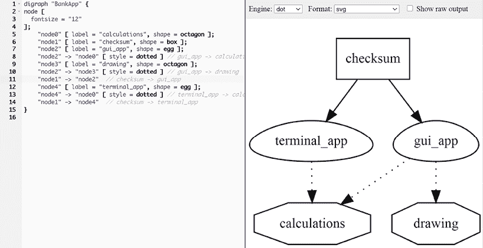
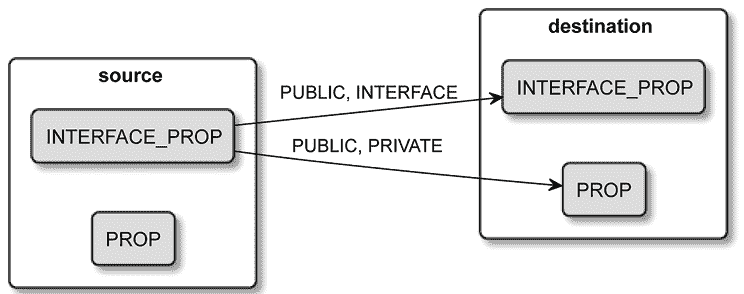

# 第五章：使用目标

在 CMake 中，整个应用程序可以从一个源代码文件（例如经典的 `helloworld.cpp`）构建。但同样，也可以创建一个项目，其中可执行文件由多个源文件构建：几十个甚至成千上万个。许多初学者遵循这种路径：他们只用几个文件来构建二进制文件，并让他们的项目自然发展，缺乏严格的规划。他们会根据需要不断添加文件，直到所有内容都直接链接到一个二进制文件，没有任何结构。

作为软件开发者，我们有意地划定边界并指定组件，以将一个或多个翻译单元（`.cpp` 文件）分组。我们这样做是为了提高代码可读性、管理耦合性和内聚性、加速构建过程，并最终发现和提取可重用的组件，使其成为自治单元。

每个大型项目都会促使你引入某种形式的分区。这就是 CMake 目标派上用场的地方。CMake 目标代表一个专注于特定目标的逻辑单元。目标之间可以有依赖关系，它们的构建遵循声明式方法。CMake 会负责确定构建目标的正确顺序，尽可能进行并行构建，并按需执行必要的步骤。作为一般原则，当一个目标被构建时，它会生成一个可以被其他目标使用的 artifact，或者作为构建过程的最终输出。

请注意 *artifact* 这个词的使用。我故意避免使用特定术语，因为 CMake 提供了灵活性，不仅限于生成可执行文件或库。实际上，我们可以利用生成的构建系统来生成各种类型的输出：额外的源文件、头文件、目标文件、档案、配置文件等等。唯一的要求是一个命令行工具（如编译器）、可选的输入文件和一个指定的输出路径。

目标是一个非常强大的概念，大大简化了构建项目的过程。理解它们的功能，并掌握如何以优雅和有组织的方式配置它们至关重要。这些知识确保了一个顺畅和高效的开发体验。

在本章中，我们将涵盖以下主要主题：

+   理解目标的概念

+   设置目标的属性

+   编写自定义命令

# 技术要求

你可以在 GitHub 上找到本章中提到的代码文件，链接为 [`github.com/PacktPublishing/Modern-CMake-for-Cpp-2E/tree/main/examples/ch05`](https://github.com/PacktPublishing/Modern-CMake-for-Cpp-2E/tree/main/examples/ch05)。

为了构建本书中提供的示例，请始终使用推荐的命令：

```cpp
cmake -B <build tree> -S <source tree>
cmake --build <build tree> 
```

请务必用适当的路径替换 `<build tree>` 和 `<source tree>` 占位符。提醒一下：**build tree** 是目标/输出目录的路径，而 **source tree** 是你的源代码所在的路径。

# 理解目标的概念

如果你曾使用过 GNU Make，你已经见过目标的概念。实际上，它是一个构建系统遵循的配方，用来将一组文件编译成另一个文件。它可以是一个 `.cpp` 实现文件编译成的 `.o` **目标文件**，也可以是多个 `.o` 文件打包成的 `.a` 静态库。在构建系统中，目标及其转换有很多种组合和可能性。

然而，CMake 允许你节省时间，并跳过定义这些步骤的中间过程；它在更高的抽象层次上工作。它理解大多数语言如何直接从源文件生成可执行文件。因此，你不需要像使用 GNU Make 那样编写明确的命令来编译你的 C++ **目标文件**。只需使用 `add_executable()` 命令，后跟可执行目标的名称和源文件列表即可：

```cpp
add_executable(app1 a.cpp b.cpp c.cpp) 
```

我们在前面的章节中已经使用过这个命令，我们也知道可执行目标在实际应用中的使用方式——在生成步骤中，CMake 会创建一个构建系统，并填充适当的配方，将每个源文件编译并链接成一个单一的二进制可执行文件。

在 CMake 中，我们可以使用这三个命令来创建一个目标：

+   `add_executable()`

+   `add_library()`

+   `add_custom_target()`

在构建可执行文件或库之前，CMake 会检查生成的输出是否比源文件更新。这个机制帮助 CMake 避免重新创建已经是最新的产物。通过比较时间戳，CMake 可以有效地识别哪些目标需要重新构建，从而减少不必要的重新编译。

所有定义目标的命令都要求将目标的名称作为第一个参数提供，以便在后续的命令中引用这些目标，诸如`target_link_libraries()`、`target_sources()`或`target_include_directories()`等命令都可以用到目标。我们稍后会学习这些命令，但现在，让我们仔细看看我们可以定义什么样的目标。

## 定义可执行目标

定义可执行目标的命令 `add_executable()` 不言自明（我们在前面的章节中已经依赖并使用了这个命令）。它的正式结构如下：

```cpp
add_executable(<name> [WIN32] [MACOSX_BUNDLE]
               [EXCLUDE_FROM_ALL]
               [source1] [source2 ...]) 
```

如果我们为 Windows 编译，通过添加可选参数 `WIN32` 关键字，我们将生成一个不会显示默认控制台窗口的可执行文件（通常我们可以在控制台窗口中看到输出流 `std::cout`）。相反，应用程序将期望生成自己的图形用户界面（GUI）。

下一个可选参数`MACOSX_BUNDLE`在某种程度上类似；它使得为 macOS/iOS 生成的应用程序可以从 Finder 中启动，作为 GUI 应用程序。

`EXCLUDE_FROM_ALL`关键字在使用时，会阻止可执行目标在常规默认构建中被构建。这样的目标必须在*构建命令*中明确提到：

```cpp
cmake --build -t <target> 
```

最后，我们需要提供将被编译成目标的源代码列表。支持以下扩展：

+   对于 C 语言：`c`，`m`

+   对于 C++语言：`C`，`M`，`c++`，`cc`，`cpp`，`cxx`，`m`，`mm`，`mpp`，`CPP`，`ixx`，`cppm`，`ccm`，`cxxm`，`c++m`

请注意，我们没有将任何**头文件**添加到源代码列表中。这可以通过提供包含这些文件的目录路径给`target_include_directories()`命令来隐式完成，或者通过使用`target_sources()`命令的`FILE_SET`功能（在 CMake 3.23 中新增）。这是可执行文件的重要话题，但由于其复杂且与目标相互独立，我们将在*第七章*，*使用 CMake 编译 C++源代码*中深入探讨其细节。

## 定义库目标

定义库与定义可执行文件非常相似，但当然，它不需要定义如何处理 GUI 方面的关键字。以下是该命令的签名：

```cpp
add_library(<name> [STATIC | SHARED | MODULE]
            [EXCLUDE_FROM_ALL]
            [<source>...]) 
```

关于名称、*排除所有* 和源代码匹配可执行目标的规则完全一致。唯一的区别在于`STATIC`、`SHARED`和`MODULE`关键字。如果你有使用库的经验，你会知道这些关键字定义了 CMake 将生成哪种类型的构件：静态链接库、共享（动态）库或模块。再一次，这确实是一个庞大的话题，将在*第八章*，*链接可执行文件和库*中深入讲解。

## 自定义目标

自定义目标与可执行文件或库有所不同。它们通过执行明确给定的命令行，扩展了 CMake 默认提供的构建功能；例如，它们可以用于：

+   计算其他二进制文件的校验和。

+   运行代码清理工具并收集结果。

+   将编译报告发送到指标管道。

正如你从这个列表中可以猜到的，自定义目标仅在相当复杂的项目中有用，因此我们将仅介绍基本内容，继续深入更重要的主题。

定义自定义目标时，使用以下语法（为了简洁，某些选项已被省略）：

```cpp
add_custom_target(Name [ALL] [COMMAND command2 [args2...] ...]) 
```

自定义目标有一些需要考虑的缺点。由于它们涉及 Shell 命令，可能是系统特定的，从而限制了可移植性。此外，自定义目标可能不会为 CMake 提供一种直接的方法来确定生成的具体构件或副产品（如果有的话）。

自定义目标与可执行文件和库不同，不会进行陈旧性检查（它们不会验证源文件是否比二进制文件更新），因为默认情况下，它们没有被添加到**依赖关系图**中（因此`ALL`关键字与`EXCLUDE_FROM_ALL`正好相反）。让我们来了解一下这个依赖关系图的内容。

## 依赖关系图

成熟的应用程序通常由多个组件构建而成，特别是内部库。从结构角度来看，将项目进行划分是有用的。当相关的内容被打包成一个单一的逻辑实体时，它们可以与其他目标进行链接：另一个库或一个可执行文件。当多个目标使用相同的库时，这尤其方便。请看一下*图 5.1*，它描述了一个示例性的依赖关系图：


图 5.1：BankApp 项目中依赖关系构建的顺序

在这个项目中，我们有两个库、两个可执行文件和一个自定义目标。我们的用例是为用户提供一个带有良好图形界面的银行应用程序（**GuiApp**），以及一个命令行版本，作为自动化脚本的一部分（**TerminalApp**）。这两个可执行文件都依赖于相同的**Calculations**库，但只有其中一个需要**Drawing**库。为了确保我们的应用程序二进制文件是从可靠来源下载的，我们还会计算一个校验和，并通过单独的安全渠道分发它。CMake 在为这样的解决方案编写 list 文件时非常灵活：

**ch05/01-targets/CMakeLists.txt**

```cpp
cmake_minimum_required(VERSION 3.26)
project(BankApp CXX)
add_executable(terminal_app terminal_app.cpp)
add_executable(gui_app gui_app.cpp)
target_link_libraries(terminal_app calculations)
target_link_libraries(gui_app calculations drawing)
add_library(calculations calculations.cpp)
add_library(drawing drawing.cpp)
add_custom_target(checksum ALL
    COMMAND sh -c "cksum terminal_app>terminal.ck"
    COMMAND sh -c "cksum gui_app>gui.ck"
    BYPRODUCTS terminal.ck gui.ck
    COMMENT "Checking the sums..."
) 
```

我们通过使用`target_link_libraries()`命令将我们的库与可执行文件链接。如果没有这个命令，生成可执行文件时将因为未定义的符号而失败。你有没有注意到我们在声明任何库之前就调用了这个命令？当 CMake 配置项目时，它会收集有关目标及其属性的信息——它们的名称、依赖关系、源文件以及其他细节。

在解析所有文件之后，CMake 将尝试构建一个依赖关系图。像所有有效的依赖关系图一样，它们是**有向无环图**（**DAGs**）。这意味着有明确的方向，指示哪个目标依赖于哪个，且这些依赖关系不能形成循环。

当我们在构建模式下执行`cmake`时，生成的构建系统将检查我们定义了哪些顶级目标，并递归地构建它们的依赖关系。让我们考虑一下*图 5.1*中的示例：

1.  从顶部开始，构建第 1 组中的两个库。

1.  当**Calculations**和**Drawing**库构建完成后，构建第 2 组——**GuiApp**和**TerminalApp**。

1.  构建一个校验和目标；运行指定的命令行以生成校验和（`cksum`是一个 Unix 的校验和工具，这意味着该示例在其他平台上无法构建）。

但是有一个小问题——上述解决方案并不能保证校验和目标在可执行文件之后构建。CMake 不知道校验和依赖于可执行二进制文件的存在，因此它可以自由地先开始构建校验和。为了解决这个问题，我们可以将`add_dependencies()`命令放在文件的最后：

```cpp
add_dependencies(checksum terminal_app gui_app) 
```

这将确保 CMake 理解校验和目标与可执行文件之间的关系。

这很好，但`target_link_libraries()`和`add_dependencies()`之间有什么区别？`target_link_libraries()`是用来与实际库配合使用的，并允许你控制属性传播。第二个则仅用于顶级目标，用来设置它们的构建顺序。

随着项目复杂度的增加，依赖树变得越来越难以理解。我们如何简化这个过程？

## 可视化依赖关系

即使是小型项目也可能很难理解并与其他开发人员共享。一个简洁的图表在这里会大有帮助。毕竟，一图胜千言。我们可以像我在*图 5.1*中做的那样，自己动手绘制图表。但这既繁琐又需要在项目变动时更新。幸运的是，CMake 有一个很棒的模块，可以生成`dot/graphviz`格式的依赖图，并且它支持内部和外部依赖！

要使用它，我们可以简单地执行以下命令：

```cpp
cmake --graphviz=test.dot . 
```

该模块将生成一个文本文件，我们可以将其导入到 Graphviz 可视化软件中，Graphviz 可以渲染图像或生成 PDF 或 SVG 文件，这些文件可以作为软件文档的一部分存储。每个人都喜欢出色的文档，但几乎没有人喜欢创建它——现在，你不需要做这件事了！

自定义目标默认不可见，我们需要创建一个特殊的配置文件`CMakeGraphVizOptions.cmake`，它将允许我们自定义图形。使用`set(GRAPHVIZ_CUSTOM_TARGETS TRUE)`命令可以在图形中启用自定义目标：

**ch05/01-targets/CMakeGraphVizOptions.cmake**

```cpp
set(GRAPHVIZ_CUSTOM_TARGETS TRUE) 
```

其他选项允许添加图表名称、标题和节点前缀，并配置哪些目标应包含或排除在输出中（按名称或类型）。有关`CMakeGraphVizOptions`模块的完整描述，请访问官方的 CMake 文档。

如果你很着急，你甚至可以直接通过浏览器在这个地址运行 Graphviz：[`dreampuf.github.io/GraphvizOnline/`](https://dreampuf.github.io/GraphvizOnline/)。

你所需要做的就是将`test.dot`文件的内容复制并粘贴到左侧窗口，你的项目就会被可视化（*图 5.2*）。很方便，不是吗？



图 5.2：BankApp 示例在 Graphviz 中的可视化

使用这种方法，我们可以快速查看所有显式定义的目标。

现在我们理解了目标的概念，知道如何定义不同类型的目标，包括可执行文件、库和自定义目标，以及如何创建依赖图并将其打印出来。让我们利用这些信息深入探讨，看看如何配置这些目标。

## 设置目标属性

目标具有类似于 C++ 对象字段的属性。这些属性中有些是可以修改的，有些则是只读的。CMake 定义了一个庞大的“已知属性”列表（见 *进一步阅读* 部分），根据目标的类型（可执行文件、库或自定义目标），可以使用不同的属性。你也可以根据需要添加自己的属性。使用以下命令来操作目标的属性：

```cpp
get_target_property(<var> <target> <property-name>)
set_target_properties(<target1> <target2> ...
                      PROPERTIES <prop1-name> <value1>
                      <prop2-name> <value2> ...) 
```

要在屏幕上打印目标属性，我们首先需要将其存储在 `<var>` 变量中，然后通过消息将其传递给用户。属性的读取必须逐一进行；而在目标上设置属性时，可以同时为多个目标指定多个属性。

属性的概念并非目标独有；CMake 还支持设置其他作用域的属性：`GLOBAL`、`DIRECTORY`、`SOURCE`、`INSTALL`、`TEST` 和 `CACHE`。要操作各种属性，可以使用通用的 `get_property()` 和 `set_property()` 命令。在某些项目中，你会看到这些低级命令用于执行 `set_target_properties()` 命令所做的事情，只是工作量稍大一些：

```cpp
set_property`(`TARGET `<target>` PROPERTY `<name> <value>)` 
```

一般来说，尽量使用尽可能多的高级命令。在某些情况下，CMake 提供了简写命令，并附带了额外的机制。例如，`add_dependencies(<target> <dep>)` 是一个简写，用于将依赖项添加到 `MANUALLY_ADDED_DEPENDENCIES` 目标属性中。在这种情况下，我们可以像查询任何其他属性一样使用 `get_target_property()` 查询它。然而，我们不能使用 `set_target_properties()` 来修改它（它是只读的），因为 CMake 坚持使用 `add_dependencies()` 命令来限制操作只能是附加依赖项。

当我们在接下来的章节中讨论编译和链接时，我们会介绍更多的属性设置命令。与此同时，让我们专注于如何将一个目标的属性传递给另一个目标。

### 什么是传递性使用要求？

让我们达成共识，命名确实很难，有时最终会得到一个难以理解的标签。“传递性使用要求”不幸地就是你在 CMake 在线文档中会遇到的那些难以理解的标题之一。让我们拆解一下这个奇怪的名字，并尝试提出一个更容易理解的术语。

从中间术语开始：**使用**。正如我们之前讨论的，一个目标可能依赖于另一个目标。CMake 文档有时将这种依赖关系称为 **使用**，就像一个目标*使用*另一个目标一样。

会有这样的情况：当某个*被使用的目标*为自己设置了特定的*属性*或*依赖*，这些属性或依赖反过来成为*使用该目标的其他目标*的**需求**：链接一些库，包含一个目录，或者需要特定的编译器特性。

我们难题的最后一部分，**传递性**，正确描述了行为（可能可以简化一点）。CMake 将*被使用目标*的一些属性/需求附加到*使用目标*的属性中。可以说，一些属性可以隐式地在目标之间传递（或者简单地传播），因此更容易表达依赖关系。

简化这个概念，我将其视为**传播的属性**，它们在**源目标**（被使用的目标）和**目标使用者**（使用其他目标的目标）之间传播。

让我们通过一个具体的例子来理解它为什么存在以及它是如何工作的：

```cpp
target_compile_definitions(<source> <INTERFACE|PUBLIC|PRIVATE> [items1...]) 
```

这个目标命令将填充`COMPILE_DEFINITIONS`属性到一个`<source>`目标中。**编译定义**就是传递给编译器的`-Dname=definition`标志，用于配置 C++预处理器定义（我们将在*第七章*，*使用 CMake 编译 C++源代码*中详细讲解）。这里有趣的部分是第二个参数。我们需要指定三个值中的一个，`INTERFACE`、`PUBLIC`或`PRIVATE`，来控制该属性应该传递给哪些目标。现在，别把这些和 C++的访问控制符混淆——这是一个独立的概念。

传播关键字是这样工作的：

+   `PRIVATE`设置源目标的属性。

+   `INTERFACE`设置目标使用者的属性。

+   `PUBLIC`设置源目标和目标使用者的属性。

当一个属性不需要传递给任何目标时，设置为`PRIVATE`。当需要进行这样的传递时，使用`PUBLIC`。如果你处在一种情况，源目标在其实现（`.cpp`文件）中并不使用该属性，而只在头文件中使用，并且这些头文件被传递给消费者目标，那么应该使用`INTERFACE`关键字。

这在背后是如何工作的呢？为了管理这些属性，CMake 提供了一些命令，比如前面提到的`target_compile_definitions()`。当你指定`PRIVATE`或`PUBLIC`关键字时，CMake 会将提供的值存储到目标的属性中，在这个例子中是`COMPILE_DEFINITIONS`。此外，如果关键字是`INTERFACE`或`PUBLIC`，CMake 会将值存储到带有`INTERFACE_`前缀的属性中——`INTERFACE_COMPILE_DEFINITIONS`。在配置阶段，CMake 会读取源目标的接口属性，并将它们的内容附加到目标使用者上。就是这样——传播的属性，或者 CMake 所称的传递性使用需求。

使用`set_target_properties()`命令管理的属性可以在[`cmake.org/cmake/help/latest/manual/cmake-properties.7.html`](https://cmake.org/cmake/help/latest/manual/cmake-properties.7.html)中找到，位于*目标上的属性*部分（并非所有目标属性都是传递性的）。以下是最重要的属性：

+   `COMPILE_DEFINITIONS`

+   `COMPILE_FEATURES`

+   `COMPILE_OPTIONS`

+   `INCLUDE_DIRECTORIES`

+   `LINK_DEPENDS`

+   `LINK_DIRECTORIES`

+   `LINK_LIBRARIES`

+   `LINK_OPTIONS`

+   `POSITION_INDEPENDENT_CODE`

+   `PRECOMPILE_HEADERS`

+   `SOURCES`

我们将在接下来的几页中讨论这些选项，但请记住，所有这些选项当然在 CMake 手册中有详细描述。你可以通过以下链接找到它们的详细描述（将`<PROPERTY>`替换为你感兴趣的属性）：`https://cmake.org/cmake/help/latest/prop_tgt/<PROPERTY>.html`

下一个问题是，这种传播会传播多远？属性只会设置到第一个目标目标，还是会传播到依赖图的最顶端？你可以自行决定。

为了在目标之间创建依赖关系，我们使用`target_link_libraries()`命令。这个命令的完整签名需要一个传播关键字：

```cpp
target_link_libraries(<target>
                     <PRIVATE|PUBLIC|INTERFACE> <item>...
                    [<PRIVATE|PUBLIC|INTERFACE> <item>...]...) 
```

如你所见，这个签名还指定了一个传播关键字，它控制属性如何从*源目标*存储到*目标目标*。*图 5.3* 展示了在生成阶段（配置阶段完成后）传播的属性会发生什么：



图 5.3：属性如何传播到目标目标

传播关键字的工作方式如下：

+   `PRIVATE` 将源值追加到*源目标*的**私有**属性中。

+   `INTERFACE` 将源值追加到*源目标*的**接口**属性中。

+   `PUBLIC` 会将值追加到*源目标*的两个属性中。

正如我们之前讨论的，接口属性仅用于进一步传播属性到链条下游（到下一个*目标目标*），而*源目标*在其构建过程中不会使用这些属性。

我们之前使用的基本命令`target_link_libraries(<target> <item>...)`隐式指定了`PUBLIC`关键字。

如果你正确设置了源目标的传播关键字，属性将自动被放置到目标目标上，除非出现冲突……

### 处理冲突的传播属性

当一个目标依赖于多个其他目标时，可能会出现传播的属性相互冲突的情况。比如一个使用的目标指定了`POSITION_INDEPENDENT_CODE`属性为`true`，而另一个则为`false`。CMake 会理解为冲突，并打印出类似以下的错误信息：

```cpp
CMake Error: The INTERFACE_POSITION_INDEPENDENT_CODE property of "source_target" does not agree with the value of POSITION_INDEPENDENT_CODE already determined for "destination_target". 
```

接收到这样的消息是有用的，因为我们明确知道是我们引入了这个冲突，需要解决它。CMake 有自己的属性，这些属性必须在源目标和目标目标之间“一致”。

在少数情况下，这可能变得很重要——例如，如果你在多个目标中使用同一个库，然后将它们链接到一个单一的可执行文件。如果这些源目标使用的是不同版本的同一个库，你可能会遇到问题。

为确保我们只使用相同的特定版本，我们可以创建一个自定义接口属性`INTERFACE_LIB_VERSION`，并将版本存储在其中。但这还不足以解决问题，因为 CMake 默认不会传播自定义属性（该机制仅适用于内建目标属性）。我们必须显式地将自定义属性添加到“兼容”属性列表中。

每个目标都有四个这样的列表：

+   `COMPATIBLE_INTERFACE_BOOL`

+   `COMPATIBLE_INTERFACE_STRING`

+   `COMPATIBLE_INTERFACE_NUMBER_MAX`

+   `COMPATIBLE_INTERFACE_NUMBER_MIN`

将你的属性添加到其中之一会触发传播和兼容性检查。`BOOL`列表将检查所有传播到目标目标的属性是否评估为相同的布尔值。类似地，`STRING`将评估为字符串。`NUMBER_MAX`和`NUMBER_MIN`略有不同——传播的值不必完全匹配，但目标目标将接收最高或最低的值。

这个示例将帮助我们理解如何在实践中应用这一点：

**ch05/02-propagated/CMakeLists.txt**

```cpp
cmake_minimum_required(VERSION 3.26)
project(PropagatedProperties CXX)
add_library(source1 empty.cpp)
set_property(TARGET source1 PROPERTY **INTERFACE_LIB_VERSION** **4**)
set_property(TARGET source1 APPEND PROPERTY
             COMPATIBLE_INTERFACE_STRING LIB_VERSION)
add_library(source2 empty.cpp)
set_property(TARGET source2 PROPERTY **INTERFACE_LIB_VERSION** **4**)
add_library(destination empty.cpp)
target_link_libraries(destination source1 source2) 
```

我们在这里创建了三个目标；为了简化起见，所有目标都使用相同的空源文件。在两个*源目标*上，我们指定了带有`INTERFACE_`前缀的自定义属性，并将它们设置为相同的匹配库版本。这两个*源目标*都链接到目标目标。最后，我们为`source1`指定了一个`STRING`兼容性要求作为属性（这里没有加`INTERFACE_`前缀）。

CMake 会将这个自定义属性传播到*目标目标*，并检查所有源目标的版本是否完全匹配（兼容性属性可以只设置在一个目标上）。

现在我们了解了常规目标是什么，让我们来看一看那些看起来像目标、闻起来像目标、有时也像目标但实际上并不是目标的其他事物。

## 认识伪目标

目标的概念非常有用，如果它的一些行为可以借用到其他地方，那就更好了；这些地方并不代表构建系统的输出，而是输入——外部依赖、别名等。这些就是伪目标，或者说是那些没有进入生成的构建系统的目标：

+   导入目标

+   别名目标

+   接口库

我们来看一下。

### 导入目标

如果你浏览过本书的目录，你就会知道我们将讨论 CMake 如何管理外部依赖——其他项目、库等等。`IMPORTED`目标本质上是这个过程的产物。CMake 可以通过`find_package()`命令定义它们。

你可以调整这种目标的目标属性：**编译定义**、**编译** **选项**、**包含目录**等——它们甚至支持传递性使用要求。然而，你应该将它们视为不可变的；不要更改它们的源代码或依赖关系。

`IMPORTED`目标的定义范围可以是全局的，也可以是局部的，即只在定义该目标的目录中可见（在子目录中可见，但在父目录中不可见）。

### 别名目标

别名目标正如你所期待的那样——它们创建了一个不同名称的目标引用。你可以使用以下命令为可执行文件和库创建别名目标：

```cpp
add_executable(<name> ALIAS <target>)
add_library(<name> ALIAS <target>) 
```

别名目标的属性是只读的，不能安装或导出别名（它们在生成的构建系统中不可见）。

那么，为什么要使用别名呢？它们在项目的某些部分（例如子目录）需要一个特定名称的目标，而实际的实现可能会根据情况以不同的名称出现时非常有用。例如，你可能希望构建一个与你的解决方案一起提供的库，或者根据用户的选择导入它。

### 接口库

这是一个有趣的构造——一个不编译任何东西，而是作为一个工具目标的库。它的整个概念是围绕传播的属性（传递性使用要求）构建的。

接口库有两个主要用途——表示仅包含头文件的库，以及将一堆传播的属性捆绑成一个逻辑单元。

使用`add_library(INTERFACE)`创建仅包含头文件的库非常简单：

```cpp
add_library(Eigen **INTERFACE**
  src/eigen.h src/vector.h src/matrix.h
)
target_include_directories(Eigen INTERFACE
  $<BUILD_INTERFACE:${CMAKE_CURRENT_SOURCE_DIR}/src>
  $<INSTALL_INTERFACE:include/Eigen>
) 
generator expressions (these are indicated with dollar sign and angle brackets, $<...> and will be explained in the next chapter), we set its include directories to be ${CMAKE_CURRENT_SOURCE_DIR}/src when a target is exported and include/Eigen when it’s installed (which will also be explained at the end of this chapter).
```

要使用这样的库，我们只需要链接它：

```cpp
target_link_libraries(executable Eigen) 
```

这里不会发生实际的链接，但 CMake 会将此命令理解为要求将所有`INTERFACE`属性传播到`executable`目标。

第二种用法完全利用相同的机制，但目的是不同的——它创建一个逻辑目标，可以作为传播属性的占位符。然后，我们可以将这个目标作为其他目标的依赖，并以干净、方便的方式设置属性。这里是一个例子：

```cpp
add_library(warning_properties **INTERFACE**)
target_compile_options(warning_properties INTERFACE
  -Wall -Wextra -Wpedantic
)
target_link_libraries(executable warning_properties) 
```

`add_library(INTERFACE)`命令创建一个逻辑的`warning_properties`目标，用于设置第二个命令中指定的**编译选项**，应用于`executable`目标。我推荐使用这些`INTERFACE`目标，因为它们提高了代码的可读性和可重用性。可以将其视为将一堆魔法值重构为一个命名良好的变量。我还建议明确地添加一个后缀，如`_properties`，以便轻松区分接口库和常规库。

## 目标库

*目标库*用于将多个源文件归为一个逻辑目标，并在构建过程中将它们编译成（`.o`）*目标文件*。创建*目标库*的方法与其他库相同，只不过使用`OBJECT`关键字：

```cpp
add_library(<target> OBJECT <sources>) 
```

在构建过程中生成的*目标文件*可以通过`$<TARGET_OBJECTS:objlib>`生成表达式作为编译元素并入到其他目标中：

```cpp
add_library(... $<TARGET_OBJECTS:objlib> ...)
add_executable(... $<TARGET_OBJECTS:objlib> ...) 
```

另外，你也可以使用`target_link_libraries()`命令将它们作为依赖项添加。

在我们`Calc`库的上下文中，*目标库*将有助于避免为静态和共享版本的库重复编译库源文件。显式编译*目标文件*并启用`POSITION_INDEPENDENT_CODE`是共享库的先决条件。

回到项目的目标：`calc_obj`将提供编译好的*目标文件*，然后它们将用于`calc_static`和`calc_shared`库。让我们探讨这两种库类型之间的实际区别，并理解为什么有时需要同时创建这两种类型。

伪目标是否已经穷尽了目标的概念？当然没有！那样就太简单了。我们仍然需要理解这些目标是如何用来生成构建系统的。

## 构建目标

“目标”这个术语可以根据项目中的上下文和生成的构建系统的不同而有不同的含义。在生成构建系统的上下文中，CMake 将用 CMake 语言编写的列表文件“编译”成所选构建工具的语言，例如为 GNU Make 创建一个 Makefile。这些生成的 Makefile 有自己的目标集合。部分目标是从列表文件中定义的目标直接转换而来，而其他目标则是作为构建系统生成过程的一部分隐式创建的。

一个这样的构建系统目标是`ALL`，这是 CMake 默认生成的，包含所有顶级列表文件目标，例如可执行文件和库（不一定是自定义目标）。当我们运行`cmake --build <build tree>`而不选择任何特定目标时，`ALL`会被构建。正如你在第一章中可能记得的，你可以通过在`cmake`构建命令中添加`--target <name>`参数来选择一个目标。

有些可执行文件或库在每次构建中可能都不需要，但我们希望它们作为项目的一部分保留，以备在少数需要时使用。为了优化我们的默认构建，我们可以像这样将它们从`ALL`目标中排除：

```cpp
add_executable(<name> **EXCLUDE_FROM_ALL** [<source>...])
add_library(<name> **EXCLUDE_FROM_ALL** [<source>...]) 
```

自定义目标的工作方式正好相反——默认情况下，它们会被排除在`ALL`目标之外，除非你显式地使用`ALL`关键字将它们添加进去，就像我们在 BankApp 示例中所做的那样。

另一个隐式定义的构建目标是`clean`，它简单地从构建树中移除生成的产物。我们使用它来删除所有旧文件并从头开始构建。然而，重要的是要理解，它并不只是简单地删除构建目录中的所有内容。为了让`clean`正确工作，你需要手动指定你的自定义目标可能会创建的任何文件作为`BYPRODUCTS`（见 BankApp 示例）。

这就是我们探索目标及其不同方面的总结：我们知道如何创建目标，配置其属性，使用伪目标，并决定它们是否应该默认构建。此外，还有一种有趣的非目标机制，用于创建可以在所有实际目标中使用的自定义工件——**自定义命令**（不要与**自定义目标**混淆）。

# 编写自定义命令

使用自定义目标有一个缺点——一旦将它们添加到`ALL`目标中，或者让其他目标依赖它们，它们就会每次都被构建。有时，这是你想要的效果，但也有些情况下，出于某些原因，有必要生成不应被重新创建的文件，此时需要自定义行为：

+   生成另一个目标依赖的源代码文件

+   将另一种语言翻译成 C++

+   在另一个目标构建之前或之后立即执行自定义操作

自定义命令有两个签名，第一个是`add_custom_target()`的扩展版本：

```cpp
add_custom_command(OUTPUT output1 [output2 ...]
                   COMMAND command1 [ARGS] [args1...]
                   [COMMAND command2 [ARGS] [args2...] ...]
                   [MAIN_DEPENDENCY depend]
                   [DEPENDS [depends...]]
                   [BYPRODUCTS [files...]]
                   [IMPLICIT_DEPENDS <lang1> depend1
                                    [<lang2> depend2] ...]
                   [WORKING_DIRECTORY dir]
                   [COMMENT comment]
                   [DEPFILE depfile]
                   [JOB_POOL job_pool]
                   [VERBATIM] [APPEND] [USES_TERMINAL]
                   [COMMAND_EXPAND_LISTS]) 
```

正如你可能已经猜到的那样，自定义命令并不会创建一个逻辑目标，但和自定义目标一样，它必须被添加到依赖图中。这样做有两种方式——将其输出的工件作为可执行文件（或库）的源，或者显式地将其添加到自定义目标的`DEPENDS`列表中。

## 使用自定义命令作为生成器

诚然，并不是每个项目都需要从其他文件生成 C++代码。一个这样的情况可能是**Google 的协议缓冲区**（**Protobuf**）的`.proto`文件编译。如果你不熟悉这个库，Protobuf 是一个平台中立的二进制序列化工具，用于结构化数据。

换句话说：它可以用于在二进制流中编码对象：文件或网络连接。为了保持 Protobuf 的跨平台性和快速性，Google 的工程师发明了他们自己的 Protobuf 语言，该语言在`.proto`文件中定义模型，如下所示：

```cpp
message Person {
  required string name = 1;
  required int32 id = 2;
  optional string email = 3;
} 
```

这样的文件可以用于在多种语言中编码数据——C++、Ruby、Go、Python、Java 等。Google 提供了一个编译器`protoc`，它读取`.proto`文件，并输出针对所选语言的结构和序列化源代码（稍后需要编译或解释）。聪明的工程师不会将这些生成的源文件提交到版本库，而是会使用原始的 Protobuf 格式，并在构建链中添加一步生成源文件的操作。

我们还不知道如何检测目标主机上是否存在（以及在哪里存在）Protobuf 编译器（我们将在*第九章*，*CMake 中的依赖管理*中学习这一点）。所以，目前我们暂时假设编译器的`protoc`命令位于系统已知的位置。我们已经准备了一个`person.proto`文件，并且知道 Protobuf 编译器将输出`person.pb.h`和`person.pb.cc`文件。下面是我们如何定义一个自定义命令来编译它们：

```cpp
add_custom_command(OUTPUT person.pb.h person.pb.cc
        COMMAND protoc ARGS person.proto
        DEPENDS person.proto
) 
```

然后，为了在我们的可执行文件中支持序列化，我们可以直接将输出文件添加到源代码中：

```cpp
add_executable(serializer serializer.cpp person.pb.cc) 
```

假设我们正确处理了头文件的包含和 Protobuf 库的链接，当我们对 `.proto` 文件进行修改时，所有内容会自动编译并更新。

一个简化的（但不太实用的）示例是通过从另一个位置复制必要的头文件来创建它：

**ch05/03-command/CMakeLists.txt**

```cpp
add_executable(main main.cpp constants.h)
target_include_directories(main PRIVATE ${CMAKE_BINARY_DIR})
add_custom_command(OUTPUT constants.h **COMMAND** **cp**
                   ARGS "${CMAKE_SOURCE_DIR}/template.xyz" constants.h) 
```

在这种情况下，我们的“编译器”是 `cp` 命令。它通过简单地从源代码树复制 `constants.h` 文件到构建树根目录，满足 `main` 目标的依赖。

## 使用自定义命令作为目标钩子

第二版本的 `add_custom_command()` 命令引入了一个机制，用于在构建目标之前或之后执行命令：

```cpp
add_custom_command(**TARGET** **<target>**
                   PRE_BUILD | PRE_LINK | POST_BUILD
                   COMMAND command1 [ARGS] [args1...]
                   [COMMAND command2 [ARGS] [args2...] ...]
                   [BYPRODUCTS [files...]]
                   [WORKING_DIRECTORY dir]
                   [COMMENT comment]
                   [VERBATIM] [USES_TERMINAL]
                   [COMMAND_EXPAND_LISTS]) 
```

我们在第一个参数中指定希望“增强”的目标，并在以下条件下执行：

+   `PRE_BUILD` 会在为此目标执行任何其他规则之前运行（仅适用于 Visual Studio 生成器；对于其他生成器，它的行为像 `PRE_LINK`）。

+   `PRE_LINK` 将命令绑定到所有源文件编译完成后、目标链接（或归档）之前运行。它不适用于自定义目标。

+   `POST_BUILD` 会在所有其他规则为此目标执行完成后运行。

使用这个版本的 `add_custom_command()`，我们可以复制前面 BankApp 示例中的校验和生成：

**ch05/04-command/CMakeLists.txt**

```cpp
cmake_minimum_required(VERSION 3.26)
project(Command CXX)
add_executable(main main.cpp)
add_custom_command(TARGET main POST_BUILD
                   COMMAND cksum
                   ARGS "$<TARGET_FILE:main>" > "main.ck") 
```

在 `main` 可执行文件的构建完成后，CMake 会执行 `cksum` 命令并传入提供的参数。但是，首个参数发生了什么？它不是一个变量，否则它应该用大括号（`${}`）括起来，而不是用尖括号（`$<>`）。它是一个 **生成器表达式**，计算得到目标二进制文件的完整路径。这个机制在许多目标属性的上下文中非常有用，我们将在下一章中解释。

# 总结

理解目标是编写清晰、现代 CMake 项目的关键。在本章中，我们不仅讨论了目标的构成以及如何定义三种不同类型的目标：可执行文件、库和自定义目标，还解释了目标之间如何通过依赖图相互依赖，并学习了如何使用 Graphviz 模块来可视化它。通过这些基本理解，我们得以学习目标的一个关键特性——属性。我们不仅介绍了几个命令来设置目标的常规属性，还解决了传递使用要求的谜团，也就是所谓的传播属性。

这是一个很难解决的问题，因为我们不仅需要理解如何控制哪些属性会被传播，还要理解这种传播如何影响后续目标。此外，我们还发现了如何确保来自多个源的属性兼容性。

接着，我们简要讨论了伪目标：导入目标、别名目标和接口库。它们在后续的项目中将派上用场，特别是当我们知道如何将它们与传播属性结合起来，造福我们自己时。然后，我们讨论了生成的构建目标，以及配置阶段如何影响它们。之后，我们花了一些时间研究了一种类似于目标但并不完全相同的机制：自定义命令。我们简要提到它们如何生成供其他目标使用的文件（如编译、翻译等），以及它们的钩子功能：在目标构建时执行附加步骤。

有了如此坚实的基础，我们准备进入下一个主题——将 C++ 源代码编译成可执行文件和库。

# 进一步阅读

若想了解本章涉及的更多内容，您可以参考以下资源：

+   Graphviz 模块文档：[`gitlab.kitware.com/cmake/community/-/wikis/doc/cmake/Graphviz`](https://gitlab.kitware.com/cmake/community/-/wikis/doc/cmake/Graphviz)，[`cmake.org/cmake/help/latest/module/CMakeGraphVizOptions.html`](https://cmake.org/cmake/help/latest/module/CMakeGraphVizOptions.html)

+   Graphviz 软件：[`graphviz.org`](https://graphviz.org)

+   CMake 目标属性：[`cmake.org/cmake/help/latest/manual/cmake-properties.7.html#properties-on-targets`](https://cmake.org/cmake/help/latest/manual/cmake-properties.7.html#properties-on-targets)

+   可传递使用要求：[`cmake.org/cmake/help/latest/manual/cmake-buildsystem.7.html#transitive-usage-requirements`](https://cmake.org/cmake/help/latest/manual/cmake-buildsystem.7.html#transitive-usage-requirements )

# 加入我们的 Discord 社区

加入我们社区的 Discord 频道，与作者和其他读者讨论：

[`discord.com/invite/vXN53A7ZcA`](https://discord.com/invite/vXN53A7ZcA)


