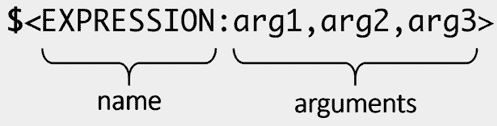

# 第六章：使用生成器表达式  

许多 CMake 用户在私下学习时并未遇到生成器表达式，因为它们是相对高级的概念。然而，它们对于那些准备进入广泛发布阶段或首次发布给更广泛观众的项目至关重要，因为它们在导出、安装和打包中扮演着重要角色。如果你只是想快速学习 CMake 的基础知识，并专注于 C++ 方面，可以暂时跳过本章，稍后再回来。另一方面，我们现在讨论生成器表达式，是因为接下来的章节将在解释 CMake 的更深层次内容时引用这些知识。  

我们将首先介绍生成器表达式的主题：它们是什么，它们的用途是什么，以及它们是如何构建和展开的。接下来会简要介绍嵌套机制，并更详细地描述条件扩展，这允许使用布尔逻辑、比较操作和查询。当然，我们还会深入探讨可用表达式的广度。  

但是首先，我们将研究字符串、列表和路径的转换，因为在集中研究主要内容之前，了解这些基础内容是很有益的。最终，生成器表达式在实际应用中用于获取在构建的后期阶段中可用的信息，并将其呈现于适当的上下文中。确定这个上下文是它们价值的一个重要部分。我们将探讨如何根据用户选择的构建配置、当前平台和工具链来参数化我们的构建过程。也就是说，正在使用什么编译器，它的版本是什么，以及它具备哪些功能，这还不止：我们将弄清楚如何查询构建目标的属性及其相关信息。  

为了确保我们能够充分理解生成器表达式的价值，我在本章的最后部分包括了一些有趣的使用示例。此外，还提供了如何查看生成器表达式输出的简短说明，因为这有些棘手。不过别担心，生成器表达式并不像它们看起来那么复杂，你很快就能开始使用它们了。  

本章将介绍以下主要内容：  

+   什么是生成器表达式？  

+   学习一般表达式语法的基本规则  

+   条件扩展  

+   查询与转换  

+   试验示例  

# 技术要求  

你可以在 GitHub 上找到本章中涉及的代码文件，网址为：[`github.com/PacktPublishing/Modern-CMake-for-Cpp-2E/tree/main/examples/ch06`](https://github.com/PacktPublishing/Modern-CMake-for-Cpp-2E/tree/main/examples/ch06)。  

要构建本书提供的示例，请始终使用推荐的命令：  

```cpp
cmake -B <build tree> -S <source tree>
cmake --build <build tree> 
```

请确保将`<build tree>`和`<source tree>`占位符替换为适当的路径。提醒一下：**build tree**是目标/输出目录的路径，**source tree**是源代码所在的路径。

# 生成器表达式是什么？

CMake 在三个阶段构建解决方案：配置、生成和运行构建工具。通常，在配置阶段所有所需的数据都是可用的。然而，有时我们会遇到类似“先有鸡还是先有蛋”这种悖论的情况。举个例子，来自*第五章*中*使用自定义命令作为目标钩子*部分——某个目标需要知道另一个目标的二进制工件路径。不幸的是，这些信息只有在所有列表文件解析完毕并且配置阶段完成后才会变得可用。

那么，我们如何解决这样的问题呢？一种解决方案是为该信息创建一个占位符，并将其评估延迟到下一个阶段——**生成阶段**。

这正是生成器表达式（也称为“genexes”）的作用。它们围绕目标属性构建，如`LINK_LIBRARIES`、`INCLUDE_DIRECTORIES`、`COMPILE_DEFINITIONS`和传播的属性，尽管并非所有属性都如此。它们遵循类似于条件语句和变量评估的规则。

生成器表达式将在生成阶段进行评估（即配置完成并创建构建系统时），这意味着将它们的输出捕获到变量中并打印到控制台并不直接。

生成器表达式有很多种，从某种意义上说，它们构成了自己的一种领域特定语言——一种支持条件表达式、逻辑运算、比较、转换、查询和排序的语言。使用生成器表达式可以操作和查询字符串、列表、版本号、shell 路径、配置和构建目标。在本章中，我们将简要概述这些概念，重点介绍基础知识，因为在大多数情况下它们不是必需的。我们主要关注生成器表达式的主要应用，即从生成的目标配置和构建环境的状态中获取信息。欲了解完整参考资料，最好在线阅读官方 CMake 手册（请参阅*进一步阅读*部分以获取网址）。

一切通过示例解释更为清晰，因此我们直接进入，描述生成器表达式的语法。

# 学习常规表达式语法的基本规则

要使用生成器表达式，我们需要通过支持生成器表达式评估的命令将其添加到 CMake 列表文件中。大多数特定目标的命令都支持生成器表达式评估，还有许多其他命令（可以查看特定命令的官方文档了解更多）。一个常与生成器表达式一起使用的命令是`target_compile_definitions()`。要使用生成器表达式，我们需要将其作为命令参数提供，如下所示：

```cpp
target_compile_definitions(foo PUBLIC BAR=$<TARGET_FILE:baz>) 
```

该命令将一个`-D`定义标志添加到编译器的参数中（暂时忽略`PUBLIC`），该标志设置`BAR`预处理器定义为`foo`目标生成的**二进制文件**的*路径*。之所以有效，是因为生成器表达式以当前的形式存储在一个变量中。展开实际上推迟到生成阶段，此时许多内容已经完全配置并确定。

生成器表达式是如何形成的？



图 6.1：生成器表达式的语法

如*图 6.1*所示，结构看起来相当简单且易于阅读：

+   以美元符号和括号（`$<`）打开。

+   添加`EXPRESSION`名称。

+   如果表达式需要参数，请添加冒号（`:`）并提供`arg1`、`arg2` … `argN`值，以逗号（`,`）分隔。

+   使用`>`结束表达式。

有一些不需要任何参数的表达式，例如`$<PLATFORM_ID>`。

需要注意的是，除非明确指出，否则表达式通常在使用该表达式的目标上下文中进行评估。这一关联可以从使用表达式的命令中推断出来。在前面的例子中，我们看到`target_compile_definitions()`将`foo`作为它操作的目标。因此，在该命令中使用的特定目标生成器表达式将隐式地使用`foo`。然而，值得注意的是，例子中使用的生成器表达式`$<TARGET_FILE>`需要目标属性作为其操作的上下文。还有一些生成器表达式不接受目标作为参数（如`$<COMPILE_LANGUAGE>`），而是隐式使用封闭命令的目标。稍后会对这些进行更详细的讨论。

当使用生成器表达式的高级特性时，生成器表达式可能会变得非常混乱和复杂，因此在使用之前了解其具体内容非常重要。

## 嵌套

我们先从将生成器表达式作为参数传递给另一个生成器表达式的能力开始，换句话说，就是生成器表达式的嵌套：

```cpp
$<UPPER_CASE:$<PLATFORM_ID>> 
```

这个例子并不复杂，但很容易想象当我们增加嵌套层数并与使用多个参数的命令配合工作时会发生什么。

为了让问题更复杂一些，可能还需要将常规变量展开与生成器表达式一起使用：

```cpp
$<UPPER_CASE:${my_variable}> 
```

`my_variable` 变量会首先在配置阶段展开。随后，生成表达式将在生成阶段展开。这种特性有一些罕见的用法，但我强烈建议避免使用：生成器表达式几乎提供了所有必要的功能。将常规变量混入这些表达式中会增加难以调试的间接性层次。此外，在配置阶段收集的信息通常会过时，因为用户会在构建或安装阶段通过命令行参数覆盖生成器表达式中使用的值。

在讲解语法之后，让我们继续讨论生成器表达式中可用的基本机制。

# 条件展开

在生成器表达式中，是否应该展开一个表达式是通过布尔逻辑来确定的。尽管这是一个很棒的特性，但由于历史原因，它的语法可能不一致且难以阅读。它有两种形式。第一种形式同时支持顺利路径和错误路径：

```cpp
$<IF:condition,true_string,false_string> 
```

`IF` 表达式依赖于嵌套才能发挥作用：你可以将任何参数替换为另一个表达式，生成相当复杂的求值（甚至可以将一个 `IF` 条件嵌套在另一个里面）。这种形式需要恰好三个参数，因此我们不能省略任何一个。为了跳过条件不满足时的值，最好的选择是：

```cpp
$<IF:condition,true_string,> 
```

有一种简写形式，可以跳过 `IF` 关键字和逗号：

```cpp
$<condition:true_string> 
```

如你所见，它打破了将 `EXPRESSION` 名称作为第一个标记的惯例。我猜这里的意图是缩短表达式，避免输入那些宝贵的字符，但结果可能很难合理化。这是来自 CMake 文档的一个示例：

```cpp
$<$<AND:$<COMPILE_LANGUAGE:CXX>,$<CXX_COMPILER_ID:AppleClan
  g,Clang>>:COMPILING_CXX_WITH_CLANG> 
```

这个表达式只有在用 Clang 编译器编译的 C++ 代码中才会返回 `COMPILING_CXX_WITH_CLANG`（在其他所有情况下返回空字符串）。我希望语法能与常规 `IF` 命令的条件对齐，但遗憾的是并非如此。现在，如果你在某个地方看到第二种形式，你应该能够识别它，但为了可读性，最好避免在自己的项目中使用。

## 布尔值求值

生成器表达式会求值为两种类型之一——布尔值或字符串。布尔值由 `1`（真）和 `0`（假）表示。没有专门的数值类型；任何不是布尔值的东西都只是字符串。

需要记住的是，作为条件传递的嵌套表达式必须显式地求值为布尔值。

布尔类型可以隐式转换为字符串，但你需要使用显式的 `BOOL` 运算符（稍后解释）来实现反向转换。

布尔值的表达式有三种类型：逻辑运算符、比较表达式和查询。让我们快速看一下这些类型。

### 逻辑运算符

有四个逻辑运算符：

+   `$<NOT:arg>`：这个表达式用于否定布尔参数。

+   `$<AND:arg1,arg2,arg3...>`：如果所有参数都为真，则返回 true。

+   `$<OR:arg1,arg2,arg3...>`：如果任意一个参数为真，则返回 true。

+   `$<BOOL:string_arg>`：此操作将字符串类型的参数转换为布尔类型。

使用`$<BOOL>`进行字符串转换时，如果未满足以下条件，则会计算为布尔值 true（`1`）：

+   字符串为空。

+   字符串是`0`、`FALSE`、`OFF`、`N`、`NO`、`IGNORE`或`NOTFOUND`的大小写不敏感等价物。

+   字符串以`-NOTFOUND`后缀结尾（区分大小写）。

### 比较

比较将根据其条件计算为`1`（满足条件时）或`0`（不满足条件时）。以下是一些你可能会觉得有用的常见操作：

+   `$<STREQUAL:arg1,arg2>`：此操作按大小写敏感方式比较字符串。

+   `$<EQUAL:arg1,arg2>`：此操作将字符串转换为数字并进行相等比较。

+   `$<IN_LIST:arg,list>`：此操作检查`list`列表中是否包含`arg`元素（区分大小写）。

+   `$<VERSION_EQUAL:v1,v2>`、`$<VERSION_LESS:v1,v2>`、`$<VERSION_GREATER:v1,v2>`、`$<VERSION_LESS_EQUAL:v1,v2>`和`$<VERSION_GREATER_EQUAL:v1,v2>`按组件逐一比较版本。

+   `$<PATH_EQUAL:path1,path2>`：此操作比较两个路径的词法表示，而不进行任何规范化（自 CMake 3.24 起）。

### 查询

查询会直接从一个变量返回布尔值，或作为某个操作的结果返回。最简单的查询之一是：

```cpp
$<TARGET_EXISTS:arg> 
```

如你所料，如果目标在配置阶段已定义，则返回 true。

现在，你已经知道如何应用条件展开、使用逻辑运算符、比较以及基本查询来计算布尔值。单单这些就很有用，但生成器表达式能提供更多，特别是在查询的上下文中：它们可以在`IF`条件展开中使用，或者单独作为命令的参数使用。是时候在适当的上下文中介绍它们了。

# 查询和转换

有许多生成器表达式可用，但为了避免迷失在细节中，让我们专注于最常用的一些。我们将从对可用数据的一些基本转换开始。

## 处理字符串、列表和路径

生成器表达式仅提供了最低限度的操作，用于转换和查询数据结构。在生成器阶段处理字符串是可能的，以下是一些常用的表达式：

+   `$<LOWER_CASE:string>`、`$<UPPER_CASE:string>`：此操作将`string`转换为所需的大小写。

列表操作直到最近才得到了很大的扩展。从 CMake 3.15 开始，以下操作可用：

+   `$<IN_LIST:string,list>`：如果`list`中包含`string`值，则返回 true。

+   `$<JOIN:list,d>`：此表达式使用`d`分隔符连接一个以分号分隔的`list`。

+   `$<REMOVE_DUPLICATES:list>`：此操作去除`list`中的重复项（不排序）。

+   `$<FILTER:list,INCLUDE|EXCLUDE,regex>`：此操作使用`regex`包含或排除`list`中的项。

从 3.27 版本开始，添加了`$<LIST:OPERATION>`生成器表达式，其中`OPERATION`可以是以下之一：

+   `LENGTH`

+   `GET`

+   `SUBLIST`

+   `FIND`

+   `JOIN`

+   `APPEND`

+   `PREPEND`

+   `INSERT`

+   `POP_BACK`

+   `POP_FRONT`

+   `REMOVE_ITEM`

+   `REMOVE_AT`

+   `REMOVE_DUPLICATES`

+   `FILTER`

+   `TRANSFORM`

+   `REVERSE`

+   `SORT`

在生成器表达式中处理列表的情况比较少见，因此我们仅指示可能的情况。如果你遇到这些情况，请查看在线手册，了解如何使用这些操作。

最后，我们可以查询和变换系统路径。这是一个有用的补充，因为它在不同操作系统之间具有可移植性。自 CMake 3.24 起，以下简单查询已经可以使用：

+   `$<PATH:HAS_ROOT_NAME,path>`

+   `$<PATH:HAS_ROOT_DIRECTORY,path>`

+   `$<PATH:HAS_ROOT_PATH,path>`

+   `$<PATH:HAS_FILENAME,path>`

+   `$<PATH:HAS_EXTENSION,path>`

+   `$<PATH:HAS_STEM,path>`

+   `$<PATH:HAS_RELATIVE_PART,path>`

+   `$<PATH:HAS_PARENT_PATH,path>`

+   `$<PATH:IS_ABSOLUTE,path>`

+   `$<PATH:IS_RELATIVE,path>`

+   `$<PATH:IS_PREFIX[,NORMALIZE],prefix,path>`：如果前缀是路径的前缀，则返回 true。

类似地，我们可以检索我们能够检查的所有路径组件（自 CMake 3.27 起，可以提供路径列表，而不仅仅是一个路径）：

+   `$<PATH:GET_ROOT_NAME,path...>`

+   `$<PATH:GET_ROOT_DIRECTORY,path...>`

+   `$<PATH:GET_ROOT_PATH,path...>`

+   `$<PATH:GET_FILENAME,path...>`

+   `$<PATH:GET_EXTENSION[,LAST_ONLY],path...>`

+   `$<PATH:GET_STEM[,LAST_ONLY],path...>`

+   `$<PATH:GET_RELATIVE_PART,path...>`

+   `$<PATH:GET_PARENT_PATH,path...>`

此外，3.24 版本引入了一些变换操作；我们将列出它们以供完整性参考：

+   `$<PATH:CMAKE_PATH[,NORMALIZE],path...>`

+   `$<PATH:APPEND,path...,input,...>`

+   `$<PATH:REMOVE_FILENAME,path...>`

+   `$<PATH:REPLACE_FILENAME,path...,input>`

+   `$<PATH:REMOVE_EXTENSION[,LAST_ONLY],path...>`

+   `$<PATH:REPLACE_EXTENSION[,LAST_ONLY],path...,input>`

+   `$<PATH:NORMAL_PATH,path...>`

+   `$<PATH:RELATIVE_PATH,path...,base_directory>`

+   `$<PATH:ABSOLUTE_PATH[,NORMALIZE],path...,base_directory>`

还有一个路径操作，它将提供的路径格式化为主机的 shell 支持的样式：`$<SHELL_PATH:path...>`。

再次说明，之前介绍的表达式是为了以后参考，并不是现在就需要记住的信息。推荐的实际应用知识详细信息在随后的章节中。

## 参数化构建配置和平台

CMake 用户在构建项目时提供的关键信息之一是所需的构建配置。在大多数情况下，它将是`Debug`或`Release`。我们可以使用生成器表达式通过以下语句访问这些值：

+   `$<CONFIG>`：此表达式返回当前构建配置的字符串：`Debug`、`Release`或其他。

+   `$<CONFIG:configs>`：如果`configs`包含当前构建配置（不区分大小写比较），则返回 true。

我们在*第四章*，*设置你的第一个 CMake 项目*中的*理解构建环境*部分讨论了平台。我们可以像读取配置一样阅读相关信息：

+   `$<PLATFORM_ID>`：这将返回当前平台 ID 的字符串形式：`Linux`、`Windows`或`Darwin`（针对 macOS）。

+   `$<PLATFORM_ID:platform>` 如果`platform`包含当前平台 ID，则为真。

这种特定于配置或平台的参数化是我们工具箱中的强大补充。我们可以将其与之前讨论的条件展开一起使用：

```cpp
$<IF:condition,true_string,false_string> 
```

例如，我们在构建测试二进制文件时可能应用一个编译标志，而在生产环境中应用另一个：

```cpp
target_compile_definitions(my_target PRIVATE
                           $<IF:$<CONFIG:Debug>,Test,Production>
) 
```

但这只是开始。还有许多其他情况可以通过生成器表达式来处理。当然，下一个重要的方面是系统中存在的工具。

## 工具链调优

工具链、工具包，或者说编译器和链接器，幸运的是（或不幸的是？）在不同供应商之间并不一致。这带来了各种后果。它们中有些是好的（在特殊情况下性能更好），而有些则不那么理想（配置风格多样，标志命名不一致等）。

生成器表达式在这里通过提供一系列查询来帮助缓解问题，并在可能的情况下改善用户体验。

与构建配置和平台一样，有多个表达式返回关于工具链的信息，无论是字符串还是布尔值。然而，我们需要指定我们感兴趣的语言（将`#LNG`替换为`C`、`CXX`、`CUDA`、`OBJC`、`OBJCXX`、`Fortran`、`HIP`或`ISPC`之一）。对`HIP`的支持在 3.21 版本中添加。

+   `$<#LNG_COMPILER_ID>`：这将返回所使用的`#LNG`编译器的 CMake 编译器 ID。

+   `$<#LNG_COMPILER_VERSION>`：这将返回所使用的`#LNG`编译器的 CMake 编译器版本。

要检查 C++将使用哪个编译器，我们应该使用`$<CXX_COMPILER_ID>`生成器表达式。返回的值，即 CMake 的编译器 ID，是为每个支持的编译器定义的常量。你可能会遇到诸如`AppleClang`、`ARMCC`、`Clang`、`GNU`、`Intel`和`MSVC`等值。完整列表请参考官方文档（*进一步阅读*部分中的 URL）。

类似于上一节，我们还可以在条件表达式中利用工具链信息。有多个查询可以返回`true`，如果任何提供的参数与特定值匹配：

+   `$<#LNG_COMPILER_ID:ids>`：如果`ids`包含 CMake 的`#LNG`编译器 ID，则返回 true。

+   `$<#LNG_COMPILER_VERSION:vers>`：如果`vers`包含 CMake 的`#LNG`编译器版本，则返回 true。

+   `$<COMPILE_FEATURES:features>`：如果`features`中列出的所有特性都被此目标的编译器支持，则返回 true。

在需要目标参数的命令中，如`target_compile_definitions()`，我们可以使用其中一种特定于目标的表达式来获取字符串值：

+   `$<COMPILE_LANGUAGE>`：返回编译步骤中源文件的语言。

+   `$<LINK_LANGUAGE>`：返回链接步骤中源文件的语言。

评估一个简单的布尔查询：

+   `$<COMPILE_LANGUAGE:langs>`：如果`langs`包含用于编译该目标的语言，则返回 true。可以使用此表达式为编译器提供特定语言的标志。例如，为了使用`-fno-exceptions`标志编译目标的 C++源文件：

    ```cpp
    target_compile_options(myapp
      PRIVATE $<$<COMPILE_LANGUAGE:CXX>:-fno-exceptions>
    ) 
    ```

+   `$<LINK_LANGUAGE:langs>` – 它遵循与`COMPILE_LANGUAGE`相同的规则，如果`langs`包含用于该目标链接的语言，则返回 true。

或者，查询更复杂的场景：

+   `$<COMPILE_LANG_AND_ID:lang,compiler_ids...>`：如果`lang`语言用于此目标，并且`compiler_ids`列表中的某个编译器将用于此编译，则返回 true。这个表达式对于为特定编译器指定编译定义非常有用：

    ```cpp
    target_compile_definitions(myapp PRIVATE
      $<$<COMPILE_LANG_AND_ID:CXX,AppleClang,Clang>:CXX_CLANG>
      $<$<COMPILE_LANG_AND_ID:CXX,Intel>:CXX_INTEL>
      $<$<COMPILE_LANG_AND_ID:C,Clang>:C_CLANG>
    ) 
    ```

+   在这个示例中，对于使用`AppleClang`或`Clang`编译的 C++源文件（`CXX`），将设置`-DCXX_CLANG`定义。对于使用`Intel`编译器编译的 C++源文件，将设置`-DCXX_INTEL`定义标志。最后，对于使用`Clang`编译器编译的 C 源文件（`C`），将设置`-DC_CLANG`定义。

+   `$<LINK_LANG_AND_ID:lang,compiler_ids...>`：它的作用类似于`COMPILE_LANG_AND_ID`，但检查的是链接步骤中使用的语言。使用此表达式可以指定特定语言和链接器组合的链接库、链接选项、链接目录和链接依赖项。

这里需要注意的是，一个单独的目标可以由多种语言的源文件组成。例如，可以将 C 语言的产物与 C++链接（但我们应该在`project()`命令中声明这两种语言）。因此，引用特定语言的生成器表达式将用于某些源文件，但不会用于其他源文件。

让我们继续讨论下一个重要类别：与目标相关的生成器表达式。

## 查询与目标相关的信息

有许多生成器表达式可以查询目标属性并检查与目标相关的信息。请注意，直到 CMake 3.19，许多引用另一个目标的目标表达式会自动在它们之间创建依赖关系。但在 CMake 的最新版本中，这种情况不再发生。

一些生成器表达式会从被调用的命令中推断目标；最常用的是返回目标属性值的基本查询：

```cpp
$<TARGET_PROPERTY:prop> 
```

+   一个较少为人知，但在`target_link_libraries()`命令中非常有用的生成器表达式是`$<LINK_ONLY:deps>`。它允许我们存储`PRIVATE`链接依赖项，这些依赖项不会通过传递的使用要求传播；这些依赖项用于接口库，我们在*第五章*、*与目标的工作*中的*理解传递使用要求*部分已经讨论过。

还有一组与安装和导出相关的表达式，它们通过上下文推断出目标。我们将在*第十四章*，*安装与打包*中深入讨论这些表达式，因此现在我们只做一个简短的介绍：

+   `$<INSTALL_PREFIX>`：当目标通过`install(EXPORT)`导出，或在`INSTALL_NAME_DIR`中评估时，这返回安装前缀；否则，它为空。

+   `$<INSTALL_INTERFACE:string>`：当表达式与`install(EXPORT)`一起导出时，这返回`string`。

+   `$<BUILD_INTERFACE:string>`：当表达式通过`export()`命令或由同一构建系统中的另一个目标导出时，这返回`string`。

+   `$<BUILD_LOCAL_INTERFACE:string>`：当表达式被同一构建系统中另一个目标导出时，这返回`string`。

然而，大多数查询要求明确提供目标名称作为第一个参数：

+   `$<TARGET_EXISTS:target>`：如果目标存在，这返回`true`。

+   `$<TARGET_NAME_IF_EXISTS:target>`：如果目标存在，它返回`target`名称，否则返回空字符串。

+   `$<TARGET_PROPERTY:target,prop>`：这返回目标的`prop`属性值。

+   `$<TARGET_OBJECTS:target>`：这返回*目标库*的*目标文件*列表。

你可以查询目标构件的路径：

+   `$<TARGET_FILE:target>`：这返回完整路径。

+   `$<TARGET_FILE_NAME:target>`：这只返回文件名。

+   `$<TARGET_FILE_BASE_NAME:target>`：这返回基本名称。

+   `$<TARGET_FILE_NAME:target>`：这返回没有前缀或后缀的基本名称（例如，对于`libmylib.so`，基本名称为`mylib`）。

+   `$<TARGET_FILE_PREFIX:target>`：这只返回前缀（例如，`lib`）。

+   `$<TARGET_FILE_SUFFIX:target>`：这只返回后缀（例如，`.so`或`.exe`）。

+   `$<TARGET_FILE_DIR:target>`：这返回目录。

有一些表达式族提供与常规`TARGET_FILE`表达式类似的功能（每个表达式还接受`_NAME`、`_BASE_NAME`或`_DIR`后缀）：

+   `TARGET_LINKER_FILE`：这查询用于链接到目标的文件路径。通常，它是目标生成的库（`.a`，`.lib`，`.so`）。但是，在使用**动态链接库**（**DLLs**）的平台上，它将是与目标的 DLL 关联的 `.lib` 导入库。

+   `TARGET_PDB_FILE`：这查询链接器生成的程序数据库文件（`.pdb`）的路径。

管理库是一个复杂的话题，CMake 提供了许多生成器表达式来帮助解决。我们将在*第八章*，*链接可执行文件和库*中引入它们，直到它们变得相关。

最后，还有一些特定于 Apple 包的表达式：

+   `$<TARGET_BUNDLE_DIR:target>`：这是目标的捆绑目录（`my.app`，`my.framework`或`my.bundle`）的完整路径。

+   `$<TARGET_BUNDLE_CONTENT_DIR:target>`：这是目标的完整路径，指向目标的捆绑内容目录。在 macOS 上，它是`my.app/Contents`、`my.framework`或`my.bundle/Contents`。其他**软件开发工具包**（**SDKs**）（例如 iOS）具有平坦的捆绑结构——`my.app`、`my.framework`或`my.bundle`。

这些是处理目标的主要生成器表达式。值得知道的是，还有很多其他的表达式。我建议参考官方文档以获取完整列表。

## 转义

在少数情况下，你可能需要将一个具有特殊含义的字符传递给生成器表达式。为了转义这种行为，可以使用以下表达式：

+   `$<ANGLE-R>`：这是一个字面量的`>`符号

+   `$<COMMA>`：这是一个字面量的`,`符号

+   `$<SEMICOLON>`：这是一个字面量的`;`符号

最后的表达式可以在使用包含`;`的参数时防止列表扩展。

现在我们已经介绍了所有查询和转换，我们可以看看它们在实践中的应用。让我们通过一些示例来了解如何使用它们。

# 试验例子

当有一个好的实践例子来支持理论时，一切都会更容易理解。显然，我们希望编写一些 CMake 代码并试一试。然而，由于生成器表达式直到配置完成后才会被求值，因此我们不能使用像`message()`这样的配置时命令来进行实验。我们需要使用一些特殊的技巧来进行调试。要调试生成器表达式，你可以使用以下方法之一：

+   将其写入文件（这个版本的`file()`命令支持生成器表达式）：`file(GENERATE OUTPUT filename CONTENT "$<...>")`

+   从命令行显式添加一个自定义目标并构建它：`add_custom_target(gendbg COMMAND ${CMAKE_COMMAND} -E echo "$<...>")`

我推荐第一种选项，便于简单练习。不过记住，我们无法在这些命令中使用所有表达式，因为有些表达式是针对特定目标的。介绍完这些之后，我们来看一些生成器表达式的应用实例。

## 构建配置

在*第一章*，*使用 CMake 的第一步* 中，我们讨论了构建类型，指定我们正在构建的配置——`Debug`，`Release`，等等。可能会有这种情况，你希望根据正在进行的构建类型采取不同的操作。一个简单易行的方法是使用`$<CONFIG>`生成器表达式：

```cpp
target_compile_options(tgt $<$<CONFIG:DEBUG>:-ginline-points>) 
```

上面的例子检查配置是否等于`DEBUG`；如果是这种情况，嵌套的表达式将被求值为`1`。外部简写的`if`表达式将变为`true`，我们的`-ginline-points`调试标志被添加到选项中。了解这种形式很重要，这样你就能理解其他项目中的类似表达式，但我建议使用更为详细的`$<IF:...>`，以提高可读性。

## 系统特定的一行命令

生成器表达式还可以用来将冗长的`if`命令压缩成简洁的一行代码。假设我们有以下代码：

```cpp
if (${CMAKE_SYSTEM_NAME} STREQUAL "Linux")
     target_compile_definitions(myProject PRIVATE LINUX=1)
endif() 
```

它告诉编译器，如果这是目标系统，就将`-DLINUX=1`添加到参数中。虽然这并不算太长，但可以用一个相当简单的表达式替代：

```cpp
target_compile_definitions(myProject PRIVATE
                           $<$<CMAKE_SYSTEM_NAME:LINUX>:LINUX=1>) 
```

这样的代码运行良好，但你能放入生成器表达式中的内容是有限的，一旦超过了这个限度，就会变得难以阅读。此外，许多 CMake 用户推迟学习生成器表达式，导致他们难以跟上发生的事情。幸运的是，完成本章后，我们将不再遇到这些问题。

## 带有特定编译器标志的接口库

如我们在*第五章*《与目标一起工作》中讨论的那样，接口库可以用来提供与编译器匹配的标志：

```cpp
add_library(enable_rtti INTERFACE)
target_compile_options(enable_rtti INTERFACE
  $<$<OR:$<COMPILER_ID:GNU>,$<COMPILER_ID:Clang>>:-rtti>
) 
```

即使在这样一个简单的例子中，我们也能看到当我们嵌套太多生成器表达式时，表达式变得多么难以理解。不幸的是，有时这是实现所需效果的唯一方法。以下是该例子的解释：

+   我们检查`COMPILER_ID`是否为`GNU`；如果是这样，我们将`OR`的值评估为`1`。

+   如果不是，我们检查`COMPILER_ID`是否为`Clang`，并将`OR`评估为`1`。否则，将`OR`评估为`0`。

+   如果`OR`的值被评估为`1`，则将`-rtti`添加到`enable_rtti` **编译选项**中。否则，什么也不做。

接下来，我们可以将我们的库和可执行文件与`enable_rtti`接口库进行链接。如果编译器支持，它会添加`-rtti`标志。顺便提一下，**RTTI**代表**运行时类型信息**，在 C++中使用`typeid`等关键字来确定对象的类；除非你的代码使用了这个功能，否则不需要启用该标志。

## 嵌套的生成器表达式

有时，当我们尝试在生成器表达式中嵌套元素时，结果并不明显。我们可以通过生成测试输出到调试文件来调试表达式。

让我们尝试一些东西，看看会发生什么：

**ch06/01-nesting/CMakeLists.txt**

```cpp
set(myvar "small text")
set(myvar2 "small text >")
file(GENERATE OUTPUT nesting CONTENT "
  1 $<PLATFORM_ID>
  2 $<UPPER_CASE:$<PLATFORM_ID>>
  3 $<UPPER_CASE:hello world>
  4 $<UPPER_CASE:${myvar}>
  5 $<UPPER_CASE:${myvar2}>
") 
```

按照本章*技术要求*部分的描述构建此项目后，我们可以使用 Unix `cat`命令读取生成的`nesting`文件：

```cpp
# cat nesting
  1 Linux
  2 LINUX
  3 HELLO WORLD
  4 SMALL TEXT
  5 SMALL  text> 
```

下面是每行代码的工作原理：

1.  `PLATFORM_ID`的输出值是`LINUX`。

1.  嵌套值的输出将正确转换为大写`LINUX`。

1.  我们可以转换普通字符串。

1.  我们可以转换配置阶段变量的内容。

1.  变量会首先进行插值，并且闭合的尖括号（`>`）会被解释为生成器表达式的一部分，因此只有部分字符串会被转换为大写。

换句话说，要意识到变量的内容可能会影响生成器表达式扩展的行为。如果需要在变量中使用尖括号，请使用`$<ANGLE-R>`。

## 条件表达式与 BOOL 操作符评估之间的区别

在评估布尔类型为字符串时，生成器表达式可能有些令人困惑。理解它们与常规条件表达式的不同之处是很重要的，从显式的`IF`关键字开始：

**ch06/02-boolean/CMakeLists.txt**

```cpp
cmake_minimum_required(VERSION 3.26)
project(Boolean CXX)
file(GENERATE OUTPUT boolean CONTENT "
  1 $<0:TRUE>
  2 $<0:TRUE,FALSE> (won't work)
  3 $<1:TRUE,FALSE>
  4 $<IF:0,TRUE,FALSE>
  5 $<IF:0,TRUE,>
") 
```

让我们使用 Linux 的 `cat` 命令查看生成的文件：

```cpp
# cat boolean
  1
  2  (won't work)
  3 TRUE,FALSE
  4 FALSE
  5 
```

让我们检查每一行的输出：

1.  这是一个布尔扩展，其中 `BOOL` 为 `0`；因此，`TRUE` 字符串没有被写出。

1.  这是一个典型的错误 – 作者打算根据 `BOOL` 值打印 `TRUE` 或 `FALSE`，但由于它也是布尔 `false` 扩展，两个参数被视为一个并未打印出来。

1.  这是一个反向值的相同错误 – 它是一个布尔 `true` 扩展，两个参数写在同一行。

1.  这是一个正确的条件表达式，以 `IF` 开头 – 它打印 `FALSE`，因为第一个参数为 `0`。

1.  这是条件表达式的正确用法，但当我们不需要为布尔 `false` 提供值时，我们应使用第一行中使用的形式。

生成器表达式因其复杂的语法而闻名。本示例中提到的差异甚至会让经验丰富的构建者感到困惑。如果有疑问，可以将此类表达式复制到另一个文件，并通过添加缩进和空白来进行分析，以便更好地理解。

通过看到生成器表达式的工作示例，我们已经为实际使用它们做好了准备。接下来的章节将讨论许多与生成器表达式相关的主题。随着时间的推移，我们将涵盖更多它们的应用。

# 摘要

本章专门讲解了生成器表达式，或称“genexes”的细节。我们从生成和扩展生成器表达式的基础开始，探索了它们的嵌套机制。我们深入探讨了条件扩展的强大功能，它涉及布尔逻辑、比较操作和查询。生成器表达式在根据用户选择的构建配置、平台和当前工具链等因素调整构建过程时，展现出其强大的优势。

我们还涵盖了字符串、列表和路径的基本但至关重要的转换。一个亮点是使用生成器表达式查询在后期构建阶段收集的信息，并在上下文匹配要求时显示这些信息。我们现在也知道如何检查编译器的 ID、版本和功能。我们还探讨了如何查询构建目标属性并使用生成器表达式提取相关信息。本章以实际示例和在可能的情况下查看输出的指南结束。至此，你已经准备好在项目中使用生成器表达式了。

在下一章中，我们将学习如何使用 CMake 编译程序。具体来说，我们将讨论如何配置和优化这一过程。

# 进一步阅读

有关本章所涵盖主题的更多信息，您可以参考以下内容：

+   官方文档中的生成器表达式：[`cmake.org/cmake/help/latest/manual/cmake-generator-expressions.7.html`](https://cmake.org/cmake/help/latest/manual/cmake-generator-expressions.7.html)

+   支持的编译器 ID：[`cmake.org/cmake/help/latest/variable/CMAKE_LANG_COMPILER_ID.html`](https://cmake.org/cmake/help/latest/variable/CMAKE_LANG_COMPILER_ID.html)

+   在 CMake 中混合语言：[`stackoverflow.com/questions/8096887/mixing-c-and-c-with-cmake`](https://stackoverflow.com/questions/8096887/mixing-c-and-c-with-cmake)

# 留下评论！

喜欢这本书吗？通过在亚马逊上留下评论，帮助像你一样的读者。扫描下面的二维码，免费获取一本你选择的电子书。


