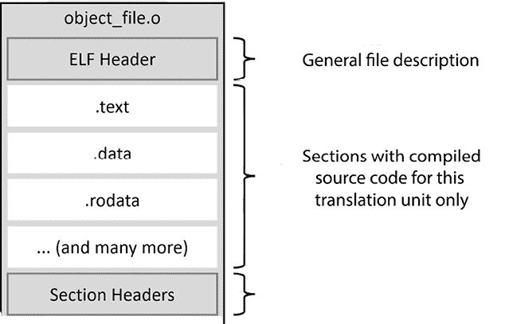
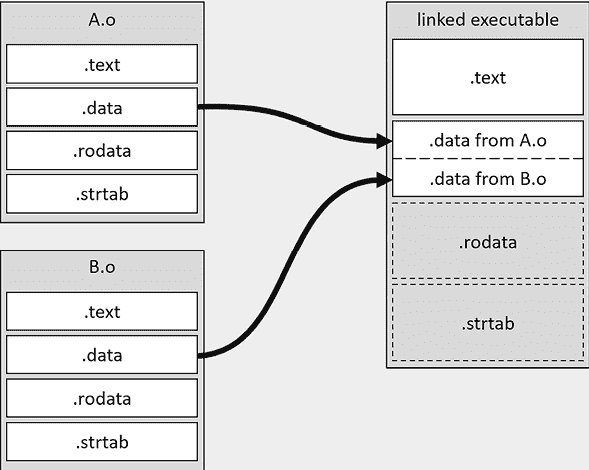
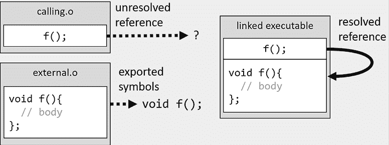
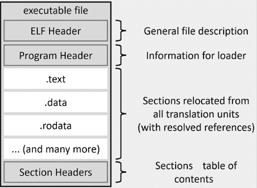

# 第八章：链接可执行文件和库

你可能会认为，一旦我们成功地将源代码编译成二进制文件，我们作为构建工程师的角色就完成了。然而，事实并非完全如此。尽管二进制文件确实包含了 CPU 执行所需的所有代码，但这些代码可能会以复杂的方式分布在多个文件中。我们不希望 CPU 在不同的文件中寻找单独的代码片段。相反，我们的目标是将这些分散的单元合并为一个文件。为了实现这一目标，我们使用了一个称为链接的过程。

快速观察可以发现，CMake 有很少的链接命令，其中`target_link_libraries()`是主要命令。那么，为什么要专门用一整章来讲解这个命令呢？不幸的是，计算机科学几乎没有什么事情是简单的，链接也不例外：为了获得正确的结果，我们需要了解整个过程——我们需要知道链接器是如何工作的，并掌握基本知识。我们将讨论目标文件的内部结构，重定位和引用解析机制的工作原理，以及它们的用途。我们还会讨论最终的可执行文件与其组成部分之间的区别，以及在将程序加载到内存时，系统如何构建进程镜像。

然后，我们将介绍各种类型的库：静态库、共享库和共享模块。尽管它们都叫做“库”，但实际上差异很大。创建一个正确链接的可执行文件依赖于正确的配置，并处理一些具体的细节，例如**位置无关代码**（**PIC**）。

我们将学习链接中的另一个麻烦——**唯一定义规则**（**ODR**）。确保定义的数量是准确的至关重要。管理重复符号特别具有挑战性，尤其是对于共享库。此外，我们还将探讨为什么链接器有时无法找到外部符号，即使可执行文件已正确链接到相关库。

最后，我们将了解如何高效地使用链接器，为在特定框架中进行测试准备我们的解决方案。

本章将涵盖以下主要内容：

+   正确理解链接的基础

+   构建不同类型的库

+   解决 ODR 问题

+   链接顺序和未解析符号

+   将`main()`分离用于测试

# 技术要求

你可以在 GitHub 上找到本章中提到的代码文件，链接地址为：[`github.com/PacktPublishing/Modern-CMake-for-Cpp-2E/tree/main/examples/ch08`](https://github.com/PacktPublishing/Modern-CMake-for-Cpp-2E/tree/main/examples/ch08)。

要构建本书中提供的示例，请始终使用推荐的命令：

```cpp
cmake -B <build tree> -S <source tree>
cmake --build <build tree> 
```

确保将`<build tree>`和`<source tree>`占位符替换为合适的路径。提醒一下：**build tree**是目标/输出目录的路径，**source tree**是源代码所在的路径。

# 正确理解链接的基础

我们在*第七章*《使用 CMake 编译 C++ 源代码》中讨论了 C++ 程序的生命周期。它由五个主要阶段组成——编写、编译、链接、加载和执行。在正确编译所有源代码之后，我们需要将它们组合成一个可执行文件。我们曾提到过，编译过程中生成的目标文件不能被处理器直接执行。那么，为什么呢？

为了回答这个问题，我们需要理解目标文件是广泛使用的**可执行和可链接格式**（**ELF**）的一种变体，该格式在类似 Unix 的系统以及许多其他系统中都很常见。像 Windows 或 macOS 这样的系统有自己的格式，但我们将重点讲解 ELF 格式，以便解释其原理。*图 8.1* 展示了编译器如何构建这些文件：



图 8.1：目标文件的结构

编译器会为每个翻译单元（每个 `.cpp` 文件）准备一个目标文件。这些文件将用于构建我们程序的内存映像。目标文件由以下内容组成：

+   一个**ELF 头**，用于标识目标**操作系统**（**OS**）、文件类型、目标指令集架构，以及有关 ELF 文件中两个头表的位置和大小的详细信息：**程序头**表（在目标文件中不存在）和**区段头**表。

+   按类型分组信息的二进制区段。

+   一个**区段头**表，包含有关名称、类型、标志、内存中的目标地址、文件中的偏移量以及其他杂项信息。它用于了解文件中有哪些区段以及它们的位置，类似于目录。

当编译器处理你的源代码时，它将收集的信息按不同区段分类。这些区段构成了 ELF 文件的核心，位于**ELF 头**和**区段头**之间。以下是一些这样的区段示例：

+   `.text` 区段包含机器代码，包含所有指定给处理器执行的指令。

+   `.data` 区段保存初始化的全局变量和静态变量的值。

+   `.bss` 区段为未初始化的全局变量和静态变量保留空间，这些变量在程序启动时会被初始化为零。

+   `.rodata` 区段保存常量的值，使其成为只读数据段。

+   `.strtab` 区段是一个字符串表，包含常量字符串，例如从基础的 `hello.cpp` 示例中提取的“Hello World”。

+   `.shstrtab` 区段是一个字符串表，保存所有其他区段的名称。

这些部分与最终的可执行文件版本非常相似，该文件将被加载到内存中运行我们的应用程序。然而，我们不能仅仅将目标文件连接起来并将结果文件加载到内存中。没有谨慎处理的合并会导致一系列复杂的问题。首先，我们会浪费空间和时间，消耗过多的 RAM 页。将指令和数据传输到 CPU 缓存也会变得繁琐。整个系统不得不处理更高的复杂性，浪费宝贵的周期，并且在执行过程中在无数的 `.text`、`.data` 和其他部分之间跳跃。

我们将采用更有组织的方法：每个目标文件的各个部分将与其他目标文件中相同类型的部分分组。这个过程叫做**重定位**，这也是目标文件的 ELF 文件类型被标记为“可重定位”的原因。但是重定位不仅仅是将匹配的部分组合在一起。它还涉及更新文件中的内部引用，例如变量地址、函数地址、符号表索引和字符串表索引。这些值在各自的目标文件中是局部的，并且从零开始编号。因此，在合并文件时，必须调整这些值，以确保它们引用合并后的文件中的正确地址。

*图 8.2* 展示了重定位的过程 —— `.text` 部分已经被重定位，`.data` 部分正在从所有链接的文件中组装，而 `.rodata` 和 `.strtab` 部分将遵循相同的过程（为了简便，图中没有包含头部）：



图 8.2：.data 部分的重定位

接下来，链接器需要解析引用。当一个翻译单元中的代码引用了另一个翻译单元中定义的符号时，无论是通过包含其头文件还是使用 `extern` 关键字，编译器都会确认声明，假设定义将在稍后提供。链接器的主要作用是收集这些未解决的外部符号引用，然后识别并填充它们在合并后的可执行文件中的正确地址。*图 8.3* 显示了该引用解析过程的一个简单示例：



图 8.3：引用解析

如果程序员不了解其工作原理，链接过程中的这一部分可能会成为问题的根源。我们可能会遇到无法找到对应外部符号的未解决引用，或者相反，提供了过多的定义，链接器不知道该选择哪个。

最终的可执行文件与目标文件非常相似，因为它包含了已重定位的部分和已解析的引用、**段头表**以及当然描述整个文件的**ELF 头**。主要的区别是存在一个**程序头**，如下图所示：



图 8.4：ELF 中可执行文件的结构

**程序头**位于**ELF 头**之后。操作系统的**加载器**将读取这个**程序头**，以便设置程序、配置内存布局并创建进程映像。**程序头**中的条目指定哪些部分会被复制、复制的顺序，以及在虚拟内存中的地址。它们还包含有关访问控制标志（读、写或执行）以及其他一些有用信息。每个命名的部分将在创建的进程中由一块内存表示；这种内存块称为**段**。

目标文件也可以被捆绑到库中，这是一种中间产品，可以在最终的可执行文件或其他库中使用。

现在我们已经理解了链接的原理，接下来让我们进入下一部分，讨论三种不同类型的库。

# 构建不同类型的库

在编译源代码之后，通常希望避免在相同平台上重新编译，或者甚至将编译结果与外部项目共享。虽然可以分发最初生成的单个目标文件，但这会带来一些挑战。分发多个文件并逐个将它们集成到构建系统中可能会很麻烦，尤其是在处理大量文件时。一种更高效的方法是将所有目标文件合并为一个单独的单元进行共享。CMake 可以大大简化这一任务。我们可以通过简单的 `add_library()` 命令（配合 `target_link_libraries()` 命令）来生成这些库。

按惯例，所有库都有一个共同的前缀 `lib`，并使用系统特定的扩展名来表示它们是哪种类型的库：

+   静态库在类 Unix 系统上具有 `.a` 扩展名，在 Windows 上则是 `.lib`。

+   共享库（和模块）在某些类 Unix 系统（如 Linux）上具有 `.so` 扩展名，在其他系统（如 macOS）上则是 `.dylib`。在 Windows 上，它们的扩展名是 `.dll`。

+   共享模块通常与共享库使用相同的扩展名，但并非总是如此。在 macOS 上，它们可以使用 `.so`，特别是当模块是从另一个 Unix 平台移植过来时。

构建库（静态库、共享库或共享模块）的过程通常被称为“链接”，如在 `ch08/01-libraries` 项目的构建输出中所见：

```cpp
[ 33%] Linking CXX static library libmy_static.a
[ 66%] Linking CXX shared library libmy_shared.so
[100%] Linking CXX shared module libmy_module.so
[100%] Built target module_gui 
```

然而，并非所有前述的库在创建时都一定会使用链接器。某些库的创建过程可能会跳过像重定位和引用解析等步骤。

让我们深入了解每种库类型，以理解它们各自的工作原理。

## 静态库

静态库本质上是存储在归档文件中的原始目标文件集合。有时，它们会通过索引来加速链接过程。在类 Unix 系统上，可以使用 `ar` 工具创建这种归档文件，并通过 `ranlib` 进行索引。

在构建过程中，仅将静态库中必要的符号导入到最终的可执行文件中，从而优化其大小和内存使用。这种选择性整合确保了可执行文件是自包含的，运行时不需要外部文件。

要创建静态库，我们可以简单地使用我们在前几章中已经看到的命令：

```cpp
add_library(<name> [<source>...]) 
```

这个简写代码默认会生成一个静态库。通过将`BUILD_SHARED_LIBS`变量设置为`ON`，可以覆盖这一行为。如果我们无论如何都想构建一个静态库，可以提供一个明确的关键字：

```cpp
add_library(<name> STATIC [<source>...]) 
```

使用静态库可能并不总是理想的选择，特别是当我们希望在同一台机器上共享多个应用程序编译后的代码时。

## 共享库

共享库与静态库有显著不同。它们是使用链接器构建的，链接器完成了链接的两个阶段。这会生成一个完整的文件，包含节头、节以及节头表，如*图 8.1*所示。

共享库，通常被称为共享对象，可以在多个不同的应用程序之间同时使用。当第一个程序使用共享库时，操作系统将该库的一个实例加载到内存中。随后的程序将由操作系统提供相同的地址，得益于复杂的虚拟内存机制。然而，对于每个使用该库的进程，库的`.data`和`.bss`段会被单独实例化。这确保了每个进程可以调整其变量，而不影响其他进程。

得益于这种方法，系统的整体内存使用得到了优化。如果我们使用的是一个广泛认可的库，可能无需将其与程序一起包含，因为它很可能已经在目标机器上可用。然而，如果该库没有预先安装，用户需要在运行应用程序之前手动安装它。如果安装的库版本与预期不符，可能会导致潜在问题。这种问题被称为“依赖地狱”。更多详情请参见本章的*进一步阅读*部分。

我们可以通过明确使用`SHARED`关键字来构建共享库：

```cpp
add_library(<name> SHARED [<source>...]) 
```

由于共享库在程序初始化期间被加载，因此执行程序与磁盘上的实际库文件之间没有直接关联。相反，链接是间接完成的。在类 Unix 系统中，这是通过**共享对象名称**（**SONAME**）实现的，它可以理解为库的“逻辑名称”。

这为库版本控制提供了灵活性，并确保对库的向后兼容性更改不会立即破坏依赖的应用程序。

我们可以使用生成器表达式查询生成的 SONAME 文件的一些路径属性（确保将`target`替换为目标的名称）：

+   `$<TARGET_SONAME_FILE:target>`返回完整路径（`.so.3`）。

+   `$<TARGET_SONAME_FILE_NAME:target>` 仅返回文件名。

+   `$<TARGET_SONAME_FILE_DIR:target>` 返回目录。

这些在更高级的场景中非常有用，我们将在本书稍后部分讨论，包括：

+   在打包和安装过程中正确使用生成的库。

+   为依赖管理编写自定义 CMake 规则。

+   在测试过程中使用 SONAME。

+   在构建后命令中复制或重命名生成的库。

你可能会对其他特定于操作系统的构件有类似需求；为此，CMake 提供了两种生成器表达式，它们提供与 SONAME 相同的后缀。对于 Windows，我们有：

+   `$<TARGET_LINKER_FILE:target>` 返回与生成的 **动态链接库** (**DLL**) 相关联的 `.lib` 导入库的完整路径。请注意，`.lib` 扩展名与静态 Windows 库相同，但它们的应用不同。

+   `$<TARGET_RUNTIME_DLLS:target>` 返回目标在运行时所依赖的 DLL 列表。

+   `$<TARGET_PDB_FILE:target>` 返回 `.pdb` 程序数据库文件的完整路径（用于调试目的）。

由于共享库在程序初始化时加载到操作系统内存中，因此当知道程序将使用哪些库时它们是适用的。那么在运行时需要确定的场景怎么办呢？

## 共享模块

共享模块或模块库是共享库的变种，旨在作为插件在运行时加载。与标准共享库不同，标准共享库在程序启动时自动加载，而共享模块仅在程序明确请求时才会加载。这可以通过系统调用完成：

+   Windows 上的 `LoadLibrary`

+   在 Linux 和 macOS 上使用 `dlopen()` 后跟 `dlsym()` 

这种方法的主要原因是内存节省。许多软件应用程序具有生命周期内并不总是使用的高级功能。每次将此类功能加载到内存中将会非常低效。

另外，我们可能希望为主程序提供一个扩展的途径，能够销售、交付并单独加载具有专门功能的部分。

要构建共享模块，我们需要使用 `MODULE` 关键字：

```cpp
add_library(<name> MODULE [<source>...]) 
```

你不应该尝试将可执行文件与模块链接，因为该模块旨在与可执行文件分开部署，后者将使用该模块。

## 与位置无关的代码（PIC）

由于虚拟内存的使用，今天的程序本质上是某种程度的与位置无关的。这项技术抽象了物理地址。当调用一个函数时，CPU 使用 **内存管理单元** (**MMU**) 将虚拟地址（每个进程从 0 开始）转换为相应的物理地址（在分配时确定）。有趣的是，这些映射不总是遵循特定的顺序。

编译一个库会带来不确定性：我们无法确定哪些进程可能会使用这个库，或者它将位于虚拟内存的哪个位置。我们也无法预测符号的地址或它们相对于库的机器代码的位置。为了解决这个问题，我们需要另一个间接层。

**PIC**的引入是为了将符号（如函数和全局变量的引用）映射到它们的运行时地址。PIC 为二进制文件引入了一个新的部分：**全局偏移表**（**GOT**）。在链接过程中，GOT 部分相对于`.text`部分（程序代码）的相对位置会被计算出来。所有的符号引用将通过一个偏移量指向 GOT 中的占位符。

当程序加载时，GOT（全局偏移表）部分会转变为一个内存段。随着时间的推移，这个段会积累符号的运行时地址。这种方法被称为“懒加载”，它确保加载器仅在需要时填充特定的 GOT 条目。

所有共享库和模块的源代码必须在编译时启用 PIC 标志。通过将`POSITION_INDEPENDENT_CODE`目标属性设置为`ON`，我们会告诉 CMake 适当添加编译器特定的标志，例如 GCC 或 Clang 的`-fPIC`。

对于共享库，这个属性是自动启用的。然而，如果一个共享库依赖于另一个目标，例如静态库或对象库，你还必须将这个属性应用于依赖的目标：

```cpp
set_target_properties(dependency
                      PROPERTIES POSITION_INDEPENDENT_CODE ON) 
```

忽视这一步骤会导致 CMake 中的冲突，因为它会检查这个属性是否存在不一致。你可以在*第五章，*处理目标*部分的*处理冲突的传播属性*小节中找到更深入的讨论。

我们接下来的讨论重点是符号。具体来说，接下来的部分将探讨命名冲突的挑战，这可能导致歧义和定义不一致。

# 解决 ODR 问题

Netscape 的首席固执者兼技术远见者 Phil Karlton 曾说过一句话，他说的对：

> “计算机科学中有两件困难的事情：缓存失效和命名事物。”

名称之所以困难，原因有很多。它们必须既精确又简单，简短又富有表现力。这不仅赋予了它们意义，而且使程序员能够理解原始实现背后的概念。C++和许多其他语言增加了另一个要求：大多数名称必须是唯一的。

这个要求表现为 ODR（单一定义规则）：在一个单独的翻译单元（一个`.cpp`文件）的范围内，你必须准确地定义一个符号一次，即使相同的名称（无论是变量、函数、类类型、枚举、概念还是模板）被多次声明。为了澄清，“声明”引入了符号，而“定义”提供了符号的所有细节，比如变量的值或函数的主体。

在链接过程中，这条规则会扩展到整个程序，涵盖你在代码中有效使用的所有非内联函数和变量。考虑以下包含三个源文件的示例：

**ch08/02-odr-fail/shared.h**

```cpp
int i; 
```

**ch08/02-odr-fail/one.cpp**

```cpp
#include <iostream>
#include "shared.h"
int main() {
  std::cout << i << std::endl;
} 
```

**ch08/02-odr-fail/two.cpp**

```cpp
#include "shared.h" 
```

它还包含一个列表文件：

**ch08/02-odr-fail/CMakeLists.txt**

```cpp
cmake_minimum_required(VERSION 3.26)
project(ODR CXX)
set(CMAKE_CXX_STANDARD 20)
add_executable(odr one.cpp two.cpp) 
```

如你所见，示例非常简单——我们创建了一个 `shared.h` 头文件，定义了 `i` 变量，该变量在两个不同的翻译单元中使用：

+   `one.cpp` 仅将 `i` 打印到屏幕

+   `two.cpp` 仅包含头文件

但是当我们尝试构建示例时，链接器会产生以下错误：

```cpp
/usr/bin/ld:
CMakeFiles/odr.dir/two.cpp.o:(.bss+0x0): multiple definition of 'i';
CMakeFiles/odr.dir/one.cpp.o:(.bss+0x0): first defined here
collect2: error: ld returned 1 exit status 
```

符号不能定义多次。然而，有一个重要的例外。类型、模板和 `extern` 内联函数可以在多个翻译单元中重复定义，但前提是这些定义完全相同（即它们具有完全相同的令牌序列）。

为了演示这一点，让我们将变量的定义替换为类型的定义：

**ch08/03-odr-success/shared.h**

```cpp
struct shared {
  static inline int i = 1;
}; 
```

然后，我们按以下方式使用它：

**ch08/03-odr-success/one.cpp**

```cpp
#include <iostream>
#include "shared.h"
int main() {
  std::cout << shared::i << std::endl;
} 
```

另外两个文件，`two.cpp` 和 `CMakeLists.txt`，与 `02-odr-fail` 示例中的保持一致。这样的变化将允许链接成功：

```cpp
[ 33%] Building CXX object CMakeFiles/odr.dir/one.cpp.o
[ 66%] Building CXX object CMakeFiles/odr.dir/two.cpp.o
[100%] Linking CXX executable odr
[100%] Built target odr 
```

另外，我们可以将变量标记为仅对某个翻译单元局部（它不会被导出到目标文件之外）。为此，我们将使用 `static` 关键字（该关键字是特定上下文的，因此不要将其与类中的 `static` 关键字混淆），如下所示：

**ch08/04-odr-success/shared.h**

```cpp
static int i; 
```

如果你尝试链接这个示例，你会发现它有效，这意味着静态变量为每个翻译单元单独存储。因此，对一个的修改不会影响另一个。

ODR 规则对于静态库和目标文件的作用完全相同，但当我们使用共享库构建代码时，情况就不那么清晰了——我们来看一下。

## 排序动态链接的重复符号

链接器将允许此处的重复符号。在以下示例中，我们将创建两个共享库 `A` 和 `B`，其中包含一个 `duplicated()` 函数和两个唯一的 `a()` 和 `b()` 函数：

**ch08/05-dynamic/a.cpp**

```cpp
#include <iostream>
void a() {
  std::cout << "A" << std::endl;
}
void duplicated() {
  std::cout << "duplicated A" << std::endl;
} 
```

第二个实现文件几乎与第一个完全相同：

**ch08/05-dynamic/b.cpp**

```cpp
#include <iostream>
void b() {
  std::cout << "B" << std::endl;
}
void duplicated() {
  std::cout << "duplicated B" << std::endl;
} 
```

现在，让我们使用每个函数来看看会发生什么（为了简化，我们将它们声明为 `extern`）：

**ch08/05-dynamic/main.cpp**

```cpp
extern void a();
extern void b();
extern void duplicated();
int main() {
  a();
  b();
  duplicated();
} 
```

上面的代码将运行每个库中的唯一函数，然后调用在两个动态库中定义的具有相同签名的函数。你认为会发生什么？在这种情况下，链接顺序会有影响吗？让我们分别测试两种情况：

+   `main_1` 目标将首先与 `a` 库链接

+   `main_2` 目标将首先与 `b` 库链接

列表文件如下所示：

**ch08/05-dynamic/CMakeLists.txt**

```cpp
cmake_minimum_required(VERSION 3.26)
project(Dynamic CXX)
add_library(a SHARED a.cpp)
add_library(b SHARED b.cpp)
add_executable(main_1 main.cpp)
target_link_libraries(main_1 a b)
add_executable(main_2 main.cpp)
target_link_libraries(main_2 b a) 
```

构建并运行这两个可执行文件后，我们将看到以下输出：

```cpp
root@ce492a7cd64b:/root/examples/ch08/05-dynamic# b/main_1
A
B
duplicated A
root@ce492a7cd64b:/root/examples/ch08/05-dynamic# b/main_2
A
B
duplicated B 
```

啊哈！显然，库的链接顺序对链接器非常重要。如果我们不小心，这可能会导致混淆。与人们的想法相反，命名冲突在实践中并不罕见。

如果我们定义了本地可见的符号，它们将优先于 DLL 中的符号。如果在`main.cpp`中定义了`duplicated()`函数，它将覆盖两个目标的行为。

在从库中导出名称时一定要小心，因为你迟早会遇到命名冲突。

## 使用命名空间——不要依赖链接器

**C++命名空间**的发明是为了避免这种奇怪的问题，并更有效地处理 ODR。最佳做法是将你的库代码封装在一个以库名命名的命名空间中。这种策略有助于防止因重复符号而引发的复杂问题。

在我们的项目中，可能会遇到一个共享库链接到另一个库，形成一个长链。这样的情况并不像看起来那样罕见，尤其是在复杂的配置中。然而，重要的是要理解，仅仅将一个库链接到另一个库并不会引入任何命名空间的继承。在这个链中的每个链接的符号仍然保持其编译时的原始命名空间。

虽然链接器的复杂性非常有趣，有时也至关重要，但另一个紧迫的问题常常浮现出来：已正确定义的符号神秘地消失了。我们将在下一节中深入探讨这个问题。

# 链接顺序和未解决的符号

链接器的行为有时看起来很任性，似乎无缘无故就抛出抱怨。这对于那些不熟悉这个工具细节的新手程序员来说，常常是一个特别令人烦恼的挑战。可以理解的是，他们通常尽量避免接触构建配置，直到不得不进行更改——也许是集成他们开发的库——这时一切都乱套了。

试想这样一种情况：一个相对简单的依赖链，主可执行文件依赖于一个“外部”库。而这个外部库又依赖于一个包含必需的`int b`变量的“嵌套”库。突然，一个令人费解的错误信息出现在程序员面前：

```cpp
outer.cpp:(.text+0x1f): undefined reference to 'b' 
```

这样的错误并不罕见。通常，它们表示链接器中忘记添加某个库。然而，在这种情况下，库似乎已经正确地添加到了`target_link_libraries()`命令中：

**ch08/06-unresolved/CMakeLists.txt**

```cpp
cmake_minimum_required(VERSION 3.26)
project(Order CXX)
add_library(outer outer.cpp)
add_library(nested nested.cpp)
add_executable(main main.cpp)
target_link_libraries(main **nested** outer) 
```

那该怎么办！？很少有错误能像这个一样令人抓狂，难以调试和理解。我们看到的是链接顺序不正确。让我们深入源代码找出原因：

**ch08/06-unresolved/main.cpp**

```cpp
#include <iostream>
extern int a;
int main() {
  std::cout << a << std::endl;
} 
```

代码看起来足够简单——我们将打印一个外部变量`a`，它可以在`outer`库中找到。我们事先用`extern`关键字声明它。以下是该库的源代码：

**ch08/06-unresolved/outer.cpp**

```cpp
extern int b;
int a = b; 
```

这也很简单 —— `outer` 依赖于 `nested` 库来提供外部变量 `b`，然后将其赋值给 `a` 变量。让我们查看 `nested` 的源代码，确认我们没有遗漏定义：

**ch08/06-unresolved/nested.cpp**

```cpp
int b = 123; 
```

确实，我们已经为 `b` 提供了定义，并且由于它没有用 `static` 关键字标记为局部，因此它正确地从 `nested` 目标中导出。正如我们之前看到的，这个目标与 `main` 可执行文件在 `CMakeLists.txt` 中进行了链接：

```cpp
target_link_libraries(main **nested** outer) 
```

那么，`undefined reference to 'b'` 错误是从哪里来的呢？

解析未定义符号是这样的 —— 链接器按从左到右的顺序处理二进制文件。在链接器遍历这些二进制文件时，它将执行以下操作：

1.  收集所有从该二进制文件导出的未定义符号，并将它们存储以供以后使用。

1.  尝试用此二进制文件中定义的符号来解析之前所有已处理二进制文件中收集到的未定义符号。

1.  对下一个二进制文件重复这个过程。

如果在整个操作完成后仍然有未定义的符号，链接会失败。这就是我们例子中的情况（CMake 将可执行目标的目标文件放在库文件之前）：

1.  链接器处理了 `main.o`，发现了对 `a` 变量的未定义引用，并将其收集起来以便将来解析。

1.  链接器处理了`libnested.a`，没有发现未定义的引用，也没有需要解决的问题。

1.  链接器处理了 `libouter.a`，发现了对 `b` 变量的未定义引用，并解析了对 `a` 变量的引用。

我们确实正确解析了对 `a` 变量的引用，但没有解析 `b` 变量的引用。为了解决这个问题，我们需要反转链接顺序，使 `nested` 排在 `outer` 后面：

```cpp
target_link_libraries(main outer **nested**) 
```

有时，我们会遇到循环引用的情况，其中翻译单元相互定义符号，且没有单一的有效顺序能满足所有引用。解决这个问题的唯一方法是处理某些目标两次：

```cpp
target_link_libraries(main nested outer nested) 
```

这是一种常见做法，但使用时稍显不优雅。如果你有幸使用 CMake 3.24 或更新版本，你可以利用 `$<LINK_GROUP>` 生成器表达式和 `RESCAN` 特性，添加链接器特定的标志，例如 `--start-group` 或 `--end-group`，以确保所有符号都被评估：

```cpp
target_link_libraries(main "$<LINK_GROUP:RESCAN,nested,outer>") 
```

请记住，这种机制引入了额外的处理步骤，应该仅在必要时使用。需要（并且有正当理由）使用循环引用的情况非常罕见。遇到这个问题通常表示设计不当。它在 Linux、BSD、SunOS 和 Windows 上的 GNU 工具链中得到支持。

我们现在准备处理 ODR 问题了。我们可能会遇到什么其他问题？在链接时符号异常丢失。让我们找出问题所在。

## 处理未引用的符号

当库，特别是静态库被创建时，它们本质上是由多个目标文件组成的档案。我们提到过，一些归档工具还可能创建符号索引以加速链接过程。这些索引提供了每个符号与其所在目标文件的映射。当符号被解析时，包含该符号的目标文件将被并入最终的二进制文件（一些链接器进一步优化，通过仅包含文件的特定部分）。如果静态库中的某个目标文件没有任何符号被引用，那么该目标文件可能会完全被省略。因此，静态库中只有实际使用的部分才会出现在最终的二进制文件中。

然而，在某些场景下，你可能需要一些未引用的符号：

+   **静态初始化**：如果你的库有全局对象需要初始化（即它们的构造函数在 `main()` 之前执行），并且这些对象没有在其他地方直接引用；链接器可能会将它们从最终的二进制文件中排除。

+   **插件架构**：如果你正在开发一个插件系统（使用模块库），其中的代码需要在运行时被识别并加载，而不需要直接引用。

+   **静态库中的未使用代码**：如果你正在开发一个静态库，其中包含一些实用功能或代码，这些代码不一定总是被直接引用，但你仍希望它出现在最终的二进制文件中。

+   **模板实例化**：对于依赖于模板的库；如果没有明确提到，某些模板实例化可能在链接过程中被忽略。

+   **链接问题**：特别是在复杂的构建系统或庞大的代码库中，链接可能会产生不可预测的结果，其中某些符号或代码段似乎缺失。

在这些情况下，强制在链接过程中包含所有目标文件可能是有益的。这通常通过一种称为 `whole-archive` 链接模式来实现。

具体的编译器链接标志有：

+   `--whole-archive` 用于 GCC

+   `--force-load` 用于 Clang

+   `/WHOLEARCHIVE` 用于 MSVC

为此，我们可以使用 `target_link_options()` 命令：

```cpp
target_link_options(tgt INTERFACE
  -Wl,--whole-archive $<TARGET_FILE:lib1> -Wl,--no-whole-archive
) 
```

然而，这个命令是特定于链接器的，因此需要使用生成器表达式来检测不同的编译器并提供相应的标志。幸运的是，CMake 3.24 引入了一个新的生成器表达式来实现这一目的：

```cpp
target_link_libraries(tgt INTERFACE
  "$<LINK_LIBRARY:WHOLE_ARCHIVE,lib1>"
) 
```

使用这种方法可以确保 `tgt` 目标包含 `lib1` 库中的所有目标文件。

然而，仍需考虑一些潜在的缺点：

+   **增加的二进制文件大小**：这个标志可能会显著增大你的最终二进制文件，因为指定库中的所有对象都会被包含在内，无论它们是否被使用。

+   **符号冲突的潜在风险**：引入所有符号可能会导致与其他符号冲突，进而产生链接错误。

+   **维护开销**：过度依赖此类标志可能会掩盖代码设计或结构中的潜在问题。

在了解如何解决常见的链接问题后，我们现在可以继续准备项目进行测试。

# 为了测试，分离 `main()` 函数

正如我们所建立的那样，链接器强制执行 ODR，并确保在链接过程中所有外部符号提供它们的定义。我们可能面临的另一个与链接器相关的挑战是项目的优雅和高效的测试。

在理想的情况下，我们应该测试与生产环境中运行的完全相同的源代码。一个全面的测试流水线会构建源代码，对生成的二进制文件进行测试，然后打包并分发可执行文件（可选择不包括测试本身）。

但是我们如何实现这一点呢？可执行文件通常有一个精确的执行流程，通常涉及读取命令行参数。C++ 的编译性质不容易支持可以临时注入到二进制文件中的可插拔单元，仅用于测试。这表明我们可能需要采取更为细致的方法来应对这一挑战。

幸运的是，我们可以使用链接器以一种优雅的方式帮助我们解决这个问题。考虑将程序的所有逻辑从 `main()` 提取到一个外部函数 `start_program()` 中，如下所示：

**ch08/07-testing/main.cpp**

```cpp
extern int start_program(int, const char**);
int main(int argc, const char** argv) {
  return **start_program****(argc, argv);**
} 
```

当新写的 `main()` 函数只是将参数转发到另一个地方定义的函数（在另一个文件中）时，跳过测试是合理的。我们可以创建一个包含原始源代码的库，`main()` 中的源代码被包装在一个新的函数 `start_program()` 中。在这个示例中，代码检查命令行参数的数量是否大于 `1`：

**ch08/07-testing/program.cpp**

```cpp
#include <iostream>
int **start_program**(int argc, const char** argv) {
  if (argc <= 1) {
    std::cout << "Not enough arguments" << std::endl;
    return 1;
  }
  return 0;
} 
```

现在我们可以准备一个构建该应用程序并将这两个翻译单元链接在一起的项目：

**ch08/07-testing/CMakeLists.txt**

```cpp
cmake_minimum_required(VERSION 3.26)
project(Testing CXX)
add_library(program program.cpp)
add_executable(main main.cpp)
**target_link_libraries****(main program)** 
```

`main` 目标仅提供所需的 `main()` 函数。命令行参数验证逻辑包含在 `program` 目标中。我们现在可以通过创建另一个具有自己 `main()` 函数的可执行文件来进行测试，该文件将托管测试用例。

在现实世界的场景中，像 **GoogleTest** 或 **Catch2** 这样的框架将提供自己的 `main()` 方法，可以替换程序的入口点并运行所有定义的测试。我们将在 *第十一章*，*测试框架* 中深入探讨实际测试的主题。现在，让我们专注于一般原则，并直接在 `main()` 函数中编写自己的测试用例：

**ch08/07-testing/test.cpp**

```cpp
#include <iostream>
extern int start_program(int, const char**);
using namespace std;
int main()
{
  cout << "Test 1: Passing zero arguments to start_program:\n";
  auto exit_code = start_program(0, nullptr);
  if (exit_code == 0)
    cout << "Test FAILED: Unexpected zero exit code.\n";
  else
    cout << "Test PASSED: Non-zero exit code returned.\n"; 
  cout << endl;
  cout << "Test 2: Passing 2 arguments to start_program:\n";
  const char *arguments[2] = {"hello", "world"};
  exit_code = start_program(2, arguments);
  if (exit_code != 0)
    cout << "Test FAILED: Unexpected non-zero exit code\n";
  else
    cout << "Test PASSED\n";
} 
```

上述代码将调用 `start_program` 两次，分别带有和不带有参数，并检查返回的退出代码是否正确。如果测试正确执行，您将看到以下输出：

```cpp
./test
Test 1: Passing zero arguments to start_program:
Not enough arguments
Test PASSED: Non-zero exit code returned
Test 2: Passing 2 arguments to start_program:
Test PASSED 
```

`Not enough arguments` 行来自 `start_program()`，这是一个预期的错误消息（我们在检查程序是否正确失败）。

这个单元测试在清晰的代码和优雅的测试实践方面还有很多改进空间，但它是一个开始。

我们现在已经定义了两次 `main()`：

+   在`main.cpp`中用于生产环境

+   在`test.cpp`中用于测试目的

现在，让我们在`CMakeLists.txt`的底部定义测试可执行文件：

```cpp
add_executable(test test.cpp)
target_link_libraries(test program) 
```

这个新增内容创建了一个新的目标，链接到与我们的生产代码相同的二进制代码。但它赋予了我们根据需要调用所有导出函数的灵活性。得益于此，我们可以自动运行所有代码路径并检查它们是否按预期工作。太棒了！

# 总结

在 CMake 中的链接最初看起来可能很简单，但随着我们深入探讨，我们发现背后隐藏了更多内容。毕竟，链接可执行文件并不像拼图一样简单。当我们深入研究目标文件和库的结构时，我们清楚地看到，存储各种类型的数据、指令、符号名称等的段需要重新排序。在程序可以运行之前，这些段将进行所谓的重定位。

解决符号的问题也至关重要。链接器必须遍历所有翻译单元中的引用，确保没有遗漏。一旦解决了这些问题，链接器接着会创建程序头并将其放入最终的可执行文件中。这个头文件为系统加载器提供了指令，详细说明了如何将整合后的段落转换为构成进程运行时内存映像的段。我们还讨论了三种类型的库：静态库、共享库和共享模块。我们研究了它们之间的差异，以及在某些场景下某些库可能比其他库更适合使用。此外，我们还提到了一些有关 PIC 的内容——这是一个强大的概念，它促进了符号的懒绑定。

ODR 是一个 C++概念，但正如我们所看到的，它被链接器强力执行。我们探讨了如何解决静态库和动态库中最基本的符号重复问题。我们还强调了在可能的情况下使用命名空间的价值，并建议不要过度依赖链接器来避免符号冲突。

对于一个看起来可能很简单的步骤（鉴于 CMake 专门用于链接的命令较少），它确实有一些复杂性。一个较为棘手的方面是链接顺序，尤其是在处理具有嵌套和循环依赖的库时。我们现在理解了链接器是如何选择最终二进制文件中的符号的，以及在需要时如何覆盖这种行为。

最后，我们研究了如何利用链接器准备我们的程序进行测试——通过将`main()`函数分离到另一个翻译单元中。这使我们能够引入另一个可执行文件，该文件运行与生产中将要执行的机器代码完全相同的测试。

通过我们对链接的全新理解，我们已经准备好将外部库引入到 CMake 项目中。在下一章中，我们将学习如何管理 CMake 中的依赖关系。

# 深入阅读

关于本章讨论主题的更多信息，请参考以下内容：

+   ELF 文件的结构：[`en.wikipedia.org/wiki/Executable_and_Linkable_Format`](https://en.wikipedia.org/wiki/Executable_and_Linkable_Format)

+   `add_library()`的 CMake 手册：[`cmake.org/cmake/help/latest/command/add_library.html`](https://cmake.org/cmake/help/latest/command/add_library.html)

+   依赖地狱：[`en.wikipedia.org/wiki/Dependency_hell`](https://en.wikipedia.org/wiki/Dependency_hell)

+   模块和共享库之间的区别：[`stackoverflow.com/questions/4845984/difference-between-modules-and-shared-libraries`](https://stackoverflow.com/questions/4845984/difference-between-modules-and-shared-libraries)

# 加入我们社区的 Discord

加入我们社区的 Discord 空间，与作者和其他读者一起讨论：

[`discord.com/invite/vXN53A7ZcA`](https://discord.com/invite/vXN53A7ZcA)


