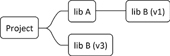

# 第九章：在 CMake 中管理依赖项

解决方案的大小无关紧要；随着项目的增长，你很可能会选择依赖其他项目。避免创建和维护模板代码的工作至关重要，这样可以腾出时间专注于真正重要的事情：业务逻辑。外部依赖有多种用途。它们提供框架和功能，解决复杂问题，并在构建和确保代码质量方面发挥关键作用。这些依赖项可以有所不同，从像**Protocol Buffers**（**Protobuf**）这样的专用编译器到像 Google Test 这样的测试框架。

在处理开源项目或内部代码时，高效管理外部依赖项至关重要。手动进行这些管理将需要大量的设置时间和持续的支持。幸运的是，CMake 在处理各种依赖管理方法方面表现出色，同时能够保持与行业标准的同步。

我们将首先学习如何识别和利用主机系统上已有的依赖项，从而避免不必要的下载和延长的编译时间。这项任务相对简单，因为许多包要么与 CMake 兼容，要么 CMake 自带对其的支持。我们还将探索如何指示 CMake 查找并包含那些没有本地支持的依赖项。对于旧版包，某些情况下采用替代方法可能会更有效：我们可以使用曾经流行的 `pkg-config` 工具来处理更繁琐的任务。

此外，我们将深入探讨如何管理尚未安装在系统上的在线可用依赖项。我们将研究如何从 HTTP 服务器、Git 和其他类型的仓库中获取这些依赖项。我们还将讨论如何选择最佳方法：首先在系统内搜索，如果未找到包，则转而获取。最后，我们将回顾一种较旧的技术，用于下载外部项目，这在某些特殊情况下可能仍然适用。

在本章中，我们将涵盖以下主要内容：

+   使用已安装的依赖项

+   使用系统中未安装的依赖项

# 技术要求

你可以在 GitHub 上找到本章中的代码文件，链接为 [`github.com/PacktPublishing/Modern-CMake-for-Cpp-2E/tree/main/examples/ch09`](https://github.com/PacktPublishing/Modern-CMake-for-Cpp-2E/tree/main/examples/ch09)。

要构建本书中提供的示例，始终使用推荐的命令：

```cpp
cmake -B <build tree> -S <source tree>
cmake --build <build tree> 
```

确保将 `<build tree>` 和 `<source tree>` 占位符替换为适当的路径。提醒一下：**build tree** 是目标/输出目录的路径，**source tree** 是你的源代码所在的路径。

# 使用已安装的依赖项

当我们的项目依赖于一个流行的库时，操作系统很可能已经安装了正确的包。我们只需要将它连接到项目的构建过程中。我们该怎么做呢？我们需要找到包在系统中的位置，以便 CMake 能够使用它的文件。手动完成这一过程是可行的，但每个环境都有些不同。在一个系统上有效的路径可能在另一个系统上无效。因此，我们应该在构建时自动找到这些路径。有多种方法可以实现这一点，但通常最好的方法是 CMake 内置的`find_package()`命令，它知道如何找到许多常用的包。

如果我们的包不受支持，我们有两个选择：

+   我们可以编写一个小插件，称为`find-module`，来帮助`find_package()`。

+   我们可以使用一种较旧的方法，叫做`pkg-config`。

让我们先从推荐的选项开始。

## 使用 CMake 的`find_package()`查找包。

让我们首先来看以下场景：你想改进网络通信或数据存储的方式。简单的纯文本文件或像 JSON 和 XML 这样的开放文本格式在大小上过于冗长。使用二进制格式会有所帮助，而像谷歌的 Protobuf 这样的知名库看起来是答案。

你已经阅读了说明并在系统上安装了所需的内容。现在该怎么办呢？如何让 CMake 的`find_package()`找到并使用这个新库？

要执行这个示例，我们必须安装我们想使用的依赖项，因为`find_package()`命令只会查找已经安装在系统中的包。它假设你已经安装了所有必要的包，或者用户知道如何安装所需的包。如果你想处理其他情况，你需要一个备用计划。你可以在*使用系统中不存在的依赖项*部分找到更多信息。

对于 Protobuf，情况相对简单：你可以从官方仓库（[`github.com/protocolbuffers/protobuf`](https://github.com/protocolbuffers/protobuf)）下载、编译并安装库，或者使用操作系统中的包管理器。如果你按照*第一章：CMake 的第一步*中提到的 Docker 镜像进行操作，你的依赖项已经安装好了，你无需做任何事情。然而，如果你想自己尝试安装，Debian Linux 上安装 Protobuf 库和编译器的命令如下：

```cpp
$ apt update
$ apt install protobuf-compiler libprotobuf-dev 
```

目前很多项目选择支持 CMake。它们通过创建一个**配置文件**并在安装过程中将其放入合适的系统目录来实现这一点。配置文件是选择支持 CMake 的项目中不可或缺的一部分。

如果你想使用一个没有配置文件的库，别担心。CMake 支持一种外部机制来查找此类库，称为**查找模块**。与配置文件不同，查找模块不是它们帮助定位的项目的一部分。实际上，CMake 本身通常会为许多流行的库提供这些查找模块。

如果你卡住了，既没有配置文件也没有查找模块，你还有其他选择：

+   为特定包编写自己的查找模块并将其包含到你的项目中

+   使用 FindPkgConfig 模块来利用传统的 Unix 包定义文件

+   编写配置文件并请求包维护者将其包含进来

你可能会认为自己还没准备好创建这样的合并请求。没关系，因为你很可能不需要这么做。CMake 自带了超过 150 个查找模块，可以找到如 Boost、bzip2、curl、curses、GIF、GTK、iconv、ImageMagick、JPEG、Lua、OpenGL、OpenSSL、PNG、PostgreSQL、Qt、SDL、Threads、XML-RPC、X11 和 zlib 等库，也包括我们在本例中将使用的 Protobuf 文件。完整列表可以在 CMake 文档中找到（请参见*进一步阅读*部分）。

CMake 的`find_package()`命令可以使用查找模块和配置文件。CMake 首先检查其内建的查找模块。如果没有找到需要的模块，它会继续检查不同包提供的配置文件。CMake 会扫描通常安装包的路径（取决于操作系统）。它会寻找与这些模式匹配的文件：

+   `<CamelCasePackageName>Config.cmake`

+   `<kebab-case-package-name>-config.cmake`

如果你想将外部查找模块添加到你的项目中，设置`CMAKE_MODULE_PATH`变量。CMake 会首先扫描这个目录。

回到我们的示例，目标很简单：我想展示我可以构建一个有效使用 Protobuf 的项目。别担心，你不需要了解 Protobuf 就能理解发生了什么。简单来说，Protobuf 是一个将数据以特定二进制格式保存的库。这使得将 C++对象读写到文件或通过网络传输变得容易。为了设置这个，我们使用一个`.proto`文件来给 Protobuf 定义数据结构：

**ch09/01-find-package-variables/message.proto**

```cpp
syntax = "proto3";
message Message {
    int32 id = 1;
} 
```

这段代码是一个简单的模式定义，包含了一个 32 位整数。Protobuf 包自带一个二进制文件，该文件会将这些`.proto`文件编译成 C++源文件和头文件，我们的应用程序可以使用这些文件。我们需要将这个编译步骤加入到构建过程中，但稍后我们会回到这个话题。现在，让我们看看`main.cpp`文件如何使用 Protobuf 生成的输出：

**ch09/01-find-package-variables/main.cpp**

```cpp
**#****include****"message.pb.h"**
#include <fstream>
using namespace std;
int main()
{
  **Message m;**
  **m.****set_id****(****123****);**
  **m.****PrintDebugString****();**
  fstream fo("./hello.data", ios::binary | ios::out);
  **m.****SerializeToOstream****(&fo);**
  fo.close();
  return 0;
} 
```

我已经包含了一个 `message.pb.h` 头文件，我期望 Protobuf 会生成这个文件。这个头文件将包含在 `message.proto` 中配置的 `Message` 对象的定义。在 `main()` 函数中，我创建了一个简单的 `Message` 对象。我将其 `id` 字段设置为 `123`，作为一个随机示例，然后将其调试信息打印到标准输出。接下来，该对象的二进制版本被写入文件流中。这是类似 Protobuf 这样的序列化库的最基本用例。

`message.pb.h` 头文件必须在编译 `main.cpp` 之前生成。这是通过 Protobuf 编译器 `protoc` 完成的，它将 `message.proto` 作为输入。管理这个过程听起来很复杂，但其实并不复杂！

这是 CMake 魔法发生的地方：

**ch09/01-find-package-variables/CMakeLists.txt**

```cpp
cmake_minimum_required(VERSION 3.26.0)
project(FindPackageProtobufVariables CXX)
**find_package****(Protobuf REQUIRED)**
protobuf_generate_cpp(GENERATED_SRC GENERATED_HEADER
                      message.proto)
add_executable(main main.cpp ${GENERATED_SRC} ${GENERATED_HEADER})
target_link_libraries(main PRIVATE **${Protobuf_LIBRARIES}**)
target_include_directories(main PRIVATE
  **${Protobuf_INCLUDE_DIRS}**${CMAKE_CURRENT_BINARY_DIR}
) 
```

让我们来逐步解析：

+   前两行是直接的：它们设置了项目并指定将使用 C++ 语言。

+   `find_package(Protobuf REQUIRED)` 告诉 CMake 查找 Protobuf 库（通过执行捆绑的 `FindProtobuf.cmake` 查找模块），并为我们的项目做好准备。如果找不到库，构建将停止，因为我们使用了 `REQUIRED` 关键字。

+   `protobuf_generate_cpp` 是在 Protobuf 查找模块中定义的自定义函数。它自动化了调用 `protoc` 编译器的过程。成功编译后，它会将生成的源文件路径存储在作为前两个参数提供的变量中：`GENERATED_SRC` 和 `GENERATED_HEADER`。所有后续的参数将被视为需要编译的文件列表（`message.proto`）。

+   `add_executable` 使用 `main.cpp` 和 Protobuf 生成的文件创建我们的可执行文件。

+   `target_link_libraries` 告诉 CMake 将 Protobuf 库链接到我们的可执行文件。

+   `target_include_directories()` 将包提供的必要 `INCLUDE_DIRS` 和 `CMAKE_CURRENT_BINARY_DIR` 添加到 `include` 路径。后者告诉编译器在哪里找到 `message.pb.h` 头文件。

Protobuf 查找模块提供以下功能：

+   它查找 Protobuf 库及其编译器。

+   它提供了帮助函数来编译 `.proto` 文件。

+   它设置了包含和链接的路径变量。

虽然并非每个模块都提供像 Protobuf 这样的方便助手函数，但大多数模块都会为你设置一些关键变量。这些变量对于管理项目中的依赖关系非常有用。无论你是使用内置的查找模块还是配置文件，在包成功找到之后，你可以期望以下一些或所有变量被设置：

+   `<PKG_NAME>_FOUND`：指示包是否成功找到。

+   `<PKG_NAME>_INCLUDE_DIRS` 或 `<PKG_NAME>_INCLUDES`：指向包含包头文件的目录。

+   `<PKG_NAME>_LIBRARIES` 或 `<PKG_NAME>_LIBS`：这些是你需要链接的库列表。

+   `<PKG_NAME>_DEFINITIONS`：包含包所需的任何编译器定义。

在运行 `find_package()` 后，你可以立即检查 `<PKG_NAME>_FOUND` 变量，看看 CMake 是否成功找到了该包。

如果某个包模块是为 CMake 3.10 或更高版本编写的，它也很可能提供目标定义。这些目标将被标记为 `IMPORTED` 目标，以区分它们来自外部依赖项。

Protobuf 是学习 CMake 中依赖项的一个很好的示例，它定义了模块特定的变量和 `IMPORTED` 目标。这样的目标让我们能够编写更加简洁的代码：

**ch09/02-find-package-targets/CMakeLists.txt**

```cpp
cmake_minimum_required(VERSION 3.26.0)
project(FindPackageProtobufTargets CXX)
find_package(Protobuf REQUIRED)
protobuf_generate_cpp(GENERATED_SRC GENERATED_HEADER
  message.proto)
add_executable(main main.cpp ${GENERATED_SRC} ${GENERATED_HEADER})
target_link_libraries(main PRIVATE **protobuf::libprotobuf**)
target_include_directories(main PRIVATE
                                ${CMAKE_CURRENT_BINARY_DIR}) 
```

看看高亮代码与此示例的前一个版本有何不同：与使用列出文件和目录的变量相比，使用 `IMPORTED` 目标是个好主意。这种方法简化了列表文件。它还自动处理了瞬态使用要求或传递的属性，如这里的 `protobuf::libprotobuf` 目标所示。

如果你想确切知道某个特定的 find 模块提供了什么，最好的资源就是它的在线文档。例如，你可以通过以下链接在 CMake 官方网站上找到 Protobuf 的详细信息：[`cmake.org/cmake/help/latest/module/FindProtobuf.html`](https://cmake.org/cmake/help/latest/module/FindProtobuf.html)。

为了简化示例，本节中的例子将直接在找不到 Protobuf 库时失败。但一个真正稳健的解决方案应该验证 `Protobuf_FOUND` 变量，并为用户提供明确的诊断信息（以便他们可以安装它），或者自动执行安装。我们将在本章稍后学习如何做到这一点。

`find_package()` 命令有几个可以使用的参数。虽然它们的列表较长，但我们这里将重点介绍关键参数。该命令的基本格式是：

```cpp
find_package(<Name> [version] [EXACT] [QUIET] [REQUIRED]) 
```

让我们来逐一解释这些可选参数的含义：

+   `[version]` 这指定了你所需的最小版本号，格式为 `major.minor.patch.tweak`（例如 `1.22`）。你还可以指定一个范围，例如 `1.22...1.40.1`，使用三个点作为分隔符。

+   `EXACT`：与非范围型的 `[version]` 一起使用，告诉 CMake 你需要一个精确版本，而不是更高版本。

+   `QUIET`：这会抑制所有关于包是否被找到的消息。

+   `REQUIRED`：如果未找到包，构建将停止并显示诊断信息，即使使用了 `QUIET` 参数。

如果你确定一个包应该在你的系统上，但 `find_package()` 无法找到它，你可以深入挖掘。 从 CMake 3.24 开始，你可以在 `debug` 模式下运行配置阶段以获取更多信息。使用以下命令：

```cpp
cmake -B <build tree> -S <source tree> --debug-find-pkg=<pkg> 
```

使用此命令时要小心。确保你准确输入包名，因为它是区分大小写的。

关于`find_package()`命令的更多信息可以在文档页面找到：[`cmake.org/cmake/help/latest/command/find_package.html`](https://cmake.org/cmake/help/latest/command/find_package.html)。

查找模块是为 CMake 提供已安装依赖项信息的非常便捷的方式。大多数流行的库都在所有主要平台上得到 CMake 的广泛支持。但是，当我们想要使用一个还没有专门查找模块的第三方库时，该怎么办呢？

### 编写自己的查找模块

在极少数情况下，你想在项目中使用的库没有提供配置文件，并且 CMake 中也没有现成的查找模块。你可以为该库编写一个自定义的查找模块，并将其随项目一起分发。虽然这种情况并不理想，但为了照顾项目的用户，还是必须这么做。

我们可以尝试为`libpqxx`库编写一个自定义的查找模块，`libpqxx`是 PostgreSQL 数据库的客户端。`libpqxx`已经预安装在本书的 Docker 镜像中，因此如果你使用的是该镜像，就不必担心。Debian 用户可以通过`libpqxx-dev`包安装它（其他操作系统可能需要不同的命令）：

```cpp
apt-get install libpqxx-dev 
```

我们将首先编写一个名为`FindPQXX.cmake`的新文件，并将其存储在项目源树中的`cmake/module`目录下。为了确保 CMake 在调用`find_package()`时能够找到这个查找模块，我们将在`CMakeLists.txt`中使用`list(APPEND)`将该路径添加到`CMAKE_MODULE_PATH`变量中。简单提醒一下：CMake 会首先检查`CMAKE_MODULE_PATH`中列出的目录，以查找查找模块，然后才会在其他位置进行搜索。你完整的 listfile 应如下所示：

**ch09/03-find-package-custom/CMakeLists.txt**

```cpp
cmake_minimum_required(VERSION 3.26.0)
project(FindPackageCustom CXX)
**list****(APPEND CMAKE_MODULE_PATH**
            **"${CMAKE_SOURCE_DIR}/cmake/module/"****)**
**find_package****(PQXX REQUIRED)**
add_executable(main main.cpp)
target_link_libraries(main PRIVATE **PQXX::PQXX**) 
```

完成这些步骤后，我们将继续编写实际的查找模块。如果`FindPQXX.cmake`文件为空，即使使用`find_package()`并加上`REQUIRED`选项，CMake 也不会报错。查找模块的作者需要负责设置正确的变量并遵循最佳实践（例如引发错误）。根据 CMake 的指南，以下是一些关键点：

+   当调用`find_package(<PKG_NAME> REQUIRED)`时，CMake 会将`<PKG_NAME>_FIND_REQUIRED`变量设置为`1`。如果找不到库，查找模块应使用`message(FATAL_ERROR)`。

+   当使用`find_package(<PKG_NAME> QUIET)`时，CMake 会将`<PKG_NAME>_FIND_QUIETLY`设置为`1`。此时，查找模块应避免显示任何额外的消息。

+   CMake 会将`<PKG_NAME>_FIND_VERSION`变量设置为 listfiles 中指定的版本。如果查找模块无法找到正确的版本，应该触发`FATAL_ERROR`。

当然，最好遵循上述规则，以确保与其他查找模块的一致性。

要为`PQXX`创建一个优雅的查找模块，按照以下步骤操作：

1.  如果库和头文件的路径已经知道（由用户提供或从上次运行的缓存中检索），则使用这些路径创建`IMPORTED`目标。如果完成此操作，您可以停止这里。

1.  如果路径未知，首先找到底层依赖（在本例中是 PostgreSQL）的库和头文件。

1.  接下来，搜索常见路径以查找 PostgreSQL 客户端库的二进制版本。

1.  同样，扫描已知路径以找到 PostgreSQL 客户端的`include`头文件。

1.  最后，确认是否找到了库和头文件。如果找到了，就创建一个`IMPORTED`目标。

要为`PQXX`创建一个强大的查找模块，让我们专注于几个重要任务。首先，`IMPORTED`目标的创建有两种情况——要么用户指定了库的路径，要么路径是自动检测的。为了保持代码的简洁并避免重复，我们将编写一个函数来管理搜索过程的结果。

#### 定义 IMPORTED 目标

要设置一个`IMPORTED`目标，我们实际上只需要定义一个带有`IMPORTED`关键字的库。这样，我们就可以在调用的`CMakeLists.txt`列表文件中使用`target_link_libraries()`命令。我们需要指定库的类型，为了简化，我们将其标记为`UNKNOWN`。这意味着我们不关心库是静态的还是动态的，我们只需要将一个参数传递给链接器。

接下来，我们为目标设置必要的属性——即`IMPORTED_LOCATION`和`INTERFACE_INCLUDE_DIRECTORIES`。我们使用传递给函数的参数来进行这些设置。虽然可以指定其他属性，如`COMPILE_DEFINITIONS`，但`PQXX`并不需要这些属性。

之后，为了提高查找模块的效率，我们将在缓存变量中存储找到的路径。这样，我们在未来的运行中就不需要重复搜索了。值得注意的是，我们在缓存中显式设置了`PQXX_FOUND`，使其全局可访问，并允许用户的`CMakeLists.txt`进行引用。

最后，我们将这些缓存变量标记为`advanced`，在 CMake GUI 中隐藏它们，除非激活了`advanced`选项。这是一个常见的最佳实践，我们也会采用这种做法。

以下是这些操作的代码示例：

**ch09/03-find-package-custom/cmake/module/FindPQXX.cmake**

```cpp
# Defining IMPORTED targets
function(define_imported_target library headers)
  add_library(PQXX::PQXX UNKNOWN IMPORTED)
  set_target_properties(PQXX::PQXX PROPERTIES
    IMPORTED_LOCATION ${library}
    INTERFACE_INCLUDE_DIRECTORIES ${headers}
  )
  set(PQXX_FOUND 1 CACHE INTERNAL "PQXX found" FORCE)
  set(PQXX_LIBRARIES ${library}
      CACHE STRING "Path to pqxx library" FORCE)
  set(PQXX_INCLUDES ${headers}
      CACHE STRING "Path to pqxx headers" FORCE)
  mark_as_advanced(FORCE PQXX_LIBRARIES)
  mark_as_advanced(FORCE PQXX_INCLUDES)
endfunction() 
```

现在，我们来讨论如何使用自定义或以前存储的路径来加速设置过程。

#### 接受用户提供的路径并重用缓存值

让我们处理一下用户将`PQXX`安装在非标准位置，并通过命令行参数`-D`提供所需路径的情况。如果是这样，我们立即调用之前定义的函数，并使用`return()`停止搜索。我们假设用户已提供了库及其依赖项（如 PostgreSQL）的准确路径：

**ch09/03-find-package-custom/cmake/module/FindPQXX.cmake（续）**

```cpp
...
# Accepting user-provided paths and reusing cached values
if (PQXX_LIBRARIES AND PQXX_INCLUDES)
  define_imported_target(${PQXX_LIBRARIES} ${PQXX_INCLUDES})
  return()
endif() 
```

如果先前已进行过配置，这个条件将成立，因为变量 `PQXX_LIBRARIES` 和 `PQXX_INCLUDES` 已存储在缓存中。

现在我们来看看如何处理查找 `PQXX` 依赖的附加库。

#### 搜索嵌套依赖

为了使用 `PQXX`，主机系统必须安装 PostgreSQL。虽然在当前的查找模块中使用其他查找模块是完全可以的，但我们应该传递 `REQUIRED` 和 `QUIET` 标志，以确保嵌套搜索和主搜索之间的一致行为。为此，我们将设置两个辅助变量来存储需要传递的关键字，并根据 CMake 接收到的参数填充它们：`PQXX_FIND_QUIETLY` 和 `PQXX_FIND_REQUIRED`。

```cpp
# Searching for nested dependencies
set(QUIET_ARG)
if(PQXX_FIND_QUIETLY)
  **set****(QUIET_ARG QUIET)**
endif()
set(REQUIRED_ARG)
if(PQXX_FIND_REQUIRED)
  **set****(REQUIRED_ARG REQUIRED)**
endif()
**find_package****(PostgreSQL** **${QUIET_ARG}****${REQUIRED_ARG}****)** 
```

完成此操作后，我们将深入探讨如何精准定位 `PQXX` 库在操作系统中的位置。

#### 搜索库文件

CMake 提供了 `find_library()` 命令来帮助查找库文件。该命令将接受要查找的文件名和可能的路径列表，路径格式为 CMake 的路径样式：

```cpp
find_library(**<VAR_NAME>****<NAMES>****<PATHS>** NAMES  PATHS  <...>) 
```

`<VAR_NAME>` 将作为存储命令输出的变量名。如果找到匹配的文件，其路径将存储在 `<VAR_NAME>` 变量中。如果未找到，则 `<VAR_NAME>-NOTFOUND` 变量将被设置为 `1`。我们将使用 `PQXX_LIBRARY_PATH` 作为我们的 `VAR_NAME`，因此我们最终会得到 `PQXX_LIBRARY_PATH` 中的路径或 `PQXX_LIBRARY_PATH-NOTFOUND` 中的 `1`。

`PQXX` 库通常会将其位置导出到 `$ENV{PQXX_DIR}` 环境变量中，这意味着系统可能已经知道它的位置。我们可以通过先使用 `file(TO_CMAKE_PATH)` 格式化它，然后将此路径包含在我们的搜索中：

**ch09/03-find-package-custom/cmake/module/FindPQXX.cmake（续）**

```cpp
...
# Searching for library files
file(TO_CMAKE_PATH "$ENV{PQXX_DIR}" _PQXX_DIR)
find_library(PQXX_LIBRARY_PATH NAMES **libpqxx pqxx**
  PATHS
    ${_PQXX_DIR}/lib/${CMAKE_LIBRARY_ARCHITECTURE}
    # (...) many other paths - removed for brevity
    /usr/lib
  NO_DEFAULT_PATH
) 
```

`NO_DEFAULT_PATH` 关键字指示 CMake 绕过其标准的搜索路径列表。虽然通常不建议这样做（因为默认路径通常是正确的），但使用 `NO_DEFAULT_PATH` 可以让你在需要时明确指定自己的搜索位置。

接下来让我们来查找可以被库用户包含的必需头文件。

#### 搜索头文件

为了查找所有已知的头文件，我们将使用 `find_path()` 命令，它的工作方式与 `find_library()` 非常相似。主要区别在于 `find_library()` 会自动为库添加系统特定的扩展，而使用 `find_path()` 时，我们需要指定确切的名称。

此外，别把 `pqxx/pqxx` 弄混了。它是一个实际的头文件，但其扩展名被库创建者故意省略，以便与 C++ 的 `#include` 指令对齐。这样，它就可以像这样使用尖括号：`#include <pqxx/pqxx>`。

这是代码片段：

**ch09/03-find-package-custom/cmake/module/FindPQXX.cmake（续）**

```cpp
...
# Searching for header files
find_path(PQXX_HEADER_PATH NAMES **pqxx/pqxx**
  PATHS
    ${_PQXX_DIR}/include
    # (...) many other paths - removed for brevity
    /usr/include
  NO_DEFAULT_PATH
) 
```

接下来，我们将看看如何完成搜索过程，处理任何缺失的路径，并调用定义 `imported` 目标的函数。

#### 返回最终结果

现在，到了检查我们是否设置了任何`PQXX_LIBRARY_PATH-NOTFOUND`或`PQXX_HEADER_PATH-NOTFOUND`变量的时间。我们可以手动打印诊断消息并停止构建，也可以使用 CMake 的`find_package_handle_standard_args()`帮助函数。这个函数会将`<PKG_NAME>_FOUND`变量设置为`1`，如果路径变量正确填充。它还会提供适当的诊断消息（它会尊重`QUIET`关键字），如果在`find_package()`调用中提供了`REQUIRED`关键字，它将以`FATAL_ERROR`终止执行。

如果找到了库，我们将调用之前写的函数来定义`IMPORTED`目标并将路径存储在缓存中：

**ch09/03-find-package-custom/cmake/module/FindPQXX.cmake（续）**

```cpp
...
# Returning the final results
include(FindPackageHandleStandardArgs)
find_package_handle_standard_args(
  PQXX DEFAULT_MSG PQXX_LIBRARY_PATH PQXX_HEADER_PATH
)
if (PQXX_FOUND)
  **define_imported_target(**
    **"${PQXX_LIBRARY_PATH};${POSTGRES_LIBRARIES}"**
    **"${PQXX_HEADER_PATH};${POSTGRES_INCLUDE_DIRECTORIES}"**
  **)**
elseif(PQXX_FIND_REQUIRED)
  message(FATAL_ERROR "Required PQXX library not found")
endif() 
```

就是这样！这个查找模块会找到`PQXX`并创建适当的`PQXX::PQXX`目标。完整文件可以在书籍的`examples`代码库中找到。

对于那些支持良好且很可能已经安装的库，这种方法非常有效。但如果你正在处理旧的、支持较差的包呢？类 Unix 系统有一个叫做`pkg-config`的工具，CMake 也有一个有用的包装模块来支持它。

## 使用 FindPkgConfig 发现遗留包

管理依赖关系并弄清楚必要的编译标志是一个与 C++ 库本身一样古老的挑战。为了解决这个问题，开发了各种工具，从简单的机制到集成到构建系统和 IDE 中的全面解决方案。PkgConfig（[freedesktop.org/wiki/Software/pkg-config](http://freedesktop.org/wiki/Software/pkg-config)）就是其中一种工具，它曾经非常流行，通常可以在类 Unix 系统中找到，虽然它也可以在 macOS 和 Windows 上使用。

然而，PkgConfig 正在逐渐被更现代的解决方案所取代。那么，你还应该考虑支持它吗？很可能，你不需要。以下是原因：

+   如果你的库没有提供`.pc` PkgConfig 文件，那么为一个过时的工具编写定义文件的价值不大；最好选择更新的替代方案

+   如果你能选择一个支持 CMake 的较新版本的库（我们将在本章后面讨论如何从互联网下载依赖项）

+   如果这个包被广泛使用，CMake 的最新版本可能已经包含了它的查找模块

+   如果网上有社区创建的查找模块，并且它的许可证允许你使用它，那也是一个不错的选择

+   如果你能自己编写并维护一个查找模块

只有在你正在使用的库版本已经提供了 PkgConfig `.pc` 文件，并且没有可用的配置模块或查找模块时，才使用 PkgConfig。此外，应该有充分的理由说明为什么自己创建一个查找模块不可行。如果你确信不需要 PkgConfig，可以跳过这一节。

不幸的是，并非所有环境都能迅速更新到最新版本的库。许多公司仍在生产中使用老旧系统，这些系统不再接收最新的包。如果您的系统中有某个库的 `.pc` 文件，它可能看起来像这里显示的 `foobar` 文件：

```cpp
prefix=/usr/local
exec_prefix=${prefix}
includedir=${prefix}/include
libdir=${exec_prefix}/lib
Name: foobar
Description: A foobar library
Version: 1.0.0
Cflags: -I${includedir}/foobar
Libs: -L${libdir} -lfoobar 
```

PkgConfig 的格式简单，许多熟悉这个工具的开发者出于习惯，倾向于使用它，而不是学习更复杂的系统，如 CMake。尽管它很简单，PkgConfig 仍然能够检查特定的库及其版本是否可用，还能获取库的链接标志和目录信息。

要在 CMake 中使用它，您需要在系统中找到 `pkg-config` 工具，运行特定的命令，然后存储结果以便编译器后续使用。每次使用 PkgConfig 时都做这些步骤可能会觉得很繁琐。幸运的是，CMake 提供了一个 FindPkgConfig 查找模块。如果找到了 PkgConfig，`PKG_CONFIG_FOUND` 将被设置。然后，我们可以使用 `pkg_check_modules()` 查找所需的包。

我们在上一节中已经熟悉了 `libpqxx`，并且它提供了一个 `.pc` 文件，接下来我们将尝试使用 PkgConfig 查找它。为了实现这一点，让我们编写一个简单的 `main.cpp` 文件，使用一个占位符连接类：

**ch09/04-find-pkg-config/main.cpp**

```cpp
#include <pqxx/pqxx>
int main()
{
  // We're not actually connecting, but
  // just proving that pqxx is available.
  pqxx::nullconnection connection;
} 
```

在典型的列表文件中，我们通常会先使用 `find_package()` 函数，如果未检测到库，再切换到 PkgConfig。这种方法在环境更新时很有用，因为我们可以继续使用 `main` 方法，而无需修改代码。为了简洁起见，本示例将跳过这一部分。

**ch09/04-find-pkg-config/CMakeLists.txt**

```cpp
cmake_minimum_required(VERSION 3.26.0)
project(FindPkgConfig CXX)
**find_package****(PkgConfig REQUIRED)**
**pkg_check_modules(PQXX REQUIRED IMPORTED_TARGET libpqxx)**
message("PQXX_FOUND: ${**PQXX_FOUND**}")
add_executable(main main.cpp)
target_link_libraries(main PRIVATE **PkgConfig::PQXX**) 
```

让我们分解一下发生了什么：

1.  `find_package()` 命令用于查找 PkgConfig。如果 `pkg-config` 丢失，过程将因 `REQUIRED` 关键字而停止。

1.  `FindPkgConfig` 查找模块中的 `pkg_check_modules()` 自定义宏设置了一个名为 `PQXX` 的新 `IMPORTED` 目标。查找模块会查找 `libpqxx` 依赖项，如果找不到它，查找过程会失败，这又是由于 `REQUIRED` 关键字的作用。`IMPORTED_TARGET` 关键字至关重要；否则，我们将需要手动定义目标。

1.  我们通过 `message()` 函数验证设置，显示 `PQXX_FOUND`。如果我们之前没有使用 `REQUIRED`，这里就是检查变量是否已设置的地方，可能用于激活其他回退方案。

1.  `main` 可执行文件通过 `add_executable()` 声明。

1.  最后，我们使用 `target_link_libraries()` 将由 `pkg_check_modules()` 导入的 `PkgConfig::PQXX` 目标进行链接。请注意，`PkgConfig::` 是固定的前缀，`PQXX` 是我们传递给宏的第一个参数派生出来的。

使用这个选项比为没有 CMake 支持的依赖项创建查找模块更快。然而，它也有一些缺点。一个问题是，它依赖于较旧的`pkg-config`工具，这在构建项目的操作系统中可能不可用。此外，这种方法会创建一个特殊情况，需要与其他方法不同的维护方式。

我们已经讨论了如何处理已安装在计算机上的依赖项。然而，这只是故事的一部分。很多时候，你的项目会交给那些可能没有系统上所有必需依赖项的用户。让我们看看如何处理这种情况。

# 使用系统中不存在的依赖项

CMake 在管理依赖项方面表现出色，特别是当依赖项尚未安装在系统中时。你可以采取几种方法。如果你使用的是 CMake 版本 3.14 或更新版本，那么`FetchContent`模块是管理依赖项的最佳选择。基本上，`FetchContent`是对另一个模块`ExternalProject`的用户友好封装。它不仅简化了过程，还增加了一些额外的功能。我们将在本章后面深入探讨`ExternalProject`。现在，只需知道这两者之间的主要区别是执行顺序：

+   `FetchContent`会在*配置阶段*引入依赖项。

+   `ExternalProject`会在*构建阶段*引入依赖项。

这个顺序很重要，因为在配置阶段，由`FetchContent`定义的目标将处于相同的命名空间中，因此可以轻松地在项目中使用它们。我们可以将它们与其他目标链接，就像我们自己定义的一样。有些情况下这样做并不合适，那时`ExternalProject`是必须的选择。

让我们先看看如何处理大多数情况。

## FetchContent

`FetchContent`模块非常有用，它提供了以下功能：

+   外部项目的目录结构管理

+   从 URL 下载源代码（并在需要时从归档中提取）

+   支持 Git、Subversion、Mercurial 和 CVS（并行版本系统）仓库

+   如果需要，获取更新

+   使用 CMake、Make 或用户指定的工具配置并构建项目

+   提供其他目标的嵌套依赖项

使用`FetchContent`模块涉及三个主要步骤：

1.  使用`include(FetchContent)`将模块添加到项目中。

1.  使用`FetchContent_Declare()`命令配置依赖项。这将指示`FetchContent`依赖项的位置及使用的版本。

1.  使用`FetchContent_MakeAvailable()`命令完成依赖项设置。这将下载、构建、安装并将列表文件添加到主项目中以供解析。

你可能会想知道为什么*步骤 2*和*步骤 3*是分开的。原因是为了在多层项目中允许**配置覆盖**。例如，考虑一个依赖于外部库 A 和 B 的项目。库 A 也依赖于 B，但它的作者使用的是一个较旧版本，这个版本与父项目的版本不同（*图 9.1*）：



图 9.1：层次化项目

如果配置和下载在同一个命令中进行，父项目将无法使用更新版本，即使它向后兼容，因为依赖已经为旧版本配置了*导入目标*，这会引起库的目标名称和文件的冲突。

为了指定需要的版本，最顶层的项目必须调用`FetchContent_Declare()`命令并提供 B 的覆盖配置，然后库 A 才会完全设置。随后在 A 中调用`FetchContent_Declare()`将被忽略，因为 B 的依赖已经配置好了。

让我们看看`FetchContent_Declare()`命令的签名：

```cpp
FetchContent_Declare(<depName> <contentOptions>...) 
```

`depName`是依赖项的唯一标识符，稍后将由`FetchContent_MakeAvailable()`命令使用。

`contentOptions`提供了依赖项的详细配置，可能会变得相当复杂。重要的是要意识到，`FetchContent_Declare()`在后台使用的是较老的`ExternalProject_Add()`命令。实际上，许多传递给`FetchContent_Declare`的参数都会直接转发到该内部调用。在详细解释所有参数之前，让我们看看一个实际示例，它从 GitHub 下载依赖项。

### 使用 YAML 读取器的基本示例

我写了一个小程序，它从 YAML 文件中读取用户名并在欢迎信息中打印出来。YAML 是一个很好的简单格式，可以存储人类可读的配置，但机器解析起来相当复杂。我发现了一个很棒的小项目，解决了这个问题，它叫做`yaml-cpp`，由 Jesse Beder 开发（[`github.com/jbeder/yaml-cpp`](https://github.com/jbeder/yaml-cpp)）。

这个示例相当直接。它是一个问候程序，打印出`Welcome <name>`信息。`name`的默认值为`Guest`，但我们可以在 YAML 配置文件中指定一个不同的名字。以下是 C++代码：

**ch09/05-fetch-content/main.cpp**

```cpp
#include <string>
#include <iostream>
#include "yaml-cpp/yaml.h"
using namespace std;
int main() {
  string name = "Guest";
  YAML::Node config = YAML::LoadFile("config.yaml");
  if (config["name"])
    name = config["name"].as<string>();
  cout << "Welcome " << name << endl;
  return 0;
} 
```

这个示例的配置文件只有一行：

**ch09/05-fetch-content/config.yaml**

```cpp
name: Rafal 
```

我们将在其他部分重用这个示例，所以请花点时间理解它的工作原理。现在代码已经准备好了，我们来看一下如何构建它并获取依赖：

**ch09/05-fetch-content/CMakeLists.txt**

```cpp
cmake_minimum_required(VERSION 3.26.0)
project(ExternalProjectGit CXX)
add_executable(welcome main.cpp)
configure_file(config.yaml config.yaml COPYONLY)
**include****(FetchContent)**
**FetchContent_Declare(external-yaml-cpp**
 **GIT_REPOSITORY    https://github.com/jbeder/yaml-cpp.git**
 **GIT_TAG** **0.8****.****0**
**)**
**FetchContent_MakeAvailable(external-yaml-cpp)**
target_link_libraries(welcome PRIVATE yaml-cpp::yaml-cpp) 
```

我们可以显式访问由`yaml-cpp`库创建的目标。为了证明这一点，我们将使用`CMakePrintHelpers`帮助模块：

```cpp
include(CMakePrintHelpers)
cmake_print_properties(TARGETS yaml-cpp::yaml-cpp
                       PROPERTIES TYPE SOURCE_DIR) 
```

当我们构建这样的项目时，配置阶段将打印以下输出：

```cpp
Properties for TARGET yaml-cpp::yaml-cpp:
   yaml-cpp.TYPE = "STATIC_LIBRARY"
   yaml-cpp.SOURCE_DIR = "/tmp/b/_deps/external-yaml-cpp-src" 
```

这告诉我们，由 `external-yaml-cpp` 依赖项定义的目标存在，它是一个静态库，并且其源目录位于构建树内。这个输出对于实际项目来说不是必需的，但如果你不确定如何正确包含一个导入的目标，它有助于调试。

由于我们已经通过 `configure_file()` 命令将 `.yaml` 文件复制到输出目录，我们可以运行该程序：

```cpp
~/examples/ch09/05-fetch-content$ /tmp/b/welcome
Welcome Rafal 
```

一切顺利！几乎没有任何工作，我们就引入了一个外部依赖，并在项目中使用了它。

如果我们需要多个依赖项，我们应编写多个 `FetchContent_Declare()` 命令，每次选择一个唯一的标识符。但不需要多次调用 `FetchContent_MakeAvailable()`，因为它支持多个标识符（这些标识符不区分大小写）：

```cpp
FetchContent_MakeAvailable(lib-A lib-B lib-C) 
```

现在，我们将学习如何编写依赖声明。

### 下载依赖

`FetchContent_Declare()` 命令提供了多种选项，这些选项来自于 `ExternalProject` 模块。基本上，你可以执行三种主要操作：

+   下载依赖

+   更新依赖

+   补丁依赖

让我们从最常见的场景开始：从互联网获取文件。CMake 支持许多下载源：

+   HTTP 服务器（URL）

+   Git

+   Subversion

+   Mercurial

+   CVS

从列表顶部开始，我们首先探索如何从 URL 下载依赖，并根据需要定制此过程。

#### 从 URL 下载

我们可以提供一个 URL 列表，按顺序扫描，直到下载成功为止。CMake 会识别下载的文件是否为压缩包，并默认解压它。

基本声明：

```cpp
FetchContent_Declare(dependency-id
                     **URL <url1> [<url2>...]**
) 
```

下面是一些额外的选项，可以进一步定制此方法：

+   `URL_HASH <algo>=<hashValue>`：此项检查通过`<algo>`生成的下载文件的校验和是否与提供的`<hashValue>`匹配。建议使用此方法来确保下载文件的完整性。支持的算法包括：`MD5`、`SHA1`、`SHA224`、`SHA256`、`SHA384`、`SHA512`、`SHA3_224`、`SHA3_256`、`SHA3_384`和`SHA3_512`。

+   `DOWNLOAD_NO_EXTRACT <bool>`：此项明确禁用下载后解压缩。我们可以在后续步骤中通过访问 `<DOWNLOADED_FILE>` 变量来使用下载文件的文件名。

+   `DOWNLOAD_NO_PROGRESS <bool>`：此项明确禁用下载进度的日志记录。

+   `TIMEOUT <seconds>` 和 `INACTIVITY_TIMEOUT <seconds>`：这些设置超时，以便在固定的总时间或不活动时间后终止下载。

+   `HTTP_USERNAME <username>` 和 `HTTP_PASSWORD <password>`：这些配置 HTTP 身份验证。请小心不要硬编码凭证。

+   `HTTP_HEADER <header1> [<header2>...]`：这会向你的 HTTP 请求添加额外的头部，对于 AWS 或自定义令牌非常有用。

+   `TLS_VERIFY <bool>`：验证 SSL 证书。如果未设置此项，CMake 将从 `CMAKE_TLS_VERIFY` 变量中读取此设置，该变量默认设置为 `false`。跳过 TLS 验证是不安全且不推荐的做法，尤其是在生产环境中应避免。

+   `TLS_CAINFO <file>`：提供一个权限文件的路径；如果没有指定，CMake 会从 `CMAKE_TLS_CAINFO` 变量中读取此设置。如果你的公司发行的是自签名的 SSL 证书，则此选项很有用。

大多数程序员会参考像 GitHub 这样的在线仓库来获取库的最新版本。以下是操作方法。

#### 从 Git 下载

要从 Git 下载依赖项，确保主机系统上安装了 Git 版本 1.6.5 或更高版本。以下选项对于从 Git 克隆项目至关重要：

```cpp
FetchContent_Declare(dependency-id
                     **GIT_REPOSITORY <url>**
                     **GIT_TAG <tag>**
) 
```

`<url>` 和 `<tag>` 都应与 `git` 命令兼容。在生产环境中，建议使用特定的 `git` 哈希（而非标签），以确保生产的二进制文件可追溯，并避免不必要的 `git` `fetch` 操作。如果你更喜欢使用分支，可以使用类似 `origin/main` 的远程名称。这可以确保本地克隆的正确同步。

其他选项包括：

+   `GIT_REMOTE_NAME <name>`：设置远程名称（`origin` 是默认值）。

+   `GIT_SUBMODULES <module>...`：指定要更新的子模块；从 3.16 版本开始，此值默认为 `none`（之前会更新所有子模块）。

+   `GIT_SUBMODULES_RECURSE 1`：启用递归更新子模块。

+   `GIT_SHALLOW 1`：这将执行浅克隆，因为它跳过了下载历史提交，因此速度更快。

+   `TLS_VERIFY <bool>`：验证 SSL 证书。如果未设置此项，CMake 将从 `CMAKE_TLS_VERIFY` 变量中读取此设置，该变量默认设置为 `false`；跳过 TLS 验证是不安全且不推荐的做法，尤其是在生产环境中应避免。

如果你的依赖项存储在 Subversion 中，你也可以通过 CMake 获取它。

#### 从 Subversion 下载

要从 Subversion 下载，我们需要指定以下选项：

```cpp
FetchContent_Declare(dependency-id
                     **SVN_REPOSITORY <url>**
                     **SVN_REVISION -r<rev>**
) 
```

此外，我们可以提供以下内容：

+   `SVN_USERNAME <user>` 和 `SVN_PASSWORD <password>`：这些提供了用于检出和更新的凭据。避免在项目中硬编码这些信息。

+   `SVN_TRUST_CERT <bool>`：跳过 Subversion 服务器站点证书的验证。仅在网络路径和服务器的完整性是可信的情况下使用此选项。

Subversion 与 CMake 配合使用非常简单，Mercurial 也是如此。

#### 从 Mercurial 下载

这种模式非常简单，我们只需提供两个参数，就可以完成：

```cpp
FetchContent_Declare(dependency-id
                     **HG_REPOSITORY <url>**
                     **HG_TAG <tag>**
) 
```

最后，我们可以使用 CVS 提供依赖项。

#### 从 CVS 下载

要从 CVS 检出模块，我们需要提供以下三个参数：

```cpp
FetchContent_Declare(dependency-id
                     **CVS_REPOSITORY <cvsroot>**
                     **CVS_MODULE <module>**
                     **CVS_TAG <tag>**
) 
```

这样，我们已经涵盖了`FetchContent_Declare()`的所有下载选项。CMake 支持在成功下载后执行的附加步骤。

### 更新和修补

默认情况下，如果下载方法支持更新，例如，如果我们配置了指向`main`或`master`分支的 Git 依赖项，则`update`步骤会重新下载外部项目的文件。我们可以通过两种方式覆盖这种行为：

+   提供在更新过程中执行的自定义命令，使用`UPDATE_COMMAND <cmd>`。

+   完全禁用`update`步骤（以便在没有网络的情况下构建）– `UPDATE_DISCONNECTED <bool>`。请注意，依赖项仍然会在第一次构建时被下载。

`Patch`是一个可选步骤，会在更新后执行。要启用它，我们需要使用`PATCH_COMMAND <cmd>`指定要执行的精确命令。

CMake 文档警告说，有些补丁可能比其他补丁“更粘”。例如，在 Git 中，更新时修改的文件不会恢复到原始状态，我们需要小心避免错误地将文件补丁两次。理想情况下，`patch`命令应当是健壮且幂等的。

您可以将`update`和`patch`命令串联起来：

```cpp
FetchContent_Declare(dependency-id
                     **GIT_REPOSITORY <url>**
                     GIT_TAG <tag>
                     **UPDATE_COMMAND <cmd>**
                     **PATCH_COMMAND <cmd>**
) 
```

下载依赖项在系统上没有时是有帮助的。但如果它们已经存在呢？我们如何使用本地版本呢？

### 尽可能使用已安装的依赖项

从版本 3.24 开始，CMake 引入了一个功能，允许`FetchContent`跳过下载，如果依赖项已经在本地可用。要启用此功能，只需在声明中添加`FIND_PACKAGE_ARGS`关键字：

```cpp
FetchContent_Declare(dependency-id
                     **GIT_REPOSITORY <url>**
                     GIT_TAG <tag>
                     **FIND_PACKAGE_ARGS <args>**
) 
```

如您所猜测的，这个关键字指示`FetchContent`模块在启动任何下载之前使用`find_package()`函数。如果在本地找到该包，则将使用它，不会发生下载或构建。请注意，这个关键字应当是命令中的最后一个，因为它会消耗后续的所有参数。

以下是如何更新之前的示例：

**ch09/06-fetch-content-find-package/CMakeLists.txt**

```cpp
cmake_minimum_required(VERSION 3.26)
project(ExternalProjectGit CXX)
add_executable(welcome main.cpp)
configure_file(config.yaml config.yaml COPYONLY)
include(FetchContent)
FetchContent_Declare(external-yaml-cpp
  GIT_REPOSITORY    https://github.com/jbeder/yaml-cpp.git
  GIT_TAG           0.8.0
  FIND_PACKAGE_ARGS NAMES yaml-cpp
)
FetchContent_MakeAvailable(external-yaml-cpp)
target_link_libraries(welcome PRIVATE yaml-cpp::yaml-cpp)
include(CMakePrintHelpers)
cmake_print_properties(TARGETS yaml-cpp::yaml-cpp
                       PROPERTIES TYPE SOURCE_DIR
                       INTERFACE_INCLUDE_DIRECTORIES
                      ) 
```

我们做了两个关键的更改：

1.  我们添加了`FIND_PACKAGE_ARGS`和`NAMES`关键字，用来指定我们要查找`yaml-cpp`包。如果没有`NAMES`，CMake 将默认使用`dependency-id`，在这个例子中是`external-yaml-cpp`。

1.  我们在打印的属性中添加了`INTERFACE_INCLUDE_DIRECTORIES`。这是一次性检查，以便我们手动验证是否使用了已安装的包，还是下载了一个新的包。

在测试之前，请确保包已经实际安装在您的系统上。如果没有，您可以使用以下命令安装它：

```cpp
git clone https://github.com/jbeder/yaml-cpp.git
cmake -S yaml-cpp -B build-dir
cmake --build build-dir
cmake --install build-dir 
```

使用这个设置，我们现在可以构建我们的项目。如果一切顺利，你应该能看到来自`cmake_print_properties()`命令的调试输出。这将表明我们正在使用本地版本，如`INTERFACE_INCLUDE_DIRECTORIES`属性中所示。请记住，这些输出是特定于你的环境的，结果可能因环境不同而有所不同。

```cpp
--
 Properties for TARGET yaml-cpp::yaml-cpp:
   yaml-cpp::yaml-cpp.TYPE = "STATIC_LIBRARY"
   yaml-cpp::yaml-cpp.INTERFACE_INCLUDE_DIRECTORIES =
                                                "/usr/local/include" 
```

如果你没有使用 CMake 3.24，或者希望支持使用旧版本的用户，你可能会考虑手动运行`find_package()`命令。这样，你只会下载那些未安装的包：

```cpp
find_package(yaml-cpp QUIET)
if (NOT TARGET yaml-cpp::yaml-cpp)
  # download missing dependency
endif() 
```

无论你选择哪种方法，首先尝试使用本地版本，只有在找不到依赖项时才下载，是一种非常周到的做法，可以提供最佳的用户体验。

在引入`FetchContent`之前，CMake 有一个更简单的模块，名为`ExternalProject`。虽然`FetchContent`是大多数情况下的推荐选择，但`ExternalProject`仍然有其自身的一些优点，在某些情况下可能会非常有用。

## ExternalProject

如前所述，在`FetchContent`引入到 CMake 之前，另一个模块曾经承担类似的功能：`ExternalProject`（在 3.0.0 版本中添加）。顾名思义，它用于从在线仓库获取外部项目。多年来，该模块逐渐扩展以满足不同的需求，最终形成了一个相当复杂的命令：`ExternalProject_Add()`。

`ExternalProject`模块在构建阶段填充依赖项。这与`FetchContent`在配置阶段执行的方式有很大不同。因此，`ExternalProject`不能像`FetchContent`那样将目标导入项目。另一方面，`ExternalProject`可以直接将依赖项安装到系统中，执行它们的测试，并做其他有趣的事情，比如覆盖配置和构建过程中使用的命令。

有一些少数的使用场景可能需要使用它。由于要有效地使用这个遗留模块需要较高的开销，因此可以将其视为一种好奇心。我们主要在此介绍它，是为了展示当前方法如何从它演变而来。

`ExternalProject`提供了一个`ExternalProject_Add`命令，用于配置依赖项。以下是一个示例：

```cpp
include(ExternalProject)
ExternalProject_Add(external-yaml-cpp
  GIT_REPOSITORY    https://github.com/jbeder/yaml-cpp.git
  GIT_TAG           0.8.0
  INSTALL_COMMAND   ""
  TEST_COMMAND      ""
) 
```

如前所述，它与`FetchContent`中的`FetchContent_Declare`非常相似。你会注意到示例中有两个额外的关键词：`INSTALL_COMMAND`和`TEST_COMMAND`。在这个例子中，它们用于抑制依赖项的安装和测试，因为这些操作通常会在构建过程中执行。`ExternalProject`执行许多可深度配置的步骤，并且这些步骤按以下顺序执行：

1.  `mkdir`: 为外部项目创建子目录。

1.  `download`: 从仓库或 URL 下载项目文件。

1.  `update`: 如果`fetch`方法支持，下载更新。

1.  `patch`: 执行一个`patch`命令，修改下载的文件。

1.  `configure`: 执行配置阶段。

1.  `build`: 执行 CMake 项目的构建阶段。

1.  `install`：安装 CMake 项目。

1.  `test`：执行测试。

对于每个步骤（排除 `mkdir` 外），你可以通过添加 `<STEP>_COMMAND` 关键字来覆盖默认行为。还有很多其他选项 – 请参考在线文档以获取完整参考。如果出于某种原因，你想使用这种方法而非推荐的 `FetchContent`，可以通过在 CMake 中执行 CMake 来应用一个不太优雅的黑客方式导入目标。更多细节，请查看本书仓库中的 `ch09/05-external-project` 代码示例。

通常，我们会依赖系统中已存在的库。如果库不存在，我们会使用 `FetchContent`，这是一种特别适合小型且编译速度较快的依赖项的方法。

然而，对于像 Qt 这样的大型库，这种方法可能比较耗时。在这种情况下，提供预编译库的包管理器，能根据用户环境量身定制库，成为一个明智的选择。尽管像 Apt 或 Conan 这样的工具提供了解决方案，但它们要么过于系统特定，要么复杂，无法在本书中详细介绍。好消息是，大多数用户只要提供明确的安装说明，就能安装你项目可能需要的依赖项。

# 总结

本章已经为你提供了如何使用 CMake 的查找模块识别系统安装的包，并且如何利用随库一起提供的配置文件的知识。对于不支持 CMake 但包含 `.pc` 文件的旧版库，可以使用 PkgConfig 工具和 CMake 内置的 `FindPkgConfig` 查找模块。

我们还探讨了 `FetchContent` 模块的功能。该模块允许我们从各种来源下载依赖项，同时配置 CMake 首先扫描系统，从而避免不必要的下载。我们还简要讨论了这些模块的历史背景，并讨论了在特殊情况下使用 `ExternalProject` 模块的选项。

CMake 设计的目的是在通过我们讨论的多数方法找到库时，自动生成构建目标。这为过程增加了方便性和优雅性。有了这个基础，你就可以将标准库集成到你的项目中了。

在下一章中，我们将学习如何使用 C++20 模块在更小的范围内提供可重用的代码。

# 进一步阅读

若要获取本章所涉及主题的更多信息，可以参考以下内容：

+   CMake 文档 – 提供的查找模块：[`cmake.org/cmake/help/latest/manual/cmake-modules.7.html#find modules`](https://cmake.org/cmake/help/latest/manual/cmake-modules.7.html#findmodules)

+   CMake 文档 – *使用依赖项指南*：[`cmake.org/cmake/help/latest/guide/using-dependencies/index.html`](https://cmake.org/cmake/help/latest/guide/using-dependencies/index.html)

+   *CMake 和使用 git-submodule 处理依赖项目*：[`stackoverflow.com/questions/43761594/`](https://stackoverflow.com/questions/43761594/)

+   利用 PkgConfig：[`gitlab.kitware.com/cmake/community/-/wikis/doc/tutorials/How-To-Find-Libraries#piggybacking-on-pkg-config`](https://gitlab.kitware.com/cmake/community/-/wikis/doc/tutorials/How-To-Find-Libraries#piggybacking-on-pkg-config)

+   如何使用 ExternalProject：[`www.jwlawson.co.uk/interest/2020/02/23/cmake-external-project.html`](https://www.jwlawson.co.uk/interest/2020/02/23/cmake-external-project.html)

+   *CMake FetchContent 与 ExternalProject*：[`www.scivision.dev/cmake-fetchcontent-vs-external-project/`](https://www.scivision.dev/cmake-fetchcontent-vs-external-project/)

+   *使用 CMake 进行 External Projects*：[`www.saoe.net/blog/using-cmake-with-external-projects/`](http://www.saoe.net/blog/using-cmake-with-external-projects/)

# 加入我们在 Discord 上的社区

加入我们社区的 Discord 空间，与作者及其他读者进行讨论：

[`discord.com/invite/vXN53A7ZcA`](https://discord.com/invite/vXN53A7ZcA)


