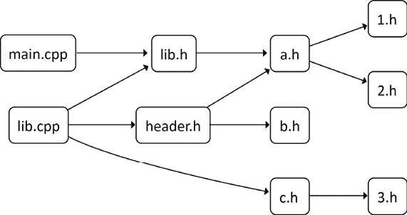

# 第十章：使用 C++20 模块

C++20 引入了一个新的语言特性：模块。它们将头文件中的纯文本符号声明替换为模块文件，模块文件将预编译成中间二进制格式，极大地减少了构建时间。

我们将讨论 CMake 中 C++20 模块的最重要话题，从 C++20 模块作为概念的概述开始：它们相较于标准头文件的优势，以及如何简化源代码中单元的管理。尽管精简构建过程的前景令人兴奋，本章也将重点讲解模块采用过程中的困难与漫长道路。

在理论部分讲解完毕后，我们将进入实践部分，讨论如何在项目中实现模块：我们将讨论如何在早期版本的 CMake 中启用它们的实验性支持，以及在 CMake 3.28 中的完整发布。

我们对 C++20 模块的探讨不仅仅是为了理解这一新特性——更是为了重新思考大型 C++项目中组件的交互方式。到本章结束时，你不仅能掌握模块的理论方面内容，还将通过实例获得实践经验，提升你利用这一特性优化项目结果的能力。

本章将讨论以下主要内容：

+   C++20 模块是什么？

+   编写支持 C++20 模块的项目

+   配置工具链

本章的技术要求与其他章节不同，请确保仔细阅读下一节内容。

# 技术要求

你可以在 GitHub 上找到本章中涉及的代码文件，网址为[`github.com/PacktPublishing/Modern-CMake-for-Cpp-2E/tree/main/examples/ch10`](https://github.com/PacktPublishing/Modern-CMake-for-Cpp-2E/tree/main/examples/ch10)。

尝试本章示例所需的工具链实用程序如下：

+   CMake 3.26 或更新版本（推荐使用 3.28）

+   任何受支持的生成器：

    +   Ninja 1.11 及更新版本（包括 Ninja 和 Ninja 多配置版本）

    +   Visual Studio 17 2022 及更新版本

+   任何受支持的编译器：

    +   MSVC 工具集 14.34 及更新版本

    +   Clang 16 及更新版本

    +   GCC 14（适用于开发中的分支，2023 年 9 月 20 日后）及更新版本

如果你熟悉 Docker，可以使用在《第一章：CMake 入门》中“在不同平台上安装 CMake”部分介绍的完全配置的镜像。

要构建本章提供的示例，请使用以下命令：

```cpp
cmake -B <build tree> -S <source tree> -G "Ninja" -D CMAKE_CXX_COMPILER=clang++-18 && cmake --build <build tree> 
```

请确保将占位符`<build tree>`和`<source tree>`替换为适当的路径。

# C++20 模块是什么？

三年前，我就想写关于如何使用 C++模块的内容。尽管模块已被纳入 C++20 规范，但 C++生态系统的支持当时还远未准备好使用这一功能。幸运的是，自本书第一版以来，情况发生了很大变化，随着 CMake 3.28 的发布，C++20 模块得到了正式支持（尽管从 3.26 版本起就已提供实验性支持）。

三年时间看似很长，用来实现一个特性，但我们需要记住，这不仅仅取决于 CMake。许多拼图的部分必须协调工作。首先，我们需要编译器理解如何处理模块，其次，像 GNU Make 或 Ninja 这样的构建系统必须能够与模块兼容，只有这样 CMake 才能利用这些新机制来支持模块。

这告诉我们一件事：并不是每个人都会拥有最新的兼容工具，即便如此，目前的支持仍处于初期阶段。这些限制使得模块不适合广泛使用。所以，可能现在还不要依赖它们来构建生产级项目。

然而，如果你是前沿解决方案的爱好者，那你有福了！如果你能够严格控制项目的构建环境，比如使用专用机器或构建容器化（如 Docker 等），你可以在内部有效使用模块。只需小心行事，并理解你的使用情况可能会有所不同。可能会有一个时刻，你需要完全放弃模块，因为任何工具中的功能缺失或实现错误。

“模块”在 C++构建的语境中是一个非常多义的词。我们在本书中之前已经讨论过 CMake 中的模块：查找模块、实用模块等等。为了澄清，C++模块与 CMake 模块没有任何关系。实际上，它们是 C++20 版本中添加的语言原生特性。

从本质上讲，一个 C++模块是一个单一的源文件，它将头文件和实现文件的功能封装成一个连贯的代码单元。它包括两个主要组件：

+   **二进制模块接口**（**BMI**）的作用与头文件类似，但它采用二进制格式，显著减少了其他翻译单元在使用时的重新编译需求。

+   **模块实现单元**提供模块的实现、定义和内部细节。其内容不能直接从模块外部访问，有效地封装了实现细节。

引入模块是为了减少编译时间，并解决预处理器和传统头文件的一些问题。让我们来看一下在一个典型的传统项目中，多个翻译单元是如何结合在一起的。



图 10.1：使用传统头文件的项目结构

上图展示了预处理器如何遍历项目树以构建程序。正如我们在*第七章*《使用 CMake 编译 C++ 源代码》中学到的，为了构建每个翻译单元，预处理器会机械地将文件拼接在一起。这意味着生成一个包含所有通过预处理器指令包含的头文件的长文件。这样，`main.cpp` 会先包含自己的源文件，然后是 `lib.h`、`a.h`、`1.h` 和 `2.h` 的内容。只有这样，编译器才会启动并开始解析每个字符以生成二进制目标文件。直到我们意识到，为了编译 `lib.cpp`，在 `main.cpp` 中包含的头文件必须再次被编译。这种冗余随着每个翻译单元的增加而不断增长。

传统头文件还存在其他问题：

+   **包含保护** 是必需的，如果忘记了，会导致问题。

+   具有循环引用的符号需要**前向声明**。

+   对头文件的小改动会导致所有翻译单元的重新编译。

+   预处理器宏很难调试和维护。

模块立即解决了许多这些问题，但仍然存在一些相关问题：像头文件一样，模块之间也可以相互依赖。当一个模块导入另一个模块时，我们仍然需要按照正确的顺序编译它们，从最嵌套的模块开始。这通常不是一个重大问题，因为模块往往比头文件大得多。在许多情况下，整个库可以存储在一个模块中。

让我们看看模块在实践中是如何编写和使用的。在这个简单的示例中，我们只会返回两个参数的和：

**ch10/01-cxx-modules/math.cppm**

```cpp
export module math;
export int add(int a, int b) {
    return a + b;
} 
```

这样的模块不言自明：我们从一个声明开始，告诉程序的其余部分这是一个名为 `math` 的模块。接着，我们使用 `export` 关键字标注一个普通的函数定义，使其可以从模块外部访问。

你会注意到模块文件的扩展名与普通的 C++ 源代码不同。这只是一个约定，不应影响代码的处理方式。我的建议是根据你将使用的工具链来选择：

+   `.ixx` 是 MSVC 的扩展名。

+   `.cppm` 是 Clang 的扩展名。

+   `.cxx` 是 GCC 的扩展名。

要使用这个模块，我们需要在程序中导入它：

**ch10/01-cxx-modules/main.cpp**

```cpp
**import** **math;**
#include <iostream>
int main() {
  std::cout << "Addition 2 + 2 = " << **add****(****2****,** **2****)** << std::endl;
  return 0;
} 
```

`import math` 语句足以将模块中导出的符号直接引入到 `main` 程序中。现在，我们可以在 `main()` 函数的主体中使用 `add()` 函数。表面上看，模块与头文件非常相似。但是，如果我们像往常一样编写 CMake 列表文件，我们可能无法成功构建项目。是时候引入使用 C++ 模块所需的步骤了。

# 使用 C++20 模块支持编写项目

本书主要讨论 CMake 3.26，但值得注意的是 CMake 经常更新，版本 3.28 就在本章印刷前发布。如果你正在使用此版本或更新版本，你可以通过将 `cmake_minimum_required()` 命令设置为 `VERSION 3.28.0` 来访问最新功能。

另一方面，如果你需要坚持使用旧版本或想要服务于那些可能没有升级的更广泛受众，你需要启用实验性支持以在 CMake 中使用 C++20 模块。

让我们探讨如何实现这个。

## 启用对 CMake 3.26 和 3.27 的实验性支持

实验性支持代表了一种协议：作为开发者，你承认这个特性还没有准备好用于生产环境，应仅用于测试目的。要*签署*这样的协议，你需要在项目的列表文件中将 `CMAKE_EXPERIMENTAL_CXX_MODULE_CMAKE_API` 变量设置为与你使用的 CMake 版本对应的特定值。

CMake 官方的 Kitware 仓库托管了一个问题追踪器，你可以搜索标签 `area:cxxmodules`。在 3.28 发布之前，只有一个问题被报告（在 3.25.0 中），这是一个潜在稳定特性的良好指标。如果你决定启用实验功能，构建你的项目以确认它能为你的用户工作。

以下是可以在 CMake 的仓库和文档中找到的标志：

+   `3c375311-a3c9-4396-a187-3227ef642046` 用于 3.25（未记录）

+   `2182bf5c-ef0d-489a-91da-49dbc3090d2a` 用于 3.26

+   `aa1f7df0-828a-4fcd-9afc-2dc80491aca7` 用于 3.27

不幸的是，如果你没有至少访问 CMake 3.25，你将无法使用。模块在此版本之前不可用。此外，如果 CMake 版本低于 3.27，你需要设置另一个变量来启用模块的动态依赖：

```cpp
set(CMAKE_EXPERIMENTAL_CXX_MODULE_DYNDEP 1) 
```

以下是你如何自动选择当前版本的正确 API 密钥，并明确禁用不支持的版本的构建（在此示例中，我们只支持 CMake 3.26 及以上）。

**ch10/01-cxx-modules/CMakeLists.txt**

```cpp
cmake_minimum_required(VERSION 3.26.0)
project(CXXModules CXX)
# turn on the experimental API
if(CMAKE_VERSION VERSION_GREATER_EQUAL 3.28.0)
  # Assume that C++ sources do import modules
  cmake_policy(SET CMP0155 NEW)
elseif(CMAKE_VERSION VERSION_GREATER_EQUAL 3.27.0)
  set(CMAKE_EXPERIMENTAL_CXX_MODULE_CMAKE_API
      "aa1f7df0-828a-4fcd-9afc-2dc80491aca7")
elseif(CMAKE_VERSION VERSION_GREATER_EQUAL 3.26.0)
  set(CMAKE_EXPERIMENTAL_CXX_MODULE_CMAKE_API
      "2182bf5c-ef0d-489a-91da-49dbc3090d2a")
  set(CMAKE_EXPERIMENTAL_CXX_MODULE_DYNDEP 1)
else()
  message(FATAL_ERROR "Version lower than 3.26 not supported")
endif() 
```

让我们逐条分析：

1.  首先，我们检查版本是否为 3.28 或更高。这使我们能够启用 `CMP0155` 策略，使用 `cmake_policy()`。如果我们希望支持低于 3.28 的版本，这是必需的。

1.  如果不是这种情况，我们将检查版本是否高于 3.27。如果是，我们将设置相应的 API 密钥。

1.  如果版本不高于 3.27，我们将检查它是否高于 3.26。如果是这样，设置适当的 API 密钥并启用实验性的 C++20 模块动态依赖标志。

1.  如果版本低于 3.26，则不受我们的项目支持，将打印一个致命错误消息通知用户。

这使我们能够支持从 3.26 开始的一系列 CMake 版本。如果我们在项目要构建的每个环境中都能使用 CMake 3.28，那么上面的 `if()` 代码块就不再需要。那么，什么是必需的呢？

## 启用对 CMake 3.28 及更高版本的支持

要使用 C++20 模块（从 3.28 开始），你必须明确声明此版本为最小版本。可以使用如下的项目头文件：

```cpp
cmake_minimum_required(VERSION 3.28.0)
project(CXXModules CXX) 
```

如果最小所需版本设置为 3.28 或更高，它将默认启用`CMP0155`策略。继续阅读，了解在定义模块之前，我们还需要配置哪些其他方面。如果需要 3.27 或更低版本，构建可能会失败，即使项目是使用 CMake 3.28 或更新版本构建的。

接下来需要考虑的是编译器要求。

## 设置编译器要求

无论我们使用 CMake 3.26、3.27、3.28 还是更新版本构建，要创建使用 C++模块的解决方案，都需要设置两个全局变量。第一个禁用不支持的 C++扩展，第二个确保编译器支持所需的标准。

**ch10/01-cxx-modules/CMakeLists.txt（续）**

```cpp
# Libc++ has no support compiler extensions for modules.
set(CMAKE_CXX_EXTENSIONS OFF)
set(CMAKE_CXX_STANDARD 20) 
```

设置标准可能看起来是多余的，因为支持模块的编译器数量非常有限。然而，为了确保项目的未来可用性，这是一个很好的实践。

一般配置相当直接，到此为止。我们现在可以继续在 CMake 中定义一个模块。

## 声明 C++模块

CMake 模块定义利用了`target_sources()`命令和`FILE_SET`关键字：

```cpp
target_sources(math
  **PUBLIC FILE_SET CXX_MODULES TYPE CXX_MODULES FILES** **math****.cppm**
) 
```

在上面突出显示的行中，我们引入了一种新的文件集类型：`CXX_MODULES`。从 CMake 3.28 开始，默认支持此类型。对于 3.26 版本，需要启用实验性 API。如果没有正确的支持，将会出现如下错误信息：

```cpp
CMake Error at CMakeLists.txt:25 (target_sources):
  target_sources File set TYPE may only be "HEADERS" 
```

如果你在构建输出中看到这个消息，请检查你的代码是否正确。如果 API 密钥值对于所用版本不正确，也会出现此消息。

在同一个二进制文件中定义模块，正如之前讨论的那样，具有许多好处。然而，当创建一个库时，这些优势更加明显。这样的库可以在其他项目中使用，也可以被同一个项目中的其他库使用，从而进一步增强模块化。

要声明模块并将其与主程序链接，可以使用以下 CMake 配置：

**ch10/01-cxx-modules/CMakeLists.txt（续）**

```cpp
add_library(math)
target_sources(math
  **PUBLIC FILE_SET CXX_MODULES FILES** **math****.cppm**
)
target_compile_features(math PUBLIC cxx_std_20)
set_target_properties(math PROPERTIES CXX_EXTENSIONS OFF)
add_executable(main main.cpp)
target_link_libraries(main PRIVATE math) 
```

为了确保这个库可以在其他项目中使用，我们必须使用`target_compile_features()`命令，并明确要求`cxx_std_20`。此外，我们还需要在目标级别重复设置`CXX_EXTENSIONS OFF`。如果没有这个设置，CMake 会生成错误并停止构建。这看起来有些冗余，可能会在未来的 CMake 版本中解决。

项目设置完成后，是时候进行最终的构建了。

# 配置工具链

根据 Kitware 页面上的一篇博客文章（见*进一步阅读*部分），CMake 早在版本 3.25 就已支持模块。尽管 3.28 正式支持此功能，但这并不是我们享受模块便利所需解决的唯一问题。

下一个要求集中在构建系统上：它需要支持动态依赖。目前，你只有两个选择：

+   Ninja 1.11 及更新版本（Ninja 和 Ninja Multi-Config）

+   Visual Studio 17 2022 及更新版本

同样，你的编译器需要生成特定格式的文件，以便 CMake 映射源依赖。该格式在 Kitware 开发人员撰写的论文 `p1589r5` 中有描述。这篇论文已提交给所有主要编译器进行实现。目前，只有三种编译器已经成功实现了所需的格式：

+   Clang 16

+   Visual Studio 2022 17.4（19.34）中的 MSVC

+   GCC 14（用于开发中的分支，在 2023-09-20 后）及更新版本

假设你已经在环境中配置了所有必要的工具（你可以使用我们为本书提供的 Docker 镜像），并且你的 CMake 项目已经准备好构建，那么剩下的就是配置 CMake 以使用所需的工具链。正如你在第一章中回顾的那样，你可以使用 `-G` 命令行参数选择构建系统生成器：

```cpp
cmake -B <build tree> -S <source tree> -G "Ninja" 
```

该命令将配置项目使用 Ninja 构建系统。下一步是设置编译器。如果你的默认编译器不支持模块，而你已安装了另一个编译器来尝试，那么你可以通过像这样定义全局变量 `CMAKE_CXX_COMPILER` 来实现：

```cpp
cmake -B <build tree> -S <source tree> -G "Ninja" -D CMAKE_CXX_COMPILER=clang++-18 
```

我们在示例中选择了 Clang 18，因为它是撰写本文时最新的版本（捆绑在 Docker 镜像中）。在成功配置后（你可能会看到一些关于实验性功能的警告），你需要构建项目：

```cpp
cmake --build <build tree> 
```

一如既往，请确保将占位符 `<build tree>` 和 `<source tree>` 替换为适当的路径。如果一切顺利，你可以运行你的程序并观察模块功能是否按预期工作：

```cpp
$ ./main
Addition 2 + 2 = 4 
```

这就是 C++20 模块在实践中工作的方式。

进一步阅读部分包括来自 Kitware 的一篇博客文章，以及关于 C++ 编译器源依赖格式的提案，提供了有关 C++20 模块实现和使用的更多见解。

# 总结

在本章中，我们深入探讨了 C++20 模块，明确它们不同于 CMake 模块，并代表了 C++ 在简化编译方面的一项重大进展，解决了与冗余头文件编译和有问题的预处理器宏相关的挑战。我们展示了如何使用一个简单的示例编写并导入 C++20 模块。接着，我们探索了如何为 C++20 模块设置 CMake。由于此功能仍处于实验阶段，因此需要设置特定的变量，我们提供了一系列条件语句，以确保你的项目正确配置了所使用的 CMake 版本。

关于所需的工具，我们强调了构建系统必须支持动态依赖，目前的选项是 Ninja 1.11 或更新版本。对于编译器支持，Clang 16 和 Visual Studio 2022 17.4（19.34）中的 MSVC 支持完整的 C++20 模块，而 GCC 的支持仍在等待中。我们还指导您如何配置 CMake 以使用选定的工具链，包括选择构建系统生成器并设置编译器版本。在配置并构建项目之后，您可以运行程序查看 C++20 模块的实际效果。

在下一章中，我们将学习自动化测试的重要性及其应用，以及 CMake 对测试框架的支持。

# 进一步阅读

欲了解更多信息，您可以参考以下资源：

+   描述新特性的博客文章：[`www.kitware.com/import-cmake-c20-modules/`](https://www.kitware.com/import-cmake-c20-modules/)

+   提议的 C++ 编译器源依赖格式：[`www.open-std.org/jtc1/sc22/wg21/docs/papers/2022/p1689r5.html`](https://www.open-std.org/jtc1/sc22/wg21/docs/papers/2022/p1689r5.html)

# 留下评价！

喜欢这本书吗？通过在亚马逊上留下评价来帮助像您一样的读者。扫描下面的二维码，获取您选择的免费电子书。


