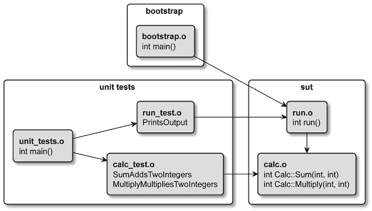
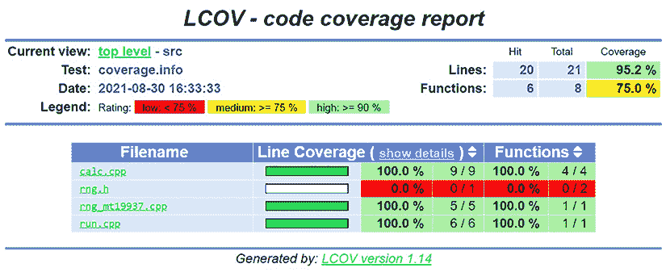
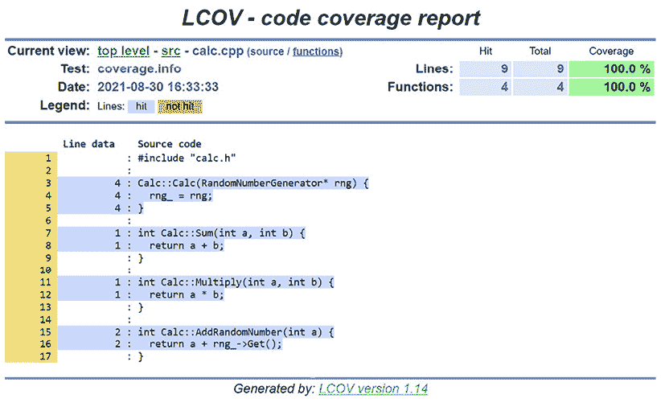

# 第十一章：测试框架

有经验的专业人士知道，测试必须自动化。几年前有人向他们解释过这一点，或者他们是通过吃了不少苦头才学到这一点。这种做法对没有经验的程序员来说并不那么显而易见；他们觉得这只是额外的、无意义的工作，似乎没有带来太多价值。可以理解：当一个人刚开始编写代码时，他们还没有创建真正复杂的解决方案，也没有在大型代码库上工作。很可能，他们是自己独立开发他们的个人项目。这些早期的项目很少超过几个月就能完成，因此几乎没有机会看到代码在较长时间内如何退化。

所有这些因素都促使编程新手认为编写测试是一种浪费时间和精力的行为。初学者可能会告诉自己，他们实际上每次通过*构建和运行*过程时都会测试自己的代码。毕竟，他们已经手动确认了自己的代码是正常工作的，并且能够按预期执行。那么，是时候进行下一个任务了，对吧？

自动化测试确保了新更改不会无意中破坏我们的程序。在本章中，我们将学习为什么测试很重要，以及如何使用 CMake 附带的工具 CTest 来协调测试执行。CTest 可以查询可用的测试、过滤执行、洗牌、重复执行并设置时间限制。我们将探讨如何使用这些功能、控制 CTest 的输出以及处理测试失败。

接下来，我们将修改项目结构以适应测试，并创建我们自己的测试运行器。在介绍了基本原理之后，我们将继续添加流行的测试框架：Catch2 和 GoogleTest（也称为 GTest），以及它的模拟库。最后，我们将介绍使用 LCOV 进行详细的测试覆盖率报告。

本章将涵盖以下主要内容：

+   为什么自动化测试值得投入精力？

+   使用 CTest 标准化 CMake 中的测试

+   创建最基本的 CTest 单元测试

+   单元测试框架

+   生成测试覆盖率报告

# 技术要求

您可以在 GitHub 上找到本章中出现的代码文件，地址是 [`github.com/PacktPublishing/Modern-CMake-for-Cpp-2E/tree/main/examples/ch11`](https://github.com/PacktPublishing/Modern-CMake-for-Cpp-2E/tree/main/examples/ch11)。

要构建本书中提供的示例，请始终使用推荐的命令：

```cpp
cmake -B <build tree> -S <source tree>
cmake --build <build tree> 
```

请务必将占位符 `<build tree>` 和 `<source tree>` 替换为适当的路径。提醒一下，**build tree** 是目标/输出目录的路径，**source tree** 是源代码所在的路径。

# 为什么自动化测试值得投入精力？

想象一个工厂生产线，其中一台机器在钢板上打孔。这些孔需要具有特定的大小和形状，以便容纳用于最终产品的螺栓。生产线的设计师会设置机器，测试孔的大小，然后继续前进。最终，某些情况会发生变化：钢板可能会变厚，工人可能会调整孔的大小，或者因为设计变化，需要打更多的孔。一个聪明的设计师会在关键点安装质量控制检查，以确保产品符合规格。无论孔是如何制作的：钻孔、冲孔或激光切割，它们必须满足特定要求。

同样的原则也适用于软件开发。我们很难预测哪些代码能在多年后保持稳定，哪些会经历多次修订。随着软件功能的扩展，我们必须确保不会无意间破坏已有的功能。我们会犯错。即使是最优秀的程序员也无法预见每一个变更的影响。开发人员经常在自己没有最初编写的代码上工作，可能并不了解代码背后的所有假设。他们会阅读代码，形成心理模型，做出修改，然后祈祷一切顺利。当这种方法失败时，修复 bug 可能需要几个小时或几天，并且会对产品及其用户产生负面影响。

有时，你会发现某些代码很难理解。你可能甚至会开始责怪别人搞砸了，但最后发现原来是自己写错了。这种情况通常发生在代码编写得很快，且没有充分理解问题的情况下。

作为开发人员，我们不仅面临项目截止日期和有限预算的压力，有时我们还会在夜里被叫醒修复一个关键问题。令人惊讶的是，一些不那么明显的错误竟然能从代码审查中漏过。

自动化测试可以防止大多数这些问题。它们是用来验证另一段代码是否正确执行的代码片段。顾名思义，这些测试会在有人修改代码时自动运行，通常作为构建过程的一部分。它们通常作为一个步骤添加，以确保在将代码合并到代码库之前，代码的质量是可靠的。

你可能会想跳过创建自动化测试以节省时间，但那是一个代价高昂的错误。正如斯蒂芬·赖特所说：“*经验是你在需要它之后才会获得的东西*。”除非你在编写一次性脚本或进行实验，否则不要跳过测试。你可能会一开始感到沮丧，因为你精心编写的代码总是无法通过测试。但请记住，测试失败意味着你刚刚避免了将一个重大问题引入生产环境。现在花在测试上的时间，未来会为你节省修复 bug 的时间——并让你晚上睡得更安稳。测试并不像你想象的那样难以添加和维护。

# 使用 CTest 标准化 CMake 中的测试

从根本上说，自动化测试就是运行一个可执行文件，将你的**被测试系统**（**SUT**）置于特定状态，执行你想要测试的操作，并检查结果是否符合预期。你可以将它们视为完成句子`GIVEN_<CONDITION>_WHEN_<SCENARIO>_THEN_<EXPECTED-OUTCOME>`的结构化方式，并验证它是否对 SUT 成立。一些资源建议按照这种方式命名你的测试函数：例如，`GIVEN_4_and_2_WHEN_Sum_THEN_returns_6`。

实现和执行这些测试有很多方法，这取决于你选择的框架、如何将其与 SUT 连接以及其具体设置。对于首次与项目互动的用户来说，即使是像测试二进制文件的文件名这样的细节，也会影响他们的体验。因为没有标准的命名约定，一个开发者可能会将他们的测试可执行文件命名为`test_my_app`，另一个可能选择`unit_tests`，而第三个可能选择一个不太直接的名称或根本不进行测试。弄清楚要运行哪个文件、使用哪个框架、传递什么参数以及如何收集结果，都是用户宁愿避免的麻烦。

CMake 通过一个独立的`ctest`命令行工具解决了这个问题。通过项目作者通过列表文件配置，它提供了一种标准化的测试运行方式。这种统一的接口适用于每个使用 CMake 构建的项目。遵循这个标准，你将享受到其他好处：将项目集成到**持续集成/持续部署**（**CI/CD**）管道中变得更容易，并且测试结果能更方便地显示在像 Visual Studio 或 CLion 这样的 IDE 中。最重要的是，你只需付出最小的努力，就能获得一个强大的测试运行工具。

那么，如何在一个已经配置好的项目中使用 CTest 运行测试呢？你需要选择以下三种操作模式之一：

+   仪表板

+   测试

+   构建并测试

**仪表板模式**允许你将测试结果发送到一个名为 CDash 的独立工具，也是 Kitware 开发的。CDash 收集并展示软件质量测试结果，提供一个易于导航的仪表板。对于非常大的项目，这个话题非常有用，但超出了本书的讨论范围。

**测试模式**的命令行如下：

```cpp
ctest [<options>] 
```

在这个模式下，CTest 应该在你使用 CMake 构建项目后，在构建树中运行。这里有很多可用的选项，但在深入讨论之前，我们需要解决一个小小的不便：`ctest`二进制文件必须在构建树中运行，且只能在项目构建完成后运行。在开发周期中，这可能会有点尴尬，因为你需要运行多个命令并在目录之间切换。

为了简化这一过程，CTest 提供了**构建并测试模式**。我们将首先探索这个模式，以便稍后能全神贯注地讨论**测试模式**。

## 构建并测试模式

要使用这个模式，我们需要执行`ctest`，后跟`--build-and-test`：

```cpp
ctest --build-and-test <source-tree> <build-tree>
      --build-generator <generator> [<options>...]
      [--build-options <opts>...]
      [--test-command <command> [<args>...]] 
```

本质上，这是**测试模式**的一个简单封装。它接受构建配置选项和在`--test-command`参数之后的测试命令。需要注意的是，除非在`--test-command`之后包含`ctest`关键字，否则不会运行任何测试，如下所示：

```cpp
ctest --build-and-test project/source-tree /tmp/build-tree --build-generator "Unix Makefiles" --test-command ctest 
```

在此命令中，我们指定了源路径和构建路径，并选择了一个构建生成器。所有三个都必须指定，并遵循`cmake`命令的规则，详细描述见*第一章*，*CMake 初步使用指南*。

您可以添加更多参数，通常它们分为三类：配置控制、构建过程或测试设置。

配置阶段的参数如下：

+   `--build-options`—为`cmake`配置包含额外选项。将其放在`--test-command`之前，且`--test-command`必须位于最后。

+   `--build-two-config`—为 CMake 运行两次配置阶段。

+   `--build-nocmake`—跳过配置阶段。

+   `--build-generator-platform`—提供一个特定于生成器的平台。

+   `--build-generator-toolset`—提供一个特定于生成器的工具集。

+   `--build-makeprogram`—为基于 Make 或 Ninja 的生成器指定一个`make`可执行文件。

构建阶段的参数如下：

+   `--build-target`—指定要构建的目标。

+   `--build-noclean`—在不先构建`clean`目标的情况下进行构建。

+   `--build-project`—指定正在构建的项目名称。

测试阶段的参数如下：

+   `--test-timeout`—为测试设置时间限制（秒）。

现在我们可以配置测试模式，可以通过在`--test-command cmake`后添加参数，或者直接运行测试模式来实现。

## 测试模式

在构建项目后，您可以在构建目录中使用`ctest`命令来运行测试。如果您正在使用构建和测试模式，这将由系统为您完成。通常情况下，只运行不带任何额外标志的`ctest`就足够了。如果所有测试都成功，`ctest`将返回一个`0`的退出码（在类 Unix 系统上），您可以在 CI/CD 管道中验证此退出码，以防止将有缺陷的更改合并到生产分支。

编写良好的测试与编写生产代码本身一样具有挑战性。我们将系统被测试单元（SUT）设置为特定状态，运行单个测试，然后销毁 SUT 实例。这个过程相当复杂，可能会产生各种问题：跨测试污染、时序和并发干扰、资源竞争、死锁导致的执行冻结等。

幸运的是，CTest 提供了多种选项来缓解这些问题。您可以控制运行哪些测试、它们的执行顺序、它们生成的输出、时间限制、重复率等。以下部分将提供必要的背景信息，并简要概述最有用的选项。

### 查询测试

我们可能需要做的第一件事是了解哪些测试实际上已经为项目编写。CTest 提供了`-N`选项，该选项禁用执行并只打印一个列表，如下所示：

```cpp
# ctest -N
Test project /tmp/b
  Test #1: SumAddsTwoInts
  Test #2: MultiplyMultipliesTwoInts
Total Tests: 2 
```

你可能希望使用`-N`与下一节描述的过滤器来检查在应用过滤器时会执行哪些测试。

如果你需要一种可以被自动化工具处理的 JSON 格式，可以使用`ctest`并加上`--show-only=json-v1`选项。

CTest 还提供了一种机制，通过`LABELS`关键字对测试进行分组。要列出所有可用的标签（但不实际执行任何测试），可以使用`--print-labels`。当测试通过`add_test(<name> <test-command>)`命令手动定义在列表文件中时，此选项非常有用，因为你可以通过测试属性指定单独的标签，像这样：

```cpp
set_tests_properties(<name> PROPERTIES LABELS "<label>") 
```

但请记住，来自不同框架的自动化测试发现方法可能不支持这种详细的标签级别。

### 过滤测试

有时，你可能只想运行特定的测试，而不是整个测试套件。例如，如果你在调试一个单独失败的测试，就没有必要运行其他所有测试。你还可以使用这种机制将测试分配到多台机器上，适用于大型项目。

这些标志将根据提供的`<r>` **正则表达式** (**regex**) 过滤测试，如下所示：

+   `-R <r>`，`--tests-regex <r>` - 仅运行名称匹配`<r>`的测试

+   `-E <r>`，`--exclude-regex <r>` - 跳过名称匹配`<r>`的测试

+   `-L <r>`，`--label-regex <r>` - 仅运行标签匹配`<r>`的测试

+   `-LE <r>`，`--label-exclude <regex>` - 跳过标签匹配`<r>`的测试

高级场景可以通过`--tests-information`选项（或其简写形式`-I`）来实现。此选项接受用逗号分隔的格式`<start>,<end>,<step>,<test-IDs>`。你可以省略任何字段，但需要保留逗号。`<Test IDs>`选项是一个逗号分隔的测试序号列表。例如：

+   `-I 3,,` 将跳过测试 1 和测试 2（从第三个测试开始执行）

+   `-I ,2,` 将只运行第一个和第二个测试

+   `-I 2,,3` 将从第二个测试开始，按每三个测试执行一次

+   `-I ,0,,3,9,7` 只会运行第三个、第九个和第七个测试

你还可以在文件中指定这些范围，以便在多台机器上分布式地执行测试，适用于非常大的测试套件。使用`-I`与`-R`时，只有同时满足两个条件的测试才会运行。如果你希望运行满足任一条件的测试，可以使用`-U`选项。如前所述，你可以使用`-N`选项来检查过滤结果。

### 打乱测试

编写单元测试可能会很棘手。其中一个令人惊讶的问题是测试耦合，即一个测试通过不完全设置或清除被测系统的状态而影响另一个测试。换句话说，第一个执行的测试可能会“泄漏”其状态并污染第二个测试。这种耦合是个大问题，因为它引入了测试之间未知的、隐性的关系。

更糟糕的是，这种错误通常能够在复杂的测试场景中藏得非常隐蔽。我们可能会在某个测试随机失败时发现它，但也有相反的可能性：一个错误的状态导致测试通过，而实际上不应该通过。这样的错误通过的测试会给开发者带来安全感的错觉，这甚至比没有测试还要糟糕。认为代码已经通过正确测试的假设可能会促使开发者做出更大胆的行动，从而导致意外的结果。

发现此类问题的一种方法是将每个测试单独运行。通常，直接从测试框架执行测试运行器时并不会如此。要运行单个测试，你需要向测试可执行文件传递一个框架特定的参数。这使得你能够发现那些在测试套件中通过但单独执行时失败的测试。

另一方面，CTest 通过隐式地在子 CTest 实例中执行每个测试用例，有效地消除了测试之间基于内存的交叉污染。你甚至可以更进一步，添加 `--force-new-ctest-process` 选项来强制使用独立的进程。

不幸的是，如果你的测试使用了外部的、争用的资源，比如 GPU、数据库或文件，这种方法单独是行不通的。我们可以采取的一个额外预防措施是随机化测试执行的顺序。引入这种变化通常足以最终检测出虚假的通过测试。CTest 支持通过 `--schedule-random` 选项实现这种策略。

### 处理失败

这是约翰·C·麦克斯威尔（John C. Maxwell）的一句名言：“*早失败，频繁失败，但始终向前失败*。” 向前失败意味着从我们的错误中学习。这正是我们在运行单元测试时（或许在生活的其他领域）想要做到的。除非你在附加调试器的情况下运行测试，否则很难检测到你犯错的地方，因为 CTest 会简洁地列出失败的测试，而不会实际打印出它们的输出。

测试用例或被测试系统（SUT）打印到 `stdout` 的信息可能对于准确判断出错原因至关重要。为了查看这些信息，我们可以使用 `--output-on-failure` 运行 `ctest`。或者，设置环境变量 `CTEST_OUTPUT_ON_FAILURE` 也会产生相同的效果。

根据解决方案的大小，遇到任何测试失败时可能有意义停止执行。可以通过向 `ctest` 提供 `--stop-on-failure` 参数来实现这一点。

CTest 会存储失败测试的名称。为了节省时间在漫长的测试套件中，我们可以专注于这些失败的测试，跳过执行那些通过的测试，直到问题解决为止。这个功能可以通过 `--rerun-failed` 选项启用（其他任何过滤器将被忽略）。记住，在解决所有问题后，运行所有测试以确保在此期间没有引入回归。

当 CTest 没有检测到任何测试时，这可能意味着两件事：要么测试不存在，要么项目存在问题。默认情况下，`ctest` 会打印一条警告信息并返回 `0` 的退出码，以避免混淆视听。大多数用户会有足够的上下文来理解他们遇到的情况以及接下来的处理方式。然而，在一些环境中，`ctest` 会作为自动化管道的一部分始终被执行。在这种情况下，我们可能需要明确指出，缺少测试应该被视为错误（并返回一个非零退出码）。我们可以通过提供 `--no-tests=error` 参数来配置这种行为。相反的行为（不显示警告）可以使用 `--no-tests=ignore` 选项。

### 重复测试

迟早在你的职业生涯中，你会遇到大多数时候都能正确工作的测试。我想强调的是“多数”这个词。偶尔，这些测试会因为环境原因而失败：比如时间模拟错误、事件循环问题、异步执行处理不当、并行性问题、哈希冲突等，这些复杂的场景并非每次都会发生。这些不可靠的测试被称为*不稳定测试*。

这种不一致看起来似乎并不是一个非常重要的问题。我们可能会说，测试并不代表真实的生产环境，这也是它们有时会失败的根本原因。这里有一点真理：测试并不意味着复制每一个细节，因为那样做不切实际。测试是一个模拟，是对可能发生的情况的近似，通常这就足够了。如果重新运行测试会在下次执行时通过，那会有什么坏处吗？

事实上，它是有的。这里有三个主要的关注点，如下所述：

+   如果你的代码库中积累了足够多的**不稳定**测试，它们将成为代码更改顺利交付的严重障碍。尤其是在你急于完成工作的时候：要么是准备在周五下午下班，要么是在交付一个影响客户的严重问题的关键修复时。

+   你无法完全确定你的不稳定测试失败是因为测试环境的不完善。可能正好相反：它们失败是因为它们复制了生产环境中已经发生的罕见场景。只是这个问题还不明显，尚未触发警报……

+   不是测试不稳定，而是你的代码不稳定！环境偶尔会出现问题——作为程序员，我们以确定性的方式应对这一点。如果被测系统（SUT）表现得如此，那就是一个严重错误的信号——例如，代码可能在读取未初始化的内存。

没有完美的方法来解决所有前述问题——可能的原因实在是太多了。然而，我们可以通过使用 `–repeat <mode>:<#>` 选项反复运行测试，来提高识别**不稳定**测试的机会。有三种模式可以选择，如下所述：

+   `until-fail`—运行测试 `<#>` 次；所有运行必须通过。

+   `until-pass`—最多运行测试 `<#>` 次；必须至少成功一次。当处理已知不稳定但又太难调试或禁用的测试时，这个选项非常有用。

+   `after-timeout`—最多运行测试 `<#>` 次，但仅在测试超时的情况下重试。适用于繁忙的测试环境。

一般建议尽快调试不稳定的测试，或者如果它们不能可靠地产生一致的结果，就将其移除。

### 控制输出

每次将每一条信息都打印到屏幕上会变得非常繁忙。CTest 会减少噪音，将它执行的测试输出收集到日志文件中，常规运行时只提供最有用的信息。当出现问题并且测试失败时，你可以期待一个总结，可能还会有一些日志，如果你启用了 `--output-on-failure` 选项，正如前面所提到的。

我根据经验知道，“足够的信息”通常是够用的，直到它不再足够。有时，我们可能希望查看通过测试的输出，也许是为了检查它们是否真正有效（而不是在没有错误的情况下悄无声息地停止）。要获取更详细的输出，添加 `-V` 选项（或者如果你想在自动化管道中明确显示，可以使用 `--verbose`）。如果这还不够，你可能需要使用 `-VV` 或 `--extra-verbose`。对于极为深入的调试，使用 `--debug`（但要准备好面对包含所有细节的海量文本）。

如果你想要的是相反的效果，CTest 还提供了“Zen 模式”，可以通过 `-Q` 或 `--quiet` 启用。启用后将不会打印任何输出（你可以停止担心并学会喜爱这个错误）。看起来这个选项除了让人困惑之外没有其他用途，但请注意，输出仍然会存储在测试文件中（默认存储在 `./Testing/Temporary`）。自动化管道可以检查退出代码是否为非零值，并收集日志文件进行进一步处理，而不会在主输出中堆积可能让不熟悉该产品的开发人员困惑的细节。

要将日志存储到特定路径，请使用 `-O <file>`，`--output-log <file>` 选项。如果你遇到输出过长的问题，可以使用两个限制选项，将其限制为每个测试的给定字节数：`--test-output-size-passed <size>` 和 `--test-output-size-failed <size>`。

### 杂项

还有一些其他选项，对于日常测试需求也非常有用，如下所述：

+   `-C <cfg>, --build-config <cfg>`—指定要测试的配置。`Debug` 配置通常包含调试符号，使得理解更为容易，但 `Release` 配置也应该进行测试，因为重度优化选项可能会影响被测系统（SUT）的行为。此选项仅适用于多配置生成器。

+   `-j <jobs>, --parallel <jobs>`—设置并行执行的测试数量。这对于加速开发过程中执行长时间运行的测试非常有用。需要注意的是，在一个繁忙的环境中（共享测试运行器上），它可能会因为调度的原因产生不利影响。通过下一个选项可以稍微减轻这个问题。

+   `--test-load <level>`—以一种不超过`<level>`值的方式调度并行测试，以避免 CPU 负载过高（按最佳努力）。

+   `--timeout <seconds>`—指定单个测试的默认时间限制。

现在我们理解了如何在不同的场景中执行`ctest`，接下来我们学习如何添加一个简单的测试。

# 为 CTest 创建最基本的单元测试

从技术上讲，即使没有任何框架，也可以编写单元测试。我们所需要做的就是创建我们要测试的类的实例，执行其中一个方法，然后检查新的状态或返回值是否符合我们的期望。然后，我们报告结果并删除测试对象。让我们试试吧。

我们将使用以下结构：

```cpp
- CMakeLists.txt
- src
  |- CMakeLists.txt
  |- calc.cpp
  |- calc.h
  |- main.cpp
- test
  |- CMakeLists.txt
  |- calc_test.cpp 
```

从`main.cpp`开始，我们看到它使用了一个`Calc`类：

**ch11/01-no-framework/src/main.cpp**

```cpp
#include <iostream>
#include "calc.h"
using namespace std;
int main() {
  Calc c;
  cout << "2 + 2 = " << c.Sum(2, 2) << endl;
  cout << "3 * 3 = " << c.Multiply(3, 3) << endl;
} 
```

没有什么太花哨的——`main.cpp`仅仅包含了`calc.h`头文件，并调用了`Calc`对象的两个方法。让我们快速浏览一下`Calc`的接口，这是我们的 SUT：

**ch11/01-no-framework/src/calc.h**

```cpp
#pragma once
class Calc {
public:
   int Sum(int a, int b);
   int Multiply(int a, int b);
}; 
```

接口尽可能简单。我们在这里使用`#pragma once`—它的作用与常见的预处理器**包含保护**相同，并且几乎所有现代编译器都能理解它，尽管它不是官方标准的一部分。

**包含保护**是头文件中的短行代码，用于防止在同一个父文件中被多次包含。

我们来看看类的实现：

**ch11/01-no-framework/src/calc.cpp**

```cpp
#include "calc.h"
int Calc::Sum(int a, int b) {
  return a + b;
}
int Calc::Multiply(int a, int b) {
  return a * a; // a mistake!
} 
```

哎呀！我们引入了一个错误！`Multiply`忽略了`b`参数，反而返回了`a`的平方。这个问题应该通过正确编写的单元测试来检测出来。那么，我们来编写一些测试吧！开始：

**ch11/01-no-framework/test/calc_test.cpp**

```cpp
#include "calc.h"
#include <cstdlib>
void SumAddsTwoIntegers() {
  Calc sut;
  if (4 != sut.Sum(2, 2))
    std::exit(1);
}
void MultiplyMultipliesTwoIntegers() {
  Calc sut;
  if(3 != sut.Multiply(1, 3))
    std::exit(1);
} 
```

我们通过编写两个测试方法来开始`calc_test.cpp`文件，每个方法对应一个被测试的 SUT 方法。如果调用的方法返回的值与预期不符，每个函数都会调用`std::exit(1)`。我们本可以使用`assert()`、`abort()`或`terminate()`，但那样会导致在`ctest`输出中显示一个不太明确的`Subprocess aborted`消息，而不是更易读的`Failed`消息。

该是时候创建一个测试运行器了。我们的测试运行器将尽可能简单，以避免引入过多的工作量。看看我们为运行仅仅两个测试而必须编写的`main()`函数：

**ch11/01-no-framework/test/unit_tests.cpp**

```cpp
#include <string>
void SumAddsTwoIntegers();
void MultiplyMultipliesTwoIntegers();
int main(int argc, char *argv[]) {
  if (argc < 2 || argv[1] == std::string("1"))
    SumAddsTwoIntegers();
  if (argc < 2 || argv[1] == std::string("2"))
    MultiplyMultipliesTwoIntegers();
} 
```

下面是发生的事情的详细说明：

1.  我们声明了两个外部函数，这些函数将从另一个翻译单元链接过来。

1.  如果未提供任何参数，则执行两个测试（`argv[]`中的第一个元素总是程序名）。

1.  如果第一个参数是测试标识符，则执行该测试。

1.  如果任何测试失败，它会内部调用`exit()`并返回一个`1`退出代码。

1.  如果没有执行任何测试或所有测试都通过，它会隐式返回一个`0`退出代码。

要运行第一个测试，请执行：

```cpp
./unit_tests 1 
```

要运行第二个测试，请执行：

```cpp
./unit_tests 2 
```

我们尽可能简化了代码，但它仍然很难阅读。任何需要维护这一部分的人，在添加更多测试后都将面临不小的挑战。功能上还是很粗糙——调试这样的测试套件会很困难。不过，让我们看看如何与 CTest 一起使用它：

**ch11/01-no-framework/CMakeLists.txt**

```cpp
cmake_minimum_required(VERSION 3.26.0)
project(NoFrameworkTests CXX)
**include****(CTest)**
add_subdirectory(src **bin**)
add_subdirectory(test) 
```

我们从常见的头文件和`include(CTest)`开始。这启用了 CTest，并且应该始终在顶层的`CMakeLists.txt`中完成。接下来，我们在每个子目录中包含两个嵌套的列表文件：`src`和`test`。指定的`bin`值表示我们希望将`src`子目录中的二进制输出放置在`<build_tree>/bin`中。否则，二进制文件会被放到`<build_tree>/src`中，这可能会让用户感到困惑，因为构建产物并不是源文件。

对于`src`目录，列表文件是直接的，包含一个简单的`main`目标定义：

**ch11/01-no-framework/src/CMakeLists.txt**

```cpp
add_executable(main main.cpp calc.cpp) 
```

我们还需要一个`test`目录的列表文件：

**ch11/01-no-framework/test/CMakeLists.txt**

```cpp
add_executable(unit_tests
               unit_tests.cpp
               calc_test.cpp
               ../src/calc.cpp)
target_include_directories(unit_tests PRIVATE ../src)
**add_test****(NAME SumAddsTwoInts** **COMMAND** **unit_tests** **1****)**
**add_test****(NAME MultiplyMultipliesTwoInts** **COMMAND** **unit_tests** **2****)** 
```

我们现在定义了第二个`unit_tests`目标，它也使用`src/calc.cpp`实现文件及其相关的头文件。最后，我们明确地添加了两个测试：

+   `SumAddsTwoInts`

+   `MultiplyMultipliesTwoInts`

每个测试都将其 ID 作为参数传递给`add_test()`命令。CTest 将简单地执行`COMMAND`关键字后提供的内容，并在子 shell 中执行，收集输出和退出代码。不要过于依赖`add_test()`方法；在稍后的*单元测试框架*部分，我们将发现一种更好的方法来处理测试用例。

要运行测试，请在构建树中执行`ctest`：

```cpp
# ctest
Test project /tmp/b
    Start 1: SumAddsTwoInts
1/2 Test #1: SumAddsTwoInts ...................   Passed    0.00 sec
    Start 2: MultiplyMultipliesTwoInts
2/2 Test #2: MultiplyMultipliesTwoInts ........***Failed    0.00 sec
50% tests passed, 1 tests failed out of 2
Total Test time (real) =   0.00 sec
The following tests FAILED:
          2 - MultiplyMultipliesTwoInts (Failed)
Errors while running CTest
Output from these tests are in: /tmp/b/Testing/Temporary/LastTest.log
Use "--rerun-failed --output-on-failure" to re-run the failed cases verbosely. 
```

CTest 执行了两个测试并报告说其中一个失败——`Calc::Multiply`返回的值没有达到预期。很好。我们现在知道代码有一个 bug，应该有人修复它。

你可能注意到，在迄今为止的大多数示例中，我们并没有使用*第四章*中描述的项目结构，*设置第一个 CMake 项目*。这样做是为了简洁起见。本章讨论的是更高级的概念，因此，使用完整的结构是必要的。在你的项目中（无论项目多小），最好从一开始就遵循这个结构。正如一位智者曾经说过：“*你踏上了这条路，如果你不小心，谁也不知道你会被卷到哪里去。*”

我希望现在已经明确，完全从头开始为你的项目构建一个测试框架并不可取。即便是最基本的示例，也不易阅读，开销较大，且没有什么价值。然而，在我们可以采用单元测试框架之前，我们需要重新思考项目的结构。

# 为测试构建项目结构

C++具有一些有限的反射能力，但无法提供像 Java 那样强大的回溯功能。这可能是为什么为 C++代码编写测试和单元测试框架比在其他功能更丰富的环境中更具挑战性的原因之一。由于这种有限的方式，程序员需要更加参与编写可测试的代码。我们需要仔细设计接口并考虑实际的方面。例如，如何避免编译代码两次，并在测试和生产之间重用构件？

对于较小的项目，编译时间可能不是大问题，但随着项目的增长，短编译循环的需求仍然存在。在前面的示例中，我们将所有 SUT 源代码包含在了单元测试可执行文件中，除了`main.cpp`文件。如果你仔细观察，可能会注意到该文件中的某些代码没有被测试（即`main()`本身的内容）。编译代码两次会引入一定的可能性，导致生成的构件*不完全相同*。这些差异可能随着时间的推移逐渐增加，尤其是在添加编译标志和预处理指令时，在贡献者匆忙、经验不足或不熟悉项目时可能会存在风险。

这个问题有多种解决方案，但最直接的方法是将整个解决方案构建为一个库，并与单元测试链接。你可能会想知道那时该如何运行它。答案是创建一个引导可执行文件，它与库链接并执行其代码。

首先，将你当前的`main()`函数重命名为`run()`或`start_program()`之类的名称。然后，创建另一个实现文件（`bootstrap.cpp`），其中只包含一个新的`main()`函数。这个函数充当适配器：它的唯一作用是提供一个入口点并调用`run()`，同时传递任何命令行参数。将所有内容链接在一起后，你就得到了一个可测试的项目。

通过重命名`main()`，你现在可以将 SUT 与测试连接，并测试其主要功能。否则，你将违反在*第八章*、*链接可执行文件和库*中讨论的**单一定义规则**（**ODR**），因为测试运行器也需要它自己的`main()`函数。正如我们在*第八章*的*为测试分离 main()*部分承诺的那样，我们将在这里深入讨论这个话题。

还需要注意，测试框架可能默认会提供自己的`main()`函数，因此不一定需要自己编写。通常，它会自动检测所有已链接的测试，并根据你的配置运行它们。

通过这种方法产生的构件可以归类为以下几个目标：

+   一个包含生产代码的`sut`库

+   `bootstrap`带有`main()`包装器，调用来自`sut`的`run()`

+   带有`main()`包装器的`unit tests`，该包装器运行所有`sut`的测试

以下图表显示了目标之间的符号关系：



图 11.1：在测试和生产可执行文件之间共享工件

我们最终得到了六个实现文件，这些文件将生成各自的（`.o`）*目标文件*，如下所示：

+   `calc.cpp`：要进行单元测试的`Calc`类。这个被称为**单元测试对象**（**UUT**），因为 UUT 是 SUT 的一个特例。

+   `run.cpp`：原始的入口点重命名为`run()`，现在可以进行测试。

+   `bootstrap.cpp`：新的`main()`入口点，调用`run()`。

+   `calc_test.cpp`：测试`Calc`类。

+   `run_test.cpp`：新的`run()`测试可以放在这里。

+   `unit_tests.o`：单元测试的入口点，扩展为调用`run()`的测试。

我们即将构建的库不一定非得是静态库或共享库。通过选择对象库，我们可以避免不必要的归档或链接。从技术上讲，使用动态链接来处理 SUT 是可能节省一些时间的，但我们经常发现自己在两个目标（测试和 SUT）中都做了更改，这样就没有节省任何时间。

让我们从文件名为`main.cpp`的文件开始，检查一下我们的文件是如何变化的：

**ch11/02-structured/src/run.cpp**

```cpp
#include <iostream>
#include "calc.h"
using namespace std;
int **run****()** {
  Calc c;
  cout << "2 + 2 = " << c.Sum(2, 2) << endl;
  cout << "3 * 3 = " << c.Multiply(3, 3) << endl;
  **return****0****;**
} 
```

更改很小：文件和函数被重命名，并且我们添加了一个`return`语句，因为编译器不会为除`main()`之外的其他函数隐式添加`return`语句。

新的`main()`函数如下所示：

**ch11/02-structured/src/bootstrap.cpp**

```cpp
int run(); // declaration
int main() {
  run();
} 
```

简单起见，我们声明链接器将从另一个翻译单元提供`run()`函数，然后调用它。

接下来是`src`列表文件：

**ch11/02-structured/src/CMakeLists.txt**

```cpp
add_library(sut **STATIC** calc.cpp run.cpp)
target_include_directories(sut **PUBLIC** .)
add_executable(bootstrap bootstrap.cpp)
target_link_libraries(bootstrap PRIVATE sut) 
```

首先，我们创建一个 SUT 库并将`.`标记为`PUBLIC` *包含目录*，以便它将传递到所有与 SUT 链接的目标（即`bootstrap`和`unit_tests`）。请注意，*包含目录*是相对于列表文件的，这使我们可以使用点（`.`）来引用当前的`<source_tree>/src`目录。

现在是时候更新我们的`unit_tests`目标了。我们将把对`../src/calc.cpp`文件的直接引用替换为对`sut`的链接引用，同时为`run_test.cpp`文件中的主函数添加一个新测试。为了简便起见，我们不在这里讨论，但如果你感兴趣，可以查看本书的仓库中的示例。

同时，下面是整个`test`列表文件：

**ch11/02-structured/test/CMakeLists.txt**

```cpp
add_executable(unit_tests
               unit_tests.cpp
               calc_test.cpp
               run_test.cpp)
target_link_libraries(unit_tests PRIVATE sut) 
```

**ch11/02-structured/test/CMakeLists.txt（续）**

```cpp
add_test(NAME SumAddsTwoInts COMMAND unit_tests 1)
add_test(NAME MultiplyMultipliesTwoInts COMMAND unit_tests 2)
**add_test****(NAME RunOutputsCorrectEquations** **COMMAND** **unit_tests** **3****)** 
```

完成！我们已按需要注册了新测试。通过遵循这种做法，你可以确保在生产中使用的机器代码上执行你的测试。

我们在这里使用的目标名称 `sut` 和 `bootstrap` 是为了从测试的角度让它们的用途非常明确。在实际项目中，你应该选择与生产代码（而非测试）上下文相匹配的名称。例如，对于 FooApp，应该命名你的目标为 `foo` 而不是 `bootstrap`，`lib_foo` 而不是 `sut`。

现在我们已经知道如何在合适的目标中构建一个可测试的项目，让我们将焦点转向测试框架本身。我们可不想手动将每个测试用例添加到列表文件中，对吧？

# 单元测试框架

上一节表明，编写一个小的单元测试驱动程序并不复杂。它可能不太漂亮，但信不信由你，一些专业开发者*确实喜欢*重新发明轮子，认为他们的版本在各方面都会更好。避免这个陷阱：你最终会创建大量的样板代码，可能会让它变成一个独立的项目。使用流行的单元测试框架可以使你的解决方案与多个项目和公司中被认可的标准保持一致，且通常伴随免费更新和扩展。你不会吃亏。

如何将单元测试框架整合到你的项目中呢？当然，通过根据所选框架的规则实现测试，然后将这些测试与框架提供的测试运行器链接。测试运行器启动选定测试的执行并收集结果。与我们之前看到的基本 `unit_tests.cpp` 文件不同，许多框架会自动检测所有测试并使其对 CTest 可见。这个过程要顺畅得多。

在这一章中，我选择介绍两个单元测试框架，原因如下：

+   **Catch2** 相对容易学习，并且有很好的支持和文档。虽然它提供了基本的测试用例，但它也包含了优雅的宏，支持**行为驱动开发**（**BDD**）。虽然它可能缺少一些功能，但在需要时可以通过外部工具进行补充。访问它的主页：[`github.com/catchorg/Catch2`](https://github.com/catchorg/Catch2)。

+   **GoogleTest (GTest)** 很方便，但也更高级。它提供了一套丰富的功能，如各种断言、死锁测试，以及值参数化和类型参数化测试。它甚至支持通过 GMock 模块生成 XML 测试报告和模拟。你可以在这里找到它：[`github.com/google/googletest`](https://github.com/google/googletest)。

框架的选择取决于你的学习偏好和项目规模。如果你喜欢循序渐进，并且不需要完整的功能集，Catch2 是一个不错的选择。那些喜欢一头扎进去，并且需要全面工具集的人会觉得 GoogleTest 更适合。

## Catch2

这个由 Martin Hořeňovský 维护的框架非常适合初学者和小型项目。当然，它也能够适应更大的应用程序，但需要注意的是，在某些领域你可能需要额外的工具（深入探讨这个问题会让我们偏离主题）。首先，让我们看一下 `Calc` 类的一个简单单元测试实现：

**ch11/03-catch2/test/calc_test.cpp**

```cpp
#include <catch2/catch_test_macros.hpp>
#include "calc.h"
TEST_CASE("SumAddsTwoInts", "[calc]") {
  Calc sut;
  CHECK(4 == sut.Sum(2, 2));
}
TEST_CASE("MultiplyMultipliesTwoInts", "[calc]") {
  Calc sut;
  CHECK(12 == sut.Multiply(3, 4));
} 
```

就是这样。这几行代码比我们之前的示例更强大。`CHECK()` 宏不仅仅是验证预期，它们会收集所有失败的断言并将它们一起展示，帮助你避免频繁的重新编译。

最棒的部分是什么？你不需要手动将这些测试添加到 listfiles 中以通知 CMake。忘掉 `add_test()` 吧；你以后不再需要它了。如果你允许，Catch2 会自动将你的测试注册到 CTest 中。只要像前面章节讨论的那样配置你的项目，添加框架就非常简单。使用 `FetchContent()` 将其引入你的项目。

你可以选择两个主要版本：Catch2 v2 和 Catch2 v3。版本 2 是一个适用于 C++11 的单头文件库的遗留版本。版本 3 编译为静态库，并需要 C++14。建议选择最新版本。

在使用 Catch2 时，确保选择一个 Git 标签并将其固定在 listfile 中。通过 `main` 分支进行升级并不能保证是无缝的。

在商业环境中，你可能需要在 CI 管道中运行测试。在这种情况下，请记得设置你的环境，以便系统中已经安装了所需的依赖项，并且每次构建时无需重新下载它们。正如在*第九章*《CMake 中的依赖管理》中的*尽可能使用已安装的依赖*部分所提到的，你需要使用`FIND_PACKAGE_ARGS`关键字扩展`FetchContent_Declare()`命令，以便使用系统中的包。

我们将像这样在我们的 listfile 中包含版本 3.4.0：

**ch11/03-catch2/test/CMakeLists.txt**

```cpp
include(FetchContent)
FetchContent_Declare(
  **Catch2**
  **GIT_REPOSITORY https://github.com/catchorg/Catch2.git**
  **GIT_TAG        v3.4.0**
)
FetchContent_MakeAvailable(**Catch2**) 
```

然后，我们需要定义我们的 `unit_tests` 目标，并将其与 `sut` 以及框架提供的入口点和 `Catch2::Catch2WithMain` 库链接。由于 Catch2 提供了自己的 `main()` 函数，我们不再使用 `unit_tests.cpp` 文件（此文件可以删除）。以下代码展示了这个过程：

**ch11/03-catch2/test/CMakeLists.txt（续）**

```cpp
add_executable(unit_tests calc_test.cpp run_test.cpp)
target_link_libraries(unit_tests PRIVATE
                      **sut Catch2::Catch2WithMain**) 
```

最后，我们使用 Catch2 提供的模块中定义的 `catch_discover_tests()` 命令，自动检测 `unit_tests` 中的所有测试用例并将其注册到 CTest 中，如下所示：

**ch11/03-catch2/test/CMakeLists.txt（续）**

```cpp
list(APPEND CMAKE_MODULE_PATH ${catch2_SOURCE_DIR}/extras)
include(Catch)
**catch_discover_tests(unit_tests)** 
```

完成了。我们刚刚为我们的解决方案添加了一个单元测试框架。现在让我们看看它的实际效果。测试运行器的输出如下所示：

```cpp
# ./test/unit_tests
unit_tests is a Catch2 v3.4.0 host application.
Run with -? for options
---------------------------------------------------------------------
MultiplyMultipliesTwoInts
---------------------------------------------------------------------
/root/examples/ch11/03-catch2/test/calc_test.cpp:9
.....................................................................
/root/examples/ch11/03-catch2/test/calc_test.cpp:11: FAILED:
  CHECK( 12 == sut.Multiply(3, 4) )
with expansion:
  12 == 9
=====================================================================
test cases: 3 | 2 passed | 1 failed
assertions: 3 | 2 passed | 1 failed 
```

Catch2 能够将 `sut.Multiply(3, 4)` 表达式扩展为 `9`，为我们提供了更多的上下文信息，这在调试时非常有帮助。

请注意，直接执行运行器二进制文件（编译后的 `unit_test` 可执行文件）可能比使用 `ctest` 稍微快一些，但 CTest 提供的额外优势值得这种折衷。

这就是 Catch2 的设置过程。如果你将来需要添加更多的测试，只需创建新的实现文件并将其路径添加到 `unit_tests` 目标的源列表中。

Catch2 提供了诸如事件监听器、数据生成器和微基准测试等多种功能，但它缺少内置的模拟功能。如果你不熟悉模拟，我们将在下一节介绍。你可以通过以下模拟框架之一将模拟功能添加到 Catch2：

+   FakeIt ([`github.com/eranpeer/FakeIt`](https://github.com/eranpeer/FakeIt))

+   Hippomocks ([`github.com/dascandy/hippomocks`](https://github.com/dascandy/hippomocks))

+   Trompeloeil ([`github.com/rollbear/trompeloeil`](https://github.com/rollbear/trompeloeil))

也就是说，如果你想要更精简和先进的体验，还有一个值得关注的框架——GoogleTest。

## GoogleTest

使用 GoogleTest 有几个重要的优点：它已经存在很长时间，并在 C++ 社区中得到了广泛认可，因此多个 IDE 本地支持它。世界上最大的搜索引擎背后的公司维护并广泛使用它，这使得它不太可能过时或被废弃。它可以测试 C++11 及以上版本，如果你在一个较旧的环境中工作，这对你来说是个好消息。

GoogleTest 仓库包含两个项目：GTest（主要的测试框架）和 GMock（一个添加模拟功能的库）。这意味着你可以通过一次 `FetchContent()` 调用下载这两个项目。

### 使用 GTest

要使用 GTest，我们的项目需要遵循 *为测试构建我们的项目* 部分中的指示。这就是我们在该框架中编写单元测试的方式：

**ch11/04-gtest/test/calc_test.cpp**

```cpp
#include <gtest/gtest.h>
#include "calc.h"
class CalcTestSuite : public ::testing::Test {
protected:
  Calc sut_;
};
TEST_F(CalcTestSuite, SumAddsTwoInts) {
  EXPECT_EQ(4, sut_.Sum(2, 2));
}
TEST_F(CalcTestSuite, MultiplyMultipliesTwoInts) {
  EXPECT_EQ(12, sut_.Multiply(3, 4));
} 
```

由于这个示例也将在 GMock 中使用，我选择将测试放在一个 `CalcTestSuite` 类中。测试套件将相关测试组织在一起，以便它们可以重用相同的字段、方法、设置和拆卸步骤。要创建一个测试套件，声明一个继承自 `::testing::Test` 的新类，并将可重用元素放在其受保护的部分。

测试套件中的每个测试用例都使用 `TEST_F()` 宏声明。对于独立的测试，有一个更简单的 `TEST()` 宏。由于我们在类中定义了 `Calc sut_`，每个测试用例可以像访问 `CalcTestSuite` 的方法一样访问它。实际上，每个测试用例都在自己的实例中运行，这些实例继承自 `CalcTestSuite`，这就是为什么需要使用 `protected` 关键字的原因。请注意，可重用的字段并不意味着在连续的测试之间共享数据；它们的目的是保持代码的简洁性（DRY）。

GTest 并不像 Catch2 那样提供自然的断言语法。相反，你需要使用显式的比较，例如 `EXPECT_EQ()`。根据约定，预期值放在前面，实际值放在后面。还有许多其他类型的断言、帮助器和宏值得探索。有关 GTest 的详细信息，请参阅官方参考资料（[`google.github.io/googletest/`](https://google.github.io/googletest/)）。

要将此依赖项添加到我们的项目中，我们需要决定使用哪个版本。与 Catch2 不同，GoogleTest 倾向于采用“始终保持最新”的理念（源自 GTest 依赖的 Abseil 项目）。它声明：“*如果你从源代码构建我们的依赖并遵循我们的 API，你不应该遇到任何问题。*”（有关更多详细信息，请参阅 *进一步阅读* 部分）。如果你能接受遵循这一规则（且从源代码构建不成问题），将 Git 标签设置为 `master` 分支。否则，从 GoogleTest 仓库中选择一个发布版本。

在企业环境中，你很可能会在 CI 管道中运行测试。在这种情况下，记得设置你的环境，使其系统中已经安装了依赖项，并且每次构建时不需要再次获取它们。正如 *第九章 CMake 中的依赖管理* 中的 *尽可能使用已安装的依赖项* 部分所述，你需要扩展 `FetchContent_Declare()` 命令，使用 `FIND_PACKAGE_ARGS` 关键字来使用系统中的包。

无论如何，添加对 GTest 的依赖看起来是这样的：

**ch11/04-gtest/test/CMakeLists.txt**

```cpp
include(FetchContent)
FetchContent_Declare(
  googletest
  GIT_REPOSITORY https://github.com/google/googletest.git
  GIT_TAG v1.14.0
)
set(gtest_force_shared_crt ON CACHE BOOL "" FORCE)
FetchContent_MakeAvailable(googletest) 
```

我们遵循与 Catch2 相同的方法——执行 `FetchContent()` 并从源代码构建框架。唯一的不同是添加了 `set(gtest...)` 命令，这是 GoogleTest 作者推荐的，目的是防止在 Windows 上覆盖父项目的编译器和链接器设置。

最后，我们可以声明我们的测试运行程序可执行文件，将其与 `gtest_main` 链接，并且通过内置的 CMake `GoogleTest` 模块自动发现我们的测试用例，如下所示：

**ch11/04-gtest/test/CMakeLists.txt（续）**

```cpp
add_executable(unit_tests
               calc_test.cpp
               run_test.cpp)
target_link_libraries(unit_tests PRIVATE sut gtest_main)
include(GoogleTest)
gtest_discover_tests(unit_tests) 
```

这完成了 GTest 的设置。直接执行的测试运行程序的输出比 Catch2 更加冗长，但我们可以传递 `--gtest_brief=1` 参数，限制只输出失败信息，如下所示：

```cpp
# ./test/unit_tests --gtest_brief=1
~/examples/ch11/04-gtest/test/calc_test.cpp:15: Failure
Expected equality of these values:
  12
  sut_.Multiply(3, 4)
    Which is: 9
[  FAILED  ] CalcTestSuite.MultiplyMultipliesTwoInts (0 ms)
[==========] 3 tests from 2 test suites ran. (0 ms total)
[  PASSED  ] 2 tests. 
```

幸运的是，即使是冗长的输出，在通过 CTest 运行时也会被抑制（除非我们通过命令行显式启用 `ctest --output-on-failure`）。

现在我们已经建立了框架，让我们来讨论模拟。毕竟，当测试与其他元素紧密耦合时，无法称其为真正的“单元测试”。

### GMock

编写纯粹的单元测试就是在隔离的环境中执行一段代码，避免与其他代码片段的干扰。这样的测试单元必须是一个自包含的元素，可以是一个类或一个组件。当然，几乎没有任何用 C++ 编写的程序会将所有单元完全隔离开来。

很可能，你的代码将严重依赖类之间某种形式的关联关系。问题在于：此类的对象将需要另一个类的对象，而后者又需要另一个类。到时候，你的整个解决方案可能都会参与到“单元测试”中。更糟的是，你的代码可能会与外部系统耦合并依赖其状态。例如，它可能会紧密依赖数据库中的特定记录、传入的网络数据包，或存储在磁盘上的特定文件。

为了实现单元测试的解耦，开发人员使用**测试替身**或测试中的类的特殊版本。常见的替身类型包括假的、存根和模拟。以下是这些术语的一些粗略定义：

+   **假替身**是对更复杂机制的有限实现。例如，可以用内存中的映射来代替实际的数据库客户端。

+   **存根**为方法调用提供特定的预设答案，仅限于测试中使用的响应。它还可以记录哪些方法被调用以及调用的次数。

+   **模拟**是存根的一个略微扩展的版本。它还会在测试过程中验证方法是否按预期被调用。

这样的测试替身在测试开始时创建，并作为参数传递给被测试类的构造函数，用来代替真实的对象。这种机制被称为**依赖注入**。

简单的测试替身存在的问题是它们*过于简单*。为了模拟不同测试场景中的行为，我们将不得不提供许多不同的替身，每种替身对应耦合对象可能的每个状态。这并不实际，且会把测试代码分散到太多文件中。这就是 GMock 的作用：它允许开发人员为特定类创建通用的测试替身，并为每个测试在线定义其行为。GMock 将这些替身称为“模拟”，但实际上，它们是所有前述测试替身的混合体，具体取决于场合。

考虑以下示例：让我们在`Calc`类中添加一个功能，它会将一个随机数加到提供的参数上。它将通过一个`AddRandomNumber()`方法表示，并返回该和作为一个`int`类型的值。我们如何确认返回值确实是随机数与提供给类的值的准确和呢？正如我们所知，随机生成的数字是许多重要过程的关键，如果我们使用不当，可能会带来各种后果。检查所有随机数直到所有可能性耗尽并不实际。

为了测试，我们需要将随机数生成器包装在一个可以模拟的类中（换句话说，就是用模拟对象替代）。模拟对象将允许我们强制一个特定的响应，用于“伪造”随机数的生成。`Calc`将使用该值在`AddRandomNumber()`中，并允许我们检查该方法返回的值是否符合预期。将随机数生成与另一个单元分离是一个附加值（因为我们将能够用另一种生成器替换当前的生成器）。

让我们从抽象生成器的公共接口开始。这个头文件将允许我们在实际的生成器和模拟对象中实现它，进而使我们能够互换使用它们：

**ch11/05-gmock/src/rng.h**

```cpp
#pragma once
class RandomNumberGenerator {
public:
  **virtual** int Get() = 0;
  **virtual** ~RandomNumberGenerator() = default;
}; 
```

实现该接口的类将通过`Get()`方法为我们提供一个随机数。请注意`virtual`关键字——它必须出现在所有需要模拟的方法上，除非我们想涉及更复杂的基于模板的模拟。我们还需要记得添加一个虚拟析构函数。

接下来，我们需要扩展`Calc`类，以接受并存储生成器，这样我们就可以为发布版本提供真实的生成器，或者为测试提供模拟对象：

**ch11/05-gmock/src/calc.h**

```cpp
#pragma once
**#****include****"rng.h"**
class Calc {
  **RandomNumberGenerator* rng_;**
public:
   **Calc****(RandomNumberGenerator* rng);**
   int Sum(int a, int b);
   int Multiply(int a, int b);
   **int****AddRandomNumber****(****int** **a)****;**
}; 
```

我们包含了头文件，并添加了一个方法来提供随机加法。此外，还创建了一个字段来存储指向生成器的指针，并添加了一个带参数的构造函数。这就是依赖注入在实际中的工作方式。现在，我们实现这些方法，代码如下：

**ch11/05-gmock/src/calc.cpp**

```cpp
#include "calc.h"
**Calc::****Calc****(RandomNumberGenerator* rng) {**
  **rng_ = rng;**
**}**
int Calc::Sum(int a, int b) {
  return a + b;
}
int Calc::Multiply(int a, int b) {
  return a * b; // now corrected
}
**int****Calc::AddRandomNumber****(****int** **a)****{**
  **return** **a + rng_->****Get****();**
**}** 
```

在构造函数中，我们将提供的指针赋值给一个类字段。然后，我们在`AddRandomNumber()`中使用该字段来获取生成的值。生产代码将使用真实的生成器，测试将使用模拟对象。记住，我们需要取消引用指针以启用多态性。作为额外的功能，我们可以为不同的实现创建不同的生成器类。我只需要一个：一个均匀分布的梅森旋转伪随机生成器，如以下代码片段所示：

**ch11/05-gmock/src/rng_mt19937.cpp**

```cpp
#include <random>
#include "rng_mt19937.h"
int RandomNumberGeneratorMt19937::Get() {
  std::random_device rd;
  std::mt19937 gen(rd());
  std::uniform_int_distribution<> distrib(1, 6);
  return distrib(gen);
} 
```

每次调用时创建一个新实例效率不高，但对于这个简单的示例来说是足够的。其目的是生成从`1`到`6`的数字，并将其返回给调用者。

该类的头文件仅提供了一个方法的签名：

**ch11/05-gmock/src/rng_mt19937.h**

```cpp
#include "rng.h"
class RandomNumberGeneratorMt19937
      : public RandomNumberGenerator {
public:
  int Get() override;
}; 
```

这是我们在生产代码中使用它的方式：

**ch11/05-gmock/src/run.cpp**

```cpp
#include <iostream>
#include "calc.h"
#include "rng_mt19937.h"
using namespace std;
int run() {
  auto rng = new RandomNumberGeneratorMt19937();
  Calc c(rng);
  cout << "Random dice throw + 1 = "
       << c.AddRandomNumber(1) << endl;
  delete rng;
  return 0;
} 
```

我们已经创建了一个生成器，并将其指针传递给`Calc`的构造函数。一切准备就绪，现在可以开始编写我们的模拟对象。为了保持代码的整洁，开发人员通常将模拟对象放在一个单独的`test/mocks`目录中。为了避免歧义，头文件名称会加上`_mock`后缀。

这里是代码：

**ch11/05-gmock/test/mocks/rng_mock.h**

```cpp
#pragma once
**#****include****"gmock/gmock.h"**
class RandomNumberGeneratorMock : public
RandomNumberGenerator {
public:
  **MOCK_METHOD****(****int****, Get, (), (****override****));**
}; 
```

在添加`gmock.h`头文件后，我们可以声明我们的模拟对象。按计划，它是一个实现了`RandomNumberGenerator`接口的类。我们不需要自己编写方法，而是需要使用 GMock 提供的`MOCK_METHOD`宏。这些宏告知框架需要模拟接口中的哪些方法。请使用以下格式（大量括号是必需的）：

```cpp
MOCK_METHOD(<return type>, <method name>,
           (<argument list>), (<keywords>)) 
```

我们已经准备好在测试套件中使用模拟对象（为了简洁，省略了之前的测试用例），如下所示：

**ch11/05-gmock/test/calc_test.cpp**

```cpp
#include <gtest/gtest.h>
#include "calc.h"
**#****include****"mocks/rng_mock.h"**
using namespace ::testing;
class CalcTestSuite : public Test {
protected:
  **RandomNumberGeneratorMock rng_mock_;**
  Calc sut_**{&rng_mock_}**;
};
TEST_F(CalcTestSuite, AddRandomNumberAddsThree) {
  **EXPECT_CALL****(rng_mock_,** **Get****()).****Times****(****1****).****WillOnce****(****Return****(****3****));**
  **EXPECT_EQ****(****4****, sut_.****AddRandomNumber****(****1****));**
} 
```

让我们分解一下这些改动：我们添加了新的头文件，并在测试套件中为`rng_mock_`创建了一个新的字段。接下来，模拟对象的地址传递给`sut_`的构造函数。我们之所以能这么做，是因为字段会按照声明顺序进行初始化（`rng_mock_`在`sut_`之前）。

在我们的测试用例中，我们对`rng_mock_`的`Get()`方法调用 GMock 的`EXPECT_CALL`宏。这告诉框架，如果在执行过程中没有调用`Get()`方法，则测试将失败。链式调用的`Times`明确说明了测试通过所需的调用次数。`WillOnce`确定了方法被调用后模拟框架的行为（它返回`3`）。

通过使用 GMock，我们能够将模拟的行为与预期结果一起表达。这大大提高了可读性，并简化了测试的维护。最重要的是，它为每个测试用例提供了灵活性，因为我们可以通过一个简洁的表达式来区分不同的行为。

最后，为了构建项目，我们需要确保`gmock`库与测试运行器进行链接。为此，我们将其添加到`target_link_libraries()`列表中：

**ch11/05-gmock/test/CMakeLists.txt**

```cpp
include(FetchContent)
FetchContent_Declare(
  googletest
  GIT_REPOSITORY https://github.com/google/googletest.git
  GIT_TAG release-1.14.0
)
# For Windows: Prevent overriding the parent project's
  compiler/linker settings
set(gtest_force_shared_crt ON CACHE BOOL "" FORCE)
FetchContent_MakeAvailable(googletest)
add_executable(unit_tests
               calc_test.cpp
               run_test.cpp)
target_link_libraries(unit_tests PRIVATE sut gtest_main **gmock**)
include(GoogleTest)
gtest_discover_tests(unit_tests) 
```

现在，我们可以享受 GoogleTest 框架的所有好处了。GTest 和 GMock 都是高级工具，提供了许多概念、工具和助手，适用于不同的情况。这个例子（尽管有点冗长）只是触及了它们的表面。我鼓励你将它们融入到你的项目中，因为它们会大大提升你工作的质量。开始使用 GMock 的一个好地方是官方文档中的“Mocking for Dummies”页面（你可以在*进一步阅读*部分找到该链接）。

在有了测试之后，我们应该以某种方式衡量哪些部分已被测试，哪些没有，并努力改善这种情况。最好使用自动化工具来收集并报告这些信息。

# 生成测试覆盖率报告

向如此小的解决方案中添加测试并不算特别具有挑战性。真正的难点出现在稍微复杂一些和更长的程序中。多年来，我发现，当代码行数接近 1,000 行时，逐渐变得很难追踪哪些行和分支在测试中被执行，哪些没有。超过 3,000 行之后，几乎不可能再追踪了。大多数专业应用程序的代码量远远超过这个数。更重要的是，许多经理用来谈判解决技术债务的关键指标之一就是代码覆盖率百分比，因此了解如何生成有用的报告有助于获取那些讨论所需的实际数据。为了解决这个问题，我们可以使用一个工具来了解哪些代码行被测试用例“覆盖”。这种代码覆盖工具会与被测试系统（SUT）连接，并在测试期间收集每一行的执行情况，并将结果以方便的报告形式展示出来，就像这里展示的报告一样：



图 11.2：LCOV 生成的代码覆盖率报告

这些报告会显示哪些文件被测试覆盖，哪些没有。更重要的是，你还可以查看每个文件的详细信息，精确知道哪些代码行被执行了，以及执行了多少次。在下图中，**Line data**列显示`Calc`构造函数执行了`4`次，每个测试执行一次：



图 11.3：代码覆盖率报告的详细视图

生成类似报告的方式有很多，具体方法在不同平台和编译器之间有所不同，但一般都遵循相同的步骤：准备好待测系统，获取基线，进行测量并生成报告。

最简单的工具叫做**LCOV**。它不是一个缩写，而是`gcov`的图形前端，`gcov`是**GNU 编译器集合**（**GCC**）中的一个覆盖率工具。让我们看看如何在实践中使用它。

## 使用 LCOV 生成覆盖率报告

LCOV 将生成 HTML 覆盖率报告，并内部使用`gcov`来测量覆盖率。如果你使用的是 Clang，放心—Clang 支持生成这种格式的度量。你可以从**Linux 测试项目**的官方仓库获取 LCOV（[`github.com/linux-test-project/lcov`](https://github.com/linux-test-project/lcov)），或者直接使用包管理器。顾名思义，它是一个面向 Linux 的工具。

虽然可以在 macOS 上运行它，但 Windows 平台不受支持。最终用户通常不关心测试覆盖率，因此通常可以在自己的构建环境中手动安装 LCOV，而不是将其集成到项目中。

为了测量覆盖率，我们需要执行以下步骤：

1.  在`Debug`配置下编译，并启用编译器标志以支持代码覆盖。这将生成覆盖率注释（`.gcno`）文件。

1.  将测试可执行文件与`gcov`库链接。

1.  在没有运行任何测试的情况下，收集基线的覆盖率度量。

1.  运行测试。这将创建覆盖率数据（`.gcda`）文件。

1.  将指标收集到一个聚合信息文件中。

1.  生成一个（`.html`）报告。

我们应该从解释为什么代码必须在`Debug`配置下编译开始。最重要的原因是，通常`Debug`配置会禁用所有优化，使用`-O0`标志。CMake 默认在`CMAKE_CXX_FLAGS_DEBUG`变量中执行此操作（尽管文档中并未明确说明）。除非你决定覆盖此变量，否则你的`Debug`构建应该是未优化的。这是为了防止任何内联和其他类型的隐式代码简化。否则，追踪每条机器指令来源于哪一行源代码将变得困难。

在第一步中，我们需要指示编译器为我们的 SUT 添加必要的仪器。具体的标志因编译器而异；然而，两大主流编译器（GCC 和 Clang）提供相同的`--coverage`标志来启用覆盖率仪器，并生成 GCC 兼容的`gcov`格式数据。

这就是如何将覆盖率仪器添加到我们前一部分示例中的 SUT：

**ch11/06-coverage/src/CMakeLists.txt**

```cpp
add_library(sut STATIC calc.cpp run.cpp rng_mt19937.cpp)
target_include_directories(sut PUBLIC .)
**if** **(CMAKE_BUILD_TYPE** **STREQUAL** **Debug)**
  **target_compile_options****(sut PRIVATE --coverage)**
  **target_link_options****(sut PUBLIC --coverage)**
  **add_custom_command****(****TARGET** **sut PRE_BUILD** **COMMAND**
                     **find** **${CMAKE_BINARY_DIR}** **-type f**
                     **-name '*.gcda' -exec rm {} +)**
**endif****()**
add_executable(bootstrap bootstrap.cpp)
target_link_libraries(bootstrap PRIVATE sut) 
```

让我们逐步解析，具体如下：

1.  确保我们使用`if(STREQUAL)`命令在`Debug`配置中运行。记住，除非你使用`-DCMAKE_BUILD_TYPE=Debug`选项运行`cmake`，否则无法获得任何覆盖率数据。

1.  将`--coverage`添加到`sut`库中所有*目标文件*的`PRIVATE`*编译选项*。

1.  将`--coverage`添加到`PUBLIC`链接器选项：GCC 和 Clang 将其解释为请求将`gcov`（或兼容的）库链接到所有依赖`sut`的目标（由于属性传播）。

1.  引入`add_custom_command()`命令以清除任何过时的`.gcda`文件。添加此命令的原因在*避免 SEGFAULT 陷阱*部分中进行了详细讨论。

这已经足够生成代码覆盖率。如果你使用的是 CLion 等 IDE，你将能够运行单元测试并查看覆盖率结果，并在内置报告视图中查看结果。然而，这在任何可能在 CI/CD 中运行的自动化管道中是行不通的。为了生成报告，我们需要使用 LCOV 自己生成。

为此，最好定义一个新的目标`coverage`。为了保持整洁，我们将在另一个文件中定义一个单独的函数`AddCoverage`，并在`test`列表文件中使用，具体如下：

**ch11/06-coverage/cmake/Coverage.cmake**

```cpp
function(AddCoverage target)
  find_program(LCOV_PATH lcov REQUIRED)
  find_program(GENHTML_PATH genhtml REQUIRED)
  **add_custom_target****(coverage**
    COMMENT "Running coverage for ${target}..."
    COMMAND ${LCOV_PATH} -d . --zerocounters
    COMMAND $<TARGET_FILE:${target}>
    COMMAND ${LCOV_PATH} -d . --capture -o coverage.info
    COMMAND ${LCOV_PATH} -r coverage.info '/usr/include/*'
                         -o filtered.info
    COMMAND ${GENHTML_PATH} -o coverage filtered.info
      --legend
    COMMAND rm -rf coverage.info filtered.info
    WORKING_DIRECTORY ${CMAKE_BINARY_DIR}
  )
endfunction() 
lcov and genhtml (two command-line tools from the LCOV package). The REQUIRED keyword instructs CMake to throw an error when they’re not found. Next, we add a custom coverage target with the following steps:
```

1.  清除任何先前运行的计数器。

1.  运行`target`可执行文件（使用生成器表达式获取其路径）。`$<TARGET_FILE:target>`是一个特殊的生成器表达式，在这种情况下，它会隐式地添加对`target`的依赖，导致它在执行所有命令之前被构建。我们将`target`作为参数传递给此函数。

1.  从当前目录收集解决方案的指标（`-d .`），并输出到文件（`-o coverage.info`）。

1.  删除（`-r`）系统头文件（`'/usr/include/*'`）中的不需要的覆盖数据，并输出到另一个文件（`-o filtered.info`）。

1.  在`coverage`目录中生成 HTML 报告，并添加`--legend`颜色。

1.  删除临时的`.info`文件。

1.  指定`WORKING_DIRECTORY`关键字会将二进制树设置为所有命令的工作目录。

这些是 GCC 和 Clang 的通用步骤。需要注意的是，`gcov`工具的版本必须与编译器版本匹配：你不能使用 GCC 的`gcov`工具处理 Clang 编译的代码。为了将`lcov`指向 Clang 的`gcov`工具，我们可以使用`--gcov-tool`参数。唯一的问题是它必须是一个可执行文件。为了解决这个问题，我们可以提供一个简单的包装脚本（记得用`chmod +x`标记它为可执行），如下所示：

```cpp
# cmake/gcov-llvm-wrapper.sh
#!/bin/bash
exec llvm-cov gcov "$@" 
```

这样做意味着我们之前函数中所有对`${LCOV_PATH}`的调用将接收以下标志：

```cpp
--gcov-tool ${CMAKE_SOURCE_DIR}/cmake/gcov-llvm-wrapper.sh 
```

确保此函数可以包含在`test`列表文件中。我们可以通过在主列表文件中扩展*包含搜索路径*来实现，如下所示：

**ch11/06-coverage/CMakeLists.txt**

```cpp
cmake_minimum_required(VERSION 3.26.0)
project(Coverage CXX)
include(CTest)
**list****(APPEND CMAKE_MODULE_PATH** **"${CMAKE_SOURCE_DIR}/cmake"****)**
add_subdirectory(src bin)
add_subdirectory(test) 
```

高亮的那一行允许我们将所有`cmake`目录下的`.cmake`文件包含到我们的项目中。现在，我们可以在`test`列表文件中使用`Coverage.cmake`，如下所示：

**ch11/06-coverage/test/CMakeLists.txt（片段）**

```cpp
# ... skipped unit_tests target declaration for brevity
**include****(Coverage)**
**AddCoverage(unit_tests)**
include(GoogleTest)
gtest_discover_tests(unit_tests) 
```

要构建`coverage`目标，使用以下命令（注意第一个命令以`-DCMAKE_BUILD_TYPE=Debug`构建类型选择结尾）：

```cpp
# cmake -B <binary_tree> -S <source_tree> -DCMAKE_BUILD_TYPE=Debug
# cmake --build <binary_tree> -t coverage 
```

执行上述所有步骤后，你将看到类似这样的简短总结：

```cpp
Writing directory view page.
Overall coverage rate:
  lines......: 95.7% (22 of 23 lines)
  functions..: 75.0% (6 of 8 functions)
[100%] Built target coverage 
```

接下来，在浏览器中打开`coverage/index.html`文件，享受报告吧！不过，有一个小问题…

## 避免 SEGFAULT 问题

当我们开始编辑这样的已构建解决方案中的源代码时，可能会遇到问题。这是因为覆盖信息被分为两部分：

+   `gcno`文件，或称**GNU 覆盖注释**，在 SUT 的编译过程中生成。

+   `gcda`文件，或称**GNU 覆盖数据**，在测试运行期间生成并**更新**。

“更新”功能是潜在的分段错误源。在我们初次运行测试后，会留下许多`gcda`文件，这些文件不会在任何时候被删除。如果我们对源代码进行一些修改并重新编译*目标文件*，新的`gcno`文件将会被创建。然而，并没有清除步骤——来自先前测试运行的`gcda`文件会与过时的源代码一起存在。当我们执行`unit_tests`二进制文件时（它发生在`gtest_discover_tests`宏中），覆盖信息文件将不匹配，并且我们会收到`SEGFAULT`（分段错误）错误。

为了避免这个问题，我们应该删除任何过时的`gcda`文件。由于我们的`sut`实例是一个`STATIC`库，我们可以将`add_custom_command(TARGET)`命令钩入构建事件。清理将在重新构建开始之前执行。

在*进一步阅读*部分查找更多信息的链接。

# 摘要

表面上看，似乎与适当测试相关的复杂性大到不值得付出努力。令人吃惊的是，很多代码在没有任何测试的情况下运行，主要的论点是测试软件是一项令人畏惧的任务。我还要补充一句：如果是手动测试，那就更糟了。不幸的是，没有严格的自动化测试，代码中任何问题的可见性都是不完整的，甚至是不存在的。未经测试的代码也许写起来更快（但并不总是如此）；然而，它在阅读、重构和修复时绝对要慢得多。

在本章中，我们概述了一些从一开始就进行测试的关键原因。最有说服力的一个原因是心理健康和良好的睡眠。没有一个开发者会躺在床上想：“*我真期待几小时后被叫醒，去处理生产中的问题和修复 bug*。”但说真的，在将错误部署到生产环境之前捕捉到它们，对你（以及公司）来说可能是救命稻草。

在测试工具方面，CMake 真正展现了它的强大之处。CTests 能够在检测故障测试方面发挥奇效：隔离、洗牌、重复和超时。所有这些技术都非常方便，并可以通过一个方便的命令行标志来使用。我们学习了如何使用 CTests 列出测试、过滤测试，并控制测试用例的输出，但最重要的是，我们现在知道了在各个方面采用标准解决方案的真正力量。任何用 CMake 构建的项目都可以完全一样地进行测试，而无需调查其内部细节。

接下来，我们结构化了我们的项目，以简化测试过程，并在生产代码和测试运行器之间重用相同的*目标文件*。写我们自己的测试运行器很有趣，但也许让我们专注于程序应该解决的实际问题，并投入时间采用流行的第三方测试框架。

说到这里，我们学习了 Catch2 和 GoogleTest 的基础知识。我们进一步深入了解了 GMock 库，并理解了测试替身如何使真正的单元测试成为可能。最后，我们设置了 LCOV 报告。毕竟，没有什么比硬数据更能证明我们的解决方案已经完全测试过了。

在下一章中，我们将讨论更多有用的工具，以提高源代码的质量，并发现我们甚至不知道存在的问题。

# 延伸阅读

更多信息，请参考以下链接：

+   CMake 文档中的 CTests：[`cmake.org/cmake/help/latest/manual/ctest.1.html`](https://cmake.org/cmake/help/latest/manual/ctest.1.html)

+   Catch2 文档：[`github.com/catchorg/Catch2/blob/devel/docs/`](https://github.com/catchorg/Catch2/blob/devel/docs/)

+   GMock 教程：[`google.github.io/googletest/gmock_for_dummies.html`](https://google.github.io/googletest/gmock_for_dummies.html)

+   Abseil：[`abseil.io/`](https://abseil.io/)

+   与 Abseil 一起保持更新：[`abseil.io/about/philosophy#we-recommend-that-you-choose-to-live-at-head`](https://abseil.io/about/philosophy#we-recommend-that-you-choose-to-live-at-head)

+   为什么 Abseil 成为 GTest 的依赖：[`github.com/google/googletest/issues/2883`](https://github.com/google/googletest/issues/2883)

+   GCC 覆盖率：[`gcc.gnu.org/onlinedocs/gcc/Instrumentation-Options.html`](https://gcc.gnu.org/onlinedocs/gcc/Instrumentation-Options.html) [`gcc.gnu.org/onlinedocs/gcc/Invoking-Gcov.html`](https://gcc.gnu.org/onlinedocs/gcc/Invoking-Gcov.html) [`gcc.gnu.org/onlinedocs/gcc/Gcov-Data-Files.html`](https://gcc.gnu.org/onlinedocs/gcc/Gcov-Data-Files.html)

+   Clang 覆盖率：[`clang.llvm.org/docs/SourceBasedCodeCoverage.html`](https://clang.llvm.org/docs/SourceBasedCodeCoverage.html)

+   LCOV 命令行工具文档：[`helpmanual.io/man1/lcov/`](https://helpmanual.io/man1/lcov/)

+   LCOV 项目仓库：[`github.com/linux-test-project/lcov`](https://github.com/linux-test-project/lcov)

+   GCOV 更新功能：[`gcc.gnu.org/onlinedocs/gcc/Invoking-Gcov.html#Invoking-Gcov`](https://gcc.gnu.org/onlinedocs/gcc/Invoking-Gcov.html#Invoking-Gcov)

# 加入我们社区的 Discord

加入我们社区的 Discord 讨论区，与作者和其他读者交流：

[`discord.com/invite/vXN53A7ZcA`](https://discord.com/invite/vXN53A7ZcA)


