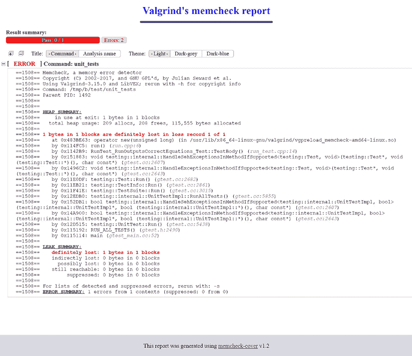

# 第十二章：程序分析工具

编写高质量代码并非易事，即便是经验丰富的开发者也是如此。通过在我们的解决方案中加入测试，我们可以减少在主代码中犯基本错误的可能性。但这还不足以避免更复杂的问题。每一段软件都包含了大量的细节，要追踪所有这些细节几乎成为了一项全职工作。维护产品的团队会建立各种约定和特定的设计实践。

有一些问题与一致的编码风格有关：我们应该在代码中使用 80 列还是 120 列？我们应该允许使用 `std::bind` 还是坚持使用 Lambda 函数？使用 C 风格的数组是否可以接受？小函数是否应该写成一行？我们是否应该总是使用 auto，还是仅在提高可读性时使用？理想情况下，我们应该避免已知通常不正确的语句：无限循环、使用标准库保留的标识符、无意的数据丢失、不必要的 `if` 语句以及其他任何不符合“最佳实践”的东西（更多信息请参见 *进一步阅读* 部分）。

另一个需要考虑的方面是代码的现代化。随着 C++ 的发展，它引入了新的特性。跟踪所有可以更新到最新标准的地方可能是一个挑战。此外，手动进行这一操作既费时又增加了引入错误的风险，尤其是在大型代码库中。最后，我们还应检查在程序运行时其操作是否正常：运行程序并检查其内存。内存是否在使用后正确释放？我们是否访问了已正确初始化的数据？或者代码是否尝试访问不存在的指针？

手动管理所有这些挑战和问题既费时又容易出错。幸运的是，我们可以使用自动化工具来检查和强制执行规则，纠正错误，并使我们的代码保持最新。现在是时候探索程序分析工具了。在每次构建时，我们的代码将会被仔细审查，确保它符合行业标准。

本章将涵盖以下主要内容：

+   强制格式化

+   使用静态检查工具

+   使用 Valgrind 进行动态分析

# 技术要求

你可以在 GitHub 上找到本章中提到的代码文件，网址为 [`github.com/PacktPublishing/Modern-CMake-for-Cpp-2E/tree/main/examples/ch12`](https://github.com/PacktPublishing/Modern-CMake-for-Cpp-2E/tree/main/examples/ch12)。

要构建本书中提供的示例，请始终使用以下推荐的命令：

```cpp
cmake -B <build tree> -S <source tree>
cmake --build <build tree> 
```

确保将占位符 `<build tree>` 和 `<source tree>` 替换为适当的路径。提醒一下，**build tree** 是目标/输出目录的路径，**source tree** 是源代码所在的路径。

# 强制格式化

专业开发人员通常会遵循规则。有人说，资深开发人员知道什么时候可以打破规则，因为他们能为其必要性提供正当理由。另一方面，非常资深的开发人员通常避免打破规则，以节省解释自己选择的时间。关键是要关注真正影响产品的问题，而不是陷入琐碎的细节。

在编码风格和格式化方面，开发人员面临许多选择：我们应该使用制表符还是空格进行缩进？如果是空格，使用多少个？列或文件中的字符限制应该是多少？这些选择通常不会改变程序的行为，但可能引发冗长的讨论，增加的价值不大。

确实存在一些常见的做法，但讨论通常围绕个人偏好和轶事证据展开。例如，选择每列 80 个字符而非 120 个字符是任意的。重要的是保持一致的风格，因为不一致可能会妨碍代码的可读性。为了确保一致性，建议使用像`clang-format`这样的格式化工具。这个工具可以通知我们代码是否没有正确格式化，甚至可以自动修正。下面是格式化代码的示例命令：

```cpp
clang-format -i --style=LLVM filename1.cpp filename2.cpp 
```

`-i`选项指示 clang-format 直接编辑文件，而`--style`指定要使用的格式化风格，例如`LLVM`、`Google`、`Chromium`、`Mozilla`、`WebKit`或在文件中提供的自定义风格（更多细节请参见*进一步阅读*部分）。

当然，我们不想每次更改时都手动执行此命令；`CMake`应该作为构建过程的一部分来处理此事。我们已经知道如何在系统中找到`clang-format`（我们需要事先手动安装它）。我们尚未讨论的是如何将这个外部工具应用于所有源文件。为此，我们将创建一个便捷的函数，可以从`cmake`目录中包含该函数：

**ch12/01-formatting/cmake/Format.cmake**

```cpp
function(Format target directory)
  find_program(CLANG-FORMAT_PATH clang-format REQUIRED)
  set(EXPRESSION h hpp hh c cc cxx cpp)
  list(TRANSFORM EXPRESSION PREPEND "${directory}/*.")
  file(GLOB_RECURSE SOURCE_FILES FOLLOW_SYMLINKS
       LIST_DIRECTORIES false ${EXPRESSION}
  )
  add_custom_command(TARGET ${target} PRE_BUILD COMMAND
    ${CLANG-FORMAT_PATH} -i --style=file ${SOURCE_FILES}
  )
endfunction() 
```

`Format`函数接受两个参数：`target`和`directory`。它将在目标构建之前格式化来自该目录的所有源文件。

从技术角度来看，目录中的所有文件不必都属于目标，目标的源文件可能分布在多个目录中。然而，追踪与目标相关的所有源文件和头文件是复杂的，特别是在需要排除外部库的头文件时。在这种情况下，聚焦于目录比聚焦于逻辑目标要容易。我们可以为每个需要格式化的目录调用该函数。

这个函数的步骤如下：

1.  查找已安装的`clang-format`二进制文件。如果未找到该二进制文件，`REQUIRED`关键字会在配置过程中抛出错误。

1.  创建一个文件扩展名列表以进行格式化（用作**通配符表达式**）。

1.  在每个表达式前加上`directory`的路径。

1.  递归搜索源文件和头文件（使用之前创建的列表），将找到的文件路径放入`SOURCE_FILES`变量中（但跳过任何找到的目录路径）。

1.  将格式化命令附加到`target`的`PRE_BUILD`步骤。

这种方法适用于小到中型代码库。对于更大的代码库，我们可能需要将绝对文件路径转换为相对路径，并使用目录作为工作目录运行格式化命令。这可能是由于 shell 命令中的字符限制，通常限制大约为 13,000 个字符。

让我们来探讨一下如何在实践中使用这个功能。这是我们的项目结构：

```cpp
- CMakeLists.txt
- .clang-format
- cmake
  |- Format.cmake
- src
  |- CMakeLists.txt
  |- header.h
  |- main.cpp 
```

首先，我们设置项目并将`cmake`目录添加到模块路径中，以便稍后包含：

**ch12/01-formatting/CMakeLists.txt**

```cpp
cmake_minimum_required(VERSION 3.26)
project(Formatting CXX)
enable_testing()
list(APPEND CMAKE_MODULE_PATH "${CMAKE_SOURCE_DIR}/cmake")
add_subdirectory(src bin) 
```

接下来，我们为`src`目录填充`listfile`：

**ch12/01-formatting/src/CMakeLists.txt**

```cpp
add_executable(main main.cpp)
include(Format)
Format(main .) 
```

这很直接。我们创建一个名为`main`的可执行目标，包含`Format.cmake`模块，并在当前目录（`src`）为`main`目标调用`Format()`函数。

现在，我们需要一些未格式化的源文件。头文件包含一个简单的`unused`函数：

**ch12/01-formatting/src/header.h**

```cpp
int unused() { return 2 + 2; } 
```

我们还将包括一个源文件，其中包含多余的、不正确的空白符：

**ch12/01-formatting/src/main.cpp**

```cpp
#include <iostream>
                               using namespace std;
                       int main() {
      cout << "Hello, world!" << endl;
                                          } 
```

快完成了。我们只需要格式化工具的配置文件，通过`--style=file`命令行参数启用：

**ch12/01-formatting/.clang-format**

```cpp
BasedOnStyle: Google
ColumnLimit: 140
UseTab: Never
AllowShortLoopsOnASingleLine: false
AllowShortFunctionsOnASingleLine: false
AllowShortIfStatementsOnASingleLine: false 
```

`ClangFormat`将扫描父目录中的`.clang-format`文件，该文件指定了确切的格式化规则。这使我们能够自定义每个细节。在我的案例中，我从 Google 的编码风格开始，并做了一些调整：140 字符列限制，不使用制表符，不允许短的循环、函数或`if`语句写在一行内。

在构建项目后（格式化会在编译前自动进行），我们的文件看起来像这样：

**ch12/01-formatting/src/header.h（已格式化）**

```cpp
int unused() {
  return 2 + 2;
} 
```

即使头文件没有被目标使用，仍然进行了格式化。短函数不能写在一行内，正如预期的那样，添加了新行。`main.cpp`文件现在看起来也相当简洁。不需要的空白符消失了，缩进已标准化：

**ch12/01-formatting/src/main.cpp（已格式化）**

```cpp
#include <iostream>
using namespace std;
int main() {
  cout << "Hello, world!" << endl;
} 
```

自动化格式化可以节省代码审查时的时间。如果你曾经因为空白符问题而不得不修改提交，你一定能体会到这带来的轻松。统一的格式化使你的代码保持整洁，无需费力。

对整个代码库应用格式化最有可能会在仓库中的大多数文件中引入一次性的大变动。如果你（或你的团队成员）正在进行一些工作，这可能会导致*大量*的合并冲突。最好在所有待处理的更改完成后再进行此类操作。如果这不可行，可以考虑逐步采用，可能按目录进行。你的团队成员会感激这一点。

尽管格式化工具在使代码视觉上保持一致方面表现出色，但它不是一个全面的程序分析工具。对于更高级的需求，其他专门用于静态分析的工具是必要的。

# 使用静态检查工具

静态程序分析涉及在不运行已编译版本的情况下检查源代码。始终使用静态检查器可以显著提高代码质量，使其更加一致，不易受到错误和已知安全漏洞的影响。C++社区提供了多种静态检查器，如`Astrée`、`clang-tidy`、`CLazy`、`CMetrics`、`Cppcheck`、`Cpplint`、`CQMetrics`、`ESBMC`、`FlawFinder`、`Flint`、`IKOS`、`Joern`、`PC-Lint`、`Scan-Build`、`Vera++`等。

其中许多工具将`CMake`视为行业标准，并提供现成的支持或集成教程。一些构建工程师更喜欢不编写`CMake`代码，而是通过在线可用的外部模块来包含静态检查器。例如，Lars Bilke 在他的 GitHub 仓库中的集合：[`github.com/bilke/cmake-modules`](https://github.com/bilke/cmake-modules)。

一个普遍的看法是设置静态检查器很复杂。这种看法存在是因为静态检查器通常模拟实际编译器的行为来理解代码。但实际上并不一定要很难。

`Cppcheck`在其手册中概述了以下简单步骤：

1.  定位静态检查器的可执行文件。

1.  使用以下命令生成*编译数据库*：

    +   `cmake -DCMAKE_EXPORT_COMPILE_COMMANDS=ON`。

1.  使用生成的 JSON 文件运行检查器：

    +   `<path-to-cppcheck> --project=compile_commands.json`

这些步骤应该集成到构建过程中，以确保它们不会被忽略。

由于`CMake`知道如何构建我们的目标，它是否也支持任何静态检查器？完全支持，而且比你想的要简单得多。`CMake`允许你为以下工具按目标启用检查器：

+   `include-what-you-use` ([`include-what-you-use.org`](https://include-what-you-use.org))

+   `clang-tidy` ([`clang.llvm.org/extra/clang-tidy`](https://clang.llvm.org/extra/clang-tidy))

+   `Link What` `You Use`（一个内建的`CMake`检查器）

+   `Cpplint` ([`github.com/cpplint/cpplint`](https://github.com/cpplint/cpplint))

+   `Cppcheck` ([`cppcheck.sourceforge.io`](https://cppcheck.sourceforge.io))

要启用这些检查器，将目标属性设置为包含检查器可执行文件路径和任何需要转发的命令行选项的分号分隔列表：

+   `<LANG>_CLANG_TIDY`

+   `<LANG>_CPPCHECK`

+   `<LANG>_CPPLINT`

+   `<LANG>_INCLUDE_WHAT_YOU_USE`

+   `LINK_WHAT_YOU_USE`

用`C`替换`<LANG>`以处理 C 源代码，用`CXX`处理 C++源代码。如果你希望为所有项目目标启用检查器，可以设置一个以`CMAKE_`为前缀的全局变量——例如：

```cpp
set(CMAKE_CXX_CLANG_TIDY /usr/bin/clang-tidy-3.9;-checks=*) 
```

在此语句之后定义的任何目标都会将其`CXX_CLANG_TIDY`属性设置为此值。请记住，启用此分析可能会稍微延长构建时间。另一方面，更详细地控制检查器如何测试目标是非常有用的。我们可以创建一个简单的函数来处理此操作：

**ch12/02-clang-tidy/cmake/ClangTidy.cmake**

```cpp
function(AddClangTidy target)
  find_program(CLANG-TIDY_PATH clang-tidy REQUIRED)
  set_target_properties(${target}
    PROPERTIES CXX_CLANG_TIDY
    "${CLANG-TIDY_PATH};-checks=*;--warnings-as-errors=*"
  )
endfunction() 
```

`AddClangTidy` 函数包括两个基本步骤：

1.  定位 `clang-tidy` 二进制文件并将其路径存储在 `CLANG-TIDY_PATH` 中。`REQUIRED` 关键字确保如果找不到二进制文件，配置将停止并抛出错误。

1.  通过提供二进制路径和特定选项来启用目标的 `clang-tidy`，以激活所有检查并将警告视为错误。

要使用这个功能，我们只需包含模块并为所选目标调用它：

**ch12/02-clang-tidy/src/CMakeLists.txt**

```cpp
add_library(sut STATIC calc.cpp run.cpp)
target_include_directories(sut PUBLIC .)
add_executable(bootstrap bootstrap.cpp)
target_link_libraries(bootstrap PRIVATE sut)
include(ClangTidy)
AddClangTidy(sut) 
```

这种方法简洁且非常有效。在构建解决方案时，`clang-tidy` 的输出将如下所示：

```cpp
[  6%] Building CXX object bin/CMakeFiles/sut.dir/calc.cpp.o
/root/examples/ch12/04-clang-tidy/src/calc.cpp:3:11: warning: method 'Sum' can be made static [readability-convert-member-functions-to-static]
int Calc::Sum(int a, int b) {
          ^
[ 12%] Building CXX object bin/CMakeFiles/sut.dir/run.cpp.o
/root/examples/ch12/04-clang-tidy/src/run.cpp:1:1: warning: #includes are not sorted properly [llvm-include-order]
#include <iostream>
^        ~~~~~~~~~~
/root/examples/ch12/04-clang-tidy/src/run.cpp:3:1: warning: do not use namespace using-directives; use using-declarations instead [google-build-using-namespace]
using namespace std;
^
/root/examples/ch12/04-clang-tidy/src/run.cpp:6:3: warning: initializing non-owner 'Calc *' with a newly created 'gsl::owner<>' [cppcoreguidelines-owning-memory]
  auto c = new Calc();
  ^ 
```

请注意，除非您将 `--warnings-as-errors=*` 选项添加到命令行参数中，否则构建会成功完成。组织应决定一组必须严格遵循的规则，以防止不合规的代码进入代码库。

`clang-tidy` 还提供了一个有用的 `--fix` 选项，可以在可能的情况下自动修正您的代码。这个功能是一个宝贵的时间节省工具，尤其在扩展检查项列表时非常有用。与格式化类似，在将静态分析工具所做的更改添加到现有代码库时，要小心合并冲突。

根据您的情况、代码库的大小和团队的偏好，您应选择少量最适合您需求的检查工具。包含过多的检查工具可能会导致干扰。以下是 `CMake` 默认支持的检查工具的简要概述。

## clang-tidy

这是官方文档中关于 clang-tidy 的介绍：

> clang-tidy 是一个基于 clang 的 C++ 静态分析工具。它的目的是提供一个可扩展的框架，用于诊断和修复典型的编程错误，如风格违规、接口误用或通过静态分析可以推断出的错误。clang-tidy 是模块化的，并提供了一个方便的接口用于编写新的检查项。

该工具非常灵活，提供了超过 400 项检查。它与 `ClangFormat` 配合良好，能够自动应用修复（超过 150 项修复可用），以符合相同的格式文件。它提供的检查覆盖了性能、可读性、现代化、C++ 核心指南以及易出错的领域。

## Cpplint

以下是 `Cpplint` 官方网站的描述：

> Cpplint 是一个命令行工具，用于检查 C/C++ 文件的风格问题，遵循 Google 的 C++ 风格指南。Cpplint 由 Google 公司在 google/styleguide 上开发和维护。

这个静态代码分析工具旨在使您的代码符合 Google 的风格指南。它是用 Python 编写的，可能会为某些项目引入不必要的依赖。修复建议以 `Emacs`、`Eclipse`、`VS7`、`Junit` 格式提供，也可以作为 `sed` 命令使用。

## Cppcheck

这是官方文档中关于 `Cppcheck` 的介绍：

> Cppcheck 是一个用于 C/C++代码的静态分析工具。它提供独特的代码分析，检测错误，重点检查未定义的行为和危险的编码结构。目标是尽量减少误报。Cppcheck 设计为即使代码有非标准语法（在嵌入式项目中常见），也能够进行分析。

这个工具特别擅长最小化误报，使其成为可靠的代码分析选项。它已经存在超过 14 年，并且仍在积极维护。如果你的代码与 Clang 不兼容，它尤其有用。

## include-what-you-use

这是来自官方官网的 include-what-you-use 描述：

> include-what-you-use 的主要目标是去除多余的#includes。它通过找出此文件（包括.cc 和.h 文件）中实际上不需要的#includes，并在可能的情况下用前置声明替换#includes 来实现这一点。

虽然在小型项目中，包含过多头文件似乎不是什么大问题，但避免不必要的头文件编译所节省的时间，在大型项目中会迅速积累。

## Link What You Use

这里是`CMake`博客中关于“Link what you use”的描述：

> 这是一个内置的 CMake 功能，使用 ld 和 ldd 的选项打印出可执行文件是否链接了超出实际需求的库。

静态分析在医疗、核能、航空、汽车和机械等行业中起着至关重要的作用，因为软件错误可能会威胁生命。明智的开发者也会在非关键环境中采用这些实践，尤其是当成本较低时。在构建过程中使用静态分析不仅比手动发现和修复错误更具成本效益，而且通过`CMake`启用也非常简单。我甚至可以说，对于任何质量敏感的软件（包括涉及开发者以外的其他人的软件），几乎没有理由跳过这些检查。

这个功能还通过专注于消除不必要的二进制文件，帮助加速构建时间。不幸的是，并非所有的错误都能在运行程序之前被检测到。幸运的是，我们可以采取额外的措施，像使用`Valgrind`，来深入了解我们的项目。

# 使用 Valgrind 进行动态分析

`Valgrind` ([`www.valgrind.org`](https://www.valgrind.org)) 是一个用于构建动态分析工具的*nix 工具框架，这意味着它在程序运行时进行分析。它配备了各种工具，适用于多种类型的调查和检查。一些工具包括：

+   `Memcheck`：检测内存管理问题

+   `Cachegrind`：分析 CPU 缓存，并识别缓存未命中和其他问题

+   `Callgrind`：`Cachegrind`的扩展，提供关于调用图的额外信息

+   `Massif`：一个堆分析器，显示程序不同部分如何随时间使用堆

+   `Helgrind`：一个用于数据竞争问题的线程调试器

+   `DRD`：`Helgrind`的一个较轻量、功能较为有限的版本

列表中的每个工具在需要时都非常有用。大多数系统包管理器都知道`Valgrind`，并可以轻松地在你的操作系统上安装它。如果你使用的是 Linux，它可能已经安装了。此外，官方网站还提供了源代码，供那些喜欢自己编译的用户使用。

我们的讨论将主要集中在`Memcheck`上，这是`Valgrind`套件中最常用的工具（当开发者提到`Valgrind`时，通常指的是`Valgrind`的`Memcheck`）。我们将探讨如何与`CMake`一起使用它，这将使得如果以后需要使用其他工具时，更容易采用套件中的其他工具。

## Memcheck

`Memcheck`对于调试内存问题非常宝贵，尤其是在 C++中，这个话题可能特别复杂。程序员对内存管理有广泛的控制，因此可能会犯各种错误。这些错误可能包括读取未分配或已经释放的内存，重复释放内存，甚至写入错误的地址。这些漏洞往往容易被忽视，甚至渗透到简单的程序中。有时，仅仅是忘记初始化一个变量，就足以导致问题。

调用`Memcheck`看起来像这样：

```cpp
valgrind [valgrind-options] tested-binary [binary-options] 
```

`Memcheck`是`Valgrind`的默认工具，但你也可以明确指定它，如下所示：

```cpp
valgrind --tool=memcheck tested-binary 
```

运行`Memcheck`会显著降低程序的运行速度；手册（见*进一步阅读*中的链接）表示，使用它的程序可能会变得比正常速度慢 10 到 15 倍。为了避免每次运行测试时都需要等待`Valgrind`，我们将创建一个单独的目标，在需要测试代码时从命令行调用。理想情况下，这个步骤应该在任何新代码合并到主代码库之前完成。你可以将这个步骤包含在一个早期的 Git 钩子中，或作为**持续集成**（**CI**）流水线的一部分。

要为`Valgrind`创建自定义目标，可以在`CMake`生成阶段之后使用以下命令：

```cpp
cmake --build <build-tree> -t valgrind 
```

下面是如何在`CMake`中添加这样的目标：

**ch12/03-valgrind/cmake/Valgrind.cmake**

```cpp
function(AddValgrind target)
  find_program(VALGRIND_PATH valgrind REQUIRED)
  add_custom_target(valgrind
    COMMAND ${VALGRIND_PATH} --leak-check=yes
            $<TARGET_FILE:${target}>
    WORKING_DIRECTORY ${CMAKE_BINARY_DIR}
  )
endfunction() 
```

在这个例子中，我们定义了一个名为`AddValgrind`的`CMake`函数，它接受要测试的目标（我们可以在多个项目中重复使用它）。这里发生了两件主要的事情：

1.  `CMake`会检查默认的系统路径以查找`valgrind`可执行文件，并将其路径存储在`VALGRIND_PATH`变量中。如果没有找到该二进制文件，`REQUIRED`关键字将导致配置中断并报错。

1.  创建了一个名为`valgrind`的自定义目标。它会在指定的二进制文件上运行`Memcheck`，并且总是检查内存泄漏。

`Valgrind`选项可以通过多种方式设置：

+   在`~/.valgrindrc`文件中（在你的主目录下）

+   通过`$VALGRIND_OPTS`环境变量

+   在`./.valgrindrc`文件中（在工作目录下）

这些文件按顺序进行检查。另外，请注意，只有在文件属于当前用户、是常规文件且没有标记为全局可写时，最后一个文件才会被考虑。这是一个安全机制，因为提供给 `Valgrind` 的选项可能会有潜在的危害。

为了使用 `AddValgrind` 函数，我们将其与 `unit_tests` 目标一起使用，因为我们希望在像单元测试这样的精细控制环境中运行它：

**ch12/03-valgrind/test/CMakeLists.txt（片段）**

```cpp
# ...
add_executable(unit_tests calc_test.cpp run_test.cpp)
# ...
**include****(Valgrind)**
**AddValgrind****(unit_tests)** 
```

记住，使用 `Debug` 配置生成构建树可以让 `Valgrind` 访问调试信息，从而使输出更加清晰。

让我们看看这个在实践中是如何工作的：

```cpp
# cmake -B <build tree> -S <source tree> -DCMAKE_BUILD_TYPE=Debug
# cmake --build <build-tree> -t valgrind 
```

这将配置项目，构建 `sut` 和 `unit_tests` 目标，并开始执行 `Memcheck`，它将提供一般信息：

```cpp
[100%] Built target unit_tests
==954== Memcheck, a memory error detector
==954== Copyright (C) 2002-2017, and GNU GPL'd, by Julian Seward et al.
==954== Using Valgrind-3.18.1 and LibVEX; rerun with -h for copyright info
==954== Command: ./unit_tests 
```

`==954==` 前缀包含进程的 `ID`，有助于区分 `Valgrind` 的注释和被测试进程的输出。

接下来，像往常一样运行测试，使用 `gtest`：

```cpp
[==========] Running 3 tests from 2 test suites.
[----------] Global test environment set-up.
...
[==========] 3 tests from 2 test suites ran. (42 ms total)
[  PASSED  ] 3 tests. 
```

最后，呈现一个总结：

```cpp
==954==
==954== HEAP SUMMARY:
==954==     in use at exit: 1 bytes in 1 blocks
==954==   total heap usage: 209 allocs, 208 frees, 115,555 bytes allocated 
```

哎呀！我们仍然使用了至少 1 字节。通过 `malloc()` 和 `new` 分配的内存没有与适当的 `free()` 和 `delete` 操作匹配。看起来我们的程序中有内存泄漏。`Valgrind` 提供了更多细节来帮助找到它：

```cpp
==954== 1 bytes in 1 blocks are definitely lost in loss record 1 of 1
==954==    at 0x483BE63: operator new(unsigned long) (in /usr/lib/x86_64-linux-gnu/valgrind/vgpreload_memcheck-amd64-linux.so)
==954==    by 0x114FC5: run() (run.cpp:6)
==954==    by 0x1142B9: RunTest_RunOutputsCorrectEquations_Test::TestBody() (run_test.cpp:14) 
```

以 `by 0x<address>` 开头的行表示调用栈中的单独函数。我已将输出截断（它有来自 `GTest` 的噪声），以便集中显示有趣的部分——最顶层的函数和源代码引用 `run()(run.cpp:6)`：

最后，总结信息出现在底部：

```cpp
==954== LEAK SUMMARY:
==954==    definitely lost: 1 bytes in 1 blocks
==954==    indirectly lost: 0 bytes in 0 blocks
==954==      possibly lost: 0 bytes in 0 blocks
==954==    still reachable: 0 bytes in 0 blocks
==954==         suppressed: 0 bytes in 0 blocks
==954==
==954== ERROR SUMMARY: 1 errors from 1 contexts (suppressed: 0 from 0) 
```

`Valgrind` 非常擅长发现复杂问题。有时，它甚至可以更深入地挖掘出一些不容易归类的问题，这些问题会出现在 “`possibly lost`” 行中。

让我们看看 `Memcheck` 这次发现了什么问题：

**ch12/03-valgrind/src/run.cpp**

```cpp
#include <iostream>
#include "calc.h"
using namespace std;
int run() {
  **auto** **c =** **new****Calc****();**
  cout << "2 + 2 = " << c->Sum(2, 2) << endl;
  cout << "3 * 3 = " << c->Multiply(3, 3) << endl;
  return 0;
} 
```

没错：突出显示的代码是有问题的。实际上，我们创建了一个对象，而在测试结束之前没有删除它。这正是为什么拥有广泛的测试覆盖非常重要的原因。

`Valgrind` 是一个有用的工具，但在复杂程序中，其输出可能会变得难以应对。实际上，有一种更有效地管理这些信息的方法——那就是 `Memcheck`-`Cover` 项目。

## Memcheck-Cover

像 CLion 这样的商业 IDE 可以直接解析 `Valgrind` 的输出，使得通过图形界面浏览变得更加容易，无需在控制台中滚动。如果你的编辑器没有这个功能，第三方报告生成器可以提供更清晰的视图。由 *David Garcin* 开发的 `Memcheck`-`Cover` 通过生成 HTML 文件提供了更好的体验，如下图所示：



图 12.1：由 Memcheck-Cover 生成的报告

这个简洁的小项目可以在 GitHub 上找到 ([`github.com/Farigh/memcheck-cover`](https://github.com/Farigh/memcheck-cover))；它需要 `Valgrind` 和 `gawk`（GNU AWK 工具）。为了使用它，我们将在一个单独的 `CMake` 模块中准备一个设置函数。它将包含两部分：

1.  获取和配置工具

1.  添加一个自定义目标来运行`Valgrind`并生成报告

这是配置的样子：

**ch12/04-memcheck/cmake/Memcheck.cmake**

```cpp
function(AddMemcheck target)
  include(FetchContent)
  FetchContent_Declare(
   memcheck-cover
   GIT_REPOSITORY https://github.com/Farigh/memcheck-cover.git
   GIT_TAG        release-1.2
  )
  FetchContent_MakeAvailable(memcheck-cover)
  set(MEMCHECK_PATH ${memcheck-cover_SOURCE_DIR}/bin) 
```

在第一部分中，我们遵循与常规依赖项相同的做法：包括`FetchContent`模块，并通过`FetchContent_Declare`指定项目的仓库和所需的 Git 标签。接下来，我们启动获取过程并配置二进制路径，使用`FetchContent_Populate`（由`FetchContent_MakeAvailable`隐式调用）设置的`memcheck-cover_SOURCE_DIR`变量。

函数的第二部分是创建目标以生成报告。我们将其命名为`memcheck`（这样如果出于某些原因希望保留两个选项，它就不会与之前的`valgrind`目标重叠）：

**ch12/04-memcheck/cmake/Memcheck.cmake（续）**

```cpp
 add_custom_target(memcheck
    COMMAND ${MEMCHECK_PATH}/memcheck_runner.sh -o
      "${CMAKE_BINARY_DIR}/valgrind/report"
      -- $<TARGET_FILE:${target}>
    COMMAND ${MEMCHECK_PATH}/generate_html_report.sh
      -i "${CMAKE_BINARY_DIR}/valgrind"
      -o "${CMAKE_BINARY_DIR}/valgrind"
    WORKING_DIRECTORY ${CMAKE_BINARY_DIR}
  )
endfunction() 
```

这一过程包括两个命令：

1.  首先，我们将运行`memcheck_runner.sh`包装脚本，它将执行`Valgrind`的`Memcheck`并将输出收集到通过`-o`参数提供的文件中。

1.  然后，我们将解析输出并使用`generate_html_report.sh`生成报告。这个脚本需要通过`-i`和`-o`参数提供输入和输出目录。

这两个步骤应该在`CMAKE_BINARY_DIR`工作目录中执行，这样单元测试二进制文件就可以通过相对路径访问文件（如果需要的话）。

我们需要在我们的 listfiles 中添加的最后一件事，当然是调用这个函数：

**ch12/04-memcheck/test/CMakeLists.txt（片段）**

```cpp
include(Memcheck)
AddMemcheck(unit_tests) 
```

在使用`Debug`配置生成构建系统后，我们可以使用以下命令构建目标：

```cpp
# cmake -B <build tree> -S <source tree> -DCMAKE_BUILD_TYPE=Debug
# cmake --build <build-tree> -t memcheck 
```

然后，我们可以享受生成的格式化报告，它作为 HTML 页面生成。

# 总结

“你将花更多的时间阅读代码，而不是编写代码，所以要优化可读性而非可写性。” 这一原则在各种关于清洁代码的书籍中都有提及。许多软件开发人员的经验也支持这一点，这就是为什么连空格、换行符的数量，以及`#import`语句的顺序等小细节都要标准化。这种标准化不仅仅是为了精益求精；它是为了节省时间。遵循本章的做法，你可以忘记手动格式化代码。当你构建代码时，格式会自动调整，这本来就是你测试代码时要做的一步。借助`ClangFormat`，你可以确保格式符合你选择的标准。

除了简单的空格调整外，代码还应该遵循许多其他规范。这就是 clang-tidy 的用武之地。它帮助执行你团队或组织所达成的编码规范。我们深入讨论了这个静态检查工具，还涉及了其他选项，如`Cpplint`、`Cppcheck`、include-what-you-use 和 Link What You Use。由于静态链接器的速度相对较快，我们可以将它们添加到构建过程中，投入非常小，而且通常非常值得。

我们还检查了`Valgrind`工具，重点介绍了`Memcheck`，它能帮助识别内存管理中的问题，如不正确的读取和写入。这个工具对于避免长时间的手动调试和防止生产环境中的 bug 非常宝贵。我们介绍了一种方法，通过`Memcheck`-`Cover`（一个 HTML 报告生成器）让`Valgrind`的输出更具用户友好性。在无法运行 IDE 的环境中，像 CI 流水线，这尤其有用。

本章只是一个起点。许多其他工具，无论是免费的还是商业的，都可以帮助您提高代码质量。探索它们，找到最适合您的工具。在下一章中，我们将深入探讨生成文档的过程。

# 进一步阅读

欲了解更多信息，您可以参考以下链接：

+   C++核心指南，由 C++的作者 Bjarne Stroustrup 策划：[`github.com/isocpp/CppCoreGuidelines`](https://github.com/isocpp/CppCoreGuidelines)

+   `ClangFormat`参考：[`clang.llvm.org/docs/ClangFormat.html`](https://clang.llvm.org/docs/ClangFormat.html)

+   C++的静态分析工具 – 精选列表：[`github.com/analysis-tools-dev/static-analysis#cpp`](https://github.com/analysis-tools-dev/static-analysis#cpp)

+   `CMake`中的内置静态检查器支持：[`blog.kitware.com/static-checks-with-cmake-cdash-iwyu-clang-tidy-lwyu-cpplint-and-cppcheck/`](https://blog.kitware.com/static-checks-with-cmake-cdash-iwyu-clang-tidy-lwyu-cpplint-and-cppcheck/)

+   启用`clang-tidy`的目标属性：[`cmake.org/cmake/help/latest/prop_tgt/LANG_CLANG_TIDY.html`](https://cmake.org/cmake/help/latest/prop_tgt/LANG_CLANG_TIDY.html)

+   `Valgrind`手册：[`www.valgrind.org/docs/manual/manual-core.html`](https://www.valgrind.org/docs/manual/manual-core.html)

# 发表评论！

喜欢这本书吗？通过在亚马逊上留下评论，帮助像您一样的读者。扫描下面的二维码，获取您选择的免费电子书。


