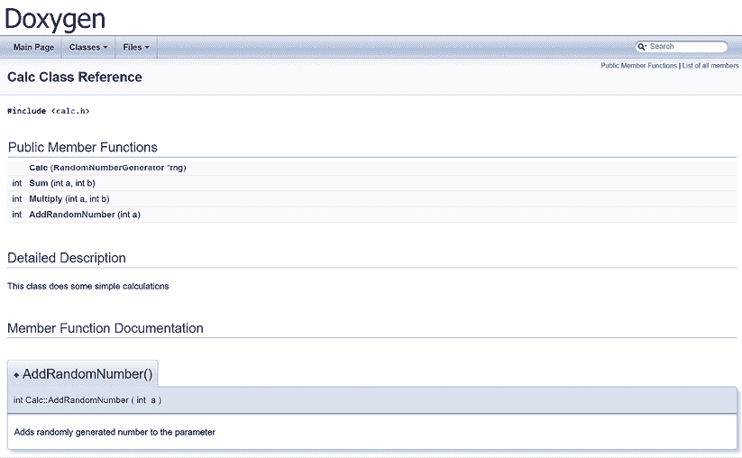
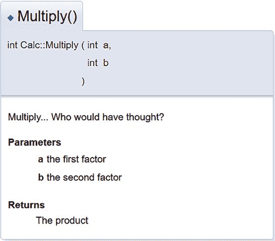
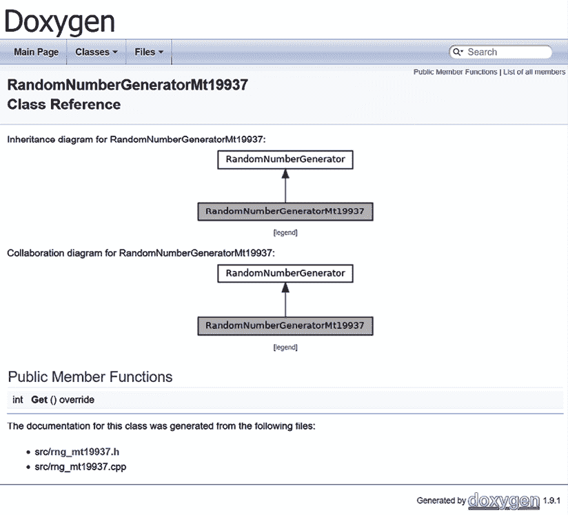
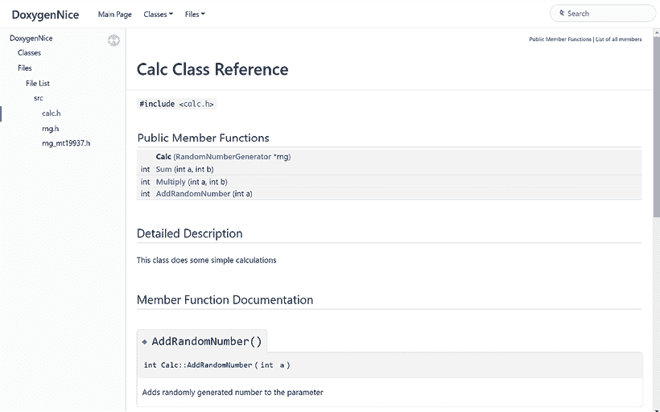

# 第十三章：生成文档

高质量的代码不仅仅是编写得好、运行正常并经过测试——它还需要有完善的文档。文档能够帮助我们分享可能会丢失的信息，描绘更大的图景，提供上下文，揭示意图，最终——教育外部用户和维护者。

你还记得上次加入一个新项目时，迷失在一堆目录和文件中几个小时吗？这一问题是可以避免的。真正优秀的文档可以让一个完全陌生的人在几秒钟内找到他们需要的代码行。可惜，缺乏文档的问题经常被忽视。难怪如此——编写文档需要相当的技能，而我们中的许多人并不擅长这一点。此外，文档和代码很容易变得过时。除非实施严格的更新和审查流程，否则很容易忘记文档也需要关注。

一些团队（为了节省时间或因为管理层的鼓励）采用了编写*自文档化代码*的做法。通过为文件名、函数、变量等选择有意义且易读的标识符，他们希望避免编写文档的麻烦。即使是最好的函数签名，也不能确保传达所有必要的信息——例如，`int removeDuplicates();`很有描述性，但它并没有说明返回的是什么。它可能是发现的重复项数量，剩余项的数量，或其他什么——这并不明确。虽然良好的命名习惯是绝对正确的，但它不能替代用心的文档编写。记住：没有免费的午餐。

为了简化工作，专业人员使用自动文档生成器，这些生成器会分析代码和源文件中的注释，生成各种格式的全面文档。将此类生成器添加到 CMake 项目中非常简单——让我们来看看如何做！

本章我们将涵盖以下主要内容：

+   将 Doxygen 添加到你的项目中

+   使用现代化外观生成文档

+   使用自定义 HTML 增强输出

# 技术要求

你可以在 GitHub 上找到本章中出现的代码文件，地址是：[`github.com/PacktPublishing/Modern-CMake-for-Cpp-2E/tree/main/examples/ch13`](https://github.com/PacktPublishing/Modern-CMake-for-Cpp-2E/tree/main/examples/ch13)。

要构建本书中提供的示例，请始终使用推荐的命令：

```cpp
cmake -B <build tree> -S <source tree>
cmake --build <build tree> 
```

一定要将占位符`<build tree>`和`<source tree>`替换为适当的路径。提醒一下：**build tree**是目标/输出目录的路径，**source tree**是源代码所在的路径。

# 将 Doxygen 添加到你的项目中

用于从 C++ 源代码生成文档的最成熟和最流行的工具之一就是 Doxygen。当我说“成熟”时，我是认真的：第一个版本是由 Dimitri van Heesch 于 1997 年 10 月发布的。此后，它得到了巨大的发展，并得到了几乎 250 位贡献者的积极支持（[`github.com/doxygen/doxygen`](https://github.com/doxygen/doxygen)）。

你可能会担心将 Doxygen 纳入没有从一开始就使用文档生成的大型项目中的挑战。的确，注释每个函数的任务可能看起来非常繁重。然而，我鼓励你从小处开始。专注于记录你最近在最新提交中工作的元素。记住，即使是部分完成的文档也比完全没有要好，而且它逐渐有助于建立你项目的更全面的理解。

Doxygen 可以生成以下格式的文档：

+   **超文本标记语言** (**HTML**)

+   **富文本格式** (**RTF**)

+   **可移植文档格式** (**PDF**)

+   **Lamport TeX** (**LaTeX**)

+   **PostScript** (**PS**)

+   Unix 手册（man 页面）

+   **微软编译的 HTML** 帮助 (.CHM)

如果你在代码中使用注释按照 Doxygen 指定的格式提供额外信息，它会解析这些注释以丰富输出文件。此外，代码结构还将被分析以生成有用的图表和图示。后者是可选的，因为它需要外部的 Graphviz 工具（[`graphviz.org/`](https://graphviz.org/)）。

开发者应该首先考虑以下问题：*项目的用户只会接收文档，还是他们会自己生成文档（例如在从源代码构建时）*？第一个选项意味着文档会与二进制文件一起分发，或者在线提供，或者（不那么优雅地）与源代码一起提交到代码库中。

这个考虑非常重要，因为如果你希望用户在构建过程中生成文档，他们的系统中必须存在这些依赖项。这并不是一个大问题，因为 Doxygen 和 Graphviz 可以通过大多数包管理器获得，所需要的只是一个简单的命令，比如针对 Debian 系统的命令：

```cpp
apt-get install doxygen graphviz 
```

Windows 版本的二进制文件也可以使用（请查看项目网站的*进一步阅读*部分）。

然而，一些用户可能不愿意安装这些工具。我们必须决定是为用户生成文档，还是让他们在需要时添加依赖项。项目也可以像*第九章*中描述的那样，自动为用户添加这些依赖项，*管理 CMake 中的依赖项*。请注意，Doxygen 是使用 CMake 构建的，因此如果需要，你已经知道如何从源代码编译它。

当系统中安装了 Doxygen 和 Graphviz 时，我们可以将文档生成功能添加到项目中。与一些在线资料所建议的相反，这并不像看起来那么困难或复杂。我们无需创建外部配置文件，提供 Doxygen 可执行文件的路径，或添加自定义目标。自 CMake 3.9 起，我们可以使用来自 `FindDoxygen` 查找模块的 `doxygen_add_docs()` 函数，它会设置文档目标。

函数签名如下：

```cpp
doxygen_add_docs(targetName [sourceFilesOrDirs...]
  [ALL] [WORKING_DIRECTORY dir] [COMMENT comment]) 
```

第一个参数指定目标名称，我们需要在 `cmake` 的 `-t` 参数中显式构建该目标（生成构建树之后），如下所示：

```cpp
# cmake --build <build-tree> -t targetName 
```

或者，我们可以通过添加 `ALL` 参数来确保始终构建文档，尽管通常不需要这样做。`WORKING_DIRECTORY` 选项非常简单；它指定了命令应在其中执行的目录。由 `COMMENT` 选项设置的值会在文档生成开始前显示，提供有用的信息或说明。

我们将遵循前几章的做法，创建一个包含辅助函数的工具模块（以便在其他项目中重用），如下所示：

**ch13/01-doxygen/cmake/Doxygen.cmake**

```cpp
function(Doxygen input output)
  find_package(Doxygen)
  if (NOT DOXYGEN_FOUND)
    add_custom_target(doxygen COMMAND false
      COMMENT "Doxygen not found")
    return()
  endif()
  set(DOXYGEN_GENERATE_HTML YES)
  set(DOXYGEN_HTML_OUTPUT
    ${PROJECT_BINARY_DIR}/${output})
  doxygen_add_docs(doxygen
      ${PROJECT_SOURCE_DIR}/${input}
      COMMENT "Generate HTML documentation"
  )
endfunction() 
```

该函数接受两个参数——`input` 和 `output` 目录——并创建一个自定义的 `doxygen` 目标。以下是发生的过程：

1.  首先，我们使用 CMake 内建的 Doxygen 查找模块来确定系统中是否安装了 Doxygen。

1.  如果 Doxygen 不可用，我们会创建一个虚拟的 `doxygen` 目标，向用户提示并运行 `false` 命令，（在类 Unix 系统中）返回 `1`，导致构建失败。此时，我们会用 `return()` 终止该函数。

1.  如果 Doxygen 可用，我们将其配置为在提供的 `output` 目录中生成 HTML 输出。Doxygen 是极其可配置的（更多信息请参阅官方文档）。要设置任何选项，只需按照示例调用 `set()` 并在选项名前加上 `DOXYGEN_` 前缀。

1.  设置实际的 `doxygen` 目标。所有 `DOXYGEN_` 变量将被转发到 Doxygen 的配置文件中，并从提供的源树中的 `input` 目录生成文档。

如果您的文档需要由用户生成，*步骤 2* 可能应该涉及安装 Doxygen。

要使用这个函数，我们可以将其集成到项目的主列表文件中，如下所示：

**ch13/01-doxygen/CMakeLists.txt**

```cpp
cmake_minimum_required(VERSION 3.26)
project(Doxygen CXX)
enable_testing()
list(APPEND CMAKE_MODULE_PATH "${CMAKE_SOURCE_DIR}/cmake")
add_subdirectory(src bin)
**include****(Doxygen)**
**Doxygen(src docs)** 
```

一点也不难！构建 `doxygen` 目标会生成类似这样的 HTML 文档：



图 13.1：使用 Doxygen 生成的类参考

为了在**成员函数文档**中添加重要细节，我们可以在头文件中用适当的注释将 C++ 方法声明之前，像这样：

**ch13/01-doxygen/src/calc.h（片段）**

```cpp
 /**
    Multiply... Who would have thought?
    @param a the first factor
    @param b the second factor
    @result The product
   */
   int Multiply(int a, int b); 
```

这种格式被称为 Javadoc。重要的是，注释块应该以双星号开始：`/**`。更多信息可以在 Doxygen 的 docblocks 描述中找到（参见 *Further reading* 部分的链接）。带有这种注释的 `Multiply` 函数将如下面的图所示呈现：



图 13.2：参数和结果的注释

如前所述，如果安装了 Graphviz，Doxygen 会自动检测并生成依赖图，正如下图所示：



图 13.3：由 Doxygen 生成的继承和协作图

通过直接从源代码生成文档，我们建立了一种在开发周期中随代码更改迅速更新的流程。此外，在代码审查过程中，任何被忽视的注释更新也很容易被发现。

许多开发者表达了对 Doxygen 提供的设计显得过时的担忧，这让他们不愿意将生成的文档展示给客户。然而，这个问题有一个简单的解决方案。

# 生成现代化外观的文档

使用干净、清新的设计对项目进行文档化非常重要。毕竟，如果我们为我们的前沿项目投入了这么多精力编写高质量的文档，用户必须意识到这一点。尽管 Doxygen 功能丰富，但它并不以遵循最新视觉趋势而著称。然而，重新设计其外观并不需要大量的努力。

幸运的是，一位名为 `jothepro` 的开发者创建了一个名为 `doxygen-awesome-css` 的主题，它提供了一个现代化且可定制的设计。这个主题在下面的截图中展示：



图 13.4：doxygen-awesome-css 主题下的 HTML 文档

该主题不需要任何额外的依赖项，可以通过其 GitHub 页面轻松获取：[`github.com/jothepro/doxygen-awesome-css`](https://github.com/jothepro/doxygen-awesome-css)。

尽管一些在线资源推荐使用多种应用程序的组合，比如通过 Breathe 和 Exhale 扩展将 Doxygen 的输出与 Sphinx 配合使用，但这种方法可能会很复杂且依赖较多（例如需要 Python）。通常来说，更简洁的方法更为实际，尤其是对于那些并非每个成员都深度了解 CMake 的团队来说。

我们可以通过自动化流程高效实现这一主题。让我们看看如何通过添加一个新宏来扩展我们的 `Doxygen.cmake` 文件以使用它：

**ch13/02-doxygen-nice/cmake/Doxygen.cmake（片段）**

```cpp
macro(UseDoxygenAwesomeCss)
  include(FetchContent)
  FetchContent_Declare(doxygen-awesome-css
    GIT_REPOSITORY
      https://github.com/jothepro/doxygen-awesome-css.git
    GIT_TAG
      V2.3.1
  )
  FetchContent_MakeAvailable(doxygen-awesome-css)
  set(DOXYGEN_GENERATE_TREEVIEW     YES)
  set(DOXYGEN_HAVE_DOT              YES)
  set(DOXYGEN_DOT_IMAGE_FORMAT      svg)
  set(DOXYGEN_DOT_TRANSPARENT       YES)
  set(DOXYGEN_HTML_EXTRA_STYLESHEET
    ${doxygen-awesome-css_SOURCE_DIR}/doxygen-awesome.css)
endmacro() 
```

我们已经从书中的前几章了解了所有这些命令，但为了确保完全清晰，让我们再重复一遍发生了什么：

1.  使用 `FetchContent` 模块从 Git 获取 `doxygen-awesome-css`

1.  配置 Doxygen 的额外选项（这些是主题的 `README` 文件中专门推荐的）

1.  将主题的 `css` 文件复制到 Doxygen 的输出目录

如你所想，最好在`Doxygen`函数中调用这个宏，并在`doxygen_add_docs()`之前，如下所示：

**ch13/02-doxygen-nice/cmake/Doxygen.cmake（片段）**

```cpp
function(Doxygen input output)
# ...
  **UseDoxygenAwesomeCss()**
  doxygen_add_docs (...)
endfunction()
macro(UseDoxygenAwesomeCss)
# ...
endmacro() 
```

记住，宏中的所有变量都在调用函数的作用域内设置。

我们现在可以在生成的 HTML 文档中享受现代风格，并骄傲地与世界分享它。然而，我们的主题提供了一些 JavaScript 模块来增强体验。我们该如何包含它们呢？

# 使用自定义 HTML 增强输出

Doxygen Awesome 提供了一些附加功能，可以通过在文档头部的 HTML `<head>` 标签内包含一些 JavaScript 片段来启用。它们非常有用，因为它们允许在亮色模式和暗色模式之间切换，添加代码片段的**复制**按钮，段落标题的永久链接，以及互动目录。

然而，实现这些功能需要将额外的代码复制到输出目录，并将其包含在生成的 HTML 文件中。

这是需要在`</head>`标签之前包含的 JavaScript 代码：

**ch13/cmake/extra_headers**

```cpp
<script type="text/javascript" src="img/$relpath^doxygen-awesome-darkmode-toggle.js"></script>
<script type="text/javascript" src="img/$relpath^doxygen-awesome-fragment-copy-button.js"></script>
<script type="text/javascript" src="img/$relpath^doxygen-awesome-paragraph-link.js"></script>
<script type="text/javascript" src="img/$relpath^doxygen-awesome-interactive-toc.js"></script>
<script type="text/javascript">
    DoxygenAwesomeDarkModeToggle.init()
    DoxygenAwesomeFragmentCopyButton.init()
    DoxygenAwesomeParagraphLink.init()
    DoxygenAwesomeInteractiveToc.init()
</script> 
```

如你所见，这段代码首先会包含一些 JavaScript 文件，然后初始化不同的扩展。不幸的是，这段代码不能简单地添加到某个变量中。相反，我们需要用自定义文件覆盖默认的头文件。这个覆盖可以通过在 Doxygen 的`HTML_HEADER`配置变量中提供文件路径来完成。

若要创建一个自定义头文件而不硬编码整个内容，可以使用 Doxygen 的命令行工具生成默认的头文件，并在生成文档之前编辑它：

```cpp
doxygen -w html header.html footer.html style.css 
```

虽然我们不会使用或修改`footer.html`或`style.css`，但它们是必需的参数，因此我们仍然需要创建它们。

最后，我们需要自动将`</head>`标签与`ch13/cmake/extra_headers`文件的内容进行连接，以包含所需的 JavaScript。这可以通过 Unix 命令行工具`sed`来完成，它将原地编辑`header.html`文件：

```cpp
sed -i '/<\/head>/r ch13/cmake/extra_headers' header.html 
```

现在我们需要用 CMake 语言将这些步骤编码。以下是实现这一目标的宏：

**ch13/02-doxygen-nice/cmake/Doxygen.cmake（片段）**

```cpp
macro(UseDoxygenAwesomeExtensions)
  set(DOXYGEN_HTML_EXTRA_FILES
    ${doxygen-awesome-css_SOURCE_DIR}/doxygen-awesome-darkmode-toggle.js
    ${doxygen-awesome-css_SOURCE_DIR}/doxygen-awesome-fragment-copy-button.js
    ${doxygen-awesome-css_SOURCE_DIR}/doxygen-awesome-paragraph-link.js
    ${doxygen-awesome-css_SOURCE_DIR}/doxygen-awesome-interactive-toc.js
  )
  execute_process(
   COMMAND doxygen -w html header.html footer.html style.css
   WORKING_DIRECTORY ${PROJECT_BINARY_DIR}
  )
  execute_process(
   COMMAND sed -i
   "/<\\/head>/r ${PROJECT_SOURCE_DIR}/cmake/extra_headers"   
   header.html
   WORKING_DIRECTORY ${PROJECT_BINARY_DIR}
  )
  set(DOXYGEN_HTML_HEADER ${PROJECT_BINARY_DIR}/header.html)
endmacro() 
```

这段代码看起来很复杂，但仔细检查后，你会发现它其实非常直接。它的功能如下：

1.  将四个 JavaScript 文件复制到输出目录

1.  执行`doxygen`命令以生成默认的 HTML 文件

1.  执行`sed`命令以将所需的 JavaScript 注入头文件

1.  使用自定义版本覆盖默认头文件

为了完成集成，在启用基本样式表之后，调用这个宏：

**ch13/02-doxygen-nice/cmake/Doxygen.cmake（片段）**

```cpp
function(Doxygen input output)
 # …
  UseDoxygenAwesomeCss()
  **UseDoxygenAwesomeExtensions()**
# …
endfunction() 
```

该示例的完整代码以及实际示例可以在本书的在线仓库中找到。像往常一样，我建议在实际环境中查看和探索这些示例。

**其他文档生成工具**

本书没有涉及其他许多工具，因为我们专注于 CMake 支持的项目。不过，其中一些工具可能更适合你的使用场景。如果你感兴趣，可以访问我发现的两个有趣项目的官方网站：

+   Adobe 的 Hyde ([`github.com/adobe/hyde`](https://github.com/adobe/hyde))：Hyde 针对 Clang 编译器，生成的 Markdown 文件可以被 Jekyll ([`jekyllrb.com/`](https://jekyllrb.com/)) 等工具使用，Jekyll 是一个由 GitHub 支持的静态页面生成器。

+   Standardese ([`github.com/standardese/standardese`](https://github.com/standardese/standardese))：这个工具使用 libclang 来编译代码，并提供 HTML、Markdown、LaTex 和 man 页的输出。它的目标（相当大胆）是成为下一个 Doxygen。

# 总结

在这一章中，我们深入探讨了如何将强大的文档生成工具 Doxygen 添加到你的 CMake 项目中，并提升其吸引力。尽管这项任务看起来可能令人生畏，但实际上相当可控，并且显著提升了你解决方案中的信息流动和清晰度。如你所见，花时间添加和维护文档是值得的，尤其是当你或你的团队成员在理解应用中的复杂关系时。

在探索如何使用 CMake 内置的 Doxygen 支持来生成实际文档之后，我们稍微转了个方向，确保文档不仅具有可读性，还具有可理解性。

由于过时的设计可能让眼睛感到不适，我们探讨了生成的 HTML 的替代外观。这是通过使用 Doxygen Awesome 扩展来完成的。为了启用其附带的增强功能，我们通过添加必要的 JavaScript 自定义了标准头部。

通过生成文档，你可以确保它与实际代码的接近度，使得在逻辑同步的情况下，维护书面解释变得更加容易，尤其是当它们都在同一个文件中时。此外，作为程序员，你可能需要同时处理大量任务和细节。文档作为记忆辅助工具，帮助你保持和回忆项目的复杂性。记住，“即使是最短的铅笔也比最强的记忆要长。”做个对自己有益的事——把长的事情写下来，成功就会跟随而来。

总结来说，本章强调了 Doxygen 在你的项目管理工具包中的价值，帮助团队内部的理解和沟通。

在下一章中，我将带你了解如何通过 CMake 自动化打包和安装项目，进一步提升你的项目管理技能。

# 进一步阅读

+   Doxygen 官方网站：[`www.doxygen.nl/`](https://www.doxygen.nl/)

+   `FindDoxygen` find-module 文档：[`cmake.org/cmake/help/latest/module/FindDoxygen.html`](https://cmake.org/cmake/help/latest/module/FindDoxygen.html)

+   Doxygen 的 docblocks：[`www.doxygen.nl/manual/docblocks.html#specialblock`](https://www.doxygen.nl/manual/docblocks.html#specialblock)

# 加入我们社区的 Discord

加入我们社区的 Discord 空间，与作者和其他读者进行讨论：

[`discord.com/invite/vXN53A7ZcA`](https://discord.com/invite/vXN53A7ZcA)


