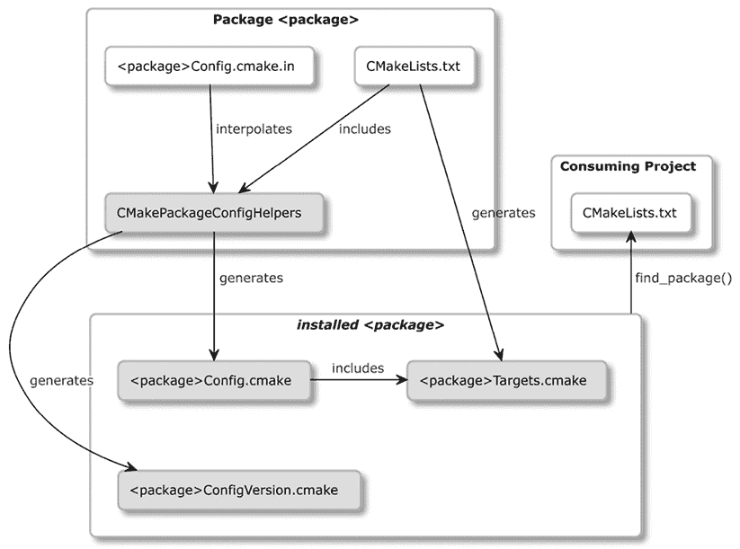

# 第十四章：安装和打包

我们的项目已经构建、测试并且文档化完毕。现在，终于到了将其发布给用户的时候。本章主要集中在我们需要采取的最后两步：安装和打包。这些是建立在我们迄今为止所学的所有内容之上的高级技术：管理目标及其依赖关系、临时使用要求、生成器表达式等等。

安装使我们的项目可以被发现并在系统范围内访问。我们将讨论如何导出目标以供其他项目使用而无需安装，以及如何安装我们的项目以便轻松地在系统范围内访问。我们还将学习如何配置项目，使其能够自动将各种工件类型放置到适当的目录中。为了处理更高级的场景，我们将介绍一些低级命令，用于安装文件和目录，以及执行自定义脚本和 CMake 命令。

接下来，我们将探讨如何设置可重用的 CMake 包，其他项目可以通过 `find_package()` 命令进行发现。我们将解释如何确保目标及其定义不局限于特定的文件系统位置。我们还将讨论如何编写基本的和高级的 **配置文件**，以及与包关联的 **版本文件**。然后，为了使事物更具模块化，我们将简要介绍组件的概念，无论是在 CMake 包还是在 `install()` 命令方面。所有这些准备工作将为本章的最终部分铺平道路：使用 CPack 生成归档、安装程序、捆绑包和包，这些包能够被不同操作系统中的各种包管理器识别。这些包可以分发预构建的工件、可执行文件和库。这是最终用户开始使用我们软件的最简单方法。

在本章中，我们将覆盖以下主要主题：

+   无需安装即可导出

+   在系统上安装项目

+   创建可重用的包

+   定义组件

+   使用 CPack 打包

# 技术要求

你可以在 GitHub 上找到本章中出现的代码文件，网址是[`github.com/PacktPublishing/Modern-CMake-for-Cpp-2E/tree/main/examples/ch14`](https://github.com/PacktPublishing/Modern-CMake-for-Cpp-2E/tree/main/examples/ch14)。

为了构建本书中提供的示例，请始终使用推荐的命令：

```cpp
cmake -B <build tree> -S <source tree>
cmake --build <build tree> 
```

要安装示例，请使用以下命令：

```cpp
cmake --install <build tree> 
```

确保将 `<build tree>` 和 `<source tree>` 占位符替换为适当的路径。提醒一下：**build tree** 是指目标/输出目录的路径，**source tree** 是指源代码所在的路径。

# 无需安装即可导出

我们如何让项目`A`的目标对使用它的项目`B`可用？通常，我们会使用`find_package()`命令，但这要求创建一个包并将其安装到系统中。虽然有用，但这种方法需要一些工作。有时，我们只需要一种快速构建项目并使其目标可供其他项目使用的方法。

一种节省时间的方法是包含项目`B`中`A`的主列表文件，该文件已经包含了所有目标定义。然而，这个文件也可能包含全局配置、带有副作用的 CMake 命令、额外的依赖项，甚至可能包含不适合`B`的目标（比如单元测试）。因此，这不是最好的方法。相反，我们可以为使用项目`B`提供一个**目标导出文件**，让它通过`include()`命令来包含：

```cpp
cmake_minimum_required(VERSION 3.26.0)
project(B)
include(/path/to/A/TargetsOfA.cmake) 
```

这将使用像`add_library()`和`add_executable()`这样的命令，定义所有目标并设置正确的属性。

你必须在`TARGETS`关键字后指定所有要导出的目标，并在`FILE`后提供目标文件名。其他参数是可选的：

```cpp
export(**TARGETS [target1 [target2 [...]]]**
       [NAMESPACE <namespace>] [APPEND] **FILE** **<path>**
       [EXPORT_LINK_INTERFACE_LIBRARIES]
) 
```

这是对各个参数的解释：

+   `NAMESPACE`建议用来指示目标是从其他项目导入的。

+   `APPEND`防止 CMake 在写入前清除文件内容。

+   `EXPORT_LINK_INTERFACE_LIBRARIES`导出目标链接依赖关系（包括导入的和配置特定的变体）。

让我们将此导出方法应用到`Calc`库示例，它提供了两个简单的方法：

**ch14/01-export/src/include/calc/basic.h**

```cpp
#pragma once
int Sum(int a, int b);
int Multiply(int a, int b); 
```

我们需要声明`Calc`目标，以便有东西可以导出：

**ch14/01-export/src/CMakeLists.txt**

```cpp
add_library(calc STATIC basic.cpp)
target_include_directories(calc INTERFACE include) 
```

然后，为了生成导出文件，我们使用`export(TARGETS)`命令：

**ch14/01-export/CMakeLists.txt（片段）**

```cpp
cmake_minimum_required(VERSION 3.26)
project(ExportCalcCXX)
add_subdirectory(src bin)
set(EXPORT_DIR "${CMAKE_CURRENT_BINARY_DIR}/cmake")
export(TARGETS calc
  FILE "${EXPORT_DIR}/CalcTargets.cmake"
  NAMESPACE Calc::
) 
```

我们的导出目标声明文件将位于构建树的`cmake`子目录中（遵循`.cmake`文件的约定）。为了避免稍后重复此路径，我们将其设置为`EXPORT_DIR`变量。然后，我们调用`export()`生成目标声明文件`CalcTargets.cmake`，其中包含`calc`目标。对于包含此文件的项目，它将作为`Calc::calc`可见。

请注意，此导出文件还不是*一个包*。更重要的是，这个文件中的所有路径都是绝对路径并且硬编码为构建树中的路径，导致它们无法移动（在*理解可移动目标的问题*一节中讨论）。

`export()`命令也有一个简化版本，使用`EXPORT`关键字：

```cpp
export(EXPORT <export> [NAMESPACE <namespace>] [FILE <path>]) 
```

然而，它需要预定义导出的名称，而不是一个导出目标的列表。此类`<export>`实例是由`install(TARGETS)`创建的目标名称列表（我们将在*安装逻辑目标*一节中讨论此命令）。

这是一个小示例，演示了这种简写是如何在实践中使用的：

**ch14/01-export/CMakeLists.txt（续）**

```cpp
install(TARGETS calc EXPORT CalcTargets)
export(EXPORT CalcTargets
  FILE "${EXPORT_DIR}/CalcTargets2.cmake"
  NAMESPACE Calc::
) 
```

这段代码的工作方式与之前的示例类似，但现在它在`export()`和`install()`命令之间共享一个单一的目标列表。

两种生成导出文件的方法产生类似的结果。它们包括一些样板代码和几行定义目标的代码。在将`<build-tree>`设置为构建树路径后，它们将创建类似于以下的**目标导出文件**：

**<build-tree>/cmake/CalcTargets.cmake (片段)**

```cpp
# Create imported target Calc::calc
add_library(Calc::calc STATIC IMPORTED)
set_target_properties(Calc::calc PROPERTIES
  INTERFACE_INCLUDE_DIRECTORIES
  **"/<source-tree>/include"**
)
# Import target "Calc::calc" for configuration ""
set_property(TARGET Calc::calc APPEND PROPERTY
  IMPORTED_CONFIGURATIONS NOCONFIG
)
set_target_properties(Calc::calc PROPERTIES
  IMPORTED_LINK_INTERFACE_LANGUAGES_NOCONFIG "CXX"
  IMPORTED_LOCATION_NOCONFIG "**/<build-tree>/libcalc.a**"
) 
```

通常，我们不会编辑或打开此文件，但需要注意的是，路径将被硬编码在其中（请参见高亮行）。在当前形式下，构建的项目无法重新定位。要改变这一点，需要一些额外的步骤。在下一节中，我们将解释什么是重新定位以及为什么它很重要。

# 将项目安装到系统中

在*第一章*，*CMake 入门*中，我们提到 CMake 为将构建的项目安装到系统中提供了命令行模式：

```cpp
cmake --install <dir> [<options>] 
```

这里，`<dir>`是生成的构建树的路径（必需）。`<options>`包括：

+   `--config <cfg>`：选择多配置生成器的构建配置。

+   `--component <comp>`：将安装限制为指定的组件。

+   `--default-directory-permissions <permissions>`：设置已安装目录的默认权限（以`<u=rwx,g=rx,o=rx>`格式）。

+   `--install-prefix <prefix>`：指定非默认的安装路径（存储在`CMAKE_INSTALL_PREFIX`变量中）。在类 Unix 系统上默认为`/usr/local`，在 Windows 上默认为`c:/Program Files/${PROJECT_NAME}`。在 CMake 3.21 之前，您必须使用一个不太明确的选项：`--prefix <prefix>`。

+   `-v, --verbose`：增加输出的详细程度（也可以通过设置`VERBOSE`环境变量实现）。

安装通常涉及将生成的产物和必要的依赖项复制到系统目录中。使用 CMake 为所有 CMake 项目引入了一个方便的安装标准，并提供了几个额外的好处：

+   它为不同类型的产物提供平台特定的安装路径（遵循*GNU 编码标准*）。

+   它通过生成目标导出文件来增强安装过程，允许其他项目直接重用项目的目标。

+   它通过**配置文件**创建可发现的包，包装目标导出文件以及作者定义的特定于包的 CMake 宏和函数。

这些功能非常强大，因为它们节省了大量时间，并简化了以这种方式准备的项目的使用。执行基本安装的第一步是将构建的产物复制到目标目录。这将引导我们进入`install()`命令及其各种模式：

+   `install(``TARGETS)`: 该命令用于安装输出的产物，如库文件和可执行文件。

+   `install(FILES|PROGRAMS)`：安装单个文件并设置它们的权限。这些文件不需要是任何逻辑目标的一部分。

+   `install(DIRECTORY)`：此命令安装整个目录。

+   `install(SCRIPT|CODE)`：在安装过程中运行 CMake 脚本或代码片段。

+   `install(EXPORT)`：此命令生成并安装目标导出文件。

+   `install(RUNTIME_DEPENDENCY_SET <set-name> [...])`：此命令安装项目中定义的运行时依赖集。

+   `install(IMPORTED_RUNTIME_ARTIFACTS <target>... [...])`：此命令查询导入的目标的运行时工件并安装它们。

将这些命令添加到你的列表文件中会在构建树中生成一个 `cmake_install.cmake` 文件。虽然可以通过 `cmake -P` 手动调用此脚本，但不推荐这么做。该文件是 CMake 在执行 `cmake --install` 时内部使用的。

每种 `install()` 模式都有一组全面的选项，其中一些选项在不同模式间是共享的：

+   `DESTINATION`：此选项指定安装路径。相对路径会与 `CMAKE_INSTALL_PREFIX` 一起使用，而绝对路径会按原样使用（并且不被 `cpack` 支持）。

+   `PERMISSIONS`：此选项设置支持平台上的文件权限。可用的值包括 `OWNER_READ`、`OWNER_WRITE`、`OWNER_EXECUTE`、`GROUP_READ`、`GROUP_WRITE`、`GROUP_EXECUTE`、`WORLD_READ`、`WORLD_WRITE`、`WORLD_EXECUTE`、`SETUID` 和 `SETGID`。可以通过 `CMAKE_INSTALL_DEFAULT_DIRECTORY_PERMISSIONS` 变量设置安装时创建的默认目录权限。

+   `CONFIGURATIONS`：此选项指定配置（`Debug`、`Release`）。跟随此关键字的选项仅在当前构建配置位于列表中时才适用。

+   `OPTIONAL`：如果安装的文件不存在，则不会报错。

两个共享选项，`COMPONENT` 和 `EXCLUDE_FROM_ALL`，用于特定组件的安装。这些选项将在本章稍后的*定义组件*部分讨论。现在，让我们先看看第一个安装模式：`install(TARGETS)`。

## 安装逻辑目标

通过 `add_library()` 和 `add_executable()` 定义的目标可以通过 `install(TARGETS)` 命令轻松安装。这意味着将构建系统生成的工件复制到适当的目标目录，并为它们设置合适的文件权限。此模式的通用签名如下：

```cpp
install(TARGETS <target>... [EXPORT <export-name>]
        [<output-artifact-configuration> ...]
        [INCLUDES DESTINATION [<dir> ...]]
) 
```

在初始模式指定符（即 `TARGETS`）之后，我们必须提供我们希望安装的目标列表。在这里，我们可以选择性地通过 `EXPORT` 选项将它们分配给一个**命名的导出**，该导出可以在 `export(EXPORT)` 和 `install(EXPORT)` 中使用，以生成目标导出文件。接着，我们需要配置输出工件的安装（按类型分组）。可选地，我们还可以提供一个目录列表，这些目录将添加到每个目标的 `INTERFACE_INCLUDE_DIRECTORIES` 属性的目标导出文件中。

`[<output-artifact-configuration>...]` 提供了一组配置块的列表。单个块的完整语法如下：

```cpp
**<TYPE>** [DESTINATION <dir>]
       [PERMISSIONS permissions...]
       [CONFIGURATIONS [Debug|Release|...]]
       [COMPONENT <component>]
       [NAMELINK_COMPONENT <component>]
       [OPTIONAL] [EXCLUDE_FROM_ALL]
       [NAMELINK_ONLY|NAMELINK_SKIP] 
```

该命令要求每个输出产物块以`<TYPE>`开始（这是唯一必需的元素）。CMake 识别几种类型：

+   `ARCHIVE`：静态库（`.a`）和 Windows 系统的 DLL 导入库（`.lib`）。

+   `LIBRARY`：共享库（`.so`），但不包括 DLL。

+   `RUNTIME`：可执行文件和 DLL。

+   `OBJECTS`：来自`OBJECT`库的*目标文件*。

+   `FRAMEWORK`：具有`FRAMEWORK`属性设置的静态库和共享库（这将使它们排除在`ARCHIVE`和`LIBRARY`之外）。这是特定于 macOS 的。

+   `BUNDLE`：标记为`MACOSX_BUNDLE`的可执行文件（也不属于`RUNTIME`）。

+   `FILE_SET <set>`：目标指定的`<set>`文件集中的文件。可以是 C++头文件或 C++模块头文件（自 CMake 3.23 起）。

+   `PUBLIC_HEADER`，`PRIVATE_HEADER`，`RESOURCE`：在目标属性中指定的文件，名称相同（在 Apple 平台上，它们应该设置在`FRAMEWORK`或`BUNDLE`目标中）。

CMake 文档声称，如果你只配置了一种产物类型（例如`LIBRARY`），则仅安装这种类型。对于 CMake 3.26.0 版本而言，这不准确：所有产物都会像使用默认选项一样安装。可以通过为所有不需要的产物类型指定`<TYPE> EXCLUDE_FROM_ALL`来解决此问题。

一个`install(TARGETS)`命令可以包含多个产物配置块。然而，需要注意的是，每次调用时只能指定一种类型。也就是说，如果你想为`Debug`和`Release`配置设置不同的`ARCHIVE`产物目标路径，那么必须分别执行两次`install(TARGETS ... ARCHIVE)`调用。

你也可以省略类型名称并为所有产物指定选项。安装时将会对这些目标产生的每个文件执行安装，无论其类型如何：

```cpp
install(TARGETS executable, static_lib1
  DESTINATION /tmp
) 
```

在许多情况下，你不需要显式地提供`DESTINATION`，因为有内建的默认值，但在处理不同平台时，有一些注意事项需要记住。

### 利用不同平台的默认安装路径

当 CMake 安装你的项目文件时，它会将文件复制到系统中的特定目录。不同的文件类型应该放在不同的目录中。该目录由以下公式确定：

```cpp
${CMAKE_INSTALL_PREFIX} + ${DESTINATION} 
```

如前一节所述，你可以显式地提供安装的`DESTINATION`组件，或者让 CMake 根据产物类型使用内建的默认值：

| **产物类型** | **内建默认值** | **安装目录变量** |
| --- | --- | --- |
| `RUNTIME` | `bin` | `CMAKE_INSTALL_BINDIR` |
| `LIBRARY``ARCHIVE` | `lib` | `CMAKE_INSTALL_LIBDIR` |
| `PUBLIC_HEADER``PRIVATE_HEADER``FILE_SET`（`type` `HEADERS`） | `include` | `CMAKE_INSTALL_INCLUDEDIR` |

表 14.1：每种产物类型的默认目标路径

虽然默认路径非常有用，但并非总是适用。例如，CMake 默认将库的`DESTINATION`设置为`lib`。库的完整路径会被计算为 Unix 类系统上的`/usr/local/lib`，在 Windows 上则是类似`C:\Program Files (x86)\<project-name>\lib`的路径。然而，对于支持多架构的 Debian 来说，这并不理想，因为它需要一个架构特定的路径（例如，`i386-linux-gnu`），当`INSTALL_PREFIX`为`/usr`时。为每个平台确定正确的路径是 Unix 类系统的常见挑战。为了解决这个问题，可以遵循*GNU 编码标准*，相关链接会在本章最后的*进一步阅读*部分提供。

我们可以通过设置`CMAKE_INSTALL_<DIRTYPE>DIR`变量来覆盖每个值的默认目标路径。与其开发算法来检测平台并为安装目录变量分配适当的路径，不如使用 CMake 的`GNUInstallDirs`工具模块。该模块通过相应地设置安装目录变量来处理大多数平台。只需在任何`install()`命令之前通过`include()`包含该模块，就可以完成配置。

需要自定义配置的用户可以通过命令行参数覆盖安装目录变量，如下所示：

```cpp
-DCMAKE_INSTALL_BINDIR=/path/in/the/system 
```

然而，安装库的公共头文件仍然存在挑战。让我们来探讨一下原因。

### 处理公共头文件

在 CMake 中管理公共头文件时，最佳实践是将其存储在一个能表示其来源并引入命名空间的目录中，例如`/usr/local/include/calc`。这使得它们可以在 C++项目中通过包含指令使用：

```cpp
#include <calc/basic.h> 
```

大多数预处理器将尖括号指令解释为请求扫描标准系统目录。我们可以使用`GNUInstallDirs`模块自动填充安装路径中的`DESTINATION`部分，确保头文件最终被放置在`include`目录中。

从 CMake 3.23.0 开始，我们可以通过`target_sources()`命令和`FILE_SET`关键字显式地添加要安装到适当目标的头文件。这个方法更为推荐，因为它处理了头文件的*重定位*问题。以下是语法：

```cpp
target_sources(<target>
  [<PUBLIC|PRIVATE|INTERFACE>
   **[FILE_SET <name> TYPE <type> [BASE_DIR <dir>] FILES]**
   <files>...
  ]...
) 
```

假设我们的头文件位于`src/include/calc`目录中，以下是一个实际的示例：

**ch14/02-install-targets/src/CMakeLists.txt (片段)**

```cpp
add_library(calc STATIC basic.cpp)
target_include_directories(calc INTERFACE include)
target_sources(calc PUBLIC FILE_SET HEADERS
                           BASE_DIRS include
                           FILES include/calc/basic.h
) 
 target file set called HEADERS. We’re using a special case here: if the name of the file set matches one of the available types, CMake will assume we want the file set to be of such type, eliminating the need to define the type explicitly. If you use a different name, remember to define the FILE_SET's type with the appropriate TYPE <TYPE> keyword.
```

在定义文件集后，我们可以像这样在安装命令中使用它：

**ch14/02-install-targets/src/CMakeLists.txt (续)**

```cpp
...
include(GNUInstallDirs)
install(TARGETS calc ARCHIVE FILE_SET HEADERS) 
```

我们包含`GNUInstallDirs`模块并配置`calc`静态库及其头文件的安装。在安装模式下运行`cmake`，如预期那样工作：

```cpp
# cmake -S <source-tree> -B <build-tree>
# cmake --build <build-tree>
# cmake --install <build-tree>
-- Install configuration: ""
-- Installing: /usr/local/lib/libcalc.a
-- Installing: /usr/local/include/calc/basic.h 
```

对`FILE_SET HEADERS`关键字的支持是一个相对较新的更新，遗憾的是，并不是所有环境都能提供更新版的 CMake**。**

如果你使用的版本低于 3.23，你需要在库目标的 `PUBLIC_HEADER` 属性中指定公共头文件（以分号分隔的列表），并手动处理重定位问题（更多信息请参见 *理解可重定位目标的问题* 部分）：

**ch14/03-install-targets-legacy/src/CMakeLists.txt (片段)**

```cpp
add_library(calc STATIC basic.cpp)
target_include_directories(calc INTERFACE include)
set_target_properties(calc PROPERTIES
  PUBLIC_HEADER src/include/calc/basic.h
) 
```

你还需要更改目标目录，将库名包括在 `include` 路径中：

**ch14/02-install-targets-legacy/src/CMakeLists.txt (续)**

```cpp
...
include(GNUInstallDirs)
install(TARGETS calc
  ARCHIVE
  **PUBLIC_HEADER**
  **DESTINATION** **${CMAKE_INSTALL_INCLUDEDIR}****/calc**
) 
```

显式地将 `/calc` 插入路径是必要的，因为在 `PUBLIC_HEADER` 属性中指定的文件不会保留其目录结构。即使这些文件嵌套在不同的基础目录中，它们也会被安装到同一个目标目录。这一重大缺点促使了 `FILE_SET` 的开发。

现在，你知道如何处理大多数安装情况，但对于更高级的场景应该如何处理呢？

## 低级安装

现代 CMake 正在逐渐避免直接操作文件。理想情况下，我们应将文件添加到逻辑目标中，使用目标作为一种高级抽象来表示所有底层资源：源文件、头文件、资源、配置等等。主要优势是代码的简洁性；通常，将文件添加到目标只需要更改一行代码。

不幸的是，并不是所有的安装文件都可以或方便地添加到一个目标中。在这种情况下，有三种选择：`install(FILES)`、`install(PROGRAMS)` 和 `install(DIRECTORY)`。

### 使用 install(FILES) 和 install(PROGRAMS) 安装

`FILES` 和 `PROGRAMS` 模式非常相似。它们可以用来安装各种资源，包括公共头文件、文档、脚本、配置文件以及运行时资源，如图片、音频文件和数据集。

这是命令签名：

```cpp
install(<FILES|PROGRAMS> files...
        TYPE <type> | DESTINATION <dir>
        [PERMISSIONS permissions...]
        [CONFIGURATIONS [Debug|Release|...]]
        [COMPONENT <component>]
        [RENAME <name>] [OPTIONAL] [EXCLUDE_FROM_ALL]
) 
```

`FILES` 和 `PROGRAMS` 之间的主要区别是对复制文件设置的默认文件权限。`install(PROGRAMS)` 会为所有用户设置 `EXECUTE` 权限，而 `install(FILES)` 不会（但两者都会设置 `OWNER_WRITE`、`OWNER_READ`、`GROUP_READ` 和 `WORLD_READ` 权限）。

你可以通过使用可选的 `PERMISSIONS` 关键字来修改此行为，然后选择前导关键字（`FILES` 或 `PROGRAMS`）作为指示所安装内容的标志。我们已经介绍了 `PERMISSIONS`、`CONFIGURATIONS` 和 `OPTIONAL` 的工作原理。`COMPONENT` 和 `EXCLUDE_FROM_ALL` 将在后面的 *定义组件* 部分讨论。

在初始关键字后，我们需要列出所有想要安装的文件。CMake 支持相对路径和绝对路径，也支持生成器表达式。记住，如果文件路径以生成器表达式开头，它必须是绝对路径。

下一个必需的关键字是 `TYPE` 或 `DESTINATION`。你可以显式地提供 `DESTINATION` 路径，也可以要求 CMake 查找特定 `TYPE` 文件的路径。与 `install(TARGETS)` 中不同，在此上下文中，`TYPE` 并不选择任何要安装的文件子集。不过，安装路径的计算遵循相同的模式（其中 `+` 符号表示平台特定的路径分隔符）：

`${CMAKE_INSTALL_PREFIX} + ${DESTINATION}`

类似地，每个 `TYPE` 都有内置的默认值：

| **文件类型** | **内置默认值** | **安装目录变量** |
| --- | --- | --- |
| `BIN` | `bin` | `CMAKE_INSTALL_BINDIR` |
| `SBIN` | `sbin` | `CMAKE_INSTALL_SBINDIR` |
| `LIB` | `lib` | `CMAKE_INSTALL_LIBDIR` |
| `INCLUDE` | `include` | `CMAKE_INSTALL_INCLUDEDIR` |
| `SYSCONF` | `etc` | `CMAKE_INSTALL_SYSCONFDIR` |
| `SHAREDSTATE` | `com` | `CMAKE_INSTALL_SHARESTATEDIR` |
| `LOCALSTATE` | `var` | `CMAKE_INSTALL_LOCALSTATEDIR` |
| `RUNSTATE` | `$LOCALSTATE/run` | `CMAKE_INSTALL_RUNSTATEDIR` |
| `DATA` | `$DATAROOT` | `CMAKE_INSTALL_DATADIR` |
| `INFO` | `$DATAROOT/info` | `CMAKE_INSTALL_INFODIR` |
| `LOCALE` | `$DATAROOT/locale` | `CMAKE_INSTALL_LOCALEDIR` |
| `MAN` | `$DATAROOT/man` | `CMAKE_INSTALL_MANDIR` |
| `DOC` | `$DATAROOT/doc` | `CMAKE_INSTALL_DOCDIR` |

表 14.2：每种文件类型的内置默认值

这里的行为遵循在 *利用不同平台的默认目标* 小节中描述的相同原则：如果没有为该 `TYPE` 文件设置安装目录变量，CMake 将提供一个内置的默认路径。同样，为了便于移植，我们可以使用 `GNUInstallDirs` 模块。

表中的一些内置猜测以安装目录变量为前缀：

+   `$LOCALSTATE` 是 `CMAKE_INSTALL_LOCALSTATEDIR`，或者默认为 `var`

+   `$DATAROOT` 是 `CMAKE_INSTALL_DATAROOTDIR`，或者默认为 `share`

与 `install(TARGETS)` 一样，`GNUInstallDirs` 模块将提供平台特定的安装目录变量。我们来看一个示例：

**ch14/04-install-files/CMakeLists.txt**

```cpp
cmake_minimum_required(VERSION 3.26)
project(InstallFiles CXX)
include(GNUInstallDirs)
install(FILES
  src/include/calc/basic.h
  src/include/calc/nested/calc_extended.h
  DESTINATION ${CMAKE_INSTALL_INCLUDEDIR}/calc
) 
```

在这种情况下，CMake 将这两个仅包含头文件的库 `basic.h` 和 `nested/calc_extended.h` 安装到系统范围的 `include` 目录下的项目特定子目录中。

从 `GNUInstallDirs` 源代码中，我们知道 `CMAKE_INSTALL_INCLUDEDIR` 对所有支持的平台都是相同的。然而，仍然推荐使用它以提高可读性，并与更动态的变量保持一致。例如，`CMAKE_INSTALL_LIBDIR` 会根据架构和发行版有所不同 —— `lib`、`lib64` 或 `lib/<multiarch-tuple>`。

从 CMake 3.20 开始，你可以在 `install(FILES)` 和 `install(PROGRAMS)` 命令中使用 `RENAME` 关键字。该关键字后面必须跟一个新文件名，并且只有在命令安装单个文件时才有效。

本节中的示例演示了将文件安装到合适目录的简便性。然而，有一个问题 —— 请观察安装输出：

```cpp
# cmake -S <source-tree> -B <build-tree>
# cmake --build <build-tree>
# cmake --install <build-tree>
-- Install configuration: ""
-- Installing: /usr/local/include/calc/basic.h
-- Installing: /usr/local/include/calc/calc_extended.h 
```

无论原始嵌套如何，两个文件都会被安装到同一目录中。有时，这并不理想。我们将在下一部分探讨如何处理这种情况。

### 处理整个目录

如果将单个文件添加到安装命令中不适用，你可以选择更广泛的方法，处理整个目录。`install(DIRECTORY)`模式就是为此设计的，它将指定的目录逐字复制到选定的目标位置。它的表现如下：

```cpp
install(DIRECTORY dirs...
        TYPE <type> | DESTINATION <dir>
        [FILE_PERMISSIONS permissions...]
        [DIRECTORY_PERMISSIONS permissions...]
        [USE_SOURCE_PERMISSIONS] [OPTIONAL] [MESSAGE_NEVER]
        [CONFIGURATIONS [Debug|Release|...]]
        [COMPONENT <component>] [EXCLUDE_FROM_ALL]
        [FILES_MATCHING]
        [[PATTERN <pattern> | REGEX <regex>] [EXCLUDE]
        [PERMISSIONS permissions...]] [...]
) 
```

这里的许多选项类似于`install(FILES)`和`install(PROGRAMS)`中的选项，并以相同的方式运行。一个关键细节是，如果在`DIRECTORY`关键字后提供的路径不以`/`结尾，路径的最后一个目录将被附加到目标位置。例如：

```cpp
install(DIRECTORY aaa DESTINATION /xxx) 
```

该命令创建一个目录`/xxx/aaa`，并将`aaa`的内容复制到其中。相比之下，下面的命令将`aaa`的内容直接复制到`/xxx`：

```cpp
install(DIRECTORY aaa/ DESTINATION /xxx) 
```

`install(DIRECTORY)`还引入了其他文件不可用的机制：

+   输出静默

+   扩展权限控制

+   文件/目录过滤

让我们从输出静默选项`MESSAGE_NEVER`开始。它在安装过程中禁用输出诊断。当我们安装的目录中包含大量文件，并且打印所有文件信息会产生太多噪声时，它非常有用。

关于权限，`install(DIRECTORY)`支持三种选项：

+   `USE_SOURCE_PERMISSIONS`设置已安装文件的权限，跟随原始文件的权限。仅在未设置`FILE_PERMISSIONS`时有效。

+   `FILE_PERMISSIONS`允许我们指定要设置的已安装文件和目录的权限。默认权限为`OWNER_WRITE`、`OWNER_READ`、`GROUP_READ`和`WORLD_READ`。

+   `DIRECTORY_PERMISSIONS`的工作方式与`FILE_PERMISSIONS`相似，但它会为所有用户设置额外的`EXECUTE`权限（因为在类 Unix 系统中，目录的`EXECUTE`权限表示允许列出其内容）。

请注意，CMake 会忽略不支持权限选项的平台上的权限设置。通过在每个过滤表达式后添加`PERMISSIONS`关键字，可以实现更精细的权限控制。通过此方式匹配到的文件或目录将会接收指定的权限。

让我们来谈谈过滤器或“通配”表达式。它们控制从源目录中安装哪些文件/目录，并遵循以下语法：

```cpp
PATTERN <pat> | REGEX <reg> [EXCLUDE] [PERMISSIONS <perm>] 
```

有两种匹配方法可以选择：

+   使用`PATTERN`（这是一个更简单的选项），你可以提供一个包含`?`占位符（匹配任何字符）和`*`通配符（匹配任何字符串）的模式。只有以`<pat>`结尾的路径才会被匹配。

+   `REGEX`选项更为高级，支持正则表达式。它允许匹配路径的任何部分，尽管`^`和`$`锚点仍然可以表示路径的开始和结束。

可选地，`FILES_MATCHING`关键字可以在第一个过滤器之前设置，指定过滤器将应用于文件，而非目录。

记住两个警告：

+   `FILES_MATCHING`需要一个包含性过滤器。你可以排除一些文件，但除非你也包括一些文件，否则没有文件会被复制。然而，所有目录都会被创建，不管是否进行了过滤。

+   所有子目录默认都会包含；你只能排除它们。

对于每个过滤方法，你可以选择使用`EXCLUDE`命令排除匹配的路径（这仅在未使用`FILES_MATCHING`时有效）。

可以通过在任何过滤器后添加`PERMISSIONS`关键字及所需权限的列表来为所有匹配的路径设置特定权限。我们通过一个例子来探讨这个，假设我们安装了三个目录，以不同的方式操作。我们有一些供运行时使用的静态数据文件：

```cpp
data
- data.csv 
```

我们还需要一些位于`src`目录中的公共头文件，以及其他无关的文件：

```cpp
src
- include
  - calc
    - basic.h
    - ignored
      - empty.file
    - nested
      - calc_extended.h 
```

最后，我们需要两个配置文件，具有两个级别的嵌套。为了让事情更有趣，我们将使`/etc/calc/`的内容仅对文件所有者可访问：

```cpp
etc
- calc
  - nested.conf
- sample.conf 
```

为了安装包含静态数据文件的目录，我们首先使用`install(DIRECTORY)`命令的最基本形式启动项目：

**ch14/05-install-directories/CMakeLists.txt（片段）**

```cpp
cmake_minimum_required(VERSION 3.26)
project(InstallDirectories CXX)
install(DIRECTORY data/ DESTINATION share/calc) 
```

这个命令将简单地将我们`data`目录中的所有内容放入`${CMAKE_INSTALL_PREFIX}`和`share/calc`中。请注意，我们的源路径以`/`符号结尾，表示我们不想复制`data`目录本身，只复制其内容。

第二种情况是相反的：我们不添加尾部的`/`，因为该目录应该被包含。原因是我们依赖于一个特定于系统的路径来处理`INCLUDE`文件类型，这是由`GNUInstallDirs`提供的（注意`INCLUDE`和`EXCLUDE`关键字表示不同的概念）：

**ch14/05-install-directories/CMakeLists.txt（片段）**

```cpp
...
include(GNUInstallDirs)
install(DIRECTORY src/include/calc TYPE INCLUDE
  PATTERN "ignored" EXCLUDE
  PATTERN "calc_extended.h" EXCLUDE
) 
```

此外，我们已经从此操作中排除了两个路径：整个`ignored`目录和所有以`calc_extended.h`结尾的文件（记住`PATTERN`是如何工作的）。

第三种情况安装一些默认的配置文件并设置它们的权限：

**ch14/05-install-directories/CMakeLists.txt（片段）**

```cpp
install(DIRECTORY etc/ TYPE SYSCONF
  DIRECTORY_PERMISSIONS
    OWNER_READ OWNER_WRITE OWNER_EXECUTE
  PATTERN "nested.conf"
    PERMISSIONS OWNER_READ OWNER_WRITE
) 
```

我们避免将`etc`从源路径附加到`SYSCONF`路径（因为`GNUInstallDirs`已经提供了这一点），以防止重复。我们设置了两个权限规则：子目录仅对所有者可编辑和列出，而以`nested.conf`结尾的文件仅对所有者可编辑。

安装目录涵盖了各种使用案例，但对于其他高级场景（如安装后配置），可能需要外部工具。我们如何将它们集成？

## 在安装过程中调用脚本

如果你曾经在类 Unix 系统上安装过共享库，你可能记得需要指示动态链接器扫描受信目录并使用`ldconfig`构建缓存（参考*进一步阅读*部分获取相关资料）。为了便于完全自动化的安装，CMake 提供了`install(SCRIPT)`和`install(CODE)`模式。以下是完整的语法：

```cpp
install([[SCRIPT <file>] [CODE <code>]]
        [ALL_COMPONENTS | COMPONENT <component>]
        [EXCLUDE_FROM_ALL] [...]
) 
to execute during installation. To illustrate, let’s modify the 02-install-targets example to build a shared library:
```

**ch14/06-install-code/src/CMakeLists.txt**

```cpp
add_library(calc **SHARED** basic.cpp)
target_include_directories(calc INTERFACE include)
target_sources(calc PUBLIC FILE_SET HEADERS
                           BASE_DIRS include
                           FILES include/calc/basic.h
) 
```

在安装脚本中将工件类型从`ARCHIVE`更改为`LIBRARY`，然后添加逻辑以便在之后运行`ldconfig`：

**ch14/06-install-code/CMakeLists.txt（片段）**

```cpp
install(TARGETS calc **LIBRARY** FILE_SET HEADERS))
**if** **(UNIX)**
**install****(CODE** **"execute_process(COMMAND ldconfig)"****)**
**endif****()** 
```

`if()`条件确保命令适用于操作系统（`ldconfig`不应在 Windows 或 macOS 上执行）。提供的代码在 CMake 中必须是语法有效的（错误只会在安装时显示）。

运行安装命令后，通过打印缓存的库来确认安装成功：

```cpp
# cmake -S <source-tree> -B <build-tree>
# cmake --build <build-tree>
# cmake --install <build-tree>
-- Install configuration: ""
-- Installing: /usr/local/lib/libcalc.so
-- Installing: /usr/local/include/calc/basic.h
# ldconfig -p | grep libcalc
        libcalc.so (libc6,x86-64) => /usr/local/lib/libcalc.so 
```

`SCRIPT`和`CODE`模式都支持生成器表达式，增加了此命令的多功能性。它可以用于多种目的：打印用户消息、验证安装成功、进行广泛的配置、文件签名等。

接下来，我们深入探讨在 CMake 安装中管理运行时依赖项的方面，这是 CMake 的最新功能之一。

## 安装运行时依赖项

我们已经涵盖了几乎所有可安装的工件及其相应的命令。接下来要讨论的主题是运行时依赖项。可执行文件和共享库通常依赖于其他库，这些库必须存在于系统中并在程序初始化时动态加载。从版本 3.21 开始，CMake 可以为每个目标构建所需库的列表，并通过引用二进制文件的适当部分在构建时捕获其位置。然后可以使用该列表将这些运行时工件安装到系统中以备将来使用。

对于在项目中定义的目标，可以通过两步实现：

```cpp
install(TARGETS ... RUNTIME_DEPENDENCY_SET <set-name>)
install(RUNTIME_DEPENDENCY_SET <set-name> <arg>...) 
```

或者，可以通过一个命令以相同的效果完成：

```cpp
install(TARGETS ... RUNTIME_DEPENDENCIES <arg>...) 
```

如果目标是导入的，而不是在项目中定义的，那么它的运行时依赖项可以通过以下方式安装：

```cpp
install(IMPORTED_RUNTIME_ARTIFACTS <target>...) 
RUNTIME_DEPENDENCY_SET <set-name> argument to create a named reference that can be later used in the install(RUNTIME_DEPENDENCY_SET) command.
```

如果这个功能对你的项目有益，建议查阅`install()`命令的官方文档了解更多信息。

现在我们了解了在系统上安装文件的各种方式，接下来让我们探索如何将它们转换为其他 CMake 项目可用的本地包。

# 创建可重用的包

在前面的章节中，我们广泛使用了`find_package()`并观察到了它的便捷性和简单性。为了通过此命令访问我们的项目，我们需要完成几个步骤，以便 CMake 可以将我们的项目视为一个一致的包：

1.  使我们的目标可迁移。

1.  将*目标导出文件*安装到标准位置。

1.  为包创建*配置文件*。

1.  为包生成*版本文件*。

从头开始：为什么目标需要是可重定位的？我们该如何做到这一点？

## 了解可重定位目标的问题

安装解决了许多问题，但也引入了一些复杂性。`CMAKE_INSTALL_PREFIX`是平台特定的，用户可以在安装阶段通过`--install-prefix`命令行参数设置它。挑战在于，目标导出文件是在安装之前生成的，即在构建阶段，当安装后文件的最终位置尚未确定时。考虑以下代码：

**ch14/03-install-targets-legacy/src/CMakeLists.txt**

```cpp
add_library(calc STATIC basic.cpp)
**target_include_directories****(calc INTERFACE include)**
set_target_properties(calc PROPERTIES
  PUBLIC_HEADER src/include/calc/basic.h
) 
```

在这个例子中，我们特地将`include` `directory` 添加到`calc`的`include` `directories`中。由于这是一个相对路径，CMake 导出的目标生成过程会自动将该路径与`CMAKE_CURRENT_SOURCE_DIR`变量的内容结合，指向包含此列表文件的目录。

```cpp
include directory path still points to its source tree.
```

CMake 通过生成器表达式解决了这个*本末倒置*的问题，这些表达式会根据上下文被替换为它们的参数或空字符串：

+   `$<BUILD_INTERFACE:...>`：这会在常规构建中评估为‘`...`’参数，但在安装时排除。

+   `$<INSTALL_INTERFACE:...>`：这会在安装时评估为‘`...`’参数，但在常规构建时排除。

+   `$<BUILD_LOCAL_INTERFACE:...>`：当另一个目标在相同的构建系统中使用时，它会评估为‘`...`’参数（此功能在 CMake 3.26 中新增）。

这些表达式允许将选择使用哪条路径的决定推迟到后续阶段：构建和安装。以下是如何在实践中使用它们：

**ch14/07-install-export-legacy/src/CMakeLists.txt（片段）**

```cpp
add_library(calc STATIC basic.cpp)
target_include_directories(calc INTERFACE
**"$<BUILD_INTERFACE:${CMAKE_CURRENT_SOURCE_DIR}/include>"**
**"$<INSTALL_INTERFACE:${CMAKE_INSTALL_INCLUDEDIR}>"**
)
set_target_properties(calc PROPERTIES
  PUBLIC_HEADER "include/calc/basic.h"
) 
```

在`target_include_directories()`中，我们关注最后两个参数。使用的生成器表达式是互斥的，这意味着最终步骤中只有一个参数会被使用，另一个会被删除。

对于常规构建，`calc`目标的`INTERFACE_INCLUDE_DIRECTORIES`属性将会使用第一个参数进行扩展：

```cpp
"/root/examples/ch14/07-install-export/src/include" "" 
```

另一方面，在安装时，值将使用第二个参数进行扩展：

```cpp
"" "/usr/lib/calc/include" 
```

引号在最终值中不存在；它们在此处用于表示空文本值，以便于理解。

关于`CMAKE_INSTALL_PREFIX`：它不应作为路径中指定目标的组件使用。它将在构建阶段进行评估，使得路径变为绝对路径，且可能与安装时提供的路径不同（如果使用了`--install-prefix`选项）。相反，应该使用`$<INSTALL_PREFIX>`生成器表达式：

```cpp
target_include_directories(my_target PUBLIC
  $<INSTALL_INTERFACE:**$<INSTALL_PREFIX>**/include/MyTarget>
) 
```

或者，更好的是，你可以使用相对路径，它们会被自动加上正确的安装前缀：

```cpp
target_include_directories(my_target PUBLIC
  $<INSTALL_INTERFACE:include/MyTarget>
) 
```

若需更多示例和信息，请参考官方文档（链接可以在*进一步阅读*部分找到）。

现在我们的目标是*兼容安装*的，我们可以安全地生成并安装它们的目标导出文件。

## 安装目标导出文件

我们之前在 *不进行安装的导出* 部分提到过目标导出文件。安装目标导出文件的过程非常相似，创建它们的命令语法也是如此：

```cpp
install(EXPORT <export-name> DESTINATION <dir>
        [NAMESPACE <namespace>] [[FILE <name>.cmake]|
        [PERMISSIONS permissions...]
        [CONFIGURATIONS [Debug|Release|...]]
        [EXPORT_LINK_INTERFACE_LIBRARIES]
        [COMPONENT <component>]
        [EXCLUDE_FROM_ALL]) 
```

它是 `export(EXPORT)` 和其他 `install()` 命令的结合（其选项的功能类似）。请记住，它将创建并安装一个目标导出文件，用于通过 `install(TARGETS)` 命令定义的命名导出。这里的关键区别在于，生成的导出文件将包含在 `INSTALL_INTERFACE` 生成器表达式中评估的目标路径，而不像 `export(EXPORT)` 使用 `BUILD_INTERFACE`。这意味着我们需要小心处理包含文件和其他相对引用的文件。

再次强调，对于 CMake 3.23 或更高版本，如果正确使用 `FILE_SET HEADERS`，这将不再是问题。让我们看看如何为 `ch14/02-install-export` 示例中的目标生成并安装导出文件。为此，我们必须在 `install(TARGETS)` 命令之后调用 `install(EXPORT)`：

**ch14/07-install-export/src/CMakeLists.txt**

```cpp
add_library(calc STATIC basic.cpp)
target_sources(calc
  PUBLIC FILE_SET HEADERS BASE_DIRS include
  FILES "include/calc/basic.h"
)
include(GNUInstallDirs)
install(TARGETS calc EXPORT CalcTargets ARCHIVE FILE_SET HEADERS) **install****(****EXPORT** **CalcTargets**
 **DESTINATION** **${CMAKE_INSTALL_LIBDIR}****/calc/cmake**
 **NAMESPACE Calc::**
**)** 
```

注意在 `install(EXPORT)` 中引用 `CalcTargets` 导出名。在构建树中运行 `cmake --install` 将导致导出文件在指定的目标位置生成：

```cpp
...
-- Installing: /usr/local/lib/calc/cmake/CalcTargets.cmake
-- Installing: /usr/local/lib/calc/cmake/CalcTargets-noconfig.cmake 
```

如果你需要覆盖默认的目标导出文件名（`<export name>.cmake`），可以通过添加 `FILE new-name.cmake` 参数来更改它（文件名必须以 `.cmake` 结尾）。

不要混淆这一点——*目标导出文件* 不是 *配置文件*，因此你不能直接使用 `find_package()` 来消费已安装的目标。不过，如果需要，也可以直接 `include()` 导出文件。那么，我们如何定义一个可以被其他项目消费的包呢？让我们来看看！

## 编写基本配置文件

一个完整的包定义包括目标导出文件、包的*配置文件*和包的*版本文件*。然而，从技术上讲，`find_package()` 要正常工作只需要一个配置文件。它充当包定义，负责提供任何包功能和宏，检查需求，查找依赖项，并包含目标导出文件。

正如我们之前提到的，用户可以通过以下方式将包安装到系统的任何位置：

```cpp
# cmake --install <build tree> --install-prefix=<path> 
```

这个前缀决定了已安装文件的复制位置。为此，你必须确保以下几点：

+   目标属性中的路径是可重新定位的（如 *理解可重新定位目标的问题* 部分所述）。

+   配置文件中使用的路径是相对于它的。

要使用已安装在非默认位置的包，消费项目在配置阶段需要通过 `CMAKE_PREFIX_PATH` 变量提供 `<installation path>`：

```cpp
# cmake -B <build tree> -DCMAKE_PREFIX_PATH=<installation path> 
```

`find_package()` 命令将以平台特定的方式扫描文档中列出的路径（请参见*进一步阅读*部分）。在 Windows 和类 Unix 系统上检查的一个模式是：

```cpp
<prefix>/<name>*/(lib/<arch>|lib*|share)/<name>*/(cmake|CMake) 
```

这表示将配置文件安装到像 `lib/calc/cmake` 这样的路径应该是可行的。此外，CMake 要求配置文件必须命名为 `<PackageName>-config.cmake` 或 `<PackageName>Config.cmake` 才能被找到。

让我们将配置文件的安装添加到 `06-install-export` 示例中：

**ch14/09-config-file/CMakeLists.txt（片段）**

```cpp
...
**install****(****EXPORT** **CalcTargets**
 **DESTINATION** **${CMAKE_INSTALL_LIBDIR}****/calc/cmake**
 **NAMESPACE Calc::**
**)**
**install****(FILES** **"CalcConfig.cmake"**
 **DESTINATION** **${CMAKE_INSTALL_LIBDIR}****/calc/cmake**
**)** 
```

此命令从相同的源目录安装 `CalcConfig.cmake`（`CMAKE_INSTALL_LIBDIR` 会评估为平台正确的 `lib` 路径）。

最简单的配置文件由包含目标导出文件的单行组成：

**ch14/09-config-file/CalcConfig.cmake**

```cpp
include("${CMAKE_CURRENT_LIST_DIR}/CalcTargets.cmake") 
```

`CMAKE_CURRENT_LIST_DIR` 指的是配置文件所在的目录。在我们的示例中，`CalcConfig.cmake` 和 `CalcTargets.cmake` 安装在同一个目录下（由 `install(EXPORT)` 设置），因此目标导出文件将被正确包含。

为了验证我们包的可用性，我们将创建一个包含一个列表文件的简单项目：

**ch14/10-find-package/CMakeLists.txt**

```cpp
cmake_minimum_required(VERSION 3.26)
project(FindCalcPackage CXX)
find_package(Calc REQUIRED)
include(CMakePrintHelpers)
message("CMAKE_PREFIX_PATH: ${CMAKE_PREFIX_PATH}")
message("CALC_FOUND: ${Calc_FOUND}")
cmake_print_properties(TARGETS "Calc::calc" PROPERTIES
  IMPORTED_CONFIGURATIONS
  INTERFACE_INCLUDE_DIRECTORIES
) 
```

为了测试这个，将 `09-config-file` 示例构建并安装到一个目录中，然后构建 `10-find-package` 并通过 `DCMAKE_PREFIX_PATH` 参数引用它：

```cpp
# cmake -S <source-tree-of-08> -B <build-tree-of-08>
# cmake --build <build-tree-of-08>
# cmake --install <build-tree-of-08>
# cmake -S <source-tree-of-09> -B <build-tree-of-09>  
        -DCMAKE_PREFIX_PATH=<build-tree-of-08> 
```

这将产生以下输出（所有的 `<*_tree-of_>` 占位符将被实际路径替换）：

```cpp
CMAKE_PREFIX_PATH: <build-tree-of-08>
CALC_FOUND: 1
--
Properties for TARGET Calc::calc:
   Calc::calc.IMPORTED_CONFIGURATIONS = "NOCONFIG"
   Calc::calc.INTERFACE_INCLUDE_DIRECTORIES = "<build-tree-of-08>/include"
-- Configuring done
-- Generating done
-- Build files have been written to: <build-tree-of-09> 
```

该输出表示 `CalcTargets.cmake` 文件已被找到并正确包含，`include directory` 的路径遵循所选择的前缀。这种解决方案适用于基本的打包场景。现在，让我们学习如何处理更高级的场景。

## 创建高级配置文件

如果你需要管理多个*目标导出文件*，在你的*配置文件*中包含一些宏可能会很有用。`CMakePackageConfigHelpers` 工具模块提供了访问 `configure_package_config_file()` 命令的功能。使用它时，提供一个模板文件，CMake 变量将插入其中，以生成包含两个嵌入式宏定义的*配置文件*：

+   `set_and_check(<variable> <path>)`：这与 `set()` 类似，但它会检查 `<path>` 是否实际存在，否则会因 `FATAL_ERROR` 失败。建议在配置文件中使用此方法，以便及早发现路径错误。

+   `check_required_components(<PackageName>)`：这是添加到 `config` 文件末尾的内容。它检查在 `find_package(<package> REQUIRED <component>)` 中，用户所需的所有组件是否已找到。

在*配置文件*生成过程中，可以为复杂的目录树准备好安装路径。命令签名如下：

```cpp
configure_package_config_file(<template> <output>
  INSTALL_DESTINATION <path>
  [PATH_VARS <var1> <var2> ... <varN>]
  [NO_SET_AND_CHECK_MACRO]
  [NO_CHECK_REQUIRED_COMPONENTS_MACRO]
  [INSTALL_PREFIX <path>]
) 
```

`<template>`文件将与变量进行插值并存储在`<output>`路径中。`INSTALL_DESTINATION`路径用于将存储在`PATH_VARS`中的路径转换为相对于安装目标的路径。`INSTALL_PREFIX`可以作为基本路径提供，表示`INSTALL_DESTINATION`相对于此路径。

`NO_SET_AND_CHECK_MACRO`和`NO_CHECK_REQUIRED_COMPONENTS_MACRO`选项告诉 CMake 不要将这些宏定义添加到生成的*配置文件*中。让我们在实际中看到这种生成方式，扩展`07-install-export`示例：

**ch14/11-advanced-config/CMakeLists.txt（片段）**

```cpp
...
install(EXPORT CalcTargets
  DESTINATION ${CMAKE_INSTALL_LIBDIR}/calc/cmake
  NAMESPACE Calc::
)
**include****(CMakePackageConfigHelpers)**
**set****(LIB_INSTALL_DIR** **${CMAKE_INSTALL_LIBDIR}****/calc)**
**configure_package_config_file(**
  **${CMAKE_CURRENT_SOURCE_DIR}****/CalcConfig.cmake.in**
  **"${CMAKE_CURRENT_BINARY_DIR}/CalcConfig.cmake"**
  **INSTALL_DESTINATION** **${CMAKE_INSTALL_LIBDIR}****/calc/cmake**
  **PATH_VARS LIB_INSTALL_DIR**
**)**
install(FILES **"${CMAKE_CURRENT_BINARY_DIR}/CalcConfig.cmake"**
  **DESTINATION** **${CMAKE_INSTALL_LIBDIR}****/calc/cmake**
) 
```

在前面的代码中，我们：

1.  使用`include()`来包含带有帮助器的实用模块。

1.  使用`set()`来设置一个变量，该变量将用于生成可重定位的路径。

1.  使用`CalcConfig.cmake.in`模板为构建树生成`CalcConfig.cmake`配置文件，并提供`LIB_INSTALL_DIR`作为变量名称，计算为相对于`INSTALL_DESTINATION`或`${CMAKE_INSTALL_LIBDIR}/calc/cmake`。

1.  将为构建树生成的配置文件传递给`install(FILE)`。

请注意，`install(FILES)`中的`DESTINATION`路径与`configure_package_config_file()`中的`INSTALL_DESTINATION`路径相等，这确保了配置文件内正确的相对路径计算。

最后，我们需要一个`config`文件模板（它们的名称通常以`.in`结尾）：

**ch14/11-advanced-config/CalcConfig.cmake.in**

```cpp
@PACKAGE_INIT@
set_and_check(CALC_LIB_DIR "@PACKAGE_LIB_INSTALL_DIR@")
include("${CALC_LIB_DIR}/cmake/CalcTargets.cmake")
check_required_components(Calc) 
```

此模板以`@PACKAGE_INIT@`占位符开始。生成器将用`set_and_check`和`check_required_components`宏的定义填充它。

下一行将`CALC_LIB_DIR`设置为传递给`@PACKAGE_LIB_INSTALL_DIR@`占位符的路径。CMake 将使用列表文件中提供的`$LIB_INSTALL_DIR`填充它，但路径是相对于安装路径计算的。随后，该路径将用于`include()`命令来包含*目标导出文件*。最后，`check_required_components()`验证是否已找到使用此包的项目所需的所有组件。即使包没有任何组件，推荐使用此命令，以确保用户仅使用受支持的依赖项。否则，他们可能会错误地认为他们已成功添加了组件（这些组件可能仅存在于包的更新版本中）。

通过这种方式生成的`CalcConfig.cmake`*配置文件*如下所示：

```cpp
#### Expanded from @PACKAGE_INIT@ by
  configure_package_config_file() #######
#### Any changes to this file will be overwritten by the
  next CMake run ####
#### The input file was CalcConfig.cmake.in  #####
get_filename_component(PACKAGE_PREFIX_DIR
  "${CMAKE_CURRENT_LIST_DIR}/../../../" ABSOLUTE)
macro(set_and_check _var _file) 
  # ... removed for brevity
endmacro()
macro(check_required_components _NAME) 
  # ... removed for brevity
endmacro()
##################################################################
set_and_check(CALC_LIB_DIR "${PACKAGE_PREFIX_DIR}/lib/calc")
include("${CALC_LIB_DIR}/cmake/CalcTargets.cmake")
check_required_components(Calc) 
```

以下图示展示了各种包文件之间的关系，帮助更好地理解：



图 14.1：高级包的文件结构

包的所有必需的子依赖项也必须在包的配置文件中找到。这可以通过调用`CMakeFindDependencyMacro`帮助器中的`find_dependency()`宏来完成。我们在*第九章*《CMake 中的依赖管理》中学习了如何使用它。

任何暴露给消费项目的宏或函数定义应当放在一个单独的文件中，该文件通过包的*配置文件*包含。有趣的是，`CMakePackageConfigHelpers`也有助于生成包的版本文件。接下来我们将探讨这一点。

## 生成包的版本文件

随着你的包的发展，获得新功能并淘汰旧功能，跟踪这些变化并提供可供开发者使用的变更日志是至关重要的。当开发者需要某个特定功能时，使用你的包的开发者可以在`find_package()`中指定支持该功能的最低版本，如下所示：

```cpp
find_package(Calc 1.2.3 REQUIRED) 
```

CMake 将搜索`Calc`的配置文件，并检查是否在同一目录下存在名为`<config-file>-version.cmake`或`<config-file>Version.cmake`的*版本文件*（例如，`CalcConfigVersion.cmake`）。该文件包含版本信息，并指定与其他版本的兼容性。例如，即使你没有安装确切的版本 1.2.3，可能会有 1.3.5 版本，而它被标记为与旧版本兼容。CMake 将接受该包，因为它向后兼容。

你可以使用`CMakePackageConfigHelpers`工具模块，通过调用`write_basic_package_version_file()`来生成包的*版本文件*：

```cpp
write_basic_package_version_file(
  <filename> [VERSION <ver>]
  COMPATIBILITY <AnyNewerVersion | SameMajorVersion |
                 SameMinorVersion | ExactVersion>
  [ARCH_INDEPENDENT]
) 
```

首先，提供生成物件的`<filename>`；确保它遵循之前讨论的命名规则。你可以选择性地传入显式的`VERSION`（采用 major.minor.patch 格式）。如果未提供，`project()`命令中指定的版本将被使用（如果项目没有指定版本，将会出现错误）。

`COMPATIBILITY`关键字表示：

+   `ExactVersion`必须匹配版本的所有三个组件，并且不支持版本范围：（例如，`find_package(<package> 1.2.8...1.3.4)`）。

+   `SameMinorVersion`在前两个组件相同的情况下匹配（忽略`patch`）。

+   `SameMajorVersion`在第一个组件相同的情况下匹配（忽略`minor`和`patch`）。

+   `AnyNewerVersion`与其名称相反，它匹配任何旧版本（例如，版本 1.4.2 与`find_package(<package> 1.2.8)`兼容）。

对于依赖架构的包，需要精确的架构匹配。然而，对于与架构无关的包（如仅包含头文件的库或宏包），你可以指定`ARCH_INDEPENDENT`关键字来跳过此检查。

以下代码展示了如何为我们在`07-install-export`中开始的项目提供*版本文件*的实际示例：

**ch14/12-version-file/CMakeLists.txt（片段）**

```cpp
cmake_minimum_required(VERSION 3.26)
**project****(VersionFile VERSION** **1.2****.****3** **LANGUAGES CXX)**
...
**include****(CMakePackageConfigHelpers)**
**write_basic_package_version_file(**
  **"${CMAKE_CURRENT_BINARY_DIR}/CalcConfigVersion.cmake"**
  **COMPATIBILITY AnyNewerVersion**
**)**
install(FILES "CalcConfig.cmake"
  **"${CMAKE_CURRENT_BINARY_DIR}/CalcConfigVersion.cmake"**
  DESTINATION ${CMAKE_INSTALL_LIBDIR}/calc/cmake
) 
```

为了方便起见，我们在文件的顶部配置了包的版本，在`project()`命令中，将简短的`project(<name> <languages>)`语法切换为显式的完整语法，通过添加`LANGUAGE`关键字。

在包含助手模块之后，我们生成版本文件并将其与 `CalcConfig.cmake` 一起安装。通过跳过 `VERSION` 关键字，我们使用 `PROJECT_VERSION` 变量。该包标记为完全向后兼容，使用 `COMPATIBILITY` `AnyNewerVersion`。这会将 *版本文件* 安装到与 `CalcConfig.cmake` 相同的目标位置。就这样——我们的包已经完全配置好了。

通过此方法，我们完成了包创建的主题。现在我们知道如何处理重定位及其重要性，如何安装 *目标导出文件*，以及如何编写 *配置文件* 和 *版本文件*。

在下一节中，我们将探索组件及其在包中的使用。

# 定义组件

我们将首先讨论关于术语 **组件** 的潜在混淆。请看 `find_package()` 的完整签名：

```cpp
find_package(<PackageName> 
             [version] [EXACT] [QUIET] [MODULE] [REQUIRED]
             **[[COMPONENTS] [components...]]**
             **[OPTIONAL_COMPONENTS components...]**
             [NO_POLICY_SCOPE]
) 
```

重要的是不要将这里提到的组件与 `install()` 命令中使用的 `COMPONENT` 关键字混淆。尽管它们使用相同的名称，但它们是不同的概念，必须分别理解。我们将在接下来的子章节中进一步探讨这一点。

## 如何在 `find_package()` 中使用组件

当使用 `COMPONENTS` 或 `OPTIONAL_COMPONENTS` 列表调用 `find_package()` 时，我们向 CMake 指示我们只关心提供这些组件的包。然而，必须理解的是，验证这一需求是包本身的责任。如果包的供应商没有在配置文件中实现必要的检查，如 *创建高级配置文件* 一节所述，过程将不会按预期进行。

请求的组件通过 `<package>_FIND_COMPONENTS` 变量（包括可选和非可选组件）传递给配置文件。对于每个非可选组件，都会设置一个 `<package>_FIND_REQUIRED_<component>` 变量。包的作者可以编写宏来扫描此列表并验证是否提供了所有必需的组件，但这不是必需的。`check_required_components()` 函数可以完成这个任务。*配置文件* 应该在找到必需的组件时设置 `<package>_<component>_FOUND` 变量。文件末尾的一个宏将验证是否设置了所有必需的变量。

## 如何在 `install()` 命令中使用组件

不是所有生成的产物在每种情况下都需要安装。例如，一个项目可能为开发安装静态库和公共头文件，但默认情况下，它可能只需要安装共享库以供运行时使用。为了启用这种双重行为，产物可以通过 `COMPONENT` 关键字在所有 `install()` 命令中进行分组。希望限制安装到特定组件的用户可以通过执行以下区分大小写的命令来实现：

```cpp
cmake --install <build tree> 
      --component=<component1 name> --component=<component2 name> 
```

将 `COMPONENT` 关键字分配给一个产物并不会自动将其从默认安装中排除。要实现这一排除，必须添加 `EXCLUDE_FROM_ALL` 关键字。

让我们通过一个代码示例来探讨这个概念：

**ch14/13-components/CMakeLists.txt（片段）**

```cpp
install(TARGETS calc EXPORT CalcTargets
  ARCHIVE
    **COMPONENT lib**
  FILE_SET HEADERS
    **COMPONENT headers**
)
install(EXPORT CalcTargets
  DESTINATION ${CMAKE_INSTALL_LIBDIR}/calc/cmake
  NAMESPACE Calc::
  **COMPONENT lib**
)
install(CODE "MESSAGE(\"Installing 'extra' component\")"
  **COMPONENT extra**
  **EXCLUDE_FROM_ALL**
) 
```

上述`install`命令定义了以下组件：

+   `lib`：包含静态库和目标导出文件，默认情况下会安装。

+   `headers`：包含 C++头文件，默认情况下也会安装。

+   `extra`：执行一段代码以打印消息，默认情况下不安装。

让我们再强调一遍：

+   没有`--component`参数的`cmake --install`将安装`lib`和`headers`组件。

+   `cmake --install --component headers`将只安装公共头文件。

+   `cmake --install --component extra`将打印一个通常无法访问的消息（`EXCLUDE_FROM_ALL`关键字会阻止此行为）。

如果安装的工件没有指定`COMPONENT`关键字，则默认为`Unspecified`，这一点由`CMAKE_INSTALL_DEFAULT_COMPONENT_NAME`变量定义。

由于无法通过 cmake 命令行列出所有可用组件，彻底记录包的组件对用户非常有帮助。一个`INSTALL`“`README`”文件是存放这些信息的好地方。

如果`cmake`在没有指定组件的情况下使用`--component`参数调用一个不存在的组件，命令将会成功完成，但不会安装任何内容，也不会出现警告或错误。

将我们的安装划分为多个组件使用户能够选择性地安装包的部分内容。现在让我们转向管理版本化共享库的符号链接，这对于优化您的安装过程非常有用。

## 管理版本化共享库的符号链接

您的安装目标平台可能使用符号链接来帮助链接器发现当前安装的共享库版本。在创建一个指向`lib<name>.so.1`文件的`lib<name>.so`符号链接后，可以通过将`-l<name>`参数传递给链接器来链接此库。

CMake 的`install(TARGETS <target> LIBRARY)`块在需要时处理创建此类符号链接的操作。不过，我们可以决定将该步骤移到另一个`install()`命令中，方法是向该块添加`NAMELINK_SKIP`：

```cpp
install(TARGETS <target> LIBRARY 
        COMPONENT cmp NAMELINK_SKIP) 
```

要将符号链接分配给另一个组件（而不是完全禁用它），我们可以对相同的目标重复执行`install()`命令，并指定不同的组件，后跟`NAMELINK_ONLY`关键字：

```cpp
install(TARGETS <target> LIBRARY 
        COMPONENT lnk NAMELINK_ONLY) 
```

同样的效果可以通过`NAMELINK_COMPONENT`关键字实现：

```cpp
install(TARGETS <target> LIBRARY 
        COMPONENT cmp NAMELINK_COMPONENT lnk) 
```

现在我们已经配置了自动安装，可以使用 CMake 自带的 CPack 工具为用户提供预构建的工件。

# 使用 CPack 进行打包

尽管从源代码构建项目有其优点，但它可能耗时且复杂，这对于最终用户尤其是非开发者来说并不理想。一个更方便的分发方式是使用二进制包，其中包含已编译的工件和其他必要的静态文件。CMake 支持通过一个名为`cpack`的命令行工具生成这样的包。

要生成一个软件包，请选择适合目标平台和软件包类型的生成器。不要将软件包生成器与构建系统生成器（如 Unix Makefile 或 Visual Studio）混淆。

以下表格列出了可用的软件包生成器：

| **生成器名称** | **生成的文件类型** | **平台** |
| --- | --- | --- |
| Archive | 7Z, 7zip - (`.7z`)TBZ2 (`.tar.bz2`)TGZ (`.tar.gz`)TXZ (`.tar.xz`)TZ (`.tar.Z`)TZST (`.tar.zst`)ZIP (`.zip`) | 跨平台 |
| Bundle | macOS Bundle (`.bundle`) | macOS |
| Cygwin | Cygwin 软件包 | Cygwin |
| DEB | Debian 软件包（`.deb`） | Linux |
| External | 第三方打包工具的 JSON（`.json`）文件 | 跨平台 |
| FreeBSD | PKG (`.pkg`) | *BSD, Linux, macOS |
| IFW | QT 安装程序二进制文件 | Linux, Windows, macOS |
| NSIS | 二进制文件（`.exe`） | Windows |
| NuGet | NuGet 包（`.nupkg`） | Windows |
| productbuild | PKG (`.pkg`) | macOS |
| RPM | RPM (`.rpm`) | Linux |
| WIX | 微软安装程序（`.msi`） | Windows |

表 14.3：可用的软件包生成器

这些生成器中的大多数具有广泛的配置。虽然本书的范围不涉及其所有细节，但你可以在*进一步阅读*部分找到更多信息。我们将专注于一个一般的使用案例。

要使用 CPack，请使用必要的`install()`命令配置项目的安装，并构建项目。生成的`cmake_install.cmake`文件将在构建目录中，供 CPack 根据`CPackConfig.cmake`文件准备二进制软件包。虽然你可以手动创建此文件，但在项目的清单文件中使用`include(CPack)`更为简便。它会在构建目录中生成配置，并在需要时提供默认值。

让我们扩展`13-components`示例，使用 CPack：

**ch14/14-cpack/CMakeLists.txt（片段）**

```cpp
cmake_minimum_required(VERSION 3.26)
**project****(CPackPackage VERSION** **1.2****.****3** **LANGUAGES CXX)**
include(GNUInstallDirs)
add_subdirectory(src bin)
install(...)
install(...)
install(...)
**set****(CPACK_PACKAGE_VENDOR** **"Rafal Swidzinski"****)**
**set****(CPACK_PACKAGE_CONTACT** **"email@example.com"****)**
**set****(CPACK_PACKAGE_DESCRIPTION** **"Simple Calculator"****)**
**include****(CPack)** 
```

CPack 模块从`project()`命令中提取以下变量：

+   `CPACK_PACKAGE_NAME`

+   `CPACK_PACKAGE_VERSION`

+   `CPACK_PACKAGE_FILE_NAME`

`CPACK_PACKAGE_FILE_NAME`存储软件包名称的结构：

```cpp
$CPACK_PACKAGE_NAME-$CPACK_PACKAGE_VERSION-$CPACK_SYSTEM_NAME 
```

在这里，`CPACK_SYSTEM_NAME`是目标操作系统的名称，如`Linux`或`win32`。例如，在 Debian 上执行 ZIP 生成器时，CPack 将生成一个名为`CPackPackage-1.2.3-Linux.zip`的文件。

要在构建项目后生成软件包，请进入项目的构建目录并运行：

```cpp
cpack [<options>] 
```

CPack 从 `CPackConfig.cmake` 文件中读取选项，但你可以覆盖这些设置：

+   `-G <generators>`：以分号分隔的软件包生成器列表。默认值可以在`CPackConfig.cmake`中的`CPack_GENERATOR`变量中指定。

+   `-C <configs>`：以分号分隔的构建配置（调试、发布）列表，用于生成软件包（对于多配置构建系统生成器是必需的）。

+   `-D <var>=<value>`：覆盖`CPackConfig.cmake`文件中设置的变量。

+   `--config <config-file>`：使用指定的配置文件，而不是默认的`CPackConfig.cmake`。

+   `--verbose, -V`：提供详细输出。

+   `-P <packageName>`：此选项覆盖包名。

+   `-R <packageVersion>`：此选项覆盖包版本。

+   `--vendor <vendorName>`：此选项覆盖包供应商。

+   `-B <packageDirectory>`：此选项指定 `cpack` 的输出目录（默认为当前工作目录）。

让我们尝试为我们的 `14-cpack` 示例项目生成包。我们将使用 ZIP、7Z 和 Debian 包生成器：

```cpp
cpack -G "ZIP;7Z;DEB" -B packages 
```

你应该获得这些包：

+   `CPackPackage-1.2.3-Linux.7z`

+   `CPackPackage-1.2.3-Linux.deb`

+   `CPackPackage-1.2.3-Linux.zip`

这些二进制包已经准备好发布到你项目的官方网站、GitHub 发布版或包仓库，供最终用户使用。

# 总结

编写跨平台安装脚本的复杂性可能令人畏惧，但 CMake 显著简化了这一任务。虽然它需要一些初始设置，但 CMake 精简了这一过程，并与我们在本书中探讨的概念和技术无缝集成。

我们首先了解了如何从项目中导出 CMake 目标，使其可以在其他项目中使用而无需安装。接着我们深入了解了如何安装已配置好导出的项目。探讨安装基础时，我们重点关注了一个关键方面：安装 CMake 目标。现在，我们已经掌握了 CMake 如何为各种工件类型分配不同的目标目录，以及对公共头文件的特殊处理。我们还研究了 `install()` 命令的其他模式，包括安装文件、程序和目录，并在安装过程中执行脚本。

然后我们的旅程带我们来到了 CMake 的可重用包。我们探讨了如何使项目目标可移动，从而便于用户自定义安装位置。这包括创建可通过`find_package()`消费的完全定义的包，涉及到准备*目标导出文件*、*配置文件*和*版本文件*。鉴于用户需求的多样性，我们学习了如何将工件和操作分组到安装组件中，并将其与 CMake 包的组件区分开来。我们的探索最终介绍了 CPack。我们发现如何准备基本的二进制包，提供了一种高效的方法来分发预编译的软件。虽然掌握 CMake 中安装和打包的细节是一个持续的过程，但这一章为我们打下了坚实的基础，使我们能够自信地处理常见场景并深入探索。

在下一章，我们将通过制作一个紧密结合、专业的项目，运用我们积累的知识，展示这些 CMake 技术的实际应用。

# 进一步阅读

+   GNU 目标目录的编码标准：[`www.gnu.org/prep/standards/html_node/Directory-Variables.html`](https://www.gnu.org/prep/standards/html_node/Directory-Variables.html)

+   关于使用 `FILE_SET` 关键字进行新的公共头文件管理的讨论：[`gitlab.kitware.com/cmake/cmake/-/issues/22468#note_991860`](https://gitlab.kitware.com/cmake/cmake/-/issues/22468#note_991860)

+   如何安装共享库：[`tldp.org/HOWTO/Program-Library-HOWTO/shared-libraries.html`](https://tldp.org/HOWTO/Program-Library-HOWTO/shared-libraries.html)

+   创建可重新定位的包：[`cmake.org/cmake/help/latest/guide/importing-exporting/index.html#creating-relocatable-packages`](https://cmake.org/cmake/help/latest/guide/importing-exporting/index.html#creating-relocatable-packages)

+   `find_package()`扫描的查找配置文件的路径列表：[`cmake.org/cmake/help/latest/command/find_package.html#config-mode-search-procedure`](https://cmake.org/cmake/help/latest/command/find_package.html#config-mode-search-procedure)

+   `CMakePackageConfigHelpers`的完整文档：[`cmake.org/cmake/help/latest/module/CMakePackageConfigHelpers.html`](https://cmake.org/cmake/help/latest/module/CMakePackageConfigHelpers.html)

+   CPack 包生成器：[`cmake.org/cmake/help/latest/manual/cpack-generators.7.html`](https://cmake.org/cmake/help/latest/manual/cpack-generators.7.html)

+   针对不同平台的首选包生成器：[`stackoverflow.com/a/46013099`](https://stackoverflow.com/a/46013099)

+   CPack 工具模块文档：[`cmake.org/cmake/help/latest/module/CPack.html`](https://cmake.org/cmake/help/latest/module/CPack.html)

# 加入我们的 Discord 社区

加入我们社区的 Discord 频道，与作者及其他读者进行讨论：

[`discord.com/invite/vXN53A7ZcA`](https://discord.com/invite/vXN53A7ZcA)


