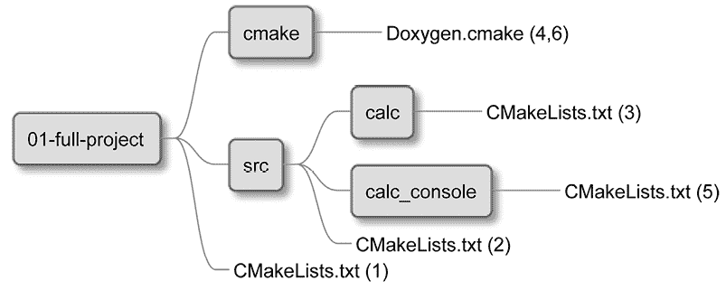

# 第十五章：创建你的专业项目

我们已经掌握了构建专业项目所需的所有知识，包括结构化、构建、依赖管理、测试、分析、安装和打包。现在，是时候通过创建一个连贯的专业项目来应用这些技能了。重要的是要理解，即使是微不足道的程序也能从自动化质量检查和将原始代码转化为完整解决方案的无缝流程中受益。的确，实现这些检查和流程是一个重要的投资，因为它需要许多步骤才能正确设置一切。尤其是将这些机制添加到现有的代码库时，这些代码库通常庞大而复杂。这就是为什么从一开始就使用 CMake 并尽早建立所有必要的流程是有益的。这样配置起来更简单，也更高效，因为这些质量控制和构建自动化最终需要集成到长期项目中。

在本章中，我们将开发一个尽可能小的解决方案，同时充分利用我们到目前为止在本书中讨论的 CMake 实践。为了保持简单，我们将只实现一个实际的功能——两个数字相加。这样的基础业务代码将使我们能够专注于前几章中学习的与构建相关的项目方面。为了处理一个与构建相关的更具挑战性的问题，项目将同时包含一个库和一个可执行文件。库将处理内部业务逻辑，并作为 CMake 包可供其他项目使用。可执行文件面向最终用户，将提供一个演示库功能的用户界面。

总结一下，在本章中，我们将涵盖以下主要内容：

+   规划我们的工作

+   项目布局

+   构建和管理依赖

+   测试与程序分析

+   安装与打包

+   提供文档

# 技术要求

你可以在 GitHub 上找到本章中的代码文件，地址为 [`github.com/PacktPublishing/Modern-CMake-for-Cpp-2E/tree/main/examples/ch15`](https://github.com/PacktPublishing/Modern-CMake-for-Cpp-2E/tree/main/examples/ch15)。

要构建本书中提供的示例，请始终使用推荐的命令：

```cpp
cmake -B <build tree> -S <source tree>
cmake --build <build tree> 
```

请确保将占位符 `<build tree>` 和 `<source tree>` 替换为适当的路径。提醒一下：**构建树**是目标/输出目录的路径，**源代码树**是源代码所在的路径。

本章使用 GCC 编译，以便与用于收集结果的 `lcov` 工具的代码覆盖率仪器兼容。如果你想使用 `llvm` 或其他工具链进行编译，请确保根据需要调整覆盖率处理。

要运行测试，执行以下命令：

```cpp
ctest --test-dir <build tree> 
```

或者直接从构建树目录执行：

```cpp
ctest 
```

注意，在本章中，测试结果将输出到 `test` 子目录。

# 规划我们的工作

本章我们将构建的软件并不打算过于复杂——我们将创建一个简单的计算器，能够将两个数字相加（*图 15.1*）。它将是一个控制台应用程序，采用文本用户界面，利用第三方库和一个独立的计算库，后者可以在其他项目中使用。尽管这个项目可能没有重大实际应用，但它的简洁性非常适合展示本书中讨论的各种技术的应用。


图 15.1：在终端中执行的我们的项目的文本用户界面，支持鼠标操作

通常，项目要么生成面向用户的可执行文件，要么生成供开发者使用的库。项目同时生成这两者的情况比较少见，尽管也会发生。例如，一些应用程序会附带独立的 SDK 或库，帮助开发插件。另一个例子是一个包含使用示例的库。我们的项目属于后一类，展示了该库的功能。

我们将通过回顾章节列表、回想每个章节的内容，并选择我们将用于构建应用程序的技术和工具来开始规划：

+   *第一章*，*CMake 的第一步*：

本章提供了关于 CMake 的基本信息，包括安装和命令行使用方法，以构建项目。它还涵盖了项目文件的基本信息，如它们的作用、典型命名约定和特殊性。

+   *第二章*，*CMake 语言*：

我们介绍了编写正确 CMake 列表文件和脚本所需的工具，涵盖了基本的代码内容，如注释、命令调用和参数。我们解释了变量、列表和控制结构，并介绍了一些有用的命令。这些基础将贯穿整个项目。

+   *第三章*，*在流行的 IDE 中使用 CMake*：

我们讨论了三种 IDE——CLion、VS Code 和 Visual Studio IDE——并强调了它们的优点。在我们的最终项目中，选择使用哪个 IDE（或是否使用 IDE）由你决定。一旦决定，你可以在 Dev 容器中开始这个项目，只需通过几步构建一个 Docker 镜像（或者直接从 Docker Hub 获取）。在容器中运行镜像可以确保开发环境与生产环境一致。

+   *第四章*，*设置你的第一个 CMake 项目*：

配置项目至关重要，因为它决定了生效的 CMake 策略、命名、版本控制和编程语言。我们将利用这一章来影响构建过程的基本行为。

我们还将遵循既定的项目划分和结构来确定目录和文件的布局，并利用系统发现变量适应不同的构建环境。工具链配置是另一个关键方面，它使我们能够强制指定一个特定的 C++ 版本和编译器支持的标准。按照本章的建议，我们将禁用源代码内构建，以保持工作空间的整洁。

+   *第五章*，*与目标一起工作*：

在这里，我们了解了每个现代 CMake 项目如何广泛使用目标。我们当然也会使用目标来定义一些库和可执行文件（既用于测试，也用于生产），以保持项目的组织性，并确保遵守**DRY**（**Don’t Repeat Yourself**）原则。通过学习目标属性和传递使用要求（传播属性），我们将能够将配置保持在目标定义附近。

+   *第六章*，*使用生成器表达式*：

生成器表达式在整个项目中被大量使用。我们将尽量使这些表达式保持简单明了。项目将包含自定义命令，以生成 Valgrind 和覆盖率报告的文件。此外，我们还将使用目标钩子，特别是 `PRE_BUILD`，来清理覆盖率插桩过程产生的 `.gcda` 文件。

+   *第七章*，*使用 CMake 编译 C++ 源代码*：

没有 C++ 项目是不需要编译的。基础知识非常简单，但 CMake 允许我们以多种方式调整这一过程：扩展目标的源文件、配置优化器、提供调试信息。对于这个项目，默认的编译标志已经足够，但我们还是会稍微玩一下预处理器：

+   我们将在编译后的可执行文件中存储构建元数据（项目版本、构建时间和 Git 提交 SHA），并将其展示给用户。

+   我们将启用头文件的预编译。这在如此小的项目中并不是必需的，但它有助于我们练习这一概念。

不需要 Unity 构建——这个项目不会大到需要添加它们才有意义。

+   *第八章*，*链接可执行文件和库*：

我们将获得有关链接的一般信息，这在任何项目中默认都是有用的。此外，由于这个项目包含一个库，我们将明确引用一些特定的构建指令，具体如下：

+   用于测试和开发的静态库

+   用于发布的共享库

本章还概述了如何隔离 `main()` 函数以进行测试，这是我们将采用的做法。

+   *第九章*，*在 CMake 中管理依赖项*：

为了增强项目的吸引力，我们将引入一个外部依赖项：一个基于文本的 UI 库。*第九章* 探讨了管理依赖项的各种方法。选择将很简单：`FetchContent` 工具模块通常是推荐的且最方便的。

+   *第十章*，*使用 C++20 模块*：

尽管我们已经探讨了 C++20 模块的使用以及支持此功能的环境要求（CMake 3.28，最新编译器），但其广泛支持仍然不足。为了确保项目的可访问性，我们暂时不会引入模块。

+   *第十一章*，*测试框架*：

实施适当的自动化测试对于确保我们解决方案的质量在时间的推移中保持一致至关重要。我们将集成 CTest，并组织我们的项目以便于测试，应用之前提到的 `main()` 函数分离。

本章讨论了两个测试框架：Catch2 和 GTest 配合 GMock；我们将使用后者。为了获取详细的覆盖率信息，我们将使用 LCOV 生成 HTML 报告。

+   *第十二章*，*程序分析工具*：

对于静态分析，我们可以选择一系列工具：Clang-Tidy，Cpplint，Cppcheck，include-what-you-use 和 link-what-you-use。我们将选择 Cppcheck，因为 Clang-Tidy 与使用 GCC 构建的预编译头文件兼容性较差。

动态分析将使用 Valgrind 的 Memcheck 工具进行，并辅以 Memcheck-cover 包装器生成 HTML 报告。此外，我们的源代码将在构建过程中通过 ClangFormat 自动格式化。

+   *第十三章*，*生成文档：*

提供文档在将库作为我们项目的一部分时是至关重要的。CMake 通过使用 `Doxygen` 实现文档生成的自动化。我们将在更新的设计中采用这种方法，并结合 `doxygen-awesome-css` 主题。

+   *第十四章*，*安装与打包*：

最后，我们将配置解决方案的安装和打包，并准备文件形成如上所述的包，同时包括目标定义。我们将通过包含 `GNUInstallDirs` 模块，安装解决方案及构建目标的产物到相应目录。我们还将配置一些组件来模块化解决方案，并为与 CPack 的使用做准备。

专业项目通常还包括一些文本文件：`README`、`LICENSE`、`INSTALL` 等。我们将在本章末尾简要介绍这些文件。

为了简化过程，我们不会实现自定义逻辑来检查是否所有必需的工具和依赖项都可用。我们将依赖 CMake 来显示其诊断信息，并告诉用户缺少什么。如果你的项目得到广泛关注，可能需要考虑添加这些机制来改善用户体验。

确定了清晰的计划后，接下来我们将讨论如何实际构建项目，无论是从逻辑目标还是目录结构的角度。

# 项目布局

构建任何项目时，我们应该先清楚地理解将在其中创建哪些逻辑目标。在这种情况下，我们将遵循以下图所示的结构：


图 15.2：逻辑目标的结构

让我们按照构建顺序来探索结构。首先，我们编译`calc_obj`，一个**目标库**。如果需要回顾目标库，请查看*第五章*，*与目标合作*。然后，我们应关注**静态** **库**和**共享库**。

## 共享库与静态库

在*第八章*，*链接可执行文件和库*中，我们介绍了共享库和静态库。我们指出，当多个程序使用相同的库时，共享库可以减少整体内存使用。此外，用户通常已经安装了流行的库，或者知道如何快速安装它们。

更重要的是，**共享库**是独立的文件，必须放置在特定路径中，以便动态链接器能够找到它们。相比之下，**静态库**直接嵌入到可执行文件中，这使得使用时更快，因为无需额外步骤来定位内存中的代码。

作为库的作者，我们可以决定提供静态版本还是共享版本，或者我们可以同时提供这两种版本，并将此决定留给使用我们库的程序员。由于我们在应用我们的知识，我们将提供两个版本。

`calc_test`目标，包括用于验证库核心功能的单元测试，将使用静态库。虽然我们从相同的*目标文件*构建这两种类型的库，但测试任一库类型都是可以接受的，因为它们的功能应该是相同的。与`calc_console_static`目标关联的控制台应用程序将使用共享库。该目标还链接了一个外部依赖项，即 Arthur Sonzogni 的功能终端（X）用户界面（FTXUI）库（*进一步阅读*部分有指向 GitHub 项目的链接）。

最后的两个目标，`calc_console`和`calc_console_test`，旨在解决测试可执行文件中的常见问题：测试框架和可执行文件提供的多个入口点的冲突。为避免此问题，我们故意将`main()`函数隔离到一个引导目标`calc_console`中，它仅调用`calc_console_static`中的主要功能。

在理解了必要的目标及其相互关系之后，我们的下一步是使用适当的文件和目录组织项目的结构。

## 项目文件结构

该项目由两个关键元素组成：`calc`库和`calc_console`可执行文件。为了有效地组织我们的项目，我们将采用以下目录结构：

+   `src`包含所有已发布目标和库头文件的源代码。

+   `test`包含上述库和可执行文件的测试。

+   `cmake`包含 CMake 用于构建和安装项目的工具模块和辅助文件。

+   *根目录*包含顶级配置和文档文件。

这个结构（如*图 15.3*所示）确保了关注点的清晰分离，便于项目的导航和维护：


图 15.3：项目的目录结构

以下是每个四个主要目录中的文件完整列表：

| **根目录** | `./test` |
| --- | --- |
| `CHANGELOG` | `CMakeLists.txt` |
| **CMakeLists.txt** | **calc/CMakeLists.txt** |
| `INSTALL``LICENSE``README.md` | `calc/calc_test.cpp``calc_console/CMakeLists.txt``calc_console/tui_test.cpp` |
| `./src` | `./cmake` |
| `CMakeLists.txt``calc/CMakeLists.txt``calc/CalcConfig.cmake``calc/basic.cpp``calc/include/calc/basic.h``calc_console/CMakeLists.txt``calc_console/bootstrap.cpp``calc_console/include/tui.h``calc_console/tui.cpp` | `BuildInfo.cmake``Coverage.cmake``CppCheck.cmake``Doxygen.cmake``Format.cmake``GetFTXUI.cmake``Packaging.cmake``Memcheck.cmake``NoInSourceBuilds.cmake``Testing.cmake``buildinfo.h.in``doxygen_extra_headers` |

表 15.1：项目文件结构

虽然看起来 CMake 引入了相当大的开销，且`cmake`目录最初包含的内容比实际的业务代码还多，但随着项目功能的扩展，这种动态会发生变化。最初建立一个清晰、有序的项目结构需要付出较大的努力，但可以放心，这项投资在未来将带来显著的回报。

本章将详细讲解*表 15.1*中提到的所有文件，并逐步分析它们的功能以及在项目中的作用。这个过程将分为四个步骤：构建、测试、安装和提供文档。

# 构建和管理依赖项

所有构建过程都遵循相同的程序。我们从顶层的列表文件开始，向下推进到项目的源代码树中。*图 15.4*展示了构建过程中的项目文件，括号中的数字表示 CMake 脚本执行的顺序。


图 15.4：构建阶段使用的文件

顶层的`CMakeLists.txt`（1）列表文件配置了项目：

**ch15/01-full-project/CMakeLists.txt**

```cpp
cmake_minimum_required(VERSION 3.26)
project(Calc VERSION 1.1.0 LANGUAGES CXX)
list(APPEND CMAKE_MODULE_PATH "${CMAKE_SOURCE_DIR}/cmake")
include(NoInSourceBuilds)
include(CTest)
add_subdirectory(src bin)
add_subdirectory(test)
include(Packaging) 
```

我们首先指定项目的基本信息，并设置 CMake 工具模块的路径（即项目中的`cmake`目录）。然后，我们通过自定义模块来防止源代码构建。接着，我们启用`CTest`模块（CMake 内置的测试模块）。此步骤应该在项目的根目录进行，因为该命令会在相对于源代码树位置的二进制树中创建`CTestTestfile.cmake`文件。如果放在其他地方，将导致`ctest`无法找到它。

接下来，我们包括两个关键目录：

+   `src`，包含项目源代码（在构建树中命名为`bin`）

+   `test`，包含所有测试工具

最后，我们包括`Packaging`模块，相关内容将在*安装与打包*部分中讨论。

让我们检查一下 `NoInSourceBuilds` 实用模块，以理解它的功能：

**ch15/01-full-project/cmake/NoInSourceBuilds.cmake**

```cpp
if(PROJECT_SOURCE_DIR STREQUAL PROJECT_BINARY_DIR)
  message(FATAL_ERROR
    "\n"
    "In-source builds are not allowed.\n"
    "Instead, provide a path to build tree like so:\n"
    "cmake -B <destination>\n"
    "\n"
    "To remove files you accidentally created execute:\n"
    "rm -rf CMakeFiles CMakeCache.txt\n"
  )
endif() 
```

这里没有什么意外，我们检查用户是否提供了一个单独的生成文件目标目录，使用 `cmake` 命令。它必须与项目的源代码树路径不同。如果没有，我们将指导用户如何指定该目录，并在他们出错时如何清理仓库。

我们的顶级 listfile 随后包括了 `src` 子目录，指示 CMake 处理其中的 listfile 文件：

**ch15/01-full-project/src/CMakeLists.txt**

```cpp
include(Coverage)
include(Format)
include(CppCheck)
include(Doxygen)
add_subdirectory(calc)
add_subdirectory(calc_console) 
```

这个文件很简单——它包括了我们将要使用的 `./cmake` 目录中的所有模块，并引导 CMake 到嵌套的目录中去执行那里的 listfile 文件。

接下来，让我们检查 `calc` 库的 listfile。它有些复杂，因此我们将其分解并按部分进行讨论。

## 构建 Calc 库

`calc` 目录中的 listfile 配置了该库的各个方面，但现在，我们只关注构建部分：

**ch15/01-full-project/src/calc/CMakeLists.txt（片段）**

```cpp
add_library(calc_obj OBJECT basic.cpp)
target_sources(calc_obj
               PUBLIC FILE_SET HEADERS
               BASE_DIRS include
               FILES include/calc/basic.h
)
set_target_properties(calc_obj PROPERTIES
    POSITION_INDEPENDENT_CODE 1
)
# ... instrumentation of calc_obj for coverage
add_library(calc_shared SHARED)
target_link_libraries(calc_shared calc_obj)
add_library(calc_static STATIC)
target_link_libraries(calc_static calc_obj)
# ... testing and program analysis modules
# ... documentation generation
# ... installation 
```

我们定义了三个目标：

+   `calc_obj`，一个*目标库*，编译 `basic.cpp` 实现文件。它的 `basic.h` 头文件通过 `target_sources()` 命令中的 `FILE_SET` 关键字包含进来。这样隐式地配置了合适的包含目录，以便在构建和安装模式下正确导出。通过创建*目标库*，我们避免了对两个库版本的冗余编译，但启用 `POSITION_INDEPENDENT_CODE` 是必要的，这样共享库才能依赖于该目标。

+   `calc_shared`，一个依赖于 `calc_obj` 的共享库。

+   `calc_static`，一个同样依赖于 `calc_obj` 的静态库。

为了提供背景信息，以下是基础库的 C++ 头文件。这个头文件仅声明了 `Calc` 命名空间中的两个函数，帮助避免命名冲突：

**ch15/01-full-project/src/calc/include/calc/basic.h**

```cpp
#pragma once
namespace Calc {
    int Add(int a, int b);
    int Subtract(int a, int b);
}  // namespace Calc 
```

实现文件也很直接：

**ch15/01-full-project/src/calc/basic.cpp**

```cpp
namespace Calc {
  int Add(int a, int b) {
    return a + b;
  }
  int Subtract(int a, int b) {
    return a - b;
  }
} // namespace Calc 
```

这部分解释完了 `src/calc` 目录中的文件。接下来是 `src/calc_console` 以及如何使用该库构建控制台计算器的可执行文件。

## 构建 Calc 控制台可执行文件

`calc_console` 目录包含多个文件：一个 listfile，两个实现文件（业务逻辑和引导文件），以及一个头文件。这个 listfile 如下所示：

**ch15/01-full-project/src/calc_console/CMakeLists.txt（片段）**

```cpp
add_library(calc_console_static STATIC tui.cpp)
target_include_directories(calc_console_static PUBLIC include)
target_precompile_headers(calc_console_static PUBLIC <string>)
include(GetFTXUI)
target_link_libraries(calc_console_static PUBLIC calc_shared
                      ftxui::screen ftxui::dom ftxui::component)
include(BuildInfo)
BuildInfo(calc_console_static)
# ... instrumentation of calc_console_static for coverage
# ... testing and program analysis modules
# ... documentation generation
add_executable(calc_console bootstrap.cpp)
target_link_libraries(calc_console calc_console_static)
# ... installation 
```

尽管这个 listfile 看起来复杂，但作为经验丰富的 CMake 用户，我们现在可以轻松地解读它的内容：

1.  定义 `calc_console_static` 目标，包含没有 `main()` 函数的业务代码，以便与具有自己入口点的 GTest 进行链接。

1.  配置*包含目录*。我们本可以通过 `FILE_SET` 单独添加头文件，但由于它们是内部文件，我们简化了这一步。

1.  实现头文件预编译，这里仅用`<string>`头文件作为示例，尽管更大的项目可能会包含更多头文件。

1.  包含一个自定义 CMake 模块，用于获取 FTXUI 依赖项。

1.  将业务代码与共享的`calc_shared`库和 FTXUI 组件链接。

1.  添加一个自定义模块，用于生成构建信息并将其嵌入到产物中。

1.  为此目标概述额外的步骤：代码覆盖度仪器、测试、程序分析和文档生成。

1.  创建并链接`calc_console`引导程序可执行文件，建立入口点。

1.  概述安装过程。

我们将在本章后续的相关部分探索测试、文档和安装过程。

我们正在包含`GetFTXUI`实用模块，而不是在系统中查找`config-module`，因为大多数用户不太可能已经安装它。我们只需要获取并构建它：

**ch15/01-full-project/cmake/GetFTXUI.cmake**

```cpp
include(FetchContent)
FetchContent_Declare(
FTXTUI
GIT_REPOSITORY https://github.com/ArthurSonzogni/FTXUI.git
GIT_TAG        v0.11
)
**option****(FTXUI_ENABLE_INSTALL** **""****OFF****)**
**option****(FTXUI_BUILD_EXAMPLES** **""****OFF****)**
**option****(FTXUI_BUILD_DOCS** **""****OFF****)**
FetchContent_MakeAvailable(FTXTUI) 
```

我们正在使用推荐的`FetchContent`方法，该方法在*第九章*《*CMake 中的依赖管理*》中有详细介绍。唯一不同的是调用了`option()`命令，这使我们可以绕过 FTXUI 的漫长构建步骤，并防止其安装步骤影响此项目的安装过程。有关更多详细信息，请参阅*进一步阅读*部分。

`calc_console`目录的列表文件包含另一个与构建相关的自定义实用模块：`BuildInfo`。该模块将捕获三条信息，并将其显示在可执行文件中：

+   当前 Git 提交的 SHA。

+   构建时间戳。

+   顶级列表文件中指定的项目版本。

正如我们在*第七章*《*使用 CMake 编译 C++源代码*》中学到的，CMake 可以捕获构建时的值并通过模板文件将其传递给 C++代码，例如使用一个结构体：

**ch15/01-full-project/cmake/buildinfo.h.in**

```cpp
struct BuildInfo {
  static inline const std::string CommitSHA = "@COMMIT_SHA@";
  static inline const std::string Timestamp = "@TIMESTAMP@";
  static inline const std::string Version = "@PROJECT_VERSION@";
}; 
```

为了在配置阶段填充该结构体，我们将使用以下代码：

**ch15/01-full-project/cmake/BuildInfo.cmake**

```cpp
set(BUILDINFO_TEMPLATE_DIR ${CMAKE_CURRENT_LIST_DIR})
set(DESTINATION "${CMAKE_CURRENT_BINARY_DIR}/buildinfo")
string(TIMESTAMP TIMESTAMP)
find_program(GIT_PATH git REQUIRED)
execute_process(COMMAND ${GIT_PATH} log --pretty=format:'%h' -n 1
                OUTPUT_VARIABLE COMMIT_SHA)
configure_file(
  "${BUILDINFO_TEMPLATE_DIR}/buildinfo.h.in"
  "${DESTINATION}/buildinfo.h" @ONLY
)
function(BuildInfo target)
  target_include_directories(${target} PRIVATE ${DESTINATION})
endfunction() 
```

在包含该模块后，我们设置变量以捕获所需的信息，并使用`configure_file()`生成`buildinfo.h`。最后一步是调用`BuildInfo`函数，将生成的文件目录包含到目标的`include`目录中。

生成的头文件如果需要，可以与多个不同的消费者共享。在这种情况下，你可能希望在列表文件的顶部添加`include_guard(GLOBAL)`，以避免为每个目标都运行`git`命令。

在深入实现控制台计算器之前，我想强调的是，你不需要深入理解`tui.cpp`文件或 FTXUI 库的复杂细节，因为这对我们当前的目的并不重要。相反，让我们关注代码中的高亮部分：

**ch15/01-full-project/src/calc_console/tui.cpp**

```cpp
#include "tui.h"
#include <ftxui/dom/elements.hpp>
**#****include****"buildinfo.h"**
**#****include****"calc/basic.h"**
using namespace ftxui;
using namespace std;
string a{"12"}, b{"90"};
auto input_a = Input(&a, "");
auto input_b = Input(&b, "");
auto component = Container::Vertical({input_a, input_b});
Component getTui() {
  return Renderer(component, [&] {
    **auto** **sum = Calc::****Add****(****stoi****(a),** **stoi****(b));**
    return vbox({
      **text****(****"CalcConsole "** **+ BuildInfo::Version),**
**text****(****"Built: "** **+ BuildInfo::Timestamp),**
**text****(****"SHA: "** **+ BuildInfo::CommitSHA),**
       separator(),
       input_a->Render(),
       input_b->Render(),
       separator(),
       **text****(****"Sum: "** **+** **to_string****(sum)),**
     }) |
     border;
   });
} 
```

这段代码提供了`getTui()`函数，该函数返回一个`ftxui::Component`对象，这个对象封装了交互式 UI 元素，如标签、文本字段、分隔符和边框。对于那些好奇这些元素的详细工作原理的人，更多的资料可以在*进一步阅读*部分找到。

更重要的是，*包含指令*链接到`calc_obj`目标和`BuildInfo`模块中的头文件。交互从 lambda 函数开始，调用`Calc::Sum`，并使用`text()`函数显示结果。

在构建时收集的`buildinfo.h`中的值会以类似的方式使用，并在运行时显示给用户。

在`tui.cpp`旁边，有一个头文件：

**ch15/01-full-project/src/calc_console/include/tui.h**

```cpp
#include <ftxui/component/component.hpp>
ftxui::Component getTui(); 
```

这个头文件被`calc_console`目标中的引导文件使用：

**ch15/01-full-project/src/calc_console/bootstrap.cpp**

```cpp
#include <ftxui/component/screen_interactive.hpp>
#include "tui.h"
int main(int argc, char** argv) {
  ftxui::ScreenInteractive::FitComponent().Loop(getTui());
} 
```

这段简短的代码初始化了一个带有 FTXUI 的交互式控制台屏幕，显示`getTui()`返回的`Component`对象，并在循环中处理键盘输入。所有`src`目录下的文件都已处理完毕，我们现在可以继续进行程序的测试和分析。

# 测试和程序分析

程序分析和测试是确保我们解决方案质量的重要组成部分。例如，在运行测试代码时，使用 Valgrind 更加有效（因为它具有一致性和覆盖率）。因此，我们将把测试和程序分析配置在同一位置。*图 15.5* 展示了执行流程和设置它们所需的文件：


图 15.5：用于启用测试和程序分析的文件

括号中的数字表示处理列表文件的顺序。从顶级列表文件开始，并添加`src`和`test`目录：

+   在`src`中，包含`Coverage`、`Format`和`CppCheck`模块，并添加`src/calc`和`src/calc_console`目录。

+   在`src/calc`中，定义目标并使用包含的模块进行配置。

+   在`src/calc_console`中，定义目标并使用包含的模块进行配置。

+   在`test`中，包含`Testing`（包括`Memcheck`），并添加`test/calc`和`test/calc_console`目录。

+   在`test/calc`中，定义测试目标并使用包含的模块进行配置。

+   在`test/calc_console`中，定义测试目标并使用包含的模块进行配置。

让我们来查看一下`test`目录的列表文件：

**ch15/01-full-project/test/CMakeLists.txt**

```cpp
**include****(Testing)**
add_subdirectory(calc)
add_subdirectory(calc_console) 
```

在这个层次中，包含了`Testing`实用模块，为两个目标组（来自`calc`和`calc_console`目录）提供功能：

**ch15/01-full-project/cmake/Testing.cmake（片段）**

```cpp
include(FetchContent)
FetchContent_Declare(
  googletest
  GIT_REPOSITORY https://github.com/google/googletest.git
  GIT_TAG v1.14.0
)
# For Windows: Prevent overriding the parent project's
# compiler/linker settings
set(gtest_force_shared_crt ON CACHE BOOL "" FORCE)
**option****(INSTALL_GMOCK** **"Install GMock"****OFF****)**
**option****(INSTALL_GTEST** **"Install GTest"****OFF****)**
FetchContent_MakeAvailable(googletest)
# ... 
```

我们启用了测试并包含了 `FetchContent` 模块来获取 GTest 和 GMock。虽然 GMock 在本项目中没有使用，但它与 GTest 一起在同一仓库中提供，因此我们也进行了配置。关键的配置步骤是通过使用 `option()` 命令，防止这些框架的安装影响到我们项目的安装。

在同一个文件中，我们定义了一个 `AddTests()` 函数，以方便全面测试业务目标：

**ch15/01-full-project/cmake/Testing.cmake (续)**

```cpp
# ...
include(GoogleTest)
include(Coverage)
include(Memcheck)
macro(AddTests target)
  message("Adding tests to ${target}")
  target_link_libraries(${target} PRIVATE gtest_main gmock)
  gtest_discover_tests(${target})
  **AddCoverage(****${target}****)**
 **AddMemcheck(****${target}****)**
endmacro() 
```

首先，我们包含了必要的模块：`GoogleTest` 与 CMake 一起捆绑提供，`Coverage` 和 `Memcheck` 是项目中自定义的工具模块。接着，提供了 `AddTests` 宏，用于准备一个测试目标，应用覆盖率插桩和内存检查。`AddCoverage()` 和 `AddMemcheck()` 函数分别在它们各自的工具模块中定义。现在，我们可以继续实现它们。

## 准备 Coverage 模块

在多个目标上添加覆盖率涉及几个步骤。`Coverage` 模块提供了一个函数，用于为指定目标定义覆盖率目标：

**ch15/01-full-project/cmake/Coverage.cmake (片段)**

```cpp
function(AddCoverage target)
  find_program(LCOV_PATH lcov REQUIRED)
  find_program(GENHTML_PATH genhtml REQUIRED)
  add_custom_target(coverage-${target}
    COMMAND ${LCOV_PATH} -d . --zerocounters
    COMMAND $<TARGET_FILE:${target}>
    COMMAND ${LCOV_PATH} -d . --capture -o coverage.info
    COMMAND ${LCOV_PATH} -r coverage.info '/usr/include/*'
      -o filtered.info
    COMMAND ${GENHTML_PATH} -o coverage-${target}
      filtered.info --legend
    COMMAND rm -rf coverage.info filtered.info
    WORKING_DIRECTORY ${CMAKE_BINARY_DIR}
  )
endfunction()
# ... 
```

这个实现与 *第十一章* 中介绍的实现略有不同，因为它现在在输出路径中包括了目标名称，以防止名称冲突。接下来，我们需要一个函数来清除之前的覆盖率结果：

**ch15/01-full-project/cmake/Coverage.cmake (续)**

```cpp
# ...
function(CleanCoverage target)
  add_custom_command(TARGET ${target} PRE_BUILD COMMAND
    find ${CMAKE_BINARY_DIR} -type f
    -name '*.gcda' -exec rm {} +)
endfunction()
# ... 
```

此外，我们还提供了一个函数来准备目标进行覆盖率分析：

**ch15/01-full-project/cmake/Coverage.cmake (片段)**

```cpp
# ...
function(InstrumentForCoverage target)
  if (CMAKE_BUILD_TYPE STREQUAL Debug)
target_compile_options(${target}
                       PRIVATE --coverage -fno-inline)
    target_link_options(${target} PUBLIC --coverage)
  endif()
endfunction() 
```

`InstrumentForCoverage()` 函数应用于 `src/calc` 和 `src/calc_console`，在执行目标 `calc_obj` 和 `calc_console_static` 时生成覆盖率数据文件。

要为两个测试目标生成报告，请在配置项目并选择 `Debug` 构建类型后，执行以下 `cmake` 命令：

```cpp
cmake --build <build-tree> -t coverage-calc_test
cmake --build <build-tree> -t coverage-calc_console_test 
```

接下来，我们希望对我们定义的多个目标进行动态程序分析，因此，要应用在 *第十二章* 中介绍的 Memcheck 模块，*程序分析工具*，我们需要稍作调整，以扫描多个目标。

## 准备 Memcheck 模块

生成 Valgrind 内存管理报告由 `AddTests()` 启动。我们通过其初始设置开始 Memcheck 模块：

**ch15/01-full-project/cmake/Memcheck.cmake (片段)**

```cpp
include(FetchContent)
FetchContent_Declare(
  memcheck-cover
  GIT_REPOSITORY https://github.com/Farigh/memcheck-cover.git
  GIT_TAG        release-1.2
)
FetchContent_MakeAvailable(memcheck-cover) 
```

这段代码我们已经很熟悉了。现在，让我们来看一下创建必要目标以生成报告的函数：

**ch15/01-full-project/cmake/Memcheck.cmake (续)**

```cpp
function(AddMemcheck target)
  set(MEMCHECK_PATH ${memcheck-cover_SOURCE_DIR}/bin)
  **set****(REPORT_PATH** **"${CMAKE_BINARY_DIR}/valgrind-${target}"****)**
  add_custom_target(memcheck-${target}
    COMMAND ${MEMCHECK_PATH}/memcheck_runner.sh -o
      "${REPORT_PATH}/report"
      -- $<TARGET_FILE:${target}>
    COMMAND ${MEMCHECK_PATH}/generate_html_report.sh
      -i ${REPORT_PATH}
      -o ${REPORT_PATH}
    WORKING_DIRECTORY ${CMAKE_BINARY_DIR}
  )
endfunction() 
```

我们稍微改进了 *第十二章* 中的 `AddMemcheck()` 函数，以便处理多个目标。我们使 `REPORT_PATH` 变量针对每个目标特定。

要生成 Memcheck 报告，请使用以下命令（请注意，当使用 `Debug` 构建类型进行配置时，生成报告更为有效）：

```cpp
cmake --build <build-tree> -t memcheck-calc_test
cmake --build <build-tree> -t memcheck-calc_console_test 
```

好的，我们定义了 `Coverage` 和 `Memcheck` 模块（它们在 `Testing` 模块中使用），那么让我们看看实际的测试目标是如何配置的。

## 应用测试场景

为了实现测试，我们将遵循以下场景：

1.  编写单元测试。

1.  使用 `AddTests()` 定义并配置测试的可执行目标。

1.  对**被测软件**（**SUT**）进行插桩，以启用覆盖率收集。

1.  确保在构建之间清除覆盖率数据，以防止出现段错误。

让我们从必须编写的单元测试开始。为了简洁起见，我们将提供最简单（也许有些不完整）的单元测试。首先，测试库：

**ch15/01-full-project/test/calc/basic_test.cpp**

```cpp
#include "calc/basic.h"
#include <gtest/gtest.h>
TEST(CalcTest, SumAddsTwoInts) {
  EXPECT_EQ(4, Calc::Add(2, 2));
}
TEST(CalcTest, SubtractsTwoInts) {
  EXPECT_EQ(6, Calc::Subtract(8, 2));
} 
```

接着测试控制台——为此我们将使用 FXTUI 库。同样，完全理解源代码并不是必要的；这些测试仅用于说明目的：

**ch15/01-full-project/test/calc_console/tui_test.cpp**

```cpp
#include "tui.h"
#include <gmock/gmock.h>
#include <gtest/gtest.h>
#include <ftxui/screen/screen.hpp>
using namespace ::ftxui;
TEST(ConsoleCalcTest, RunWorksWithDefaultValues) {
  auto component = getTui();
  auto document = component->Render();
  auto screen = Screen::Create(Dimension::Fit(document));
  Render(screen, document);
  auto output = screen.ToString();
  ASSERT_THAT(output, testing::HasSubstr("Sum: 102"));
} 
```

这个测试将 UI 渲染到一个静态的 `Screen` 对象，并检查字符串输出是否包含预期的和。虽然这不是一个很好的测试，但至少它是一个简短的测试。

现在，让我们通过两个嵌套的列表文件配置我们的测试。首先，针对库：

**ch15/01-full-project/test/calc/CMakeLists.txt**

```cpp
add_executable(calc_test basic_test.cpp)
target_link_libraries(calc_test PRIVATE calc_static)
**AddTests(calc_test)** 
```

然后是可执行文件：

**ch15/01-full-project/test/calc_console/CMakeLists.txt**

```cpp
add_executable(calc_console_test tui_test.cpp)
target_link_libraries(calc_console_test
                      PRIVATE calc_console_static)
**AddTests(calc_console_test)** 
```

这些配置使 CTest 可以执行测试。我们还需要为业务逻辑目标准备覆盖率分析，并确保覆盖率数据在构建之间得到更新。

让我们为 `calc` 库目标添加必要的指令：

**ch15/01-full-project/src/calc/CMakeLists.txt（续）**

```cpp
# ... calc_obj target definition
**InstrumentForCoverage(calc_obj)**
# ... calc_shared target definition
# ... calc_static target definition
**CleanCoverage(calc_static)** 
```

插桩通过额外的 `--coverage` 标志添加到 `calc_obj`，但是 `CleanCoverage()` 被调用到 `calc_static` 目标。通常情况下，你会对 `calc_obj` 应用它以保持一致性，但我们在 `CleanCoverage()` 中使用了 `PRE_BUILD` 关键字，而 CMake 不允许在对象库上使用 `PRE_BUILD`、`PRE_LINK` 或 `POST_BUILD` 钩子。

最后，我们还将插桩并清理控制台目标：

**ch15/01-full-project/src/calc_console/CMakeLists.txt（续）**

```cpp
# ... calc_console_test target definition
# ... BuildInfo
**InstrumentForCoverage(calc_console_static)**
**CleanCoverage(calc_console_static)** 
```

通过这些步骤，CTestr 已设置好运行我们的测试并收集覆盖率。接下来，我们将添加启用静态分析的指令，因为我们希望在第一次构建以及后续所有构建中都保持项目的高质量。

## 添加静态分析工具

我们即将完成为我们的目标配置质量保证的工作。最后一步是启用自动格式化并集成`CppCheck`：

**ch15/01-full-project/src/calc/CMakeLists.txt（续）**

```cpp
# ... calc_static target definition
# ... Coverage instrumentation and cleaning
**Format(calc_static .)**
**AddCppCheck(calc_obj)** 
```

我们在这里遇到一个小问题：`calc_obj` 不能有 `PRE_BUILD` 钩子，因此我们改为对 `calc_static` 应用格式化。我们还确保 `calc_console_static` 目标被格式化并检查：

**ch15/01-full-project/src/calc_console/CMakeLists.cmake（续）**

```cpp
# ... calc_console_test target definition
# ... BuildInfo
# ... Coverage instrumentation and cleaning
**Format(calc_console_static .)**
**AddCppCheck(calc_console_static)** 
```

我们仍然需要定义`Format`和`CppCheck`函数。从`Format()`开始，我们借用了*第十二章*，*程序分析工具*中描述的代码：

**ch15/01-full-project/cmake/Format.cmake**

```cpp
function(Format target directory)
  find_program(CLANG-FORMAT_PATH clang-format REQUIRED)
  set(EXPRESSION h hpp hh c cc cxx cpp)
  list(TRANSFORM EXPRESSION PREPEND "${directory}/*.")
  file(GLOB_RECURSE SOURCE_FILES FOLLOW_SYMLINKS
    LIST_DIRECTORIES false ${EXPRESSION}
  )
  add_custom_command(TARGET ${target} PRE_BUILD COMMAND
    ${CLANG-FORMAT_PATH} -i --style=file ${SOURCE_FILES}
  )
endfunction() 
```

要将`CppCheck`与我们的源代码集成，我们使用：

**ch15/01-full-project/cmake/CppCheck.cmake**

```cpp
function(AddCppCheck target)
  find_program(CPPCHECK_PATH cppcheck REQUIRED)
  set_target_properties(${target}
    PROPERTIES CXX_CPPCHECK
    "${CPPCHECK_PATH};**--enable=warning;--error-exitcode=10**"
  )
endfunction() 
```

这很简单方便。你可能会发现它与 Clang-Tidy 模块（见*第十二章*，*程序分析工具*）有些相似，展示了 CMake 在功能上的一致性。

`cppcheck`的参数如下：

+   `--enable=warning`：启用警告信息。要启用更多检查，请参阅 Cppcheck 手册（见*进一步阅读*部分）。

+   `--error-exitcode=1`：设置当`cppcheck`检测到问题时返回的错误代码。可以是`1`到`255`之间的任何数字（因为`0`表示成功），尽管某些数字可能被系统保留。

所有`src`和`test`目录中的文件都已创建，我们的解决方案现在可以构建并完全测试。我们可以继续进行安装和打包步骤。

# 安装和打包

*图 15.6*显示了我们将如何配置项目进行安装和打包：


图 15.6：配置安装和打包的文件

顶层的 listfile 包括`Packaging`工具模块：

**ch15/01-full-project/CMakeLists.txt（片段）**

```cpp
# ... configure project
# ... enable testing
# ... include src and test subdirectories
**include****(Packaging)** 
```

`Packaging`模块详细描述了项目的包配置，我们将在*使用 CPack 打包*部分中探讨。我们现在的重点是安装三个主要组件：

+   Calc 库的工件：静态和共享库、头文件以及目标导出文件

+   Calc 库的包定义配置文件

+   Calc 控制台可执行文件

一切都已规划好，现在是配置库的安装的时候了。

## 库的安装

为了安装该库，我们首先定义逻辑目标及其工件目的地，利用`GNUInstallDirs`模块的默认值以避免手动指定路径。工件将按组件分组。默认安装将安装所有文件，但你可以选择只安装`runtime`组件，跳过`development`工件：

**ch15/01-full-project/src/calc/CMakeLists.txt（续）**

```cpp
# ... calc library targets definition
# ... configuration, testing, program analysis
# Installation
include(GNUInstallDirs)
install(TARGETS calc_obj calc_shared calc_static
  EXPORT CalcLibrary
  ARCHIVE COMPONENT development
  LIBRARY COMPONENT runtime
  FILE_SET HEADERS COMPONENT runtime
) 
```

对于 UNIX 系统，我们还配置了共享库的安装后注册，使用`ldconfig`：

**ch15/01-full-project/src/calc/CMakeLists.txt（续）**

```cpp
if (UNIX)
  install(CODE "execute_process(COMMAND ldconfig)"
    COMPONENT runtime
  )
endif() 
```

为了在其他 CMake 项目中启用可重用性，我们将通过生成并安装一个目标导出文件和一个引用它的配置文件来打包该库：

**ch15/01-full-project/src/calc/CMakeLists.txt（续）**

```cpp
install(EXPORT CalcLibrary
  DESTINATION ${CMAKE_INSTALL_LIBDIR}/calc/cmake
  NAMESPACE Calc::
  COMPONENT runtime
)
install(FILES "CalcConfig.cmake"
  DESTINATION ${CMAKE_INSTALL_LIBDIR}/calc/cmake
) 
```

为了简单起见，`CalcConfig.cmake`文件保持简洁：

**ch15/01-full-project/src/calc/CalcConfig.cmake**

```cpp
include("${CMAKE_CURRENT_LIST_DIR}/CalcLibrary.cmake") 
```

这个文件位于 `src/calc` 中，因为它只包含库目标。如果有来自其他目录的目标定义，比如 `calc_console`，通常会将 `CalcConfig.cmake` 放在顶层或 `src` 目录中。

现在，库已经准备好在构建项目后通过 `cmake --install` 命令进行安装。然而，我们仍然需要配置可执行文件的安装。

## 可执行文件的安装

当然，我们希望用户能够在他们的系统上使用可执行文件，因此我们将使用 CMake 安装它。准备二进制可执行文件的安装非常简单；为此，我们只需要包含 `GNUInstallDirs` 并使用一个 `install()` 命令：

**ch15/01-full-project/src/calc_console/CMakeLists.txt（续）**

```cpp
# ... calc_console_static definition
# ... configuration, testing, program analysis
# ... calc_console bootstrap executable definition
# Installation
include(GNUInstallDirs)
install(TARGETS calc_console
  RUNTIME COMPONENT runtime
) 
```

这样，可执行文件已经设置好可以安装了。现在，让我们继续进行打包。

## 使用 CPack 进行打包

我们可以配置多种支持的包类型，但对于这个项目，基本配置就足够了：

**ch15/01-full-project/cmake/Packaging.cmake**

```cpp
# CPack configuration
set(CPACK_PACKAGE_VENDOR "Rafal Swidzinski")
set(CPACK_PACKAGE_CONTACT "email@example.com")
set(CPACK_PACKAGE_DESCRIPTION "Simple Calculator")
include(CPack) 
```

这样的最小配置对于标准存档（如 ZIP 文件）非常有效。为了在构建项目后测试安装和打包过程，可以在构建树内使用以下命令：

```cpp
# cpack -G TGZ -B packages
CPack: Create package using TGZ
CPack: Install projects
CPack: - Run preinstall target for: Calc
CPack: - Install project: Calc []
CPack: Create package
CPack: - package: .../packages/Calc-1.0.0-Linux.tar.gz generated. 
```

这就结束了安装和打包的部分；接下来的任务是文档。

# 提供文档

一个专业项目的最后润色是文档。没有文档的项目在团队合作和与外部分享时都非常难以导航和理解。我甚至会说，程序员常常在离开某个特定文件后，重新阅读自己的文档，以便理解文件中的内容。

文档对于法律和合规性以及告知用户如何使用软件也非常重要。如果时间允许，我们应该投入精力为我们的项目设置文档。

文档通常分为两类：

+   技术文档（涵盖接口、设计、类和文件）

+   一般文档（涵盖所有其他非技术文档）

正如我们在*第十三章*中看到的，*生成文档*，大部分技术文档可以通过 CMake 使用 `Doxygen` 自动生成。

## 生成技术文档

虽然一些项目在构建阶段生成文档并将其包含在包中，但我们选择不这样做。尽管如此，也有可能出于某些有效原因选择这样做，比如如果文档需要在线托管。

*图 15.7* 提供了文档生成过程的概述：



图 15.7：用于生成文档的文件

为了生成文档，我们将创建另一个 CMake 工具模块 `Doxygen`。首先使用 `Doxygen` `find-module` 并下载 `doxygen-awesome-css` 项目来获取主题：

**ch15/01-full-project/cmake/Doxygen.cmake（片段）**

```cpp
find_package(Doxygen REQUIRED)
include(FetchContent)
FetchContent_Declare(doxygen-awesome-css
  GIT_REPOSITORY
    https://github.com/jothepro/doxygen-awesome-css.git
  GIT_TAG
    v2.3.1
)
FetchContent_MakeAvailable(doxygen-awesome-css) 
```

然后，我们需要一个函数来创建生成文档的目标。我们将调整在*第十三章*《生成文档》中介绍的代码，以支持多个目标：

**ch15/01-full-project/cmake/Doxygen.cmake（续）**

```cpp
function(Doxygen target **input**)
  set(NAME "doxygen**-${target}**")
  set(DOXYGEN_GENERATE_HTML YES)
  set(DOXYGEN_HTML_OUTPUT   ${PROJECT_BINARY_DIR}/${output})
  UseDoxygenAwesomeCss()
  UseDoxygenAwesomeExtensions()
  doxygen_add_docs("doxygen**-${target}**"
      ${PROJECT_SOURCE_DIR}/${input}
      COMMENT "Generate HTML documentation"
  )
endfunction()
# ... copied from Ch13:
#     UseDoxygenAwesomeCss
#     UseDoxygenAwesomeExtensions 
```

通过调用库目标来使用此功能：

**ch15/01-full-project/src/calc/CMakeLists.txt（片段）**

```cpp
# ... calc_static target definition
# ... testing and program analysis modules
**Doxygen(calc src/calc)**
# ... file continues 
```

对于控制台可执行文件：

**ch15/01-full-project/src/calc_console/CMakeLists.txt（片段）**

```cpp
# ... calc_static target definition
# ... testing and program analysis modules
**Doxygen(calc_console src/calc_console)**
# ... file continues 
```

此设置为项目添加了两个目标：`doxygen-calc`和`doxygen-calc_console`，允许按需生成技术文档。现在，让我们考虑应该包含哪些其他文档。

## 为专业项目编写非技术性文档

专业项目应包括一组非技术性文档，存储在顶层目录中，对于全面理解和法律清晰度至关重要：

+   `README`: 提供项目的一般描述

+   `LICENSE`: 详细说明有关项目使用和分发的法律参数

你可能考虑的其他文档包括：

+   `INSTALL`: 提供逐步的安装说明

+   `CHANGELOG`: 提示版本之间的重要变更

+   `AUTHORS`: 列出贡献者及其联系方式，如果项目有多个贡献者的话

+   `BUGS`: 提供已知问题和报告新问题的详细信息

CMake 不会直接与这些文件交互，因为它们不涉及自动处理或脚本。然而，它们的存在对于一个良好文档化的 C++项目至关重要。以下是每个文档的最小示例：

**ch15/01-full-project/README.md**

```cpp
# Calc Console
Calc Console is a calculator that adds two numbers in a
terminal. It does all the math by using a **Calc** library.
This library is also available in this package.
This application is written in C++ and built with CMake.
## More information
- Installation instructions are in the INSTALL file
- License is in the LICENSE file 
```

这很简短，可能有点傻。注意`.md`扩展名——它代表*Markdown*，这是一种基于文本的格式化语言，易于阅读。像 GitHub 这样的站点和许多文本编辑器会以丰富的格式呈现这些文件。

我们的`INSTALL`文件将如下所示：

**ch15/01-full-project/INSTALL**

```cpp
To install this software you'll need to provide the following:
- C++ compiler supporting C++17
- CMake >= 3.26
- GIT
- Doxygen + Graphviz
- CPPCheck
- Valgrind
This project also depends on GTest, GMock and FXTUI. This
software is automatically pulled from external repositories
during the installation.
To configure the project type:
cmake -B <temporary-directory>
Then you can build the project:
cmake --build <temporary-directory>
And finally install it:
cmake --install <temporary-directory>
To generate the documentation run:
cmake --build <temporary-directory> -t doxygen-calc
cmake --build <temporary-directory> -t doxygen-calc_console 
```

`LICENSE`文件有点棘手，因为它需要一些版权法方面的专业知识（以及其他方面）。我们可以像许多其他项目一样，使用现成的开源软件许可证，而不是自己编写所有条款。对于这个项目，我们将使用 MIT 许可证，它非常宽松。请查看*进一步阅读*部分，获取一些有用的参考资料：

**ch15/01-full-project/LICENSE**

```cpp
Copyright 2022 Rafal Swidzinski
Permission is hereby granted, free of charge, to any person obtaining a copy of this software and associated documentation files (the "Software"), to deal in the Software without restriction, including without limitation the rights to use, copy, modify, merge, publish, distribute, sublicense, and/or sell copies of the Software, and to permit persons to whom the Software is furnished to do so, subject to the following conditions:
The above copyright notice and this permission notice shall be included in all copies or substantial portions of the Software.
THE SOFTWARE IS PROVIDED "AS IS", WITHOUT WARRANTY OF ANY KIND, EXPRESS OR IMPLIED, INCLUDING BUT NOT LIMITED TO THE WARRANTIES OF MERCHANTABILITY, FITNESS FOR A PARTICULAR PURPOSE AND NONINFRINGEMENT. IN NO EVENT SHALL THE AUTHORS OR COPYRIGHT HOLDERS BE LIABLE FOR ANY CLAIM, DAMAGES OR OTHER LIABILITY, WHETHER IN AN ACTION OF CONTRACT, TORT OR OTHERWISE, ARISING FROM, OUT OF OR IN CONNECTION WITH THE SOFTWARE OR THE USE OR OTHER DEALINGS IN THE SOFTWARE. 
```

最后，我们有`CHANGELOG`。如前所述，保持文件中的变更记录很有帮助，这样使用你项目的开发者可以轻松找到支持他们所需功能的版本。例如，可能有用的是说明在版本 0.8.2 中为库添加了乘法功能。像以下这样简单的内容已经非常有帮助：

**ch15/01-full-project/CHANGELOG**

```cpp
1.1.0 Updated for CMake 3.26 in 2nd edition of the book
1.0.0 Public version with installer
0.8.2 Multiplication added to the Calc Library
0.5.1 Introducing the Calc Console application
0.2.0 Basic Calc library with Sum function 
```

有了这些文档，项目不仅获得了操作结构，还有效地传达了其使用方法、变更和法律事项，确保用户和贡献者掌握所有必要的信息。

# 总结

在本章中，我们基于迄今为止学到的一切，整合了一个专业的项目。让我们快速回顾一下。

我们首先规划了项目结构，并讨论了哪些文件将位于哪个目录中。基于之前的经验和对更高级场景的实践需求，我们划分了面向用户的主要应用程序和另一个开发人员可能使用的库。这决定了目录结构和我们希望构建的 CMake 目标之间的关系。接着，我们为构建配置了各个目标：我们提供了库的源代码，定义了它的目标，并为其配置了独立位置代码参数以供使用。面向用户的应用程序也定义了它的可执行目标，提供了源代码，并配置了它的依赖：FTXUI 库。

拥有构建工件后，我们继续通过测试和质量保证来增强我们的项目。我们添加了覆盖率模块以生成覆盖报告，使用 Memcheck 在运行时通过 Valgrind 验证解决方案，并且还使用 `CppCheck` 执行静态分析。

现在这个项目已经准备好安装，因此我们使用迄今为止学到的技术为库和可执行文件创建了适当的安装条目，并为 CPack 准备了一个包配置。最后的任务是确保项目的文档是正确的，因此我们设置了自动文档生成（使用 Doxygen），并编写了一些基础文档来处理软件分发中的非技术性方面。

这使我们完成了项目配置，现在我们可以轻松地使用几个精确的 CMake 命令来构建并安装它。但如果我们能只用一个简单的命令来完成整个过程呢？让我们在最后一章：*第十六章*，*编写 CMake 预设*中探索如何做到这一点。

# 进一步阅读

如需更多信息，您可以参考以下链接：

+   构建静态库和共享库：[`stackoverflow.com/q/2152077`](https://stackoverflow.com/q/2152077)

+   一个 FXTUI 库项目：[`github.com/ArthurSonzogni/FTXUI`](https://github.com/ArthurSonzogni/FTXUI)

+   `option()` 命令的文档：[`cmake.org/cmake/help/latest/command/option.html`](https://cmake.org/cmake/help/latest/command/option.html)

+   Google 的开源软件发布准备：[`opensource.google/docs/releasing/preparing/`](https://opensource.google/docs/releasing/preparing/)

+   为什么我们不能为 GCC 预编译头使用 Clang-Tidy：[`gitlab.kitware.com/cmake/cmake/-/issues/22081#note_943104`](https://gitlab.kitware.com/cmake/cmake/-/issues/22081#note_943104)

+   Cppcheck 手册：[`cppcheck.sourceforge.io/manual.pdf`](https://cppcheck.sourceforge.io/manual.pdf)

+   如何编写 README：[`www.freecodecamp.org/news/how-to-write-a-good-readme-file/`](https://www.freecodecamp.org/news/how-to-write-a-good-readme-file/)

+   GitHub 项目的 Creative Commons 许可证：[`github.com/santisoler/cc-licenses`](https://github.com/santisoler/cc-licenses)

+   GitHub 常用的项目许可证：[`docs.github.com/en/repositories/managing-your-repositorys-settings-and-features/customizing-your-repository/licensing-a-repository`](https://docs.github.com/en/repositories/managing-your-repositorys-settings-and-features/customizing-your-repository/licensing-a-repository)

# 留下评论！

喜欢这本书吗？通过在亚马逊上留下评论，帮助像你一样的读者。扫描下方二维码，获取你选择的免费电子书。


