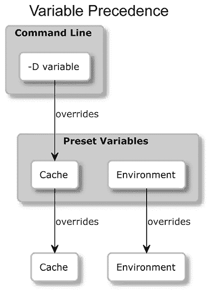

# 第十六章：编写 CMake 预设

预设是在 CMake 3.19 版本中加入的，旨在简化项目设置的管理。在有了预设之前，用户必须记住冗长的命令行配置，或者直接在项目文件中设置覆盖项，这样的做法容易出错并且变得复杂。使用预设后，用户可以更加简便地处理项目配置时所使用的生成器、并行构建任务的数量，以及需要构建或测试的项目组件等设置。使用预设后，CMake 变得更加易用。用户只需配置一次预设，之后可以随时使用它们，这使得每次执行 CMake 时更加一致，且更容易理解。预设还帮助标准化不同用户和计算机之间的设置，简化了协作项目的工作。

预设与 CMake 的四种主要模式兼容：配置构建系统、构建、运行测试和打包。它们允许用户将这些部分连接在一起，形成工作流，使整个过程更加自动化和有序。此外，预设还提供了条件和宏表达式（或简单地称为宏）等功能，赋予用户更大的控制力。

本章将涵盖以下主要内容：

+   在项目中使用定义的预设

+   编写预设文件

+   定义特定阶段的预设

+   定义工作流预设

+   添加条件和宏

# 技术要求

你可以在 GitHub 上找到本章中出现的代码文件，地址为[`github.com/PacktPublishing/Modern-CMake-for-Cpp-2E/tree/main/examples/ch16`](https://github.com/PacktPublishing/Modern-CMake-for-Cpp-2E/tree/main/examples/ch16)。

本章中执行示例所需的命令将在每个部分中提供。

# 在项目中使用定义的预设

当我们需要具体指定诸如缓存变量、选择的生成器等元素时，项目配置可能变得非常复杂，尤其是在有多种方式可以构建项目时。这时预设就显得非常有用。我们可以通过创建一个预设文件，并将所需的配置存储在项目中，避免记住命令行参数或编写 shell 脚本以不同的参数执行`cmake`。

CMake 使用两个可选文件来存储项目预设：

+   `CMakePresets.json`：由项目作者提供的官方预设。

+   `CMakeUserPresets.json`：专为希望向项目添加自定义预设的用户设计。项目应将此文件添加到版本控制忽略列表，以确保自定义设置不会无意间共享到仓库中。

预设文件必须放在项目的顶级目录中，CMake 才能识别它们。每个预设文件可以为每个阶段（配置、构建、测试、打包以及涵盖多个阶段的工作流预设）定义多个预设。用户随后可以通过 IDE、GUI 或命令行选择一个预设进行执行。

通过在命令行中添加`--list-presets`参数，可以列出预设，具体取决于我们要列出的阶段。例如，可以使用以下命令列出构建预设：

```cpp
cmake --build --list-presets 
```

测试预设可以通过以下命令列出：

```cpp
ctest --list-presets 
```

要使用预设，我们需要遵循相同的模式，并在`--preset`参数后提供预设名称。

此外，无法使用`cmake`命令列出包预设；需要使用`cpack`。以下是包预设的命令行：

```cpp
cpack --preset <preset-name> 
```

选择预设后，当然可以添加阶段特定的命令行参数，例如，指定构建树或安装路径。添加的参数将覆盖预设中设置的任何内容。

工作流预设有一个特殊情况，如果在运行`cmake`命令时附加了`--workflow`参数，则可以列出并应用它们：

```cpp
$ cmake --workflow --list-presets
Available workflow presets:
  "myWorkflow"
$ cmake --workflow --preset myWorkflow
Executing workflow step 1 of 4: configure preset "myConfigure"
... 
```

这就是如何在项目中应用和查看可用预设。现在，让我们来探索预设文件的结构。

# 编写预设文件

CMake 会在顶层目录中查找`CMakePresets.json`和`CMakeUserPresets.json`文件。这两个文件使用相同的 JSON 结构来定义预设，因此它们之间没有太大的区别可以讨论。该格式是一个包含以下键的 JSON 对象：

+   `version`：这是一个必需的整数，指定预设 JSON 架构的版本。

+   `cmakeMinimumRequired`：这是一个对象，指定了所需的 CMake 版本。

+   `include`：这是一个字符串数组，包含从数组中提供的文件路径加载的外部预设（自 schema 版本 4 起）。

+   `configurePresets`：这是一个对象数组，用于定义配置阶段的预设。

+   `buildPresets`：这是一个对象数组，用于定义构建阶段的预设。

+   `testPresets`：这是一个对象数组，特定于测试阶段的预设。

+   `packagePresets`：这是一个对象数组，特定于包阶段的预设。

+   `workflowPresets`：这是一个对象数组，特定于工作流模式的预设。

+   `vendor`：这是一个包含由 IDE 和其他供应商定义的自定义设置的对象；CMake 不会处理此字段。

在编写预设时，CMake 要求`version`条目必须存在；其他值是可选的。这里有一个预设文件示例（实际的预设将在后续章节中添加）：

**ch16/01-presets/CMakePresets.json**

```cpp
{
  "version": 6,
  "cmakeMinimumRequired": {
    "major": 3,
    "minor": 26,
    "patch": 0
  },
  "include": [],
  "configurePresets": [],
  "buildPresets": [],
  "testPresets": [],
  "packagePresets": [],
  "workflowPresets": [],
  "vendor": {
    "data": "IDE-specific information"
  }
} 
```

不需要像前面的示例那样添加空数组；除了`version`之外的条目是可选的。说到这，CMake 3.26 的适用架构版本是`6`。

现在我们了解了预设文件的结构，让我们来实际学习如何定义这些预设。

# 定义阶段特定的预设

特定于阶段的预设只是配置单独 CMake 阶段的预设：配置、构建、测试、打包和安装。它们允许以精细且结构化的方式定义构建配置。以下是所有预设阶段共享的常见特性概述，之后将介绍如何为单独的阶段定义预设。

## 预设的共同特性

有三个特性用于配置预设，无论是哪个 CMake 阶段。即，这些是唯一名称字段、可选字段以及与配置预设的关联。以下各节将分别介绍这些内容。

### 唯一名称字段

每个预设在其阶段内必须具有唯一的名称字段。鉴于 `CMakeUserPresets.json`（如果存在）隐式包含了 `CMakePresets.json`（如果存在），这两个文件共享命名空间，防止它们之间出现重复名称。例如，你不能在这两个文件中都有名为 `myPreset` 的打包阶段预设。

一个最小的预设文件可能如下所示：

```cpp
{
  "version": 6,
  "configurePresets": [
    {
      "name": "myPreset"
    },
    {
      "name": "myPreset2"
    }
  ]
} 
```

### 可选字段

每个特定于阶段的预设都可以使用相同的可选字段：

+   `displayName`：这是一个字符串，提供预设的用户友好名称。

+   `description`：这是一个字符串，提供预设功能的说明。

+   `inherits`：这是一个字符串，或一个字符串数组，它有效地复制此字段中命名的预设的配置作为基础，进一步扩展或修改。

+   `hidden`：这是一个布尔值，用于将预设从列表中隐藏；这些隐藏的预设只能通过继承使用。

+   `environment`：这是一个对象，用于覆盖此阶段的 `ENV` 变量；每个键标识一个单独的变量，值可以是字符串或 `null`；它支持宏。

+   `condition`：这是一个对象，用于启用或禁用此预设（稍后我们会详细讲解）。

+   `vendor`：这是一个自定义对象，包含供应商特定的值，并遵循与根级别 `vendor` 字段相同的约定。

预设可以形成类似图形的继承结构，只要没有循环依赖。`CMakeUserPresets.json` 可以从项目级别的预设继承，但反过来则不行。

### 与配置阶段预设的关联

所有特定于阶段的预设都必须与配置预设相关联，因为它们必须知道构建树的位置。虽然 `configure` 预设本身默认与自身相关联，但构建、测试和打包预设需要通过 `configurePreset` 字段显式定义这种关联。

与你可能想到的不同，这种关联并不意味着 CMake 会在你决定运行任何后续预设时自动执行配置预设。你仍然需要手动执行每个预设，或者使用工作流预设（稍后我们会讨论这个）。

在掌握了这些基础概念后，我们可以继续进入单个阶段的预设细节，首先是配置阶段。随着进展，我们将探索这些预设如何相互作用，以及它们如何帮助简化 CMake 中的项目配置和构建过程。

## 定义配置阶段预设

如前所述，配置预设位于`configurePresets`数组中。通过在命令行中添加`--list-presets`参数，可以列出它们，特定于配置阶段：

```cpp
cmake --list-presets 
```

要使用选择的预设配置项目，请在`--preset`参数后指定其名称，如下所示：

```cpp
cmake --preset myConfigurationPreset 
```

配置预设有一些通用字段，如`name`和`description`，但它还有自己的一套可选字段。以下是最重要字段的简化描述：

+   `generator`：一个字符串，指定用于预设的生成器；对于 schema 版本 < `3` 是必需的

+   `architecture`和`toolset`：一个字符串，配置支持这些选项的生成器

+   `binaryDir`：一个字符串，提供构建树的相对或绝对路径；对于 schema 版本 < `3` 是必需的；支持宏

+   `installDir`：一个字符串，提供安装目录的相对或绝对路径；对于 schema 版本 < `3` 是必需的，并且支持宏

+   `cacheVariables`：定义缓存变量的映射；值支持宏

在定义`cacheVariables`映射时，请记住项目中变量解析的顺序。如*图 16.1*所示，任何通过命令行定义的缓存变量将覆盖预设变量。任何缓存或环境预设变量将覆盖来自缓存文件或主机环境的变量。



图 16.1：预设如何覆盖 CMakeCache.txt 和系统环境变量

让我们声明一个简单的`myConfigure`配置预设，指定生成器、构建树和安装路径：

**ch16/01-presets/CMakePresets.json（续）**

```cpp
...
  "configurePresets": [
    {
      "name": "myConfigure",
      "displayName": "Configure Preset",
      "description": "Ninja generator",
      "generator": "Ninja",
      "binaryDir": "${sourceDir}/build",
      "installDir": "${sourceDir}/build/install"
    }
  ],
... 
```

我们已经完成了对`configure`预设的介绍，这也带我们进入构建阶段预设。

## 定义构建阶段预设

你不会惊讶地发现，构建预设位于`buildPresets`数组中。通过在命令行中添加`--list-presets`参数，可以列出它们，特定于构建阶段：

```cpp
cmake --build --list-presets 
```

要使用选择的预设构建项目，请在`--preset`参数后指定其名称，如下所示：

```cpp
cmake --build --preset myBuildingPreset 
```

构建预设也有一些通用字段，如`name`和`description`，并且它有自己的一套可选字段。最重要字段的简化描述如下：

+   `jobs`：一个整数，设置用于构建项目的并行作业数

+   `targets`：一个字符串或字符串数组，设置要构建的目标，并支持宏

+   `configuration`：一个字符串，确定多配置生成器的构建类型（`Debug`、`Release`等）

+   `cleanFirst`: 一个布尔值，确保在构建之前始终清理项目

就这样。现在，我们可以像这样编写构建预设：

**ch16/01-presets/CMakePresets.json（续）**

```cpp
...
  "buildPresets": [
    {
      "name": "myBuild",
      "displayName": "Build Preset",
      "description": "Four jobs",
      "configurePreset": "myConfigure",
      "jobs": 4
    }
  ],
... 
```

你会注意到，所需的`configurePreset`字段已设置为指向我们在前一部分定义的`myConfigure`预设。现在，我们可以继续进行测试预设。

## 定义测试阶段预设

测试预设位于`testPresets`数组中。可以通过在命令行中添加`--list-presets`参数显示它们，特定于测试阶段：

```cpp
ctest --list-presets 
```

要使用预设测试项目，请在`--preset`参数后指定其名称，如下所示：

```cpp
ctest --preset myTestPreset 
```

测试预设也有一组独特的可选字段。以下是最重要字段的简化描述：

+   `configuration`: 一个字符串，决定多配置生成器的构建类型（如`Debug`、`Release`等）

+   `output`: 一个对象，配置输出

+   `filter`: 一个对象，指定要运行的测试

+   `execution`: 一个对象，配置测试的执行

每个对象将适当的命令行选项映射到配置值。我们将突出显示一些重要选项，但这并不是详尽无遗的列表。完整参考请查阅*进一步阅读*部分。

`output`对象的可选条目包括：

+   `shortProgress`: 布尔值；进度将在一行内报告

+   `verbosity`: 一个字符串，将输出详细程度设置为以下级别之一：默认、详细或额外

+   `outputOnFailure`: 一个布尔值，在测试失败时打印程序输出

+   `quiet`: 布尔值；抑制所有输出

对于 exclude，一些接受的条目包括：

+   `name`: 一个字符串，用于排除名称匹配正则表达式模式的测试，并支持宏

+   `label`: 一个字符串，用于排除标签匹配正则表达式模式的测试，并支持宏

+   `fixtures`: 一个对象，决定从测试中排除哪些固定装置（更多详情请参阅官方文档）

最后，执行对象接受以下可选条目：

+   `outputLogFile`: 一个字符串，指定输出日志文件路径，并支持宏

`filter`对象接受`include`和`exclude`键来配置测试用例的过滤；以下是一个部分填充的结构来说明这一点：

```cpp
 "testPresets": [
    {
      "name": "myTest",
      "configurePreset": "myConfigure",
      "filter": {
        "include": {
                     ... name, label, index, useUnion ...
                   },
        "exclude": {
                     ... name, label, fixtures ...
                   }
      }
    }
  ],
... 
```

每个键定义了它自己的选项对象：

对于`include`，条目包括：

+   `name`: 一个字符串，用于包含名称匹配正则表达式模式的测试，并支持宏

+   `label`: 一个字符串，用于包含标签匹配正则表达式模式的测试，并支持宏

+   `index`: 一个对象，选择要运行的测试，并接受`start`、`end`和`stride`整数，以及一个`specificTests`整数数组；它支持宏

+   `useUnion`: 一个布尔值，启用使用由`index`和`name`确定的测试的并集，而不是交集

对于`exclude`，条目包括：

+   `name`: 一个字符串，用于排除名称匹配正则表达式模式的测试，并支持宏

+   `label`: 一个字符串，排除与正则表达式匹配的标签的测试，并支持宏

+   `fixtures`: 一个对象，确定要从测试中排除的固定项（更多详细信息请参见官方文档）

最后，`execution`对象可以添加到此处：

```cpp
 "testPresets": [
    {
      "name": "myTest",
      "configurePreset": "myConfigure",
      "execution": {
                   ... stopOnFailure, enableFailover, ...
                   ... jobs, repeat, scheduleRandom,  ...
                   ... timeout, noTestsAction ...
                   }     
    }
  ],
... 
```

它接受以下可选条目：

+   `stopOnFailure`: 一个布尔值，启用在任何测试失败时停止测试

+   `enableFailover`: 一个布尔值，表示是否恢复先前中断的测试

+   `jobs`: 一个整数，表示并行运行多个测试的数量

+   `repeat`: 一个对象，用于确定如何重复测试；该对象必须包含以下字段：

    +   `mode` – 一个字符串，具有以下之一的值：`until-fail`、`until-pass`、`after-timeout`

    +   `count` – 一个整数，确定重复的次数

+   `scheduleRandom`: 一个布尔值，启用随机顺序执行测试

+   `timeout`: 一个整数，设置所有测试总执行时间的限制（以秒为单位）

+   `noTestsAction`: 一个定义如果未找到测试时采取的行动的字符串，选项包括`default`、`error`和`ignore`。

虽然有许多配置选项，但简单的预设也是可行的：

**ch16/01-presets/CMakePresets.json（续）**

```cpp
...
  "testPresets": [
    {
      "name": "myTest",
      "displayName": "Test Preset",
      "description": "Output short progress",
      "configurePreset": "myConfigure",
      "output": {
        "shortProgress": true
      }
    }
  ],
... 
```

与构建预设一样，我们还需要为新的测试预设设置必需的`configurePreset`字段，以便将所有内容整齐地连接在一起。让我们来看看最后一种特定于阶段的预设类型——包预设。

## 定义包阶段预设

包预设在模式版本`6`中被引入，这意味着你需要至少 CMake 3.25 版本才能使用它们。这些预设应包含在`packagePresets`数组中。你也可以通过在命令行中添加`--list-presets`参数来显示它们，这对于特定的测试阶段有效：

```cpp
cpack --list-presets 
```

要使用预设创建项目包，指定其名称，方法是在`--preset`参数后面添加预设名称，如下所示：

```cpp
cpack --preset myTestPreset 
```

包预设利用与其他预设相同的共享字段，同时引入一些特定于它自己的可选字段：

+   `generators`: 一个字符串数组，设置用于创建包的生成器（`ZIP`、`7Z`、`DEB`等）

+   `configuration`: 一个字符串数组，确定 CMake 打包时所使用的构建类型列表（`Debug`、`Release`等）

+   `filter`: 一个对象，指定要运行的测试

+   `packageName`、`packageVersion`、`packageDirectory`和`vendorName`: 字符串，指定已创建包的元数据

让我们也用一个简洁的包预设来扩展我们的预设文件：

**ch16/01-presets/CMakePresets.json（续）**

```cpp
...
  "packagePresets": [
    {
      "name": "myPackage",
      "displayName": "Package Preset",
      "description": "ZIP generator",
      "configurePreset": "myConfigure",
      "generators": [
        "ZIP"
      ]
    }
  ],
... 
```

这种配置将使我们能够简化项目包的创建，但我们仍然缺少一个关键部分：项目安装。让我们看看如何使它正常工作。

## 添加安装预设

你可能注意到，`CMakePresets.json` 对象不支持定义 `"installPresets"`。通过预设没有明确的方式来安装你的项目，这似乎很奇怪，因为配置预设提供了 `installDir` 字段！那么，我们是否必须依赖手动安装命令呢？

幸运的是，不需要。我们有一个变通方法，可以通过使用构建预设来实现我们的目标。请看下面：

**ch16/01-presets/CMakePresets.json（续）**

```cpp
...
  "buildPresets": [
    {
      "name": "myBuild",
      ...
    },
    {
      "name": "myInstall",
      "displayName": "Installation",
      **"targets"****:****"install"****,**
      "configurePreset": "myConfigure"
    }
  ],
... 
```

我们可以创建一个构建预设，将 `targets` 字段设置为 `install`。当我们正确配置安装时，`install` 目标由项目隐式定义。使用此预设进行构建将执行必要的步骤，将项目安装到关联配置预设中指定的 `installDir`（如果 `installDir` 字段为空，将使用默认位置）：

```cpp
$ cmake --build --preset myInstall
[0/1] Install the project...
-- Install configuration: ""
-- Installing: .../install/include/calc/basic.h
-- Installing: .../install/lib/libcalc_shared.so
-- Installing: .../install/lib/libcalc_static.a
-- Installing: .../install/lib/calc/cmake/CalcLibrary.cmake
-- Installing: .../install/lib/calc/cmake/CalcLibrary-noconfig.cmake
-- Installing: .../install/lib/calc/cmake/CalcConfig.cmake
-- Installing: .../install/bin/calc_console
-- Set non-toolchain portion of runtime path of ".../install/bin/calc_console" to "" 
```

这个巧妙的技巧可以帮助我们节省一些资源。如果我们能为最终用户提供一个单一命令，处理从配置到安装的所有操作，那将更好。好吧，我们可以，使用工作流预设。让我们看一下。

# 定义工作流预设

工作流预设是我们项目的终极自动化解决方案。它们允许我们按预定顺序自动执行多个阶段特定的预设。这样，我们几乎可以在一步操作中完成端到端的构建。

要发现项目的可用工作流，我们可以执行以下命令：

```cpp
cmake --workflow --list-presets 
```

要选择并应用预设，请使用以下命令：

```cpp
cmake –workflow --preset <preset-name> 
```

此外，通过 `--fresh` 标志，我们可以清除构建树并清除缓存。

定义工作流预设非常简单；我们需要定义一个名称，且可以选择性地提供 `displayName` 和 `description`，就像为阶段特定预设定义一样。之后，我们必须列出工作流应该执行的所有阶段特定预设。这是通过提供一个包含 `type` 和 `name` 属性的对象数组 `steps` 来完成的，如下所示：

**ch16/01-presets/CMakePresets.json（续）**

```cpp
...
  "workflowPresets": [
    {
      "name": "myWorkflow",
      "steps": [
        {
          "type": "configure",
          "name": "myConfigure"
        },
        {
          "type": "build",
          "name": "myBuild"
        },
        {
          "type": "test",
          "name": "myTest"
        },
        {
          "type": "package",
          "name": "myPackage"
        },
        {
          "type": "build",
          "name": "myInstall"
        }
      ]
... 
```

`steps` 数组中的每个对象都引用了我们在本章前面定义的预设，指明其类型（`configure`、`build`、`test` 或 `package`）以及名称。这些预设共同执行所有必要的步骤，通过一个命令从零开始完全构建和安装项目：

```cpp
cmake --workflow --preset myWorkflow 
```

工作流预设是自动化 C++ 构建、测试、打包和安装的终极解决方案。接下来，让我们探索如何通过条件和宏来管理一些边缘情况。

# 添加条件和宏

当我们讨论每个阶段特定预设的通用字段时，我们提到了 `condition` 字段。现在是时候回到这个话题了。**condition** 字段启用或禁用预设，并在与工作流集成时展现其真正的潜力。本质上，它允许我们绕过在某些条件下不适用的预设，并创建适用的替代预设。

条件要求预设架构版本为 3 或更高版本（在 CMake 3.22 中引入），并且是 JSON 对象，用于编码一些简单的逻辑操作，以判断诸如操作系统、环境变量，甚至所选生成器等情况是否符合预设的场景。CMake 通过宏提供这些数据，宏本质上是一组有限的只读变量，可在预设文件中使用。

条件对象的结构根据检查类型有所不同。每个条件必须包含一个 `type` 字段，并根据类型定义其他字段。已识别的基本类型包括：

+   `const`：这检查 `value` 字段中提供的值是否为布尔值 `true`

+   `equals`，`notEquals`：这些用于将 `lhs` 字段的值与 `rhs` 字段中的值进行比较

+   `inList` 和 `notInList`：这些用于检查 `string` 字段中的值是否出现在 `list` 字段中的数组中

+   `matches` 和 `notMatches`：这些用于评估 `string` 字段的值是否与 `regex` 字段中定义的模式一致

一个条件示例如下所示：

```cpp
"condition": {
               "type": "equals",
               "lhs": "${hostSystemName}",
               "rhs": "Windows"
             } 
```

`const` 条件的实际用途主要是用于禁用预设，而不将其从 JSON 文件中移除。除了 `const` 外，所有基本条件都允许在它们引入的字段中使用宏：`lhs`、`rhs`、`string`、`list` 和 `regex`。

高级条件类型，类似于“not”、“and”和“or”操作，使用其他条件作为参数：

+   `not`：对 `condition` 字段中提供的条件进行布尔反转

+   `anyOf` 和 `allOf`：这些用于检查 `conditions` 数组中的任意或所有条件是否为 `true`

例如：

```cpp
"condition": {
              "type": "anyOf",
              "conditions": [
                              {
                                "type": "equals",
                                "lhs": "${hostSystemName}",
                                "rhs": "Windows"
                              },{
                                "type": "equals",
                                "lhs": "${hostSystemName}",
                                "rhs": "Linux"
                              }
                            ]
             } 
```

如果系统是 Linux 或 Windows，则此条件评估为 `true`。

通过这些示例，我们介绍了我们的第一个宏：`${hostSystemName}`。宏遵循简单的语法，并且限于特定实例，如：

+   `${sourceDir}`：这是源树的路径

+   `${sourceParentDir}`：这是源树父目录的路径

+   `${sourceDirName}`：这是项目的目录名称

+   `${presetName}`：这是预设的名称

+   `${generator}`：这是用于创建构建系统的生成器

+   `${hostSystemName}`：这是系统名称：在 Linux 上为 `Linux`，在 Windows 上为 `Windows`，在 macOS 上为 `Darwin`

+   `${fileDir}`：这是包含当前预设的文件名（适用于使用 `include` 数组导入外部预设的情况）

+   `${dollar}`：这是转义的美元符号（`$`）

+   `${pathListSep}`：这是环境特定的路径分隔符

+   `$env{<variable-name>}`：如果预设中指定了环境变量（区分大小写），则返回该环境变量的值，或返回父环境的值

+   `$penv{<variable-name>}`：这是从父环境中返回的环境变量

+   `$vendor{<macro-name>}`：这允许 IDE 供应商引入他们自己的宏

这些宏提供了足够的灵活性，以便在预设及其条件中使用，支持在需要时有效地切换工作流步骤。

# 摘要

我们刚刚完成了对 CMake 预设的全面概述，这些预设是在 CMake 3.19 中引入的，旨在简化项目管理。预设允许产品作者通过配置项目构建和交付的所有阶段，为用户提供一个精心准备的体验。预设不仅简化了 CMake 的使用，还增强了一致性，并支持环境感知的设置。

我们解释了 `CMakePresets.json` 和 `CMakeUserPresets.json` 文件的结构和使用，提供了定义各种预设类型的见解，比如配置预设、构建预设、测试预设、打包预设和工作流预设。每种类型都有详细描述：我们了解了常见字段，如何在内部组织预设，如何在它们之间建立继承关系，以及最终用户可用的具体配置选项。

对于*配置预设*，我们讨论了选择生成器、构建目录和安装目录的重要话题，以及如何通过 `configurePreset` 字段将预设连接在一起。现在我们知道如何处理*构建预设*，设置构建作业数量、目标和清理选项。接下来，我们学习了*测试预设*如何通过广泛的过滤和排序选项、输出格式和执行参数（如超时和容错）来协助测试选择。我们理解了如何通过指定包生成器、过滤器和包元数据来管理*打包预设*。我们甚至介绍了一种通过专门的构建预设应用执行安装阶段的解决方法。

接下来，我们发现工作流预设如何允许将多个阶段特定的预设进行分组。最后，我们讨论了条件和宏表达式，为项目作者提供了更大的控制力，可以更好地控制各个预设的行为及其在工作流中的集成。

我们的 CMake 之旅已圆满完成！恭喜你——现在你拥有了开发、测试和打包高质量 C++ 软件所需的所有工具。接下来的最佳方式是应用你所学的知识，创建出色的软件供用户使用。祝你好运！

# 深入阅读

如需更多信息，您可以参考以下资源：

+   预设的官方文档：[`cmake.org/cmake/help/latest/manual/cmake-presets.7.html`](https://cmake.org/cmake/help/latest/manual/cmake-presets.7.html)

# 加入我们的社区 Discord

加入我们社区的 Discord 空间，与作者和其他读者进行讨论：

[`discord.com/invite/vXN53A7ZcA`](https://discord.com/invite/vXN53A7ZcA)


