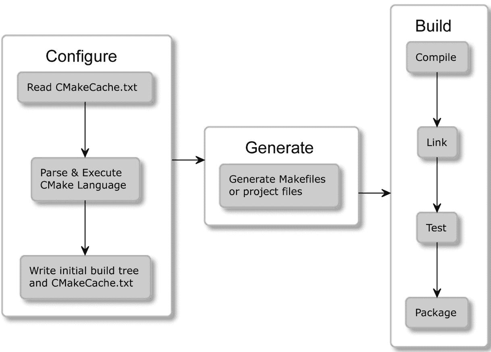
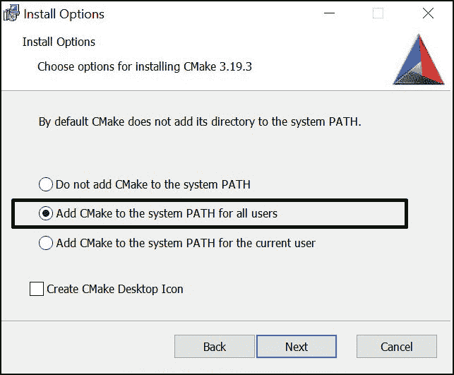
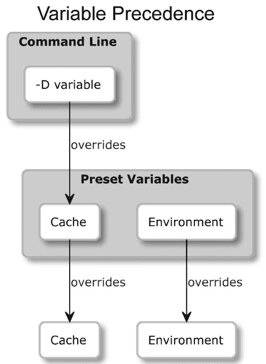
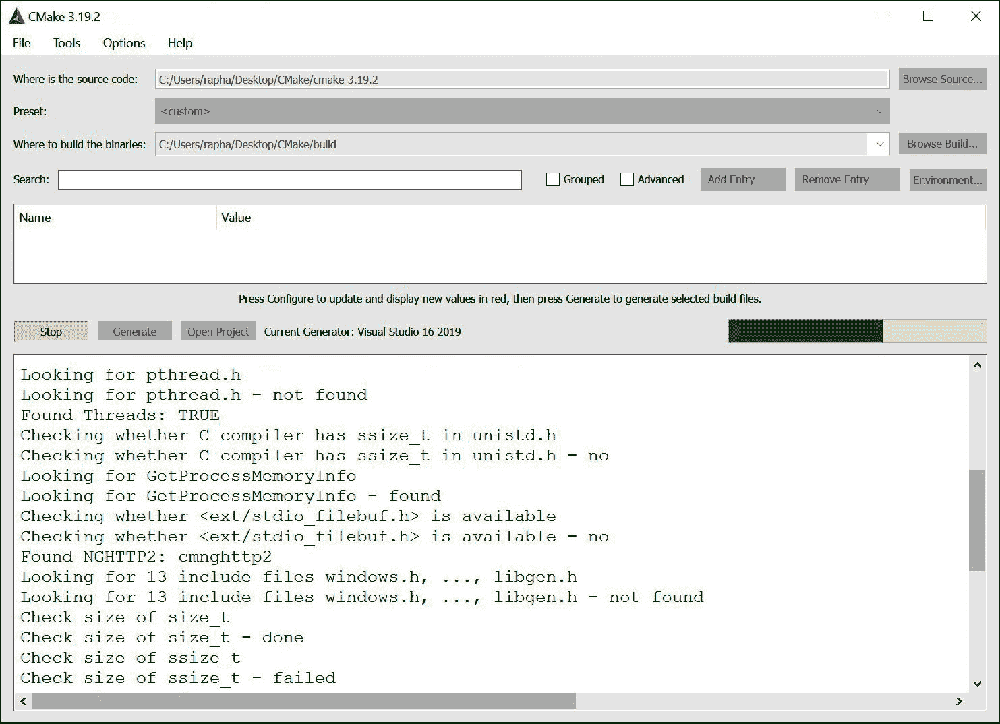
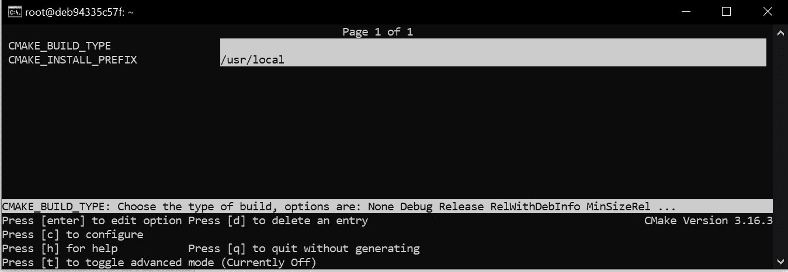

# 第一章：CMake 的初步步骤

将源代码转换成运行中的应用程序有一种神奇的感觉。这种神奇不仅仅在于效果本身，即我们设计并使其实际运行的机制，而且在于将想法付诸实践的过程或行为。

作为程序员，我们按照以下循环工作：设计、编码和测试。我们发明变更，我们用编译器能理解的言语来阐述它们，然后我们检查它们是否如预期那样工作。为了从我们的源代码创建一个适当、高质量的程序，我们需要精心执行重复性、易出错的任务：调用正确的命令，检查语法，链接二进制文件，运行测试，报告问题，等等。

每次都记住每个步骤需要付出很大的努力。相反，我们希望专注于实际的编程，并将其他所有任务委派给自动化工具。理想情况下，这个过程将从我们更改代码后立即开始，只需按一个按钮。它会智能、快速、可扩展，并且在不同的操作系统和环境中以相同的方式工作。它会被多种**集成开发环境**（**IDEs**）支持，同时也会被**持续集成**（**CI**）管道支持，在我们向共享仓库提交更改后测试我们的软件。

CMake 是许多需求的答案；然而，要正确配置和使用它需要一些工作。这不是因为 CMake 不必要的复杂，而是因为我们这里处理的主题就是这样。不要担心。我们将非常有条理地进行整个学习过程；在您意识到之前，您将已经成为一个建筑大师。

我知道您渴望开始编写自己的 CMake 项目，我赞赏您的热情。由于您的项目主要面向用户（包括您自己），您理解这一观点也很重要。

那么，让我们从这一点开始：成为 CMake 的高级用户。我们会先了解一些基础知识：这个工具是什么，它的工作原理是什么，以及如何安装它。然后，我们将深入探讨命令行和操作模式。最后，我们将总结项目中不同文件的目的，并解释如何在不下创建项目的情况下使用 CMake。

在本章中，我们将涵盖以下主要主题：

+   理解基础知识

+   在不同平台上安装 CMake

+   掌握命令行

+   导航项目文件

+   发现脚本和模块

# 技术要求

您可以在 GitHub 上找到本章中存在的代码文件：[`github.com/PacktPublishing/Modern-CMake-for-Cpp/tree/main/examples/chapter01`](https://github.com/PacktPublishing/Modern-CMake-for-Cpp/tree/main/examples/chapter01)。

为了构建本书中提供的示例，始终使用建议的命令：

```cpp
cmake -B <build tree> -S <source tree>
cmake --build <build tree>
```

请确保将占位符`<build tree>`和`<source tree>`替换为适当的路径。作为提醒：**build tree**是目标/输出目录的路径，**source tree**是源代码所在的位置。

# 理解基础知识

编译 C++源代码似乎是一个相当直接的过程。让我们以一个小型程序为例，比如经典的`hello.cpp`应用：

chapter-01/01-hello/hello.cpp

```cpp
#include <iostream>
int main() {
  std::cout << "Hello World!" << std::endl;
  return 0;
}
```

现在，要获得可执行文件，我们只需要运行一个命令。我们通过将文件名作为参数传递给编译器来调用它：

```cpp
$ g++ hello.cpp -o a.out
```

我们的代码是正确的，所以编译器将默默生成一个可执行的二进制文件，我们的机器可以理解。我们可以通过调用它的名字来运行它：

```cpp
$ ./a.out
Hello World!
$
```

然而，随着我们的项目增长，你会很快理解将所有内容放在一个文件中 simply not possible。良好的代码实践建议文件应保持小且结构良好。手动编译每个文件可能是一个繁琐且脆弱的过程。一定有更好的方法。

## 什么是 CMake？

假设我们通过编写一个脚本来自动化构建，该脚本遍历我们的项目树并编译所有内容。为了避免不必要的编译，我们的脚本将检测源代码是否自上次运行（脚本）以来已被修改。现在，我们想要一种方便地管理传递给每个文件编译器的参数的方法——最好是基于可配置标准来完成。此外，我们的脚本应知道如何链接所有编译文件到一个二进制文件中，或者更好，构建整个解决方案，可以被复用并作为更大项目的模块。

我们添加的功能越多，我们得到一个完整的解决方案的机会就越大。软件构建是一个非常多样化的过程，可以涵盖多个不同的方面：

+   编译可执行文件和库

+   管理依赖项

+   测试

+   安装

+   打包

+   生成文档

+   再测试一下

要创建一个真正模块化且强大的 C++构建应用程序需要很长时间，而且确实做到了。Bill Hoffman 在 Kitware 实现了 CMake 的第一个版本，至今已有 20 多年。正如你可能已经猜到的，它非常成功。它现在有很多功能和社区支持。今天，CMake 正在积极开发中，并已成为 C 和 C++程序员的行业标准。

自动化构建代码的问题比 CMake 要早得多，所以自然而然，有很多选择：Make、Autotools、SCons、Ninja、Premake 等等。但为什么 CMake 能占据上风呢？

关于 CMake，有几件事情我觉得（主观地）很重要：

+   它专注于支持现代编译器和工具链。

+   CMake 确实是跨平台的——它支持为 Windows、Linux、macOS 和 Cygwin 构建。

+   它为流行的 IDE 生成项目文件：Microsoft Visual Studio、Xcode 和 Eclipse CDT。此外，它还是其他项目的模型，如 CLion。

+   CMake 在恰到好处的抽象级别上操作——它允许你将文件分组到可重用的目标和项目中。

+   有大量使用 CMake 构建的项目，它们提供了一种轻松将它们包含在你项目中的方法。

+   CMake 将测试、打包和安装视为构建过程的固有部分。

+   旧的、未使用的特性会被弃用，以保持 CMake 的轻量级。

CMake 为整个平台提供了一致、简化的体验。无论你是使用 IDE 构建软件，还是直接从命令行构建，重要的是它还负责后构建阶段。你的**持续集成/持续部署**（**CI/CD**）流水线可以轻松使用相同的 CMake 配置和构建项目，即使所有前面的环境都不同。

## 它是如何工作的？

你可能还以为 CMake 是一个工具，在一端读取源代码，在另一端生成二进制文件——虽然从原则上讲这是正确的，但这并不是全部。

CMake 本身不能构建任何东西——它依赖于系统中的其他工具来执行实际的编译、链接等任务。你可以把它看作是你构建过程的协调者：它知道需要做哪些步骤，最终目标是什么，以及如何找到合适的工人和材料。

这个过程分为三个阶段：

+   配置阶段

+   生成

+   构建

### 配置阶段

这个阶段是关于读取存储在称为**源树**的目录中的项目详细信息，并为生成阶段准备输出目录或**构建树**。

CMake 首先创建一个空的构建树，并收集有关它正在工作的环境的详细信息，例如架构、可用的编译器、链接器和归档器。此外，它检查一个简单的测试程序是否可以正确编译。

接下来，解析并执行`CMakeLists.txt`项目配置文件（是的，CMake 项目是用 CMake 的编程语言配置的）。这个文件是 CMake 项目的最小配置（源文件可以在以后添加）。它告诉 CMake 关于项目结构、目标和依赖项（库和其他 CMake 包）。在这个过程中，CMake 将在构建树中存储收集的信息，如系统详细信息、项目配置、日志和临时文件，供下一步使用。特别是，创建了一个`CMakeCache.txt`文件来存储更稳定的变量（如编译器和其他工具的路径），以节省下一次配置的时间。

### 生成阶段

在阅读项目配置后，CMake 将为它正在工作的确切环境生成一个**构建系统**。构建系统只是为其他构建工具（例如，为 GNU Make 的 Makefile 或为 Ninja 和 Visual Studio 的 IDE 项目文件）定制的配置文件。在这个阶段，CMake 仍然可以通过评估**生成器表达式**来对构建配置进行一些最后的润色。

注意

生成阶段在配置阶段自动执行后执行。因此，本书和其他资源在提到“配置”或“生成”构建系统时，通常会提到这两个阶段。要显式运行 just the 配置阶段，你可以使用`cmake-gui`工具。

### 构建阶段

为了生成我们项目中所指定的最终工件，我们必须运行适当的**构建工具**。这可以直接通过 IDE 调用，或者使用 CMake 命令。反过来，这些构建工具将执行步骤，使用编译器、链接器、静态和动态分析工具、测试框架、报告工具以及你能想到的任何其他工具来生成**目标**。

这个解决方案的优点在于能够根据需要为每个平台生成构建系统，只需一个配置（即，相同的项目文件）：



](img/Figure_1.1_B17205.jpg)

图 1.1 – CMake 的阶段

你们还记得我们在*理解基本内容*部分提到的`hello.cpp`应用程序吗？CMake 让构建它变得非常简单。我们需要的只是一个位于源代码旁边的`CMakeLists.txt`文件和两个简单的命令`cmake -B buildtree`和`cmake --build buildtree`，如下所示：

chapter01/01-hello/CMakeLists.txt：用 CMake 语言编写的世界

```cpp
cmake_minimum_required(VERSION 3.20)
project(Hello)
add_executable(Hello hello.cpp)
```

这是来自 Dockerized Linux 系统的输出（请注意，我们将在*在不同的平台上安装 CMake*部分讨论 Docker）：

```cpp
root@5f81fe44c9bd:/root/examples/chapter01/01-hello# cmake -B buildtree.
-- The C compiler identification is GNU 9.3.0
-- The CXX compiler identification is GNU 9.3.0
-- Check for working C compiler: /usr/bin/cc
-- Check for working C compiler: /usr/bin/cc -- works
-- Detecting C compiler ABI info
-- Detecting C compiler ABI info - done
-- Detecting C compile features
-- Detecting C compile features - done
-- Check for working CXX compiler: /usr/bin/c++
-- Check for working CXX compiler: /usr/bin/c++ -- works
-- Detecting CXX compiler ABI info
-- Detecting CXX compiler ABI info - done
-- Detecting CXX compile features
-- Detecting CXX compile features - done
-- Configuring done
-- Generating done
-- Build files have been written to: /root/examples/chapter01/01-hello/buildtree
root@5f81fe44c9bd:/root/examples/chapter01/01-hello# cmake --build buildtree/
Scanning dependencies of target Hello
[ 50%] Building CXX object CMakeFiles/Hello.dir/hello.cpp.o
[100%] Linking CXX executable Hello
[100%] Built target Hello
```

现在只剩下运行它了：

```cpp
root@68c249f65ce2:~# ./buildtree/Hello
Hello World!
```

在这里，我们生成了一个存储在`buildtree`目录中的构建系统。接着，我们执行了构建阶段，生成了一个我们能够运行的最终二进制文件。

现在你知道最终结果长什么样了，我相信你会有很多问题：这个过程的前提条件是什么？这些命令意味着什么？为什么我们需要两个？我如何编写自己的项目文件？不要担心——这些问题将在接下来的章节中得到解答。

获取帮助

本书将为您提供与当前版本的 CMake（撰写本书时为 3.20 版）最相关的最重要的信息。为了给您提供最好的建议，我明确避免使用任何已弃用和不推荐使用的功能。我强烈建议至少使用版本 3.15，这个版本被认为是“现代 CMake”。如果您需要更多信息，您可以在[`cmake.org/cmake/help/`](https://cmake.org/cmake/help/)找到最新的完整文档。

# 在不同的平台上安装 CMake

CMake 是一个用 C++编写的跨平台、开源软件。这意味着你当然可以自己编译它；然而，最有可能的情况是，你不需要这么做。这是因为预编译的二进制文件可以在官方网页[`cmake.org/download/`](https://cmake.org/download/)上供你下载。

基于 Unix 的系统可以直接从命令行提供准备安装的包。

注意

请记住，CMake 不附带编译器。如果你的系统还没有安装它们，你需要在使用 CMake 之前提供它们。确保将它们的执行文件路径添加到`PATH`环境变量中，这样 CMake 才能找到它们。

为了避免在阅读本书时解决工具和依赖问题，我建议选择第一种安装方法：Docker。

让我们来看看可以在哪些环境中使用 CMake。

## Docker

Docker ([`www.docker.com/`](https://www.docker.com/)) 是一个跨平台的工具，提供操作系统级别的虚拟化，允许应用程序以完整的包形式运输，这些包被称为容器。这些都是自给自足的捆绑包，包含了一个软件以及它所有的库、依赖项和运行它所需的工具。Docker 在其轻量级环境中执行其容器，彼此之间是隔离的。

这个概念使得分享整个工具链变得极其方便，这对于给定的过程是必要的，已经配置好并准备好使用。我无法强调当你不需要担心微小的环境差异时事情变得有多简单。

Docker 平台有一个公共容器镜像仓库，[`registry.hub.docker.com/`](https://registry.hub.docker.com/)，提供了数百万个准备使用的镜像。

为了方便起见，我发布了两个 Docker 仓库：

+   `swidzinski/cmake:toolchain`：这个包含了构建 CMake 所需的精心挑选的工具和依赖项。

+   `swidzinski/cmake:examples`：这个包含了前面的工具链以及本书中的所有项目和示例。

第一个选项是为那些只想使用一个空白镜像来构建自己项目的读者准备的，第二个选项是为在章节中进行实例实践准备的。

你可以通过遵循 Docker 官方文档中的说明来安装 Docker（请参考[docs.docker.com/get-docker](http://docs.docker.com/get-docker)）。然后，在你的终端中执行以下命令来下载镜像并启动容器：

```cpp
$ docker pull swidzinski/cmake:examples
$ docker run -it swidzinski/cmake:examples
root@b55e271a85b2:root@b55e271a85b2:#
```

请注意，所有示例都可以在匹配此格式的目录中找到：`/root/examples/``examples/chapter-<N>/<M>-<title>`。

## Windows

在 Windows 上的安装很简单——只需下载 32 位或 64 位的版本。你可以选择一个便携式 ZIP 或 MSI 包用于 Windows 安装程序。

使用 ZIP 包，你将不得不将 CMake 二进制目录添加到`PATH`环境变量中，这样你才能在任何目录中使用它，而不会出现错误：

```cpp
'cmake' is not recognized as an internal or external command, operable program or batch file.
```

如果你喜欢方便，可以直接使用 MSI 安装程序：



图 1.2 – 安装向导可以为你设置 PATH 环境变量

如我前面提到的，这是开源软件，所以自己构建 CMake 是可能的。然而，首先，你需要在你的系统上获取 CMake 的二进制副本。那么，如果你有自己的构建工具，为什么还要使用其他的呢？这种场景是 CMake 贡献者用来生成新版本的。

在 Windows 上，我们还需要一个构建工具来完成由 CMake 启动的构建过程。这里的一个流行选择是 Visual Studio，其社区版可从微软网站免费获得：[`visualstudio.microsoft.com/downloads/`](https://visualstudio.microsoft.com/downloads/)。

## Linux

在 Linux 上获取 CMake 与获取任何其他流行软件包相同。只需使用命令行的包管理器即可。软件包通常会保持更新，包含相对较新的版本。然而，如果你想要最新版本，你可以从网站上下载安装脚本：

适用于 Linux x86_64 的脚本

```cpp
$ wget -O - https://github.com/Kitware/CMake/releases/download/v3.20.0/cmake-3.20.0-linux-x86_64.sh | bash
```

适用于 Linux aarch64 的脚本

```cpp
$ wget -O - https://github.com/Kitware/CMake/releases/download/v3.20.0/cmake-3.20.0-Linux-aarch64.sh | bash
```

适用于 Debian/Ubuntu 的软件包

```cpp
$ sudo apt-get install cmake
```

适用于 Red Hat 的软件包

```cpp
$ yum install cmake
```

## macOS

这个平台也得到了 CMake 开发者的强烈支持。最流行的安装方式是通过 MacPorts：

```cpp
$ sudo port install cmake
```

另外，你可以使用 Homebrew：

```cpp
$ brew install cmake
```

## 从源代码构建

如果其他方法都失败了——或者如果你在一个特殊的平台上——从官方网站下载源代码并自己编译它：

```cpp
$ wget https://github.com/Kitware/CMake/releases/download/v3.20.0/cmake-3.20.0.tar.gz
$ tar xzf cmake-3.20.0.tar.gz
$ cd cmake-3.20.0
$ ./bootstrap
$ make
$ make install
```

从源代码构建相对较慢，需要更多步骤。然而，通过这种方式，你可以保证使用最新版本的 CMake。这在与 Linux 上可用的软件包相比较时尤为明显：系统版本越旧，更新越少。

既然我们已经轻松安装了 CMake，那就让我们学习如何使用它吧！

# 精通命令行

本书的大部分内容将教你如何为你的用户准备 CMake 项目。为了满足他们的需求，我们需要彻底了解用户在不同场景中如何与 CMake 互动。这将允许你测试项目文件，并确保它们正确运行。

CMake 是一组工具的家族，包括五个可执行文件：

+   `cmake`：这是主要的可执行文件，用于配置、生成和构建项目。

+   `ctest`：这个程序用于运行和报告测试结果。

+   `cpack`：这个程序用于生成安装程序和源代码包。

+   `cmake-gui`：这是围绕`cmake`的图形界面。

+   `ccmake`：这是基于控制台的图形界面围绕`cmake`。

## CMake

这个二进制文件提供了一些操作模式（也称为动作）：

+   生成项目构建系统

+   构建项目

+   安装项目

+   运行脚本

+   运行命令行工具

+   获取帮助

### 生成项目构建系统

安装项目是我们构建项目所需的第一步。以下是执行 CMake 构建操作的几种方式：

生成模式的语法

```cpp
cmake [<options>] -S <path-to-source> -B <path-to-build>
cmake [<options>] <path-to-source>
cmake [<options>] <path-to-existing-build>
```

我们将在接下来的部分讨论这些选项。现在，让我们专注于选择正确的命令形式。CMake 的一个重要特性是支持离线构建或在单独的目录中生成工件。与 GNU Make 等工具相比，这确保了源代码目录中不会包含任何与构建相关的文件，并避免了使用`-S`选项后跟生成构建系统的目录路径的污染：

```cpp
cmake -S ./project -B ./build
```

前面命令将在`./build`目录中（如果缺失则创建）生成一个构建系统，该构建系统来源于`./project`目录中的源代码。

我们可以省略一个参数，`cmake`会“猜测”我们打算使用当前目录。但是，要小心。省略两个参数将会得到一个源代码构建，这将非常混乱。

不推荐

```cpp
<directory>: it will use the cached path to the sources and rebuild from there. Since we often invoke the same commands from the Terminal command history, we might get into trouble here: before using this form, always check whether your shell is currently working in the right directory.
```

#### 示例

在当前目录中构建，但源代码从上一级目录获取（注意`-S`是可选的）：

```cpp
cmake -S ..
```

在`./build`目录中构建，并使用当前目录中的源代码：

```cpp
cmake -B build
```

#### 生成器的选项

如前所述，在生成阶段，你可以指定一些选项。选择和配置生成器决定了我们将使用我们系统中的哪个构建工具来构建，构建文件将呈现什么样子，以及构建树的结构将如何。

那么，你应该关心吗？幸运的是，答案通常是“不”。CMake 在许多平台上支持多种本地构建系统；然而，除非你同时安装了几个生成器，否则 CMake 会正确地为你选择一个。这可以通过设置`CMAKE_GENERATOR`环境变量或直接在命令行上指定生成器来覆盖，如下所示：

```cpp
cmake -G <generator-name> <path-to-source>
```

一些生成器（如 Visual Studio）支持对工具集（编译器）和平面（编译器或 SDK）进行更详细的指定。另外，这些生成器还有相应的环境变量，这些环境变量会覆盖默认值：`CMAKE_GENERATOR_TOOLSET`和`CMAKE_GENERATOR_PLATFORM`。我们可以像下面这样直接指定它们：

```cpp
cmake -G <generator-name> 
      -T <toolset-spec> -A <platform-name>
      <path-to-source>
```

Windows 用户通常希望为他们的首选 IDE 生成一个构建系统。在 Linux 和 macOS 上，使用 Unix Makefiles 或 Ninja 生成器非常普遍。

为了检查你的系统上可用的生成器，请使用以下命令：

```cpp
cmake --help
```

在`help`打印输出结束时，你应该看到一个完整的列表，如下所示：

Windows 10 上有许多生成器可供选择：

```cpp
The following generators are available on this platform:
Visual Studio 16 2019
Visual Studio 15 2017 [arch]
Visual Studio 14 2015 [arch]
Visual Studio 12 2013 [arch]
Visual Studio 11 2012 [arch]
Visual Studio 10 2010 [arch]
Visual Studio 9 2008 [arch]
Borland Makefiles
NMake Makefiles
NMake Makefiles JOM
MSYS Makefiles
MinGW Makefiles
Green Hills MULTI
Unix Makefiles
Ninja
Ninja Multi-Config
Watcom Wmake
CodeBlocks - MinGW Makefiles
CodeBlocks - NMake Makefiles
CodeBlocks - NMake Makefiles JOM
CodeBlocks - Ninja
CodeBlocks - Unix Makefiles
CodeLite - MinGW Makefiles
CodeLite - NMake Makefiles
CodeLite - Ninja
CodeLite - Unix Makefiles
Eclipse CDT4 - NMake Makefiles
Eclipse CDT4 - MinGW Makefiles
Eclipse CDT4 - Ninja
Eclipse CDT4 - Unix Makefiles
Kate - MinGW Makefiles
Kate - NMake Makefiles
Kate - Ninja
Kate - Unix Makefiles
Sublime Text 2 - MinGW Makefiles
Sublime Text 2 - NMake Makefiles
Sublime Text 2 - Ninja
Sublime Text 2 - Unix Makefiles 
```

#### 缓存选项

CMake 在配置阶段查询系统获取各种信息。这些信息存储在构建树目录中的`CMakeCache.txt`文件中。有一些选项可以让你更方便地管理该文件。

我们首先可以使用的功能是**预填充缓存信息**的能力：

```cpp
cmake -C <initial-cache-script> <path-to-source>
```

我们可以提供 CMake 脚本的路径，该脚本（仅）包含一个`set()`命令列表，用于指定将用于初始化空构建树的变量。

**现有缓存变量的初始化和修改**可以通过另一种方式完成（例如，仅设置几个变量而创建一个文件似乎有些过于繁琐）。你只需在命令行中简单地设置它们，如下所示：

```cpp
cmake -D <var>[:<type>]=<value> <path-to-source>
```

`:<type>`部分是可选的（GUIs 使用它）；你可以使用`BOOL`、`FILEPATH`、`PATH`、`STRING`或`INTERNAL`。如果你省略了类型，它将设置为已有变量的类型；否则，它将设置为`UNINITIALIZED`。

一个特别重要的变量包含构建类型：例如，调试和发布。许多 CMake 项目会在多个场合读取它，以决定诸如消息的冗余度、调试信息的的存在以及创建的艺术品的优化级别等事情。

对于单配置生成器（如 Make 和 Ninja），你需要在配置阶段指定`CMAKE_BUILD_TYPE`变量，并为每种类型的配置生成一个单独的构建树：`Debug`、`Release`、`MinSizeRel`或`RelWithDebInfo`。

以下是一个示例：

```cpp
cmake -S . -B build -D CMAKE_BUILD_TYPE=Release
```

请注意，多配置生成器在构建阶段进行配置。

我们可以使用`-L`选项：

```cpp
cmake -L[A][H] <path-to-source>
```

这样的列表将包含未标记为`ADVANCED`的缓存变量。我们可以通过添加`A`修饰符来改变这一点。要打印带有变量的帮助信息 - 添加`H`修饰符。

令人惊讶的是，使用`-D`选项手动添加的自定义变量如果不指定支持的一种类型，将不可见。

**删除**一个或多个变量的操作可以通过以下选项完成：

```cpp
cmake -U <globbing_expr> <path-to-source>
```

在此，通配符表达式支持`*`通配符和任何`?`字符符号。使用时要小心，以免破坏东西。

`-U`和`-D`选项都可以重复多次。

#### 调试和跟踪选项

CMake 可以运行多种选项，让你窥视其内部。要获取有关变量、命令、宏和其他设置的一般信息，请运行以下操作：

```cpp
cmake --system-information [file]
```

可选的文件参数允许你将输出存储在文件中。在构建树目录中运行它将打印有关缓存变量和日志文件中的构建信息的额外信息。

在我们的项目中，我们将使用`message()`命令来报告构建过程的详细信息。CMake 根据当前日志级别（默认情况下是`STATUS`）过滤这些日志输出。以下行指定了我们感兴趣的日志级别：

```cpp
cmake --log-level=<level>
```

在这里，`level` 可以是以下任意一个：`ERROR`、`WARNING`、`NOTICE`、`STATUS`、`VERBOSE`、`DEBUG` 或 `TRACE`。你可以在 `CMAKE_MESSAGE_LOG_LEVEL` 缓存变量中永久指定这个设置。

另一个有趣的选项允许你使用`message()`调用。为了调试非常复杂的工程，`CMAKE_MESSAGE_CONTEXT`变量可以像栈一样使用。每当你代码进入一个特定的上下文时，你可以向栈中添加一个描述性的名称，并在离开时移除它。通过这样做，我们的消息将被当前`CMAKE_MESSAGE_CONTEXT`变量装饰如下：

```cpp
[some.context.example] Debug message.
```

启用这种日志输出的选项如下：

```cpp
cmake --log-context <path-to-source>
```

我们将在第二章 *CMake 语言* 中更详细地讨论日志记录。

如果其他方法都失败了——我们必须使用大杀器——总是有**跟踪模式**。这将打印出每个命令以及它来自的文件名和确切的行号及其参数。你可以按照如下方式启用它：

```cpp
cmake --trace
```

#### 预设选项

正如你可能已经猜到的，用户可以指定很多选项来从你的项目中生成一个构建树。当处理构建树路径、生成器、缓存和环境变量时，很容易感到困惑或遗漏某些内容。开发者可以简化用户与他们项目交互的方式，并提供一个指定一些默认值的`CMakePresets.json`文件。要了解更多，请参考*导航项目文件*部分。

要列出所有可用的预设，执行以下操作：

```cpp
cmake --list-presets
```

你可以按照如下方式使用其中一个预设：

```cpp
cmake --preset=<preset>
```

这些值覆盖了系统默认值和环境。然而，同时，它们也可以被命令行上明确传递的任何参数覆盖：



图 1.3 – 预设如何覆盖 CMakeCache.txt 和系统环境变量

### 构建项目

在生成我们的构建树之后，我们准备进入下一阶段：*运行构建工具*。CMake 不仅知道如何为许多不同的构建器生成输入文件，而且还知道如何为你提供特定于项目的参数来运行它们。

不推荐

许多在线资源建议在生成阶段之后直接运行 GNU Make：`make`。这是 Linux 和 macOS 的默认生成器，通常可以工作。然而，我们更喜欢本节描述的方法，因为它与生成器无关，并且支持所有平台。因此，我们不需要担心我们应用程序每个用户的准确环境。

构建模式的语法

```cpp
cmake --build <dir> [<options>] [-- <build-tool-options>]
```

在这些大多数情况下，提供最少量的东西以获得成功的构建就足够了：

```cpp
cmake --build <dir>
```

CMake 需要知道我们生成的构建树的位置。这是我们在生成阶段传递给 `-B` 参数的相同路径。

通过提供一些选项，CMake 允许您指定对每个构建器都有效的关键构建参数。如果您需要向您选择的本地构建器提供特殊参数，请在`--`标记之后，在命令的末尾传递它们：

```cpp
cmake --build <dir> -- <build-tool-options>
```

#### 并行构建选项

默认情况下，许多构建工具会使用多个并发进程来利用现代处理器并并行编译您的源代码。构建器知道项目依赖的结构，因此它们可以同时处理满足其依赖的步骤，以节省用户的时间。

如果您在强大的机器上构建（或者为了调试而强制进行单线程构建），您可能想要覆盖那个设置。只需使用以下任一选项指定作业数量：

```cpp
cmake --build <dir> --parallel [<number-of-jobs>]
cmake --build <dir> -j [<number-of-jobs>]
```

另一种方法是使用`CMAKE_BUILD_PARALLEL_LEVEL`环境变量来设置。像往常一样，我们总是可以使用前面的选项来覆盖变量。

#### 目标选项

我们将在书的第二部分讨论目标。现在，我们只需说每个项目都由一个或多个称为目标的部分组成。通常，我们想要构建它们所有；然而，在某些情况下，我们可能想要跳过一些或者显式构建被正常构建中故意排除的目标。我们可以这样做：

```cpp
cmake --build <dir> --target <target1> -t <target2> ...
```

正如您将观察到的，我们可以通过重复`-t`参数来指定多个目标。

通常不构建的一个目标是`clean`。这将从构建目录中删除所有工件。您可以这样调用它：

```cpp
cmake --build <dir> -t clean
```

此外，CMake 还提供了一个方便的别名，如果你想要先清理然后再进行正常构建的话：

```cpp
cmake --build <dir> --clean-first
```

#### 多配置生成器的选项

所以，我们已经对生成器有了一些了解：它们有不同的形状和大小。其中一些提供的功能比其他的多，而这些功能之一就是能够在单个构建树中构建`Debug`和`Release`构建类型。

支持此功能的生成器包括 Ninja 多配置、Xcode 和 Visual Studio。其余的生成器都是单配置生成器，为此目的需要一个独立的构建树。

选择`Debug`、`Release`、`MinSizeRel`或`RelWithDebInfo`，并按照以下方式指定：

```cpp
cmake --build <dir> --config <cfg>
```

否则，CMake 将使用`Debug`作为默认值。

#### 调试选项

当事情出错时，我们首先应该做的是检查输出信息。然而，经验丰富的开发者知道，一直打印所有细节是令人困惑的，所以它们通常默认隐藏它们。当我们需要揭开盖子时，我们可以通过告诉 CMake 要详细输出日志来请求更详细的日志：

```cpp
cmake --build <dir> --verbose
cmake --build <dir> -v
```

通过设置`CMAKE_VERBOSE_MAKEFILE`缓存变量也可以达到同样的效果。

### 安装项目

当构建工件时，用户可以将它们安装到系统中。通常，这意味着将文件复制到正确的目录中，安装库，或者从 CMake 脚本中运行一些自定义安装逻辑。

安装模式的语法

```cpp
cmake --install <dir> [<options>]
```

与其他操作模式一样，CMake 需要一个生成构建树的路径：

```cpp
cmake --install <dir>
```

#### 多配置生成器选项

与构建阶段类似，我们可以指定我们想要用于安装的构建类型（有关详细信息，请参阅*构建项目*部分）。可用的类型包括`Debug`、`Release`、`MinSizeRel`和`RelWithDebInfo`。签名如下：

```cpp
cmake --install <dir> --config <cfg>
```

#### 组件选项

作为开发者，您可能会选择将项目拆分为可以独立安装的组件。我们将在第十一章进一步讨论组件的概念，*安装与打包*。现在，我们假设它们代表解决方案的不同部分。这可能类似于`application`、`docs`和`extra-tools`。

要安装单个组件，请使用以下选项：

```cpp
cmake --install <dir> --component <comp>
```

#### 权限选项

如果在类 Unix 平台上进行安装，您可以使用以下选项指定安装目录的默认权限，格式为`u=rwx,g=rx,o=rx`：

```cpp
cmake --install <dir> 
      --default-directory-permissions <permissions>
```

#### 安装目录选项

我们可以为项目配置中指定的安装路径添加一个自定义前缀（例如，当我们对某些目录的写入权限有限时）。原本的`/usr/local`路径通过添加`/home/user`前缀后变为`/home/user/usr/local`。此选项的签名如下：

```cpp
cmake --install <dir> --prefix <prefix>
```

请注意，这在 Windows 上不起作用，因为该平台上的路径通常以驱动器字母开头。

#### 调试选项

同样地，我们也可以选择在构建阶段查看安装阶段的详细输出。为此，可以使用以下任意一个选项：

```cpp
cmake --build <dir> --verbose
cmake --build <dir> -v
```

如果设置了`VERBOSE`环境变量，也可以达到同样的效果。

### 运行脚本

CMake 项目使用 CMake 的自定义语言进行配置。它是跨平台的，相当强大，并且已经存在。那么为什么不将其用于其他任务呢？确实，你可以编写独立的脚本（我们将在本章末尾讨论到这一点）。

CMake 可以像这样运行这些脚本：

脚本模式的语法

```cpp
cmake [{-D <var>=<value>}...] -P <cmake-script-file> 
      [-- <unparsed-options>...]
```

运行此类脚本不会运行任何配置或生成阶段。此外，它不会影响缓存。你可以通过以下两种方式将值传递给此脚本：

+   通过使用`-D`选项定义的变量。

+   通过在`--`标记后传递的参数。CMake 将为传递给脚本的的所有参数（包括`--`标记）创建`CMAKE_ARGV<n>`变量。

### 运行命令行工具

在少数情况下，我们可能需要以平台无关的方式运行单个命令——可能是复制文件或计算校验和。并非所有的平台都是平等的，因此并非所有的命令在每一个系统中都是可用的，或者它们有不同的名称。

CMake 提供了一种模式，可以在不同平台上一致地执行最常用的命令：

命令行工具模式的语法

```cpp
cmake -E <command> [<options>]
```

由于这种特定模式的使用相当有限，我们不会深入讨论。然而，如果你对细节感兴趣，我建议调用`cmake -E`来列出所有可用的命令。为了简单地了解提供的功能，CMake 3.20 支持以下命令：

`capabilities`, `cat`, `chdir`, `compare_files`, `copy`, `copy_directory`, `copy_if_different`, `echo`, `echo_append`, `env`, `environment`, `make_directory`, `md5sum`, `sha1sum`, `sha224sum`, `sha256sum`, `sha384sum`, `sha512sum`, `remove`, `remove_directory`, `rename`, `rm`, `server`, `sleep`, `tar`, `time`, `touch`, `touch_nocreate`, `create_symlink`, `create_hardlink`, `true`, 和 `false`。

如果你想要使用的命令缺失，或者你需要更复杂的行为，考虑将其封装在脚本中，并以`-P`模式运行它。

### 获取帮助

毫不奇怪，CMake 通过其命令行提供了广泛的帮助。

帮助模式的语法

```cpp
cmake ––help[-<topic>]
```

## CTest

自动化测试对于生成和维护高质量代码非常重要。这就是为什么我们专门用了一整章来讨论这个主题（请参考第八章，*测试框架*），其中我们深入探讨了 CTest 的使用。它是可用的命令行工具之一，所以我们现在简要介绍一下。

CTest 是在更高层次的抽象中封装 CMake，其中构建阶段成为开发我们软件过程中的一个垫脚石。CMake 还可以为我们执行其他任务，包括更新、运行各种测试、将项目状态报告给外部仪表板以及运行编写在 CMake 语言中的脚本。

更重要的是，CTest 标准化了使用 CMake 构建的解决方案的测试运行和报告。这意味着作为用户，你不需要知道项目使用的是哪个测试框架或如何运行它。CTest 提供了一个方便的界面来列出、筛选、洗牌、重试和计时测试运行。此外，如果需要构建，它还可以调用 CMake。

运行构建项目测试的最简单方法是在生成的构建树中调用`ctest`：

```cpp
$ ctest
Test project C:/Users/rapha/Desktop/CMake/build
Guessing configuration Debug
    Start 1: SystemInformationNew
1/1 Test #1: SystemInformationNew .........   Passed 3.19 sec
100% tests passed, 0 tests failed out of 1
Total Test time (real) =   3.24 sec 
```

## CPack

在我们构建并测试了我们的神奇软件之后，我们准备与世界分享它。在少数情况下，高级用户完全可以使用源代码，这就是他们想要的。然而，世界上绝大多数人使用预编译的二进制文件，因为这样方便且能节省时间。

CMake 不会让你在这里陷入困境；它自带了电池。CPack 正是为了创建不同平台的包而设计的：压缩归档、可执行安装程序、向导、NuGet 包、macOS 捆绑包、DMG 包、RPMs 等。

CPack 的工作方式与 CMake 非常相似：它使用 CMake 语言进行配置，并有许多可供选择的包生成器（只是不要将它们与 CMake 构建系统生成器混淆）。我们将在第十一章中详细介绍，该章节讨论安装和打包，因为这是一个用于 CMake 项目最后阶段的相当庞大的工具。

## CMake GUI

对于 Windows，CMake 附带一个 GUI 版本，用于配置先前准备好的项目的构建过程。对于 Unix-like 平台，有一个用 QT 库构建的版本。Ubuntu 在`cmake-qt-gui`包中提供。

要访问 CMake GUI，运行`cmake-gui`可执行文件：



图 1.4 – CMake GUI –使用 Visual Studio 2019 的生成器配置构建系统的配置阶段

图形用户界面（GUI）应用程序是方便的工具，因为那里的选项相当有限。对于不熟悉命令行并且更喜欢基于窗口的界面的用户来说，这可能很有用。

不推荐

我肯定会推荐 GUI 给那些追求方便的最终用户；然而，作为一名程序员，我避免引入任何需要每次构建程序时点击表单的手动、阻塞步骤。这对于 CI 管道中的构建自动化尤为重要。这些工具需要无头应用程序，以便在没有用户交互的情况下完全执行构建。

## CCMake

`ccmake`可执行文件是 CMake 的 Unix-like 平台的`curses`界面（Windows 上不可用）。它不是 CMake 包的一部分，因此用户必须单独安装。

Debian/Ubuntu 系统的命令如下：

```cpp
$ sudo apt-get install cmake-curses-gui
```

请注意，可以通过这个 GUI 交互式地指定项目配置设置。程序运行时，终端底部会提供简短的说明：

CCMake 命令的语法

```cpp
ccmake [<options>]
ccmake {<path-to-source> | <path-to-existing-build>}
```

CCMake 使用与`cmake`相同的选项集：



图 1.5 – ccmake 中的配置阶段

与图形用户界面（GUI）一样，这种模式相当有限，旨在供经验较少的用户使用。如果您在 Unix 机器上工作，我建议您快速查看并更快地继续。

这结束了关于 CMake 命令行的基本介绍。是时候探索一下典型 CMake 项目的结构了。

# 浏览项目文件

CMake 使用很多文件来管理其项目。在修改内容之前，让我们试图了解每个文件的作用。重要的是要意识到，尽管一个文件包含 CMake 语言命令，但这并不意味着它一定是为了让开发者编辑的。有些文件是为了被后续工具使用而生成的，对这些文件所做的任何更改都将在某个阶段被覆盖。其他文件是为了让高级用户根据个人需求调整项目。最后，还有一些在特定上下文中提供宝贵信息的临时文件。本节还将指定哪些应该放在您版本控制系统的*忽略文件*中。

## 源代码树

这是您的项目将所在的目录（也称为**项目根**）。它包含所有的 C++源代码和 CMake 项目文件。

此目录的关键收获如下：

+   您必须在它的顶部目录中提供一个`CMakeLists.txt`配置文件。

+   它应该使用如`git`这样的 VCS 进行管理。

+   此目录的路径由用户通过`cmake`命令的`-S`参数给出。

+   避免在您的 CMake 代码中硬编码任何绝对路径到源代码树——您的软件的用户可以将项目存储在不同的路径下。

## 构建树

CMake 使用此目录来存储构建过程中生成的所有内容：项目的工件、短暂配置、缓存、构建日志以及您的本地构建工具将创建的任何内容。这个目录的别名还包括**构建根**和**二进制树**。

此目录的关键收获如下：

+   您的二进制文件将在此处创建，例如可执行文件和库文件，以及用于最终链接的*对象文件*和归档文件。

+   不要将此目录添加到您的 VCS 中——它是特定于您的系统的。如果您决定将其放在源代码树内，请确保将其添加到 VCS 忽略文件中。

+   CMake 建议进行**源外构建**，或生成工件的目录与所有源文件分离的构建。这样，我们可以避免用临时、系统特定的文件污染项目的源代码树（或者进行**源内构建**）。

+   如果提供了源代码的路径，例如`cmake -S ../project ./`，则使用`-B`或作为`cmake`命令的最后一个参数来指定此目录。

+   建议您的项目包括一个安装阶段，允许您将最终工件放在系统中的正确位置，以便可以删除用于构建的所有临时文件。

## 列表文件

包含 CMake 语言的文件称为列表文件，可以通过调用`include()`和`find_package()`，或者间接地通过`add_subdirectory()`来相互包含：

+   CMake 不强制这些文件的一致命名，但通常它们具有`.cmake`扩展名。

+   一个非常重要的命名异常是一个名为`CMakeLists.txt`的文件，这是在配置阶段第一个被执行的文件。它需要位于源树的顶部。

+   当 CMake 遍历源树并包含不同的列表文件时，以下变量将被设置：`CMAKE_CURRENT_LIST_DIR`，`CMAKE_CURRENT_LIST_FILE`，`CMAKE_PARENT_LIST_FILE`和`CMAKE_CURRENT_LIST_LINE`。

## `CMakeLists.txt`

`CMakeLists.txt`列表文件用于配置 CMake 项目。你必须在源树根目录中提供至少一个。这样的顶级文件在配置阶段是第一个被执行的，它至少应该包含两个命令：

+   `cmake_minimum_required(VERSION <x.xx>)`：设置 CMake 的预期版本（隐含地告诉 CMake 如何应用与遗留行为相关的策略）。

+   `project(<name> <OPTIONS>)`：用于命名项目（提供的名称将存储在`PROJECT_NAME`变量中）并指定配置选项（我们将在第二章 *CMake 语言*中进一步讨论）。

随着你的软件的增长，你可能会希望将其划分为更小的单元，可以单独配置和推理。CMake 通过子目录及其自己的`CMakeLists.txt`文件支持这一点。你的项目结构可能类似于以下示例：

```cpp
CMakeLists.txt
api/CMakeLists.txt
api/api.h
api/api.cpp
```

然后可以使用一个非常简单的`CMakeLists.txt`文件将其全部整合在一起：

`CMakeLists.txt`

```cpp
cmake_minimum_required(VERSION 3.20)
project(app)
message("Top level CMakeLists.txt")
add_subdirectory(api)
```

项目的主要方面在顶级文件中涵盖：管理依赖项，声明要求，以及检测环境。在此文件中，我们还有一个`add_subdirectory(api)`命令，以从`api`目录中包含另一个`CMakeListst.txt`文件，执行与应用程序的 API 部分相关的特定步骤。

## `CMakeCache.txt`

缓存变量将在第一次运行配置阶段时从`listfiles`生成，并存储在`CMakeCache.txt`中。此文件位于构建树的根目录中，格式相当简单：

```cpp
# This is the CMakeCache file.
# For build in directory:
  c:/Users/rapha/Desktop/CMake/empty_project/build
# It was generated by CMake: C:/Program
  Files/CMake/bin/cmake.exe
# You can edit this file to change values found and used by
  cmake.
# If you do want to change a value, simply edit, save, and
  exit the editor.
# The syntax for the file is as follows:
# KEY:TYPE=VALUE
# KEY is the name of a variable in the cache.
# TYPE is a hint to GUIs for the type of VALUE, DO NOT EDIT
  TYPE!.
# VALUE is the current value for the KEY.
########################
# EXTERNAL cache entries
########################
//Flags used by the CXX compiler during DEBUG builds.
CMAKE_CXX_FLAGS_DEBUG:STRING=/MDd /Zi /Ob0 /Od /RTC1
// ... more variables here ...
########################
# INTERNAL cache entries
########################
//Minor version of cmake used to create the current loaded
  cache
CMAKE_CACHE_MINOR_VERSION:INTERNAL=19
// ... more variables here ...
```

正如你在标题中的注释所观察到的，这个格式相当简单易懂。`EXTERNAL`部分中的缓存条目是为了让用户修改，而`INTERNAL`部分由 CMake 管理。请注意，不建议您手动更改它们。

以下是一些要点：

+   你可以通过调用`cmake`手动管理此文件（请参阅*缓存选项*在*精通命令行*部分），或者通过`ccmake`/`cmake-gui`。

+   通过删除此文件，你可以将项目重置为其默认配置；它将从列表文件中重新生成。

+   缓存变量可以从列表文件中读写。有时，变量引用评估有点复杂；然而，我们将在第二章 *CMake 语言*中更详细地介绍。

## 包的配置文件

CMake 生态系统的大部分包括项目可以依赖的外部包。它们允许开发人员以无缝、跨平台的方式使用库和工具。支持 CMake 的包应提供配置文件，以便 CMake 了解如何使用它们。

我们将在第十一章中学习如何编写这些文件，*安装和打包*。同时，这里有一些有趣的细节要注意：

+   **配置文件**（原名）包含有关如何使用库二进制文件、头文件和辅助工具的信息。有时，它们暴露出 CMake 宏，可以在您的项目中使用。

+   使用 `find_package()` 命令来包含包。

+   描述包的 CMake 文件名为 `<PackageName>-config.cmake` 和 `<PackageName>Config.cmake`。

+   使用包时，您可以指定需要的包的哪个版本。CMake 会在关联的 `<Config>Version.cmake` 文件中检查这个版本。

+   配置文件由支持 CMake 生态系统的包供应商提供。如果一个供应商没有提供这样的配置文件，可以用 **Find-module**（原名）来替换。

+   CMake 提供了一个包注册表，用于在系统范围内和每个用户处存储包。

## cmake_install.cmake、CTestTestfile.cmake 和 CPackConfig.cmake 文件

这些文件由 `cmake` 可执行文件在生成阶段在构建树中生成。因此，不建议手动编辑它们。CMake 使用它们作为 `cmake` 安装操作、CTest 和 CPack 的配置。如果您实现源代码构建（不建议），添加到 VCS 忽略文件中可能是个不错的主意。

## CMakePresets.json 和 CMakeUserPresets.json

当我们需要具体设置诸如缓存变量、选择生成器、构建树路径等事物时，项目的配置可能会变得相对繁琐——尤其是当我们有多种构建项目的方式时。这时预设就派上用场了。

用户可以通过 GUI 选择预设，或者使用命令行 `--list-presets` 并使用 `--preset=<preset>` 选项为构建系统选择一个预设。您可以在本章的 *精通命令行* 部分找到更多详细信息。

预设以相同的 JSON 格式存储在两个文件中：

+   `CMakePresets.json`：这是为了让项目作者提供官方预设。

+   `CMakeUserPresets.json`：这是专为希望按自己的喜好自定义项目配置的用户准备的（您可以在 VCS 忽略文件中添加它）。

预设是项目文件，所以它们的解释属于这里。然而，在项目中它们并非必需，只有在完成初始设置后它们才变得有用。所以，如果您愿意，可以跳到下一节，需要时再回来：

chapter-01/02-presets/CMakePresets.json

```cpp
{
  "version": 1,
  "cmakeMinimumRequired": {
    "major": 3, "minor": 19, "patch": 3
  },
  "configurePresets": [ ],
  "vendor": {
    "vendor-one.com/ExampleIDE/1.0": {
      "buildQuickly": false
    }
  }
}
```

`CMakePresets.json` 指定以下根字段：

+   `Version`：这是必须的，总是`1`。

+   `cmakeMinimumRequired`：这是可选的。它以散列形式指定 CMake 版本，包含三个字段：`major`、`minor`和`patch`。

+   `vendor`：IDE 可以使用这个可选字段来存储其元数据。它是一个以供应商域和斜杠分隔的路径为键的映射。CMake 实际上忽略这个字段。

+   `configurePresets`：这是一个可选的可用预设数组。

让我们向我们的`configurePresets`数组中添加两个预设：

chapter-01/02-presets/CMakePresets.json：my-preset

```cpp
{
  "name": "my-preset",
  "displayName": "Custom Preset",
  "description": "Custom build - Ninja",
  "generator": "Ninja",
  "binaryDir": "${sourceDir}/build/ninja",
  "cacheVariables": {
    "FIRST_CACHE_VARIABLE": {
      "type": "BOOL", "value": "OFF"
    },
    "SECOND_CACHE_VARIABLE": "Ninjas rock"
  },
  "environment": {
    "MY_ENVIRONMENT_VARIABLE": "Test",
    "PATH": "$env{HOME}/ninja/bin:$penv{PATH}"
  },
  "vendor": {
    "vendor-one.com/ExampleIDE/1.0": {
      "buildQuickly": true
    }
  }
},
```

此文件支持树状结构，其中子预设从多个父预设继承属性。这意味着我们可以创建先前预设的副本，并只覆盖我们需要的字段。以下是一个子预设可能的样子：

chapter-01/02-presets/CMakePresets.json：my-preset-multi

```cpp
{
  "name": "my-preset-multi",
  "inherits": "my-preset",
  "displayName": "Custom Ninja Multi-Config",
  "description": "Custom build - Ninja Multi",
  "generator": "Ninja Multi-Config"
}
```

注意

CMake 文档只将一些字段明确标记为必需的。然而，还有一些其他字段被标记为可选的，这些字段必须在预设中提供，或者从其父预设继承。

预设被定义为具有以下字段的映射：

+   `name`：这是一个必需的字符串，用于标识预设。它必须对机器友好，并且在两个文件中唯一。

+   `Hidden`：这是一个可选的布尔值，用于隐藏预设，使其不在 GUI 和命令行列表中显示。这样的预设可以是另一个预设的父预设，并且不需要提供除其名称以外的任何内容。

+   `displayName`：这是一个可选的字符串，有一个人类可读的名字。

+   `description`：这是一个可选的字符串，用于描述预设。

+   `Inherits`：这是一个可选的字符串或预设名称数组，用于从其中继承。在冲突的情况下，早期预设的值将被优先考虑，每个预设都可以覆盖任何继承的字段。此外，`CMakeUserPresets.json`可以继承项目预设，但反之则不行。

+   `Vendor`：这是一个可选的供应商特定值的映射。它遵循与根级`vendor`字段相同的约定。

+   `Generator`：这是一个*必需或继承*的字符串，用于指定预设要使用的生成器。

+   `architecture`和`toolset`：这些是用于配置支持这些选项的生成器的可选字段（在*生成项目构建系统*部分提到）。每个字段可以是一个简单的字符串，或者一个带有`value`和`strategy`字段的哈希表，其中`strategy`是`set`或`external`。当`strategy`字段配置为`set`时，将设置字段值，如果生成器不支持此字段，则会产生错误。配置为`external`意味着字段值是为外部 IDE 设置的，CMake 应该忽略它。

+   `binaryDir`：这是一个*必需或继承*的字符串，提供了构建树目录的路径（相对于源树是绝对路径或相对路径）。它支持宏扩展。

+   `cacheVariables`：这是一个可选的缓存变量映射，其中键表示变量名。接受的值包括`null`、`"TRUE"`、`"FALSE"`、字符串值，或具有可选`type`字段和必需`value`字段的哈希。`value`可以是`"TRUE"`或`"FALSE"`的字符串值。除非明确指定为`null`，否则缓存变量会通过并集操作继承——在这种情况下，它将保持未设置。字符串值支持宏扩展。

+   `Environment`: 这是一个可选的环境变量映射，其中键表示变量名。接受的值包括`null`或字符串值。除非明确指定为`null`，否则环境变量会通过并集操作继承——在这种情况下，它将保持未设置。字符串值支持宏扩展，变量可以以任何顺序相互引用，只要没有循环引用即可。

以下宏将被识别和评估：

+   `${sourceDir}`：这是源树的位置。

+   `${sourceParentDir}`：这是源树父目录的位置。

+   `${sourceDirName}`: 这是`${sourceDir}`的最后一个文件名组件。例如，对于`/home/rafal/project`，它就是`project`。

+   `${presetName}`: 这是预设的名称字段的值。

+   `${generator}`：这是预设的生成器字段的值。

+   `${dollar}`: 这是一个字面意义上的美元符号（$）。

+   `$env{<variable-name>}`：这是一个环境变量宏。如果预设中定义了该变量，它将返回预设中的变量值；否则，它将从父环境返回值。请注意，预设中的变量名是区分大小写的（与 Windows 环境不同）。

+   `$penv{<variable-name>}`：这个选项与`$env`类似，但总是从父环境返回值。这允许您解决预设环境变量中不允许的循环引用问题。

+   `$vendor{<macro-name>}`：这使得供应商能够插入自己的宏。

## 在 Git 中忽略文件

有很多版本控制系统；其中最流行的一种是 Git。每当我们开始一个新项目时，确保我们只将需要存在于仓库中的文件提交到仓库中是很重要的。如果我们只是将生成的、用户或临时文件添加到`.gitignore`文件中，项目卫生更容易维护。这样，Git 就知道在构建新提交时自动跳过它们。这是我在我项目中使用的文件：

chapter-01/01-hello/.gitignore

```cpp
# If you put build tree in the source tree add it like so:
build_debug/
build_release/
# Generated and user files
**/CMakeCache.txt
**/CMakeUserPresets.json
**/CTestTestfile.cmake
**/CPackConfig.cmake
**/cmake_install.cmake
**/install_manifest.txt
**/compile_commands.json
```

在您的项目中使用前面的文件将为您和其他贡献者和用户带来更多的灵活性。

项目文件的未知领域现在已经绘制成图。有了这张地图，你很快就能编写自己的列表文件，配置缓存，准备预设，等等。在你扬帆远航项目编写之前，让我们来看看您可以使用 CMake 创建的其他类型的自包含单元。

# 发现脚本和模块

与 CMake 一起工作的主要焦点是构建的项目以及生产供其他系统（如 CI/CD 管道和测试平台）消费的工件，或者部署到机器或工件仓库。然而，CMake 还有两个其他概念可以用其语言创建：脚本和模块。让我们仔细看看。

## 脚本

为了配置项目构建，CMake 提供了一种与平台无关的编程语言。这带有许多有用命令。你可以使用这个工具来编写随项目提供或完全独立的脚本。

把它当作一种一致的跨平台工作方式：不用在 Linux 上使用 bash 脚本，在 Windows 上使用批处理或 PowerShell 脚本，你可以有一个版本。当然，你可以引入外部工具，如 Python、Perl 或 Ruby 脚本，但这又是另一个依赖，将增加 C/C++项目的复杂性。是的，有时这将是唯一能完成工作的事情，但更多的时候，我们可以用一些更简单的东西应付过去。

我们已经从*掌握命令行*部分了解到，我们可以使用`-P`选项执行脚本：`cmake -P script.cmake`。但是提供的脚本文件的实际要求是什么？并不多：脚本可以像你喜欢的那么复杂，也可以是一个空文件。然而，建议你在脚本的开始处调用`cmake_minimum_required()`命令。这个命令告诉 CMake 应该对项目中的后续命令应用哪些策略（更多详情请参阅第三章，*设置你的第一个 CMake 项目*）。

chapter-01/03-script/script.cmake

```cpp
# An example of a script
cmake_minimum_required(VERSION 3.20.0)
message("Hello world")
file(WRITE Hello.txt "I am writing to a file")
```

当运行脚本时，CMake 不会执行任何常规阶段（如配置或生成），也不会使用缓存。由于脚本中没有源/构建树的概念，通常持有这些路径引用的变量将包含当前工作目录：`CMAKE_BINARY_DIR`、`CMAKE_SOURCE_DIR`、`CMAKE_CURRENT_BINARY_DIR`和`CMAKE_CURRENT_SOURCE_DIR`。

快乐脚本编程！

## 实用模块

CMake 项目可以利用外部模块来增强其功能。模块是用 CMake 语言编写的，包含宏定义、变量和执行各种功能的命令。它们从相当复杂的脚本（`CPack`和`CTest`也提供模块！）到相对简单的脚本，如`AddFileDependencies`或`TestBigEndian`。

CMake 分发版包含了几乎 90 个不同的实用模块。如果这还不够，你可以在浏览精选列表，如在[`github.com/onqtam/awesome-cmake`](https://github.com/onqtam/awesome-cmake)找到的列表上互联网下载更多，或者从头开始编写一个模块。

要使用一个实用模块，我们需要调用一个`include(<MODULE>)`命令。下面是一个简单项目展示了这个动作：

chapter-01/04-module/CMakeLists.txt

```cpp
cmake_minimum_required(VERSION 3.20.0)
project(ModuleExample)
include (TestBigEndian)
TEST_BIG_ENDIAN(IS_BIG_ENDIAN)
if(IS_BIG_ENDIAN)
 message("BIG_ENDIAN")
else()
 message("LITTLE_ENDIAN")
endif()
```

我们将在它们与主题相关时学习有哪些模块可供使用。如果你好奇，可以找到包含模块的完整列表在[`cmake.org/cmake/help/latest/manual/cmake-modules.7.html`](https://cmake.org/cmake/help/latest/manual/cmake-modules.7.html)。

## 查找模块

在*包的配置文件*部分，我提到 CMake 有一个机制，允许它找到属于外部依赖项的文件，这些依赖项不支持 CMake 并且没有提供 CMake 配置文件（或者还没有）。查找模块就是为了这个目的。CMake 提供了 150 多个模块，能够定位系统中的不同包。和实用模块一样，网络上还有更多的查找模块可供选择，另一种选择是编写自己的模块，作为最后的手段。

你可以通过调用`find_package()`命令并提供相关包的名称来使用它们。这样的查找模块将然后玩一场捉迷藏游戏，并检查它所寻找的软件的所有已知位置。在此之后，它定义了变量（如该模块手册中所指定的）允许你针对该依赖项进行构建。

例如，`FindCURL`模块搜索一个流行的*客户端 URL*库，并定义了以下变量：`CURL_FOUND`、`CURL_INCLUDE_DIRS`、`CURL_LIBRARIES`和`CURL_VERSION_STRING`。

我们将在第七章更深入地讨论查找模块，*使用 CMake 管理依赖项*。

# 总结

现在你已经了解了 CMake 是什么以及它是如何工作的；你学习了 CMake 工具家族的关键组成部分以及如何在各种系统中安装它们。像真正的功率用户一样，你知道通过命令行运行 CMake 的所有方式：生成构建系统、构建项目、安装、运行脚本、命令行工具和打印帮助。你知道 CTest、CPack 和 GUI 应用程序。这将帮助你为用户和其他开发者创建项目，并从正确的角度出发。此外，你还学会了组成一个项目的内容：目录、列表文件、配置文件、预设和帮助文件，以及在 VCS 中应该忽略哪些内容。最后，你简要地查看了其他非项目文件：独立的脚本和模块。

在下一章中，我们将深入探讨 CMake 的编程语言。这将使你能够编写自己的列表文件并打开编写第一个脚本、项目和模块的大门。

# 进一步阅读

更多信息，你可以参考以下资源：

+   官方 CMake 网页和文档：[`cmake.org/`](https://cmake.org/)

+   单配置生成器：[`cgold.readthedocs.io/en/latest/glossary/single-config.html`](https://cgold.readthedocs.io/en/latest/glossary/single-config.html)

+   CMake GUI 中阶段的分离：[`stackoverflow.com/questions/39401003/why-there-are-two-buttons-in-gui-configure-and-generate-when-cli-does-all-in-one`](https://stackoverflow.com/questions/39401003/why-there-are-two-buttons-in-gui-configure-and-generate-when-cli-does-all-in-one)
