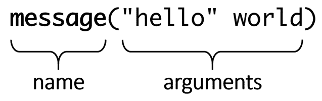
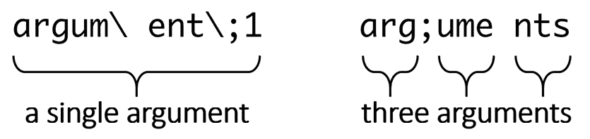
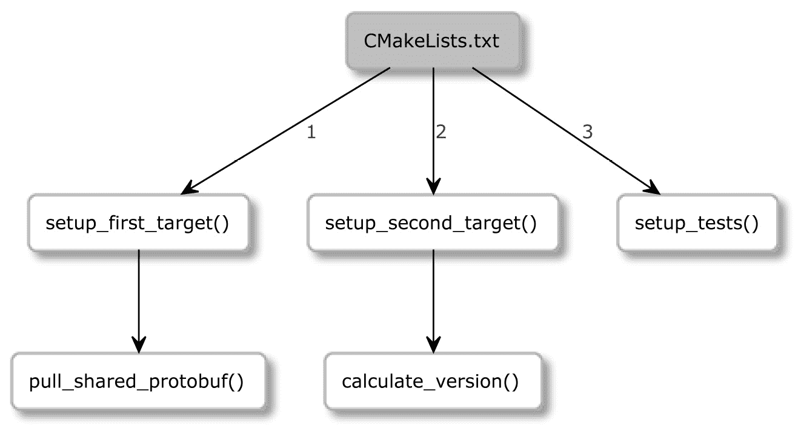

# 第二章：CMake 语言

在**CMake** **语言**中写作有点棘手。当你第一次阅读 CMake 列表文件时，你可能会觉得其中的语言如此简单，以至于不需要任何特殊培训或准备。接下来的内容经常是尝试引入变化和实验代码的实际尝试，而没有彻底理解它是如何工作的。我们程序员通常非常忙碌，并且过于热衷于用最小的投入解决任何与构建相关的问题。我们倾向于基于直觉进行更改，希望它们可能管用。解决技术问题的这种方法称为*巫术编程*。

CMake 语言看起来很简单：在我们完成小的添加、修复或黑客攻击，或者添加了一行代码之后，我们意识到有些事情不对劲。调试时间通常比实际研究主题的时间还要长。幸运的是，这不会是我们的命运——因为本章涵盖了实践中使用 CMake 语言所需的大部分关键知识。

在本章中，我们不仅将学习 CMake 语言的构建块——**注释**、**命令**、**变量**和**控制结构**，还将提供必要的背景知识，并在一个干净现代的 CMake 示例中尝试它们。CMake 让你处于一个独特的位置。一方面，你扮演着构建工程师的角色；你需要理解编译器、平台以及中间所有事物的复杂性。另一方面，你是一名开发者；你在编写生成构建系统的代码。编写好的代码是困难的，并要求同时思考多个层面——它应该能工作且容易阅读，但它也应该容易分析、扩展和维护。这正是我们将在这里讨论的内容。

最后，我们将介绍 CMake 中一些最有用和常见的命令。不经常使用的命令将放在*附录*部分（这将包括字符串、列表和文件操作命令的完整参考指南）。

在本章中，我们将涵盖以下主要主题：

+   CMake 语言基础语法

+   使用变量

+   使用列表

+   理解 CMake 中的控制结构

+   有用命令

# 技术要求

你可以在 GitHub 上找到本章中存在的代码文件：[`github.com/PacktPublishing/Modern-CMake-for-Cpp/tree/main/examples/chapter02`](https://github.com/PacktPublishing/Modern-CMake-for-Cpp/tree/main/examples/chapter02)。

为了构建本书中提供的示例，总是使用推荐的命令：

```cpp
cmake -B <build tree> -S <source tree>
cmake --build <build tree>
```

请确保将占位符`<build tree>`和`<source tree>`替换为适当的路径。作为提醒：**构建树**是目标/输出目录的路径，**源树**是您的源代码所在的路径。

# CMake 语言基础语法

编写 CMake 代码与编写其他命令式语言的代码非常相似：代码从上到下、从左到右执行，偶尔会进入一个被包含的文件或一个被调用的函数。根据模式（参见第一章中的*掌握命令行*部分，*CMake 的初学者指南*），执行从源树根文件（`CMakeLists.txt`）或作为一个参数传递给`cmake`的`.cmake`脚本文件开始。

正如我们在上一章中讨论的，脚本支持 CMake 语言的大部分（排除任何与项目相关的功能）。因此，它们是开始练习 CMake 语法的好方法，这就是为什么我们会在这里使用它们。在熟练编写基本列表文件之后，我们将在下一章开始准备实际的项目文件。如果你还记得，脚本可以用以下命令运行：

```cpp
cmake -P script.cmake
```

注意

CMake 支持`\n`或`\r\n`行结束。**UTF-8**支持可选的**字节顺序标记**（**BOMs**）的 CMake 版本 above 3.0，并且**UTF-16**在 CMake 版本 above 3.2 中得到支持。

CMake 列表文件中的所有内容要么是*命令调用*，要么是*注释*。

## 注释

就像在**C++**中一样，有两种注释——*单行*注释和*方括号* (*多行*)注释。但与 C++不同，方括号注释可以嵌套。让我给你展示一下语法：

```cpp
# single-line comments start with a hash sign "#"
# they can be placed on an empty line
message("Hi"); # or after a command like here.
#[=[ 
bracket comment
  #[[
    nested bracket comment
  #]]
#]=]
```

多行注释因其符号而得名——它们以一个开口方括号（`[`）开始，后面跟着任意数量的等号（`=`）和一个另一个方括号：`[=[`。要关闭方括号注释，请使用相同数量的等号，并像这样反转方括号：`]=]`。

在方括号标记前面加上`#`是可选的，允许你通过在方括号注释的第一行添加另一个`#`来快速禁用多行注释，像这样：

```cpp
##[=[ this is a single-line comment now
no longer commented
  #[[
    still, a nested comment
  #]]
#]=] this is a single-line comment now
```

那是个巧妙的技巧，但我们在 CMake 文件中什么时候以及如何使用注释呢？由于编写列表文件本质上是一种编程，因此最好也将我们最好的编程实践应用到它们上。遵循此类实践的代码通常被称为*干净*——这个术语多年来被软件开发大师如 Robert C. Martin, Martin Fowler，以及其他许多作者使用。认为有帮助和有害的东西常常激烈争论，正如你所猜的，注释也没有被排除在这些争论之外。

一切都应该根据具体情况来判断，但通常公认的指导原则说，好的注释至少提供以下之一：

+   **信息**：它们可以解释像正则表达式模式或格式化字符串这样的复杂性。

+   **意图**：它们可以在代码的实现或接口不明显时解释代码的意图。

+   **阐明**：它们可以解释难以重构或更改的概念。

+   **警告后果**：它们可以提供警告，尤其是关于可能破坏其他内容的代码。

+   **放大**：它们可以强调难以用代码表达的想法。

+   **法律条款**：它们可以添加这个必要的恶棍，这通常不是程序员的领域。

如果你可以，避免添加注释并采用更好的命名约定，或者重构或修正你的代码。如果你可以，避免添加以下类型的注释：

+   **强制**：这些是为了完整性而添加的，但它们并不是非常重要。

+   **冗余**：这些重复了代码中已经清晰写明的内容。

+   **误导**：如果它们没有跟随代码更改，它们可能是过时的或不正确的。

+   **日志**：这些记录了更改的内容和时间（使用**版本控制系统**代替）。

+   **分隔符**：这些用于标记章节。

不带注释编写优雅的代码很难，但它可以提高读者的体验。由于我们花在阅读代码上的时间比编写代码的时间多，我们总是应该努力*编写可读的代码*，而不仅仅是尝试快速编写它。我建议在本章末尾查看*进一步阅读*部分，那里有一些关于*整洁代码*的好参考资料。如果你对注释特别感兴趣，你会在其中一个 YouTube 视频中找到一个深入讨论这个主题的链接，这个视频是我关于这个主题的众多视频之一。

## 命令调用

是时候动手了！调用命令是 CMake 列表文件的核心。要执行一个命令，你必须提供其名称，后面跟着括号，其中你可以包含一个空格分隔的**命令参数**列表。



图 2.1 – 命令示例

命令名称不区分大小写，但 CMake 社区有一个约定，在命令名称中使用蛇形大小写（即，使用下划线连接的小写字母单词）。你也可以定义自己的命令，这部分将在本章的*理解 CMake 中的控制结构*部分进行介绍。

与 C++ 相比，特别引人注目的是 CMake 中的命令调用不是表达式。你不能将另一个命令作为参数传递给被调用的命令，因为*所有*括号内的内容都被解释为该命令的参数。

更加令人沮丧的是，CMake 命令在调用结束时不需要分号。这可能是因为源代码的每一行可以包含多达一个命令调用，后面可以跟一个可选的单行注释。或者，整个行必须是括号注释的一部分。所以，这些是唯一允许的格式：

```cpp
command(argument1 "argument2" argument3) # comment
[[ multiline comment ]] 
```

在括号注释后放置命令是不允许的：

```cpp
[[ bracket 
]] command()
```

在删除任何注释、空格和空行之后，我们得到一个命令调用的列表。这创造了一个有趣的视角——CMake 语法真的很简单，但这是一件好事吗？我们是如何处理变量的？或者，我们是如何指导执行流程的？

CMake 提供了这些操作以及更多命令。为了简化事情，我们将随着不同示例的推进介绍相关命令，并将它们分为三个类别：

+   **脚本命令**：这些命令始终可用，用于改变命令处理器的状态、访问变量，并影响其他命令和环境。

+   **项目命令**：这些命令在项目中可用，用于操作项目状态和构建目标。

+   **CTest 命令**：这些命令在 CTest 脚本中可用，用于管理测试。

在本章中，我们将介绍最有用的脚本命令（因为它们在项目中也非常有用）。项目和 CTest 命令将在我们引入与构建目标相关的概念（第三章，*设置你的第一个 CMake 项目*)和测试框架（第八章，*测试框架*）时讨论。

几乎每个命令都依赖于语言的其他元素才能正常工作：变量、条件语句，以及最重要的，命令行参数。让我们看看应该如何使用这些元素。

## 命令参数

许多命令需要用空格分隔的参数来指定它们的行为方式。正如你在*图 2.1*中看到的，引号周围的参数有些奇怪。一些参数有引号，而其他参数没有——这是怎么回事？

在底层，CMake 唯一能识别的数据类型是一个*字符串*。这就是为什么每个命令都期望其参数为零个或多个字符串。但是，普通的、静态的字符串并不非常有用，尤其是当我们不能嵌套命令调用时。参数就派上用场了——CMake 将评估每个参数为静态字符串，然后将它们传递给命令。*评估*意味着*字符串插值*，或将字符串的一部分替换为另一个值。这可以意味着替换*转义序列*，展开*变量引用*（也称为*变量插值*），以及解包*列表*。

根据上下文，我们可能需要启用这种评估。为此，CMake 提供了三种参数类型：

+   **方括号参数**

+   **引号参数**

+   **未引用的参数**

每种参数类型提供不同级别的评估，并且有一些小怪癖。

### 方括号参数

方括号参数不进行评估，因为它们用于将多行字符串作为单个参数传递给命令，而不做任何更改。这意味着它会包括制表符和换行符形式的空白。

这些参数的结构与注释完全一样——也就是说，它们以`[=[`开头，以`]=]`结尾，其中开头和结尾标记中的等号数量必须匹配（省略等号也是可以的，但它们仍然必须匹配）。与注释的区别在于，你不能嵌套方括号参数。

下面是使用此类参数与`message()`命令的一个例子，该命令将所有传递的参数打印到屏幕上：

chapter02/01-arguments/bracket.cmake

```cpp
message([[multiline
  bracket
  argument
]])
message([==[
  because we used two equal-signs "=="
  following is still a single argument:
  { "petsArray" = [["mouse","cat"],["dog"]] }
]==])
```

在上面的例子中，我们可以看到不同形式的括号参数。第一个省略了等号。注意把闭合标签放在单独一行上，在输出中会显示为一个空行：

```cpp
$ cmake -P chapter02/01-arguments/bracket.cmake
multiline
bracket
argument
  because we used two equal-signs "=="
  following is still a single argument:
  { "petsArray" = [["mouse","cat"],["dog"]] }
```

第二种形式在传递包含双括号（`]]`）的文本时很有用（在代码片段中突出显示），因为它们不会被解释为参数的结束标记。

这类括号参数的用途有限——通常，用来包含较长的文本块。在大多数情况下，我们需要一些更动态的内容，比如引号参数。

### 引号参数

引号参数类似于普通的 C++字符串——这些参数将多个字符（包括空格）组合在一起，并将展开*转义序列*。和 C++字符串一样，它们用双引号字符（`"`）打开和关闭，所以为了在输出字符串中包含一个引号字符，你必须用反斜杠（`\"`）进行转义。也支持其他一些著名的转义序列：`\\`表示一个字面反斜杠，`\t`是一个制表符，`\n`是一个换行符，`\r`是一个回车符。

这就是 C++字符串相似之处的结束。引号参数可以跨越多行，并且它们将插值变量引用。可以认为它们内置了`sprintf`函数从`std::format`中`${name}`。我们将在*使用变量*部分更多地讨论变量引用。

让我们尝试这些参数的实际应用：

chapter02/01-arguments/quoted.cmake

```cpp
message("1\. escape sequence: \" \n in a quoted argument")
message("2\. multi...
  line")
message("3\. and a variable reference: ${CMAKE_VERSION}")
```

你能猜到前面脚本的输出将有多少行吗？

```cpp
$ cmake -P chapter02/01-arguments/quoted.cmake
1\. escape sequence: "
 in a quoted argument
2\. multi...
line
3\. and a variable reference: 3.16.3
```

没错——我们有一个转义的引号字符，一个转义的换行符，和一个字面的换行符。它们都将被打印在输出中。我们还访问了内置的`CMAKE_VERSION`变量，我们可以在最后一行正确地看到它被插值。

### 未引用的参数

在编程世界中，最后一种参数确实比较少见。我们习惯了字符串要以某种方式进行分隔，例如，使用单引号、双引号或反斜杠。CMake 与这个约定不符，并引入了未引用的参数。我们可能会认为省略分隔符可以使代码更容易阅读，就像省略分号一样。这是真的吗？我会让你自己形成自己的看法。

未引用的参数评估*转义序列*和*变量引用*。然而，要小心分号（`;`），因为在 CMake 中，这被视为分隔符。CMake 会将包含它的参数拆分为多个参数。如果你需要使用它，用反斜杠（`\;`）转义它。这就是 CMake 如何管理列表的方式。我将在*使用列表*部分详细解释。

你可能会发现这些参数是最让人困惑的，所以这里有一个说明来帮助澄清这些参数是如何划分的：



](img/Figure_2.2_B17205.jpg)

图 2.2 – 转义序列导致分离的标记被解释为一个参数

问题

为什么一个值作为单个参数传递或多个参数传递会有区别？一些 CMake 命令需要特定数量的参数，并忽略任何开销。如果你的参数不小心被分开了，你会得到难以调试的错误。

未引用的参数不能包含未转义的引号（`"`）、散列（`#`）和反斜杠（`\`）。如果这些规则还不够难以记忆，圆括号（`()`）只能在它们形成正确、匹配的对时使用。也就是说，你将以一个开放圆括号开始，并在关闭命令参数列表之前关闭它。

让我们看看上面所有规则的一些例子：

chapter02/01-arguments/unquoted.cmake

```cpp
message(a\ single\ argument)
message(two arguments)
message(three;separated;arguments)
message(${CMAKE_VERSION})  # a variable reference
message(()()())            # matching parentheses 
```

上述代码的输出会是什么？让我们来看看：

```cpp
$ cmake -P chapter02/01-arguments/unquoted.cmake
a single argument
twoarguments
threeseparatedarguments
3.16.3
()()() 
```

即使是像 `message()` 这样的简单命令也非常在意分离的未引用参数：

+   在 `a single argument` 中的空格在显式转义时被正确打印。

+   然而，`twoarguments` 和 `threeseparatearguments` 被*粘*在一起，因为 `message()` 本身不会添加任何空格。

现在我们已经理解了如何处理 CMake 参数的复杂性和怪癖，我们准备迎接下一个有趣的话题——在 CMake 中处理各种*变量*。

# 在 CMake 中处理变量

CMake 中的变量是一个相当复杂的话题。不仅变量分为三种类别——普通、缓存和环境变量，而且它们还存在于不同的作用域中，有着特定的一套规则，一个作用域如何影响另一个作用域。在大多数情况下，对这些规则的误解成为错误和头痛的来源。我建议你仔细学习这一部分，并确保在继续之前理解了所有概念。

让我们先了解一些关于 CMake 变量的关键事实：

+   变量名是区分大小写的，并且几乎可以包含任何字符。

+   所有的变量内部都是以字符串的形式存储的，即使有些命令可以将它们解释为其他数据类型（甚至是列表！）。

+   CMake 的基本变量操作命令是 `set()` 和 `unset()`，但还有其他可以影响变量的命令，如 `string()` 和 `list()`。

要设置一个变量，我们只需调用 `set()`，提供其名称和值：

chapter02/02-variables/set.cmake

```cpp
set(MyString1 "Text1")
set([[My String2]] "Text2")
set("My String 3" "Text3")
message(${MyString1})
message(${My\ String2})
message(${My\ String\ 3})
```

正如你所看到的，括号和引号参数的使用允许在变量名中包含空格。然而，在稍后引用时，我们必须用反斜杠（`\`）转义空格。因此，建议变量名只使用字母数字字符、连字符（`-`）和下划线（`_`）。

还应避免以以下任何内容开头的保留名称（全部大写、全部小写或混合大小写）：`CMAKE_`、`_CMAKE_` 或下划线（`_`），后跟任何 CMake 命令的名称。

注意

`set()`命令接受一个普通文本变量名作为其第一个参数，但`message()`命令使用的是用`${}`语法包裹的变量引用。如果我们向`set()`命令提供一个用`${}`语法包裹的变量，会发生什么？为了回答这个问题，我们需要更好地理解变量引用。

要取消设置变量，我们可以使用以下方式：`unset(MyString1)`。

## 变量引用

我已经在*命令参数*部分简要提到了引用，因为它们对带引号和不带引号的参数进行评估。我们还了解到，要创建一个对已定义变量的引用，我们需要使用`${}`语法，如下所示：`message(${MyString1})`。

在评估时，CMake 将遍历作用域堆栈（我稍后会解释）并将`${MyString1}`替换为一个值，如果没有找到变量，则替换为一个空字符串（CMake 不会生成任何错误消息）。这个过程被称为*变量评估*、*展开*或*插值*。

这样的插值是逆向进行的。这意味着两件事：

+   如果遇到以下引用——`${MyOuter${MyInner}}`——CMake 将首先尝试评估`MyInner`，而不是搜索名为`MyOuter${MyInner}`的变量。

+   如果`MyInner`变量成功展开，CMake 将重复展开过程，直到无法进一步展开为止。

让我们考虑以下变量的示例：

+   `MyInner`带有`Hello`值

+   `MyOuter`带有`${My`值

如果我们调用`message("${MyOuter}Inner} World")`命令，我们将收到`Hello World`的输出，这是因为`${MyOuter}`被替换为字面值`${My`，与顶级值`Inner}`结合，创建了另一个变量引用——`${MyInner}`。

CMake 将进行这种展开到最大限度，然后才将结果值作为参数传递给命令。这就是为什么我们调用`set(${MyInner} "Hi")`时，我们实际上并没有改变`MyInner`变量，而是改变了`Hello`变量。CMake 展开`${MyInner}`为`Hello`，并将该字符串作为`set()`命令的第一个参数，并传递一个新的值，`Hi`。通常，这并不是我们想要的结果。

变量引用在变量类别方面的工作方式有些奇特，但总的来说，以下内容适用：

+   `${}`语法用于引用*普通*或*缓存*变量。

+   `$ENV{}`语法用于引用*环境*变量。

+   `$CACHE{}`语法用于引用*缓存*变量。

没错，使用`${}`，你可能会从一个类别或另一个类别中获取一个值。我将在*如何在 CMake 中正确使用变量作用域*部分解释这一点，但首先，让我们介绍一下其他类别的变量，以便我们清楚地了解它们是什么。

注意

请记住，您可以在`--`标记之后通过命令行向脚本传递参数。值将存储在`CMAKE_ARGV<n>`变量中，传递的参数数量将在`CMAKE_ARGC`变量中。

## 使用环境变量

这是最简单的变量类型。CMake 会复制启动`cmake`过程时使用的环境中的变量，并使它们在一个单独的全局作用域中可用。要引用这些变量，请使用`$ENV{<name>}`语法。

CMake 还允许您设置（`set()`）和取消设置（`unset()`）这些变量，但更改只会对运行中的`cmake`过程中的本地副本进行修改，而不会对实际系统环境进行修改；此外，这些更改不会对后续的构建或测试运行可见。

要修改或创建一个变量，请使用`set(ENV{<variable>} <value>)`命令，如下所示：

```cpp
set(ENV{CXX} "clang++")
```

要清除一个环境变量，请使用`unset(ENV{<variable>})`，如下所示：

```cpp
unset(ENV{VERBOSE})
```

请注意，有几个环境变量会影响 CMake 行为的不同方面。`CXX`变量是其中的一个——它指定了用于编译 C++文件的执行文件。我们将在本书中覆盖其他环境变量，因为它们将变得相关。完整的列表可以在文档中找到：

[`cmake.org/cmake/help/latest/manual/cmake-env-variables.7.html`](https://cmake.org/cmake/help/latest/manual/cmake-env-variables.7.html)

如果您将`ENV`变量作为命令的参数，它们的值将在构建系统的生成过程中进行插值。这意味着它们将被编织进构建树中，更改构建阶段的环境将没有任何效果。

例如，考虑以下项目文件：

chapter02/03-environment/CMakeLists.txt

```cpp
cmake_minimum_required(VERSION 3.20.0)
project(Environment)
message("generated with " $ENV{myenv})
add_custom_target(EchoEnv ALL COMMAND echo "myenv in build
  is" $ENV{myenv})
```

前面的示例有两个步骤：在配置阶段打印`myenv`环境变量，并通过`add_custom_target()`添加一个构建阶段，在构建过程中输出相同的变量。我们可以用一个 bash 脚本测试会发生什么，该脚本在配置阶段使用一个值，在构建阶段使用另一个值：

chapter02/03-environment/build.sh

```cpp
#!/bin/bash
export myenv=first
echo myenv is now $myenv
cmake -B build .
cd build
export myenv=second
echo myenv is now $myenv
cmake --build .
```

运行前面的代码清楚地显示，在配置阶段设置的值被持久到了生成的构建系统中：

```cpp
$ ./build.sh | grep -v "\-\-"
myenv is now first
generated with first
myenv is now second
Scanning dependencies of target EchoEnv
myenv in build is first
Built target EchoEnv
```

## 使用缓存变量

我们首先在第一章 *CMake 的初步步骤*中提到了缓存变量，当时是在讨论`cmake`的命令行选项。本质上，它们是存储在构建树中的`CMakeCache.txt`文件中的持久变量。它们包含在项目配置阶段收集的信息，既有来自系统的（编译器、链接器、工具等的路径），也有通过`CMakeCache.txt`文件来自用户的——它们只存在于*项目中*。

缓存变量可以用`$CACHE{<name>}`语法引用。

要设置一个缓存变量，请使用以下语法使用`set()`：

`set(<variable> <value> CACHE <type> <docstring> [FORCE])`

正如你所见，有一些新的必需参数（与正常变量的 `set()` 命令相比），它还引入了第一个关键字：`CACHE` 和 `FORCE`。

将 `CACHE` 指定为 `set()` 参数意味着我们打算改变在配置阶段提供的内容，并强制提供变量 `<type>` 和 `<docstring>` 值。这是因为这些变量可以由用户配置，GUI 需要知道如何显示它。以下类型被接受：

+   `BOOL`: 是/否的布尔值。GUI 将显示一个复选框。

+   `FILEPATH`: 磁盘上一个文件的路径。GUI 将打开一个文件对话框。

+   `PATH`: 磁盘上一个目录的路径。GUI 将打开一个目录对话框。

+   `STRING`: 一行文本。GUI 提供一个文本字段来填写。它可以被调用 `set_property(CACHE <variable> STRINGS <values>)` 的下拉控件替换。

+   `INTERNAL`: 一行文本。GUI 跳过内部条目。内部条目可用于在多次运行之间持久化存储变量。使用此类型隐式添加 `FORCE` 关键字。

`<docstring>` 值只是一个标签，它将由 GUI 在字段旁边显示，为用户提供关于此设置的更多详细信息。即使是 `INTERNAL` 类型也需要它。

设置缓存变量遵循与环境变量相同的规则，在某种程度上——值只在 CMake 的当前执行中覆盖。看这个例子：

```cpp
set(FOO "BAR" CACHE STRING "interesting value")
```

如果变量在缓存中存在，上述调用将没有永久效果。然而，如果值不在缓存中或者指定了可选的 `FORCE` 参数，该值将被持久化：

```cpp
set(FOO "BAR" CACHE STRING "interesting value" FORCE)
```

设置缓存变量有一些不明显的含义。也就是说，任何同名的正常变量都会被移除。我们在下一节中找出原因。

作为提醒，缓存变量也可以从命令行管理（查看 *第一章*，*CMake 的第一步* 中的适当部分）。

## 如何在 CMake 中正确使用变量作用域

**变量作用域** 可能是整个 CMake 语言概念中最难的部分。这可能是因为我们习惯于在支持命名空间和作用域操作符的更高级语言中是如何处理事情的。CMake 没有这些机制，所以它以自己 somewhat unusual 的方式处理这个问题。

为了澄清，作用域作为一个一般概念是为了将不同层次的抽象分离，以便当调用一个用户定义的函数时，函数中设置的变量是局部的。这些*局部*变量即使与*全局*变量的名称完全相同，也不会影响全局作用域。如果明确需要，函数应该对全局变量也有读/写权限。这种变量的分离（或作用域）必须在多个层面上工作——当一个函数调用另一个函数时，相同的分离规则适用。

CMake 有两个作用域：

+   执行`function()`

+   在嵌套目录中执行的`CMakeLists.txt`清单文件从`add_subdirectory()`命令开始

我们将在本书稍后介绍前面的命令，但首先，我们需要了解作用域概念是如何实现的。当创建一个嵌套作用域时，CMake 简单地用当前作用域的所有变量的副本填充它。随后的命令将影响这些副本。但一旦嵌套作用域的执行完成，所有的副本都被删除，并恢复原始的父作用域。

让我们考虑以下场景：

1.  父作用域将`VAR`变量设置为`ONE`。

1.  嵌套作用域开始，并将`VAR`打印到控制台。

1.  `VAR`变量被设置为`TWO`，并将`VAR`打印到控制台。

1.  嵌套作用域结束，并将`VAR`打印到控制台。

控制台的输出将如下所示：`ONE`，`TWO`，`ONE`。这是因为嵌套作用域结束后，复制的`VAR`变量被丢弃。

在 CMake 中作用域的概念如何工作有着有趣的暗示，这在其他语言中并不常见。如果你在一个嵌套作用域中执行时取消设置（`unset()`）了在父作用域中创建的变量，它将消失，但仅在嵌套作用域中。当嵌套作用域完成后，变量会恢复到其原来的值。

这让我们想到了变量引用和`${}`语法的的行为。无论何时我们尝试访问普通变量，CMake 都会从当前作用域搜索变量，如果定义了这样一个名字的变量，它会返回它的值。到目前为止，一切都好。然而，当 CMake 找不到这个名字的变量（例如，如果它不存在或被取消设置（`unset()`）），它将搜索缓存变量，并在找到匹配项时返回那里的值。

如果在嵌套作用域中调用`unset()`，这可能是一个潜在的陷阱。取决于我们引用那个变量的位置——在内部还是外部作用域——我们将访问缓存或原始值。

但如果我们真的需要在调用（父）作用域中更改变量，该怎么办呢？CMake 有一个`PARENT_SCOPE`标志，你可以在`set()`和`unset()`命令的末尾添加：

```cpp
set(MyVariable "New Value" PARENT_SCOPE)
unset(MyVariable PARENT_SCOPE) 
```

这个变通方法有点局限，因为它不允许访问超过一级的变量。值得注意的是，使用`PARENT_SCOPE`并不会改变当前作用域中的变量。

让我们看看实际中变量作用域是如何工作的，并考虑以下示例：

chapter02/04-scope/CMakeLists.txt

```cpp
function(Inner)
  message("  > Inner: ${V}")
  set(V 3)
  message("  < Inner: ${V}")
endfunction()
function(Outer)
  message(" > Outer: ${V}")
  set(V 2)
  Inner()
  message(" < Outer: ${V}")
endfunction()
set(V 1)
message("> Global: ${V}")
Outer()
message("< Global: ${V}")
```

我们将全局变量`V`设置为`1`，然后调用`Outer`函数；然后将`V`设置为`2`并调用`Inner`函数，然后将`V`设置为`3`。在每一步之后，我们都将变量打印到控制台：

```cpp
> Global: 1
 > Outer: 1
  > Inner: 2
  < Inner: 3
 < Outer: 2
< Global: 1
```

如我们之前解释的，当我们深入函数时，变量值会被复制到嵌套作用域中，但当我们退出作用域时，它们的原始值会被恢复。

如果我们更改`Inner`函数的`set()`命令以在父级作用域中操作：`set(V 3 PARENT_SCOPE)`，输出会是什么？

```cpp
> Global: 1
 > Outer: 1
  > Inner: 2
  < Inner: 2
 < Outer: 3
< Global: 1
```

我们影响了`Outer`函数的作用域，但没有影响`Inner`函数或全局作用域！

正如 CMake 文档中提到的，CMake 脚本在单个目录作用域中绑定变量（这有点冗余，因为唯一有效地创建目录作用域的命令，`add_subdirectory()`，在脚本中不允许）。

由于所有变量都存储为字符串，CMake 不得不采取更具创意的方法来处理更复杂的数据结构，如*列表*。

# 使用列表

要存储`;`)作为分隔符：`a;list;of;5;elements`。您可以在元素中用反斜杠转义分号：`a\;single\;element`。

要创建一个列表，我们可以使用`set()`命令：`set(myList a list of five elements)`。由于列表的存储方式，以下命令将具有完全相同的效果：

+   `set(myList "a;list;of;five;elements")`

+   `set(myList a list "of;five;elements")`

CMake 会自动在未引用的参数中解包列表。通过传递一个未引用的`myList`引用，我们实际上向命令发送了更多参数：

```cpp
message("the list is:" ${myList}) 
```

`message()`命令将接收六个参数："`the list is:`"，"`a`"，"`list`"，"`of`"，"`five`"，"`elements`"。这将导致意想不到的后果，因为输出将不带任何额外空格打印参数之间：

```cpp
the list is:alistoffiveelements
```

正如你所看到的，这是一个非常简单的机制，应该谨慎使用。

CMake 提供了一个`list()`命令，该命令提供了许多子命令来读取、搜索、修改和排序列表。以下是一个简要总结：

```cpp
list(LENGTH <list> <out-var>)
list(GET <list> <element index> [<index> ...] <out-var>)
list(JOIN <list> <glue> <out-var>)
list(SUBLIST <list> <begin> <length> <out-var>)
list(FIND <list> <value> <out-var>)
list(APPEND <list> [<element>...])
list(FILTER <list> {INCLUDE | EXCLUDE} REGEX <regex>)
list(INSERT <list> <index> [<element>...])
list(POP_BACK <list> [<out-var>...])
list(POP_FRONT <list> [<out-var>...])
list(PREPEND <list> [<element>...])
list(REMOVE_ITEM <list> <value>...)
list(REMOVE_AT <list> <index>...)
list(REMOVE_DUPLICATES <list>)
list(TRANSFORM <list> <ACTION> [...])
list(REVERSE <list>)
list(SORT <list> [...])
```

大多数时候，我们实际上并不需要在项目中使用列表。然而，如果你发现自己处于这种方便的概念的罕见情况，你会在*附录*部分找到`list()`命令的更深入的参考。

现在我们已经知道如何处理各种变量和列表，让我们将重点转移到控制执行流程上，并了解 CMake 中可用的控制结构。

# 了解 CMake 中的控制结构

在 CMake 语言中，**控制结构**是不可或缺的！与 everything else 一样，它们以命令的形式提供，并分为三个类别：**条件块**、**循环**和**命令定义**。控制结构在脚本中执行，在项目构建系统生成期间也执行。

## 条件块

CMake 支持的唯一条件块是谦逊的`if()`命令。所有条件块都必须用`endif()`命令关闭，它们可能有任意数量的`elseif()`命令和一个可选的`else()`命令，顺序如下：

```cpp
if(<condition>)
  <commands>
elseif(<condition>) # optional block, can be repeated
  <commands>
else()              # optional block
  <commands>
endif()
```

像许多其他命令式语言一样，`if()`-`endif()`块控制哪些命令集将被执行：

+   如果`if()`命令中指定的`<条件>`表达式满足，将执行第一个部分。

+   否则，CMake 将执行本块中第一个满足其条件的`elseif()`命令所属的部分中的命令。

+   如果没有这样的命令，CMake 将检查是否提供了`else()`命令并执行该代码部分的任何命令。

+   如果上述条件都不满足，执行将继续`endif()`命令之后进行。

提供的`<条件>`表达式根据一个非常简单的语法进行评估。

### 条件命令的语法

对于`if()`、`elseif()`和`while()`命令，相同的语法是有效的。

#### 逻辑运算符

`if()`条件支持`NOT`、`AND`和`OR`逻辑运算符：

+   `NOT <条件>`

+   `<条件> AND <条件>`

+   `<条件> OR <条件>`

此外，条件的嵌套是可能的，匹配的括号对（`()`）。像所有体面的语言一样，CMake 语言尊重评估的顺序，并从最内层的括号开始：

+   `(<条件>) AND (<条件> OR (<条件>))`

#### 字符串和变量的评估

由于历史原因（因为变量引用（`${}`）语法并非一直存在），CMake 会尝试将*未引用的参数*评估为变量引用。换句话说，在条件中使用普通的变量名（例如，`VAR`）等同于写`${VAR}`。下面是一个供你考虑的示例和一个*陷阱*：

```cpp
set(VAR1 FALSE)
set(VAR2 "VAR1")
if(${VAR2})
```

`if()`条件在这里有点复杂——首先，它会评估`${VAR2}`为`VAR1`，这是一个已知的变量，进而将其评估为`FALSE`字符串。字符串只有等于以下常量之一时才被认为是布尔真（这些比较不区分大小写）：

+   `ON`、`Y`、`YES`或`TRUE`

+   非零数字

这使我们得出结论，前一个示例中的条件将评估为假。

然而，这里还有一个陷阱——一个未引用的参数的条件评估会怎样，这个参数的名称包含一个值为`BAR`的变量呢？考虑以下代码示例：

```cpp
set(FOO BAR)
if(FOO)
```

根据我们迄今为止的说法，这将是`false`，因为`BAR`字符串不符合评估为布尔`true`值的准则。不幸的是，这不是事实，因为 CMake 在未引用的变量引用方面做出了例外。与引号引用的参数不同，`FOO`不会被评估为`BAR`以产生`if("BAR")`语句（这将是`false`）。相反，CMake 只会评估`if(FOO)`为`false`，如果它是以下常量之一（这些比较不区分大小写）：

+   `OFF`，`NO`，`FALSE`，`N`，`IGNORE`，`NOTFOUND`

+   以`-NOTFOUND`结尾的字符串

+   空字符串

+   零

所以，简单地询问一个未定义的变量将被评估为`false`：

```cpp
if (FOO)
```

然而，事先定义一个变量会改变情况，条件被评估为`true`：

```cpp
set(FOO "FOO")
if (FOO)
```

注意

如果你认为未引用的参数的行为令人困惑，请将变量引用用引号引起来：`if ("${FOO}")`。这将导致在提供的参数传递到`if()`命令之前先评估参数，行为将与字符串的评估一致。

换句话说，CMake 假设用户询问变量是否定义（并且不是显式`false`）。幸运的是，我们可以明确地检查这一点（而不必担心内部值）：

```cpp
if(DEFINED <name>)
if(DEFINED CACHE{<name>})
if(DEFINED ENV{<name>})
```

#### 比较值

比较操作支持以下操作符：

`EQUAL`，`LESS`，`LESS_EQUAL`，`GREATER`，和`GREATER_EQUAL`

它们可以用来比较数字值，如下所示：

```cpp
if (1 LESS 2) 
```

注意

根据 CMake 文档，如果操作数之一不是数字，值将是`false`。但实际实验表明，以数字开头的字符串比较工作正确：`if (20 EQUALS "20 GB")`。

你可以通过给任何操作符添加`VERSION_`前缀，按照`major[.minor[.patch[.tweak]]]`格式比较软件版本：

```cpp
if (1.3.4 VERSION_LESS_EQUAL 1.4)
```

省略的组件被视为零，非整数版本组件在比较字符串时截断。

对于*字典顺序*的字符串比较，我们需要在操作符前加上`STR`前缀（注意没有下划线）：

```cpp
if ("A" STREQUAL "${B}")
```

我们经常需要比简单相等比较更高级的机制。幸运的是，CMake 也支持`MATCHES`操作符，如下所示：

`<变量名|字符串> MATCHES <正则表达式>`

任何匹配的组都捕获在`CMAKE_MATCH_<n>`变量中。

#### 简单检查

我们已经提到了一个简单的检查，`DEFINED`，但还有其他简单的返回`true`如果条件满足的检查。

我们可以检查以下内容：

+   如果值在列表中：`<变量名|字符串> IN_LIST <变量名>`

+   如果一个命令可以被调用：`COMMAND <命令名>`

+   如果存在 CMake 策略：`POLICY <策略 ID>`（这在第三章中有介绍，*设置你的第一个 CMake 项目*)

+   如果一个 CTest 测试是用`add_test()`添加的：`TEST <测试名称>`

+   如果定义了一个构建目标：`TARGET <目标名称>`

我们将在第四章，《使用目标》中探索构建目标，但现在，让我们说目标是为项目创建的逻辑构建过程中的单位，该项目已经调用了`add_executable()`、`add_library()`或`add_custom_target()`命令。

#### 检查文件系统

CMake 提供了许多处理文件的方法。我们很少需要直接操作它们，通常我们更愿意使用高层次的方法。为了参考，本书将在附录部分提供一个简短的与文件相关的命令列表。但大多数时候，只需要以下操作符（对于绝对路径的行为定义得很清楚）：

+   `EXISTS <path-to-file-or-directory>`：检查文件或目录是否存在

这解决了符号链接（如果符号链接的目标存在，则返回`true`）。

+   `<file1> IS_NEWER_THAN <file2>`：检查哪个文件更新

如果`file1`比（或等于）`file2`新，或者这两个文件中的一个不存在，则返回`true`。

+   `IS_DIRECTORY path-to-directory`：检查一个路径是否是目录

+   `IS_SYMLINK file-name`：检查一个路径是否是符号链接

+   `IS_ABSOLUTE path`：检查一个路径是否是绝对的

## 循环

CMake 中的循环相当直接——我们可以使用`while()`或`foreach()`来反复执行相同的命令集。这两个命令都支持循环控制机制：

+   `break()`循环停止剩余块的执行，并从外层循环中断。

+   `continue()`循环停止当前迭代的执行，并从下一个开始。

### 当

循环块用`while()`命令打开，用`endwhile()`命令关闭。只要`while()`中提供的`<condition>`表达式为`true`，任何包含的命令都将执行。表述条件的语法与`if()`命令相同：

```cpp
while(<condition>)
  <commands>
endwhile()
```

你可能猜到了——通过一些额外的变量——`while`循环可以替代`for`循环。实际上，使用`foreach()`循环要容易得多——让我们来看看。

### foreach 循环

foreach 块有几个变体，为每个值执行包含的命令。与其他块一样，它有`foreach()`和`endforeach()`命令。

`foreach()`的最简单形式旨在提供 C++风格的`for`循环：

```cpp
foreach(<loop_var> RANGE <max>)
  <commands>
endforeach()
```

CMake 将从`0`迭代到`<max>`（包括）。如果我们需要更多的控制，可以使用第二种变体，提供`<min>`、`<max>`，可选地提供`<step>`。所有参数必须是非负整数。此外，`<min>`必须小于`<max>`：

```cpp
foreach(<loop_var> RANGE <min> <max> [<step>])
```

然而，当它处理列表时，`foreach()`显示了它的真正颜色：

```cpp
foreach(<loop_variable> IN [LISTS <lists>] [ITEMS <items>])
```

CMake 将取所有提供的`<lists>`列表变量的元素，然后是所有明确声明的`<items>`值，并将它们存储在`<loop variable>`中，一次执行`<commands>`中的每一个项目。你可以选择只提供列表、只提供值，或者两者都提供：

chapter02/06-loops/foreach.cmake

```cpp
set(MY_LIST 1 2 3)
foreach(VAR IN LISTS MY_LIST ITEMS e f)
  message(${VAR})
endforeach()
```

上述代码将输出以下内容：

```cpp
1
2
3
e
f
```

或者，我们可以使用简短版本（省略 `IN` 关键字）得到相同的结果：

```cpp
foreach(VAR 1 2 3 e f)
```

从版本 3.17 开始，`foreach()` 学会了如何压缩列表（`ZIP_LISTS`）：

```cpp
foreach(<loop_var>... IN ZIP_LISTS <lists>)
```

压缩列表意味着简单地遍历多个列表，并对具有相同索引的相应项目进行操作。让我们看一个例子：

chapter02/06-loops/foreach.cmake

```cpp
set(L1 "one;two;three;four")
set(L2 "1;2;3;4;5")
foreach(num IN ZIP_LISTS L1 L2)
    message("num_0=${num_0}, num_1=${num_1}")
endforeach()
```

CMake 将为每个提供的列表创建一个 `num_<N>` 变量，并填充每个列表的项目。您可以传递多个 `<loop_var>` 变量名（每个列表一个），每个列表将使用单独的变量存储其项目：

```cpp
foreach(word num IN ZIP_LISTS L1 L2)
    message("word=${word}, num=${num}")
```

如果列表之间的项数不同，CMake 不会为较短的列表定义变量。

所以，关于*循环*的内容就讲到这里。

## 命令定义

定义自己的命令有两种方法：可以使用 `macro()` 命令或 `function()` 命令。解释这些命令之间的区别最简单的方式是通过将它们与 C 语言风格的预处理器宏和实际的 C++函数进行比较：

+   `macro()` 命令更像是一个查找和替换指令，而不是实际的子程序调用，如 `function()`。与函数相反，宏不会在调用栈上创建一个单独的条目。这意味着在宏中调用 `return()` 将会返回到比函数中的 `return()` 高一个级别的调用语句（如果我们在最外层作用域中，可能会导致执行终止）。

+   `function()` 命令为局部变量创建了一个单独的作用域，与 `macro()` 命令在工作域中的调用者不同。这可能会导致混淆的结果。我们在下一节讨论这些细节。

这两种方法都接受可以在命令块内部命名和引用的参数。此外，CMake 允许您使用以下引用访问在命令调用中传递的参数：

+   `${ARGC}`：参数的数量

+   `${ARGV}`：所有参数的列表

+   `${ARG0}`、`${ARG1}`、`${ARG2}`：特定索引处的参数值

+   `${ARGN}`: 传递给调用者的一些匿名参数，在最后一个预期参数之后

使用索引访问超出 `ARGC` 范围的数字参数是未定义行为。

如果您决定定义一个带有命名参数的命令，每个调用都必须传递它们全部，否则它将是无效的。

### 宏

定义宏与其他块类似：

```cpp
macro(<name> [<argument>…])
  <commands>
endmacro()
```

在此声明之后，我们可以通过调用其名称来执行我们的宏（函数调用不区分大小写）。

以下示例突出了宏中变量作用域的所有问题：

chapter02/08-definitions/macro.cmake

```cpp
macro(MyMacro myVar)
  set(myVar "new value")
  message("argument: ${myVar}")
endmacro()
set(myVar "first value")
message("myVar is now: ${myVar}")
MyMacro("called value")
message("myVar is now: ${myVar}")
```

以下是此脚本的输出：

```cpp
$ cmake -P chapter02/08-definitions/macro.cmake
myVar is now: first value
argument: called value
myVar is now: new value
```

发生了什么事？尽管明确将 `myVar` 设置为 `new value`，但它并没有影响 `message("argument: ${myVar}")` 的输出！这是因为传递给宏的参数不是作为真正的变量处理，而是作为常数的查找和替换指令。

另一方面，全局作用域中的 `myVar` 变量从 `first value` 变为了 `new value`。这种行为被称为 *副作用*，并且被认为是坏实践，因为不阅读宏就很难知道哪个变量可能会受到此类宏的影响。

我建议尽可能多地使用函数，因为这可能会节省你很多头疼的问题。

### 函数

要声明一个命令作为一个函数，请使用以下语法：

```cpp
function(<name> [<argument>…])
  <commands>
endfunction()
```

一个函数需要一个名称，可选地接受一个预期参数的名称列表。如果函数调用传递的参数比声明的参数多，多余的参数将被解释为匿名参数并存储在 `ARGN` 变量中。

如前所述，函数打开它们自己的作用域。你可以调用 `set()`，提供函数的一个命名参数，任何更改都仅限于函数内部（除非指定了 `PARENT_SCOPE`，正如我们在 *如何在 CMake 中正确使用变量作用域* 部分讨论的那样）。

函数遵循调用栈的规则，通过 `return()` 命令返回调用作用域。

CMake 为每个函数设置了以下变量（这些变量自 3.17 版本以来一直可用）：

+   `CMAKE_CURRENT_FUNCTION`

+   `CMAKE_CURRENT_FUNCTION_LIST_DIR`

+   `CMAKE_CURRENT_FUNCTION_LIST_FILE`

+   `CMAKE_CURRENT_FUNCTION_LIST_LINE`

让我们在实际中看看这些函数变量：

chapter02/08-definitions/function.cmake

```cpp
function(MyFunction FirstArg)
  message("Function: ${CMAKE_CURRENT_FUNCTION}")
  message("File: ${CMAKE_CURRENT_FUNCTION_LIST_FILE}")
  message("FirstArg: ${FirstArg}")
  set(FirstArg "new value")
  message("FirstArg again: ${FirstArg}")
  message("ARGV0: ${ARGV0} ARGV1: ${ARGV1} ARGC: ${ARGC}")
endfunction()
set(FirstArg "first value")
MyFunction("Value1" "Value2")
message("FirstArg in global scope: ${FirstArg}")
```

这会打印出以下输出：

```cpp
Function: MyFunction
File: /root/examples/chapter02/08-definitions/function.cmake
FirstArg: Value1
FirstArg again: new value
ARGV0: Value1 ARGV1: Value2 ARGC: 2
FirstArg in global scope: first value
```

正如你所看到的，函数的一般语法和概念与宏非常相似，但这次——它实际上起作用了。

### CMake 中的过程式范例

让我们假设一下，我们想要以与在 C++ 中编写程序相同的方式编写一些 CMake 代码。我们将创建一个 `CMakeLists.txt` 列表文件，它将调用三个定义的命令，这些命令可能还会调用它们自己的定义命令：



](img/Figure_2.3_B17205.jpg)

图 2.3 – 过程式调用图

在 CMake 中以这种过程式风格编写代码有点问题——你被迫提供你计划使用的命令定义。CMake 解析器别无选择。你的代码可能看起来像这样：

```cpp
cmake_minimum_required(...)
project(Procedural)
function(pull_shared_protobuf)
function(setup_first_target)
function(calculate_version)
function(setup_second_target)
function(setup_tests)
setup_first_target()
setup_second_target()
setup_tests()
```

多么噩梦般的场景！一切都被颠覆了！这段代码非常难以阅读，因为最微小的细节都放在了文件的最顶部。一段正确结构的代码首先在第一个子程序中列出最一般的步骤，然后提供稍微详细一些的子程序，并将最详细的步骤推到最后一个文件。

这个问题有解决方案：将命令定义移动到其他文件并将作用域分区到目录之间（将在 第三章 中详细解释，*设置你的第一个 CMake 项目*）。但还有一个简单而优雅的解决方案：在文件顶部声明一个入口点宏，并在文件的最后调用它：

```cpp
macro(main)
function(...) # key steps
function(...) # details
function(...) # fine details
main()
```

采用这种方法，我们的代码是以逐渐缩小的范围编写的，并且因为我们实际上直到最后才调用`main()`宏，所以 CMake 不会抱怨未定义命令的执行！

最后一个问题依然存在——为什么要在宏上而不是推荐函数上使用？在这种情况下，无限制访问全局变量是好的，由于我们没有向`main()`传递任何参数，所以我们不需要担心常见的警告。

你可以在本书 GitHub 仓库中的`chapter-02/09-procedural/CMakeLists.txt`清单文件中找到这个概念的一个简单示例。

### 关于命名约定的一点说明

在软件开发中，命名是以著称困难的，尽管如此，维持一个易于阅读和理解解决方案仍然非常重要。在 CMake 脚本和项目方面，我们应该遵循*干净代码*方法的规则，就像在任何一个软件开发解决方案方面一样：

+   遵循一致的命名风格（在 CMake 社区中，`snake_case`是被接受的标准化风格）。

+   使用简短而有意义的名称（例如，避免`func()`、`f()`等）。

+   避免在你的命名中使用双关语和机智。

+   使用可以发音、可搜索的名称，不需要进行心智映射。

既然我们已经知道如何正确地使用正确的语法调用命令，那么让我们来探讨哪些命令最初对我们最有益。

# 有用命令

CMake 提供了许多脚本命令，允许你与变量和环境交互。其中一些在*附录*部分有广泛的覆盖，例如`list()`、`string()`和`file()`（我们在这里解释这些命令，并在主章节集中精力于项目）。其他的，如`find_...()`，更适合在讨论管理依赖的章节中。在本节中，我们将简要介绍对脚本最有用的命令。

## `message()`命令

我们已经知道并喜欢我们可靠的`message()`命令，它将文本打印到标准输出。然而，它的内涵远不止所见。通过提供一个`MODE`参数，你可以自定义输出的样式，在出错的情况下，你可以停止代码的执行：`message(<MODE> "text")`。

已识别的模式如下：

+   `FATAL_ERROR`：这会停止处理和生成。

+   `SEND_ERROR`：这会继续处理，但跳过生成。

+   `WARNING`：这会继续处理。

+   `AUTHOR_WARNING`：CMake 警告。这会继续处理。

+   `DEPRECATION`：如果启用了`CMAKE_ERROR_DEPRECATED`或`CMAKE_WARN_DEPRECATED`变量，这将相应地工作。

+   `NOTICE`或省略模式（默认）：这会在`stderr`上打印一条消息，以吸引用户的注意。

+   `STATUS`：这会继续处理，并且建议用于主要用户信息。

+   `VERBOSE`：这会继续处理，通常用于不必要太详细的更多信息。

+   `DEBUG`：这会继续处理，并且应该包含在项目出现问题时可能有助于解决问题的任何详细信息。

+   `TRACE`：这会继续处理，并且在项目开发期间推荐打印消息。通常，这类消息在发布项目之前会被删除。

以下示例在第一条消息后停止执行：

chapter02/10-useful/message_error.cmake

```cpp
message(FATAL_ERROR "Stop processing")
message("Won't print this.")
```

这意味着将根据当前日志级别（默认是`STATUS`）打印消息。我们在上一章的*调试和跟踪选项*部分讨论了如何更改此设置。在那部分，我承诺要谈论使用`CMAKE_MESSAGE_CONTEXT`进行调试，所以让我们开始吧。从那时起，我们已经了解了这个谜题的三个重要部分：列表、作用域和函数。

当我们启用一个命令行标志，`cmake --log-context`，我们的消息将被点分隔的上下文装饰，并存储在`CMAKE_MESSAGE_CONTEXT`列表中。考虑以下示例：

chapter02/10-useful/message_context.cmake

```cpp
function(foo)
  list(APPEND CMAKE_MESSAGE_CONTEXT "foo")
  message("foo message")
endfunction()
list(APPEND CMAKE_MESSAGE_CONTEXT "top")
message("Before `foo`")
foo()
message("After `foo`")
```

前面脚本的输出将如下所示：

```cpp
$ cmake -P message_context.cmake --log-context
[top] Before `foo`
[top.foo] foo message
[top] After `foo`
```

函数的初始作用域是从父作用域中复制的（父作用域中已经有一个列表项：`top`）。`foo`中的第一条命令向`CMAKE_MESSAGE_CONTEXT`中添加了一个新项，该项带有`foo`函数名称。打印消息，函数作用域结束，丢弃本地复制的变量，并恢复之前的范围（不包含`foo`）。

这种方法在非常复杂的项目中有很多嵌套函数时非常有用。希望您永远不需要它，但我觉得这是一个非常好的例子，展示了函数作用域在实际中是如何工作的。

`message()`的另一个酷炫技巧是向`CMAKE_MESSAGE_INDENT`列表中添加缩进（与`CMAKE_MESSAGE_CONTEXT`完全相同的方式）：

```cpp
list(APPEND CMAKE_MESSAGE_INDENT "  ")
```

我们脚本的输出可以变得更加整洁：

```cpp
Before `foo`
  foo message
After `foo`
```

由于 CMake 没有提供任何真正的带有断点或其他工具的调试器，因此在事情并不完全按计划进行时，生成干净的日志消息功能非常方便。

## `include()`命令

我们可以将 CMake 代码分割到单独的文件中，以保持事物有序，嗯，*分离*。然后，我们可以通过调用`include()`从父列表文件中引用它们，如下例所示：

```cpp
include(<file|module> [OPTIONAL] [RESULT_VARIABLE <var>])
```

如果我们提供一个文件名（带有`.cmake`扩展名的路径），CMake 将尝试打开并执行它。请注意，不会创建嵌套的独立作用域，因此在该文件中对变量的任何更改都将影响调用作用域。

CMake 如果文件不存在将抛出一个错误，除非我们使用`OPTIONAL`关键字指定它是可选的。如果我们需要知道`include()`是否成功，我们可以提供带有变量名称的`RESULT_VARIABLE`关键字。在成功时，它将填充包含成功包含的文件的完整路径，或在失败时（`NOTFOUND`）不包含。

当以脚本模式运行时，任何相对路径都将从当前工作目录解析。要强制在脚本本身的关系中搜索，请提供一个绝对路径：

```cpp
include("${CMAKE_CURRENT_LIST_DIR}/<filename>.cmake") 
```

如果我们没有提供路径，但是提供了模块的名称（不带`.cmake`或其他），CMake 将尝试查找模块并将其包含进来。CMake 将在`CMAKE_MODULE_PATH`中搜索名为`<模块>.cmake`的文件，然后在其模块目录中搜索。

## `include_guard()`命令

当我们包含具有副作用的文件时，我们可能希望限制它们，使它们只被包含一次。这就是`include_guard([DIRECTORY|GLOBAL])`发挥作用的地方。

将`include_guard()`放在被包含文件的顶部。当 CMake 首次遇到它时，它将在当前作用域中记录这一事实。如果文件再次被包含（也许是因为我们无法控制我们项目中的所有文件），它将不再被进一步处理。

如果我们想要防止在不相关的函数作用域中包含，这些作用域不会共享变量，我们应该提供`DIRECTORY`或`GLOBAL`参数。正如这些名称所暗示的，`DIRECTORY`关键字将在当前目录及其子目录内应用保护，而`GLOBAL`关键字将对整个构建过程应用保护。

## `file()`命令

为了让您了解您可以用 CMake 脚本做什么，让我们快速浏览一下文件操作命令的最有用变体：

```cpp
file(READ <filename> <out-var> [...])
file({WRITE | APPEND} <filename> <content>...)
file(DOWNLOAD <url> [<file>] [...])
```

简而言之，`file()`命令将让您以系统无关的方式读取、写入和传输文件，以及与文件系统、文件锁、路径和存档进行交互。请参阅*附录*部分以获取更多详细信息。

## `execute_process()`命令

时不时地，您需要使用系统可用的工具（毕竟，CMake 主要是构建系统生成器）。CMake 为此提供了一个命令：您可以使用`execute_process()`来运行其他进程并收集它们的输出。这个命令非常适合脚本，也可以在配置阶段项目中使用。以下是该命令的一般形式：

```cpp
execute_process(COMMAND <cmd1> [<arguments>]… [OPTIONS])
```

CMake 将使用操作系统的 API 来创建子进程（因此，像`&&`，`||`和`>`这样的 shell 操作符将不起作用）。然而，您仍然可以通过多次提供`COMMAND <命令> <参数>`参数来链接命令，并将一个的输出传递给另一个。

可选地，您可以使用`TIMEOUT <秒>`参数来终止进程，如果它没有在规定的时间内完成任务，并且您可以根据需要设置`WORKING_DIRECTORY <目录>`。

所有任务的退出代码可以通过提供`RESULTS_VARIABLE <变量>`参数来收集在列表中。如果您只对最后执行的命令的结果感兴趣，请使用单数形式：`RESULT_VARIABLE <变量>`。

为了收集输出，CMake 提供了两个参数：`OUTPUT_VARIABLE`和`ERROR_VARIABLE`（这两个参数用法相似）。如果您想合并`stdout`和`stderr`，请为这两个参数使用同一个变量。

记住，当为其他用户编写项目时，您应该确保您打算使用的命令在您声称支持的平台上是可用的。

# 总结

本章打开了使用 CMake 进行实际编程的大门——你现在能够编写伟大的、富有信息性的注释和调用内置命令，并理解如何正确地为它们提供各种参数。这个知识本身将帮助您理解 CMake 列表文件中您可能在其他项目中看到的异常语法。

接下来，我们讲解了 CMake 中的变量——具体来说，是如何引用、设置和取消设置普通、缓存和环境变量。我们深入探讨了目录和函数作用域是如何工作的，并讨论了与嵌套作用域相关的问题（及其解决方法）。

我们还讲解了列表和控制结构。我们讨论了条件的语法、它们的逻辑操作、未引用参数的评估以及字符串和变量。我们学习了如何比较值、进行简单检查以及查看系统文件的状态。这使我们能够编写条件块和 while 循环。在谈论循环的时候，我们也掌握了 foreach 循环的语法。

我相信了解如何使用宏和函数语句定义自己的命令将帮助您以更程序化的风格编写更干净的代码。我们还分享了一些关于如何更好地组织代码和提出更易读名称的想法。

最后，我们正式介绍了`message()`命令及其多个日志级别。我们还学习了如何分割和包含列表文件，发现了几种其他有用的命令。我相信有了这些材料，我们准备好迎接下一章，并在 CMake 中编写我们的第一个项目。

# 进一步阅读

关于本章涵盖的主题，您可以参考以下内容：

+   **整洁的代码：敏捷软件工艺手册**（Robert C. Martin）：[`amzn.to/3cm69DD`](https://amzn.to/3cm69DD)

+   **重构：改善现有代码的设计**（Martin Fowler）：[`amzn.to/3cmWk8o`](https://amzn.to/3cmWk8o)

+   **你的代码中哪些注释是好的？**（Rafał Świdzinski）：[`youtu.be/4t9bpo0THb8`](https://youtu.be/4t9bpo0THb8)

+   **CMake 中设置和使用变量的语法是什么？**（StackOverflow）：[`stackoverflow.com/questions/31037882/whats-the-cmake-syntax-to-set-and-use-variables`](https://stackoverflow.com/questions/31037882/whats-the-cmake-syntax-to-set-and-use-variables)
