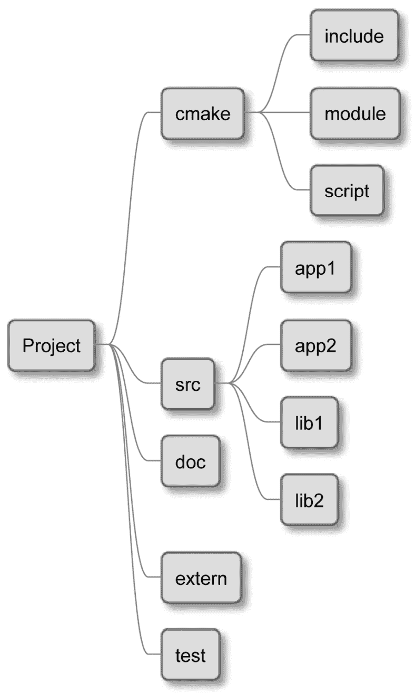
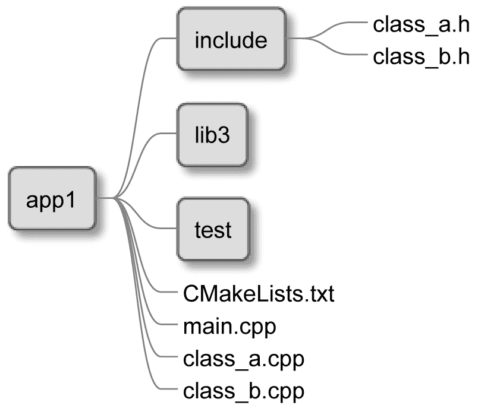
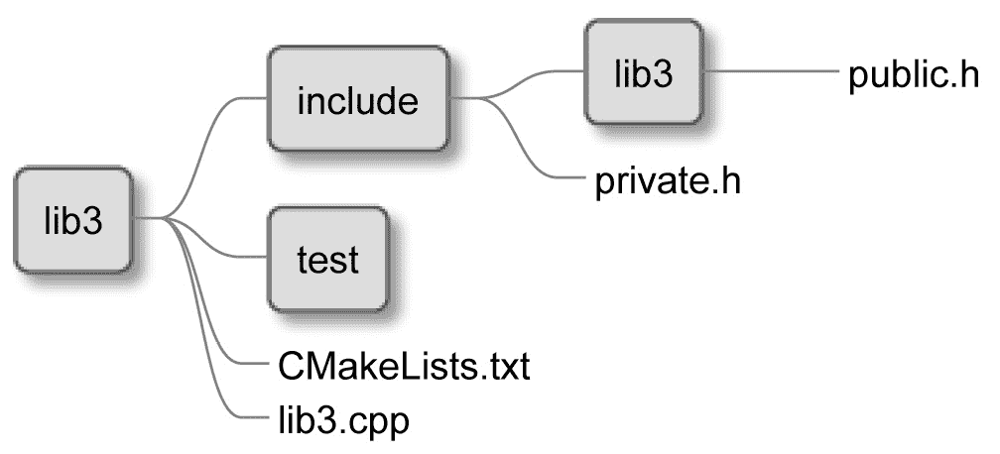
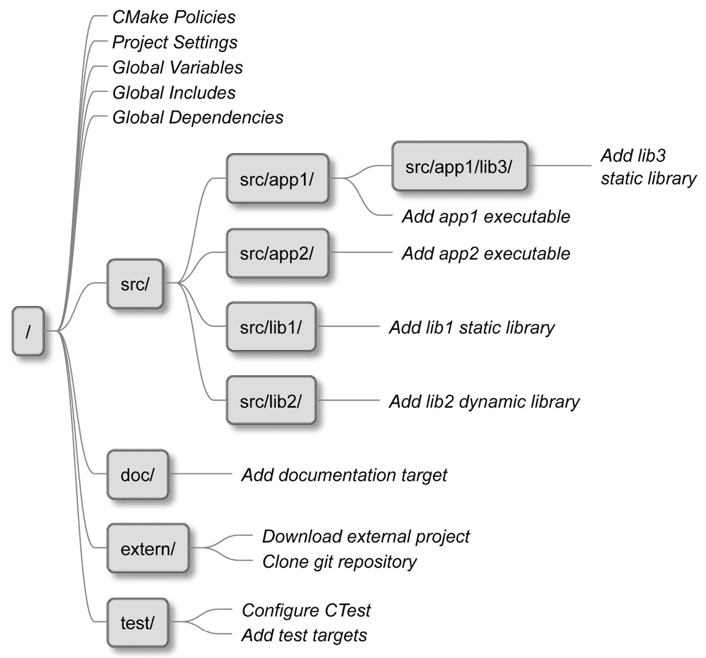
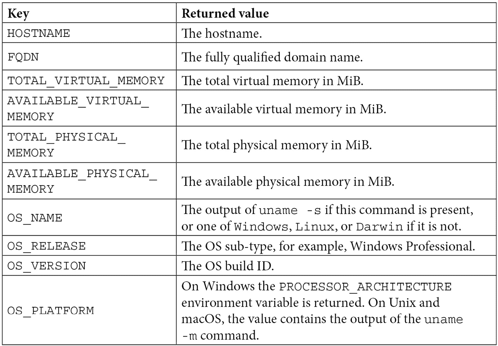
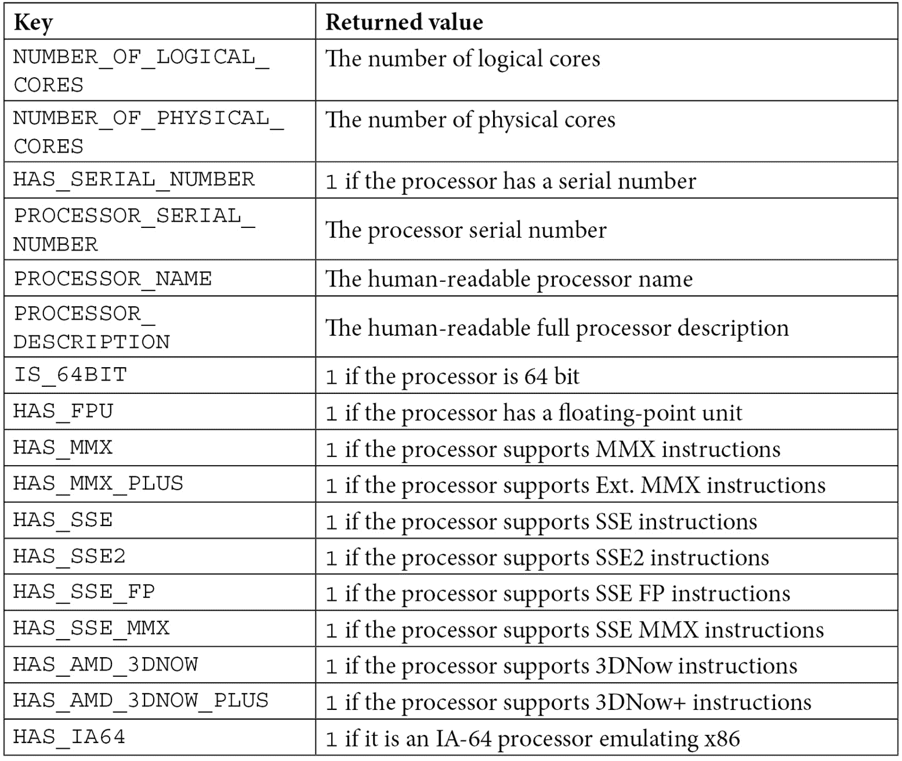

# 第三章：设置你的第一个 CMake 项目

现在我们已经收集了足够的信息，可以开始讨论 CMake 的核心功能：*构建项目*。在 CMake 中，一个**项目**包含管理将我们的解决方案带入生活的所有源文件和配置。配置从执行所有检查开始：目标平台是否受支持，是否拥有所有必要的依赖项和工具，以及提供的编译器是否工作并支持所需功能。

完成后，CMake 将为我们的选择构建工具生成一个构建系统并运行它。源文件将与彼此以及它们的依赖项编译和链接，以产生输出工件。

项目可以由一组开发人员内部使用，产生用户可以通过包管理器在其系统上安装的包，或者它们可以用来提供单执行文件安装器。项目还可以在开源存储库中分享，以便用户可以使用 CMake 在他们的机器上编译项目并直接安装它们。

充分利用 CMake 项目将改善开发体验和生成代码的质量，因为我们可以自动化许多单调的任务，例如在构建后运行测试，检查代码覆盖率，格式化代码，以及使用 linters 和其他工具检查源代码。

为了充分发挥 CMake 项目的力量，我们首先要了解一些关键决策——这些决策是如何正确配置整个项目以及如何划分项目和设置源代码树，以便所有文件都整齐地组织在正确的目录中。

然后，我们将学习如何查询项目构建的环境——例如，它的架构是什么？有哪些工具可用？它们支持哪些功能？并使用的是哪种语言标准？最后，我们将学习如何编译一个测试**C++**文件，以验证所选编译器是否满足我们项目中设定的标准要求。

在本章中，我们将涵盖以下主要主题：

+   基本指令和命令

+   如何划分你的项目

+   思考项目结构

+   作用域环境

+   配置工具链

+   禁用源代码内构建

# 技术要求

你可以在 GitHub 上找到本章中出现的代码文件：[`github.com/PacktPublishing/Modern-CMake-for-Cpp/tree/main/examples/chapter03`](https://github.com/PacktPublishing/Modern-CMake-for-Cpp/tree/main/examples/chapter03)。

要构建本书提供的示例，始终使用推荐命令：

```cpp
cmake -B <build tree> -S <source tree>
cmake --build <build tree>
```

务必将占位符`<build tree>`和`<source tree>`替换为合适的路径。作为提醒：**build tree**是目标/输出目录的路径，**source tree**是源代码所在的路径。

# 基本指令和命令

在*第一章**，*CMake 的初步步骤*中，我们已经看了一个简单的项目定义。让我们回顾一下。这是一个包含`CMakeLists.txt`文件的目录，其中包含了几条配置语言处理器的命令：

chapter01/01-hello/CMakeLists.txt：CMake 语言中的 Hello world

```cpp
cmake_minimum_required(VERSION 3.20)
project(Hello)
add_executable(Hello hello.cpp)
```

在同一章节中，在*项目文件*部分，我们了解了一些基本命令。让我们深入解释一下。

## 指定最小的 CMake 版本——cmake_minimum_required()

这并不是一个严格的项目特定命令，因为它也应该用于脚本，但我们在这里重复它是因为它非常重要。正如你所知，`cmake_minimum_required()`将检查系统是否有正确的 CMake 版本，但隐式地，它还会调用另一个命令，`cmake_policy(VERSION)`，这将告诉 CMake 对于这个项目应该使用哪些正确的策略。这些策略是什么？

在 CMake 发展的过去 20 年中，随着 CMake 及其支持的语言的发展，命令的行为发生了许多变化。为了保持语法简洁明了，CMake 团队决定引入策略来反映这些变化。每当引入一个向后不兼容的更改时，它都会附带一个策略，启用新的行为。

通过调用`cmake_minimum_required()`，我们告诉 CMake 需要应用到提供参数中的版本的策略。当 CMake 通过新的策略升级时，我们不需要担心它们会破坏我们的项目，因为新策略不会被启用。如果我们用最新版本测试项目并且结果令我们满意，我们可以把更新后的项目发送给我们的用户。

策略可以影响 CMake 的每一个方面，包括其他重要命令如`project()`。因此，很重要的一点是，你要在`CMakeLists.txt`文件开始时设定你正在使用的版本。否则，你会收到警告和错误。

每个版本都引入了许多策略——除非你正在将旧项目升级到最新的 CMake 版本遇到问题，否则描述它们并没有真正的价值。在这种情况下，请参考官方文档中的策略：[`cmake.org/cmake/help/latest/manual/cmake-policies.7.html`](https://cmake.org/cmake/help/latest/manual/cmake-policies.7.html)。

## 定义语言和元数据——project()

从技术上讲，CMake 不需要`project()`命令。任何包含`CMakeLists.txt`文件的目录都会以项目模式被解析。CMake 隐式地在文件顶部添加了这个命令。但我们已经知道我们需要首先指定最小版本，所以最好不要忘记调用`project()`。我们可以使用它的两种形式之一：

```cpp
project(<PROJECT-NAME> [<language-name>...])
project(<PROJECT-NAME>
        [VERSION <major>[.<minor>[.<patch>[.<tweak>]]]]
        [DESCRIPTION <project-description-string>]
        [HOMEPAGE_URL <url-string>]
        [LANGUAGES <language-name>...])
```

我们需要指定`<PROJECT-NAME>`，但其他参数是可选的。调用这个命令将隐式地设置以下变量：

+   `PROJECT_NAME`

+   `CMAKE_PROJECT_NAME`（仅在最顶层的`CMakeLists.txt`中）

+   `PROJECT_SOURCE_DIR`、`<PROJECT-NAME>_SOURCE_DIR`

+   `PROJECT_BINARY_DIR`、`<PROJECT-NAME>_BINARY_DIR`

支持哪些语言？很多。以下是您可以用来配置项目的语言关键词列表：`C`、`CXX`（C++）、`CUDA`、`OBJC`（Objective-C）、`OBJCXX`（Objective C++）、`Fortran`、`ISPC`、`ASM`，以及`CSharp`（C#）和`Java`。

CMake 默认支持 C 和 C++，所以您可能只想明确指定`CXX`用于您的 C++项目。为什么？`project()`命令将检测和测试您选择的可用编译器，所以选择正确的编译器将使您在配置阶段节省时间，通过跳过任何对未使用语言的检查。

指定`VERSION`将使以下变量可用：

+   `PROJECT_VERSION`、`<PROJECT-NAME>_VERSION`

+   `CMAKE_PROJECT_VERSION`（仅在顶级`CMakeLists.txt`中）

+   `PROJECT_VERSION_MAJOR`、`<PROJECT-NAME>_VERSION_MAJOR`

+   `PROJECT_VERSION_MINOR`、`<PROJECT-NAME>_VERSION_MINOR`

+   `PROJECT_VERSION_PATCH`、`<PROJECT-NAME>_VERSION_PATCH`

+   `PROJECT_VERSION_TWEAK`、`<PROJECT-NAME>_VERSION_TWEAK`

这些变量将有助于配置软件包，或将版本传递给编译文件，以便在最终可执行文件中可用。

遵循这一原则，我们可以设置`DESCRIPTION`和`HOMEPAGE_URL`，这将以相同的方式设置变量。

CMake 还允许通过`enable_language(<lang>)`指定使用的语言，这将不会创建任何元数据变量。

这些命令将允许我们创建一个基本的列表文件并初始化一个空项目。现在，我们可以开始添加东西来构建。对于迄今为止我们所用的例子中的微小单文件项目，结构确实不太重要。但是当代码量增加时会发生什么？

# 划分您的项目

随着我们的解决方案在行数和文件数量上的增长，我们逐渐意识到不可避免的事情即将发生：要么我们开始分区项目，要么我们淹没在代码行和众多文件中。我们可以用两种方法来解决这个问题：通过分区 CMake 代码，或将源文件移动到子目录中。在这两种情况下，我们都旨在遵循一个称为**关注点分离**的设计原则。简单来说，就是将代码分成块，将具有紧密相关功能的代码分组，同时将其他代码片段解耦，以创建强大的边界。

在第一章《CMake 的初步步骤》中讨论列表文件时，我们稍微提到了分区 CMake 代码。我们讨论了`include()`命令，该命令允许 CMake 执行来自外部文件的代码。调用`include()`不会引入任何未在文件中定义的作用域或隔离（如果包含的文件包含函数，那么在调用时它们的作用域将会被正确处理）。

这种方法有助于关注点的分离，但效果有限——专用代码被提取到单独的文件中，甚至可以跨不相关的项目共享，但如果作者不小心，它仍然可能会用其内部逻辑污染全局变量作用域。编程中的一个古老真理是，*即使是最糟糕的机制也比最好的意图好*。我们将在后面学习如何解决这个问题，但现在，让我们将重点转移到源代码上。

让我们考虑一个支持小型汽车租赁公司的软件示例——它将有很多源文件，定义软件的不同方面：管理客户、车辆、停车位、长期合同、维护记录、员工记录等等。如果我们把这些文件都放在一个单一的目录中，找到任何东西都将是一场噩梦。因此，我们在项目的主目录中创建多个目录，并将相关文件移入其中。我们的`CMakeLists.txt`文件可能看起来像这样：

第三章/01-partition/CMakeLists.txt

```cpp
cmake_minimum_required(VERSION 3.20.0)
project(Rental CXX)
add_executable(Rental
               main.cpp
               cars/car.cpp  
               # more files in other directories 
)
```

这很好，但正如您所看到的，我们仍然在顶层文件中包含了嵌套目录的源文件列表！为了增加关注点的分离，我们可以将源文件列表放在另一个列表文件中，并使用前述的`include()`命令和`cars_sources`变量，像这样：

第三章/02-include/CMakeLists.txt

```cpp
cmake_minimum_required(VERSION 3.20.0)
project(Rental CXX)
include(cars/cars.cmake)
add_executable(Rental
               main.cpp
               ${cars_sources}
               # ${more variables}
)
```

新的嵌套列表文件将包含以下源文件：

第三章/02-include/cars/cars.cmake

```cpp
set(cars_sources
    cars/car.cpp
#   cars/car_maintenance.cpp
)
```

CMake 将有效地在`add_executable`相同的范围内设置`cars_sources`，用所有文件填充该变量。这个解决方案可行，但它有几个缺点：

+   **嵌套目录中的变量将污染顶层作用域（反之亦然）**：

在简单的示例中这不是问题，但在更复杂的多级树结构中，存在多个变量在过程中使用，它可能很快变得难以调试。

+   **所有目录将共享相同的配置**：

这个问题在项目随时间成熟的过程中显示了其真实面目。由于没有任何粒度，我们必须对每个翻译单元一视同仁，无法指定不同的编译标志，为代码的某些部分选择更新的语言版本，以及在代码的特定区域静默警告。一切都是全局的，这意味着我们需要同时对所有源文件引入更改。

+   **存在共享编译触发器**：

配置的任何更改都意味着所有文件都将需要重新编译，即使更改对其中一些文件来说毫无意义。

+   **所有路径都是相对于顶层而言的**：

请注意，在`cars.cmake`中，我们不得不提供`cars/car.cpp`文件的全路径。这导致很多重复的文本破坏了可读性，违反了**不要重复自己**（**DRY**）的清洁编码原则。重命名目录将是一场斗争。

另一种方法是使用`add_subdirectory()`命令，它引入了变量作用域等。让我们来看看。

## 作用域子目录

常见的做法是按照文件系统的自然结构来组织项目，其中嵌套目录表示应用程序的离散元素：业务逻辑、GUI、API 和报告，最后，单独的目录包含测试、外部依赖、脚本和文档。为了支持这个概念，CMake 提供了以下命令：

```cpp
add_subdirectory(source_dir [binary_dir]
  [EXCLUDE_FROM_ALL])
```

如前所述，这将为我们的构建添加一个源目录。可选地，我们可以提供一个路径，其中将生成文件（`binary_dir`）。`EXCLUDE_FROM_ALL`关键字将禁用子目录中定义的目标的默认构建（我们将在下一章讨论*目标*）。这对于分离不需要核心功能的项目的部分（例如*示例*和*扩展*）可能很有用。

此命令将在`source_dir`路径（相对于当前目录评估）中寻找一个`CMakeLists.txt`文件。然后在该目录作用域中解析该文件，意味着前面方法中提到的所有缺陷都不存在：

+   变量更改被限制在嵌套作用域内。

+   您可以自由地以任何喜欢的方式配置嵌套的艺术品。

+   更改嵌套的`CMakeLists.txt`文件不需要构建无关的目标。

+   路径仅限于目录本地，如果需要，它们甚至可以添加到父级*包含路径*中。

让我们来看一个使用`add_subdirectory()`的项目：

```cpp
chapter03/03-add_subdirectory# tree -A
.
├── CMakeLists.txt
├── cars
│   ├── CMakeLists.txt
│   ├── car.cpp
│   └── car.h
└── main.cpp
```

这里，我们有两个`CMakeLists.txt`文件。顶层文件将使用嵌套目录`cars`：

chapter03/02-add_subdirectory/CMakeLists.txt

```cpp
cmake_minimum_required(VERSION 3.20.0)
project(Rental CXX)
add_executable(Rental main.cpp)
add_subdirectory(cars)
target_link_libraries(Rental PRIVATE cars)
```

最后一行用于将来自`cars`目录的艺术品链接到`Rental`可执行文件。这是一个目标特定的命令，我们将在下一章深入讨论。让我们看看嵌套列表文件看起来如何：

chapter03/02-add_subdirectory/cars/CMakeLists.txt

```cpp
add_library(cars OBJECT
    car.cpp
#   car_maintenance.cpp
)
target_include_directories(cars PUBLIC .)
```

正如你所看到的，我使用`add_library()`来生成一个全局可见的目标`cars`，并使用`target_include_directories()`将其添加到其公共*包含目录*中。这允许`main.cpp`不提供相对路径即可包含`cars.h`文件：

```cpp
#include "car.h"
```

我们可以在嵌套列表文件中看到`add_library()`命令，所以我们是在这个例子中开始使用库了吗？实际上，不是。由于我们使用了`OBJECT`关键字，我们表明我们只对生成*对象文件*感兴趣（与上一个例子完全一样）。我们只是将它们分组在一个逻辑目标（`cars`）下。您可能已经对*目标*有一个大致的了解。暂时保留那个想法——我们马上就会讨论到。

## 嵌套项目

在上一节中，我们简要提到了 `add_subdirectory()` 命令中使用的 `EXCLUDE_FROM_ALL` 参数。CMake 文档建议，如果我们有这样的部分存在于源树中，它们在自己的 `CMakeLists.txt` 文件中应该有自己的 `project()` 命令，这样它们就可以生成自己的构建系统，并且可以独立构建。

还有其他哪些场景会用到这个功能呢？当然。例如，一个场景是当你在一个 **CI**/**CD** 管道中构建多个 C++ 项目（也许是在构建框架或一系列库时）。另一种情况可能是，你可能正在从遗留解决方案（如 GNU Make）中移植构建系统，该解决方案使用普通的 **makefiles**。在这种情况下，你可能需要一个选项，逐步将事物分解成更独立的单元——可能要把它们放在单独的构建管道中，或者只是为了在一个更小的范围内工作，这可以被如 **CLion** 这样的 IDE 加载。

你可以通过在嵌套目录中的 listfile 添加 `project()` 命令来实现。只是不要忘记用 `cmake_minimum_required()` 它前缀。

由于支持项目嵌套，我们能否 somehow 连接并排构建的相关项目？

## 外部项目

技术上可以从一个项目到达另一个项目，CMake 也在一定程度上支持这一点。甚至还有一个 `load_cache()` 命令，允许你从另一个项目的缓存中加载值。话说回来，这并不是一个常规或推荐的使用场景，它会导致循环依赖和项目耦合的问题。最好避免使用这个命令，并做出决定：我们的相关项目应该嵌套、通过库连接，还是合并成一个项目？

这些是我们可用的分区工具：*包括 listfiles*、*添加子目录*和*嵌套项目*。但我们应该如何使用它们，使我们的项目保持可维护性、易于导航和扩展？为了实现这一点，我们需要一个定义良好的项目结构。

# 思考项目结构

众所周知，随着项目增长，在 listfiles 和源代码中找到东西变得越来越难。因此，从一开始就保持项目卫生非常重要。

想象一个场景，你需要交付一些重要、时间敏感的更改，它们不适合你的项目中的两个目录之一。现在，你需要快速推送一个 *cleanup commit* ，引入更多的目录和另一层文件层次结构，以便你的更改有一个好的地方放置。或者（更糟糕的是），你决定只是把它们推到任何地方，并创建一个票证稍后处理问题。

在整个一年中，这些工单积累，技术债务增长，维护代码的成本也在增加。当需要快速修复现场系统的严重错误，且不熟悉代码库的人需要引入他们的更改时，这变得极其麻烦。

所以，我们需要一个好的项目结构。但这意味着什么？我们可以从软件开发的其他领域（例如，系统设计）借鉴几条规则。项目应该具有以下特征：

+   它应该易于导航和扩展。

+   它应该是自包含的——例如，项目特定的文件应该在项目目录中，而不应该在其他地方。

+   抽象层次应该通过可执行文件和二进制文件来表达。

没有一种单一公认的解决方案，但在网上可用的众多项目结构模板中，我建议遵循这个模板，因为它简单且非常可扩展：



图 3.1 – 项目结构示例

这个项目概述了以下组件的目录结构：

+   `cmake`：包括宏和函数、find_modules 以及一次性脚本

+   `src`：将存储我们的二进制文件和库的源代码

+   `doc`：用于构建文档

+   `extern`：我们从中源代码构建的外部项目的配置

+   `test`：包含自动化测试的代码

在这种结构中，`CMakeLists.txt` 文件应该存在于以下目录中：顶级项目目录、`src`、`doc`、`extern` 和 `test`。主列表文件不应该声明任何自身的构建步骤，而是应该使用 `add_subdirectory()` 命令来执行嵌套目录中的所有列表文件。如果有需要，这些还可以将这项工作委托给更深层次的目录。

注意

一些开发者建议将可执行文件与库分开，创建两个顶级目录（`src` 和 `lib`），而不是一个。CMake 将这两种工件同等对待，在这种层次上进行分离并不真正重要。

在 `src` 目录中有多个目录对于大型项目来说非常有用。但如果你只是构建一个可执行文件或库，你可以跳过它们，并将源文件直接存储在 `src` 中。无论如何，记得在那里添加一个 `CMakeLists.txt` 文件，并执行任何嵌套的列表文件。

你的目标文件树可能看起来是这样的：



图 3.2 – 可执行文件的目录结构

我们在`app1`目录的根目录中看到一个`CMakeLists.txt`文件——它将配置关键的项目设置并包括嵌套目录中的所有列表文件。`src`目录包含另一个`CMakeLists.txt`文件以及`.cpp`实现文件：两个类和带有可执行程序入口点的主文件。`CMakeLists.txt`文件应该定义一个目标，使用这些源文件构建一个可执行文件——我们将在下一章学习如何做到这一点。

我们的头文件放在`include`目录中——这些文件被`.cpp`实现文件用来声明来自其他 C++翻译单元的符号。

我们有一个`test`目录来存储自动化测试的源代码，我们还有`lib3`，它包含了一个只针对这个可执行文件的库（项目其他地方使用的库或导出到项目外的库应该放在`src`目录中）。

这个结构非常具有表现力，并允许项目的许多扩展。随着我们不断添加更多的类，我们可以很容易地将它们分组到库中，以加快编译过程。让我们看看库的样子：



](img/Figure_3.4.jpg)

图 3.3 – 库的目录结构

结果证明，库遵循与可执行文件相同的结构，只有一个小的区别：在`include`目录中有一个可选的`lib3`目录。只有当我们从项目中外部使用库时，这个目录才应该存在。它提供了其他项目在编译时将消耗的公共头文件。我们将在第五章*，*使用 CMake 编译 C++源代码*中回到这个主题，构建我们自己的库。

所以，我们已经讨论了文件是如何布局在目录结构中的。现在，是时候看看单独的`CMakeFiles.txt`文件是如何组合成一个项目的，以及它们在大场景中的作用。



图 3.4 – CMake 如何将列表文件合并到一个项目中

在*图 3.4*中，每个框代表了一个位于特定目录中的`CMakeLists.txt`文件列表，而草体字中的标签代表了每个文件执行的动作（从上到下）。让我们从 CMake 的角度再次分析这个项目：

1.  执行从项目的根开始——也就是说，从源树中的一个列表文件开始。这个文件将设置所需的最小 CMake 版本和相应的策略，设置项目名称，支持的语言，全局变量，并包括来自`cmake`目录的文件，以便它们的内容在全局范围内可用。

1.  下一步是进入`src`目录的作用域，通过调用`add_subdirectory(src bin)`命令（我们想将编译后的工件放在`<binary_tree>/bin`中，而不是`<binary_tree>/src`）。

1.  CMake 读取 `src/CMakeLists.txt` 文件并发现它的唯一目的是添加四个嵌套子目录：`app1`、`app2`、`lib1` 和 `lib2`。

1.  CMake 进入了 `app1` 的变量作用域，并了解了一个嵌套库 `lib3`，该库拥有自己的 `CMakeLists.txt` 文件；然后进入了 `lib3` 的作用域。

1.  `lib3` 库添加了一个与名称相同的静态库目标。CMake 返回 `app1` 的父作用域。

1.  `app1` 子目录添加了一个依赖于 `lib3` 的可执行文件。CMake 返回 `src` 的父作用域。

1.  CMake 将继续进入剩余的嵌套作用域并执行它们的列表文件，直到所有 `add_subdirectory()` 调用完成。

1.  CMake 返回顶层作用域并执行剩余的三个命令：`add_subdirectory(doc)`、`add_subdirectory(extern)` 和 `add_subdirectory(test)`。每次，CMake 进入新的作用域并从相应的列表文件中执行命令。

1.  所有目标都被收集并检查其正确性。CMake 现在拥有生成构建系统的所有必要信息。

我们需要记住，前面的步骤是按照我们编写命令的准确顺序发生的。有时这很重要，而其他时候，则不那么重要。我们在下一章解决这个问题。

所以，创建包含项目所有元素的目录的正确时机是什么时候呢？我们应该从一开始就创建未来所需的一切并保持目录空空如也，还是等到我们实际上需要放入其自己类别的文件时再做呢？这是一个选择——我们可以遵循极端编程规则 **YAGNI**（**你不需要它**），或者我们可以尝试使我们的项目具有未来性，并为即将到来的新开发者打下良好的基础。

尝试在這些方法之间寻求良好的平衡——如果你怀疑你的项目可能有一天需要一个 `extern` 目录，那么添加它（你可能需要创建一个空白的 `.keep` 文件以将目录检入仓库）。为了帮助其他人知道将他们的外部依赖项放在哪里，创建一个 `readme` 文件，为未来踏上这条道路的 less 经验丰富的程序员铺平道路。你自己可能已经注意到了这一点：开发者不愿意创建目录，尤其是在项目的根目录中。如果我们提供一个好的项目结构，人们倾向于遵循它。

一些项目可以在几乎所有的环境中构建，而其他项目则非常关注它们的特定环境。顶层列表文件是评估如何进行项目的最佳位置，取决于有什么可用。让我们来看看如何做到这一点。

# 环境作用域

CMake 提供了多种查询环境的方法，使用`CMAKE_`变量、`ENV`变量和特殊命令。例如，收集的信息可以用来支持跨平台脚本。这些机制允许我们避免使用可能不易移植或在不同环境中命名不同的平台特定 shell 命令。

对于性能关键的应用程序，了解目标平台的所有特性（例如，指令集、CPU 核心数等）将很有用。然后可以将这些信息传递给编译后的二进制文件，以便它们可以被完美地调整（我们将在下一章学习如何做到这一点）。看看 CMake 中 native 提供了哪些信息。

## 发现操作系统

有许多场合知道目标操作系统是有用的。即使是像文件系统这样平凡的东西，在 Windows 和 Unix 之间也有很大的不同，比如大小写敏感性、文件路径结构、扩展名的存在、权限等。在一个系统上大多数命令在另一个系统上可能不可用，或者它们可能命名不同（即使只是一个字母——例如，`ifconfig`和`ipconfig`命令）。

如果你需要用一个 CMake 脚本支持多个目标操作系统，只需检查`CMAKE_SYSTEM_NAME`变量，以便你可以相应地采取行动。这是一个简单的例子：

```cpp
if(CMAKE_SYSTEM_NAME STREQUAL "Linux")
  message(STATUS "Doing things the usual way")
elseif(CMAKE_SYSTEM_NAME STREQUAL "Darwin")
  message(STATUS "Thinking differently")
elseif(CMAKE_SYSTEM_NAME STREQUAL "Windows")
  message(STATUS "I'm supported here too.")
elseif(CMAKE_SYSTEM_NAME STREQUAL "AIX")
  message(STATUS "I buy mainframes.")
else()
  message(STATUS "This is ${CMAKE_SYSTEM_NAME} speaking.")
endif()
```

如果需要，有一个包含操作系统版本的变量：`CMAKE_SYSTEM_VERSION`。然而，我的建议是尽量使你的解决方案尽可能系统无关，并使用内置的 CMake 跨平台功能。特别是在操作文件系统时，你应该使用*附录*部分描述的`file()`命令。

## 交叉编译——什么是宿主和目标系统？

在一台机器上编译代码，然后在另一台机器上运行，这被称为*交叉编译*。你可以（使用正确的工具集）在 Windows 机器上运行 CMake 来为 Android 编译应用程序。交叉编译不在本书的范围内，但了解它如何影响 CMake 的某些部分是非常重要的。

允许交叉编译的必要步骤之一是将`CMAKE_SYSTEM_NAME`和`CMAKE_SYSTEM_VERSION`变量设置为目标操作系统（CMake 文档中将其称为**目标系统**）的适当值。用于执行构建的操作系统称为**宿主系统**。

无论配置如何，宿主系统上的信息总是可以通过带有`HOST`关键词的变量访问：`CMAKE_HOST_SYSTEM`、`CMAKE_HOST_SYSTEM_NAME`、`CMAKE_HOST_SYSTEM_PROCESSOR`和`CMAKE_HOST_SYSTEM_VERSION`。

还有一些变量在其名称中带有`HOST`关键字，所以只需记住它们明确地引用了宿主系统。否则，所有变量都引用目标系统（通常是宿主系统，除非我们进行交叉编译）。

如果你对交叉编译感兴趣，我建议参考 CMake 文档在[`cmake.org/cmake/help/latest/manual/cmake-toolchains.7.html`](https://cmake.org/cmake/help/latest/manual/cmake-toolchains.7.html)。

## 缩写变量

CMake 将预定义一些变量，提供关于宿主和目标系统的信息。如果使用特定的系统，相应的变量将被设置为非假值（即`1`或`true`）：

+   `ANDROID`, `APPLE`, `CYGWIN`, `UNIX`, `IOS`, `WIN32`, `WINCE`, `WINDOWS_PHONE`

+   `CMAKE_HOST_APPLE`, `CMAKE_HOST_SOLARIS`, `CMAKE_HOST_UNIX`, `CMAKE_HOST_WIN32`

`WIN32`和`CMAKE_HOST_WIN32`变量对于 32 位和 64 位的 Windows 和 MSYS 版本以及为了遗留原因而保持为真。另外，`UNIX`对于 Linux、macOS 和 Cygwin 也为真。

## 宿主系统信息

CMake 可以提供更多的变量，但为了节省时间，它不查询环境中的罕见信息，例如*处理器是否支持 MMX*或*总物理内存是多少*。这并不意味着这些信息不可用——你只需要通过以下命令显式地请求它：

`cmake_host_system_information(RESULT <VARIABLE> QUERY <KEY>…)`

我们需要提供一个目标变量和我们要关注的键列表。如果我们只提供一个键，变量将包含一个值；否则，它将是一组值。我们可以询问许多关于环境和操作系统的详细信息：



如果需要，我们甚至可以查询处理器特定信息：



## 平台是否有 32 位或 64 位架构？

在 64 位架构中，内存地址、处理器寄存器、处理器指令、地址总线和数据总线都是 64 位的。虽然这是一个简化的定义，但它给出了 64 位平台与 32 位平台有何不同的粗略概念。

在 C++中，不同的架构意味着一些基本数据类型（`int`和`long`）和指针有不同的位宽。CMake 利用指针大小来收集目标机器的信息。通过`CMAKE_SIZEOF_VOID_P`变量可获得此信息，对于 64 位该值为`8`（因为指针是 8 字节宽）和对于 32 位该值为`4`（4 字节）：

```cpp
if(CMAKE_SIZEOF_VOID_P EQUAL 8)
  message(STATUS "Target is 64 bits")
endif()
```

## 系统的字节序是什么？

架构可以是**大端**或**小端**。**字节序**是数据字中的字节顺序或处理器的自然数据单位。一个大端系统将最高有效字节存储在最低的内存地址，最低有效字节存储在最高的内存地址。一个小端系统与此相反。

在大多数情况下，字节顺序不影响，但当你编写需要可移植的位操作代码时，CMake 将提供 `BIG_ENDIAN` 或 `LITTLE_ENDIAN` 值，存储在 `CMAKE_<LANG>_BYTE_ORDER` 变量中，其中 `<LANG>` 是 `C`、`CXX`、`OBJC` 或 `CUDA`。

现在我们已经知道如何查询环境，让我们将重点转移到项目的主要设置上。

# 配置工具链

对于 CMake 项目，工具链包括构建和运行应用程序的所有工具——例如，工作环境、生成器、CMake 执行文件本身以及编译器。

想象一下一个经验较少的使用者在构建过程中遇到一些神秘的编译和语法错误时会感到怎样。他们不得不深入源代码试图了解发生了什么。经过一个小时的调试后，他们发现正确的解决方案是更新他们的编译器。我们能否为用户提供更好的体验，并在开始构建前检查编译器中是否包含了所有必需的功能？

当然！有方法可以指定这些要求。如果工具链不支持所有必需的功能，CMake 将提前停止并显示发生了什么清晰的消息，要求用户介入。

## 设置 C++ 标准

我们可能首先想要做的是设置编译器需要支持的 C++ 标准，如果用户想要构建我们的项目的话。对于新项目，这至少应该是 **C++14**，但最好是 **C++17** 或 **C++20**。CMake 还支持将标准设置为实验性的 **C++23**，但那只是一个草案版本。

注意

自 **C++11** 正式发布以来已经过去了 10 年，它不再被认为是*现代 C++ 标准*。除非你的目标环境非常老旧，否则不建议用这个版本开始项目。

坚持旧标准的原因之一是因为你在构建太难升级的遗留目标。然而，C++ 委员会非常努力地保持 C++ 的向后兼容性，在大多数情况下，你将不会有任何问题将标准提升到更高版本。

CMake 支持基于每个目标单独设置标准，这意味着你可以拥有任何粒度。我相信最好让整个项目统一到一个标准上。这可以通过将 `CMAKE_CXX_STANDARD` 变量设置为以下值之一来实现：`98`、`11`、`14`、`17`、`20` 或 `23`（自 CMake 3.20 起）。这将作为所有随后定义的目标的默认值（所以最好在根列表文件的顶部附近设置它）。如果需要，你可以按每个目标单独覆盖它，像这样：

```cpp
set_property(TARGET <target> PROPERTY CXX_STANDARD <standard>)
```

## 坚持标准支持

上文提到的`CXX_STANDARD`属性即使编译器不支持期望的版本——它也被视为一个偏好。CMake 不知道我们的代码实际上是否使用了在之前的编译器中不可用的全新特性，并且它会尝试利用可用的所有内容。

如果我们确信这将不会成功，我们可以设置另一个默认标志（它可以通过与前一个相同的方式覆盖）并明确要求我们目标的标准：

```cpp
set(CMAKE_CXX_STANDARD_REQUIRED ON)
```

在这种情况下，如果最新的编译器不在系统当中（在这个例子中，`GNU GCC 11`），用户将只看到以下消息，并且构建将停止：

```cpp
Target "Standard" requires the language dialect "CXX23" (with compiler extensions), but CMake does not know the compile flags to use to enable it.
```

要求 C++23 可能有点过分，即使在一个现代环境中。但 C++14 应该完全没问题，因为它自 2015 年以来已经在**GCC**/**Clang**中得到全面支持。

## 供应商特定的扩展

根据你在组织中实施的政策，你可能对允许或禁用供应商特定的扩展感兴趣。这些是什么？嗯，我们可以说 C++标准对于一些编译器生产商来说进展得太慢，所以他们决定向语言添加他们自己的增强——如果你喜欢的话，就是*插件*。为了实现这一点，CMake 将把`-std=gnu++14`添加到编译命令行中，而不是`-std=c++14`。

一方面，这可能是想要的，因为它允许一些方便的功能。但另一方面，如果你的代码切换到不同的编译器（或者你的用户这样做！）构建将失败！

这也是一个针对每个目标的属性，其有一个默认变量，`CMAKE_CXX_EXTENSIONS`。CMake 在这里更加宽松，除非我们明确告诉它不要这样做，否则允许扩展：

```cpp
set(CMAKE_CXX_EXTENSIONS OFF)
```

如果可能的话，我建议这样做，因为此选项将坚持拥有与供应商无关的代码。此类代码不会对用户施加任何不必要的要求。类似地，你可以使用`set_property()`按每个目标的基础更改此值。

## 跨过程优化

通常，编译器在单个翻译单元的层面上优化代码，这意味着你的`.cpp`文件将被预处理、编译，然后优化。后来，这些文件将被链接器用来构建单一的二进制文件。现代编译器可以在链接后进行优化（这称为*链接时优化*），以便所有编译单元可以作为一个单一模块进行优化。

如果你的编译器支持跨过程优化，使用它可能是个好主意。我们将采用与之前相同的方法。此设置的默认变量称为`CMAKE_INTERPROCEDURAL_OPTIMIZATION`。但在设置之前，我们需要确保它被支持以避免错误：

```cpp
include(CheckIPOSupported) 
check_ipo_supported(RESULT ipo_supported)
if(ipo_supported)
  set(CMAKE_INTERPROCEDURAL_OPTIMIZATION True)
endif()
```

正如你所见，我们不得不包含一个内置模块来获取`check_ipo_supported()`命令的访问权限。

## 检查支持的编译器功能

如我们之前讨论的，如果我们的构建失败，最好是早点失败，这样我们就可以向用户提供一个清晰的反馈信息。我们特别感兴趣的是衡量哪些 C++特性被支持（以及哪些不被支持）。CMake 将在配置阶段询问编译器，并将可用特性的列表存储在`CMAKE_CXX_COMPILE_FEATURES`变量中。我们可以编写一个非常具体的检查，询问某个特性是否可用：

chapter03/07-features/CMakeLists.txt

```cpp
list(FIND CMAKE_CXX_COMPILE_FEATURES 
  cxx_variable_templates result)
if(result EQUAL -1)
  message(FATAL_ERROR "I really need variable templates.")
endif()
```

正如您可能猜到的，为每个使用特性编写一个测试文件是一项艰巨的任务。即使是 CMake 的作者也建议只检查某些高级*元特性*是否存在：`cxx_std_98`、`cxx_std_11`、`cxx_std_14`、`cxx_std_17`、`cxx_std_20`和`cxx_std_23`。每个*元特性*都表明编译器支持特定的 C++标准。如果您愿意，您可以像前一个示例中那样使用它们。

已知于 CMake 的所有特性的完整列表可以在文档中找到：

[`cmake.org/cmake/help/latest/prop_gbl/CMAKE_CXX_KNOWN_FEATURES.html`](https://cmake.org/cmake/help/latest/prop_gbl/CMAKE_CXX_KNOWN_FEATURES.html)

## 编译测试文件

当我用 GCC 4.7.x 编译一个应用程序时，有一个特别有趣的场景出现在我面前。我已手动在编译器的参考资料中确认了我们使用的所有 C++11 特性都被支持。然而，解决方案仍然无法正确工作。代码默默地忽略了标准`<regex>`头文件的调用。结果证明，GCC 4.7.x 有一个 bug，正则表达式库没有被实现。

没有一个单一的检查能保护你免受此类 bug 的影响，但通过创建一个测试文件，你可以填入所有你想检查的特性，从而有机会减少这种行为。CMake 提供了两个配置时间命令，`try_compile()`和`try_run()`，以验证您需要的所有内容在目标平台上是否支持。

第二个命令给您更多的自由，因为您可以确保代码不仅编译成功，而且执行也正确（您可以潜在地测试`regex`是否工作）。当然，这对于交叉编译场景不起作用（因为主机无法运行为不同目标构建的可执行文件）。只需记住，这个检查的目的是在编译成功时向用户提供一个快速的反馈，所以它并不是用来运行任何单元测试或其他复杂内容的——尽量保持文件尽可能简单。例如，像这样：

chapter03/08-test_run/main.cpp

```cpp
#include <iostream>
int main()
{
  std::cout << "Quick check if things work." << std::endl;
}
```

调用`test_run()`其实并不复杂。我们首先设置所需的标准，然后调用`test_run()`，并将收集的信息打印给用户：

chapter03/08-test_run/CMakeLists.txt

```cpp
set(CMAKE_CXX_STANDARD 20)
set(CMAKE_CXX_STANDARD_REQUIRED ON)
set(CMAKE_CXX_EXTENSIONS OFF)
try_run(run_result compile_result
${CMAKE_BINARY_DIR}/test_output 
        ${CMAKE_SOURCE_DIR}/main.cpp
        RUN_OUTPUT_VARIABLE output)
message("run_result: ${run_result}")
message("compile_result: ${compile_result}")
message("output:\n" ${output})
```

这个命令有很多可选字段需要设置，一开始可能会觉得有点复杂，但当我们阅读并与示例中的调用进行比较时，一切都会变得明朗起来：

```cpp
try_run(<runResultVar> <compileResultVar>
        <bindir> <srcfile> [CMAKE_FLAGS <flags>...]
        [COMPILE_DEFINITIONS <defs>...]
        [LINK_OPTIONS <options>...]
        [LINK_LIBRARIES <libs>...]
        [COMPILE_OUTPUT_VARIABLE <var>]
        [RUN_OUTPUT_VARIABLE <var>]
        [OUTPUT_VARIABLE <var>]
        [WORKING_DIRECTORY <var>]
        [ARGS <args>...])
```

只有几个字段是编译和运行一个非常基础的测试文件所必需的。我还使用了可选的`RUN_OUTPUT_VARIABLE`关键字来收集`stdout`的输出。

下一步是使用我们在实际项目中将要使用的更现代的 C++特性来扩展这个简单的文件——也许通过添加一个可变模板来看目标机器上的编译器是否能消化它。每次我们在实际项目中引入一个新特性，我们可以在测试文件中放入这个特性的微小样本。但请记住——保持简洁。我们希望在最短的时间内检查编译是否成功。

最后，我们可以在条件块中检查收集的输出是否符合我们的期望，当有些不对劲时会打印`message(SEND_ERROR)`。记住`SEND_ERROR`会在配置阶段继续，但不会启动生成。这有助于在放弃构建之前显示所有遇到的错误。

# 禁用源内构建

在第*1*章，《CMake 的初步步骤》中，我们讨论了源内构建，以及建议始终指定为源外构建路径。这不仅允许更干净的构建树和更简单的`.gitignore`文件，而且还减少了你意外覆盖或删除任何源文件的可能性。

在网上搜索解决方案时，你可能会偶然发现一个 StackOverflow 帖子，提出了同样的问题：[`stackoverflow.com/q/1208681/6659218`](https://stackoverflow.com/q/1208681/6659218)。在这里，作者注意到不管你做什么，似乎 CMake 仍然会创建一个`CMakeFiles/`目录和一个`CMakeCache.txt`文件。一些答案建议使用未记录的变量，以确保用户在任何情况下都不能在源目录中写入：

```cpp
# add this options before PROJECT keyword
set(CMAKE_DISABLE_SOURCE_CHANGES ON)
set(CMAKE_DISABLE_IN_SOURCE_BUILD ON)
```

我认为在使用任何软件的未记录功能时要小心，因为它们可能会在没有警告的情况下消失。在 CMake 3.20 中设置前面的变量会导致构建失败，并出现相当丑陋的错误：

```cpp
CMake Error at /opt/cmake/share/cmake-3.20/Modules/CMakeDetermineSystem.cmake:203 (file):
  file attempted to write a file:
  /root/examples/chapter03/09-in-source/CMakeFiles/CMakeOutput.log into a source
  directory.
```

然而，它仍然创建了提到的文件！因此，我的建议是使用更旧的——但完全支持——机制：

chapter03/09-in-source/CMakeLists.txt

```cpp
cmake_minimum_required(VERSION 3.20.0)
project(NoInSource CXX)
if(PROJECT_SOURCE_DIR STREQUAL PROJECT_BINARY_DIR)
  message(FATAL_ERROR "In-source builds are not allowed")
endif()
message("Build successful!")
```

如果 Kitware（CMake 背后的公司）正式支持`CMAKE_DISABLE_SOURCE_CHANGES`或`CMAKE_DISABLE_IN_SOURCE_BUILD`，那么当然，切换到那个解决方案。

# 总结

我们在本章引入了许多有价值的概念，它们将为我们打下坚实的基础，以便我们向前发展并构建坚固、未来 proof 的项目。我们讨论了如何设置最低的 CMake 版本以及如何配置项目的关键方面，即名称、语言和元数据字段。

打下良好的基础将有助于确保我们的项目能够快速成长。这就是我们讨论项目分区的理由。我们分析了使用`include()`的简单代码分区，并将其与`add_subdirectory()`进行了比较。在此过程中，我们了解了管理变量目录作用域的好处，并探讨了使用更简单的路径和增加的模块性的好处。当需要逐步将代码分解为更独立的单元时，创建嵌套项目和分别构建它是非常有用的。

在概览了我们可用的分区机制之后，我们探讨了*如何*使用它们——例如，如何创建透明、有弹性且可扩展的项目结构。具体来说，我们分析了 CMake 如何遍历列表文件以及不同配置步骤的正确顺序。

接下来，我们研究了如何作用域化我们目标和宿主机器的环境，它们之间的区别是什么，以及通过不同的查询可以获取关于平台和系统的哪些信息。

最后，我们发现了如何配置工具链——例如，如何指定所需的 C++版本，如何解决特定编译器扩展的问题，以及如何启用重要的优化。我们最后了解了如何测试我们的编译器所需的特性以及编译测试文件。

虽然从技术上讲，项目所有这些就足够了，但它仍然不是一个非常有用的项目。为了改变这一点，我们需要引入*目标*。到目前为止，我们在这里那里提到了它们，但我试图在我们先了解一些基本概念之前避免这个话题。现在我们已经做到了，我们将详细查看它们。

# 进一步阅读

关于本章涵盖的议题的更多信息，你可以参考以下内容：

+   *关注点分离*：[`nalexn.github.io/separation-of-concerns/`](https://nalexn.github.io/separation-of-concerns/)

+   *CMake 变量完整参考*：[`cmake.org/cmake/help/latest/manual/cmake-variables.7.html`](https://cmake.org/cmake/help/latest/manual/cmake-variables.7.html)

+   *尝试编译和尝试运行的参考*：

    +   [`cmake.org/cmake/help/latest/command/try_compile.html`](https://cmake.org/cmake/help/latest/command/try_compile.html)

    +   [`cmake.org/cmake/help/latest/command/try_run.html`](https://cmake.org/cmake/help/latest/command/try_run.html)
